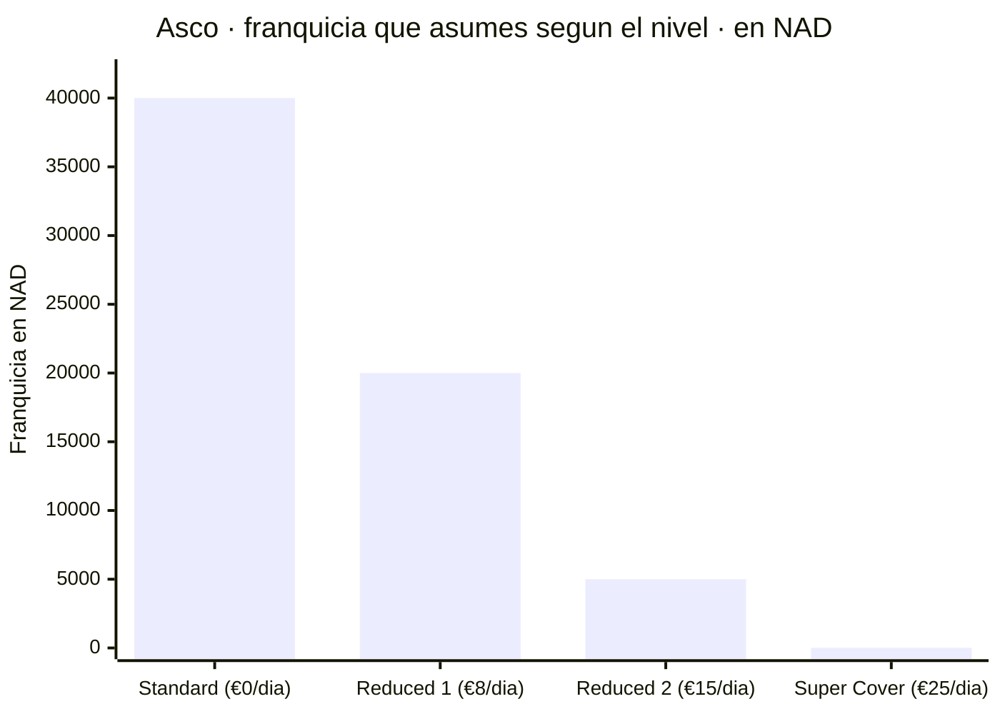
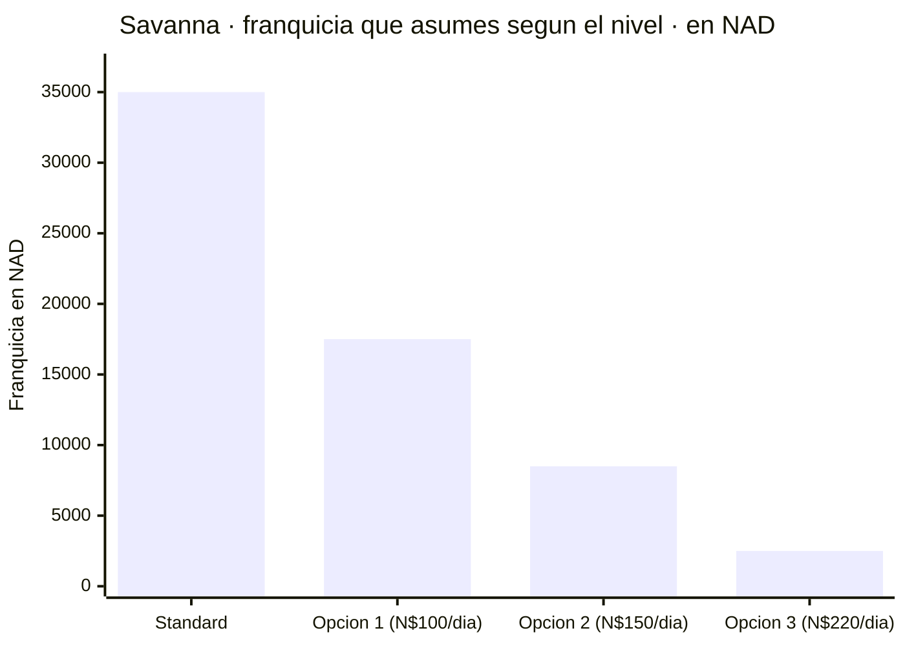
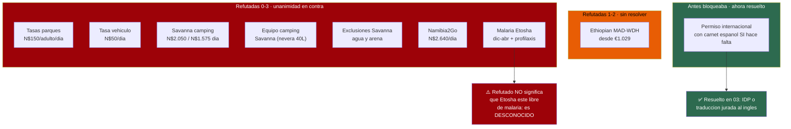

# Namibia 4x4 por libre, oct–dic 2026 — Hallazgos verificados (1ª pasada)

Dos adultos, 14 días, ida y vuelta desde A Coruña. Fecha de investigación: 16/07/2026.

Todo lo de abajo ha superado una verificación adversarial a 3 votos contra fuentes primarias.
Lo **refutado** está al final — varias de esas afirmaciones circulan por toda la web y habrían
costado dinero real.

**Tipo de cambio usado: ~N$20 = €1** (rango observado N$19,5–20,5 = €1, a 16/07/2026).
El importe en la moneda de la fuente es el bueno; la conversión es orientativa.

---

## 1. El precipicio de precio del 14/15 de noviembre — la mayor palanca de coste

Todas las empresas consultadas bajan de temporada alta a baja a mediados de noviembre.
El **mismo Toyota Hilux doble cabina con equipo de camping, 14 días**:

**Tarifa verificada de Asco** (Grupo S, Hilux 2.4l TD 4x4 automático doble cabina, equipado
para camping, 1–2 pax, banda de 6–15 días):

- **Octubre 2026** *(banda 15/08–14/11)* → **€179/día (~N$3.580)**
- **Tras el 15/11/2026** *(banda 15/11–14/03)* → **€117/día (~N$2.340)**

### Cálculo del alquiler para 12, 13 y 14 días

El viaje son 14 días, pero el coche no se necesita todos: los días de vuelo se van en trayecto.
La tarifa/día es **la misma en toda la banda de 6–15 días**, así que solo cambia el número de días.

**Solo alquiler:**

- **12 días** → octubre **€2.148 (~N$42.960)** · tras 15 nov **€1.404 (~N$28.080)**
- **13 días** → octubre **€2.327 (~N$46.540)** · tras 15 nov **€1.521 (~N$30.420)**
- **14 días** → octubre **€2.506 (~N$50.120)** · tras 15 nov **€1.638 (~N$32.760)**

**Alquiler + Super Cover** (€25/día, ~N$500/día — el único seguro que sirve, ver §3):

- **12 días** → octubre **€2.448 (~N$48.960)** · tras 15 nov **€1.704 (~N$34.080)** · ahorro **€744 (~N$14.880)**
- **13 días** → octubre **€2.652 (~N$53.040)** · tras 15 nov **€1.846 (~N$36.920)** · ahorro **€806 (~N$16.120)**
- **14 días** → octubre **€2.856 (~N$57.120)** · tras 15 nov **€1.988 (~N$39.760)** · ahorro **€868 (~N$17.360)**

> ℹ️ **Estos totales son cálculo nuestro**, no cifras publicadas: multiplican las tarifas/día
> verificadas de Asco por los días. Lo verificado es el **€179/día** y el **€117/día**.
> El **Super Cover exige más de 10 días** de alquiler, así que 12, 13 y 14 cumplen (10 no).

**Diferencia a 14 días: ~€870 (~N$17.400).** Namibia2Go confirma el patrón de forma independiente:
su temporada alta acaba el 31/10/2026 (N$3.520/día, ~€176), y baja a N$2.700/día (~€135)
desde el 01/11/2026 — un 23,3 % menos.

Notas:
- La banda posterior al 15/11 de Asco llega hasta el 14/03/2027 y está a un ~6 % del mínimo
  anual de enero.
- En Namibia es habitual **prorratear entre bandas de temporada**: la penalización de octubre
  solo se aplica entera si el viaje cae completo dentro de la banda alta.
- El precipicio existe **porque las condiciones cambian** ese día. La parte ambiental
  (lluvia, calor, avistamientos) **aún no está investigada** — ver huecos al final.

Fuentes:
- https://www.ascocarhire.com/app/web/upload/tinymce-source/Asco-4x4-Car-Hire-Namibia-and-Southern-Africa-2026-Rates.pdf
- https://www.ascocarhire.com/rates-2026.html
- https://namibia2go.com/4x4-camping-equipped-double-cab
- https://namibia2go.com/rack-rates

## 2. El equipo de camping va incluido, no se factura aparte

La tarifa de camping de Asco incluye tienda de techo, nevera, mesas, sillas, ropa de cama,
parrilla, ollas y utensilios **sin línea de alquiler separada**.

La tabla de tarifas lo demuestra: mismo vehículo, misma temporada (15/03–14/07/26, 6–15 días) —
Hilux estándar **€120/día (~N$2.400)** frente a equipado para camping **€127/día (~N$2.540)**.
Esos **€7/día (~N$140)** de diferencia *son* el equipo. En la página del 4x4 estándar no existe
ningún extra de "añadir equipo de camping".

Incluye: IVA del 15 %, CDW, segunda rueda de repuesto, compresor, herramientas de emergencia,
traslados al aeropuerto, un conductor adicional y kilometraje ilimitado.

Excluido en **ambos** escenarios: reducción de franquicia, depósito de reserva no reembolsable
de €250 (~N$5.000), combustible, recogidas fuera de horario/fin de semana/festivo, recargo por
conductor joven, tasas de sentido único y de frontera. En el escenario de camping hay que sumar
aparte las tasas de camping.

- https://www.ascocarhire.com/4x4-with-camping-1-2-persons.html
- https://www.ascocarhire.com/4x4-standard.html

## 3. El riesgo económico real es el seguro, no la tarifa diaria

**Todos los niveles por debajo del más alto excluyen justo los daños que vas a sufrir en pista.**

### Asco (4 niveles)

- **Standard** — €0/día · franquicia **N$40.000 (~€2.000)**
- **Reduced Excess 1** — €8/día (~N$160) · franquicia **N$20.000 (~€1.000)**
- **Reduced Excess 2** — €15/día (~N$300) · franquicia **N$5.000 (~€250)**
- **Super Cover** — **€25/día (~N$500)** · franquicia **N$0**

Literal: *"Reduced Excess 1 and 2 do not cover damages to tires, windows, damages to the
undercarriage of the vehicle, and Single-Vehicle-Accidents"* — el nivel base excluye lo mismo.

**Super Cover** añade cristales, **un (1)** neumático, accidentes sin terceros (excluida la
negligencia) y daños en los bajos *"excluding Kaokoveld and Damaraland Area"* — una exclusión
que afecta directamente a la etapa de Twyfelfontein.

Aviso del propio Asco, que conviene citar: Super Cover *"cannot be compared with the European
Vollkasko or All Risk insurance"* (no es comparable a un todo riesgo europeo).

### Savanna (Hilux/Ranger con camping)

- **Standard** — sin coste · franquicia **N$35.000 (~€1.750)**
- **Opción 1** — N$100/día (~€5) · franquicia **N$17.500 (~€875)**
- **Opción 2** — N$150/día (~€7,5) · franquicia **N$8.500 (~€425)**
- **Opción 3** — N$220/día (~€11) · franquicia **N$2.500 (~€125)**
- **Opción 4** — **N$450/día (~€23)** · franquicia **no publicada** *(no está en el gráfico
  porque Savanna no publica el importe; su página insinúa "reduce the excess to Zero" pero
  no lo confirma — no asumas que Opción 4 = N$2.500)*

La cobertura de neumáticos y parabrisas cuesta **N$250/día (~€12,5) aparte** en Standard y
opciones 1–3; va incluida en la Opción 4. Las opciones 1–4 exigen un alquiler mínimo de 8 días.

**Ojo al límite de neumáticos:** Asco cubre **uno**, Savanna **dos**. Cualquier pinchazo
adicional en 2.500–3.500 km de pista lo pagas tú.

### La trampa del accidente sin terceros
Según las condiciones de Savanna, un vuelco o una pérdida de control sin terceros expone a
**N$165.000 (~€8.250)** más todos los costes de rescate — y **los niveles bajos no lo eliminan**.
Literal: *"Also not when you tried to avoid hitting an animal crossing the road."*

⚠️ Las propias páginas de Savanna **se contradicen** sobre la Opción 4: en un sitio listan
"Vehicle role over/overturning" como cubierto y en otro excluyen los accidentes sin terceros
también de la Opción 4. **Pedir aclaración por escrito antes de reservar.**

- https://www.ascocarhire.com/insurance.html
- https://www.savannacarhire.com.na/reduced-excess-insurance
- https://www.savannacarhire.com.na/rental-conditions

## 4. El límite de 80 km/h en pista se controla con caja negra

Asco impone **80 km/h en todas las pistas de grava** —20 por debajo del límite nacional— y
*"if speed regulations are broken, your insurance and excess will lapse and become invalid."*

Su FAQ desmonta la idea de que sea letra pequeña sin efecto:
*"The cars are equipped with a black box that tracks both speed and location. In the event of
an accident, the data will be read and analyzed."*

Es estándar del sector, no una manía de Asco: Namibia Car Rental impone lo mismo. En foros de
TripAdvisor hay quejas por denegaciones de siniestro basadas en la caja negra, lo que confirma
que se aplica de verdad.

**Consecuencia de planificación:** todos los tiempos de conducción hay que calcularlos a
80 km/h en pista, no a 100. Eso recorta ~20 % la distancia diaria realista frente a la mayoría
de itinerarios que circulan por internet.

- https://www.ascocarhire.com/insurance.html
- https://www.ascocarhire.com/faq.html

## 5. Namibia2Go — mejores condiciones de seguro (confianza media)

Incluye en la tarifa **franquicia cero**, cobertura de neumáticos y cristales, robo y colisión,
y kilometraje ilimitado. Sin depósito. Lo corrobora una agencia independiente (madbookings.com),
así que no es solo autopromoción.

Matices: la franquicia cero se aplica *"unless negligent driving is proven"* — un vuelco en
pista considerado negligente podría generar responsabilidad igualmente. Quedan excluidos el
Water Damage Waiver, las tasas de frontera, las multas y la llamada por pérdida de llaves.

Confianza **media** solo porque mejora tanto a Asco como a Savanna de forma llamativa, y eso
merece escepticismo hasta confirmarlo al reservar.

- https://namibia2go.com/rack-rates
- https://www.madbookings.com/namibia-namibia2go.html

## 6. Visado — los españoles SÍ lo necesitan (desde el 1 de abril de 2025)

- **Tasa: N$1.600 (~€78–82)**, por **e-visa online** (emitido en ~24 h, hay que **imprimirlo y
  firmarlo** delante del funcionario) o visado a la llegada.
- España es uno de los 33 estados afectados. La tasa subió de N$1.200 (~€60) el 01/04/2025.
- El visado a la llegada se **amplió** a 36 países más en septiembre de 2025 — no se está retirando.
- ⚠️ Hay un recargo de **N$2.000 (~€100)** para el visado manual a la llegada aprobado por el
  Consejo de Ministros pero **sin publicar en el boletín**. Volver a comprobarlo cerca de la
  salida. **Mejor el e-visa.**

**También exigen a la entrada:**
- Pasaporte válido **6 meses desde la fecha de regreso**, con **3 páginas en blanco**
- Billete de vuelta o de continuación
- Seguro médico internacional que cubra todos los gastos **incluida la repatriación**
- Prueba de alojamiento
- Prueba de fondos — el MAEC da como referencia **N$1.200 (~€60) por día** ≈ **~N$33.600
  (~€1.680) para dos personas y 14 días** (fuente única y matizada como *"como referencia"*;
  el FCDO británico solo pide "fondos suficientes")

La ficha del MAEC se actualizó el 26/05/2026 — tiene ~7 semanas.

- https://www.exteriores.gob.es/es/ServiciosAlCiudadano/Paginas/Detalle-recomendaciones-de-viaje.aspx?trc=Namibia
- https://www.gov.uk/foreign-travel-advice/namibia/entry-requirements

## 7. Las tasas de parques subieron un 80–100 % el 1 de abril de 2026

**No uses ninguna cifra que encuentres por internet basada en la tabla de 2021.**

- Parques **premium** (Etosha, Namib-Naukluft/Sossusvlei, **Skeleton Coast**, Waterberg y otros;
  la ruta de pago cae ENTERA en premium): **N$150 → ~N$280 (~€14) por adulto extranjero y día**
  (N$140 entrada + N$140 conservación) ◐
- Parques **estándar**: N$100 → N$200 (~€10). Menores de 8 años exentos.
- **Base legal**: Nature Conservation Ordinance de 1975; es la **primera revisión desde 2021** (por eso
  las cifras de blogs viejos están caducadas). ◐

**Mecanismo (citado literal — vía fragmento de búsqueda; el PDF sigue sin poder abrirse, 403):**
*"Fees are valid for 24 hours period beginning at the time of entry, per person, per park... Minimum
amount payable is for 24 hours (1 day), and thereafter in units of 24 hours."* Una estancia de 3 días
en Etosha se cobra **3 veces**.

**Presupuestar: ~N$280 (~€14)/adulto/día + ~N$60 (~€3)/vehículo ≈ N$620 (~€31)/día**
para dos adultos y coche, en cada uno de Etosha, Sossusvlei y Fish River Canyon.

Ambigüedad menor: 24 h desde la entrada frente a la práctica real en la puerta — algunos
operadores cobran por día natural y facturarían 4 unidades por una estancia de 3 noches.

> ⚠️ **Estado de verificación (honesto):** ◐, no ✅. El baremo lo confirman DOS páginas oficiales del
> MEFT (PDF de tarifas + nota de prensa `news/199`) además de secundarias concordantes, **pero ninguna
> se pudo ABRIR** (WebFetch da 403); la extracción viene de fragmentos de búsqueda. **No se localizó
> Government Gazette numerado.** Detalle en `08`. **Confírmalo por email antes de cerrar presupuesto.**

- https://www.meft.gov.na/files/downloads/543_Park%20Entrance%20and%20Conservation%20Fees.PDF
- https://www.meft.gov.na/news/199/Implementation-of-New-Park-Entrance-Fees-and-Conservation-Fee/
- https://namibian.org/blog/namibia-raises-park-fees-by-80-to-100-percent

## 8. Vuelos — poco sólido de momento

Ethiopian Airlines es una opción real de **una sola compañía** Madrid → Windhoek vía Adís Abeba
(los dos tramos en avión de ET), ~13 h de vuelo más escala. Su ruta Adís–Oporto pasa por Madrid,
lo que convierte a **Oporto en una segunda opción servida por ET** desde Galicia.

La afirmación sobre el **precio** (desde €1.029) fue **refutada 1–2** y no es fiable.
Las tarifas siguen en investigación.

---

# ⛔ REFUTADO — no te lo creas

**Refutadas por unanimidad (0–3):**

- **Tasas de parques N$150/adulto/día** (N$100 + N$50) → tabla **obsoleta de 2021**; ahora
  ~N$280 (~€14).
- **Tasa de vehículo N$50/día**; pareja paga N$350/parque/día → superada por la subida de
  abril de 2026.
- **Savanna Hilux camping N$2.050/día alta / N$1.575 baja** → las cifras no se sostienen.
- **Lista del equipo de camping de Savanna** (nevera Engel 40L, etc.) → no verificada tal como
  se afirmaba.
- **Los niveles de Savanna excluyen daños por agua/tormenta de arena** tal como se describía →
  mal formulado; ver §3 para el texto verificado.
- **Namibia2Go temporada baja N$2.640/día** (01/11/25–30/06/26) → **banda caducada**; la tarifa
  aplicable en nov 2026 es N$2.700 (~€135).
- **Malaria en el norte incl. Etosha, dic–abr; profilaxis + fiebre amarilla recomendadas** →
  refutado **tal como se afirmaba**. ⚠️ **Eso no significa que Etosha esté libre de malaria**:
  significa que **no lo sabemos**. Hay que investigarlo antes de reservar.

**Refutadas parcialmente (1–2), sin resolver:**

- **Ethiopian publica MAD–WDH ida y vuelta desde €1.029** → las fechas de muestra eran de
  septiembre de 2026, no de nuestro viaje.

**Resuelto (antes bloqueaba la reserva):**

- **El permiso internacional de conducir** → ✅ **cerrado**. Con un carnet **español** (que no está
  en inglés) **sí hace falta** llevar el permiso internacional de conducir, o una traducción jurada
  al inglés. No es un capricho: lo pide la normativa namibia, la empresa de alquiler y, en caso de
  siniestro, el seguro. Trámite y coste (DGT) en `03-guia-preparacion.md`. Marcado **◐** porque las
  páginas primarias no se pudieron descargar; ver ahí el detalle de evidencia.

---

# 🕳️ Huecos — la segunda pasada YA está cerrada

Esta sección listaba los huecos que en su día quedaron **en blanco a propósito**. La segunda
pasada ha terminado: los cuatro están resueltos en sus propios documentos. Se deja aquí el
registro de qué se cerró y dónde, para poder auditarlo.

1. **Fechas por criterios ambientales** — inicio de las lluvias, calor en Sossusvlei / Fish
   River Canyon / Ai-Ais, afluencia. → **Cerrado** en `08-huecos-cerrados.md`: temperaturas
   reales de NOAA GHCN-Daily y SASSCAL (las anteriores, de webs de safaris, fueron refutadas
   0–3). Etosha **sí** hace pico en octubre; el sur, no. La mitad ambiental de la decisión de
   noviembre ya está sobre la mesa junto a la económica (~€870, ~N$17.400).
2. **Itinerario día a día y viabilidad** — si Etosha + sur profundo + Sossusvlei + costa caben
   en 14 días a 80 km/h en pista. → **Cerrado** en `04-itinerario.md` (veredicto: **NO cabe
   todo**; techo sano ~300–350 km/día) y desarrollado día a día en `11-itinerarios-dia-a-dia.md`.
   La ruta vigente es la **Variante E** (la clásica del norte, sin el sur). La etapa de
   Damaraland sigue con los bajos sin cobertura incluso en el nivel más alto de seguro.
3. **Precios de alojamiento** — campings NWR (Okaukuejo/Halali/Namutoni), Sesriem, Hobas,
   lodges de gama media; y antelación de reserva para oct–dic. → **Cerrado** en
   `02-alojamiento-y-tasas.md` y `08-huecos-cerrados.md`.
4. **Presupuesto total** — → **Cerrado** en `10-presupuesto.md`: ya calculado sobre la
   distancia real de la Variante E y las reservas cerradas (vuelo, coche y seguro).
5. ~~**Permiso internacional de conducir**~~ → **resuelto** (ver arriba y `03`), ~~malaria en
   Etosha~~ → **resuelta** (sí es zona de riesgo, CDC, en `03`), certificado de fiebre
   amarilla al hacer escala en Adís Abeba (Etiopía es endémica), SIM/eSIM, efectivo vs tarjeta,
   seguridad.

## Advertencia sobre la calidad de las fuentes

9 de las 16 afirmaciones verificadas son **tarifas y condiciones autopublicadas por las propias
empresas**. Es la fuente primaria correcta para "cuánto cobra esta empresa / qué dicen sus
condiciones", y varias revelan cosas **en contra de su interés** (responsabilidades, exclusiones,
límites de velocidad), lo que aumenta la confianza. Pero significa que la sección de alquiler
refleja lo que las empresas **prometen**, no lo que **hacen**. En TripAdvisor hay hilos que
documentan descuentos de franquicia disputados.
