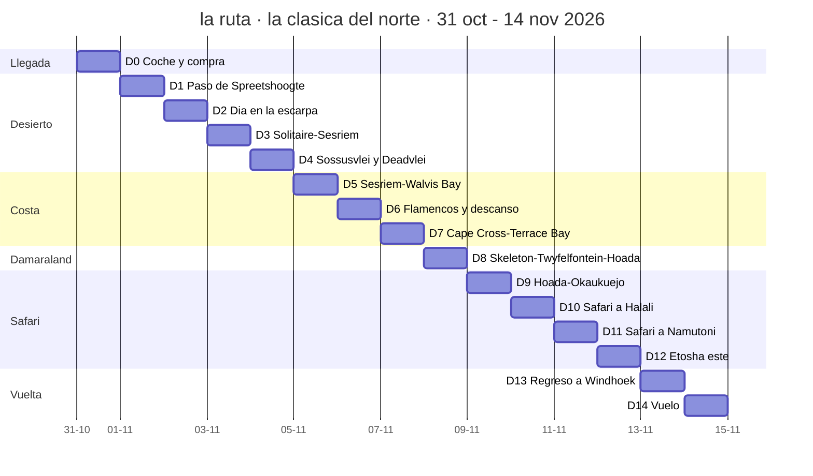
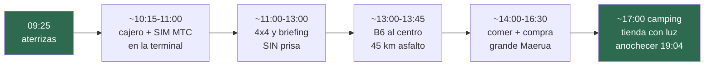
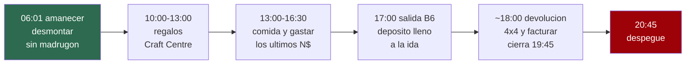

# 01 · Los itinerarios, día a día

> **Namibia · 30 oct – 15 nov 2026 · la clásica del norte** — [← índice del dossier](README.md)
>
> La ruta desarrollada día por día: qué se conduce, a qué hora sale y se pone el sol, qué temperatura hace donde se duerme y qué cuesta cada noche.
>
> **~N$20 = €1** *(rango 19,5–20,5)* · **✅** fuente primaria · **◐** secundaria concordante ·
> **○** práctica común, sin fuente · **❌** sin verificar, dicho en blanco
>
> *Investigación cerrada el 17/07/2026 · formato y contenido revisados el 09/08/2026 — los km por
> etapa, unificados con el enrutado OSRM propio (ver `13` §contraste)*

> ## 🗺️ Esta es LA ruta del viaje
>
> Decisiones del viajero, en orden: **primera quincena de noviembre**, **Sossusvlei y Etosha los
> dos**, y **el sur fuera entero**. El resultado es la ruta de abajo: la clásica del norte a ritmo
> lento, la misma familia que el itinerario de
> [lugaresincertos.com](https://www.lugaresincertos.com/en/travel-inspiration/two-week-trip-to-namibia/)
> que sirvió de referencia, pero montada con datos verificados.
>
> *Las variantes que se estudiaron y se descartaron (con el sur, sin Etosha, o todo comprimido) ya
> no están en el dossier: se quitaron el 03/08/2026 para dejar solo lo que se va a hacer. Quedan en
> el historial de git.*

---

<div align="center">

## ⭐ LA RUTA — la clásica del norte, a ritmo lento
### Como la del blog de referencia, pero con nuestros datos verificados

</div>

**~2.757 km · 15 días de coche, aeropuerto → aeropuerto (31 oct – 14 nov, decidido 07/08) ·
ningún día por encima de ~410 km salvo el regreso por asfalto (D13, ~550) · dos noches en la
escarpa de Spreetshoogte (decidido 08/08),
dos en Sesriem, dos en la costa y CUATRO en Etosha ·
llegada el sábado 31 de octubre a las 09:25, vuelta el sábado 14**

> ### 📅 El 1 de noviembre sigue siendo la fecha mágica
> **NWR entra en tramo barato** (Sesriem, Halali, Okaukuejo, Terrace Bay — la primera noche NWR
> del plan es Sesriem, el 3). El coche está **RESERVADO con Savanna, €2.363 en total, los 15 días
> completos** *(`20` §1)*.

> ### ❓ ¿Etosha al principio o al final? → **AL FINAL.** Tres razones con datos:
> 1. **Dinero**: con el desierto primero, **todas las noches NWR caen después del 1 de noviembre**
>    (tarifa baja) aunque se aterrice el 31 de octubre. Etosha primero habría significado tarifa
>    vieja **y** el pico de calor del parque (37,8 °C de media de máximas en octubre).
> 2. **Termómetro**: Etosha se enfría según avanza noviembre (37,8 oct → 37,1 media nov).
> 3. **Rodaje y crescendo**: asfalto y grava fácil primero; el safari como clímax, no aperitivo.
>
> *El contra, honesto: el riesgo de primeras tormentas sube mínimamente hacia el día 15 (en 2 de 5
> temporadas cayó algún chubasco suelto en la primera quincena — aislado, no la temporada
> asentada). Marginal frente a lo anterior.*



> ### ☀️ El sol de tu viaje *(cálculo astronómico NOAA, hora local UTC+2, coordenadas aproximadas — margen ±5 min; cuadra con el ~19:15 de fin de noviembre que da NWR ◐)*
> Cada día lleva abajo su amanecer y anochecer. El patrón que importa: **en Etosha anochece antes
> (~19:05, está al este) y en la costa después (~19:20)** — la regla de «en el campamento a las
> 18:00» vale igual en toda la ruta.

> ### 🌙 Y la luna: el viaje acaba en NOCHE CERRADA *(cálculo propio de fase — conjunción de referencia + mes sinódico, ±1 día; añadido el 09/08)*
> **Luna nueva el 9–10 de noviembre — clavada en las noches de Etosha.** El arco: se sale de
> Windhoek con una **menguante del ~58 %** que ya no sale hasta bien entrada la noche *(D1–D2:
> primeras horas de estrellas limpias en la escarpa)*; el **amanecer de Deadvlei (D4) lleva un
> creciente menguante del ~27 % colgado sobre las dunas**; la costa apaga la luna del todo
> *(D6 ~11 %, D7 ~5 %)*; y **las cuatro noches de Etosha (D9–D12) caen entre el 0 y el 9 %**:
> charca iluminada **sin competencia lunar** y Vía Láctea de libro — el **nocturno del D12, con
> ~9 %, en oscuridad casi perfecta**. La vuelta (D13–D14), con un creciente fino al atardecer.
> *(El registro del cálculo, en `15`; la fotografía nocturna tiene su propio repo, aparte de este
> dossier.)*

> ### 🌡️ Y la temperatura donde duermes — medias de NOVIEMBRE
> Cada noche lleva su **máxima media / mínima media** del mes. **Son medias mensuales, no la
> previsión de tu día**: el récord de noviembre en el sur llega a 41–42 °C (`15`).
> **Regla de fuentes de este repo:** las webs de safaris fueron **refutadas 0–3** (`15`), así que
> aquí solo hay **estación ✅** (o secundaria que la cite) y, donde no hay estación, **reanálisis
> ERA5 ◐** validado a ±0,04 °C contra las estaciones (`15` §ERA5). Terrace Bay se queda en «sin
> dato» a propósito: su celda ERA5 es mar.
>
> ```mermaid
> flowchart LR
> T["Noviembre donde duermes<br/>media de máxima / mínima, en °C"]
> n0["Walvis Bay · la costa<br/>25,0 día / 12,7 noche"]
> n1["Windhoek<br/>31,2 día / 16,3 noche"]
> n1b["Spreetshoogte · escarpa<br/>31,5 / 17,1 · ERA5"]
> n2["Sesriem · el desierto<br/>32,5 día / 15,5 noche"]
> n2b["Hoada · Damaraland<br/>33,1 / 18,4 · ERA5"]
> n3["Okaukuejo · Etosha<br/>37,1 día / 18,9 noche"]
> T ~~~ n0
> n0 ~~~ n1
> n1 ~~~ n1b
> n1b ~~~ n2
> n2 ~~~ n2b
> n2b ~~~ n3
> style T fill:#7a3a22,color:#fff,stroke:#7a3a22
> style n0 fill:#2d6a4f,color:#fff,stroke:#2d6a4f
> style n3 fill:#9d0208,color:#fff,stroke:#9d0208
>```
>
> **El viaje entero cabe en una frase: la costa fresca (20–25 °C), el desierto y la meseta calurosos
> (31–33 °C) y Etosha duro (37 °C) — y TODAS las noches entre 12 y 19 °C.** Por eso el equipaje
> lleva forro polar y no plumas (`05`).

> ### 🏕️ Dónde se duerme: **en la tienda de techo siempre que se pueda**
>
> El plan es dormir arriba las 14 noches y **meterse en campings**, incluidos los tres de dentro de
> Etosha. Estado noche a noche:
>
> ```mermaid
> flowchart TD
>     T["TIENDA DE TECHO · 9 noches ya resueltas<br/>D1-D2 Spreetshoogte · D3-D4 Sesriem dentro de la puerta<br/>D8 Hoada · D9 Okaukuejo · D10 Halali · D11-D12 Namutoni"]
>     D["POR ELEGIR CAMPING · 4 noches<br/>D0 y D13 Windhoek: Urban Camp o Arebbusch<br/>D5-D6 Walvis Bay: Lagoon Chalets<br/>existen y tienen camping, pero NO publican precio"]
>     P["HABITACION, NO TIENDA · D7 Terrace Bay<br/>el tarifario oficial de NWR no tiene camping aqui:<br/>doble en media pension, N$3.480 (~EUR 174) los dos"]
>     T ~~~ D ~~~ P
>     style T fill:#2d6a4f,color:#fff
>     style P fill:#e85d04,color:#000
> ```
>
> **El recuento, que suma 14:** **9** ya resueltas en tienda · **4** en las que se duerme arriba
> pero falta elegir camping *(D0, D5–D6 y D13)* · **1 imposible**: *D7 Terrace Bay* (no tiene
> camping).
>
> 👉 **El techo real son 13 de 14 noches arriba** — con el coche del aeropuerto, la primera y la
> última también. La única que no puede ser: Terrace Bay, que solo tiene habitaciones.
>
> ### 🚗 El coche: **aeropuerto → aeropuerto, DECIDIDO** *(07/08/2026)*
>
> Se recoge el **31 de octubre a la llegada** *(~11:00, tras aterrizar a las 09:25)* y se
> devuelve el **14 de noviembre camino del embarque** *(~18:00)* — **15 días**. Ni hoteles en
> Windhoek ni traslados: **las noches de ciudad también se duerme arriba**, en camping.
>
> El coche está **RESERVADO con Savanna (12/08): €2.363 en total, 15 días completos, con transfer
> aeropuerto ↔ oficina** *(el detalle, en [`20`](20-reservas.md) §1)*.

### D0 · sáb 31 oct — Llegada, coche y LA compra grande *(plan horario)*



- ✈️ **09:25 · aterrizas** con el vuelo de Oporto *(ver [`02`](02-presupuesto.md) §8)* —
  inmigración con el e-visa impreso (`04`) y maletas: cuenta **~45 min–1 h** ○ *(sin dato
  publicado de colas; es un avión de largo radio entero de golpe)*
- 💱 **~10:15–11:00 · dinero y SIM sin salir de la terminal** — cajeros de FNB y Bank Windhoek ✅:
  **N$500–1.000 (~€25–50) de bolsillo** ○ *(el del aeropuerto admite hasta ~N$3.000 · ~€150,
  reportes de viajeros ○; la carga grande, mejor en ciudad — cajero junto a sucursal, ver `07`)* — y la **SIM turista de MTC**
  *(«Leisure» N$349 · ~€17, registro con pasaporte obligatorio; ver `07`)*
- 🚙 **~11:00–13:00 · transfer a la oficina de Savanna y recogida del 4×4** ✅ *(Savanna no
  entrega en el propio aeropuerto: transfer gratuito a su oficina de Windhoek, incluido por ser
  15 días — `20` §1)*. **Al firmar, pedir por escrito la zona sunrise/sunset de la Opción 4**
  *(por Deadvlei, `20` §1)*. **Briefing sin prisa (1–2 h)**: presiones en frío
  apuntadas, las DOS ruedas de repuesto, gato y compresor a la vista *(`06`)*, el **inventario del
  camping contra la ficha** *(`20` §1)* y las **preguntas de la nevera**
  *([`18`](18-manual-de-campamento.md), §5)*
- 🚗 **~13:00–13:45 · B6 al centro: ~45 km de asfalto** ○ — la conducción por la izquierda se
  estrena sin tráfico
- 🍽️🛒 **~14:00–16:30 · comer y LA compra grande, HOY que es sábado** — Maerua Mall ○: algo rápido
  de comer y **SuperSpar + TOPS anexo** — cerveza y vino incluidos: **mañana es domingo y el
  alcohol para llevar cierra por ley** ✅. Aquí también la **carga grande de efectivo
  (~N$6.000–8.000 · ~€300–400)**, en cajero pegado a sucursal *(`07`)*. La lista entera, para
  tachar, en [`08`](08-comida-compras-y-regalos.md). **⛽ Y depósito lleno al salir de la
  ciudad**: por Spreetshoogte no hay NADA hasta Solitaire *(`08`)* — el depósito son 140 l
  confirmados ✅ *(`20` §1)*, pero se entrega sin lleno: *pregunta al recoger con cuánto tanque lo
  entregan* ❌
- 🏕️ **~17:00 · al camping y primera montada de la tienda con luz y sin público** — ☀️ anochecer
  ~**19:04** *(jet lag: +1 h respecto a la península — ninguno)*. **Las ~2 h hasta el anochecer son
  el colchón del día**: cualquier retraso de inmigración, briefing o compra sale de ahí
- ⚠️ **¿Salir ya esta tarde hacia Spreetshoogte? NO.** Desde la compra (~16:30) son 3h–3h30 de
  ruta con grava: llegada de noche a un descenso técnico, con el coche recién cogido y tras una
  noche de avión — **rompe la regla de las 18:00 el primer día** *(`06`)*. **Al paso se sale
  mañana por la mañana, descansados — decidido (08/08)**
- 🌡️ **Windhoek 31,2 / 16,3** ✅
- 🐾 **Alrededor del camping: nada que esperar — es ciudad** ○. La fauna empieza mañana en la
  escarpa *(desde hoy, cada noche lleva esta línea: qué puede rondar donde duermes, con su fuente)*
- 🍺 **Cena: braai de estreno en el camping — o Joe's Beerhouse si el cuerpo no está para
  cocinar** *(reservar; la mesa de despedida vuelve el D13)*
- 🛏️ **Windhoek, arriba desde la primera noche — y única noche de ciudad a la ida** — candidatos
  con camping verificado *(tarifa ❌, no la publican)*: **Urban Camp** *(Schanzen Road; piscina,
  bar, wifi, cajero)* o **Arebbusch**

### D1 · dom 1 nov — Windhoek → paso de Spreetshoogte · **~205 km · ~3h–3h30** ◐ *(OSRM; decidido 08/08)*
- 🚗 **Salida ~09:00–09:30, sin madrugón** — **el día flojo del plan anterior (domingo en una
  ciudad cerrada por ley) se muda a la escarpa** *(el análisis, en
  [`16`](16-punto-de-decision.md))*: la primera grava se estrena descansados y con el día entero
  por delante
- ⚠️ **Es domingo: las bottle stores y las secciones de alcohol cierran por ley** ✅ *(ver
  [`08`](08-comida-compras-y-regalos.md))* — por eso TODO se compró ayer. *Los súper abren si
  falta algo — sin alcohol*
- 🌡️ **Spreetshoogte: medias de noviembre ~31,5 °C máx / ~17,1 °C mín** ◐ *(reanálisis ERA5,
  celda del borde de la escarpa; el cálculo reproduce Windhoek/Sesriem a ±0,04 °C — ver `15` §ERA5)*.
  **Confirma el proxy de Windhoek** (31,2/16,3 ✅): misma altitud (~1.700 m), mismo clima de meseta.
  Arriba corre viento y refresca al caer el sol ○
- ☀️ amanecer **06:07** (Windhoek) · anochecer **~19:09** (el paso) — *el atardecer en el paso es
  el plan del día: en posición hacia las 18:40*
- B1 a Rehoboth (87 asfalto) → C24 → D1261 → **D1275: el paso**. ⚠️ **Muy empinado**, tramos de
  hormigón para tracción, prohibido a caravanas — se baja despacio y es espectacular
- 💧🪵💶 **La carga de escarpa se hizo AYER**: agua **≥5–6 garrafas de 5 L** ○ *(la regla de 4 L/persona/día
  de `06` es de coche; el día entero al sol del D2 y la cocina suman)*, **leña para DOS braais** y **efectivo**: en
  Spreetshoogte **no consta tienda, restaurante ni datáfono** ❌ *(~N$600–1.200 · ~€30–60 los dos
  por las dos noches, con la banda de 150–300 ZAR/persona de `15`)*. Sin cajero fiable hasta Swakopmund (D6): **no
  bajar de N$4.000 (~€200)** *(`07`)*
- 🌇 **Atardecer desde el mirador del paso**: el Namib a 1.000 m bajo tus pies
- 🐾 **Alrededor del campamento: sin parte de avistamientos — es granja privada en la escarpa** ❌.
  Ni Expert Africa publica partes aquí ni el polígono GBIF del Namib llega tan al norte:
  **pregúntale al dueño qué baja al anochecer**. Lo único afirmable: el chacal se oye en casi
  cualquier campamento del país ○
- 🛏️ **Spreetshoogte Campsite, primera de DOS noches** — **abierto confirmado ◐** *(10/08; lo
  opera Barkhan Dune Retreat)* ⚠️ *precio sin verificar (el blog citaba 150–300 ZAR/persona,
  vigencia desconocida; ojo a la trampa de nombre — «Camp Gecko» y Namibgrens son otros, `20` §5)*

### D2 · lun 2 — Día entero en la escarpa · **0 km de ruta** *(decidido 08/08)*
- **El día lento del viaje, en el sitio bueno**: amanecer en el mirador, la escarpa a pie, siesta
  larga y segunda puesta de sol — el Namib mil metros abajo, dos veces y sin reloj
- 🧰 **Y el repaso con calma antes del desierto**: presiones en frío, anclajes de la tienda, orden
  de la nevera y las cajas — lo que el briefing del D0 dejara a medias, hoy sin prisa *(`18`)*
- 🛟 **Es además el colchón del viaje**: si el vuelo o las maletas se retrasan el D0, este es el
  día que se sacrifica **sin tocar ni una reserva NWR** — la primera es Sesriem, mañana
- ☀️ amanecer **06:09** · anochecer **19:10**
- 🌡️ **Spreetshoogte ~31,5 / ~17,1** ◐ *(ERA5, ver `15` §ERA5)* — arriba corre viento: forro a mano
- 🛏️ **Spreetshoogte, segunda noche** — mañana, Solitaire y Sesriem

### D3 · mar 3 — Spreetshoogte → Solitaire → Sesriem · **~130 km · ~2h–2h30** ◐ *(OSRM 129; el ~150–170 anterior sobraba)*
- 🌡️ **Sesriem, media de máximas de noviembre: ~32,5 °C** ◐ *(reanálisis ERA5, celda a 4 km de la
  puerta; con el sesgo frío del interior la real ronda **33–34 °C**, que es justo el 34,1 ◐ de NWR —
  dos fuentes independientes, mismo entorno; ver `15` §ERA5)*. Mínima **~15,5 °C** ◐ (NWR)
- ☀️ amanecer **06:09** · anochecer **19:12** — *la puerta exterior de Sesriem funciona de
  amanecer a ocaso: dentro antes de ~19:10*
- Bajada del paso → C14 → 🥧 **Solitaire** (tarta + depósito lleno) → D826/C19 a Sesriem
- Tarde: **Sesriem Canyon** y atardecer en **Elim Dune** *(o el guiado de NWR, N$300 ≈ €15/persona)*
- 🎫 Namib-Naukluft ~N$620/24 h
- 🐾 **Alrededor del camping** — el fijo: **chacal de lomo negro al anochecer, a por las sobras** ○
  *(comida y basura cerradas: protocolo en `18` §7)*. En el llano, GBIF de oct–nov da **órix y
  avestruz frecuentes y springbok presente** ◐ *(zona del Namib: 168, 389 y 41 registros oct–nov;
  método y umbrales, en la [guía de fauna](guia-fauna-etosha.pdf))*
- 🛏️ **🔑 DENTRO de la puerta: Sesriem Campsite — N$1.340 (~€67)** ✅ *(44 parcelas: reservar YA)*

### D4 · mié 4 — Sossusvlei y Deadvlei · **130 km · día completo** ✅
- 🌡️ **Sesriem ~32,5–34 / 15,5 ◐** — y en la duna, a mediodía, la arena está muy por encima de eso:
  **Big Daddy se sube al amanecer o no se sube** ○
- ☀️ amanecer **06:10** (Deadvlei) · anochecer **19:16** — **la puerta interior abre 1 h antes del
  amanecer: ~05:10.** Son ~60 km de asfalto + arena hasta el aparcamiento: saliendo al abrirse,
  llegas con la duna encendiéndose *(horas de puerta: confírmalas en recepción al llegar, se
  mueven con el orto real — ver `06`)*
- 🌅 **Puerta interior 1 h antes del amanecer** — Deadvlei casi en solitario
- ⚠️ **Este tramo, antes del amanecer, es zona a riesgo propio del seguro de Savanna salvo que se
  pida por escrito en la entrega** — el detalle, en `06` §6 y `20` §1
- Con día entero: **Big Daddy** (la subida) + **Hidden Vlei** + **Duna 45** a la vuelta
- Arena final: 4H antes de entrar, desinflar en el 2WD, reinflar en Sesriem *(o lanzadera
  N$180 ≈ €9/persona)*
- 🛏️ Sesriem, segunda noche

### D5 · jue 5 — Sesriem → Walvis Bay · **~315 km · ~5h30–6h** ◐ *(OSRM 316; el ~270 de la matriz de 2010 se quedaba corto)*
- 🌡️ **Walvis Bay, medias de noviembre: 25,0 °C máx / 12,7 °C mín** ✅ *(NOAA GHCN, estación del
  aeropuerto WMO 68098, serie 1990–2025; ver `15`)* — **la costa es el respiro térmico del viaje**:
  la corriente de Benguela. Pero ojo a la madrugada: **12–14 °C**, y viento. Cortavientos a mano
- ☀️ amanecer **06:15** · anochecer **19:17** (Walvis Bay)
- C14 por los pasos de **Gaub y Kuiseb** + Trópico de Capricornio
- ⛽ **Solitaire otra vez, sí o sí** — después, **~230 km sin nada** *(OSRM Solitaire → Walvis 233)*
- 🐾 **Alrededor del camping: la laguna ES la fauna** — **flamenco común y enano a millares** ◐
  *(SABAP1 respalda la estacionalidad —su máximo es jun–nov, ver D6—; la magnitud es la fama
  documentada de la laguna)*. En GBIF de oct–nov los dos flamencos suman **2.536 registros ◐**
  *(registros, no cabezas)* — solo el **cormorán del Cabo (2.235)** les discute el podio — y detrás
  van las otras dos reinas de la laguna, con ficha nueva del 08/08: **gaviota de Hartlaub** *(1.591
  ◐)* y **avoceta** *(1.057 ◐)*; los **pelícanos** cierran la lista grande *(977 ◐)*. En
  tierra, nada que esperar: es ciudad ○
- 🛏️ **Walvis Bay — también en tienda.** El único sitio con camping que aparece listado en la
  ciudad es **Lagoon Chalets**, que es además el que usó el blog de referencia ◐. **Precio ❌: no
  lo publica.** *(Si no cuadra, Swakopmund a 30 km tiene más oferta de camping.)*

### D6 · vie 6 — Walvis Bay: flamencos y descanso ✅
- 🌡️ **Walvis Bay 25,0 / 12,7** ✅ — el día fresco del viaje: aprovecha para el Welwitschia Drive
- ☀️ amanecer **06:14** · anochecer **19:17** — *flamencos con la primera luz, ~06:15–07:30*
- 🌊 **La marea manda sobre Sandwich Harbour**: bajamar **07:18** y **19:38**, pleamar **13:27** ◐
  *(predicción de [tidetime.org](https://www.tidetime.org/africa/namibia/walvis-bay-calendar-nov.htm)
  para el 6-nov, leída el 09/08 — y mareas VIVAS hacia el novilunio del 9: playa ancha)*. **La
  salida de las ~08:30 es la que baja por la playa hasta la laguna; la de las ~12:30 cae casi en
  pleamar** y suele quedarse en los miradores. El operador planifica con su propia tabla:
  **confírmalo al reservar** *(detalle en `15`)*
- 🦩 **Y tu mes es de los buenos**: en Walvis Bay los flamencos tienen su **máximo de junio a
  noviembre** ✅ *(SABAP1)*. Aquí sí los hay en cantidad — en Etosha, en cambio, **no**: la depresión está
  seca en noviembre *(ver `09`)*
- 🦩 **Flamencos y pelícanos en la laguna** al amanecer y al atardecer — las mejores luces
- 🐋 **Y el crucero cae en temporada de ballena jorobada** ◐ — los registros GBIF de esta costa
  dan la migración **jun–nov** *(pico jul–sep con 42; noviembre aún 27; diciembre se desploma a
  5 — consulta del 08/08/2026, archivada mes a mes en `15`)*; los **delfines se ven todo el año** *(el de
  Heaviside es residente de la corriente de Benguela — su ficha está en la guía; el mular,
  práctica común de los cruceros ○)*. Ficha nueva en la [guía de fauna](guia-fauna-etosha.pdf) *(añadida el 08/08)*
- Día libre: paseo marítimo, ostras, el **crucero de delfines y lobos** *(~N$1.400–1.990, ~€70–100 pp
  ◐)* o la excursión guiada a **Sandwich Harbour** *(~N$2.600–3.220, ~€130–161 pp ◐)*
  *(🚫 con tu coche Sandwich Harbour está prohibida por contrato — el tour es la forma correcta y mejor;
  precios y fuentes en [`02`](02-presupuesto.md), §9)*
- 🛏️ Walvis Bay, segunda noche

### D7 · sáb 7 — Cape Cross → Terrace Bay (Skeleton Coast) · **~410 km · día logístico** ◐ *(OSRM 412; el ~380–390 por tramos se quedaba corto — `13`)*
- 🌡️ **Terrace Bay: sin dato de estación** — no hay serie pública ni en Möwe Bay ni en Terrace
  Bay, y **ERA5 tampoco sirve aquí**: su celda más cercana cae sobre el mar *(da aire marino ~19 °C,
  no tierra; ver `15` §ERA5)*. Proxy honesto: **la costa ronda los 25,0 °C de Walvis Bay ✅**, 400 km
  más al sur — con **niebla, viento y menos calor que tierra adentro** ○
- ☀️ amanecer **06:18** (Cape Cross) · anochecer **19:20** (Terrace Bay) — *pero aquí el sol no es
  el límite: lo es la puerta de las 15:00*
- ⏰ **Salida temprana — este día tiene una hora límite.** C34 costera (sal compactada):
  Swakopmund → Henties Bay → 🦭 **Cape Cross** (miles de lobos marinos; pañuelo para el olor).
  ⛽ **En Henties Bay se llena sí o sí** *(Puma 24 h)*: es el último surtidor seguro antes del
  bucle de la costa y Damaraland — la aritmética del depósito, en `07`
- 🎫 **Cape Cross cobra entrada propia, aparte del permiso de Skeleton Coast:** **N$150 (~€8)/extranjero
  + N$50 (~€3)/coche** (≤10 plazas) = **~N$350 (~€18) los dos** ◐, en **efectivo**, se paga en recepción
  al entrar (reserva dentro del Dorob NP; tarifa menor que el baremo premium, **no** son las 7 unidades
  de `02` §5 — súmalo). Horario ◐: **abre a las 08:00 solo del 16 nov al 30 jun; el resto del año, a
  las 10:00** *(confirmado por búsqueda; la ficha del MEFT sigue en 403)*. **Ojo: vuestro D7 es el 7 nov,
  antes del 16 → Cape Cross abre a las 10:00, NO a las 08:00.** No hay entrada a primera hora: apuntad
  el alto de los lobos a las 10:00 en punto y salid seguidos. De Cape Cross a Ugabmund quedan **~80 km**
  *(OSRM)*: cruzáis de sobra antes de las 15:00 — y de la puerta a Terrace Bay quedan aún **~160 km**
  de parque a 60: no os entretengáis
- 🛑 **Puerta de Ugabmund: última entrada 15:00.** Para pernoctar dentro hace falta **reserva
  confirmada de Terrace Bay** — sin ella no se entra (el permiso de tránsito obliga a salir el
  mismo día)
- Dentro del parque: **60 km/h** · 🎫 Skeleton Coast ~N$620 (~€31)/24 h
- 🛏️ **Terrace Bay (NWR)** — dormir en la Costa de los Esqueletos, con la niebla y el
  Atlántico rugiendo. **Ojo: es un resort con media pensión (DBB), no un camping** — el precio,
  cerrado, dos líneas más abajo
- 🐾 **Alrededor del resort** — el **chacal de lomo negro es el fijo de la costa** *(GBIF costa:
  271 registros, 57 en oct–nov ◐)* y la **hiena parda deja huellas en las playas** ○ — en GBIF
  hay 17 registros en la zona pero **solo 4 en oct–nov: muestra corta, no se afirma más** ◐. **Springbok, órix y hasta
  hiena parda en el delta del Uniab**, que se cruza dos veces ◐ *(`10`)*. ¿León del desierto en la
  playa? **1 registro en la zona: por debajo del umbral — no se afirma nada**
- 💰 **Precio cerrado (03/08) ✅:** el PDF oficial de tarifas de NWR 2026/2027 da para Terrace Bay
  **habitación doble en media pensión a N$1.740/persona → N$3.480 (~€174) los dos**, en tu ventana.
  **No hay camping**: la ficha web listaba una fila de «Campsite» que **no existe en el tarifario**
  — es un error de su web. Es **la noche más cara del viaje**, pero incluye **cena y desayuno**.
- *Variante fácil: saltarse Terrace Bay, dormir en Henties/Swakopmund y entrar a Damaraland al día
  siguiente por Springbokwasser en tránsito — un día mucho más corto*

### D8 · dom 8 — Skeleton Coast → Twyfelfontein → Hoada · **~370 km · ~5h30–6h de volante** ◐
- 🌡️ **Hoada/Grootberg: medias de noviembre ~33,1 °C máx / ~18,4 °C mín** ◐ *(reanálisis ERA5,
  ninguna estación GHCN cae cerca; ver `15` §ERA5)*. **Es un suelo, no un techo**: en sabana seca
  ERA5 se queda ~2 °C corto, así que el mediodía real ronda **34–35 °C**. Está entre la meseta (~31)
  y el norte caluroso; Twyfelfontein, en el valle, es **aún más caluroso a mediodía** ○
- ☀️ amanecer **06:17** (Twyfelfontein) · anochecer **19:15** (Hoada) — *y es domingo otra vez:
  sin alcohol a la venta*
- Salida por **Springbokwasser** → C39 → D2612/**D3254** → **Twyfelfontein** (grabados rupestres
  UNESCO; Google lo lista como cerrado: **es un fallo del listado**). ⚠️ **La visita guiada es
  obligatoria y de pago: N$270 (~€13,5)/persona, solo efectivo** ◐ *(tarifario NHC; ver `11`)*.
  **Terrace Bay → Twyfelfontein son ~220 km ◐** *(OSRM: 97 a la puerta de Springbokwasser + 123 a
  Twyfelfontein — cuadra con el 96+120 verificado el 03/08; ver `13` y `15`)*; y la cola
  **Twyfelfontein → Hoada son ~150 km ◐** *(OSRM 148; «~2,5 h» del operador)*. **Es un día largo
  (~370 km de grava): sal temprano de Terrace Bay.** El ~85 km que se manejaba antes quedó
  **refutado** —era menor que la línea recta (~95 km).
- ⚠️ **Damaraland: los bajos, cubiertos por la Opción 4 de Savanna** ✅ *(`20` §1)*, pero
  Damaraland también puede entrar en las «zonas a riesgo propio» del seguro si se sale de pista
  marcada — despacio en las piedras y dentro de la carretera.
- 🐾 **Alrededor del campamento** — Damaraland en GBIF oct–nov: **el elefante del desierto pasa
  por la zona** *(139 registros, 27 en oct–nov ◐)* — cruzárselo es suerte, no plan *(y si pasa,
  protocolo del `18`)*; **damán en el granito** *(62/13 ◐)*, **springbok** *(50/23 ◐)* — y por
  encima del umbral también avestruz, jirafa y el propio babuino ◐ *(el detalle, en la guía)*.
  Lo que no llega a muestra, no se afirma
- 🛏️ **Hoada Campsite** (zona Grootberg) — el blog lo llama su campamento más bonito del viaje:
  rocas de granito, duchas entre peñas, cielo estrellado. **N$271–366/persona según temporada
  (~€14–18 pp) → N$542–732/noche la pareja (~€27–37)** ◐ *(la temporada de noviembre sin fijar; ver `15`)*

### D9 · lun 9 — Hoada → Etosha (Okaukuejo) · **~340 km · ~4h30** ◐
- 🌡️ **Okaukuejo, medias de noviembre: 37,1 °C máx / 18,9 °C mín** ✅ *(NOAA GHCN, serie completa
  1975–2022, recomputada en `15` en dos extracciones independientes)* — y **baja según avanza el
  mes**: 37,8 en octubre → 37,1 en noviembre → 35,6 en diciembre
- ☀️ amanecer **06:18** (Hoada) · anochecer **19:08** (Okaukuejo) — *las puertas de Etosha cierran
  al ocaso: pasa Andersson con margen de sobra*
- C40 a Kamanjab → C38 a la puerta de **Andersson** (asfalto desde Kamanjab... ⚠️ firme por
  confirmar) → **Okaukuejo a 17 km** de la puerta
- ✅ **Son ~340 km (verificado 04/08, antes se manejaba ~315)**: Hoada → Kamanjab **75 km** + Kamanjab
  → Okaukuejo por Outjo **~265–271 km** *(distancesto: Kamanjab–Outjo 156 km; CityMeter: Kamanjab–Okaukuejo
  271 km; la matriz de 2010 daba 265, convergen — **y OSRM lo remacha: 343**)*. **El ~315 queda
  refutado.** Cuenta ~340 para el depósito y la hora de puerta. Ver [`13`](13-itinerario.md), §3.
- 🎫 Etosha ~N$620 (~€31)/24 h × 4 días · trámite de puerta 20–30 min · **60 km/h dentro**
- 🎟️ **Nada más llegar, en recepción: cierra los guiados** — la salida de mañana de MAÑANA en
  Okaukuejo y pregunta los horarios *(❌ no los publican; decidido 08/08 — ver §parques)*
- 🌙 **Noche en la charca iluminada de Okaukuejo** — rinocerontes negros. Y **en luna nueva**
  *(novilunio el 9–10: las cuatro noches de Etosha, a oscuras — ver el bloque 🌙 de arriba)*: la
  charca manda sola sobre la oscuridad total, y el cielo de la parcela es de libro
- 🐾 **La cifra real de la charca, de partes de viajeros** *([Expert Africa](https://www.expertafrica.com/namibia/etosha-national-park/okaukuejo-camp/reviews/1),
  149 viajeros desde 2018 — cada % lleva su propia muestra ◐)*: **rino negro 87 % (119 de 137), elefante 97 %, jirafa 99 %, león 68 %** —
  andando desde la parcela *(método y las 115 fichas, en la [guía de fauna](guia-fauna-etosha.pdf))*
- 🛏️ **Camping Okaukuejo — N$920 (~€46)** ✅ · *capricho: chalet del charco N$4.760 (~€238)*

### D10 · mar 10 — Safari Okaukuejo → Halali · **~110 km de safari lento** ◐ *(OSRM 108 por el desvío obligatorio; la directa eran ~70)*
- 🌡️ **Etosha, medias de noviembre: 37,1 °C máx / 18,9 °C mín** ✅ *(GHCN Okaukuejo, la estación
  del parque)* — la cifra más alta del viaje. **A mediodía no se hace safari: piscina** ○
- ☀️ amanecer **06:12** · anochecer **19:06** (Halali) — *dentro del campamento, del ocaso al
  amanecer: la charca iluminada ES el plan de la noche*
- 🚧 **Obras Okaukuejo–Halali–Namutoni — CONFIRMADO que te afectan (act. 03/08, ◐)**: el MEFT
  reconstruye la pista central para asfaltarla, y ya hay **nota oficial de 2026** —«Traffic deviation
  via Gemsbokvlakte road from Okaukuejo to Halali» *(meft.gov.na/news/335)*, con aviso paralelo de
  NWR— que fija un **desvío OBLIGATORIO desde el 2 de junio de 2026 y hasta julio de 2027**. Tu
  ventana de la primera quincena de noviembre **cae de lleno dentro**: da por hecho que la carretera directa
  Okaukuejo→Halali estará **cerrada** y que irás por el bypass — no lo dejes como un «quizá».
  *(No se pudo abrir la página oficial (403); las fechas las dan cinco fuentes secundarias que
  concuerdan, por eso va en ◐. Confírmalo con NWR Okaukuejo **+264 67 229 800** por si hubiera
  cambio de última hora.)*
- 🚗 **El desvío en la práctica ◐**: desde Okaukuejo se sigue por grava hasta **~km 47** y ahí se
  toma el **bypass nuevo y el Rhino Drive** hacia Halali. Las charcas accesibles en ese tramo se
  reducen a **Gemsbokvlakte, Sueda y Salvadora**; **Nebrownii y Kapupuhedi quedan fuera** por la
  obra. Recomiendan vehículo alto —tu Ford 4x4 cumple—. **En km, el desvío está medido con el enrutado
  propio (09/08): ~108 frente a ~70 de la directa, +38 km**; en **tiempo no hay cifra oficial**:
  cuéntalo despacio.
- ✅ **Y el desvío no es un castigo**: **Gemsbokvlakte–Sueda–Salvadora** es de los mejores tramos de
  borde de la depresión para **guepardo y león**
- 🧭 **Salida guiada de mañana desde Okaukuejo — N$650 (~€33)/persona** ✅ *(decidido 08/08;
  horario, en recepción)* — y el **traslado a Halali con vuestro 4x4 a mediodía-tarde**, por el
  desvío y sus charcas
- Siesta en la piscina de Halali · charca de Halali al anochecer · y al llegar, **apunta la
  salida guiada de mañana**
- 🐾 **Partes de viajeros en Halali** *([Expert Africa](https://www.expertafrica.com/namibia/etosha-national-park/halali-camp/reviews/1), 48 viajeros ◐)*: **león 75 %, rino negro 73 % y
  leopardo 31 % (12 de 39) — la mejor cifra de leopardo de los tres campamentos**: la charca al
  anochecer, sin prisa. Y el **chacal, fijo en el camping** ○ *(protocolo en `18` §7; GBIF lo da como el carnívoro más
  registrado de la ruta ◐)*
- 🛏️ **Camping Halali — N$920 (~€46)** ✅

### D11 · mié 11 — Safari Halali → Namutoni · **~80 km de safari** ✅
- 🌡️ **Etosha 37,1 / 18,9 ✅** — la noche más cálida del viaje: casi 19 °C de mínima
- ☀️ amanecer **06:08** · anochecer **19:05** — *el safari bueno es 06:10–09:00 y 16:30–19:00;
  al mediodía, piscina y siesta*
- 🧭 **Salida guiada de mañana desde Halali — N$650 (~€33)/persona** ✅ — y el traslado a
  Namutoni por la tarde con vuestro coche, parando en **Goas, Nuamses, Springbokfontein, Batia y
  Chudop** — el corazón del safari
- **Se duerme DENTRO, como todo Etosha en esta ruta**: sin horas de puerta, con la charca al lado
- 🐾 **Partes de viajeros en Namutoni** *([Expert Africa](https://www.expertafrica.com/namibia/etosha-national-park/namutoni-camp/reviews/1) — ojo, muestra corta: 16 viajeros y
  11–16 partes por especie ◐)*: jirafa,
  órix, ñu y cebra **100 %**, **guepardo 50 % (7 de 14) — la mejor cifra de guepardo, son sus
  llanuras del este**, león 64 %. La charca propia es la floja de las tres *(ya dicho abajo)*:
  **Chudop, a un paso, compensa**. Y de día, ojo al suelo: la **mangosta rayada** sale en 400
  registros GBIF del parque *(101 en oct–nov ◐ — el gran ausente que destapó la revisión;
  ficha nueva del 08/08)*
- 🛏️ **Camping Namutoni — N$920 (~€46)** ✅ *(el fuerte alemán, y Chudop a un paso)*
- *Capricho opcional: **Onguma** (reserva privada justo al otro lado de la puerta de Von
  Lindequist) ⚠️ precio sin verificar; puede ser gama alta — a cambio pierdes estar dentro*

### D12 · jue 12 — Etosha este · **~60–80 km de safari** ✅
- 🌡️ **Etosha 37,1 / 18,9 ✅**
- ☀️ amanecer **06:08** · anochecer **19:05**
- 🧭 **Guiado de mañana en Namutoni (N$650 · ~€33 pp ✅) y por la noche EL NOCTURNO (N$750 ·
  ~€38 pp ✅)** — la única forma legal de estar en el parque a oscuras *(decidido 08/08)*
- Por vuestra cuenta, la tarde: **Fischer's Pan**, Chudop, Klein Namutoni — la esquina que casi nadie hace. *Ojo: Fischer's Pan
  es el mejor sitio de aves acuáticas del parque **cuando hay agua**, y en noviembre está seco —
  lo que va bien es Chudop (león fiable) y el **Dik-dik Drive** de Klein Namutoni* ◐
- 🛏️ **Namutoni, segunda noche — N$920 (~€46)** ✅

### D13 · vie 13 — Etosha → Windhoek · **~550 km asfalto · ~5h30 de volante · 6h–6h30 con comida** ◐ *(OSRM 548)*
- 🌡️ De **Etosha (37,1 ✅)** a **Windhoek (31,2 ✅)**: el día de bajar 6 grados y 550 km
- ☀️ amanecer **06:08** (Namutoni) · anochecer **19:11** (Windhoek) — *la puerta de Von Lindequist
  abre al amanecer: saliendo a las 06:10 llegas a Windhoek con la tarde entera*
- Von Lindequist → Tsumeb → Otjiwarongo → B1 · salida al alba, comida en Otjiwarongo
- 🥩 **Línea Roja**: la carne cruda no baja del norte — el braai se come en Etosha
- 🐾 **Alrededor del camping: ciudad otra vez — la fauna se queda en la Línea Roja** ○
- 🛏️ **Windhoek, arriba y CON coche** — la entrega ya no es hoy: **decidido (07/08)**, se
  devuelve mañana en el aeropuerto. Última noche de tienda: braai de despedida, o Joe's si el
  cuerpo pide mesa
- *Parada opcional de camino: **Okonjima/AfriCat** (leopardos), el meteorito de **Hoba** (desvío
  por Grootfontein, B8) o el **Plateau de Waterberg** (desvío desde Otjiwarongo; entrada N$280 ·
  ~€14 — ver `11`)*

### D14 · sáb 14 — Vuelo *(plan horario)*



- ✈️ **Despegue a las 20:45** *(vuelo de Oporto, [`02`](02-presupuesto.md) §8)* — no es una mañana
  de aeropuerto: es **un día entero en Windhoek** antes de embarcar. ☀️ amanecer **06:01**
- 🏕️ **~08:00–10:00 · desmontar la tienda por última vez, sin prisa** — desayuno tranquilo, ducha
  y el coche cargado y ordenado para la entrega
- 🎁 **~10:00–13:00 · los regalos — decidido (07/08): con coche, sin traslados** — **Namibia Craft
  Centre, 40 Tal St** *(la parada única, [`08`](08-comida-compras-y-regalos.md))*: **sábados
  09:00–16:00** ✅ *([web oficial](https://www.namibiacraftcentre.com/))* — hazlo por la mañana y
  deja la tarde limpia — y **a ~2 km a pie queda el «Telephone Man» de los Lone Men** ○, el
  cierre perfecto del viaje *(la guía entera de los Lone Men por la ruta, en `10`)*.
  ⚠️ *Único día con el coche cargado aparcado en ciudad: nada a la vista,
  aparca vigilado (cuidacoches ~N$10 · ~€0,50, `07`)* ○
- 🍽️💱 **~13:00–16:30 · comida de despedida y última vuelta** — y **gasta los N$**: fuera de
  Namibia no valen nada ✅. *Cambiarlos, difícil: los bancos abren sábados solo 09:00–11:00 ✅ y
  el cambio del aeropuerto no publica horario ❌ — el plan es GASTAR, no cambiar (`07`)*
- 🧹 **~16:30 · el coche, listo para entregar**: nevera vaciada y limpia, basura al contenedor
  del camping, garrafas y leña sobrante fuera — y las maletas de facturar (1×23 kg por cabeza)
  hechas desde la mañana ○. *El check-out del camping de Windhoek y si se puede volver por la
  tarde: pregúntalo al llegar el D13* ❌
- ⛽ **Salida hacia la oficina de Savanna** — devolución con el tanque como se entregó ○ *(no en
  el aeropuerto mismo: Savanna devuelve en su oficina de Windhoek y de ahí transfiere al
  aeropuerto — `20` §1)*
- 🚙 **~18:00 · devolución del 4×4** ✅ *(hora acordada; amplía la política estándar de Savanna,
  que da 16:00 como límite — que quede por escrito, `20` §1)* — todavía **con luz para la
  inspección** *(anochecer ~19:12)*. **El transfer gratuito de Savanna solo cubre hasta las
  17:20** ❌: cómo cubren el tramo oficina→aeropuerto a esta hora concreta sigue sin confirmar
  por escrito — es la pieza que más falta por cerrar de toda la reserva.
- 🧳 **Facturación** ◐ — mostradores de Discover: **abren 16:45 (4 h antes)
  y CIERRAN 19:45 (60 min antes)** — **la hora dura del día es esa**. Devolviendo a las 18:00
  quedan **~1h45 de colchón** hasta que cierre facturación, contando ya el transfer: cabe hasta un
  pinchazo en la B6 *([ficha de aeropuertos de
  Discover](https://www.discover-airlines.com/us/en/book/travel-information/airport-info); la
  página devuelve 403 al descargar — extractos convergentes)*. La franquicia: **1×23 kg por
  cabeza**, cerrada en [`02`](02-presupuesto.md) §8
- 🛫 **~20:00 embarque ○ · 20:45 despegue** → escala en Múnich → **Oporto, domingo 15 a las
  12:50** — y el coche propio, del aparcamiento del aeropuerto hasta A Coruña *(decidido 09/08 —
  `02` §8)*

### 💰 Coste real *(31 oct – 14 nov · el detalle completo, en `02-presupuesto.md`)*
- **Alquiler — RESERVADO, 15 días completos, con transfer aeropuerto ↔ oficina (31 oct 11:00 – 14
  nov 18:00)**: **Savanna, €2.363 en total** ✅, con Opción 4 (franquicia cero) y km ilimitados
  *(`20` §1; Asco, descartada: €2.652 en su banda alta)*
- **Noches NWR verificadas**: Sesriem 2×1.340 + Okaukuejo 920 + Halali 920 + Namutoni 2×920 =
  **N$6.360 (~€318)** ✅ — **las 4 noches de Etosha, dentro del parque**
  *(+ **Terrace Bay cerrado ✅ — N$3.480 · ~€174 la pareja**; Spreetshoogte, Walvis, Windhoek y
  Hoada: sin cerrar)*
- **Tasas de parque**: Namib 2 + Skeleton 1 + Etosha 4 = 7 unidades × N$620 + **la entrada propia
  de Cape Cross (~N$350 los dos)** ≈ **N$4.690 (~€234)** ◐
- **Safaris guiados de Etosha (decidido 08/08)**: 3 mañanas + nocturno = **N$5.400 (~€270)** ✅
  *(tarifas NWR; + lanzadera Deadvlei N$360 · ~€18 — selección sin reservar: en recepción)*
- **Combustible ~2.757 km** *(control OSRM 08/08)*: ~305–360 l ≈ **N$7.930–10.440 (~€396–522)** ○
  — presupuestado **~N$9.000 (~€450)** *(ver `02` §4)*
- **Visado**: N$3.200 (~€160) los dos ✅
- **Total tierra en camping ≈ ~€4.663 (~N$93.300)** la pareja ○/◐, banda ~€4.363–4.963 — *el coche,
  RESERVADO con Savanna, es cifra cerrada (€2.363 los 15 días completos). Sumando
  vuelos (**€3.072, EMITIDOS el 10/08**) y seguro IATI Estrella (€226,04):
  **~€7.963 (~N$159.300) la pareja · ~€3.982 por persona** (ver `02`; actualizado el 12/08 con el
  coche cerrado)*

### ⏰ Los horarios que mandan *(✅/◐ = con fuente en el dossier · ☀️ = cálculo astronómico ±5 min)*

- **Sesriem** ✅: puerta exterior de amanecer a ocaso; la interior, **1 h antes del amanecer y 1 h
  después del ocaso**. Para tus noches del 3–4 nov ☀️: interior **~05:10–20:10**, exterior
  **~06:10–19:10**. *Confírmalo en recepción al llegar: se mueve con el orto real (`06`).*
- **Skeleton Coast** ◐: para pernoctar en Terrace Bay hay que cruzar Ugabmund **antes de las
  15:00** y con **reserva confirmada** (`11`). Horarios de puerta: las fuentes bailan — NWR/foros
  daban 07:30–19:00; guías recientes, Ugab 07:30–15:00 y Springbokwasser 07:30–17:00 (`08`). **En
  la práctica manda el 15:00.**
- **Etosha** ✅ — **horarios oficiales de puerta**, de la tabla que publica el parque *(cambian cada
  semana siguiendo al sol, y están puestas en cada puerta)*: **3–9 nov: 06:13–19:06** ·
  **10–16 nov: 06:10–19:10**. Son **trece horas de parque al día**, casi dos más que en invierno.
  *(Cuadra a ±4 min con el cálculo astronómico de arriba.)* Dentro: **60 km/h**, **20 en los
  campamentos**, y **solo se puede bajar del coche dentro de los campamentos** — la única excepción
  es el *koppie* de dolomita de **Halali**, que sí se puede pasear. De noche te quedas dentro: la
  charca iluminada es el plan.
- **Kiosco SIM de MTC en el aeropuerto** ◐: cierra **~21:00** — aterrizas a las **09:25**, de sobra.
- **Facturación en Hosea Kutako (D14)** ◐: mostradores de Discover — **abren 4 h antes
  (16:45) y cierran 60 min antes (19:45)** del despegue de las 20:45. **Esa es la hora dura de la
  vuelta**: la devolución del coche a las ~18:00 deja ~1h45 de colchón.
- **Namibia Craft Centre** ✅ *(web oficial)*: L–V 09:00–17:30 · **sábados 09:00–16:00** · domingos
  09:00–15:00 — vuestro D14 es sábado: los regalos, por la mañana.
- **Alcohol** ✅: bottle stores y secciones de licores **cierran domingos y festivos**. Tus
  domingos de viaje: **1 nov (el día que se sale al paso) y 8 nov** — por eso la compra grande es
  el sábado 31.
- **Otjitotongwe (guepardos)** ◐ — C40, a 24 km de Kamanjab, de camino el D9 (lunes):
  alimentación **~15:00**; si no te alojas, avisa antes. *(Una fuente dice que cierra los fines
  de semana — tu paso es lunes.)*
- **Gasolinera en Etosha** ✅⚠️: los tres campamentos **listan «Filling Station» en la web oficial
  de NWR**, pero con historial de cortes en 2025 — entra lleno desde Outjo; respaldo: la Etosha
  Trading Post a 6,5 km de Andersson (`08`).
- **❌ Sin verificar — pídelo al reservar con NWR:** horarios de desayuno/restaurante de los
  campamentos (importa para salir al alba: pide desayuno para llevar o hazlo tú) y el horario de
  Joe's Beerhouse.

### 🦁 En los parques: ¿tu 4x4 o el vehículo del parque?

**DECIDIDO (08/08/2026): en Etosha, el safari se hace GUIADO** — criterio del viajero: *«el
safari es un 90 % un buen guía»*. El 4x4 queda para lo que solo él puede hacer: **los traslados
entre campamentos** *(que son safari igualmente, a ritmo de charcas)*, la libertad del mediodía
y todo lo de fuera de Etosha. *(La cuenta anterior —«de día no compensa»— queda registrada en
[`16`](16-punto-de-decision.md) §7: la preferencia pesa más que la aritmética.)*

- **Etosha → GUIADO, decidido (08/08)**. El plan: **salida guiada de mañana en cada campamento**
  *(Okaukuejo D10 · Halali D11 · Namutoni D12, N$650 ≈ €33/persona cada una ✅)* y **el nocturno
  en Namutoni el D12** *(N$750 ≈ €38/persona ✅)*. Los **traslados Okaukuejo → Halali → Namutoni
  siguen siendo con vuestro 4x4** —no hay alternativa: el coche viaja con vosotros— y se hacen
  como safari lento de tarde, parando en las charcas. *(La charca iluminada de cada campamento es
  gratis y andando desde la parcela.)* Tips ○ para los traslados: en las charcas apaga el motor y
  dale 15–20 min — la fauna llega por turnos; los coches parados en racimo delatan un
  avistamiento; lleva los prismáticos EN el asiento.
- 💶 **La cuenta del paquete guiado**: 3 mañanas × 2 pax × N$650 + nocturno × 2 = **N$5.400
  (~€270) la pareja** ✅ *(tarifas NWR verificadas; cada tarde guiada extra: +N$1.300 · ~€65 la
  pareja)*. ⚠️ **Los horarios de salida no se publican** ❌ y NWR avisa de que **puede no aceptar
  reserva anticipada de actividades en temporada de lluvias**: se cierran **en recepción, el día
  que llegas a cada campamento** — y la de Okaukuejo, nada más cruzar Andersson el D9.

#### 🎟️ Las excursiones que se pueden contratar

Los **tres campamentos donde dormís venden lo mismo** ✅ *(fichas de NWR, 03/08)*: safari guiado de
**mañana N$650**, de **tarde N$650** y **nocturno N$750** *(≈ €33 · €33 · €38)*, por persona. ❌ **Los horarios de salida
no los publican en ninguna parte**: pregúntalos en recepción al llegar.

**Lo que compra el guiado** —los ojos del guía, la radio entre vehículos y un coche alto— **es
exactamente lo que el viajero valora**: decidido el 08/08. La aritmética antigua *(«ya tenéis 4x4
y trece horas de puerta»)* queda en `16` §7 por si algún día se revisa; los traslados y el
mediodía siguen siendo vuestros.

**El nocturno sí**, porque de noche está **prohibido circular por libre**: es la única forma de estar
en el parque a oscuras y ver puercoespín, liebre saltadora, **zorro del Cabo, gato montés africano
o un lobo de tierra** *(los tres, con ficha nueva del 08/08)* — o leones cazando. *(El oricteropo
se quedó fuera de la guía a propósito: **0 % en 149 partes — nadie lo vio**; lo que sí veréis son
sus excavaciones en los termiteros.)* **N$1.500 (~€75) los dos.**

> ### 👉 Y hazlo desde NAMUTONI, no desde Okaukuejo
> Sale de cruzar dos datos: la charca iluminada de **Okaukuejo es probablemente el mejor sitio de
> África para ver rinoceronte negro de noche**, y la de **Halali es famosa por el leopardo y el
> puercoespín** — las dos **gratis y andando desde la parcela**. La de **Namutoni es la más floja**.
> **Gasta el nocturno la noche en que menos pierdes.**
>
> ⚠️ Pregunta al reservar si **se puede dejar cerrado desde España**: la tarifa de NWR avisa de que
> no acepta reservas anticipadas de actividades en temporada de lluvias. 📞 +264 67 229 800.
> 💶 El paquete guiado completo —3 mañanas + nocturno + lanzadera de Deadvlei— suma **~€144 por
> persona** y ya está metido en el presupuesto *(ver [`02`](02-presupuesto.md) §9)*.

**Fuera de Etosha**, ya en el dossier: la **lanzadera de Deadvlei N$180** ✅, el safari guiado de
mañana de Sesriem N$600–700 (~€30–35), Elim Dune N$300 (~€15) y el cañón N$200 (~€10) *(ver [`03`](03-alojamiento-y-tasas.md))*.

**Y las reservas privadas —Ongava, Okonjima, Onguma— no son una mejora del plan**: una sola noche en
Ongava cuesta **~N$34.600 (~€1.730) los dos**, el triple que las trece noches de camping de todo el viaje. Son
otro producto. *(Okonjima, por sus leopardos habituados, es el único capricho con argumento — como
parada del D13.)*

---

<div align="center">

## 🕳️ Lo que falta para cerrar LA RUTA DEL VIAJE

- ✅ **Vuelos** — **EMITIDO el 10/08**: €1.536 (~N$30.720) p.p., **Oporto → Windhoek,
  30 oct – 14 nov**
- ❌ **Noches sin precio** — Spreetshoogte ×2 *(abierto ◐, lo opera Barkhan Dune Retreat; banda
  contradictoria — y «Camp Gecko» es OTRO camping, `20` §5)* y
  Walvis Bay ×2, más los campings de Windhoek (D0 y D13). **Terrace Bay quedó cerrado el 03/08**
  ✅ *(N$3.480 · ~€174 la pareja, ver D7)* y **Hoada ya tiene precio** ◐ (arriba); los lodges
  privados siguen sin rack/noche (Gondwana y las webs propias, en 403). ⛺ También
  cerrado el **camping de Spitzkoppe: N$270/persona → N$540/noche (~€27), entrada incluida** ◐
  *(fuera de la ruta)*
- ◐ **Km del D7 y del D13 — recalibrados el 09/08 con el enrutado OSRM propio**: la costa
  **Walvis Bay → Terrace Bay ≈ ~410 km** *(la triangulación secundaria del 03/08 daba ~380 y se
  quedaba corta: su tramo «Cape Cross → Terrace Bay ~200» era menor que la línea recta, 220)* y el
  **Namutoni → Windhoek ≈ ~550 km** *(OSRM 548; secundarias 553–575)*. Detalle y fuentes en `13`.
- ◐ **Km del D8 ya cerrados (03/08)** — **Terrace Bay → Twyfelfontein ≈ ~216 km** por la ruta directa
  de Springbokwasser (96 a la puerta + 120 a Twyfelfontein; routeplanner + negativo de la C39) **y la
  cola Twyfelfontein → Hoada ≈ ~155 km** (Palmwag ~110 + ~50, o Grootberg ~130 + 25; «~2,5 h» del
  operador), fuentes convergentes. El **D8 sube así a ~370 km**: es un día largo. El ~85 km anterior
  quedó **refutado** (menor que la línea recta de ~95 km). Detalle y fuentes en `13`.
- 🚧 **Las obras de Etosha** — **desvío obligatorio Okaukuejo→Halali en vigor hasta julio de 2027**
  *(afecta al D10; detalle y fuente en ese día)*. Confírmalo con NWR al reservar.
