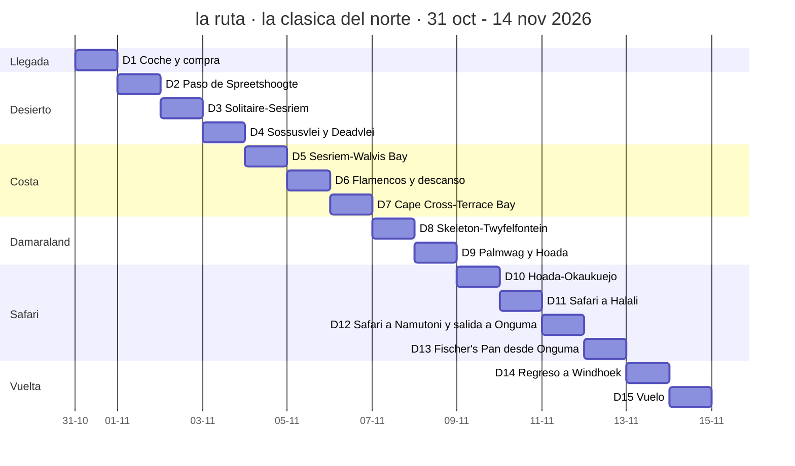
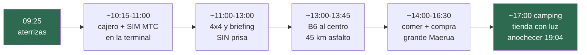
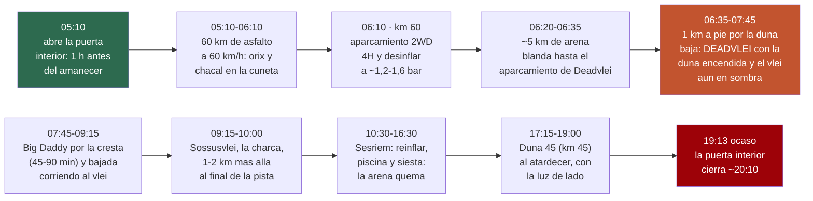
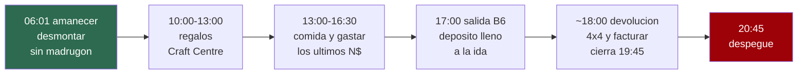
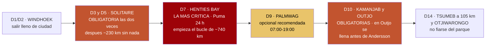

# 01 · Los itinerarios, día a día

> **Namibia · 30 oct – 15 nov 2026 · la clásica del norte** — [← índice del dossier](README.md)
>
> La ruta desarrollada día por día: qué se conduce, a qué hora sale y se pone el sol, qué temperatura hace donde se duerme y qué cuesta cada noche.
>
> **~N$20 = €1**, de bolsillo *(el cambio real de 2026 va por **18,5–19,4** — BCE, 28/08: el euro de estas páginas se queda ~7 % corto)* · **✅** fuente primaria · **◐** secundaria concordante ·
> **○** práctica común, sin fuente · **❌** sin verificar, dicho en blanco
>
> *Investigación cerrada el 17/07/2026 · formato y contenido revisados el 09/08/2026 — los km por
> etapa, unificados con el enrutado OSRM propio (ver `13` §contraste)*

> ## 🗺️ Esta es LA ruta del viaje
>
> Decisiones del viajero, en orden: **primera quincena de noviembre**, **Sossusvlei y Etosha los
> dos**, y **el sur fuera entero**. El resultado es la ruta de abajo: la clásica del norte a ritmo
> lento, la misma familia que el itinerario de
> [lugaresincertos.com](https://www.lugaresincertos.com/en/travel-inspiration/two-week-trip-to-namibia/)
> que sirvió de referencia, pero montada con datos verificados.
>
> *Las variantes que se estudiaron y se descartaron (con el sur, sin Etosha, o todo comprimido) ya
> no están en el dossier: se quitaron el 03/08/2026 para dejar solo lo que se va a hacer. Quedan en
> el historial de git.*

---

<div align="center">

## ⭐ LA RUTA — la clásica del norte, a ritmo lento
### Como la del blog de referencia, pero con nuestros datos verificados

</div>

**~2.798 km · 15 días de coche, aeropuerto → aeropuerto (31 oct – 14 nov, decidido 07/08) ·
ningún día por encima de ~412 km salvo el regreso por asfalto (D14, ~539) · UNA noche en la
escarpa de Spreetshoogte, dos en Sesriem, dos en la costa, DOS en Damaraland
—Twyfelfontein y Hoada— y CUATRO en Etosha ·
llegada el sábado 31 de octubre a las 09:25, vuelta el sábado 14**

> ### ✅ Las cuatro noches de Etosha, RESERVADAS — y las dos últimas ya fuera del parque *(act. 24/08/2026)*
> **9–10 nov · Okaukuejo** y **10–11 nov · Halali**, las dos dentro, a **N$920 (~€46) la noche los
> dos** ✅ — y **11–13 nov, DOS noches en [Onguma Tamboti](https://onguma.com/)**, el camping de la
> reserva privada que linda con la puerta de Von Lindequist, **3,4 km pasada la puerta** ◐ *(enrutado propio sobre OSM)*.
> **Namutoni ya no es noche de nadie**: su parcela se cambió por la segunda de Onguma.
>
> - **Se pierde una charca iluminada de las tres, y es la floja**: Okaukuejo el D10 y Halali el D11
>   siguen igual; la de Namutoni —la peor de las tres según los partes— es la que cae.
> - **Y se pierden las dos actividades de NWR que dependían de dormir dentro**: el **nocturno
>   guiado** *(N$750 · ~€38 pp)*, que se hacía desde Namutoni, y la **salida guiada de mañana de
>   Namutoni** *(N$650 · ~€33 pp)*. Se compran durmiendo la víspera en el campamento, y ya no se duerme
>   ahí. **Lo que las sustituye lo vende Onguma**: su **Sundowner Drive con foco y campo a través**
>   *(N$980 · ~€49 pp ✅)* y su **game drive guiado dentro de Etosha** *(4 h, N$1.930 · ~€97 pp ✅)*. El detalle y
>   el choque de horarios, en el D12 y el D13.
>   ❌ *Si NWR vende el nocturno a quien no duerme en el campamento, no se ha podido verificar:
>   pregúntalo en la llamada.*
> - **Se gana el D13 entero en una reserva privada** de **35.970 ha** con **leopardo, guepardo y
>   rinoceronte confirmados por escrito**, que vende **foco, campo a través y paseo a pie** — las
>   tres cosas prohibidas dentro del parque.
> - **Y se gana media hora el D14**: durmiendo fuera **no hay que esperar a que la puerta abra**.
> - **De coste**: **+N$320 (~€16) la pareja y por noche** *(Onguma N$1.240 frente a los N$920 de
>   Namutoni)*, y **las tasas de parque no se mueven**: se está dentro del parque los días **9, 10,
>   11 y 12**, y la tasa se cobra **por cada 24 h desde la entrada** *(`03`)* — dormir fuera no
>   quita ninguno de esos cuatro días ni añade un quinto. **Siguen siendo 4 unidades.**
>
> > 🐆 **Y la segunda noche de Onguma es FIRME desde el 26/08.** El desvío al Cheetah Conservation
> > Fund, que hasta ahora figuraba como puerta de salida, **queda descartado**: el D13 —día entero
> > en las llanuras del este— es la mejor ventana de guepardo salvaje del viaje, y bajar al CCF se
> > la comía entera. El plan del guepardo, sin red y por eso más exigente, en
> > [el plan del guepardo](aparte/plan-del-guepardo.md).
>
> *Onguma por dentro, en [`21`](21-campamentos-de-etosha.md); su tarifa, en
> [`03`](03-alojamiento-y-tasas.md); la reserva, en [`20`](20-reservas.md).*

> ### 📅 El 1 de noviembre sigue siendo la fecha mágica
> **NWR entra en tramo barato** (Sesriem, Halali, Okaukuejo, Terrace Bay — la primera noche NWR
> del plan es Sesriem, el 2). El coche está **RESERVADO con Savanna, €2.363 en total, los 15 días
> completos** *(`20` §1)*.

> ### ❓ ¿Etosha al principio o al final? → **AL FINAL.** Tres razones con datos:
> 1. **Dinero**: con el desierto primero, **todas las noches NWR caen después del 1 de noviembre**
>    (tarifa baja) aunque se aterrice el 31 de octubre. Etosha primero habría significado tarifa
>    vieja **y** el pico de calor del parque (37,8 °C de media de máximas en octubre).
> 2. **Termómetro**: Etosha se enfría según avanza noviembre (37,8 oct → 37,1 media nov).
> 3. **Rodaje y crescendo**: asfalto y grava fácil primero; el safari como clímax, no aperitivo.
>
> *El contra, honesto: el riesgo de primeras tormentas sube mínimamente hacia el día 15 (en 2 de 5
> temporadas cayó algún chubasco suelto en la primera quincena — aislado, no la temporada
> asentada). Marginal frente a lo anterior.*



> ### ☀️ El sol de tu viaje *(cálculo astronómico NOAA, hora local UTC+2, coordenadas aproximadas — margen ±5 min; cuadra con el ~19:15 de fin de noviembre que da NWR ◐)*
> Cada día lleva abajo su amanecer y anochecer. El patrón que importa: **en Etosha anochece antes
> (~19:05, está al este) y en la costa después (~19:20)** — la regla de «en el campamento a las
> 18:00» vale igual en toda la ruta.

> ### 🌙 Y la luna: el viaje acaba en NOCHE CERRADA *(recalculado el 28/08 con las series periódicas de Meeus; antes iba con «conjunción de referencia + mes sinódico», que se quedaba 3–7 puntos alto)*
> **Luna nueva el 9 de noviembre a las ~09:00 locales — clavada en las noches de Etosha.** El arco,
> con la fracción iluminada a las 21:00 de cada noche: se sale de Windhoek con una **menguante del
> ~51 %** que ya no sale hasta bien entrada la noche *(D2: primeras horas de estrellas limpias en la
> escarpa)*; el **amanecer de Deadvlei (D4) lleva un menguante del ~29 % colgado sobre las dunas**;
> la costa la apaga del todo *(D6 ~12 %, D7 ~6 %)*; **la noche de Twyfelfontein (D8) cae al ~2 %** y
> la de **Hoada (D9), al 0,3 %** — las dos noches de Damaraland, con el granito y el cielo entero; y
> **las cuatro noches de Etosha (D10–D13) van del 0,2 % al 11 %**: el **D10 en Okaukuejo es la noche
> más oscura del viaje entero (0,2 %)** y el D11 en Halali va al 2 % — **que es justo la noche del
> leopardo en Moringa**. La vuelta (D14–D15), con un creciente fino al atardecer *(18 % y 25 %)*.
> ✅ *Y el sol de aquí abajo está verificado: los quince amaneceres y ocasos se recalcularon el 28/08
> con el algoritmo solar de la NOAA sobre las coordenadas de `trazado.py` y **cuadran los quince,
> ninguno con más de 2 minutos de diferencia**.*
> *(El registro del cálculo, en `15`; la fotografía nocturna tiene su propio repo, aparte de este
> dossier.)*

> ### 🌡️ Y la temperatura donde duermes — medias de NOVIEMBRE
> Cada noche lleva su **máxima media / mínima media** del mes. **Son medias mensuales, no la
> previsión de tu día**: el récord de noviembre en el sur llega a 41–42 °C (`15`).
> **Regla de fuentes de este repo:** las webs de safaris fueron **refutadas 0–3** (`15`), así que
> aquí solo hay **estación ✅** (o secundaria que la cite) y, donde no hay estación, **reanálisis
> ERA5 ◐** ⚠️ *(cuyo ±0,04 °C es la **reproducibilidad del cálculo**, no el error contra
> estaciones: contra estaciones ERA5 clava la meseta pero se queda **~2 °C corto en sabana seca** —
> precisado el 28/08, `15` §ERA5)*. Terrace Bay se queda en «sin
> dato» a propósito: su celda ERA5 es mar.
>
> ```mermaid
> flowchart LR
> T["Noviembre donde duermes<br/>media de máxima / mínima, en °C"]
> n0["Walvis Bay · la costa<br/>25,0 día / 12,7 noche"]
> n1["Windhoek<br/>31,2 día / 16,3 noche"]
> n1b["Spreetshoogte · escarpa<br/>31,5 / 17,1 · ERA5"]
> n2["Sesriem · el desierto<br/>32,5 día / 15,5 noche"]
> n2b["Hoada · Damaraland<br/>33,1 / 18,4 · ERA5"]
> n3["Okaukuejo · Etosha<br/>37,1 día / 18,9 noche"]
> T ~~~ n0
> n0 ~~~ n1
> n1 ~~~ n1b
> n1b ~~~ n2
> n2 ~~~ n2b
> n2b ~~~ n3
> style T fill:#7a3a22,color:#fff,stroke:#7a3a22
> style n0 fill:#2d6a4f,color:#fff,stroke:#2d6a4f
> style n3 fill:#9d0208,color:#fff,stroke:#9d0208
>```
>
> **El viaje entero cabe en una frase: la costa fresca (20–25 °C), el desierto y la meseta calurosos
> (31–33 °C) y Etosha duro (37 °C) — y TODAS las noches entre 12 y 19 °C.** Por eso el equipaje
> lleva forro polar y no plumas (`05`).

> ### 🏕️ Dónde se duerme: **en la tienda de techo siempre que se pueda**
>
> El plan es dormir arriba las 14 noches y **meterse en campings**, incluidos los dos de dentro de
> Etosha y los dos de Onguma, a su puerta. Estado noche a noche:
>
> ```mermaid
> flowchart TD
>     T["TIENDA DE TECHO · 8 noches ya RESERVADAS<br/>D1 Windhoek Urban Camp · D2 Spreetshoogte<br/>D3-D4 Sesriem dentro de la puerta · D10 Okaukuejo<br/>D11 Halali · D12-D13 Onguma Tamboti, fuera de la puerta"]
>     D["POR ELEGIR CAMPING · 5 noches<br/>D5-D6 Walvis Bay: Lagoon Chalets<br/>D8 Twyfelfontein y D9 Hoada: Damaraland<br/>D14 Windhoek: se repite el Urban Camp"]
>     P["HABITACION, NO TIENDA · D7 Terrace Bay<br/>el tarifario oficial de NWR no tiene camping aqui:<br/>doble en media pension, N$3.480 (~EUR 174) los dos"]
>     T ~~~ D ~~~ P
>     style T fill:#2d6a4f,color:#fff
>     style P fill:#e85d04,color:#000
> ```
>
> **El recuento, que suma 14:** **8** ya resueltas en tienda *(D1, D2, D3–D4, D10, D11 y D12–D13)* ·
> **5** en las que se duerme arriba pero falta cerrar campamento *(D5–D6 Walvis Bay, D8
> Twyfelfontein, D9 Hoada y D14 Windhoek)* · **1 imposible**: *D7 Terrace Bay* (no tiene camping).
>
> 👉 **El techo real son 13 de 14 noches arriba** — con el coche del aeropuerto, la primera y la
> última también. La única que no puede ser: Terrace Bay, que solo tiene habitaciones.
>
> ### 🚗 El coche: **aeropuerto → aeropuerto, DECIDIDO** *(07/08/2026)*
>
> Se recoge el **31 de octubre a la llegada** *(~11:00, tras aterrizar a las 09:25)* y se
> devuelve el **14 de noviembre camino del embarque** *(~18:00)* — **15 días**. Ni hoteles en
> Windhoek ni traslados: **las noches de ciudad también se duerme arriba**, en camping.
>
> El coche está **RESERVADO con Savanna (12/08): €2.363 en total, 15 días completos, con transfer
> aeropuerto ↔ oficina** *(el detalle, en [`20`](20-reservas.md) §1)*.

### D1 · sáb 31 oct — Llegada, coche y LA compra grande *(plan horario)*



- ✈️ **09:25 · aterrizas** con el vuelo de Oporto *(ver [`02`](02-presupuesto.md) §8)* —
  inmigración con el e-visa impreso (`04`) y maletas: cuenta **~45 min–1 h** ○ *(sin dato
  publicado de colas; es un avión de largo radio entero de golpe)*
- 💱 **~10:15–11:00 · dinero y SIM sin salir de la terminal** — cajeros de FNB y Bank Windhoek ✅:
  **N$500–1.000 (~€25–50) de bolsillo** ○ *(el del aeropuerto admite hasta ~N$3.000 · ~€150,
  reportes de viajeros ○; la carga grande, mejor en ciudad — cajero junto a sucursal, ver `07`)* — y la **SIM turista de MTC**
  *(«Leisure» N$349 · ~€17, registro con pasaporte obligatorio; ver `07`)*
- 🚙 **~11:00–13:00 · transfer a la oficina de Savanna y recogida del 4×4** ✅ *(Savanna no
  entrega en el propio aeropuerto: transfer gratuito a su oficina de Windhoek, incluido por ser
  15 días — `20` §1)*. **Al firmar, pedir por escrito la zona sunrise/sunset de la Opción 4**
  *(por Deadvlei, `20` §1)*. **Briefing sin prisa (1–2 h)**: presiones en frío
  apuntadas, las DOS ruedas de repuesto, gato y compresor a la vista *(`06`)*, el **inventario del
  camping contra la ficha** *(`20` §1)* y las **preguntas de la nevera**
  *([`18`](18-manual-de-campamento.md), §5)*
- 🚗 **~11:00 · los 45 km de la B6 al centro se hacen EN EL TRANSFER de Savanna, no al volante**
  *(su oficina está en el 80 de Trift Street, en el polígono sur — `20` §1)*. **La conducción por la
  izquierda se estrena en los ~5 km de ciudad de la oficina a Maerua**, un sábado y con rotondas:
  despacio *(corregido el 28/08 — antes esto se contaba como el primer tramo conducido)*
- 🍽️🛒 **~14:00–16:30 · comer y LA compra grande, HOY que es sábado** — Maerua Mall ○: algo rápido
  de comer y **SuperSpar + TOPS anexo** — cerveza y vino incluidos: **mañana es domingo y el
  alcohol para llevar cierra por ley** ✅. Aquí también la **carga grande de efectivo
  (~N$6.000–8.000 · ~€300–400)**, en cajero pegado a sucursal *(`07`)*. La lista entera, para
  tachar, en [`08`](08-comida-compras-y-regalos.md). **⛽ Y depósito lleno al salir de la
  ciudad**: por Spreetshoogte no hay NADA hasta Solitaire *(`08`)* — el depósito son 140 l
  confirmados ✅ *(`20` §1)*, pero se entrega sin lleno: *pregunta al recoger con cuánto tanque lo
  entregan* ❌
- 🏕️ **~17:00 · al camping y primera montada de la tienda con luz y sin público** — ☀️ anochecer
  ~**19:04** *(jet lag: +1 h respecto a la península — ninguno)*. **Las ~2 h hasta el anochecer son
  el colchón del día**: cualquier retraso de inmigración, briefing o compra sale de ahí
- ⚠️ **¿Salir ya esta tarde hacia Spreetshoogte? NO.** Desde la compra (~16:30) son 3h–3h30 de
  ruta con grava: llegada de noche a un descenso técnico, con el coche recién cogido y tras una
  noche de avión — **rompe la regla de las 18:00 el primer día** *(`06`)*. **Al paso se sale
  mañana por la mañana, descansados — decidido (08/08)**
- 🌡️ **Windhoek 31,2 / 16,3** ✅
- 🐾 **Alrededor del camping: nada que esperar — es ciudad** ○. La fauna empieza mañana en la
  escarpa *(desde hoy, cada noche lleva esta línea: qué puede rondar donde duermes, con su fuente)*
- 🍺 **Cena: braai de estreno en el camping — o Joe's Beerhouse si el cuerpo no está para
  cocinar** *(reservar; la mesa de despedida vuelve el D14)*
- 🛏️ **Urban Camp — RESERVADO ✅ (24/08)** *(Schanzen Road; piscina, bar, wifi, cajero)*. Arriba
  desde la primera noche, y **única noche de ciudad a la ida**. **Tarifa ❌: no la publican** — pide
  el importe por escrito al confirmar. *(La noche del D14, la de vuelta, sigue sin cerrar: lo
  natural es repetir aquí — `20` §6.)*

### D2 · dom 1 nov — Windhoek → paso de Spreetshoogte · **~205 km · ~3h–3h30** ◐ *(OSRM; decidido 08/08)*
- 🚗 **Salida ~09:00–09:30, sin madrugón** — **el día flojo del plan anterior (domingo en una
  ciudad cerrada por ley) se muda a la escarpa** *(el análisis, en
  [`16`](16-punto-de-decision.md))*: la primera grava se estrena descansados y con el día entero
  por delante
- ⚠️ **Es domingo: las bottle stores y las secciones de alcohol cierran por ley** ✅ *(ver
  [`08`](08-comida-compras-y-regalos.md))* — por eso TODO se compró ayer. *Los súper abren si
  falta algo — sin alcohol*
- 🌡️ **Spreetshoogte: medias de noviembre ~31,5 °C máx / ~17,1 °C mín** ◐ *(reanálisis ERA5,
  celda del borde de la escarpa; el cálculo reproduce Windhoek/Sesriem a ±0,04 °C — ver `15` §ERA5)*.
  **Confirma el proxy de Windhoek** (31,2/16,3 ✅): misma altitud (~1.700 m), mismo clima de meseta.
  Arriba corre viento y refresca al caer el sol ○
- ☀️ amanecer **06:07** (Windhoek) · anochecer **~19:09** (el paso) — *el atardecer en el paso es
  el plan del día: en posición hacia las 18:40*
- B1 a Rehoboth (87 asfalto) → C24 → D1261 → **D1275: el paso**. ⚠️ **Muy empinado**, tramos de
  hormigón para tracción, prohibido a caravanas — se baja despacio y es espectacular
- 💧🪵💶 **La carga de escarpa se hizo AYER**: agua **≥3–4 garrafas de 5 L** ○ *(la regla de
  4 L/persona/día de `06` es de coche; la cocina suma)*, **leña para UN braai** y **efectivo**: en
  Spreetshoogte **no consta tienda, restaurante ni datáfono** ❌ *(**N$580 · ~€29** los dos por la
  noche — tarifa cerrada el 24/08 ✅, `20` §5 — **más la leña, que allí se vende: N$55 (~€2,75)
  el fardo de 10 kg**)*. Sin cajero fiable hasta Walvis Bay (D5): **no
  bajar de N$4.000 (~€200)** *(`07`)*
- 🌇 **Atardecer desde el mirador del paso**: el Namib a 1.000 m bajo tus pies
- 🐾 **Alrededor del campamento: sin parte de avistamientos — es granja privada en la escarpa** ❌.
  Ni Expert Africa publica partes aquí ni el polígono GBIF del Namib llega tan al norte:
  **pregúntale al dueño qué baja al anochecer**. Lo único afirmable: el chacal se oye en casi
  cualquier campamento del país ○
- 🌇 **Y la escarpa se hace en una sola noche — decidido el 24/08.** El atardecer desde el mirador
  sigue entero; lo que se va es el día sin volante de la mañana siguiente. **Esa noche liberada se
  fue a Damaraland**, a partir en dos el día más largo de grava del viaje *(D8 y D9; el argumento,
  en [la decisión del CCF](aparte/decision-del-ccf.md))*.
  ⚠️ **Y con ella se va el colchón del calendario**: ya no hay ningún día que sacrificar si el
  vuelo se retrasa. **La red que queda es la noche del D8** —Twyfelfontein, sin reservar y fuera de
  parque—: es la que se cae sin perder un céntimo *(`aparte/decision-del-ccf`)*
- 🛏️ **Spreetshoogte Campsite — RESERVADO ✅ (24/08), UNA noche** — lo opera **Barkhan Dune
  Retreat**: **N$290 (~€14,50) por persona y noche → N$580 (~€29) los dos**, parcela «stand only»,
  wifi gratis y máximo 4 adultos *(la **VIP con baño propio**, N$680 · ~€34 pp)*. Se reservó en
  **bookings@barkhan.africa** *(ojo a la trampa de nombre — «Camp Gecko» y Namibgrens son otros,
  `20` §5)*

### D3 · lun 2 — Spreetshoogte → Solitaire → Sesriem · **~129 km · ~2h–2h30** ◐ *(OSRM 128,8)*
- 🌡️ **Sesriem, media de máximas de noviembre: ~32,5 °C** ◐ *(reanálisis ERA5, celda a 4 km de la
  puerta; con el sesgo frío del interior la real ronda **33–34 °C**, que es justo el 34,1 ◐ de NWR —
  dos fuentes independientes, mismo entorno; ver `15` §ERA5)*. Mínima **~15,5 °C** ◐ (NWR)
- ☀️ amanecer **06:08** (Spreetshoogte) · anochecer **19:12** (Sesriem) — *la puerta exterior de
  Sesriem funciona de amanecer a ocaso: dentro antes de ~19:10*
- 🌅 **Y hoy el amanecer del mirador es de regalo, no de plan**: se duerme una sola noche arriba,
  así que el día empieza en la escarpa con luz y **sale sin prisa** — son solo 129 km
- Bajada del paso → C14 → 🥧 **Solitaire** (tarta + depósito lleno) → D826/C19 a Sesriem
- Tarde: **Sesriem Canyon** y atardecer en **Elim Dune** *(o el guiado de NWR, N$300 ≈ €15/persona)*
- 🎫 Namib-Naukluft ~N$620 (~€31)/24 h
- 🐾 **Alrededor del camping** — el fijo: **chacal de lomo negro al anochecer, a por las sobras** ○
  *(comida y basura cerradas: protocolo en `18` §7)*. En el llano, GBIF de oct–nov da **órix y
  avestruz frecuentes y springbok presente** ◐ *(zona del Namib: 168, 389 y 41 registros oct–nov;
  método y umbrales, en la [guía de fauna](guia-fauna-namibia.pdf))*
- 🛏️ **🔑 DENTRO de la puerta: Sesriem Campsite — N$1.340 (~€67) los dos, primera de DOS noches** ✅
  — **RESERVADO (24/08)**, con las fechas nuevas *(2 y 3 de noviembre, un día antes de lo que decía
  el plan de agosto)*

### D4 · mar 3 — Sossusvlei y Deadvlei · **122 km · día completo** ✅ *(OSRM 122,1)*

> **El día entero cabe en una idea: la luz buena de Deadvlei dura hora y media, y empieza cuando
> el sol asoma por encima de las dunas, hacia las 06:30.** Todo lo demás —Big Daddy, la charca de
> Sossusvlei, la Duna 45— se ordena alrededor de eso: lo de la mañana, temprano y en orden; el
> mediodía, fuera del desierto; y la duna del atardecer, al atardecer. *(Ampliado el 28/08 a
> petición del viajero; distancias y horas con su fuente, abajo.)*



- 🌡️ **Sesriem ~32,5–34 / 15,5 ◐** — y en la duna, a mediodía, la arena está muy por encima de eso:
  **Big Daddy se sube al amanecer o no se sube** ○
- ☀️ amanecer **06:10** (Deadvlei) · anochecer **19:13** — **la puerta interior abre 1 h antes del
  amanecer, ~05:10, y cierra 1 h después del ocaso, ~20:10** ✅ *(NWR: «opens 1 hour before sunrise and
  closes 1 hour after sunset» — `06` §12; confírmalo en recepción la víspera: se mueve con el orto
  real)*. Son ~60 km de asfalto a **60 km/h** *(límite del parque)* más ~5 km de arena: saliendo al
  abrirse se llega al 2WD justo al amanecer y **a Deadvlei con la duna ya encendida**, que es la luz
  que se busca — no la del minuto exacto del orto, que ahí abajo no entra
- 🌅 **Puerta interior 1 h antes del amanecer** — Deadvlei casi en solitario. 🌙 *Y la luna, al
  **~29 %** menguante: algo más de la que había en el plan de agosto —era el 4 y ahora es el 3—,
  pero sale tarde y de madrugada ya está alta y pálida; el amanecer manda igual*
- ⚠️ **Este tramo, antes del amanecer, es zona a riesgo propio del seguro de Savanna salvo que se
  pida por escrito en la entrega** — el detalle, en `06` §6 y `20` §1
- 📏 **Las distancias del día, para no calcularlas a oscuras** ◐ *(web de NWR, Wikipedia y las
  guías de 2025–26, concordantes)*: puerta interior → **Elim Dune, km 5** *(ramal a la derecha)* →
  **Duna 45, km 45** → **aparcamiento 2WD, km 60**, donde acaba el asfalto → **~5 km de arena** →
  **aparcamiento de Deadvlei** *(el de en medio de la pista de arena)* → **1 km a pie** por una duna
  baja hasta **Deadvlei** → **Sossusvlei, la charca de verdad, 1–2 km más allá**, al final de la
  pista. Aparte: **Hidden Vlei, 4 km a pie** desde el 2WD, con postes, y casi nadie va ·
  **Sesriem Canyon, a 4 km del campamento**: 1 km de largo, hasta 30 m de hondo y una poza que no se
  seca; el nombre son los *seis riems* —correas de cuero— que los trekkers empalmaban para llegar al
  agua con el cubo
- 🏜️ **Deadvlei es lo que hay que ver, y es a primera hora.** La duna de detrás —**Big Daddy, ~325 m,
  la más alta de la zona** ◐— se enciende de naranja mientras la arcilla blanca sigue en sombra: ese
  contraste dura hasta las ~08:30 y a mediodía no existe. Los árboles son espinos camello **muertos
  hace 600–700 años** *(hacia 1340–1430)*, cuando las dunas cerraron el paso al Tsauchab; siguen en
  pie porque no hay humedad que los pudra ◐ *(Wikipedia)*. **Ni se tocan ni se trepan**, y en la
  arcilla se pisa por donde ya hay huellas ○
- 🧗 **Big Daddy, si se sube: por la cresta, desde el aparcamiento de Deadvlei** ◐ *(guías 2025–26)*
  — 20–30 min hasta la base y **45–90 min de subida por el filo**, con paradas; arriba, Deadvlei
  entero a los pies y **Big Mama** enfrente. **Se baja corriendo por la cara de sotavento, derecho al
  vlei**: cinco minutos, y es la parte divertida. Regla de la casa: **en la cresta antes de las
  08:00 o no se sube** — a las 10:00 la arena quema y no hay una sombra en 5 km. Zapatilla ligera y
  cerrada *(la arena entra igual; hay quien sube descalzo y baja con calcetín)*, **≥2 L de agua por
  cabeza solo para la subida**, gorra y crema puestas desde el coche ○
- 🚙 **La arena, en tres reglas** *(el detalle, `06` §5)*: **4H ANTES de entrar**, desinflar **en el
  2WD y no antes** a **~1,2–1,6 bar**, y **no parar en blando** — roderas del de delante, inercia, y
  si te encajas, marcha atrás por tus propias huellas. **Reinflar al volver al 2WD, con el compresor
  del coche, ANTES de los 60 km de asfalto** — hacerlos a 1,2 bar y a 35 °C es la receta del
  reventón de `06` §11; en Sesriem hay aire para rematar. **El compresor se comprueba en la entrega
  del D1**. ⚠️ **La norma bailó en mayo de 2026**: el 1/05 se prohibió el self-drive en esos 5 km y
  el 2/05 el MEFT lo revirtió — *«self-driving visitors with 4x4 vehicles»* pueden seguir ✅ *(nota
  del MEFT del 2/05, citada en `06` §5)*. **Reconfírmalo a primeros de octubre**, y si vuelve la
  prohibición o no apetece la arena: **la lanzadera del concesionario About Africa** sale del propio
  aparcamiento 2WD, en continuo desde primera hora — **N$200 · ~€10 por persona** ◐ *(ida y vuelta;
  prensa namibia de agosto de 2025 y guías de 2026; alguna fuente da N$250)*, mientras **la web de
  NWR sigue listando N$180 · ~€9** ✅: el precio bueno es el que digan en recepción
- 🎫 **La tasa de parque no se paga otra vez**: las **dos unidades de Namib-Naukluft** del presupuesto
  *(`02` §5, ~N$620 · ~€31 cada una)* cubren el D3 y el D4 — se cobra **por 24 h desde la entrada**
  *(`03`)*. **Lleva el resguardo a mano**: en la puerta interior lo piden ○
- 💧🎒 **En el coche desde las 05:00** ○: **≥4 L de agua por cabeza para el día**, desayuno hecho la
  víspera *(o fruta y pan, y se come en el 2WD mientras se desinfla)*, ropa por capas *(a las 05:10
  hacen ~16 °C con viento; a las 10:00, 30)*, prismáticos *(órix, avestruz y springbok en el llano de
  la carretera, al alba)* y el móvil cargado, que la cámara va a trabajar: **no cuentes con cobertura
  pasada la puerta** *(`07`)*
- 🕐 **El mediodía no es del desierto** ○: a las 10:30 se está de vuelta en Sesriem reinflando;
  **piscina, sombra y siesta** en el campamento hasta las 16:30. **Hidden Vlei solo si a las 09:30 aún
  hay piernas y fresco**: 4 km a pie de ida desde el 2WD y sin sombra — el vlei que nadie hace; a
  mediodía, no
- 🌇 **Y la Duna 45 al atardecer, no al mediodía** ○: sale del campamento a las ~17:15, 45 km de
  asfalto y **20–30 min de subida por la cresta** ◐ con la luz de lado que la ha hecho la duna más
  fotografiada del país *(**su altura, en disputa y así se queda**: Wikipedia da «más de 170 m» y el
  NASA Earth Observatory, 80 — nadie la ha medido para nosotros)*, y de vuelta con el ocaso (**19:13**). **La puerta interior cierra
  ~20:10** para quien duerme dentro, así que hay margen; pero **esos 45 km no se hacen de noche**: la
  regla de las 18:00 se estira hoy hasta el ocaso y ni un minuto más *(`06`)*. *(Si el D3 se llegó
  con luz de sobra, la Duna 45 puede hacerse ayer al atardecer en vez de Elim Dune, y hoy la tarde
  queda libre.)*
- 🛏️ Sesriem, segunda noche ✅ **RESERVADA**

### D5 · mié 4 — Sesriem → Walvis Bay · **~316 km · ~5h30–6h** ◐ *(OSRM 315,6; el ~270 de la matriz de 2010 se quedaba corto)*
- 🌡️ **Walvis Bay, medias de noviembre: 25,0 °C máx / 12,7 °C mín** ✅ *(NOAA GHCN, estación del
  aeropuerto WMO 68098, serie 1990–2025; ver `15`)* — **la costa es el respiro térmico del viaje**:
  la corriente de Benguela. Pero ojo a la madrugada: **12–14 °C**, y viento. Cortavientos a mano
- ☀️ amanecer **06:08** (Sesriem) · anochecer **19:16** (Walvis Bay)
- C14 por los pasos de **Gaub y Kuiseb** + Trópico de Capricornio
- ⛽ **Solitaire otra vez, sí o sí** — después, **~230 km sin nada** *(OSRM Solitaire → Walvis 233)*
- 🐾 **Alrededor del camping: la laguna ES la fauna** — **flamenco común y enano a millares** ◐
  *(SABAP1 respalda la estacionalidad —su máximo es jun–nov, ver D6—; la magnitud es la fama
  documentada de la laguna)*. En GBIF de oct–nov los dos flamencos suman **2.536 registros ◐**
  *(registros, no cabezas)* — solo el **cormorán del Cabo (2.235)** les discute el podio — y detrás
  van las otras dos reinas de la laguna, con ficha nueva del 08/08: **gaviota de Hartlaub** *(1.591
  ◐)* y **avoceta** *(1.057 ◐)*; los **pelícanos** cierran la lista grande *(977 ◐)*. En
  tierra, nada que esperar: es ciudad ○
- 🛏️ **Walvis Bay — también en tienda.** El único sitio con camping que aparece listado en la
  ciudad es **Lagoon Chalets**, que es además el que usó el blog de referencia ◐. **Precio ❌: no
  lo publica.** *(Si no cuadra, Swakopmund a 30 km tiene más oferta de camping.)* ⚠️ **Las fechas
  bajan un día respecto al plan de agosto: 4 y 5 de noviembre, no 5 y 6.**

### D6 · jue 5 — Walvis Bay: flamencos y descanso ✅
- 🌡️ **Walvis Bay 25,0 / 12,7** ✅ — el día fresco del viaje: aprovecha para el Welwitschia Drive
- ☀️ amanecer **06:14** · anochecer **19:17** — *flamencos con la primera luz, ~06:15–07:30*
- 🌊 **La marea manda sobre Sandwich Harbour**: bajamar **06:37** y **19:01**, pleamar **12:42** ◐
  *(predicción de [tidetime.org](https://www.tidetime.org/africa/namibia/walvis-bay-calendar-nov.htm)
  para el 5-nov, releída el 24/08 al adelantarse el día — y mareas VIVAS hacia el novilunio del 9:
  playa ancha)*. **La salida de las ~08:30 es la que baja por la playa hasta la laguna** —y hoy sale
  aún mejor: la bajamar cae **41 min antes** que en la fecha anterior, así que la ventana de playa
  se abre antes—; **la de las ~12:30 cae casi en pleamar** y suele quedarse en los miradores. El
  operador planifica con su propia tabla: **confírmalo al reservar** *(detalle en `15`)*
- 🦩 **Y tu mes es de los buenos**: en Walvis Bay los flamencos tienen su **máximo de junio a
  noviembre** ◐ *(SABAP1, ficha 096: «maximal June–November (A.J.W. pers. obs)» — es una observación
  personal dentro del atlas, no un recuento del atlas)*. Aquí sí los hay en cantidad — en Etosha, en cambio, **no**: la depresión está
  seca en noviembre *(ver `09`)*
- 🦩 **Flamencos y pelícanos en la laguna** al amanecer y al atardecer — las mejores luces
- 🐋 **Y el crucero cae en temporada de ballena jorobada** ◐ — los registros GBIF de esta costa
  dan la migración **jun–nov** *(pico jul–sep con 42; noviembre aún 27; diciembre se desploma a
  5 — consulta del 08/08/2026, archivada mes a mes en `15`)*; los **delfines se ven todo el año** *(el de
  Heaviside es residente de la corriente de Benguela — su ficha está en la guía; el mular,
  práctica común de los cruceros ○)*. Ficha nueva en la [guía de fauna](guia-fauna-namibia.pdf) *(añadida el 08/08)*
- Día libre: paseo marítimo, ostras, y la excursión guiada a **Sandwich Harbour en 4x4** —
  **decidida (24/08)** *(~N$2.600–3.220, ~€130–161 pp ◐)*; el **crucero de delfines y lobos**
  sigue abierto como alternativa o complemento del mismo día *(~N$1.400–1.990, ~€70–100 pp ◐)*
  *(🚫 con el coche, Sandwich Harbour está prohibida en el contrato de **Asco** —el de Savanna, ya leído, no la nombra, pero sí anula el seguro fuera de pista— el tour es la forma correcta y mejor;
  precios y fuentes en [`02`](02-presupuesto.md), §9 y [`20`](20-reservas.md) §7)*
- 🛏️ Walvis Bay, segunda noche

### D7 · vie 6 — Cape Cross → Terrace Bay (Skeleton Coast) · **~412 km · día logístico** ◐ *(OSRM 411,5; el ~380–390 por tramos se quedaba corto — `13`)*
- 🌡️ **Terrace Bay: sin dato de estación** — no hay serie pública ni en Möwe Bay ni en Terrace
  Bay, y **ERA5 tampoco sirve aquí**: su celda más cercana cae sobre el mar *(da aire marino ~19 °C,
  no tierra; ver `15` §ERA5)*. Proxy honesto: **la costa ronda los 25,0 °C de Walvis Bay ✅**, 400 km
  más al sur — con **niebla, viento y menos calor que tierra adentro** ○
- ☀️ amanecer **06:18** (Cape Cross) · anochecer **19:19** (Terrace Bay) — *pero aquí el sol no es
  el límite: lo es la puerta de las 15:00*
- ⏰ **Salida temprana — este día tiene una hora límite.** C34 costera (sal compactada):
  Swakopmund → Henties Bay → 🦭 **Cape Cross** (miles de lobos marinos; pañuelo para el olor).
  ⛽ **En Henties Bay se llena sí o sí** *(Puma 24 h)*: es el último surtidor seguro antes del
  bucle de la costa y Damaraland — la aritmética del depósito, en `07`
- 🎫 **Cape Cross cobra entrada propia, aparte del permiso de Skeleton Coast:** **N$280 (~€14)/extranjero
  + N$60 (~€3)/coche** (≤10 plazas) = **~N$620 (~€31) los dos** ◐, en **efectivo**, se paga en recepción
  al entrar. **No** son las 7 unidades de `02` §5 — súmalo. *(Corregido el 25/08: el dossier contaba
  N$150 (~€7,5) + N$50 (~€2,5) = N$350 (~€17,5), que es la tarifa de 2021; desde abril de 2026 las
  secundarias concordantes ponen la Cape Cross Seal Reserve en el tramo premium, el de Etosha — `02` §5.)* Horario ◐: **abre a las 08:00 solo del 16 nov al 30 jun; el resto del año, a
  las 10:00** ◐ *(secundarias concordantes; la ficha del MEFT ya abre —25/08— y **no lleva horario**, así que sigue sin primaria)*. **Ojo: vuestro D7 es el 6 nov,
  antes del 16 → Cape Cross abre a las 10:00, NO a las 08:00** *(y adelantar el día del 7 al 6 no cambia
  nada: la raya está en el 16)*. No hay entrada a primera hora: apuntad
  el alto de los lobos a las 10:00 en punto y salid seguidos. De Cape Cross a Ugabmund quedan **~80 km**
  *(OSRM)*: cruzáis de sobra antes de las 15:00 — y de la puerta a Terrace Bay quedan aún **~160 km**
  de parque a 60: no os entretengáis
- 🛑 **Puerta de Ugabmund: última entrada 15:00.** Para pernoctar dentro hace falta **reserva
  confirmada de Terrace Bay** — sin ella no se entra (el permiso de tránsito obliga a salir el
  mismo día)
- Dentro del parque: **60 km/h** · 🎫 Skeleton Coast ~N$620 (~€31)/24 h
- 🛏️ **Terrace Bay (NWR)** — dormir en la Costa de los Esqueletos, con la niebla y el
  Atlántico rugiendo. **Ojo: es un resort con media pensión (DBB), no un camping** — el precio,
  cerrado, dos líneas más abajo
- 🐾 **Alrededor del resort** — el **chacal de lomo negro es el fijo de la costa** *(GBIF costa:
  271 registros, 57 en oct–nov ◐)* y la **hiena parda deja huellas en las playas** ○ — en GBIF
  hay 17 registros en la zona pero **solo 4 en oct–nov: muestra corta, no se afirma más** ◐. **Springbok, órix y hasta
  hiena parda en el delta del Uniab**, que se cruza dos veces ◐ *(`10`)*. ¿León del desierto en la
  playa? **1 registro en la zona: por debajo del umbral — no se afirma nada**
- 💰 **Precio cerrado (03/08) ✅:** el PDF oficial de tarifas de NWR 2026/2027 da para Terrace Bay
  **habitación doble en media pensión a N$1.740/persona → N$3.480 (~€174) los dos**, en tu ventana.
  **No hay camping**: la ficha web listaba una fila de «Campsite» que **no existe en el tarifario**
  — es un error de su web. Es **la noche más cara del viaje**, pero incluye **cena y desayuno**.
  ⚠️ **La fecha baja un día: 6 de noviembre, no 7** — se reserva con la fecha nueva
- *Variante fácil: saltarse Terrace Bay, dormir en Henties/Swakopmund y entrar a Damaraland al día
  siguiente por Springbokwasser en tránsito — un día mucho más corto*

### D8 · sáb 7 — Skeleton Coast → Springbokwasser → Twyfelfontein · **~211 km · ~3h–3h30 de volante** ◐ *(OSRM 211,5)* ⬅️ **la noche nueva**
- 🆕 **Éste es el día que no existía.** Sale de quitarle la segunda noche a Spreetshoogte, y **parte
  en dos el día más largo de grava del viaje**: lo que era una tirada de ~370 km con la visita de
  los grabados metida en medio pasa a ser **211 + 159 km**, con la mañana del D9 libre entera
  *(el argumento completo, en [la decisión del CCF](aparte/decision-del-ccf.md))*
- 🌡️ **Twyfelfontein, en el valle: sin estación** ❌ — la referencia más cercana es
  **Hoada/Grootberg, ~33,1 °C máx / ~18,4 °C mín** ◐ *(ERA5; ver `15` §ERA5)*, y **el valle de
  Twyfelfontein es más caluroso a mediodía que la meseta de Grootberg** ○: los grabados se ven
  **temprano o a última hora**, no a las 14:00
- ☀️ amanecer **06:23** (Terrace Bay) · anochecer **19:15** (Twyfelfontein) — *el amanecer más
  tardío del viaje: estás en el extremo occidental del huso*
- Salida por **Springbokwasser** → C39 → D2612/**D3254** → **Twyfelfontein**. **Terrace Bay →
  Twyfelfontein son ~211 km ◐** *(OSRM; cuadra con el 96+120 verificado el 03/08 y con los 216 del
  routeplanner)*: **grava entera**, sin puerta con hora — pero **el permiso de Skeleton Coast obliga
  a salir del parque el mismo día**, así que tampoco hay que dormirse
- 🗿 **Los grabados, con tiempo por primera vez**: **Twyfelfontein** (arte rupestre, Patrimonio de
  la Humanidad; Google lo lista como cerrado — **es un fallo del listado**). ⚠️ **La visita guiada
  es obligatoria y de pago: N$270 (~€13,5)/persona, solo efectivo** ◐ *(tarifario NHC; ver `11`)*.
  Llegando a media tarde entra **hoy o mañana temprano**: es la ventaja de dormir aquí
- 🏜️ **Y con la tarde libre, lo que hay al lado**: el **Organ Pipes**, la **Burnt Mountain** y el
  **Bosque Petrificado** están a pocos kilómetros *(`10`)*
- ⚠️ **Damaraland: los bajos, cubiertos por la Opción 4 de Savanna** ✅ *(`20` §1)*, pero
  Damaraland también puede entrar en las «zonas a riesgo propio» del seguro si se sale de pista
  marcada — despacio en las piedras y dentro de la carretera
- 🐾 **Alrededor del campamento** — Damaraland en GBIF oct–nov: **el elefante del desierto pasa
  por la zona** *(139 registros, 27 en oct–nov ◐)* — cruzárselo es suerte, no plan *(y si pasa,
  protocolo del `18`)*; **damán en el granito** *(62/13 ◐)*, **springbok** *(50/23 ◐)* — y por
  encima del umbral también avestruz, jirafa y el propio babuino ◐ *(el detalle, en la guía)*.
  Lo que no llega a muestra, no se afirma
- 🌙 **Luna al ~2 %**: casi novilunio, y aquí no hay una sola luz alrededor
- 🛏️ **Damaraland, y ESTA es la noche que NO hay que reservar con antelación** — ni está dentro de
  un parque ni es Sesriem, y **noviembre es temporada hombro**: la práctica documentada es que
  fuera de Etosha y Sesriem no hace falta reservar ◐ *(`20` §antelación)*. **Por eso es la red del
  calendario**: si el vuelo se retrasa el D1, es la que se cae **sin perder un céntimo**.
  **Tarifa ❌ en los dos candidatos**: **Twyfelfontein Country Lodge** *(un agregador da «desde
  ~$223 pp DBB» para may–oct 2026 ◐, sin cifra limpia de noviembre — `15`)* y la zona de **Palmwag**,
  50 km más al norte, que además es la base de los rastreos. **Pide las dos por escrito** *(`20` §5)*

### D9 · dom 8 — Twyfelfontein → Palmwag → Hoada · **~159 km · ~2h15–2h35 de volante** ◐ *(OSRM 158,7; «~2,5 h» del operador)*
- 🌡️ **Hoada/Grootberg: medias de noviembre ~33,1 °C máx / ~18,4 °C mín** ◐ *(reanálisis ERA5,
  ninguna estación GHCN cae cerca; ver `15` §ERA5)*. **Es un suelo, no un techo**: en sabana seca
  ERA5 se queda ~2 °C corto, así que el mediodía real ronda **34–35 °C**. Está entre la meseta (~31)
  y el norte caluroso
- ☀️ amanecer **06:17** (Twyfelfontein) · anochecer **19:15** (Hoada) — *y es domingo: sin alcohol
  a la venta* ✅ *(`08`)*
- 🦏 **La mañana libre es el premio del día. El rastreo de rinoceronte 🟡 es una alternativa, no
  el plan** *(bajado de rango el 29/08, a petición del viajero, con lo que la auditoría del 28/08
  destapó)*. La mañana existe porque el 24/08 se partió en dos el día de 370 km *(`aparte/desvios`)*;
  lo que no existe es el hueco horario que se le suponía.
  ⚠️ **Y aquí hay un problema de horario que el plan de agosto no vio, destapado el 28/08**: el
  rastreo de rinoceronte de media jornada de Palmwag **sale entre las 06:00 y las 06:30**, no a media
  mañana ✅ *(tarifa 2026/27 de Gondwana, la que opera Palmwag Lodge: «Half Day Rhino Tracking ·
  Departure: between 6h00 and 6h30 AM · **N$3.975 (~€199) por persona**, mínimo 2»)*. Saliendo de
  Twyfelfontein a las ~07:00 se llega a las **~08:45** y ya ha salido. **Con la ruta como está, el
  rastreo de rinoceronte NO cabe.** Las tres salidas posibles, dichas claro:
  - 🥇 **Dormir el D8 en el camping de Palmwag en vez de en Twyfelfontein** — los grabados se ven
    esa misma tarde al llegar, y el D9 empieza con el rastreo a las 06:00 y sigue con los 51 km a
    Hoada. Es la única forma de que quepa, y **cuesta N$7.950 (~€398) la pareja** ❌ *(sin reservar)*
  - 🥈 **Cambiarlo por lo que sí sale a las ~07:00 en Palmwag**: **Half Day Nature Drive, ~3 h,
    N$1.355 (~€68) pp** ✅, o las caminatas guiadas de 2 y 5 km *(N$400 y N$485 · ~€20 y ~€24 pp ✅)*.
    Sigue sin ser rinoceronte, pero es Damaraland con guía y cabe llegando a las 08:45
  - 🥉 **No parar y ganar la mañana**: Twyfelfontein temprano y llegar a Hoada a mediodía, con la
    tarde en el granito
  ⚠️ **El de rinoceronte de DÍA ENTERO de Grootberg sigue sin caber**: sale a primera hora desde el
  lodge, y llegar a esa hora pediría ~130 km de grava **antes del amanecer** — contra la regla del
  `06` y contra la cláusula de Savanna *(`20` §1)*. **Los precios de Grootberg siguen ❌**: pídelos por
  escrito — **res4@journeysnamibia.com · +264 61 228 104** *(`20` §5)* *(detalle en `11`)*.
  📞 **Palmwag se reserva en Gondwana: +264 61 427 200 · info@gcnam.com** ✅
- Ruta: **Twyfelfontein → Palmwag ~107 km** ◐ → **paso de Grootberg** → **Hoada ~51 km**. Grava
  entera, y **la C40 por el paso es de las carreteras bonitas del país** ○
- ⛽ **Palmwag es el surtidor de respaldo del tramo** *(`07`)* — si el de Terrace Bay falló, aquí
  se repone
- 🥩 **Y aquí está la primera puerta veterinaria del viaje, que el dossier situaba solo en Etosha**
  *(corregido el 28/08)*: el control de la Línea Roja está **en la C43, entre el cruce de la C40 y el
  lodge de Palmwag** ◐ *(OpenStreetMap: «Disease Control Point», −19,884 · 13,949; el lodge queda
  ~500 m al norte)*. Se cruza **hacia el sur** al salir de Palmwag rumbo a Grootberg, y ahí
  **confiscan la carne cruda** — la comprada en Walvis Bay el D5 hay que **habérsela comido o
  cocinado antes**. Pasan el biltong, las conservas, los envasados comerciales, el pollo y el
  pescado *(`07`)*
- 🐾 **Alrededor del campamento** — mismo polígono GBIF que ayer *(Damaraland: elefante del
  desierto 139/27, damán 62/13, springbok 50/23 ◐)*, pero **Hoada está en el granito**: el damán es
  el fijo de las rocas del campamento ○
- 🌙 **Luna al 0,3 %** — la segunda noche más oscura del viaje, y en un campamento sin una luz
- 🛏️ **Hoada Campsite** (zona Grootberg) — el blog lo llama su campamento más bonito del viaje:
  rocas de granito, duchas entre peñas, cielo estrellado. **N$271–366/persona según temporada
  (~€14–18 pp) → N$542–732/noche la pareja (~€27–37)** ◐ *(la temporada de noviembre sin fijar; ver `15`)*

### D10 · lun 9 — Hoada → Etosha (Okaukuejo) · **~343 km · ~4h30** ◐ *(OSRM 342,6)*
- 🌡️ **Okaukuejo, medias de noviembre: 37,1 °C máx / 18,9 °C mín** ✅ *(NOAA GHCN, serie completa
  1975–2022, recomputada en `15` en dos extracciones independientes)* — y **baja según avanza el
  mes**: 37,8 en octubre → 37,1 en noviembre → 35,6 en diciembre
- ☀️ amanecer **06:18** (Hoada) · anochecer **19:08** (Okaukuejo) — *las puertas de Etosha cierran
  al ocaso: pasa Andersson con margen de sobra*
- C40 a Kamanjab → C38 a la puerta de **Andersson** (asfalto desde Kamanjab... ⚠️ firme por
  confirmar) → **Okaukuejo a 17 km** de la puerta
- ✅ **Son ~343 km (verificado 04/08, antes se manejaba ~315)**: Hoada → Kamanjab **75 km** + Kamanjab
  → Okaukuejo por Outjo **~265–271 km** *(distancesto: Kamanjab–Outjo 156 km; CityMeter: Kamanjab–Okaukuejo
  271 km; la matriz de 2010 daba 265, convergen — **y OSRM lo remacha: 343**)*. **El ~315 queda
  refutado.** Cuenta ~343 para el depósito y la hora de puerta. Ver [`13`](13-itinerario.md), §3.
- 🎫 Etosha ~N$620 (~€31)/24 h × 4 días · trámite de puerta 20–30 min · **60 km/h dentro**
- 🎟️ **Nada más llegar, en recepción: cierra los guiados** — la salida de mañana de MAÑANA en
  Okaukuejo y pregunta los horarios *(❌ no los publican; decidido 08/08 — ver §parques)*
- 🌙 **Noche en la charca iluminada de Okaukuejo** — rinocerontes negros. Y **en luna nueva**
  *(novilunio **el 9 a las ~09:00**: esta noche es la más oscura del viaje entero, **0,2 %** — ver el bloque 🌙 de arriba)*: la
  charca manda sola sobre la oscuridad total, y el cielo de la parcela es de libro
- 🐾 **La cifra real de la charca, de partes de viajeros** *([Expert Africa](https://www.expertafrica.com/namibia/etosha-national-park/okaukuejo-camp/reviews/1),
  149 viajeros desde 2018 — cada % lleva su propia muestra ◐)*: **rino negro 87 % (119 de 137), elefante 97 %, jirafa 99 %, león 68 %** —
  andando desde la parcela *(método y las 159 fichas, en la [guía de fauna](guia-fauna-namibia.pdf))*
- 🛏️ **Camping Okaukuejo — N$920 (~€46) los dos** ✅ — **RESERVADO el 21/08**

### D11 · mar 10 — Safari Okaukuejo → Halali · **~110 km de safari lento** ◐ *(OSRM 108 por el desvío obligatorio; la directa eran ~70)*
- 🌡️ **Etosha, medias de noviembre: 37,1 °C máx / 18,9 °C mín** ✅ *(GHCN Okaukuejo, la estación
  del parque)* — la cifra más alta del viaje. **A mediodía no se hace safari: piscina** ○
- ☀️ amanecer **06:12** · anochecer **19:06** (Halali) — *dentro del campamento, del ocaso al
  amanecer: la charca iluminada ES el plan de la noche*
- 🚧 **Obras Okaukuejo–Halali–Namutoni — CONFIRMADO que te afectan (act. 03/08, ◐)**: el MEFT
  reconstruye la pista central para asfaltarla, y hay **nota oficial** —«Traffic deviation
  via Gemsbokvlakte road from Okaukuejo to Halali» *(meft.gov.na/news/335, **02/05/2025**, con aviso
  paralelo de NWR)*— más **secundarias que citan al MEFT** para el tramo «junio de 2026 – julio de
  2027» ◐ *(etosha.org, etoshanationalpark.com.na; corregido el 28/08: la nota oficial es de 2025,
  no de 2026 — lo de 2026 son secundarias)*. Tu ventana de la primera quincena de noviembre
  **caería de lleno dentro**.
  ⚠️ **Esto se reabrió el 24/08 y se cerró a medias el 25/08.** Las dos páginas oficiales —MEFT
  `news/335` y el aviso de NWR— fechan la **primera fase** del 23 de abril al 30 de noviembre de
  2025, y el proyecto entero *«from Okaukuejo to King Nehale Gate including detours through Halali
  via Namutoni»*. **Y sí hay fase 2026, con fecha y fuente**: [namibian.org, 30/01/2026](https://namibian.org/blog/construction-of-new-main-road-through-etosha-progressing)
  *(«from February 1, 2026 … from February 26, Sueda, Salvadora and Charitsaub … 47 km»)* y
  [tourismupdate, 09/02/2026](https://www.tourismupdate.com/article/etosha-road-closed-for-upgrades)
  *(«closed on February 1», citando al MEFT)* ◐. Es decir: **el proyecto es plurianual y el desvío
  sigue en pie** — **planifica este día CON el desvío**, no con la directa. Lo que sigue sin nota
  oficial abierta es la fecha de fin *(«julio de 2027» solo en secundarias)*.
  👉 **Pregúntaselo igualmente a NWR Okaukuejo, +264 67 229 800**, al reservar: si para noviembre
  el tramo hubiera reabierto, serían **~38 km menos** y **Nebrownii y Kapupuhedi volverían a entrar**.
- 🚗 **El desvío en la práctica ◐**: desde Okaukuejo se sigue por grava hasta **~km 47** y ahí se
  toma el **bypass nuevo y el Rhino Drive** hacia Halali. Las charcas accesibles en ese tramo se
  reducen a **Gemsbokvlakte, Sueda y Salvadora**; **Nebrownii y Kapupuhedi quedan fuera** por la
  obra. Recomiendan vehículo alto —tu Ford 4x4 cumple—. **En km, el desvío está medido con el enrutado
  propio (09/08): ~108 frente a ~70 de la directa, +38 km**; en **tiempo no hay cifra oficial**:
  cuéntalo despacio.
- ✅ **Y el desvío no es un castigo**: **Gemsbokvlakte–Sueda–Salvadora** es de los mejores tramos de
  borde de la depresión para **guepardo y león**
- 🧭 **Salida guiada de mañana desde Okaukuejo — N$650 (~€33)/persona** ✅ *(decidido 08/08;
  horario, en recepción)* — y el **traslado a Halali con vuestro 4x4 a mediodía-tarde**, por el
  desvío y sus charcas
- Siesta en la piscina de Halali · charca de Halali al anochecer · y al llegar, **apunta la
  salida guiada de mañana**
- 🐾 **Partes de viajeros en Halali** *([Expert Africa](https://www.expertafrica.com/namibia/etosha-national-park/halali-camp/reviews/1), 48 viajeros ◐)*: **león 75 %, rino negro 73 % y
  leopardo 31 % (12 de 39) — la mejor cifra de leopardo de los tres campamentos**: la charca al
  anochecer, sin prisa. Y el **chacal, fijo en el camping** ○ *(protocolo en `18` §7; GBIF lo da como el carnívoro más
  registrado de la ruta ◐)*
- 🛏️ **Camping Halali — N$920 (~€46) los dos** ✅ — **RESERVADO el 21/08**

### D12 · mié 11 — Safari Halali → Namutoni → salida a Onguma · **~93 km de safari** ◐ *(OSRM 92,8, con la salida por la puerta)*
- 🌡️ **Etosha 37,1 / 18,9 ✅** — la noche más cálida del viaje: casi 19 °C de mínima
- ☀️ amanecer **06:09** (Halali) · anochecer **19:04** (Onguma) · 🚪 **Von Lindequist, tabla 2025 para 10–16 nov:
  06:10–19:10** ✅ — *hoy hay que cruzarla: se duerme fuera*
- 🧭 **Salida guiada de mañana desde Halali — N$650 (~€33)/persona** ✅ — y el traslado por la
  tarde con vuestro coche, parando en **Goas, Nuamses, Springbokfontein, Batia, Okerfontein y
  Chudop** — el corazón del safari. *(**Okerfontein se añadió el 28/08**: es una de las cinco
  charcas de guepardo que nombra la guía y estaba fuera de la lista.)* **Namutoni se visita entero** *(el fuerte alemán, su museo, la torre del
  atardecer)*, pero **ya no se duerme ahí**
- 🚪 **Y hoy hay una hora nueva: HAY QUE SALIR DEL PARQUE.** Von Lindequist cierra a las **19:10**
  ✅ y **Onguma queda 3,4 km después** ✅ *(enrutado propio)* — con luz de sobra para montar. **Cuenta
  el día hacia atrás desde esa hora**: el este de Etosha se hace con reloj, no a ojo
- ⚠️ **Lo que se pierde al no dormir en Namutoni, dicho claro** *(cambio del 24/08)*: el **nocturno
  guiado de NWR** *(N$750 · ~€38 pp)* y la **guiada de mañana de Namutoni** *(N$650 · ~€33 pp)* **se compran
  durmiendo en el campamento**, y ya no se duerme. Salen del plan. ❌ *Si NWR los vende a quien no
  pernocta, no está verificado: pregúntalo en la llamada de reservas.* **Lo que entra a cambio lo
  vende Onguma** —sundowner con foco, paseo a pie y game drive guiado dentro de Etosha—, abajo y
  en el D13
- 🐾 **Partes de viajeros en Namutoni** *([Expert Africa](https://www.expertafrica.com/namibia/etosha-national-park/namutoni-camp/reviews/1) — ojo, muestra corta: 16 viajeros y
  11–16 partes por especie ◐)*: jirafa,
  órix, ñu y cebra **100 %**, **guepardo 50 % (7 de 14) — la mejor cifra de guepardo, son sus
  llanuras del este**, león 64 %. **Su charca era la floja de las tres** —por eso es la noche que se
  cambió—, y **Chudop, a un paso, compensa**. Y de día, ojo al suelo: la **mangosta rayada** sale en
  400 registros GBIF del parque *(101 en oct–nov ◐ — el gran ausente que destapó la revisión;
  ficha nueva del 08/08)*
- 🛏️ **Onguma Tamboti — RESERVADO ✅ (act. 24/08), primera de DOS noches.** Rack oficial 2027
  *(vigente del 01/11/26 al 31/10/27, justo vuestras noches)*: **N$540 + N$80 de tasa de
  conservación = N$620 (~€31) por persona → N$1.240 (~€62) los dos y por noche** ✅, IVA y Social
  Development Levy incluidos. **Condiciones de cancelación del camping, en el propio rack 2027 de Onguma ✅** *(verificado el 25/08 abriendo el PDF)*: *«In the event of a confirmed reservation being cancelled and not postponed (in writing) 100% cancellation fees will be charged and pre-payments will be non-refundable»* — y **depósito del 50 % al reservar, el otro 50 % 30 días antes**. Es decir: **cancelar la segunda noche cuesta el 100 % (N$1.240 · ~€62); POSPONERLA por escrito, no.** ❌ *El importe exacto de la reserva, por confirmar.*
- ⛺ **La parcela**: **25 parcelas**, máximo **2 tiendas / 4 personas**, **cada una con su ducha, su
  wc y su enchufe** —lo que ningún campamento de NWR da—, limpieza diaria, **un lote de leña el día
  de llegada** y **wifi gratis en recepción** ✅. Kiosco con lo básico, hielo, leña y braai packs;
  **restaurante à la carte — la cena se reserva AL LLEGAR, en recepción** ✅. Recinto **vallado** ✅
- 🌙 **Luna al ~6 %**: prácticamente noche cerrada

### D13 · jue 12 — Etosha este desde Onguma: Fischer's Pan · **~70 km de safari** ◐ *(OSRM 70,5, entrando y saliendo por Von Lindequist)*
- 🌡️ **Etosha 37,1 / 18,9 ✅**
- ☀️ amanecer **06:07** · anochecer **19:05** · 🚪 **Von Lindequist, ~06:10–19:10** ◐ *(tabla de 2025; la de 2026 va en la puerta)* —
  *hoy se cruza dos veces: entrando al abrir y saliendo antes de cerrar*
- 🎫 **Y la tasa de parque no se dispara por dormir fuera**: se está dentro los días **9, 10, 11 y
  12**, y se cobra **por cada 24 h desde la entrada** *(`03`)* — **4 unidades**, las mismas que
  durmiendo dentro. Lo que cambia es que hoy hay que **volver a pasar por ventanilla** al entrar:
  lleva el resguardo a mano ○
- Por vuestra cuenta: **Fischer's Pan**, Chudop, Klein Namutoni — la esquina que casi nadie hace.
  *Ojo: Fischer's Pan es el mejor sitio de aves acuáticas del parque **cuando hay agua**, y en
  noviembre está seco — lo que va bien es Chudop (león fiable) y el **Dik-dik Drive** de Klein
  Namutoni* ◐
- 🦁 **Y hoy la reserva privada es el plan de la tarde, no un sitio donde dormir.** Onguma son
  **35.970 ha** ✅ con *«four of the Big Five (lion, leopard, rhino and elephant) roam free»* en su
  propia tarifa ✅ y guepardo en su web ✅ — **la única de la zona con leopardo Y guepardo
  confirmados por escrito en fuente propia**. De su tarifa oficial 2027, reservable desde el camping:
  - **Sundowner Drive · 3 h · N$980 (~€49) pp** — sale al atardecer y **vuelve de noche, con foco y
    campo a través**: las dos cosas, prohibidas dentro del parque. **Es lo que sustituye al nocturno
    de NWR** que se perdió al dejar Namutoni
  - **Onkolo Hide, media mañana · 3 h · N$720 (~€36) pp** *(mín. 2, máx. 7)* · **paseo
    interpretativo a pie · 1½ h · N$980 (~€49) pp** *(16+)* — Etosha no permite andar en ninguna
    circunstancia · **game drive guiado dentro de Etosha · 4 h · N$1.930 (~€97) pp** — el que
    sustituye a la guiada de mañana de NWR
  - ⚠️ **Un «night drive» como tal NO figura en el tarifario oficial 2027** ❌; lo citan agregadores
    independientes ◐ *([safaribookings](https://www.safaribookings.com/onguma))*, sin precio ni
    horario. El que está en la tarifa —y el que hay que reservar— es el sundowner
  - ⚖️ **El choque de horarios, resuelto el 26/08**: el sundowner sale al atardecer y obligaría a
    salir del parque hacia las 17:00, así que **se hace el D12, no hoy** — el D13 queda entero para
    la llanura. Y **el game drive guiado dentro de Etosha va hoy a primera hora**: es la única
    actividad de Onguma que sirve para el guepardo *(`aparte/plan-del-guepardo.md`)*. **Los dos,
    decididos y en el presupuesto** *(`02` §9)*
  - 📌 **Las actividades y las comidas se reservan al hacer la reserva o al llegar a recepción** ✅
- 🛏️ **Onguma Tamboti, segunda noche** ✅ **RESERVADA**

> ### 🐆 El día del guepardo — y ya no hay plan B, así que se juega bien
> **El desvío al Cheetah Conservation Fund quedó descartado el 26/08.** La razón, en una línea: el
> guepardo **«caza de día, a plena luz»** ✅ *(su propia ficha en la guía de fauna)*, y **hoy es el
> único día del viaje entero en el mejor terreno medido para eso, sin un solo kilómetro de
> traslado**. Bajar al CCF **se comía justo este día** para cambiar un guepardo salvaje por uno
> cautivo.
>
> Lo que eso significa: **esta segunda noche de Onguma es firme**, no hay que llamar a nadie ni
> decidir nada sobre la marcha — y **el día hay que exprimirlo**:
>
> - 🕕 **En la cola de Von Lindequist a las 06:05**, no a las 07:30. La primera hora de luz en
>   llanura abierta es la mejor del día y hoy no compite con ningún traslado.
> - 🌾 **06:15–09:30 · ANDONI primero** *(rehecho el 28/08)* — Namutoni → Tsumcor → la **llanura de
>   Andoni**, ~35–40 km al norte: **la única pradera de hierba corta de verdad del este**, con
>   springbok, órix y ñu al descubierto. **El circuito viejo —Chudop, Dik-dik Drive, Fischer's
>   Pan— estaba en el terreno contrario**: charca con monte, monte espeso y calcreta pelada, y
>   ninguna de las cinco charcas de guepardo que nombra la propia guía *(`aparte/plan-del-guepardo`)*.
> - 🌴 **09:30–11:00 · el bucle de Fischer's Pan y Twee Palms** a la vuelta: visibilidad larga, y
>   las palmeras del halconcito de cuello rojo.
> - 🕐 **11:00–16:00 · sombra, pero sin volver al campamento.** No porque el mediodía sea la hora del
>   guepardo *(no lo es: caza del amanecer a media mañana y otra vez antes del ocaso, y con 37 °C
>   aún más — matizado el 28/08)*, sino porque **ir y volver cuesta dos horas que no valen lo que
>   dan**. Motor parado mirando a campo abierto, comida fría y turnos.
> - 🕔 **16:00–19:00 · otra vez campo abierto**, y **el Dik-dik Drive el último**, en la media hora
>   final: es monte espeso — mal sitio para el guepardo y **buen sitio para un leopardo al
>   anochecer**. Por eso **el sundowner de Onguma no es hoy** *(abajo)*.
>
> *Las cuatro ventanas de guepardo del viaje, ordenadas por lo que rinden y con sus horas, en
> [el plan del guepardo](aparte/plan-del-guepardo.md).*


### D14 · vie 13 — Onguma → Windhoek · **~539 km asfalto · ~5h30 de volante · 6h–6h30 con comida** ◐ *(OSRM propio; desde Namutoni eran 548)*
- 🌡️ De **Etosha (37,1 ✅)** a **Windhoek (31,2 ✅)**: el día de bajar 6 grados y 540 km
- ☀️ amanecer **06:07** (Onguma) · anochecer **19:11** (Windhoek)
- ⏰ **Y aquí el cambio del 21/08 regala tiempo**: durmiendo **fuera** del parque **ya no hay que
  esperar a que Von Lindequist abra a las 06:10 ni hacer los 20–30 min de ventanilla** — se sale con
  la primera luz, con el desayuno hecho la víspera. **Media hora larga de ventaja** en el día más
  largo de asfalto. ⚠️ **Pero no de noche**: el amanecer es a las **06:07** y salir antes mete el día
  en la franja de kudú y órix y en la ventana «antes del amanecer» que el seguro de Savanna deja a
  riesgo propio *(`06` §6, `20` §1)* — la ventaja es la ventanilla que no hay que hacer, no madrugar
  a oscuras *(corregido el 28/08)*
- Onguma → C38 → Tsumeb → Otjiwarongo → B1 · comida en Otjiwarongo
- ⛽ **Primer repostaje, Tsumeb: ~105 km** ◐ *(enrutado propio; las secundarias dan 108–110)* — el depósito no se fía a los
  surtidores del parque *(`07`)*
- 🗿 **Al entrar en la ciudad pasáis a 235 m del «Telephone Man»** ○ *(−22,56397 · 17,07045,
  Windhoek West)* — el único Lone Man que cae en este viaje. Verlo hoy desde el coche ahorra el
  paseo de 25 minutos de mañana *(`10`)*
- 🐾 **Alrededor del camping: ciudad otra vez — la fauna se queda en la Línea Roja** ○
- 🛏️ **Windhoek, arriba y CON coche** — la entrega ya no es hoy: **decidido (07/08)**, se
  devuelve mañana en el aeropuerto. Última noche de tienda: braai de despedida, o Joe's si el
  cuerpo pide mesa
- *Parada opcional de camino: **Okonjima/AfriCat** (leopardo, rinoceronte a pie y pangolín —
  **guepardo ya no tiene**, `aparte/desvios` §3), el meteorito de **Hoba** (desvío por Grootfontein, B8) o el
  **Plateau de Waterberg** (desvío desde Otjiwarongo; entrada N$280 · ~€14 — ver `11`)*
- 🐆 **Y la versión de este día que va a por el leopardo, sin tocar nada de Etosha**: dormir hoy en
  **Okonjima** en vez de en Windhoek —**312 km** en vez de 539—, con el **rastreo de leopardo de la
  tarde** *(N$1.600 · ~€80 pp, «alrededor del 80 %» según su jefe de guías)* y otro a la mañana
  siguiente si hace falta, y el D15 con **225 km** hasta Windhoek. **Sin decidir**: medida entera
  en `aparte/plan-felinos` *(27/08)*

### D15 · sáb 14 — Vuelo *(plan horario)*



- ✈️ **Despegue a las 20:45** *(vuelo de Oporto, [`02`](02-presupuesto.md) §8)* — no es una mañana
  de aeropuerto: es **un día entero en Windhoek** antes de embarcar. ☀️ amanecer **06:01**
- 🏕️ **~08:00–10:00 · desmontar la tienda por última vez, sin prisa** — desayuno tranquilo, ducha
  y el coche cargado y ordenado para la entrega
- 🎁 **~10:00–13:00 · los regalos — decidido (07/08): con coche, sin traslados** — **Namibia Craft
  Centre, 40 Tal St** *(la parada única, [`08`](08-comida-compras-y-regalos.md))*: **sábados
  09:00–16:00** ✅ *([web oficial](https://www.namibiacraftcentre.com/))* — hazlo por la mañana y
  deja la tarde limpia — y **a 25–30 min a pie queda el único Lone Man del viaje**, «No Answer», el
  *Telephone Man* del artista anónimo RENN: **−22,56397 · 17,07045**, en Roentgen Street, Windhoek
  West ○ ⚠️ *(una sola fuente y sin confirmar que siga en pie; el resto de la obra vive en el
  Kaokoveld, 300 km al norte — `10`)*
  ⚠️ *Único día con el coche cargado aparcado en ciudad: nada a la vista,
  aparca vigilado (cuidacoches ~N$10 · ~€0,50, `07`)* ○
- 🍽️💱 **~13:00–16:30 · comida de despedida y última vuelta** — y **gasta los N$**: fuera de
  Namibia no valen nada ✅. *Cambiarlos, difícil: los bancos abren sábados solo 09:00–11:00 ✅ y
  el cambio del aeropuerto no publica horario ❌ — el plan es GASTAR, no cambiar (`07`)*
- 🧹 **~16:30 · el coche, listo para entregar**: nevera vaciada y limpia, basura al contenedor
  del camping, garrafas y leña sobrante fuera — y las maletas de facturar (1×23 kg por cabeza)
  hechas desde la mañana ○. *El check-out del camping de Windhoek y si se puede volver por la
  tarde: pregúntalo al llegar el D14* ❌
- ⛽ **Salida hacia la oficina de Savanna** — devolución con el tanque como se entregó ○ *(no en
  el aeropuerto mismo: Savanna devuelve en su oficina de Windhoek y de ahí transfiere al
  aeropuerto — `20` §1)*
- 🚙 **~18:00 · devolución del 4×4** ✅ *(hora acordada; amplía la política estándar de Savanna,
  que da 16:00 como límite — que quede por escrito, `20` §1)* — todavía **con luz para la
  inspección** *(anochecer ~19:12)*. **El transfer gratuito de Savanna solo cubre hasta las
  16:00**, y fuera de horario cobran **N$550 (~€28) por trayecto** ⚠️ *(corregido el 28/08: el
  17:20 de antes era la hora tope de las llegadas que recogen, no la del transfer de vuelta)*. Que
  cubran las 18:00 **de un sábado sigue sin confirmar por escrito: es la pieza que más falta por
  cerrar**. Plan B: **devolver a las 16:00** y salir en el último transfer gratis.
- 🧳 **Facturación** ◐ — mostradores de Discover: **abren 16:45 y CIERRAN 19:45** *(4 h antes y
  60 min antes)* — **la hora dura del día es esa**. Devolviendo a las 18:00 quedan **~1h45 de
  colchón**, transfer incluido: cabe hasta un pinchazo en la B6. Franquicia **1×23 kg por
  cabeza** *(`02` §8)*
- 🛫 **~20:00 embarque ○ · 20:45 despegue** → escala en Múnich → **Oporto, domingo 15 a las
  12:50** — y el coche propio, del aparcamiento del aeropuerto hasta A Coruña *(decidido 09/08 —
  `02` §8)*

### 💰 Coste real *(31 oct – 14 nov · el detalle completo, en `02-presupuesto.md`)*
- **Alquiler — RESERVADO, 15 días completos, con transfer aeropuerto ↔ oficina (31 oct 11:00 – 14
  nov 18:00)**: **Savanna, €2.363 en total** ✅, con Opción 4 *(lunas, dos neumáticos, sandblast y
  bajos; **no** franquicia cero — el vuelco sin terceros está en disputa entre sus dos páginas,
  `20` §1)* y km ilimitados
  *(`20` §1; Asco, descartada: €2.652 en su banda alta)*
- **Noches NWR verificadas**: Sesriem 2×1.340 + Okaukuejo 920 + Halali 920 =
  **N$4.520 (~€226)** ✅ — **dos de las cuatro noches de Etosha, dentro del parque**
  *(+ **Terrace Bay cerrado ✅ — N$3.480 · ~€174 la pareja** y **Spreetshoogte, una noche, cerrado el
  24/08 ✅ — N$580 · ~€29 los dos**; Walvis, Twyfelfontein, Hoada y Windhoek: sin cerrar)*
- **Las otras dos noches de Etosha, fuera: Onguma Tamboti ×2 (D12 y D13) — N$1.240 (~€62) los dos
  por noche → N$2.480 (~€124)** ✅ *(rack oficial 2027: N$540 + N$80 de tasa de conservación por
  persona)*. **Las 4 noches de Etosha suman N$4.320 (~€216)**, N$320 (~€16) más que con Namutoni
- **Tasas de parque**: Namib 2 + Skeleton 1 + Etosha 4 = 7 unidades × N$620 + **la entrada propia
  de Cape Cross (~N$620 · ~€31 los dos, tramo premium desde 2026)** ≈ **N$4.960 (~€248)** ◐ — **no cambian** por dormir fuera: se
  entra el D10 y se sale el D13
- **Safaris guiados de Etosha**: 2 mañanas *(Okaukuejo y Halali)* = **N$2.600 (~€130)** ✅
  *(tarifas NWR; + lanzadera Deadvlei N$360 · ~€18 — sin reservar: en recepción)*.
  ⚠️ **Eran N$5.400 (~€270), y la bajada de N$2.800 es de dos clases distintas** *(desglosado el
  29/08)*: **N$1.300 (~€65) se caen de verdad** —la guiada de mañana de Namutoni, que se compra
  durmiendo allí y ya no se duerme— y los otros **N$1.500 (~€75) son un nocturno que este dossier
  dio por perdido y no lo estaba**. ➕ **Así que hay N$3.000 (~€150) sobre la mesa, fuera del
  total**: **los dos nocturnos, D10 en Okaukuejo y D11 en Halali, a N$750 (~€38) pp** — el de
  Halali es la mejor ventana de leopardo del viaje *(`aparte/plan-felinos`)*. **Sin decidir**
- **Combustible ~2.798 km** *(control OSRM, rehecho el 24/08)*: ~308–364 l ≈
  **N$8.002–10.549 (~€400–527)** ○ — presupuestado **~N$9.100 (~€455)** *(ver `02` §4)*
- **Visado**: N$3.200 (~€160) los dos ✅
- **Total tierra en camping ≈ ~€4.560 (~N$91.200)** la pareja ○/◐, banda ~€4.260–4.860 — *el coche,
  RESERVADO con Savanna, es cifra cerrada (€2.363 los 15 días completos). Sumando
  vuelos (**€3.072, EMITIDOS el 10/08**) y seguro IATI Estrella (€226,04 — **contratado el 24/08 con
  el código de Chavetas**, `20` §3):
  **~€8.164 (~N$163.300) la pareja · ~€4.082 por persona** (ver `02`; actualizado el 26/08 —
  **+€146 por persona** sobre la cifra del 24/08 por **las dos actividades de Onguma, decididas**;
  la bajada del 24/08 fueron €70 de salidas guiadas que ya no se pueden comprar, no un ahorro)*
- ✅ **Decidido el 26/08, y ya dentro del total de arriba**: el **Sundowner Drive de Onguma el D12
  — N$1.960 (~€98) los dos** ✅, que es lo que sustituye al nocturno perdido, y el **game drive
  guiado dentro de Etosha el D13 — N$3.860 (~€193) los dos** ✅, que sustituye a la guiada de mañana
  de Namutoni y es la única actividad de Onguma que sirve para el guepardo

### ⛽ Las gasolineras, etapa a etapa — cuáles son OBLIGATORIAS y cuáles opcionales

La regla de la casa es **«nunca pases de largo una gasolinera», no «reposta cuando estés bajo»**
*(`07`)*. Pero no todas pesan igual, así que aquí van clasificadas: **⛽ OBLIGATORIA** = si te la
saltas, el siguiente surtidor seguro queda fuera de alcance cómodo · **🟡 opcional** = conviene,
no hace falta · **❌** = no cuentes con ella aunque exista.



- **D1–D2 · Windhoek** — ⛽ **sal de la ciudad con el depósito lleno** *(regla de `07`: en ciudad
  siempre)*. Por Spreetshoogte **no hay nada hasta Solitaire**.
- **D3 · Solitaire** ✅ — ⛽ **OBLIGATORIA**. Gasolina, diésel **y taller de neumáticos**; al lado
  la panadería McGregor y un general dealer **con cajero** *(`08`)*. *(Es el primer surtidor desde
  Windhoek: por la escarpa no hay nada.)*
- **D4 · Sossusvlei** — ❌ **dentro del parque no hay**: el día se hace con lo que lleves, y la
  arena de los últimos 5 km **gasta más de lo que crees** *(`07` cuenta 130–150 km extra)*.
  En la puerta sí hay: **Sossus Oasis (Engen)**, diésel 50 ppm y tienda grande ✅ — y el surtidor
  del campsite NWR, **con historial de cortes** ⚠️.
- **D5 · Solitaire otra vez** ✅ — ⛽ **OBLIGATORIA, y esta es la que se olvida**: después vienen
  **~230 km sin nada** hasta Walvis *(OSRM: 233)*.
- **D6 · Walvis Bay / Swakopmund** ✅ — 🟡 opcional pero **sal lleno**: varias 24 h *(Puma, Engen,
  Shell)*. Es la última ciudad antes del bucle, y el D6 es día de descanso: hazlo con calma.
- **D7 · Henties Bay** ✅ — ⛽ **LA MÁS CRÍTICA DEL VIAJE**. Puma 24 h, y **es el último surtidor
  seguro antes de ~740 km** hasta Kamanjab *(Henties → Terrace Bay ~300 + D8 ~211 + D9 ~159 +
  Hoada → Kamanjab ~69)*. A 11–13 l/100 son **81–96 l**, que **caben en el depósito de 140 l** con
  44–59 l de margen ✅ — **pero solo si sales lleno de aquí**.
  - ⚠️ **Terrace Bay: trátalo como que NO hay** ❌. Hay surtidor físico según viajeros ◐, pero
    **la web oficial de NWR no lo lista**, se secó en los cortes de 2025 y alguna guía lo da «solo
    huéspedes». **No es plan, es lotería.**
- **D9 · Palmwag** ✅ — 🟡 **opcional recomendada**: surtidor **07:00–19:00**, diésel 50 ppm, en el
  lodge de Gondwana. **Y desde el 24/08 cae a media mañana, no al final de un día de 370 km**
  *(Twyfelfontein → Palmwag ~107 + Palmwag → Hoada ~51)*: con la noche nueva del D8 se llega aquí
  descansado y **el margen del D10 queda mucho más holgado**. Lleva efectivo por si el datáfono ○.
  - ❌ **Bergsig**: ninguna gasolinera documentada en ninguna fuente. · ❌ **Twyfelfontein**:
    irregular, la bomba histórica ya no va — respaldo de emergencia, no plan. · ❌ **Grootberg /
    Hoada**: nada.
- **D10 · Kamanjab** ✅/◐ — ⛽ **OBLIGATORIA**: Shell con SaveMor Spar. **Y Outjo** ✅ — ⛽
  **OBLIGATORIA también**: Shell Eyambeko, y **aquí se llena antes de cruzar Andersson**.
- **D11–D13 · Etosha** ✅⚠️ — los campamentos **listan «Filling Station» en la web oficial de
  NWR**, pero **con historial de cortes en 2025**: **entra lleno desde Outjo** y no planifiques con
  ellos. Respaldo: la **Etosha Trading Post**, a 6,5 km de Andersson *(`08`)*. ⚠️ **Y desde el
  24/08 esto pesa más**: durmiendo fuera desde el D12, el coche hace **tres cruces de Von
  Lindequist** —salida el D12, entrada y salida el D13— con lo que salga de Outjo — son pocos kilómetros *(93 + 70)*, pero cuéntalos.
- **D14 · Tsumeb, a 105 km de Onguma** ✅ — ⛽ **primer repostaje del día largo**, precisamente
  **porque el depósito no se fía a los surtidores del parque**. Y **Otjiwarongo** ✅, punto de
  anclaje de la ruta, donde además se come.
- **D15 · Windhoek** — ⛽ **repostar antes de devolver**: el coche se entrega **con el mismo nivel
  con el que se recibió** *(`20` §1 — y ojo, **se entrega sin lleno**: Savanna no tiene surtidor
  propio)*.

> ⚠️ **El detalle del depósito que puede arruinar un repostaje**: son **140 l en DOS depósitos**
> —principal de 80 + secundario de 60, con un solo tubo de llenado— y **el indicador solo mide el
> principal**. Marca «lleno» hasta que ese se vacía y solo entonces empieza a bajar. **Avísalo al
> repostar**, o el surtidorista parará antes de tiempo creyendo que está lleno *(`20` §1)*.
> **Y las tarjetas SÍ se aceptan** —el «solo efectivo» es un mito de mala traducción— pero lleva
> **~N$4.000 (~€200)** de reserva *(`07`)*.

### ⏰ Los horarios que mandan *(✅/◐ = con fuente en el dossier · ☀️ = cálculo astronómico ±5 min)*

- **Sesriem** ✅: puerta exterior de amanecer a ocaso; la interior, **1 h antes del amanecer y 1 h
  después del ocaso**. Para tus noches del **2–3 nov** ☀️ *(un día antes desde el 24/08)*: interior
  **~05:10–20:10**, exterior **~06:10–19:10**. *Confírmalo en recepción al llegar: se mueve con el orto real (`06`).*
- **Skeleton Coast** ◐: para pernoctar en Terrace Bay hay que cruzar Ugabmund **antes de las
  15:00** *(el D7, el 6 de noviembre)* y con **reserva confirmada** (`11`). **Y al día siguiente hay
  que SALIR**: el permiso de tránsito no deja quedarse — el D8 sale por Springbokwasser *(07:30–17:00
  ◐)*. Horarios de puerta: las fuentes bailan — NWR/foros
  daban 07:30–19:00; guías recientes, Ugab 07:30–15:00 y Springbokwasser 07:30–17:00 (`08`). **En
  la práctica manda el 15:00.**
- **Etosha** ✅ — **horarios oficiales de puerta**, de la tabla que publica el parque *(cambian cada
  semana siguiendo al sol, y están puestas en cada puerta)*: **3–9 nov: 06:13–19:06** ·
  **10–16 nov: 06:10–19:10** ◐. ⚠️ **Corregido el 25/08: esa tabla es la de 2025**, no la de 2026
  —el PDF que la sostiene se titula «Gates Opening & Closing Time for 2025»—. Los tramos van de
  lunes a domingo, y **en 2026 los lunes caen en 2, 9 y 16 de noviembre**, así que la tabla real
  será 2–8 / 9–15, con minutos ligeramente distintos *(±1–2)*. No hay tabla 2026 abierta desde
  aquí: **la buena es la que está puesta en la puerta**. Son **trece horas de parque al día**, casi
  dos más que en invierno.
  *(Cuadra a ±4 min con el cálculo astronómico de arriba.)* Dentro: **60 km/h**, **20 en los
  campamentos**, y **solo se puede bajar del coche dentro de los campamentos** — la única excepción
  son los **puntos señalizados con valla** —los miradores de la depresión (Etosha Lookout, Halali
  Pan View) y los merenderos con aseo—; el *koppie* de dolomita de **Halali** se pasea, pero es que
  **está dentro de la valla del campamento**, así que no cuenta como excepción *(corregido el
  28/08)*. **Pregunta en Okaukuejo cuáles siguen abiertos con el desvío de obras.** De noche te
  quedas dentro: la charca iluminada es el plan.
- **Kiosco SIM de MTC en el aeropuerto** ◐: cierra **~21:00** — aterrizas a las **09:25**, de sobra.
- **Facturación en Hosea Kutako (D15)** ◐: mostradores de Discover — **abren 4 h antes
  (16:45) y cierran 60 min antes (19:45)** del despegue de las 20:45. **Esa es la hora dura de la
  vuelta**: la devolución del coche a las ~18:00 deja ~1h45 de colchón.
- **Namibia Craft Centre** ✅ *(web oficial)*: L–V 09:00–17:30 · **sábados 09:00–16:00** · domingos
  09:00–15:00 — vuestro D15 es sábado: los regalos, por la mañana.
- **Alcohol** ✅: bottle stores y secciones de licores **cierran domingos y festivos**. Tus
  domingos de viaje: **1 nov (el día que se sale al paso) y 8 nov** — por eso la compra grande es
  el sábado 31.
- ~~**Otjitotongwe (guepardos)**~~ — **FUERA desde el 27/08**: guepardos habituados y alimentados
  a mano, y el viajero solo quiere animales en libertad *(igual que el CCF)*. El D10 se sale de
  Hoada sin hora que cuadrar.
- **Gasolinera en Etosha** ✅⚠️: los tres campamentos **listan «Filling Station» en la web oficial
  de NWR**, pero con historial de cortes en 2025 — entra lleno desde Outjo; respaldo: la Etosha
  Trading Post a 6,5 km de Andersson (`08`).
- **❌ Sin verificar — pídelo al reservar con NWR:** horarios de desayuno/restaurante de los
  campamentos (importa para salir al alba: pide desayuno para llevar o hazlo tú) y el horario de
  Joe's Beerhouse.

### 🦁 En los parques: ¿tu 4x4 o el vehículo del parque?

**DECIDIDO (08/08/2026): en Etosha, el safari se hace GUIADO** — criterio del viajero: *«el
safari es un 90 % un buen guía»*. El 4x4 queda para lo que solo él puede hacer: **los traslados
entre campamentos** *(que son safari igualmente, a ritmo de charcas)*, la libertad del mediodía
y todo lo de fuera de Etosha. *(La cuenta anterior —«de día no compensa»— queda registrada en
[`16`](16-punto-de-decision.md) §7: la preferencia pesa más que la aritmética.)*

- **Etosha → GUIADO, decidido (08/08) — pero desde el 24/08 son DOS salidas, no cuatro.** El plan:
  **salida guiada de mañana en Okaukuejo (D11) y en Halali (D12)**, N$650 ≈ €33/persona cada una ✅.
  **Las otras dos cayeron con Namutoni**: la guiada de mañana de Namutoni y el nocturno se compran
  **durmiendo la víspera en ese campamento**, y el D12 ya se sale a dormir a Onguma. Los **traslados
  Okaukuejo → Halali → Namutoni → Onguma siguen siendo con vuestro 4x4** —no hay alternativa: el
  coche viaja con vosotros— y se hacen como safari lento de tarde, parando en las charcas. *(La
  charca iluminada de Okaukuejo y la de Halali son gratis y andando desde la parcela; la de
  Namutoni, la floja de las tres, es la que se pierde.)* Tips ○ para los traslados: en las charcas
  apaga el motor y dale 15–20 min — la fauna llega por turnos; los coches parados en racimo delatan
  un avistamiento; lleva los prismáticos EN el asiento.
- 💶 **La cuenta del paquete guiado**: 2 mañanas × 2 pax × N$650 = **N$2.600 (~€130) la pareja** ✅
  *(tarifas NWR verificadas; cada tarde guiada extra: +N$1.300 · ~€65 la pareja)*. **Son N$2.800
  (~€140) menos que el paquete de cuatro que había hasta el 24/08.** ⚠️ **Los horarios de salida no
  se publican** ❌ y NWR avisa de que **puede no aceptar reserva anticipada de actividades en
  temporada de lluvias**: se cierran **en recepción, el día que llegas a cada campamento** — y la de
  Okaukuejo, nada más cruzar Andersson el D10.

#### 🎟️ Las excursiones que se pueden contratar

Los **campamentos de NWR venden lo mismo** ✅ *(fichas de NWR, 03/08)*: safari guiado de
**mañana N$650**, de **tarde N$650** y **nocturno N$750** *(≈ €33 · €33 · €38)*, por persona. ❌ **Los horarios de salida
no los publican en ninguna parte**: pregúntalos en recepción al llegar.

**Lo que compra el guiado** —los ojos del guía, la radio entre vehículos y un coche alto— **es
exactamente lo que el viajero valora**: decidido el 08/08. La aritmética antigua *(«ya tenéis 4x4
y trece horas de puerta»)* queda en `16` §7 por si algún día se revisa; los traslados y el
mediodía siguen siendo vuestros.

> ### 🛑 El nocturno de NWR **NO se cae**: se compra el D10 y el D11 *(corregido el 28/08)*
> De noche está **prohibido circular por libre** dentro de Etosha, así que el nocturno guiado es
> **la única forma legal de estar en el parque a oscuras**: puercoespín, liebre saltadora, **zorro
> del Cabo, gato montés africano o un lobo de tierra** *(los tres, con ficha en la guía)*, leones
> cazando — y **leopardo**. *(El oricteropo se quedó fuera de la guía a propósito: **0 % en 149
> partes — nadie lo vio**; lo que sí veréis son sus excavaciones en los termiteros.)*
>
> ⚠️ **Desde el 24/08 este dossier daba el nocturno por perdido «porque se compraba desde
> Namutoni». Era falso, y ha costado cuatro días.** El nocturno **no es de Namutoni: es de los tres
> campamentos**, y la web de NWR lo lista uno por uno para **la temporada de vuestras fechas**
> *(nov 2026 – jun 2027)*: **Okaukuejo, Halali y Namutoni — «Guided Night Drives · Per Person
> 750.00»** ✅. Se duerme dentro **dos noches**, así que **se puede comprar dos veces**:
> - 🌙 **D10, Okaukuejo** — se pide en recepción al cruzar Andersson, con la guiada de mañana.
> - 🐆 **D11, Halali — y ésta es LA noche de leopardo del viaje.** Foco, pistas cerradas al
>   self-drive, y el campamento con la única cifra de leopardo que aguanta el análisis estadístico
>   *(31 %, 12 de 39)*. La propia ficha de NWR: *«The thick vegetation in the area makes it a
>   popular draw to **leopards**, rhinos and elephants»* ✅. Y cae **en luna nueva**.
>
> **Lo que se perdió al dejar Namutoni fue la noche del D12, no el producto** — y con ella la
> tercera oportunidad, no las tres. **Coste: N$750 · ~€38 pp cada uno** *(los dos, N$3.000 · ~€150
> la pareja)*. ➕ **Y hay una tercera actividad que este dossier nunca nombró**: la **guiada de
> TARDE**, N$650 (~€33) pp, también en los tres campamentos ✅.
> ❌ *Los horarios de salida siguen sin publicarse y no se sabe si aceptan reserva anticipada: se
> cierran en recepción al llegar a cada campamento* 📞 *+264 67 229 800.*
>
> 👉 **Y el Sundowner Drive de Onguma, decidido el 26/08 para el D12, sigue en pie y sigue siendo
> otra cosa**
> *(3 h, **N$980 · ~€49 pp** → **N$1.960 · ~€98 los dos** ✅)*: sale al atardecer y **vuelve de
> noche, con foco y campo a través**. No es dentro de Etosha —es la reserva privada de 35.970 ha
> que linda con ella— pero **da las dos cosas que el parque prohíbe**. *(El **paseo guiado a pie**,
> 1½ h, N$980 · ~€49 pp, que el nocturno de NWR tampoco tenía, queda como opcional.)*
> **No sustituye al nocturno de NWR —eso era el error—: lo complementa.** El de NWR es Etosha a
> oscuras, en pista; el de Onguma es **campo a través con foco fuera del parque**, que Etosha no
> permite en ninguna circunstancia. **Y a la guiada de mañana de Namutoni la sustituye el game drive
> guiado dentro de Etosha del D13** *(4 h, **N$1.930 · ~€97 pp** ✅)*, también decidido.
>
> ⚖️ **El choque de horarios está resuelto**: el sundowner sale al atardecer, así que **va el D12**
> —y el D13 queda entero para la llanura del este, que es donde se busca el guepardo
> *(`aparte/plan-del-guepardo.md`)*.

**Fuera de Etosha**, ya en el dossier: la **lanzadera de Deadvlei N$180** ✅, el safari guiado de
mañana de Sesriem N$600–700 (~€30–35), Elim Dune N$300 (~€15) y el cañón N$200 (~€10) *(ver [`03`](03-alojamiento-y-tasas.md))*.

**Y los LODGES de las reservas privadas —Ongava, Okonjima, el Fort de Onguma— siguen sin ser una
mejora del plan**: una sola noche en Ongava cuesta **~N$37.000 (~€1.850) los dos**, con la tasa de
conservación incluida — el triple que las trece noches de camping de todo el viaje. Son otro
producto. *(Okonjima, por su leopardo y su rinoceronte a pie, es el único capricho con
argumento — como parada del D14; **guepardo ya no tiene**, `aparte/desvios` §3.)* **Lo que sí está en el plan
es el CAMPING de una de ellas**: Onguma Tamboti, **DOS noches (D12 y D13)** a **N$620 (~€31) por
persona y noche** ✅ — la reserva privada por el precio del parque, sin el lodge.

---

<div align="center">

## 🕳️ Lo que falta para cerrar LA RUTA DEL VIAJE

- ✅ **Vuelos** — **EMITIDO el 10/08**: €1.536 (~N$30.720) p.p., **Oporto → Windhoek,
  30 oct – 14 nov**
- ❌ **Noches sin precio** — Walvis Bay ×2 (D5–D6), **la de Twyfelfontein del D8 —la noche nueva—**
  y los campings de Windhoek (D1, ya reservado pero **sin tarifa publicada**, y D14).
  **Spreetshoogte salió de esta lista el 24/08** ✅ *(N$290 pp/noche → **N$580 · ~€29 la noche
  única**, del rack propio de Barkhan; «Camp Gecko» es OTRO camping, `20` §5)*. **Terrace Bay quedó
  cerrado el 03/08** ✅ *(N$3.480 · ~€174 la pareja, ver D7)* y **Hoada ya tiene precio** ◐ (arriba);
  los lodges privados siguen sin rack/noche (Gondwana y las webs propias, en 403). ⛺ También
  cerrado el **camping de Spitzkoppe: N$300/persona (~€15), entrada incluida** ✅ *(tarifa oficial
  hasta el 31/10/26; para noviembre, N$320 · ~€16 → **N$640 · ~€32** la noche los dos ◐ — `aparte/desvios`)*
  *(fuera de la ruta)*
- ◐ **Km del D7 y del D14 — recalibrados el 09/08 con el enrutado OSRM propio y revisados el
  24/08**: la costa **Walvis Bay → Terrace Bay ≈ ~412 km** *(la triangulación secundaria del 03/08
  daba ~380 y se quedaba corta: su tramo «Cape Cross → Terrace Bay ~200» era menor que la línea
  recta, 220)* y el regreso, que **ya no sale de Namutoni sino de Onguma: ~539 km** *(OSRM propio;
  desde Namutoni eran 548 y ahí convergían las secundarias, 553–575)*. Detalle y fuentes en `13`.
- ✅ **Las cuatro noches de Etosha, RESERVADAS** — Okaukuejo, Halali y **Onguma Tamboti ×2 (D12 y
  D13)**; **Namutoni se anuló el 24/08**. Lo que queda abierto: **el importe exacto de la reserva de
  Onguma** ❌ *(sus condiciones de cancelación ya están: 100 % si se cancela, nada si se pospone ✅ —
  y desde el **26/08 ya no bloquean nada**: descartado el desvío al CCF, las dos noches son firmes)*
  y **si Onguma hace un night drive de verdad**, que su tarifa oficial 2027 no lista ❌ *(ver D13)*.
- ◐ **Km del D8 y el D9, partidos el 24/08** — lo que era un solo día de ~370 km son ahora
  **Terrace Bay → Twyfelfontein ≈ ~211 km** por la ruta directa de Springbokwasser *(OSRM; cuadra
  con el 96+120 verificado el 03/08 y con los 216 del routeplanner)* **y Twyfelfontein → Palmwag →
  Hoada ≈ ~159 km** *(OSRM; «~2,5 h» del operador)*. El ~85 km que se manejó para la cola quedó
  **refutado** (menor que la línea recta de ~95 km). Detalle y fuentes en `13`.
- ⚠️ **Lo que abría la noche nueva del D8 ya no es lo que parecía** *(cerrado el 28/08 y bajado de
  rango el 29/08)*: el **rastreo de rinoceronte de media jornada de Palmwag** **ya tiene tarifa**
  —**N$3.975 (~€199) pp, mínimo 2** ✅— pero **sale entre las 06:00 y las 06:30** y llegando desde
  Twyfelfontein **no cabe**. Queda como alternativa y sólo entra durmiendo el D8 en Palmwag *(ver
  D9)*. Lo que sigue **sin precio ❌** es lo de **Grootberg** —rastreo de rinoceronte de día entero,
  que tampoco cabe, y elefante del desierto— *(res4@journeysnamibia.com · +264 61 228 104)*.
- 🚧 **Las obras de Etosha** — **desvío obligatorio Okaukuejo→Halali en vigor hasta julio de 2027**
  *(afecta al D11; detalle y fuente en ese día)*. Confírmalo con NWR al reservar.
