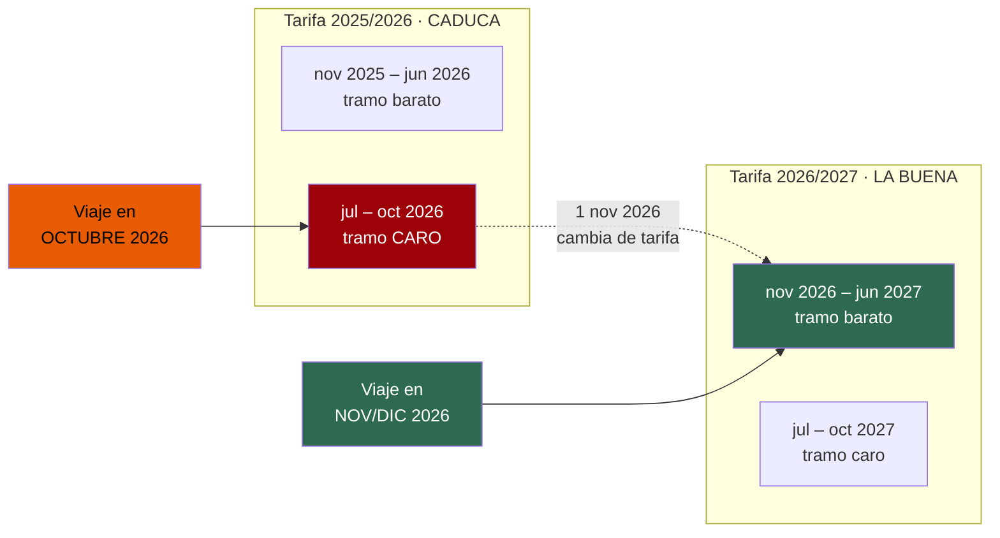
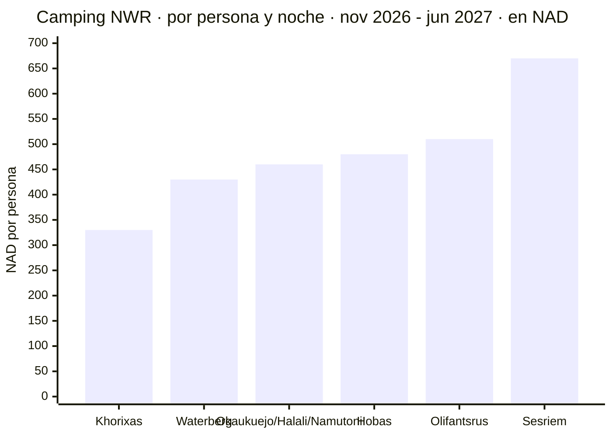
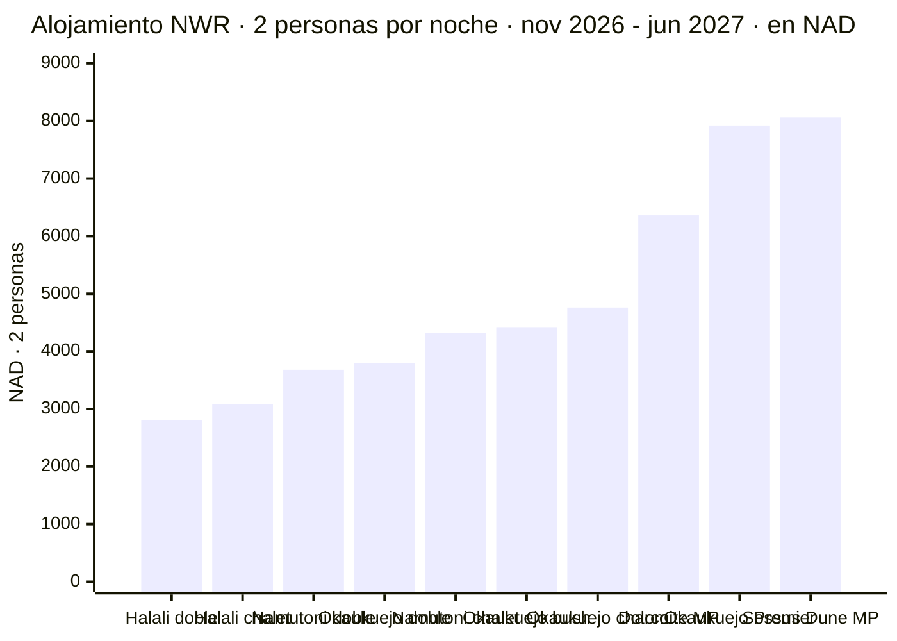
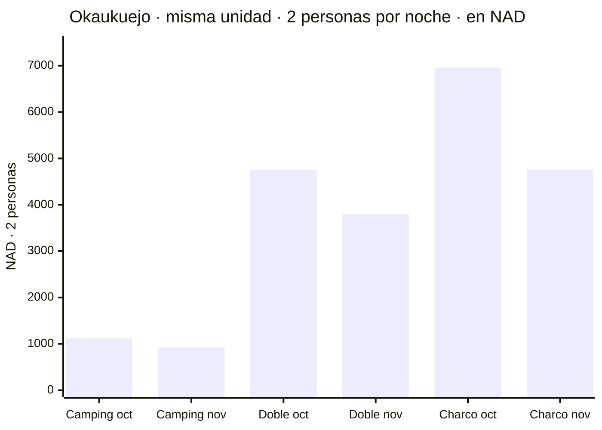

# Alojamiento y tasas — verificado contra la tarifa oficial 2026/2027

Fuente: **NWR Rack Rates 2026/2027, "01 November 2026 – 31 October 2027"**
https://www.nwr.com.na/wp-content/uploads/2026/06/NWR-Rack-Rates-2026-2027.pdf
*(descargado y leído directamente el 16/07/2026)*

**Tipo de cambio usado: ~N$20 = €1** (rango observado N$19,5–20,5 = €1, a 16/07/2026).
El importe en N$ es el que se paga; el euro es orientativo.

---

## ⚠️ Léete esto primero: la tarifa que cita todo el mundo no cubre este viaje

NWR factura por **año tarifario de noviembre a octubre**, no por año natural. La tarifa que
circula por todos los blogs y agencias es la **"01 nov 2025 – 31 oct 2026"**: **caduca antes de
que aterricemos** si viajamos en noviembre o diciembre.

- La tarifa correcta para nuestras fechas es la **2026/2027**, y dentro de ella caemos en la
  columna barata **"November 2026 – June 2027"**.
- **Octubre de 2026 se factura con la tarifa VIEJA, en su tramo más caro (jul–oct 2026).**
- Es decir: NWR tiene una frontera de temporada el **1 de noviembre**, la misma semana que el
  precipicio del alquiler.

---

## 🏕️ Camping — por persona y noche

Precios **nov 2026 – jun 2027** (nuestra ventana) → *jul–oct 2027*:

- **Okaukuejo** *(Etosha)* — N$460 (~€23) → *N$560* · **2 pax: N$920 (~€46)**
- **Halali** *(Etosha)* — N$460 (~€23) → *N$550* · **2 pax: N$920 (~€46)**
- **Namutoni** *(Etosha)* — N$460 (~€23) → *N$550* · **2 pax: N$920 (~€46)**
- **Olifantsrus** *(Etosha)* — N$510 (~€26) → *N$510* · **2 pax: N$1.020 (~€51)**
- **Sesriem** *(Sossusvlei)* — N$670 (~€34) → *N$670* · **2 pax: N$1.340 (~€67)**
- **Hobas** *(Fish River Canyon)* — N$480 (~€24) → *N$480* · **2 pax: N$960 (~€48)**
- **Waterberg** — N$430 (~€22) → *N$430* · 2 pax: N$860 (~€43)
- **Khorixas** *(Damaraland)* — N$330 (~€17) → *N$330* · 2 pax: N$660 (~€33)

Las parcelas admiten **máximo 8 personas**, pero el precio es **por persona**: dos pagan dos.

> ⚠️ **Una cifra muy repetida está mal:** Hobas es **N$480 (~€24)**, no N$510. El N$510 es de
> **Olifantsrus**, que está en la columna de al lado. El PDF va a dos columnas y la extracción
> automática de texto las entrelaza y las intercambia sin avisar. Separé las columnas para
> confirmarlo.

## 🛖 Chalets y habitaciones — por persona en doble, con desayuno (nov 2026 – jun 2027)

**Okaukuejo**
- Habitación doble A/B (2 camas) — N$1.900 (~€95)/pax → **N$3.800 (~€190)**
- Bush chalet (2 camas) — N$2.210 (~€111)/pax → N$4.420 (~€221)
- **Chalet del charco (2 camas)** — N$2.380 (~€119)/pax → **N$4.760 (~€238)**
- Premier Waterhole Chalet (4 camas, mín. 2) — N$3.960 (~€198)/pax → N$7.920 (~€396)

**Halali**
- Habitación doble — N$1.400 (~€70)/pax → **N$2.800 (~€140)**
- Bush chalet (2 camas) — N$1.540 (~€77)/pax → N$3.080 (~€154)

**Namutoni**
- Habitación doble (2 camas) — N$1.840 (~€92)/pax → **N$3.680 (~€184)**
- Bush chalet (2 camas) — N$2.160 (~€108)/pax → N$4.320 (~€216)

**Otros**
- **Dolomite Camp** *(Etosha oeste)*, bush chalet **media pensión** — N$3.180 (~€159)/pax → N$6.360 (~€318)
- **Sossus Dune Lodge** *(dentro de la puerta de Sesriem)*, dune chalet **media pensión** — N$4.030 (~€202)/pax → N$8.060 (~€403)

> Las tarifas son **por persona en habitación doble**: siempre hay que multiplicar por dos.
> Los campamentos de Etosha son **con desayuno**; Dolomite y Sossus Dune son **media pensión**,
> así que están menos lejos de lo que parece.

## 💰 La bajada de octubre a noviembre es mayor en alojamiento que en el coche

Misma unidad, mismo campamento, una semana de diferencia:

- **Camping** (2 pax) — octubre N$1.120 (~€56) → **noviembre N$920 (~€46)** · ahorro N$200 (~€10)/noche
- **Habitación doble** (2 pax) — octubre N$4.760 (~€238) → **noviembre N$3.800 (~€190)** · ahorro N$960 (~€48)/noche
- **Chalet del charco** (2 pax) — octubre N$6.960 (~€348) → **noviembre N$4.760 (~€238)** · ahorro **N$2.200 (~€110)/noche**

En un viaje de 14 días con lodges esto se acumula en **cientos de euros**, por encima de los
**~€744–868 (~N$14.900–17.400)** que se ahorran en el coche. El argumento económico para viajar
**después del 15 de noviembre es ya muy fuerte**. Si el tiempo y la fauna se comen esa ventaja
es la pregunta abierta.

## 🎯 Actividades NWR (por persona)

- **Sesriem → lanzadera 4x4 a Deadvlei** — N$180 (~€9)
- Sesriem, safari guiado de mañana — N$600 (~€30) *(sin desayuno)* / N$700 (~€35) *(con desayuno)*
- Sesriem, ruta al atardecer a Elim Dune — N$300 (~€15)
- Sesriem, ruta del cañón — N$200 (~€10)
- **Okaukuejo, safari nocturno guiado** — N$750 (~€38)
- Dolomite, safari guiado de mañana/tarde — N$650 (~€33)
- Sossus Dune Lodge, safari guiado — N$750 (~€38)

La **lanzadera a Deadvlei por N$180 (~€9)** merece atención: los últimos 5 km son arena profunda.
Llevamos 4x4 y puede que no haga falta, pero conviene releer las exclusiones del seguro en `01`.

> ⚠️ La propia tarifa dice: *"No pre-bookings for activities are acceptable during rainy season"*
> (no se aceptan reservas anticipadas de actividades en temporada de lluvias). Es la propia NWR
> avisando de que las condiciones de final de temporada cambian el funcionamiento de los parques.

---

## 🎫 Tasas de parques (de la 1ª pasada — ver `01-hallazgos-verificados.md`)

Subieron un **80–100 % el 1 de abril de 2026**: **~N$280 (~€14) por adulto extranjero y día**
en Etosha, Namib-Naukluft/Sossusvlei y Ai-Ais/Fish River Canyon, **más ~N$60 (~€3) de vehículo**,
cobrado **por parque y por cada 24 h desde la entrada**.

**Presupuestar ~N$620 (~€31)/día** para dos adultos y coche, en cada parque.

La cifra de N$150 (~€7,5) de casi todas las webs es la tabla obsoleta de 2021 (refutada 0–3).

---

## 🕳️ Todavía abierto

- Tarifas de **lodges privados** de gama media (zona de Sossusvlei, puertas de Etosha,
  Swakopmund, Damaraland). NWR es el operador estatal; los lodges privados son otro mercado.
- **Antelación de reserva** para nov–dic 2026, y si el acceso anticipado de Sesriem desde dentro
  de la puerta (amanecer en Deadvlei ~1 h antes que los visitantes de fuera) justifica su precio.
- El **veredicto de fechas** y el **itinerario**, que son los que fijan el presupuesto final.
