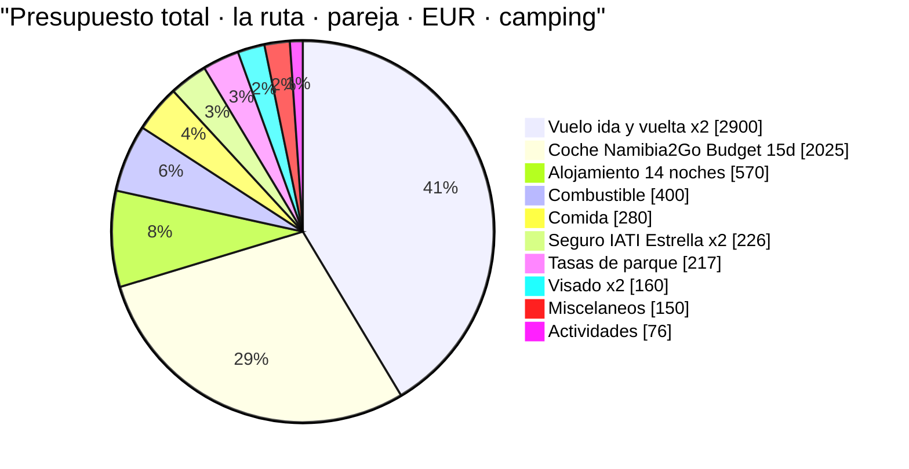
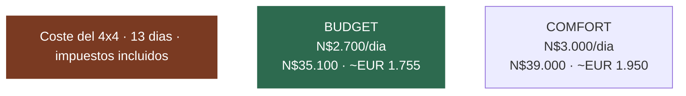
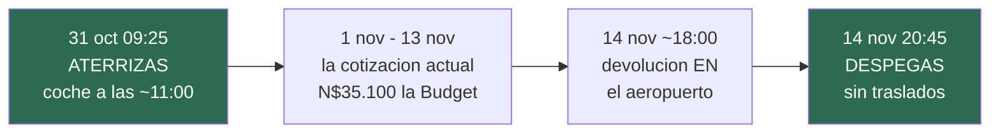
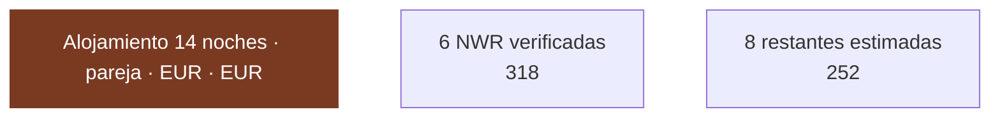
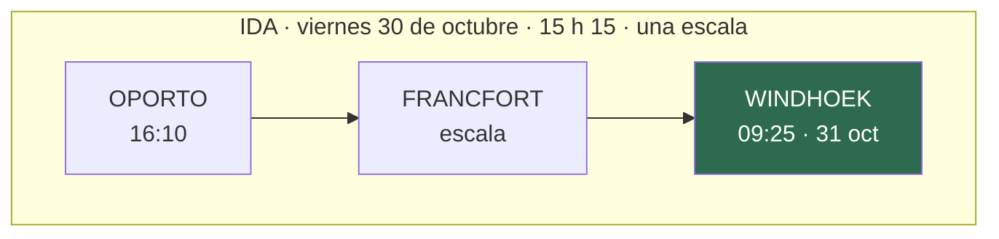
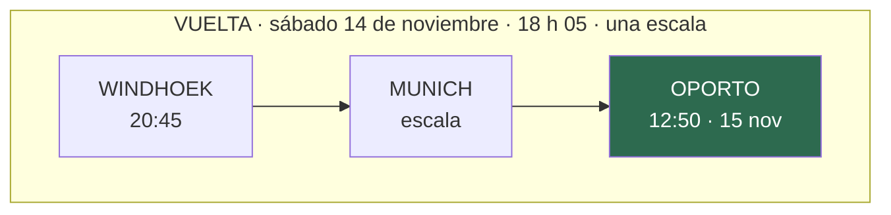

# 02 · Presupuesto

> **Namibia · 30 oct – 15 nov 2026 · la clásica del norte** — [← índice del dossier](README.md)
>
> Lo que cuesta el viaje, partida a partida, con el porcentaje que ya está cerrado y el que sigue siendo estimación.
>
> **~N$20 = €1** *(rango 19,5–20,5)* · **✅** fuente primaria · **◐** secundaria concordante ·
> **○** práctica común, sin fuente · **❌** sin verificar, dicho en blanco
>
> *Investigación cerrada el 17/07/2026 · formato y contenido revisados el 08/08/2026 · precio del
> combustible actualizado a la revisión del 5 ago 2026*

Coste del viaje con el **precio de las partidas grandes ya cotizado** (vuelo, coche y seguro), en N$ y
€. Cada cifra lleva su marca de confianza y su fuente. **Donde no hay dato verificado, se dice y se
deja como estimación marcada: un número plausible presentado como hallazgo es un fallo grave — aquí
no se hace.**

> ⚠️ **«Cotizado» no es «reservado».** Al 05/08/2026 **no consta hecha ninguna reserva** —ni coche, ni
> Sesriem ×2, ni Terrace Bay, ni Etosha, ni el vuelo emitido *(ver [`15`](15-huecos-cerrados.md) §lista
> maestra y [`16`](16-punto-de-decision.md))*. Los importes son precios de mercado para reservar, no
> pagos hechos. **Y la ruta que presupuestan está pendiente de tu confirmación** — ver
> [`16`](16-punto-de-decision.md).

> ## ✅ NOTA: este presupuesto es el de la RUTA DEL NORTE, confirmada el 06/08/2026
> Este documento presupuesta la **ruta del norte** (sur fuera), con coche de **Namibia2Go** y las
> fechas del vuelo de Lufthansa —**30 de octubre a 14 de noviembre**, en tierra del 31 al 14—.
> **Decisión del viajero, cerrada**: lo que se estudió antes queda archivado en
> [`16`](16-punto-de-decision.md). Los supuestos concretos de esta versión:
>
> - **Ruta**: **la del norte** — la clásica con **Etosha** (4 noches) y **sin el sur** (Fish River,
>   Lüderitz, kokerbooms). Si eliges una variante con el sur, este presupuesto cambia; la base medida
>   sigue en el histórico de `13` *(`git show d0320c3^:13-itinerario.md`)*. Día a día en [`01`](01-itinerarios-dia-a-dia.md).
> - **Fechas**: **31 de octubre – 14 de noviembre de 2026 en tierra**, no «finales de noviembre».
> - **Coche**: **Namibia2Go Budget**, no Asco. Con Namibia2Go **el «precipicio del 15/11» —que era de
>   Asco— ya no aplica**: entra en temporada baja el **1 de noviembre**, así que el alquiler cae en
>   tarifa barata sin esperar al 15. ◐ *(su web da 403; tarifa vía revendedor)*.
>
> Los importes de abajo son los de esta ruta, **cotizados, no reservados**.

---

## 1. La foto de conjunto — dónde se va el dinero

**la ruta · 31 oct – 14 nov · dos personas · TODO incluido (con vuelos) · escenario camping.** Reparto del
gasto de la pareja en euros:

> **Vuelo y coche son el 70 % del viaje.** El vuelo está cerrado y del coche están cerrados los
> 13 días cotizados *(los 2 extra del aeropuerto, ~€270 la pareja, van en ◐ hasta recotizar)*.
> Todo lo demás junto (~€2.080 de la pareja) pesa menos que ellas dos.

---

## 2. El coche — **las DOS están disponibles**, con precio en N$ ✅

> ### 🔄 Cambio importante (05/08/2026): la Comfort ya no sale «Not Available»
> El dossier llevaba semanas diciendo «coge la Budget porque la Comfort no está libre». **Eso ya no
> es verdad: las dos están cotizadas y disponibles**, y además el precio viene ahora **en N$ y por
> 13 días (1 nov 08:00 → 13 nov 17:00)**, no en euros por 12. La decisión pasa de «lo que hay» a
> «cuánto vale la diferencia».

**Namibia2Go · 4x4 camping equipped double cab · 1 nov 08:00 → 13 nov 17:00 · 13 días · impuestos
incluidos** ✅. Las dos, idénticas en lo que importa: **automático, diésel, 4 plazas, kilometraje
ilimitado y Premium Insurance Cover** (franquicia cero).

- 🚙 **BUDGET** — **N$2.700/día · N$35.100 los 13 días (~€1.755)** → **~€877,50 por persona** ✅
- 🚙 **COMFORT** — **N$3.000/día · N$39.000 los 13 días (~€1.950)** → **~€975 por persona** ✅
- 💶 **La diferencia son N$3.900 (~€195) los dos — ~€97,50 por cabeza**, o **N$300 (~€15) por día.**

### ⚖️ Y qué compran esos N$3.900

Lo único que cambia entre las dos, según la ficha del proveedor *(sin cambios respecto a lo que ya
tenía el dossier ◐)*: la **Comfort** lleva **tiendas de techo de carcasa rígida** y **compartimentos
de cocina a medida**; la **Budget**, **tiendas Tentco de lona** y **cajas de camping**. Todo lo
demás —el mismo Toyota Hilux Double Cab 2.8L GD-6, el seguro, los km, las dos ruedas de repuesto y
la nevera— es idéntico.

- ⛺ **En la práctica:** la carcasa rígida se monta en **~1 minuto** frente a **~5** de la lona, y
  aguanta mejor **polvo y viento** ○. Con **13 noches de tienda**, eso son **N$300 (~€15) por noche
  de tienda** de sobrecoste.
- 👉 **Cómo decidirlo, sin más vueltas:** si os importa montar y desmontar rápido con viento y polvo
  trece veces, **la Comfort cuesta ~€97 por cabeza**. Si no, **la Budget deja ese dinero para la
  noche del chalet del charco de Okaukuejo** *(N$4.760, ~€238)* y sobra.

### ⏰ El encaje con el calendario — **DECIDIDO: aeropuerto → aeropuerto, 15 días** *(07/08/2026)*

**El coche se recoge el 31 de octubre a la llegada (~11:00) y se devuelve el 14 de noviembre
camino del embarque (~18:00).** Fuera los hoteles de Windhoek y los traslados: las noches de
ciudad también se duerme arriba. La cotización vigente sigue siendo del 1 al 13 — **falta
recotizar las dos puntas**:

- ✅ **La ruta cabe con margen.** El D13 es **Namutoni → Windhoek, ~548 km** *(medido con OSRM,
  ver [`13`](13-itinerario.md))*: saliendo al abrirse la puerta de Von Lindequist a las **06:08**,
  en Windhoek sobre las **13:30–14:30** — y ya sin la presión de entregar a las 17:00.
- ✅ **El D14 deja de ser un día a pie**: mañana tranquila en Windhoek y salida al aeropuerto
  ~17:00–17:30, repostando a la ida.
- ✅ **Y la hora dura del 14 está medida**: la facturación de Discover en la T2 **cierra 60 min
  antes del despegue — a las 19:45** ◐ *(mostradores abiertos desde 4 h antes;
  [ficha de aeropuertos de Discover](https://www.discover-airlines.com/us/en/book/travel-information/airport-info),
  página en 403 al descargar — extractos convergentes)*. Devolviendo el coche a las ~18:00 quedan
  **~1h45 de colchón**.

> ### 🧾 Lo que hay que pedirle a Namibia2Go al reservar
> **Recotiza con las fechas decididas: 31 oct 11:00 → 14 nov 18:00, que son 15 días, con recogida
> y devolución EN el aeropuerto.**
> - Sobrecoste sobre los 13 cotizados: **~N$5.400 (~€270)** la Budget · **~N$6.000 (~€300)** la
>   Comfort — **los dos, la pareja** ◐.
> - ⚠️ **Ojo con el 31 de octubre**: la temporada baja de Namibia2Go **empieza el 1 de noviembre**,
>   así que ese día puede irse a tarifa alta. **Pide el precio exacto de ese día por separado** ❌.
> - ⚠️ **La entrega en el aeropuerto no está confirmada como servicio**, ni su posible
>   suplemento ❌ — es la primera pregunta de la llamada.
>
> *(La alternativa descartada el 07/08: dos noches de hotel en Windhoek más tres traslados
> aeropuerto–ciudad — más cara casi seguro, y peor: la primera y la última noche sin tienda.)*

> ⚠️ **La web NO sirve para este precio:** publica N$2.910/día «temporada baja», pero esa banda es
> **«01 Nov 2025 – 30 Jun 2026»** y **caduca antes del viaje**; la siguiente que enseña es la alta de
> julio–octubre 2026. La ventana cae en el **año tarifario siguiente**, que no está en la web. Los
> **€150/día son cotización en vivo para las fechas reales**, coherente con el cambio de año tarifario.
> *(Misma trampa que la tarifa de NWR.)*

**Aparte, no incluido en el total** (retención, no gasto): a la recogida se bloquea en la tarjeta un
**aval/depósito de garantía** — con Premium Cover la franquicia es N$0, pero suele retenerse un aval.
**❌ Importe exacto no verificado.** Hay que tener margen en la tarjeta.

> Fuente: [namibia2go.com · 4x4 camping equipped double cab](https://namibia2go.com/4x4-camping-equipped-double-cab)
> · precio de la cotización cerrada .

---

## 3. Alojamiento — 14 noches, 6 verificadas ◐/○

**14 noches en tierra** *(del 31 de octubre al 13 de noviembre, con el coche del aeropuerto
desde el primer día)*. De ellas, **6 son campings NWR con precio verificado**; las otras 8 son
**camping todas salvo la habitación de Terrace Bay (D7, cerrada ✅)** — de esas, **seis siguen
sin precio y Hoada va en ◐**.

**Verificado (NWR, ventana nov 2026 – jun 2027, 2 pax):**
- **Sesriem × 2** *(dentro de la puerta — imprescindible para Deadvlei al amanecer)* — **N$1.340
  (~€67)/noche** ✅
- **Okaukuejo, Halali, Namutoni × 2** *(camping dentro de Etosha, charca iluminada)* — **N$920
  (~€46)/noche** ✅

→ Suma verificada: 2×N$1.340 + 4×N$920 = **N$6.360 (~€318) para la pareja / ~€159 por persona** ✅
*(coincide con `01-itinerarios-dia-a-dia.md` §resumen).*

**Parcialmente cerrado / sin verificar ○/◐ (8 noches):**
- D0 Windhoek, D1–D2 Spreetshoogte ×2 *(la segunda noche, decidida el 08/08 — sale del domingo de
  Windhoek, así que el recuento no cambia)*, D5–D6 Walvis Bay ×2 → campings/alojamientos privados,
  **precio no cerrado** (WebFetch bloqueado; ver `15`). Estimación de práctica común: **~€25–45/noche
  para dos** cada uno. *(Referencia real que ancla el extremo bajo: el camping comunitario de Spitzkoppe
  —campamento equiparable de la ruta— está cerrado en **N$540/noche para dos (~€27)**, entrada incluida
  ◐; ver `15`.)*
- **D8 Hoada** (Grootberg) — **cerrado en esta pasada ◐**: **N$542–732/noche para dos (~€27–37)** según
  temporada (la de noviembre sin fijar; ver `15`). Coincide con la estimación de práctica común.
- **D7 Terrace Bay** (NWR) — **cerrado ✅ y es la noche más cara del viaje**: el tarifario oficial
  2026/2027 da **doble en media pensión a N$1.740/persona → N$3.480 (~€174) la pareja** en la
  ventana nov 2026 – jun 2027. **No hay camping en Terrace Bay** *(la ficha web lista una fila de
  «Campsite» que no aparece en el tarifario: es un error suyo)*. Consuelo: **incluye cena y
  desayuno**, así que descuenta esa comida del presupuesto del D7.

- **D13 Windhoek**: **camping, con el coche hasta el 14 — decidido el 07/08**. Mismo candidato
  que el D0 (Urban Camp o Arebbusch), tarifa ❌. *(La habitación con traslados quedó
  descartada; el hotel que se cae y la noche nueva del D0 se compensan casi exactamente dentro
  de la estimación ○ — por eso el total de alojamiento no se mueve.)*
- **Los campings sin cotizar (D0, D5–D6, D13 — y Spreetshoogte D1–D2)**: existen y están
  identificados —**Urban Camp** o **Arebbusch** en Windhoek, **Lagoon Chalets** en Walvis Bay,
  **Spreetshoogte Campsite** en la escarpa— pero **ninguno publica tarifa** ❌.
  Se mantienen en la estimación de práctica común de ~N$600–1.000 (~€30–50) la pareja.

> ✅ **Y esto cierra el mayor hueco del bloque:** Terrace Bay ya no es una incógnita de ±€130. Son
> **~€174 la pareja, verificados**, con cena y desayuno dentro. El bloque sin cerrar se queda en
> **7 noches** —las dos de Windhoek, las dos de Spreetshoogte, las dos de Walvis y Hoada—, todas
> de camping, que es el tramo barato y predecible.

→ Bloque parcial/sin verificar: **~€126/persona ○** *(con el sesgo al alza de arriba)*. **Alojamiento
total: ~€570 pareja (~€285/persona)**, del que **~€318 (56 %) está verificado** y **Hoada suma ◐**.

> Fuentes verificadas: [NWR Rack Rates 2026/2027 (PDF)](https://www.nwr.com.na/wp-content/uploads/2026/06/NWR-Rack-Rates-2026-2027.pdf)
> (ver `03`). Resto: **❌ sin fuente de precio abierta.**

---

## 4. Combustible — calculado sobre la distancia real de la ruta ◐/○

**No se copia el consumo de nadie: se calcula.** Tres factores, cada uno con su banda:

- **Distancia (la ruta)**: **~2.757 km** (◐, control OSRM del 08/08 sobre el trazado real —
  la suma del `gantt` de `01` daba ~2.600: Windhoek–
  Spreetshoogte, bajada a Sesriem, Sesriem–Walvis, costa hasta Terrace Bay, Damaraland, subida a
  Etosha, safaris internos y vuelta a Windhoek; ningún día por encima de ~390 km).
- **Consumo** del Hilux doble cabina cargado con tienda de techo: **11–13 l/100 km** (○, práctica
  común; no verificado contra ficha del vehículo). Central **12 l/100 km**.
- **Precio del diésel**: la costa (Walvis Bay, precio base nacional) marcaba **N$24,26/l en julio
  2026** tras la rebaja de N$4/l del Gobierno; **pero el 5 de agosto de 2026 subió +N$2,00/l** al
  restituirse los gravámenes que se habían recortado tres meses → **costa ~N$26,26/l ◐** *(N$24,26 +
  N$2,00; coincide con la cifra que devuelve el buscador para agosto)*. En el **interior y bombas
  remotas** (Solitaire, Sesriem, Okaukuejo) sube sobre eso → banda **N$26–29/l**, central **~N$27/l**.
  ⚠️ **El precio se revisa cada mes**: entre agosto y la salida de noviembre habrá **~3 revisiones más**,
  así que esto sigue siendo estimación — reconfírmalo la semana antes de salir.

- **Cálculo central**: 2.757 km × 0,12 l/km × N$27/l = **~N$8.932 (~€447)** para la pareja.
- **Banda**: **N$7.930–10.440 (~€396–522)** *(2.757 km × 11–13 l/100 km × N$26–29/l — recalculada
  el 08/08 con el control OSRM; la subida de agosto no la desborda)*.

> **Se presupuesta ~N$8.000–8.400 (~€400–420) pareja / ~€200–210 por persona** *(el central subió al
> extremo alto de la banda tras la revisión de agosto)*. Fuentes del precio:
> [GlobalPetrolPrices — Namibia diésel](https://www.globalpetrolprices.com/Namibia/diesel_prices/) ·
> [NAMCOR — fuel prices](https://www.namcor.com.na/fuel-prices/) *(403, no abierta aquí)* ·
> rebaja de julio 2026 en [thebrief.com.na](https://thebrief.com.na/2026/07/gvt-cuts-petrol-price-by-n1-diesel-by-n4/)
> y **subida de agosto** en [thebrief.com.na](https://thebrief.com.na/2026/07/fuel-prices-to-rise-by-n2-00-a-litre-as-government-restores-levies/)
> *(ambas vía fragmento; el sitio y el boletín del MME devuelven 403 aquí, así que la extracción del
> precio de bomba exacto no está verificada contra el primario — de ahí el ◐)*.

---

## 5. Tasas de parque — N$620/día para pareja + coche ◐

**N$280 (~€14)/adulto extranjero/día** (N$140 entrada + N$140 conservación) **+ N$60 (~€3)/vehículo**,
cobrado **por parque y por cada 24 h desde la entrada** (ver `12` §7 y `15`). Dos adultos + coche =
**N$620 (~€31)/día de parque**. Baremo del MEFT publicado en el **Government Gazette Nº 8877 ·
Government Notice Nº 115** (firmado por la ministra el 26/03/2026, en vigor desde el **1/04/2026**),
bajo la Nature Conservation Ordinance de 1975 (primera subida desde 2021) — **◐, no ✅**: lo confirman
dos páginas oficiales del MEFT (PDF de tarifas + nota de prensa `news/199`) y varias secundarias, pero
ninguna se pudo abrir (403) para verificar la extracción de la tabla fina; la **gaceta está localizada
en el índice de gazettes.africa pero tampoco se pudo abrir aquí** (403), así que la tabla sigue sin
verificarse contra el documento primario (detalle en `15` §Tasas). Los tres parques de pago de la ruta
(Namib-Naukluft, Skeleton Coast, Etosha) son **premium**, así que el N$280 (~€14) es la tarifa correcta para
los tres.

**La ruta cruza tres zonas de pago:**
- **Namib-Naukluft** (Sesriem/Sossusvlei): ~2 unidades de 24 h (tarde de llegada + amanecer en Deadvlei).
- **Skeleton Coast** (permiso de tránsito + Terrace Bay): ~1 unidad.
- **Etosha**: 4 noches dentro → ~4 unidades.

→ **~7 unidades × N$620 = ~N$4.340 (~€217) pareja / ~€109 por persona** ◐.

> ➕ **Aparte, FUERA de esas 7 unidades premium: Cape Cross (D7).** El reserva de lobos cobra su
> propia entrada — **N$150 (~€8)/extranjero + N$50 (~€3)/coche = ~N$350 (~€18) la pareja** ◐, en
> **efectivo**, en recepción (Dorob NP; tarifa menor que el baremo premium). **Súmalo al total de
> tasas.** Fuentes secundarias convergentes: una reseña de visitante de 2025 y una guía dan la misma
> cifra (N$150 + N$50 ≈ €7,50 + €2,50); la primaria del MEFT sigue en 403. Detalle y horario (abre 08:00 del 16 nov
> al 30 jun) en [`01` §D7](01-itinerarios-dia-a-dia.md).

> Fuentes: [gazettes.africa — Government Gazette Nº 8877, 1/04/2026 (Government Notice Nº 115)](https://gazettes.africa/akn/na/officialGazette/government-gazette/2026-04-01/8877/eng@2026-04-01) ·
> [MEFT — Park Entrance and Conservation Fees (PDF)](https://www.meft.gov.na/files/downloads/543_Park%20Entrance%20and%20Conservation%20Fees.PDF) ·
> [MEFT — nota de prensa `news/199`](https://www.meft.gov.na/news/199/Implementation-of-New-Park-Entrance-Fees-and-Conservation-Fee/)
> *(las tres localizadas; ninguna se pudo abrir, 403)* · secundarias concordantes en `15`. **Confírmalo por email antes de pagar.**

---

## 6. Visado — cifra dura ✅

**e-visa: N$1.600 (~€80)/persona** → **pareja N$3.200 (~€160)**, pago único. Ver `12` §6.
⚠️ El visado **manual a la llegada** puede llevar un recargo de N$2.000 (~€100) aprobado pero sin
publicar en el boletín: **usa el e-visa**. Fuente:
[MAEC — Namibia](https://www.exteriores.gob.es/es/ServiciosAlCiudadano/Paginas/Detalle-recomendaciones-de-viaje.aspx?trc=Namibia).

---

## 7. Seguro de viaje — cerrado ✅

> ### €226,04 la pareja · **€113,02 por persona** *(31/10 – 15/11)*
> ### ⚠️ **Con el vuelo de Oporto hay que rehacerla: empieza el 30, no el 31**

### ✅ El final ya está bien: llega hasta el 15 — y costó €14,69

La póliza tiene que **cubrir el día del aterrizaje en casa, no el del despegue en Windhoek**. Con
la vuelta llegando **el día 15**, una póliza que acabase el 14 dejaba el tramo más largo del viaje
sin cobertura:

- Estrella · 31/10 – 14/11 *(con hueco al final)* — €211,35
- Estrella · **31/10 – 15/11** — **€226,04** · **€113,02 p.p.**
- **Coste de cerrar el hueco: +€14,69** *(+€7,35 por persona)*

**Catorce euros y setenta céntimos por no volver a casa sin seguro.** *(Curiosidad: al Estándar el
día extra le sale gratis — mismo precio con y sin él.)*

> ### ⚠️ Y ahora falta el otro extremo
> El vuelo elegido **sale de Oporto el 30 de octubre** *(§8)*, no el 31. **Hay que adelantar el
> inicio de la póliza al 30/10** — si no, el vuelo de ida va sin cobertura, con el traslado a
> Oporto incluido. **Simulación 30/10 – 15/11: ❌ sin cotizar.** Es el mismo trámite que cerró el
> hueco del final; hazlo antes de pagar el billete.

### ✅ Cumple la condición de entrada

Namibia **exige** seguro médico con **repatriación sanitaria**. El Estrella la lleva al **100 %** —
requisito cumplido. *(Las tres modalidades de IATI la cubren, así que por el requisito legal
cualquiera valdría.)*

**Lo que sí compra el Estrella:** asistencia médica **ilimitada** *(Mochilero 1,5 M€ · Estándar
1 M€)*, regreso anticipado por cierre de fronteras y 4.000 € de equipaje. *En un país donde no hay
hospital cerca de Sesriem y la evacuación aérea es todo el argumento, «ilimitado» no es marketing.*

### ⚠️ Búsqueda y salvamento: el top lo deja opcional… y el Mochilero lo incluye

Curiosidad de la tabla que conviene mirar dos veces: **«Búsqueda y salvamento» viene INCLUIDO en el
Mochilero (15.000 €) pero es OPCIONAL en el Estrella.**

Y en **este** viaje importa: **Damaraland, el Namib y buena parte de la ruta no tienen cobertura
móvil**. Es exactamente el escenario para el que existe esa garantía.

> 👉 **Añádele la opción de búsqueda y salvamento al Estrella.** Si no, tienes el seguro más caro sin
> una cobertura que sí trae el más barato.

### 🔁 La franquicia de coche de alquiler te sobra

El Estrella cubre **1.000 € de franquicia del coche**. Pero tu **Namibia2Go lleva Premium Insurance
Cover = franquicia CERO**: **no hay franquicia que cubrir**. Es una garantía casi redundante en tu
caso — no la cuentes como valor. *(Único resquicio: la franquicia cero de N2Go «decae con
negligencia probada» — pero la negligencia suele estar excluida también en el seguro de viaje.)*

### ❓ La pregunta que decide: ¿evacuación aérea DENTRO del país?

La tabla dice **«Repatriación o transporte de enfermos: 100 %»**. **Repatriación** es traerte a
España. Lo que este viaje necesita es lo otro: **que te saquen en avión de una pista remota hasta
Windhoek**. Cerca de Sesriem **no hay hospital** *(Windhoek a ~320 km, Walvis Bay a ~270, ambos 4+ h
de grava)*. **La tabla no lo aclara.**

> 👉 **Pregúntaselo a IATI por escrito antes de contratar.** Es la cobertura que de verdad cambia
> algo aquí.

### Las tres, comparadas

- IATI **Estándar** — €117,41 *(€58,70 p.p.)*
- IATI **Mochilero** — €175,49 *(€87,75 p.p.)* · **incluye búsqueda y salvamento**
- 🏆 IATI **Estrella** — **€226,04** *(€113,02 p.p.)* · **médica ilimitada** · *búsqueda y salvamento opcional*

*Estrella vs Mochilero: **+€50,55** (+€25,27 por persona).*

---

---

## 8. El vuelo — **Oporto, con Lufthansa** ✅

> ### €1.450 por persona · €2.900 la pareja
> ### **Oporto → Windhoek**, ida y vuelta, turista · **30 oct – 14 nov** · Lufthansa, parcialmente
> operado por **Discover Airlines** · **una sola escala en cada sentido**

*Precio final por persona, **€1.450** — el buscador lo anunciaba en €1.341 y sube al cerrar con
equipaje y cargos. En la misma búsqueda salían **586 resultados**: el más barato en **€1.026**
(21 h 33 de media) y el más rápido en **€1.462** (16 h 08 de media) — cotizado el 05/08/2026.*

### 🎉 Lo que este itinerario resuelve solo

**1 · La fiebre amarilla deja de ser un tema.** **Fráncfort y Múnich no son zona de riesgo**, así
que **no hace falta vacunarse** y no hay nada que calcular sobre duración de escalas. ✅

**2 · Una escala por sentido, y todo dentro del grupo Lufthansa** *(Lufthansa + Discover)*. Menos
manos y menos costuras que cualquier itinerario con tres compañías distintas.

**3 · Y son 33 h 20 de avión en total**, ida y vuelta — con la vuelta en **18 h 05**, no en una
noche entera de aeropuertos.

### ⏰ Lo que este vuelo mueve en el plan — **y hay que tocarlo**

**Aterrizas el 31 de octubre a las 09:25 y despegas el 14 a las 20:45: son 15 días de suelo, con
la mañana entera del primero y el día 14 completo.** Tres consecuencias, todas accionables:

1. ⚠️ **El seguro se queda corto por un día.** La póliza contratada en §7 va del **31/10 al 15/11**.
   Con salida el **30 de octubre**, hay que **adelantar el inicio al 30** o el primer vuelo va sin
   cobertura. *(El coste del día extra: **❌ sin cotizar** — pídelo a IATI.)*
2. ⚠️ **El coche no cubre ni el principio ni el final.** La cotización de Namibia2Go va del **1 nov
   08:00 al 13 nov 17:00**: sobran el **31 de octubre** y el **14 de noviembre** — el día del vuelo
   de vuelta, que sale a las 20:45. **Recotiza 31 oct 11:00 → 14 nov 18:00, 15 días** *(§2)*.
3. ✅ **Las noches de NWR no se tocan.** Las del 31 de octubre (Windhoek) y del 1–2 de noviembre
   (Spreetshoogte, decidido 08/08) **no son NWR**: la primera noche NWR sigue siendo Sesriem el
   3 de noviembre, y todas las de parque caen del **1 de noviembre** en adelante, en tramo barato.

### 🚌 Y el precio de salir de Oporto: **~270 km hasta el aeropuerto**

Hay autobús directo **A Coruña → terminal del aeropuerto Francisco Sá Carneiro** con ALSA y
FlixBus, **~3 h 43 y desde ~€17 por persona** ◐. Con salida a las 16:10, el autobús de la mañana
llega con margen; a la vuelta aterrizas a las **12:50 del día 15** y quedan ~4 h hasta casa.
**❌ Sin cotizar para tus fechas.**

### ⚠️ Tres comprobaciones antes de pagar

- 🧳 **Maleta facturada incluida.** Lufthansa vende **Economy Light sin maleta**, y en un buscador
  eso no siempre se ve. Con dos semanas de camping, **no es opcional**.
- 🎫 **Billete único.** Aquí es fácil —todo es grupo Lufthansa—, pero **confírmalo en el
  localizador**: en un solo billete, una conexión perdida es problema de la aerolínea.
- 💳 **Lo vende eDreams, no Lufthansa.** Mira el precio final **con maleta** en la web de Lufthansa
  directamente: si la diferencia es pequeña, comprar en la compañía te ahorra el intermediario
  cuando algo se tuerce. Y **ábrele la ficha al de €1.026** antes de cerrar: sobre los €1.450
  finales son **hasta €424 menos por persona**, aunque hay que compararlo también **con equipaje
  incluido** — el anunciado y el final no son el mismo número en ningún caso.

> ⚠️ **«Cotizado» no es «emitido».** Al 05/08/2026 **no consta emitido** ningún billete. Sin
> billete no hay e-visa *(que exige billete de vuelta)*, así que esto va delante de los trámites
> de [`04`](04-guia-preparacion.md).

---

### 🧳 La franquicia de equipaje — cerrada *(07/08/2026)*

La duda era razonable —**varios operadores en el mismo billete**: los tramos largos los vuela
**Discover Airlines**, la filial de largo radio de Lufthansa *(que opera Frankfurt/Múnich–Windhoek)*,
y el Múnich–Oporto, Lufthansa o su regional Air Dolomiti según el día ◐— pero la respuesta es
simple: **en un billete único del grupo Lufthansa la franquicia es UNA para todo el itinerario y
la fija la TARIFA, no cada operador** ✅. Discover aplica el reglamento de equipaje del grupo y lo
publica en su propia web.

- 🧳 **Economy Classic o superior: 1 maleta facturada de 23 kg por persona** *(máx. 158 cm de suma
  de lados)* ✅ · **Economy Light: NINGUNA** ✅ — es el aviso que ya llevaba el README: al emitir,
  **tarifa con maleta**.
- 🎒 **Cabina: 1 pieza de 8 kg** *(55×40×23)* **+ un accesorio personal** *(40×30×10)* ✅.
- 👉 Con los **petates blandos** del [`05`](05-equipaje.md) *(~20 kg apuntados)*, el límite de
  158 cm sobra por todos lados: **la única decisión real es no comprar la tarifa Light**.

> Fuentes: [Discover Airlines · Baggage](https://www.discover-airlines.com/us/en/book/baggage) ✅
> *(1×23 kg en Economy salvo Light, 158 cm, y las reglas de equipaje del grupo en vuelos operados
> por Discover/Lufthansa/Air Dolomiti)* · [Discover Airlines · newsroom — la ruta
> Múnich–Windhoek](https://newsroom-en.discover-airlines.com/pressreleases/discover-airlines-expands-munich-windhoek-service-3455761) ✅.

## 9. Comida, actividades y misceláneos ○

### Comida ○ *(sin fuente — práctica común)*
- **Camping / autoservicio** (supermercado + braai): **~N$300–500 (~€15–25)/día para dos** → 14 días
  ≈ **~N$5.600 (~€280)** pareja / ~€140 por persona. Son órdenes de magnitud, no precios de carta.

### Actividades — unidades verificadas, selección estimada
Precios **por persona**, verificados salvo aviso:
- Lanzadera 4x4 a Deadvlei — **N$180 (~€9)** ✅ (NWR)
- Sesriem, guiado de mañana / paseo — N$300–700 (~€15–35) ✅ (NWR)
- Etosha, safari nocturno guiado — N$750 (~€38) ✅ (NWR)
- **Walvis Bay — crucero en barco** (delfines y lobos marinos, ~3 h, del muelle a Pelican Point, con
  refrigerio a bordo): **~N$1.400–1.990 (~€70–100) por persona** ◐. Catamaran Charters / Sailnamibia
  marcan la banda baja (~N$1.400); Mola Mola la alta, **N$1.990 (~€100)**, mínimo 2 personas, con
  recogida opcional de **+N$470 (~€24)**. *(Un agregador suelta un N$4.570 que contradice a todos los
  demás — descartado por atípico, seguramente charter privado o error de extracción.)*
- **Walvis Bay — Sandwich Harbour en 4x4** (~4–5 h; **la única forma legal de ir: con tu coche lo
  prohíbe el contrato**): **~N$2.600–3.220 (~€130–161) por persona** ◐, mínimo 2. Desert Compass Tours
  N$2.600 (+N$300, ~€15, de recogida en Swakopmund); Red Dune Safaris N$3.220.
- **Combo crucero + dunas de Sandwich Harbour el mismo día** (~8,5 h, Mola Mola): **N$4.740 (~€237)
  por persona** ◐, mínimo 2, **sin la tasa de parque** de Namib-Naukluft.

> ⚠️ **Todo esto va en ◐, no en ✅.** La ficha propia de cada operador devuelve **`403`** desde este
> entorno *(la misma pared anti-bot que los lodges)*, así que las cifras salen del **resumen del
> buscador sobre sus páginas y las de Viator**, cruzadas entre varios operadores independientes:
> concuerdan en el orden de magnitud, pero **no se pudo abrir la página para verificar la extracción**.
> Vigencia: tarifas anunciadas para **2026**. **Confírmalo por email antes de reservar.** Fuentes:
> `mola-namibia.com/marine-dolphin-cruise`, `sailnamibia.com`, `namibiancharters.com/activities/dolphin-seal-cruise`,
> `sandwichharbour-namibia.com`, `reddunesafarisnamibia.com/sandwich-harbour-4x4` y las fichas de
> Viator `d4467-105190P1` (crucero), `-105190P2` (combo) y `-37950P1` (Sandwich Harbour).

→ Partida flexible de **~N$1.520 (~€76) pareja / ~€38 por persona** con lo básico (lanzadera Deadvlei
+ una actividad de NWR). **El día de mar en Walvis** es el capricho que más mueve esta partida: el
crucero para dos ~**N$2.800–3.980 (~€140–199)**, o el combo con Sandwich Harbour ~**N$9.480 (~€474)**
la pareja.

### Misceláneos ○
SIM/eSIM (~N$150–300, ~€8–15, ❌ no verificado), propinas, peajes/tasas menores, imprevistos →
colchón **~N$3.000 (~€150) pareja / ~€75 por persona**. No verificado.

---

## 10. El total — pareja y por persona

**Desglose por persona (escenario camping):**
- ✈️ Vuelo **€1.450** ✅
- 🚙 Coche **~€1.012,50** *(los 13 días cotizados ✅ + los 2 del aeropuerto ◐: mitad de ~N$40.500 ·
  ~€2.025, la Budget)* — **~€1.162,50 si es la Comfort**
- ⛺ Alojamiento **~€285** *(€159 verificado + ~€126 estimado)*
- ⛽ Combustible **~€200** ○/◐
- 🍖 Comida **~€140** ○
- 🎫 Tasas de parque **~€109** ◐
- 🩺 Seguro **€113,02** ✅
- 🛂 Visado **€80** ✅
- 🎯 Actividades **~€38** ○
- 🧷 Misceláneos **~€75** ○

> ### **TOTAL POR PERSONA: ~€3.503 (~N$70.100)** *con la Budget, 15 días*
> ### **TOTAL LA PAREJA: ~€7.005 (~N$140.100)**
> Rango honesto: **€3.355–3.655 por persona** — el margen (±~€150) está en las 8 noches sin
> precio, los 2 días de coche por recotizar, el combustible, la comida y los misceláneos.
>
> **Lo que todavía puede moverlo** *(ver §2, §7 y §8)*: **+€150 p.p.** si sale la **Comfort** en
> vez de la Budget *(a 15 días)* · el **precio real del 31-oct** *(fuera de temporada baja ❌)* ·
> **+el traslado a Oporto** ida y vuelta y **+el día extra de seguro**, los dos ❌ sin cotizar.
> **Cuenta ~€3.650 por persona para no llevarte sorpresas.**

**Qué parte de este número es sólida:**
- **✅ Duro — €2.680 de los €3.503 (77 %)**: vuelo €1.450 · los 13 días cotizados del coche
  €877,50 · 6 noches NWR €159 · seguro €113 · visado €80.
- **◐ Corroborado**: tasas de parque (~€109) — el N$280/adulto está en fuente secundaria; el ministerio
  aún publica la tabla vieja. **Confírmalo por email.**
- **◐ Corroborado o pendiente de recotizar — ~€244**: tasas de parque (~€109) y los 2 días de
  coche del aeropuerto (~€135).
- **○ Estimado — ~€578/persona**: 8 noches sin precio (~€126), combustible (~€200), comida (~€140),
  actividades (~€38), misceláneos (~€75).

### 👥 ¿Y si vais 3 o 4 en el mismo 4x4? — la economía de escala, calculada

El coche duerme y sienta a más de dos: **ficha verificada ✅ — 5 plazas y 2 tiendas de techo para
4 personas**. Lo único que de verdad se reparte es el coche y su gasoil; casi todo lo demás va
por cabeza:

- **Se reparte (fijo del grupo)**: coche 15 días **~N$40.500 (~€2.025)** la Budget ◐ *(~N$45.000 ·
  ~€2.250 la Comfort)* + combustible **~€400 (~N$8.000)** + el vehículo en las tasas (7 × N$60 =
  **N$420 · ~€21**) → **~€2.446 (~N$48.900)** entre los que vayáis
- **Va por cabeza**: vuelo €1.450 · alojamiento ~€285 *(el camping NWR se cobra POR PERSONA ✅:
  Sesriem N$670/pax, Etosha N$460/pax)* · comida ~€140 · tasas de persona 7 × N$280 = **N$1.960
  (~€98)** · seguro ~€113 · visado €80 · actividades ~€38 · misceláneos ~€75 → **~€2.279 (~N$45.600)**

- **2 personas** — **~€3.503 (~N$70.100)/persona** · grupo ~€7.005 (~N$140.100)
- **3 personas** — **~€3.094 (~N$61.900)/persona** · grupo ~€9.283 (~N$185.700) → *ahorra
  ~€408/persona (−12 %) respecto a ir dos*
- **4 personas** — **~€2.891 (~N$57.800)/persona** · grupo ~€11.562 (~N$231.200) → *ahorra
  ~€612/persona (−17 %)*

> ⚠️ **Cuatro letras pequeñas antes de invitar a nadie:**
> 1. **El vuelo (€1.450) está cotizado para 2 plazas** — para 3–4 la tarifa por asiento puede
>    cambiar: recotiza antes de prometer el número ❌.
> 2. **El seguro (€113,02 p.p.) es la simulación de 2 viajeros** — el p.p. a 3–4 se asume lineal ○:
>    pide cotización.
> 3. **Las 8 noches sin precio (~€126 p.p. ○)** son campings por persona salvo la habitación de
>    Terrace Bay: con 3–4 puede salir algo mejor o algo peor. Y el **límite de
>    personas por parcela NWR no está verificado** — pregúntalo al reservar ❌.
> 4. **El espacio es el precio oculto**: doble cabina con nevera, cajas de camping y equipaje de 4 —
>    el maletero va MUY justo ○. Y el **coste del conductor adicional en Namibia2Go no está
>    verificado** ❌: pregúntalo al reservar.

---

## 11. Qué parte de este número es sólida

- **✅ Duro — €2.680 de los €3.503 (77 %)**: vuelo €1.450 · los 13 días cotizados del coche €877,50 ·
  las 6 noches de NWR €159 · seguro €113 · visado €80. Todo con precio real para las fechas exactas.
- **◐ Corroborado o por recotizar — ~€244**: las tasas de parque (~€109; la gaceta localizada, el
  PDF primario del MEFT sin abrirse) y los 2 días de coche del aeropuerto (~€135, decididos el
  07/08 y pendientes de recotizar — el 31-oct fuera de temporada baja ❌).
- **○ Estimado — ~€578**: seis noches de camping sin cotizar (más Hoada ◐), combustible, comida, actividades y
  misceláneos. **Ese es el margen real: ±€150 por persona.**

> **El inventario completo de lo que sigue abierto** —incluidos los importes que faltan y las
> preguntas por escrito pendientes— está en [`15-huecos-cerrados`](15-huecos-cerrados.md).

---

## Fuentes

- **Coche**: [namibia2go.com · 4x4 camping equipped double cab](https://namibia2go.com/4x4-camping-equipped-double-cab) — cotización cerrada, arriba.
- **Alojamiento NWR**: [NWR Rack Rates 2026/2027 (PDF)](https://www.nwr.com.na/wp-content/uploads/2026/06/NWR-Rack-Rates-2026-2027.pdf) — ver `03` y `01`.
- **Tasas de parque**: [MEFT — Park Entrance and Conservation Fees (PDF)](https://www.meft.gov.na/files/downloads/543_Park%20Entrance%20and%20Conservation%20Fees.PDF) ·
  [MEFT — nota de prensa `news/199`](https://www.meft.gov.na/news/199/Implementation-of-New-Park-Entrance-Fees-and-Conservation-Fee/) — ver `12` y `15`.
- **Visado**: [MAEC — Namibia](https://www.exteriores.gob.es/es/ServiciosAlCiudadano/Paginas/Detalle-recomendaciones-de-viaje.aspx?trc=Namibia) — ver `12`.
- **Diésel**: [GlobalPetrolPrices — Namibia](https://www.globalpetrolprices.com/Namibia/diesel_prices/) ·
  [NAMCOR — fuel prices](https://www.namcor.com.na/fuel-prices/) ·
  [thebrief.com.na — rebaja julio 2026](https://thebrief.com.na/2026/07/gvt-cuts-petrol-price-by-n1-diesel-by-n4/) ·
  [thebrief.com.na — subida de N$2,00/l del 5 ago 2026](https://thebrief.com.na/2026/07/fuel-prices-to-rise-by-n2-00-a-litre-as-government-restores-levies/).
- **Seguro y vuelos**: cotizaciones cerradas (IATI Estrella; Gotogate/Mytrip/Booking) — arriba.
- **Ruta y distancias**: [`13-itinerario.md`](13-itinerario.md) *(histórico del sur)* y [`01-itinerarios-dia-a-dia.md`](01-itinerarios-dia-a-dia.md) *(la ruta vigente)*.
