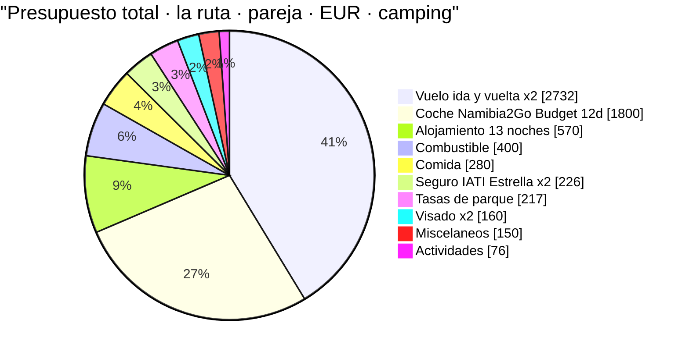
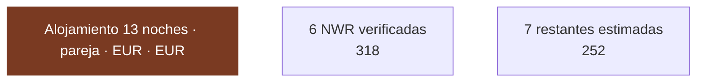
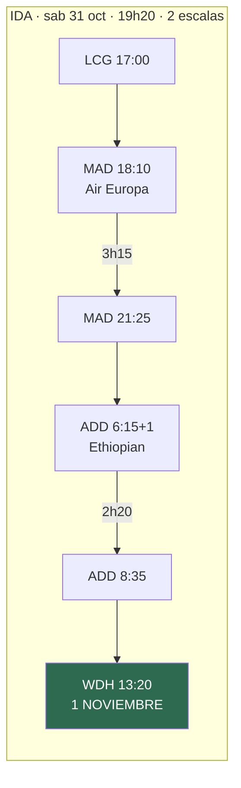
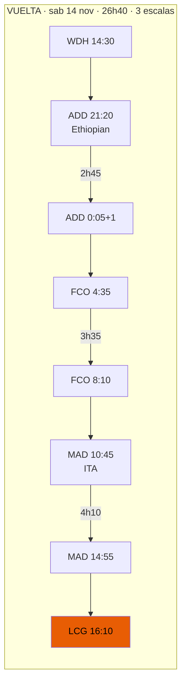
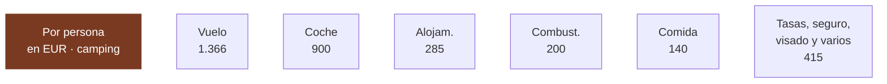

# 02 · Presupuesto

> **Namibia · 31 oct – 15 nov 2026 · la clásica del norte** — [← índice del dossier](README.md)
>
> Lo que cuesta el viaje, partida a partida, con el porcentaje que ya está cerrado y el que sigue siendo estimación.
>
> **~N$20 = €1** *(rango 19,5–20,5)* · **✅** fuente primaria · **◐** secundaria concordante ·
> **○** práctica común, sin fuente · **❌** sin verificar, dicho en blanco
>
> *Investigación cerrada el 17/07/2026 · formato y contenido revisados el 03/08/2026 · precio del
> combustible actualizado a la revisión del 5 ago 2026*

Coste real del viaje **ya cerrado en lo grande** (vuelo, coche y seguro reservados), en N$ y €. Cada
cifra lleva su marca de confianza y su fuente. **Donde no hay dato verificado, se dice y se deja como
estimación marcada: un número plausible presentado como hallazgo es un fallo grave — aquí no se hace.**

> ## 🔄 NOTA (17/07/2026): este presupuesto es el de la RUTA VIGENTE (la ruta, norte)
> Versiones anteriores de este documento presupuestaban **otra ruta** (sur + Namib + costa, con
> coche de **Asco** y fechas de «finales de noviembre»). **Esa ruta se descartó** (ver la nota de
> `13-itinerario.md`) y **las reservas se han cerrado sobre otra realidad**:
>
> - **Ruta**: **la ruta del norte** — la clásica del norte con **Etosha** (4 noches) y **sin el sur**
>   (Fish River, Lüderitz, kokerbooms quedan para otro viaje; su presupuesto sigue documentado en el
>   histórico de `13`). Detalle día a día en [`01-itinerarios-dia-a-dia.md`](01-itinerarios-dia-a-dia.md).
> - **Fechas**: **1–14 de noviembre de 2026**, no «finales de noviembre».
> - **Coche**: **Namibia2Go Budget**, no Asco. **El «precipicio del 15/11» era de Asco y ya no
>   aplica**: Namibia2Go entra en temporada baja el **1 de noviembre**, así que todo el alquiler cae
>   en tarifa barata sin esperar al 15.
>
> Los importes de abajo son los de esta ruta y estas reservas.

---

## 1. La foto de conjunto — dónde se va el dinero

**la ruta · 1–14 nov · dos personas · TODO incluido (con vuelos) · escenario camping.** Reparto del
gasto de la pareja en euros:

> **Vuelo y coche son el 69 % del viaje.** Son también las dos partidas **cerradas y verificadas**.
> Todo lo demás junto (~€2.080 de la pareja) pesa menos que ellas dos.

---

## 2. El coche — cerrado y disponible ✅

**Namibia2Go 4x4 Budget camping equipped double cab**: **€150,00/día × 12 días (1–13 nov) = €1.800**
con impuestos, ✅ **disponible** al consultar. Toyota Hilux Double Cab, automático, diésel, **km
ilimitados** y **Premium Insurance Cover** (franquicia cero) incluidos.

- **Total pareja: €1.800 (~N$36.000)** · **€900/persona**
- La estimación previa para clase budget fue €1.755; el precio real €1.800 (**+2,5 %**). Se acabó el
  rango «Namibia2Go vs Asco»: **el coche es cifra cerrada.**

> ⚠️ **Ojo al calendario:** son **12 días de coche (1–13)** pero **13 noches (1–14)**. La noche del
> **13 en Windhoek te quedas sin coche** → hotel y traslado al aeropuerto (contado en «alojamiento»).
> *Alternativa: añadir el día 13 (~€150–167) y devolverlo el 14 camino del aeropuerto — puede salir
> igual o más barato que hotel + dos traslados.*

> ⚠️ **La web NO sirve para este precio:** publica N$2.910/día «temporada baja», pero esa banda es
> **«01 Nov 2025 – 30 Jun 2026»** y **caduca antes del viaje**; la siguiente que enseña es la alta de
> julio–octubre 2026. La ventana cae en el **año tarifario siguiente**, que no está en la web. Los
> **€150/día son cotización en vivo para las fechas reales**, coherente con el cambio de año tarifario.
> *(Misma trampa que la tarifa de NWR.)*

**Aparte, no incluido en el total** (retención, no gasto): a la recogida se bloquea en la tarjeta un
**aval/depósito de garantía** — con Premium Cover la franquicia es N$0, pero suele retenerse un aval.
**❌ Importe exacto no verificado.** Hay que tener margen en la tarjeta.

> Fuente: [namibia2go.com · 4x4 camping equipped double cab](https://namibia2go.com/4x4-camping-equipped-double-cab)
> · precio de la cotización cerrada .

---

## 3. Alojamiento — 13 noches, 6 verificadas ◐/○

**13 noches en tierra.** De ellas, **6 son campings NWR con precio verificado**; las otras 7 (5
campings + el hotel del D13) **no tienen precio cerrado**.

**Verificado (NWR, ventana nov 2026 – jun 2027, 2 pax):**
- **Sesriem × 2** *(dentro de la puerta — imprescindible para Deadvlei al amanecer)* — **N$1.340
  (~€67)/noche** ✅
- **Okaukuejo, Halali, Namutoni × 2** *(camping dentro de Etosha, charca iluminada)* — **N$920
  (~€46)/noche** ✅

→ Suma verificada: 2×N$1.340 + 4×N$920 = **N$6.360 (~€318) para la pareja / ~€159 por persona** ✅
*(coincide con `01-itinerarios-dia-a-dia.md` §resumen).*

**Parcialmente cerrado / sin verificar ○/◐ (7 noches):**
- D1 Windhoek, D2 Spreetshoogte, D5–D6 Walvis Bay ×2 → campings/alojamientos privados, **precio no
  cerrado** (WebFetch bloqueado; ver `15`). Estimación de práctica común: **~€25–45/noche para dos**
  cada uno. *(Referencia real que ancla el extremo bajo: el camping comunitario de Spitzkoppe
  —campamento equiparable de la ruta— está cerrado en **N$540/noche para dos (~€27)**, entrada incluida
  ◐; ver `15`.)*
- **D8 Hoada** (Grootberg) — **cerrado en esta pasada ◐**: **N$542–732/noche para dos (~€27–37)** según
  temporada (la de noviembre sin fijar; ver `15`). Coincide con la estimación de práctica común.
- **D7 Terrace Bay** (NWR) — **cerrado ✅ y es la noche más cara del viaje**: el tarifario oficial
  2026/2027 da **doble en media pensión a N$1.740/persona → N$3.480 (~€174) la pareja** en la
  ventana nov 2026 – jun 2027. **No hay camping en Terrace Bay** *(la ficha web lista una fila de
  «Campsite» que no aparece en el tarifario: es un error suyo)*. Consuelo: **incluye cena y
  desayuno**, así que descuenta esa comida del presupuesto del D7.

- **D13 Windhoek**: habitación + traslado, porque el coche ya está entregado. **○ estimado.**
  *(Alternativa: añadir el día 13 de alquiler ~€150 y acampar también esta noche, devolviendo el
  coche el 14 camino del aeropuerto — se ahorra el hotel y dos traslados.)*
- **Los campings sin cotizar (D1, D5–D6)**: existen y están identificados —**Urban Camp** o
  **Arebbusch** en Windhoek, **Lagoon Chalets** en Walvis Bay— pero **ninguno publica tarifa** ❌.
  Se mantienen en la estimación de práctica común de ~N$600–1.000 la pareja.

> ✅ **Y esto cierra el mayor hueco del bloque:** Terrace Bay ya no es una incógnita de ±€130. Son
> **~€174 la pareja, verificados**, con cena y desayuno dentro. El bloque sin cerrar se queda en
> **6 noches** —las dos de Windhoek, Spreetshoogte y las dos de Walvis—, todas de camping, que es
> el tramo barato y predecible.

→ Bloque parcial/sin verificar: **~€126/persona ○** *(con el sesgo al alza de arriba)*. **Alojamiento
total: ~€570 pareja (~€285/persona)**, del que **~€318 (56 %) está verificado** y **Hoada suma ◐**.

> Fuentes verificadas: [NWR Rack Rates 2026/2027 (PDF)](https://www.nwr.com.na/wp-content/uploads/2026/06/NWR-Rack-Rates-2026-2027.pdf)
> (ver `03`). Resto: **❌ sin fuente de precio abierta.**

---

## 4. Combustible — calculado sobre la distancia real de la ruta ◐/○

**No se copia el consumo de nadie: se calcula.** Tres factores, cada uno con su banda:

- **Distancia (la ruta)**: **~2.600 km** (○, sumando las etapas del `gantt` de `01`: Windhoek–
  Spreetshoogte, bajada a Sesriem, Sesriem–Walvis, costa hasta Terrace Bay, Damaraland, subida a
  Etosha, safaris internos y vuelta a Windhoek; ningún día por encima de ~390 km).
- **Consumo** del Hilux doble cabina cargado con tienda de techo: **11–13 l/100 km** (○, práctica
  común; no verificado contra ficha del vehículo). Central **12 l/100 km**.
- **Precio del diésel**: la costa (Walvis Bay, precio base nacional) marcaba **N$24,26/l en julio
  2026** tras la rebaja de N$4/l del Gobierno; **pero el 5 de agosto de 2026 subió +N$2,00/l** al
  restituirse los gravámenes que se habían recortado tres meses → **costa ~N$26,26/l ◐** *(N$24,26 +
  N$2,00; coincide con la cifra que devuelve el buscador para agosto)*. En el **interior y bombas
  remotas** (Solitaire, Sesriem, Okaukuejo) sube sobre eso → banda **N$26–29/l**, central **~N$27/l**.
  ⚠️ **El precio se revisa cada mes**: entre agosto y la salida de noviembre habrá **~3 revisiones más**,
  así que esto sigue siendo estimación — reconfírmalo la semana antes de salir.

- **Cálculo central**: 2.600 km × 0,12 l/km × N$27/l = **~N$8.424 (~€421)** para la pareja.
- **Banda**: **N$6.336–9.828 (~€317–491)** *(la banda ya cubría precios de hasta ~N$29/l, así que solo
  se movió el central; la subida de agosto no la desborda)*.

> **Se presupuesta ~N$8.000–8.400 (~€400–420) pareja / ~€200–210 por persona** *(el central subió al
> extremo alto de la banda tras la revisión de agosto)*. Fuentes del precio:
> [GlobalPetrolPrices — Namibia diésel](https://www.globalpetrolprices.com/Namibia/diesel_prices/) ·
> [NAMCOR — fuel prices](https://www.namcor.com.na/fuel-prices/) *(403, no abierta aquí)* ·
> rebaja de julio 2026 en [thebrief.com.na](https://thebrief.com.na/2026/07/gvt-cuts-petrol-price-by-n1-diesel-by-n4/)
> y **subida de agosto** en [thebrief.com.na](https://thebrief.com.na/2026/07/fuel-prices-to-rise-by-n2-00-a-litre-as-government-restores-levies/)
> *(ambas vía fragmento; el sitio y el boletín del MME devuelven 403 aquí, así que la extracción del
> precio de bomba exacto no está verificada contra el primario — de ahí el ◐)*.

---

## 5. Tasas de parque — N$620/día para pareja + coche ◐

**N$280 (~€14)/adulto extranjero/día** (N$140 entrada + N$140 conservación) **+ N$60 (~€3)/vehículo**,
cobrado **por parque y por cada 24 h desde la entrada** (ver `12` §7 y `15`). Dos adultos + coche =
**N$620 (~€31)/día de parque**. Baremo del MEFT publicado en el **Government Gazette Nº 8877 ·
Government Notice Nº 115** (firmado por la ministra el 26/03/2026, en vigor desde el **1/04/2026**),
bajo la Nature Conservation Ordinance de 1975 (primera subida desde 2021) — **◐, no ✅**: lo confirman
dos páginas oficiales del MEFT (PDF de tarifas + nota de prensa `news/199`) y varias secundarias, pero
ninguna se pudo abrir (403) para verificar la extracción de la tabla fina; la **gaceta está localizada
en el índice de gazettes.africa pero tampoco se pudo abrir aquí** (403), así que la tabla sigue sin
verificarse contra el documento primario (detalle en `15` §Tasas). Los tres parques de pago de la ruta
(Namib-Naukluft, Skeleton Coast, Etosha) son **premium**, así que el N$280 es la tarifa correcta para
los tres.

**La la ruta cruza tres zonas de pago:**
- **Namib-Naukluft** (Sesriem/Sossusvlei): ~2 unidades de 24 h (tarde de llegada + amanecer en Deadvlei).
- **Skeleton Coast** (permiso de tránsito + Terrace Bay): ~1 unidad.
- **Etosha**: 4 noches dentro → ~4 unidades.

→ **~7 unidades × N$620 = ~N$4.340 (~€217) pareja / ~€109 por persona** ◐.

> Fuentes: [gazettes.africa — Government Gazette Nº 8877, 1/04/2026 (Government Notice Nº 115)](https://gazettes.africa/akn/na/officialGazette/government-gazette/2026-04-01/8877/eng@2026-04-01) ·
> [MEFT — Park Entrance and Conservation Fees (PDF)](https://www.meft.gov.na/files/downloads/543_Park%20Entrance%20and%20Conservation%20Fees.PDF) ·
> [MEFT — nota de prensa `news/199`](https://www.meft.gov.na/news/199/Implementation-of-New-Park-Entrance-Fees-and-Conservation-Fee/)
> *(las tres localizadas; ninguna se pudo abrir, 403)* · secundarias concordantes en `15`. **Confírmalo por email antes de pagar.**

---

## 6. Visado — cifra dura ✅

**e-visa: N$1.600 (~€80)/persona** → **pareja N$3.200 (~€160)**, pago único. Ver `12` §6.
⚠️ El visado **manual a la llegada** puede llevar un recargo de N$2.000 (~€100) aprobado pero sin
publicar en el boletín: **usa el e-visa**. Fuente:
[MAEC — Namibia](https://www.exteriores.gob.es/es/ServiciosAlCiudadano/Paginas/Detalle-recomendaciones-de-viaje.aspx?trc=Namibia).

---

## 7. Seguro de viaje — cerrado ✅

> ### €226,04 la pareja · **€113,02 por persona** *(31/10 – 15/11)*

### ✅ Las fechas ya llegan hasta el 15 — y costó €14,69

La primera simulación iba del **31/10 al 14/11** y **se quedaba un día corta**: sales de Windhoek el
14 a las 14:30, pero **despegas de Adís a las 00:05 del día 15** y aterrizas en A Coruña a las
**16:10 del 15**. Eran **16 horas de vuelta sin seguro**, justo el tramo más largo y con más
conexiones del viaje.

- Estrella · 31/10 – 14/11 *(con hueco)* — €211,35
- Estrella · **31/10 – 15/11** *(correcto)* — **€226,04** · **€113,02 p.p.**
- **Coste de cerrar el hueco: +€14,69** *(+€7,35 por persona)*

**Catorce euros y setenta céntimos por no volver a casa sin seguro.** *(Curiosidad: al Estándar el
día extra le sale gratis — mismo precio con y sin él.)*

### ✅ Cumple la condición de entrada

Namibia **exige** seguro médico con **repatriación sanitaria**. El Estrella la lleva al **100 %** —
requisito cumplido. *(Las tres modalidades de IATI la cubren, así que por el requisito legal
cualquiera valdría.)*

**Lo que sí compra el Estrella:** asistencia médica **ilimitada** *(Mochilero 1,5 M€ · Estándar
1 M€)*, regreso anticipado por cierre de fronteras y 4.000 € de equipaje. *En un país donde no hay
hospital cerca de Sesriem y la evacuación aérea es todo el argumento, «ilimitado» no es marketing.*

### ⚠️ Búsqueda y salvamento: el top lo deja opcional… y el Mochilero lo incluye

Curiosidad de la tabla que conviene mirar dos veces: **«Búsqueda y salvamento» viene INCLUIDO en el
Mochilero (15.000 €) pero es OPCIONAL en el Estrella.**

Y en **este** viaje importa: **Damaraland, el Namib y buena parte de la ruta no tienen cobertura
móvil**. Es exactamente el escenario para el que existe esa garantía.

> 👉 **Añádele la opción de búsqueda y salvamento al Estrella.** Si no, tienes el seguro más caro sin
> una cobertura que sí trae el más barato.

### 🔁 La franquicia de coche de alquiler te sobra

El Estrella cubre **1.000 € de franquicia del coche**. Pero tu **Namibia2Go lleva Premium Insurance
Cover = franquicia CERO**: **no hay franquicia que cubrir**. Es una garantía casi redundante en tu
caso — no la cuentes como valor. *(Único resquicio: la franquicia cero de N2Go «decae con
negligencia probada» — pero la negligencia suele estar excluida también en el seguro de viaje.)*

### ❓ La pregunta que decide: ¿evacuación aérea DENTRO del país?

La tabla dice **«Repatriación o transporte de enfermos: 100 %»**. **Repatriación** es traerte a
España. Lo que este viaje necesita es lo otro: **que te saquen en avión de una pista remota hasta
Windhoek**. Cerca de Sesriem **no hay hospital** *(Windhoek a ~320 km, Walvis Bay a ~270, ambos 4+ h
de grava)*. **La tabla no lo aclara.**

> 👉 **Pregúntaselo a IATI por escrito antes de contratar.** Es la cobertura que de verdad cambia
> algo aquí.

### Las tres, comparadas

- IATI **Estándar** — €117,41 *(€58,70 p.p.)*
- IATI **Mochilero** — €175,49 *(€87,75 p.p.)* · **incluye búsqueda y salvamento**
- 🏆 IATI **Estrella** — **€226,04** *(€113,02 p.p.)* · **médica ilimitada** · *búsqueda y salvamento opcional*

*Estrella vs Mochilero: **+€50,55** (+€25,27 por persona).*

---

---

## 8. Vuelos — precio cerrado ✅, emisión por confirmar ⚠️

> ### ⚠️ El dossier se contradice a sí mismo: ¿está emitido o no?
> Hay **precio real para las fechas exactas** (€1.366 p.p., cotizado en tres agencias), eso es
> seguro. Lo que no está claro es si **el billete llegó a emitirse**: el README dice que es «de
> referencia, no emitido» y la cuenta atrás de [`04`](04-guia-preparacion.md) todavía lista
> «emitir el vuelo» como tarea de agosto. **Confírmalo tú y que quede escrito aquí** — de ello
> dependen el e-visa (exige billete de vuelta) y el margen de que la tarifa se mueva.

> # €1.366 por persona · €2.732 la pareja
> ### A Coruña → Windhoek, ida y vuelta, turista *(Gotogate; Mytrip €1.390, Booking €1.391)*

### 🎉 Tres buenas noticias

**1 · Sin fiebre amarilla.** La regla es **>12 h de tránsito** por país de riesgo. Tus escalas en
Adís son de **2h20 (ida)** y **2h45 (vuelta)**, las dos *airside*: **muy por debajo del umbral**.
Era el punto que llevaba semanas abierto y que se decidía justo al comprar el billete — **este
itinerario lo resuelve solo**. Una escala larga, o la parada gratis en ciudad de Ethiopian, sí la
habrían disparado.

**2 · Las fechas caen clavadas en la ruta.** Aterrizas el **1 de noviembre a las 13:20** y despegas
el **14 a las 14:30**: **13 noches, 14 días** — exactamente la ruta, con D1 el 1 y D14 el 14.

**3 · Y el calendario no podía salir mejor.** Sales el 31 de octubre pero **no duermes ni una noche
en Namibia en octubre**: todas tus noches NWR caen en el **tramo barato** desde la primera, y el
alquiler (1–14 nov, **13 días**) entra entero en la **temporada baja de Namibia2Go**.

### ⚠️ Dos cosas que confirmar antes de pagar

- **Que sea billete único.** La vuelta lleva **tres compañías** (Ethiopian + ITA + Air Europa). En
  un solo billete, una conexión perdida es problema de la aerolínea; en billetes separados, es tuyo.
- **Que incluya maleta facturada.** El tramo de Air Europa podría tener franquicia distinta a la de
  Ethiopian.

*La vuelta es dura, dicho sea: 26h40, salida de Adís a las 0:05 y 4h10 de espera en Madrid.*

---

---

## 9. Comida, actividades y misceláneos ○

### Comida ○ *(sin fuente — práctica común)*
- **Camping / autoservicio** (supermercado + braai): **~N$300–500 (~€15–25)/día para dos** → 14 días
  ≈ **~N$5.600 (~€280)** pareja / ~€140 por persona. Son órdenes de magnitud, no precios de carta.

### Actividades — unidades verificadas, selección estimada
Precios **por persona**, verificados salvo aviso:
- Lanzadera 4x4 a Deadvlei — **N$180 (~€9)** ✅ (NWR)
- Sesriem, guiado de mañana / paseo — N$300–700 (~€15–35) ✅ (NWR)
- Etosha, safari nocturno guiado — N$750 (~€38) ✅ (NWR)
- **Walvis Bay — crucero en barco** (delfines y lobos marinos, ~3 h, del muelle a Pelican Point, con
  refrigerio a bordo): **~N$1.400–1.990 (~€70–100) por persona** ◐. Catamaran Charters / Sailnamibia
  marcan la banda baja (~N$1.400); Mola Mola la alta, **N$1.990 (~€100)**, mínimo 2 personas, con
  recogida opcional de **+N$470 (~€24)**. *(Un agregador suelta un N$4.570 que contradice a todos los
  demás — descartado por atípico, seguramente charter privado o error de extracción.)*
- **Walvis Bay — Sandwich Harbour en 4x4** (~4–5 h; **la única forma legal de ir: con tu coche lo
  prohíbe el contrato**): **~N$2.600–3.220 (~€130–161) por persona** ◐, mínimo 2. Desert Compass Tours
  N$2.600 (+N$300, ~€15, de recogida en Swakopmund); Red Dune Safaris N$3.220.
- **Combo crucero + dunas de Sandwich Harbour el mismo día** (~8,5 h, Mola Mola): **N$4.740 (~€237)
  por persona** ◐, mínimo 2, **sin la tasa de parque** de Namib-Naukluft.

> ⚠️ **Todo esto va en ◐, no en ✅.** La ficha propia de cada operador devuelve **`403`** desde este
> entorno *(la misma pared anti-bot que los lodges)*, así que las cifras salen del **resumen del
> buscador sobre sus páginas y las de Viator**, cruzadas entre varios operadores independientes:
> concuerdan en el orden de magnitud, pero **no se pudo abrir la página para verificar la extracción**.
> Vigencia: tarifas anunciadas para **2026**. **Confírmalo por email antes de reservar.** Fuentes:
> `mola-namibia.com/marine-dolphin-cruise`, `sailnamibia.com`, `namibiancharters.com/activities/dolphin-seal-cruise`,
> `sandwichharbour-namibia.com`, `reddunesafarisnamibia.com/sandwich-harbour-4x4` y las fichas de
> Viator `d4467-105190P1` (crucero), `-105190P2` (combo) y `-37950P1` (Sandwich Harbour).

→ Partida flexible de **~N$1.520 (~€76) pareja / ~€38 por persona** con lo básico (lanzadera Deadvlei
+ una actividad de NWR). **El día de mar en Walvis** es el capricho que más mueve esta partida: el
crucero para dos ~**N$2.800–3.980 (~€140–199)**, o el combo con Sandwich Harbour ~**N$9.480 (~€474)**
la pareja.

### Misceláneos ○
SIM/eSIM (~N$150–300, ~€8–15, ❌ no verificado), propinas, peajes/tasas menores, imprevistos →
colchón **~N$3.000 (~€150) pareja / ~€75 por persona**. No verificado.

---

## 10. El total — pareja y por persona

**Desglose por persona (escenario camping):**
- ✈️ Vuelo **€1.366** ✅
- 🚙 Coche **€900** ✅ *(mitad de €1.800)*
- ⛺ Alojamiento **~€285** *(€159 verificado + ~€126 estimado)*
- ⛽ Combustible **~€200** ○/◐
- 🍖 Comida **~€140** ○
- 🎫 Tasas de parque **~€109** ◐
- 🩺 Seguro **€113,02** ✅
- 🛂 Visado **€80** ✅
- 🎯 Actividades **~€38** ○
- 🧷 Misceláneos **~€75** ○

> ### **TOTAL POR PERSONA: ~€3.306 (~N$66.000)**
> ### **TOTAL LA PAREJA: ~€6.612 (~N$132.000)**
> Rango honesto: **€3.150–3.450 por persona** — el margen (±~€145) está casi todo en las 7 noches sin
> precio, el combustible, la comida y los misceláneos.

**Qué parte de este número es sólida:**
- **✅ Duro — €2.618 de los €3.306 (79 %)**: vuelo €1.366 · coche €900 · 6 noches NWR €159 · seguro
  €113 · visado €80.
- **◐ Corroborado**: tasas de parque (~€109) — el N$280/adulto está en fuente secundaria; el ministerio
  aún publica la tabla vieja. **Confírmalo por email.**
- **○ Estimado — ~€578/persona**: 7 noches sin precio (~€126), combustible (~€200), comida (~€140),
  actividades (~€38), misceláneos (~€75).

### 👥 ¿Y si vais 3 o 4 en el mismo 4x4? — la economía de escala, calculada

El coche duerme y sienta a más de dos: **ficha verificada ✅ — 5 plazas y 2 tiendas de techo para
4 personas**. Lo único que de verdad se reparte es el coche y su gasoil; casi todo lo demás va
por cabeza:

- **Se reparte (fijo del grupo)**: coche **€1.800 (~N$36.000)** + combustible **~€400 (~N$8.000)** +
  el vehículo en las tasas (7 × N$60 = **N$420 · ~€21**) → **~€2.221 (~N$44.420)** entre los que vayáis
- **Va por cabeza**: vuelo €1.366 · alojamiento ~€285 *(el camping NWR se cobra POR PERSONA ✅:
  Sesriem N$670/pax, Etosha N$460/pax)* · comida ~€140 · tasas de persona 7 × N$280 = **N$1.960
  (~€98)** · seguro ~€113 · visado €80 · actividades ~€38 · misceláneos ~€75 → **~€2.195 (~N$43.900)**

- **2 personas** — **~€3.306 (~N$66.000)/persona** · grupo ~€6.612 (~N$132.000)
- **3 personas** — **~€2.935 (~N$58.700)/persona** · grupo ~€8.806 (~N$176.000) → *ahorra
  ~€371/persona (−11 %) respecto a ir dos*
- **4 personas** — **~€2.750 (~N$55.000)/persona** · grupo ~€11.001 (~N$220.000) → *ahorra
  ~€556/persona (−17 %)*

> ⚠️ **Cuatro letras pequeñas antes de invitar a nadie:**
> 1. **El vuelo (€1.366) está cotizado para 2 plazas** — para 3–4 la tarifa por asiento puede
>    cambiar: recotiza antes de prometer el número ❌.
> 2. **El seguro (€113,02 p.p.) es la simulación de 2 viajeros** — el p.p. a 3–4 se asume lineal ○:
>    pide cotización.
> 3. **Las 7 noches sin precio (~€126 p.p. ○)** mezclan campings por persona con habitaciones
>    (Terrace Bay, hotel del D13): con 3–4 puede salir algo mejor o algo peor. Y el **límite de
>    personas por parcela NWR no está verificado** — pregúntalo al reservar ❌.
> 4. **El espacio es el precio oculto**: doble cabina con nevera, cajas de camping y equipaje de 4 —
>    el maletero va MUY justo ○. Y el **coste del conductor adicional en Namibia2Go no está
>    verificado** ❌: pregúntalo al reservar.

---

## 11. Qué parte de este número es sólida

- **✅ Duro — €2.618 de los €3.306 (79 %)**: vuelo €1.366 · coche €900 · las 6 noches de NWR €159 ·
  seguro €113 · visado €80. Todo con precio real para las fechas exactas.
- **◐ Corroborado — ~€109**: las tasas de parque. El N$280/adulto se apoya en la gaceta localizada y
  en secundarias concordantes, pero **el PDF primario del MEFT sigue sin abrirse**.
- **○ Estimado — ~€578**: seis noches de camping sin cotizar, combustible, comida, actividades y
  misceláneos. **Ese es el margen real: ±€145 por persona.**

> **El inventario completo de lo que sigue abierto** —incluidos los importes que faltan y las
> preguntas por escrito pendientes— está en [`15-huecos-cerrados`](15-huecos-cerrados.md).

---

## Fuentes

- **Coche**: [namibia2go.com · 4x4 camping equipped double cab](https://namibia2go.com/4x4-camping-equipped-double-cab) — cotización cerrada, arriba.
- **Alojamiento NWR**: [NWR Rack Rates 2026/2027 (PDF)](https://www.nwr.com.na/wp-content/uploads/2026/06/NWR-Rack-Rates-2026-2027.pdf) — ver `03` y `01`.
- **Tasas de parque**: [MEFT — Park Entrance and Conservation Fees (PDF)](https://www.meft.gov.na/files/downloads/543_Park%20Entrance%20and%20Conservation%20Fees.PDF) ·
  [MEFT — nota de prensa `news/199`](https://www.meft.gov.na/news/199/Implementation-of-New-Park-Entrance-Fees-and-Conservation-Fee/) — ver `12` y `15`.
- **Visado**: [MAEC — Namibia](https://www.exteriores.gob.es/es/ServiciosAlCiudadano/Paginas/Detalle-recomendaciones-de-viaje.aspx?trc=Namibia) — ver `12`.
- **Diésel**: [GlobalPetrolPrices — Namibia](https://www.globalpetrolprices.com/Namibia/diesel_prices/) ·
  [NAMCOR — fuel prices](https://www.namcor.com.na/fuel-prices/) ·
  [thebrief.com.na — rebaja julio 2026](https://thebrief.com.na/2026/07/gvt-cuts-petrol-price-by-n1-diesel-by-n4/) ·
  [thebrief.com.na — subida de N$2,00/l del 5 ago 2026](https://thebrief.com.na/2026/07/fuel-prices-to-rise-by-n2-00-a-litre-as-government-restores-levies/).
- **Seguro y vuelos**: cotizaciones cerradas (IATI Estrella; Gotogate/Mytrip/Booking) — arriba.
- **Ruta y distancias**: [`13-itinerario.md`](13-itinerario.md) *(histórico del sur)* y [`01-itinerarios-dia-a-dia.md`](01-itinerarios-dia-a-dia.md) *(la ruta vigente)*.
