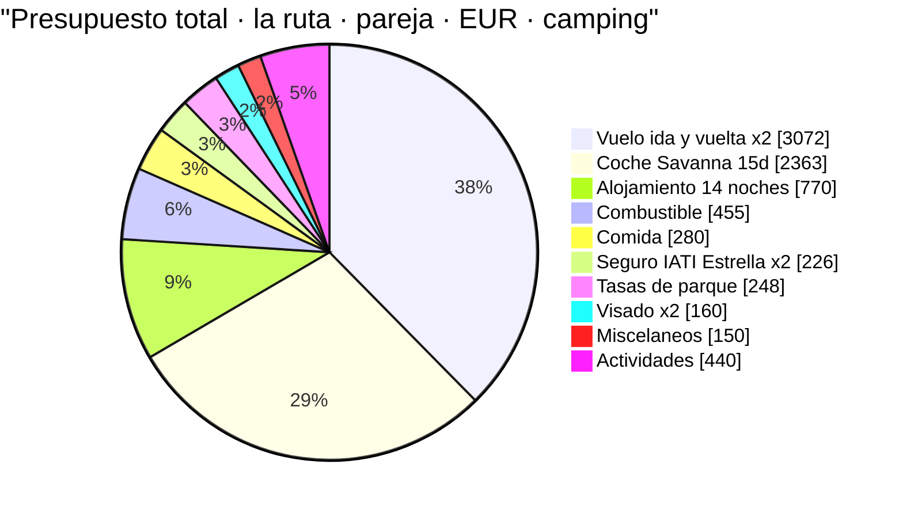
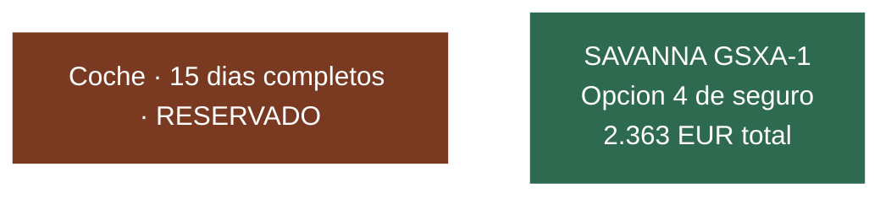
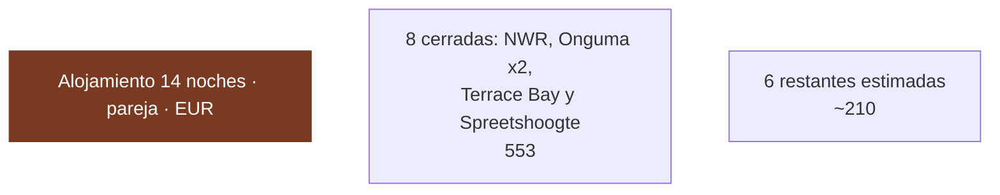
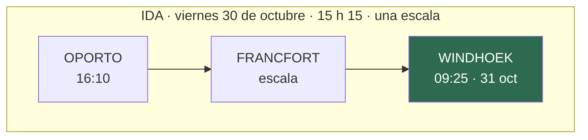
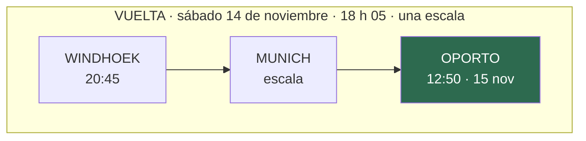
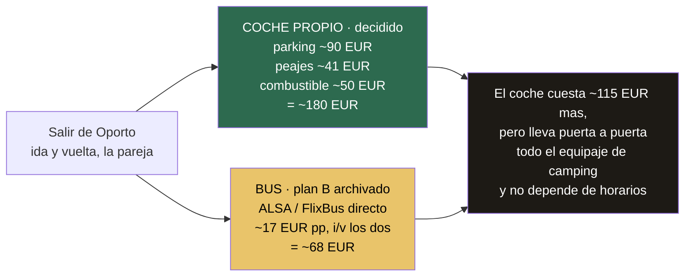
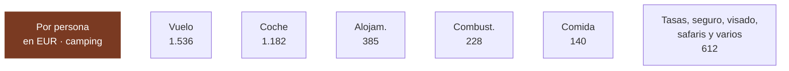
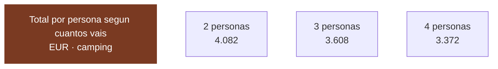

# 02 · Presupuesto

> **Namibia · 30 oct – 15 nov 2026 · la clásica del norte** — [← índice del dossier](README.md)
>
> Lo que cuesta el viaje, partida a partida, con el porcentaje que ya está cerrado y el que sigue siendo estimación.
>
> **~N$20 = €1**, de bolsillo *(el cambio real de 2026 va por **18,5–19,4** — BCE, 28/08: el euro de estas páginas se queda ~7 % corto)* · **✅** fuente primaria · **◐** secundaria concordante ·
> **○** práctica común, sin fuente · **❌** sin verificar, dicho en blanco
>
> *Investigación cerrada el 17/07/2026 · formato y contenido revisados el 09/08/2026 · precio del
> combustible actualizado a la revisión del 5 ago 2026 · coche actualizado a la reserva con
> Savanna del 12/08/2026*

Coste del viaje con las **partidas grandes ya cerradas** (vuelo emitido, coche reservado y seguro
contratado), en N$ y
€. Cada cifra lleva su marca de confianza y su fuente. **Donde no hay dato verificado, se dice y se
deja como estimación marcada: un número plausible presentado como hallazgo es un fallo grave — aquí
no se hace.**

> ⚠️ **«Cotizado» no es «reservado» — y al 24/08/2026 hay bastantes excepciones ya**: el **vuelo,
> EMITIDO y PAGADO (€1.536 p.p.)**, el **coche, RESERVADO con Savanna (€2.363 en total, ~€1.181,50
> p.p.)**, el **seguro IATI Estrella, CONTRATADO el 24/08** *(desde el 30/10; el importe real
> pagado, ❌ por recuperar — §7 y `20` §3)* y **ocho noches RESERVADAS**: **Windhoek Urban Camp** *(D1,
> tarifa ❌)*, **Spreetshoogte** *(D2, una sola noche)*, **Sesriem ×2** *(D3–D4)*, **Okaukuejo** *(D10)*,
> **Halali** *(D11)* y **Onguma Tamboti ×2** *(D12–D13)*.
>
> ⚠️ **Y este documento se rehízo el 24/08 sobre un itinerario distinto**, así que las cifras de
> agosto ya no valen: **Spreetshoogte pasó de dos noches a una** —la liberada se fue a Damaraland,
> donde aparece **una noche nueva en Twyfelfontein (D8) sin tarifa ❌**— y **Namutoni desapareció**,
> sustituido por una **segunda noche en Onguma**. Lo que más mueve el número no es el alojamiento:
> es que **con Namutoni se caen dos actividades de NWR** —el nocturno y una guiada de mañana, que se
> compran durmiendo allí—, **N$2.800 (~€140) la pareja menos** *(§9)*.
>
> **Terrace Bay sigue sin reservar** *(ver [`15`](15-huecos-cerrados.md) §lista maestra y
> [`20`](20-reservas.md))*, aunque **con tarifa cerrada**: es un precio real, no un pago hecho. La
> ruta que presupuestan quedó **confirmada el 06/08/2026** — la nota de abajo.

> ## ✅ NOTA: este presupuesto es el de la RUTA DEL NORTE, confirmada el 06/08/2026
> Este documento presupuesta la **ruta del norte** (sur fuera), con coche de **Savanna** y las
> fechas del vuelo de Lufthansa —**30 de octubre a 14 de noviembre**, en tierra del 31 al 14—.
> **Decisión del viajero, cerrada**: lo que se estudió antes queda archivado en
> [`16`](16-punto-de-decision.md). Los supuestos concretos de esta versión:
>
> - **Ruta**: **la del norte** — la clásica con **Etosha** (4 noches) y **sin el sur** (Fish River,
>   Lüderitz, kokerbooms). Si eliges una variante con el sur, este presupuesto cambia; la base medida
>   sigue en el histórico de `13` *(`git show d0320c3^:13-itinerario.md`)*. Día a día en [`01`](01-itinerarios-dia-a-dia.md).
> - **Fechas**: **31 de octubre – 14 de noviembre de 2026 en tierra**, no «finales de noviembre».
> - **Coche**: **Savanna** — grupo GSXA-1 Camping, Ford Ranger 2.2/2.0 D/Cab automático. El
>   detalle completo de la reserva está en [`20`](20-reservas.md) §1.
>
> Los importes de abajo son los de esta ruta, **cotizados — el vuelo y el coche, ya cerrados**.

---

## 1. La foto de conjunto — dónde se va el dinero

**la ruta · 31 oct – 14 nov · dos personas · TODO incluido (con vuelos) · escenario camping.** Reparto del
gasto de la pareja en euros:

> **Vuelo y coche son el 67 % del viaje.** El vuelo está **EMITIDO (10/08: €3.072 los dos)** y el
> coche **RESERVADO (12/08: €2.363 los dos, los 15 días completos con Savanna)** — las dos
> partidas grandes ya cerradas, no estimadas.
> Todo lo demás junto (~€2.729 de la pareja) pesa menos que ellas dos.

---

## 2. El coche — **RESERVADO con Savanna: €2.363 en total** ✅ *(12/08/2026)*

**Savanna · grupo GSXA-1 Camping · Ford Ranger 2.2 o 2.0 D/Cab automático · 31 oct 11:00 → 14 nov
18:00 · 15 días completos, con transfer de aeropuerto** ✅.

- 🚙 **€2.363 en total — ~€1.181,50 por persona** ✅ *(precio cerrado, no estimado)*.
- ⛽ **Depósito de 140 L** ✅ — y doble depósito (80+60 l) ◐ *(la web de Savanna solo dice «140L»; el reparto sale de su oferta)*; el detalle de cómo se lee el
  indicador, en `20` §1.
- 🛡️ **Seguro Opción 4 — y aquí hay que leer despacio, porque «franquicia cero» no es lo que dice
  Savanna** ⚠️ *(destapado el 28/08)*. Su página de seguro define la Opción 4 como
  *«Collision with a moving object only — animal, person or another vehicle»* ✅ y añade, en
  mayúsculas: *«**IMPORTANT**: an accident without involvement of other parties (single vehicle
  accidents), is not covered with Reduced Excess 1 and 2, 3 and 4. Also not when you tried to avoid
  hitting an animal crossing the road»* ✅ — y un accidente sin terceros es, con sus palabras,
  *«losing the control over the car and rolling the car»*: **el vuelco en grava, que es el accidente
  namibio por excelencia**. En ese caso *«the Client will be liable for **N$165.000** and all
  recovery cost»* — **~€8.900**.
  ⚠️ **Y sus dos páginas se contradicen**: la de condiciones lista dentro de la Opción 4
  *«Vehicle Overturning/Role over»* y *«Undercarriage damages»*, y la de seguro excluye todo
  accidente sin terceros. **No se sabe cuál manda, y es la diferencia entre 0 y ~€8.900.**
  👉 **Pregunta nº 1 de la entrega, por escrito** *(`20` §1 y §9)*. Lo que sí está claro: cubre
  **lunas** *(solo laterales y parabrisas)*, **dos neumáticos — no las llantas**, **sandblast** y
  **bajos**; y **cualquier exceso de velocidad la anula entera** *(caja negra: 120 asfalto, 80 grava,
  60 parque y ciudad)*.
- 🛰️📦 **Extras: teléfono satelital y 2 sacos de dormir con almohada** ✅ — pagados y ya dentro
  del precio total; no hay que gastar nada aparte en satelital.
- ✈️ **Transfer aeropuerto ↔ oficina de Windhoek**, no entrega en el aeropuerto — gratuito por
  ser 15 días, con un matiz de horario en la vuelta: el detalle completo, en `20` §1.

**El resto del kit —tienda de techo, nevera, menaje, kit de recuperación y triángulo— confirmado
pieza a pieza, con sus fuentes, en [`20`](20-reservas.md) §1.**

---

## 3. Alojamiento — 14 noches, 8 con precio cerrado ◐/○

**14 noches en tierra** *(del 31 de octubre al 13 de noviembre, con el coche del aeropuerto
desde el primer día)*. De ellas, **8 tienen precio cerrado**: los **4 campings NWR** *(Sesriem ×2,
Okaukuejo y Halali)*, las **dos noches del camping privado de Onguma (D12–D13)**, la **habitación
de Terrace Bay (D7)** y la **noche única de Spreetshoogte (D2)**. Las **otras 6 son camping y
siguen sin precio**, salvo **Hoada**, que va en ◐.

> ⚠️ **Cambió el reparto el 24/08, y en las dos direcciones.** **Spreetshoogte baja de dos noches a
> una** *(−N$580 · ~−€29)* y **Namutoni desaparece a favor de una segunda noche de Onguma**
> *(+N$320 · ~+€16)*. Y **aparece una noche que antes no existía: la del D8 en Twyfelfontein**, que
> **no tiene tarifa ❌** y sube el bloque estimado de 5 noches a 6.

**Verificado (NWR, ventana nov 2026 – jun 2027, 2 pax):**
- **Sesriem × 2 (D3–D4)** *(dentro de la puerta — imprescindible para Deadvlei al amanecer)* —
  **N$1.340 (~€67)/noche → N$2.680 (~€134)** ✅ — **RESERVADAS el 24/08**, con las fechas nuevas
  *(2 y 3 de noviembre, un día antes de lo que decía el plan de agosto)*
- **Okaukuejo (D10) y Halali (D11)** *(camping dentro de Etosha, charca iluminada)* — **N$920
  (~€46)/noche → N$1.840 (~€92)** ✅ — **RESERVADAS el 21/08**
- ❌ **Namutoni (N$920 · ~€46) sale del presupuesto**: su noche se cambió por la segunda de Onguma.

**Y las dos últimas noches de Etosha ya no son NWR — RESERVADAS (2 pax):**
- **D12 y D13 · [Onguma Tamboti](https://onguma.com/)** *(3,4 km pasada la puerta de Von
  Lindequist, camping de una reserva privada de 35.970 ha)* — **N$540 (~€27) netos por adulto +
  N$80 (~€4) de tasa de conservación = N$620 (~€31) por persona → N$1.240 (~€62) los dos y por
  noche → N$2.480 (~€124) las dos noches** ✅, IVA y Social Development Levy incluidos. Rack oficial
  2027, **vigente del 01/11/26 al 31/10/27** *(el año fiscal de Onguma va de noviembre a octubre,
  igual que el de NWR — vuestras noches caen dentro)*.
  **Condiciones de cancelación del camping, en el propio rack 2027 de Onguma ✅** *(verificado el 25/08 abriendo el PDF)*: *«In the event of a confirmed reservation being cancelled and not postponed (in writing) 100% cancellation fees will be charged and pre-payments will be non-refundable»* — y **depósito del 50 % al reservar, el otro 50 % 30 días antes**. Es decir: **cancelar la segunda noche cuesta el 100 % (N$1.240 · ~€62); POSPONERLA por escrito, no.** *(El repo lo dio por desconocido hasta el 25/08: estaba en el mismo PDF que ya citaba.)*
  ❌ *El importe exacto de la reserva, por confirmar.*
- **La segunda de Onguma sustituye a la de Namutoni**, que era **la charca iluminada más floja de
  las tres**: cuesta **N$320 (~€16) más** y a cambio da **ducha y wc propios en la parcela** y una
  reserva privada con **salida al atardecer con foco y campo a través** y **paseo guiado a pie**,
  las dos prohibidas dentro del parque.
  ⚠️ **Pero el intercambio no es gratis en actividades**: al no dormir dentro se caen **el nocturno
  de NWR y la guiada de mañana de Namutoni** — **N$2.800 (~€140) la pareja** que salen del total
  *(§9)*.

→ **Las 4 noches de Etosha suman N$4.320 (~€216) la pareja** ✅ *(Okaukuejo N$920 + Halali N$920 +
Onguma N$1.240 ×2)*, **N$320 (~€16) más** que con la segunda de Namutoni.

→ Suma verificada/reservada de las **6 noches de Sesriem, Etosha y Onguma**: 2×N$1.340 *(Sesriem)*
+ 2×N$920 *(Etosha NWR)* + 2×N$1.240 *(Onguma)* = **N$7.000 (~€350) para la pareja / ~€175 por
persona** ✅ *(coincide con `01-itinerarios-dia-a-dia.md` §Coste real; **Terrace Bay** y
**Spreetshoogte**, también cerradas, van aparte abajo).*

**Y la noche de Spreetshoogte (D2) — CERRADA el 24/08 ✅, del rack del propio operador:**
- **Spreetshoogte Campsite**, en la D1275, **operado por Barkhan Dune Retreat** — **parcela
  estándar N$290 (~€14,50) por persona y noche → N$580 (~€29) la noche los dos** ✅.
  La **VIP, con baño propio en la parcela, N$680 (~€34) pp → N$1.360 (~€68)**. Incluye wifi,
  «stand only», máximo 4 adultos por parcela. Fuente: su **PDF de camping**
  *([«2026 RACK CAMPING»](https://www.barkhan.africa/2026%20RACK%20CAMPING.pdf))*.
- ⚠️ **Su año tarifario va de diciembre a noviembre**, no de noviembre a octubre como el de NWR:
  el PDF titulado «2027» arranca el **01/12/2026**, dos semanas **después** de vuestra noche, y
  **no aplica** *(detalle en `20` §5)*. Con esto **caen las cifras de blog** que este documento
  arrastraba para Spreetshoogte *(150–300 ZAR/persona, ~N$120–150)*.

**Parcialmente cerrado / sin verificar ○/◐ (6 noches):**
- **D1 Windhoek — RESERVADO ✅ (Urban Camp), pero sin tarifa publicada ❌.** Reservar no es lo mismo
  que saber cuánto cuesta: pide el importe por escrito.
- **D5–D6 Walvis Bay ×2** → **Lagoon Chalets**, camping identificado, **precio no cerrado ❌**
  (WebFetch bloqueado; ver `15`). Estimación de práctica común: **~N$500–900 (~€25–45)/noche
  para dos**. *(Referencia real que ancla el extremo bajo: el camping comunitario de Spitzkoppe
  —campamento equiparable, aunque fuera de la ruta— cuesta **N$300 (~€15) por persona** ✅ en su
  tarifa oficial hasta el 31/10/26 y **N$320 (~€16) en noviembre** ◐ → **~N$640 (~€32) la noche
  para dos**, entrada incluida; ver [los desvíos](aparte/desvios-que-valen-la-pena.md).)*
- 🆕 **D8 Twyfelfontein — la noche nueva, y no tiene tarifa ❌.** Los dos candidatos que el dossier
  tiene identificados son **lodges**, no campings: **Twyfelfontein Country Lodge** *(un agregador da
  «desde ~$223 pp DBB» para may–oct 2026 ◐, sin cifra limpia para noviembre — `15`)* y la zona de
  **Palmwag**. **Se presupuesta en la banda de camping de Damaraland** —la de Hoada, que sí está
  medida— **porque es lo que se va a buscar**; ⚠️ **si acaba siendo lodge, esta noche sola puede
  sumar €150–200 la pareja** y el total de §10 se queda corto. **Pídelo por escrito** *(`20` §5)*.
  *(A favor: es la noche que **no hay que reservar** —fuera de parque, temporada hombro— y por eso
  es la red del calendario: `01` §D8.)*
- **D9 Hoada** (Grootberg) — **cerrado en esta pasada ◐**: **N$542–732/noche para dos (~€27–37)** según
  temporada (la de noviembre sin fijar; ver `15`). Coincide con la estimación de práctica común.
- **D14 Windhoek**: **camping, con el coche hasta el 14 — decidido el 07/08**. Lo natural es
  **repetir el Urban Camp del D1**, tarifa ❌. *(La habitación con traslados quedó descartada.)*

**Y la noche que sí está cerrada y sigue siendo la más cara:**
- **D7 Terrace Bay** (NWR) — **cerrado ✅ y es la noche más cara del viaje**: el tarifario oficial
  2026/2027 da **doble en media pensión a N$1.740/persona → N$3.480 (~€174) la pareja** en la
  ventana nov 2026 – jun 2027. **No hay camping en Terrace Bay** *(la ficha web lista una fila de
  «Campsite» que no aparece en el tarifario: es un error suyo)*. Consuelo: **incluye cena y
  desayuno**, así que descuenta esa comida del presupuesto del D7. ⚠️ **La fecha bajó un día: 6 de
  noviembre, no 7** — se reserva con la fecha nueva.

> ✅ **Lo que está cerrado y lo que no, en una frase:** de las 14 noches, **8 tienen precio real**
> —las 6 de Sesriem/Etosha/Onguma ✅, Terrace Bay ✅ y Spreetshoogte ✅— y **6 no**: las dos de
> Windhoek *(una de ellas ya reservada, pero sin tarifa)*, las dos de Walvis, **la nueva de
> Twyfelfontein** y Hoada, que al menos va en ◐. Todas de camping, que es el tramo barato y
> predecible — **salvo Twyfelfontein, que es el único riesgo al alza de este bloque**.

→ Bloque estimado: **6 noches × ~€25–45 la pareja (central ~€35) ≈ ~€210 pareja / ~€105 por
persona ○**. **Cerrado: €553 — 8 de las 14 noches** — los N$7.000 de Sesriem, Etosha y Onguma ✅,
los N$3.480 de Terrace Bay ✅ y los N$580 de Spreetshoogte ✅ — y **Hoada suma ◐**.

→ **Alojamiento total: ~€763 la pareja (~€382/persona)** con Spreetshoogte en parcela estándar, o
**~€802 (~€401)** si se coge la VIP con baño propio. **El presupuesto planifica con
~€770 la pareja (~€385/persona)**, que cae entre los dos escenarios: absorbe una elección de
parcela que todavía no está tomada.

> Fuentes verificadas: [NWR Rack Rates 2026/2027 (PDF)](https://www.nwr.com.na/wp-content/uploads/2026/06/NWR-Rack-Rates-2026-2027.pdf)
> (ver `03`). Resto: **❌ sin fuente de precio abierta.**

---

## 4. Combustible — calculado sobre la distancia real de la ruta ◐/○

**No se copia el consumo de nadie: se calcula.** Tres factores, cada uno con su banda:

- **Distancia (la ruta)**: **~2.798 km** (◐, control OSRM sobre el trazado real, **rehecho el
  24/08** con el itinerario nuevo — **+34 km** sobre los ~2.764 de agosto: **+30 km** de entrar y
  salir de Etosha por Von Lindequist dos días seguidos *(el D12 sube a 93 km y el D13 a 70)* y
  **+3 km** de partir el día de Damaraland en dos *(211 + 159 en vez de 367)*. Windhoek–
  Spreetshoogte, bajada a Sesriem, Sesriem–Walvis, costa hasta Terrace Bay, Damaraland en dos
  etapas, subida a Etosha, safaris internos y vuelta a Windhoek; ningún día por encima de ~412 km
  salvo el regreso final por asfalto, D14 ~539).
- **Consumo** del Ford 2.2 o 2.0 D/Cab cargado con tienda de techo: **11–13 l/100 km** (○,
  práctica común de la clase, no verificado contra ficha del vehículo). Central **12 l/100 km**.
- **Precio del diésel**: la costa (Walvis Bay, precio base nacional) marcaba **N$24,26/l en julio
  2026** tras la rebaja de N$4/l del Gobierno; **pero el 5 de agosto de 2026 subió +N$2,00/l** al
  restituirse los gravámenes que se habían recortado tres meses → **costa ~N$26,26/l ◐** *(N$24,26 +
  N$2,00; coincide con la cifra que devuelve el buscador para agosto)*. En el **interior y bombas
  remotas** (Solitaire, Sesriem, Okaukuejo) sube sobre eso → banda **N$26–29/l**, central **~N$27/l**.
  ⚠️ **El precio se revisa cada mes**: entre agosto y la salida de noviembre habrá **~3 revisiones más**,
  así que esto sigue siendo estimación — reconfírmalo la semana antes de salir.

- **Cálculo central**: 2.798 km × 0,12 l/km × N$27/l = **~N$9.066 (~€453)** para la pareja.
- **Banda**: **N$8.002–10.549 (~€400–527)** *(2.798 km × 11–13 l/100 km × N$26–29/l — recalculada
  el 24/08 sobre el itinerario nuevo; la subida de agosto no la desborda)*.

> **Se presupuesta ~N$9.100 (~€455) pareja / ~€228 por persona** *(el central ~N$9.066 redondeado
> al alza; es la cifra que usan los totales de §10 y del README)*. Fuentes del precio:
> [GlobalPetrolPrices — Namibia diésel](https://www.globalpetrolprices.com/Namibia/diesel_prices/) ·
> [NAMCOR — fuel prices](https://www.namcor.com.na/fuel-prices/) *(403, no abierta aquí)* ·
> rebaja de julio 2026 en [thebrief.com.na](https://thebrief.com.na/2026/07/gvt-cuts-petrol-price-by-n1-diesel-by-n4/)
> y **subida de agosto** en [thebrief.com.na](https://thebrief.com.na/2026/07/fuel-prices-to-rise-by-n2-00-a-litre-as-government-restores-levies/)
> — y **la nota de prensa primaria del Ministerio existe**: [mme.gov.na · Fuel Price Media Release August 2026](https://www.mme.gov.na/fuel-price-media-release-august-2026-2/),
> que el buscador resume como **«diésel N$26,26/l en Walvis Bay desde el 5 de agosto»** ◐ *(el
> dominio no resuelve desde este entorno el 25/08; la cifra coincide con la que ya usa este
> documento, pero sigue sin abrirse la página: se queda en ◐)*
> *(ambas vía fragmento; el sitio y el boletín del MME devuelven 403 aquí, así que la extracción del
> precio de bomba exacto no está verificada contra el primario — de ahí el ◐)*.

---

## 5. Tasas de parque — N$620/día para pareja + coche ◐

**N$280 (~€14)/adulto extranjero/día + N$60 (~€3)/vehículo** ❌ *(el reparto interno entre entrada y
conservación no se ha podido leer en la gaceta: el 28/08 se retiró un «N$140 + N$140» que no dice
ninguna fuente — la única tabla primaria abierta, la de 2021, repartía 2:1. El total sí está
respaldado)*,
cobrado **por parque y por cada 24 h desde la entrada** (ver `12` §7 y `15`). Dos adultos + coche =
**N$620 (~€31)/día de parque**. Baremo del MEFT publicado en el **Government Gazette Nº 8877 ·
Government Notice Nº 115** (firmado por la ministra el 26/03/2026, en vigor desde el **1/04/2026**),
bajo la Nature Conservation Ordinance de 1975 (primera subida desde 2021) — **◐, no ✅**: lo confirman
dos páginas oficiales del MEFT (PDF de tarifas + nota de prensa `news/199`) y varias secundarias, pero
ninguna se pudo abrir (403) para verificar la extracción de la tabla fina; la **gaceta está localizada
en el índice de gazettes.africa pero tampoco se pudo abrir aquí** (403), así que la tabla sigue sin
verificarse contra el documento primario (detalle en `15` §Tasas). **Se presupuesta el N$280 (~€14)
premium para las 7 unidades como cifra CONSERVADORA (la banda alta), no como dato cerrado ○:** una
búsqueda de 08/2026 apunta a que la subida es de **dos tramos** —los parques emblemáticos de N$150 a
**N$280** (+86 %) y los demás de N$100 a **~N$200** (+100 %, de ahí el titular «80–100 %»)—, pero
**ninguna fuente se pudo descargar para confirmar en qué tramo cae cada parque** *(MEFT, NWR, namibian.org,
safarifind y el blog: todos egress/403)*. Etosha es premium sin discusión *(es la cifra N$280 que repiten
todas las fuentes)*; **Namib-Naukluft** fue siempre de la banda emblemática de N$150, así que muy
probablemente también premium; **la unidad de Skeleton Coast** se marcó un tiempo como la menos
segura de las tres —podía ser del tramo estándar, ~N$200—, pero **el 15/08 quedó en premium como las
otras dos** *(`15` §Tasas)*: **el riesgo a la baja por ese lado queda descartado**. Lo que sigue en
pie es que `11` registra el **permiso de tránsito self-drive del sector Ugabmund–Springbokwasser
como GRATIS** ◐, distinto de la tasa de conservación de Terrace Bay. Confírmalo en recepción/al
reservar.

**La ruta cruza tres zonas de pago:**
- **Namib-Naukluft** (Sesriem/Sossusvlei): ~2 unidades de 24 h (tarde de llegada + amanecer en Deadvlei).
- **Skeleton Coast** (permiso de tránsito + Terrace Bay): ~1 unidad.
- **Etosha**: 4 días de parque → **~4 unidades, y siguen siendo 4** con las dos últimas noches fuera:
  se entra el **D10** por Andersson y se sale el **D13** por Von Lindequist; el **D14 ya no se
  vuelve a entrar**. *(Dormir fuera la última noche no ahorra tasas: las cobra la puerta, no el
  campamento.)*

→ **~7 unidades × N$620 = ~N$4.340 (~€217) pareja / ~€109 por persona** ◐ — y **con la entrada
propia de Cape Cross (~N$620), ~N$4.960 (~€248) pareja / ~€124 por persona**, que es la cifra
que usan los totales.

> ➕ **Aparte, FUERA de esas 7 unidades premium: Cape Cross (D7).** La reserva de lobos cobra su
> propia entrada, y **desde abril de 2026 está en el tramo premium, el mismo que Etosha**:
> **N$280 (~€14)/extranjero + N$60 (~€3)/coche = ~N$620 (~€31) la pareja** ◐, en **efectivo**, en
> recepción. **Súmalo al total de tasas.**
> ⚠️ **Corregido el 25/08**: este documento contaba **N$150 + N$50 = N$350**, y al abrir por fin el
> PDF del MEFT resultó ser **la tabla de 2021** *(«with effect from 1 January 2021», firmada el
> 18/11/2020: «Other foreign nationals · Adults 100 + 50 = 150 · Vehicles 10 seats or less 30 + 20 =
> 50»)*. Las dos secundarias de 2026 que sí abren —[namibian.org](https://namibian.org/blog/namibia-raises-park-fees-by-80-to-100-percent)
> *(«Dorob Park, Cape Cross Seal Reserve and Skeleton Coast Park»)* y umhambi— lo listan en premium.
> **+N$270 (~€13,5) la pareja** sobre lo que se contaba. Horario (abre 08:00 del 16 nov al 30 jun),
> en [`01` §D7](01-itinerarios-dia-a-dia.md).

> Fuentes: [gazettes.africa — Government Gazette Nº 8877, 1/04/2026 (Government Notice Nº 115)](https://gazettes.africa/akn/na/officialGazette/government-gazette/2026-04-01/8877/eng@2026-04-01)
> *(403 también con curl)* · [MEFT — nota de prensa `news/199`](https://www.meft.gov.na/news/199/Implementation-of-New-Park-Entrance-Fees-and-Conservation-Fee/)
> *(abre, pero solo enlaza un PDF de 2021 sin cifras)* · ❌ **el PDF `543_Park Entrance and Conservation
> Fees` del MEFT que aquí se citaba como respaldo de la subida de 2026 es la tabla de 2021** —se retira
> como fuente del baremo actual— · secundarias concordantes en `15`. **Confírmalo por email antes de pagar.**

---

## 6. Visado — cifra dura ✅

**e-visa: N$1.600 (~€80)/persona** → **pareja N$3.200 (~€160)**, pago único. Ver `12` §6.
⚠️ El visado **manual a la llegada** puede llevar un recargo de N$2.000 (~€100) aprobado pero sin
publicar en el boletín: **usa el e-visa**. Fuente:
[MAEC — Namibia](https://www.exteriores.gob.es/es/ServiciosAlCiudadano/Paginas/Detalle-recomendaciones-de-viaje.aspx?trc=Namibia).

---

## 7. Seguro de viaje — cerrado ✅

> ### €226,04 la pareja · **€113,02 por persona** *(31/10 – 15/11)*
> ### ⚠️ **Con el vuelo de Oporto hay que rehacerla: empieza el 30, no el 31**

### ✅ El final ya está bien: llega hasta el 15 — y costó €14,69

La póliza tiene que **cubrir el día del aterrizaje en casa, no el del despegue en Windhoek**. Con
la vuelta llegando **el día 15**, una póliza que acabase el 14 dejaba el tramo más largo del viaje
sin cobertura:

- Estrella · 31/10 – 14/11 *(con hueco al final)* — €211,35
- Estrella · **31/10 – 15/11** — **€226,04** · **€113,02 p.p.**
- **Coste de cerrar el hueco: +€14,69** *(+€7,35 por persona)*

**Catorce euros y setenta céntimos por no volver a casa sin seguro.** *(Curiosidad: al Estándar el
día extra le sale gratis — mismo precio con y sin él.)*

> ### ⚠️ Y ahora falta el otro extremo
> El vuelo elegido **sale de Oporto el 30 de octubre** *(§8)*, no el 31. **Hay que adelantar el
> inicio de la póliza al 30/10** — si no, el vuelo de ida va sin cobertura, con el traslado a
> Oporto incluido. **Simulación 30/10 – 15/11: ❌ sin cotizar.** Es el mismo trámite que cerró el
> hueco del final; hazlo antes de pagar el billete.

### ✅ Cumple la condición de entrada

Namibia **exige** seguro médico con **repatriación sanitaria**. El Estrella la lleva al **100 %** —
requisito cumplido. *(Las tres modalidades de IATI la cubren, así que por el requisito legal
cualquiera valdría.)*

**Lo que sí compra el Estrella:** asistencia médica **ilimitada** *(Mochilero 1,5 M€ · Estándar
1 M€)*, regreso anticipado por cierre de fronteras y 4.000 € de equipaje. *En un país donde no hay
hospital cerca de Sesriem y la evacuación aérea es todo el argumento, «ilimitado» no es marketing.*

### ⚠️ Búsqueda y salvamento: el top lo deja opcional… y el Mochilero lo incluye

Curiosidad de la tabla que conviene mirar dos veces: **«Búsqueda y salvamento» viene INCLUIDO en el
Mochilero (15.000 €) pero es OPCIONAL en el Estrella.**

Y en **este** viaje importa: **Damaraland, el Namib y buena parte de la ruta no tienen cobertura
móvil**. Es exactamente el escenario para el que existe esa garantía.

> 👉 **Añádele la opción de búsqueda y salvamento al Estrella.** Si no, tienes el seguro más caro sin
> una cobertura que sí trae el más barato. ⚠️ **Y esto sigue vivo tras contratar (24/08)**: se
> contrató el **Estrella**, donde la garantía **no entra sola** — **hay que comprobar en la póliza
> que se añadió** *(`20` §3)*.

### 🔁 La franquicia de coche de alquiler **NO te sobra** *(corregido el 28/08)*

Esto decía lo contrario hasta el 28/08, y era el consejo equivocado. El Estrella cubre **1.000 € de
franquicia del coche**, y la Opción 4 de Savanna **no deja la franquicia en cero en el accidente más
probable de Namibia**: su propia página excluye de las cuatro opciones el *«single vehicle
accident»* —perder el control y volcar— y ahí el cliente responde de **N$165.000 (~€8.900)**
*(§2)*. Los €1.000 del Estrella no tapan eso ni de lejos, pero **dejan de ser redundantes**: son
los únicos mil euros de colchón que hay. **Cuéntalos como valor, no como duplicado** — y si en la
entrega Savanna confirma por escrito que el vuelco SÍ entra en la Opción 4, entonces sí vuelve a
sobrar.

### ❓ La pregunta que decide: ¿evacuación aérea DENTRO del país?

La tabla dice **«Repatriación o transporte de enfermos: 100 %»**. **Repatriación** es traerte a
España. Lo que este viaje necesita es lo otro: **que te saquen en avión de una pista remota hasta
Windhoek**. Cerca de Sesriem **no hay hospital** *(Windhoek a ~320 km, Walvis Bay a ~270, ambos 4+ h
de grava)*. **La tabla no lo aclara.**

> 👉 **Pregúntaselo a IATI por escrito antes de contratar.** Es la cobertura que de verdad cambia
> algo aquí.

### Las tres, comparadas

- IATI **Estándar** — €117,41 *(€58,70 p.p.)*
- IATI **Mochilero** — €175,49 *(€87,75 p.p.)* · **incluye búsqueda y salvamento**
- 🏆 IATI **Estrella** — **€226,04** *(€113,02 p.p.)* · **médica ilimitada** · *búsqueda y salvamento opcional*

*Estrella vs Mochilero: **+€50,55** (+€25,27 por persona).*

> 🎟️ **Cómo se contrata, decidido el 21/08**: **con el código de descuento de Chavetas** *(el blog
> de viajes cuyo itinerario ya sirve de contraste en `aparte/desviacion-itinerario-chavetas.md`)* —
> IATI aplica un descuento de afiliado al entrar por su enlace ○. **Hay que entrar por ahí ANTES de
> cotizar**: una vez hecha la cotización directa, el código ya no se puede aplicar ○.
> ❌ **El porcentaje exacto no está verificado aquí**, así que **las cifras de arriba se mantienen
> sin descontar**: lo que rebaje, rebaja — el detalle, en [`20`](20-reservas.md) §3.

---

---

## 8. El vuelo — **Oporto, con Lufthansa** ✅

> ### €1.536 por persona · €3.072 la pareja — **EMITIDO el 10/08/2026** ✅
> ### **Oporto → Windhoek**, ida y vuelta, turista · **30 oct – 14 nov** · Lufthansa, parcialmente
> operado por **Discover Airlines** · **una sola escala en cada sentido**

*Emitido por **€1.536** por persona el 10/08/2026 — la cotización del 05/08 eran €1.450, y el
buscador lo anunciaba en €1.341: **+€86 p.p. entre cotizar y comprar**, la tarifa se movió en
esos cinco días. En la búsqueda original salían **586 resultados**: el más barato en **€1.026**
(21 h 33 de media) y el más rápido en **€1.462** (16 h 08 de media).*

### 🎉 Lo que este itinerario resuelve solo

**1 · La fiebre amarilla deja de ser un tema.** **Fráncfort y Múnich no son zona de riesgo**, así
que **no hace falta vacunarse** y no hay nada que calcular sobre duración de escalas. ✅

**2 · Una escala por sentido, y todo dentro del grupo Lufthansa** *(Lufthansa + Discover)*. Menos
manos y menos costuras que cualquier itinerario con tres compañías distintas.

**3 · Y son 33 h 20 de avión en total**, ida y vuelta — con la vuelta en **18 h 05**, no en una
noche entera de aeropuertos.

### ⏰ Lo que este vuelo mueve en el plan — **y hay que tocarlo**

**Aterrizas el 31 de octubre a las 09:25 y despegas el 14 a las 20:45: son 15 días de suelo, con
la mañana entera del primero y el día 14 completo.** Tres consecuencias, todas accionables:

1. ✅ **El seguro se quedaba corto por un día — RESUELTO el 24/08.** La póliza **cotizada** en §7
   iba del **31/10 al 15/11** y el vuelo sale el **30**, así que el primer vuelo habría ido sin
   cobertura. **Ya está contratado el IATI Estrella empezando el 30/10** *(dicho por el viajero,
   `20` §3)*. *(Lo que sigue abierto no es la fecha sino **el importe**: el día extra nunca se
   cotizó ❌ y el descuento de Chavetas no se verificó ❌, así que este documento sigue contando
   los **€113,02 p.p.** de la cotización, sin descontar — la cifra conservadora.)*
2. ✅ **El coche: RESERVADO — 15 días completos, con transfer aeropuerto ↔ oficina** — 31 oct
   11:00 → 14 nov 18:00, el día del vuelo de vuelta (20:45). Precio cerrado *(§2)*.
3. ✅ **Las noches de NWR no se tocan.** Las del 31 de octubre (Windhoek) y del 1 de noviembre
   (Spreetshoogte, una sola noche desde el 24/08) **no son NWR**: la primera noche NWR es Sesriem
   el **2 de noviembre** *(reservada 2–3 nov)*, y todas las de parque caen del **1 de noviembre**
   en adelante, en tramo barato.

### 🚗 Y el precio de salir de Oporto: **~270 km hasta el aeropuerto — en coche propio**

**Decisión del viajero (09/08/2026): se va y se vuelve en coche propio.** Con salida a las 16:10 se
llega con margen; a la vuelta se aterriza a las **12:50 del día 15** con el coche esperando en el
parking. Los tres costes de salir de Oporto, cotizados el **10/08/2026** *(egress bloqueó abrir toda
web para verificar la extracción, así que van en ◐/❌ — son candidatos con URL, no cifras cerradas;
confírmalos en la web oficial antes de pagar)*:

- 🅿️ **Aparcamiento de larga estancia** del aeropuerto Francisco Sá Carneiro. Los oficiales de larga
  estancia más baratos son **P6 y P9 «Low Cost», a €5,50/día** *(descubiertos, 5–7 min a pie de la
  terminal; el rango de los oficiales de larga estancia va de €5,50 a €16/día)* ◐. Para la estancia
  **30 oct – 15 nov** *(~16–17 días de 24 h)* salen **~€88–94** ◐. Fuera del recinto, con lanzadera,
  hay terceros **desde ~€3,33/día** ◐ *(Parkos)* — más baratos, pero con traslado y reserva previa.
  Reserva online de los oficiales: `store.ana.pt` o **+351 229 410 787**.
- 🛣️ **Peajes, ida y vuelta ≈ €40,80** ◐. En España, la **AP-9 A Coruña → Tui (frontera)** cuesta
  **€20,40/trayecto** *(tarifa 2026, vehículo ligero)* ◐ → **€40,80** i/v. En Portugal, la **A28
  Vigo ↔ Oporto es GRATUITA desde el 1 de enero de 2025** *(peaje suprimido; el ~€4–5 de la A28 que
  aún circula por la web es anterior a esa fecha)* ◐ → **€0** el lado portugués. La bonificación de
  ida y vuelta en <24 h de la AP-9 **no aplica** (van 17 días entre trayectos).
- ⛽ **Combustible del coche propio A Coruña ↔ Oporto ≈ €50–55** ❌. ~270 km × 2 = **~540 km**; con un
  consumo de **~6,5 l/100 km** y gasóleo a **~€1,45–1,55/l** salen ~35 l. **Los dos supuestos —el
  consumo del coche y el precio del día— van sin verificar**: ajústalo a tu coche.

**Total de salir de Oporto, la pareja ≈ ~€180–185** *(◐/❌ — la mayor parte, parking + peajes, es ◐;
el combustible, ❌)*. Es un extra **fuera** del ~€3.990 por persona del presupuesto.

*(El autobús directo A Coruña → terminal con ALSA / FlixBus, ~3 h 43 y desde ~€17 por persona ◐,
queda de plan B: i/v para los dos ≈ ~€68, más barato pero sin la flexibilidad del coche con el
equipaje. Decisión ya tomada: coche propio.)*

### ⚠️ Tres comprobaciones antes de pagar — *ya pagado el 10/08: repásalas AHORA en el localizador*

- 🧳 **Maleta facturada incluida.** Lufthansa vende **Economy Light sin maleta**, y en un buscador
  eso no siempre se ve. Con dos semanas de camping, **no es opcional**.
- 🎫 **Billete único.** Aquí es fácil —todo es grupo Lufthansa—, pero **confírmalo en el
  localizador**: en un solo billete, una conexión perdida es problema de la aerolínea.
- 💳 **El canal de emisión manda en las incidencias.** Identifica quién lo emitió *(¿eDreams o
  Lufthansa directa?)* y **comprueba que el localizador abre en la web de Lufthansa**: un cambio
  o cancelación se gestiona con el canal de venta, así que su teléfono va impreso con los papeles
  del [`04`](04-guia-preparacion.md).

> ✅ **EMITIDO el 10/08/2026, €1.536 por persona.** Con el billete de vuelta en la mano, **el
> e-visa queda desbloqueado**: es el siguiente trámite de [`04`](04-guia-preparacion.md).
> *(Y el seguro, que tenía que rehacerse desde el 30/10, **está contratado desde el 24/08** —
> §7 y `20` §3.)*

---

### 🧳 La franquicia de equipaje — cerrada *(07/08/2026)*

La duda era razonable —**varios operadores en el mismo billete**: los tramos largos los vuela
**Discover Airlines**, la filial de largo radio de Lufthansa *(que opera Frankfurt/Múnich–Windhoek)*,
y el Múnich–Oporto, Lufthansa o su regional Air Dolomiti según el día ◐— pero la respuesta es
simple: **en un billete único del grupo Lufthansa la franquicia es UNA para todo el itinerario y
la fija la TARIFA, no cada operador** ✅. Discover aplica el reglamento de equipaje del grupo y lo
publica en su propia web.

- 🧳 **Economy Classic o superior: 1 maleta facturada de 23 kg por persona** *(máx. 158 cm de suma
  de lados)* ✅ · **Economy Light: NINGUNA** ✅ — es el aviso que ya llevaba el README: al emitir,
  **tarifa con maleta**.
- 🎒 **Cabina: 1 pieza de 8 kg** *(55×40×23)* **+ un accesorio personal** *(40×30×10)* ✅.
- 👉 Con los **petates blandos** del [`05`](05-equipaje.md) *(~20 kg apuntados)*, el límite de
  158 cm sobra por todos lados: **la única decisión real es no comprar la tarifa Light**.

> Fuentes: [Discover Airlines · Baggage](https://www.discover-airlines.com/us/en/book/baggage) ✅
> *(1×23 kg en Economy salvo Light, 158 cm, y las reglas de equipaje del grupo en vuelos operados
> por Discover/Lufthansa/Air Dolomiti)* · [Discover Airlines · newsroom — la ruta
> Múnich–Windhoek](https://newsroom-en.discover-airlines.com/pressreleases/discover-airlines-expands-munich-windhoek-service-3455761) ✅.

## 9. Comida, actividades y misceláneos ○

### Comida ○ *(sin fuente — práctica común)*
- **Camping / autoservicio** (supermercado + braai): **~N$300–500 (~€15–25)/día para dos** → ~14 días de cocina propia *(la del D15 se come en Windhoek antes de volar)*
  ≈ **~N$5.600 (~€280)** pareja / ~€140 por persona. Son órdenes de magnitud, no precios de carta.

### Actividades — unidades verificadas, selección estimada
Precios **por persona**, verificados salvo aviso:
- Lanzadera 4x4 a Deadvlei — **N$180 (~€9)** ✅ (NWR) *(el concesionario About Africa cobra N$200 · ~€10 ◐: +N$40 la pareja si se usa — es opcional con el 4×4, `01` D4)*
- Sesriem, guiado de mañana / paseo — N$300–700 (~€15–35) ✅ (NWR)
- Etosha, safari guiado de mañana o tarde — **N$650 (~€33)** ✅ (NWR, los tres campamentos)
- Etosha, safari nocturno guiado — N$750 (~€38) ✅ (NWR) — ⚠️ **FUERA DEL PLAN desde el 24/08**: se
  compra durmiendo en el campamento, y al cambiar Namutoni por Onguma ya no se duerme dentro
  ninguna de las dos últimas noches. ❌ *Que NWR lo venda a quien no pernocta, sin verificar:
  pregúntalo*
- **Onguma (D12–D13), tarifa oficial 2027 ✅** — reservables desde el camping: **Sundowner Drive 3 h
  N$980 (~€49)** *(sale al atardecer y vuelve de noche, con foco y campo a través — prohibido
  dentro del parque)* · **Onkolo Hide 3 h N$720 (~€36)** *(mín. 2, máx. 7)* · **paseo
  interpretativo a pie 1½ h N$980 (~€49)** *(16+)* · game drive guiado **dentro de Etosha** 4 h
  **N$1.930 (~€97)**. ⚠️ **Un «night drive» como tal no figura en esa tarifa** ❌ — lo citan
  agregadores independientes ◐, sin precio: pregúntalo al reservar. **El Sundowner es lo que
  sustituye al nocturno de NWR** y el **game drive dentro de Etosha**, a la guiada de mañana de
  Namutoni: los dos cuestan más que lo que reemplazan.
- **Walvis Bay — crucero en barco** (delfines y lobos marinos, ~3 h, del muelle a Pelican Point, con
  refrigerio a bordo — **y en jun–nov, temporada de ballena jorobada**: GBIF de la costa da pico
  jul–sep y 27 registros aún en noviembre ◐ *(consulta del 08/08, archivada mes a mes en `15`)*,
  ficha en la guía de fauna): **~N$1.400–1.990
  (~€70–100) por persona** ◐. Catamaran Charters / Sailnamibia
  marcan la banda baja (~N$1.400); Mola Mola la alta, **N$1.990 (~€100)**, mínimo 2 personas, con
  recogida opcional de **+N$470 (~€24)**. *(Un agregador suelta un N$4.570 que contradice a todos los
  demás — descartado por atípico, seguramente charter privado o error de extracción.)*
- **Walvis Bay — Sandwich Harbour en 4x4** (~4–5 h; **la única forma legal de ir: con tu coche lo
  prohíbe el contrato**): **~N$2.600–3.220 (~€130–161) por persona** ◐, mínimo 2. Desert Compass Tours
  N$2.600 (+N$300, ~€15, de recogida en Swakopmund); Red Dune Safaris N$3.220.
- **Combo crucero + dunas de Sandwich Harbour el mismo día** (~8,5 h, Mola Mola): **N$4.740 (~€237)
  por persona** ◐, mínimo 2, **sin la tasa de parque** de Namib-Naukluft.
- **Twyfelfontein (D8) — la visita guiada es obligatoria y de pago**: **N$270 (~€13,5)/persona,
  guía incluido, solo efectivo** ◐ *(tarifario del National Heritage Council vía secundarias
  concordantes: [Safari2Go/namibian.org](https://namibian.org/blog/access-to-namibias-natural-and-cultural-heritage-sites-costs-more)
  y reseñas 2025-26; ~45–60 min de visita)*. **Se paga del colchón de misceláneos** *(es la
  «tasa menor» tipo para la que existe)* — detalle en [`11`](11-entradas-y-permisos.md).

> ⚠️ **Todo esto va en ◐, no en ✅.** La ficha propia de cada operador devuelve **`403`** desde este
> entorno *(la misma pared anti-bot que los lodges)*, así que las cifras salen del **resumen del
> buscador sobre sus páginas y las de Viator**, cruzadas entre varios operadores independientes:
> concuerdan en el orden de magnitud, pero **no se pudo abrir la página para verificar la extracción**.
> Vigencia: tarifas anunciadas para **2026**. **Confírmalo por email antes de reservar.** Fuentes:
> `mola-namibia.com/marine-dolphin-cruise`, `sailnamibia.com`, `namibiancharters.com/activities/dolphin-seal-cruise`,
> `sandwichharbour-namibia.com`, `reddunesafarisnamibia.com/sandwich-harbour-4x4` y las fichas de
> Viator `d4467-105190P1` (crucero), `-105190P2` (combo) y `-37950P1` (Sandwich Harbour).

→ **Partida DECIDIDA (08/08/2026): el safari de Etosha se hace GUIADO** — criterio del viajero:
*«el safari es un 90 % un buen guía»*. ⚠️ **Pero el 24/08 la selección se quedó en la mitad, y no
por decisión: por imposibilidad.** Lo que queda comprable es **2 salidas de mañana** *(Okaukuejo el
D11 y Halali el D12 — N$650 pp ✅)* + la **lanzadera de Deadvlei** *(N$180 pp ✅)* = **N$2.960
(~€148) la pareja / ~€74 por persona**. Cada tarde guiada extra: **+N$1.300 (~€65) la pareja**.

➕ **Y desde el 26/08 entran las dos de Onguma, decididas** ✅: el **Sundowner Drive del D12**
*(N$980 · ~€49 pp)* —lo que sustituye al nocturno— y el **game drive guiado dentro de Etosha del
D13** *(N$1.930 · ~€97 pp)* —la única actividad de Onguma que sirve para el guepardo,
`aparte/plan-del-guepardo.md`—. **N$5.820 (~€291) la pareja más**, que llevan la partida a
**N$8.780 (~€439) la pareja / ~€220 por persona**.

> ### ⚠️ Los N$2.800 (~€140) que se caen del total, y por qué
> Las salidas de NWR **se compran durmiendo la víspera en ese campamento**. Al cambiar Namutoni por
> la segunda noche de Onguma, **las dos últimas noches se duermen fuera del parque**, así que
> **la guiada de mañana de Namutoni** *(N$1.300 la pareja)* y **el nocturno** *(N$1.500 la pareja)*
> dejan de ser comprables. ❌ *Que NWR los venda a quien no pernocta no está verificado — es la
> primera pregunta de la llamada, 📞 +264 67 229 800.*
>
> **El total de §10 baja €70 por persona por esto**, y conviene no leerlo como un ahorro: es una
> actividad decidida que se pierde.
>
> ➕ **Lo que la sustituye tiene precio verificado y desde el 26/08 está DENTRO del total**: el
> **Sundowner Drive de Onguma, N$1.960 (~€98) la pareja ✅** —sale al atardecer y vuelve de noche,
> **con foco y campo a través**— **el D12**, y el **game drive guiado dentro de Etosha, N$3.860
> (~€193) la pareja ✅**, **el D13** a primera hora. *(El **paseo guiado a pie, N$1.960 (~€98) la
> pareja ✅**, que Etosha no permite en ninguna circunstancia, sigue fuera.)* Con los dos, la partida
> de actividades pasa a **~€439 la pareja (~€220 pp)**: se recuperan los €140 perdidos **y €151
> más** — el sundowner cuesta N$460 (~€23) la pareja más que el nocturno al que sustituye, y el
> game drive, casi el triple que la guiada de NWR.
> ⚖️ El choque de horarios está resuelto: **el sundowner va el D12**, así que el D13 queda entero
> para la llanura *(`01` §D13, `aparte/plan-del-guepardo.md`)*. ⚠️ Horarios de salida ❌ no publicados y
pre-reserva incierta en temporada de lluvias: **se cierra en recepción al llegar** *(`01`)*.
**El día de mar en Walvis, decidido (24/08): la excursión guiada a Sandwich Harbour en 4x4** —el
crucero de delfines y lobos sigue abierto como alternativa o complemento, sin decidir. Sigue
aparte como capricho, fuera del total de §10: **Sandwich Harbour** ~**N$5.200–6.440 (~€260–322)
la pareja** ◐ *(N$2.600–3.220 pp × 2)*, o el crucero para dos ~**N$2.800–3.980 (~€140–199)**, o el
combo con Sandwich Harbour ~**N$9.480 (~€474)** la pareja *(ver §9 y [`20`](20-reservas.md) §7)*.

### Misceláneos ○
SIM MTC «Leisure» **N$349 (~€17)** ◐ *(cerrada el 05/08 — ver `15` y `07`)*, propinas, peajes y
tasas menores *(aquí cae la visita guiada de Twyfelfontein, ~N$540 · ~€27 los dos ◐)*, imprevistos →
colchón **~N$3.000 (~€150) pareja / ~€75 por persona** ○.

---

## 10. El total — pareja y por persona

**Desglose por persona (escenario camping):**
- ✈️ Vuelo **€1.536** ✅ *(EMITIDO el 10/08 — la partida ya pagada del viaje)*
- 🚙 Coche **€1.181,50** ✅ *(RESERVADO el 12/08 con Savanna — €2.363 en total, los 15 días
  completos, aeropuerto → aeropuerto, seguro Opción 4 con neumáticos y lunas, satelital y 2 sacos
  de dormir incluidos — `20` §1)*
- ⛺ Alojamiento **~€385** *(€276,50 cerrado ✅ —Sesriem, Etosha y Onguma €175 + Terrace Bay €87 +
  Spreetshoogte €14,50— + ~€108,50 estimado ○, seis noches)*
- ⛽ Combustible **~€228** ○/◐
- 🍖 Comida **~€140** ○
- 🎫 Tasas de parque **~€124** ◐ *(7 × N$620 + la entrada propia de Cape Cross, ~N$620 los dos —
  premium desde 2026, corregido el 25/08)*
- 🩺 Seguro **€113,02** ✅
- 🛂 Visado **€80** ✅
- 🎯 Actividades **~€220** ✅ *(tarifas verificadas: 2 guiadas de mañana de NWR + lanzadera de
  Deadvlei = €74, más **el Sundowner del D12 y el game drive dentro de Etosha del D13, de Onguma,
  €146 — decididos el 26/08**. El nocturno y la guiada de Namutoni se cayeron al dormir fuera — §9)*
- 🧷 Misceláneos **~€75** ○

> ### **TOTAL POR PERSONA: ~€4.082 (~N$81.600)** *con el coche y ocho noches cerrados*
> ### **TOTAL LA PAREJA: ~€8.164 (~N$163.300)**
> Rango honesto: **€3.940–4.240 por persona** — el margen (±~€150) está en las noches sin
> precio, el combustible, la comida y los misceláneos; el coche, el vuelo y las noches reservadas
> son precio cerrado. *(El 21/08 la cifra era €3.990; el 24/08 bajó a €3.936 —**−€70 de
> actividades** que ya no se pueden comprar *(§9)*, **−€14,50 de la noche de Spreetshoogte que se
> quita**, contra **+€8 de la segunda de Onguma**, **+€3,50 de combustible** y **+€13 de la noche
> nueva de Twyfelfontein**, más redondeos de las partidas estimadas—; y **el 26/08 sube a €4.082:
> +€146 por las dos actividades de Onguma, decididas** *(§9)*.)*
>
> ⚠️ **Y el número tiene un riesgo al alza que antes no tenía**: la **noche del D8 en
> Twyfelfontein** está presupuestada como camping *(~€35 la pareja)* y **los dos candidatos
> identificados son lodges** ❌ — si acaba siéndolo, esta sola noche puede sumar **€150–200 la
> pareja** *(§3)*.
>
> **Lo que todavía puede moverlo** *(ver §3, §4 y §9)*: las **6 noches de camping sin cotizar** ·
> **el Sundowner de Onguma** si se coge *(+€49 pp)* ·
> **+el traslado a Oporto** ida y vuelta *(ya cotizado el 10/08 en ~€180–185 la pareja ◐/❌ —
> parking + peajes + combustible, ver §8)* y **+el día extra de seguro** *(❌ sin cotizar)*.
> **Cuenta ~€4.250 por persona para no llevarte sorpresas.**

**Qué parte de este número es sólida: en §11, al final.**

### 👥 ¿Y si vais 3 o 4 en el mismo 4x4? — la economía de escala, calculada

El coche duerme y sienta a más de dos: **ficha verificada ✅ — 5 plazas y 2 tiendas de techo para
4 personas**. Lo único que de verdad se reparte es el coche y su gasoil; casi todo lo demás va
por cabeza:

- **Se reparte (fijo del grupo)**: coche 15 días **€2.363** ✅ *(RESERVADO con Savanna para 2
  personas — sin cotización propia para 3–4, que puede exigir grupo distinto: pregunta antes de
  invitar a nadie ❌)* + combustible **~€455 (~N$9.100)** + el vehículo en las tasas (7 × N$60 +
  el coche de Cape Cross = **N$480 · ~€24**) → **~€2.842 (~N$56.840)** entre los que vayáis
- **Va por cabeza**: vuelo €1.536 · alojamiento ~€385 *(casi todo se cobra POR PERSONA ✅:
  Sesriem N$670/pax, Etosha NWR N$460/pax, Onguma N$620/pax, Spreetshoogte N$290/pax — y Terrace
  Bay, por persona en DBB)* ·
  comida ~€140 ·
  tasas de persona 7 × N$280 = **N$1.960 (~€98) + Cape Cross N$280 (~€14)** · seguro ~€113 ·
  visado €80 · actividades ~€220 · misceláneos ~€75 → **~€2.661 (~N$53.200)**

- **2 personas** — **~€4.082 (~N$81.600)/persona** · grupo ~€8.164 (~N$163.300) *(cuadra con el
  total oficial de §10, que es el que manda para el plan real)*
- **3 personas** — **~€3.608 (~N$72.200)/persona** · grupo ~€10.825 (~N$216.500) → *ahorra
  ~€474/persona (−12 %) respecto a ir dos* — **sin cotizar con Savanna** ❌: su grupo GSXA-1 es
  camping para 2; para 3–4 puede tocar otro grupo, con otro precio. ⚠️ Y hay un tope:
  **la parcela de Onguma Tamboti admite máximo 2 tiendas / 4 personas** ✅ — y ahora son **dos
  noches** las que dependen de ese tope
- **4 personas** — **~€3.372 (~N$67.400)/persona** · grupo ~€13.486 (~N$269.700) → *ahorra
  ~€710/persona (−17 %)* — misma reserva ❌ que la de 3

> ⚠️ **Cuatro letras pequeñas antes de invitar a nadie:**
> 1. **El vuelo (€1.536) está EMITIDO para 2 plazas** — un tercero o cuarto necesitaría su
>    propio billete a la tarifa del día, que puede ser otra ❌.
> 2. **El seguro (€113,02 p.p.) es la simulación de 2 viajeros** — el p.p. a 3–4 se asume lineal ○:
>    pide cotización.
> 3. **Las 6 noches estimadas (~€105 p.p. ○)** son campings por persona salvo la habitación de
>    Terrace Bay: con 3–4 puede salir algo mejor o algo peor. El límite de personas por parcela
>    NWR **está cerrado: máximo 8** ✅ *(tarifario oficial, ver `03`)* — con 3–4 vais sobrados.
> 4. **El coche reservado es de grupo «camping para 2»**: para 3–4 hace falta cotizar con Savanna
>    si su vehículo aguanta más plazas y equipaje, o cambiar de grupo — **sin verificar** ❌.

---

### 💱 Y un sesgo que no es riesgo, es un hecho: el euro de este dossier va ~7 % corto *(28/08)*

Todo el dossier convierte a **N$20 = €1**, que es la cuenta de bolsillo con la que se anda por
Namibia. **El cambio real no ha tocado esa cifra en todo 2026**: el BCE da **18,62 el 27 de agosto**
y **18,88 el 17 de julio** —la fecha que el propio README estampaba en su «rango 19,5–20,5»—, con
una banda de **18,5–19,4** en el año entero. Convertir a 20 **abarata** en euros cada precio namibio.

**Cuánto.** La parte del presupuesto denominada en N$ *(alojamiento, combustible, comida, tasas,
actividades, misceláneos y visado — unos N$25.000 por persona)* sale a **~€1.344 y no a €1.251**:
**+€93 por persona, +€186 la pareja**. El total honesto se va a **~€4.175 pp · ~€8.350 la pareja**,
que **sigue dentro del rango declarado de €3.940–4.240** — pero siempre por arriba.

**No se reconvierten las cifras una a una** *(son cientos, y lo que se paga es el N$)*: queda dicho
aquí, en la cabecera de los 21 documentos y en el README — **el euro de este dossier es orientativo
y corto; con la tarjeta en la mano manda el N$**.

## 11. Qué parte de este número es sólida

- **✅ Duro — ~€3.187 de los €4.082 (78 %)**: vuelo €1.536 *(emitido)* · el coche completo, los
  15 días, RESERVADO con Savanna, €1.181,50 · las 6 noches de Sesriem, Etosha y Onguma €175
  *(**reservadas**)* · Terrace Bay €87 · **Spreetshoogte €14,50** *(una noche, tarifa cerrada el
  24/08)* · seguro €113 · visado €80.
  Todo con precio real para las fechas exactas.
- **✅ Decidido con tarifa verificada — ~€220**: las **dos** guiadas de mañana que quedan comprables
  *(Okaukuejo y Halali)* y la lanzadera de Deadvlei —tarifas NWR reales, reserva en recepción—, más
  **el Sundowner del D12 y el game drive dentro de Etosha del D13**, del rack 2027 de Onguma
  *(decididos el 26/08)*.
  *(Eran ~€144 con las cuatro salidas; el nocturno y la guiada de Namutoni se caen al dormir fuera
  del parque — §9.)*
- **◐ Corroborado o por recotizar — ~€124**: las tasas de parque *(con Cape Cross en premium; la gaceta
  localizada, el PDF primario del MEFT sin abrirse)*.
- **○ Estimado — ~€552**: **seis** noches de camping sin cotizar —entre ellas **la nueva de
  Twyfelfontein, que es el único riesgo serio al alza**— más Hoada ◐, combustible, comida y
  misceláneos. **Ese es el margen real: ±€150 por persona.**

> **El inventario completo de lo que sigue abierto** —incluidos los importes que faltan y las
> preguntas por escrito pendientes— está en [`15-huecos-cerrados`](15-huecos-cerrados.md).

---

## Fuentes

- **Coche**: reserva confirmada con Savanna (12/08/2026) — el detalle, con fuentes, en
  [`20`](20-reservas.md) §1 y [`16`](16-punto-de-decision.md) §8.
- **Alojamiento NWR**: [NWR Rack Rates 2026/2027 (PDF)](https://www.nwr.com.na/wp-content/uploads/2026/06/NWR-Rack-Rates-2026-2027.pdf) — ver `03` y `01`.
- **Tasas de parque**: [MEFT — nota de prensa `news/199`](https://www.meft.gov.na/news/199/Implementation-of-New-Park-Entrance-Fees-and-Conservation-Fee/)
  y secundarias concordantes de 2026 — ver `12` y `15`. *(El PDF `543_Park Entrance and Conservation
  Fees` del MEFT es la tabla de 2021 y ya no se cita como fuente del baremo actual — 25/08.)*
- **Visado**: [MAEC — Namibia](https://www.exteriores.gob.es/es/ServiciosAlCiudadano/Paginas/Detalle-recomendaciones-de-viaje.aspx?trc=Namibia) — ver `12`.
- **Diésel**: [GlobalPetrolPrices — Namibia](https://www.globalpetrolprices.com/Namibia/diesel_prices/) ·
  [NAMCOR — fuel prices](https://www.namcor.com.na/fuel-prices/) ·
  [thebrief.com.na — rebaja julio 2026](https://thebrief.com.na/2026/07/gvt-cuts-petrol-price-by-n1-diesel-by-n4/) ·
  [thebrief.com.na — subida de N$2,00/l del 5 ago 2026](https://thebrief.com.na/2026/07/fuel-prices-to-rise-by-n2-00-a-litre-as-government-restores-levies/).
- **Seguro y vuelos**: cotizaciones cerradas (IATI Estrella; Gotogate/Mytrip/Booking) — arriba.
- **Ruta y distancias**: [`13-itinerario.md`](13-itinerario.md) *(histórico del sur)* y [`01-itinerarios-dia-a-dia.md`](01-itinerarios-dia-a-dia.md) *(la ruta vigente)*.
