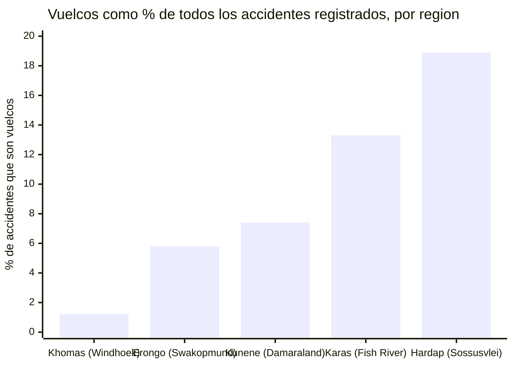
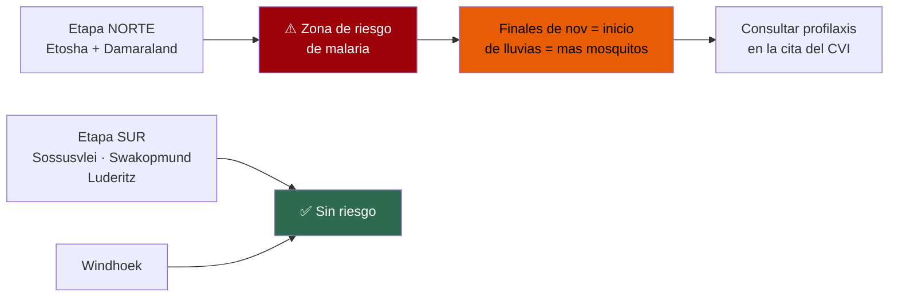
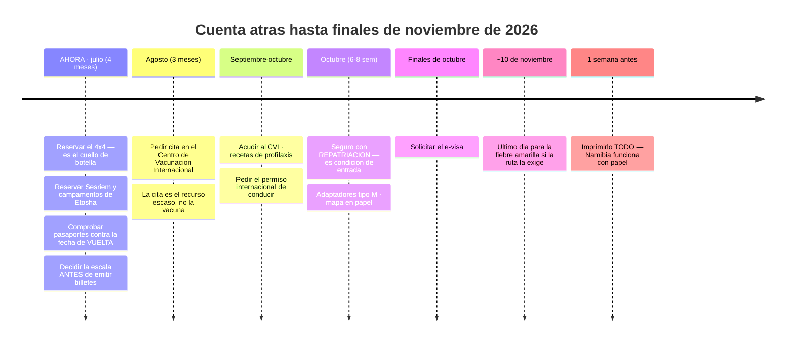
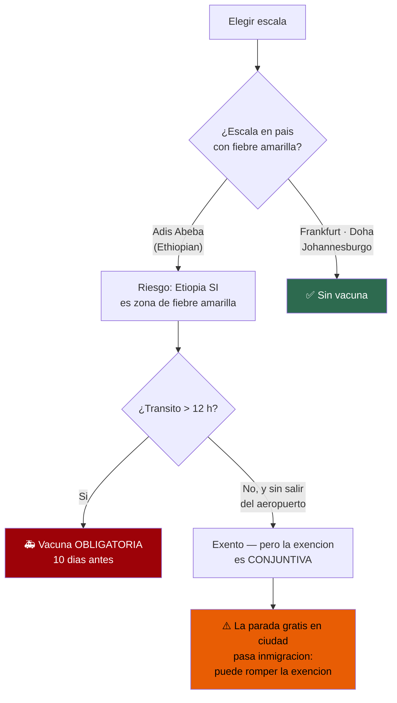
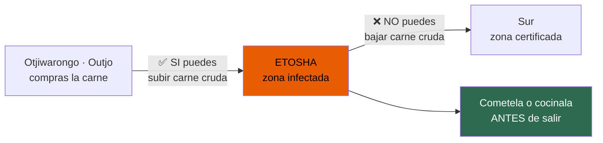
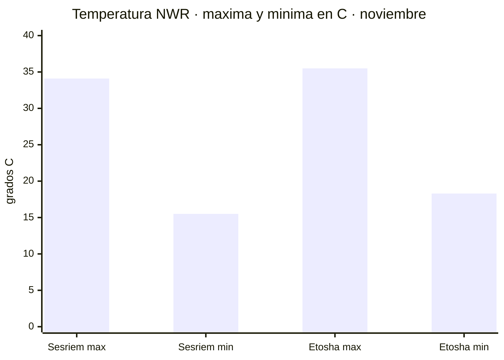

# Guía de preparación y de carretera

Namibia, 4x4 por libre, dos personas, 14 días, finales de noviembre de 2026.
Investigación cerrada el 16/07/2026 · **Tipo de cambio: ~N$20 = €1** (rango N$19,5–20,5)

Cada dato lleva su grado de evidencia:
**✅ verificado en fuente primaria** · **◐ corroborado en fuente secundaria** · **○ práctica común sin fuente citable**

La técnica de conducción en grava no tiene fuente oficial: va marcada como ○ en vez de disfrazarla
de dato verificado. Un hueco reconocido vale más que un número plausible.

---

## 🚨 Tres cosas que cambian el viaje, antes de nada

### 1. El sendero del Fish River Canyon está CERRADO en noviembre ✅

La temporada del *Fish River Canyon Hike* es **mayo–septiembre**. Un viaje a finales de noviembre
cae **entero fuera**. Y aunque fuera temporada, tampoco podríais: NWR exige **mínimo 3 personas**
para reservarlo, y sois dos.

> Son 85 km, 4–5 días, con certificado médico de aptitud. En noviembre, el Fish River Canyon es
> **un mirador, no una caminata**.

**Esto debilita mucho el argumento del desvío al sur.** Si el cañón se reduce a mirador, la
pregunta pasa a ser si Lüderitz y Kolmanskop justifican solos ese rodeo enorme.
Fuente: https://www.nwr.com.na/activities/

### 2. El vuelco no es un tópico: es el 37 % de los muertos ✅

Del informe estadístico de la NRSC (2019), sobre 18.665 accidentes y 413 muertos:

- «Vuelco de vehículo único»: **857 accidentes (4,6 %)** … pero **152 muertos = 36,8 % del total**
- Letalidad: **17,7 muertos por cada 100 vuelcos**, frente a **0,64** en el choque más frecuente
- O sea: un vuelco es **~28 veces más letal por evento** que el accidente más común

**Y se concentra justo en nuestra ruta.** Porcentaje de accidentes que son vuelcos, por región:

- **Hardap** (Sesriem/Sossusvlei): 119 de 628 = **18,9 %** — casi **1 de cada 5**
- **!Karas** (Fish River, Lüderitz, Kolmanskop): 72 de 540 = **13,3 %**
- **Kunene** (Damaraland, Twyfelfontein): 37 de 502 = **7,4 %**
- **Erongo** (Swakopmund, Spitzkoppe): 125 de 2.170 = **5,8 %**
- **Khomas** (Windhoek): 94 de 7.839 = **1,2 %**

> **El peligro no es el tráfico de la capital. Es la pista vacía, rápida y preciosa donde te sientes
> más seguro.** En la región de Sossusvlei, uno de cada cinco accidentes es un vuelco; en Windhoek,
> uno de cada ochenta.

⚠️ **Dos límites honestos:** el informe es de **2019** (es el último completo que publica la NRSC —
hay un vacío de datos 2020–2026), y **no desglosa por tipo de firme**, así que la región es un
*proxy* de «grava y remoto», no una prueba de causalidad. El proxy, aun así, es brutal y coincide
exactamente con nuestro itinerario.
Fuente: informe NRSC 2019 · https://www.nrsc.org.na/page/downloads/

### 3. La malaria SÍ afecta a Etosha ✅

El CDC lista transmisión de malaria en **Kavango, Kunene, Ohangwena, Omaheke, Omusati, Oshana,
Oshikoto, Otjozondjupa y Zambezi**. Etosha se extiende por Kunene, Oshikoto, Oshana, Omusati y
Otjozondjupa: **está dentro**.

El itinerario queda **partido**: las etapas de Etosha y Damaraland/Kaokoveld llevan riesgo; las del
desierto sur, prácticamente ninguno. **Finales de noviembre importa**: es el arranque de las lluvias,
cuando sube el mosquito.

**La profilaxis marca la cuenta atrás**, porque cada fármaco tiene su plazo:
- **Atovacuona/proguanil (Malarone)** — empieza **1–2 días antes** de entrar en zona de riesgo
- **Mefloquina** — empieza **2–3 semanas antes**

👉 **Saca la receta en la cita del CVI, no la semana antes.**
Fuente: https://wwwnc.cdc.gov/travel/destinations/traveler/none/namibia

> ❌ **Corrección:** un borrador de esta guía decía que la rabia es una pauta de 3–4 semanas y que
> «se decide en septiembre o nunca». **Refutado**: el ACIP cambió la pauta en **2022** a **2 dosis,
> días 0 y 7**. Ese consejo era de la era pre-2022.

---

## 📅 Cuenta atrás

### El portal del e-visa — y las webs que te van a cobrar de más ✅

> ### ⚠️ El único portal oficial es **https://eservices.mhaiss.gov.na**
> Solo `.gov.na` es el Gobierno. Buscar «Namibia evisa» saca **namibia-evisa.com**, que se
> autodenomina *«Official Electronic Travel Authorization»* y **NO es el Gobierno**.

Lo lleva el Ministerio del Interior (MHAISS). Confirmado de forma independiente por la Namibia
Airports Company (operador estatal de aeropuertos) y por la embajada namibia en Suiza.

**Y espera que el sitio oficial parezca roto:** a 16/07/2026 sirve una **cadena de certificado TLS
incompleta** (el certificado Sectigo es legítimo, pero el servidor omite el intermedio) y está tras
un WAF que devuelve un HTTP 468 no estándar a lo que no sea un navegador normal. Un navegador
normalmente lo salva.

> 👉 Un aviso de certificado **aquí** es una mala configuración del servidor, no una prueba de que
> estés en una web falsa. Pero **verifica que el dominio pone exactamente `eservices.mhaiss.gov.na`
> antes de teclear la tarjeta.**

Fuente: https://www.airports.com.na/useful-information/e-visa-information/129/

### Reserva el coche primero ○

El vehículo, no el vuelo, es lo que se agota. Los doble cabina equipados con tienda de techo son una
flota pequeña compartida por todo el mercado de Windhoek — y **finales de noviembre concentra la
demanda justo en el precipicio del 15 de noviembre**: todo el que persigue ese ahorro compite por
los mismos coches la misma semana.

⚠️ **Sin fuente:** no encontré ninguna empresa que publique un «reserva con X meses». Es práctica
del sector, no un plazo citable. **Reserva el coche antes que vuelos no reembolsables**: una ruta
sin 4x4 disponible no es una ruta.

### Pasaportes: contra la fecha de VUELTA ✅

El MAEC exige *«válido durante al menos 6 meses a partir de la fecha de regreso, con tres páginas en
blanco»*. **Ojo a la trampa:** el organismo de turismo namibio lo redacta como 6 meses desde la
**entrada**, que es más laxo. **Usa la lectura estricta española.**

Para una vuelta a primeros de diciembre de 2026 → pasaporte válido **hasta junio de 2027 como
mínimo**. Tres páginas en blanco **de verdad**: las que ya tienen sellos no cuentan.

> Si alguno falla, **renuévalo YA**. El cuello de botella es la **cita previa** en Policía Nacional,
> no la impresión. Dejarlo para noviembre es como se pierden los viajes.

### Vacunación: la cita es el plazo, no la vacuna ✅

Sanidad dice acudir con *«4-6 semanas de antelación»* — pero eso es cuánto antes hay que **ser
atendido**, no cuánto antes hay que **llamar**. En verano, la cita es el recurso escaso.

**Tu centro más cercano:**
- **Sanidad Exterior · A Coruña** — C/ Durán Lóriga 3, 5ª planta, 15003 · **981 989 570 / 71** · 09:00–14:00
- Complejo Hospitalario Universitario A Coruña — As Xubias de Arriba 84 · 981 17 80 38
- Santiago de Compostela — Rúa da Choupana s/n · 981 95 00 37 / 90

> La fiebre amarilla **solo** se pone en un Centro de Vacunación Internacional autorizado.
> **Tu médico de cabecera no puede emitir la cartilla amarilla.**

👉 **Pide cita en agosto para que te atiendan a finales de septiembre u octubre.**
Fuente: https://www.sanidad.gob.es/areas/sanidadExterior/laSaludTambienViaja/centrosVacunacionInternacional/centrosvacu.htm

### La fiebre amarilla tiene mecha de 10 días — y luego dura toda la vida ✅

La enmienda del Anexo 7 del Reglamento Sanitario Internacional de la OMS es taxativa: la vacuna
*«provide protection against infection starting 10 days following the administration»* y el
certificado *«shall extend for the life of the person vaccinated, beginning 10 days after the date
of vaccination»*.

- Si tu ruta la exige, la vacuna debe ser **10 días completos antes de LLEGAR** a Namibia
- Para llegar ~20 de noviembre → **como muy tarde ~10 de noviembre** (y apurarlo así es una locura)
- **Lo bueno:** es **vitalicia**, obliga a todos los estados del RSI desde el 11/07/2016, y **nadie
  puede exigirte un refuerzo jamás**. Una dosis te cubre todos los viajes futuros.

**La decisión se toma al comprar el billete, no después:**

Namibia no tiene fiebre amarilla, pero figura en la lista de la Unión Africana de países que exigen
certificado a quien venga de —o **transite 12 h por**— un país de riesgo.

> **Dos salidas limpias:** (1) ruta por un hub sin riesgo — Frankfurt/Múnich, Doha o Johannesburgo —
> y te ahorras la vacuna; (2) si vas por Adís, vacúnate. **Decide antes de emitir**, porque la
> opción 2 tiene mecha de 10 días.
>
> ⚠️ No intentes apurar con una escala de 11 horas. O evitas el país de riesgo, o te pinchas.

---

## 🚗 Conducir en Namibia

### El límite: la ley dice 100, tu contrato dice 80, y la carretera a veces dice 50 ✅

Ya está en `01`: **80 km/h contractuales en grava**, con **caja negra** que registra velocidad y
posición y **se lee tras un accidente**. Superarlo **anula el seguro**.

Cruzado con el dato de vuelcos de arriba, el 80 deja de ser burocracia: es el número que te separa
del 37 % de los muertos.

### La mecánica: por qué la grava vuelca un Hilux y el asfalto no ○

*(Práctica común, sin fuente citable. Lo marco como tal.)*

- La grava tiene **una fracción del agarre** del asfalto. El coche empieza a irse **mucho antes** de
  lo que el cuerpo espera, porque el motor y la postura van igual que en asfalto.
- El error clásico es la **sobrecorrección**: la trasera se va, corriges de más, el coche cruza,
  agarra de golpe al morder tierra firme o el arcén — y **un 4x4 alto y cargado, con tienda de techo
  arriba, tiene el centro de gravedad donde no debe**. Ahí es donde vuelca.
- **La tienda de techo empeora la física**: peso arriba del todo.
- **Corrugado** (*washboard*): produce esa vibración en que el coche parece «flotar». Estás con
  agarre intermitente. La tentación es acelerar porque a más velocidad vibra menos: es exactamente
  la trampa.
- **Frena antes**, no dentro. Nada de gestos bruscos: dirección, freno y acelerador, todo suave.

### El neumático: hazle caso al depósito, no a internet ✅

Pide en la entrega que te digan **las presiones en frío recomendadas para TU vehículo y TU carga**,
y **apúntalas**. Varían con el modelo y el peso; la cifra de un foro no vale para tu coche.

**Arena de Sossusvlei/Deadvlei** ◐: los últimos ~5 km desde el aparcamiento 2WD son arena blanda, de
los que los ~4 finales exigen 4x4 de verdad.
- Mete **4H ANTES** de entrar en la arena, no cuando ya estés atascado
- **Desinfla en el aparcamiento 2WD, no antes**: los ~60 km desde la puerta de Sesriem son buen
  asfalto y hacerlos con poca presión es como destrozas las ruedas
- Mantén inercia, **métete en las roderas** del de delante, no pares en subida, no patines
- Si te encajas, **marcha atrás por tus propias huellas** suele funcionar antes que ponerse a cavar
- **Reinfla en cuanto pises duro**; en Sesriem hay aire

> ⚠️ **Y esto puede cambiar antes de ir:** el 1 de mayo de 2026 se anunció una **prohibición al
> self-drive** hacia Deadvlei… y se **revirtió al día siguiente**. La nota del MEFT del 2 de mayo
> dice que *«Deadvlei will remain accessible to tour guides registered with the Namibia Tourism
> Board and to self-drive visitors with 4x4 vehicles»*.
>
> A 16/07/2026 **el self-drive está permitido**, pero **ya ha bailado una vez en tres meses**.
> 👉 **Reconfírmalo ~4 semanas antes.**
> Fuente: https://www.tourismupdate.com/article/namibia-restores-self-drive-access-to-deadvlei

### No conduzcas de noche

El consejo es bueno y está corroborado, pero **con la fuente puesta en su sitio**:

- **El dato que sí aguanta** ✅: NRSC 2019, tabla 6 — *«Most crashes occurred between 16:00 - 19:59
  (4.811)»*, y tabla 11: **121 de 413 muertos (29,3 %)** en esa franja.
- **El anochecer a finales de noviembre en Windhoek es ~19:16**. Es decir: la franja más mortal del
  país **coincide con tu último tramo del día**.
- ❌ **Lo que NO puedes citar**: el FCDO británico sí dice *«avoid driving at night outside towns,
  as wildlife and livestock are serious hazards»*, **pero ese punto está dentro de una lista
  encabezada por «During the rainy season from January to April»**. No es consejo anual: presentarlo
  como tal es estirar la fuente. Refutado 0–2 en verificación.

**Regla práctica:** planifica llegar **con luz**, y trata el atardecer como hora punta de riesgo,
no como «un ratito más».

### Ruedas de repuesto: lo que de verdad dice el FCDO

❌ **Refutado 0–2**: la idea de que el FCDO recomienda «llevar 2 repuestos en pista» **todo el año**.
El texto real es:

> *«During the rainy season from January to April, many gravel roads deteriorate. You should: not go
> faster than 80 km/h · carry 2 spare tyres for punctures · carry plenty of water · check the road
> conditions before setting off · avoid driving at night outside towns…»*

La lista **está condicionada a la temporada de lluvias de enero a abril**. En toda la página, «spare»
solo aparece ahí. **No existe una recomendación FCDO incondicional de llevar dos repuestos.**

✅ **Lo que sí es cierto y relevante:** **Asco incluye una segunda rueda de repuesto** en su tarifa
(ver `01`). Con **un solo neumático cubierto por el Super Cover** y 2.500–3.500 km de grava por
delante, llevar dos repuestos físicos es sensato **por criterio propio**, no porque lo mande el FCDO.

👉 **En la entrega**: que te enseñen físicamente el gato, la llave, **los dos repuestos**, el
compresor y las herramientas. Antes de salir del depósito.

---

## ⛽ Logística de carretera

### El mito de la tarjeta ❌→✅

> ### La gasolinera SÍ te acepta la tarjeta. Lo que no acepta es «a crédito».

Este es el bulo mejor extendido del viaje a Namibia, y nació de **leer mal una frase**.

- La web del Namibia Tourism Board dice: *«Please note, service stations **do not accept credit for
  petrol**»*.
- En inglés del sur de África, *«credit»* en una gasolinera significa **comprar a cuenta / con
  tarjeta de carburante de la vieja escuela**. **No significa tarjeta de crédito.**
- **La misma página** dice: *«American Express, Diners Club, MasterCard and Visa are accepted»* y
  *«credit cards are also accepted throughout the country, though not in every case»*.
- Y la autoridad de pagos lo confirma **desde 2010**: la Payment Association of Namibia (licenciada
  por el Banco de Namibia) publicó *«USE OF CREDIT AND DEBIT CARDS FOR FUEL PURCHASES IN NAMIBIA»*,
  anunciando que **se descontinuaban las petrol cards** y que el público **podría pagar el
  combustible con tarjeta**.

**Traducción práctica:** lleva efectivo igualmente —cobertura, averías de datáfono, sitios remotos—
pero **no planifiques el viaje como si fuera un país de solo-efectivo**, porque no lo es.
Fuentes: https://visitnamibia.com.na/currencies/ · https://www.bon.com.na/

### Te sirven ellos, y se propina ○

No hay autoservicio. Un empleado te llena el depósito, limpia el parabrisas y comprueba el aceite si
se lo pides. **Se propina** — billetes pequeños, en dólares namibios.

### Combustible y tramos sin gasolinera ◐

⚠️ **El precio cambia CADA MES en Namibia.** Cualquier cifra de julio de 2026 **no vale** para
noviembre. **Recomprueba la semana antes de salir.**

- **Solitaire** es el salvavidas del tramo de Sossusvlei — y también su famosa tarta de manzana
- ○ **Sin confirmar**: hay reportes de falta de combustible en campamentos de NWR dentro de parques.
  **Planifica como si fuera cierto**: repostar **siempre que puedas**, no cuando lo necesites.
  No pude verificarlo.

👉 **Regla:** depósito lleno al salir de cada pueblo con gasolinera. La autonomía sobrante es gratis;
quedarse tirado, no.

### La Línea Roja: la carne va al norte, nunca al sur ◐

La **Red Line** es una doble valla veterinaria de 1.250 km que separa el norte (con fiebre aftosa)
del sur certificado para exportación. **Pasa por el límite SUR de Etosha.**

> ⚠️ **Ojo a la dirección: hay una web muy citada de Etosha que lo cuenta AL REVÉS.** La carne cruda
> puede entrar en la zona infectada pero **no salir** de ella.

- **Puedes** subir carne cruda de Otjiwarongo/Outjo **hacia** Etosha
- **No puedes** bajarla cuando salgas hacia el sur: te la confiscan y destruyen
- Controles relevantes: **límite sur de Etosha**, y **Palmwag** bajando a Damaraland
- La carne **cocinada** suele pasar; envasados al vacío y biltong, normalmente bien

👉 **Plan:** compra el braai en Otjiwarongo subiendo, y **cómetelo todo antes de salir de Etosha
hacia el sur**. No llenes la nevera de filetes crudos para el viaje de vuelta.
**Declara siempre**: al turista que declara no se le multa, pero **saltarse un control veterinario es
delito**.

### Dinero, cobertura y emergencias

- **ZAR sirve en Namibia; el NAD no sirve en Sudáfrica** ✅ (el NAD está vinculado al rand 1:1)
- **MTC** es la única opción realista de cobertura ◐ — y **hay tramos enteros de la ruta sin señal**
- ○ **Comunicador satelital** (Garmin inReach o similar) si quieres margen real: Sossusvlei,
  Damaraland y buena parte de la ruta no tienen cobertura
- ⚠️ **El 10111 es una trampa**: es el número de policía **sudafricano**, no el namibio. Guardar los
  namibios **antes** de volar.

---

## 🎒 Equipaje

### ❄️→🔥 Corrección de premisa: las noches de noviembre NO son frías ◐

La idea de «noches heladas en el desierto» es un dato de **junio/julio** mal aplicado a noviembre.
Datos climáticos de la propia NWR:

- **Sesriem, noviembre**: 34,1 °C máx / **15,5 °C mín** (salto de 18,6°, no de 20+)
- **Sesriem, diciembre**: 34,5 / 15,8
- **Etosha, noviembre**: 35,5 / **18,3**
- **Etosha, diciembre**: 34,4 / 18,8

> Una noche de 15–18 °C es **forro polar y pantalón largo**, no plumas. **Deja en casa el plumas,
> los térmicos, el gorro y los guantes**: son peso muerto en el poco sitio de una tienda de techo.

**El problema real de finales de noviembre es el CALOR**, no el frío: 34–35 °C de día, y una tienda
de techo al sol **es inhabitable hasta bien entrada la noche**.

⚠️ Estas cifras son de **nwrnamibia.com** (secundaria). En `01` consta que **todas** las temperaturas
que veníamos manejando de webs de safaris fueron **refutadas 0–3** — estas son mejores, pero no son
la agencia meteorológica namibia.

**El frío que sí hay que llevar es el de la costa**, no el del desierto: Swakopmund y Walvis Bay
tienen la corriente de Benguela y son otra cosa.

### El enchufe: tipo M, y tu adaptador europeo te va a fallar ◐

- Namibia: **220–230 V / 50 Hz** → tus cargadores españoles funcionan. Necesitas **adaptador**,
  **nunca** transformador.
- El estándar oficial es **tipo M**: el sudafricano gordo de **tres clavijas redondas de 8 mm**.
- **Tu Schuko español (tipo F) NO entra en un tipo M.**
- Lo bueno: los **tipo C** (Europlug fino) están por todas partes, y lo construido/reformado después
  de 2018 suele llevar tipo N, que acepta tipo C.

> **Regla:** cualquier cargador con **clavija fina de dos pines** suele entrar tal cual; **cualquier
> cosa con cuerpo gordo de Schuko, no**.
>
> 👉 **Compra DOS adaptadores tipo M antes de salir** — no se venden en supermercados españoles,
> hay que pedirlos online. Es el fallo tonto más probable del viaje.

Los 12V del coche se saltan el problema entero.

### Lo que Asco ya incluye — y el «etc.» peligroso ✅

Asco dice incluir *«one roof tent (or ground tent if desired), a refrigerator, tables, chairs,
pillows and duvets, BBQ grill, pots and pans, kitchen tools, **etc.**»*

> ⚠️ Ese **«etc.»** no es un inventario. 👉 **Pide por email a info@ascocarhire.com el inventario
> detallado POR ESCRITO** antes de cerrar la reserva, y no compres nada que ya venga.

---

## 🦁 Normas, seguridad y trato

### Kolmanskop necesita permiso — y el de fotógrafo es otro ticket ✅

Kolmanskop está **dentro de la zona restringida de diamantes**: se entra **con permiso**.
Tarifas **etiquetadas «2026/2027» en la web del operador** (vigentes para el viaje):

- Tour adulto estándar — **N$230 (~€12)**
- Niños 6–14 — N$90 (~€5)
- **Permiso de fotógrafo aficionado — N$480 (~€24)**
- Tour de grupo (6+) — N$330 (~€17)

**Horarios**: L–V 08:00–15:00 · S/D/festivos 08:00–13:00. Tours guiados L–S 09:30 y 11:00;
D/festivos 10:00. Duran 45–60 min, **en inglés y alemán**.

> 🎯 **Clave si vas a fotografiar:** el permiso de **N$480 (~€24)** es el que te da acceso **de
> amanecer a atardecer**. El ticket normal de N$230 te encierra en la franja del tour — que es
> exactamente **la luz dura del mediodía** que no quieres para las habitaciones llenas de arena.
>
> Una fuente secundaria dice que el permiso de foto **hay que comprarlo con un día de antelación** y
> que no se vende en la puerta; la web oficial no lo dice. 👉 **Cómpralo la víspera en Lüderitz**
> (Desert Deli, esquina Bahnhof/Moltke) por si acaso.

Las tasas de parque van **aparte**, «for the visitors' own account».
Fuente: https://kolmanskuppe.com/tours-prices/

### Salir del coche en Etosha

La norma de NWR dice, literal, que no puedes *«leave or hang out from the vehicle in any other place
than in a rest camp or an assigned camping site»*.

❌ **Pero presentarlo como «prohibición absoluta» fue refutado 0–2.** El texto **estatutario** real
(GN 240 de 1976, reg. 13(a), bajo la Nature Conservation Ordinance de 1975) añade una excepción que
el folleto de NWR **se salta**:

> *«…except in a rest camp or designated camping site **save for a sound reason which he/she must be
> able to substantiate**.»*

**En la práctica no cambia tu comportamiento** —te quedas dentro del coche— pero sí cambia el
titular: hay una excepción por causa justificada que tienes que poder acreditar. No es un absoluto.

### Alcohol: los sábados ✅

Las bottle stores y las secciones de licores **cierran domingos y festivos por ley**.
👉 **Compra el sábado** lo que quieras beber el domingo.

### Y lo que más probablemente te mate no es ni el crimen ni los animales ✅

Es **la carretera**. Lo dice explícitamente el MAEC en su ficha de Namibia. Todo lo demás de esta
guía es contexto; el vuelco en pista es el riesgo real.

---

## 🕳️ Lo que NO pude verificar — no lo trates como cerrado

- **Coste de rescate/grúa** desde una pista remota: la responsabilidad es segura (ver `01`), el
  precio no lo pude sacar de ninguna fuente
- **Multa por llegar tarde a la puerta** de un campamento: es infracción, pero no encontré el importe
  publicado
- **Disponibilidad de combustible** dentro de los campamentos de parques: reportes sin confirmar
- **Permiso del Fish River (N$540 pp)** y validez del certificado médico (40 días): son secundarias,
  no las pude confirmar en NWR — da igual, en noviembre está cerrado
- **Antelación real** con que se llenan Sesriem y Etosha: el inventario (44+6 parcelas) sí está
  verificado; la demanda, no
- **Los tiempos de conducción del itinerario**: siguen sin existir. Ver `README`

---

*Precios en N$ y € · ~N$20 = €1 a 16/07/2026 · Las tarifas namibias cambian: reconfirma antes de pagar*
