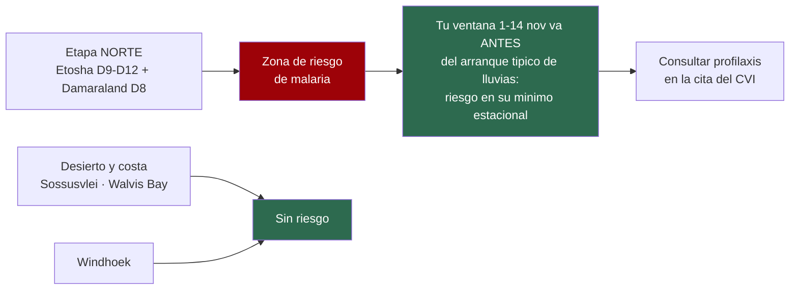
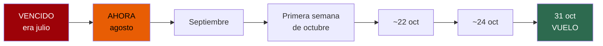
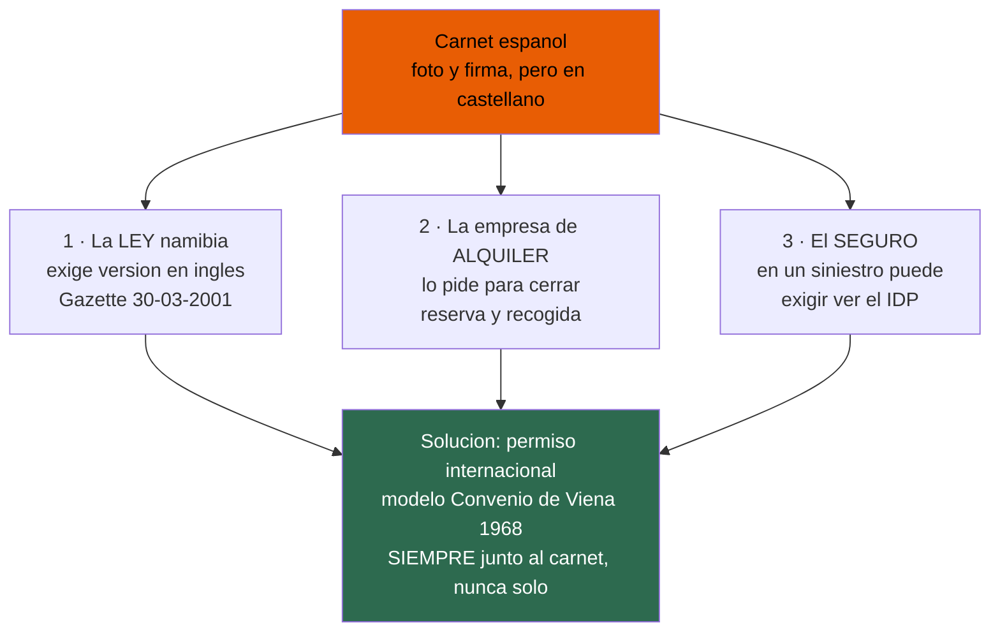
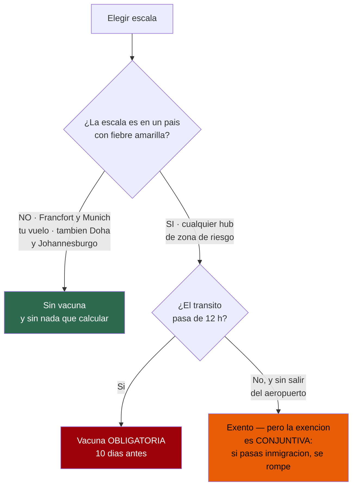
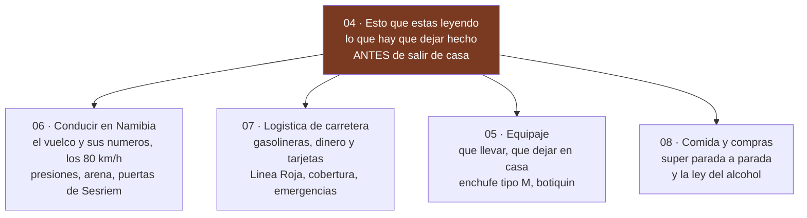

# 04 · Guía de preparación y de carretera

> **Namibia · 30 oct – 15 nov 2026 · la clásica del norte** — [← índice del dossier](README.md)
>
> La cuenta atrás hasta la salida, el e-visa, las vacunas, las normas de conducción y lo que hay que llevar hecho desde casa.
>
> **~N$20 = €1** *(rango 19,5–20,5)* · **✅** fuente primaria · **◐** secundaria concordante ·
> **○** práctica común, sin fuente · **❌** sin verificar, dicho en blanco
>
> *Investigación cerrada el 16/07/2026 · formato y contenido revisados el 03/08/2026*

La técnica de conducción en grava no tiene fuente oficial: va marcada como ○ en vez de disfrazarla
de dato verificado. Un hueco reconocido vale más que un número plausible.

---

## 🚨 Lo que hay que saber antes de nada

### La malaria SÍ afecta a Etosha ✅

El CDC lista transmisión de malaria en **Kavango, Kunene, Ohangwena, Omaheke, Omusati, Oshana,
Oshikoto, Otjozondjupa y Zambezi**. Etosha se extiende por Kunene, Oshikoto, Oshana, Omusati y
Otjozondjupa: **está dentro**.

El itinerario queda **partido**: las etapas de Etosha y Damaraland llevan riesgo; las del desierto
y la costa, prácticamente ninguno. **Y tu ventana juega a favor**: la primera quincena de noviembre
va **antes** del arranque típico de las lluvias (ver `14`), con el mosquito en su mínimo estacional.
El riesgo bajo no es riesgo cero: la consulta del CVI decide.

**La profilaxis marca la cuenta atrás**, porque cada fármaco tiene su plazo — y con Etosha al final
del viaje (**D9–D12, del 9 al 12 de noviembre**), las fechas reales son:
- **Atovacuona/proguanil (Malarone)** — empieza **1–2 días antes** de entrar en zona de riesgo
  (~7–8 de noviembre, ya de viaje: hay que llevarla comprada)
- **Mefloquina** — empieza **2–3 semanas antes** → **~19–26 de octubre**, receta necesaria en la
  cita del CVI de septiembre

👉 **Saca la receta en la cita del CVI, no la semana antes.**
Fuente: https://wwwnc.cdc.gov/travel/destinations/traveler/none/namibia

> ❌ **Corrección:** un borrador de esta guía decía que la rabia es una pauta de 3–4 semanas y que
> «se decide en septiembre o nunca». **Refutado**: el ACIP cambió la pauta en **2022** a **2 dosis,
> días 0 y 7**. Ese consejo era de la era pre-2022.

---

## 📅 Cuenta atrás

*Recalculada el 05/08/2026 a la salida real del **31 de octubre**: **quedan ~87 días**. Los hitos de
julio ya vencieron y siguen pendientes: van los primeros.*

- **VENCIDO · era julio** — reservar el 4×4 *(Namibia2Go Budget, disponible a 17-07)*; reservar
  Sesriem, Terrace Bay y los campamentos de Etosha; comprobar los pasaportes contra la vuelta del
  15 de noviembre.
- **AHORA · agosto** — pedir cita **ya** en el Centro de Vacunación Internacional: **la cita es el
  recurso escaso, no la vacuna**. Emitir el vuelo —el presupuesto de referencia se mueve— y mandar
  las preguntas por escrito a Namibia2Go e IATI.
- **Septiembre** — acudir al CVI *(para el 31-10, atendidos hacia el 19–26 de septiembre)*; recetas
  de profilaxis —la mefloquina empieza ~19–26 de octubre—; resolver el permiso internacional de
  conducir.
- **Primera semana de octubre** — solicitar el e-visa: necesita billete y reservas. Adaptadores
  tipo M y mapa en papel.
- **~22 de octubre** — último día para la fiebre amarilla **si** la ruta llegara a exigirla.
- **~24 de octubre** — imprimirlo **todo**, que Namibia funciona con papel; recomprobar el diésel y
  el self-drive a Deadvlei.

### El portal del e-visa — y las webs que te van a cobrar de más ✅

> ### ⚠️ El único portal oficial es **https://eservices.mhaiss.gov.na**
> Solo `.gov.na` es el Gobierno. Buscar «Namibia evisa» saca **namibia-evisa.com**, que se
> autodenomina *«Official Electronic Travel Authorization»* y **NO es el Gobierno**.

Lo lleva el Ministerio del Interior (MHAISS). Confirmado de forma independiente por la Namibia
Airports Company (operador estatal de aeropuertos) y por la embajada namibia en Suiza.

**Y espera que el sitio oficial parezca roto:** a 16/07/2026 sirve una **cadena de certificado TLS
incompleta** (el certificado Sectigo es legítimo, pero el servidor omite el intermedio) y está tras
un WAF que devuelve un HTTP 468 no estándar a lo que no sea un navegador normal. Un navegador
normalmente lo salva.

> 👉 Un aviso de certificado **aquí** es una mala configuración del servidor, no una prueba de que
> estés en una web falsa. Pero **verifica que el dominio pone exactamente `eservices.mhaiss.gov.na`
> antes de teclear la tarjeta.**

Fuente: https://www.airports.com.na/useful-information/e-visa-information/129/

### Reserva el coche primero ○

El vehículo, no el vuelo, es lo que se agota. Los doble cabina equipados con tienda de techo son una
flota pequeña compartida por todo el mercado de Windhoek. **Tu coche ya está elegido y estaba
cotizado a 05/08 — Namibia2Go: Budget N$35.100 (~€1.755) o Comfort N$39.000 (~€1.950) por 13
días, las dos disponibles: resérvalo antes que nada**
(la Comfort ya salía «Not Available»). Y tu quincena compite con todo el que persigue la temporada
baja de Namibia2Go, que arranca justo el 1 de noviembre.

⚠️ **Sin fuente:** no encontré ninguna empresa que publique un «reserva con X meses». Es práctica
del sector, no un plazo citable. **Reserva el coche antes que vuelos no reembolsables**: una ruta
sin 4x4 disponible no es una ruta.

### El permiso internacional de conducir: con carnet español, SÍ hace falta ◐

Este era el último hueco que **bloqueaba la reserva** (figuraba como «sin resolver» en `12`).
**Resuelto:** un carnet de conducir **español** necesita acompañarse de un **permiso internacional
de conducir** —o de una traducción jurada al inglés— para conducir en Namibia.

**Por qué.** Namibia deja conducir con carnet extranjero hasta 90 días, **pero el carnet tiene que
estar en inglés**. Si no lo está, la normativa exige que lo acompañe *«a certificate of authenticity
or validity … issued in English by a competent authority»* o *«a translation … in English by a sworn
translator»*, y que el carnet lleve **foto y firma** del titular. El carnet español lleva foto y
firma, pero el texto está en castellano → **no cumple por sí solo**. La base legal es el reglamento
de la *Road Traffic and Transport Act* publicado en el *Government Gazette* de **30 de marzo de 2001**.

**Y no lo pide solo la ley — lo piden tres actores a la vez:**

En este viaje el punto 3 pesa: con las exclusiones de bajos y vuelco de la Super Cover (`12`), no
conviene dar a la aseguradora **ningún** motivo formal para discutir un parte.

**Cómo se saca en España (DGT):**
- Documento: **permiso internacional para conducir**, modelo del **Convenio de Viena de 1968** — que
  es el que reconoce Namibia.
- **Tasa 4.5 ≈ €10,51 (~N$210)**.
- **Validez: 1 año, no renovable.** Sácalo con la vista puesta en las fechas del viaje, no con meses
  de sobra: si caduca antes de volver, no sirve.
- Se pide en **cualquier Jefatura de Tráfico con cita previa**, o **por internet** en la sede
  electrónica de la DGT (se recoge ~2 días después, sin cita para recoger). Solo es válido **junto al
  carnet español**, jamás por separado.

> ⚠️ **Grado de evidencia, con honestidad.** Las páginas primarias (embajada de Namibia, AA Namibia,
> sede de la DGT y el propio *Government Gazette*) **devolvieron HTTP 403 y no se pudieron descargar**
> desde este entorno. El hallazgo se apoya en **varias fuentes secundarias independientes que
> coinciden** —la guía oficial del Gobierno británico para conducir en el extranjero, el AA y
> empresas de alquiler namibias— citando todas el mismo instrumento legal de 2001. Por eso va marcado
> **◐**, no ✅. **Confirmad la tasa exacta y el trámite en la sede de la DGT antes de pagar.**

Fuentes (consultadas vía buscador; la descarga directa la bloquearon los servidores):
- Requisito namibio y base legal (Gazette 30/03/2001): https://internationaldrivingpermit.org/country/namibia/ · https://www.aa-namibia.com/international-driving-permit/
- Guía del Gobierno británico (el IDP es necesario para el alquiler en Namibia): https://www.gov.uk/driving-abroad/international-driving-permit
- Trámite, tasa y validez en España: https://sede.dgt.gob.es/es/permisos-de-conducir/permiso-internacional/

### Pasaportes: contra la fecha de VUELTA ✅

El MAEC exige *«válido durante al menos 6 meses a partir de la fecha de regreso, con tres páginas en
blanco»*. **Ojo a la trampa:** el organismo de turismo namibio lo redacta como 6 meses desde la
**entrada**, que es más laxo. **Usa la lectura estricta española.**

Para la vuelta real del **15 de noviembre de 2026** → pasaporte válido **hasta el 15 de mayo de
2027 como mínimo**. Tres páginas en blanco **de verdad**: las que ya tienen sellos no cuentan.

> Si alguno falla, **renuévalo YA**. El cuello de botella es la **cita previa** en Policía Nacional,
> no la impresión. Dejarlo para noviembre es como se pierden los viajes.

### Vacunación: la cita es el plazo, no la vacuna ✅

Sanidad dice acudir con *«4-6 semanas de antelación»* — pero eso es cuánto antes hay que **ser
atendido**, no cuánto antes hay que **llamar**. En verano, la cita es el recurso escaso.

**Tu centro más cercano:**
- **Sanidad Exterior · A Coruña** — C/ Durán Lóriga 3, 5ª planta, 15003 · **981 989 570 / 71** · 09:00–14:00
- Complejo Hospitalario Universitario A Coruña — As Xubias de Arriba 84 · 981 17 80 38
- Santiago de Compostela — Rúa da Choupana s/n · 981 95 00 37 / 90

> La fiebre amarilla **solo** se pone en un Centro de Vacunación Internacional autorizado.
> **Tu médico de cabecera no puede emitir la cartilla amarilla.**

👉 **Estamos en agosto: pide la cita ESTA SEMANA.** Para la salida del 31 de octubre, «4–6 semanas
de antelación» significa ser atendidos **hacia el 19–26 de septiembre** — «u octubre» ya no vale.
Fuente: https://www.sanidad.gob.es/areas/sanidadExterior/laSaludTambienViaja/centrosVacunacionInternacional/centrosvacu.htm

### La fiebre amarilla tiene mecha de 10 días — y luego dura toda la vida ✅

La enmienda del Anexo 7 del Reglamento Sanitario Internacional de la OMS es taxativa: la vacuna
*«provide protection against infection starting 10 days following the administration»* y el
certificado *«shall extend for the life of the person vaccinated, beginning 10 days after the date
of vaccination»*.

- Si tu ruta la exige, la vacuna debe ser **10 días completos antes de LLEGAR** a Namibia
- Para la llegada real del **1 de noviembre** → **como muy tarde el ~22 de octubre** (y apurarlo
  así es una locura)
- **Lo bueno:** es **vitalicia**, obliga a todos los estados del RSI desde el 11/07/2016, y **nadie
  puede exigirte un refuerzo jamás**. Una dosis te cubre todos los viajes futuros.

**La decisión se toma al comprar el billete, no después:**

Namibia no tiene fiebre amarilla, pero figura en la lista de la Unión Africana de países que exigen
certificado a quien venga de —o **transite 12 h por**— un país de riesgo.

> ✅ **Con el vuelo elegido, esto está resuelto y no hay que hacer nada.** El itinerario escala en
> **Fráncfort** a la ida y en **Múnich** a la vuelta *(ver [`02`](02-presupuesto.md) §8)*, y
> **ninguno de los dos es zona de fiebre amarilla**: no hay exención que calcular ni umbral que
> apurar. **No hace falta vacunarse.**
>
> ⚠️ **La única forma de reabrir esto es cambiar de vuelo** a un itinerario que escale en un país
> de riesgo. Si eso pasa, vuelve a este árbol **antes de emitir**: la vacuna tiene mecha de **10
> días** y no se puede improvisar. Y no intentes apurar con una escala de once horas: o evitas el
> país de riesgo, o te pinchas.

---

## 👉 Y lo de la carretera, en su documento

Este documento acaba donde arranca el viaje. Lo que se consulta **con el coche ya en marcha** vive
en sus propios documentos, para no contarlo dos veces:

- **El vuelco** —el 37 % de los muertos del país con el 4,6 % de los accidentes, y concentrado en
  las regiones por las que pasáis— está desarrollado en [`06-conduccion`](06-conduccion.md), con el
  desglose por región y los límites honestos del dato.
- **Los 80 km/h contractuales**, las presiones en frío, la arena de Sossusvlei y las puertas de
  Sesriem: también en [`06`](06-conduccion.md).
- **El mito del «solo efectivo» en gasolineras**, el reparto de repostajes, la Línea Roja
  veterinaria y los teléfonos de emergencia: en [`07-logistica`](07-logistica.md).
- **Los adaptadores tipo M** —el fallo tonto más probable del viaje— y el resto del petate: en
  [`05-equipaje`](05-equipaje.md).
- **Que las bottle stores cierran los domingos**, y tus dos domingos de viaje: en
  [`08-comida-compras-y-regalos`](08-comida-compras-y-regalos.md).

---

## 🕳️ Lo que NO pude verificar — no lo trates como cerrado

*(Solo lo de este documento: los huecos de carretera están en [`06`](06-conduccion.md) y
[`07`](07-logistica.md), y el inventario completo de lo que falta, en
[`15`](15-huecos-cerrados.md).)*

- **Antelación real** con que se llenan Sesriem y Etosha: el inventario (44+6 parcelas) sí está
  verificado; la demanda, no
- **Si el permiso internacional de conducir es exigible de verdad** con carnet español: la fuente
  es ◐ y conviene sacarlo igual, que cuesta poco
- **El coste de la opción de búsqueda y salvamento** del seguro IATI: sin cotizar

---

*Precios en N$ y € · ~N$20 = €1 a 16/07/2026 · Las tarifas namibias cambian: reconfirma antes de pagar*
