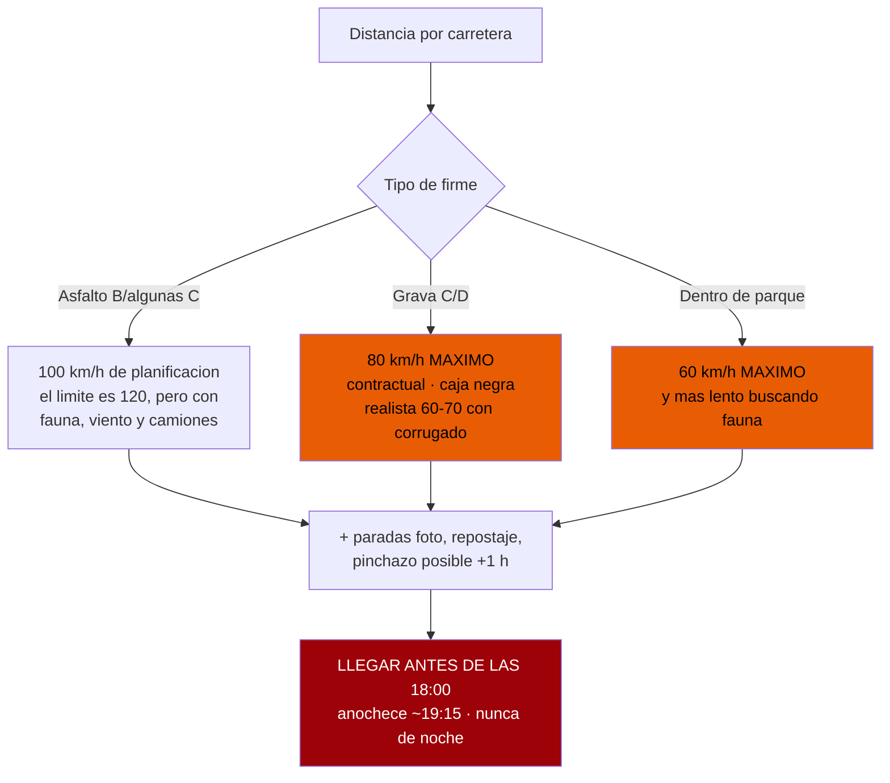
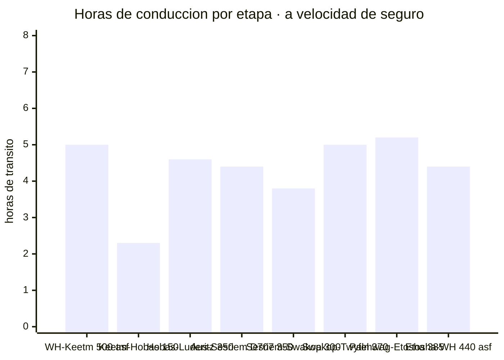
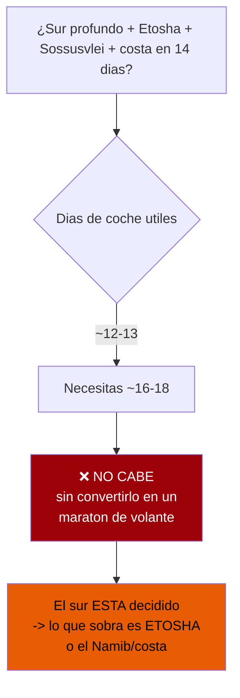
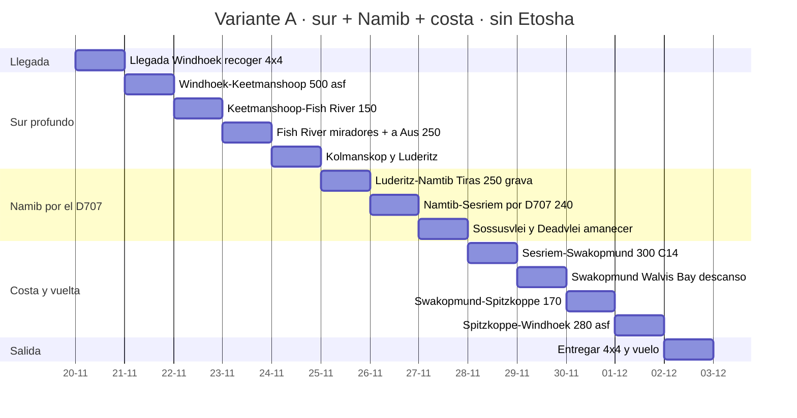
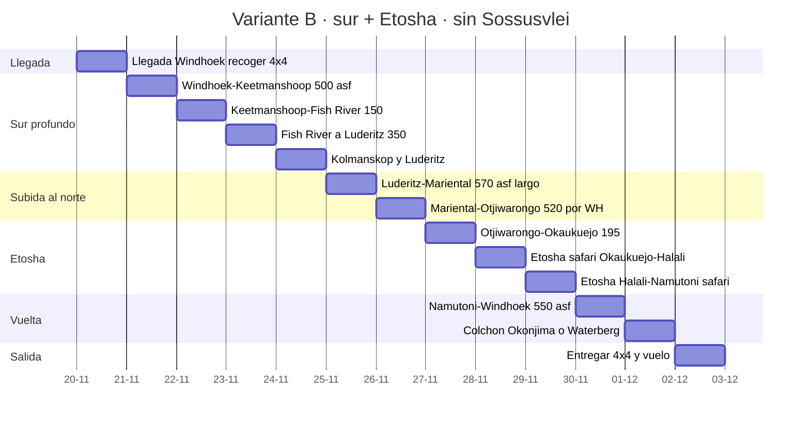
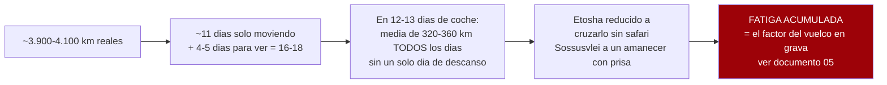
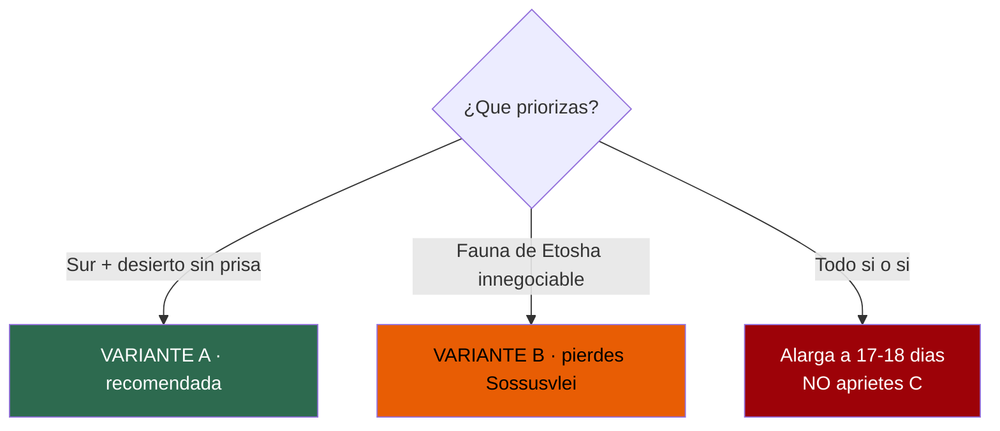

# Itinerario y viabilidad — el documento que decide el viaje

Distancias reales, firme, tiempos calculados a velocidad de seguro, y una respuesta honesta a la
pregunta que importa: **¿cabe todo en 14 días?**

**~N$20 = €1** (17/07/2026) · **✅ verificado/convergente** · **◐ secundario** · **○ estimación propia marcada**

> Este documento **no infla la ruta para complacer**. Una ruta ajustada y factible vale más que una
> completa e imposible. Donde un número es una estimación, lo dice. Donde una etapa no cabe, lo dice.

---

## 0. Las reglas del cálculo — por qué NO valen los tiempos de Google Maps

Google Maps asume velocidades que **anulan tu seguro** (ver `01` y `05`: 80 km/h contractuales en
grava, caja negra, límite de 60 km/h en parques). Todos los tiempos de este documento se calculan
con **tus** reglas, no las de Google:

- **Asfalto**: planifico a **100 km/h** (el límite es 120, pero cargados, con viento lateral y
  camiones no se sostiene de media).
- **Grava**: **80 km/h es el TECHO contractual**, no la media. Con corrugado, curvas y polvo, la
  media real cae a **60–70**. Calculo el *tiempo mínimo* a 80 y aviso de que el real es mayor.
- **Parque**: **60 km/h**, y en la práctica mucho menos porque vas parando a mirar.
- **Sumo** una franja de paradas/repostaje a cada etapa y recuerdo que **un solo pinchazo suma ~1 h**.
- **Regla de oro (de `05`)**: apuntar a **llegar a las 18:00**, una hora antes del ocaso. La franja
  16:00–20:00 concentra el **29 % de los muertos** del país. Si vas tarde, **te paras y llegas mañana**.

Guía independiente de operadores, que coincide: *«plan your daily routing to be no further than
400 km per day»* y, mejor, *«aim to drive no more than 4 to 6 hours per day»* (Expert Africa). Un
viajero cita un tramo de *«288 km that took over 4 hours»* y que después **acortó todos los días**.
👉 **Trabajo con un techo de ~300–350 km/día de tránsito**, y menos si el día tiene grava dura o
actividad (Sossusvlei, safari).

Fuentes de la regla: `01` y `05` (contratos Asco/Savanna, ya descargados) ·
https://www.expertafrica.com/namibia/info/self-drive-driving-tips-and-techniques ·
https://www.safaribookings.com/blog/guide-to-driving-in-namibia-10-useful-self-drive-tips

---

## 1. Las distancias, con su firme y su fuente

Números **por carretera**. Marco la fuente y la confianza de cada uno. Los del **eje central**
vienen de la matriz de Namibia Tours & Safaris (**◐, copyright 2010** — las distancias cambian poco,
pero es secundaria y vieja; ver `07`). Los del **sur** los verifiqué en esta pasada.

### Eje sur (el que se decidió mantener)

- **Windhoek → Mariental**: **~270 km**, **asfalto B1** ✅ *(Wikipedia Mariental: «274 km southeast of Windhoek»)*
- **Mariental → Keetmanshoop**: **~230 km**, **asfalto B1** ✅ *(Wikipedia Mariental: «232 km north of Keetmanshoop»)*
- **Windhoek → Keetmanshoop**: **~500 km**, **asfalto B1**, ~4h45 de tránsito ✅ *(convergente en varias fuentes)*
- **Keetmanshoop → Quiver Tree Forest (kokerbooms)**: **~14 km** ✅ *(ya en `06`; a las afueras de Keetmanshoop)*
- **Keetmanshoop → Hobas (Fish River Canyon)**: **~150 km**. Ruta: **B1 → B4 (~35 km asfalto) → C12 (~80 km grava) → C37 (~30 km grava)** ◐ *(descripción de ruta en blogs de viaje; el número converge en «~150 km, 2 h»)*
- **Keetmanshoop → Lüderitz**: **334 km**, **asfalto B4** ✅ *(Wikipedia «B4 road (Namibia)»: «west–east direction for 334 kilometres, connecting Lüderitz… to Keetmanshoop»)*
- **Aus → Lüderitz**: **~125 km**, **asfalto B4**, atraviesa el **Sperrgebiet** ◐ *(tramo final de la B4; «12 km antes de Lüderitz está Kolmanskop»)*
- **Lüderitz → Kolmanskop**: **~12 km**, asfalto ◐ *(convergente; sobre la B4 saliendo de Lüderitz)*
- **Fish River (Hobas) → Lüderitz**: **~350 km** ○ *(estimación: Hobas → B4 en Goageb → Aus ~225 km + Aus → Lüderitz ~125 km; las fuentes agregadoras dan 350–400, sin coincidir)*
- **D707** *(la joya escénica)*: **123 km de grava**, une la zona de **Aus (C13)** con la **C27**, a
  ~160 km al sur de Sesriem. Enlace **Aus → Sesriem por D707 ≈ 350 km de grava** ◐/○ *(roadtripster/dangerousroads)*

### Eje Windhoek → desierto

- **Windhoek → Sesriem por el paso de Spreetshoogte (D1275)**: **~320–350 km** ◐. Desglose:
  B1 a Rehoboth **87 km (asfalto)** → C24 **39 km** → D1261 a Nauchas **55 km** → **D1275, paso de
  Spreetshoogte** (miradores a 16,4 km, y 34,4 km más hasta la C14) → Solitaire → Sesriem.
  ⚠️ **El paso de Spreetshoogte es MUY empinado**, con tramos de grava y otros de adoquín de hormigón
  para tracción; *«no coaches, caravans or trailers permitted»*. Espectacular, pero es un **descenso
  técnico**, no un atajo cómodo.
- **Windhoek → Sesriem por Rehoboth / paso de Remhoogte (C24)**: **~365 km** ◐. B1 a Rehoboth 87 →
  **C24 174 km (paso de Remhoogte)** → C14 14 km a Solitaire → Sesriem 90. **Más largo pero más
  llevadero** para el primer día con el coche recién cogido.
- **Windhoek → Sesriem** *(matriz 2010)*: **320 km** ◐ · **Windhoek → Solitaire**: **300 km** ◐
- **Sesriem → Sossusvlei / Deadvlei**: **60 km cada trayecto** (120 ida y vuelta) **+ 5 km de arena
  blanda** en reductora al final ◐ *(matriz 2010 + `05`)*
- **Sesriem → Solitaire**: **90 km** ◐ · **Solitaire → Swakopmund**: **210 km** ◐ ·
  **Sesriem → Swakopmund** *(por la C14, pasos de Gaub y Kuiseb)*: **300 km** grava ◐

### Eje costa y Damaraland

- **Swakopmund → Walvis Bay**: **~30 km**, **asfalto B2** ✅ *(convergente: «30 km of straight tarmac»)*
- **Swakopmund → Spitzkoppe**: **~150–180 km** (B2/asfalto vía Usakos + grava final) ◐
- **Spitzkoppe → Brandberg (Uis)**: **~130 km** de grava ◐ · **Uis → Twyfelfontein**: **~100 km** ◐
- **Swakopmund → Twyfelfontein** *(directo)*: **400 km** ◐ *(matriz 2010)*
- **Uis → Khorixas**: **115 km** ◐ · **Khorixas → Twyfelfontein**: **100 km** ◐ ·
  **Khorixas → Palmwag**: **170 km** ◐ · **Twyfelfontein → Palmwag**: **~110 km** ○ *(estimación por triangulación)*

### Eje Etosha y vuelta

- **Palmwag → Okaukuejo (vía Kamanjab)**: **385 km** ◐ *(matriz 2010; Palmwag→Kamanjab 120 + Kamanjab→Okaukuejo 265)*
- **Palmwag → puerta de Galton (Etosha oeste)**: Galton está **más cerca** que rodear por Andersson;
  desde Galton **a Okaukuejo son ~200 km / ~6 h de conducción lenta** por el sector oeste ◐
  *(foro NWR/etoshanationalpark.org)*. **Galton** da acceso al oeste (Dolomite); **Andersson** es la
  puerta sur clásica hacia Okaukuejo.
- **Etosha, travesía interior**: **Okaukuejo → Halali ~70 km → Namutoni ~70 km** (a 60 km/h y parando
  a mirar: **es un día entero de safari**, no un traslado) ◐
- **Okaukuejo → Windhoek**: **440 km**, mayormente asfalto (Outjo–Otjiwarongo–B1) ◐
- **Namutoni → Windhoek** *(por Tsumeb/Otjiwarongo)*: **~550 km** ○ *(estimación; Namutoni queda más al este)*
- **Otjiwarongo → Outjo**: 75 km ◐ · **Outjo → Okaukuejo**: 120 km ◐

> ⚠️ **Aviso de fuente:** el bloque del eje central se apoya en una matriz con **copyright de 2010**.
> Las distancias por carretera cambian poco, pero **verifícalas con Tracks4Africa o un GPS actual
> antes de reservar alojamientos con horarios ajustados.** Los del sur están reconfirmados en 2026.

---

## 2. El tiempo de cada tramo, calculado para auditarlo

Tiempo **de tránsito** (solo rodar), a velocidad de seguro. **Súmale paradas, repostaje y comidas**,
y ten en cuenta que la grava real va a 60–70, no a 80. La columna «día realista» ya incluye ese
colchón y la regla de las 18:00.

Cómo salen (redondeo al alza):

- **Windhoek → Keetmanshoop 500 asfalto**: 500 ÷ 100 = **5,0 h** → **día realista 6 h** con repostaje
  y comida. Largo pero fácil.
- **Keetmanshoop → Hobas 150** (35 asf + 115 grava): 35÷100 + 115÷80 = 0,35 + 1,44 = **1,8 h** →
  **~2,5 h**. Deja tarde para los miradores.
- **Hobas → Lüderitz ~350** (mixto): ≈ **4,6 h** de tránsito → **día realista 5,5–6 h**.
- **Aus → Sesriem por D707 ~350 grava**: 350÷80 = 4,4 h *mínimo* → con corrugado real **6–7 h**.
  👉 **Este tramo NO se hace bien en un día.** Ver §3.
- **Sesriem → Swakopmund 300 grava** (pasos de Gaub y Kuiseb): 300÷80 = 3,75 h → **~5 h** con los pasos.
- **Swakopmund → Spitzkoppe → Twyfelfontein ~370**: ≈ **5 h** de tránsito → **día realista 6–7 h**;
  mejor **partirlo** con noche en Spitzkoppe o Brandberg.
- **Palmwag → Okaukuejo 385**: ≈ **5,2 h** → **día realista 6 h**. Es de los tramos que avisa `07`:
  al límite del alcance cómodo de un depósito en grava.
- **Etosha Okaukuejo → Namutoni 140 en parque**: a 60 km/h son 2,3 h *rodando*, pero con fauna es un
  **día entero**. No es un traslado.
- **Okaukuejo → Windhoek 440 asfalto**: 440÷100 = 4,4 h → **~5 h**.

---

## 3. La respuesta honesta: NO cabe todo. Aquí está el porqué, con números

Sumando el **esqueleto de tránsito** del circuito que lo quiere todo (sur profundo + Namib + costa +
Damaraland + Etosha), sin contar las vueltas dentro de los parques:

```mermaid
flowchart LR
    A["500 WH-Keetmanshoop"] --> B["150 Keetm-Hobas"]
    B --> C["350 Hobas-Luderitz"]
    C --> D["~490 Luderitz-Sesriem<br/>por Aus y D707"]
    D --> E["300 Sesriem-Swakopmund"]
    E --> F["370 Swakop-Twyfelfontein"]
    F --> G["110 Twyfel-Palmwag"]
    G --> H["385 Palmwag-Etosha"]
    H --> I["140 travesia Etosha"]
    I --> J["440 Etosha-Windhoek"]
    J --> K["ESQUELETO ~3.200 km<br/>+ vueltas en parques<br/>= ~4.000 km reales"]
    style K fill:#9d0208,color:#fff
```

**~3.200 km de puro traslado** (suma de la cadena de arriba), y con las vueltas dentro de Etosha
(safari, +300–500 km en 2 días), Sossusvlei (130 km), Walvis Bay, Kolmanskop y los miradores de Fish
River se va a **~3.900–4.100 km reales**.

**La aritmética que lo mata:**
- A un techo sano de **~300 km/día de tránsito**, 3.200 km = **~11 días SOLO moviéndose**.
- Pero necesitas además **días quietos** para *ver* las cosas: 1 día de amanecer en Sossusvlei/Deadvlei,
  1 día de Kolmanskop + Lüderitz, **1–2 días de safari en Etosha**, medio día de Swakopmund/Walvis Bay,
  medio día de miradores del cañón. Eso son **~4–5 días sin apenas mover el coche**.
- Total mínimo realista: **~16 días** (11 moviéndose + 5 quietos), y **~17–18 en la práctica**,
  porque los días de grava dura rinden 200–250 km, no 300. **Tienes 14, y el coche solo ~12–13 útiles.**

> ### 🔴 Veredicto sin adornos
> **El sur profundo (Fish River + Lüderitz) y Etosha están en extremos opuestos del país y cada uno
> es un compromiso de varios días. Con el sur ya decidido, meter Etosha además de Sossusvlei y la
> costa NO cabe en 14 días.** Puedes tener **el sur + el Namib + la costa** (sin Etosha), o **el sur +
> Etosha** (sacrificando el Namib/Sossusvlei), pero **no las dos coronas a la vez**. Quien lo intenta
> pasa 14 días **conduciendo delante de los sitios en vez de estar en ellos** — y encima acumula
> fatiga, que en grava es exactamente el factor del vuelco (ver `05`).

---

## 4. Tres variantes reales — elige una

*(Fechas ilustrativas: finales de noviembre, DESPUÉS del precipicio de precio del 15/11 ✅. D1 = llegada.)*

### 🟢 Variante A — «El sur completo + Namib + costa» · SIN Etosha · RECOMENDADA

La única que respeta el sur decidido **y** deja respirar. Mantiene las dos joyas del desierto
(Sossusvlei y el cañón) y toda la costa. **Sacrifica Etosha** — la fauna se ve, en versión más
modesta, en el sur (órix, springbok, avestruz) y en reservas privadas de camino.

- **Coche**: ~12 días útiles. **Días de conducción dura**: solo el Windhoek–Keetmanshoop (asfalto,
  fácil) y los dos de grava del D707, ya partidos. **Ningún día pasa de ~300 km de grava.**
- **Duerme DENTRO de la puerta de Sesriem** la noche antes de Deadvlei (Sesriem Campsite o Sossus
  Dune Lodge): es la **única forma** de estar en Deadvlei al amanecer (ver `05` y `02`).
- **Lo que ganas**: el sur entero sin prisa, Sossusvlei al amanecer, un día de descanso en la costa.
- **Lo que pierdes**: Etosha y el Damaraland profundo (Twyfelfontein, Palmwag).

### 🟠 Variante B — «El sur + Etosha» · SIN Sossusvlei ni costa larga

Para quien Etosha es innegociable. Sube directo por el centro tras el sur y sacrifica **Sossusvlei**
(la otra corona) y reduce la costa a un paso. Geográficamente es un **ocho** con un traslado central
largo; menos elegante, pero coherente si la fauna manda.

- **Lo que ganas**: las dos zonas de fauna estrella (Fish River + Lüderitz abajo, Etosha arriba).
- **Lo que pierdes**: **Sossusvlei y Deadvlei** (para muchos, el motivo entero de venir a Namibia),
  Swakopmund y todo el Damaraland.
- ⚠️ Los días **B6 y B11 son traslados de asfalto de 550–570 km**: largos pero seguros (asfalto).
  Aun así, **arranca al alba** y respeta las 18:00.
- 👉 **Antes de elegir B, pregúntate en serio si renunciar a Sossusvlei compensa.** Casi nadie que
  llega a Namibia quiere volver sin las dunas de Sossusvlei.

### 🔴 Variante C — «El todo comprimido» · NO recomendada, aquí por honestidad

Lo mete todo. Se demuestra por qué **no** funciona.

- Exige **~320–360 km cada día sin descanso**, varios de ellos en grava, con la caja negra vigilando
  y el ocaso a las 19:15. La guía de operadores dice **máximo 400 y ojalá 300** — C vive pegada al techo.
- **Etosha quedaría reducido a atravesarlo** (sin tiempo de safari) y **Sossusvlei a un amanecer con
  prisa**. Pagas por llegar a los sitios y no llegas a *estar* en ellos.
- El coste real no es el dinero: es la **fatiga**, que en grava es el ingrediente del vuelco (`05`).
- ❌ **No la recomiendo.** Si de verdad quieres las dos coronas, la respuesta honesta no es apretar C:
  es **alargar el viaje a 17–18 días**, que no es una opción de este encargo.

---

## 5. Detalles que cambian un día concreto

> ### 🛑 Los dos bordes del Fish River NO están conectados
> El PDF del Fish River Lodge avisa: *«Do not take the C12 towards the Fish River Canyon as you will
> end up on the eastern side of the canyon and **there are no roads across it**»*.
>
> **Ojo, que ese aviso es para ir al Lodge (borde OESTE).** Tú quieres **los miradores clásicos y
> Hobas**, que están en el **borde ESTE** → **la C12 SÍ es tu ruta.**
>
> 👉 **Elige el borde ANTES de salir: no hay puente ni vado.** Equivocarse cuesta un día entero.
>
> Del mismo PDF: *«Please do not take the D462 as this road has riverbeds with deep sand»* —
> **evita la D462**. Y otra fuente recomienda ir por la **presa de Naute** en vez del desvío de
> Seeheim, *«as the Seeheim road is very bumpy and the river might obstruct your travels in the rainy
> season»* — **relevante: finales de noviembre ya es inicio de lluvias en el sur.**
> Fuente: https://wa-uploads.profitroom.com/fishriverlodge/17498513990699_Directions-to-FRL.pdf

> ### 🚧 Obras dentro de Etosha en 2026 — Okaukuejo → Halali
> El tramo, que sobre el papel son **70 km**, va por **pistas de desvío de ~90 km** con **maquinaria
> pesada** y límites temporales reducidos: se circula a **30–35 km/h reales**.
>
> **Lo que serían 1h45 se convierte en ~3 h.** 👉 **Confírmalo con NWR al reservar**, porque cambia
> el reparto del día de safari.

> ### 🛣️ La salida de emergencia del sur: Lüderitz → Windhoek
> **833 km, 100 % asfalto (B4 + B1), 9h00–9h30.** Es **la única etapa larga del sur totalmente libre
> de grava**.
>
> Es **más horas** que Lüderitz → Sesriem (7h30–8h00), pero **sin corrugado, sin polvo y sin el
> riesgo de vuelco que concentra Hardap**. Si el viaje se tuerce —una avería, un pinchazo doble, un
> día perdido— **este es el cierre rápido y seguro del circuito**.

- **Primer día con el coche (Windhoek → sur)**: coge el coche, revisa **presiones en frío, las DOS
  ruedas de repuesto, gato y compresor** (ver `05`) **antes de salir del patio**. El B1 al sur es
  asfalto: buen día para acostumbrarse al vehículo cargado.
  ⚠️ **No lo hagas el día del vuelo**: recoger el 4x4 + briefing son 1–2 h; si aterrizas a mediodía y
  sales a las 14:00, los 500 km hasta Keetmanshoop te meten en el ocaso. **Duerme en Windhoek y sal
  al amanecer, o parte la etapa en Mariental.**
- **El bosque de kokerbooms sale gratis**: **14 km** de Keetmanshoop por la M29 (grava buena),
  12–15 min. Encaja en el atardecer de llegada o el amanecer siguiente **sin coste de itinerario**.
  A mediodía la luz lo mata. **Es el mejor coste/beneficio de todo el sur.**
- **Sesriem manda sobre tu amanecer**: la puerta interior abre **1 h antes del amanecer solo si
  duermes dentro**. Duerme fuera y **no llegas** a Deadvlei con el sol bajo (60 km + arena). Ver `05`.
- **Deadvlei**: los últimos **5 km son arena blanda en reductora**; desinfla **en el aparcamiento
  2WD, no antes**, y reinfla en Sesriem. O usa la **lanzadera 4x4 de NWR por N$180 (~€9)** (`02`).
- **Pasos de Gaub y Kuiseb (C14, Sesriem→Swakopmund)**: **210 km sin nada en medio** desde Solitaire
  (ver `07`). **Reposta en Solitaire** sí o sí; es el salvavidas de combustible (y la tarta de manzana).
- **Línea Roja veterinaria** (si haces Etosha, Variante B): **no bajes carne cruda** del norte; cómela
  o cocínala antes de salir de Etosha (ver `07`).
- **La D707 (Variantes A)**: es **grava exigente** —arena blanda, corrugado, piedras— y **4x4
  obligatorio**; pero **NO es de las carreteras sin seguro**. Las que anulan la cobertura de bajos y
  rescate pagues lo que pagues son la **D3707 y la D3703** en Kaokoland/Damaraland (ver `05` y `06`) —
  **no la confundas con la D707, que es otra carretera**.
- **Sin conducir de noche, jamás**: anochece **~19:15**; apunta a llegar a las **18:00**. Cualquier
  etapa que no dé para eso, **pártela**.

---

## 6. Lo que este documento NO pudo verificar — dicho claro

- **Varias distancias del eje central** salen de una **matriz de 2010** (◐): Windhoek–Sesriem,
  Sesriem–Swakopmund, Palmwag–Okaukuejo, travesía de Etosha. Cambian poco, pero **no las tomé de un
  GPS 2026**. Verifícalas con **Tracks4Africa** antes de fijar reservas con hora.
- **Fish River (Hobas) → Lüderitz ~350 km** es **estimación propia** por suma de tramos (○): las
  fuentes agregadoras dan 350–400 sin coincidir. **Reconfírmala.**
- **Twyfelfontein → Palmwag ~110 km** y **Namutoni → Windhoek ~550 km** son **triangulaciones** (○).
- **Aus → Sesriem por D707 ~350 km**: el **D707 en sí son 123 km verificados** (◐); el resto del
  enlace hasta Sesriem es estimación.
- **Ninguna de las páginas oficiales de NWR ni de lodges** (fishriverlodge, nwrnamibia) se dejó
  descargar hoy (**HTTP 403**): las rutas del sur se apoyan en descripciones de blogs cruzadas entre
  sí, no en la web del operador. **Confírmalo con el lodge al reservar.**
- **Estado real del firme en noviembre 2026**: el corrugado y los baches cambian mes a mes; los
  reportes de foros (4x4community, roadtripster) son de años anteriores.

---

## Fuentes

- Reglas de conducción y velocidad: `01-hallazgos-verificados.md`, `05-conduccion.md` (contratos
  Asco/Savanna ya descargados) ·
  https://www.expertafrica.com/namibia/info/self-drive-driving-tips-and-techniques ·
  https://www.safaribookings.com/blog/guide-to-driving-in-namibia-10-useful-self-drive-tips
- Windhoek–Keetmanshoop–Mariental: https://en.wikipedia.org/wiki/Mariental,_Namibia
- B4 Keetmanshoop–Lüderitz (334 km): https://en.wikipedia.org/wiki/B4_road_(Namibia)
- Keetmanshoop–Hobas y ruta B4/C12/C37: https://blog.viatu.com/en/blog/a-complete-guide-to-the-fish-river-canyon ·
  https://africanlanders.com/en/namibia-en/namibia-the-fish-river-canyon/
- Paso de Spreetshoogte vs Remhoogte: descripciones de ruta recogidas vía Travel Namibia y foros
  (travelnam.com, tripadvisor Namibia) *(páginas no descargadas hoy; datos de los extractos de búsqueda)*
- D707 (123 km, Sesriem–Aus): https://roadtripster.net/namibia/road-d707 ·
  https://www.dangerousroads.org/africa/namibia/5954-d707.html
- Swakopmund–Walvis Bay–Spitzkoppe–Brandberg: extractos de búsqueda cruzados (siyabona, distancesfrom)
- Palmwag/Galton–Etosha: foro NWR y https://www.etoshanationalpark.org/map
- Matriz de distancias del eje central: Namibia Tours & Safaris (2010), recogida en `07-logistica.md`
