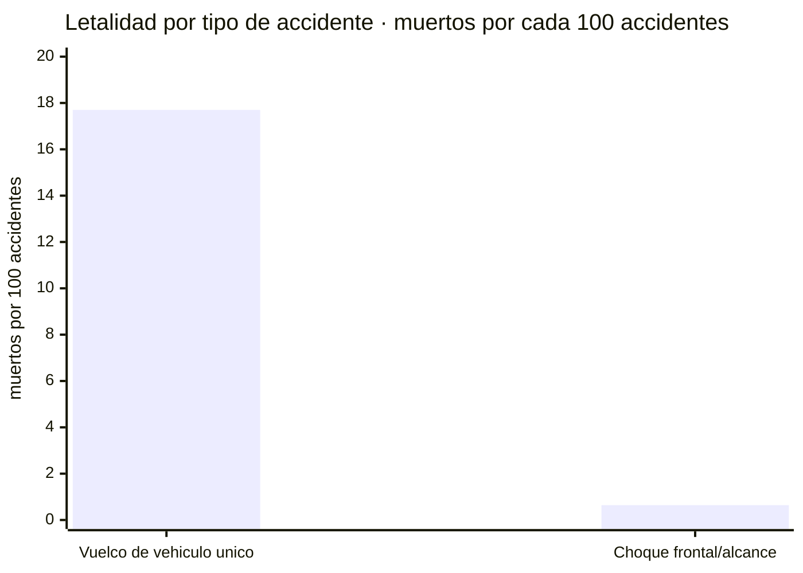
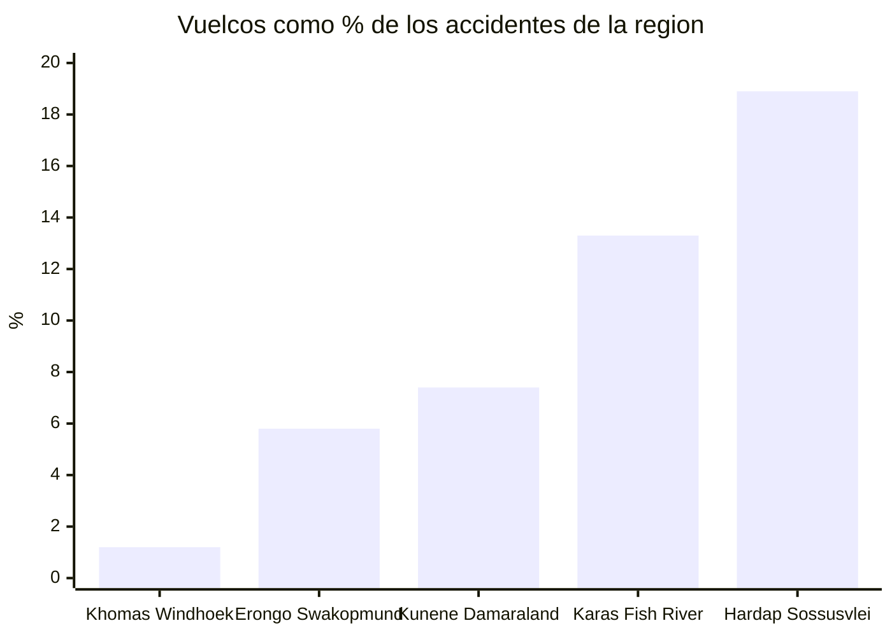
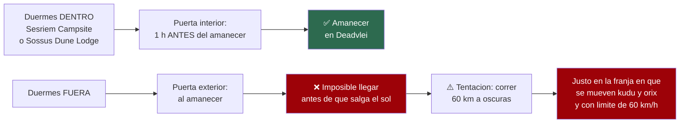

# Conducir en Namibia — documento profundo

Todo lo que la investigación sacó sobre conducción, con las cifras completas y sus límites.
**~N$20 = €1** (16/07/2026) · **✅ primaria** · **◐ secundaria** · **○ práctica común sin fuente**

> Este documento no endulza nada. En Namibia lo que te puede matar es la carretera, no los
> animales ni el crimen — lo dice explícitamente el MAEC. Aquí están los números.

---

## 1. El vuelco: el número más importante del viaje ✅

Informe **NRSC «Road Crashes in Namibia» 2019**, sobre **18.665 accidentes** y **413 muertos**:

- **Vuelco de vehículo único**: **857 accidentes (4,6 %)** → **152 muertos = 36,8 % de TODOS los
  muertos del país**
- También el mayor número de heridos graves (**310**) y leves (**466**) de cualquier tipo:
  **928 víctimas (27,8 %)**
- El propio informe: *«the most devastating crashes with casualties were single vehicle overturned (928)»*
- **Letalidad comparada**: el vuelco mata **17,7 por cada 100 accidentes**; el choque frontal/alcance
  —el más **común**, con 4.090— mata **0,64 por cada 100**
- 👉 **Un vuelco es ~28 veces más letal por evento que el accidente más frecuente**

### Y se concentra exactamente en nuestra ruta ✅

Porcentaje de accidentes de cada región que son vuelcos (tabla 5 cruzada):

- **Hardap** (Sesriem/Sossusvlei): **119 de 628 = 18,9 %** → **1 de cada 5**
- **!Karas** (Fish River, Lüderitz, Kolmanskop): **72 de 540 = 13,3 %**
- **Kunene** (Damaraland, Twyfelfontein): **37 de 502 = 7,4 %**
- **Erongo** (Swakopmund, Walvis Bay, Spitzkoppe): **125 de 2.170 = 5,8 %**
- **Khomas** (Windhoek): **94 de 7.839 = 1,2 %** → **1 de cada 80**
- Media nacional: 4,6 %

> **La C19/C27 hacia Sesriem y las C14/D de Hardap es donde vive el riesgo estadístico de este
> viaje.** El peligro no es el tráfico de la capital: es la pista vacía, rápida y preciosa donde te
> sientes más seguro.

Fuente: NRSC 2019 · https://www.nrsc.org.na/page/downloads/

---

## 2. Lo que los datos NO dicen — dicho claramente ✅

Para que sepas hasta dónde llega la evidencia y no le pidas más de lo que da:

1. **No hay desglose grava/asfalto.** El informe NRSC 2019 **no** separa por firme. El análisis
   regional de arriba es un *proxy* que encaja bien con «grava y remoto», pero **es inferencia, no
   una tasa publicada**. Quien te diga «el X % de los accidentes de Namibia son en grava» **no lo
   está sacando del NRSC**.
2. **No hay desglose turista/local.** Los datos **no identifican** conductores extranjeros ni
   vehículos de alquiler. La idea de que el vuelco es «el accidente del turista» es plausible y se
   la cree todo el sector, pero **no se pudo verificar en ninguna fuente namibia**. Lo que **sí**
   está verificado: los vuelcos dominan las **muertes** y se agrupan en las **regiones turísticas**.
3. **Los datos son de 2019.** Es el informe completo más reciente en la web del NRSC. La prensa de
   2026 apunta a un **+13 % interanual** de fallecidos y **+2 %** de accidentes en 2025/26, y el
   NRSC/MVA Fund han **disputado públicamente** algunas cifras internacionales por *«inaccurate,
   misleading»*. No se pudo obtener un desglose de vuelcos del año en curso: el panel estadístico
   en vivo del NRSC no devolvió datos.
4. **No hay datos de kudú.** «With animal» es **una sola categoría** de 2.756 accidentes, sin
   desglose por especie.
5. **Nadie publica tarifa de grúa.** Ver §7.

---

## 3. El límite: 80 en grava, 60 en parques ✅

Ya está en `01`: **80 km/h contractuales en grava** (el legal es 100), **caja negra**, y superarlo
**anula el seguro**. Añadidos de este bloque:

- **Asco te limita a 60 km/h dentro de los parques nacionales**, pase lo que pase
- African Tracks lo pone aún más duro en sus condiciones: *«Drive only from sunrise to sunset on any
  B or C roads! Driving outside of these times is very risky and will be at own risk!»*
- Avis, en su guía de safari: *«Never drive at night»*

---

## 4. Presiones: hazle caso al depósito, no a internet ✅

**African Tracks publica cifras en frío reales** en sus condiciones:

- **Asfalto**: 1,8 bar delante / 1,8 detrás
- **Grava**: **1,8 / 1,8** ← *igual que asfalto*
- **Arena/barro**: 1,6 / 1,6

> ⚠️ **Fíjate: NO recomiendan bajar presión para grava normal.** Esto **contradice** a un montón de
> blogs que te dicen que desinfles «para ir más cómodo».
>
> **La lógica:** en grava tu enemigo es el **corte de flanco** por una piedra afilada. Un neumático
> poco inflado **saca el flanco** —su parte vulnerable— contra las piedras y **coge temperatura**.
> Bajar un poco mejora el confort y reduce pinchazos por impacto; bajar demasiado invita al corte de
> flanco y al fallo por calor.

**Aviso honesto:** entre operadores namibios serios las cifras publicadas van de **~1,6 a ~2,2 bar**
según vehículo y carga, y **no existe un estándar namibio único**. Un doble cabina cargado con dos
personas, depósitos llenos, agua y tienda de techo está **en el extremo pesado** y quiere **más**
presión que uno vacío, sobre todo en el eje trasero.

👉 **No cojas un número de un foro.** Pide en el depósito la presión en frío **para tu vehículo con
tu carga** y apúntala. **Comprueba en frío cada mañana**: con el calor de finales de noviembre la
presión sube mucho en caliente, y **bajar un neumático caliente hasta la cifra “de frío” te deja
peligrosamente desinflado a la mañana siguiente**.

---

## 5. La arena de Sossusvlei, y una prohibición que anula el seguro ◐

**(A) La norma, que está en el aire.** El 1 de mayo de 2026 se anunció una prohibición al self-drive
y **se revirtió al día siguiente**. Nota del MEFT del 2 de mayo: *«Deadvlei will remain accessible to
tour guides registered with the Namibia Tourism Board and to self-drive visitors with 4x4 vehicles»*,
y los visitantes *«may also use the concessionaire's shuttle service but buses and trucks are not
permitted»*.

> A 16/07/2026 **el self-drive está permitido**, pero **ya bailó una vez en tres meses**.
> 👉 **Reconfirmar ~4 semanas antes.**

**(B) La conducción.** Desde el aparcamiento 2WD son ~5 km, de los que los **~4 finales** exigen 4x4:

- **4H ANTES** de entrar en la arena, no cuando ya estés atascado
- **Desinfla en el aparcamiento 2WD, no antes** — los ~60 km desde la puerta de Sesriem son buen
  asfalto y hacerlos con poca presión destroza las ruedas
- Mantén inercia · métete en **las roderas** del de delante · no pares en subida · no patines
- Si te encajas, **marcha atrás por tus propias huellas** antes que cavar
- **Reinfla** en cuanto pises duro; en Sesriem hay aire
- Presión de arena típica **~1,0–1,6 bar** (African Tracks da 1,6) — pero **necesitas el compresor**
  para volver a subir: **confirma que funciona en la entrega**

> ### 🚫 Cláusula crítica del contrato de Asco
> *«Dune Driving and driving to Sandwich Harbour: This is strictly prohibited.»*
>
> La pista de arena hasta Deadvlei **no** es *dune driving*. Pero **Sandwich Harbour y cualquier
> excursión por dunas anulan tu cobertura entera**. Para eso, **tour guiado**.

---

## 6. La noche, y la franja que concentra el 29 % de los muertos

**El dato que sí aguanta** ✅ — NRSC 2019:
- Los accidentes **pican entre las 16:00 y las 19:59**: **4.811** (texto del propio informe:
  *«Most crashes occurred between 16:00 - 19:59 (4.811)»*)
- Esa franja de **cuatro horas** concentra **121 de los 413 muertos = 29,3 %**
- Anochece **~19:15** a finales de noviembre → **la franja más mortal del país coincide con tu
  último tramo del día**

❌ **Lo que NO puedes citar** (refutado 0–2): que el FCDO desaconseje conducir de noche **todo el
año**. Su frase *«avoid driving at night outside towns, as wildlife and livestock are serious
hazards»* está **dentro de una lista encabezada por «During the rainy season from January to April»**.
El consejo es bueno; la cita, mal usada.

**La regla práctica:**
> **Las distancias namibias te mienten.** Un día de 300 km que parece de 3,5 h son **5–6 h** a
> velocidad real de grava con paradas de fotos, y **cualquier pinchazo suma una hora**.
>
> **Planifica llegar 1 hora antes del ocaso** (finales de noviembre: apunta a las **18:00**).
> Si vas tarde, **párate y llega mañana**: una noche de alojamiento imprevista no vale nada al lado
> del riesgo.

---

## 7. Animales: muy frecuentes, rara vez mortales — pero rompen el coche

**Los datos** ✅ (NRSC 2019, tabla 5): accidentes **«with animal» = 2.756 = 14,8 %** de todos,
**el 2º tipo más frecuente** tras el frontal/alcance.

Por región, como porcentaje de los accidentes de esa región:
- **Kunene** (Damaraland/Twyfelfontein): **153 de 502 = 30,5 %** → **casi un tercio de los
  accidentes de la región llevan animal**
- **Otjozondjupa** (el corredor Windhoek–Otjiwarongo–Etosha que vas a hacer): **525** en absoluto,
  el mayor fuera del norte
- Hardap 133 · Erongo 129 · !Karas 62

**Lo tranquilizador:** los accidentes con animal mataron **solo a 7 personas** en 2019.
**Lo inquietante:** son una forma excelente de destrozar un radiador, un parabrisas o un tren
delantero **a 200 km de un taller**, en una región donde tu empresa de alquiler **admite por escrito
que no garantiza asistencia en 24 h** (ver §8).

❌ **Refutado 0–2:** el titular «los animales son el 2º tipo más común» **lo contradice la propia
tabla** según el verificador. Los números están bien transcritos; el encabezado se pasó de frenada.

**Sobre el kudú** ○ — **conocimiento popular, no estadística**: un macho supera los **250 kg**, se
mueven al **alba y al ocaso**, **saltan** en vez de correr, y se dice que **saltan HACIA los faros**
en vez de apartarse. Un kudú por el parabrisas es un mecanismo de lesión mortal, no un asunto de
chapa.
> ⚠️ **No se pudo sostener con ninguna fuente namibia**: ni cifras de atropello de kudú ni lo de los
> faros. Trátalo como saber popular —que se cree todo el que conduce esas carreteras— y **deja que
> refuerce la regla de la noche**, no que haga de estadística.

---

## 8. Grúa y rescate: la responsabilidad es segura, el precio no ✅

**Lo que está establecido — T&C de Asco, versión 01/06/2026:**

- **Cláusula 2.2** define el coste de rescate: *«Any costs incurred due to but not restricted to
  towing, transport and storing the vehicle shall hereinafter be referred to as recovery cost»*
- **Cláusula 10.5.7**: *«The selected excess amount does not limit The Renter's liability for any
  damages, losses, legal costs or recovery costs»*
  > 👉 **Ni siquiera el Super Cover con franquicia N$0 pone tope a lo que te puede costar un rescate.**
- **Cláusula 13** — la que importa para esta ruta: Asco da asistencia 24 h **pero declara que no
  puede garantizar soporte técnico en 24 horas en «Namibia: Kaokoland and Damaraland»** — justo
  donde está Twyfelfontein.
- **Y peor**, para *«Kaokoland and Damaraland: Offroad tracks and Van Zyl's Pass, including official
  gravel roads D3707 and D3703»*: *«The renter will be responsible for all costs (tow-in costs,
  repairs, and vehicle exchange costs) resulting from any damages, including undercarriage damages,
  damages or breakdowns caused by heavy vibrations due to the poor condition of the roads/tracks, or
  damages and breakdowns caused by collisions with large stones or crevices... **EVEN IF THE SUPER
  COVER IS CHOSEN**.»*

> ### 🛑 Apréndete estos dos números: **D3707** y **D3703**
> En esas carreteras **estás sin seguro** para bajos y rescate **pagues lo que pagues**.

- **Cláusula 11.3**: Asco puede **exigirte una garantía** antes de que salgas del país.

**Lo que NO se pudo establecer, dicho sin rodeos:** **no existe tarifa publicada de grúa por
kilómetro en Namibia**. La página de asistencia de AA Namibia lista servicios y teléfonos 24/7 pero
**no publica precios**. Asco, African Tracks y Namibia2Go dicen que el rescate lo paga el
arrendatario, **ninguno publica tarifa**. **No voy a inventarme una cifra.**

Lo que sí puedes inferir: un rescate desde Damaraland profundo hasta Windhoek son **varios cientos
de kilómetros de plataforma especializada**, **no tiene tope** por tu franquicia, y Asco puede
pedirte garantía.

👉 **Acción:** pide a Asco **por escrito, al reservar**, un **coste orientativo de rescate desde
Twyfelfontein y desde Sesriem**. Su respuesta vale más que cualquier número que yo te dé.

Fuente: https://www.ascocarhire.com/app/web/upload/tinymce-source/T&C%2001.06.2026.pdf

---

## 9. Piedras, parabrisas y lo que nunca cubre el seguro ✅

El NRSC registra una categoría propia, **«With Stones»: 302 accidentes (1,6 %)** — Khomas 101,
Erongo 42. Eso son impactos **lo bastante graves como para registrarse como ACCIDENTE**: los
parabrisas simplemente picados son **muchísimos más** y no se registran.

> Grava namibia + velocidad de cruce de 160 km/h = una china convertida en proyectil.

**La maniobra** cuando ves venir a alguien en grava:
- **Frena de verdad** (los dos deberíais)
- Muévete a la izquierda **pero NO metas las ruedas izquierdas en la grava suelta del arcén**: ese
  cordón de piedras del borde es **un disparador clásico de vuelco**
- **Las dos manos al volante**, espera un muro de polvo y un golpe seco
- **No esquives una piedra**

**Coberturas — cláusula 10.9 de Asco:**
- (c) daños en **bajos** → excluidos **salvo Super Cover**
- (d) daños por **sandblasting** (arenado) → **NUNCA cubiertos, en ningún nivel** ← relevante en los
  tramos costeros cerca de Swakopmund y la Costa de los Esqueletos
- (f) **neumáticos** → excluidos **salvo Super Cover**
- **Cristales** → solo con Super Cover

> Un parabrisas roto en un nivel bajo es **tu factura**. Asume que **te vas a llevar al menos un
> impacto en 14 días**: es casi un rito de paso.

**Coste de referencia de un neumático**: la opción de franquicia cero de African Tracks cubre hasta
dos neumáticos a **«not more than N$ 2.500,00»** cada uno → **~N$2.500 (~€125) por neumático 4x4**.

⚠️ Y ojo: Asco cobra **cada neumático dañado** y dice *«No repaired tyres will be accepted unless
specifically covered under Super Cover»* — o sea que **un neumático reparado con mecha te lo cobran
igual como dañado**.

---

## 10. Adelantar entre polvo ○

*(Práctica común, sin fuente citable — así lo marco.)*

Un coche delante en grava arrastra un penacho de polvo **genuinamente opaco**: puedes perder **toda**
la visión durante varios segundos, y el polvo **queda flotando** mucho después de que pase.

Adelantar ahí dentro es comprometerte al **lado equivocado** de una carretera de firme suelto,
**a ciegas**, a velocidad, sin saber qué viene, qué hace el firme ni si hay un burro dentro.
**No hay versión de esto que compense los ocho minutos que ahorra en un viaje de 14 días.**

**La disciplina:**
- Quédate **muy atrás** — mucho más de lo que parece necesario, **200 m o más** — para salir del
  penacho y **ver el firme**
- Si tienes que pasar: espera una **recta larga** donde veas la carretera limpia más allá, señaliza
  y **compromete**, no dudes al costado
- Si alguien viene detrás y quiere pasar: **reduce, apártate a la izquierda cuando sea seguro y
  hazle señas**. Que un local impaciente te pegue el morro dentro de tu propio polvo es otro peligro
- Después de lluvia o en un tramo recién nivelado, **el polvo se sustituye por una arcilla
  resbaladiza que es discutiblemente peor**

---

## 11. El calor es un peligro de conducción, no solo de confort ◐

Medias de largo plazo para Sossusvlei en noviembre: **máxima 28 °C**, mínima 12 °C, 1 mm de lluvia
en 1 día, 11 h de sol al día (80 % de las horas de luz).

> ⚠️ **Aviso honesto sobre esa cifra:** esos **28 °C son una media mensual de máximas** y
> **subestiman tus días malos**. Varias fuentes describen octubre–noviembre en el Namib llegando a
> **los 38–40 °C**. **No se pudo obtener el registro del Servicio Meteorológico de Namibia** para
> zanjar la discrepancia. 👉 **Planifica para tardes de 35 °C+ y noches de 12 °C**, y trata los
> 28 °C como media, no como techo. *(La investigación de temperaturas sigue abierta.)*

**Por qué importa al volante:**
1. **Los neumáticos calientes ganan presión** → mide **en frío, cada mañana**, y **nunca purgues un
   neumático caliente** hasta la cifra de frío
2. **Calor + poca presión + corrugado = la receta clásica del reventón** — y un reventón delantero a
   80 km/h en grava **es un vuelco**
3. Un **pinchazo a las 15:00** en el Namib es un **evento de exposición al calor**. El *«carry plenty
   of water»* del FCDO va de esto: **4+ litros por persona y día en el coche** es el mínimo de
   trabajo, y más en reserva
4. **Calima de tarde + sol bajo + parabrisas polvoriento** hace que conducir hacia el oeste entre las
   16:00 y las 19:00 sea **genuinamente difícil de ver** — parte de por qué esa franja tiene el 29 %
   de los muertos. 👉 **Limpia el parabrisas por dentro**: película de polvo + sol bajo = ciego

**Bonus de fechas:** finales de noviembre es también **la parte del año con menos accidentes**:
diciembre registró **los menos de cualquier mes en 2019 (1.353)** frente al pico de julio (**1.722**)
— aunque eso refleja **volumen de tráfico nacional**, no tu riesgo en grava.

---

## 12. Las puertas de Sesriem mandan sobre tu día ✅

NWR lo dice directo: la puerta del parque *«referred to as Sesriem gate opens at sunrise and closes
at sunset»*, mientras que la **segunda puerta interior** *«allows access into the desert opens 1 hour
before sunrise and closes 1 hour after sunset»*.

**La consecuencia estructural:** dormir **dentro** de la puerta de Sesriem te compra **esa hora
extra** y es **la única forma de estar en Deadvlei al amanecer** — que es el motivo entero de ir.
Dormir fuera significa que **no puedes llegar físicamente** antes de que el sol esté arriba: son
**~60 km de asfalto** desde la puerta hasta el aparcamiento 2WD, más el tramo de arena.

**Y por qué esto es un asunto de conducción, no de logística:** quien reserva fuera y aun así intenta
llegar al amanecer **hace esos 60 km demasiado rápido y a oscuras**, justo en la ventana del alba en
que se mueven kudús y órix — y el contrato de Asco te limita a **60 km/h dentro de parques** de todas
formas.

> ❌ **Refutado 0–2 por exceso**: la cita de NWR es exacta, pero el documento original estiraba dos
> conclusiones que la fuente no sostiene, y una tenía un error aritmético. **Lo que aguanta es la
> cita y la estructura**: puerta interior = 1 h antes; dormir dentro es la única vía al amanecer.

⚠️ **Detalle que pilla a la gente:** estos horarios **se mueven con el año** (van con el orto y el
ocaso). **Confirma la hora real con el campamento al llegar**, no con una tabla leída meses antes.

---

## 13. Teléfonos que hay que llevar grabados ✅

> ### 🚑 **MVA Fund — respuesta a accidentes: 9682** (gratuito dentro de Namibia)

El **MVA Fund** es un organismo **estatutario** (Motor Vehicle Accident Fund Act 10 de 2007, citado
en la cláusula 10.8 de Asco) que da prestaciones médicas y por lesión a **cualquiera** herido en un
accidente de tráfico en Namibia, **sin importar nacionalidad ni culpa**.
👉 **Como visitante español, estás cubierto por él.** Centralita: **+264 61 289 7000**

- **AA Namibia**, asistencia 24/7: **+264 81 555 9432** / **+264 85 25 555 00**
  *(es por membresía: te van a pedir datos de socio, así que es un plan B, no una garantía)*
- **Asco**, emergencias: **+264 (0)81 127 2949** / **+264 (0)81 129 2514** *(impresos en la hoja de
  firma del contrato)*
- **African Tracks**, averías 24 h: **+264 81 128 0266**

❌ **Refutado 0–2** el envoltorio legal de este punto, **no los contactos**: todos los teléfonos
están verificados y la cita del CEO del MVA Fund es literal en su web.

⚠️ **El 10111 es sudafricano**, no namibio. No lo uses.

**Práctico:** guárdalos **offline**, **apúntalos en papel en la guantera**, y ten presente que **no
hay cobertura móvil en buena parte de Damaraland, el Namib y el sur profundo** — que es justo por lo
que existen la regla de la noche y la de los repuestos.

> Dado que **Asco admite que no puede garantizar asistencia en 24 h en Damaraland**, plantearse un
> **mensajero satelital** para las etapas de Damaraland y Fish River **no es paranoia**.

---

## 14. Pinchazos: el plan

❌ **Refutado 0–2**: que el FCDO recomiende dos repuestos **en pista todo el año**. Su lista está
**condicionada a «During the rainy season from January to April»**. En toda la página, «spare»
aparece **solo ahí**.

✅ **Lo que sí es cierto:**
- **African Tracks** dice llevar **2 ruedas de repuesto sin coste extra**; **AfriCar** anuncia una
  segunda gratis además de la de debajo del chasis
- **Asco incluye una segunda rueda de repuesto** en su tarifa (ver `01`), aunque sus T&C **no
  especifican número**
- **Drive Namibia** describe la segunda como *«highly recommended»*

**La aritmética que lo justifica** ○: en una D-road remota puedes ver **un coche por hora, o
ninguno**. El **primer** pinchazo te convierte en un viajero normal. El **segundo** —sin repuesto—
te convierte en **un peatón varado a 35 °C sin sombra y quizá sin cobertura**, y de ahí **no se sale
andando**.

👉 **EXÍGELO POR ESCRITO al reservar** y **verifica que las dos están, infladas y coinciden**, antes
de salir del patio.

**El procedimiento:**
- **Sal completamente de la carretera** (polvo = eres invisible), warning, calza una rueda
- **El gato sobre base firme**: un gato desnudo **se hunde** en arena o grava caliente → lleva una
  **tabla o plancha**, o usa la propia rueda de repuesto como base
- **Afloja las tuercas ANTES de levantar**
- Luego, **al siguiente pueblo y repáralo o cámbialo ESE MISMO DÍA**. **Nunca sigas con cero
  repuestos.** Todo pueblo de cierto tamaño tiene taller de neumáticos, y son rápidos y baratos

---

## 🕳️ Lo que no se pudo verificar

- **Tarifa de grúa/rescate**: nadie la publica. Pídesela a Asco por escrito.
- **Comportamiento del kudú y lo de los faros**: saber popular, sin fuente namibia.
- **Que el vuelco sea «el accidente del turista»**: plausible y universalmente creído, **sin datos**.
- **Desglose de accidentes por firme**: no existe en el NRSC.
- **Temperaturas del Namib**: discrepancia sin resolver entre los 28 °C de media y los 38–40 °C que
  reportan varias fuentes. En investigación.
