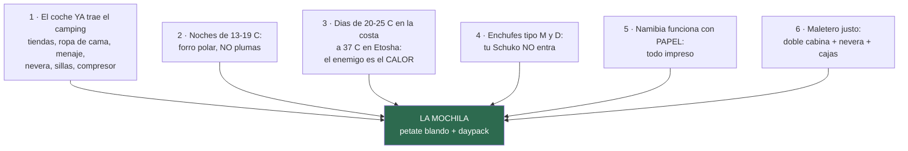

# 05 · Equipaje

> **Namibia · 30 oct – 15 nov 2026 · la clásica del norte** — [← índice del dossier](README.md)
>
> La mochila que dictan los datos del dossier: qué llevar, qué dejar en casa y los tres micro-kits de los días señalados.
>
> **La lista para tachar, ítem a ítem, está aparte: [`17`](17-lista-de-equipaje.md).** Aquí está el porqué; allí, el qué.
>
> **~N$20 = €1** *(rango 19,5–20,5)* · **✅** fuente primaria · **◐** secundaria concordante ·
> **○** práctica común, sin fuente · **❌** sin verificar, dicho en blanco
>
> *Investigación cerrada el 02/08/2026 · podado el 06/08/2026 al separar la lista en `17` ·
> barrido completo de fuentes el 11/08/2026 (salud, clima, sol, energía y listas comparadas) ·
> segunda auditoría el 14/08/2026 (clima verificado etapa a etapa, tsé-tsé, permetrina y garrapata)*

---

## 🧠 Las seis reglas que deciden la mochila

1. **El coche ya trae el camping** ✅ *(oferta de Savanna, 12/08)*: una tienda de techo con
   colchoneta, **nevera Engel de 40 L con batería propia**, mesa, 2 sillas, 2 bombonas de gas y 2
   fuegos, parrilla, lámpara de 12V, garrafa de 20 L y caja de cocina completa. **No compres saco
   de dormir con ropa de cama —la tienda solo trae sábana bajera, sin edredón ni manta— ni
   esterilla ni cacharros.** *Cómo se vive de ese kit —la rutina, el braai, la nevera— está en el
   [`18`](18-manual-de-campamento.md).*
2. **Las noches NO son frías** ✅ *(medias de mínimas de noviembre, estaciones GHCN/ERA5 — `15` y
   `01`; verificado además contra las fichas de NWR el 14/08: Sesriem 15,5 y Etosha 18,3 ✅)*:
   **12,7 °C en la costa · 15,5 en Sesriem · 16,3 en Windhoek · 18,9 en Etosha**. **Plumas,
   térmicos, gorro y guantes se quedan en casa** — son peso muerto en una tienda de techo. *La
   noche fría del viaje es la de la costa, no la del desierto.* El único matiz es de altitud:
   **el camping de Spreetshoogte está a 1.728 m** ◐
   *([barkhan](https://www.barkhan.africa/spreetshoogte-campsite.php))* — la primera noche, el
   forro a mano, no enterrado en el petate.
3. **El problema es el calor** ✅: **37,1 °C de media de máximas en Etosha** *(la cifra GHCN es el
   techo del abanico: la propia NWR publica 35,5 ◐ — cambia el matiz, no la conclusión)*, 32–34 en el desierto,
   **UV extremo (13–15 en noviembre ◐)** y polvo. La equipación es de sol, no de frío — con UNA
   excepción: **la costa** (Benguela: **19–25 °C de día según fuente** — la estación mide 25,0 ✅;
   los datos del pueblo dan 19–21 con un 88 % de humedad ◐, la divergencia queda anotada en
   [`15`](15-huecos-cerrados.md) —, **12,7 de madrugada**, niebla y viento) y **la salida de
   Deadvlei** (en marcha a las ~05:10, `01`).
4. **Enchufes tipo M y tipo D** ◐ (`04`; Namibia usa los dos — verificado el 25/08): **DOS adaptadores que cubran ambos, comprados online antes de salir** — «el fallo
   tonto más probable del viaje». Matizado el 11/08 ◐: el Europlug fino (tipo C) entra **a veces,
   flojo y con chispazo** en las tomas D, y **no entra** en las M, que son las mayoritarias
   *([worldstandards](https://www.worldstandards.eu/electricity/plugs-and-sockets/m/))*; el Schuko
   gordo, en ninguna. Y el enchufe **en la parcela** quedó confirmado para los cuatro NWR de
   interior ◐ *(`18` §5)* — de ahí la regleta nueva del `17`.
5. **Papel** ✅ (`04`): e-visa impreso y firmado, reservas, póliza — todo impreso una semana antes.
6. **Espacio justo** ○: doble cabina con nevera y cajas de camping — **bolsa blanda, no maleta
   rígida**: se embute donde la rígida no cabe.

---

## 🎒 El contenedor: qué mochila/bolsa

- **Petate blando de 60–80 L por persona** ○ (tipo duffel, mejor con asas mochileras): es lo que
  se adapta al hueco que deje la nevera. La maleta rígida grande es el error clásico de este
  formato de viaje.
- **Daypack de 20–25 L por persona** ○: es la que sube a Big Daddy (agua + cámara), entra en los
  miradores y hace de equipaje de mano en el avión.
- **Bolsas zip / saco estanco pequeño** ○ para la electrónica: el polvo de la grava se mete por
  todo (la calima y el corrugado de `06` también van por dentro del coche).
- **Neceser colgable** ○ (los baños de los campings NWR no tienen repisa garantizada) y **chanclas
  para las duchas**.
- ✅ **Peso de facturación — cerrado (07/08)**: en el billete único del grupo Lufthansa la
  franquicia es **una para todo el itinerario** y la fija la tarifa, no cada operador — **1 maleta
  de 23 kg (158 cm) por persona en Economy Classic; en Light, NINGUNA** *(el detalle y las fuentes,
  en [`02`](02-presupuesto.md) §8)*. Los ~20 kg apuntados por petate ○ caben con margen — **la
  única decisión real es emitir con tarifa con maleta**.

---

## 📄 Documentos *(el bloque que decide si entras)*

Cuatro de ellos se comprueban **contra una fecha**, y por eso van antes que nada: el **pasaporte**
tiene que valer hasta el **15/05/2027** y llevar **3 páginas en blanco de verdad** ✅; el **e-visa**
no se puede pedir sin billete de vuelta, y se pide en `eservices.mhaiss.gov.na` ✅ (`04`) —*existe
visado a la llegada en Hosea Kutako, según el MAEC y la misión namibia en Berna, pero es el plan B,
no el plan*—; la
**reserva impresa de Terrace Bay** es la que te deja entrar al parque a dormir ✅ (`11`); y el
**permiso internacional de conducir** — **resuelto ◐ (`04`): con carnet español SÍ hace falta**,
porque la ley namibia pide el carné en inglés, y lo piden también el alquiler y el seguro.

Y uno que no es papel de trámite sino de urgencia: la **póliza IATI impresa con la línea 24 h**,
porque **los hospitales privados piden garantía por adelantado** ✅ (`07`). La cartilla de fiebre
amarilla **no hace falta**: el vuelo escala en Fráncfort y Múnich, que no son zona de riesgo (`04`).

## 🩺 Salud y botiquín

- **Profilaxis de malaria** según lo que diga el CVI ✅ (`04`): el riesgo se define por
  **regiones, y Kunene incluye Terrace Bay** — la entrada en zona es el **D7 (6 nov)** *(un día
  antes desde el 24/08)*.
  Si es Malarone, se empieza ya de viaje (~4–5 nov); si es mefloquina, **~16–23 de octubre** — la
  receta sale de la cita de septiembre. A esa cita se va con el dato de la guía oficial británica:
  en estas regiones, **de mayo a noviembre solo recomienda evitar picaduras, sin
  quimioprofilaxis** ✅ *([TravelHealthPro](https://travelhealthpro.org.uk/country/157/namibia))*
- **El sol es el riesgo diario real**, no la fauna ni la malaria: el UV de noviembre es **extremo
  (13–15)**, también bajo la niebla de la costa ◐. Crema 50+ **a dosis real** — ~30 ml por
  aplicación cada 2 h: por eso el `17` sube de 2 a 4 tubos ◐
  *([AAD](https://www.aad.org/public/everyday-care/sun-protection/shade-clothing-sunscreen/how-to-apply-sunscreen))* —, protector labial y sombrero de **ala ≥7,5 cm con barbuquejo** se usan los
  quince días. Y en el coche también: el vidrio lateral solo para **~71 % del UVA** ◐
  *([JAMA Ophthalmol. 2016](https://www.researchgate.net/publication/303026415_Assessment_of_Levels_of_Ultraviolet_A_Light_Protection_in_Automobile_Windshields_and_Side_Windows))* — se
  conduce por la izquierda: el brazo derecho del conductor va al sol
- **Sales de rehidratación oral** ○ — con 35–38 °C y aire seco, la deshidratación va por delante
  de la sed. Y la regla del agua ✅ (`06`/FCDO): **4+ L por persona y día EN el coche** — como
  suelo: la referencia overlanding pide **5 L y doblar el margen** en los tramos sin servicios ◐
  *([Tracks4Africa](https://blog.tracks4africa.co.za/water-supply-overland/))*
- **Repelente con DEET ≥20 % (o icaridina)** ✅ — **resuelto el 21/08: Goibi Xtreme Trópical,
  DEET al 45 %** ◐, muy por encima del mínimo *(el detalle y sus dos avisos —disuelve plásticos y
  se lava al llegar al campamento— en [`17`](17-lista-de-equipaje.md))*
  *([CDC](https://wwwnc.cdc.gov/travel/destinations/traveler/none/namibia))*: Etosha es zona de
  malaria ✅ aunque tu ventana sea el mínimo estacional (`04`) — con manga larga ligera al
  anochecer ○, y el repelente **siempre encima** de la crema solar ✅
- **Permetrina en ropa y botas, y el hábito de la garrapata** ✅/◐ — ⚠️ **cumplido a medias
  (21/08)**: el **Diptron Textil** comprado **no es permetrina**, sino **IR3535 al 25,5 %** ◐◐ —
  vale contra mosquito hasta 3 meses y contra garrapata 1, pero no es el producto que nombra el
  CDC; las tres salidas, en [`17`](17-lista-de-equipaje.md). *Lo que sí queda cubierto del todo es
  la camisa: la **Craghoppers NosiLife Adventure III** ✅ lleva el repelente en el propio tejido.*
  El CDC pide para esta zona
  ropa y equipo tratados con permetrina *(«boots, pants, socks, and tents» — misma ficha)*: cubre
  mosquito y garrapata a la vez. La fiebre por garrapata africana es la fiebre con sarpullido más
  frecuente del safari austral y **quien acampa es el grupo de riesgo** ◐
  *([CDC Yellow Book](https://www.cdc.gov/yellow-book/hcp/travel-associated-infections-diseases/rickettsial-diseases.html))*:
  revisión corporal al anochecer los días de monte — las pinzas del botiquín son el extractor
- ◐ **Gafas graduadas mejor que lentillas** — el polvo de la grava se mete por todo; desde el
  11/08, con la optometría detrás *([AOA](https://www.aoa.org/healthy-eyes/vision-and-vision-correction/environments))*. Si son lentillas: diarias desechables y lágrima sin conservantes

## 🔌 Electrónica

- **2 adaptadores tipo M + D** ◐ (`04`) — pedidos online YA, no existen en súper españoles; que cubran los dos tipos, que Namibia usa ambos
- **Cargador 12 V multi-USB** ○ para el coche (los 12 V «se saltan el problema entero», `04`) +
  **powerbank** grande para las noches sin electricidad en parcela (**enchufe en parcela: sin
  dato** — pregúntalo al reservar NWR)
- **Frontal por persona** ○ (la letrina a las 3 AM, montar la tienda al anochecer, el camino a la
  charca) — **con modo rojo para el camino; en la plataforma, apagado del todo** ◐: la norma
  documentada es la luz del recinto y nada más — ni linterna, ni flash, ni pantalla de móvil
  *([guía de Etosha](https://etoshanationalpark.com.na/wildlife/etosha-photography-guide/) ·
  [okaukuejo](https://www.etoshanationalparknamibia.com/okaukuejo-waterhole/))*
- **El satelital con SOS** ✅ — reservado y pagado con el alquiler de Savanna *(`20` §1)*,
  exactamente lo que el dossier recomendaba sin ambigüedad para ESTA ruta (`06`/`07`: «el móvil
  es una cámara, no un salvavidas» en Solitaire–Walvis y Damaraland). No hace falta comprar ni
  alquilar nada aparte.
- **Prismáticos — uno POR PERSONA** ○ (compartir prismáticos en una charca es pelearse) — y van
  «EN el asiento, no en el maletero» (`01`)
- **La cámara, el teleobjetivo y todo su equipo tienen repo propio**, aparte de este dossier —
  fotografía es un mundo con sus propias decisiones y no vive aquí
- Móvil: **Tracks4Africa** ✅ (`13` lo exige para verificar etapas) + mapas offline + los teléfonos
  de emergencia de `07` grabados **y en papel en la guantera** ✅
- 🚁 **Dron: NO. Se queda en casa** ✅ — no es escrúpulo, es que **no hay dónde volarlo en esta
  ruta**: cualquier vuelo exige permiso previo de la NCAA *(pedido con 30–60 días y con seguro
  específico en inglés)*, **en parque nacional está prohibido y el permiso no se concede a vuelo
  privado**, y **Etosha lo prohíbe del todo desde abril de 2025** — te lo quedarías en la puerta de
  entrada, a 161 km de la de salida. Sossusvlei, la Costa de los Esqueletos y Etosha —los tres
  motivos para llevarlo— son justo los tres sitios donde no se puede. **El detalle, con fuentes, en
  [`11`](11-entradas-y-permisos.md).**

## 👕 Ropa y calzado — las tres decisiones, no el recuento

*Cuántas camisetas y cuántos calcetines, con casilla, en [`17`](17-lista-de-equipaje.md).*

- **La corrección de premisa de `04` manda**: **un** forro polar y **un** chubasquero — que desde
  el 11/08 tiene apellido: **impermeable de verdad**, porque además de la costa y la madrugada de
  Deadvlei cubre **las tormentas de Etosha** *(noviembre abre las lluvias: 43–44 mm en ~7 días ◐,
  y un operador namibio lo llama «esencial de noviembre a abril» ◐
  [Chameleon](https://chameleonholidays.com/what-to-pack-for-your-namibian-holiday/))* —, y **nada
  de plumas ni térmicos**. La mínima más baja de todo el viaje es 12,7 °C ✅. El punto más justo del
  sistema es la noche de la costa *(13–15 °C, 88 % de humedad, viento: sensación ~10–11 ◐)*: su
  seguro opcional de 80 g — gorro fino y térmica ligera — está en el `17`.
- **Manga larga ligera antes que otra camiseta** ○: sirve para el sol de mediodía y para los
  mosquitos del anochecer en Etosha, que es donde hay malaria. Colores tierra o neutros ◐ — y
  desde el 14/08, con el porqué medido: la razón fuerte del «color de safari» (la tsé-tsé, que va
  al azul y al negro) **no aplica en esta ruta** — en Namibia la mosca se limita históricamente al
  Caprivi, fuera del itinerario *([PubMed](https://pubmed.ncbi.nlm.nih.gov/10486826/) ·
  [ACSH](https://www.acsh.org/news/2016/11/28/do-dark-colors-really-attract-tsetse-flies-10471))*;
  lo que queda es práctico: el negro da calor, el blanco enseña el polvo, y **de noche el blanco
  atrae insectos bajo el foco de la charca** ◐
  *([encounterstravel](https://www.encounterstravel.com/blog/what-to-pack-for-a-trip-to-namibia))*.
  Y el **buff** no es un accesorio: es la herramienta oficial contra el olor de Cape Cross ✅.
- **Dos calzados y unas chanclas** ○: zapatilla de trail **ya domada** para Big Daddy, Sesriem
  Canyon, Twyfelfontein y la cascada del Uniab (`10`); **sandalias Hoka Hopara 2** para conducir y
  para el campamento *(cerradas por delante: la arena no entra)*; chanclas para las duchas compartidas. La arena a mediodía **quema**: nunca
  descalzo ○.
- **La colada del D5–D6, sin lavadero** ◐: en Swakopmund hay deja-y-recoge — **Swakopmund
  Laundrette**, 15 Swakop St *([ficha](https://vymaps.com/NA/Swakopmund-Laundrette-484378/) ·
  [experiencia de viajeros](https://www.tripadvisor.com/ShowTopic-g298357-i10720-k11909074-o10-Laundry-Swakopmund_Erongo_Region.html))*, y **Atlantic Laundry** entrega en el día si se deja antes
  de las 11:00 *([web](https://namibia-laundry.com/service-atlantic-laundry-swakopmund/))* — y en
  Walvis Bay, al menos tres lavanderías con dirección
  *([brabys](https://www.brabys.com/na/walvis-bay/laundries/walvis-bay-laundry))*. Horarios sin
  publicar ❌: confirmar al llegar. El detergente de viaje del `17` queda de respaldo.

## 🚫 Las trampas — lo que se queda en casa
- ❌ Plumas, térmicos, gorro y guantes ◐ (`04`) — peso muerto
- ❌ Maleta rígida grande ○ — no cabe bien
- ❌ Saco de dormir, esterilla, menaje ✅ — el coche lo trae (README). *El hornillo ya consta:
  «gas cooker & gas cylinder (3kg)» en la ficha ✅ (cotejo del 10/08/2026) — se coteja físicamente
  en la entrega (`18` §4)*
- ❌ Comida de casa en cantidad — el avituallamiento está resuelto y mapeado en `08`
- ❌ **Dron** ✅ — la normativa **sí** está investigada y el resultado es que no hay dónde volarlo:
  el detalle, más arriba y con fuentes en [`11`](11-entradas-y-permisos.md)
- ❌ Y a la vuelta: **nada de biltong ni carne en el petate** — prohibido entrar en la UE ✅ (`08`)

---

## 📦 Por qué hay tres «micro-kits»

Hay tres momentos del viaje en los que **lo que necesitas no es lo que llevas encima**, y los tres
pillan con el petate cerrado en el maletero: la **salida a Deadvlei del D4**, que arranca a las
~05:10 con frío y termina a mediodía con 34 °C; las **charcas de noche del D10 al D13**, que se hacen
a oscuras y en silencio; y la **costa del D5 al D7**, donde caen niebla, salitre y polvo el mismo
día. Por eso se preparan la víspera y viajan en el daypack, no abajo.

**Qué va en cada uno, con casilla: [`17`](17-lista-de-equipaje.md).**

---

*Los precios de lo que falta por comprar (adaptadores, satelital, garrafas) no están cotizados en
el dossier — se compran fuera o allí (`08`). Los «sin dato» de la ficha del coche —toallas,
almohadas, hornillo y menaje— los cerró la propia ficha en el cotejo del 10/08/2026 ✅: para la
entrega quedan la batería de la nevera y el tanque (`18` §5, `20`). · 10/08/2026*
