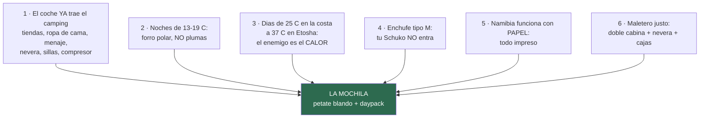

# 05 · Equipaje

> **Namibia · 31 oct – 15 nov 2026 · la clásica del norte** — [← índice del dossier](README.md)
>
> La mochila que dictan los datos del dossier: qué llevar, qué dejar en casa y los tres micro-kits de los días señalados.
>
> **~N$20 = €1** *(rango 19,5–20,5)* · **✅** fuente primaria · **◐** secundaria concordante ·
> **○** práctica común, sin fuente · **❌** sin verificar, dicho en blanco
>
> *Investigación cerrada el 02/08/2026 · formato y contenido revisados el 03/08/2026*

---

## 🧠 Las seis reglas que deciden la mochila

1. **El coche ya trae el camping** ✅ *(ficha N2Go Budget, README)*: 2 tiendas de techo, **ropa de
   cama para 4**, mesa, 4 sillas, **menaje completo**, nevera eléctrica, compresor. **No compres
   ni saco, ni esterilla, ni cacharros.** ⚠️ Lo que NO consta en la ficha: **toallas** y detalle
   fino del menaje — **sin dato: entra en el inventario por escrito que hay que pedir al reservar**
   (`04`).
2. **Las noches NO son frías** ✅ *(medias de mínimas de noviembre, estaciones GHCN/ERA5 — `15` y
   `01`)*: **12,7 °C en la costa · 15,5 en Sesriem · 16,3 en Windhoek · 18,9 en Etosha**. **Plumas,
   térmicos, gorro y guantes se quedan en casa** — son peso muerto en una tienda de techo. *La
   noche fría del viaje es la de la costa, no la del desierto.*
3. **El problema es el calor** ✅: **37,1 °C de media de máximas en Etosha**, 32–34 en el desierto,
   sol vertical y polvo. La equipación es de sol, no de frío — con UNA excepción: **la costa**
   (Benguela: 25 °C de día, **12,7 de madrugada**, niebla y viento) y **la salida de Deadvlei**
   (en marcha a las ~05:10, `01`).
4. **Enchufe tipo M** ◐ (`04`): **DOS adaptadores comprados online antes de salir** — «el fallo
   tonto más probable del viaje». Los Europlug finos (tipo C) suelen entrar; el Schuko gordo, no.
5. **Papel** ✅ (`04`): e-visa impreso y firmado, reservas, póliza — todo impreso una semana antes.
6. **Espacio justo** ○: doble cabina con nevera y cajas de camping — **bolsa blanda, no maleta
   rígida**: se embute donde la rígida no cabe.

---

## 🎒 El contenedor: qué mochila/bolsa

- **Petate blando de 60–80 L por persona** ○ (tipo duffel, mejor con asas mochileras): es lo que
  se adapta al hueco que deje la nevera. La maleta rígida grande es el error clásico de este
  formato de viaje.
- **Daypack de 20–25 L por persona** ○: es la que sube a Big Daddy (agua + cámara), entra en los
  miradores y hace de equipaje de mano en el avión.
- **Bolsas zip / saco estanco pequeño** ○ para la electrónica: el polvo de la grava se mete por
  todo (la calima y el corrugado de `06` también van por dentro del coche).
- **Neceser colgable** ○ (los baños de los campings NWR no tienen repisa garantizada) y **chanclas
  para las duchas**.
- ⚠️ **Peso de facturación: sin dato** — la franquicia del billete (3 aerolíneas en la vuelta) es
  justo una de las dos cosas **pendientes de confirmar al emitir** (README). Hasta entonces,
  apunta a ~20 kg por petate ○.

---

## 📄 Documentos *(el bloque que decide si entras — todo del dossier)*

- **Pasaportes** ✅: válidos hasta el **15/05/2027 mínimo** y **3 páginas en blanco de verdad** (`04`)
- **e-visa impreso y firmado** ✅ + copia (`04` — solo el portal `eservices.mhaiss.gov.na`)
- **Póliza IATI en papel**: número + **línea 24 h** — los hospitales privados piden garantía por
  adelantado ✅ (`07`)
- **Billetes, reservas de NWR/Terrace Bay/coche impresas** ✅ (Terrace Bay: sin reserva impresa no
  entras al parque, `11`)
- **Carné de conducir + permiso internacional** — ⚠️ si es obligatorio **sigue sin resolver** (`12`):
  está en la cuenta atrás de septiembre (`04`)
- **Cartilla de vacunación** (la amarilla solo si el itinerario cambiara — con las escalas cortas
  de Adís **no hace falta**, `04`/README)
- ○ Copias: fotocopias de todo en una bolsa aparte del original + fotos en el móvil (offline)

## 🩺 Salud y botiquín

- **Profilaxis de malaria** según lo que diga el CVI ✅ (`04`): si es Malarone, se empieza ya de
  viaje (~7–8 nov); si es mefloquina, **~19–26 de octubre** — la receta sale de la cita de
  septiembre
- **Repelente con DEET** ○ (Etosha es zona de malaria ✅, aunque tu ventana es el mínimo
  estacional — `04`): manga larga ligera al anochecer en Etosha ○
- **Crema solar 50+, aftersun y protector labial** ○ — el sol es el riesgo diario real
- **Sales de rehidratación oral** ○ — con 35–38 °C y aire seco, la deshidratación va por delante
  de la sed. Y la regla del agua ✅ (`06`/FCDO): **4+ L por persona y día EN el coche**
- Botiquín ○: analgésico, antidiarreico, antihistamínico, tiritas + compeed, vendas, tijeras,
  **pinzas** (espinas de acacia), **colirio** (polvo), termómetro, tus medicaciones con receta
- ○ **Gafas graduadas mejor que lentillas** (polvo); gafas de repuesto

## 🔌 Electrónica

- **2 adaptadores tipo M** ◐ (`04`) — pedidos online YA, no existen en súper españoles
- **Cargador 12 V multi-USB** ○ para el coche (los 12 V «se saltan el problema entero», `04`) +
  **powerbank** grande para las noches sin electricidad en parcela (**enchufe en parcela: sin
  dato** — pregúntalo al reservar NWR)
- **Frontal por persona** ○ (la charca iluminada, la letrina a las 3 AM, montar la tienda al
  anochecer) — con **modo rojo** ○: en la charca de Okaukuejo la luz blanca molesta a todos
- **El satelital con SOS** (Garmin inReach o similar) — el dossier lo recomienda sin ambigüedad
  para ESTA ruta ✅ (`06`/`07`: «el móvil es una cámara, no un salvavidas» en Solitaire–Walvis y
  Damaraland). **Decisión de compra/alquiler aún pendiente** (`04`)
- **Prismáticos — uno POR PERSONA** ○ (compartir prismáticos en una charca es pelearse) — y van
  «EN el asiento, no en el maletero» (`01`)
- Cámara: **tele** para fauna ○ · **trípode** para la charca iluminada de noche y el cielo del
  desierto ○ · tarjetas y baterías de sobra (comprarlas allí: caro y lejos) · **funda/bolsa
  antipolvo** ○
- Móvil: **Tracks4Africa** ✅ (`13` lo exige para verificar etapas) + mapas offline + los teléfonos
  de emergencia de `07` grabados **y en papel en la guantera** ✅
- 🚁 **Dron: NO. Se queda en casa** ✅ — no es escrúpulo, es que **no hay dónde volarlo en esta
  ruta**: cualquier vuelo exige permiso previo de la NCAA *(pedido con 30–60 días y con seguro
  específico en inglés)*, **en parque nacional está prohibido y el permiso no se concede a vuelo
  privado**, y **Etosha lo prohíbe del todo desde abril de 2025** — te lo quedarías en la puerta de
  entrada, a 161 km de la de salida. Sossusvlei, la Costa de los Esqueletos y Etosha —los tres
  motivos para llevarlo— son justo los tres sitios donde no se puede. **El detalle, con fuentes, en
  [`11`](11-lista-google-maps.md).**

## 👕 Ropa *(14 días, lavado a mano posible ○)*

- **La corrección de premisa de `04` manda**: forro polar (1), **cortavientos/chubasquero ligero**
  (1 — costa y madrugada de Deadvlei), y NADA de plumas ni térmicos
- ○ 4–5 camisetas transpirables + 2 camisas de manga larga ligeras (sol y mosquitos: valen más que
  otra camiseta) · 2 pantalones largos ligeros + 2 cortos · ropa interior y calcetines para
  ~7 días · **bañador** (piscinas de Okaukuejo/Halali/Namutoni ✅ `01`, y la de Halali es plan de
  mediodía) · algo mínimamente decente para Joe's y el hotel del D13
- ○ Colores tierra/neutros para el safari (no es dogma, pero el blanco se ve a un kilómetro y el
  negro da calor)
- **Sombrero de ala** ○ + **buff/pañuelo** — que además es la herramienta oficial contra el olor
  de Cape Cross ✅ (README: «pañuelo para la nariz — en serio»)

## 🥾 Calzado

- **Zapatilla de trail o bota ligera ya domada** ○ — Big Daddy, Sesriem Canyon, Twyfelfontein, la
  cascada del Uniab (`10`)
- **Sandalia de trekking** ○ — conducir, campamento, y la bajada corriendo de Big Daddy a Deadvlei
  (la arena a mediodía QUEMA: nunca descalzo ○)
- Chanclas de ducha ○

## 🧰 Extras que sí y trampas que no

**Sí ○:**
- Cinta americana + bridas + cuerda fina (tender la ropa) + jabón de viaje
- Mechero ×2 y pastillas de encendido (la leña resinosa de algunos campings, `08`)
- Cuchillo/multiherramienta **facturado, jamás en cabina**
- Bolsas de basura (en los parques la basura vuelve contigo ○) y ziplocs para la Línea Roja
  (restos de carne NO bajan del norte ✅ `07`)
- Toallas de microfibra ×2 *(hasta que el inventario escrito del coche diga si trae — sin dato)*
- Cojín/almohada de viaje ○: la ficha dice «ropa de cama», la calidad de la almohada es lotería
- Libreta y boli — para apuntar las **presiones en frío** que te den en la entrega ✅ (`06`)

**No 🚫:**
- ❌ Plumas, térmicos, gorro y guantes ◐ (`04`) — peso muerto
- ❌ Maleta rígida grande ○ — no cabe bien
- ❌ Saco de dormir, esterilla, hornillo, menaje ✅ — el coche lo trae TODO (README)
- ❌ Comida de casa en cantidad — el avituallamiento está resuelto y mapeado en `08`
- ⚠️ **Dron: normativa namibia NO investigada en este dossier** — si tenéis uno, investigadlo
  antes de meterlo en la bolsa; en parques nacionales dad por hecho que necesita permisos.
  **Sin dato: hueco reconocido.**
- ❌ Y a la vuelta: **nada de biltong ni carne en el petate** — prohibido entrar en la UE ✅ (`08`)

---

## 📦 Los tres «micro-kits» del día señalado

- **Kit Deadvlei (D4, salida ~05:10 ☀️)**: daypack con 3 L de agua p.p., forro + cortavientos
  (se queda en el coche a las 9:00), buff, cámara, frontal para el tramo de puerta, calzado
  cerrado. Desinflar/reinflar: el compresor va en el coche ✅.
- **Kit charca nocturna (D9–D12)**: forro, frontal en rojo, prismáticos, trípode, silencio y
  paciencia (`01`: apaga y dale 15–20 min).
- **Kit costa (D5–D7)**: cortavientos, buff para Cape Cross, y la electrónica en bolsa estanca —
  niebla + salitre + polvo el mismo día.

---

*Los precios de lo que falta por comprar (adaptadores, satelital, garrafas) no están cotizados en
el dossier — se compran fuera o allí (`08`). Lo heredado de fichas del coche depende del
**inventario POR ESCRITO** pendiente con Namibia2Go (`04`): toallas, almohadas y detalle del menaje
son los «sin dato» que ese email cierra. · 02/08/2026*
