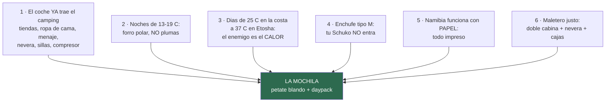

# 05 · Equipaje

> **Namibia · 30 oct – 15 nov 2026 · la clásica del norte** — [← índice del dossier](README.md)
>
> La mochila que dictan los datos del dossier: qué llevar, qué dejar en casa y los tres micro-kits de los días señalados.
>
> **La lista para tachar, ítem a ítem, está aparte: [`17`](17-lista-de-equipaje.md).** Aquí está el porqué; allí, el qué.
>
> **~N$20 = €1** *(rango 19,5–20,5)* · **✅** fuente primaria · **◐** secundaria concordante ·
> **○** práctica común, sin fuente · **❌** sin verificar, dicho en blanco
>
> *Investigación cerrada el 02/08/2026 · podado el 06/08/2026 al separar la lista en `17`*

---

## 🧠 Las seis reglas que deciden la mochila

1. **El coche ya trae el camping** ✅ *(ficha N2Go Budget, README)*: 2 tiendas de techo, **ropa de
   cama para 4 —edredones, mantas, almohadas y toallas, ×4 de cada—**, mesa, 4 sillas, **menaje
   completo pieza a pieza**, **cocina de gas con bombona de 3 kg**, nevera eléctrica, compresor.
   **No compres ni saco, ni esterilla, ni cacharros.** *(Toallas, hornillo y el detalle del menaje
   eran los «no consta» de esta ficha: la web los lista desde el cotejo del 10/08/2026 ✅ — lo que
   queda es cotejarlo físicamente en la entrega, `01` §D0.)* *Cómo se vive de ese kit —la rutina,
   el braai, la nevera— está en el [`18`](18-manual-de-campamento.md).*
2. **Las noches NO son frías** ✅ *(medias de mínimas de noviembre, estaciones GHCN/ERA5 — `15` y
   `01`)*: **12,7 °C en la costa · 15,5 en Sesriem · 16,3 en Windhoek · 18,9 en Etosha**. **Plumas,
   térmicos, gorro y guantes se quedan en casa** — son peso muerto en una tienda de techo. *La
   noche fría del viaje es la de la costa, no la del desierto.*
3. **El problema es el calor** ✅: **37,1 °C de media de máximas en Etosha**, 32–34 en el desierto,
   sol vertical y polvo. La equipación es de sol, no de frío — con UNA excepción: **la costa**
   (Benguela: 25 °C de día, **12,7 de madrugada**, niebla y viento) y **la salida de Deadvlei**
   (en marcha a las ~05:10, `01`).
4. **Enchufe tipo M** ◐ (`04`): **DOS adaptadores comprados online antes de salir** — «el fallo
   tonto más probable del viaje». Los Europlug finos (tipo C) suelen entrar; el Schuko gordo, no.
5. **Papel** ✅ (`04`): e-visa impreso y firmado, reservas, póliza — todo impreso una semana antes.
6. **Espacio justo** ○: doble cabina con nevera y cajas de camping — **bolsa blanda, no maleta
   rígida**: se embute donde la rígida no cabe.

---

## 🎒 El contenedor: qué mochila/bolsa

- **Petate blando de 60–80 L por persona** ○ (tipo duffel, mejor con asas mochileras): es lo que
  se adapta al hueco que deje la nevera. La maleta rígida grande es el error clásico de este
  formato de viaje.
- **Daypack de 20–25 L por persona** ○: es la que sube a Big Daddy (agua + cámara), entra en los
  miradores y hace de equipaje de mano en el avión.
- **Bolsas zip / saco estanco pequeño** ○ para la electrónica: el polvo de la grava se mete por
  todo (la calima y el corrugado de `06` también van por dentro del coche).
- **Neceser colgable** ○ (los baños de los campings NWR no tienen repisa garantizada) y **chanclas
  para las duchas**.
- ✅ **Peso de facturación — cerrado (07/08)**: en el billete único del grupo Lufthansa la
  franquicia es **una para todo el itinerario** y la fija la tarifa, no cada operador — **1 maleta
  de 23 kg (158 cm) por persona en Economy Classic; en Light, NINGUNA** *(el detalle y las fuentes,
  en [`02`](02-presupuesto.md) §8)*. Los ~20 kg apuntados por petate ○ caben con margen — **la
  única decisión real es emitir con tarifa con maleta**.

---

## 📄 Documentos *(el bloque que decide si entras)*

Cuatro de ellos se comprueban **contra una fecha**, y por eso van antes que nada: el **pasaporte**
tiene que valer hasta el **15/05/2027** y llevar **3 páginas en blanco de verdad** ✅; el **e-visa**
no se puede pedir sin billete de vuelta, y solo lo emite `eservices.mhaiss.gov.na` ✅ (`04`); la
**reserva impresa de Terrace Bay** es la que te deja entrar al parque a dormir ✅ (`11`); y el
**permiso internacional de conducir** — **resuelto ◐ (`04`): con carnet español SÍ hace falta**,
porque la ley namibia pide el carné en inglés, y lo piden también el alquiler y el seguro.

Y uno que no es papel de trámite sino de urgencia: la **póliza IATI impresa con la línea 24 h**,
porque **los hospitales privados piden garantía por adelantado** ✅ (`07`). La cartilla de fiebre
amarilla **no hace falta**: el vuelo escala en Fráncfort y Múnich, que no son zona de riesgo (`04`).

## 🩺 Salud y botiquín

- **Profilaxis de malaria** según lo que diga el CVI ✅ (`04`): si es Malarone, se empieza ya de
  viaje (~6–7 nov — la zona arranca en el D8, Damaraland); si es mefloquina, **~19–26 de octubre**
  — la receta sale de la cita de septiembre
- **El sol es el riesgo diario real**, no la fauna ni la malaria: crema 50+, protector labial y
  sombrero se usan los quince días ○
- **Sales de rehidratación oral** ○ — con 35–38 °C y aire seco, la deshidratación va por delante
  de la sed. Y la regla del agua ✅ (`06`/FCDO): **4+ L por persona y día EN el coche**
- **Repelente con DEET** ○: Etosha es zona de malaria ✅ aunque tu ventana sea el mínimo estacional
  (`04`) — con manga larga ligera al anochecer ○
- ○ **Gafas graduadas mejor que lentillas** — el polvo de la grava se mete por todo

## 🔌 Electrónica

- **2 adaptadores tipo M** ◐ (`04`) — pedidos online YA, no existen en súper españoles
- **Cargador 12 V multi-USB** ○ para el coche (los 12 V «se saltan el problema entero», `04`) +
  **powerbank** grande para las noches sin electricidad en parcela (**enchufe en parcela: sin
  dato** — pregúntalo al reservar NWR)
- **Frontal por persona** ○ (la charca iluminada, la letrina a las 3 AM, montar la tienda al
  anochecer) — y **con modo rojo** ○: en la charca de Okaukuejo la luz blanca molesta a todos
  los que llevan media hora esperando en silencio
- **El satelital con SOS** (Garmin inReach o similar) — el dossier lo recomienda sin ambigüedad
  para ESTA ruta ✅ (`06`/`07`: «el móvil es una cámara, no un salvavidas» en Solitaire–Walvis y
  Damaraland). **Decisión de compra/alquiler aún pendiente** (`04`)
- **Prismáticos — uno POR PERSONA** ○ (compartir prismáticos en una charca es pelearse) — y van
  «EN el asiento, no en el maletero» (`01`)
- **La cámara y el teleobjetivo tienen documento propio**: dos gamas con precio real de tienda y
  la cuenta de comprar frente a alquilar —aquí o en Windhoek— en [`19`](19-fotografia.md). La
  regla corta: **400 mm equivalentes como suelo** para la charca, y cuantos menos cambios de
  objetivo, menos polvo en el sensor ○
- Móvil: **Tracks4Africa** ✅ (`13` lo exige para verificar etapas) + mapas offline + los teléfonos
  de emergencia de `07` grabados **y en papel en la guantera** ✅
- 🚁 **Dron: NO. Se queda en casa** ✅ — no es escrúpulo, es que **no hay dónde volarlo en esta
  ruta**: cualquier vuelo exige permiso previo de la NCAA *(pedido con 30–60 días y con seguro
  específico en inglés)*, **en parque nacional está prohibido y el permiso no se concede a vuelo
  privado**, y **Etosha lo prohíbe del todo desde abril de 2025** — te lo quedarías en la puerta de
  entrada, a 161 km de la de salida. Sossusvlei, la Costa de los Esqueletos y Etosha —los tres
  motivos para llevarlo— son justo los tres sitios donde no se puede. **El detalle, con fuentes, en
  [`11`](11-entradas-y-permisos.md).**

## 👕 Ropa y calzado — las tres decisiones, no el recuento

*Cuántas camisetas y cuántos calcetines, con casilla, en [`17`](17-lista-de-equipaje.md).*

- **La corrección de premisa de `04` manda**: **un** forro polar y **un** cortavientos ligero
  —costa y madrugada de Deadvlei—, y **nada de plumas ni térmicos**. La mínima más baja de todo el
  viaje es 12,7 °C ✅.
- **Manga larga ligera antes que otra camiseta** ○: sirve para el sol de mediodía y para los
  mosquitos del anochecer en Etosha, que es donde hay malaria. Colores tierra o neutros ○ — no es
  dogma, pero el blanco se ve a un kilómetro y el negro da calor. Y el **buff** no es un accesorio:
  es la herramienta oficial contra el olor de Cape Cross ✅.
- **Dos calzados y unas chanclas** ○: zapatilla de trail **ya domada** para Big Daddy, Sesriem
  Canyon, Twyfelfontein y la cascada del Uniab (`10`); sandalias barefoot Saguaro para conducir y
  para el campamento; chanclas para las duchas compartidas. La arena a mediodía **quema**: nunca
  descalzo ○.

## 🚫 Las trampas — lo que se queda en casa
- ❌ Plumas, térmicos, gorro y guantes ◐ (`04`) — peso muerto
- ❌ Maleta rígida grande ○ — no cabe bien
- ❌ Saco de dormir, esterilla, menaje ✅ — el coche lo trae (README). *El hornillo ya consta:
  «gas cooker & gas cylinder (3kg)» en la ficha ✅ (cotejo del 10/08/2026) — se coteja físicamente
  en la entrega (`18` §4)*
- ❌ Comida de casa en cantidad — el avituallamiento está resuelto y mapeado en `08`
- ❌ **Dron** ✅ — la normativa **sí** está investigada y el resultado es que no hay dónde volarlo:
  el detalle, más arriba y con fuentes en [`11`](11-entradas-y-permisos.md)
- ❌ Y a la vuelta: **nada de biltong ni carne en el petate** — prohibido entrar en la UE ✅ (`08`)

---

## 📦 Por qué hay tres «micro-kits»

Hay tres momentos del viaje en los que **lo que necesitas no es lo que llevas encima**, y los tres
pillan con el petate cerrado en el maletero: la **salida a Deadvlei del D4**, que arranca a las
~05:10 con frío y termina a mediodía con 34 °C; las **charcas de noche del D9 al D12**, que se hacen
a oscuras y en silencio; y la **costa del D5 al D7**, donde caen niebla, salitre y polvo el mismo
día. Por eso se preparan la víspera y viajan en el daypack, no abajo.

**Qué va en cada uno, con casilla: [`17`](17-lista-de-equipaje.md).**

---

*Los precios de lo que falta por comprar (adaptadores, satelital, garrafas) no están cotizados en
el dossier — se compran fuera o allí (`08`). Los «sin dato» de la ficha del coche —toallas,
almohadas, hornillo y menaje— los cerró la propia ficha en el cotejo del 10/08/2026 ✅: para la
entrega quedan la batería de la nevera y el tanque (`18` §5, `21`). · 10/08/2026*
