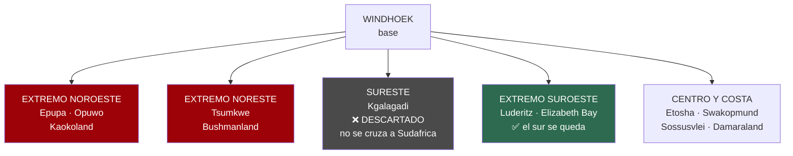
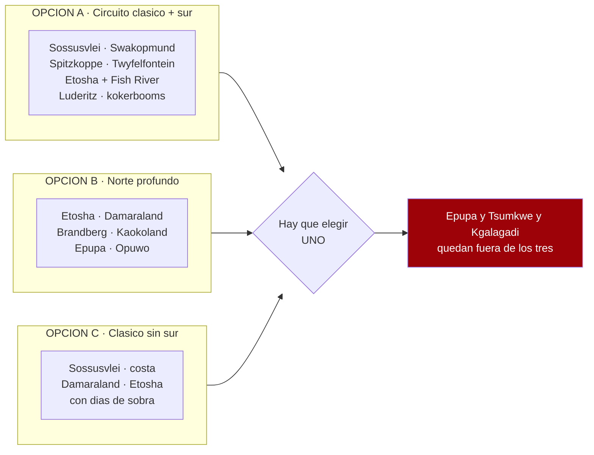

# Tu lista de Google Maps — análisis

34 sitios marcados, aportados por el viajero el 17/07/2026.
**~N$20 = €1** · **✅ verificado** · **◐ secundario** · **⚠️ por verificar**

---

## 🔴 El titular, sin rodeos

> ### Esta lista no cabe en 14 días. Ni de lejos.

Tus pines van desde **Cataratas Epupa** (frontera con Angola, extremo noroeste) hasta **Lüderitz**
(suroeste atlántico), pasando por **Tsumkwe** (extremo este, Bushmanland). Eso es **el país entero**.

**Los extremos son direcciones opuestas desde Windhoek.** No hay circuito que los una en dos
semanas: cada uno es un viaje en sí mismo.

**Decisiones ya tomadas que recortan el mapa:**
- ✅ **El sur se queda** → suroeste dentro
- ❌ **No se cruza a Sudáfrica** → sureste fuera

Esto **no** es una crítica a la lista — es una lista excelente de Namibia. Es una **lista de deseos
de país entero**, y el trabajo ahora es **triar**, no meterlo todo con calzador. Y hay motivos
además del tiempo: tres de tus pines **chocan con cláusulas del seguro ya verificadas**.

---

## 🚨 Tres pines que chocan con lo ya verificado

### 1. Epupa + Opuwo = Kaokoland ✅ — la zona donde tu seguro se cae

Los T&C de Asco (versión 01/06/2026) dicen literalmente que **no pueden garantizar asistencia
técnica en 24 horas** en *«Namibia: Kaokoland and Damaraland»*. Y peor, para
*«Kaokoland and Damaraland: Offroad tracks and Van Zyl's Pass, including official gravel roads
**D3707 and D3703**»*:

> *«The renter will be responsible for all costs (tow-in costs, repairs, and vehicle exchange costs)
> resulting from any damages, including undercarriage damages, damages or breakdowns caused by heavy
> vibrations due to the poor condition of the roads/tracks, or damages and breakdowns caused by
> collisions with large stones or crevices... **EVEN IF THE SUPER COVER IS CHOSEN**.»*

Y el **Super Cover** ya excluye de por sí los bajos *«excluding Kaokoveld and Damaraland Area»*.

> 👉 **Traducción:** en Kaokoland vas **sin cobertura de bajos y sin rescate garantizado**, pagues lo
> que pagues. Y el rescate **no tiene tope** (cláusula 10.5.7: la franquicia elegida *«does not
> limit The Renter's liability for... recovery costs»*).
>
> Epupa está a un mundo de Windhoek y **la pista de Opuwo a Epupa es exactamente ese terreno**.
> ⚠️ Distancias y estado de la pista: **por verificar**.

### 2. ~~Mata-Mata / Kgalagadi~~ — ❌ DESCARTADO por decisión del viajero (17/07/2026)

**No se cruza a Sudáfrica.** El **Kgalagadi Transfrontier Park** es sudafricano-botsuano y
**Mata-Mata es el puesto fronterizo** de entrada desde Namibia, así que queda **fuera del viaje**.

**Y es una buena decisión**, porque se evita todo esto:
- **Tasas de frontera**: ✅ verificado en `01` que Asco **excluye** *«cross-border fees»* de la
  tarifa, y Namibia2Go excluye *«Border Fees»* (aunque incluya la documentación del cruce)
- **Autorización escrita del propietario del vehículo** para cruzar, que hay que pedir al reservar
- La duda de si **el seguro sigue vigente** al otro lado
- ✅ El **NAD no sirve en Sudáfrica** (aunque el ZAR sí sirva en Namibia)

👉 Al caer Kgalagadi, **el sureste desaparece del mapa** y los días vuelven al eje que ya está
decidido.

### 3. Elizabeth Bay ⚠️ — zona restringida de diamantes

Está junto a Lüderitz, **dentro del Sperrgebiet** (zona vedada). Como Kolmanskop, ✅ que **exige
permiso** — pero Elizabeth Bay es **más restringido**: no es un sitio al que se entre por libre.
⚠️ **Por verificar**: si hay tours y con qué frecuencia salen.

### ⚠️ Y dos avisos menores

- **Skeleton Coast National Park**: exige permiso, y **el sector norte es solo por concesión** (no
  self-drive). ⚠️ Por verificar qué parte es accesible.
- **Messum Crater**: remoto, sin señalizar, sobre campos de **líquenes** que se dañan con las ruedas.
  ⚠️ Por verificar accesibilidad y si hace falta guía.

---

## 📍 Tu lista, ordenada por geografía

### Extremo noroeste — Kaokoland *(el más caro en tiempo)*
- **Cataratas Epupa** — atracción turística, 4,6★ (398). Río Kunene, frontera con Angola
- **Opuwo** — capital de Kaokoland, base para Epupa
- **Otjitotongwe Cheetah Guestfarm** — alojamiento, 4,0★ (100). Zona de Kamanjab, de camino

### Etosha y alrededores
- **Parque Nacional Etosha** — 4,5★ (4.691)
- **Ongava Private Game Reserve** — Ombika, junto a la **puerta de Andersson** (sur de Etosha).
  Reserva privada de gama alta ⚠️ precio por verificar

### Noreste
- **Hoba Meteorite** — 4,0★ (800). Cerca de Grootfontein. **El meteorito más grande de la Tierra**
- **Tsumkwe** — extremo este, **Bushmanland** (comunidades ju/'hoansi). Muy lejos del resto
- **Harnas Wildlife Foundation** — lodge, 4,5★ (160). Este, zona de Gobabis

### Damaraland y costa norte
- **Twyfelfontein** — *(Google dice «el sitio ya no existe»: es un fallo del listado. El sitio
  UNESCO de grabados rupestres existe y funciona)*
- **Montaña Brandberg** — 4,5★ (38). El pico más alto de Namibia, con la *Dama Blanca*
- **Messum Crater** — 4,9★ (30). Cráter remoto ⚠️ ver aviso arriba
- **Cape Cross Lodge** — hotel 3★, 4,4★ (533). **Colonia de lobos marinos**
- **Skeleton Coast National Park** — 4,4★ (216) ⚠️ ver aviso arriba
- **Spitzkoppe** — 4,7★ (410). El «Matterhorn de Namibia»

### Costa central
- **Swakopmund** · **Walvis Bay**

### Centro
- **Waterberg** — la meseta
- **Okonjima Nature Reserve** — hotel 4★, 4,7★ (602). **AfriCat**: leopardos y guepardos.
  De camino natural entre Windhoek y Etosha ⚠️ precio por verificar
- **Joe's Beerhouse** — Windhoek, 4,4★ (6.834), 200–400 N$ (~€10–20). Institución de la ciudad

### Namib y Sossusvlei
- **Parque nacional de Namib-Naukluft** — 4,6★ (2.201)
- **Solitaire** — ✅ el salvavidas de combustible del tramo (y su tarta de manzana)
- **Sesriem Canyon** — mirador, 4,4★ (997)
- **Duna 45** — *(Google dice «cerrado permanentemente»: otro fallo del listado. La duna sigue ahí)*
- **Deadvlei** — reserva natural, 4,8★ (1.718). ✅ Requiere dormir **dentro** de la puerta de
  Sesriem para el amanecer (ver `05`)
- **Reserva natural de NamibRand** — 4,7★ (197). **Reserva internacional de cielo oscuro**

### Kalahari y sur
- **Bagatelle Kalahari Game Ranch** — hotel 3★, 4,6★ (738). Kalahari, zona de Mariental
- **Mariental**
- **Mata-Mata @ Kgalagadi** — 4,5★ (410) ⚠️ **SUDÁFRICA**, ver aviso arriba
- **Canyon Roadhouse (Gondwana)** — hotel 3★, 4,6★ (1.318). Fish River ⚠️ precio por verificar
- **Cañón del río Fish** — 4,7★ (72) ✅ **sendero cerrado en noviembre**; mirador sí
- **Quiver Tree Forest** — 3,8★ (51). Keetmanshoop
- **Lüderitz** · **Elizabeth Bay** ⚠️ ver aviso arriba

---

## 🧭 Cómo se tría esto

Los cuatro extremos son **excluyentes entre sí** en 14 días. Hay que elegir **un** eje:

**Lo que encaja «gratis»** — están *de camino* en la Opción A y cuestan poco o nada:
- ✅ **Joe's Beerhouse** (Windhoek, primera o última noche)
- ✅ **Solitaire** (parada obligada de combustible camino de Sossusvlei)
- ✅ **Sesriem Canyon** y **Duna 45** (están dentro del día de Sossusvlei)
- ✅ **Quiver Tree Forest** (14 km de Keetmanshoop, que ya es parada del sur)
- ✅ **Canyon Roadhouse** (es *el* alojamiento clásico de Fish River)
- ✅ **Spitzkoppe** (está entre Swakopmund y Damaraland)
- ✅ **Okonjima** (está justo en el eje Windhoek–Etosha; es una parada natural de vuelta)

**Lo que cuesta un desvío pero es asumible:**
- **Cape Cross** (norte de Swakopmund por la costa)
- **Brandberg** (cerca del eje Spitzkoppe–Twyfelfontein)
- **Waterberg** / **Hoba Meteorite** (eje Windhoek–Etosha, pero suman días)
- **NamibRand** (sur de Sesriem; cielo oscuro espectacular)
- **Bagatelle / Mariental** (Kalahari, en el eje Windhoek–sur)

**Lo que es un viaje aparte:**
- 🔴 **Epupa + Opuwo** (Kaokoland — y sin seguro de bajos)
- 🔴 **Tsumkwe** (Bushmanland, extremo este)
- 🔴 **Mata-Mata / Kgalagadi** (Sudáfrica, cruce de frontera)
- 🔴 **Harnas** (extremo este)
- 🟠 **Messum Crater**, **Skeleton Coast norte**, **Elizabeth Bay** (acceso restringido o guiado)

> **Ojo a la tensión de fondo:** ya está decidido que **el sur se queda** (Fish River, Lüderitz,
> Kolmanskop, kokerbooms). El sur y el noroeste profundo **compiten por los mismos días**. Con el sur
> dentro, **Kaokoland y Epupa quedan fuera** por pura aritmética — y de propina te ahorras la zona
> donde el seguro no cubre.

---

## 🕳️ Lo que hay que verificar ahora

- **Distancias y tiempos reales** de los pines nuevos (Brandberg, Messum, Cape Cross, NamibRand,
  Okonjima, Waterberg, Hoba, Bagatelle) — en investigación
- **Elizabeth Bay**: si hay tours, cuándo y a qué precio
- **Skeleton Coast**: qué sector es self-drive y qué permiso hace falta
- **Ongava** y **Okonjima**: precios por noche para dos en nov/dic 2026
- **Kgalagadi**: si Asco autoriza el cruce, coste y validez del seguro en Sudáfrica
- **Messum Crater**: accesibilidad real y si exige guía
