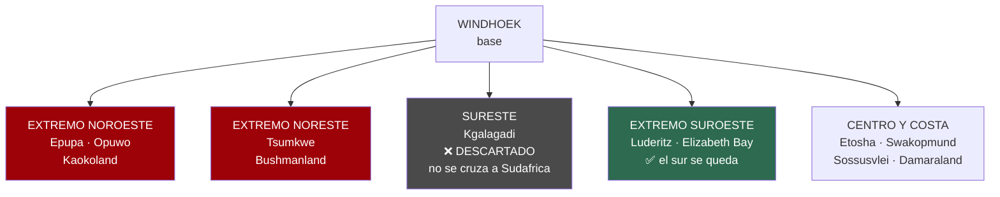
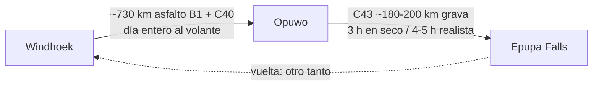
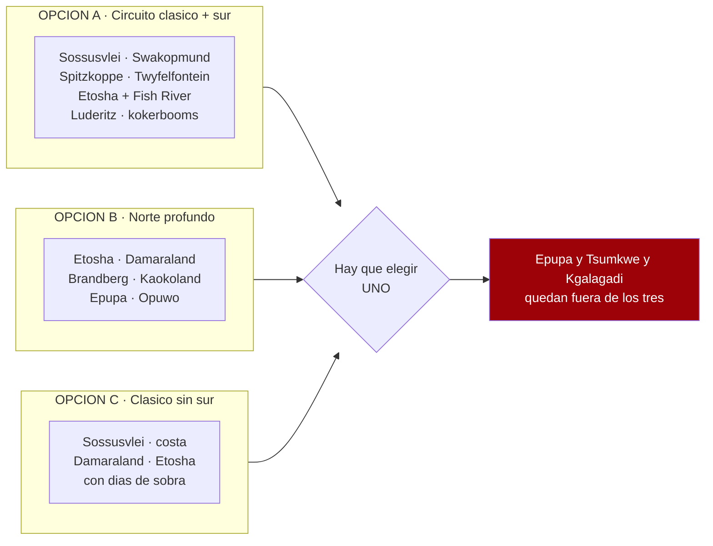
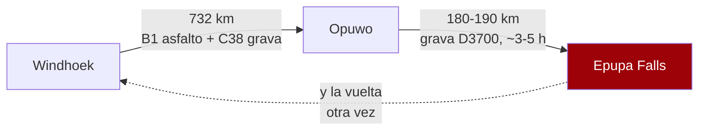
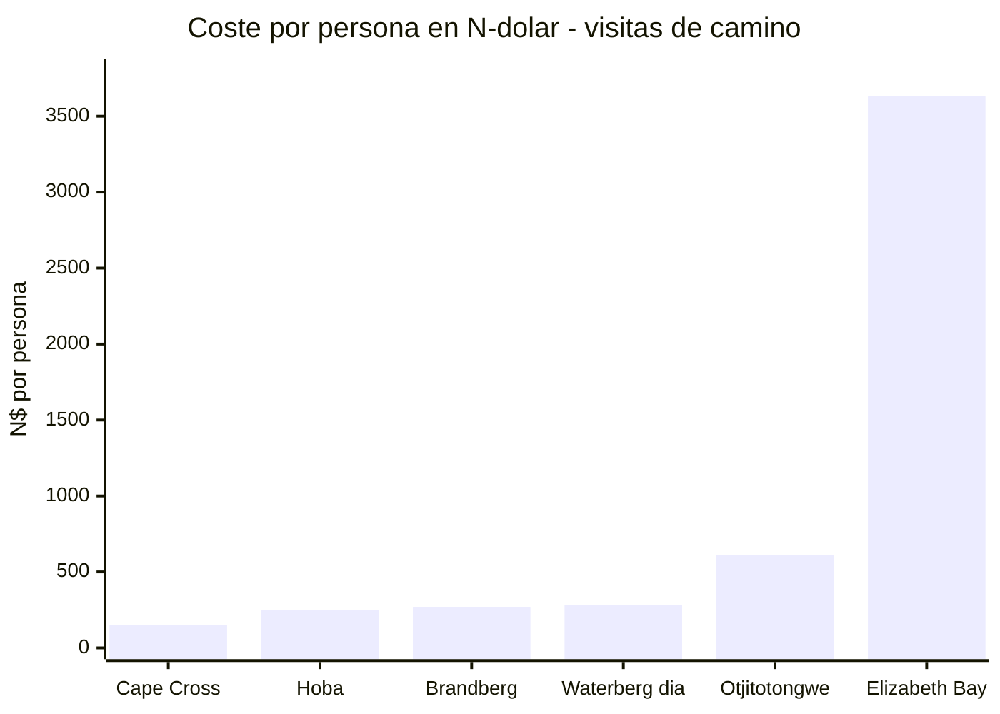

# Tu lista de Google Maps — análisis

34 sitios marcados, aportados por el viajero el 17/07/2026.
**~N$20 = €1** · **✅ verificado** · **◐ secundario** · **⚠️ por verificar**

---

## 🔴 El titular, sin rodeos

> ### Esta lista no cabe en 14 días. Ni de lejos.

Tus pines van desde **Cataratas Epupa** (frontera con Angola, extremo noroeste) hasta **Lüderitz**
(suroeste atlántico), pasando por **Tsumkwe** (extremo este, Bushmanland). Eso es **el país entero**.

**Los extremos son direcciones opuestas desde Windhoek.** No hay circuito que los una en dos
semanas: cada uno es un viaje en sí mismo.

**Decisiones ya tomadas que recortan el mapa** *(actualizado 17/07 — la última manda)*:
- ❌ **El sur se quitó entero** (decisión final): la ruta es la **Variante E**, la clásica del norte
- ❌ **No se cruza a Sudáfrica** → sureste fuera

Esto **no** es una crítica a la lista — es una lista excelente de Namibia. Es una **lista de deseos
de país entero**, y el trabajo ahora es **triar**, no meterlo todo con calzador. Y hay motivos
además del tiempo: tres de tus pines **chocan con cláusulas del seguro ya verificadas**.

---

## 🚨 Tres pines que chocan con lo ya verificado

### 1. Epupa + Opuwo = Kaokoland ✅ — la zona donde tu seguro se cae

Los T&C de Asco (versión 01/06/2026) dicen literalmente que **no pueden garantizar asistencia
técnica en 24 horas** en *«Namibia: Kaokoland and Damaraland»*. Y peor, para
*«Kaokoland and Damaraland: Offroad tracks and Van Zyl's Pass, including official gravel roads
**D3707 and D3703**»*:

> *«The renter will be responsible for all costs (tow-in costs, repairs, and vehicle exchange costs)
> resulting from any damages, including undercarriage damages, damages or breakdowns caused by heavy
> vibrations due to the poor condition of the roads/tracks, or damages and breakdowns caused by
> collisions with large stones or crevices... **EVEN IF THE SUPER COVER IS CHOSEN**.»*

Y el **Super Cover** ya excluye de por sí los bajos *«excluding Kaokoveld and Damaraland Area»*.

> 👉 **Traducción:** en Kaokoland vas **sin cobertura de bajos y sin rescate garantizado**, pagues lo
> que pagues. Y el rescate **no tiene tope** (cláusula 10.5.7: la franquicia elegida *«does not
> limit The Renter's liability for... recovery costs»*).

#### Las cifras que lo descartan ◐

- **Windhoek → Opuwo: ~730 km por carretera** (línea recta ~602 km; «unos 720 km al nornoroeste de
  Windhoek» según la ficha de Opuwo). Es **asfalto casi todo** —B1 al norte y luego Outjo→Kamanjab
  (C40, asfaltado ese tramo)→Opuwo (~203 km)—, pero son **~730 km = un día entero de conducción** solo
  para *llegar al punto de partida* del desvío.
- **Opuwo → Epupa: ~180–200 km por la C43, toda grava.** Los propios lodges la cifran en «unos 200 km,
  unas 3 h» *en seco*; realista **4–5 h** a 80 km/h con vados, lechos secos y ganado. La C43 **se
  degrada en cada temporada de lluvias** y el vado de Okongwati puede cortar horas si baja crecido.
- **Matiz importante (corrige una imprecisión previa):** la ruta normal Opuwo→Epupa es la **C43**, una
  carretera de grava mantenida —**no** las pistas de *offroad* D3707/D3703 (Van Zyl's Pass, ruta oeste
  de Marienfluss) que los T&C de Asco excluyen por su nombre. Aun así **la C43 sigue dentro de
  «Kaokoveld»**, la zona que el Super Cover excluye de cobertura de bajos y de rescate garantizado, así
  que **el argumento del seguro se mantiene** para toda la región.

> 👉 **La aritmética del descarte:** desde el punto más cercano de la ruta prevista (el eje de Etosha /
> Damaraland), Epupa es un **desvío de ~2 días de ida y ~2 de vuelta**, metiéndote **justo en la zona
> sin cobertura**. Con el coche solo 12-13 días útiles (ver `04`), **no cabe** — y no por gusto, sino
> por kilómetros. **Descartado con números.**

**Fuentes** ◐ *(vía WebSearch; no descargadas —el egress de la organización bloquea WebFetch/curl a
todos estos hosts con `403`—, pero las cifras **convergen entre calculadoras independientes y las
páginas de indicaciones de los propios lodges**, y sirven para el descarte, no para navegar):*
[Wikipedia — C43 road](https://en.wikipedia.org/wiki/C43_road_(Namibia)) ·
[Wikipedia — Opuwo](https://en.wikipedia.org/wiki/Opuwo) ·
[geodatos — Windhoek→Opuwo](https://www.geodatos.net/en/distances/from-windhoek-to-opuwo) ·
[Epupa Falls Lodge — road conditions](https://epupafallslodge.com/the-road-less-travelled-road-conditions/) ·
[Epupa Camp — directions](https://epupa.com.na/directions/)

### 2. ~~Mata-Mata / Kgalagadi~~ — ❌ DESCARTADO por decisión del viajero (17/07/2026)

**No se cruza a Sudáfrica.** El **Kgalagadi Transfrontier Park** es sudafricano-botsuano y
**Mata-Mata es el puesto fronterizo** de entrada desde Namibia, así que queda **fuera del viaje**.

**Y es una buena decisión**, porque se evita todo esto:
- **Tasas de frontera**: ✅ verificado en `01` que Asco **excluye** *«cross-border fees»* de la
  tarifa, y Namibia2Go excluye *«Border Fees»* (aunque incluya la documentación del cruce)
- **Autorización escrita del propietario del vehículo** para cruzar, que hay que pedir al reservar
- La duda de si **el seguro sigue vigente** al otro lado
- ✅ El **NAD no sirve en Sudáfrica** (aunque el ZAR sí sirva en Namibia)

👉 Al caer Kgalagadi, **el sureste desaparece del mapa** y los días vuelven al eje que ya está
decidido.

### 3. Elizabeth Bay ⚠️ — zona restringida de diamantes

Está junto a Lüderitz, **dentro del Sperrgebiet** (zona vedada). Como Kolmanskop, ✅ que **exige
permiso** — pero Elizabeth Bay es **más restringido**: no es un sitio al que se entre por libre.
⚠️ **Por verificar**: si hay tours y con qué frecuencia salen.

### ⚠️ Y dos avisos menores

- **Skeleton Coast National Park**: exige permiso, y **el sector norte es solo por concesión** (no
  self-drive). ⚠️ Por verificar qué parte es accesible.
- **Messum Crater**: remoto, sin señalizar, sobre campos de **líquenes** que se dañan con las ruedas.
  ⚠️ Por verificar accesibilidad y si hace falta guía.

---

## 📍 Tu lista, ordenada por geografía

### Extremo noroeste — Kaokoland *(el más caro en tiempo)*
- **Cataratas Epupa** — atracción turística, 4,6★ (398). Río Kunene, frontera con Angola
- **Opuwo** — capital de Kaokoland, base para Epupa
- **Otjitotongwe Cheetah Guestfarm** — alojamiento, 4,0★ (100). Zona de Kamanjab, de camino

### Etosha y alrededores
- **Parque Nacional Etosha** — 4,5★ (4.691)
- **Ongava Private Game Reserve** — Ombika, junto a la **puerta de Andersson** (sur de Etosha).
  Reserva privada de gama alta ⚠️ precio por verificar

### Noreste
- **Hoba Meteorite** — 4,0★ (800). Cerca de Grootfontein. **El meteorito más grande de la Tierra**
- **Tsumkwe** — extremo este, **Bushmanland** (comunidades ju/'hoansi). Muy lejos del resto
- **Harnas Wildlife Foundation** — lodge, 4,5★ (160). Este, zona de Gobabis

### Damaraland y costa norte
- **Twyfelfontein** — *(Google dice «el sitio ya no existe»: es un fallo del listado. El sitio
  UNESCO de grabados rupestres existe y funciona)*
- **Montaña Brandberg** — 4,5★ (38). El pico más alto de Namibia, con la *Dama Blanca*
- **Messum Crater** — 4,9★ (30). Cráter remoto ⚠️ ver aviso arriba
- **Cape Cross Lodge** — hotel 3★, 4,4★ (533). **Colonia de lobos marinos**
- **Skeleton Coast National Park** — 4,4★ (216) ⚠️ ver aviso arriba
- **Spitzkoppe** — 4,7★ (410). El «Matterhorn de Namibia». **Camping comunitario N$270/persona → N$540/noche (~€27)** ◐ *(incluye la entrada a la reserva, N$130 pp; solo efectivo)*

### Costa central
- **Swakopmund** · **Walvis Bay**

### Centro
- **Waterberg** — la meseta
- **Okonjima Nature Reserve** — hotel 4★, 4,7★ (602). **AfriCat**: leopardos y guepardos.
  De camino natural entre Windhoek y Etosha ⚠️ precio por verificar
- **Joe's Beerhouse** — Windhoek, 4,4★ (6.834), 200–400 N$ (~€10–20). Institución de la ciudad

### Namib y Sossusvlei
- **Parque nacional de Namib-Naukluft** — 4,6★ (2.201)
- **Solitaire** — ✅ el salvavidas de combustible del tramo (y su tarta de manzana)
- **Sesriem Canyon** — mirador, 4,4★ (997)
- **Duna 45** — *(Google dice «cerrado permanentemente»: otro fallo del listado. La duna sigue ahí)*
- **Deadvlei** — reserva natural, 4,8★ (1.718). ✅ Requiere dormir **dentro** de la puerta de
  Sesriem para el amanecer (ver `05`)
- **Reserva natural de NamibRand** — 4,7★ (197). **Reserva internacional de cielo oscuro**

### Kalahari y sur
- **Bagatelle Kalahari Game Ranch** — hotel 3★, 4,6★ (738). Kalahari, zona de Mariental
- **Mariental**
- **Mata-Mata @ Kgalagadi** — 4,5★ (410) ⚠️ **SUDÁFRICA**, ver aviso arriba
- **Canyon Roadhouse (Gondwana)** — hotel 3★, 4,6★ (1.318). Fish River ⚠️ precio por verificar
- **Cañón del río Fish** — 4,7★ (72) ✅ **sendero cerrado en noviembre**; mirador sí
- **Quiver Tree Forest** — 3,8★ (51). Keetmanshoop
- **Lüderitz** · **Elizabeth Bay** ⚠️ ver aviso arriba

---

## 🧭 Cómo se tría esto

Los cuatro extremos son **excluyentes entre sí** en 14 días. Hay que elegir **un** eje:

**Lo que encaja «gratis»** — están *de camino* en la Opción A y cuestan poco o nada:
- ✅ **Joe's Beerhouse** (Windhoek, primera o última noche)
- ✅ **Solitaire** (parada obligada de combustible camino de Sossusvlei)
- ✅ **Sesriem Canyon** y **Duna 45** (están dentro del día de Sossusvlei)
- ✅ **Quiver Tree Forest** (14 km de Keetmanshoop, que ya es parada del sur)
- ✅ **Canyon Roadhouse** (es *el* alojamiento clásico de Fish River)
- ✅ **Spitzkoppe** (está entre Swakopmund y Damaraland)
- ✅ **Okonjima** (está justo en el eje Windhoek–Etosha; es una parada natural de vuelta)

**Lo que cuesta un desvío pero es asumible:**
- **Cape Cross** (norte de Swakopmund por la costa)
- **Brandberg** (cerca del eje Spitzkoppe–Twyfelfontein)
- **Waterberg** / **Hoba Meteorite** (eje Windhoek–Etosha, pero suman días)
- **NamibRand** (sur de Sesriem; cielo oscuro espectacular)
- **Bagatelle / Mariental** (Kalahari, en el eje Windhoek–sur)

**Lo que es un viaje aparte:**
- 🔴 **Epupa + Opuwo** (Kaokoland — y sin seguro de bajos)
- 🔴 **Tsumkwe** (Bushmanland, extremo este)
- 🔴 **Mata-Mata / Kgalagadi** (Sudáfrica, cruce de frontera)
- 🔴 **Harnas** (extremo este)
- 🟠 **Messum Crater**, **Skeleton Coast norte**, **Elizabeth Bay** (acceso restringido o guiado)

> **Ojo a la tensión de fondo:** ya está decidido que **el sur se queda** (Fish River, Lüderitz,
> Kolmanskop, kokerbooms). El sur y el noroeste profundo **compiten por los mismos días**. Con el sur
> dentro, **Kaokoland y Epupa quedan fuera** por pura aritmética — y de propina te ahorras la zona
> donde el seguro no cubre.

---

## 🔎 Pines medidos — datos con fuente *(pasada del 17/07/2026)*

Esto cierra la lista de «Lo que hay que verificar» que dejó la pasada anterior. Cada cifra lleva su
fuente y su marca: **✅ primaria** · **◐ secundaria** · **○ práctica común**. Todos los precios en
**N$ y €** (~N$20 = €1; el rand ZAR cotiza ~1:1 con el N$; los importes en US$ se convierten al
cambio aproximado del día, ~N$18,5/US$ y ~€0,92/US$, y se marcan como tales).

### 🎫 Entradas y visitas guiadas *(de camino en la Opción A)*

- **Cape Cross — colonia de lobos marinos** ◐
  - Entrada **~N$150/persona (~€7,5) + ~N$50/coche (~€2,5)**; algunas reseñas citan ~N$80/persona
    → **rango N$80–150**, sin tabla oficial abierta. Solo **efectivo**.
  - **Timing ideal:** el pico de cría es **noviembre-diciembre** (hasta ~210.000 focas) — justo
    vuestras fechas.
  - Acceso por la **C34** al norte de Swakopmund (costa). Gestiona MEFT.
  - Fuentes: [TripAdvisor — Cape Cross](https://www.tripadvisor.com/Attraction_Review-g3650568-d547128-Reviews-Cape_Cross-Erongo_Region.html) ·
    [MEFT — Cape Cross Seal Reserve](https://www.meft.gov.na/national-parks/cape-cross-seal-reserve/214/)

- **Brandberg — la Dama Blanca** ◐
  - **Guía OBLIGATORIO.** El sitio lo gestiona la **comunidad damara** y no se sube sin guía local.
  - **~N$250–270/persona (~€12,5–13,5)**. Caminata de **~3 h ida y vuelta**, poca sombra
    → planificar a primera hora por el calor (ver `08`).
  - Fuentes: [namibweb — Brandberg Mountain Guides](http://www.namibweb.com/brandg.htm) ·
    [TripAdvisor — White Lady](https://www.tripadvisor.com/Attraction_Review-g1182959-d2284289-Reviews-White_Lady-Khorixas_Kunene_Region.html)

- **Hoba Meteorite** ◐
  - **~N$250/persona (~€12,5)** (una reseña de 2024 lo cifra en «22,50 €/extranjero» ≈ N$250).
    Gestiona el **National Heritage Council**.
  - **OJO geografía:** está junto a **Grootfontein**, en el **noreste** — **fuera del eje sur** ya
    decidido. Suma días; no encaja «gratis».
  - Fuente: [TripAdvisor — Hoba Meteorite](https://www.tripadvisor.com/Attraction_Review-g1137965-d3609771-Reviews-Hoba_Meteorite-Grootfontein_Otjozondjupa_Region.html)

- **Waterberg Plateau** ◐/✅
  - **N$280/persona/día (~€14)** — es el **baremo premium del MEFT** vigente desde el **1/04/2026**,
    el mismo que Etosha y Namib-Naukluft (ver `08`).
  - Fuente: [NWR — Waterberg](https://www.nwrnamibia.com/waterberg-prices.htm) ·
    baremo en [08-huecos-cerrados.md](08-huecos-cerrados.md)

- **Otjitotongwe Cheetah Farm** ◐
  - Interacción/alimentación de guepardos. En la **C40, a 24 km de Kamanjab** (eje camino de Etosha
    por la puerta Galton). Alimentación **~15:00** (16:00 en invierno).
  - **~US$33 (~€30; ~N$610)** el paseo (◐, una reseña). Los no alojados deben **avisar antes**;
    cerrado fines de semana según una fuente.
  - Fuente: [namibweb — Otjitotongwe](https://www.namibweb.com/otjitotongwe.htm)

### 🚫 Zonas restringidas y acceso guiado

- **Elizabeth Bay — SOLO con tour guiado** ✅ (Sperrgebiet restringido)
  - **N$3.630/persona (~€182)**, mínimo 2 personas, ~4 h, salidas **08:45 / 13:45** desde Lüderitz.
  - **Requiere copia del pasaporte 10 días antes** (permiso NAMDEB / Policía). Tarifa válida
    **1/01–31/12/2026**.
  - **Kolmanskop** (el que sí encaja fácil): tours **lun-sáb 09:30 y 10:45**, **dom 10:00**; el
    permiso va **incluido en el ticket**.
  - Fuentes: [info-namibia — Elizabeth Bay tour](https://www.info-namibia.com/activities-and-places-of-interest/luederitz/elizabeth-bay-and-diamond-area-tour) ·
    [namibweb — tours de Lüderitz](https://www.namibweb.com/ludtour.htm)

- **Messum Crater — desaconsejado como self-drive turístico** ◐
  - **4x4 imprescindible**; permiso **gratis** en oficina MEFT / Turismo de Henties Bay
    (requisito discutido según foros).
  - **Líquenes extremadamente frágiles:** un 4x4 arrasa **~1 hectárea cada 10 km fuera de pista**
    y crecen **~1 mm/año**. **Máximo 40 km/h, prohibido salir de la rodada.**
  - Circuló un **rumor de cierre al self-drive (2014)** nunca confirmado. **Alto riesgo ecológico**
    → no recomendado para este viaje.
  - Fuentes: [travelnam — Messum Crater](https://travelnam.com/crater-with-a-difference-messum-crater/) ·
    [dangerousroads — Messum](https://www.dangerousroads.org/africa/namibia/5955-messum-crater.html)

- **Skeleton Coast — permiso de tránsito gratis, pero pernocta CERRADA en noviembre** ◐
  - Sector self-drive: **entre las puertas de Ugabmund (sur) y Springbokwasser (este)**. El
    **permiso de tránsito es gratis** y se saca en la propia puerta.
  - Puertas **07:30–19:00**; **no se entra después de las 15:00** sin reserva confirmada.
  - **Torra Bay abre solo diciembre-enero → CERRADO a finales de noviembre.** Terrace Bay
    (NWR) abre todo el año, pero pernoctar exige **reserva previa**.
  - Fuentes: [NWR — Skeleton Coast](https://www.nwrnamibia.com/skeleton-coast-national-park.htm) ·
    [TripAdvisor — permits & gate times](https://www.tripadvisor.com/ShowTopic-g479222-i25768-k8459916-Driving_permits_and_gate_opening_times-Skeleton_Coast_National_Park_Khomas_Region.html)

- **NamibRand — no es self-drive libre** ◐
  - **Día:** ~US$10–20/persona (~€9–18; ~N$185–370). **Alojados:** tasa de conservación **por cama
    y día** que cobra el lodge (sistema de concesiones). El acceso general va **vía alojamiento**,
    no como pista abierta.
  - Fuentes: [NamibRand — Tourism](https://www.namibrand.com/tourism.html) ·
    [takeyourbackpack — NamibRand](https://www.takeyourbackpack.com/backpacking-in-namibia/visit-namibrand-nature-reserve/)

### 🛏️ Los que resultaron ser LUJO *(fuera de gama media)*

Se pedía saber si Ongava y Okonjima son gama media o lujo. **Respuesta: lujo.** Se apuntan para
descartarlos del presupuesto de gama media.

- **Ongava** (junto a la puerta de Andersson) — **LUJO** ◐
  - Desde **~R17.307 ≈ N$17.300 (~€865) por persona/noche** en pensión completa; oferta puntual
    **~N$10.950 (~€548)**. Mínimo 2 noches.
  - Fuente: [siyabona — Ongava Tented Camp](https://www.siyabona.com/pricing_safari-lodge-ongava-tented-camp.html)

- **Okonjima / AfriCat** (eje Windhoek–Etosha) — **gama alta** ◐
  - Desde **~US$684 ≈ N$12.700 (~€630) por persona/noche** en pensión completa (Bush Camp,
    jul-dic 2026). El **Plains Camp** (media pensión) es más barato pero **sigue siendo gama alta**.
    Es una parada lógica del eje, pero no es camping ni gama media.
  - Fuentes: [Okonjima — Rack Rates 2026 (PDF)](https://okonjima.com/wp-content/uploads/2025/12/Okonjima-Rack-Rates-2026.pdf) ·
    [Okonjima — rates](https://okonjima.com/rates/)

- **Bagatelle Kalahari** (eje Windhoek–sur, cerca de Mariental) — **gama media-alta** ◐
  - Desde **~R6.400 ≈ N$6.400 (~€320) la noche para 2** en media pensión; tiene **camping** más
    barato. Encaja como primera/última noche del eje sur si se quiere una noche de dunas rojas.
  - Fuente: [lekkeslaap — Bagatelle rates](https://www.lekkeslaap.co.za/accommodation/bagatelle-kalahari-game-ranch/rates)

### 📏 Kaokoland (Epupa + Opuwo) — el descarte, ahora CON números ◐

- **Windhoek → Opuwo:** **732 km** por carretera (Google ~9h15). B1 asfalto hasta Otjiwarongo,
  luego **C38/grava**.
- **Opuwo → Epupa:** **180–190 km de grava por la D3700** (~3–5 h), cruzando cauces secos.
- **Ida y vuelta a Kaokoland = ~4 días SOLO de conducción** desde Windhoek, **sin contar Etosha**.
  Con el sur dentro (Fish River + Lüderitz), **no cabe**: es aritmética, no gusto.
- **Y de propina, el seguro:** las pistas **D3700 / D3703 / D3707** de Kaokoland-Damaraland son justo
  donde el contrato de Asco **no cubre bajos ni garantiza rescate** aunque pagues Super Cover
  (ver `01` y `05`). Doble motivo para dejarlo fuera.
- Fuentes: [trippy — Windhoek↔Opuwo](https://www.trippy.com/distance/Windhoek-to-Opuwo) ·
  [Epupa Camp — directions](https://epupa.com.na/directions/)

---

## 💶 Coste por persona de las visitas «de camino» *(las baratas)*

Las entradas que sí encajan en la Opción A son **calderilla** comparadas con un tour del Sperrgebiet.
El contraste, de un vistazo (N$/persona):

> **Lectura:** Cape Cross, Brandberg y una tasa de parque son ~N$150–280 (~€7–14) por cabeza. El
> tour de **Elizabeth Bay dispara a N$3.630 (~€182)** — es la única visita «cara» de la lista, y
> encima con papeleo de 10 días. Si el sur va apretado, es el primer candidato a caer.

---

## 🕳️ Lo que SIGUE sin cerrarse *(honesto)*

- **Cape Cross:** el **tramo exacto** de la tabla MEFT (¿N$80 o N$150?) no se pudo verificar contra
  el PDF primario (bloqueado). Rango N$80–150.
- **Okonjima Plains Camp:** el número fino de la media pensión no salió por fragmento (el PDF de
  tarifas está publicado pero no se pudo abrir aquí).
- **Waterberg (camping NWR):** la tasa de **parcela** (distinta de la entrada de N$280) no se
  extrajo; solo la entrada.
- **Kgalagadi:** descartado por decisión del viajero — no se investiga si Asco autoriza el cruce.
- **Messum Crater:** el **estado real de apertura al self-drive** (tras el rumor de cierre de 2014)
  no se pudo confirmar con fuente oficial → tratar como **incierto**.
