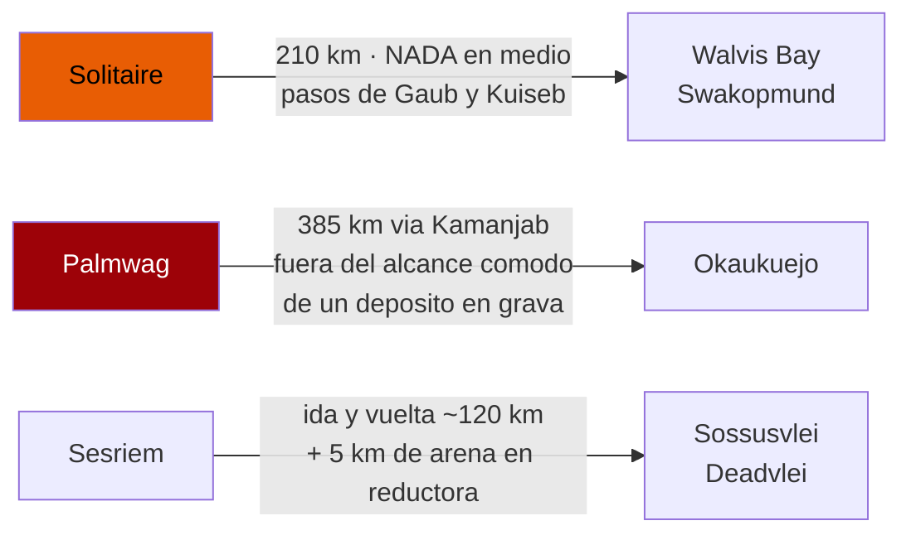
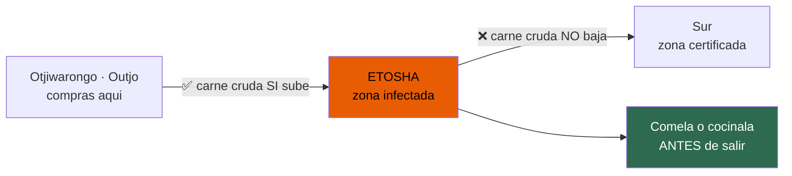

# Logística de carretera — documento profundo

Combustible, distancias, agua, comida, cobertura, dinero y emergencias.
**~N$20 = €1** (17/07/2026) · **✅ primaria** · **◐ secundaria** · **○ práctica común sin fuente**

---

## ⛽ Combustible

### El precio, y por qué el que leas hoy no te vale ◐

**Bajada del 3 de julio de 2026** (a medianoche), anunciada por el ministro de Industrias, Minas y
Energía, Modestus Amutse:

- **Gasolina 95** — **N$22,48/l (~€1,12)** *(baja N$1,00)*
- **Diésel 50 ppm** — **N$24,26/l (~€1,21)** *(baja N$4,00)*
- **Diésel 10 ppm** — **N$24,36/l (~€1,22)** *(baja N$4,00)*

> ### ⚠️ Dos avisos que invalidan esa cifra para tu viaje
>
> **1. Son precios de WALVIS BAY.** Namibia fija **un precio base nacional en el puerto** de Walvis
> Bay y luego **suma un diferencial de transporte** por cada pueblo del interior. Windhoek,
> Solitaire, Sesriem, Khorixas y Palmwag son **todos más caros**.
> **No se pudo obtener la tabla oficial de diferenciales** (mme.gov.na no respondía el 16/07/2026),
> así que **no hay cifra exacta para Windhoek ni Solitaire**. 👉 **No dejes que nadie te dé un precio
> preciso de una estación remota sin enseñarte el boletín oficial.**
>
> **2. Namibia revisa el precio CADA MES.** La cifra de julio **no vale para finales de noviembre**.
> Solo en 2026 los precios han pegado bandazos: **+N$2,50 gasolina / +N$4,00 diésel el 1 de abril**,
> más subidas en mayo y junio, y **esta bajada de N$4,00 en julio**.
>
> **3. Y hay riesgo al alza:** el «emergency coordinated fuel supply arrangement» del Gobierno —que
> compra al Basic Fuel Price sin primas de importación— **solo dura de julio a septiembre de 2026**.
> **Caduca antes de tu viaje.**

**Para presupuestar:** **N$25–27/l (~€1,25–1,35)** de diésel en el interior, **como estimación, no
como dato**. 👉 **Recomprueba la semana antes de salir.**

**Cálculo del viaje** *(aritmética nuestra, no cifra de fuente)*: un Hilux doble cabina cargado en
**2.800–3.200 km** mixtos de asfalto y grava, a **~11–13 l/100 km**, quema **~350–400 l** →
**~N$9.000–10.500 (~€450–525)**.

Fuente: https://observer24.com.na/govt-cuts-fuel-prices-unveils-import-overhaul-after-n1-3bn-relief-bill/

### ❌ El mito de la tarjeta — corregido

> ### La gasolinera SÍ acepta tarjeta. Lo que no acepta es «a crédito».

**Refutado 0–2.** El bulo nace de leer mal al Namibia Tourism Board:

- Lo que **de verdad** dice: *«Please note, service stations **do not accept credit for petrol**»*
- En inglés del sur de África, *«credit»* en una gasolinera = **comprar a cuenta / con tarjeta de
  carburante de la vieja escuela**. **No** significa tarjeta de crédito.
- **La misma página** dice: *«American Express, Diners Club, MasterCard and Visa are accepted»*
- **La Payment Association of Namibia** (licenciada por el Banco de Namibia) publicó en **abril de
  2010** un comunicado titulado *«USE OF CREDIT AND DEBIT CARDS FOR FUEL PURCHASES IN NAMIBIA»*
  anunciando que **se descontinuaban las petrol cards** y que el público **podría pagar el
  combustible con tarjeta**

**Pero lleva efectivo igual**, por razones prácticas y no por la norma: datáfonos caídos, enlaces
por satélite fuera de servicio, sitios remotos. **Un depósito de 80 l a ~N$26/l son ~N$2.080 (~€104)
por repostaje.**

👉 Pregunta a Asco **por escrito** si su tarjeta de combustible sirve **en Solitaire y en Palmwag
concretamente**, no «en Namibia».

### Te sirven ellos, y se propina ○

**Ninguna gasolinera namibia es de autoservicio.** Un empleado te atiende, llena, y suele ofrecerse a
mirar aceite, agua, presiones y limpiar el parabrisas. **No te bajes a coger la manguera**: no se
hace y no está permitido.

> 🛑 **Di «DIESEL» claramente y confirma que el surtidor marca diésel antes de que empiece a salir.**
> Equivocar el combustible en un Hilux de alquiler **no lo cubre ningún nivel de seguro** y es un
> error catastrófico que termina el viaje.

- **Propina habitual: ~N$5 (~€0,25)**, hasta **N$10 (~€0,50)** si te hace ruedas y parabrisas
- Lleva monedas y billetes pequeños **en el hueco de la puerta** para esto: lo harás **10–15 veces**
  en el circuito → **~N$100 (~€5) en total**. Dinero trivial que compra buena voluntad real
- 👉 **Pídeles que miren las presiones en CADA parada**: es tu defensa más barata contra las
  exclusiones de neumáticos y bajos del seguro (ver `05`)

---

## 📏 Distancias reales y los tramos sin gasolinera ◐

Distancias **por carretera** (km), de la matriz de Namibia Tours & Safaris:

**Eje Windhoek – desierto**
- Windhoek → Solitaire **300** · Windhoek → Sesriem **320** · Sesriem → Solitaire **90**
- Sesriem → Sossusvlei **60** *(cada trayecto, DENTRO del parque)*
- Sesriem → Walvis Bay **270** · Sesriem → Swakopmund **300**
- Solitaire → Walvis Bay **210** · Solitaire → Swakopmund **210**
- Windhoek → Swakopmund **360**

**Eje costa – Damaraland**
- Swakopmund → Uis **190** · Swakopmund → Twyfelfontein **400**
- Uis → Khorixas **115** · Khorixas → Twyfelfontein **100**
- Khorixas → Palmwag **170** · Palmwag → Kamanjab **120**

**Eje Etosha**
- Kamanjab → Okaukuejo **265** · Palmwag → Okaukuejo **385**
- Outjo → Okaukuejo **120** · Otjiwarongo → Outjo **75**
- Okaukuejo → Halali **70** · Halali → Namutoni **~70**
- Okaukuejo → Windhoek **440**

> ⚠️ **Aviso de antigüedad:** la matriz tiene **copyright de septiembre de 2010**. Las distancias por
> carretera cambian poco, pero **verifícalas** contra Tracks4Africa o GPS actual.

### 🚨 Los tramos peligrosos

1. **Solitaire → Walvis Bay/Swakopmund (210 km)**: los pasos de **Gaub** y **Kuiseb** con **NADA** en
   medio — sin combustible, sin tienda, tráfico mínimo
2. **Sesriem → Sossusvlei ida y vuelta**: son **~120 km MÁS los 5 km finales de arena blanda en
   reductora**, todo dentro del parque, **sin gasolinera** y con **consumo alto en arena** →
   presupuesta **130–150 km de combustible que quizá no habías contado**
3. **Palmwag → Okaukuejo (385 km)** vía Kamanjab: **más allá del alcance cómodo de un solo depósito
   en grava** para algunos vehículos
4. **Khorixas → Palmwag → Damaraland**: suministro escaso y poco fiable

### La regla

> ### 👉 «Nunca pases de largo una gasolinera», no «reposta cuando estés bajo»

**Puntos de anclaje**: **Solitaire · Khorixas · Kamanjab · Outjo · Otjiwarongo**.
Llena en **todos**, mires lo que mires en el indicador.

⚠️ **Y con el límite contractual de 80 km/h en grava**, Palmwag → Okaukuejo es un día de **5–6 horas,
no de 4** — planifica llegar mucho antes del anochecer (las puertas de Etosha cierran al ocaso).

○ **Sin confirmar**: hay reportes de **falta de combustible dentro de los campamentos de los
parques**. Planifica como si fuera cierto. No se pudo verificar.

---

## 🥩 La Línea Roja veterinaria ◐

Doble valla de **1.250 km** que separa el norte (con fiebre aftosa) del sur certificado para
exportación. **Corre por el límite SUR de Etosha.**

> ⚠️ **Ojo a la dirección: hay una web muy citada de Etosha que lo cuenta AL REVÉS.**

- **PUEDES** subir carne cruda y lácteos sin pasteurizar **hacia** la zona infectada
- **NO PUEDES** sacarlos de ella: **te los confiscan y destruyen** en el control
- **Controles de tu ruta**: límite **sur de Etosha**, y **Palmwag** bajando a Damaraland
- La carne **cocinada** suele pasar; envasados al vacío comerciales y **biltong**, normalmente bien
- **La aplicación varía**

👉 **Plan:** compra el braai en **Otjiwarongo subiendo**, y **cómetelo o cocínalo todo antes de salir
de Etosha hacia el sur**. No llenes la nevera de filetes crudos para la vuelta.
**Declara siempre**: al turista que declara **no se le multa**, pero **saltarse un control
veterinario es delito**. Para cuando te lo indiquen.

Fuente: https://blog.tracks4africa.co.za/veterinary-fences-in-namibia-and-botswana/

---

## 📱 Cobertura: MTC, y los silencios reales ◐

**MTC tiene ~80 % de cuota** y de largo la mayor huella rural. **TN Mobile** (Telecom Namibia) es más
barata pero con cobertura **notablemente peor** fuera de los pueblos.
👉 **Para un self-drive, MTC es la elección correcta, y no está reñido.**

- **SIM prepago MTC** con bono turista **«Aweh»** — **~N$100–200 (~€5–10)** por ~5–10 GB semanales,
  mucho más barato por GB que una eSIM de viaje
- **Dónde**: kiosco de MTC en el **aeropuerto Hosea Kutako** *(cierra ~21:00 — si tu vuelo llega
  tarde, ahí no la coges)*; en Windhoek: **Maerua Mall**, **Wernhil Park**, o supermercados
  **Pick n Pay / OK**
- 🛂 **El registro de la SIM es OBLIGATORIO** por normativa CRAN (en vigor desde el 1/01/2023): hay
  que registrarla **en persona con el PASAPORTE**. Tarda ~10–15 min y es gratis.
  **Ya no hacen falta biométricos.**
- **eSIM**: MTC comercializa eSIM, **pero su portal está pensado para namibios que viajan al
  extranjero** — no des por hecho que sirve para visitantes. Airalo y similares sí funcionan y se
  activan antes de aterrizar, con sobreprecio.

> ⚠️ **Hueco honesto:** **no se pudieron verificar** los precios actuales de los bonos turistas de
> MTC ni el de la eSIM directamente (su web de eSIM falló la verificación TLS y las páginas de
> prepago no respondían). **Los N$100–200 son orientativos.**

### 🔇 Dónde NO hay señal — planifica silencio de verdad

- La zona de dunas de **Sossusvlei/Namib**
- **Casi todo Damaraland**
- **La carretera de los pasos Solitaire → Walvis Bay**
- **Skeleton Coast** · **Kaokoland**
- **Casi toda Etosha** lejos de los campamentos

**Sesriem, Solitaire y los campamentos de Etosha** tienen cobertura **irregular en el mejor caso**.

> ### 👉 La consecuencia
> Para una pareja sola, con las exclusiones del seguro en accidentes sin terceros, **un comunicador
> satelital con SOS (Garmin inReach o similar) no es un lujo en este itinerario**.
> En los tramos **Solitaire–Walvis Bay** y **Palmwag–Kamanjab**, el móvil **es una cámara, no un
> salvavidas**.

---

## 💵 Dinero

**Posición oficial del Namibia Tourism Board:** *«The Namibian Dollar is the official currency and is
fixed to and equals the South African Rand. These currencies can be used freely in Namibia, but the
Namibian Dollar is not legal tender in South Africa.»*

> ### ⚠️ La asimetría: el ZAR vale en Namibia, el NAD NO vale en Sudáfrica
> Importa **si haces escala en Johannesburgo o Ciudad del Cabo**: el rand se gasta en Namibia a 1:1,
> pero **tus dólares namibios sobrantes no valen nada en cuanto sales**.
> 👉 **Gástalos o cámbialos ANTES de volar**, en el aeropuerto si hace falta.

- **Tarjetas**: Amex, Diners, Mastercard y Visa se aceptan en hoteles, restaurantes, centros
  comerciales y tiendas grandes de **Windhoek, Swakopmund y Walvis Bay**
- **Bancos**: Standard Bank, FNB, Nedbank y Bank Windhoek operan en todo el país, cambian divisa y
  tienen cajeros. Usa **cajeros pegados a una sucursal, de día, mejor dentro de un centro comercial**
- Los **cheques de viaje** ya casi no se aceptan

### Cuánto efectivo

Tus restricciones reales:
- **Combustible**: en la práctica, efectivo → **~N$2.000 (~€100) por depósito**
- **Tasas de parque**: ~N$280 (~€14)/adulto/día **más vehículo, por parque**
- **Lodges remotos, campings y puestos de artesanía**: efectivo
- **Propinas**

> **Plan:** saca efectivo en **Windhoek** y recarga en **Swakopmund** y **Otjiwarongo** — los últimos
> cajeros fiables antes de Damaraland y Etosha. **Nunca dejes que la reserva baje de ~N$4.000
> (~€200)** entrando en tramos remotos.
>
> ❌ **No cuentes con encontrar un cajero que funcione en Khorixas, Kamanjab, Solitaire ni Sesriem.**
>
> Lleva el efectivo **en dos sitios distintos del coche**, no todo en una cartera.

Y recuerda: **visado N$1.600 (~€78)** y **referencia de fondos ~N$1.200 (~€60)/día** — lleva pruebas.

❌ **Refutado 0–2** el envoltorio de este punto (algún umbral «oficial» que la fuente no sostiene),
**no la cita del NTB ni la asimetría NAD/ZAR**, que son correctas.

---

## 🚑 Emergencias

> ### ⚠️ La trampa del 10111
> **No es un número corto nacional** que puedas marcar del tirón desde un móvil: **va precedido de
> prefijo de zona** — Windhoek = **+264 61 10111** — y **el prefijo cambia por región**.
> 👉 **Graba el número completo en formato internacional, no «10111».**

**Rescate y ambulancia** *(lista de un proveedor de Namibia Health Plan, con fecha 13/02/2024 —
⚠️ verificar al llegar)*:

- **E-Med Rescue 24** *(todos los centros principales del país)* — gratuito **924**, también
  **081 924** / **083 924** / **061 411 600**
- **Lifelink Emergency Services** *(centros principales + ambulancia aérea nacional)* — **999** desde
  fijo / **064 500 346**
- **Medical Rescue Africa** *(ambulancia aérea nacional)* — **912** nacional /
  **+264 8333 900 33** / **+264 81 129 4973** internacional
- **International SOS Namibia** *(viajeros internacionales)* — **081 129 3137**
- **Crisis Response** *(larga distancia + vuelos de misericordia)* — **081 881 8181** /
  **061 303 395** / **083 3912**
- **MR 24/7** *(Otjiwarongo, Tsumeb, Windhoek, vuelos de misericordia)* — **085 956** /
  **061 255 676** / **081 257 1810**
- **Costa** *(Swakopmund/Walvis Bay/Arandis/Henties Bay)*: St Gabriel Ambulance **085 955** /
  **081 124 5999**; Code Red **085 9900**
- **Swakopmund y Walvis Bay**, emergencia local — **922**
- **City of Windhoek Emergency Services** — **061 211 111**
- **Aeromed** rescate aéreo, Otjiwarongo — **081 129 6300** / **081 129 6700**, oficina **067 302 411**

👉 **Guárdalos OFFLINE** — como contactos **y en papel en la guantera** — porque los vas a necesitar
**justo donde no hay señal para buscarlos**.

Y de `05`: **MVA Fund 9682** (gratuito), organismo estatutario que cubre a **cualquier** herido en
accidente de tráfico **sin importar nacionalidad ni culpa**.

---

## 🏥 La realidad médica ✅

### El hospital más cercano a Etosha

**Mediclinic Otjiwarongo** — Son Street, Otjiwarongo · **+264 67 303 734** / **+264 67 303 542**
Urgencias: **0800 100 100** o **911** (dentro de Namibia).
Su propia web dice que llevan **30 años** atendiendo a las comunidades **y a los turistas** de la
zona de Etosha.

- **Okaukuejo → Otjiwarongo: ~190 km** = **2,5–3 h por carretera**… **y eso después de salir del
  parque**, cuyas **puertas están cerradas entre el ocaso y el amanecer**
- **Tsumeb** tiene centros privados y está a **~110 km de Namutoni**

### El más cercano a Sossusvlei: la verdad incómoda

> ### ❌ **No hay hospital cerca de Sesriem.**
> Windhoek está a **~320 km** y Walvis Bay a **~270 km**, ambos **4+ horas** sobre grava a tu
> límite contractual de 80 km/h.
>
> **Un trauma grave en Sossusvlei significa evacuación aérea, o significa muchísimo tiempo.**

**Por eso, tres cosas encajan en una sola:**
1. Tu seguro con **REPATRIACIÓN** —que además es **condición de entrada**— **no es papeleo**.
   👉 **Confirma por escrito que cubre evacuación AÉREA dentro del país desde una pista remota**, no
   solo el vuelo de vuelta a casa desde Windhoek.
2. La **exclusión del vuelco sin terceros** en los niveles bajos y la exposición de **~N$165.000
   (~€8.250)** es **el mismo evento** que te mete en una ambulancia aérea.
3. Un **dispositivo satelital con SOS** es lo que **dispara el rescate** donde no hay cobertura.

**Atención definitiva para algo grave: Windhoek** — Windhoek Central Hospital **061 203 9111**;
privados: Lady Pohamba, Roman Catholic, Mediclinic Windhoek.

⚠️ Los hospitales públicos namibios están **tensionados**; los privados **te pedirán prueba de pago o
garantía del seguro por adelantado**. 👉 **Lleva en papel el número de póliza y la línea 24 h de tu
aseguradora.**

Fuente: https://www.mediclinic.co.za/en/otjiwarongo/home.html

---

## 🕳️ Lo que no se pudo verificar

- **Precio exacto del combustible** en Windhoek, Solitaire o cualquier estación del interior: la
  tabla oficial de diferenciales del MME no respondía
- **Precios actuales de los bonos turistas de MTC** y de la eSIM: sus páginas no respondían
- **Disponibilidad de combustible dentro de los campamentos de parques**: reportes sin confirmar
- **La matriz de distancias es de 2010**: verificar contra Tracks4Africa
- **La lista de emergencias es de febrero de 2024**: verificar al llegar
