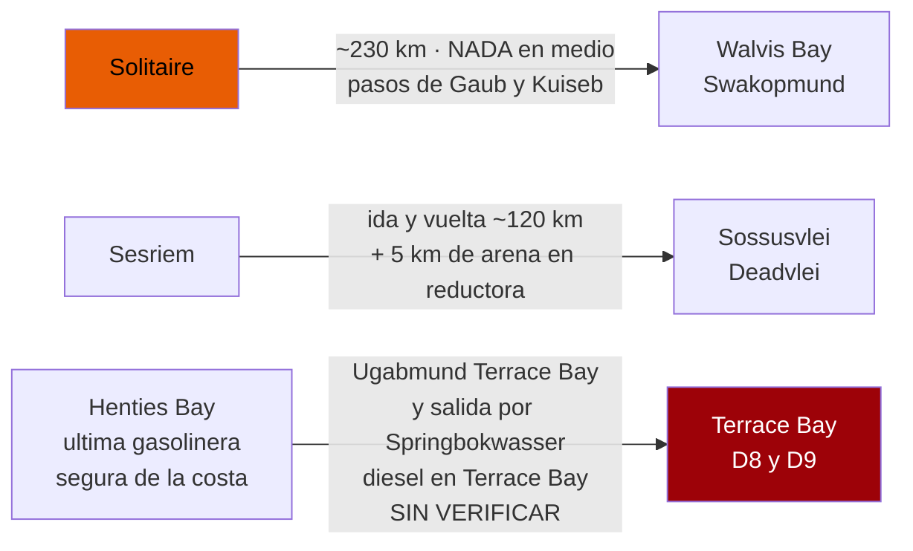
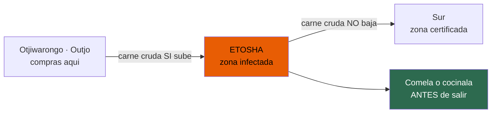

# 07 · Logística de carretera

> **Namibia · 30 oct – 15 nov 2026 · la clásica del norte** — [← índice del dossier](README.md)
>
> Combustible, distancias, dinero, cobertura y emergencias — el documento que se consulta con el coche en marcha.
>
> **~N$20 = €1** *(rango 19,5–20,5)* · **✅** fuente primaria · **◐** secundaria concordante ·
> **○** práctica común, sin fuente · **❌** sin verificar, dicho en blanco
>
> *Investigación cerrada el 17/07/2026 · formato y contenido revisados el 09/08/2026 · precio del
> combustible actualizado a la revisión del 5 ago 2026*

---

## ⛽ Combustible

### El precio, y por qué el que leas hoy no te vale ◐

**Bajada del 3 de julio de 2026** (a medianoche), anunciada por el ministro de Industrias, Minas y
Energía, Modestus Amutse:

- **Gasolina 95** — **N$22,48/l (~€1,12)** *(baja N$1,00)*
- **Diésel 50 ppm** — **N$24,26/l (~€1,21)** *(baja N$4,00)*
- **Diésel 10 ppm** — **N$24,36/l (~€1,22)** *(baja N$4,00)*

**Y ya subió otra vez: revisión del 5 de agosto de 2026 (+N$2,00/l en todas las calidades) ◐** al
restituirse cuatro gravámenes que se habían recortado un 50 % durante tres meses (y con el barril de
diésel 50 ppm subiendo de ~US$120 a ~US$141). Aplicando el +N$2,00 a las cifras de julio, la costa
queda en:

- **Diésel 50 ppm** — **~N$26,26/l (~€1,31)**
- **Diésel 10 ppm** — **~N$26,36/l (~€1,32)**

*(◐ — la subida y su fecha convergen en varias búsquedas, pero thebrief.com.na y el boletín del MME
devuelven 403 aquí, así que el precio de bomba exacto no se ha leído del primario. El «emergency
coordinated fuel supply arrangement» que había contenido los precios expiraba en septiembre: esta
subida es justo esa presión al alza que ya se avisaba abajo, materializándose.)*

> ### ⚠️ Dos avisos que invalidan esa cifra para tu viaje
>
> **1. Son precios de WALVIS BAY.** Namibia fija **un precio base nacional en el puerto** de Walvis
> Bay y luego **suma un diferencial de transporte** por cada pueblo del interior. Windhoek,
> Solitaire, Sesriem, Khorixas y Palmwag son **todos más caros**.
> **No se pudo obtener la tabla oficial de diferenciales** (mme.gov.na no respondía el 16/07/2026),
> así que **no hay cifra exacta para Windhoek ni Solitaire**. 👉 **No dejes que nadie te dé un precio
> preciso de una estación remota sin enseñarte el boletín oficial.**
>
> **2. Namibia revisa el precio CADA MES.** La cifra de julio **no vale para tu quincena de noviembre**.
> Solo en 2026 los precios han pegado bandazos: **+N$2,50 gasolina / +N$4,00 diésel el 1 de abril**,
> más subidas en mayo y junio, y **esta bajada de N$4,00 en julio**.
>
> **3. Y hay riesgo al alza:** el «emergency coordinated fuel supply arrangement» del Gobierno —que
> compra al Basic Fuel Price sin primas de importación— **solo dura de julio a septiembre de 2026**.
> **Caduca antes de tu viaje.**

**Para presupuestar (tras la subida de agosto):** **N$26–29/l (~€1,30–1,45)** de diésel en el
interior, **como estimación, no como dato**. 👉 **Recomprueba la semana antes de salir.**

**Cálculo del viaje** *(aritmética nuestra, no cifra de fuente; actualizado a la ruta del viaje)*: el
Ford doble cabina cargado en los **~2.798 km de la ruta** (control OSRM, rehecho el 24/08
con las dos noches en Onguma y Damaraland partido en dos), a
**~11–13 l/100 km**, quema **~308–364 l** → banda **N$8.002–10.549 (~€400–527)**, central
**~N$9.066 (~€453)** con el diésel a N$27/l de agosto *(era menos con el precio de julio)*.
**Se presupuesta ~N$9.100 (~€455) — €228 por persona**; el detalle, en `02`. *(El cálculo antiguo de ~N$9.000–10.500 era para los
2.800–3.200 km de la ruta con el sur.)*

Fuentes: [rebaja de julio](https://observer24.com.na/govt-cuts-fuel-prices-unveils-import-overhaul-after-n1-3bn-relief-bill/) ·
[subida de N$2,00/l del 5 ago 2026](https://thebrief.com.na/2026/07/fuel-prices-to-rise-by-n2-00-a-litre-as-government-restores-levies/) *(403 aquí; vía fragmento del buscador)*

### ❌ El mito de la tarjeta — corregido

> ### La gasolinera SÍ acepta tarjeta. Lo que no acepta es «a crédito».

**Refutado 0–2.** El bulo nace de leer mal al Namibia Tourism Board:

- Lo que **de verdad** dice: *«Please note, service stations **do not accept credit for petrol**»*
- En inglés del sur de África, *«credit»* en una gasolinera = **comprar a cuenta / con tarjeta de
  carburante de la vieja escuela**. **No** significa tarjeta de crédito.
- **La misma página** dice: *«American Express, Diners Club, MasterCard and Visa are accepted»*
- **La Payment Association of Namibia** (licenciada por el Banco de Namibia) publicó en **abril de
  2010** un comunicado titulado *«USE OF CREDIT AND DEBIT CARDS FOR FUEL PURCHASES IN NAMIBIA»*
  anunciando que **se descontinuaban las petrol cards** y que el público **podría pagar el
  combustible con tarjeta**

**Pero lleva efectivo igual**, por razones prácticas y no por la norma: datáfonos caídos, enlaces
por satélite fuera de servicio, sitios remotos. **Un depósito de 80 l a ~N$26/l son ~N$2.080 (~€104)
por repostaje.**

👉 Pregunta a **Savanna** *(tu proveedor)* **por escrito** si tienen tarjeta o acuerdo de
combustible y si sirve **en Solitaire y en Henties Bay concretamente**, no «en Namibia».

### Te sirven ellos, y se propina ○

**Ninguna gasolinera namibia es de autoservicio.** Un empleado te atiende, llena, y suele ofrecerse a
mirar aceite, agua, presiones y limpiar el parabrisas. **No te bajes a coger la manguera**: no se
hace y no está permitido.

> 🛑 **Di «DIESEL» claramente y confirma que el surtidor marca diésel antes de que empiece a salir.**
> Equivocar el combustible en un coche de alquiler **no lo cubre ningún nivel de seguro** y es un
> error catastrófico que termina el viaje.

- **Propina habitual: ~N$5 (~€0,25)**, hasta **N$10 (~€0,50)** si te hace ruedas y parabrisas
- Lleva monedas y billetes pequeños **en el hueco de la puerta** para esto: lo harás **10–15 veces**
  en el circuito → **~N$100 (~€5) en total**. Dinero trivial que compra buena voluntad real
- 👉 **Pídeles que miren las presiones en CADA parada**: es tu defensa más barata contra las
  exclusiones de neumáticos y bajos del seguro (ver `06`)

---

## 📏 Distancias reales y los tramos sin gasolinera ◐

**Los kilómetros de cada etapa están en [`01`](01-itinerarios-dia-a-dia.md) y el cálculo de tiempos
en [`13`](13-itinerario.md).** Lo que importa aquí es dónde **no** hay gasolinera:

### 🚨 Los tramos peligrosos

```mermaid
flowchart LR
    S["Solitaire"] -->|"~230 km · NADA en medio<br/>pasos de Gaub y Kuiseb"| W["Walvis Bay<br/>Swakopmund"]
    SE["Sesriem"] -->|"ida y vuelta ~120 km<br/>+ 5 km de arena en reductora"| D["Sossusvlei<br/>Deadvlei"]
    H["Henties Bay<br/>ultima gasolinera<br/>segura de la costa"] -->|"Ugabmund Terrace Bay<br/>y salida por Springbokwasser<br/>diesel en Terrace Bay<br/>SIN VERIFICAR"| T["Terrace Bay<br/>D8 y D9"]
    style S fill:#e85d04,color:#000
    style T fill:#9d0208,color:#fff
```

1. **Solitaire → Walvis Bay (~230 km, OSRM)**: los pasos de **Gaub** y **Kuiseb** con **NADA** en
   medio — sin combustible, sin tienda, tráfico mínimo
2. **Sesriem → Sossusvlei ida y vuelta**: son **~120 km MÁS los 5 km finales de arena blanda en
   reductora**, todo dentro del parque, **sin gasolinera** y con **consumo alto en arena** →
   presupuesta **130–150 km de combustible que quizá no habías contado**
3. **El bucle de la Costa de los Esqueletos (D8–D9):** Henties Bay → Cape Cross → Ugabmund →
   **Terrace Bay**, y al día siguiente Springbokwasser → Bergsig → Twyfelfontein → Hoada.
   **En Terrace Bay HAY surtidor físico (reportes de viajeros) ◐, pero la web oficial de NWR no
   lo lista, se quedó seco en los cortes de 2025 y alguna guía lo da «solo huéspedes» — trátalo
   como si no hubiera.** En **Bergsig no hay
   gasolinera documentada** y la de Twyfelfontein es irregular (ver `08`).
   **La aritmética, con los km del enrutado OSRM (09/08)**: desde el surtidor de **Henties Bay**
   (✅ Puma 24 h) hasta el siguiente seguro —**Kamanjab, la mañana del D10**— hay **~740 km**
   *(Henties → Terrace Bay ~300 + D8 ~211 + D9 ~159 + Hoada → Kamanjab ~69; desde el 24/08 el día
   de Damaraland va partido en dos, pero el total del bucle no cambia)*. A los **11–13 l/100 km** son
   **81–96 litros** — **caben con margen en el depósito de 140 l de Savanna** ✅ *(`20` §1)*,
   dejando 44–59 l de sobra. **El depósito es doble** —principal de 80 l + secundario de 60 l,
   conectados por un solo tubo de llenado— y **el indicador solo mide el principal**: marca
   «lleno» hasta que ese se vacía, y solo entonces empieza a bajar. Avísalo al repostar, para que
   no den el depósito por lleno antes de tiempo.
   👉 **El repostaje de [Palmwag (surtidor 07:00–19:00, diésel 50 ppm ✅
   Gondwana)](https://gondwana-collection.com/accommodation/palmwag-lodge) sigue siendo buena
   práctica**, no obligación: con el margen del depósito de 140 l el bucle entero cabe en un
   tanque, pero repostar en Palmwag —cae en la cola del D9, vía Twyfelfontein → Palmwag ~110 +
   Palmwag → Hoada ~50— deja el margen más holgado todavía para el D10. **Sales de Henties con el
   tanque lleno.**

### La regla

> ### 👉 «Nunca pases de largo una gasolinera», no «reposta cuando estés bajo»

**Puntos de anclaje de la ruta**: **Solitaire · Henties Bay · Kamanjab · Outjo · Otjiwarongo** —
llena en **todos**, mires lo que mires en el indicador. En ciudad (Windhoek, Walvis Bay,
Swakopmund), sal siempre lleno.

⚠️ **Y con el límite contractual de 80 km/h en grava**, los días largos rinden menos de lo que
parece — planifica llegar mucho antes del anochecer (las puertas de Etosha cierran al ocaso, y
la de Ugabmund no deja pasar a pernoctar después de las 15:00).

◐ **Con fecha desde el 14/08**: hay **reportes de 2025–2026 de cortes prolongados de combustible
en Okaukuejo, Halali y Namutoni** *([travelandtourworld](https://www.travelandtourworld.com/news/article/etosha-sossusvlei-namibia-highlights-fuel-challenges-reshaping-self-drive-safari-travel-in-2026/) ·
[Tripadvisor](https://www.tripadvisor.com/ShowTopic-g293820-i9680-k15422426-Fuel_planning_Etosha-Namibia.html))*,
aunque NWR mantenga que sus surtidores funcionan «el 95 % del tiempo» ◐. Planifica igual: como si
el corte te tocara a ti. El respaldo estable queda **fuera de la puerta de Anderson: Etosha
Trading Post, a 6,5 km, con diésel 50 ppm y gasolina 95** ◐
*([web](https://www.etosha-tradingpost.com/facilities.html))* — la regla de los días de Etosha,
en el [`21`](21-campamentos-de-etosha.md): entrar lleno de Outjo y no fiar el D14 al surtidor de
Namutoni. ⚠️ **Y desde el 21/08 hay un matiz nuevo: la última noche se duerme en Onguma, fuera del
parque, y Onguma no tiene surtidor** ❌ — el último de dentro es el de Namutoni, el D13 por la
tarde; el siguiente seguro es **Tsumeb, a 105 km** ✅.

---

## 🥩 La Línea Roja veterinaria ◐

Doble valla de **1.250 km** que separa el norte (con fiebre aftosa) del sur certificado para
exportación. **Corre por el límite SUR de Etosha.**

```mermaid
flowchart LR
    O["Otjiwarongo · Outjo<br/>compras aqui"] -->|" carne cruda SI sube"| E["ETOSHA<br/>zona infectada"]
    E -->|" carne cruda NO baja"| S["Sur<br/>zona certificada"]
    E --> X["Comela o cocinala<br/>ANTES de salir"]
    style E fill:#e85d04,color:#000
    style X fill:#2d6a4f,color:#fff
```

> ⚠️ **Ojo a la dirección: hay una web muy citada de Etosha que lo cuenta AL REVÉS.**

- **PUEDES** subir carne cruda y lácteos sin pasteurizar **hacia** la zona infectada
- **NO PUEDES** sacarlos de ella: **te los confiscan y destruyen** en el control
- **Controles de tu ruta**: límite **sur de Etosha**, y **Palmwag** bajando a Damaraland
- La carne **cocinada** suele pasar; envasados al vacío comerciales y **biltong**, normalmente bien
- **La aplicación varía**

👉 **Plan:** compra el braai en **Otjiwarongo subiendo**, y **cómetelo o cocínalo todo antes de salir
de Etosha hacia el sur**. No llenes la nevera de filetes crudos para la vuelta.
**Declara siempre**: al turista que declara **no se le multa**, pero **saltarse un control
veterinario es delito**. Para cuando te lo indiquen.

Fuente: https://blog.tracks4africa.co.za/veterinary-fences-in-namibia-and-botswana/

---

## 📱 Cobertura: MTC, y los silencios reales ◐

**MTC tiene ~80 % de cuota** y de largo la mayor huella rural. **TN Mobile** (Telecom Namibia) es más
barata pero con cobertura **notablemente peor** fuera de los pueblos.
👉 **Para un self-drive, MTC es la elección correcta, y no está reñido.**

- **SIM turista MTC — el «Leisure»**: **N$349 (~€17)** por **14 días** con **10,1 GB** de datos, más
  N$65 de llamadas y SMS internacionales ◐. ⚠️ **Ojo al calendario: activada el 31 de octubre al
  aterrizar, los 14 días llegan al 13 de noviembre** — el día del vuelo de vuelta puede quedar
  fuera del paquete; si pasa, un bono «Aweh» barato lo cubre. El hermano mayor
  **«Premium»**: **N$659 (~€33)** por **30 días** y **20,1 GB** (+N$125 internacional). Muchísimo más
  barato por GB que una eSIM de viaje.
- **Dónde**: los paquetes turistas **se venden solo en la tienda MTC del aeropuerto Hosea Kutako**
  *(kiosco cerca del mostrador de equipaje perdido, antes de la salida de llegadas; cierra ~21:00 —
  si tu vuelo llega tarde, ahí no lo coges)*. En Windhoek —**Maerua Mall**, **Wernhil Park**,
  supermercados **Pick n Pay / OK**— se compra una **SIM prepago normal** y se le cargan bonos de
  datos **«Aweh»** (los N$100–200 ≈ €5–10/semana de siempre), que sirve igual si no cogiste el paquete turista.
- 🛂 **El registro de la SIM es OBLIGATORIO** por normativa CRAN (en vigor desde el 1/01/2023): hay
  que registrarla **en persona con el PASAPORTE**. Tarda ~10–15 min y es gratis.
  **Ya no hacen falta biométricos.**
- **eSIM**: MTC comercializa eSIM, **pero su portal está pensado para namibios que viajan al
  extranjero** — no des por hecho que sirve para visitantes. Airalo y similares sí funcionan y se
  activan antes de aterrizar, con sobreprecio.

> ◐ **Cómo están sacados estos precios:** las páginas de MTC no se dejan **abrir** desde este entorno
> (403 / TLS), pero las cifras del paquete turista **convergen** entre la propia página de MTC
> [`mtc.com.na/tourist-package`](https://www.mtc.com.na/tourist-package), su
> [PDF de términos y condiciones](https://www.mtc.com.na/uploads/downloads/MTC_Namibia_Tourist_and_Visitors_package_Terms_and_Conditions.pdf)
> y un blog independiente ([namibian.org / Safari2Go](https://namibian.org/blog/namibian-sim-card-especially-for-holidaymakers)),
> y son **internamente coherentes** (14 días ↔ 10,1 GB; 30 días ↔ 20,1 GB). Van en ◐ porque no se
> pudo verificar la extracción abriendo la página. Los bonos **«Aweh»** de recarga (N$100–200 ≈ €5–10) siguen
> siendo orientativos. **Reconfírmalo en el kiosco al aterrizar.**

### 🔇 Dónde NO hay señal — planifica silencio de verdad

- La zona de dunas de **Sossusvlei/Namib**
- **Casi todo Damaraland**
- **La carretera de los pasos Solitaire → Walvis Bay**
- **Skeleton Coast** · **Kaokoland**
- **Casi toda Etosha** lejos de los campamentos

**Sesriem, Solitaire y los campamentos de Etosha** tienen cobertura **irregular en el mejor caso**.
**Y la escarpa de Spreetshoogte y la D1275 (noche D2): SIN DATO de cobertura** ❌ — no aparece
en ninguna fuente consultada; trátala como silencio hasta comprobarlo allí.

> ### 👉 La consecuencia
> Para una pareja sola, con las exclusiones del seguro en accidentes sin terceros, **un comunicador
> satelital con SOS (Garmin inReach o similar) no es un lujo en este itinerario**.
> En los tramos **Solitaire–Walvis Bay** y **Palmwag–Kamanjab**, el móvil **es una cámara, no un
> salvavidas**.

---

## 💵 Dinero

**Posición oficial del Namibia Tourism Board:** *«The Namibian Dollar is the official currency and is
fixed to and equals the South African Rand. These currencies can be used freely in Namibia, but the
Namibian Dollar is not legal tender in South Africa.»*

> ### ⚠️ La asimetría: el ZAR vale en Namibia, el NAD NO vale en Sudáfrica
> Importa **si haces escala en Johannesburgo o Ciudad del Cabo**: el rand se gasta en Namibia a 1:1,
> pero **tus dólares namibios sobrantes no valen nada en cuanto sales**.
> 👉 **Gástalos o cámbialos ANTES de volar**, en el aeropuerto si hace falta.

- **Tarjetas**: Amex, Diners, Mastercard y Visa se aceptan en hoteles, restaurantes, centros
  comerciales y tiendas grandes de **Windhoek, Swakopmund y Walvis Bay**
- **Bancos**: Standard Bank, FNB, Nedbank y Bank Windhoek operan en todo el país, cambian divisa y
  tienen cajeros. Usa **cajeros pegados a una sucursal, de día, mejor dentro de un centro comercial**
- Los **cheques de viaje** ya casi no se aceptan

### El plan de dinero, paso a paso *(añadido 02/08/2026 — con fuentes nuevas)*

**Estrategia base: cajero mejor que cambiar euros.** Las guías de viaje coinciden ○: no lleves
grandes cantidades de euros — saca NAD del cajero con tarjeta en las ciudades
([wild-wings-safaris](https://wild-wings-safaris.com/frequently-asked-questions/what-currency-is-used-in-namibia-and-can-i-use-credit-cards)),
y haz **pocas retiradas grandes** (la comisión es fija, ~N$40–60 · ~€2–3 por operación ○,
[travelwithhello](https://www.travelwithhello.com/blog/namibia-currency-money-guide)). El bureau
de cambio de aeropuerto suele dar el peor tipo ○ — cambiar euros es posible en los cuatro bancos
(L–V 09:00–15:30, S 09:00–11:00 ✅ [visitnamibia](https://visitnamibia.com.na/currencies/)), pero
el cajero gana.

**El día 1 en el aeropuerto** ✅ *(listado oficial de la
[Namibia Airports Company](https://www.airports.com.na/useful-information/passenger-information/10/))*:
hay **cajeros de FNB y Bank Windhoek** y oficinas de cambio (Cambio Seguro, Nova Cambio, NAMPOST) —
horarios y comisiones **sin dato publicado**. Plan ○: saca **N$500–1.000 (~€25–50) de bolsillo**
al aterrizar y la carga grande en Windhoek ciudad.

**Cajeros por TU ruta** *(listados oficiales:
[índice de cajeros FNB](https://www.fnbnamibia.com.na/ways-to-bank/for-me/atmIndex.html) ✅ ·
[PDF Cash Express de Bank Windhoek](https://www.bankwindhoek.com.na/Documents/CashExpressATMs.pdf) ✅)*:
- **HAY**: Windhoek · Swakopmund · Walvis Bay · Otjiwarongo · Okahandja · **Henties Bay** (FNB +
  Cash Express en Spar/Woermann/OK) · **Outjo** (FNB + Standard + OK Grocer) · **Kamanjab** (solo
  un Cash Express en Sentra) · **Solitaire** (un Cash Express en el lodge)
- **NO consta ninguno**: **Sesriem** *(la propia NWR pide llevar reserva de efectivo ✅
  [nwrnamibia](https://www.nwrnamibia.com/sesriem-cash-credit-cards.htm))* · **Terrace Bay** · y
  los de **dentro de Etosha** figuran pero con fama de poco fiables ○
- Límites reportados por viajeros ○: **~N$1.500–2.000 (~€75–100) por operación** con ~N$50–55 (~€2,50–2,75) de comisión
  local *(además de lo que cobre tu banco)*; el del aeropuerto hasta ~N$3.000 (~€150)
- 👉 **Los Cash Express de Solitaire y Kamanjab son un bonus, no un plan**: la regla sigue siendo
  cargar efectivo en **Windhoek → Swakopmund → Otjiwarongo/Outjo**

**Tarjetas** — Visa y Mastercard, aceptación amplia en lodges, súper y la mayoría de gasolineras
✅/◐ *(NWR Sesriem: aceptan tarjeta en oficina, alojamiento, gasolinera y tienda «pero dependen de
electricidad e internet — ten reserva de efectivo» ✅)*. **Amex flojea** ○ — no la lleves de
principal. **DCC: si el datáfono ofrece cobrar en euros, di SIEMPRE que en NAD** ○ — la conversión
«dinámica» da peor cambio. Contactless: común en comercios grandes ○. Y **avisa a tu banco** del
viaje ○.

**El rand (ZAR)** ✅ — curso legal en Namibia por ley, **billetes Y monedas**
*(Bank of Namibia Act 15/1997, [texto legal](https://www.fnbnamibia.com.na/downloads/namibia/act15_1997.pdf))*,
1:1 con el NAD. La asimetría de siempre: **el NAD no vale en Sudáfrica** — si la vuelta pasa por
Johannesburgo, mejor quedarse ZAR que NAD.

**Propinas** ◐ *(operador local [Namibia Tours & Safaris](https://www.namibia-tours-safaris.com/travel-guide/tipping-on-your-namibia-safari))*:
gasolinero **~N$10 (~€0,50)** · cuidacoches ~N$10 · camarero **10–15 %** · guía de safari
N$75–150 (~€4–8) por persona y día · personal de lodge/campamento N$50–150 por persona y día, en
la caja común de recepción.

**Al salir** — **gasta o cambia los NAD antes de embarcar** (fuera del área monetaria común apenas
se negocian). Límite oficial de billetes: **N$10.000 (~€500) por viaje** fuera del CMA ◐ *(FAQ de Exchange
Control del [Bank of Namibia](https://www.bon.com.na/Informations/FAQ/Exchange-Control.aspx) — la
web daba error al verificarla; corroborado en guía secundaria)*. La aduana
([NamRA](https://www.namra.org.na/documents/cms/uploaded/customs-procedure-travellers-guide-information-1579b9600b.pdf) ✅)
exige **declarar divisas** al entrar y salir, sin umbral publicado.

### Cuánto efectivo

Tus restricciones reales:
- **Combustible**: en la práctica, efectivo → **~N$2.000 (~€100) por depósito**
- **Tasas de parque**: ~N$280 (~€14)/adulto/día **más vehículo, por parque**
- **Lodges remotos, campings y puestos de artesanía**: efectivo
- **Propinas**

> **Plan:** saca efectivo en **Windhoek** y recarga en **Swakopmund** y **Otjiwarongo/Outjo** — los
> últimos cajeros fiables antes de Damaraland y Etosha. **Nunca dejes que la reserva baje de
> ~N$4.000 (~€200)** entrando en tramos remotos.
>
> ❌ **No cuentes con encontrar un cajero que funcione en Khorixas, Kamanjab, Solitaire ni Sesriem.**
> *(Matiz del 02/08: en Kamanjab y Solitaire SÍ figuran puntos Cash Express en el listado oficial
> de Bank Windhoek — ver «El plan de dinero» arriba — pero trátalos como bonus: en Sesriem y
> Terrace Bay no consta nada.)*
>
> Lleva el efectivo **en dos sitios distintos del coche**, no todo en una cartera.

Y recuerda: **visado N$1.600 (~€80)** y **referencia de fondos ~N$1.200 (~€60)/día** — lleva pruebas.

❌ **Refutado 0–2** el envoltorio de este punto (algún umbral «oficial» que la fuente no sostiene),
**no la cita del NTB ni la asimetría NAD/ZAR**, que son correctas.

---

## 👮 Controles de carretera ○

*Práctica común de viaje — sin fuente que citar, y así va marcado.*

Los controles *(de policía, y los veterinarios de la Línea Roja de arriba)* son **rutina** en las
carreteras B y en las entradas y salidas de ciudad: conos, un alto, y un agente que pide papeles.
No son una incidencia — son parte del paisaje, y con el kit en la guantera duran dos minutos.

- **El kit, JUNTO en la guantera** *(la casilla, en [`17`](17-lista-de-equipaje.md))*: **carnet +
  permiso internacional** *(jamás separados — `04`)*, el **contrato del alquiler**, una **copia
  del pasaporte** *(el original viaja en el coche, pero no hace falta darlo en mano)* y los
  teléfonos de abajo. El disco de licencia del vehículo va en su parabrisas: es cosa de
  Savanna — basta saber que existe.
- **El guion**: ventanilla abajo, **saludo primero** *(`19`)*, «where are you coming from /
  where are you going», y a veces abrir el maletero en el control veterinario. Papeles en orden
  → «safe travels».
- **Si alguien insinúa un «cool drink»** *(la propina impropia)*: sonrisa, «we're fine, thank
  you», y —si insiste— pedir con calma su nombre o un recibo: la petición suele evaporarse ○.
  **Nada se paga sin recibo.** Una multa real *(velocidad, cinturón)* se paga donde diga el
  boleto, no en mano.

---

## 🚑 Emergencias

> ### ⚠️ La trampa del 10111
> **No es un número corto nacional** que puedas marcar del tirón desde un móvil: **va precedido de
> prefijo de zona** — Windhoek = **+264 61 10111** — y **el prefijo cambia por región**.
> 👉 **Graba el número completo en formato internacional, no «10111».**

**Rescate y ambulancia** *(lista de un proveedor de Namibia Health Plan, con fecha 13/02/2024 —
⚠️ verificar al llegar)*:

- **E-Med Rescue 24** *(todos los centros principales del país)* — gratuito **924**, también
  **081 924** / **083 924** / **061 411 600**
- **Lifelink Emergency Services** *(centros principales + ambulancia aérea nacional)* — **999** desde
  fijo / **064 500 346**
- **Medical Rescue Africa** *(ambulancia aérea nacional)* — **912** nacional /
  **+264 8333 900 33** / **+264 81 129 4973** internacional
- **International SOS Namibia** *(viajeros internacionales)* — **081 129 3137**
- **Crisis Response** *(larga distancia + vuelos de misericordia)* — **081 881 8181** /
  **061 303 395** / **083 3912**
- **MR 24/7** *(Otjiwarongo, Tsumeb, Windhoek, vuelos de misericordia)* — **085 956** /
  **061 255 676** / **081 257 1810**
- **Costa** *(Swakopmund/Walvis Bay/Arandis/Henties Bay)*: St Gabriel Ambulance **085 955** /
  **081 124 5999**; Code Red **085 9900**
- **Swakopmund y Walvis Bay**, emergencia local — **922**
- **City of Windhoek Emergency Services** — **061 211 111**
- **Aeromed** rescate aéreo, Otjiwarongo — **081 129 6300** / **081 129 6700**, oficina **067 302 411**

👉 **Guárdalos OFFLINE** — como contactos **y en papel en la guantera** — porque los vas a necesitar
**justo donde no hay señal para buscarlos**.

Y de `06`: **MVA Fund 9682** (gratuito), organismo estatutario que cubre a **cualquier** herido en
accidente de tráfico **sin importar nacionalidad ni culpa**.

🦂 **Toxicología (mordedura o picadura) — médicos, gratuito y namibio** ◐: el **Namibian Snakebite
Interest Group** — Dr. Christo Buys **+264 81 127 5109** · Dra. Esta Saaiman **+264 81 288 9157**
*([scorpions.co.za/helplines](https://scorpions.co.za/helplines/); el del Dr. Buys, listado en 2026
por el [African Snakebite Institute](https://www.africansnakebiteinstitute.com/snakebite/) ✅)*.
⚠️ El «Poison Information Helpline 0861 555 777» que repiten las guías es **marcación nacional
sudafricana: no sirve desde Namibia** — en formato internacional es **+27 861 555 777** ✅
*([AfriTox](https://www.afritox.co.za/), 24 h)*. El protocolo entero de la picadura de escorpión —qué
hacer, qué no, cuándo correr al hospital y cuál— es el [`22`](22-picadura-de-escorpion.md); la
compresa fría y la venda del caso, en el botiquín del [`17`](17-lista-de-equipaje.md).

🇪🇸 Y el de los papeles: **Embajada de España en Windhoek** — emergencia consular 24/7
**+264 85 128 0571** · centralita +264 61 22 30 66 ◐ *(datos y fuentes, en `04`)*. Pasaporte
perdido o robado: a ellos.

---

## 🏥 La realidad médica ✅

### El hospital más cercano a Etosha

**Mediclinic Otjiwarongo** — Son Street, Otjiwarongo · **+264 67 303 734** / **+264 67 303 542**
Urgencias: **0800 100 100** o **911** (dentro de Namibia).
Su propia web dice que llevan **30 años** atendiendo a las comunidades **y a los turistas** de la
zona de Etosha.

- **Okaukuejo → Otjiwarongo: ~190 km** = **2,5–3 h por carretera**… **y eso después de salir del
  parque**, cuyas **puertas están cerradas entre el ocaso y el amanecer**
- **Tsumeb** tiene centros privados y está a **~110 km de Namutoni**

### El más cercano a Sossusvlei: la verdad incómoda

> ### ❌ **No hay hospital cerca de Sesriem.**
> Windhoek está a **~320 km** y Walvis Bay a **~270 km**, ambos **4+ horas** sobre grava a tu
> límite contractual de 80 km/h.
>
> **Un trauma grave en Sossusvlei significa evacuación aérea, o significa muchísimo tiempo.**

**Por eso, tres cosas encajan en una sola:**
1. Tu seguro con **REPATRIACIÓN** —que además es **condición de entrada**— **no es papeleo**. El
   elegido es el **IATI Estrella** (ver README y `02`), y la pregunta clave **sigue pendiente por
   escrito**: 👉 **confirma que cubre evacuación AÉREA dentro del país desde una pista remota**, no
   solo el vuelo de vuelta a casa desde Windhoek. *(Y añádele la opción de búsqueda y salvamento.)*
2. La exposición de **~N$165.000 (~€8.250)** del **vuelco sin terceros** era el escenario de los
   niveles bajos de **Asco** (la referencia descartada). Con la **Opción 4 de Savanna la
   franquicia es cero** ✅ *(`20` §1)* — pero su contrato completo sigue sin leer, así que las
   exclusiones exactas (daños por agua, negligencia probada) no están confirmadas por escrito, y
   el **rescate sin tope sigue sin confirmar por escrito**: el evento que te mete en una ambulancia
   aérea es el mismo.
3. Un **dispositivo satelital con SOS** es lo que **dispara el rescate** donde no hay cobertura.

### La costa (D5–D7) sí tiene hospital — dos, privados ◐

- **Mediclinic Swakopmund** — Franziska van Neel St · **+264 64 412 200** ◐
  *([mediclinic.co.za/swakopmund](https://www.mediclinic.co.za/en/swakopmund/home.html))*
- **Welwitschia Hospital (Walvis Bay)** — urgencias **+264 64 218 911** · centralita
  **+264 64 218 902** ◐ *([welwitschiahospital.com](https://welwitschiahospital.com/contact-us/))*

Cubren los tres días de la costa —crucero, dunas y ostras incluidos— y son la referencia del D5
al D7 por la mañana. **Del norte de Henties Bay hasta Kamanjab no hay NADA**, y desde el 24/08 ese
vacío dura **cuatro días** en vez de tres *(D7 desde mediodía, D8 en Twyfelfontein, D9 en Hoada y
la mañana del D10)*: ese tramo es del satelital y de las ambulancias de arriba.

**Atención definitiva para algo grave: Windhoek** — Windhoek Central Hospital **061 203 9111**;
privados: Lady Pohamba, Roman Catholic, Mediclinic Windhoek.

⚠️ Los hospitales públicos namibios están **tensionados**; los privados **te pedirán prueba de pago o
garantía del seguro por adelantado**. 👉 **Lleva en papel el número de póliza y la línea 24 h de tu
aseguradora.**

Fuente: https://www.mediclinic.co.za/en/otjiwarongo/home.html

---

## 🕳️ Lo que no se pudo verificar

- **Precio exacto del combustible** en Windhoek, Solitaire o cualquier estación del interior: la
  tabla oficial de diferenciales del MME no respondía
- **El surtidor de Terrace Bay**: existe físicamente ◐ pero NWR no lo publicita y se secó en 2025
  — **trátalo como que NO** y llena en Henties Bay (detalle estación a estación: `08`)
- ~~**Los km reales del eje de la costa y Damaraland** (D8–D10)~~ **cerrados ◐ (03–04/08, y
  recalibrados el 09/08 con OSRM)**: **D8 ~410** *(el ~380 por tramos se quedaba corto)* · D9 ~370 ·
  D10 ~340 km — ver `13` §3 y §5
- ~~**Precios actuales de los bonos turistas de MTC**~~ **cerrados ◐ (05/08)**: paquete «Leisure»
  **N$349 ≈ €17/14 días/10,1 GB** y «Premium» **N$659 ≈ €33/30 días/20,1 GB**, convergentes entre la web de MTC,
  su PDF de T&C y un blog independiente (ver §Cobertura). El precio de la **eSIM** sigue sin cerrar
- ~~**Disponibilidad de combustible dentro de los campamentos de parques**: reportes sin
  confirmar~~ **con fecha desde el 14/08 ◐**: cortes reportados en 2025–2026 en los tres camps de
  Etosha *(ver §Distancias reales y el [`21`](21-campamentos-de-etosha.md))*
- **La matriz de distancias es de 2010**: verificar contra Tracks4Africa
- **La lista de emergencias es de febrero de 2024**: verificar al llegar
