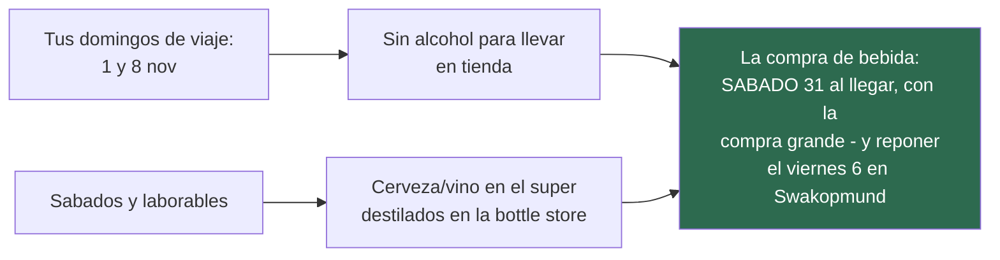
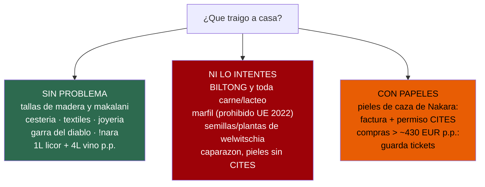

# 08 · Comida, compras y regalos

> **Namibia · 30 oct – 15 nov 2026 · la clásica del norte** — [← índice del dossier](README.md)
>
> El manual de intendencia: supermercados y gasolineras parada a parada, la ley del alcohol, qué comer y qué se puede traer a casa.
>
> **~N$20 = €1** *(rango 19,5–20,5)* · **✅** fuente primaria · **◐** secundaria concordante ·
> **○** práctica común, sin fuente · **❌** sin verificar, dicho en blanco
>
> *Investigación cerrada el 02/08/2026 · formato y contenido revisados el 03/08/2026*

---

## 🍺 Primero, la ley que organiza tu calendario de compras ✅

Verificado en el texto de la **[Liquor Act 6 de 1998](http://www.lac.org.na/laws/annoSTAT/Liquor%20Act%206%20of%201998.pdf)**
*([espejo en NamibLII](https://namiblii.org/akn/na/act/1998/6) — ambos pueden pedir «prueba de
humano» a scripts; en navegador abren)* ✅:

- **Domingos y festivos = «closed day»**: **prohibida la venta de alcohol para llevar** (art. 46(2))
  — ni bottle stores ni supermercados. *Bares y restaurantes sí sirven.*
- **Los supermercados solo venden «light liquor» (≤16 %: cerveza y vino)** (art. 10). Los
  **destilados, solo en bottle stores** (TOPS de Spar, LiquorShop de Checkers, Cheers de Woermann).

*Los súper sí abren en domingo (p. ej. Maerua SuperSpar: D 07:30–18:00 ◐) — solo la sección de
alcohol queda cerrada.*

---

## 🛒 El avituallamiento, parada a parada

### Windhoek — LA compra grande (sábado 31, recién aterrizados y con el coche)
La regla de las guías de alquiler ◐: **hacia el desierto solo hay básicos — la compra seria se
hace en Windhoek** ([Advanced Car Hire](https://www.advancedcarhire.com/post/a-guide-to-grocery-shopping-in-namibia-for-travellers)).
**Y el calendario juega a favor** ✅: se llega en sábado — cerveza y vino en el súper y destilados
en la bottle store, **que el domingo 1 no se puede**.
- **Maerua Mall** es la jugada redonda ○: **SuperSpar** («probablemente el mejor de Windhoek, con
  parking» — [foro](https://www.tripadvisor.com/ShowTopic-g293821-i12459-k7050914-Supermarket_in_Windhoek-Windhoek_Khomas_Region.html)),
  con **TOPS** (destilados) anexo, más **Checkers** y **Woermann Brock** al lado. Cadenas del país:
  Shoprite/Checkers, Pick n Pay, SuperSpar y la local **Woermann Brock** ✅
  ([estudio](https://www.tandfonline.com/doi/full/10.1080/0376835X.2020.1819774) · [woermannbrock.com](https://www.woermannbrock.com/)).
- **Para presupuestar desde casa**: Pick n Pay Namibia tiene **tienda online con precios reales en
  N$** ✅ — [shop.pnp.na](https://shop.pnp.na/).
- **La lista de camping** ◐ ([guía](https://roamthereaches.com/2021/10/09/the-ultimate-guide-to-camp-cooking-in-namibia/)):
  **leña + pastillas de encendido** (mejor del súper: la de algunos campings es resinosa ○),
  carne de braai y **boerewors**, pap, conservas, **agua en garrafas**, hielo *(fácil: gasolineras
  y súpers)*. Maderas de braai con nombre propio: **kameeldoring, sekelbos, mopane** ○.

#### ✅ La lista de la compra grande del D0 — para tachar en el carro

La regla de la lista: **solo cosas que un súper grande namibio tiene seguro** — todo son básicos de
las cadenas de arriba ◐ *(las mismas guías citadas, y los precios se pueden comprobar desde casa en
[shop.pnp.na](https://shop.pnp.na/) ✅)*. Nada de fiar el menú a encontrar un producto concreto.
Cubre **del D0 a la mañana del D5** *(en Swakopmund, el viernes 6, se repone TODO — §abajo)*.
⚠️ **Desde el 08/08 las DOS primeras noches ya son de campamento remoto** *(Spreetshoogte D1–D2,
sin tienda ni restaurante que consten ❌)*: **sin reposición hasta Solitaire/Sesriem, el D3**:

- [ ] **Agua: garrafas de 5 L — mínimo 5–6 garrafas** *(4 L/persona/día del coche, `06`, más el
      día entero a pie del D2 y la cocina de dos noches sin grifo confirmado)*
- [ ] **Leña de braai PARA DOS NOCHES** *(kameeldoring o sekelbos)* **+ pastillas de encendido +
      cerillas largas** — en la escarpa no hay dónde reponer ❌
- [ ] **Hielo** — lo último que entra en el carro, y directo a la nevera
- [ ] **Carne del braai de los primeros días + boerewors** *(al vacío mejor: aguanta)*
- [ ] **Huevos, pan de molde, mantequilla, queso en lonchas**
- [ ] **Leche UHT, café soluble o de filtro, rooibos, azúcar**
- [ ] **Avena o cereal, mermelada, crema de cacahuete** — el desayuno de campamento que no falla
- [ ] **Pasta, arroz, pap, salsas de bote, sopas de sobre**
- [ ] **Latas: atún, alubias/baked beans, chakalaka, tomate, maíz**
- [ ] **Fruta dura** *(manzanas, naranjas)* **y verdura que aguante** *(cebolla, zanahoria, calabacín)*
- [ ] **Aceite pequeño, sal, pimienta, especia de braai, ketchup/mostaza**
- [ ] **Picoteo de coche: frutos secos, galletas, biltong** *(el biltong, en cualquier súper ◐)*
- [ ] **Cerveza y vino EN EL SÚPER, HOY** ✅ *(mañana domingo, no)* — destilados, en el TOPS anexo
- [ ] **Bolsas de basura, papel de cocina, papel higiénico de repuesto, mechero**
- [ ] **Lavavajillas pequeño y estropajo** *(el menaje viene en el coche; el jabón, no ○)*

⚠️ Tres cosas que **NO** van en esta compra: la **carne cruda que cruzaría la Línea Roja** hacia el
norte *(se recompra en Swakopmund y en Outjo — ver `07`)*, nada **congelado en exceso** *(la nevera
del coche no es un arcón: ver [`18`](18-manual-de-campamento.md) §5)* y el **repelente**, que ya
viene de casa *(`17`)*.

### Sesriem (D3–D4)
- **Sossus Oasis Service Station** ✅ (a 300 m de la puerta): diésel 50 ppm, taller de neumáticos,
  y tienda con **hielo, leña, básicos, panadería diaria y cerveza fría** —
  [sossus-oasis.com](https://www.sossus-oasis.com/servicestation.html). El salvavidas del desierto.

### Solitaire (D3 y D5, de paso)
- Gasolinera + **panadería-restaurante** (la tarta) + general dealer ✅ —
  [solitairenamibia.com](https://www.solitairenamibia.com/). La única gasolinera entre Sossusvlei
  y la costa.

### Walvis Bay (D5–D6)
- **Pick n Pay en Dunes Mall** y **SuperSpar** ○ bien surtidos.

### Swakopmund (D6) — ⚠️ LA ÚLTIMA COMPRA GRANDE del viaje norte
Después de aquí: Henties (incierto) → Terrace Bay (kiosco) → Damaraland (puestos) → Outjo (súper
de pueblo). **El viernes 6 se compra TODO lo de los 3 días siguientes: comida, leña, hielo y
bebida** *(viernes = alcohol disponible; el domingo 8 no habrá)*.
- SuperSpar (Garnison Rd), Ocean View Spar, Pick n Pay, **Woermann Brock con productos alemanes**,
  Checkers en Platz am Meer ○ ([foro](https://www.4x4community.co.za/forum/showthread.php/375861-Supermarket-in-Swakopmund)).

### Henties Bay (D7) — ⚠️ estado incierto
- Era el último avituallamiento antes del Skeleton Coast ◐ — pero **la propia web de SPAR lista la
  tienda de Henties Bay «cerrada hasta nuevo aviso»** tras un incendio ✅/◐
  ([SPAR](https://www.spar.co.za/Home/Store-View/SPAR-Henties-Bay-Namibia) ·
  [Namibian Sun](https://www.facebook.com/namibiansun/videos/733413164320847/)). Alternativa:
  **Your Woermann** tiene sucursal ✅ ([yourwoermann.com](https://www.yourwoermann.com/)).
  👉 **Reverifica antes del viaje y no cuentes con Henties para nada crítico: gasolina sí, súper
  quizá.**

### Terrace Bay (D7)
- El resort NWR tiene **restaurante, bar, kiosco con básicos y surtidor** ✅/◐
  ([nwr.com.na](https://www.nwr.com.na/resorts/terrace-bay-resort/) ·
  [namibweb](https://www.namibweb.com/terracebayresort.htm)) — pero **el surtidor tiene fama de no
  ser fiable ○: se llena en Henties igualmente** (coherente con `07`).

### Khorixas (solo si el D8 se desvía al Petrified Forest)
- **OK Foods**: fresco, carnicería, panadería · **L–D 07:30–19:00** ◐
  ([Tracks4Africa](https://tracks4africa.co.za/listings/item/w208198/ok-foods-khorixas/)) + dos
  gasolineras.

### Outjo (D9) — la última compra decente antes de Etosha
- **SPAR** y **OK Foods**, y la carnicería **Delaray** para la carne del braai de Etosha ○
  ([foro](https://www.tripadvisor.com/ShowTopic-g293820-i9680-k11331910-Good_place_to_stock_up_on_food_near_Etosha-Namibia.html)).
  *(Kamanjab: «patatas, alcohol y poco más» ○.)* Recuerda la **Línea Roja** (`07`): la carne que
  subas se come EN Etosha.

### Etosha (D9–D12)
- **D9–D11, dentro** — Okaukuejo, Halali y Namutoni: **restaurante, kiosco y tienda pequeña con
  básicos y bebidas frías** ◐; la gasolinera «el 95 % del tiempo tiene, pero ha llegado a agotarse»
  ([nwrnamibia](https://www.nwrnamibia.com/etosha-food-eating-fuel.htm)). Los foros insisten: esas
  tiendas **no dan para avituallarse** ○. Leña en los camps: **sin dato**.
- **D12, ya fuera: Onguma Tamboti** ✅ *(donde se duerme desde el cambio del 21/08)* — **kiosco**
  con lo básico, **hielo, leña y braai packs**, y **restaurante à la carte: la cena se reserva AL
  LLEGAR, en recepción** *(tarifa oficial 2027)*. Desayuno suelto N$320 (~€16). **La compra del
  braai de esa noche se hace igualmente en la tienda de Namutoni antes de salir** ○: el kiosco es
  kiosco.

### Otjiwarongo (D13)
- Spar «enorme», OK y Multisave ○ — para el picoteo del último día, poco más hace falta.

---

## ⛽ Las gasolineras del recorrido, una a una — y qué tienen al lado

*Contexto que manda sobre todo esto ◐: NWR (la estatal) sufrió **cortes de combustible en sus
resorts en 2025** (Okaukuejo, Halali, Namutoni, Terrace Bay, Sesriem) por fallos de su proveedor
([crónica](http://umhambi.blogspot.com/2025/03/namibia-wildlife-resorts-nwr-issues.html)). Regla:
**todo surtidor de NWR es «probable, no garantizado» — se entra siempre lleno.***

- **Windhoek** ✅ — decenas, todas las marcas, muchas 24 h ([localizador Puma](https://pumaenergy.com/wp-content/uploads/2025/08/Puma-Energy-Africa-Stations-Locations.pdf) ·
  [Shell](https://find.shell.com/na/fuel/locations/en_NA)). **Sal lleno**: por Spreetshoogte no hay
  NADA hasta Solitaire (~250 km).
- **Solitaire** ✅ — gasolina + diésel + **taller de neumáticos**; al lado, la panadería McGregor
  (la tarta, sándwiches y pies para llevar), el **Café van der Lee** (comidas y cenas a diario) y
  el general dealer **con cajero** ([solitairenamibia.com](https://www.solitairenamibia.com/)).
- **Sesriem** ✅ — **doble surtidor**: la **Sossus Oasis (Engen)** frente a la puerta — diésel
  50 ppm, tienda gorda (hielo, leña, pies, congelados), taller, «acepta la mayoría de tarjetas»
  ([sossus-oasis.com](https://www.sossus-oasis.com/servicestation.html)) — y el del **campsite NWR**
  (oficial, pero con historial de cortes). Comer: el buffet del **Sossusvlei Lodge** en la puerta ✅.
- **Walvis Bay / Swakopmund** ✅ — varias 24 h (Puma, Engen, Shell); tienda 24/7 en Walvis Bay
  Express ✅.
- **Henties Bay** ✅ — **Puma 24 h con mini-tienda**; la última «de marca» antes del parque. Comer
  ○: **Fishy Corner** (el nº 1 del pueblo). *(El Spar: incendio y reconstrucción — estado por
  reverificar, ver arriba.)*
- **Cape Cross** ◐ — sin estación: el **lodge guarda una reserva limitada «de cortesía»** para
  campistas ([capecross.org](https://www.capecross.org/camping/)) — no cuentes con ella. *(Un blog
  sitúa combustible en **Mile 108**, en la C34 ○.)*
- **Puertas Ugabmund / Springbokwasser** — **sin combustible en el parque** ○
  ([guía 2026](https://4x4afrika.com/2026/01/26/skeleton-coast-national-park-guide-2026/)).
  Horarios ○: Ugab 07:30–15:00 *(coherente con la regla de pernocta)*, Springbokwasser
  07:30–17:00.
- **Terrace Bay** ⚠️ — **hay surtidor físico** (ficha de viajeros ◐, «tarjeta a veces, lleva
  efectivo»), pero **la página oficial de NWR NO lo lista**, se quedó seco en 2025 y alguna guía
  lo da «solo para huéspedes» ○. 👉 **La regla de `07` se mantiene: entra con autonomía para
  salir sin repostar aquí.** Tienda pequeña y restaurante de menú fijo, sí ✅/◐.
- **Bergsig** ❌ — **ninguna gasolinera documentada en ninguna fuente**; solo una tienda de
  básicos ○. Planifica como si no hubiera nada.
- **Palmwag** *(fuera de la ruta, el respaldo del tramo)* ✅ — **surtidor 07:00–19:00, diésel
  50 ppm** en el lodge de Gondwana ([oficial](https://gondwana-collection.com/accommodation/palmwag-lodge));
  lleva efectivo por si el datáfono ○.
- **Twyfelfontein** ◐/○ — irregular: la bomba histórica ya no va; hay reportes de surtidor tras el
  Country Lodge, **pero la web oficial del lodge no lo menciona** → respaldo de emergencia, no plan.
- **Grootberg / Hoada** ❌ — nada; los puntos más cercanos son Palmwag (23 km del pass) y Kamanjab.
- **Kamanjab** ✅/◐ — **Shell con tienda SaveMor Spar** (comida fresca para llevar) + una segunda
  estación con general dealer (pan, ferretería, recambios).
- **Outjo** ✅ — Shell **Eyambeko** con tienda; y la parada clásica: la **Outjo Bakkery** ✅
  (panadería-cafetería histórica frente al Spar — [outjobakkery.com](https://outjobakkery.com/)).
  **Aquí se llena antes de Andersson.**
- **Dentro de Etosha** ✅⚠️ — **los tres campamentos listan «Filling Station» en la web oficial de
  NWR** ([Okaukuejo](https://www.nwr.com.na/resorts/okaukuejo-resort/) ·
  [Halali](https://www.nwr.com.na/resorts/halali-resort/) ·
  [Namutoni](https://www.nwr.com.na/resorts/namutoni-resort/)) — con el historial de cortes de
  2025 encima: efectivo a mano y depósito lleno desde Outjo. **Respaldo justo fuera**: la **Etosha
  Trading Post** a 6,5 km de Andersson — «suministro estable», diésel 50 ppm, take-away caliente y
  taller ✅ ([etosha-tradingpost.com](https://www.etosha-tradingpost.com/facilities.html)).
- **Tsumeb / Otjiwarongo / Okahandja (D13)** ✅ — Puma 24 h y Shell en la B1; ciudades con de todo.
- **Uis** *(solo si el D8 se desvía)* ✅/○ — Engen con tienda; ojo: se ha visto cerrada en festivo.

---

## 🍖 Comidas típicas — y dónde cae cada una en TU ruta

### Los platos
- **Braai** con carne de caza y **boerewors** — lo haréis vosotros **11–13 noches** *(13 de
  tienda; Terrace Bay trae la cena, y Joe's puede caer el D0 y el D13)*; carne en Windhoek/Outjo.
- **Caza en plato**: órix/gemsbok, kudú, springbok, cebra — Joe's es la opción de mesa del D0 y
  el D13; fino:
  **Leo's at the Castle** ◐; también **The Stellenbosch** y **O Portuga** ○ (Windhoek).
- **Kapana** ◐ — tiras de vacuno a la brasa cortadas al momento, con sal-especia y chili, servidas
  en papel: el **mercado Single Quarters/Oshetu de Katutura** (Windhoek), mejor con ambiente de
  fin de semana ([Gondwana](https://gondwana-collection.com/blog/have-you-been-to-single-quarters-in-katutura-namibia)).
  Precio: sin dato. Si os da respeto ir solos, hay tours ○.
- **Cocina owambo** — **oshifima/mahangu** (papilla de mijo perla) mojada en la salsa del pollo
  oshiwambo, espinaca silvestre, oshigali: **Xwama Cultural Village** (Katutura, Windhoek) ✅
  ([xwama.com](http://www.xwama.com/)) o **Hafeni** en Swakopmund ✅ (Mondesa, a diario
  10:00–22:00, [hafenitoursnam.com](https://www.hafenitoursnam.com/hafeni-traditional-restaurant.html)).
- **Gusanos de mopane (omagungu)** ◐ — salteados con tomate y chili; muy proteicos, sabor a
  pollo/pescado seco. Los sirven Hafeni y se ven en mercados. Para valientes del D6.
- **Potjiekos** ◐ — el guiso de olla de tres patas a fuego lento; podéis hacerlo vosotros en el
  camping ([Gondwana](https://gondwana.travel/blog/namibian-cuisine-sampling-local-delicacies-and-traditional-dishes)).
- **Biltong y droëwors** — **Closwa** (desde 1976) ✅: tienda en Windhoek y factory shop en
  Okahandja ([closwa.com](https://www.closwa.com/)); también Butcher Block ◐ y la charcutería
  alemana **Hartlief** ◐. ⚠️ **Se come EN el viaje: no puede volar a España** (ver aduana abajo).
- **Cervezas** — Windhoek Lager y Tafel son de **Namibia Breweries** (1920, hoy Heineken) ✅
  ([nambrew.com](https://nambrew.com/brands/beers/windhoek/)); visitas a la fábrica: sin dato.

### Los sitios, día a día
- **D0/D13 · Windhoek** — Joe's Beerhouse (ya en el plan) · Xwama · kapana en Katutura ·
  Leo's at the Castle.
- **D3/D5 · Solitaire** — la **apple pie de Moose McGregor** ✅ (la historia, en `10`).
- **D5–D6 · Walvis Bay** — **OSTRAS de la laguna** ◐, «de las mejores del hemisferio sur»:
  **The Raft** (~**N$100–140 (~€5–7) la docena** ○) o **Anchors @ the Jetty** ◐; también cruceros
  con ostras y espumoso ○.
- **D6 · Swakopmund** — **Café Anton** ◐ (repostería alemana: Selva Negra, Bienenstich,
  apfelstrudel) · **The Tug** y **Jetty 1905** ◐ (kabeljou, kingklip) · **Kücki's Pub** ✅ ·
  **Brauhaus** ○ · y la microcervecería **Swakopmund Brewing Co.** en el Brewer & Butcher ◐. Las
  ostras del **Ocean Cellar** con precio de carta oficial ✅: **N$140/250/450 (~€7/12,5/22,5)**
  según ración ([carta PDF](https://wa-uploads.profitroom.com/olleisurehotels/17431427879074_Ocean%20Cellar%20Menu_website.pdf)).
- **D7 · Terrace Bay** — la cena es **el buffet del resort frente al Atlántico o tu braai** ◐: no
  hay más, y esa es la gracia.
- **D9–D12 · Etosha** — restaurantes de los tres campamentos, abiertos a todos ◐; horarios
  concretos: sin dato — **pídelos al reservar** (`01`).

---

## 🎁 Regalos típicos — qué, dónde y qué NO

### Qué y dónde
- **Namibia Craft Centre** (40 Tal St, Windhoek) ✅ — ~40 artesanos: cestería owambo, tallas de
  **nuez de makalani** («marfil vegetal»), joyería san de cáscara de huevo de avestruz, pulseras
  himba, textiles. **L–V 09:00–17:30 · S 09:00–16:00 · D 09:00–15:00**
  ([namibiacraftcentre.com](https://www.namibiacraftcentre.com/)). La parada única si vais justos.
- **Penduka** (Katutura) ◐ — proyecto de mujeres: bordados, batik, vidrio reciclado; se puede
  visitar y comer ([Travel Namibia](https://travelnam.com/crafts-healing-penduka/)).
- **Muñecas herero** ○ — la mayor selección: mercado de Okahandja y el Craft Centre; orientación:
  pequeñas **N$150–250 (~€7,5–12,5)**, grandes **N$600–900 (~€30–45)**.
- **Mbangura Woodcarvers** (Okahandja, junto a la B1) ○ — el gran mercado de talla de madera del
  país; **encaja de pleno en el D13** (Okahandja está en tu B1 de vuelta). Efectivo y regateo.
- **Kristall Galerie** (Swakopmund) ✅ — el mayor clúster de cuarzo expuesto del mundo + joyería
  **La Tourmaline** con piedras namibias ([kristallgalerie.com](https://kristallgalerie.com/)).
  **Karakulia Weavers** ○ — alfombras de lana karakul tejidas a mano, entrada libre.
- **Nakara** ✅ — la curtiduría del **Swakara** (Persian lamb) y cueros de caza; boutiques en
  Windhoek y Swakopmund ([nakara-namibia.com](https://nakara-namibia.com/)). ⚠️ Pieles de fauna
  (cebra…): **pide factura y permiso CITES en tienda antes de comprar**.
- **Puestos de Damaraland** ◐ — camino de Twyfelfontein: piedras, móviles de vainas, cobre y
  makalani comprado directo al artista ([Travel Namibia](https://travelnam.com/damaraland-craft-making-living/));
  con nombre: **Pulling Elephant Craft Shop** (cruce D2612/D3254) y la tienda del Petrified Forest.
- **Sabores** — **aceite y semillas de !nara** ○ (N$120–250 · ~€6–12,5 el bote) y **garra del
  diablo** en infusión ✅ (Namibia produce ~90 % del mercado mundial —
  [FAO](https://www.fao.org/newsroom/story/from-savannah-plant-to-global-remedy/en)). *(El rooibos
  de los súpers es sudafricano.)*

### ⚖️ Aduana — lo que decide qué vuelve contigo *(fuentes primarias)*

- **El biltong NO entra en la UE** ✅ — prohibida toda carne y lácteo en equipaje, en cualquier
  formato; no declararlo = confiscación y multa
  ([Your Europe](https://europa.eu/youreurope/citizens/travel/carry/meat-dairy-animal/index_en.htm)).
  *Sí* entran: miel (≤2 kg) y pescado (≤20 kg).
- **Marfil: prohibido en la UE desde el 19/01/2022** ◐/✅; **welwitschia = CITES Apéndice II** ✅
  (nada de semillas ni plantas — [CITES](https://cites.org/eng/gallery/species/other_plant/welwitschia_mirabilis.html)).
- **Namibia a la salida** ✅ ([guía NamRA](https://www.namra.org.na/documents/cms/uploaded/customs-procedure-travellers-guide-information-1579b9600b.pdf)):
  declarar efectivo ≥ **N$100.000 (~€5.000)**; productos de especies controladas, solo con permiso
  (Act 9/2008).
- **España a la entrada** ✅ ([AEAT](https://sede.agenciatributaria.gob.es/Sede/viajeros-trabajadores-desplazados-fronterizos/viajeros/franquicias-tabaco-alcohol-otras-mercancias.html)):
  franquicia de **430 €/persona** en compras (guarda tickets), 200 cigarrillos, **1 L de >22° o
  2 L de <22°, MÁS 4 L de vino y 16 L de cerveza**; declarar efectivo ≥ **10.000 €**.

---

*Precios en N$ y € (~N$20 = €1) · Horarios de tiendas: de directorios/foros, cámbianlos por los
reales al llegar · Estado del SPAR de Henties Bay: reverificar antes de salir · 02/08/2026*
