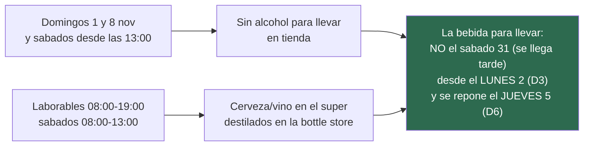
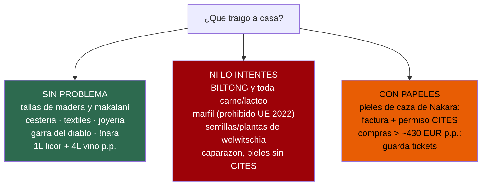

# 08 · Comida, compras y regalos

> **Namibia · 30 oct – 15 nov 2026 · la clásica del norte** — [← índice del dossier](README.md)
>
> El manual de intendencia: supermercados y gasolineras parada a parada, la ley del alcohol, qué comer y qué se puede traer a casa.
>
> **~N$20 = €1**, de bolsillo *(el cambio real de 2026 va por **18,5–19,4** — BCE, 28/08: el euro de estas páginas se queda ~7 % corto)* · **✅** fuente primaria · **◐** secundaria concordante ·
> **○** práctica común, sin fuente · **❌** sin verificar, dicho en blanco
>
> *Investigación cerrada el 02/08/2026 · formato y contenido revisados el 03/08/2026 · la carne de
> Onguma, Palmwag y la aduana del efectivo, corregidas el 09/10/2026*

---

## 🍺 Primero, la ley que organiza tu calendario de compras ✅

Verificado en el texto de la **[Liquor Act 6 de 1998](http://www.lac.org.na/laws/annoSTAT/Liquor%20Act%206%20of%201998.pdf)**
*([espejo en NamibLII](https://namiblii.org/akn/na/act/1998/6) — ambos pueden pedir «prueba de
humano» a scripts; en navegador abren)* ✅:

- **Domingos y festivos = «closed day»**: **prohibida la venta de alcohol para llevar** (art. 46(2))
  — ni bottle stores ni supermercados. *Bares y restaurantes sí sirven.*
- **Y el sábado, solo hasta las 13:00** ✅ — el horario no lo fija la ley sino su reglamento
  *(art. 79)*: **lunes a viernes 08:00–19:00 y sábado 08:00–13:00**, igual para la bottle store
  *(reg. 69)* que para el súper *(reg. 70)* — [Liquor Regulations, GN 142/2001](https://www.lac.org.na/laws/annoREG/Liquor%20Act%206%20of%201998-Regulations%202001-142.pdf), anotadas
  hasta la enmienda de 2024 sin que nadie toque esos dos artículos. Y la tienda lo cumple tal cual:
  la **TOPS de Maerua, sábado 08:00–13:00 y domingo cerrada** ✅ *([su ficha](https://www.weckevoigtsspar.com/store-location/maerua-super-spar))*. ⚠️ *Hasta
  el 05/10/2026 este dossier daba el sábado por día entero, y montaba sobre eso la compra de bebida
  del D1 a las 14:00–16:30: abajo, corregido.*
- **Los supermercados solo venden «light liquor» (≤16 %: cerveza y vino)** (art. 10). Los
  **destilados, solo en bottle stores** (TOPS de Spar, LiquorShop de Checkers, Cheers de Woermann).

```mermaid
flowchart LR
    A["Domingos 1 y 8 nov<br/>y sabados desde las 13:00"] --> B["Sin alcohol para llevar<br/>en tienda"]
    C["Laborables 08:00-19:00<br/>sabados 08:00-13:00"] --> D["Cerveza/vino en el super<br/>destilados en la bottle store"]
    B --> E["La bebida para llevar:<br/>NO el sabado 31 (se llega tarde)<br/>desde el LUNES 2 (D3)<br/>y se repone el JUEVES 5 (D6)"]
    D --> E
    style E fill:#2d6a4f,color:#fff
```

*Los súper sí abren en domingo (p. ej. Maerua SuperSpar: D 07:30–18:00 ✅ —
[su ficha](https://www.weckevoigtsspar.com/store-location/maerua-super-spar)) — solo la sección de alcohol queda cerrada.*

---

## 🛒 El avituallamiento, parada a parada

### Windhoek — LA compra grande (sábado 31, recién aterrizados y con el coche)
La regla de las guías de alquiler ◐: **hacia el desierto solo hay básicos — la compra seria se
hace en Windhoek** ([Advanced Car Hire](https://www.advancedcarhire.com/post/a-guide-to-grocery-shopping-in-namibia-for-travellers)).
**Y el calendario, para la bebida, juega en contra** ✅: se llega en sábado, pero **la venta de
alcohol para llevar cierra el sábado a las 13:00** *(§la ley, arriba)* y la compra va a las
~14:00–16:30; el domingo 1, cerrada todo el día. **Sin cerveza ni vino de tienda hasta el lunes 2
(D3)** — la tienda de Sossus Oasis anuncia cerveza fría *(§Sesriem, abajo)*. Las dos primeras
noches, la bebida es **de barra**: el bar del Urban Camp *(`01` §D1)* o Joe's Beerhouse; en
Spreetshoogte, bar no consta ❌. **La única forma de llevarla el D1 es estar en la caja antes de las
13:00**, y eso obliga a recortar el briefing del coche, que el `01` quiere sin prisa — **decisión
vuestra**.
- **Maerua** es la jugada redonda: **SuperSpar** ✅ *(lunes a sábado 07:30–19:30; [su ficha](https://www.weckevoigtsspar.com/store-location/maerua-super-spar))*,
  que no está dentro del Maerua Mall sino **pegado a él, en el Maerua Lifestyle Centre, Centaurus
  Road** ✅ *(«probablemente el mejor de Windhoek, con parking» — [foro](https://www.tripadvisor.com/ShowTopic-g293821-i12459-k7050914-Supermarket_in_Windhoek-Windhoek_Khomas_Region.html) ◐)*,
  con **TOPS** (destilados) anexo; y **dentro del Mall, Checkers** ✅ *([directorio del
  centro](https://maeruamall.com/store-directory.html))*. *(La Woermann Brock que se daba «al lado»
  salía de un foro de hace doce años y **no está en el directorio actual** ❌: fuera del plan.)*
  Cadenas del país:
  Shoprite/Checkers, **Model** *(el antiguo Pick n Pay: la cadena dejó Namibia en 2025 y sus
  tiendas recuperaron el nombre de antes ✅ — [Moneyweb](https://www.moneyweb.co.za/news/companies-and-deals/namibias-ohlthaver-list-to-rebrand-pick-n-pay-stores-to-model/))*, SuperSpar y la local **Woermann
  Brock** ✅
  ([estudio](https://www.tandfonline.com/doi/full/10.1080/0376835X.2020.1819774) · [woermannbrock.com](https://www.woermannbrock.com/)).
- **El horario de la comida cabe de sobra** ✅: el Mall abre el sábado de **9:00 a 17:00**
  *([maeruamall.com](https://maeruamall.com/), leído el 05/10/2026)* y el **SuperSpar hasta las
  19:30** ✅; el plan del `01` mete la compra en las **~14:00–16:30**. Lo que **no** cabe es la
  bebida *(13:00, arriba)* ni **el banco**: las sucursales del Mall —están las cuatro: FNB, Bank
  Windhoek, Nedbank y Standard Bank ✅— **cierran el sábado a las 12:00** *(FNB Maerua, 08:30–12:00
  ✅ — [FNB](https://www.fnbnamibia.com.na/ways-to-bank/for-me/branch.html))*. El cajero funciona,
  pero **si se traga la tarjeta, no hay quién la saque hasta el lunes**, y el lunes ya se está en
  el desierto ○ — que la del cajero no sea la tarjeta de la retención de la franquicia *(`17`)*
- **En el mismo centro, por si algo se ha quedado en casa**: farmacia **Clicks**, **Cape Union
  Mart** *(acampada)*, ropa barata y tienda de móviles — el detalle, en el `17` §si algo se olvida.
- **Para presupuestar desde casa**: la tienda online con precios reales en N$ es hoy la de
  **Model**, [shop.modelmooove.na](https://shop.modelmooove.na/) ◐ *(bloquea a los scripts; en navegador abre)*. La de Pick n
  Pay que se citaba aquí, `shop.pnp.na`, **ya no existe**: el dominio no resuelve ✅ *(06/10)*. El
  SuperSpar no publica precios.
- **La lista de camping** ◐ ([guía](https://roamthereaches.com/2021/10/09/the-ultimate-guide-to-camp-cooking-in-namibia/)):
  **leña + pastillas de encendido** (mejor del súper: la de algunos campings es resinosa ○),
  carne de braai y **boerewors**, pap, conservas, **agua en garrafas**, hielo *(fácil: gasolineras
  y súpers)*. Maderas de braai con nombre propio: **kameeldoring, sekelbos, mopane** ○.

#### ✅ La lista de la compra grande del D1 — para tachar en el carro

La regla de la lista: **solo cosas que un súper grande namibio tiene seguro** — todo son básicos de
las cadenas de arriba ◐ *(las mismas guías citadas, y los precios se pueden comprobar desde casa en
la [tienda online de Model](https://shop.modelmooove.na/) ◐)*. Nada de fiar el menú a encontrar un producto concreto.
**Los precios de al lado son de esa tienda, leídos el 05/10/2026** ◐ *(otra cadena y casi un mes
antes: orientativos, y varios iban «en promoción» sin fecha de fin)*.
Cubre **del D1 a la mañana del D5** *(en Walvis Bay —o Swakopmund—, el **D6, jueves 5**, el día de
descanso, se repone TODO; §abajo)*.
⚠️ **La primera noche es de campamento remoto** *(Spreetshoogte, D2, sin tienda ni restaurante que
consten ❌)*: **sin reposición hasta Solitaire/Sesriem, el D3**:

- [ ] **Agua: garrafas de 5 L — mínimo 3–4 garrafas** *(4 L/persona/día del coche, `06`, más la
      cocina de una noche sin grifo confirmado)* — *desde el 24/08 la escarpa es UNA noche, no dos*.
      **De plástico grueso**: las finas revientan con el corrugado *(`17`)*. ~N$39 (~€2) la de 5 L
- [ ] **Leña de braai PARA UNA NOCHE** *(kameeldoring o sekelbos)* **+ pastillas de encendido +
      cerillas largas** — en la escarpa no hay dónde reponer ❌ *(allí se vende: N$55 · ~€2,75 el
      fardo de 10 kg — `20` §5; **tarifa vigente hasta el 30/11/2026** ✅ —
      [barkhan](https://www.barkhan.africa/rates.php))*. En el súper, ~N$50 (~€2,50) el saco de 7 kg
      y ~N$43 (~€2) las 12 pastillas. **Las cerillas largas no salen en el catálogo** ❌: si no
      aparecen, el mechero de abajo
- [ ] **Hielo** — lo último que entra en el carro, y directo a la nevera. ~N$18 (~€0,90) la bolsa
      de 2 kg
- [ ] **Carne del braai de los primeros días + boerewors** *(al vacío mejor: aguanta)* —
      boerewors ~N$125–130 (~€6,50) el kilo y filete ~N$140 (~€7) el kilo *(folleto de Checkers de
      septiembre y la carnicería [KWS](https://kwsnamibia.shop/shop/boerewors-sausage/))*
- [ ] **Huevos, pan de molde, mantequilla, queso en lonchas**
- [ ] **Leche UHT, café soluble o de filtro, rooibos, azúcar**
- [ ] **Avena o cereal, mermelada, crema de cacahuete** — el desayuno de campamento que no falla
- [ ] **Pasta, arroz, pap, salsas de bote, sopas de sobre**
- [ ] **Latas: atún, alubias/baked beans, chakalaka, tomate, maíz**
- [ ] **Fruta dura** *(manzanas, naranjas)* **y verdura que aguante** *(cebolla, zanahoria, calabacín)*
      — el calabacín *(«baby marrow»)* no sale en el catálogo ❌: si no está, *patty pan*. Y es lo
      único de la lista que las guías avisan de que puede faltar: **la fruta y la verdura** ◐
      *([roamthereaches](https://roamthereaches.com/2021/10/09/the-ultimate-guide-to-camp-cooking-in-namibia/))*
- [ ] **Aceite pequeño, sal, pimienta, especia de braai, ketchup/mostaza**
- [ ] **Picoteo de coche: frutos secos, galletas, biltong** *(el biltong, en cualquier súper ◐)* —
      el biltong va **a ~N$380–540 (~€19–27) el kilo** *([KWS](https://kwsnamibia.shop/shop/biltong/) y
      la media de Windhoek de enero)*: se pide a peso, 200 g
- [ ] **Bolsas de basura, papel de cocina, papel higiénico de repuesto, mechero**
- [ ] **Lavavajillas pequeño y estropajo** *(el menaje viene en el coche; el jabón, no ○)* —
      ~N$25 (~€1,25) el Sunlight de 400 ml. **El estropajo no sale en el catálogo** ❌: pesa nada,
      mejor desde casa ○
- [ ] **Espirales o barritas antimosquito para la parcela** ◐ — Peaceful Sleep o Tabard, de
      súper *(`17` §lo que se compra allí)*. Espirales Mortein ~N$17 (~€0,85) las 10; **las
      pastillas de Peaceful Sleep piden un aparato enchufado**, y en la parcela el enchufe es uno

**Cuánto cuesta** ◐ — con esos precios, para **dos personas y cuatro días** *(4 garrafas, un saco
de leña, 2 bolsas de hielo, 1 kg de boerewors y 1 de filete, 200 g de biltong, y del resto una
unidad o un kilo)*: **≈ N$2.050 (~€102)**, sin bebida; al cambio real de 2026 *(18,5–19,4)*, ~€105–111.
Encaja **por arriba** con el `02` §9 *(N$300–500 · €15–25 al día para dos → N$1.200–2.000 ·
€60–100 los cuatro días)*, y es razonable: esta compra lleva despensa que dura el viaje entero
—aceite, sal, café, azúcar, especias—. **Y Checkers sale un pelo más barato**: en la encuesta de
agosto de 2026 la misma cesta costaba **N$1.262 (~€63) en Checkers Maerua**, N$1.279 (~€64) en el
SuperSpar de Grove y N$1.302 (~€65) en Model ◐ *([The Brief](https://thebrief.com.na/2026/09/checkers-offers-the-cheapest-grocery-basket-among-premium-stores-in-august-2026/))* — un 2–3 %, que no compensa
cambiar de súper: se compra donde se esté.

⚠️ Cuatro cosas que **NO** van en esta compra: **la cerveza y el vino** ✅ *(a las 14:00 del sábado
ya no se venden para llevar — §la ley; desde el lunes 2)*, la **carne de más allá del D4** ○ —no
por la Línea Roja, que del D1 al D5 no se cruza, sino porque **cuatro días de carne cruda en una
nevera de 40 L no caben ni aguantan**: la de la costa y la de Damaraland se compran en Walvis Bay
el D6, y la de Etosha en Outjo el D10 *(`07` §Línea Roja)*—, nada **congelado en exceso** *(la nevera
del coche no es un arcón: ver [`18`](18-manual-de-campamento.md) §5)* y el **repelente**, que ya
viene de casa *(`17`)*.

### Sesriem (D3–D4)
- **Sossus Oasis Service Station** ✅ (a 300 m de la puerta): diésel 50 ppm, taller de neumáticos,
  y tienda con **hielo, leña, básicos, panadería diaria y cerveza fría** —
  [sossus-oasis.com](https://www.sossus-oasis.com/servicestation.html). El salvavidas del desierto.

### Solitaire (D3 y D5, de paso)
- Gasolinera + **panadería-restaurante** (la tarta) + general dealer ✅ —
  [solitairenamibia.com](https://www.solitairenamibia.com/). La única gasolinera entre Sossusvlei
  y la costa.

### Walvis Bay (D5–D6)
- **Model en Dunes Mall** *(el antiguo Pick n Pay)* y **SuperSpar** ○ bien surtidos.

### Walvis Bay o Swakopmund (D6, jueves 5) — ⚠️ LA ÚLTIMA COMPRA GRANDE del viaje norte
Después de aquí: Henties (incierto) → Terrace Bay (kiosco) → Damaraland (puestos) → Outjo (súper
de pueblo). **El jueves 5 (D6) se compra TODO lo de los 3 días siguientes: comida, leña, hielo y
bebida** *(jueves = alcohol disponible; el domingo 8 no habrá)*. ⚠️ *Hasta el 03/10 aquí decía
«viernes 6 en Swakopmund»: era el calendario viejo — el viernes 6 es ya el D7 y se sale a las ~07:30
hacia Cape Cross (`13`), sin hora de compra. Walvis Bay es donde se duerme; Swakopmund, solo si el
Moon Landscape lleva allí esa tarde (`10`).*
- SuperSpar (Garnison Rd), Ocean View Spar, Model *(antes Pick n Pay)*, **Woermann Brock con productos alemanes**,
  Checkers en Platz am Meer ○ ([foro](https://www.4x4community.co.za/forum/showthread.php/375861-Supermarket-in-Swakopmund)).

### Henties Bay (D7) — ⚠️ estado incierto
- Era el último avituallamiento antes del Skeleton Coast ◐ — pero **la propia web de SPAR lista la
  tienda de Henties Bay «cerrada hasta nuevo aviso»** tras un incendio ✅/◐
  ([SPAR](https://www.spar.co.za/Home/Store-View/SPAR-Henties-Bay-Namibia) ·
  [Namibian Sun](https://www.facebook.com/namibiansun/videos/733413164320847/)). Alternativa:
  **Your Woermann** tiene sucursal ✅ ([yourwoermann.com](https://www.yourwoermann.com/)).
  👉 **Reverifica antes del viaje y no cuentes con Henties para nada crítico: gasolina sí, súper
  quizá.**

### Terrace Bay (D7)
- El resort NWR tiene **restaurante, bar, kiosco con básicos y surtidor** ✅/◐
  ([nwr.com.na](https://www.nwr.com.na/resorts/terrace-bay-resort/) ·
  [namibweb](https://www.namibweb.com/terracebayresort.htm)) — pero **el surtidor tiene fama de no
  ser fiable ○: se llena en Henties igualmente** (coherente con `07`).

### Khorixas (solo si el D8 o el D9 se desvían al Petrified Forest)
- **OK Foods**: fresco, carnicería, panadería · **L–D 07:30–19:00** ◐
  ([Tracks4Africa](https://tracks4africa.co.za/listings/item/w208198/ok-foods-khorixas/)) + dos
  gasolineras.

### Outjo (D10) — la última compra decente antes de Etosha
- **SPAR** y **OK Foods**, y la carnicería **Delaray** para la carne del braai de Etosha ○
  ([foro](https://www.tripadvisor.com/ShowTopic-g293820-i9680-k11331910-Good_place_to_stock_up_on_food_near_Etosha-Namibia.html)).
  *(Kamanjab: «patatas, alcohol y poco más» ○.)* Recuerda la **Línea Roja** (`07`): la carne que
  subas se come EN Etosha.

### Etosha (D10–D13)
- **D10–D11, dentro** — Okaukuejo y Halali: **restaurante, kiosco y tienda pequeña con
  básicos y bebidas frías** ◐; la gasolinera «el 95 % del tiempo tiene, pero ha llegado a agotarse»
  ([nwrnamibia](https://www.nwrnamibia.com/etosha-food-eating-fuel.htm)). Los foros insisten: esas
  tiendas **no dan para avituallarse** ○. Leña en los camps: **sin dato**.
- **D12 y D13, ya fuera: Onguma Tamboti** ✅ *(las DOS últimas noches, desde el cambio del 24/08)* —
  **kiosco** con lo básico, **hielo, leña y braai packs** *(un lote de leña gratis el día de
  llegada)*, y **restaurante à la carte: la cena se reserva AL LLEGAR, en recepción** *(tarifa
  oficial 2027)*. Desayuno suelto N$320 (~€16). ⚠️ **Y son dos noches de braai, no una — y la carne
  de esas dos noches NO sale de dentro del parque**: al salir el D12 por **Von Lindequist** se cruza
  la Línea Roja hacia el sur, y **la carne cruda que baja de Etosha se confisca en el control** ◐
  *(`07` §Línea Roja)*. Así que ni Halali ni Namutoni: **las dos noches de Onguma se resuelven con
  sus braai packs**, que se compran en su kiosco, **ya fuera de la Línea** *(`07`, `21`)*; lo que
  sí puede cruzar es lo cocinado, los envasados al vacío comerciales y el biltong ◐. Y la carne de
  Outjo del D10 se calcula **para acabarla antes del D12** *(`07`: dos braais, Okaukuejo y
  Halali)*. *(Hasta el 09/10 aquí decía «comprar en la tienda de Halali antes de salir el D12»: esa
  carne se habría quedado en la puerta.)*

### Otjiwarongo (D14)
- Spar «enorme», OK y Multisave ○ — para el picoteo del último día, poco más hace falta.

---

## ⛽ Las gasolineras del recorrido, una a una — y qué tienen al lado

*Contexto que manda sobre todo esto ◐: NWR (la estatal) sufrió **cortes de combustible en sus
resorts en 2025** (Okaukuejo, Halali, Namutoni, Terrace Bay, Sesriem) por fallos de su proveedor
([crónica](http://umhambi.blogspot.com/2025/03/namibia-wildlife-resorts-nwr-issues.html)). Regla:
**todo surtidor de NWR es «probable, no garantizado» — se entra siempre lleno.***

- **Windhoek** ✅ — decenas, todas las marcas, muchas 24 h ([localizador Puma](https://pumaenergy.com/wp-content/uploads/2025/08/Puma-Energy-Africa-Stations-Locations.pdf) ·
  [Shell](https://find.shell.com/na/fuel/locations/en_NA)). **Sal lleno**: por Spreetshoogte no hay
  NADA hasta Solitaire (~250 km).
- **Solitaire** ✅ — gasolina + diésel + **taller de neumáticos**; al lado, la panadería McGregor
  (la tarta, sándwiches y pies para llevar), el **Café van der Lee** (comidas y cenas a diario) y
  el general dealer **con cajero** ([solitairenamibia.com](https://www.solitairenamibia.com/)).
- **Sesriem** ✅ — **doble surtidor**: la **Sossus Oasis (Engen)** frente a la puerta — diésel
  50 ppm, tienda gorda (hielo, leña, pies, congelados), taller, «acepta la mayoría de tarjetas»
  ([sossus-oasis.com](https://www.sossus-oasis.com/servicestation.html)) — y el del **campsite NWR**
  (oficial, pero con historial de cortes). Comer: el buffet del **Sossusvlei Lodge** en la puerta ✅.
- **Walvis Bay / Swakopmund** ✅ — varias 24 h (Puma, Engen, Shell); tienda 24/7 en Walvis Bay
  Express ✅.
- **Henties Bay** ✅ — **Puma 24 h con mini-tienda**; la última «de marca» antes del parque. Comer
  ○: **Fishy Corner** (el nº 1 del pueblo). *(El Spar: incendio y reconstrucción — estado por
  reverificar, ver arriba.)*
- **Cape Cross** ◐ — sin estación: el **lodge guarda una reserva limitada «de cortesía»** para
  campistas ([capecross.org](https://www.capecross.org/camping/)) — no cuentes con ella. *(Un blog
  sitúa combustible en **Mile 108**, en la C34 ○.)*
- **Puertas Ugabmund / Springbokwasser** — **sin combustible en el parque** ○
  ([guía 2026](https://4x4afrika.com/2026/01/26/skeleton-coast-national-park-guide-2026/)).
  Horarios ○: Ugab 07:30–15:00 *(coherente con la regla de pernocta)*, Springbokwasser
  07:30–17:00.
- **Terrace Bay** ⚠️ — **hay surtidor físico** (ficha de viajeros ◐, «tarjeta a veces, lleva
  efectivo»), pero **la página oficial de NWR NO lo lista**, se quedó seco en 2025 y alguna guía
  lo da «solo para huéspedes» ○. 👉 **La regla de `07` se mantiene: entra con autonomía para
  salir sin repostar aquí.** Tienda pequeña y restaurante de menú fijo, sí ✅/◐.
- **Bergsig** ❌ — **ninguna gasolinera documentada en ninguna fuente**; solo una tienda de
  básicos ○. Planifica como si no hubiera nada.
- **Palmwag** *(EN la ruta: el D9 pasa por él, Twyfelfontein → Palmwag → Hoada — `01`, `07`;
  opcional recomendada, el respaldo del tramo)* ✅ — **surtidor 07:00–19:00, diésel
  50 ppm** en el lodge de Gondwana ([oficial](https://gondwana-collection.com/accommodation/palmwag-lodge));
  lleva efectivo por si el datáfono ○.
- **Twyfelfontein** ◐/○ — irregular: la bomba histórica ya no va; hay reportes de surtidor tras el
  Country Lodge, **pero la web oficial del lodge no lo menciona** → respaldo de emergencia, no plan.
- **Grootberg / Hoada** ❌ — nada; los puntos más cercanos son Palmwag (23 km del pass) y Kamanjab.
- **Kamanjab** ✅/◐ — **Shell con tienda SaveMor Spar** (comida fresca para llevar) + una segunda
  estación con general dealer (pan, ferretería, recambios).
- **Outjo** ✅ — Shell **Eyambeko** con tienda; y la parada clásica: la **Outjo Bakkery** ✅
  (panadería-cafetería histórica frente al Spar — [outjobakkery.com](https://outjobakkery.com/)).
  **Aquí se llena antes de Andersson.**
- **Dentro de Etosha** ✅⚠️ — **los tres campamentos listan «Filling Station» en la web oficial de
  NWR** ([Okaukuejo](https://www.nwr.com.na/resorts/okaukuejo-resort/) ·
  [Halali](https://www.nwr.com.na/resorts/halali-resort/) ·
  [Namutoni](https://www.nwr.com.na/resorts/namutoni-resort/)) — con el historial de cortes de
  2025 encima: efectivo a mano y depósito lleno desde Outjo. **Respaldo justo fuera**: la **Etosha
  Trading Post** a 6,5 km de Andersson — «suministro estable», diésel 50 ppm, take-away caliente y
  taller ✅ ([etosha-tradingpost.com](https://www.etosha-tradingpost.com/facilities.html)).
- **Tsumeb / Otjiwarongo / Okahandja (D14)** ✅ — Puma 24 h y Shell en la B1; ciudades con de todo.
- **Uis** *(solo si el D8 o el D9 se desvían)* ✅/○ — Engen con tienda; ojo: se ha visto cerrada en festivo.

---

## 🍖 Comidas típicas — y dónde cae cada una en TU ruta

### Los platos
- **Braai** con carne de caza y **boerewors** — lo haréis vosotros **11–13 noches** *(13 de
  tienda; Terrace Bay trae la cena, y Joe's puede caer el D1 y el D14)*; carne en Windhoek/Outjo.
- **Caza en plato**: órix/gemsbok, kudú, springbok, cebra — Joe's es la opción de mesa del D1 y
  el D14; fino:
  **Leo's at the Castle** ◐; también **The Stellenbosch** y **O Portuga** ○ (Windhoek).
- **Kapana** ◐ — tiras de vacuno a la brasa cortadas al momento, con sal-especia y chili, servidas
  en papel: el **mercado Single Quarters/Oshetu de Katutura** (Windhoek), mejor con ambiente de
  fin de semana ([Gondwana](https://gondwana-collection.com/blog/have-you-been-to-single-quarters-in-katutura-namibia)).
  Precio: sin dato. Si os da respeto ir solos, hay tours ○.
- **Cocina owambo** — **oshifima/mahangu** (papilla de mijo perla) mojada en la salsa del pollo
  oshiwambo, espinaca silvestre, oshigali: **Xwama Cultural Village** (Katutura, Windhoek) ✅
  ([xwama.com](http://www.xwama.com/)) o **Hafeni** en Swakopmund ✅ (Mondesa, a diario
  10:00–22:00, [hafenitoursnam.com](https://www.hafenitoursnam.com/hafeni-traditional-restaurant.html)).
- **Gusanos de mopane (omagungu)** ◐ — salteados con tomate y chili; muy proteicos, sabor a
  pollo/pescado seco. Los sirven Hafeni y se ven en mercados. Para valientes del D6.
- **Potjiekos** ◐ — el guiso de olla de tres patas a fuego lento; podéis hacerlo vosotros en el
  camping ([Gondwana](https://gondwana.travel/blog/namibian-cuisine-sampling-local-delicacies-and-traditional-dishes)).
- **Biltong y droëwors** — **Closwa** (desde 1976) ✅: tienda en Windhoek y factory shop en
  Okahandja ([closwa.com](https://www.closwa.com/)); también Butcher Block ◐ y la charcutería
  alemana **Hartlief** ◐. ⚠️ **Se come EN el viaje: no puede volar a España** (ver aduana abajo).
- **Cervezas** — Windhoek Lager y Tafel son de **Namibia Breweries** (1920, hoy Heineken) ✅
  ([nambrew.com](https://nambrew.com/brands/beers/windhoek/)); visitas a la fábrica: sin dato.

### Los sitios, día a día
- **D1/D14 · Windhoek** — Joe's Beerhouse (ya en el plan) · Xwama · kapana en Katutura ·
  Leo's at the Castle.
- **D3/D5 · Solitaire** — la **apple pie de Moose McGregor** ✅ (la historia, en `10`).
- **D5–D6 · Walvis Bay** — **OSTRAS de la laguna** ◐, «de las mejores del hemisferio sur»:
  **The Raft** (~**N$100–140 (~€5–7) la docena** ○) o **Anchors @ the Jetty** ◐; también cruceros
  con ostras y espumoso ○.
- **D6/D7 · Swakopmund** — **Café Anton** ◐ (repostería alemana: Selva Negra, Bienenstich,
  apfelstrudel) · **The Tug** y **Jetty 1905** ◐ (kabeljou, kingklip) · **Kücki's Pub** ✅ ·
  **Brauhaus** ○ · y la microcervecería **Swakopmund Brewing Co.** en el Brewer & Butcher ◐. Las
  ostras del **Ocean Cellar** con precio de carta oficial ✅: **N$140/250/450 (~€7/12,5/22,5)**
  según ración ([carta PDF](https://wa-uploads.profitroom.com/olleisurehotels/17431427879074_Ocean%20Cellar%20Menu_website.pdf)).
- **D7 · Terrace Bay** — la cena es **el buffet del resort frente al Atlántico o tu braai** ◐: no
  hay más, y esa es la gracia.
- **D10–D13 · Etosha** — restaurantes de Okaukuejo y Halali, abiertos a todos ◐; horarios
  concretos: sin dato — **pídelos al reservar** (`01`).

---

## 🎁 Regalos típicos — qué, dónde y qué NO

### Qué y dónde
- **Namibia Craft Centre** (40 Tal St, Windhoek) ✅ — ~40 artesanos: cestería owambo, tallas de
  **nuez de makalani** («marfil vegetal»), joyería san de cáscara de huevo de avestruz, pulseras
  himba, textiles. **L–V 09:00–17:30 · S 09:00–16:00 · D 09:00–15:00**
  ([namibiacraftcentre.com](https://www.namibiacraftcentre.com/)). La parada única si vais justos.
- **Penduka** (Katutura) ◐ — proyecto de mujeres: bordados, batik, vidrio reciclado; se puede
  visitar y comer ([Travel Namibia](https://travelnam.com/crafts-healing-penduka/)).
- **Muñecas herero** ○ — la mayor selección: mercado de Okahandja y el Craft Centre; orientación:
  pequeñas **N$150–250 (~€7,5–12,5)**, grandes **N$600–900 (~€30–45)**.
- **Mbangura Woodcarvers** (Okahandja, junto a la B1) ○ — el gran mercado de talla de madera del
  país; **encaja de pleno en el D14** (Okahandja está en tu B1 de vuelta). Efectivo y regateo.
- **Kristall Galerie** (Swakopmund) ✅ — el mayor clúster de cuarzo expuesto del mundo + joyería
  **La Tourmaline** con piedras namibias ([kristallgalerie.com](https://kristallgalerie.com/)).
  **Karakulia Weavers** ○ — alfombras de lana karakul tejidas a mano, entrada libre.
- **Nakara** ✅ — la curtiduría del **Swakara** (Persian lamb) y cueros de caza; boutiques en
  Windhoek y Swakopmund ([nakara-namibia.com](https://nakara-namibia.com/)). ⚠️ Pieles de fauna
  (cebra…): **pide factura y permiso CITES en tienda antes de comprar**.
- **Puestos de Damaraland** ◐ — camino de Twyfelfontein: piedras, móviles de vainas, cobre y
  makalani comprado directo al artista ([Travel Namibia](https://travelnam.com/damaraland-craft-making-living/));
  con nombre: **Pulling Elephant Craft Shop** (cruce D2612/D3254) y la tienda del Petrified Forest.
- **Sabores** — **aceite y semillas de !nara** ○ (N$120–250 · ~€6–12,5 el bote) y **garra del
  diablo** en infusión ✅ (Namibia produce ~90 % del mercado mundial —
  [FAO](https://www.fao.org/newsroom/story/from-savannah-plant-to-global-remedy/en)). *(El rooibos
  de los súpers es sudafricano.)*

### ⚖️ Aduana — lo que decide qué vuelve contigo *(fuentes primarias)*

```mermaid
flowchart TD
    R["¿Que traigo a casa?"] --> OK["SIN PROBLEMA<br/>tallas de madera y makalani<br/>cesteria · textiles · joyeria<br/>garra del diablo · !nara<br/>1L licor + 4L vino p.p."]
    R --> NO["NI LO INTENTES<br/>BILTONG y toda carne/lacteo<br/>marfil (prohibido UE 2022)<br/>semillas/plantas de welwitschia<br/>caparazon, pieles sin CITES"]
    R --> DOC["CON PAPELES<br/>pieles de caza de Nakara:<br/>factura + permiso CITES<br/>compras > ~430 EUR p.p.:<br/>guarda tickets"]
    style OK fill:#2d6a4f,color:#fff
    style NO fill:#9d0208,color:#fff
    style DOC fill:#e85d04,color:#000
```

- **El biltong NO entra en la UE** ✅ — prohibida toda carne y lácteo en equipaje, en cualquier
  formato; no declararlo = confiscación y multa
  ([Your Europe](https://europa.eu/youreurope/citizens/travel/carry/meat-dairy-animal/index_en.htm)).
  *Sí* entran: miel (≤2 kg) y pescado (≤20 kg).
- **Marfil: prohibido en la UE desde el 19/01/2022** ◐/✅; **welwitschia = CITES Apéndice II** ✅
  (nada de semillas ni plantas — [CITES](https://cites.org/eng/gallery/species/other_plant/welwitschia_mirabilis.html)).
- **Namibia a la salida** ✅ ([guía NamRA](https://www.namra.org.na/documents/cms/uploaded/customs-procedure-travellers-guide-information-1579b9600b.pdf),
  releída el 09/10): **declarar todo el efectivo y las divisas que se lleven**, al entrar y al
  salir, **sin umbral** — igual que dice el `07`. *(Aquí ponía «≥ N$100.000 (~€5.000)»: esa cifra
  **no está en la guía de NamRA** ❌ y no se sabe de dónde salió; lo prudente es declararlo siempre.)*
  Productos de especies controladas, solo con permiso (Act 9/2008).
- **España a la entrada** ✅ ([AEAT](https://sede.agenciatributaria.gob.es/Sede/viajeros-trabajadores-desplazados-fronterizos/viajeros/franquicias-tabaco-alcohol-otras-mercancias.html)):
  franquicia de **430 €/persona** en compras (guarda tickets), 200 cigarrillos, **1 L de >22° o
  2 L de <22°, MÁS 4 L de vino y 16 L de cerveza**; declarar efectivo ≥ **10.000 €**.

---

*Precios en N$ y € (~N$20 = €1) · Horarios de tiendas: de directorios/foros, cámbianlos por los
reales al llegar · Estado del SPAR de Henties Bay: reverificar antes de salir · 02/08/2026*
