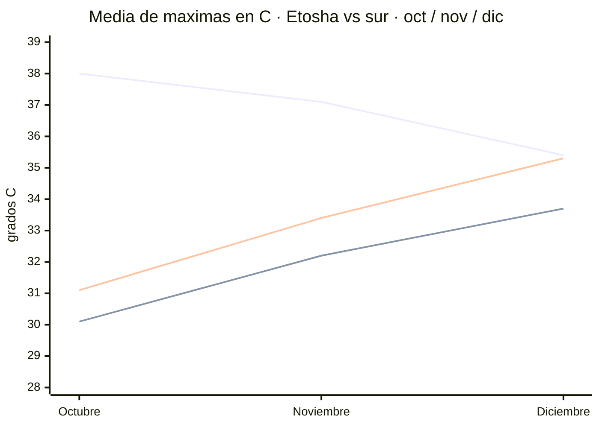

# Huecos cerrados — temperaturas con fuente meteorológica de verdad

Investigación cerrada el 17/07/2026 · **~N$20 = €1**
**✅ verificado 2-0** · **◐ disputado 1-1** · **⚠️ verificación caída por límite de sesión**

> ## El contexto
> **Todas** las temperaturas que manejábamos venían de webs de marketing de safaris y fueron
> **refutadas 0–3**. Esta vez se fue a las fuentes de verdad: **NOAA GHCN-Daily**, **SASSCAL
> WeatherNet** (estaciones automáticas namibias) y las **normales oficiales del Servicio
> Meteorológico de Namibia**. Los datos de abajo son **cálculo propio sobre ficheros de observación
> diaria descargados**, no cifras copiadas de una agencia.

---

## 🌡️ El hallazgo: el *"suicide month"* depende de la LATITUD

> ### Las webs de safaris lo generalizan mal. En Etosha octubre SÍ es el pico. En el sur, NO.

*Líneas: **Okaukuejo (Etosha)** baja de oct a dic · **Fish River (Karios)** sube · **Keetmanshoop** sube.*

### 🦁 Etosha — **octubre es el pico** ✅

**Okaukuejo**, media de máximas:
- **Octubre 38,0 °C** ← el pico
- **Noviembre 37,1 °C**
- **Diciembre 35,4 °C**

*Serie 2010–2021, calculada sobre GHCN-Daily descargado.*

### 🏜️ El sur — **al revés: noviembre y diciembre son MÁS calurosos** ✅

**Fish River Canyon** (estación Karios, en el Gondwana Canyon Lodge):
- Octubre **30,1 °C** → **Noviembre 32,2 °C** → Diciembre **33,7 °C**

**Keetmanshoop**:
- Octubre **31,1 °C** → **Noviembre 33,4 °C** → Diciembre **35,3 °C**

> ### 👉 Qué significa esto para tu viaje
> Vas a finales de **noviembre**, y tu ruta cruza las dos zonas:
> - En **Etosha** pillas ~37 °C — **algo menos que en octubre**. El norte te sale **mejor** que si
>   hubieras ido en octubre.
> - En el **sur** (Fish River, Keetmanshoop) pillas ~32–33 °C — **más que en octubre**, pero
>   **menos que en diciembre**.
>
> **Noviembre es el compromiso**: ni el pico del norte ni el del sur.

---

## 🔥 Fish River Canyon en noviembre — el dato que más importa

**Estación Karios** (27,6745 S · **893 m**), en el Gondwana Canyon Lodge:

- **Media de máximas de noviembre: 32,2 °C** · media de mínimas **16,1 °C**
- Sobre **400 días de observación en 14 temporadas (2012–2025)**

**Récords de la serie 2012–2025:**
- Octubre **40,0 °C** (2015)
- **Noviembre 41,4 °C** (2019, repetido en 2023)
- Diciembre **41,8 °C** (2024)

Máximos absolutos de noviembre, año a año: 2012: 38,1 · 2013: 39,3 · 2014: 36,6 · **2015: 40,8** ·
2016: 39,4 · 2017: 37,9 · 2018: 38,2 · **2019: 41,4** · 2020: 38,0 · 2021: 39,8 · 2022: 38,5 ·
**2023: 41,4** · 2024: 39,6 · 2025: 38,6

> **Traducción: en el mirador, noviembre es caluroso pero no infernal (~32 °C de media). Pero puede
> puntualmente llegar a ~41 °C.** El récord de noviembre **supera al de octubre**.

### 🛑 Aviso crítico sobre Ai-Ais — y por qué NO hay cifra

> **La estación Karios está a 893 m, en la MESETA del cañón. Ai-Ais está en el FONDO**, varios
> cientos de metros más abajo, y por tanto es **sistemáticamente más caluroso** que esos 32,2 °C.
>
> **No hay medición de Ai-Ais.** No existe estación con datos de temperatura allí, ni en SASSCAL ni
> en GHCN. **No se convierte esto en cifra: sería inventarla.**

Ai-Ais tiene fama de extremo, y la física le da la razón — pero **la fama no es un dato**.

---

## 🎯 Keetmanshoop — el dato más sólido de todo el lote ✅

**Triple confirmación independiente.** Media de máximas de noviembre:

- **33,4 °C** — NOAA GHCN, 56 meses, serie **1957–2024**
- **33,2 °C** — SASSCAL, estación Gellap Ost, 13 temporadas
- **32,4 °C** — normales oficiales del **Servicio Meteorológico de Namibia**

**Tres redes distintas coinciden dentro de ~1 °C.** Media de mínimas de noviembre: **16,1 °C**.

Fila literal del PDF oficial del Servicio Meteorológico *(extraída con `pdftotext -layout`)*:

> `Keetmanshoop  Max T (°C)  34.8  34.0  32.2  28.8  25.0  21.7  21.3  23.5  27.2  30.1  32.4  34.5`

*(columnas ene…dic → **oct 30,1 · nov 32,4 · dic 34,5**)*

**Récords** (aeropuerto J.G.H. van der Wath, WMO 68312, 1.077 m — **la serie más larga descargada,
más de 50 años**):
- Octubre **40,7 °C** (07/10/2015)
- **Noviembre 42,7 °C** (29/11/2016)
- Diciembre **42,8 °C** (10/12/2024)

⚠️ El PDF oficial **no declara el periodo de la normal** — es un defecto de la fuente, no del dato.

---

## 📌 Cómo usar estos números

- Son **climatología**, no pronóstico. Valen como **distribución de probabilidad** para noviembre de
  2026, **no como predicción**.
- Los **récords son del periodo descargado** (2012–2025 en Karios, 1957–2024 en Keetmanshoop), **no
  récords históricos absolutos**.
- Enlaza con `05-conduccion.md`: **el calor es un peligro de conducción**. Neumáticos calientes ganan
  presión → mide **en frío cada mañana**; calor + poca presión + corrugado = **reventón**, y un
  reventón delantero a 80 en grava **es un vuelco**.
- Y con `07-logistica.md`: **4+ litros de agua por persona y día** en el coche. Un pinchazo a las
  15:00 con 40 °C es un **evento de exposición al calor**.

---

## 🕳️ Lo que sigue sin cerrarse

- ⚠️ **Muchas verificaciones se cayeron por límite de sesión** (se reinicia a las 3:30). Varios datos
  llevan **1-1** en vez de 2-0: el de Karios en noviembre, el de Keetmanshoop del PDF oficial y sus
  récords. **Los números son buenos** —vienen de ficheros descargados y parseados— pero **no
  completaron los tres votos**.
- ❌ **Ai-Ais**: sin estación, sin cifra. Solo se sabe que es **más caluroso que Karios**.
- ⚠️ **Sossusvlei/Sesriem, Lüderitz y Swakopmund**: no llegaron a procesarse antes del corte.
  *(De `03-guia-preparacion.md`, dato ◐ de NWR: Sesriem nov **34,1 / 15,5 °C**; Etosha nov
  **35,5 / 18,3 °C** — coherente con Okaukuejo, pero de fuente secundaria.)*
- 🛫 **Vuelos**: **todas** las verificaciones se cayeron por límite de sesión. **Sigue sin haber ni
  una tarifa utilizable.**
- 🏨 **Lodges privados**: ídem, se cayeron. Sin precios.
- 🎫 **Tasas oficiales**: las verificaciones fallaron por error de conexión. El **~N$280** sigue
  apoyado **solo en fuente secundaria**.

**Fuentes:**
- NOAA GHCN-Daily: `WA010517310.dly` (Okaukuejo) · `WA004191820.dly` (Keetmanshoop, WMO 68312)
- [SASSCAL WeatherNet](https://sasscalweathernet.org) — estación 31207 (Karios, Gondwana Canyon Lodge)
- [Servicio Meteorológico de Namibia — normales climáticas](http://www.meteona.com/attachments/035_Namibia_Long-term_Climate_Statistics_for_Specified_Places%5B1%5D.pdf)
