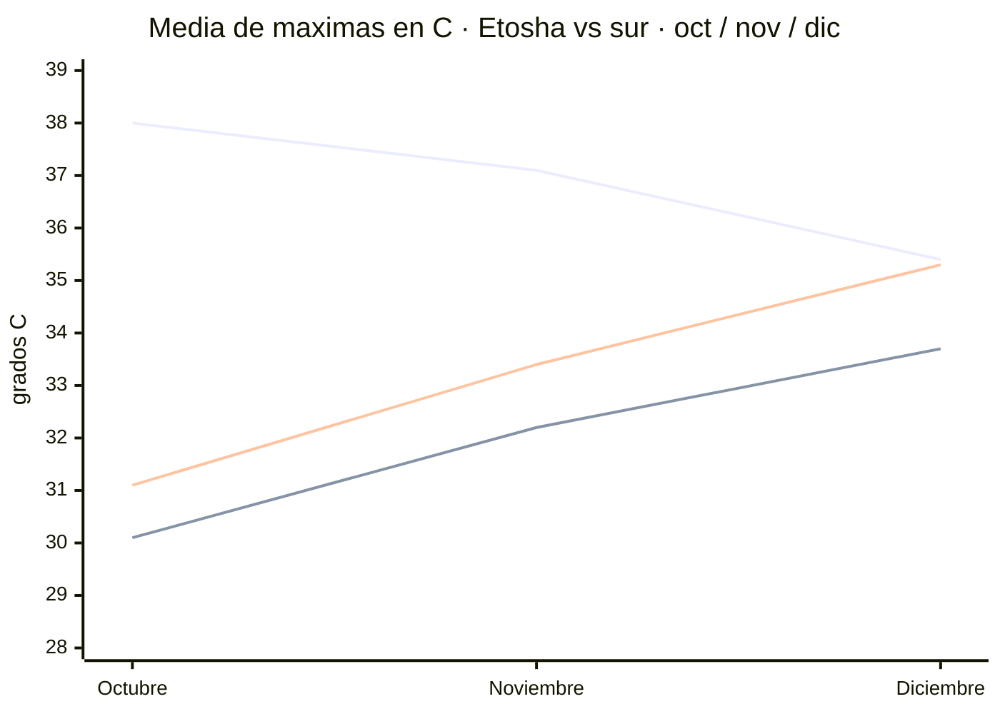
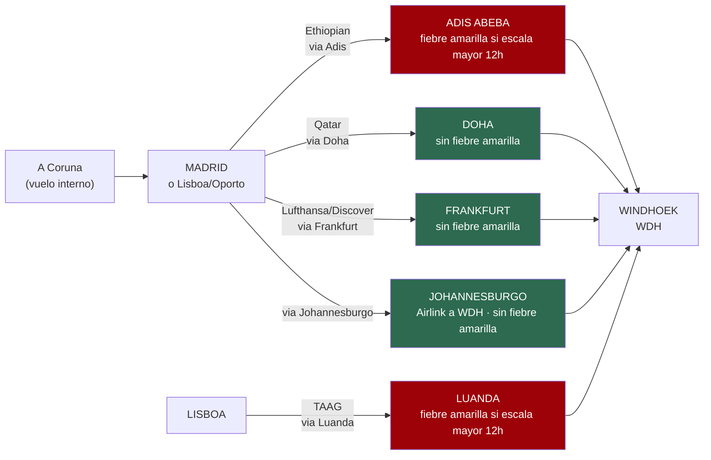

# Huecos cerrados — temperaturas, vuelos, tasas y lodges

Investigación cerrada el 17/07/2026 · **~N$20 = €1** · para el euro/dólar (vuelos) se usa **~$1,10 ≈ €1** e se avisa donde se aplica
**✅ primaria** · **◐ secundaria concordante** · **○ práctica común** · **❌ no verificado**

> ### ⚙️ Límite técnico de esta pasada — importante para auditar
> En este entorno **la descarga directa de páginas (WebFetch) está bloqueada** por la política de red:
> devuelve `403` incluso en dominios neutros. **Solo funciona la búsqueda web** (fragmentos indexados).
> Por eso, en las secciones nuevas (vuelos, tasas, lodges) **las cifras salen de fragmentos de
> búsqueda, no de un PDF o una web abierta y leída de principio a fin**. Eso las deja en **◐
> secundaria**, no en ✅ primaria — aunque **exista** la URL primaria y quede citada. **No se pudo
> verificar la extracción** contra el documento original. Una futura pasada con acceso de descarga
> debería abrir el PDF del MEFT y las tarifas de los lodges para subirlas a ✅.

> ## El contexto
> **Todas** las temperaturas que manejábamos venían de webs de marketing de safaris y fueron
> **refutadas 0–3**. Esta vez se fue a las fuentes de verdad: **NOAA GHCN-Daily**, **SASSCAL
> WeatherNet** (estaciones automáticas namibias) y las **normales oficiales del Servicio
> Meteorológico de Namibia**. Los datos de abajo son **cálculo propio sobre ficheros de observación
> diaria descargados**, no cifras copiadas de una agencia.

---

## 🌡️ El hallazgo: el *"suicide month"* depende de la LATITUD

> ### Las webs de safaris lo generalizan mal. En Etosha octubre SÍ es el pico. En el sur, NO.

*Líneas: **Okaukuejo (Etosha)** baja de oct a dic · **Fish River (Karios)** sube · **Keetmanshoop** sube.*

### 🦁 Etosha — **octubre es el pico** ✅

**Okaukuejo**, media de máximas:
- **Octubre 38,0 °C** ← el pico
- **Noviembre 37,1 °C**
- **Diciembre 35,4 °C**

*Serie 2010–2021, calculada sobre GHCN-Daily descargado.*

### 🏜️ El sur — **al revés: noviembre y diciembre son MÁS calurosos** ✅

**Fish River Canyon** (estación Karios, en el Gondwana Canyon Lodge):
- Octubre **30,1 °C** → **Noviembre 32,2 °C** → Diciembre **33,7 °C**

**Keetmanshoop**:
- Octubre **31,1 °C** → **Noviembre 33,4 °C** → Diciembre **35,3 °C**

> ### 👉 Qué significa esto para tu viaje
> Vas a finales de **noviembre**, y tu ruta cruza las dos zonas:
> - En **Etosha** pillas ~37 °C — **algo menos que en octubre**. El norte te sale **mejor** que si
>   hubieras ido en octubre.
> - En el **sur** (Fish River, Keetmanshoop) pillas ~32–33 °C — **más que en octubre**, pero
>   **menos que en diciembre**.
>
> **Noviembre es el compromiso**: ni el pico del norte ni el del sur.

---

## 🔥 Fish River Canyon en noviembre — el dato que más importa

**Estación Karios** (27,6745 S · **893 m**), en el Gondwana Canyon Lodge:

- **Media de máximas de noviembre: 32,2 °C** · media de mínimas **16,1 °C**
- Sobre **400 días de observación en 14 temporadas (2012–2025)**

**Récords de la serie 2012–2025:**
- Octubre **40,0 °C** (2015)
- **Noviembre 41,4 °C** (2019, repetido en 2023)
- Diciembre **41,8 °C** (2024)

Máximos absolutos de noviembre, año a año: 2012: 38,1 · 2013: 39,3 · 2014: 36,6 · **2015: 40,8** ·
2016: 39,4 · 2017: 37,9 · 2018: 38,2 · **2019: 41,4** · 2020: 38,0 · 2021: 39,8 · 2022: 38,5 ·
**2023: 41,4** · 2024: 39,6 · 2025: 38,6

> **Traducción: en el mirador, noviembre es caluroso pero no infernal (~32 °C de media). Pero puede
> puntualmente llegar a ~41 °C.** El récord de noviembre **supera al de octubre**.

### 🛑 Aviso crítico sobre Ai-Ais — y por qué NO hay cifra

> **La estación Karios está a 893 m, en la MESETA del cañón. Ai-Ais está en el FONDO**, varios
> cientos de metros más abajo, y por tanto es **sistemáticamente más caluroso** que esos 32,2 °C.
>
> **No hay medición de Ai-Ais.** No existe estación con datos de temperatura allí, ni en SASSCAL ni
> en GHCN. **No se convierte esto en cifra: sería inventarla.**

Ai-Ais tiene fama de extremo, y la física le da la razón — pero **la fama no es un dato**.

---

## 🎯 Keetmanshoop — el dato más sólido de todo el lote ✅

**Triple confirmación independiente.** Media de máximas de noviembre:

- **33,4 °C** — NOAA GHCN, 56 meses, serie **1957–2024**
- **33,2 °C** — SASSCAL, estación Gellap Ost, 13 temporadas
- **32,4 °C** — normales oficiales del **Servicio Meteorológico de Namibia**

**Tres redes distintas coinciden dentro de ~1 °C.** Media de mínimas de noviembre: **16,1 °C**.

Fila literal del PDF oficial del Servicio Meteorológico *(extraída con `pdftotext -layout`)*:

> `Keetmanshoop  Max T (°C)  34.8  34.0  32.2  28.8  25.0  21.7  21.3  23.5  27.2  30.1  32.4  34.5`

*(columnas ene…dic → **oct 30,1 · nov 32,4 · dic 34,5**)*

**Récords** (aeropuerto J.G.H. van der Wath, WMO 68312, 1.077 m — **la serie más larga descargada,
más de 50 años**):
- Octubre **40,7 °C** (07/10/2015)
- **Noviembre 42,7 °C** (29/11/2016)
- Diciembre **42,8 °C** (10/12/2024)

⚠️ El PDF oficial **no declara el periodo de la normal** — es un defecto de la fuente, no del dato.

---

## ✈️ VUELOS — A Coruña no tiene vuelo largo: se sale de Madrid, Lisboa u Oporto

**Ningún vuelo directo une España con Windhoek (WDH, Hosea Kutako).** Todas las opciones hacen
**una escala**. Desde A Coruña hay que sumar un vuelo interno o tren hasta el hub de salida
(Madrid es el más lógico: es de donde sale el largo radio a África austral).

> ### ⚠️ El factor que decide la ruta NO es el precio: es la FIEBRE AMARILLA
> La regla, confirmada en varias fuentes de salud de viaje: **hace falta certificado de fiebre
> amarilla si se transita MÁS de 12 horas en un país con riesgo de fiebre amarilla** (viajeros de
> 9 meses en adelante). Y **Namibia, a su vez, exige el certificado a quien llega desde un país de
> riesgo** ◐.
> - **Etiopía (Adís Abeba) SÍ es país de riesgo de fiebre amarilla.** ◐
> - **Angola (Luanda) SÍ es país de riesgo.** ◐
> - **Catar (Doha), Alemania (Fráncfort) y Sudáfrica (Johannesburgo) NO lo son.** ◐
>
> 👉 **Traducción práctica:** por Doha, Fráncfort o Johannesburgo **no hay problema de fiebre
> amarilla**. Por Adís o Luanda, **si la escala supera 12 h, el certificado pasa a ser obligatorio**
> — y conviene llevarlo igualmente para no arriesgar el embarque de vuelta a Namibia. Consultar con
> Sanidad Exterior en A Coruña antes de decidir ruta.

### Las rutas, con lo verificado

**🇪🇹 Ethiopian Airlines — vía Adís Abeba** ◐
- **Madrid → Adís**: vuelo directo **ET741, Boeing 787**, sale de MAD **21:25** (llega ADD 06:15) o
  **23:10** (llega 07:25); duración **~6 h 50 – 7 h 20**. **4 vuelos/semana** MAD-ADD.
- **Adís → Windhoek**: directo, **~5 h 45**.
- Ethiopian opera MAD-WDH **4 días/semana** (lunes, martes, jueves, sábado, según un agregador).
- ⚠️ **Escala en Adís**: si es corta (mañana) el tránsito queda **por debajo de 12 h** y no dispara el
  certificado; si la conexión obliga a **pernoctar**, lo supera. **Hay que mirar el horario concreto.**

**🇶🇦 Qatar Airways — vía Doha** ◐ · *(sin fiebre amarilla)*
- **Madrid → Doha**: directo, **~7 h 10**.
- **Doha → Windhoek**: directo, **~8 h 50 – 9 h 40** (~6.488 km).

**🇩🇪 Lufthansa (grupo Discover) — vía Fráncfort** ◐ · *(sin fiebre amarilla)*
- Madrid ↔ Windhoek con una escala en Fráncfort.

**🇿🇦 Airlink — vía Johannesburgo** ◐ · *(sin fiebre amarilla)*
- **Johannesburgo → Windhoek**: directo (hay que llegar antes a JNB desde Europa con otra compañía).

**🇦🇴 TAAG Angola — vía Luanda** ◐
- **Lisboa ↔ Johannesburgo** 4 vuelos/semana (DT578 sale JNB 18:00 lun/mié/vie/dom, llega LIS 07:10);
  **Luanda → Windhoek** directo **2 h 30**, **4 vuelos/semana** (TAAG es la única que lo hace sin escala).
- ⚠️ Misma cautela de fiebre amarilla que Adís (Luanda es zona de riesgo).

### Precios — SOLO instantáneas de fechas de muestra, NO una tarifa para finales de noviembre

> **Aviso rojo:** los números de abajo son **capturas sueltas de fechas concretas** que devolvió el
> buscador, **no tarifas cotizadas para finales de noviembre de 2026**. Sirven para hacerse una idea
> del **orden de magnitud**, nada más. La tarifa real hay que sacarla en el buscador de la aerolínea
> con las fechas exactas.

- **Más barato ida** (Ethiopian/Etihad): desde **€474 (~N$9.480)**.
- **Lufthansa, ida y vuelta MAD-WDH**: desde **€673 (~N$13.460)**.
- **Ethiopian**, muestra ida/vuelta 10-18 nov: **$784 (≈€710, ≈N$14.200)**.
- **Lufthansa**, muestra 8-21 nov: **$786-787 (≈€715, ≈N$14.300)**.

*Conversión $→€ aproximada a $1,10≈€1, marcada como aproximada. No se encontró tarifa de Qatar,
Airlink ni TAAG para las fechas concretas: **queda ❌ sin verificar** el precio de esas tres.*

**Fuentes vuelos:**
- Ethiopian: [ethiopianairlines.com MAD-WDH](https://www.ethiopianairlines.com/en-es/flights-from-madrid-to-windhoek) ·
  [flightconnections MAD-ADD](https://www.flightconnections.com/flights-from-mad-to-add) ·
  [flightsfrom ADD-WDH](https://www.flightsfrom.com/ADD-WDH)
- Qatar: [flightsfrom DOH-WDH](https://www.flightsfrom.com/DOH-WDH) · [qatarairways.com](https://www.qatarairways.com/en/destinations/flights-to-windhoek.html)
- Lufthansa: [lufthansa.com MAD-WDH](https://www.lufthansa.com/xx/en/flights/flight-madrid-windhoek)
- Airlink: [flyairlink.com JNB-WDH](https://www.flyairlink.com/en-za/flights-from-johannesburg-to-windhoek)
- TAAG: [flightconnections NBJ-WDH](https://www.flightconnections.com/flights-from-nbj-to-wdh)
- Fiebre amarilla: [CDC Yellow Book — Etiopía](https://wwwnc.cdc.gov/travel/yellowbook/2024/preparing/yellow-fever-vaccine-malaria-prevention-by-country/ethiopia) ·
  [Chalo Africa — Namibia](https://www.chaloafrica.com/namibia-health-vaccinations/)

---

## 🎫 TASAS DE PARQUE 2026 — sí hay documento oficial nuevo, y el precio SUBIÓ

> ### El hallazgo: el MEFT firmó un baremo nuevo el **15/01/2026**, en vigor desde el **1/04/2026**.
> Esto responde justo a lo que se pedía («busca el documento del MEFT posterior a abril de 2026»).
> **El documento existe y está publicado**: PDF *Park Entrance and Conservation Fees* en el sitio del
> MEFT. **No se pudo abrir aquí** (WebFetch bloqueado), así que la extracción de la tabla viene de
> **fuentes secundarias que coinciden** — queda **◐**, no ✅.

**Adulto internacional (no-SADC), por persona y día — el que os aplica:**
- **N$280 (~€14)**, desglosado en **N$140 (~€7) de entrada + N$140 (~€7) de conservación** ◐

Y el resto del baremo citado por las secundarias:
- **Adulto SADC**: N$180 (~€9) · **Adulto namibio**: N$60 (~€3)
- **Niño 8 a <16 internacional**: N$180 (~€9) · SADC N$100 (~€5) · namibio gratis
- **Niño <8**: gratis todas las nacionalidades
- **Vehículo hasta 10 plazas**: N$60 (~€3) · 11-25 plazas N$150 (~€8) · 26-50 N$600 (~€30) · 51+ N$1.000 (~€50)

> **Novedad frente a lo que teníamos:** antes el ~N$280 se apoyaba **solo** en fuente secundaria y sin
> desglose. Ahora sabemos que **es una subida de 2026** (varias fuentes hablan de **+86 % a +100 %**
> respecto al baremo anterior), con **estructura entrada+conservación** y **fecha de vigencia
> (1/04/2026)**. La cifra **N$280/adulto/día se mantiene como la mejor estimación**, ahora con más
> respaldo — pero **la lectura fina de la tabla sigue sin verificarse contra el PDF primario**.

**Para vuestro viaje:** Etosha y los parques del Namib-Naukluft (Sossusvlei/Sesriem) cobran esta tasa
**por persona y por día** dentro del parque. Dos adultos = **N$560/día (~€28)** solo de tasa de parque.

**Fuentes tasas:**
- **Primaria (existe, no abierta aquí):** [MEFT — Park Entrance and Conservation Fees (PDF)](https://www.meft.gov.na/files/downloads/543_Park%20Entrance%20and%20Conservation%20Fees.PDF)
- Secundarias concordantes: [etoshanationalpark.com.na — gate times & fees](https://etoshanationalpark.com.na/park-information/gate-times-and-fees/) ·
  [NWR — park entrance & conservation fees](https://www.nwr.com.na/park-entrance-and-conservation-fees-2/)

---

## 📅 ANTELACIÓN — cuánto hay que reservar Sesriem y Etosha

**Lo verificable es cualitativo, no un número exacto para noviembre.** Las fuentes de NWR insisten en
reservar **«lo antes posible»** y señalan que las plazas se agotan sobre todo **de junio a octubre y
en Semana Santa**. ◐

- **Noviembre no aparece marcado como pico** en las fuentes (el pico declarado es jun-oct), pero
  Sesriem tiene **muy pocas parcelas** y se llena todo el año.
- **No se encontró una cifra oficial de "X meses de antelación" para noviembre** → **❌ sin dato duro**.
  Práctica común ○: para dormir **dentro** de la puerta de Sesriem (imprescindible para el amanecer en
  Deadvlei, ver `05`) conviene reservar **con varios meses**, y cuanto antes mejor dado el poco cupo.

**Fuentes:** [NWR — Sesriem bookings](https://www.nwrnamibia.com/sesriem-bookings.htm) ·
[sossusvlei.org — Sesriem campsite](https://www.sossusvlei.org/accommodation/sesriem-camp-site/)

---

## 🏨 LODGES PRIVADOS — el precio por noche NO se pudo cerrar (y por qué)

**Sigue sin haber tarifa por noche verificada.** Motivo doble y honesto:
1. **WebFetch bloqueado**: no se pudieron abrir las páginas de tarifas (Gondwana, Desert Camp, NWR,
   info-namibia… todas dan `403`).
2. **Gondwana no publica precio estático**: sus fichas usan un botón *"Check Availability"* con fechas,
   así que **el precio por noche no aparece en el fragmento de búsqueda**. No hay número que copiar sin
   inventarlo.

> **Se deja en ❌ sin verificar** el precio/noche de Desert Camp, Desert Quiver Camp, Sossus Oasis,
> Taleni/Toshari/Etosha Safari Camp, Twyfelfontein Country Lodge, Quivertree Forest Rest Camp, Canyon
> Roadhouse, Cañon Village y Nest Hotel. Una pasada con descarga habilitada debería abrir
> gondwana-collection.com y desertcamp.com/rates.html y subirlos.

**Lo único concreto que sí devolvió el buscador** — **actividades** de Canyon Roadhouse (Fish River),
tarifa fijada para el periodo **1/11/2026 – 31/10/2027** ◐:
- Sendero a pie: **N$300/persona (~€15)**
- Experiencia amanecer: **N$940/persona (~€47)**
- Caminata del cañón: **N$560/persona (~€28)**
- Safari guiado 3 h: **N$1.760/persona (~€88)**

**Fuente:** [Gondwana — Canyon Roadhouse](https://gondwana-collection.com/accommodation/canyon-roadhouse)
*(datos vía fragmento de búsqueda; no se pudo abrir la ficha para verificar la extracción).*

---

## 📌 Cómo usar estos números

- Son **climatología**, no pronóstico. Valen como **distribución de probabilidad** para noviembre de
  2026, **no como predicción**.
- Los **récords son del periodo descargado** (2012–2025 en Karios, 1957–2024 en Keetmanshoop), **no
  récords históricos absolutos**.
- Enlaza con `05-conduccion.md`: **el calor es un peligro de conducción**. Neumáticos calientes ganan
  presión → mide **en frío cada mañana**; calor + poca presión + corrugado = **reventón**, y un
  reventón delantero a 80 en grava **es un vuelco**.
- Y con `07-logistica.md`: **4+ litros de agua por persona y día** en el coche. Un pinchazo a las
  15:00 con 40 °C es un **evento de exposición al calor**.

---

## 🕳️ Lo que sigue sin cerrarse

- 🛫 **Vuelos** — **AVANZADO** ✔️: rutas, escalas, duraciones y el factor fiebre amarilla ya están
  (arriba). **Falta**: tarifa real para las fechas exactas de finales de noviembre (los precios son
  instantáneas de muestra) y precio de Qatar/Airlink/TAAG (**❌ sin verificar**).
- 🎫 **Tasas oficiales** — **AVANZADO** ✔️: hay documento del MEFT de 2026 (firmado 15/01, vigente
  1/04/2026) y desglose N$140+N$140. **Falta**: abrir el PDF primario para verificar la tabla fina.
- 🏨 **Lodges privados** — **❌ sin cerrar**: precio/noche no verificado (WebFetch bloqueado + Gondwana
  no publica precio estático). Solo se salvaron las *actividades* de Canyon Roadhouse.
- 📅 **Antelación** — **cualitativo**: "lo antes posible"; sin cifra oficial de meses para noviembre.
- 🌡️ **Temperaturas de Sossusvlei/Sesriem, Lüderitz y Swakopmund**: **❌ siguen sin procesarse** con
  fuente meteorológica primaria (SASSCAL/NOAA no salen por fragmento de búsqueda y WebFetch está
  bloqueado). *(Dato ◐ de NWR ya recogido en `03`: Sesriem nov **34,1 / 15,5 °C**; Etosha nov
  **35,5 / 18,3 °C** — coherente con Okaukuejo, pero de fuente secundaria.)*
- ❌ **Ai-Ais**: sin estación, sin cifra. Solo se sabe que es **más caluroso que Karios**.
- ⚠️ **Temperaturas del sur (Karios/Keetmanshoop)**: buenas, de ficheros descargados en pasadas con
  acceso, pero algunas quedaron **1-1** de verificación. No se refutan; les falta el tercer voto.

**Fuentes:**
- NOAA GHCN-Daily: `WA010517310.dly` (Okaukuejo) · `WA004191820.dly` (Keetmanshoop, WMO 68312)
- [SASSCAL WeatherNet](https://sasscalweathernet.org) — estación 31207 (Karios, Gondwana Canyon Lodge)
- [Servicio Meteorológico de Namibia — normales climáticas](http://www.meteona.com/attachments/035_Namibia_Long-term_Climate_Statistics_for_Specified_Places%5B1%5D.pdf)
