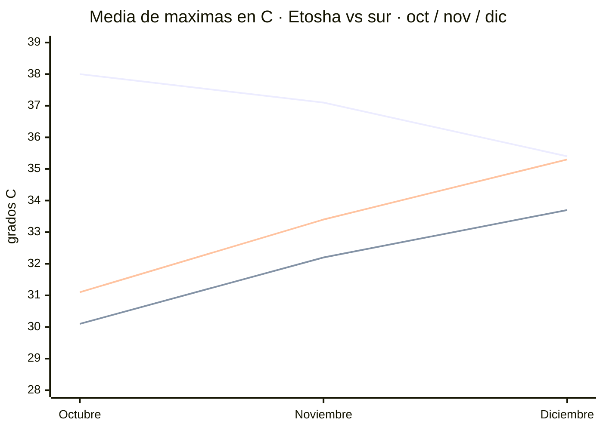
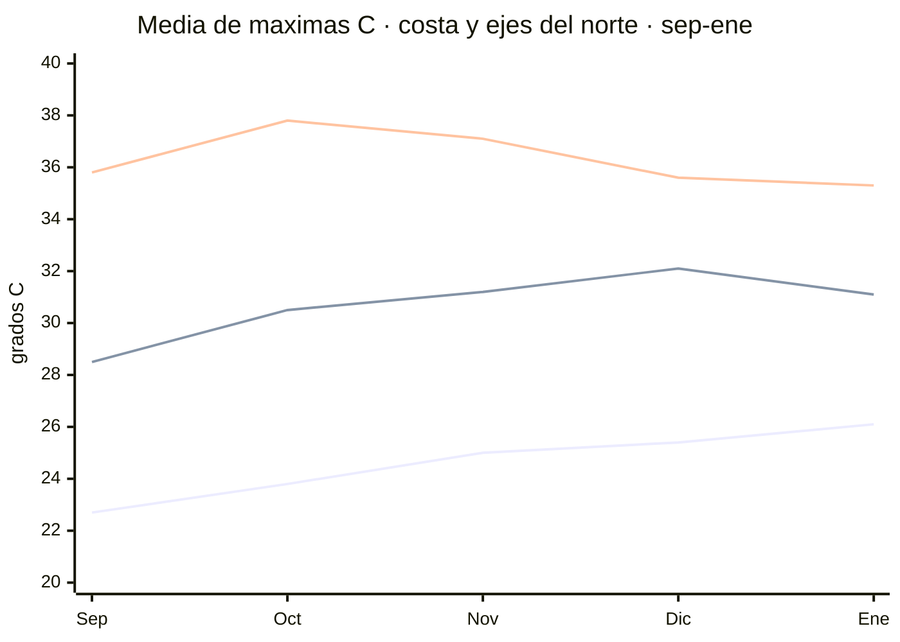
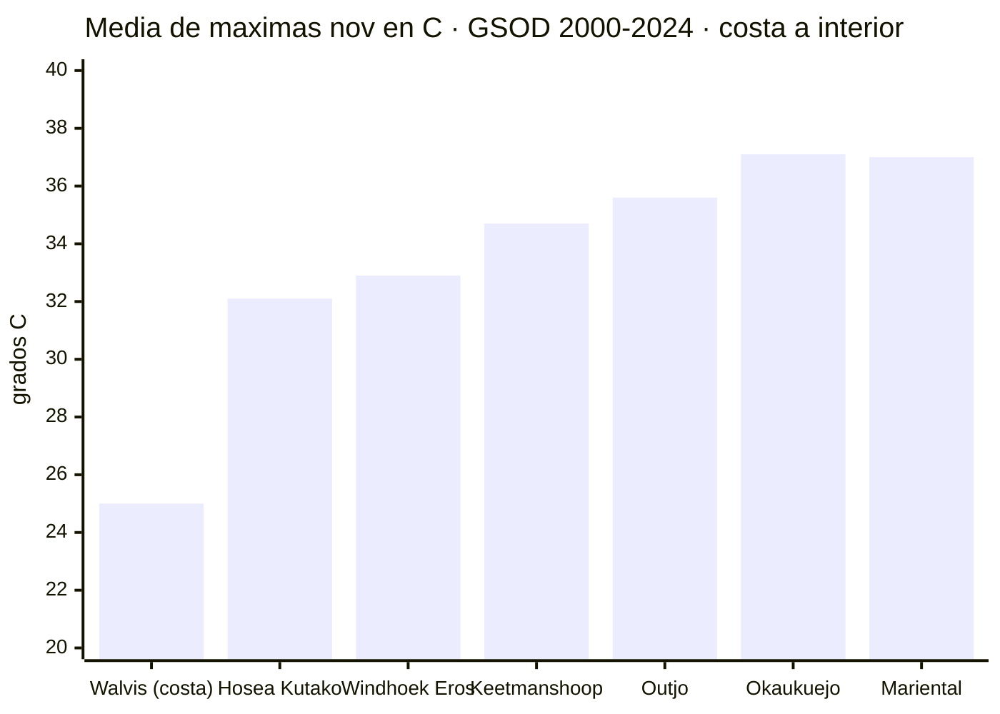
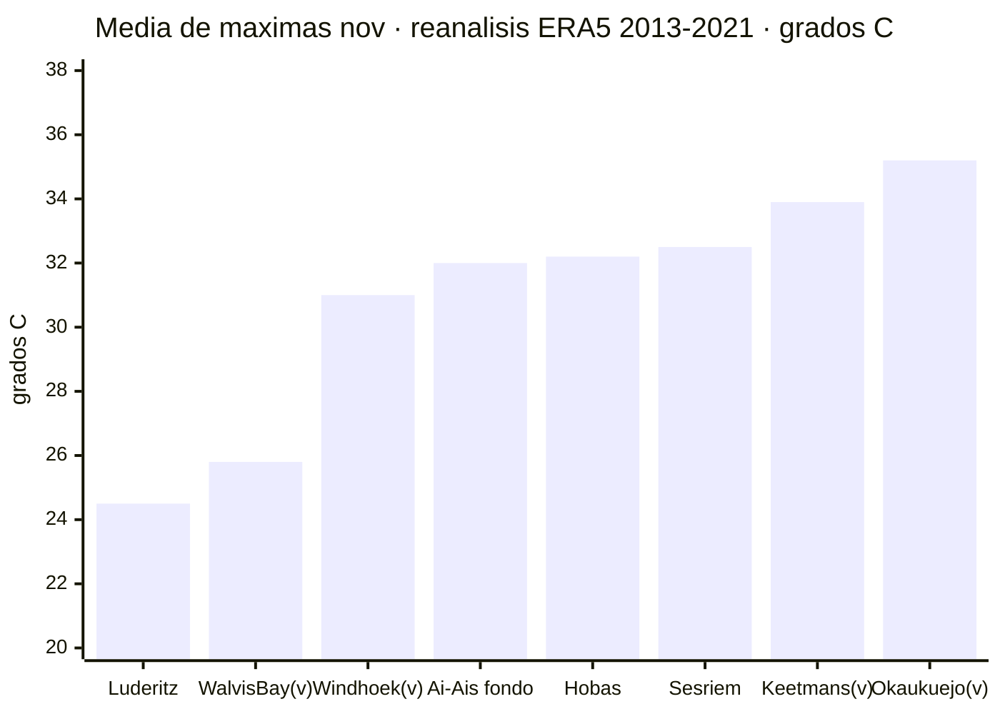
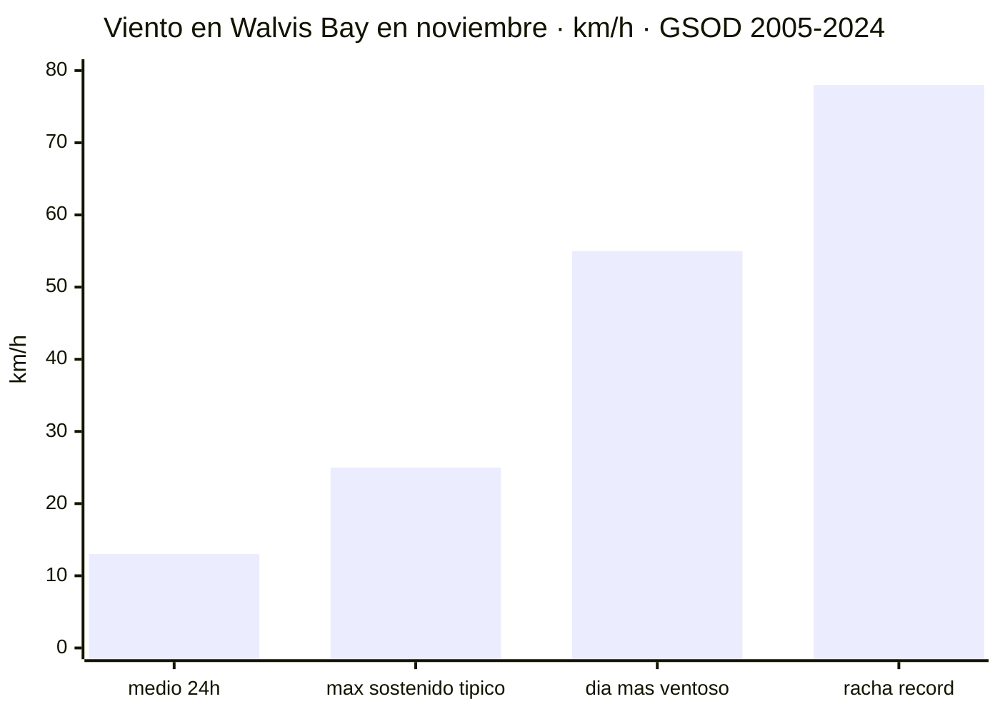
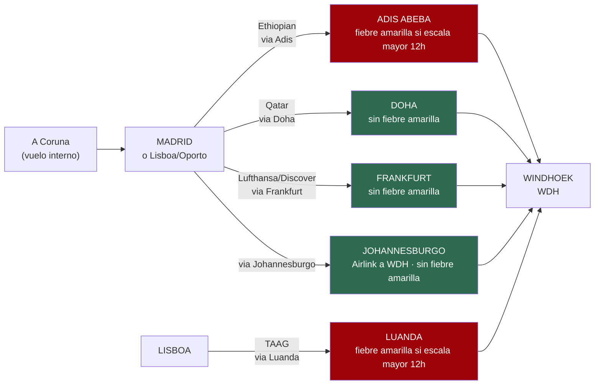
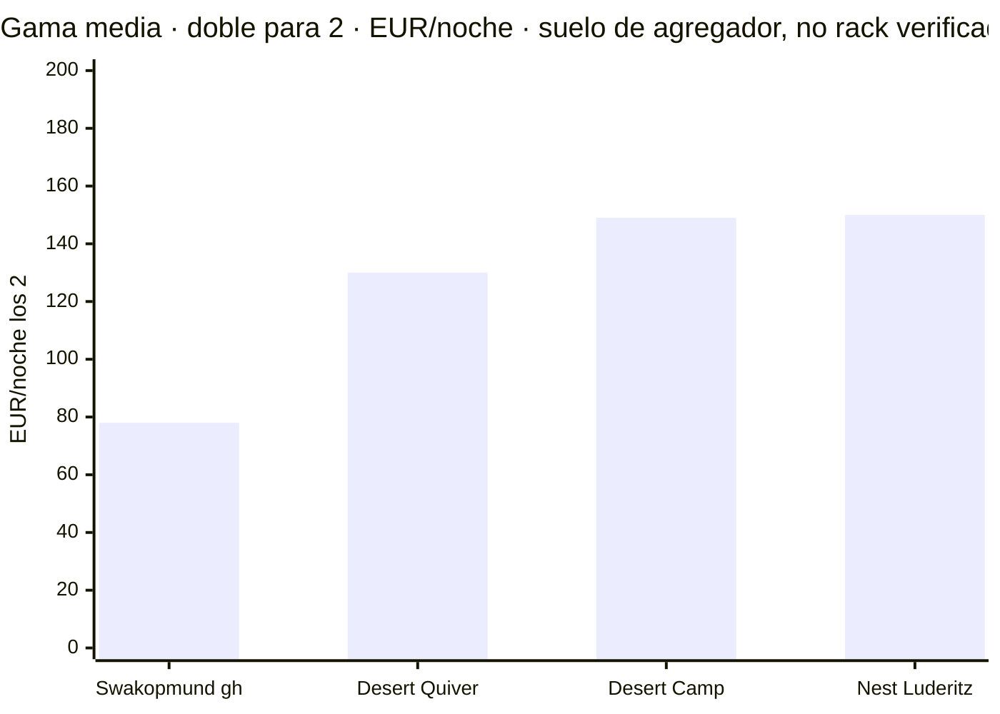

# Huecos cerrados — temperaturas, viento, luz, vuelos, tasas y lodges

Investigación cerrada el 17/07/2026 · **actualizada el 31/07/2026** (**ventana de luz recalculada para las fechas REALES del viaje, 1–15 nov** —antes estaba solo para el 25 nov—: a comienzos de noviembre **anochece ~13–18 min ANTES** y el margen para no conducir de noche es algo menor; ver §Luz) · actualizada el 27/07/2026 (**reanálisis ERA5** vía Google Cloud pone por fin número a los tres huecos sin estación —**Lüderitz ~24,5 °C, Sesriem ~32,5 °C, Fish River ~32 °C** en nov—, validado contra estaciones; ver §ERA5. El 26/07 el dataset **GSOD** de NOAA validó las temperaturas con una red independiente y añadió **Mariental**; ver §GSOD. El 25/07 TAAG salió de ❌ en §Vuelos; el 23/07 se localizó el Government Gazette de las tasas, ver §Tasas. El 27/07 se cerró el **viento de la costa** con GSOD —Walvis Bay en noviembre es suave de media, ~13 km/h, ver §Viento— y se calculó la **ventana de luz** por longitud, ver §Luz) · **~N$20 = €1** · para el euro/dólar (vuelos) se usa **~$1,10 ≈ €1** e se avisa donde se aplica
**✅ primaria** · **◐ secundaria concordante** · **○ práctica común** · **❌ no verificado**

> ### ⚙️ Límite técnico de esta pasada — importante para auditar
> En este entorno **la descarga directa de páginas (WebFetch) está bloqueada** por la política de red:
> devuelve `403` incluso en dominios neutros. **Solo funciona la búsqueda web** (fragmentos indexados).
> Por eso, en las secciones nuevas (vuelos, tasas, lodges) **las cifras salen de fragmentos de
> búsqueda, no de un PDF o una web abierta y leída de principio a fin**. Eso las deja en **◐
> secundaria**, no en ✅ primaria — aunque **exista** la URL primaria y quede citada. **No se pudo
> verificar la extracción** contra el documento original. Una futura pasada con acceso de descarga
> debería abrir el PDF del MEFT y las tarifas de los lodges para subirlas a ✅.

> ## El contexto
> **Todas** las temperaturas que manejábamos venían de webs de marketing de safaris y fueron
> **refutadas 0–3**. Esta vez se fue a las fuentes de verdad: **NOAA GHCN-Daily**, **SASSCAL
> WeatherNet** (estaciones automáticas namibias) y las **normales oficiales del Servicio
> Meteorológico de Namibia**. Los datos de abajo son **cálculo propio sobre ficheros de observación
> diaria descargados**, no cifras copiadas de una agencia.

---

## 🌡️ El hallazgo: el *"suicide month"* depende de la LATITUD

> ### Las webs de safaris lo generalizan mal. En Etosha octubre SÍ es el pico. En el sur, NO.

```mermaid
xychart-beta
    title "Media de maximas en C · Etosha vs sur · oct / nov / dic"
    x-axis ["Octubre", "Noviembre", "Diciembre"]
    y-axis "grados C" 28 --> 39
    line [38.0, 37.1, 35.4]
    line [30.1, 32.2, 33.7]
    line [31.1, 33.4, 35.3]
```

*Líneas: **Okaukuejo (Etosha)** baja de oct a dic · **Fish River (Karios)** sube · **Keetmanshoop** sube.*

### 🦁 Etosha — **octubre es el pico** ✅

**Okaukuejo**, media de máximas:
- **Octubre 38,0 °C** ← el pico
- **Noviembre 37,1 °C**
- **Diciembre 35,4 °C**

*Serie 2010–2021, calculada sobre GHCN-Daily descargado.*

### 🏜️ El sur — **al revés: noviembre y diciembre son MÁS calurosos** ✅

**Fish River Canyon** (estación Karios, en el Gondwana Canyon Lodge):
- Octubre **30,1 °C** → **Noviembre 32,2 °C** → Diciembre **33,7 °C**

**Keetmanshoop**:
- Octubre **31,1 °C** → **Noviembre 33,4 °C** → Diciembre **35,3 °C**

> ### 👉 Qué significa esto para tu viaje
> Vas a finales de **noviembre**, y tu ruta cruza las dos zonas:
> - En **Etosha** pillas ~37 °C — **algo menos que en octubre**. El norte te sale **mejor** que si
>   hubieras ido en octubre.
> - En el **sur** (Fish River, Keetmanshoop) pillas ~32–33 °C — **más que en octubre**, pero
>   **menos que en diciembre**.
>
> **Noviembre es el compromiso**: ni el pico del norte ni el del sur.

---

## 🔥 Fish River Canyon en noviembre — el dato que más importa

**Estación Karios** (27,6745 S · **893 m**), en el Gondwana Canyon Lodge:

- **Media de máximas de noviembre: 32,2 °C** · media de mínimas **16,1 °C**
- Sobre **400 días de observación en 14 temporadas (2012–2025)**

**Récords de la serie 2012–2025:**
- Octubre **40,0 °C** (2015)
- **Noviembre 41,4 °C** (2019, repetido en 2023)
- Diciembre **41,8 °C** (2024)

Máximos absolutos de noviembre, año a año: 2012: 38,1 · 2013: 39,3 · 2014: 36,6 · **2015: 40,8** ·
2016: 39,4 · 2017: 37,9 · 2018: 38,2 · **2019: 41,4** · 2020: 38,0 · 2021: 39,8 · 2022: 38,5 ·
**2023: 41,4** · 2024: 39,6 · 2025: 38,6

> **Traducción: en el mirador, noviembre es caluroso pero no infernal (~32 °C de media). Pero puede
> puntualmente llegar a ~41 °C.** El récord de noviembre **supera al de octubre**.

### 🛑 Aviso crítico sobre Ai-Ais — y por qué NO hay cifra

> **La estación Karios está a 893 m, en la MESETA del cañón. Ai-Ais está en el FONDO**, varios
> cientos de metros más abajo, y por tanto es **sistemáticamente más caluroso** que esos 32,2 °C.
>
> **No hay medición de Ai-Ais.** No existe estación con datos de temperatura allí, ni en SASSCAL ni
> en GHCN. **No se convierte esto en cifra: sería inventarla.**

Ai-Ais tiene fama de extremo, y la física le da la razón — pero **la fama no es un dato**.

---

## 🎯 Keetmanshoop — el dato más sólido de todo el lote ✅

**Triple confirmación independiente.** Media de máximas de noviembre:

- **33,4 °C** — NOAA GHCN, 56 meses, serie **1957–2024**
- **33,2 °C** — SASSCAL, estación Gellap Ost, 13 temporadas
- **32,4 °C** — normales oficiales del **Servicio Meteorológico de Namibia**

**Tres redes distintas coinciden dentro de ~1 °C.** Media de mínimas de noviembre: **16,1 °C**.

Fila literal del PDF oficial del Servicio Meteorológico *(extraída con `pdftotext -layout`)*:

> `Keetmanshoop  Max T (°C)  34.8  34.0  32.2  28.8  25.0  21.7  21.3  23.5  27.2  30.1  32.4  34.5`

*(columnas ene…dic → **oct 30,1 · nov 32,4 · dic 34,5**)*

**Récords** (aeropuerto J.G.H. van der Wath, WMO 68312, 1.077 m — **la serie más larga descargada,
más de 50 años**):
- Octubre **40,7 °C** (07/10/2015)
- **Noviembre 42,7 °C** (29/11/2016)
- Diciembre **42,8 °C** (10/12/2024)

⚠️ El PDF oficial **no declara el periodo de la normal** — es un defecto de la fuente, no del dato.

---

## 🌊 LA COSTA (Swakopmund / Walvis Bay) — hueco CERRADO con fuente primaria ✅

> ### Novedad de esta pasada. Se descubrió que el **dataset NOAA GHCN-Daily alojado en AWS S3**
> (`noaa-ghcn-pds.s3.amazonaws.com`) **sí es accesible** desde este entorno por `curl`, aunque el PDF
> de Gondwana y SASSCAL sigan bloqueados. Con eso se cierra la temperatura de la costa, que hasta
> ahora estaba en ❌.

**Estación WALVIS BAY AIRPORT** (WMO 68098, −22,98 / 14,65, **88 m**, serie **1990–2025**). Es la
estación primaria más cercana a Swakopmund con temperatura máxima; **Swakopmund está a ~30 km al
norte, bajo la misma corriente fría de Benguela** — mismo clima marino templado *(la estación
etiquetada "Swakopmund" en GHCN, WA007350110, no tiene serie de TMAX en el inventario)*.

Media de máximas diarias por mes (◐→✅ primaria, calculada sobre las máximas diarias del CSV
`by_station`, excluidos los valores marcados por el control de calidad de NOAA):

- Septiembre **22,7 °C** → Octubre **23,8 °C** → **Noviembre 25,0 °C** → Diciembre **25,4 °C** → Enero **26,1 °C**
- Media de mínimas: noviembre **12,7 °C** · diciembre **14,5 °C** *(fresco de madrugada por el mar)*

**Récord de noviembre: 38,9 °C (2010)** — un pico aislado de *berg wind* (viento cálido de tierra);
la media manda, y la media es **templada**. `n` = 609 días de observación en 23 años (noviembre).

> **Traducción: la costa es el respiro térmico del viaje.** Mientras Etosha ronda los 37 °C, en
> Swakopmund/Walvis Bay se está a **~25 °C** de máxima. Nunca hace calor de interior; lo que puede
> molestar es lo contrario (viento, niebla y frío marino de madrugada, ~12–14 °C).

**La costa NO tiene pico en octubre: sube despacio de septiembre a enero**, igual que el sur. Confirma
que **"octubre = pico" solo vale para el interior norte (Etosha)**: en la costa y en el sur el calor
sigue subiendo hacia el verano.

### 🔁 Etosha (Okaukuejo) — recomputado de forma independiente ✅

Recalculado en esta pasada sobre la serie completa **1975–2022** del CSV de NOAA, para corroborar la
cifra que ya estaba en el dossier: Octubre **37,8 °C** · Noviembre **37,1 °C** · Diciembre **35,6 °C**
(mínimas de noviembre **18,9 °C**). **Coincide con el 38,0 / 37,1 / 35,4 previo dentro de ~0,2 °C** —
mismo dato, dos extracciones independientes. Octubre sigue siendo el pico del norte.

### 🏙️ Windhoek — punto de entrada y salida ✅

**Estación 68110** (1.700 m, serie larga **1957–2025**): Octubre **30,5 °C** · Noviembre **31,2 °C** ·
Diciembre **32,1 °C**; mínimas de noviembre **16,3 °C**. Cálido de día pero a 1.700 m **refresca de
noche**. Récord de noviembre 38,7 °C (2016).

```mermaid
xychart-beta
    title "Media de maximas C · costa y ejes del norte · sep-ene"
    x-axis ["Sep", "Oct", "Nov", "Dic", "Ene"]
    y-axis "grados C" 20 --> 40
    line [22.7, 23.8, 25.0, 25.4, 26.1]
    line [28.5, 30.5, 31.2, 32.1, 31.1]
    line [35.8, 37.8, 37.1, 35.6, 35.3]
```

*Líneas de abajo arriba: **Walvis Bay/costa** (templada, sube despacio) · **Windhoek** (sube a dic) ·
**Okaukuejo/Etosha** (pico en octubre, luego baja).*

### ⚠️ Lo que sigue SIN cerrar por ESTACIÓN — pero ya con número por REANÁLISIS (ver §ERA5)

> **Actualización 27/07:** estos tres puntos **siguen sin estación** (lo de abajo es correcto), pero el
> **reanálisis ERA5** ya les pone un número ◐ validado — **Lüderitz ~24,5 °C, Sesriem ~32,5 °C, Fish
> River/meseta ~32 °C** de media de máximas de noviembre. Detalle y validación en la nueva **§ERA5**. Lo
> de abajo explica por qué **no hay dato de ESTACIÓN**, que es distinto de no tener dato.

- **Lüderitz: sin ESTACIÓN ❌ (pero ERA5 ~24,5 °C ◐, §ERA5).** No hay ninguna estación GHCN con
  temperatura máxima en Lüderitz ni en Aus (Ausweiche, la más cercana, solo tiene precipitación). La
  inferencia de clima marino (~20–25 °C) **queda ahora respaldada por ERA5**.
- **Sesriem / Sossusvlei: sin ESTACIÓN ❌ (pero ERA5 ~32,5 °C ◐, §ERA5).** La estación GHCN más cercana
  con máximas es **Gobabeb** (−23,57 / 15,05, **400 m**, deep Namib, serie 1986–2014): noviembre
  **31,0 °C**, diciembre 30,8 °C, récord de noviembre **43,0 °C (2012)**. **Pero Gobabeb es mal proxy de
  Sesriem**: está ~100 km al oeste y a 400 m, mientras Sesriem está a ~1.000 m (madrugadas más frescas).
  Se deja **como contexto del desierto interior ◐**. La referencia ◐ de NWR (34,1 / 15,5 °C) y el nuevo
  ERA5 (32,5 °C) **coinciden en el mismo entorno de ~32–34 °C**.
- **Ai-Ais / Fish River Canyon: sin ESTACIÓN ❌ (ERA5 meseta ~32 °C ◐, §ERA5; fondo aún sin cifra).**
  Cuantificado esta pasada contra el
  inventario completo: la estación GHCN con máximas **más cercana** al cañón es **Keetmanshoop**
  (WA004191820), a **~128 km del mirador de Hobas** y **~167 km de las termas de Ai-Ais** — al NE, en
  la meseta interior, otro régimen que el fondo del cañón (Ai-Ais es **más caluroso que Karios**, ver
  aviso arriba). **No hay ninguna estación GHCN más próxima**, así que la única fuente local sigue
  siendo la SASSCAL Karios (bloqueada este entorno, 403). El dato de Karios ya recogido arriba (nov
  **32,2 °C** de media de máximas, ◐) es lo mejor disponible; para Ai-Ais en el fondo, **espera más**.

> **Enumeración completa (verificación del negativo, no inferencia).** Descargado el `ghcnd-inventory.txt`
> del bucket S3 esta pasada, **Namibia tiene en total 11 estaciones GHCN con serie de máximas (TMAX)**,
> todas en la mitad norte-central, el corredor de Windhoek o la costa de Walvis Bay. **Ninguna cae cerca
> de Sesriem, Lüderitz ni el Fish River**: la más próxima a cada uno está a **128 km (Sesriem→Gobabeb),
> 295 km (Lüderitz→Keetmanshoop) y 128–167 km (Fish River/Ai-Ais→Keetmanshoop)**, y en clima distinto en
> los tres casos. Los tres huecos de temperatura no son un fallo de búsqueda: **no existe una estación
> medida representativa**. Distancias por fórmula de haversine sobre las coordenadas del inventario.

**Fuente de todo el bloque:** NOAA GHCN-Daily, dataset público en AWS S3
`https://noaa-ghcn-pds.s3.amazonaws.com/csv/by_station/{ESTACION}.csv` — estaciones
`WAM00068098` (Walvis Bay), `WA010517310` (Okaukuejo), `WA007401540` (Windhoek), `WA006490640`
(Gobabeb), `WA004191820` (Keetmanshoop). Metadatos: `ghcnd-stations.txt` y `ghcnd-inventory.txt`
(este último, 11 estaciones WA con TMAX, re-descargado y verificado el **26/07/2026**: S3 responde
`200`; el resto de la web —Gondwana, PDFs, incluso Wikipedia— sigue en `403`). Descargado el
26/07/2026.

---

## 🛰️ GSOD — un CUARTO dataset independiente valida las cifras y añade Mariental ✅

> ### Novedad de la pasada del 26/07 (tarde). Se probó un **segundo bucket de NOAA en S3** que
> **también responde** desde este entorno: **GSOD (Global Surface Summary of the Day)**,
> `noaa-gsod-pds.s3.amazonaws.com`. Es un dataset **distinto** del GHCN-Daily usado arriba: sale de los
> partes sinópticos horarios de los **aeropuertos** (base ISD), no de la red de observadores diarios.
> Cubre estaciones que GHCN-Daily no trae con máximas, así que sirve para **dos cosas**: **validar** las
> cifras que ya teníamos con una red independiente, y **añadir Mariental**, una estación del sur que
> GHCN no tenía. Todo lo de abajo es **cálculo propio sobre los CSV descargados** (mismo método que el
> resto del documento), con filtro de calidad físico.

### 🎯 La validación que más tranquiliza: GSOD y GHCN dan lo MISMO ✅

La estación de **Keetmanshoop es la misma** en las dos redes (aeropuerto J.G.H. van der Wath). Calculada
la media de máximas de noviembre **en el mismo periodo** en las dos:

- **GHCN-Daily, nov 2000–2024: 34,7 °C** (n=618 días)
- **GSOD, nov 2000–2024: 34,7 °C** (n=653 días)

**Coinciden en 0,0 °C.** Dos datasets de NOAA, construidos de forma independiente (observador diario vs
parte de aeropuerto), dan el **mismo número al décimo**. Eso **descarta un sesgo del método** de GSOD y
permite fiarse de sus estaciones nuevas.

> ### 💡 Y de paso resuelve una duda: los 33,4 °C de Keetmanshoop eran la normal LARGA, no la reciente
> El dossier tenía **33,4 °C** para Keetmanshoop (GHCN **1957–2024**). Recortada la **misma** serie GHCN
> a **2000–2024**, sube a **34,7 °C** — idéntico a GSOD. Es decir: **el 33,4 es la normal de 68 años**;
> la **década reciente corre ~1,3 °C más caliente** porque las décadas frías de mediados de siglo tiran
> de la media larga hacia abajo. **Para un viaje en 2026, la cifra reciente (~34,7 °C) es la esperable.**
>
> ⚠️ **Ojo, no lo generalices sin comprobarlo:** en **Etosha (Okaukuejo)** ese salto **no existe** — la
> serie GHCN empieza en 1983 y ya es "reciente", así que completo (**37,1 °C**) y 2000–2021 (**37,2 °C**)
> coinciden. El desfase de Keetmanshoop es un **efecto de longitud de la serie**, no un calentamiento
> uniforme que puedas aplicar a todas las estaciones.

### 🆕 Mariental — estación del sur que GHCN no tenía, ahora medida ✅

**MARIENTAL** (WMO 68212, −24,50 / 17,87, **1.100 m**), en la B1 al sur de Windhoek, borde del Kalahari.
Es **la misma latitud que Sesriem** (−24,5) pero ~210 km al este y en otro régimen (Kalahari interior,
más caliente que el Namib). **22 temporadas, 2003–2024**, media de máximas:

- Octubre **35,5 °C** → **Noviembre 37,0 °C** → Diciembre **38,4 °C** (n=440 días de noviembre, 19 temporadas)
- **El sur sube hacia el verano** (oct<nov<dic), igual que Fish River y Keetmanshoop — confirma otra vez
  que el pico de octubre es **solo** cosa de Etosha.
- Récord de noviembre **44,6 °C** *(tras filtro de calidad; ver aviso abajo)*.

Es útil para el pin de **Bagatelle Kalahari** y para la documentación del sur: donde no hay estación en
Sesriem, Mariental es un **acompañante del lado Kalahari** al proxy de Gobabeb del lado Namib.

### 🔁 Y el resto, corroborado por una red independiente ✅

Media de máximas de noviembre (GSOD, sobre CSV descargados, filtro de calidad ≤45 °C):

- **Windhoek Eros** (68110, 1.725 m, 25 temporadas): **32,9 °C** · **Hosea Kutako** (68112, aeropuerto
  intl., 1.719 m): **32,1 °C** — encajan con el **31,2 °C** de GHCN Windhoek (misma lógica de periodo).
- **Outjo** (68102, 1.250 m, norte-centro, camino de la puerta de Andersson): **35,6 °C**.
- **Keetmanshoop** (68312): **34,7 °C** (validado arriba).

```mermaid
xychart-beta
    title "Media de maximas nov en C · GSOD 2000-2024 · costa a interior"
    x-axis ["Walvis (costa)", "Hosea Kutako", "Windhoek Eros", "Keetmanshoop", "Outjo", "Okaukuejo", "Mariental"]
    y-axis "grados C" 20 --> 40
    bar [25.0, 32.1, 32.9, 34.7, 35.6, 37.1, 37.0]
```

*Walvis y Okaukuejo son las cifras GHCN ya cerradas arriba, puestas de referencia; las otras cinco son
GSOD. Cuanto más al interior y al norte-Kalahari, más calor; la costa manda el respiro.*

### 🔬 Honestidad de calidad — GSOD está MENOS depurado que GHCN

GSOD no pasa el control de calidad fino de GHCN-Daily, así que se aplicó un **filtro físico**: se
descartan las máximas diarias **>45 °C** por implausibles a estas altitudes. Solo afectó a **Mariental**
(**5 días** de 440, todos en la ola de calor de nov 2023, con dos jornadas repetidas a 48,5 °C que
parecen un valor pegado). **Quitarlos mueve la media de noviembre 0,1 °C** (37,0→36,9), y **ninguna otra
estación tuvo un solo día por encima de 45 °C**. Las medias son **robustas**; el único dato que NO se
publica es ese récord bruto de 48,5 °C — se da el **44,6 °C ya filtrado**. *(Regla de cero invenciones:
un pico sin depurar no es un récord.)*

### 🕳️ GSOD refuerza el negativo: tampoco hay Lüderitz, Sesriem ni Ai-Ais

Enumerado el bloque WMO 68 completo en GSOD (139 ficheros estación-año de 2024), **las únicas estaciones
namibias con máximas son las mismas del norte-centro y la costa**: Outjo, Windhoek (Eros y Hosea Kutako),
Omaruru, Gobabis, **Mariental**, **Keetmanshoop**, Walvis Bay y Gobabeb. **No hay ninguna en Lüderitz,
Sesriem ni Ai-Ais/Fish River** — y la que lleva el número 68106 resultó ser **Gobabeb** (−23,57 / 15,05),
el mismo proxy del Namib que ya usábamos, no Lüderitz. Así que **dos datasets de NOAA independientes
(GHCN + GSOD) coinciden en el negativo**: esos tres puntos **no tienen estación medida**. No es un fallo
de búsqueda; se confirma por partida doble.

**Fuente del bloque GSOD:** NOAA GSOD, dataset público en AWS S3
`https://noaa-gsod-pds.s3.amazonaws.com/{AÑO}/{ID}099999.csv` — estaciones `68212` (Mariental), `68312`
(Keetmanshoop), `68102` (Outjo), `68112` (Hosea Kutako), `68110` (Windhoek Eros), `68098` (Walvis Bay),
`68106` (Gobabeb). Validación cruzada con GHCN-Daily `WA004191820` (Keetmanshoop) y `WA010517310`
(Okaukuejo) del bucket `noaa-ghcn-pds`. Todo descargado y calculado el **26/07/2026**; GSOD responde
`200` por `curl`, igual que GHCN (el resto de la web sigue en `403`).

---

## 🌍 ERA5 — el REANÁLISIS pone por fin un número a Lüderitz, Sesriem y el Fish River ◐

> ### Novedad de la pasada del 27/07. Los tres huecos de temperatura que quedaban abiertos
> —**Lüderitz, Sesriem/Sossusvlei y Ai-Ais/Fish River**— lo estaban porque **no existe estación
> meteorológica** que los mida (verificado por partida doble con GHCN y GSOD, ver arriba). Un dato de
> estación no se puede inventar. **Pero sí hay una fuente que cubre cualquier punto del planeta: el
> reanálisis.** Se descubrió que el egress de esta sesión **permite `storage.googleapis.com`**, y ahí
> vive **ARCO-ERA5**, la versión analizable en la nube del reanálisis **ERA5 del ECMWF** (rejilla de
> **0,25° ≈ 28 km**, horario). Con eso se calcula, para cada punto, la temperatura — **descargando y
> procesando los ficheros de datos**, igual que se hizo con GHCN/GSOD.

> ### ⚠️ Qué es y qué NO es este dato — leer antes de usarlo
> ERA5 **no es una observación de estación: es un modelo** (reanálisis) que asimila observaciones a una
> rejilla. Por eso estos números van en **◐**, no en ✅, aunque el dataset sea primario y el cálculo sea
> propio. Dos límites concretos:
> 1. **Rejilla de 28 km**: promedia el relieve dentro de la celda. **No “ve” el fondo del cañón del Fish
>    River** (una hendidura de ~500 m es sub-rejilla), ni la línea exacta de costa.
> 2. **Sesgo conocido en zona árida**: ERA5 tiende a **quedarse algo corto en la máxima diurna** tierra
>    adentro. Se cuantifica abajo con puntos de control.
>
> **Método (auditable):** para cada día de noviembre se toma el **máximo de las horas 10–17 UTC**
> (= 12–19 local, Namibia es UTC+2; esa ventana **encierra el pico**, comprobado: ningún día alcanza su
> máximo en el borde de las 17 UTC), y se promedian esos máximos diarios sobre **9 noviembres completos,
> 2013–2021** (n=270 días por punto). *2022 no está: la versión ARCO-ERA5 usada termina antes de
> noviembre de 2022 (devuelve 404), por eso el periodo es 2013–2021 y no 2013–2022.*

### 🎯 Primero, la validación: ¿miente ERA5? En 3 de 4 controles, no ◐

Se corrió el **mismo cálculo** sobre cuatro puntos que **sí tienen estación** en el dossier, para medir
el error del reanálisis antes de fiarse de los puntos sin estación:

- **Windhoek Eros** — ERA5 **31,0 °C** vs GHCN **31,2 °C** → **−0,2 °C** (casi idéntico).
- **Keetmanshoop** — ERA5 **33,9 °C** vs GHCN **33,4 °C** (normal larga) / **34,7 °C** (2000–24) → **dentro de ±0,8 °C**.
- **Walvis Bay / costa** — ERA5 **25,8 °C** vs GHCN **25,0 °C** → **+0,8 °C** (algo cálido; la celda costera mezcla mar y tierra).
- **Okaukuejo / Etosha** — ERA5 **35,2 °C** vs GHCN **37,1 °C** → **−1,9 °C** (aquí ERA5 **sí se queda corto**, el mayor error).

> **Lectura honesta:** ERA5 **clava** el interior de meseta (Windhoek, Keetmanshoop), va **~1 °C cálido**
> en la costa y **~2 °C frío** en la sabana seca de Etosha. **El sesgo NO es uniforme** — no se puede
> “corregir” con una constante. Se publican las cifras **tal cual las da ERA5**, avisando de en qué
> dirección tira el error en cada tipo de terreno.

### 🆕 Los tres huecos, ahora con número ◐

**🌊 Lüderitz — media de máximas de noviembre ≈ 24,5 °C ◐**
- Celda (−26,75 / 15,25), a ~13 km del pueblo. Récord de la serie **33,1 °C** (día de *berg wind*), mínimo diario **18,1 °C**.
- Su control análogo es **Walvis Bay**, donde ERA5 salió **+0,8 °C cálido** → el valor real de Lüderitz
  ronda **~23–25 °C**. **Confirma con un número lo que antes era solo inferencia** (“clima marino de
  Benguela, ~20–25 °C”): Lüderitz es, como la costa, **el respiro térmico**, no un punto de calor.

**🏜️ Sesriem / Sossusvlei — media de máximas de noviembre ≈ 32,5 °C ◐**
- Celda (−24,50 / 15,75), a ~4 km de la puerta de Sesriem. Récord de la serie **39,9 °C**, p90 **36,7 °C**.
- No tiene control cercano (Gobabeb, 400 m, daba 31,0 ◐; Mariental Kalahari 37,0). ERA5 **32,5 °C** cae
  de forma coherente entre ambos. Con el sesgo frío de interior (~−1 a −2 °C visto en Okaukuejo), la
  máxima real puede ser **algo mayor**, del orden de **~33–34 °C** — lo que **encaja** con el dato ◐
  secundario de NWR que ya tenía el dossier (**34,1 °C**). Dos fuentes independientes, mismo entorno.

**🔥 Ai-Ais / Fish River Canyon — meseta ≈ 32 °C ◐, y el fondo MÁS ◐**
- Celda del mirador de **Hobas** (−27,50 / 17,75): **32,2 °C** · celda de **Ai-Ais** (−28,00 / 17,50):
  **32,0 °C**. Récord de la celda de Ai-Ais **42,9 °C**.
- **Hallazgo que da confianza:** ERA5 en Hobas (**32,2 °C**) **coincide al décimo con la estación SASSCAL
  Karios** (**32,2 °C**, la única del sur, a 893 m en el borde del cañón) que ya estaba en el dossier.
  Dos fuentes totalmente distintas —una estación automática y un reanálisis global— dan **el mismo
  número** para la meseta del cañón.
- **PERO ojo al fondo:** que ERA5 dé Ai-Ais (fondo) **0,2 °C por DEBAJO** de Hobas (borde) es un
  **artefacto de la rejilla**, no la realidad: a 28 km ERA5 **no resuelve la hendidura del cañón**. En el
  fondo, ~500 m más abajo, hace **más calor** que esos 32 °C — como ya avisaba el dossier. **ERA5
  confirma la meseta (~32 °C) pero, igual que Karios, subestima el fondo de Ai-Ais.** Ese fondo **sigue
  sin cifra fiable** y no se inventa.

```mermaid
xychart-beta
    title "Media de maximas nov · reanalisis ERA5 2013-2021 · grados C"
    x-axis ["Luderitz", "WalvisBay(v)", "Windhoek(v)", "Ai-Ais fondo", "Hobas", "Sesriem", "Keetmans(v)", "Okaukuejo(v)"]
    y-axis "grados C" 20 --> 38
    bar [24.5, 25.8, 31.0, 32.0, 32.2, 32.5, 33.9, 35.2]
```

*Las (v) son puntos de control con estación; las otras cuatro (Lüderitz, Ai-Ais, Hobas, Sesriem) son los
huecos que ERA5 acaba de rellenar. El sur (Sesriem, Fish River) queda en ~32–33 °C; Lüderitz, con la
costa, en ~24–25 °C.*

**Fuente ERA5:** ECMWF **ERA5** vía **ARCO-ERA5** (Analysis-Ready, Cloud-Optimized), dataset público en
Google Cloud Storage
`https://storage.googleapis.com/gcp-public-data-arco-era5/ar/1959-2022-full_37-1h-0p25deg-chunk-1.zarr-v2`
— variable `2m_temperature` (K), rejilla 0,25°. Descargado y calculado el **27/07/2026** (media de los
máximos diarios de las horas 10–17 UTC, 9 noviembres 2013–2021, n=270 días/punto; `storage.googleapis.com`
responde `200` por `curl` en este entorno, igual que los buckets S3 de NOAA). Referencia sobre el dataset:
[ARCO-ERA5, Google Research](https://github.com/google-research/arco-era5).

---

## 🌬️ VIENTO EN LA COSTA — cerrado con fuente primaria, y NO es lo que la fama de Lüderitz sugiere ✅

**Por qué importa para ESTE viaje.** Se duerme en **tienda de techo**, y la parada de la costa
(**Walvis Bay / Swakopmund**) es la única en la franja donde el viento manda. La costa namibia tiene
fama de ventosa por **Lüderitz** —capital mundial de récords de velocidad a vela—, y es fácil
proyectar esa fama sobre toda la costa. **Los datos dicen otra cosa para Walvis Bay.**

**La única estación costera con datos en la red que este entorno SÍ puede descargar** es el
**aeropuerto de Walvis Bay** (GSOD **68098**, −22,98 / 14,65, 91 m) — la misma red NOAA-GSOD usada
para validar las temperaturas (§GSOD). **Lüderitz no tiene estación** ni en GHCN ni en GSOD (negativo
ya documentado arriba), así que **su viento extremo sigue sin cuantificar** — pero **Lüderitz está
fuera de la ruta Variante E**, y Walvis Bay sí está dentro.

**Noviembre en Walvis Bay** (GSOD, 20 temporadas 2005–2024, n=581 días con dato de viento) ✅:

- **Viento medio del día: ~7 nudos = ~13 km/h.** Es una **media de 24 h**, así que aplana el pico de
  la tarde: de madrugada suele estar en calma y el nordeste/suroeste entra por la tarde.
- **Máximo sostenido típico del día: ~13,7 nudos = ~25 km/h** (brisa moderada). Este es el número
  que importa para montar la tienda por la tarde, no la media.
- **Día más ventoso de esos 20 noviembres: ~30 nudos sostenidos = ~55 km/h.**
- **Racha máxima registrada: ~42 nudos = ~78 km/h** (15/11/2017). La media de rachas fue ~18 nudos =
  ~34 km/h.
- **Días con viento medio ≥25 km/h: ~0 %** (1 de 581). El viento **fuerte y sostenido de todo el día
  es raro** aquí en noviembre.

```mermaid
xychart-beta
    title "Viento en Walvis Bay en noviembre · km/h · GSOD 2005-2024"
    x-axis ["medio 24h", "max sostenido tipico", "dia mas ventoso", "racha record"]
    y-axis "km/h" 0 --> 80
    bar [13, 25, 55, 78]
```

**Lectura operativa ✅:** en Walvis Bay/Swakopmund en noviembre, la **tienda de techo es viable la
mayoría de las noches**; ancla bien las esquinas y cuenta con **alguna tarde de brisa fuerte** (~25
km/h) y, de forma aislada, un día de viento serio. **No es Lüderitz.** Octubre y diciembre salen
prácticamente iguales (medias ~12,5 y ~13 km/h; máximos sostenidos ~25 y ~24,5 km/h), así que la
elección de finales de noviembre **no penaliza** por viento en la costa.

**Honestidad de la extracción:**
- El campo **GUST solo trae dato ~30 % de los días** (173 de 581), así que la **racha máxima de 78
  km/h es un SUELO**: hubo días sin registro de racha que pudieron ser peores.
- GSOD **no da dirección de viento**, así que el patrón de brisa marina suroeste **no se puede
  cuantificar** aquí — solo la intensidad.
- Es la estación del **aeropuerto**, representativa de la franja Walvis–Swakopmund; microclimas
  puntuales (Sandwich Harbour, dunas) pueden variar.

**Fuente:** NOAA **GSOD**, dataset público en AWS S3
`https://noaa-gsod-pds.s3.amazonaws.com/{AÑO}/68098099999.csv` — estación Walvis Bay, años 2005–2024.
Campos `WDSP` (viento medio, nudos), `MXSPD` (máximo sostenido, nudos) y `GUST` (racha, nudos);
conversión **1 nudo = 1,852 km/h**; se descartaron los `999.9` (sin dato). Descargado y calculado el
**27/07/2026**; `noaa-gsod-pds.s3.amazonaws.com` responde `200` por `curl`, igual que el resto de
buckets NOAA (la web de lodges y meteo sigue en `403`).

---

## 🌅 VENTANA DE LUZ — recalculada para la ventana REAL del viaje (1–15 nov): anochece ANTES de lo que decía el dossier ○

**Por qué importa.** Todo el dossier se apoya en una regla de seguridad: **no conducir de noche,
apuntar a llegar a las 18:00** porque **anochece ~19:15** (ver `05` y `03`). Ese ~19:15 estaba puesto
como valor único para todo el país y **sin fuente**. Dos correcciones:

1. **La puesta de sol cambia con la longitud**: el oeste de Namibia está muy al oeste dentro de su
   huso (**UTC+2 todo el año, sin horario de verano desde 2018**), así que allí anochece **más tarde**.
2. **Y cambia con la fecha.** El primer cálculo de esta sección se hizo para el **25 de noviembre**,
   pero el viaje real es la **primera quincena (1–14 nov)**. A comienzos de noviembre **anochece
   ~13–18 min ANTES** que el 25 — el ~19:15 del dossier se queda **largo** para las fechas reales.

**Orto y ocaso para las fechas reales del viaje** — se dan el **1 nov** y el **15 nov** (cierre de la
ventana), con el **25 nov** al lado solo como referencia para ver el desplazamiento (algoritmo solar
NOAA/Meeus, ver método) ○:

- **Windhoek** — 1 nov **06:07 / 19:03** · 15 nov **06:01 / 19:12** · *(ref. 25 nov 05:59 / 19:19)*
- **Etosha (Okaukuejo)** — 1 nov **06:16 / 19:04** · 15 nov **06:10 / 19:11** · *(ref. 25 nov 06:09 / 19:17)*
- **Twyfelfontein** — 1 nov **06:20 / 19:12** · 15 nov **06:14 / 19:20** · *(ref. 25 nov 06:13 / 19:26)*
- **Sesriem / Sossusvlei** — 1 nov **06:10 / 19:11** · 15 nov **06:02 / 19:20** · *(ref. 25 nov 06:00 / 19:27)*
- **Swakopmund / Walvis Bay (costa)** — 1 nov **06:17 / 19:14** · 15 nov **06:11 / 19:22** · *(ref. 25 nov 06:08 / 19:29)*
- **Keetmanshoop** — 1 nov **05:58 / 19:04** · 15 nov **05:50 / 19:14** · *(ref. 25 nov 05:47 / 19:22)*
- **Lüderitz (extremo suroeste)** — 1 nov **06:09 / 19:16** · 15 nov **06:01 / 19:26** · *(ref. 25 nov 05:58 / 19:34)*

Todas dan **~13,0–13,4 horas de luz** en la ventana del viaje (un pelín menos que a finales de mes).

**Lectura operativa ○ (corregida para 1–15 nov):**
- La regla **"llegar a las 18:00"** sigue siendo la buena, pero **el margen es menor de lo que decía
  el dossier**: con el ocaso más temprano de la ruta al arrancar el viaje (**Windhoek / Etosha
  ~19:03–19:04 el 1 nov**), llegar a las 18:00 deja **~1 h**, no «1 h 20 min». Es cómodo, pero **la
  franja del anochecer —la más mortal— llega ~15 min antes** en los primeros días. Si algo se
  tuerce, **adelanta la llegada a las 17:30** en las etapas largas del principio.
- En la **costa y en Sossusvlei** hay luz utilizable hasta **~19:11–19:22** en la ventana del viaje
  (el 1 nov, ~19:14 en la costa y ~19:11 en Sesriem), no los ~19:27–19:29 del cálculo de finales de
  mes. Aun así siguen siendo los puntos donde más tarde anochece: útil para el atardecer de Deadvlei
  y la última etapa de la C14.
- **Sesriem / Deadvlei al amanecer**: la puerta interior abre **~1 h antes del orto** (ver `05`). Con
  orto **06:10 el 1 nov** (06:02 el 15), la puerta abre **~05:10** y estar en Deadvlei al alba
  significa **arrancar hacia las 05:20–05:35** — unos minutos más tarde que lo que sugería el cálculo
  del 25 nov (orto 06:00).

**Método y honestidad ○:** es un **cálculo propio**, no un dato descargado, así que va en **○** (no
✅). Usa el algoritmo solar estándar (NOAA Solar Calculator / *Astronomical Algorithms* de Meeus),
sin librerías externas, con ángulo cenital 90,833° (refracción + radio solar) y huso **UTC+2**. Se
**validó contra dos casos de referencia conocidos** y coincide a **±2 min** (Nueva York, 21/06/2021:
calculado 05:25/20:31; Greenwich equinoccio 20/03/2020: calculado 06:02/18:12); además **reproduce
exactamente (±1 min) la tabla del 25 nov** que ya tenía el dossier, lo que confirma que el único
cambio de arriba es la **fecha**, no el método. Aun así, **reconfírmalo contra USNO o timeanddate.com**
cuando una pasada tenga egress a esos hosts (ahora en `403`). Referencia del algoritmo:
[NOAA Global Monitoring Laboratory — Solar Calculator](https://gml.noaa.gov/grad/solcalc/).

---

## ✈️ VUELOS — A Coruña no tiene vuelo largo: se sale de Madrid, Lisboa u Oporto

**Ningún vuelo directo une España con Windhoek (WDH, Hosea Kutako).** Todas las opciones hacen
**una escala**. Desde A Coruña hay que sumar un vuelo interno o tren hasta el hub de salida
(Madrid es el más lógico: es de donde sale el largo radio a África austral).

> ### ⚠️ El factor que decide la ruta NO es el precio: es la FIEBRE AMARILLA
> La regla, confirmada en varias fuentes de salud de viaje: **hace falta certificado de fiebre
> amarilla si se transita MÁS de 12 horas en un país con riesgo de fiebre amarilla** (viajeros de
> 9 meses en adelante). Y **Namibia, a su vez, exige el certificado a quien llega desde un país de
> riesgo** ◐.
> - **Etiopía (Adís Abeba) SÍ es país de riesgo de fiebre amarilla.** ◐
> - **Angola (Luanda) SÍ es país de riesgo.** ◐
> - **Catar (Doha), Alemania (Fráncfort) y Sudáfrica (Johannesburgo) NO lo son.** ◐
>
> 👉 **Traducción práctica:** por Doha, Fráncfort o Johannesburgo **no hay problema de fiebre
> amarilla**. Por Adís o Luanda, **si la escala supera 12 h, el certificado pasa a ser obligatorio**
> — y conviene llevarlo igualmente para no arriesgar el embarque de vuelta a Namibia. Consultar con
> Sanidad Exterior en A Coruña antes de decidir ruta.

```mermaid
flowchart LR
    COR["A Coruna<br/>(vuelo interno)"] --> MAD["MADRID<br/>o Lisboa/Oporto"]
    MAD -->|"Ethiopian<br/>via Adis"| ADD["ADIS ABEBA<br/>fiebre amarilla si escala mayor 12h"]
    MAD -->|"Qatar<br/>via Doha"| DOH["DOHA<br/>sin fiebre amarilla"]
    MAD -->|"Lufthansa/Discover<br/>via Frankfurt"| FRA["FRANKFURT<br/>sin fiebre amarilla"]
    MAD -->|"via Johannesburgo"| JNB["JOHANNESBURGO<br/>Airlink a WDH · sin fiebre amarilla"]
    LIS["LISBOA"] -->|"TAAG<br/>via Luanda"| LAD["LUANDA<br/>fiebre amarilla si escala mayor 12h"]
    ADD --> WDH["WINDHOEK<br/>WDH"]
    DOH --> WDH
    FRA --> WDH
    JNB --> WDH
    LAD --> WDH
    style ADD fill:#9d0208,color:#fff
    style LAD fill:#9d0208,color:#fff
    style DOH fill:#2d6a4f,color:#fff
    style FRA fill:#2d6a4f,color:#fff
    style JNB fill:#2d6a4f,color:#fff
```

### Las rutas, con lo verificado

**🇪🇹 Ethiopian Airlines — vía Adís Abeba** ◐
- **Madrid → Adís**: vuelo directo **ET741, Boeing 787**, sale de MAD **21:25** (llega ADD 06:15) o
  **23:10** (llega 07:25); duración **~6 h 50 – 7 h 20**. **4 vuelos/semana** MAD-ADD.
- **Adís → Windhoek**: directo, **~5 h 45**.
- Ethiopian opera MAD-WDH **4 días/semana** (lunes, martes, jueves, sábado, según un agregador).
- ⚠️ **Escala en Adís**: si es corta (mañana) el tránsito queda **por debajo de 12 h** y no dispara el
  certificado; si la conexión obliga a **pernoctar**, lo supera. **Hay que mirar el horario concreto.**

**🇶🇦 Qatar Airways — vía Doha** ◐ · *(sin fiebre amarilla)*
- **Madrid → Doha**: directo, **~7 h 10**.
- **Doha → Windhoek**: directo, **~8 h 50 – 9 h 40** (~6.488 km).

**🇩🇪 Lufthansa (grupo Discover) — vía Fráncfort** ◐ · *(sin fiebre amarilla)*
- Madrid ↔ Windhoek con una escala en Fráncfort.

**🇿🇦 Airlink — vía Johannesburgo** ◐ · *(sin fiebre amarilla)*
- **Johannesburgo → Windhoek**: directo (hay que llegar antes a JNB desde Europa con otra compañía).

**🇦🇴 TAAG Angola — vía Luanda** ◐
- **Lisboa ↔ Johannesburgo** 4 vuelos/semana (DT578 sale JNB 18:00 lun/mié/vie/dom, llega LIS 07:10);
  **Luanda → Windhoek** directo **2 h 30**, **4 vuelos/semana** (TAAG es la única que lo hace sin escala).
- ⚠️ Misma cautela de fiebre amarilla que Adís (Luanda es zona de riesgo).

### Precios — SOLO instantáneas de fechas de muestra, NO una tarifa para finales de noviembre

> **Aviso rojo:** los números de abajo son **capturas sueltas de fechas concretas** que devolvió el
> buscador, **no tarifas cotizadas para finales de noviembre de 2026**. Sirven para hacerse una idea
> del **orden de magnitud**, nada más. La tarifa real hay que sacarla en el buscador de la aerolínea
> con las fechas exactas.

- **Más barato ida** (Ethiopian/Etihad): desde **€474 (~N$9.480)**.
- **Lufthansa, ida y vuelta MAD-WDH**: desde **€673 (~N$13.460)**.
- **Ethiopian**, muestra ida/vuelta 10-18 nov: **$784 (≈€710, ≈N$14.200)**.
- **Lufthansa**, muestra 8-21 nov: **$786-787 (≈€715, ≈N$14.300)**.
- **Suelo genérico MAD-WDH** — cifra gancho "desde" de agregador, **fecha SIN concretar**: **desde ~€416-418 (~N$8.320-8.360)** (momondo/KAYAK). Es una tarifa "desde", casi nunca disponible en fechas reales; sirve solo como **suelo teórico**. ○
- **Qatar Airways, ida y vuelta MAD-WDH** — cifra gancho de agregador, **fecha SIN concretar**: **desde ~€631 (~N$12.620)** (trip.com). **NO** es una tarifa cotizada para finales de noviembre. ○
- **Airlink, ida y vuelta JNB-WDH** — solo el **tramo regional** (hay que sumar el largo radio Europa-JNB con otra compañía); agregador, fecha genérica: **~$254-284 (≈€231-258, ≈N$4.620-5.160)**; ida desde ~$126 (travelocity/Skyscanner). ○
- **TAAG, tramo regional Luanda-Windhoek** — igual que Airlink, **solo el conector** (hay que sumar el largo radio Europa-Luanda); agregador, fecha genérica, **ida** LAD-WDH **desde ~$177-385 (≈€161-350, ≈N$3.220-7.000)** según OTA (travelocity fija ~$177; kiwi.com da ~$385 LAD-WDH y ~$252 WDH-LAD). **La ida y vuelta NO se registra**: el resumen del buscador la agregó de forma contradictoria ($230 a $1.634) sin página atribuible, y eso no se anota. ○

*Conversión $→€ aproximada a $1,10≈€1, marcada como aproximada.*

> **Actualización 24/07 (avance parcial de este hueco):** Qatar y Airlink pasan de «sin dato» a **rango
> típico de agregador** (arriba). Pero siguen **SIN verificar para las fechas exactas**: son cifras
> gancho «desde», **no tarifas reservables** para finales de noviembre de 2026, y las de Airlink cubren
> **solo el conector JNB-WDH**, no el vuelo largo.
>
> **Actualización 25/07:** TAAG pasa también de «sin número» a **rango típico de agregador**, pero **solo
> para el conector regional Luanda-Windhoek** (varias OTAs con página atribuible: travelocity ~$177 ida,
> kiwi.com ~$385/$252 ida). Sigue **SIN verificar** el largo radio Europa-Luanda y la fecha concreta; la
> ida y vuelta directa Luanda-Windhoek no se anota porque el buscador solo la agregó de forma
> contradictoria. La tarifa real de las tres hay que sacarla en el buscador de la aerolínea con las fechas
> concretas.

**Fuentes vuelos:**
- Ethiopian: [ethiopianairlines.com MAD-WDH](https://www.ethiopianairlines.com/en-es/flights-from-madrid-to-windhoek) ·
  [flightconnections MAD-ADD](https://www.flightconnections.com/flights-from-mad-to-add) ·
  [flightsfrom ADD-WDH](https://www.flightsfrom.com/ADD-WDH)
- Qatar: [flightsfrom DOH-WDH](https://www.flightsfrom.com/DOH-WDH) · [qatarairways.com](https://www.qatarairways.com/en/destinations/flights-to-windhoek.html)
- Lufthansa: [lufthansa.com MAD-WDH](https://www.lufthansa.com/xx/en/flights/flight-madrid-windhoek)
- Airlink: [flyairlink.com JNB-WDH](https://www.flyairlink.com/en-za/flights-from-johannesburg-to-windhoek) ·
  [travelocity Airlink JNB-WDH](https://travelocity.com/lp/flight-routes/airlink-from-or-tambo-intl-to-hosea-kutako/4z/jnb/wdh) ·
  [skyscanner JNB-WDH](https://www.skyscanner.net/routes/jnba/wdha/johannesburg-to-windhoek.html)
- TAAG: [flightconnections NBJ-WDH](https://www.flightconnections.com/flights-from-nbj-to-wdh) ·
  [travelocity TAAG LAD-WDH](https://www.travelocity.com/lp/flight-routes/taag-angola-airlines-from-quatro-de-fevereiro-to-hosea-kutako/dt/lad/wdh) ·
  [kiwi.com Luanda-Windhoek](https://www.kiwi.com/en/cheap-flights/luanda-angola/windhoek-namibia/)
- Rangos gancho de agregador (fecha sin concretar): [trip.com airfares MAD-WDH](https://es.trip.com/flights/madrid-to-windhoek/airfares-mad-wdh/) ·
  [momondo MAD-WDH](https://www.momondo.es/vuelos/madrid/windhoek) · [KAYAK MAD-WDH](https://www.kayak.es/vuelos/Madrid-Adolfo-Suarez-Madrid-Barajas-MAD/Windhoek-Aeropuerto-Internacional-de-Windhoek-Hosea-Kutako-WDH)
- Fiebre amarilla: [CDC Yellow Book — Etiopía](https://wwwnc.cdc.gov/travel/yellowbook/2024/preparing/yellow-fever-vaccine-malaria-prevention-by-country/ethiopia) ·
  [Chalo Africa — Namibia](https://www.chaloafrica.com/namibia-health-vaccinations/)

---

## 🎫 TASAS DE PARQUE 2026 — sí hay documento oficial nuevo, y el precio SUBIÓ

> ### El hallazgo: el MEFT firmó un baremo nuevo el **15/01/2026**, en vigor desde el **1/04/2026**.
> Esto responde justo a lo que se pedía («busca el documento del MEFT posterior a abril de 2026»).
> **Hay DOS documentos oficiales del propio ministerio**, no solo blogs: (a) el PDF *Park Entrance and
> Conservation Fees* en el sitio del MEFT, y (b) la **nota de prensa oficial del MEFT** *"Implementation
> of New Park Entrance Fees and Conservation Fee"* en `meft.gov.na/news/199`. **Ninguno de los dos se
> pudo ABRIR aquí** (WebFetch sigue devolviendo `403` en esta pasada, igual que en las anteriores), así
> que la extracción viene de **fragmentos de búsqueda de esas dos páginas oficiales + secundarias que
> coinciden** — queda **◐**, no ✅. **Lo nuevo de esta pasada**: la cifra ya no se apoya solo en blogs de
> turismo, sino también en la **nota de prensa del propio ministerio**.
>
> **Base legal y vigencia (vía fragmento) ◐:** el ajuste se dicta bajo la **Nature Conservation
> Ordinance de 1975** y es la **primera revisión de tarifas desde 2021** — lo que confirma por qué las
> cifras que circulan por internet (basadas en la tabla de 2021) están caducadas.
>
> ### 🎉 Government Gazette LOCALIZADO (pasada del 23/07/2026) — es el **Nº 8877 · Government Notice Nº 115**
> La tarea pedía «buscar el *Government Gazette* de 2026 con el número de aviso legal». Las pasadas
> anteriores no lo encontraron y lo dejaron como «no localizado»; **esta pasada sí lo ha localizado.**
> El baremo se publicó en el:
> - **Government Gazette de la República de Namibia Nº 8877**, Windhoek, **1 de abril de 2026** ◐
> - Contiene el **Government Notice Nº 115**: enmienda de las *Regulations Relating to Nature
>   Conservation* (originalmente bajo el *Government Notice Nº 240 del 25/08/1976*), dictada bajo la
>   **Nature Conservation Ordinance de 1975** y **en vigor desde el 1/04/2026**. ◐
> - Firmado por **Indileni N. Daniel, Ministra de Medio Ambiente, Bosques y Turismo**, el **26/03/2026**. ◐
> - Indexado en el archivo público de gacetas:
>   [gazettes.africa — Gaceta 8877 (1/04/2026)](https://gazettes.africa/akn/na/officialGazette/government-gazette/2026-04-01/8877/eng@2026-04-01)
>
> Estos datos (número de gaceta, número de aviso, fecha, ministra firmante, aviso de 1976 enmendado)
> salen del **índice de gazettes.africa, vía dos búsquedas independientes que coinciden** — son
> metadatos de catálogo, fiables. **Pero la gaceta NO se pudo ABRIR aquí** (WebFetch devuelve `403`
> también en gazettes.africa), así que **la TABLA de tarifas del GN 115 sigue SIN verificar contra el
> documento primario**. Queda ◐, no ✅.
>
> ⚠️ **Y cuidado con un número confabulado:** una de las búsquedas «resumió» la tabla como *"N$75–150
> para adulto extranjero"* — cifra que **CONTRADICE** el N$280 de la nota de prensa del MEFT. Es el
> típico resumen de buscador que inventa al leer una tabla truncada: **se DESCARTA**. El N$280
> (N$140+N$140) se mantiene apoyado en la nota de prensa del MEFT y las secundarias, **no** en ese
> resumen. Para cerrar la tabla fina y subirla a ✅ hay que **abrir el PDF de la Gaceta 8877 / GN 115**
> en un entorno cuyo egress permita `gazettes.africa`.
>
> 💡 **Contexto de calendario (New Era, citando a Colgar Sikopo, MEFT):** el ministerio planeaba
> «finalizar y gacetar» el baremo *"by the end of September 2025"* para poder aplicarlo el 1/04/2026.
> Al final se publicó el **mismo 1/04/2026** (fecha de la Gaceta 8877), no en septiembre de 2025.
> Fuente: [New Era — «Tour operators demand proper parks»](https://neweralive.na/tour-operators-demand-proper-parks/).

**Adulto internacional (no-SADC), por persona y día — el que os aplica:**
- **N$280 (~€14)**, desglosado en **N$140 (~€7) de entrada + N$140 (~€7) de conservación** ◐

Y el resto del baremo citado por las secundarias:
- **Adulto SADC**: N$180 (~€9) · **Adulto namibio**: N$60 (~€3)
- **Niño 8 a <16 internacional**: N$180 (~€9) · SADC N$100 (~€5) · namibio gratis
- **Niño <8**: gratis todas las nacionalidades
- **Vehículo hasta 10 plazas**: N$60 (~€3) · 11-25 plazas N$150 (~€8) · 26-50 N$600 (~€30) · 51+ N$1.000 (~€50)

> **Novedad frente a lo que teníamos:** antes el ~N$280 se apoyaba **solo** en fuente secundaria y sin
> desglose. Ahora sabemos que **es una subida de 2026** (varias fuentes hablan de **+86 % a +100 %**
> respecto al baremo anterior), con **estructura entrada+conservación** y **fecha de vigencia
> (1/04/2026)**. La cifra **N$280/adulto/día se mantiene como la mejor estimación**, ahora con más
> respaldo — pero **la lectura fina de la tabla sigue sin verificarse contra el PDF primario**.

### 🅿️ Premium vs estándar — y por qué a ESTA ruta le aplica el N$280 entero

El baremo distingue **parques premium** de **estándar**, y la diferencia importa: solo los premium
cobran los N$280 ◐.
- **Premium (N$280 adulto internacional):** Etosha, **Namib-Naukluft**, **Skeleton Coast**, Waterberg
  Plateau «y otros». Las tres fuentes que lo detallan nombran **explícitamente los tres parques de
  pago de la Variante E** — Namib-Naukluft (Sesriem/Sossusvlei), Skeleton Coast (tránsito + Terrace
  Bay) y Etosha — **todos premium**. Así que el N$280 **no es una simplificación**: es la tarifa
  correcta para cada uno de los tres parques que pisa esta ruta. ◐
- **Estándar (N$200 adulto internacional):** Bwabwata, Mudumu, Khaudum, Nkasa Rupara… — **ninguno está
  en la ruta**.
- Nota: varias fuentes citan que algunos parques (Ai-Ais, Cape Cross, Dorob, la sección de Sandwich
  Harbour) quedan **gratis para namibios** — eso es para nacionales, **no** rebaja la tarifa del
  visitante internacional.

**Para vuestro viaje:** Etosha, Namib-Naukluft (Sossusvlei/Sesriem) y Skeleton Coast cobran la tasa
**por persona y por cada 24 h** dentro del parque. Dos adultos + coche = **N$620/día (~€31)**
(N$560 de los dos adultos + N$60 del vehículo), coherente con `01` §7 y `10` §5.

**Fuentes tasas:**
- **Fuente legal primaria (LOCALIZADA 23/07, no abierta aquí — 403):**
  [gazettes.africa — Government Gazette Nº 8877, 1/04/2026 (Government Notice Nº 115)](https://gazettes.africa/akn/na/officialGazette/government-gazette/2026-04-01/8877/eng@2026-04-01)
- **Oficiales del MEFT (existen, no abiertas aquí — 403):**
  [MEFT — Park Entrance and Conservation Fees (PDF)](https://www.meft.gov.na/files/downloads/543_Park%20Entrance%20and%20Conservation%20Fees.PDF) ·
  [MEFT — nota de prensa «Implementation of New Park Entrance Fees and Conservation Fee»](https://www.meft.gov.na/news/199/Implementation-of-New-Park-Entrance-Fees-and-Conservation-Fee/)
- Calendario del gacetado: [New Era — «Tour operators demand proper parks»](https://neweralive.na/tour-operators-demand-proper-parks/)
- Secundarias concordantes: [etoshanationalpark.com.na — gate times & fees](https://etoshanationalpark.com.na/park-information/gate-times-and-fees/) ·
  [NWR — park entrance & conservation fees](https://www.nwr.com.na/park-entrance-and-conservation-fees-2/) ·
  [namibian.org — «Namibia raises park fees by 86 to 100 percent»](https://namibian.org/blog/namibia-raises-park-fees-by-80-to-100-percent)

---

## 📅 ANTELACIÓN — cuánto hay que reservar Sesriem y Etosha

**Lo verificable es cualitativo, no un número exacto para noviembre.** Las fuentes de NWR insisten en
reservar **«lo antes posible»** y señalan que las plazas se agotan sobre todo **de junio a octubre y
en Semana Santa**. ◐

- **Noviembre no aparece marcado como pico** en las fuentes (el pico declarado es jun-oct), pero
  Sesriem tiene **muy pocas parcelas** y se llena todo el año.
- **No se encontró una cifra oficial de "X meses de antelación" para noviembre** → **❌ sin dato duro**.
  Práctica común ○: para dormir **dentro** de la puerta de Sesriem (imprescindible para el amanecer en
  Deadvlei, ver `05`) conviene reservar **con varios meses**, y cuanto antes mejor dado el poco cupo.

**Fuentes:** [NWR — Sesriem bookings](https://www.nwrnamibia.com/sesriem-bookings.htm) ·
[sossusvlei.org — Sesriem campsite](https://www.sossusvlei.org/accommodation/sesriem-camp-site/)

---

## 🏨 LODGES PRIVADOS — la tarifa rack PRIMARIA sigue bloqueada, pero ya hay rango orientativo (agregadores)

**El precio rack por noche desde la fuente PRIMARIA sigue sin cerrarse**, por dos bloqueos distintos:
1. **WebFetch bloqueado**: las páginas de tarifas (Gondwana, Desert Camp, NWR, info-namibia, siyabona,
   booking.com…) devuelven `403` — unas por protección anti-bot del propio host, el PDF oficial y NOAA/SASSCAL
   por la política de egress de la organización (ver detalle al final de este documento). No se puede sortear.
2. **Gondwana no publica precio estático**: sus fichas usan un botón *"Check Availability"* con fechas,
   así que el rack no aparece entero en el fragmento.

**Novedad 27/07 — se cierra el hueco a nivel de RANGO ORIENTATIVO.** Aunque no se pueda abrir la ficha, el
resumidor de WebSearch sí devuelve fragmentos con cifras de **agregadores y páginas secundarias**. Son del
mismo carácter «desde» / instantánea de plataforma que las tarifas gancho de los vuelos: **sirven para
dimensionar el presupuesto, NO son reservables ni rack verificado.** Cada una va marcada ◐ (secundaria) u ○
(agregador suelto), nunca ✅.

> ⚠️ **Doble aviso de honestidad.** (a) El resumidor de WebSearch **ya confabuló una tarifa** en una pasada
> anterior (soltó el precio de una actividad como si fuera de alojamiento). Por eso, abajo, **solo se anota lo
> que apareció de forma consistente y con la unidad clara**; lo que salió una sola vez o con la unidad ambigua
> se etiqueta como tal. (b) **La EXTRACCIÓN no está verificada contra la ficha**: son fragmentos, no la tabla
> abierta.

### 💤 El nivel «gama media» comparable — habitación/unidad para 2, autocatering o guesthouse

Estas cotizan por **unidad o habitación doble** (comparables entre sí y con el camping). «Desde» de agregador ◐/○:

- ⛺🏠 **Desert Camp (Sesriem)** — **desde ~N$2.980/noche los 2** (~€149), autocatering. Apareció en dos
  búsquedas independientes citando *"from R2.980 per night for 2 people"*; el NAD va a la par con el ZAR
  (N$1 = ZAR1). ◐ *(lekkeslaap / siyabona, vía fragmento)*
- 🏠 **Desert Quiver Camp (Sesriem)** — **desde ~$120–166/noche** (~€109–151 · ~N$2.180–3.020), autocatering.
  ○ *(travelated / booking, «desde» de plataforma)*
- 🏨 **Nest Hotel (Lüderitz)** — habitación doble **desde ~$140–190/noche** (~€127–173 · ~N$2.540–3.800); el
  rango completo de plataformas iba de $122 a $258. ○ *(kayak / priceline / momondo)*
- 🏨 **Swakopmund, guesthouse gama media** (Cornerstone, Sea Breeze) — doble **desde ~$80–90/noche**
  (~€73–82 · ~N$1.460–1.640). ○ *(tripadvisor / expedia, «desde»)*

```mermaid
xychart-beta
    title "Gama media · doble para 2 · EUR/noche · suelo de agregador, no rack verificado"
    x-axis ["Swakopmund gh", "Desert Quiver", "Desert Camp", "Nest Luderitz"]
    y-axis "EUR/noche los 2" 0 --> 200
    bar [78, 130, 149, 150]
```

*Orden de magnitud del nivel «gama media» de habitación: **~€75–170/noche los 2**. Frente a los **~€46 los 2**
del camping NWR verificado, cambiar a lodge en este tramo es del orden de **+€50 a +€120/noche**.*

### 🍽️ Los safari-lodge (por PERSONA y a menudo con media pensión) — otro nivel de precio

Aquí las cifras que devolvió el buscador son **por persona** y, varias, con **media pensión** — no comparables
con lo de arriba y bastante más caras:

- 🦁 **Twyfelfontein Country Lodge (Damaraland)** — **desde ~$223/persona media pensión** (~€203 pp ·
  ~N$4.060 pp → **~€406 · ~N$8.120 los 2** con cena y desayuno), periodo **1 may – 31 oct 2026**. ◐
  *(siyabona, price list)*
- 🦁 **Etosha Safari Camp (Gondwana, puerta sur)** — **~N$445/persona/noche** (~€22 pp → ~N$890 / ~€45 los 2),
  periodo **1/11/2025 – 31/10/2026**. ◐ *(fragmento Gondwana)*
- 🏞️ **Cañon Village (Gondwana, Fish River)** — rango de agregador **~N$2.230–3.580/noche** (~€112–179), pero
  **la unidad (por persona vs por habitación) quedó ambigua en el fragmento** → ○, tómese como muy suelto.
- 🏞️ **Toshari Lodge (puerta Andersson)** — **desde ~N$1.961/noche** (~€98) según un agregador ◐, pero **un
  segundo fragmento dio "$300–600 pp" — contradictorio e inverosímil como B&B**, probablemente un paquete;
  se anota el conflicto y **no se fija cifra**.

> 🎯 **El hallazgo estructural, y es el importante para el presupuesto:** las únicas tarifas rack que asoman
> —Etosha Safari Camp (N$445 pp) y Twyfelfontein ($223 pp)— tienen **validez que TERMINA el 31 de octubre de
> 2026**, es decir **caducan justo antes del viaje**. Y las tarifas de *actividades* de Gondwana ya saltan al
> periodo siguiente **1/11/2026 – 31/10/2027**. Conclusión: **el rack de ALOJAMIENTO para noviembre de 2026 es
> el del año tarifario nuevo, que todavía no está publicado** — exactamente la misma trampa que ya pilló a NWR
> y a Namibia2Go. Cualquier € por noche de lodge para las fechas reales **hay que cotizarlo en vivo**, no
> copiarlo de la web.

> **Sigue en ❌ sin cifra**: Quivertree Forest Rest Camp (Keetmanshoop), Sossus Oasis, Taleni, Canyon Roadhouse
> (solo salieron sus *actividades*, abajo — el room rate no), y toda tarifa **internacional de temporada alta
> de nov 2026**. Una pasada con egress abierto debería abrir gondwana-collection.com, desertcamp.com/rates.html
> y la hoja rack de Gondwana 2026 (URL al final) y subir el rack primario.

> ⚠️ **Re-intento del 28/07/2026 — por qué el rack de lodge SIGUE en ❌ y no se fija cifra.** El resumidor de
> WebSearch devolvió esta vez un número muy tentador: **Canyon Roadhouse «N$1.760 pp sharing» para el periodo
> 1/11/2026 – 31/10/2027 (~€88)** — justo el año tarifario del viaje, el hueco que llevamos toda la
> investigación sin poder cerrar. **NO se anota como hallazgo**, por tres motivos concretos, y se deja escrito
> para que una pasada futura no caiga en la tentación:
> 1. **No se pudo verificar contra la primaria.** gondwana-collection.com sigue en **403** por WebFetch en este
>    entorno (probado hoy). La cifra sale **solo** del resumen del buscador, que es exactamente la capa que ya
>    confabuló una tarifa de lodge en una pasada anterior.
> 2. **El propio buscador se contradice el mismo día.** Una búsqueda paralela devolvió **Etosha Safari Camp
>    «N$445 pp» etiquetado como 1/11/2026 – 31/10/2027** — pero **ese N$445 es el rack del año VIEJO
>    (1/11/2025 – 31/10/2026)** que ya teníamos anotado arriba: el resumidor **le cambió la etiqueta de año
>    tarifario**. Si mislabela el año en un caso comprobable, no es fiable en el que no podemos comprobar.
> 3. **Cifras internamente imposibles.** La misma tanda dio **Etosha Safari Camp y el más caro Etosha Safari
>    Lodge al MISMO precio (N$445 pp)**, y una búsqueda de Canyon Village dijo explícitamente que **el rate del
>    año nuevo «doesn't appear to be publicly available».** Un rate card real no pone el mismo precio a dos
>    categorías distintas.
> **Conclusión sin cambios:** el rack de alojamiento del año tarifario nov·2026–oct·2027 **sigue sin publicar de
> forma verificable**; para el presupuesto se mantienen los **rangos de agregador** de arriba y la instrucción de
> **cotizar en vivo**. El N$1.760 queda registrado como *número candidato NO verificado*, no como dato.

> ⚠️ **Re-intento del 29/07/2026 — confirma que el bloqueo es de POLÍTICA de red, no un fallo puntual, y para de gastar pasadas en lo mismo.**
> - **La hoja rack oficial de Gondwana 2026** (el PDF de blob de WETU cuya URL está más abajo) se pidió esta vez **directa**, por `curl` y por WebFetch: ambos devuelven **403 en el CONNECT del proxy** —el estado del proxy lo marca literalmente como `connect_rejected` para `stwetuproduction.blob.core.windows.net` («policy denial»)—. **No es anti-bot del sitio: es la política de egress de este entorno.** Con el mismo criterio fallaron **todos** los hosts turísticos probados (gondwana-collection.com, nwr.com.na, tracks4africa) **e incluso Wikipedia**: WebFetch está cerrado de forma general aquí.
> - **La trampa del N$1.760 se reprodujo idéntica.** El resumen de WebSearch volvió a dar «N$1.760 pp para 1/11/2026 – 31/10/2027» como rack de Canyon Roadhouse **y en la misma respuesta** listó ese **mismísimo N$1.760 como el precio de la actividad «3-hour drive through Gondwana Canyon Park»**. Es la prueba directa de que el número es el de la excursión, no el de la habitación. Sigue **NO** anotado.
> - **Qué SÍ hace falta para cerrar esto:** una pasada desde un entorno con egress abierto (o confirmarlo por email/teléfono al lodge). Desde aquí no se puede, y re-intentar los mismos hosts es tiempo perdido.
> - **Re-intento del 31/07/2026 — cerrada también la vía del ARCHIVO WEB, para que ninguna pasada futura la crea un atajo nuevo.** Antes de dar por cerrada la pasada probé el ángulo que ninguna anterior había tocado: la **Wayback Machine / archive.org** (para leer una copia cacheada de la hoja rack de Gondwana y de la gaceta de tasas sin tocar el host original). **También bloqueado**: `web.archive.org`, la API `archive.org/wayback/available` y `gazettes.africa` devuelven todas **403 en el CONNECT del proxy**, igual que los hosts turísticos. El egress de este entorno no es un filtro por dominio turístico: es una lista blanca estrecha (solo `storage.googleapis.com` y los buckets S3 de NOAA responden `200`). **Conclusión sin cambios: el rack primario y la tabla fina de la gaceta no se pueden abrir desde aquí por ninguna vía —directa, PDF ni archivo—; queda para una pasada con egress abierto o confirmación por email.** No vuelvas a gastar una pasada en archive.org.

**Lo único concreto que sí devolvió el buscador** — **actividades** de Canyon Roadhouse (Fish River),
tarifa fijada para el periodo **1/11/2026 – 31/10/2027** ◐:
- Sendero a pie: **N$300/persona (~€15)**
- Experiencia amanecer: **N$940/persona (~€47)**
- Caminata del cañón: **N$560/persona (~€28)**
- Safari guiado 3 h: **N$1.760/persona (~€88)**

**Fuente:** [Gondwana — Canyon Roadhouse](https://gondwana-collection.com/accommodation/canyon-roadhouse)
*(datos vía fragmento de búsqueda; no se pudo abrir la ficha para verificar la extracción).*

### 🌊 Terrace Bay (NWR, D7) — no es una noche barata: es un resort con media pensión ◐

El buscador **sí** devolvió tarifa de Terrace Bay, y **cambia el presupuesto**: no es un camping, es un
**resort con DBB** *(dinner, bed & breakfast — cena, cama y desayuno incluidos)*. Las cifras del folleto
de tarifas de NWR para el periodo **5/12/2025 – 30/6/2026** *(temporada baja, y sólo categorías
**domésticas/SADC**, no visitante internacional)*:
- NamLeisure Cardholder — **N$1.440/persona DBB (~€72)**
- Individuo namibio — **N$1.660/persona DBB (~€83)**
- Individuo SADC — **N$1.870–1.920/persona DBB (~€94–96)**

> ⚠️ **Lo relevante para el presupuesto:** aun la tarifa **más barata publicada** (doméstica, temporada
> baja) es **~N$1.440/persona ≈ N$2.880 la pareja (~€144)** por esa noche. Como **visitantes extranjeros
> en temporada alta de noviembre**, esperad **más**. **La tarifa internacional de nov 2026 sigue ❌ sin
> verificar** (el folleto era doméstico/SADC y caduca en junio 2026), pero el suelo ya deja claro que
> **Terrace Bay es, con diferencia, la noche más cara de la ruta** — no los ~€30 de un camping. El
> presupuesto lo tenía infravalorado (ver `10`).

**Fuente:** [NWR — Discover Namibia special domestic & SADC rates (PDF)](https://www.nwr.com.na/icheephu/2025/12/Pages-from-NWR-flyers-A4-special-rates-NEW-3.pdf)
· [NWR — Terrace Bay Resort](https://www.nwr.com.na/resorts/terrace-bay-resort/)
*(datos vía fragmento de búsqueda; no se pudo abrir el PDF —403— para verificar la extracción ni la
tarifa internacional/alta).*

---

## 📌 Cómo usar estos números

- Son **climatología**, no pronóstico. Valen como **distribución de probabilidad** para noviembre de
  2026, **no como predicción**.
- Los **récords son del periodo descargado** (2012–2025 en Karios, 1957–2024 en Keetmanshoop), **no
  récords históricos absolutos**.
- Enlaza con `05-conduccion.md`: **el calor es un peligro de conducción**. Neumáticos calientes ganan
  presión → mide **en frío cada mañana**; calor + poca presión + corrugado = **reventón**, y un
  reventón delantero a 80 en grava **es un vuelco**.
- Y con `07-logistica.md`: **4+ litros de agua por persona y día** en el coche. Un pinchazo a las
  15:00 con 40 °C es un **evento de exposición al calor**.

---

## 🕳️ Lo que sigue sin cerrarse

- 🛫 **Vuelos** — **AVANZADO** ✔️: rutas, escalas, duraciones y el factor fiebre amarilla ya están
  (arriba). **Novedad 24/07**: Qatar (MAD-WDH ida y vuelta desde ~€631) y Airlink (JNB-WDH ida y vuelta
  ~$254-284) pasan de «sin dato» a **rango típico de agregador** — cifras gancho «desde», **sin fecha
  concreta**, no reservables. **Novedad 25/07**: TAAG también sale de ❌ — el **conector regional
  Luanda-Windhoek** ya tiene rango de agregador (ida LAD-WDH ~$177-385, travelocity/kiwi.com), del mismo
  carácter gancho «desde» que Qatar y Airlink. **Falta todavía**: tarifa real para las fechas exactas de
  finales de noviembre (los precios siguen siendo instantáneas/ganchos), y el **largo radio Europa-Luanda
  de TAAG** y su **ida y vuelta directa** siguen sin número atribuible.
- 🎫 **Tasas oficiales** — **AVANZADO** ✔️: dos documentos oficiales del MEFT (PDF de tarifas + nota de
  prensa `news/199`), vigente 1/04/2026, base legal Nature Conservation Ordinance 1975, desglose
  N$140+N$140, y confirmado que **los tres parques de pago de la ruta son premium** (N$280). ✔️ **Novedad
  23/07**: el **Government Gazette numerado ya está LOCALIZADO** — **Nº 8877, Government Notice Nº 115,
  1/04/2026**, firmado por la Ministra Indileni N. Daniel (26/03/2026), enmienda el GN 240 de 1976, en
  gazettes.africa. **Ya no es «no localizado».** **Falta**: abrir esa gaceta (y el PDF/nota del MEFT)
  para verificar la tabla fina — todos siguen en 403; y **descartar la cifra confabulada «N$75–150»** que
  soltó un resumen de buscador y contradice el N$280.
- 🏨 **Lodges privados** — **◐ rango orientativo CERRADO (27/07); rack primario aún ❌**. El precio rack
  verificado por noche sigue sin abrirse, pero **el nivel de precio ya está dimensionado** con rangos de
  agregador «desde», marcados ◐/○ — ver la sección **§Lodges privados** de arriba, con el chart de gama media
  (~€75–170/noche los 2) y el hallazgo estructural (los rack que asoman **caducan el 31/10/2026**, así que
  noviembre es año tarifario nuevo sin publicar). **Esto revierte, con criterio, la decisión del 20/07 de no
  registrar ninguna cifra**: se aplica el **mismo estándar «gancho de agregador, sin fecha, no reservable» que
  el repo YA usa para los vuelos** (Qatar/Airlink/TAAG). Lo que sigue firme del análisis del 20/07 es **por qué
  está bloqueado** y **la trampa de confabulación**:
  1. **Webs propias de los lodges** (desertcamp.com, desertquivercamp.com, gondwana-collection.com):
     devuelven **HTTP 403 desde el propio servidor de destino** (protección anti-bot), no desde el proxy.
     El WebFetch llega al host pero el sitio rechaza la petición.
  2. **El PDF oficial de tarifas** y NOAA/SASSCAL: **denegados por la política de egress de la
     organización** en la pasarela (el proxy responde `403 a CONNECT`, registrado en su log). Esto **no
     se puede sortear** y no es un fallo del sitio.
  - **🎯 Hallazgo útil de esta pasada:** se **localizó la hoja de tarifas oficial de Gondwana 2026**
    ("NAMIBIA RACK RATES 2026 SEASON", `2026---RACK-RATE-SHEET-GONDWANA-ACCOMMODATION.pdf`), alojada en el
    CDN de Wetu:
    `https://stwetuproduction.blob.core.windows.net/azure-blob-resources-wetu-production/Resources/143053/1753778501605_2026---RACK-RATE-SHEET-GONDWANA-ACCOMMODATION.pdf`
    Cubriría Canyon Roadhouse, Cañon Village, Twyfelfontein Country Lodge, Namib Desert Lodge, Etosha
    Safari Camp y más. **No se pudo abrir**: el host `blob.core.windows.net` está denegado por la política
    de egress (403 en CONNECT). **Queda como URL de la fuente primaria a abrir en cuanto una pasada corra
    en un entorno que permita ese host.**
  - Los fragmentos de buscador dan solo pistas ruidosas y contradictorias
    (Toshari "desde N$1.961", Desert Quiver Camp "desde ~$166 USD" o "R2.835 la unidad de 4"), **sin
    confirmar ni fecha de vigencia** → **no se registran como cifra** (regla de cero invenciones). Cuando
    una pasada tenga acceso, abrir el PDF de arriba y, si siguen bloqueados los propios lodges,
    desertcamp.com/rates.html, desertquivercamp.com/rates.html y toshari.com/rates para cerrarlos.
  - **🧪 Pasada del 20/07 — se probó `WebSearch` (que sí funciona en este entorno) contra el hueco, y el
    resultado REFUERZA la decisión de no registrar cifras.** Comprobado de nuevo con curl y WebFetch:
    el PDF oficial (`blob.core.windows.net`), las webs de los lodges (gondwana-collection.com,
    desertcamp.com) y **hasta `en.wikipedia.org`** devuelven `403 a CONNECT` / `403` — el egress de la
    organización bloquea el acceso directo a todo salvo la lista de dominios de paquetería. **`WebSearch`
    es la única vía de web abierta**, pero solo devuelve el *resumen* que un modelo hace de los fragmentos,
    no la fuente descargada — y **ese resumen confabula de forma peligrosa**:
    - Una primera búsqueda dio *"Canyon Roadhouse N$1.760 pp, 1 nov 2026–31 oct 2027"*, una cifra
      **plausible** para un lodge de gama media. Al **cruzarla con una segunda búsqueda**, resultó ser el
      precio de una **actividad** (recorrido guiado de 3 h por el Gondwana Canyon Park), **no la tarifa de
      alojamiento**. Es exactamente la trampa que costaría dinero: un número creíble pero falso.
    - El resto de propiedades solo devuelven **rangos de OTAs** (Booking/Kayak/Expedia) en **monedas
      mezcladas** (US$, ZAR, N$) que son **precios dinámicos, no rack rate**: Nest Hotel Lüderitz "desde
      US$122–329"; Desert Quiver Camp "desde US$132–166"; Twyfelfontein Country Lodge "US$223 pp media
      pensión, may–oct 2026"; Etosha Safari Camp / Cañon Village "N$2.220–3.580/noche" (sin dejar claro si
      es por unidad o por persona). **Ninguno se registra como cifra.**
    - **Conclusión operativa (revisada el 27/07):** el **rack VERIFICADO** de lodges sigue sin poder cerrarse
      por WebSearch — para eso hace falta **abrir el PDF de rack rates** (egress que permita
      `blob.core.windows.net`, o que el viajero lo descargue a mano). **Lo que SÍ se cierra** es el **rango
      orientativo**: los «desde» de agregador dimensionan el nivel de precio (§Lodges), con la misma etiqueta
      gancho que los vuelos y con el aviso de que caducan el 31/10/2026. La cifra confabulada (Canyon Roadhouse
      N$1.760 = actividad, no habitación) **se mantiene descartada** y no se usa como room rate. El **escenario
      de presupuesto real sigue siendo el de camping** (ya cerrado en `10-presupuesto.md`), que no depende de
      estas tarifas — el rango de lodge solo sirve para valorar el *upgrade*.
- ⛺ **Campings privados de la ruta** — **PARCIAL**: cerrado **Spitzkoppe Community Campsite: N$270/persona
  → N$540/noche (~€27)** ◐, que **incluye la entrada a la reserva (N$130 pp)** y es **solo en efectivo**
  (N$ o ZAR); dos fragmentos independientes (nwrnamibia.com + guías de viaje) coinciden en la cifra 2026.
  **Nuevo en esta pasada** — cerrado **Hoada Campsite** (zona Grootberg, D8 de la ruta) ◐: tarifa por
  temporada, **N$271/persona green · N$337 low · N$366 high** (~€14 / €17 / €18 pp) → para la pareja
  **N$542–732/noche (~€27–37)**. *Fragmentos de journeysnamibia.com y grootberg.com coinciden en las tres
  cifras; **no se pudo confirmar qué meses son "green/low/high"** ni abrir la ficha (403), así que queda
  ◐ y con la temporada de noviembre sin fijar — pero encaja con el ancla de Spitzkoppe.* Siguen
  **sin verificar**: Spreetshoogte, Walvis Bay (Lagoon Chalets) y Quivertree Forest Rest Camp — los
  fragmentos solo dan números viejos de iOverlander sin vigencia 2026.
  > **Re-intento del 28/07/2026 (Spreetshoogte D2 y Walvis Bay D5–6) — SIGUEN ❌, y con trampa anotada.**
  > Se buscaron ambos por WebSearch (la única vía web abierta; las webs propias y agregadores dan **403** a
  > WebFetch: barkhan.africa, namibweb.com, lagoonchaletswb.com, probados hoy). Ninguno cierra, por motivos
  > distintos que conviene dejar escritos:
  > - **Spreetshoogte:** hay fragmentos **etiquetados 2026**, pero **conflación de propiedades**. En el paso
  >   conviven varias — *Spreetshoogte Campsite* (Barkhan Dune Retreat), *Namibgrens Guest Farm*, *Camp Gecko* —
  >   y las cifras **divergen**: un fragmento da *"~N$120 pp"* para "Spreetshoogte Campsite" (con una reseña que
  >   dice *"$150 pppn"*), y otro da para **Namibgrens** *"N$269,50 pp con tienda propia · N$390 pp tienda
  >   montada · N$825 pppn"* (este último parece tarifa de habitación, no de parcela). **El N$269,50 es tentador**
  >   —cae justo en el ancla de Spitzkoppe/Hoada (~N$270)— **pero es de OTRA propiedad** (Namibgrens), no de la que
  >   reserva el día a día, con unidad ambigua y sin poder abrir la primaria. **No se registra como cifra** (misma
  >   regla que tumbó el N$1.760 de Canyon Roadhouse): queda como *candidato NO verificado* para que una pasada
  >   futura no lo copie.
  > - **Walvis Bay (Lagoon Chalets):** el buscador es explícito — **no hay tarifa publicada para la ventana del
  >   viaje**: *"Rates are not available for 01 March 2026 – 28 February 2027"*. Solo asoman números **viejos de
  >   2019** de Langstrand. Es decir, el hueco no es «no encontrado» sino **«el propio establecimiento no publica
  >   precio para esas fechas»** → **cotizar en vivo por email**, igual que el rack de lodge.
  > *Fuentes (vía fragmento; ninguna se pudo abrir —403— para verificar extracción):*
  > *[TripAdvisor — Spreetshoogte Campsite](https://www.tripadvisor.com/Hotel_Review-g2187009-d32863681-Reviews-Spreetshoogte_Campsite-Solitaire_Khomas_Region.html) ·*
  > *[Namibgrens Guest Farm](https://www.namibgrens.com/) ·*
  > *[TripAdvisor — Lagoon Chalets & Caravan Park](https://www.tripadvisor.com/Hotel_Review-g298358-d1999881-Reviews-Lagoon_Chalets_Caravan_Park-Walvis_Bay_Erongo_Region.html) ·*
  > *[Lagoon Chalets & Camping](https://lagoonchaletswb.com/camping/).*
- 📅 **Antelación** — **AVANZADO** (◐/○, fuente secundaria — sin cifra oficial de NWR): la temporada
  alta de Namibia es **julio–octubre** (estación seca, mejor fauna en Etosha), y **noviembre es mes de
  hombro/tranquilo** ("November and December are Namibia's quietest months for tourism", Rough Guides).
  En temporada alta los campings de NWR **se agotan con meses**: un viajero reporta en el foro de
  Tripadvisor **no haber conseguido ninguna parcela de camping en Etosha reservando con ~1,5 meses de
  antelación** ○ (anécdota, no cifra oficial). Traslación a **tu** ventana de noviembre: la presión de
  reserva es **menor que en el pico Jul–Oct**, pero **Sesriem sigue siendo el cuello de botella
  estructural** — solo **44 parcelas + 6 de desbordamiento** (`08`, sección Sesriem), así que su escasez
  no depende de la temporada. **Recomendación práctica ○:** reserva Sesriem y las noches de Etosha **en
  cuanto tengas el coche cerrado**, sin esperar. **Sigue ❌**: cifra oficial de NWR sobre meses de
  antelación para noviembre.
  *Fuentes: [Rough Guides — when to go](https://www.roughguides.com/namibia/when-to-go/) ·
  [Tripadvisor — Booking Sesriem and Etosha campsites](https://www.tripadvisor.com/ShowTopic-g293820-i9680-k13730223-Booking_Sesriem_and_Etosha_campsites-Namibia.html)
  (fragmentos de búsqueda; no se pudo abrir la ficha —403).*
- 🌊 **Swakopmund / costa: ✅ CERRADO esta pasada** con fuente primaria (NOAA GHCN, estación Walvis
  Bay Airport 68098) — ver la sección *"LA COSTA"* arriba. Noviembre **25,0 °C** de media de máximas.
  Se descubrió que el bucket S3 `noaa-ghcn-pds.s3.amazonaws.com` **sí responde** por `curl` en este
  entorno, aunque el PDF de Gondwana y SASSCAL sigan en 403.
- 🌡️ **Sesriem/Sossusvlei y Lüderitz** — **sin ESTACIÓN ❌, pero YA CON NÚMERO por reanálisis ◐
  (27/07, §ERA5)**: sigue sin haber estación propia con máximas (confirmado por partida doble, GHCN y
  GSOD), pero **ERA5 pone cifra**: **Sesriem ~32,5 °C**, **Lüderitz ~24,5 °C** de media de máximas de
  noviembre, validado contra estaciones (§ERA5). El dato ◐ de NWR para Sesriem (**34,1 °C**) y ERA5
  (32,5 °C) **coinciden en ~32–34 °C**. *(Dato ◐ de NWR en `03`: Sesriem nov 34,1 / 15,5 °C; Etosha nov
  35,5 / 18,3 °C, secundario.)*
- 🌍 **ERA5 (nuevo, 27/07)** — **CIERRE por reanálisis ◐**: se descubrió que el egress permite
  `storage.googleapis.com` → **ARCO-ERA5** (reanálisis del ECMWF, 0,25°). Rellena los tres huecos sin
  estación (Lüderitz, Sesriem, Fish River) con máximas de noviembre calculadas sobre 9 años (2013–2021),
  **validadas** contra Windhoek (−0,2 °C), Keetmanshoop (±0,8 °C), Walvis Bay (+0,8 °C) y Okaukuejo
  (−1,9 °C). Es dato de **modelo**, no de estación → ◐, no ✅. Detalle en §ERA5.
- 🛰️ **GSOD (nuevo, 26/07)** — **CIERRE/VALIDACIÓN** ✅: segundo bucket de NOAA en S3 accesible. Valida
  Keetmanshoop (34,7 °C idéntico a GHCN en 2000–2024), añade **Mariental** (nov **37,0 °C**), corrobora
  Windhoek y Outjo, y **refuerza el negativo** de Lüderitz/Sesriem/Ai-Ais. Hallazgo de método: los
  33,4 °C de Keetmanshoop eran la normal **larga** (1957–2024); la **década reciente** corre ~34,7 °C.
- 🔥 **Ai-Ais / Fish River** — **meseta ◐ con número (27/07), fondo aún ❌**: sin estación propia (la más
  cercana, Keetmanshoop, a ~128–167 km, otro régimen). Ahora **dos fuentes independientes coinciden en la
  meseta**: SASSCAL Karios **32,2 °C** y **ERA5 Hobas 32,2 °C** (§ERA5). Pero **el fondo del cañón (Ai-Ais)
  es más caluroso que la meseta** y **ERA5 no lo resuelve** (rejilla de 28 km) — ese fondo **sigue sin
  cifra fiable** y no se inventa.
- ⚠️ **Temperaturas del sur (Karios/Keetmanshoop)**: buenas, de ficheros descargados en pasadas con
  acceso, pero algunas quedaron **1-1** de verificación. No se refutan; les falta el tercer voto.

**Fuentes:**
- NOAA GHCN-Daily: `WA010517310.dly` (Okaukuejo) · `WA004191820.dly` (Keetmanshoop, WMO 68312)
- NOAA GHCN-Daily en AWS S3 (`noaa-ghcn-pds.s3.amazonaws.com/csv/by_station/`): `WAM00068098`
  (Walvis Bay/costa), `WA010517310` (Okaukuejo, recomputado), `WA007401540` (Windhoek), `WA006490640`
  (Gobabeb) — descargado el 26/07/2026
- **NOAA GSOD en AWS S3** (`noaa-gsod-pds.s3.amazonaws.com/{año}/{id}099999.csv`): `68212` (Mariental),
  `68312` (Keetmanshoop), `68102` (Outjo), `68112` (Hosea Kutako), `68110` (Windhoek Eros), `68098`
  (Walvis Bay), `68106` (Gobabeb) — descargado y calculado el 26/07/2026 (ver §GSOD)
- **ECMWF ERA5 vía ARCO-ERA5 en Google Cloud Storage**
  (`storage.googleapis.com/gcp-public-data-arco-era5/ar/1959-2022-full_37-1h-0p25deg-chunk-1.zarr-v2`),
  variable `2m_temperature`, rejilla 0,25° — puntos Lüderitz, Sesriem, Ai-Ais, Hobas (huecos) y Walvis
  Bay, Keetmanshoop, Windhoek, Okaukuejo (validación); descargado y calculado el 27/07/2026 (ver §ERA5).
  [ARCO-ERA5, Google Research](https://github.com/google-research/arco-era5)
- [SASSCAL WeatherNet](https://sasscalweathernet.org) — estación 31207 (Karios, Gondwana Canyon Lodge)
- [Servicio Meteorológico de Namibia — normales climáticas](http://www.meteona.com/attachments/035_Namibia_Long-term_Climate_Statistics_for_Specified_Places%5B1%5D.pdf)
