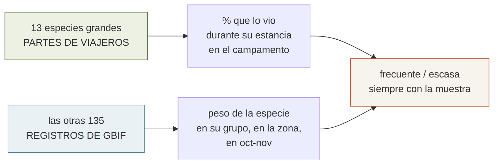

# 09 · Fauna del viaje

> **Namibia · 30 oct – 15 nov 2026 · la clásica del norte** — [← índice del dossier](README.md)
>
> El índice de la guía de campo en PDF: 148 especies con foto, cómo reconocerlas, **qué
> posibilidades hay de verlas** y dónde y cuándo. *(Regla del 09/08: sin avistamientos, sin
> ficha — fuera oricteropo, suricata y cebra de Hartmann. Una excepción consciente desde el
> 15/08: el gato de patas negras, ver abajo.)*
>
> **~N$20 = €1** *(rango 19,5–20,5)* · **✅** fuente primaria · **◐** secundaria concordante ·
> **○** práctica común, sin fuente · **❌** sin verificar, dicho en blanco
>
> *Investigación cerrada el 03/08/2026 · posibilidades de avistamiento y consejos de safari
> añadidos el 07/08/2026 · revisión de coherencia el 09/08/2026 · ampliación del 10/08/2026:
> primer barrido COMPLETO de GBIF contra el catálogo (+14 fichas, todas verificadas en fuentes
> del propio eje) · ampliación del 11/08/2026: el mismo barrido sobre las otras tres zonas de
> la ruta (+13 — el mular del crucero, las aves del Namib y Damaraland, la rata dassie…; el
> detalle de ambos, en `15`) · ampliación del 15/08/2026: **todas las rapaces y todos los
> felinos de la ruta** (+33: 31 rapaces diurnas y nocturnas, el caracal y el gato de patas
> negras), en dos secciones propias — el detalle, en `15`*

📕 **[Descargar la guía: `guia-fauna-etosha.pdf`](guia-fauna-etosha.pdf)** — 34 páginas A4,
**148 especies de toda la ruta**, con foto **completa** de cada una — sin recortes: cuernos,
cuellos y colas se ven enteros, que es justo lo que sirve para identificar.
Pensada para **imprimirla y llevarla en la guantera**: en Etosha no hay cobertura.

*(GitHub no previsualiza PDF: pulsa el enlace y se descarga. Este documento es el índice, para poder
buscar una especie desde el repo.)*

---

## Qué trae cada ficha

- **Nombre en castellano, científico e inglés** — el inglés importa: es el que veréis en los
  carteles del parque y el que usa todo el mundo allí
- **Qué posibilidades hay de verla**, medida y con su muestra detrás *(abajo, de dónde sale)* —
  en **145 de las 148**: tres fichas *(tortuga leopardo, galápago africano y shongololo)* se
  quedan sin línea a propósito, porque su clase no llega a la muestra mínima y **callarse es
  la regla**
- **Cómo reconocerla en el campo**: los rasgos que de verdad distinguen, no una descripción de
  enciclopedia *(labio del rinoceronte, rosetas frente a manchas, orejas de la hiena, pico del cálao…)*
- **Cuántas quedan**, en las veintidós especies con una cifra publicada que se pueda citar —y, desde
  el 15/08, la **categoría UICN** de las rapaces amenazadas: cuatro En Peligro, dos En Peligro Crítico
- **Foto** de Wikimedia Commons, todas con **licencia libre** (CC BY, CC BY-SA, CC0 o dominio
  público), con autoría y licencia bajo la imagen y en los créditos finales

## Las posibilidades de ver cada bicho, medidas

Nadie publica «qué probabilidad hay de ver un leopardo». Lo que sí es público son dos cosas, y
la guía usa las dos —cada una con su etiqueta, porque **no miden lo mismo**—:

1. **Los partes de avistamiento que publica Expert Africa** para los tres campamentos de NWR de
   la ruta: **Okaukuejo** *(149 viajeros)*, **Halali** *(48)* y **Namutoni** *(16)* — en los dos
   primeros se duerme, y el tercero se cruza el D12 *(desde el 24/08 ya no es noche)*. Ahí está la
   respuesta directa — **elefante 96 %, rinoceronte negro 82 %, león 70 %, guepardo 19 %,
   leopardo 12 %** ◐ — y el **0 % del oricteropo**, que precisamente por eso **quedó fuera de
   la guía** *(regla del 09/08: lo que nadie vio, no lleva ficha)*. Ojo con la unidad: es
   **por estancia en un campamento**, ni por día ni por viaje. Y como se duerme en dos de ellos
   —Okaukuejo y Halali— y el tercero se cruza de día, son **dos tiradas y media**, no una *(hasta
   el 24/08 eran tres: la noche de Namutoni se cambió por la segunda de Onguma, fuera de la puerta)*.
2. **Los registros de GBIF** dentro del polígono real del parque *(y de otras tres zonas de la
   ruta)*, **filtrados a octubre y noviembre**: 4.529 registros de mamífero y 69.600 de ave solo
   en Etosha ◐. Eso mide **lo que se registra**, que no es lo que se ve, así que la guía dice
   «frecuente» o «escasa» y **nunca** «lo vas a ver».

**Los dos sesgos van escritos en el propio PDF**, no en letra pequeña: los partes los rellenan
viajeros y traen confusiones —un **14 % declara antílope sable en Okaukuejo, y en Etosha no hay
sable**—, y a GBIF nadie sube el chacal número doscientos ni casi nada nocturno, por lo que la
liebre saltadora sale con **cero registros** siendo de lo que más enseñan los guías en el
nocturno ○.

Eso destapó **un conflicto que estaba escondido**: el **39 % de los partes dice haber visto
rinoceronte blanco**, y en el parque hay **apenas una docena** en 22.000 km². Casi todo eso tiene
que ser rinoceronte **negro** mal identificado — y la ficha ahora lo avisa.

Lo baja y lo cachea [`fuente/avistamientos.py`](fuente/avistamientos.py) en
`fuente/geo/avistamientos.json`; el PDF se monta desde ese fichero, sin tocar la red.
Fuentes: [GBIF](https://www.gbif.org) ·
[Expert Africa · Etosha](https://www.expertafrica.com/namibia/etosha-national-park)

## Cómo se hace un safari, delante de las fichas

Tres páginas antes de las especies, maquetadas como un documento del dossier: **la ropa**
*(Okaukuejo promedia 37,1 °C de máxima y 18,9 °C de mínima en noviembre ✅ — se viste por
capas)*, **lo que tiene que ir dentro del habitáculo y no en el maletero** *(prismáticos uno por
persona, 4 L de agua por persona y día ✅, frontal de luz roja, efectivo, microfibra)*, **la
táctica de la charca** *(motor apagado y tres cuartos de hora, que es lo que de verdad funciona)*,
**fotografía sin trípode** y un bloque aparte en rojo con **lo que es reglamento y no consejo**
✅: 60 km/h, no bajar del coche fuera de los campamentos, no salirse de las pistas y estar dentro
antes de que cierre la puerta.

## El «dónde y cuándo», en 100 de las 148 fichas

Charca por charca y con su fuente: **Okondeka** para el león, **Halali y Goas** para el leopardo,
**Salvadora–Sueda–Charitsaub** para el guepardo, el **Dik-dik Drive** nada más entrar por Von
Lindequist, y el nido de tejedor republicano **a diez metros de la charca de Okaukuejo**.

*(Las 8 fichas añadidas el 08/08 la estrenaron el 09/08, con los ganchos ya verificados del
itinerario: la mangosta rayada en Namutoni, la gaviota y la avoceta en la laguna, la jorobada en
el crucero y el trío del nocturno en el nocturno. Las 14 del 10/08 llegaron todas con el suyo,
del propio eje: la ardilla en el restaurante de Halali, el turdoide en su camping, el galápago
cazando quéleas en Nuamses. Y las 13 del 11/08, con el suyo de su zona: el mular en el crucero,
la rata dassie en las peñas de Twyfelfontein, el lagarto de nariz de cuña en la base de la duna
por donde se camina. Y las 33 del 15/08, con 29 líneas sacadas de veintidós informes de viaje de octubre-noviembre leídos enteros —el autillo africano en su árbol de Halali, el halconcito dentro del pajar de Sesriem, el águila cafre en el alto de Spreetshoogte— y cuatro sin ella porque ningún informe las cita en la ruta: gato de patas negras, águila pomerana, aguilucho caricalvo y milano.)* Las 48 fichas restantes **no llevan esa línea**: no apareció información
específica en ninguna fuente decente, y rellenarlo a ojo sería inventar.

### Y once avisos que corrigen lo que dicen las webs de safaris

- **Flamencos: en noviembre no hay.** La depresión está seca —la NASA la fotografió «bone dry» en
  diciembre— y solo crían cuando la lluvia pasa de 400 mm, algo que ocurrió **tres veces en cuarenta
  años**. Los flamencos de vuestro viaje están en **Walvis Bay**, donde el máximo va de junio a
  noviembre.
- **El abejaruco carmesí no está en Etosha**: cero registros dentro del parque. El que sí veréis es
  el **abejaruco europeo**, que llega en octubre.
- **La cigüeña de Abdim tampoco**: en Etosha es ave de febrero y marzo.
- **La cebra de montaña de Hartmann no está en vuestro eje**: vive en las lomas de dolomita del
  extremo oeste del parque — por eso, desde el 09/08, **no tiene ficha**: la vuestra es la de
  Burchell *(el aviso de identificación va en su ficha)*.
- **La suricata tampoco toca**: es del Kalahari y del sur — fuera de la ruta y, desde el 09/08,
  **fuera de la guía**.
- **Y el oricteropo, fuera con su propio dato**: **0 de 149 partes sumando los tres campamentos
  —0 de 100 en Okaukuejo, 0 de 38 en Halali, 0 de 11 en Namutoni—** ◐ es la cifra más honesta
  del método *(ese 149 es la suma de partes, no los 149 viajeros de Okaukuejo: coincidencia
  numérica, aclarada el 25/08)* — nadie lo vio, así que no lleva ficha *(sus excavaciones en los termiteros sí las
  veréis por todas partes)*.
- **En Etosha NO hay búfalo** — se ven **cuatro de los «Big Five»**, no cinco. Extinguido en el
  parque a mediados del siglo XX ◐ y **nunca reintroducido, por el riesgo de aftosa y de
  tuberculosis bovina**: lo dice la literatura con el propio Etosha Ecological Institute entre
  los autores ✅ *([Turner et al. 2022](https://doi.org/10.1016/j.gecco.2022.e02221): «has not
  been (re)introduced… preventing it from being marketed as a "Big Five" attraction»)*. El
  «retirado deliberadamente por la aftosa» que repite alguna web comercial no tiene fuente ❌:
  no fue retirada, fue extinción sin vuelta.
- **Los dos cálaos de pico rojo son especies distintas y conviven en el eje** *(zona de contacto
  en los montes de Otavi, pegados al SE del parque)*: **ojo amarillo = sureño, ojo oscuro y cara
  blanca = damara** ✅ *(Delport, Kemp & Ferguson 2004, The Auk)*. La ficha del cálao rojo lleva
  el aviso desde el 10/08 — hasta entonces decía «mira el pico y ya está», que se quedaba corto.
- **El caracal está de verdad en toda la ruta, pero sin dato que lo sostenga** ✅: 3 registros de
  GBIF en Etosha en oct-nov *(el umbral del propio método son 10)*, cero en las otras tres zonas,
  y ni Expert Africa ni ningún nocturno guiado —ni el de Okonjima/AfriCat, que sí trackea leopardo
  e hiena parda con collar— lo tiene como objetivo declarado. Extendido y estable según la
  evaluación namibia de 2022 *(NCE/LCMAN/MEFT, [Libro Rojo de carnívoros](http://web.archive.org/web/20240903054529/https://n-c-e.org/wp-content/uploads/Carnivore-Red-Data-Book-species-account-caracal.pdf))*,
  pero verlo es puro premio. **El 12/08 se quedó sin ficha por eso; desde el 15/08 la tiene**, con
  la banda «Apenas registrada» que existe justo para este caso: la pregunta del viajero era «¿están
  todos los felinos?», y la respuesta honesta es una ficha que dice lo poco que hay, no un hueco.
- **El serval no toca esta ruta**: necesita agua permanente y vegetación densa, y su único hábitat
  namibio con densidad medida está en el Zambezi, a cientos de kilómetros de aquí — cero registros
  de GBIF en las cuatro zonas del eje, en toda su historia ✅ *(Edwards et al. 2018,
  [African Journal of Ecology](https://doi.org/10.1111/aje.12540): «detected infrequently, even
  during prolonged camera trapping surveys»)*. Hay dos citas sueltas cerca de Damaraland y del
  borde del Namib que la propia fuente namibia marca como «estatus del registro desconocido»: ni
  esas sirven de base.
- **El gato de patas negras: el felino más pequeño de África, y Etosha el único parque namibio
  con su presencia confirmada** ✅ *(NCE/LCMAN/MEFT 2022; Stander 1991, Küsters 2013)* — pero es
  tan esquivo que de más de 790 registros de investigación con collar y cámara trampa dedicados,
  **solo uno** salió de una cámara trampa (IUCN, evaluación 2016/2020). 1 registro de GBIF en
  Etosha en toda su historia, 0 en oct-nov: ni la propia comunidad investigadora namibia lo
  detecta más que por excepción. **Desde el 15/08 tiene ficha, y es la única excepción consciente
  a la regla del 09/08**: entra por petición expresa —son siete felinos en todo el país, se pueden
  cubrir los seis que tocan la ruta— con la banda «Sin registros» bien visible, y su utilidad real
  es otra: **que un gato pequeño y muy manchado en el nocturno no se apunte como gato montés** sin
  mirar las patas anilladas.

Lo que sí lleva, porque está verificado: **cómo funciona el safari** —horarios de puerta calculados
para vuestros días, el límite de 60 km/h, la prohibición de bajar del coche, las **dos** charcas
iluminadas que se pisan *(Okaukuejo y Moringa; King Nehale se perdió con la noche de Namutoni)*,
el safari nocturno guiado de NWR *(**N$750 ≈ €38** por persona — **fuera del plan desde el
24/08**: se compra durmiendo dentro)* y —decidido el 08/08— **las salidas guiadas de mañana
desde los dos campamentos donde se duerme (N$650 ≈ €33 por persona)**: los traslados entre
campamentos van con el 4x4 propio—, y un **bloque de
seguridad** con las serpientes y el escorpión que de verdad importan.

> 🔁 **Ajuste del 24/08, y afecta de lleno a las tres especies nocturnas.** **Namutoni sale del
> plan**: las **dos últimas noches se duermen en [Onguma Tamboti](https://onguma.com/)**, reserva
> privada fuera de la puerta de Von Lindequist. Consecuencia incómoda para la fauna: **el nocturno
> guiado de NWR se cae** ❌ —se vende a quien duerme en el campamento, y ya no se duerme dentro—,
> así que **la única forma de salir de noche pasa a ser el Sundowner Drive de Onguma (3 h, N$980 ≈
> €49 pp ✅, tarifa oficial 2027)**, que **sale al atardecer y vuelve de noche, con foco y campo a
> través** — las dos cosas prohibidas dentro del parque. Para el **zorro del Cabo**, el **gato
> montés africano** y el **lobo de tierra**, eso es **una oportunidad, y fuera del parque en vez de
> dentro**. ⚠️ Un «night drive» como tal **no figura en la tarifa de Onguma** ❌; el que sale de
> noche es el sundowner. ❌ *Si NWR vende el nocturno a quien no pernocta, sin verificar: está
> preguntado en el `20` §4.*
> ➕ **Y a cambio se abre algo que el parque prohíbe del todo**: el **paseo interpretativo a pie**
> de Onguma *(1½ h, N$980 ≈ €49 pp ✅)* — rastros, huellas y escala del bicho a pie de suelo.

---

## Las 148 especies

### 🐆 Felinos (6)

- **León** — *Panthera leo* · Lion
- **Leopardo** — *Panthera pardus* · Leopard
- **Guepardo** — *Acinonyx jubatus* · Cheetah
- **Caracal** — *Caracal caracal* · Caracal *(añadido el 15/08 — contra el criterio de los 10 registros del 12/08 y dicho a la cara: 3 registros en oct-nov en Etosha, banda «Apenas registrada»; entra porque son siete felinos en todo el país y se pueden cubrir los seis de la ruta)*
- **Gato montés africano** — *Felis lybica* · African wildcat *(añadido el 08/08: objetivo del nocturno guiado)*
- **Gato de patas negras** — *Felis nigripes* · Black-footed cat *(añadido el 15/08 por petición expresa, con la banda «Sin registros» — 0 en oct-nov, 1 en toda la historia del polígono: la única excepción consciente a la regla del 09/08, y va para no confundirlo con el gato montés en el nocturno)*

### 🦁 Mamíferos (31)

- **Elefante africano de sabana** — *Loxodonta africana* · African bush elephant
- **Rinoceronte negro** — *Diceros bicornis* · Black rhinoceros
- **Rinoceronte blanco** — *Ceratotherium simum* · White rhinoceros
- **Jirafa angoleña** — *Giraffa giraffa angolensis* · Angolan giraffe
- **Cebra de Burchell** — *Equus quagga burchellii* · Burchell's zebra
- **Órix o gemsbok** — *Oryx gazella* · Gemsbok
- **Springbok** — *Antidorcas marsupialis* · Springbok
- **Gran kudú** — *Tragelaphus strepsiceros* · Greater kudu
- **Eland común** — *Taurotragus oryx* · Common eland
- **Ñu azul** — *Connochaetes taurinus* · Blue wildebeest
- **Impala de cara negra** — *Aepyceros melampus petersi* · Black-faced impala
- **Dik-dik de Damara** — *Madoqua damarensis* · Damara dik-dik
- **Hiena manchada** — *Crocuta crocuta* · Spotted hyena
- **Hiena parda** — *Parahyaena brunnea* · Brown hyena
- **Chacal de lomo negro** — *Lupulella mesomelas* · Black-backed jackal
- **Ratel o tejón de la miel** — *Mellivora capensis* · Honey badger
- **Facóquero** — *Phacochoerus africanus* · Common warthog
- **Alcélafo rojo** — *Alcelaphus buselaphus caama* · Red hartebeest
- **Steenbok** — *Raphicerus campestris* · Steenbok
- **Zorro orejudo** — *Otocyon megalotis* · Bat-eared fox
- **Jineta de manchas pequeñas** — *Genetta genetta* · Small-spotted genet
- **Puercoespín del Cabo** — *Hystrix africaeaustralis* · Cape porcupine
- **Liebre saltadora** — *Pedetes capensis* · Springhare
- **Klipspringer o saltarrocas** — *Oreotragus oreotragus* · Klipspringer
- **Mangosta amarilla** — *Cynictis penicillata* · Yellow mongoose
- **Mangosta rayada** — *Mungos mungo* · Banded mongoose *(añadida el 08/08: 400 registros GBIF
  en Etosha, 101 en oct–nov — el gran ausente que destapó la revisión)*
- **Zorro del Cabo** — *Vulpes chama* · Cape fox *(añadido el 08/08: objetivo del nocturno guiado)*
- **Lobo de tierra** — *Proteles cristata* · Aardwolf *(añadido el 08/08: ídem — nocturno estricto,
  GBIF lo infrarregistra como a la liebre saltadora)*
- **Babuino chacma** — *Papio ursinus* · Chacma baboon *(añadido el 08/08: es el «mono» real de
  los miradores y campamentos de esta ruta — el vervet se descartó a propósito: sin un solo
  registro en la consulta GBIF del 08/08, archivada en `15`)*
- **Ardilla de matorral de Smith** — *Paraxerus cepapi* · Smith's bush squirrel *(añadida el
  10/08: la ladrona del restaurante de Halali — 267 registros GBIF en el parque y «common in
  HAL camp» en los informes de mamíferos)*
- **Mangosta esbelta** — *Galerella sanguinea* · Slender mongoose *(añadida el 10/08: la
  tercera mangosta diurna, fiable en el Dik-dik Drive — punta de cola negra)*

### 🦅 Aves rapaces (40)

- **Secretario** — *Sagittarius serpentarius* · Secretarybird
- **Águila marcial** — *Polemaetus bellicosus* · Martial eagle
- **Águila rapaz** — *Aquila rapax* · Tawny eagle *(añadida el 10/08: la gran águila más
  registrada del eje —755 en oct-nov, por delante del bateleur y la marcial— y En Peligro en
  Namibia: el hueco gordo que destapó el barrido completo)*
- **Águila volatinera o bateleur** — *Terathopius ecaudatus* · Bateleur
- **Águila cafre o de Verreaux** — *Aquila verreauxii* · Verreaux's eagle *(15/08: la de la roca — 80 registros en Damaraland, 5 en Etosha)*
- **Águila azor africana** — *Aquila spilogaster* · African hawk-eagle *(15/08: 83 registros en oct-nov en Etosha)*
- **Águila de Wahlberg** — *Hieraaetus wahlbergi* · Wahlberg's eagle *(15/08: 33 registros en oct-nov en Etosha)*
- **Águila calzada** — *Hieraaetus pennatus* · Booted eagle *(15/08: la misma que cría en España — 22 registros, 17 de ellos de noviembre)*
- **Águila pomerana** — *Clanga pomarina* · Lesser spotted eagle *(15/08: 11 registros en oct-nov en Etosha)*
- **Culebrera pechinegra** — *Circaetus pectoralis* · Black-chested snake eagle *(15/08: 91 registros en oct-nov en Etosha)*
- **Culebrera sombría** — *Circaetus cinereus* · Brown snake eagle *(15/08: 55 registros en oct-nov en Etosha)*
- **Pigargo vocinglero** — *Icthyophaga vocifer* · African fish eagle
- **Águila pescadora** — *Pandion haliaetus* · Osprey *(15/08: 17 registros en oct-nov en la costa)*
- **Buitre dorsiblanco africano** — *Gyps africanus* · White-backed vulture
- **Buitre orejudo** — *Torgos tracheliotos* · Lappet-faced vulture
- **Buitre cabeciblanco** — *Trigonoceps occipitalis* · White-headed vulture *(15/08: En Peligro Crítico; 107 registros en oct-nov)*
- **Azor lagartijero claro** — *Melierax canorus* · Pale chanting goshawk
- **Gavilán gabar** — *Micronisus gabar* · Gabar goshawk *(15/08: 277 registros en oct-nov en Etosha)*
- **Gavilán chikra** — *Accipiter badius* · Shikra (little banded goshawk) *(15/08: 13 registros en oct-nov en Etosha)*
- **Aguilucho caricalvo común** — *Polyboroides typus* · African harrier-hawk (gymnogene) *(15/08: 21 registros en oct-nov en Etosha)*
- **Aguilucho papialbo** — *Circus macrourus* · Pallid harrier *(15/08: 19 registros en oct-nov en Etosha)*
- **Aguilucho cenizo** — *Circus pygargus* · Montagu's harrier *(15/08: 11 registros en oct-nov en Etosha)*
- **Elanio común** — *Elanus caeruleus* · Black-winged (black-shouldered) kite *(15/08: 240 registros en oct-nov en Etosha)*
- **Milano negro** — *Milvus migrans* · Black kite / yellow-billed kite *(15/08: 34 registros; el milano piquigualdo, que GBIF cuenta aparte con 8, va dentro de la misma ficha)*
- **Busardo ratonero (ratonero estepario)** — *Buteo buteo* · Steppe buzzard *(15/08: el estepario, 52 en oct-nov y 0 de mayo a agosto — lo distingue la fecha)*
- **Busardo augur** — *Buteo augur* · Augur buzzard *(15/08: 43 registros en oct-nov en Damaraland)*
- **Busardo augur meridional** — *Buteo rufofuscus* · Jackal buzzard *(15/08: 10 registros en oct-nov en el Namib)*
- **Cernícalo ojiblanco** — *Falco rupicoloides* · Greater kestrel *(añadido el 15/08: 642 registros en oct-nov — el halcón más registrado del parque, y nadie lo había echado en falta)*
- **Cernícalo africano o roquero** — *Falco rupicolus* · Rock kestrel *(15/08: 112 en la costa, 107 en el Namib, 86 en Etosha)*
- **Alcotán turumti** — *Falco chicquera* · Red-necked falcon *(15/08: 309 registros en oct-nov en Etosha)*
- **Halcón borní** — *Falco biarmicus* · Lanner falcon *(15/08: 136 registros en oct-nov en Etosha)*
- **Halcón peregrino** — *Falco peregrinus* · Peregrine falcon *(15/08: 22 registros en oct-nov en Etosha)*
- **Halconcito africano** — *Polihierax semitorquatus* · Pygmy falcon *(15/08: la rapaz más pequeña de África, inquilina de los pajares del tejedor — la ficha del tejedor la citaba desde el 03/08 sin ficha propia; 104 registros en el Namib, 43 en Etosha)*
- **Búho lácteo de Verreaux** — *Bubo lacteus* · Verreaux's eagle-owl
- **Búho manchado** — *Bubo africanus* · Spotted eagle-owl *(15/08: 69 registros en oct-nov en Etosha)*
- **Autillo africano** — *Otus senegalensis* · African scops owl *(15/08: 82 registros en oct-nov en Etosha)*
- **Autillo cariblanco sureño** — *Ptilopsis granti* · Southern white-faced owl *(15/08: 65 registros en oct-nov en Etosha)*
- **Mochuelo perlado** — *Glaucidium perlatum* · Pearl-spotted owlet *(15/08: 225 registros en oct-nov en Etosha)*
- **Lechuza común** — *Tyto alba* · Barn owl *(15/08: 106 registros en oct-nov en Etosha)*
- **Búho moro** — *Asio capensis* · Marsh owl *(15/08: 22 registros en oct-nov en Etosha)*

### 🐦 Aves (39)

- **Avestruz común** — *Struthio camelus* · Common ostrich
- **Avutarda kori** — *Ardeotis kori* · Kori bustard
- **Carraca lila** — *Coracias caudatus* · Lilac-breasted roller
- **Cálao de pico amarillo sureño** — *Tockus leucomelas* · Southern yellow-billed hornbill
- **Cálao de pico rojo sureño** — *Tockus rufirostris* · Southern red-billed hornbill
- **Tejedor republicano** — *Philetairus socius* · Sociable weaver
- **Flamenco enano** — *Phoeniconaias minor* · Lesser flamingo
- **Grulla azul** — *Grus paradisea* · Blue crane
- **Ganga namaqua** — *Pterocles namaqua* · Namaqua sandgrouse
- **Sisón negro norteño** — *Afrotis afraoides* · Northern black korhaan
- **Alcaudón de pecho carmesí** — *Laniarius atrococcineus* · Crimson-breasted shrike
- **Abejaruco europeo** — *Merops apiaster* · European bee-eater *(el carmesí, que es el que
  anuncian las webs, tiene cero registros en el parque — ver el aviso de arriba; esta línea
  decía «abejaruco carmesí» por error hasta el 10/08)*
- **Cigüeña de Abdim** — *Ciconia abdimii* · Abdim's stork
- **Estornino brillante del Cabo** — *Lamprotornis nitens* · Cape starling
- **Pelícano blanco común** — *Pelecanus onocrotalus* · Great white pelican
- **Flamenco común** — *Phoenicopterus roseus* · Greater flamingo
- **Cormorán del Cabo** — *Phalacrocorax capensis* · Cape cormorant
- **Charrán damara** — *Sternula balaenarum* · Damara tern
- **Ostrero africano** — *Haematopus moquini* · African oystercatcher
- **Gaviota de Hartlaub** — *Chroicocephalus hartlaubii* · Hartlaub's gull *(añadida el 08/08:
  6.334 registros GBIF en la costa — el ave más registrada de la laguna sin ficha)*
- **Avoceta común** — *Recurvirostra avosetta* · Pied avocet *(añadida el 08/08: 3.944 en la costa)*
- **Francolín de pico rojo** — *Pternistis adspersus* · Red-billed spurfowl
- **Avefría armada** — *Vanellus armatus* · Blacksmith lapwing *(10/08: 2.010 en oct-nov, el
  borde de casi cualquier charca)*
- **Drongo ahorquillado** — *Dicrurus adsimilis* · Fork-tailed drongo *(10/08: 1.623)*
- **Pintada común** — *Numida meleagris* · Helmeted guineafowl *(10/08: 1.016)*
- **Quélea común** — *Quelea quelea* · Red-billed quelea *(10/08: los enjambres de las charcas —
  y la presa del galápago de abajo)*
- **Turaco unicolor** — *Corythaixoides concolor* · Grey go-away-bird *(10/08: el «go-away» de
  los campamentos)*
- **Toco piquinegro** — *Lophoceros nasutus* · African grey hornbill *(10/08: el tercer cálao)*
- **Bulbul encapuchado** — *Pycnonotus nigricans* · African red-eyed bulbul *(10/08)*
- **Turdoide caricalvo** — *Turdoides gymnogenys* · Bare-cheeked babbler *(10/08: casi endémico;
  ~700 de sus ~770 registros del eje, en la banda de Halali — el pájaro del camping)*
- **Charrán común** — *Sterna hirundo* · Common tern *(añadido el 11/08: el ave más registrada de
  la costa en oct-nov —3.582— y ni ficha tenía; llegan de Europa a decenas de miles)*
- **Gaviota cocinera** — *Larus dominicanus* · Kelp gull *(11/08: la grande de dorso negro,
  empatada en registros con la Hartlaub que ya tenía ficha)*
- **Estornino Naburup** — *Onychognathus nabouroup* · Pale-winged starling *(11/08: el de los
  picnics de Sossusvlei y los acantilados de Damaraland)*
- **Sisón de Damaraland** — *Heterotetrax rueppelii* · Rüppell's korhaan *(11/08: casi endémico,
  en parejas junto a la carretera de Sossusvlei)*
- **Avutarda de Namibia** — *Neotis ludwigii* · Ludwig's bustard *(11/08: En Peligro — los
  tendidos eléctricos)*
- **Alondra de las dunas** — *Calendulauda erythrochlamys* · Dune lark *(11/08: casi toda su
  especie vive dentro de Namibia — con el matiz del IOC de 2024, que le fusionó la de Barlow)*
- **Lorito de Rüppell** — *Poicephalus rueppellii* · Rüppell's parrot *(11/08: casi endémico,
  citado en el propio cauce del Aba Huab)*
- **Toco angoleño** — *Tockus monteiri* · Monteiro's hornbill *(11/08: el 10/08 quedó fuera por
  Etosha —71 registros, «Escasa»— y era la pregunta equivocada: su casa es la escarpa de
  Damaraland, donde sale «Frecuente»)*
- **Inseparable de Namibia** — *Agapornis roseicollis* · Rosy-faced lovebird *(11/08: llevaba
  desde el 03/08 citado de inquilino en la ficha del tejedor republicano, sin ficha propia)*

### 🦎 Reptiles (16)

*Las tres primeras van por seguridad: dormís trece noches en tienda.*

- **Víbora bufadora** — *Bitis arietans* · Puff adder
- **Cobra escupidora cebra** — *Naja nigricincta* · Zebra spitting cobra
- **Mamba negra** — *Dendroaspis polylepis* · Black mamba
- **Víbora de Péringuey** — *Bitis peringueyi* · Peringuey's adder
- **Víbora cornuda** — *Bitis caudalis* · Horned adder
- **Camaleón del Namib** — *Chamaeleo namaquensis* · Namaqua chameleon
- **Gecko palmeado del Namib** — *Pachydactylus rangei* · Web-footed gecko
- **Agama de roca de Namibia** — *Agama planiceps* · Namibian rock agama
- **Varano de roca** — *Varanus albigularis* · Rock monitor
- **Tortuga leopardo** — *Stigmochelys pardalis* · Leopard tortoise
- **Lagarto de nariz de pala** — *Meroles anchietae* · Shovel-snouted lizard
- **Escinco arborícola del Kalahari** — *Trachylepis spilogaster* · Kalahari tree skink
  *(añadido el 10/08: el lagarto diurno de los recintos — 38 de los 187 registros de reptil del
  parque en oct-nov)*
- **Gecko de Fischer** — *Chondrodactylus laevigatus* · Fischer's thick-toed gecko *(10/08: el
  nocturno de los muros de Okaukuejo)*
- **Galápago africano** — *Pelomedusa subrufa* · African helmeted turtle *(10/08: el de la
  charca — documentado en el parque cazando quéleas en grupo; sin línea de posibilidades: su
  clase no llega a la muestra mínima)*
- **Gecko diurno del Namib** — *Rhoptropus afer* · Namib day gecko *(añadido el 11/08: un gecko
  que cambió la noche por el día — la vuelta a la diurnidad está publicada — en las rocas de la
  costa de la niebla)*
- **Lagarto de nariz de cuña** — *Meroles cuneirostris* · Wedge-snouted sand lizard *(11/08: en
  Sesriem/Sossusvlei tiene 4× más registros que el de nariz de pala — es el de la base de la
  duna, por donde se camina; el de la pala vive ladera arriba y las dos fichas se cruzan aviso)*

### 🌊 La costa, la roca y la arena (7)

*Lo de fuera de Etosha: Cape Cross (D7), la laguna de Walvis Bay (D5–D6) y los roquedos de
Damaraland — con una excepción a caballo: la ardilla terrestre campa igual de bien por dentro del
parque, y de ahí sale su banda.*

- **Lobo marino del Cabo** — *Arctocephalus pusillus* · Cape fur seal
- **Delfín de Heaviside** — *Cephalorhynchus heavisidii* · Heaviside's dolphin
- **Delfín mular** — *Tursiops truncatus* · Bottlenose dolphin *(añadido el 11/08: más registros
  que el propio Heaviside en la zona —31 vs 26— y una población residente de menos de cien;
  el 15 archivó su estacionalidad el 08/08 y nadie le hizo ficha hasta hoy)*
- **Ballena jorobada** — *Megaptera novaeangliae* · Humpback whale *(añadida el 08/08: migra
  frente a la costa jun–nov — los registros GBIF de la zona, consulta del 08/08/2026
  archivada mes a mes en `15`, dan pico jul–sep y 27 aún en noviembre: el crucero del D6 cae en
  temporada)*
- **Damán roquero** — *Procavia capensis* · Rock hyrax
- **Rata dassie o rata de las rocas** — *Petromus typicus* · Dassie rat *(añadida el 11/08:
  la única especie viva de toda su familia, diurna en las peñas de Twyfelfontein — al lado del
  damán, que es «el otro dassie»)*
- **Ardilla terrestre del Cabo** — *Xerus inauris* · Cape ground squirrel

### 🐞 Bichos (9)

*Los vecinos de cada braai ○ — se dejan ver más que el leopardo, aunque en GBIF ni salgan: nadie
sube termitas, y la banda mide registros, no presencia.*

- **Escarabajo de la niebla** — *Onymacris unguicularis* · Fog-basking beetle
- **Escorpión de cola gruesa** — *Parabuthus villosus* · Black hairy thick-tailed scorpion
- **Araña blanca del Namib** — *Leucorchestris arenicola* · Dancing white lady spider
- **Termita constructora** — *Macrotermes michaelseni* · Termite
- **Escarabajo pelotero** — *Scarabaeus satyrus* · Dung beetle
- **Solífugo o araña camello** — *Solifugae* · Sun spider / camel spider
- **Gusano de mopane** — *Gonimbrasia belina* · Mopane worm
- **Milpiés gigante o shongololo** — *Archispirostreptus gigas* · Giant African millipede
- **Mosquito anofeles** — *Anopheles* · Anopheles mosquito

---

## Cómo se regenera

Todo vive en [`fuente/`](fuente/): `catalogo.py` fija qué fichero exacto de Wikimedia Commons usa
cada especie, `descargar.py` los baja con su licencia y autoría, `textos_especies.py` guarda los
rasgos de identificación, `textos_etosha.py` lo específico del parque, `textos_poblacion.py` las
cifras de cuántos quedan, `textos_safari.py` los consejos, `avistamientos.py` los recuentos de
GBIF y los porcentajes por campamento, y `guia_fauna.py` arma el HTML. El PDF lo imprime Chrome
desde `imprimir.py`, que es quien pone los números de página.

Con un solo comando, desde `fuente/`: **`make fauna`** *(o `make todo` para rehacerlo desde cero,
imágenes y recuentos incluidos; `make avistam` solo los recuentos)*. Y **`make comprueba`** valida
que están las 197 imágenes, que ninguna se ha colado con licencia no libre, que los dos PDF tienen
las páginas que deben y que los datos de avistamiento cubren las 148 especies.

*Las fotos **sí** están en el repo, en [`img/fauna/`](img/fauna/): son ~9,3 MB, y a cambio el PDF
se puede regenerar idéntico dentro de un año sin depender de que Commons siga ordenando igual una
búsqueda. `avistamientos.py` es incremental desde el 15/08: solo baja lo que falte. · 15/08/2026*
