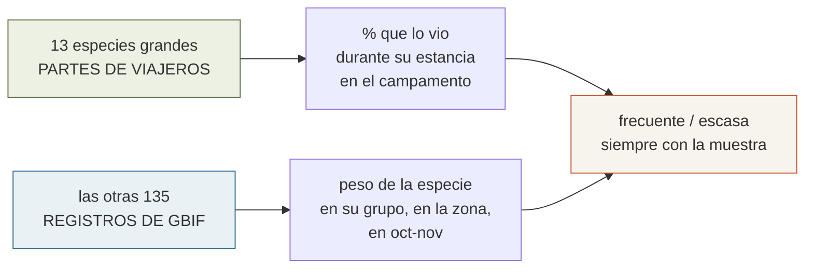
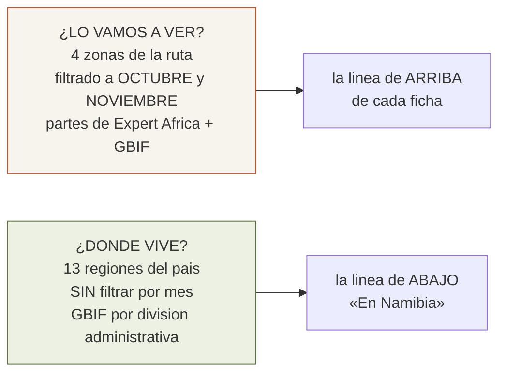
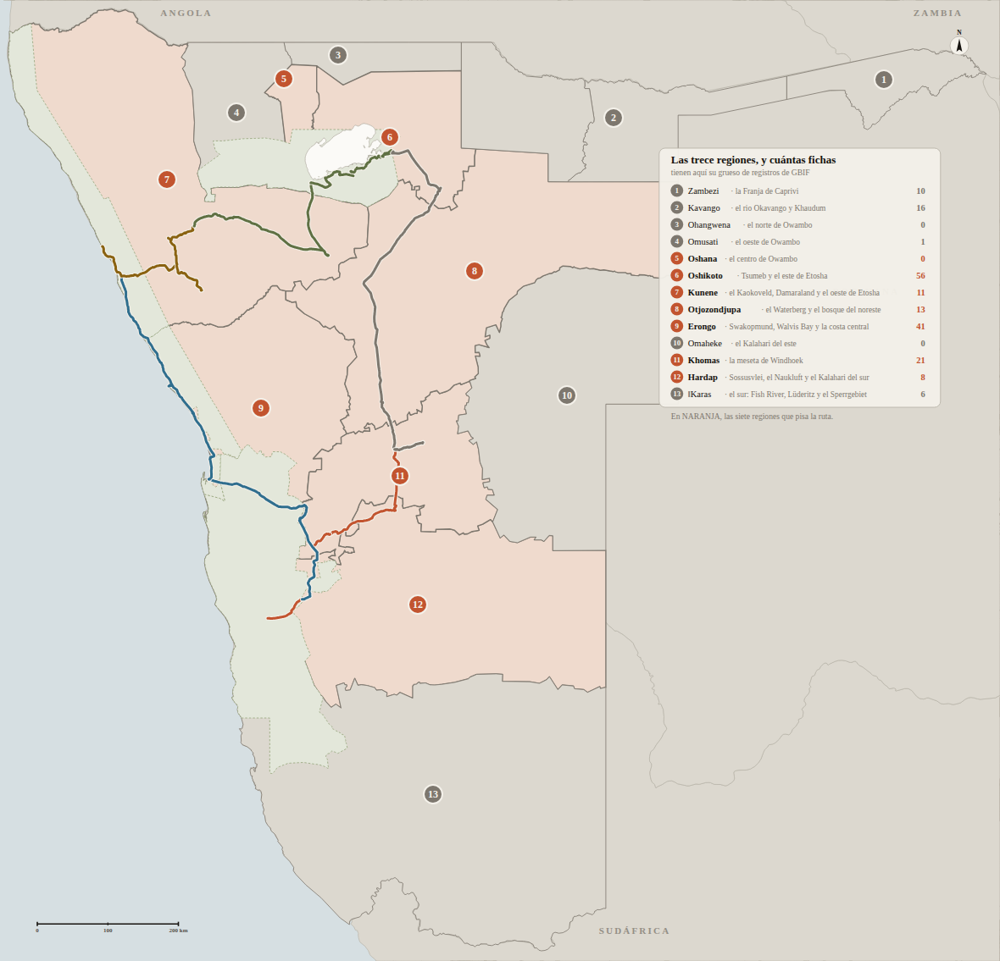

# 09 · Fauna de Namibia

> **Namibia · 30 oct – 15 nov 2026 · la clásica del norte** — [← índice del dossier](README.md)
>
> El índice de la guía de campo en PDF: **186 especies con foto** — **162 de vuestra ruta** y
> **24 del resto de Namibia** —, cómo reconocerlas, **qué posibilidades hay de verlas**, dónde y
> cuándo, y **en qué regiones del país vive cada una**. *(La regla del 09/08 —sin avistamientos,
> sin ficha— sigue mandando en la parte 1; lo que el 29/08 cambió es que lo que no toca la ruta ya
> no desaparece: se va a una parte 2 rotulada como lo que es. Una excepción consciente desde el
> 15/08: el gato de patas negras, ver abajo.)*
>
> **~N$20 = €1**, de bolsillo *(el cambio real de 2026 va por **18,5–19,4** — BCE, 28/08: el euro de estas páginas se queda ~7 % corto)* · **✅** fuente primaria · **◐** secundaria concordante ·
> **○** práctica común, sin fuente · **❌** sin verificar, dicho en blanco
>
> *Investigación cerrada el 03/08/2026 · posibilidades de avistamiento y consejos de safari
> añadidos el 07/08/2026 · revisión de coherencia el 09/08/2026 · ampliación del 10/08/2026:
> primer barrido COMPLETO de GBIF contra el catálogo (+14 fichas, todas verificadas en fuentes
> del propio eje) · ampliación del 11/08/2026: el mismo barrido sobre las otras tres zonas de
> la ruta (+13 — el mular del crucero, las aves del Namib y Damaraland, la rata dassie…; el
> detalle de ambos, en `15`) · ampliación del 15/08/2026: **todas las rapaces y todos los
> felinos de la ruta** (+33: 31 rapaces diurnas y nocturnas, el caracal y el gato de patas
> negras), en dos secciones propias — el detalle, en `15` · **ampliación del 29/08/2026: la guía
> deja de ser solo de la ruta** — +38 fichas *(el norte mojado, el Kalahari, los casi endémicos del
> oeste y cuatro bichos de mar que estaban en vuestra propia costa)*, el **reparto por las trece
> regiones del país** en cada ficha y el mapa que las sitúa*

📕 **[Descargar la guía: `guia-fauna-namibia.pdf`](guia-fauna-namibia.pdf)** — 48 páginas A4,
**186 especies**, con foto **completa** de cada una — sin recortes: cuernos, cuellos y colas se ven
enteros, que es justo lo que sirve para identificar.
Pensada para **imprimirla y llevarla en la guantera**: en Etosha no hay cobertura.

*(GitHub no previsualiza PDF: pulsa el enlace y se descarga. Este documento es el índice, para poder
buscar una especie desde el repo.)*

---

## Qué trae cada ficha

- **Nombre en castellano, científico e inglés** — el inglés importa: es el que veréis en los
  carteles del parque y el que usa todo el mundo allí
- **Qué posibilidades hay de verla**, medida y con su muestra detrás *(abajo, de dónde sale)* —
  en **182 de las 186**: cuatro fichas *(tortuga leopardo, galápago africano, shongololo y
  cocodrilo del Nilo)* se quedan sin línea a propósito, porque su clase no llega a la muestra
  mínima en ninguna zona de la ruta y **callarse es la regla**
- **Cómo reconocerla en el campo**: los rasgos que de verdad distinguen, no una descripción de
  enciclopedia *(labio del rinoceronte, rosetas frente a manchas, orejas de la hiena, pico del cálao…)*
- **Cuántas quedan**, en las veintidós especies con una cifra publicada que se pueda citar —y, desde
  el 15/08, la **categoría UICN** de las rapaces amenazadas: cuatro En Peligro, dos En Peligro Crítico
- **En qué regiones de Namibia vive** *(desde el 29/08, en las 186 fichas)* — el reparto de sus
  registros de GBIF por las **trece divisiones administrativas del país**, sin filtrar por mes:
  *«Kavango 192 · Zambezi 166 · Otjozondjupa 18 — de 445 registros en el país»*. Es otra pregunta
  que la de arriba y por eso va en otra línea: **arriba, si lo vais a ver; abajo, dónde vive**
- **Foto** de Wikimedia Commons, todas con **licencia libre** (CC BY, CC BY-SA, CC0 o dominio
  público), con autoría y licencia bajo la imagen y en los créditos finales

## Las posibilidades de ver cada bicho, medidas

Nadie publica «qué probabilidad hay de ver un leopardo». Lo que sí es público son dos cosas, y
la guía usa las dos —cada una con su etiqueta, porque **no miden lo mismo**—:

1. **Los partes de avistamiento que publica Expert Africa** para los tres campamentos de NWR de
   la ruta: **Okaukuejo** *(149 viajeros)*, **Halali** *(48)* y **Namutoni** *(16)* — en los dos
   primeros se duerme, y el tercero se cruza el D12 *(desde el 24/08 ya no es noche)*. Ahí está la
   respuesta directa — **elefante 96 %, rinoceronte negro 82 %, león 70 %, guepardo 19 %,
   leopardo 12 %** ◐ — y el **0 % del oricteropo**, que precisamente por eso **quedó fuera de
   la guía** *(regla del 09/08: lo que nadie vio, no lleva ficha)*. Ojo con la unidad: es
   **por estancia en un campamento**, ni por día ni por viaje. Y como se duerme en dos de ellos
   —Okaukuejo y Halali— y el tercero se cruza de día, son **dos tiradas y media**, no una *(hasta
   el 24/08 eran tres: la noche de Namutoni se cambió por la segunda de Onguma, fuera de la puerta)*.
2. **Los registros de GBIF** dentro del polígono real del parque *(y de otras tres zonas de la
   ruta)*, **filtrados a octubre y noviembre**: 4.529 registros de mamífero y 69.600 de ave solo
   en Etosha ◐. Eso mide **lo que se registra**, que no es lo que se ve, así que la guía dice
   «frecuente» o «escasa» y **nunca** «lo vas a ver».

**Los dos sesgos van escritos en el propio PDF**, no en letra pequeña: los partes los rellenan
viajeros y traen confusiones —un **14 % declara antílope sable en Okaukuejo, y en Etosha no hay
sable**—, y a GBIF nadie sube el chacal número doscientos ni casi nada nocturno, por lo que la
liebre saltadora sale con **cero registros** siendo de lo que más enseñan los guías en el
nocturno ○.

Eso destapó **un conflicto que estaba escondido**: el **39 % de los partes dice haber visto
rinoceronte blanco**, y en el parque hay **apenas una docena** en 22.000 km². Casi todo eso tiene
que ser rinoceronte **negro** mal identificado — y la ficha ahora lo avisa.

Lo baja y lo cachea [`fuente/avistamientos.py`](fuente/avistamientos.py) en
`fuente/geo/avistamientos.json`; el PDF se monta desde ese fichero, sin tocar la red.
Fuentes: [GBIF](https://www.gbif.org) ·
[Expert Africa · Etosha](https://www.expertafrica.com/namibia/etosha-national-park)

## Dónde vive cada bicho en Namibia *(29/08)*

Hasta el 29/08 la guía contestaba una sola pregunta —**¿lo vamos a ver en este viaje?**— y por eso
lo que no caía en la ruta no tenía ficha. Desde el 29/08 contesta dos, y la segunda es
**¿dónde vive en Namibia?**, que es otra cosa y se mide de otra manera:

El reparto sale de pedirle a GBIF los registros de cada especie **región a región** *(por
`gadmGid`, el código de la división administrativa)*, y el límite de cada región lo dibuja
**OpenStreetMap**. No se filtra por mes a propósito: la pregunta es de mapa, no de calendario, y
recortar a dos meses solo añadiría ruido de muestreo en las regiones que ya tienen pocos registros.
Lo baja y lo cachea [`fuente/pais.py`](fuente/pais.py) en `fuente/geo/fauna-pais.json`.

**Este mapa va dentro de la guía**, delante de las fichas: sin él, decir que el hipopótamo está en
Kavango y el pingüino en ǁKaras no sitúa nada. En naranja, **las siete regiones que pisa la ruta**;
en gris, las seis que no — y ahí vive entera la parte 2. El número de cada región es cuántas de las
186 fichas tienen ahí **el grueso** de sus registros: **Oshikoto se lleva 56**, y eso no es que sea
la región más rica, es que el este de Etosha es donde más mira todo el mundo. **El sesgo del
observador está en el dato y se dice, no se disimula**: en la Franja de Caprivi hay lodges con
ornitólogos y en el Kaokoveld no.

⚠️ **Lo que esto NO es**: una probabilidad de ver nada. Es dónde se ha **registrado** la especie.
Por eso la línea da siempre el recuento crudo detrás —*«de 445 registros en el país»*— y por eso
**no se nombra ninguna región con menos de cinco registros**.

### Y lo que el propio reparto destapó

- **La grulla carunculada entró como fauna del Zambeze y el dato la devolvió a la ruta**: tiene
  **18 registros de octubre-noviembre dentro del polígono de Etosha**, más que muchas fichas que
  nadie discute. Está en la parte 1, al lado de la grulla azul. *(Y `make comprueba` no deja que
  eso vuelva a pasar sin avisar: si una ficha de la parte 2 pasa de diez registros en la ruta, la
  comprobación falla y dice cuál.)*
- **Cuatro bichos de mar que se metieron como fauna del sur y estaban en vuestra costa**: el
  **alcatraz del Cabo** (228 registros de oct-nov en la caja de Walvis Bay–Swakopmund), el
  **cormorán de las bancas** (65), el **pingüino africano** (65) y la **ballena franca austral**
  (4 — ésa sí se va antes de que lleguéis). Los cuatro están en la parte 1, en «la costa».
- **Los casi endémicos del oeste no son una rareza de otro sitio: caen en Damaraland.** El cantor
  de roca (24), el papamoscas herero (27), el alcaudón de cola blanca (74), el francolín de
  Hartlaub (19) y el carbonero de Carp (83), todos en registros de octubre-noviembre del D8–D9.
- **Y dos regiones enteras de Namibia no tienen ni una ficha con su grueso**: Ohangwena y Omaheke.
  No es que no haya animales; es que **casi nadie sube registros desde ahí**.

## Cómo se hace un safari, delante de las fichas

Tres páginas antes de las especies, maquetadas como un documento del dossier: **la ropa**
*(Okaukuejo promedia 37,1 °C de máxima y 18,9 °C de mínima en noviembre ✅ — se viste por
capas)*, **lo que tiene que ir dentro del habitáculo y no en el maletero** *(prismáticos uno por
persona, 4 L de agua por persona y día ✅, frontal de luz roja, efectivo, microfibra)*, **la
táctica de la charca** *(motor apagado y tres cuartos de hora, que es lo que de verdad funciona)*,
**fotografía sin trípode** y un bloque aparte en rojo con **lo que es reglamento y no consejo**
✅: 60 km/h, no bajar del coche fuera de los campamentos, no salirse de las pistas y estar dentro
antes de que cierre la puerta.

## El «dónde y cuándo» de Etosha, en 100 fichas

Charca por charca y con su fuente: **Okondeka** para el león, **Halali y Goas** para el leopardo,
**Salvadora–Sueda–Charitsaub** para el guepardo, el **Dik-dik Drive** nada más entrar por Von
Lindequist, y el nido de tejedor republicano **a diez metros de la charca de Okaukuejo**.

*(Las 8 fichas añadidas el 08/08 la estrenaron el 09/08, con los ganchos ya verificados del
itinerario: la mangosta rayada en Namutoni, la gaviota y la avoceta en la laguna, la jorobada en
el crucero y el trío del nocturno en el nocturno. Las 14 del 10/08 llegaron todas con el suyo,
del propio eje: la ardilla en el restaurante de Halali, el turdoide en su camping, el galápago
cazando quéleas en Nuamses. Y las 13 del 11/08, con el suyo de su zona: el mular en el crucero,
la rata dassie en las peñas de Twyfelfontein, el lagarto de nariz de cuña en la base de la duna
por donde se camina. Y las 33 del 15/08, con 29 líneas sacadas de veintidós informes de viaje de octubre-noviembre leídos enteros —el autillo africano en su árbol de Halali, el halconcito dentro del pajar de Sesriem, el águila cafre en el alto de Spreetshoogte— y cuatro sin ella porque ningún informe las cita en la ruta: gato de patas negras, águila pomerana, aguilucho caricalvo y milano.)* Las 48 fichas restantes **no llevan esa línea**: no apareció información
específica en ninguna fuente decente, y rellenarlo a ojo sería inventar.

### Y once avisos que corrigen lo que dicen las webs de safaris

- **Flamencos: en noviembre no hay.** La depresión está seca —la NASA la fotografió «bone dry» en
  diciembre— y solo crían cuando la lluvia pasa de 400 mm, algo que ocurrió **tres veces en cuarenta
  años**. Los flamencos de vuestro viaje están en **Walvis Bay**, donde el máximo va de junio a
  noviembre.
- **El abejaruco carmesí no está en Etosha**: cero registros dentro del parque. El que sí veréis es
  el **abejaruco europeo**, que llega en octubre.
- **La cigüeña de Abdim tampoco**: en Etosha es ave de febrero y marzo.
- ⚠️ **La cebra de montaña de Hartmann: el motivo por el que se excluyó era cierto solo a medias**
  *(destapado el 28/08, cerrado el 29/08)*. **Dentro de Etosha** sí lo era —vive en las lomas de
  dolomita del extremo oeste, a doscientos kilómetros del eje Okaukuejo–Namutoni— y ése fue el
  argumento del 09/08 para dejarla sin ficha. **Pero la ruta no es solo Etosha**: el **D2 cruza la
  escarpa de Spreetshoogte** y el **D8–D9 va Twyfelfontein → Palmwag → paso de Grootberg**, que es su
  terreno clásico. En los propios polígonos de este repo, GBIF le da **55 registros en el Namib
  (8 en oct–nov)** y **28 en Damaraland (7 en oct–nov)**, varios con coordenada sobre la carretera
  del D9 — y **635 en todo el país**, con el grueso en Hardap. Era un animal grande, conspicuo y
  casi endémico que probablemente veáis, y la guía no llevaba su ficha: **el hueco quedó reconocido
  el 28/08 y se cerró el 29/08**, con ficha propia en la parte 1. Para distinguirlas: la de Etosha es
  la de **Burchell**; la de la escarpa y Damaraland, si tiene la panza blanca sin rayar y una papada
  bajo el cuello, es **la de Hartmann**.
- **La suricata roza el extremo sur de la ruta** —hay registros en las llanuras de grava del Namib—
  pero es rarísima aquí y no se planifica *(matizado el 28/08: decía «es del Kalahari y del sur», y
  el área sí la roza)*. Salió de la guía el 09/08 por eso y el **29/08 vuelve, pero a la parte 2** —
  que es donde se dice, con todas las letras, que no se va a ver.
- **Y el oricteropo, con su propio dato**: **0 de 149 partes sumando los tres campamentos
  —0 de 100 en Okaukuejo, 0 de 38 en Halali, 0 de 11 en Namutoni—** ◐ es la cifra más honesta
  del método *(ese 149 es la suma de partes, no los 149 viajeros de Okaukuejo: coincidencia
  numérica, aclarada el 25/08)* — nadie lo vio, así que hasta el 29/08 no llevaba ficha; ahora la lleva **en la parte 2**, con ese
  cero por delante *(sus excavaciones en los termiteros sí las veréis por todas partes)*.
- **En Etosha NO hay búfalo** — se ven **cuatro de los «Big Five»**, no cinco *(el búfalo tiene
  ficha desde el 29/08, en la parte 2: su sitio es el Kavango y el Zambezi)*. Extinguido en el
  parque a mediados del siglo XX ◐ y **nunca reintroducido, por el riesgo de aftosa y de
  tuberculosis bovina**: lo dice la literatura con el propio Etosha Ecological Institute entre
  los autores ✅ *([Turner et al. 2022](https://doi.org/10.1016/j.gecco.2022.e02221): «has not
  been (re)introduced… preventing it from being marketed as a "Big Five" attraction»)*. El
  «retirado deliberadamente por la aftosa» que repite alguna web comercial no tiene fuente ❌:
  no fue retirada, fue extinción sin vuelta.
- **Los dos cálaos de pico rojo son especies distintas y conviven en el eje** *(zona de contacto
  en los montes de Otavi, pegados al SE del parque)*: **ojo amarillo = sureño, ojo oscuro y cara
  blanca = damara** ✅ *(Delport, Kemp & Ferguson 2004, The Auk)*. La ficha del cálao rojo lleva
  el aviso desde el 10/08 — hasta entonces decía «mira el pico y ya está», que se quedaba corto.
- **El caracal está de verdad en toda la ruta, pero sin dato que lo sostenga** ✅: 3 registros de
  GBIF en Etosha en oct-nov *(el umbral del propio método son 10)*, cero en las otras tres zonas,
  y ni Expert Africa ni ningún nocturno guiado —ni el de Okonjima/AfriCat, que sí trackea leopardo
  e hiena parda con collar— lo tiene como objetivo declarado. Extendido y estable según la
  evaluación namibia de 2022 *(NCE/LCMAN/MEFT, [Libro Rojo de carnívoros](http://web.archive.org/web/20240903054529/https://n-c-e.org/wp-content/uploads/Carnivore-Red-Data-Book-species-account-caracal.pdf))*,
  pero verlo es puro premio. **El 12/08 se quedó sin ficha por eso; desde el 15/08 la tiene**, con
  la banda «Apenas registrada» que existe justo para este caso: la pregunta del viajero era «¿están
  todos los felinos?», y la respuesta honesta es una ficha que dice lo poco que hay, no un hueco.
- **El serval no toca esta ruta**: necesita agua permanente y vegetación densa, y su único hábitat
  namibio con densidad medida está en el Zambezi, a cientos de kilómetros de aquí — cero registros
  de GBIF en las cuatro zonas del eje, en toda su historia ✅ *(Edwards et al. 2018,
  [African Journal of Ecology](https://doi.org/10.1111/aje.12540): «detected infrequently, even
  during prolonged camera trapping surveys»)*. Hay dos citas sueltas cerca de Damaraland y del
  borde del Namib que la propia fuente namibia marca como «estatus del registro desconocido»: ni
  esas sirven de base.
- **El gato de patas negras: el felino más pequeño de África, y Etosha el único parque namibio
  con su presencia confirmada** ✅ *(NCE/LCMAN/MEFT 2022; Stander 1991, Küsters 2013)* — pero es
  tan esquivo que de más de 790 registros de investigación con collar y cámara trampa dedicados,
  **solo uno** salió de una cámara trampa (IUCN, evaluación 2016/2020). 1 registro de GBIF en
  Etosha en toda su historia, 0 en oct-nov: ni la propia comunidad investigadora namibia lo
  detecta más que por excepción. **Desde el 15/08 tiene ficha, y es la única excepción consciente
  a la regla del 09/08**: entra por petición expresa —son siete felinos en todo el país, se pueden
  cubrir los seis que tocan la ruta— con la banda «Sin registros» bien visible, y su utilidad real
  es otra: **que un gato pequeño y muy manchado en el nocturno no se apunte como gato montés** sin
  mirar las patas anilladas.

Lo que sí lleva, porque está verificado: **cómo funciona el safari** —horarios de puerta calculados
para vuestros días, el límite de 60 km/h, la prohibición de bajar del coche, las **dos** charcas
iluminadas que se pisan *(Okaukuejo y Moringa; King Nehale se perdió con la noche de Namutoni)*,
el safari nocturno guiado de NWR *(**N$750 ≈ €38** por persona — **comprable las dos noches que se
duerme dentro, D10 en Okaukuejo y D11 en Halali** ✅, corregido el 28/08)* y —decidido el 08/08— **las salidas guiadas de mañana
desde los dos campamentos donde se duerme (N$650 ≈ €33 por persona)**: los traslados entre
campamentos van con el 4x4 propio—, y un **bloque de
seguridad** con las serpientes y el escorpión que de verdad importan.

> 🛑 **Corregido el 28/08, y es el error más caro de este documento en lo que toca al leopardo.**
> Desde el 24/08 aquí se decía que **«el nocturno guiado de NWR se cae»** porque se compraba desde
> Namutoni. **Es falso: el nocturno no era de Namutoni, es de los tres campamentos.** La web de NWR
> lo lista, campamento por campamento y para la temporada de vuestras fechas *(nov 2026 – jun
> 2027)*: **Okaukuejo, Halali y Namutoni · «Guided Night Drives · Per Person 750.00»** ✅. Y se
> duerme dentro **dos noches**: **D10 en Okaukuejo y D11 en Halali**. La condición que este mismo
> documento ponía —«se vende a quien duerme en el campamento»— **se cumple las dos veces**.
>
> 👉 **Lo que se perdió al dejar Namutoni fue la NOCHE del D12, no el producto.** Y el nocturno de
> Halali es, con diferencia, **el mejor rato de leopardo de todo el viaje**: foco, pistas cerradas
> al self-drive y el campamento con la única cifra de leopardo que aguanta el análisis *(31 %,
> 12 de 39)*. La propia ficha de NWR lo dice: *«The thick vegetation in the area makes it a popular
> draw to **leopards**, rhinos and elephants»* ✅. Que este repo tiene avistamientos de esos mismos
> nocturnos ya estaba escrito aquí y nadie ató cabos: el **caracal a 20 m del coche** salió del
> nocturno de Okaukuejo, y los dos búhos del de Halali.
>
> ➕ **Y hay una tercera actividad que este dossier nunca ha nombrado**: la **salida guiada de
> TARDE**, también N$650 pp, en los tres campamentos ✅.
>
> El **Sundowner Drive de Onguma** *(3 h, N$980 ≈ €49 pp ✅)* **sigue valiendo y sigue comprado**:
> sale al atardecer y vuelve de noche **con foco y campo a través**, las dos cosas prohibidas dentro
> del parque, y para el **zorro del Cabo**, el **gato montés africano** y el **lobo de tierra** es
> una oportunidad distinta —fuera del parque— y no un sustituto. ⚠️ Un «night drive» como tal **no
> figura en la tarifa de Onguma** ❌; el que sale de noche es el sundowner.
> ➕ **Y a cambio se abre algo que el parque prohíbe del todo**: el **paseo interpretativo a pie**
> de Onguma *(1½ h, N$980 ≈ €49 pp ✅)* — rastros, huellas y escala del bicho a pie de suelo.

---

## Parte 1 · la fauna de vuestra ruta (162)

### 🐆 Felinos (6)

- **León** — *Panthera leo* · Lion
- **Leopardo** — *Panthera pardus* · Leopard
- **Guepardo** — *Acinonyx jubatus* · Cheetah
- **Caracal** — *Caracal caracal* · Caracal *(añadido el 15/08 — contra el criterio de los 10 registros del 12/08 y dicho a la cara: 3 registros en oct-nov en Etosha, banda «Apenas registrada»; entra porque son siete felinos en todo el país y se pueden cubrir los seis de la ruta)*
- **Gato montés africano** — *Felis lybica* · African wildcat *(añadido el 08/08: objetivo del nocturno guiado)*
- **Gato de patas negras** — *Felis nigripes* · Black-footed cat *(añadido el 15/08 por petición expresa, con la banda «Sin registros» — 0 en oct-nov, 1 en toda la historia del polígono: la única excepción consciente a la regla del 09/08, y va para no confundirlo con el gato montés en el nocturno)*

### 🦁 Mamíferos (33)

- **Elefante africano de sabana** — *Loxodonta africana* · African bush elephant
- **Rinoceronte negro** — *Diceros bicornis* · Black rhinoceros
- **Rinoceronte blanco** — *Ceratotherium simum* · White rhinoceros
- **Jirafa angoleña** — *Giraffa giraffa angolensis* · Angolan giraffe
- **Cebra de Burchell** — *Equus quagga burchellii* · Burchell's zebra
- **Órix o gemsbok** — *Oryx gazella* · Gemsbok
- **Springbok** — *Antidorcas marsupialis* · Springbok
- **Gran kudú** — *Tragelaphus strepsiceros* · Greater kudu
- **Eland común** — *Taurotragus oryx* · Common eland
- **Ñu azul** — *Connochaetes taurinus* · Blue wildebeest
- **Impala de cara negra** — *Aepyceros melampus petersi* · Black-faced impala
- **Dik-dik de Damara** — *Madoqua damarensis* · Damara dik-dik
- **Hiena manchada** — *Crocuta crocuta* · Spotted hyena
- **Hiena parda** — *Parahyaena brunnea* · Brown hyena
- **Chacal de lomo negro** — *Lupulella mesomelas* · Black-backed jackal
- **Ratel o tejón de la miel** — *Mellivora capensis* · Honey badger
- **Facóquero** — *Phacochoerus africanus* · Common warthog
- **Alcélafo rojo** — *Alcelaphus buselaphus caama* · Red hartebeest
- **Steenbok** — *Raphicerus campestris* · Steenbok
- **Zorro orejudo** — *Otocyon megalotis* · Bat-eared fox
- **Jineta de manchas pequeñas** — *Genetta genetta* · Small-spotted genet
- **Puercoespín del Cabo** — *Hystrix africaeaustralis* · Cape porcupine
- **Liebre saltadora** — *Pedetes capensis* · Springhare
- **Klipspringer o saltarrocas** — *Oreotragus oreotragus* · Klipspringer
- **Mangosta amarilla** — *Cynictis penicillata* · Yellow mongoose
- **Babuino chacma** — *Papio ursinus* · Chacma baboon *(añadido el 08/08: es el «mono» real de
- **Mangosta rayada** — *Mungos mungo* · Banded mongoose *(añadida el 08/08: 400 registros GBIF
- **Zorro del Cabo** — *Vulpes chama* · Cape fox *(añadido el 08/08: objetivo del nocturno guiado)*
- **Lobo de tierra** — *Proteles cristata* · Aardwolf *(añadido el 08/08: ídem — nocturno estricto,
- **Ardilla de matorral de Smith** — *Paraxerus cepapi* · Smith's bush squirrel *(añadida el
- **Mangosta esbelta** — *Galerella sanguinea* · Slender mongoose *(añadida el 10/08: la
- **Cebra de montaña de Hartmann** — *Equus zebra hartmannae* · Hartmann's mountain zebra *(vuelve el 29/08: salió el 09/08 por vivir «en el extremo oeste de Etosha», pero la ruta cambió y ahora pisa la escarpa de Spreetshoogte —donde la finca la anuncia— y Damaraland; 635 registros en el país, el grueso en Hardap)*
- **Duiker común o cefalofo de Grimm** — *Sylvicapra grimmia* · Common (grey) duiker *(añadido el 29/08: 169 registros en el país, el grueso en Otjozondjupa y Oshikoto)*

### 🦅 Aves rapaces (40)

- **Secretario** — *Sagittarius serpentarius* · Secretarybird
- **Águila marcial** — *Polemaetus bellicosus* · Martial eagle
- **Águila rapaz** — *Aquila rapax* · Tawny eagle *(añadida el 10/08: la gran águila más
- **Águila volatinera o bateleur** — *Terathopius ecaudatus* · Bateleur
- **Águila cafre o de Verreaux** — *Aquila verreauxii* · Verreaux's eagle *(15/08: la de la roca — 80 registros en Damaraland, 5 en Etosha)*
- **Águila azor africana** — *Aquila spilogaster* · African hawk-eagle *(15/08: 83 registros en oct-nov en Etosha)*
- **Águila de Wahlberg** — *Hieraaetus wahlbergi* · Wahlberg's eagle *(15/08: 33 registros en oct-nov en Etosha)*
- **Águila calzada** — *Hieraaetus pennatus* · Booted eagle *(15/08: la misma que cría en España — 22 registros, 17 de ellos de noviembre)*
- **Águila pomerana** — *Clanga pomarina* · Lesser spotted eagle *(15/08: 11 registros en oct-nov en Etosha)*
- **Culebrera pechinegra** — *Circaetus pectoralis* · Black-chested snake eagle *(15/08: 91 registros en oct-nov en Etosha)*
- **Culebrera sombría** — *Circaetus cinereus* · Brown snake eagle *(15/08: 55 registros en oct-nov en Etosha)*
- **Pigargo vocinglero** — *Icthyophaga vocifer* · African fish eagle
- **Águila pescadora** — *Pandion haliaetus* · Osprey *(15/08: 17 registros en oct-nov en la costa)*
- **Buitre dorsiblanco africano** — *Gyps africanus* · White-backed vulture
- **Buitre orejudo** — *Torgos tracheliotos* · Lappet-faced vulture
- **Buitre cabeciblanco** — *Trigonoceps occipitalis* · White-headed vulture *(15/08: En Peligro Crítico; 107 registros en oct-nov)*
- **Azor lagartijero claro** — *Melierax canorus* · Pale chanting goshawk
- **Gavilán gabar** — *Micronisus gabar* · Gabar goshawk *(15/08: 277 registros en oct-nov en Etosha)*
- **Gavilán chikra** — *Accipiter badius* · Shikra (little banded goshawk) *(15/08: 13 registros en oct-nov en Etosha)*
- **Aguilucho caricalvo común** — *Polyboroides typus* · African harrier-hawk (gymnogene) *(15/08: 21 registros en oct-nov en Etosha)*
- **Aguilucho papialbo** — *Circus macrourus* · Pallid harrier *(15/08: 19 registros en oct-nov en Etosha)*
- **Aguilucho cenizo** — *Circus pygargus* · Montagu's harrier *(15/08: 11 registros en oct-nov en Etosha)*
- **Elanio común** — *Elanus caeruleus* · Black-winged (black-shouldered) kite *(15/08: 240 registros en oct-nov en Etosha)*
- **Milano negro** — *Milvus migrans* · Black kite / yellow-billed kite *(15/08: 34 registros; el milano piquigualdo, que GBIF cuenta aparte con 8, va dentro de la misma ficha)*
- **Busardo ratonero (ratonero estepario)** — *Buteo buteo* · Steppe buzzard *(15/08: el estepario, 52 en oct-nov y 0 de mayo a agosto — lo distingue la fecha)*
- **Busardo augur** — *Buteo augur* · Augur buzzard *(15/08: 43 registros en oct-nov en Damaraland)*
- **Busardo augur meridional** — *Buteo rufofuscus* · Jackal buzzard *(15/08: 10 registros en oct-nov en el Namib)*
- **Cernícalo ojiblanco** — *Falco rupicoloides* · Greater kestrel *(añadido el 15/08: 642 registros en oct-nov — el halcón más registrado del parque, y nadie lo había echado en falta)*
- **Cernícalo africano o roquero** — *Falco rupicolus* · Rock kestrel *(15/08: 112 en la costa, 107 en el Namib, 86 en Etosha)*
- **Alcotán turumti** — *Falco chicquera* · Red-necked falcon *(15/08: 309 registros en oct-nov en Etosha)*
- **Halcón borní** — *Falco biarmicus* · Lanner falcon *(15/08: 136 registros en oct-nov en Etosha)*
- **Halcón peregrino** — *Falco peregrinus* · Peregrine falcon *(15/08: 22 registros en oct-nov en Etosha)*
- **Halconcito africano** — *Polihierax semitorquatus* · Pygmy falcon *(15/08: la rapaz más pequeña de África, inquilina de los pajares del tejedor — la ficha del tejedor la citaba desde el 03/08 sin ficha propia; 104 registros en el Namib, 43 en Etosha)*
- **Búho lácteo de Verreaux** — *Bubo lacteus* · Verreaux's eagle-owl
- **Búho manchado** — *Bubo africanus* · Spotted eagle-owl *(15/08: 69 registros en oct-nov en Etosha)*
- **Autillo africano** — *Otus senegalensis* · African scops owl *(15/08: 82 registros en oct-nov en Etosha)*
- **Autillo cariblanco sureño** — *Ptilopsis granti* · Southern white-faced owl *(15/08: 65 registros en oct-nov en Etosha)*
- **Mochuelo perlado** — *Glaucidium perlatum* · Pearl-spotted owlet *(15/08: 225 registros en oct-nov en Etosha)*
- **Lechuza común** — *Tyto alba* · Barn owl *(15/08: 106 registros en oct-nov en Etosha)*
- **Búho moro** — *Asio capensis* · Marsh owl *(15/08: 22 registros en oct-nov en Etosha)*

### 🐦 Aves (46)

- **Avestruz común** — *Struthio camelus* · Common ostrich
- **Avutarda kori** — *Ardeotis kori* · Kori bustard
- **Carraca lila** — *Coracias caudatus* · Lilac-breasted roller
- **Cálao de pico amarillo sureño** — *Tockus leucomelas* · Southern yellow-billed hornbill
- **Cálao de pico rojo sureño** — *Tockus rufirostris* · Southern red-billed hornbill
- **Tejedor republicano** — *Philetairus socius* · Sociable weaver
- **Flamenco enano** — *Phoeniconaias minor* · Lesser flamingo
- **Grulla carunculada** — *Bugeranus carunculatus* · Wattled crane *(29/08 · entró como fauna del Zambeze y el dato la devolvió aquí: **18 registros de oct-nov dentro de Etosha**)*
- **Grulla azul** — *Grus paradisea* · Blue crane
- **Ganga namaqua** — *Pterocles namaqua* · Namaqua sandgrouse
- **Sisón negro norteño** — *Afrotis afraoides* · Northern black korhaan
- **Alcaudón de pecho carmesí** — *Laniarius atrococcineus* · Crimson-breasted shrike
- **Abejaruco europeo** — *Merops apiaster* · European bee-eater *(el carmesí, que es el que
- **Cigüeña de Abdim** — *Ciconia abdimii* · Abdim's stork
- **Estornino brillante del Cabo** — *Lamprotornis nitens* · Cape starling
- **Pelícano blanco común** — *Pelecanus onocrotalus* · Great white pelican
- **Flamenco común** — *Phoenicopterus roseus* · Greater flamingo
- **Cormorán del Cabo** — *Phalacrocorax capensis* · Cape cormorant
- **Charrán damara** — *Sternula balaenarum* · Damara tern
- **Ostrero africano** — *Haematopus moquini* · African oystercatcher
- **Gaviota de Hartlaub** — *Chroicocephalus hartlaubii* · Hartlaub's gull *(añadida el 08/08:
- **Avoceta común** — *Recurvirostra avosetta* · Pied avocet *(añadida el 08/08: 3.944 en la costa)*
- **Francolín de pico rojo** — *Pternistis adspersus* · Red-billed spurfowl
- **Avefría armada** — *Vanellus armatus* · Blacksmith lapwing *(10/08: 2.010 en oct-nov, el
- **Drongo ahorquillado** — *Dicrurus adsimilis* · Fork-tailed drongo *(10/08: 1.623)*
- **Pintada común** — *Numida meleagris* · Helmeted guineafowl *(10/08: 1.016)*
- **Quélea común** — *Quelea quelea* · Red-billed quelea *(10/08: los enjambres de las charcas —
- **Turaco unicolor** — *Corythaixoides concolor* · Grey go-away-bird *(10/08: el «go-away» de
- **Toco piquinegro** — *Lophoceros nasutus* · African grey hornbill *(10/08: el tercer cálao)*
- **Bulbul encapuchado** — *Pycnonotus nigricans* · African red-eyed bulbul *(10/08)*
- **Turdoide caricalvo** — *Turdoides gymnogenys* · Bare-cheeked babbler *(10/08: casi endémico;
- **Charrán común** — *Sterna hirundo* · Common tern *(añadido el 11/08: el ave más registrada de
- **Gaviota cocinera** — *Larus dominicanus* · Kelp gull *(11/08: la grande de dorso negro,
- **Estornino Naburup** — *Onychognathus nabouroup* · Pale-winged starling *(11/08: el de los
- **Sisón de Damaraland** — *Heterotetrax rueppelii* · Rüppell's korhaan *(11/08: casi endémico,
- **Avutarda de Namibia** — *Neotis ludwigii* · Ludwig's bustard *(11/08: En Peligro — los
- **Alondra de las dunas** — *Calendulauda erythrochlamys* · Dune lark *(11/08: casi toda su
- **Lorito de Rüppell** — *Poicephalus rueppellii* · Rüppell's parrot *(11/08: casi endémico,
- **Toco angoleño** — *Tockus monteiri* · Monteiro's hornbill *(11/08: el 10/08 quedó fuera por
- **Inseparable de Namibia** — *Agapornis roseicollis* · Rosy-faced lovebird *(11/08: llevaba
- **Cantor de roca o rockrunner** — *Achaetops pycnopygius* · Rockrunner *(29/08 · casi endémico: 24 registros de oct-nov en Damaraland)*
- **Papamoscas herero** — *Namibornis herero* · Herero chat *(29/08 · casi endémico: 27 en Damaraland)*
- **Alcaudón de cola blanca** — *Lanioturdus torquatus* · White-tailed shrike *(29/08 · casi endémico: 74 en Damaraland)*
- **Francolín de Hartlaub** — *Pternistis hartlaubi* · Hartlaub's spurfowl *(29/08 · casi endémico: 19 en Damaraland)*
- **Carbonero de Carp** — *Melaniparus carpi* · Carp's tit *(29/08 · casi endémico: 83 en Damaraland)*
- **Alondra de Gray** — *Ammomanopsis grayi* · Gray's lark *(29/08: 192 registros de oct-nov en la costa — vive en la gravilla del Namib)*

### 🦎 Reptiles (17)

*Las tres primeras van por seguridad: dormís trece noches en tienda.*

- **Víbora bufadora** — *Bitis arietans* · Puff adder
- **Cobra escupidora cebra** — *Naja nigricincta* · Zebra spitting cobra
- **Mamba negra** — *Dendroaspis polylepis* · Black mamba
- **Víbora de Péringuey** — *Bitis peringueyi* · Peringuey's adder
- **Víbora cornuda** — *Bitis caudalis* · Horned adder
- **Camaleón del Namib** — *Chamaeleo namaquensis* · Namaqua chameleon
- **Gecko palmeado del Namib** — *Pachydactylus rangei* · Web-footed gecko
- **Agama de roca de Namibia** — *Agama planiceps* · Namibian rock agama
- **Varano de roca** — *Varanus albigularis* · Rock monitor
- **Tortuga leopardo** — *Stigmochelys pardalis* · Leopard tortoise
- **Lagarto de nariz de pala** — *Meroles anchietae* · Shovel-snouted lizard
- **Escinco arborícola del Kalahari** — *Trachylepis spilogaster* · Kalahari tree skink
- **Gecko de Fischer** — *Chondrodactylus laevigatus* · Fischer's thick-toed gecko *(10/08: el
- **Galápago africano** — *Pelomedusa subrufa* · African helmeted turtle *(10/08: el de la
- **Gecko diurno del Namib** — *Rhoptropus afer* · Namib day gecko *(añadido el 11/08: un gecko
- **Lagarto de nariz de cuña** — *Meroles cuneirostris* · Wedge-snouted sand lizard *(11/08: en
- **Gecko gigante del suelo** — *Chondrodactylus angulifer* · Giant ground gecko *(29/08: no trepa, vive en la arena)*

### 🌊 La costa, la roca y la arena (11)

*Lo de fuera de Etosha: Cape Cross (D7), la laguna de Walvis Bay (D5–D6) y los roquedos de
Damaraland — con una excepción a caballo: la ardilla terrestre campa igual de bien por dentro del
parque, y de ahí sale su banda.*

- **Lobo marino del Cabo** — *Arctocephalus pusillus* · Cape fur seal
- **Delfín de Heaviside** — *Cephalorhynchus heavisidii* · Heaviside's dolphin
- **Delfín mular** — *Tursiops truncatus* · Bottlenose dolphin *(añadido el 11/08: más registros
- **Ballena jorobada** — *Megaptera novaeangliae* · Humpback whale *(añadida el 08/08: migra
- **Damán roquero** — *Procavia capensis* · Rock hyrax
- **Rata dassie o rata de las rocas** — *Petromus typicus* · Dassie rat *(añadida el 11/08:
- **Ardilla terrestre del Cabo** — *Xerus inauris* · Cape ground squirrel
- **Pingüino africano** — *Spheniscus demersus* · African penguin *(29/08: 65 registros de oct-nov en la caja de la costa de la ruta)*
- **Alcatraz del Cabo** — *Morus capensis* · Cape gannet *(29/08: 228 registros de oct-nov ahí — no es rareza de Lüderitz)*
- **Cormorán de las bancas** — *Phalacrocorax neglectus* · Bank cormorant *(29/08: 65 registros de oct-nov ahí)*
- **Ballena franca austral** — *Eubalaena australis* · Southern right whale *(29/08, y con su aviso: 4 registros de oct-nov — se va antes de que lleguéis)*

### 🐞 Bichos (9)

*Los vecinos de cada braai ○ — se dejan ver más que el leopardo, aunque en GBIF ni salgan: nadie
sube termitas, y la banda mide registros, no presencia.*

- **Escarabajo de la niebla** — *Onymacris unguicularis* · Fog-basking beetle
- **Escorpión de cola gruesa** — *Parabuthus villosus* · Black hairy thick-tailed scorpion
- **Araña blanca del Namib** — *Leucorchestris arenicola* · Dancing white lady spider
- **Termita constructora** — *Macrotermes michaelseni* · Termite
- **Escarabajo pelotero** — *Scarabaeus satyrus* · Dung beetle
- **Solífugo o araña camello** — *Solifugae* · Sun spider / camel spider
- **Gusano de mopane** — *Gonimbrasia belina* · Mopane worm
- **Milpiés gigante o shongololo** — *Archispirostreptus gigas* · Giant African millipede
- **Mosquito anofeles** — *Anopheles* · Anopheles mosquito

---

## Parte 2 · el resto de Namibia (24)

Ni una ficha de aquí es una expectativa del viaje: **son los animales que el país tiene y que
este itinerario no pisa**, con el sitio al que habría que ir a buscarlos. La que manda en estas
fichas es la línea **«En Namibia»**, no la de arriba — en casi todas da cero, porque esa mide las
cuatro zonas de la ruta.

### 💧 El norte húmedo: el Zambeze, el Okavango y el Kunene (20)

- **Hipopótamo** — *Hippopotamus amphibius* · Hippopotamus
- **Cocodrilo del Nilo** — *Crocodylus niloticus* · Nile crocodile
- **Búfalo cafre** — *Syncerus caffer* · African buffalo *(y por eso Etosha tiene cuatro de los «Big Five», no cinco — ver el aviso de arriba)*
- **Licaón o perro salvaje africano** — *Lycaon pictus* · African wild dog *(49 registros en todo el país)*
- **Antílope sable** — *Hippotragus niger* · Sable antelope *(el del 14 % de partes de Okaukuejo que en Etosha no existe: 235 registros en el país, 136 en Kavango)*
- **Antílope ruano** — *Hippotragus equinus* · Roan antelope
- **Antílope acuático o waterbuck** — *Kobus ellipsiprymnus* · Waterbuck
- **Lechwe rojo** — *Kobus leche* · Red lechwe
- **Puku** — *Kobus vardonii* · Puku *(**14** registros en todo el país, 13 en el Zambezi: no es que sea difícil de ver, es que casi no hay)*
- **Sitatunga** — *Tragelaphus spekii* · Sitatunga *(14 registros en el país)*
- **Tsessebe** — *Damaliscus lunatus* · Tsessebe
- **Antílope jeroglífico o bushbuck** — *Tragelaphus sylvaticus* · Bushbuck
- **Mono vervet o cercopiteco verde** — *Chlorocebus pygerythrus* · Vervet monkey
- **Nutria de cuello manchado** — *Hydrictis maculicollis* · Spotted-necked otter
- **Nutria del Cabo** — *Aonyx capensis* · African clawless otter *(la foto es de Shamvura, en el Kavango)*
- **Abejaruco carmesí sureño** — *Merops nubicoides* · Southern carmine bee-eater *(el que las webs colocan en Etosha y no está: cero registros dentro del parque, 2.528 en el Zambezi)*
- **Picotijera africano** — *Rynchops flavirostris* · African skimmer
- **Búho pescador de Pel** — *Scotopelia peli* · Pel's fishing owl
- **Garceta vinosa** — *Egretta vinaceigula* · Slaty egret *(vive casi solo en el Okavango y el Zambeze)*
- **Pitón de roca sudafricana** — *Python natalensis* · Southern African rock python

### 🌵 El Kalahari, el sur y lo que casi nadie ve (4)

- **Suricata** — *Suricata suricatta* · Meerkat *(vuelve el 29/08, en su sitio: salió de la guía el 09/08 por no tocar la ruta, y es verdad — es del Kalahari)*
- **Oricteropo o cerdo hormiguero** — *Orycteropus afer* · Aardvark *(vuelve el 29/08, en su sitio: **0 de 149 partes** de los tres campamentos, 73 registros en el país y el grueso en Otjozondjupa)*
- **Pangolín de Temminck** — *Smutsia temminckii* · Temminck's ground pangolin *(43 registros en todo el país)*
- **Pitón de Anchieta** — *Python anchietae* · Anchieta's dwarf python *(26 registros en el país, el grueso en Kunene: de las serpientes menos vistas de África)*

---

## Cómo se regenera

Todo vive en [`fuente/`](fuente/): `catalogo.py` fija qué fichero exacto de Wikimedia Commons usa
cada especie, `descargar.py` los baja con su licencia y autoría, `textos_especies.py` guarda los
rasgos de identificación, `textos_etosha.py` lo específico del parque, `textos_poblacion.py` las
cifras de cuántos quedan, `textos_safari.py` los consejos, `avistamientos.py` los recuentos de
GBIF y los porcentajes por campamento **de las cuatro zonas de la ruta**, `pais.py` el reparto por
**las trece regiones del país**, `geodatos.py regiones` el límite de cada una y `mapa.py` el mapa
que las dibuja; `guia_fauna.py` arma el HTML. El PDF lo imprime Chrome
desde `imprimir.py`, que es quien pone los números de página.

Con un solo comando, desde `fuente/`: **`make fauna`** *(o `make todo` para rehacerlo desde cero,
imágenes y recuentos incluidos; `make avistam` solo los recuentos de la ruta y `make pais` solo el
reparto por regiones)*. Y **`make comprueba`** valida que están las 235 imágenes, que ninguna se ha
colado con licencia no libre, que los PDF tienen las páginas que deben, que los datos de
avistamiento cubren las 186 especies, que el reparto por regiones también — y que **ninguna ficha
de la parte 2 se registra de verdad en la ruta**, que es lo que pasó con la grulla carunculada.

*Las fotos **sí** están en el repo, en [`img/fauna/`](img/fauna/), y a cambio el PDF se puede
regenerar idéntico dentro de un año sin depender de que Commons siga ordenando igual una búsqueda.
`avistamientos.py` y `pais.py` son incrementales: solo bajan lo que falte. · 29/08/2026*
