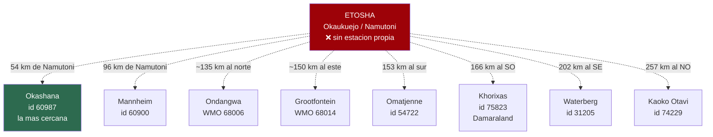
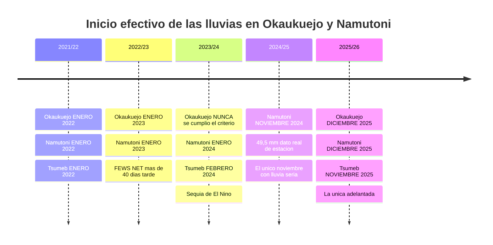
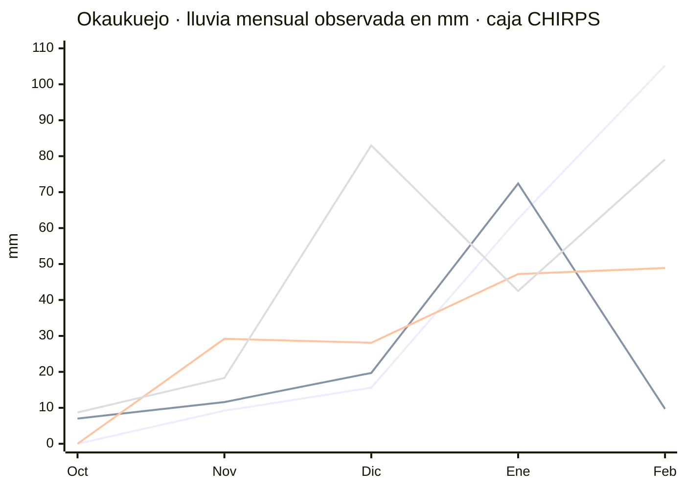
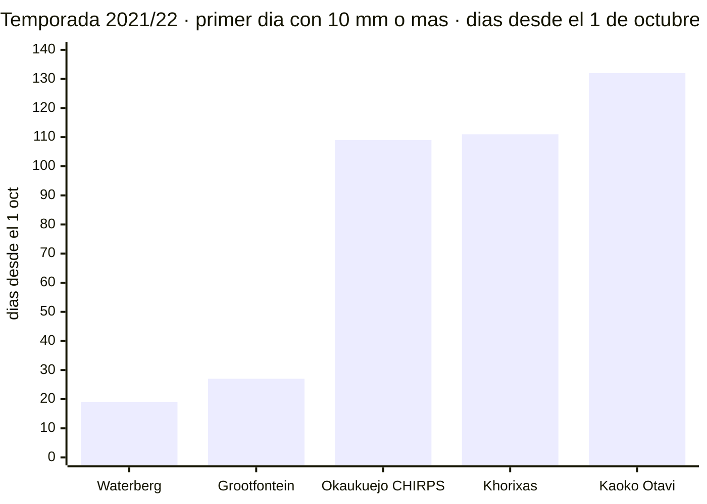

# Cuándo empezaron de verdad las lluvias — histórico, temporada a temporada

Datos **observados** de las últimas 5 temporadas. Investigación cerrada el 17/07/2026.

> ## Por qué existe este documento
>
> El Atlas de Namibia avisa de que la lluvia es *"erratic"*, con *"a high degree of variation"*.
> **La media de ~25 mm de noviembre en Etosha esconde años en que no cayó una gota hasta enero.**
> Para decidir fechas, las medias no sirven: sirven los años reales.

---

## ⚠️ Limitación de partida: no hay pluviómetro dentro de Etosha

**No existe estación SASSCAL dentro del parque.** Estas son las distancias reales a Okaukuejo de las
estaciones que sí existen:

**Fuentes usadas, por orden de calidad para nuestro caso:**
1. **Caja CHIRPS 0,05°** centrada en Okaukuejo y Namutoni — satélite calibrado con estaciones.
   **No es** el pluviómetro de Okaukuejo, pero es lo único centrado *en* Etosha.
2. **Servicio Meteorológico de Namibia**, vía prensa namibia — datos reales de estación, incluido
   **Namutoni**.
3. **SASSCAL WeatherNet** — estaciones automáticas reales, pero **todas fuera del parque**.
4. **FEWS NET / SADC** — boletines regionales, hablan de «norte de Namibia», no de Etosha.
5. **GHCN-Daily** — ojo: **no tiene datos namibios de precipitación posteriores a julio de 2025**.

---

## 📊 El resumen: 4 de 5 temporadas empezaron tarde

*Líneas, por orden: 2021/22 · 2022/23 · 2023/24 · 2025/26. En las cuatro, octubre y noviembre son
planos y el despegue llega en diciembre o enero.*

---

## Temporada 2021/22 — arranque en enero

**Okaukuejo (caja CHIRPS)** · votos 2-0
- Oct 2021 **0,0 mm** | Nov **9,2** | Dic **15,6** | Ene 2022 **62,6** | Feb **105,2**
- Primer día ≥10 mm: **18 de enero de 2022**
- Inicio criterio FEWS NET: **dekad 11–20 enero 2022**
- Namutoni y Tsumeb: **también 11–20 enero 2022**

**Grootfontein (GHCN-Daily, ~150 km al este de Namutoni)** · votos 2-0
- **FALSO ARRANQUE**: oct 2021 = 48,3 mm, **de los cuales 47,0 cayeron en un solo día, el 28 de
  octubre**. Después, **noviembre prácticamente seco (0,8 mm)** y las lluvias de verdad no se
  asentaron hasta diciembre (49,6 mm).
- 👉 **Lección: un chaparrón de octubre no es el inicio de la temporada.**

**FEWS NET (regional, norte de Namibia)** · votos 2-0
- Lluvia oct–dic 2021 **por debajo de la media**; en zonas del norte fue el acumulado **más bajo o
  segundo más bajo desde 1981**
- Las lluvias significativas **no llegaron hasta principios de febrero de 2022**

**Prensa namibia** · votos 2-0
- A **7 de enero de 2022** la lluvia seguía **confinada al noreste**; el subdirector de meteorología
  decía que el inicio se había retrasado

### La dispersión de esta temporada es la lección más útil del documento

Con estaciones SASSCAL **reales**, misma temporada:

- **Waterberg** (202 km al SE): **20 de octubre de 2021** — oct 42,4 mm
- **Grootfontein** (~150 km al E): 28 de octubre (falso arranque)
- **Okaukuejo** (CHIRPS): 18 de enero de 2022
- **Khorixas** (166 km al SO, Damaraland): **20 de enero de 2022** — **tres meses después que
  Waterberg**. Oct 0,1 mm | Nov 0,2 | **Dic 0,0 mm, cero días de lluvia en todo el mes**
- **Kaoko Otavi** (257 km al NO): **10 de febrero de 2022**

> **Más de tres meses de diferencia dentro de la misma temporada y del mismo país.**

---

## Temporada 2022/23 — arranque en enero, +40 días tarde

**Okaukuejo (CHIRPS)** · votos 2-0
- Oct 2022 **7,0 mm** | Nov **11,6** | Dic **19,7** | Ene 2023 **72,4** | Feb **9,7**
- Inicio criterio FEWS: **dekad 11–20 enero 2023**. Namutoni y Tsumeb, igual.
- Total oct–mar: **solo 135,4 mm** → **sequía severa**

**FEWS NET** · votos 2-0
- **Retraso de MÁS DE 40 DÍAS** sobre el inicio habitual en el norte de Namibia (dato a la 1ª década
  de febrero de 2023), con retraso extremo de la siembra
- La temporada acabó siendo **una de las más secas desde 1981** en el norte

**Waterberg (SASSCAL)** · votos 2-0
- Oct 2022 **15,2 mm** | Nov **9,7** | Dic **37,6** | Ene 2023 **33** | Feb **0,9**
- **Matiz importante**: octubre acumuló 15,2 mm **en lloviznas sueltas, pero NINGÚN día llegó a
  10 mm hasta el 4 de enero de 2023**
- Todo el año natural 2023 sumó **55,0 mm** en esta estación

**Khorixas (SASSCAL)** · votos 2-0
- **NUNCA hubo lluvia significativa**: ni un solo día con ≥10 mm entre septiembre de 2022 y febrero
  de 2023. **El día más lluvioso de toda la temporada fue de 0,7 mm.**
- Oct **0** | Nov **0,3** | Dic **0,5** | Ene **1** | Feb **0** | Mar **1,9**
- Todo 2023 sumó **22,6 mm**
- ⚠️ **Cobertura diaria COMPLETA** (sep 30, oct 31, nov 30, dic 31, ene 31, feb 28 días con dato):
  **la sequía es real, no un hueco de datos**

---

## Temporada 2023/24 — la sequía de El Niño

**Okaukuejo (CHIRPS)** · votos 2-0
- Oct 2023 **0,0 mm** | Nov **29,2** | Dic **28,1** | Ene 2024 **47,2** | Feb **48,9**
- **El criterio de inicio de FEWS NUNCA se cumplió en toda la temporada** (hasta el 31 de marzo de
  2024). Llovió poco y disperso todo el rato.
- Total oct–mar: **170,6 mm** → sequía severa
- **Namutoni**: inicio 1–10 de enero de 2024 · **Tsumeb**: 1–10 de **febrero** de 2024

**Waterberg (SASSCAL)** · votos **1-1 (disputado)**
- Oct 2023 **0,1** | Nov **0,0** | Dic **4,2** | Ene 2024 **9,6** | Feb **9,2**
- **En noviembre de 2023 no llovió ni un solo día.** El día más lluvioso de toda la temporada: 6,7 mm
- Total oct-2023 a feb-2024: **23,1 mm**
- Contraste brutal: **la misma estación midió 341,8 mm solo en enero de 2021**

**Prensa namibia (Tsumeb, Outjo, Otjiwarongo — el entorno inmediato de Etosha)** · votos 2-0
- Titular literal: **«First rains recorded for 2024»** — **fin de semana del 6–7 de enero de 2024**
- 6 mm en el aeropuerto de Tsumeb · 6 mm en Outjo · 9 mm en Otjiwarongo
- **Estado de emergencia por sequía declarado el 22 de mayo de 2024**

**Grootfontein / Ondangwa** · votos 2-0
- Grootfontein: oct 2023 = **2,3 mm** · nov = 18,0 mm **repartidos en 14 días de chubascos menores,
  ninguno ≥6 mm** · primer día ≥10 mm de toda la temporada: **21 de diciembre de 2023**
- Ondangwa: primera lluvia significativa el **3 de diciembre de 2023**
- **El propio Servicio Meteorológico de Namibia calificó la temporada de *«false onset»***

**FEWS NET / SADC** · votos 2-0
- A **10 de noviembre de 2023** las lluvias estacionales **aún no habían comenzado** en la mayoría de
  las zonas
- A **10 de diciembre de 2023** seguían sin empezar en la mayor parte del centro y sur de la región
- Luego, un *dry spell* récord de **más de 30–50 días**
- 📌 **Dato importante del mismo boletín**: en el norte de Namibia el inicio efectivo **es
  NORMALMENTE tan tardío como diciembre o incluso enero** *(esto es climatología de mediana, no
  observación de un año)*

---

## Temporada 2024/25 — el único noviembre con lluvia seria

**NAMUTONI — dato REAL de estación, Servicio Meteorológico de Namibia** · votos 2-0
- **Namutoni registró 49,5 mm en noviembre de 2024** (periodo 24 oct – 24 nov 2024)
- King Kauluma (Oshikoto): 92,5 mm en noviembre
- **La mayoría del país, incluidas las regiones del norte, NO registró lluvia en octubre de 2024**

**Okashana (SASSCAL, la más cercana a Etosha: 54 km de Namutoni)** · votos 2-0
- Sep 2024 **0,7** | Oct **0,1** | Nov **28,1** | Dic **50,6** | Ene 2025 **31** | Feb **107,5**
- Primer día ≥10 mm: **19 de noviembre de 2024** con 11,9 mm
- **Octubre de 2024 fue seco (0,1 mm)**

**Mannheim (SASSCAL, 96 km de Namutoni)** · contradice a Okashana
- Oct 2024 **39,9 mm** | Nov **41,7** | Dic **71,8** → primer día ≥10 mm el **9 de OCTUBRE de 2024**

**Prensa (Tsumeb, Tsintsabis, Grootfontein, Otavi — cinturón inmediato al este de Etosha)** · votos 2-0
- Primeras lluvias: **fin de semana del 2–3 y lunes 4 de noviembre de 2024**
- Tsumeb 3,5 mm · aeropuerto 5,5 · **Tsintsabis 20 mm** · Grootfontein 10–42 mm · Otavi 16 mm

**Ondangwa (GHCN)** · votos **1-1 (disputado)**
- Nov 2024 = 5,9 mm · Dic = 17,3 mm **todo a final de mes** · primer día ≥10 mm: **21 de enero de 2025**

**FEWS NET** · votos 2-0
- Norte de Namibia: primeras lluvias efectivas **al menos 30 DÍAS TARDE**
- **Pero** el acumulado 1 oct 2024 – 5 ene 2025 acabó **POR ENCIMA de la media**
- 👉 **Arrancó tarde y luego llovió bien**

⚠️ **La serie CHIRPS de esta temporada fue REFUTADA 0-2** en verificación por un error factual duro.
Por eso aquí se usa el **dato real de estación de Namutoni**, no CHIRPS.

---

## Temporada 2025/26 — la excepción: adelantada y muy húmeda

**Okaukuejo (CHIRPS)** · votos 1-0
- Oct 2025 **8,7 mm** | Nov **18,3** | Dic **83,0** | Ene 2026 **42,5** | Feb **79,1**
- Primer día ≥10 mm: **11 de diciembre de 2025**
- Inicio criterio FEWS: **dekad 11–20 diciembre 2025**
- **Namutoni**: 11–20 dic 2025 (aunque su primer día ≥10 mm fue ya el **14 de noviembre**)
- **Tsumeb**: **11–20 de NOVIEMBRE de 2025** — la más adelantada

**FEWS NET** · votos 2-0
- **Inicio ADELANTADO** en el norte y centro de Namibia: en algunas zonas hasta **3 dekads (~30
  días) antes de lo normal**
- Acumulado 1 oct 2025 – 10 ene 2026 **por encima de la media**
- 📌 Dado que el inicio mediano en el norte es dic/ene, un adelanto de 3 dekads lo sitúa en noviembre

**Servicio Meteorológico de Namibia, vía prensa** · votos 2-0
- **Noviembre de 2025 observado**: Grootfontein, Gaikos y Katima Mulilo entre **130 y 173 mm**;
  regiones centrales 30–80 mm; sur 10–30 mm; **costa seca**
- **Octubre–diciembre de 2025 fue el segundo periodo más lluvioso desde 1981**

**Cierre de temporada oct 2025 – abr 2026 (estaciones oficiales del NMS)** · votos 2-0
- **Grootfontein 828 mm** (normal 521) · **Ondangwa 654 mm** (normal 429)
- Katima Mulilo 1.002 mm (normal 654) · Windhoek 450 mm (normal 378)

**Okashana (SASSCAL)** · votos 2-0 — **contradice a todo lo anterior**
- Sep 2025 **0** | Oct **1,5** | Nov **1,8** | Dic **8** | Ene 2026 **44,2** | Feb **144,6**
- Primer día ≥10 mm: **29 de enero de 2026** — ¡arranque tardísimo!
- ⚠️ **Cobertura diaria COMPLETA**: el arranque tardío **es real**, no un hueco

**Omatjenne**: primer día ≥10 mm el **19 de octubre de 2025** · **Mannheim**: **4 de noviembre de 2025**

> **En la misma temporada 2025/26: Omatjenne 19 de octubre, Mannheim 4 de noviembre, Okashana 29 de
> enero. Otra vez, más de tres meses de dispersión.**

---

## 🎯 Qué sacamos de todo esto

### 1. La probabilidad juega a favor de finales de noviembre

En **4 de las 5 últimas temporadas**, el inicio efectivo en Etosha fue **diciembre o enero** — es
decir, **después** de un viaje a finales de noviembre. El único noviembre con lluvia seria fue
**2024 (Namutoni, 49,5 mm)**.

### 2. Pero nadie puede predecir 2026

Las cinco temporadas van de **«nunca llegó»** (El Niño 2023/24) a **«el segundo oct-dic más lluvioso
desde 1981»** (2025/26). **La variabilidad interanual es el hallazgo, no el promedio.**

### 3. Si llueve, será local y disperso

Tres veces hemos visto **>3 meses de dispersión** entre estaciones de la misma temporada. No es un
monzón que tapa el país: son tormentas que caen donde caen.
👉 **Pon Etosha al principio del recorrido**, por si acaso.

### 4. Cuidado con el falso arranque

Octubre de 2021 en Grootfontein: **47 mm en un solo día** y luego un noviembre seco. El Servicio
Meteorológico namibio usó literalmente el término **«false onset»** para 2023/24. Una tormenta
temprana **no** significa que la temporada haya empezado.

---

## 🕳️ Límites de este documento

- **La caja CHIRPS no es el pluviómetro de Okaukuejo**: es satélite calibrado. No hay alternativa
  centrada en Etosha.
- **La serie 2024/25 de CHIRPS quedó refutada 0-2**; se sustituyó por el dato real de Namutoni.
- **Dos datos quedaron disputados 1-1** (Waterberg 2023/24 y Ondangwa 2024/25): se marcan como tales.
- **GHCN-Daily no tiene precipitación namibia posterior a julio de 2025**, así que 2025/26 depende de
  CHIRPS, SASSCAL y prensa.
- **El criterio de «inicio» de FEWS NET** (una dekad ≥25 mm seguida de 20 mm en las dos siguientes)
  es **agronómico y estricto**: es más exigente que «el primer día que llovió 10 mm». Los dos
  criterios aparecen etiquetados por separado arriba.
- **Nadie cuantifica** cuánto se degradan los avistamientos por cada mm de lluvia. La relación
  lluvia → menos fauna en las charcas es **inferencia razonable, no dato medido**.

**Fuentes:** [Atlas of Namibia](https://atlasofnamibia.online/chapter-3/rainfall-patterns) ·
[SASSCAL WeatherNet](https://sasscalweathernet.org) · CHIRPS · FEWS NET ·
Servicio Meteorológico de Namibia vía *The Namibian* · GHCN-Daily
