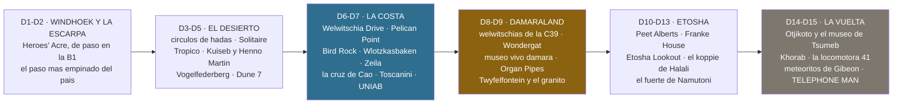

# 10 · Joyas ocultas

> **Namibia · 30 oct – 15 nov 2026 · la clásica del norte** — [← índice del dossier](README.md)
>
> Lo que la ruta pisa y el itinerario no nombra, **día a día y en el orden en que cae**: la
> plataforma de guano, la cruz de Diogo Cão, la torre de sondeo llena de cormoranes, la cascada del
> Uniab, los grabados de Peet Alberts, los cañones del Otjikoto, los meteoritos de Windhoek — y los
> Lone Stone Men, que son la joya mayor.
>
> **~N$20 = €1**, de bolsillo *(el cambio real de 2026 va por **18,5–19,4** — BCE, 28/08: el euro de estas páginas se queda ~7 % corto)* · **✅** fuente primaria · **◐** secundaria concordante ·
> **○** práctica común, sin fuente · **❌** sin verificar, dicho en blanco
>
> *Investigación cerrada el 02/08/2026 · **rehecho de cero el 27/08/2026** sobre la ruta del 24/08
> —la de quince días correlativos, con Twyfelfontein y Hoada— porque el documento anterior mezclaba
> dos numeraciones de días y llamaba «pequeño desvío» a uno de 60 km. Ahora cada joya lleva su día,
> **su desvío medido con OSRM** (el mismo enrutado que dibuja el mapa) y, si Nominatim la encuentra,
> **su punto en el mapa de la agenda**.*

> ⚠️ **Aviso de precios de monumentos:** el baremo del National Heritage Council que citan estas
> fuentes es el **2024/25 vía prensa local** *(en vigor desde el 1/04/2024 —
> [Windhoek Express](https://www.we.com.na/scoreboard/exorbitant-fees-for-dilapidated-heritage-areas2023-09-11))*
> y las tasas de parque son las del **baremo MEFT de abril de 2026** *(`15`)* — los blogs viejos
> citan precios muy inferiores que **ya no valen**. Presupuesta lo alto y lleva **efectivo**: en
> estos sitios el datáfono es leyenda.

---

## 🧭 Cómo se lee este documento — y cómo lo lee la agenda

- **Joya es lo que NO está en el `01` como plan.** Twyfelfontein, Cape Cross, Sesriem Canyon o el
  rastreo de rinoceronte son el viaje; aquí va lo que queda al lado y nadie te cuenta.
- **Cada día tiene su sección `### Dn`**, y dentro **cada viñeta es una joya** con dónde cae, qué
  cuesta y cuánto desvío añade. **La agenda de la guantera copia esas viñetas tal cual** bajo el
  mapa de cada día, como bloque *opcional* —lo que se hace si sobra tiempo—; los párrafos sueltos y
  las líneas de fuentes se quedan aquí. Por eso las viñetas son cortas y los porqués van aparte.
- **Los kilómetros de desvío no son de blog**: se han medido metiendo el punto en la etapa del día
  y restando *(OSRM sobre OpenStreetMap, 27/08)*. «De paso» quiere decir **a menos de 1 km de la
  línea de la ruta**, medido contra su geometría.
- **En el mapa de la agenda entra lo que Nominatim encuentra** *(`geodatos.py interes`)*: lo que no
  encuentra —el lago Otjikoto, el delta del Uniab, el memorial de Khorab, el Telephone Man— **queda
  fuera del mapa a propósito y consta en `geo/interes.json`**. No se pone una coordenada a ojo.

---

## 🗿 La joya mayor: los «Lone Stone Men» — las esculturas de personas

**Qué son.** Un proyecto de land art en curso: **figuras humanas a tamaño natural, hechas con
rocas del propio paraje** sobre varillas de hierro, plantadas en rincones remotos del Namib por un
artista namibio **anónimo que firma RENN**, bajo el lema *«Art Before Artist»*. Cada una tiene su
pose — de pie, sentada, arrodillada con los brazos al cielo, una colgada de un saliente — y un
disco metálico numerado con un mensaje. Las primeras se documentaron **hacia 2014** en Kaokoland;
en **2022, dieciséis de ellas representaron a Namibia en su primer pabellón de la Bienal de
Venecia** (*«A Bridge to the Desert»*). ¿Cuántas hay? Nadie lo sabe: se han documentado 14–23,
existe al menos la **nº 37**, y se rumorean más de cuarenta.

**La guía para TU recorrido** *(regla de la casa: las del desierto van sin coordenadas —
encontrarlas es la gracia; la urbana tiene pin público y se da)*:

> ⚠️ **Y esto se rehízo el 28/08, porque prometía algo que las fuentes no sostienen.** Hasta esa
> fecha aquí se decía que el tramo Ugabmund → Terrace Bay → Springbokwasser «es exactamente ese
> terreno» y que había que ir con «ojos a crestas». **No lo es.** El propio autor de Overlandbirds
> —que ha conocido al artista y es quien más ha encontrado— responde a esa misma pregunta:
> *«The farthest south one **in the bush**, so to speak, is between Sesfontein and Puros»*. Sesfontein
> está a 19°07′S; **Terrace Bay a 19°59′, Torra Bay a 20°17′ y Ugabmund a 21°09′**: todo vuestro
> tramo queda **entre 100 y 250 km AL SUR de la figura más meridional que nadie ha encontrado**. La
> foto de Alamy que se citaba como prueba la titula su propio fotógrafo *«…Lone Men, **Kaokoland**,
> Kunene Region»*. Y en el Palmwag de vuestro D9, lo que un equipo de búsqueda tomó por un Lone Man
> *«turned out to be an actual person waving from a koppie»*. **En este viaje no vais a ver uno en
> el campo.**

- **D15 · Windhoek — la ÚNICA de este viaje: «No Answer», el *Telephone Man*** ○. Figura urbana del
  mismo proyecto, esperando junto a una cabina que no va a sonar. **Coordenada: −22,56397 ·
  17,07045** *(S 22°33,838′ E 17°04,227′)*, que cae en **Roentgen Street, Windhoek West** — calle
  residencial, **no «pleno centro»** como decía este documento hasta el 28/08. Del Craft Centre son
  **1,65 km en línea recta y 2,0–2,3 km andando, 25–30 min por trayecto**; y de paso **queda a 235 m
  de vuestra entrada a la ciudad el D14**, así que la opción barata es verla desde el coche al
  llegar.
  ⚠️ **La coordenada tiene UNA sola fuente y no es el artículo**: es un **comentario del propio autor
  de Overlandbirds (11/04/2024)** respondiendo a un lector — *«No Answer aka Telephone Man GPS
  -22.56397 17.07045»*—. Sin segunda fuente, sin foto atada a esa coordenada y sin confirmar que
  siga en pie en 2026. Por eso baja de ◐ a ○: **si no está, habréis dado un paseo de 25 minutos.**
- **El núcleo duro** —de **Sesfontein hacia el norte**: Purros, Orupembe, Marienfluss, Van Zyl's
  Pass, Otjinungua, la D3707— queda en el **Kaokoveld profundo: fuera de ruta y fuera de seguro**,
  y son los cuatro extremos del proyecto *(Purros al sur, Van Zyl's al este, Otjinungua al norte,
  Skeleton Coast al oeste — pero la mitad NORTE del parque, la de las concesiones, no vuestra
  carretera)*. Para otro viaje. *(Las coordenadas circulan en el grupo de Facebook «Overlanding GPS
  Logs & Tracks»: se piden, no se publican ○.)*

**La etiqueta, que es parte de la obra** ○: se tocan con los ojos — ni moverlos, ni «recolocarlos»
para la foto, ni llevarse el disco; y si dais con uno no documentado, la norma de la comunidad es
**no publicar sus coordenadas**. El lema del autor lo dice todo: *«Art Before Artist»*.

Fuentes: [foto del Lone Man en un mirador del Skeleton Coast — Alamy](https://www.alamy.com/stone-man-by-artist-renn-at-skeleton-coast-view-point-in-the-namib-desert-lone-men-kaokoland-kunene-region-namibia-africa-image499103414.html) ◐ ·
[Bienal de Venecia](https://www.labiennale.org/en/art/2022/national-participations/namibia) y
[biennalenamibia.art](https://biennalenamibia.art/eng/1399) ✅ ·
[Wikipedia — The Lone Stone Men](https://en.wikipedia.org/wiki/The_Lone_Stone_Men) ·
[Travel News Namibia](https://travelnam.com/mysterious-lone-men-kaokoland/) ◐ ·
[Overlandbirds](https://www.overlandbirds.com/lone-men-of-namibia/) ◐ ·
[Africanlanders](https://africanlanders.com/en/namibia-en/the-stone-men-the-mystery-of-north-namibia/) ○ ·
la polémica de Venecia: [Artnet](https://news.artnet.com/art-world/namibia-pavilion-venice-biennale-controversy-2098395)

---

## 🗺️ Todas, en el mapa de tu ruta

---

## 📍 Día a día — lo que cae en cada etapa

### D1 · sáb 31 oct — Llegada, coche y compra en Windhoek

- **Windhoek se deja para el D15** — los meteoritos de Gibeon y el Telephone Man están a diez y a
  veinticinco minutos a pie del Craft Centre, y el D15 es un día entero en la ciudad. Hoy solo si,
  tras la compra grande, sobran fuerzas: el colchón del día es para la tienda ○.

### D2 · dom 1 nov — Windhoek → Rehoboth → paso de Spreetshoogte

- **Heroes' Acre** *(B1, ~10 km al sur del centro, a la vista de la carretera — la ruta pasa a
  500 m)* ◐ — el monumento a la independencia: obelisco de mármol, **soldado desconocido de bronce
  de 8 m**, muro en relieve con la historia de la lucha y llama eterna; inaugurado el **26/08/2002**
  y diseñado **con un equipo norcoreano** ✅ *(el mismo estudio del museo dorado de Windhoek, `19`)*.
  🆕 **Y lo que hace que hoy merezca la parada, y no estaba escrito** *(28/08)*: **Sam Nujoma, el
  presidente fundador, está enterrado aquí desde el 1 de marzo de 2025** ✅ — murió el 8 de febrero
  de 2025 a los 95 y su tumba es ahora el centro del recinto. Estáis ante la tumba del hombre que
  sale en los billetes, año y medio después de que el país lo enterrase.
  **Abre a diario 08:00–17:00 ✅ · N$70 (~€3,5) ✅**. Salís a las 09:00–09:30 con un día de 3h–3h30:
  media hora que sobra, y ésta es la media hora mejor pagada del documento.
- **El paso, para contarlo arriba** ◐ — 1.822 m en lo alto y **casi 1.000 m de caída en 4 km**,
  pendiente entre 1:4,5 y 1:6: **el paso más empinado de Namibia** y el de mayor desnivel. Lo abrió
  **a mano, con cuarcita y dinamita, el granjero Nicolaas Spreeth** durante la II Guerra Mundial
  para bajar suministros de su granja. Prohibido a camiones y caravanas — y eso ya lo dice el `01`.

Fuentes: [City of Windhoek — Heroes' Acre](https://www.windhoekcc.org.na/heroes-acre/) ✅ ·
[Kaps Tours](https://kapstoursandsafaris.com/destination/namibia/erongo-region/windhoek/heroes-acre/) ◐ ·
[Tripadvisor — Heroes Acre](https://www.tripadvisor.com/Attraction_Review-g293821-d6885838-Reviews-Heroes_Acre-Windhoek_Khomas_Region.html) ○ ·
[Wikipedia — Spreetshoogte Pass](https://en.wikipedia.org/wiki/Spreetshoogte_Pass) ◐

### D3 · lun 2 — Spreetshoogte → Solitaire → Sesriem

- **Solitaire, el ángulo no típico** ○ — ya paras dos veces, pero la historia mejora la foto: **los
  Chevy y Ford oxidados de los 50 fueron colocados a propósito** como atrezo; la **tarta de manzana**
  es la receta del escocés Percy «Moose» McGregor, un Apfelstrudel de familia que sobrevive a su
  creador; y el nombre juega con el diamante solitario y la soledad.
- **Los círculos de hadas del Gondwana Namib Park** *(C19, al sur de Solitaire, de camino a
  Sesriem)* ✅/◐ — discos de suelo desnudo de 2–12 m orlados de hierba, **el misterio científico más
  famoso del país**: termitas de arena *(Jürgens, «Science» 2013)* o autoorganización de la hierba
  por el agua — hoy, probablemente ambas. El parque privado de Gondwana, «al sur de Solitaire»,
  tiene círculos junto a la C19 que bajáis ◐ *(el «uno de los nueve sitios documentados» que ponía
  aquí con ✅ **no se ha podido sostener en ninguna fuente**: fuera el número, 28/08)*:
  mirad el llano a los lados. Gratis desde la carretera; la excursión la vende Namib Desert Lodge.
- **Sesriem Canyon, el nombre** ○ — «ses riem» son las **seis correas de cuero de órix** que los
  primeros colonos ataban para bajar un cubo hasta el agua del fondo; el cañón tiene ~1 km y hasta
  30 m de hondo. Está en el plan de la tarde del `01`; esto es solo para saber qué se pisa.

Fuentes: [Gondwana — fairy circles](https://gondwana-collection.com/news/fairy-circles-of-the-namib) ✅ ·
[Science Alert](https://www.sciencealert.com/the-surreal-mystery-of-namibias-fairy-circles-may-finally-be-solved) ·
[Conservation Namibia](https://conservationnamibia.com/blog/science-of-fairy-circles-2023.php) ◐ ·
[HuffPost — Moose McGregor](https://www.huffpost.com/entry/a-moose-an-apple-pie-in-t_b_5223671) ○ ·
[Arebbusch — Solitaire](https://www.arebbusch.com/travel-guide-listings/namibian-attractions/solitaire/) ○ ·
[Wikipedia — Sesriem Canyon](https://en.wikipedia.org/wiki/Sesriem_Canyon) ○

### D4 · mar 3 — Sossusvlei, Deadvlei y Duna 45

- **Círculos de hadas junto a Elim Dune, nada más pasar la puerta** ○ — hay quien los señala ahí,
  a la derecha de la carretera asfaltada: al alba de hoy, de camino y sin desvío. El resto del día
  no admite joyas: **el día ES la joya** *(Deadvlei, Big Daddy, Hidden Vlei y la Duna 45 ya están
  en el `01`)*.

### D5 · mié 4 — Sesriem → Solitaire → paso del Kuiseb → Walvis Bay

- **El letrero del Trópico de Capricornio** *(C14, entre el paso de Gaub y el del Kuiseb)* ◐ — la
  ruta cruza los 23°26′S poco después de Gaub *(medido sobre la geometría: la línea va pintada en el
  mapa de la agenda)*. La foto de rigor, dos minutos.
- **El cañón del Kuiseb y el refugio de Henno Martin** *(paso del Kuiseb, C14 — de paso)* ◐ — la
  cueva donde **dos geólogos alemanes se escondieron dos años y medio desde 1940** para no ser
  internados, viviendo de la caza: la historia de *The Sheltering Desert*. La llamaban «Carp Cliff»
  por la poza con carpas que tenían debajo. El mirador del paso, sobre el cañón, es parada de
  20 minutos; la pista corta que baja al refugio **pide permiso del parque** ◐ y el refugio queda
  a ~1 km de su entrada ◐ — eso ya es una hora que el día de 316 km no regala.
- **Vogelfederberg** *(pegado a la C14, ~52 km antes de Walvis — OSRM)* ◐ — inselberg de granito
  «de plumas de pájaro», con áloes grandes y zona de braai del parque: **la parada de comer** si se
  viene con la nevera. Es Namib-Naukluft: para bajarse hace falta **permiso MEFT** ◐ — pregunta al
  salir de Sesriem si el de vuestras 24 h lo cubre ❌.
- **Dune 7** *(a la entrada de Walvis, junto a la C14)* — la duna más alta de Namibia *(383 m ○)*,
  subida ~45 min y vistas a desierto y Atlántico a la vez. **Ya no es gratis: N$150 (~€7,5) por
  extranjero adulto desde el 1/12/2022** ✅ *(MEFT; namibios N$50, SADC N$100)*. Llegando a media
  tarde, mejor **dejarla para el D6 al amanecer o al atardecer** ○: a mediodía la arena quema.

Fuentes: [Wikipedia — C14](https://en.wikipedia.org/wiki/C14_road_(Namibia)) ◐ ·
[Bushguide 101 — Henno Martin shelter](https://bushguide101.com/the-henno-martin-shelter-at-kuiseb-canyon/) ◐ ·
[Geological Society of Namibia — Martin y Korn](https://geolsocnamibia.org/henno-martin-hermann-korn/) ◐ ·
[Padlangs — Sheltering Desert](https://padlangsnamibia.com/padlangs-namibia/henno-martins-sheltering-desert) ○ ·
[Zanzig — Vogelfederberg](https://zanzig.com/2024/02/18/vogelfederberg-namibia/) ◐ ·
[New Era — Climbing Dune 7 no longer free](https://neweralive.na/climbing-dune-7-no-longer-free/) ✅ ·
[WhereToStay — Dune 7](https://www.wheretostay.co.za/topic/6283-dune-7-walvis-bay-namibia) ○

### D6 · jue 5 — Walvis Bay: Sandwich Harbour y descanso

- **Moon Landscape + Welwitschia Drive** *(desde Swakopmund, 30 km al norte)* ◐ — badlands lunares
  del valle del Swakop y **ruta autoguiada de 13 paradas** que acaba en una welwitschia de
  **~1.500 años**, con el oasis de Goanikontes en medio.
  🛑 **Pero NO detrás de Sandwich Harbour, y esto se corrigió el 28/08**: el Welwitschia Drive son
  **160 km de pista y ~4 h** según la propia fuente que se cita aquí, y el tour de Sandwich Harbour
  no devuelve a Walvis Bay hasta las ~15:00. Con el ocaso a las **19:17** y la oficina del MEFT ya
  cerrada a la vuelta, **no cabe**: es medio día propio, no un remate de tarde.
  👉 **La versión que sí cabe** es el **Moon Landscape solo, por la C28** — una hora, los mismos
  badlands y sin pista de 4×4 —, y la tarde para las ostras, que es para lo que está el D6. **Permiso
  obligatorio en la oficina del MEFT de Swakopmund** *(Bismarck St esq. Sam Nujoma Ave)* — es
  Namib-Naukluft, parque premium: **cuenta N$280 (~€14) por persona + N$60 (~€3) el coche** ◐ y
  confírmalo en la oficina. ⚠️ La oficina cierra el fin de semana según blogs — **hoy es jueves** ✓.
- **Pelican Point y las salinas rosas** ◐ — península con **faro de 1932** *(hoy lodge)* y lobos
  marinos a tiro de piedra; el acceso cruza las **salinas rosas llenas de flamencos**. La lengua de
  arena, **en tour**: con vuestro coche es terreno de atasco y el contrato no está para bromas.
  El de Sandwich Harbour de esta mañana suele pasar por aquí ○ — pregúntalo al reservar.
- **Bird Rock, la plataforma de guano** *(B2, ~10 km al norte de Walvis, camino de Swakopmund — se
  ve desde la carretera; la ruta pasa a 800 m)* ◐ — una **plataforma de madera sobre el mar levantada
  en 1930 por el carpintero Adolf Winter** y ampliada hasta ~17.000 m² en 1939, hoy colonia de cría
  de **cormorán del Cabo y pelícano** que rinde ~650 t de guano al año. Gratis, sin bajarse.

Fuentes: [The Orange Backpack — Welwitschia Drive](https://theorangebackpack.nl/en/namibia/the-welwitschia-drive/) ○ ·
[Drive South Africa — Welwitschia Drive](https://www.drivesouthafrica.com/blog/what-you-need-to-know-about-the-welwitschia-drive-in-namibia/) ◐ ·
tarifas: [namibian.org — subida de tasas](https://namibian.org/blog/namibia-raises-park-fees-by-80-to-100-percent) ◐ ·
[sandwich-harbor.com](https://www.sandwich-harbor.com/tours) ◐ ·
[Tripadvisor — Pelican Point](https://www.tripadvisor.com/AttractionProductReview-g298358-d20045116-Pelican_Point_Seal_Colony_4x4_Tour-Walvis_Bay_Erongo_Region.html) ○ ·
[Wikipedia — Bird Island (Namibia)](https://en.wikipedia.org/wiki/Bird_Island_(Namibia)) ◐ ·
[namibian.org — guano](https://namibian.org/blog/guano-production) ◐

### D7 · vie 6 — Walvis Bay → Cape Cross → Ugabmund → Terrace Bay

*El día con hora límite —Ugabmund a las 15:00— así que todo esto son paradas de cinco minutos,
salvo el Uniab, que se deja para mañana.*

- **Los campos de líquenes del Dorob** *(C34, desde la Milla 30 al sur de Henties Bay; y después,
  las llanuras entre el Ugab y el Huab)* ◐ — alfombras de líquen naranja, verde y negro que
  **crecen ~1 mm al año**: se ven a pie desde el arcén y **ni una rueda fuera de la rodada** *(`11`)*.
- **Wlotzkasbaken** *(C34, de paso)* ◐ — aldea-cápsula de pescadores de los años 30 dentro del
  Dorob NP: **sin agua corriente, sin red eléctrica, sin vallas**, cada casa de colores con su torre
  de agua rellenada por camión. Población fija: **6 personas**. Quince minutos.
- **El pecio Zeila** *(C34, ~14 km al sur de Henties Bay, a 100 m de la carretera — en el mapa)*
  ◐ — arrastrero embarrancado en **2008**, hoy percha de cormoranes: **el pecio más fotogénico y
  accesible** de toda la Costa de los Esqueletos, sin andar nada. Gratis ○.
- **Cape Cross, lo que no son los lobos** ◐ — las **dos cruces de piedra** son réplicas del
  *padrão* que **Diogo Cão plantó en 1486**: una de **1895** y otra, privada y más fiel, posterior;
  **la original está en el museo del transporte de Berlín**. Al lado, la salina que cruzó **el
  primer ferrocarril del país** ◐. Va dentro de la entrada *(N$280 + N$60 el coche, `01`)*.
- **La puerta de Ugabmund** — las **calaveras** de las dos hojas de la verja son la foto que abre
  todos los reportajes del parque ◐; treinta segundos, que la puerta cierra a las 15:00.
- **La torre del Toscanini** *(~50 km al norte de la puerta — OSRM 51 —, a la derecha de la pista;
  en el mapa)* ◐ — la plataforma de sondeo que dos prospectores dejaron **oxidarse tras 1.700 m sin
  petróleo**: hoy es **colonia de cría de cormorán del Cabo**, con chacales y hiena parda debajo.
  Acordonada: se mira, no se sube.
- **Los pecios «míticos» del tramo** *(Winston, South West Seal, Atlantic Pride)* ◐ — chatarra medio
  enterrada: la guía Bradt avisa de que queda «muy poco». El bueno fue el Zeila, esta mañana.
- **Ojo a las crestas: los Lone Men** *(arriba)* ◐ — este parque es donde hay foto de uno.
- **Terrace Bay es una mina** ◐ — el resort **es la antigua colonia minera reconvertida**: por eso
  hay bungalós, tienda y bar en mitad de nada. Y el **delta del Uniab**, que se cruza a ~10 km de
  llegar, **se deja para mañana al amanecer** *(D8)*.

Fuentes: [namibweb — Skeleton Coast](https://www.namibweb.com/skeleton.htm) ◐ ·
[Wikipedia — Wlotzkasbaken](https://en.wikipedia.org/wiki/Wlotzkasbaken) ◐ ·
[Padlangs — Wlotzkasbaken](https://padlangsnamibia.com/padlangs-namibia/whats-in-a-name-wlotzkasbaken) ○ ·
[Tripadvisor — Zeila](https://www.tripadvisor.com/Attraction_Review-g1887482-d11547469-Reviews-Zeila_Shipwreck-Henties_Bay_Erongo_Region.html) ○ ·
[Bradt — land shipwrecks](https://www.bradtguides.com/land-shipwrecks-namibia/) ◐ ·
[info-namibia — Cape Cross](https://www.info-namibia.com/activities-and-places-of-interest/swakopmund-surrounds/cape-cross) ◐ ·
[Visit Namibia — Cape Cross Seal Reserve](https://visitnamibia.com.na/2022/02/cape-cross-seal-reserve/) ◐ ·
[Alamy — Ugabmund gate](https://www.alamy.com/ugabmund-gate-with-its-famous-skull-and-crossbones-at-the-entrance-to-the-skeleton-coast-national-park-namibia-image418061700.html) ◐ ·
[Drink Tea & Travel — Skeleton Coast](https://drinkteatravel.com/skeleton-coast-national-park-namibia-shipwrecks/) ○ ·
[Exploring Africa — southern Skeleton Coast](https://www.exploring-africa.com/en/namibia/what-visit-skeleton-coast-southern-section) ◐

### D8 · sáb 7 — Terrace Bay → Springbokwasser → Twyfelfontein

- **El delta del Uniab y su cascada** *(entre Terrace Bay y Torra Bay: lo cruzáis al salir)* ◐ —
  cinco brazos con pozas orladas de caña, hides sobre las charcas, springbok, órix y hasta hiena
  parda; y desde el segundo brazo, **el sendero de la cascada: ~6 km ida y vuelta por una garganta
  estrecha** *(corregido el 28/08 — aquí se ofrecía «un paseo corto de ~30 min» que la fuente no
  dice)*, **hasta donde el agua cae sobre roca de colores a una poza junto al mar**. La versión
  corta, si no hay tiempo: **el hide del segundo brazo y el mirador de las cinco pozas**, que sí
  están al lado. Un hilo de cascada en la Costa de los Esqueletos: eso no lo trae casi nadie a
  casa. Va con la entrada
  del parque; **hoy hay tiempo** *(211 km, sin puerta con hora — solo hay que salir del parque)*.
- **Las welwitschias de la C39** *(entre Springbokwasser y Bergsig, ~54 km)* ◐ — crecen **junto a
  la carretera**, en los drenajes que bajan al Huab y al Springbokwasser: es el Welwitschia Drive
  sin permiso ni desvío. Parar, mirar, no pisar.
- **Wondergat** *(D3254, 4 km al norte del cruce con la D2612; **+11 km y ~45 min medidos con
  OSRM**, no los «500 m de pista» que ponía aquí hasta el 28/08 — el agujero está a 3,3 km de la
  línea del día)* ◐ —
  dolina en caliza con **37 m de caída** a un sistema de galerías de 830 m; «Heitsieibeb», lugar
  sagrado para los khoikhoi. Sin barandilla ○. Gratis ○.
- **El Damara Living Museum** *(en la D3254, ~10 km antes de los grabados — en el mapa)* ✅ — el
  primer museo vivo damara del país: herrería, curtido, joyería, danza, juegos y fuego sagrado, con
  guía. **Tarifa 2026–27 ✅** *(su propio PDF, descargado el 28/08 — hasta esa fecha aquí estaban
  las cifras de 2024–25 con etiqueta de 2026)*: **N$150 (~€7,5) la vida tradicional (~1 h) · N$120
  (~€6) el paseo botánico (~45 min) · N$240 (~€12) los dos (~2 h) · N$110 (~€5,5) la aldea moderna
  (a petición, a 2 km)**; niños 0–2 gratis y 3–12 mitad de precio. Horario ❌.
- **Organ Pipes y Burnt Mountain** *(al sur de Twyfelfontein, señalizados; a 7 y 8 km de la línea
  del día, pero las pistas son lentas: **+25 km y +1 h 13 medidos con OSRM** sobre la etapa)* ◐ —
  columnas de dolerita de **~120 millones de años** en una garganta *(mejor luz al amanecer)* y la
  ladera volcánica que vira a púrpuras y negros. **N$250 (~€12,5)/adulto como visita guiada** ◐
  *(NHC vía prensa; los blogs viejos dicen «gratis»)*. Horario ❌.
- **Petrified Forest** *(C39 hacia Khorixas, 42 km al oeste del pueblo)* — troncos fosilizados del
  Pérmico *(~260 millones de años)*, algunos de decenas de metros, con welwitschias entre ellos;
  guía obligatorio incluido, **N$270 (~€13,5)/adulto** ◐. ⚠️ **Son +60 km medidos sobre el D8**
  *(OSRM: 271 frente a 211)*, ida y vuelta por la C39 — y desde Twyfelfontein hacia Palmwag (D9)
  queda en dirección contraria. **Solo si la tarde va muy sobrada**; si no, se cae sin pena.

Fuentes: [namibweb — Skeleton Coast](https://www.namibweb.com/skeleton.htm) ◐ ·
[Tripadvisor — Uniab delta](https://www.tripadvisor.com/Attraction_Review-g479222-d15206996-Reviews-Uniab_River_Delta_and_Canyon-Skeleton_Coast_National_Park_Khomas_Region.html) ○ ·
[Independent Travels — dónde crece la welwitschia](https://mytravelcurator.com/places-where-wild-welwitschia-mirabilis-grows/) ◐ ·
[Tracks4Africa — Wondergat](https://tracks4africa.co.za/listings/item/w138550/wondergat-sinkhole/) ◐ ·
[Lonely Planet — Wondergat](https://www.lonelyplanet.com/namibia/twyfelfontein-area/attractions/wondergat/a/poi-sig/1346139/1329041) ◐ ·
[LCFN — Damara Living Museum, programas y tarifas](https://www.lcfn.info/damara/programs-rates) ✅ ·
[info-namibia — Damara Living Museum](https://www.info-namibia.com/activities-and-places-of-interest/damaraland/damara-living-museum) ◐ ·
[Windhoek Express — tarifas NHC](https://www.we.com.na/scoreboard/exorbitant-fees-for-dilapidated-heritage-areas2023-09-11) ◐ ·
[mat-travel — Damaraland](https://mat-travel.com/namibia/damaraland/main-attractions/) ○ ·
[Wikipedia — Petrified forest, Khorixas](https://en.wikipedia.org/wiki/Petrified_forest,_Khorixas) ◐ ·
[Atlas Obscura — Petrified Forest](https://www.atlasobscura.com/places/petrified-forest-of-khorixas) ○

### D9 · dom 8 — Twyfelfontein → Palmwag → paso de Grootberg → Hoada

- 🦏 **La mañana está libre, y el rastreo de rinoceronte de Palmwag NO la ocupa**: sale a las
  **06:00–06:30** y desde Twyfelfontein se llega a las 08:45 *(28/08)*. Queda como **alternativa** y
  sólo entra durmiendo el D8 en Palmwag — **N$3.975 (~€199) pp, mínimo 2** ✅.
- **Lo que sí sale a las ~07:00 en Palmwag**, ya de paso y sin tocar dónde se duerme: **nature drive
  de ~3 h, N$1.355 (~€68) pp** ✅, o las **caminatas guiadas de 2 y 5 km** *(N$400 y N$485 · ~€20 y
  ~€24 pp)* ✅. Sin decidir *(`11`)*.
- **El paso de Grootberg** *(C40, de paso)* ○ — la vista desde lo alto sobre el valle del Klip y las
  mesetas de basalto del Etendeka es la carretera bonita del país que el `01` ya promete: parar en
  el mirador, que después viene Hoada y su granito.

### D10 · lun 9 — Hoada → Kamanjab → Outjo → Etosha (Okaukuejo)

- **Peet Alberts Koppie** *(C40, ~7 km al este de Kamanjab; +4 km medidos — en el mapa)* ◐ — un
  cerro con **más de 1.500 grabados san y khoi** *(jirafas, cebras, órix)*, monumento nacional y
  «una de las concentraciones más ricas del país». **La llave se pide con depósito en el Oase Garni
  B&B o en Oppi-Koppi, en Kamanjab** ◐; unas cancelas de granja, subida empinada de 600–800 m y sin
  guía: una hora. Depósito ❌.
- **Franke House, el museo de Outjo** *(Church St, a un paso del Spar y de la Outjo Bakkery — en el
  mapa)* ◐ — la «casa de piedra» de **1899** que mandó levantar von Estorff y que ocupó el mayor
  Franke, hoy museo de gemas y fauna; y al lado la **torre de molino de 1900**, 9,4 m, lo único que
  queda de él. Horario y precio ❌ — si está abierto, veinte minutos mientras se llena el depósito.

Fuentes: [Tripadvisor — Peet Alberts Koppie](https://www.tripadvisor.com/Attraction_Review-g673053-d8514450-Reviews-Rock_Engravings_at_Peet_Alberts_Koppie-Kamanjab_Kunene_Region.html) ◐ ·
[namibian.org — Farm Kamanjab](http://www.namibian.org/travel/archaeology/farm-kamanjab.html) ◐ ·
[Oppi-Koppi — activities](https://www.oppi-koppi-kamanjab.com/activities/) ◐ ·
[namibian.org — the forgotten tower of Outjo](https://namibian.org/blog/the-forgotten-tower-of-outjo) ◐ ·
[Wikipedia — Victor Franke](https://en.wikipedia.org/wiki/Victor_Franke) ◐

### D11 · mar 10 — Safari Okaukuejo → Halali

- **Etosha Lookout** *(ramal hacia el norte, sobre la depresión, al norte de Salvadora–Charitsaub;
  −18,96 · 16,24 ◐)* — uno de los **poquísimos puntos del parque donde se puede meter el coche en
  la sal y bajarse**. ⚠️ **Con las obras y el desvío obligatorio de este día, si el ramal está
  abierto en noviembre no está confirmado** ❌: pregúntalo en recepción de Okaukuejo.
- **El koppie de Halali** — la única caminata de Etosha, ya en el `01`: la cresta de dolomita sobre
  el campamento, al atardecer, antes de sentarse en Moringa.

Fuentes: [etoshanationalpark.com.na — mapa](https://etoshanationalpark.com.na/etosha-map/) ◐ ·
[MEFT — desvío por Gemsbokvlakte](https://www.meft.gov.na/news/335/TRAFFIC-DEVIATION-VIA-GEMSBOKVLAKTE-ROAD-FROM-OKAUKUEJO-TO-HALALI-ETOSHA-NATIONAL-PARK/) ✅

### D12 · mié 11 — Safari Halali → Namutoni → Onguma

- **El fuerte de Namutoni, por dentro** — de paso, ya no se duerme: el museo y la torre del
  atardecer *(`01`)*; la historia de los **siete soldados de enero de 1904** que lo defendieron y
  escaparon de noche está en el `19`. Contando el reloj hacia atrás desde las 19:10 de Von Lindequist.

### D13 · jue 12 — Etosha este desde Onguma: Fischer's Pan

- **Hoy no hay joya fuera del plan: el día entero es del guepardo** — Chudop, el **Dik-dik Drive**
  de Klein Namutoni, Fischer's Pan y el game drive guiado de Onguma ya están en el `01`, con sus
  horas. Comer en el coche y la última luz en llanura: eso es la joya.

### D14 · vie 13 — Onguma → Tsumeb → Otavi → Otjiwarongo → Windhoek

- **El lago Otjikoto** *(B1, ~20 km antes de Tsumeb, a la izquierda; la ruta pasa a 200 m)* ◐ —
  dolina kárstica de **145 m de hondo** donde las tropas alemanas **arrojaron sus cañones y munición
  antes de rendirse en 1915**: parte está en el museo de Tsumeb, parte sigue abajo como «museo
  subacuático». Mini-zoo y caldera de vapor de la mina. **Precio discordante**: el baremo NHC vía
  prensa dice **N$250 (~€12,5)** ◐ y reseñas de 2025 dicen **N$25 + N$10 de aparcamiento
  (~€1,25 + €0,5)** ○ — lleva N$250 en efectivo en mente y paga lo que diga la taquilla. Abre ~08:00
  ○: saliendo de Onguma a las 06:30 se llega antes.
- **El museo de Tsumeb** *(President St esq. Joel Kaapande — en el mapa)* ✅ — la **sala Khorab con
  los cañones y las cajas de munición rescatados del Otjikoto**, y los minerales que hicieron a
  Tsumeb famosa en el mundo. **L–V 09:00–12:00 y 14:00–17:00 · sáb 09:00–12:00 · N$70 (~€3,5)
  adulto** ✅. Hoy es viernes: si se llega antes de las nueve, se espera al cierre de la calle.
- **Khorab, el memorial de la rendición** *(2–3 km al norte de Otavi, junto a la vía)* ◐ — donde el
  **9 de julio de 1915 se firmó bajo un árbol la rendición alemana** del África del Sudoeste: hoy
  una lápida entre matorral, en el km 500 del ferrocarril de Swakopmund. Diez minutos y solo para
  quien lo sepa. *(Nominatim no lo sitúa: no está en el mapa.)*
- **Otjiwarongo, donde se come** ◐ — la **Crocodile Farm** *(Henk Willems St — en el mapa)*, abierta
  **09:00–15:00** con visita de 20–30 min, precio ❌; y en la estación, **la locomotora 41**, una
  Henschel de **1912** que traía el mineral de Tsumeb al puerto de Swakopmund hasta 1960.
- **Okahandja, los tallistas** *(el mercado de madera junto a la B1 — en el mapa)* — ya en el `08`,
  y ya sabéis por qué es suelo herero *(`19`)*.
- **Lo que NO cabe hoy, medido**: **Hoba son +93 km** *(OSRM: 632 frente a 539)* — fuera con la
  regla de las 18:00; **Okonjima, el CCF y Waterberg** tienen su cuenta en el `11` y en los desvíos.

Fuentes: [info-namibia — Lake Otjikoto](https://www.info-namibia.com/activities-and-places-of-interest/otavi/lake-otjikoto) ◐ ·
[Windhoek Express — tarifas NHC](https://www.we.com.na/scoreboard/exorbitant-fees-for-dilapidated-heritage-areas2023-09-11) ◐ ·
[Tripadvisor — Otjikoto Lake](https://www.tripadvisor.com/Attraction_Review-g479223-d7607291-Reviews-Otjikoto_Lake-Tsumeb_Oshikoto_Region.html) ○ ·
[Tsumeb Museum — web propia](https://tsumebmuseum.com/) ✅ ·
[Wikipedia — Khorab Memorial](https://en.wikipedia.org/wiki/Khorab_Memorial) ◐ ·
[Travel News Namibia — signed under a tree](https://www.travelnewsnamibia.com/news/signed-under-a-tree-in-namibia/) ◐ ·
[Crocodile Farm Otjiwarongo](https://www.namcrocs.com/) ◐ ·
[namibweb — locomotora 41](https://www.namibweb.com/locomotive-otjiwarongo-namibia.htm) ◐ ·
[Lonely Planet — Locomotive No 41](https://www.lonelyplanet.com/namibia/otjiwarongo/attractions/locomotive-no-41/a/poi-sig/1345765/1328003) ◐

### D15 · sáb 14 — Windhoek y vuelo

- **Los meteoritos de Gibeon** *(la fuente de Post Street Mall, a 600 m del Craft Centre — en el
  mapa)* ◐ — **29 trozos de hierro meteorítico** *(de 195 a 506 kg)* de los 33 que se recogieron
  cerca de Gibeon en 1911–13, plantados sobre pilares en una fuente de **1975**; monumento nacional
  desde **1950**, y con dos pilares vacíos porque cuatro trozos se los llevaron. En la calle, gratis.
- **«No Answer», el Telephone Man** *(−22,56397 · 17,07045, Windhoek West — 25–30 min a pie del
  Craft Centre, o a 235 m de la entrada del D14)* ○ — la única figura de los Lone Men que cae en
  este viaje, y con una sola fuente detrás *(arriba)*: el cierre del viaje, con la cámara.
- **La Christuskirche, el Alte Feste y el museo de la Independencia** están juntos a diez minutos
  del Craft Centre, y ya están contados en el `19`.

Fuentes: [Wikipedia — Gibeon (meteorite)](https://en.wikipedia.org/wiki/Gibeon_(meteorite)) ◐ ·
[Atlas Obscura — Gibeon meteorites](https://www.atlasobscura.com/places/the-gibeon-meteorites-windhoek-namibia) ○ ·
[Overlandbirds — Lone Men](https://www.overlandbirds.com/lone-men-of-namibia/) ◐

---

## 🚫 Las que se quedan fuera, y por qué

- **Dragon's Breath** *(el lago subterráneo no glaciar más grande del mundo, cerca de
  Grootfontein)* — **NO visitable**: granja privada, acceso solo para expediciones científicas.
  Otjikoto es el mismo fenómeno en versión visitable — por eso está en el D14.
  Fuentes ◐: [Wikipedia](https://en.wikipedia.org/wiki/Dragon%27s_Breath_Cave) ·
  [Gondwana](https://gondwana-collection.com/blog/why-the-dragons-breath-cave-in-namibia-is-so-special)
- **Cráter de Messum y sus welwitschias gigantes** — la joya «expedición» más cercana, pero es un
  desvío serio del D7, con permiso (Henties Bay/MEFT), líquenes fragilísimos y estado incierto:
  **ya desaconsejado en `11`**. Las welwitschias de la C39 del D8 son la versión sin culpa.
- **Hoba** — el meteorito más grande del mundo, pero **+93 km medidos** sobre el día más largo del
  viaje: no cabe *(D14)*. N$250 (~€12,5) ◐ por si algún día se parte el D14 en dos.
- **Vingerklip** *(el «dedo de Dios», monolito de 35 m)* — solo encaja **cambiando el D10 a la
  variante Khorixas–Outjo, que son +111 km medidos** *(desvíos)*. Precio ○: ~N$20 (~€1).
- **Spitzkoppe y Brandberg** — no son joyas de esta ruta sino de la **variante interior**, la que
  se activa solo si Terrace Bay se queda sin sitio: medidas y con veredicto en
  [los desvíos](aparte/desvios-que-valen-la-pena.md).
- **El lago Oanob** *(junto a Rehoboth, a 3 km de la C24 del D2)* — no se ha investigado: consta
  aquí para que no parezca olvido.

---

## 🕳️ Lo que este documento no afirma

- **Precios sin cerrar** ❌: el depósito de la llave de Peet Alberts, la entrada de la Crocodile
  Farm, el horario y precio del museo de Outjo, el horario del Damara Living Museum, y **el precio
  real del Otjikoto**, que dos fuentes dan a diez veces de distancia.
- **Accesos sin confirmar** ❌: si el ramal del **Etosha Lookout** está abierto con las obras; si el
  permiso de Sesriem cubre bajarse en Vogelfederberg y en el Kuiseb; y cómo está señalizada hoy la
  pista al refugio de Henno Martin.
- **Los Lone Men del Skeleton Coast** no se prometen: hay una foto de uno en un mirador del parque, y
  nada más. Encontrarlos es la obra.

---

*Precios en N$ y € (~N$20 = €1) · Tarifas NHC/MEFT por confirmar contra PDF oficial — el mismo
email pendiente de `02` · Desvíos medidos con OSRM sobre OpenStreetMap y puntos geocodificados con
Nominatim el 27/08/2026 · Rehecho el 27/08/2026*
