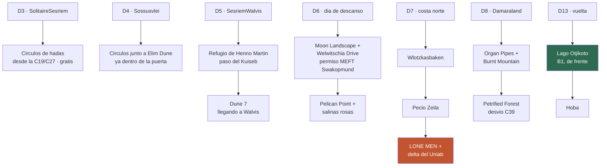

# 10 · Joyas ocultas

> **Namibia · 30 oct – 15 nov 2026 · la clásica del norte** — [← índice del dossier](README.md)
>
> Lo que no sale en el itinerario estándar, ordenado por el día en que cae: los Lone Stone Men, la cascada del Uniab, los círculos de hadas.
>
> **~N$20 = €1** *(rango 19,5–20,5)* · **✅** fuente primaria · **◐** secundaria concordante ·
> **○** práctica común, sin fuente · **❌** sin verificar, dicho en blanco
>
> *Investigación cerrada el 02/08/2026 · formato y contenido revisados el 03/08/2026*

> ⚠️ **Aviso de precios de monumentos:** el baremo del National Heritage Council que citan estas
> fuentes es el **2024/25 vía prensa local** ([Windhoek Express](https://www.we.com.na/scoreboard/exorbitant-fees-for-dilapidated-heritage-areas2023-09-11))
> y las tasas de parque son las del **baremo MEFT de abril de 2026** — los blogs viejos citan
> precios muy inferiores que **ya no valen**. Presupuesta lo alto y lleva **efectivo**: en estos
> sitios el datáfono es leyenda.

---

## 🗿 La joya mayor: los «Lone Stone Men» — las esculturas de personas

**Qué son.** Un proyecto de land art en curso: **figuras humanas a tamaño natural, hechas con
rocas del propio paraje** sobre varillas de hierro, plantadas en rincones remotos del Namib por un
artista namibio **anónimo que firma RENN**, bajo el lema *«Art Before Artist»*. Cada una tiene su
pose — de pie, sentada, arrodillada con los brazos al cielo, una colgada de un saliente — y un
disco metálico numerado con un mensaje. Las primeras se documentaron **hacia 2014** en Kaokoland;
en **2022, dieciséis de ellas representaron a Namibia en su primer pabellón de la Bienal de
Venecia** (*«A Bridge to the Desert»*). ¿Cuántas hay? Nadie lo sabe: se han documentado 14–23,
existe al menos la **nº 37**, y se rumorean más de cuarenta.

**Dónde buscarlas en TU viaje** *(sin coordenadas — encontrarlas es la gracia)*:
- **D7–D8 · dentro del Skeleton Coast NP** ◐: hay avistamientos documentados en el propio parque —
  tu tramo Ugabmund → Terrace Bay → Springbokwasser. Ojos abiertos en crestas, lechos de río y
  salientes junto a la pista.
- **D0 o D14 · Windhoek** ○: hay una en la propia ciudad — el *«Telephone Man»* (*No Answer*); el
  blog Overlandbirds publica dónde.
- El núcleo duro (Purros, Van Zyl's Pass, la D3707) queda en el **Kaokoveld profundo: fuera de
  ruta y fuera de seguro** — para otro viaje. *(Las coordenadas circulan en el grupo de Facebook
  «Overlanding GPS Logs & Tracks».)*

Fuentes: [Bienal de Venecia](https://www.labiennale.org/en/art/2022/national-participations/namibia) y
[biennalenamibia.art](https://biennalenamibia.art/eng/1399) ✅ ·
[Wikipedia — The Lone Stone Men](https://en.wikipedia.org/wiki/The_Lone_Stone_Men) ·
[Travel News Namibia](https://travelnam.com/mysterious-lone-men-kaokoland/) ◐ ·
[Overlandbirds](https://www.overlandbirds.com/lone-men-of-namibia/) ·
[Africanlanders](https://africanlanders.com/en/namibia-en/the-stone-men-the-mystery-of-north-namibia/) ○ ·
la polémica de Venecia: [Artnet](https://news.artnet.com/art-world/namibia-pavilion-venice-biennale-controversy-2098395)

---

## 🗺️ Todas, en el mapa de tu ruta

---

## 📍 Pegadas a la ruta, día a día

### D3–D4 · Los círculos de hadas *(gratis)*
Discos de suelo desnudo de 2–12 m orlados de hierba, **el misterio científico más famoso del
país** (¿termitas de arena — Jürgens, *Science* 2013 — o autoorganización de la hierba por el
agua? Hoy: probablemente ambas). Los verás **desde la C19/C27 bajando de Spreetshoogte** por el
Gondwana Namib Park ◐, y hay quien los señala **junto a Elim Dune, nada más pasar la puerta de
Sesriem** ○ — ideal al alba del D4, que ya estás dentro.
Fuentes: [Gondwana](https://gondwana-collection.com/news/fairy-circles-of-the-namib) ✅ ·
[Science Alert](https://www.sciencealert.com/the-surreal-mystery-of-namibias-fairy-circles-may-finally-be-solved) ·
[Conservation Namibia](https://conservationnamibia.com/blog/science-of-fairy-circles-2023.php) ◐

### D5 · El refugio de Henno Martin *(paso del Kuiseb — lo cruzas sí o sí)*
La cueva donde dos geólogos alemanes se escondieron **dos años y medio desde 1940** para no ser
internados en la guerra, viviendo de la caza — la historia de *The Sheltering Desert*. El refugio
(«Carp Cliff») está señalizado dentro del Namib-Naukluft, en el cañón que cruzas camino de Walvis.
Precio: dentro del parque · horario: sin dato.
Fuentes ○: [Bushguide 101](https://bushguide101.com/the-henno-martin-shelter-at-kuiseb-canyon/) ·
[Padlangs](https://padlangsnamibia.com/padlangs-namibia/henno-martins-sheltering-desert)

### D5–D6 · Dune 7 *(entras a Walvis por delante de ella)*
La duna más alta de Namibia (**383 m**; la séptima contando desde el río Kuiseb). Subida ~45 min,
vistas a desierto y Atlántico a la vez. Precio y horario: sin dato.
Fuentes ○: [WhereToStay](https://www.wheretostay.co.za/topic/6283-dune-7-walvis-bay-namibia) ·
[Danes on the Road](https://danesontheroad.com/africa/namibia/climb-the-amazing-dune-7-in-namibia/)

### D6 · Pelican Point y las salinas rosas
Península con **faro de 1932** (hoy lodge) y lobos marinos a tiro de piedra; el acceso cruza las
**salinas rosas llenas de flamencos**. La lengua de arena, mejor **en tour** (combinable con
Sandwich Harbour, que va con la marea) — con tu coche es terreno de atasco y el contrato no está
para bromas. Precio del tour: sin dato en N$ — pregúntalo allí.
Fuentes ◐/○: [sandwich-harbor.com](https://www.sandwich-harbor.com/tours) ·
[Tripadvisor](https://www.tripadvisor.com/AttractionProductReview-g298358-d20045116-Pelican_Point_Seal_Colony_4x4_Tour-Walvis_Bay_Erongo_Region.html)

### D6 · Moon Landscape + Welwitschia Drive *(la excursión del día de descanso)*
Badlands lunares del valle del Swakop y **ruta autoguiada de 13 paradas** que acaba en una
welwitschia de **~1.500 años**, con el oasis de Goanikontes en medio. **Permiso obligatorio en la
oficina del MEFT en Swakopmund** (Bismarck Str. esq. Sam Nujoma Ave.) — los blogs citan N$50–80 (~€2,5–4) +
vehículo, pero es Namib-Naukluft (parque premium): **cuenta con N$280 (~€14)/adulto y confírmalo
en la oficina**. ⚠️ La oficina cierra el fin de semana según blogs — **tu D6 es viernes** ✓.
Fuentes ○/◐: [The Orange Backpack](https://theorangebackpack.nl/en/namibia/the-welwitschia-drive/) ·
[Drive South Africa](https://www.drivesouthafrica.com/blog/what-you-need-to-know-about-the-welwitschia-drive-in-namibia/) ·
tarifas: [namibian.org](https://namibian.org/blog/namibia-raises-park-fees-by-80-to-100-percent)

### D7 · Wlotzkasbaken *(C34, de paso)*
Aldea-cápsula de pescadores de los años 30 dentro del Dorob NP: **sin agua corriente, sin red
eléctrica, sin vallas** — cada casa de colores con su torre de agua rellenada por camión.
Población fija: **6 personas**. Parada de 15 minutos y una de las rarezas más fotografiables de la
costa. Fuentes ◐: [Wikipedia](https://en.wikipedia.org/wiki/Wlotzkasbaken) ·
[Padlangs](https://padlangsnamibia.com/padlangs-namibia/whats-in-a-name-wlotzkasbaken)

### D7 · El pecio Zeila *(~15 km al sur de Henties Bay, a pie de C34)*
Arrastrero embarrancado en **2008**, hoy percha de cormoranes: el pecio **más fotogénico y
accesible** de toda la Costa de los Esqueletos, sin andar nada. Gratis ○. *(Los pecios «míticos»
de más al norte —South West Seal, Winston— son chatarra medio enterrada: la guía Bradt avisa de
que queda «muy poco». El plus real de tu tramo: las ruinas mineras de Toscanini y Terrace Bay.)*
Fuentes ○/◐: [Tripadvisor](https://www.tripadvisor.com/Attraction_Review-g1887482-d11547469-Reviews-Zeila_Shipwreck-Henties_Bay_Erongo_Region.html) ·
[Bradt Guides](https://www.bradtguides.com/land-shipwrecks-namibia/) ·
[mapa de pecios](https://roamthereaches.com/2021/12/18/how-to-see-skeleton-coast-namibia-with-shipwreck-map/)

### D7–D8 · El delta del Uniab y su cascada *(lo cruzas dos veces)*
El secreto de tu tramo de Skeleton Coast: delta de cinco brazos con cañaverales, springboks,
órices y hasta hiena parda — y desde el segundo brazo, un paseo corto (~30 min; versión larga
6 km) hasta una garganta donde **el agua cae en cascada sobre roca roja hasta una poza junto al
mar**. Una cascada en la Costa de los Esqueletos: eso no lo trae casi nadie a casa. Incluido en la
entrada del parque.
Fuentes ◐: [Exploring Africa](https://www.exploring-africa.com/en/namibia/what-visit-skeleton-coast-southern-section) ·
[namibweb](https://www.namibweb.com/skeleton.htm) ·
[Tripadvisor](https://www.tripadvisor.com/Attraction_Review-g479222-d15206996-Reviews-Uniab_River_Delta_and_Canyon-Skeleton_Coast_National_Park_Khomas_Region.html)

### D8 · Organ Pipes y Burnt Mountain *(a 3–5 km de Twyfelfontein)*
Columnas de dolerita de **~120 millones de años** en una garganta (mejor luz al amanecer) y la
ladera volcánica que vira a púrpuras y negros. Precio ◐: el tarifario NHC vía prensa dice
**N$250 (~€12,5)/adulto** como visita guiada — blogs viejos aún dicen «gratis»: **lleva N$250 en
efectivo en mente**. Horario: sin dato.
Fuentes: [Windhoek Express](https://www.we.com.na/scoreboard/exorbitant-fees-for-dilapidated-heritage-areas2023-09-11) ◐ ·
[mat-travel](https://mat-travel.com/namibia/damaraland/main-attractions/) ○

### D8 · Petrified Forest *(pequeño desvío por la C39 hacia Khorixas)*
Troncos fosilizados del Pérmico (**~260 millones de años**), algunos de decenas de metros, con
welwitschias creciendo entre ellos. Guía obligatorio incluido. Precio ◐: **N$270 (~€13,5)/adulto**
(N$220 · ~€11 niños). Mejor luz: antes de las 9:00 o después de las 15:00 ○.
Fuentes: [Windhoek Express](https://www.we.com.na/scoreboard/exorbitant-fees-for-dilapidated-heritage-areas2023-09-11) ◐ ·
[namibia-safaris.com](https://www.namibia-safaris.com/petrified-forest-in-namibia/) ·
[Atlas Obscura](https://www.atlasobscura.com/places/petrified-forest-of-khorixas) ○

### D13 · El lago Otjikoto *(B1, ~24 km antes de Tsumeb — te pilla DE FRENTE)*
Dolina kárstica de **145 m de profundidad** donde las tropas alemanas **arrojaron sus cañones y
munición antes de rendirse en 1915** — parte se expone en el museo de Tsumeb, parte sigue abajo
como «museo subacuático». La parada perfecta para partir el D13. Precio ◐: **N$250 (~€12,5)**
según el tarifario NHC vía prensa *(las fuentes viejas decían N$25 · ~€1,25: caducado)*. Abre desde las
08:00 ○, cierre sin dato.
Fuentes: [Windhoek Express](https://www.we.com.na/scoreboard/exorbitant-fees-for-dilapidated-heritage-areas2023-09-11) ◐ ·
[info-namibia](https://www.info-namibia.com/activities-and-places-of-interest/otavi/lake-otjikoto) ○
*(Y de propina en el mismo día: el meteorito de **Hoba** — N$250 (~€12,5) ◐ — si vais sobrados; ya está en `01`.)*

### D3/D5 · Solitaire, el ángulo no típico
Ya paras dos veces — pero la historia mejora la foto: **los Chevy y Ford oxidados de los 50 fueron
colocados a propósito** como atrezo ○; la **tarta de manzana** es la receta del escocés Percy
«Moose» McGregor (Moose McGregor's Desert Bakery), un Apfelstrudel de familia que sobrevive a su
creador ○; y el nombre juega con el diamante solitario y la soledad.
Fuentes ○: [HuffPost](https://www.huffpost.com/entry/a-moose-an-apple-pie-in-t_b_5223671) ·
[Arebbusch](https://www.arebbusch.com/travel-guide-listings/namibian-attractions/solitaire/)

---

## 🚫 Las que se quedan fuera, y por qué

- **Dragon's Breath** *(el lago subterráneo no glaciar más grande del mundo, cerca de
  Grootfontein)* — **NO visitable**: granja privada, acceso solo para expediciones científicas.
  Otjikoto es el mismo fenómeno en versión visitable — por eso está en el D13.
  Fuentes ◐: [Wikipedia](https://en.wikipedia.org/wiki/Dragon%27s_Breath_Cave) ·
  [Gondwana](https://gondwana-collection.com/blog/why-the-dragons-breath-cave-in-namibia-is-so-special)
- **Cráter de Messum y sus welwitschias gigantes** — la joya «expedición» más cercana, pero es un
  desvío serio del D7, con permiso (Henties Bay/MEFT), líquenes fragilísimos y estado incierto:
  **ya desaconsejado en `11`**. Si algún día sobra un día, existe.
- **Vingerklip** *(el «dedo de Dios», monolito de 35 m)* — solo encaja **cambiando el D9 a la
  variante Khorixas–Outjo**, que no es el plan. Precio ○: ~N$20 (~€1). Se apunta por si el D8-D9 se
  reordena sobre la marcha. Fuentes ◐: [Wikipedia](https://en.wikipedia.org/wiki/Vingerklip) ·
  [info-namibia](https://www.info-namibia.com/activities-and-places-of-interest/damaraland/vingerklip)

---

*Precios en N$ y € (~N$20 = €1) · Tarifas NHC/MEFT por confirmar contra PDF oficial — el mismo
email pendiente de `02` · Investigado el 02/08/2026*
