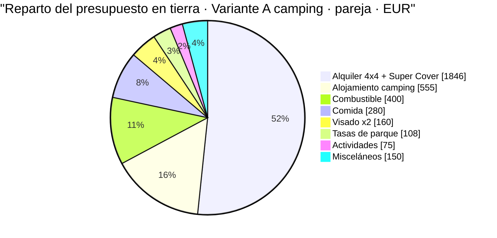
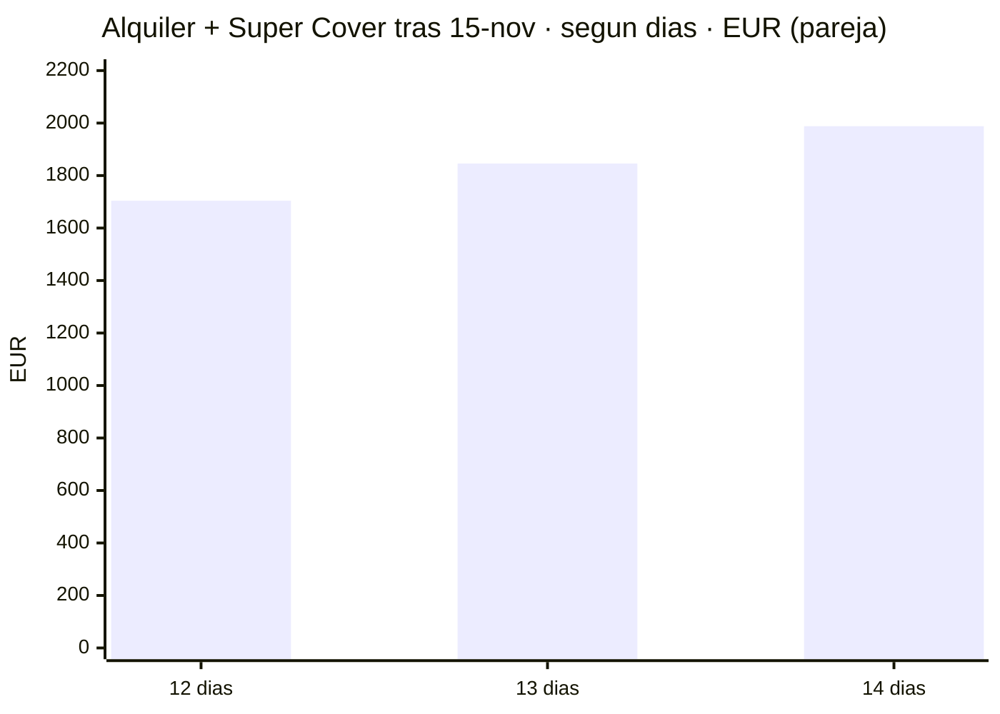
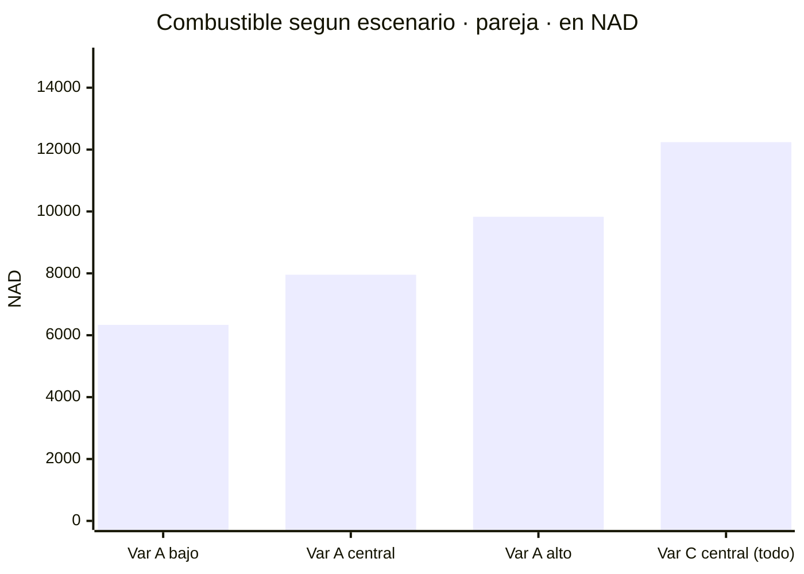
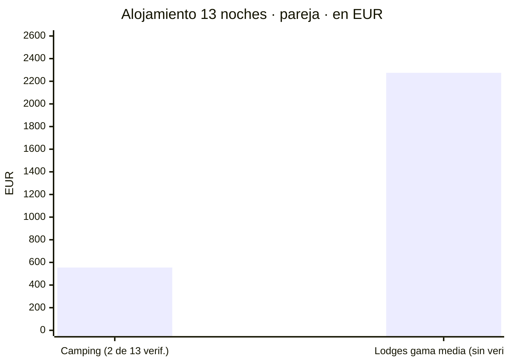
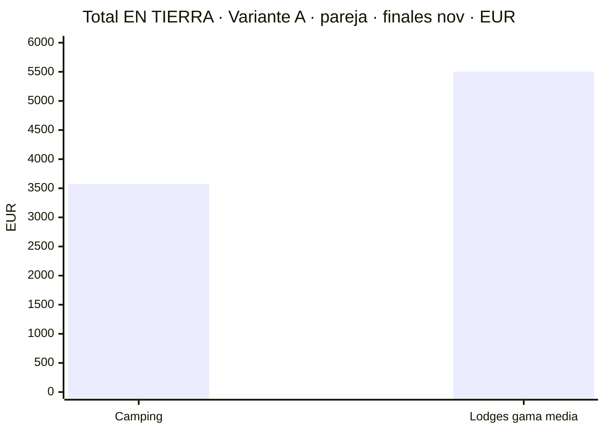
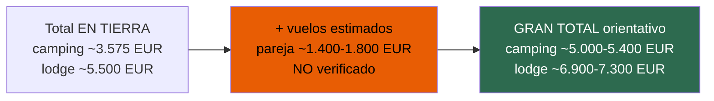
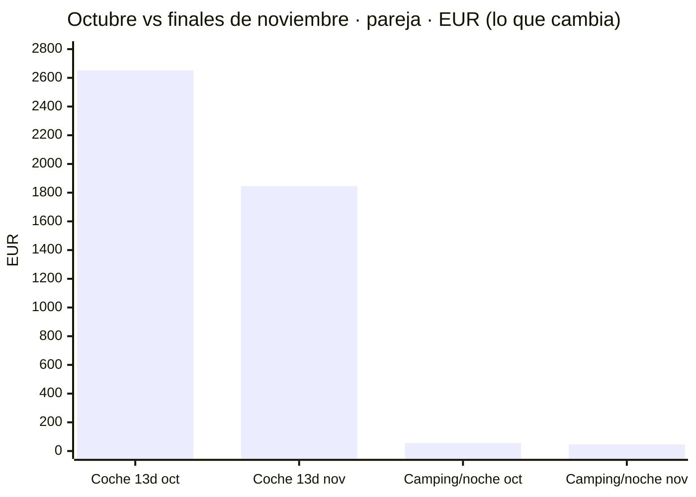
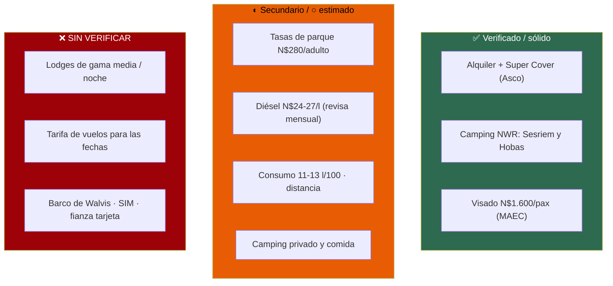

# Presupuesto — dos personas, 14 días, finales de noviembre de 2026

Coste real del viaje, **camping frente a lodges de gama media**, en N$ y €. Cada cifra lleva su marca
de confianza y su fuente. **Donde no hay dato verificado, se dice y se deja como estimación marcada:
un número plausible presentado como hallazgo es un fallo grave — aquí no se hace.**

**~N$20 = €1** (rango 19,5–20,5; a 17/07/2026) · el importe en la moneda de la fuente es el bueno, la
conversión es orientativa · **✅ primaria** · **◐ secundaria concordante** · **○ práctica común sin
fuente** · **❌ no verificado / en blanco**

> ### ⚠️ Sobre qué base se calcula
> El presupuesto se monta sobre la **Variante A** (sur + Namib + costa, **sin Etosha**), que es la
> **recomendada** en `04-itinerario.md` por ser la única que cabe sin maratón de volante. Se da también
> el número de la **Variante B** (con Etosha) donde cambia. La **Variante C** («todo») no se presupuesta
> como plan: solo su combustible, para enseñar lo que cuesta el kilometraje de más.
>
> **El coche se toma 13 días** (de los 14 del viaje, los de vuelo se van en trayecto; `04` habla de
> ~12–13 días útiles). Se marca dónde cambiaría con 12 o 14.

---

## 1. La foto de conjunto — dónde se va el dinero

**Variante A · finales de noviembre · dos personas · en tierra (sin vuelos) · escenario camping.**
Reparto del gasto en euros:

> **El alquiler del 4x4 con seguro se come la mitad del presupuesto en tierra.** Es también la única
> partida grande **100 % verificada** (tarifa oficial de Asco). Todo lo demás junto pesa menos que el
> coche.

---

## 2. Alquiler del 4x4 — la partida grande y la más sólida ✅

Tarifa **verificada de Asco**: Hilux 2.4 TD 4x4 automático doble cabina, equipado para camping, 1–2
pax, banda de 6–15 días. **Tras el 15/11/2026** (banda 15/11–14/03): **€117/día (~N$2.340)**.
**Super Cover** (el único seguro que sirve en pista, ver `01` §3): **€25/día (~N$500)**, exige más de
10 días de alquiler → 12/13/14 cumplen.

- **12 días** → alquiler €1.404 + SC €300 = **€1.704 (~N$34.080)**
- **13 días** → alquiler €1.521 + SC €325 = **€1.846 (~N$36.920)** ← *caso base del presupuesto*
- **14 días** → alquiler €1.638 + SC €350 = **€1.988 (~N$39.760)**

> ℹ️ **Verificado el precio/día (€117 y €25); los totales son multiplicación nuestra.** Fuente:
> [Asco Rates 2026 (PDF)](https://www.ascocarhire.com/app/web/upload/tinymce-source/Asco-4x4-Car-Hire-Namibia-and-Southern-Africa-2026-Rates.pdf) ·
> [ascocarhire.com/insurance](https://www.ascocarhire.com/insurance.html)

**Aparte, no incluido en el total de arriba** (ver `01` §2):
- **Depósito de reserva no reembolsable: €250 (~N$5.000)** — cuenta como pago del viaje; confírmese si
  se descuenta del total o se suma. Se menciona, **no se duplica** en la suma.
- **Fianza/depósito de garantía** que se bloquea en la tarjeta a la recogida (importe según nivel de
  seguro; con Super Cover la franquicia es N$0 pero suele retenerse un aval): **❌ importe exacto no
  verificado**. No es gasto, es retención, pero **hay que tener margen en la tarjeta**.

---

## 3. Combustible — calculado sobre la distancia real de la ruta

**No se copia el consumo de nadie: se calcula.** Tres factores, cada uno con su banda:

- **Distancia (Variante A)**: ~**2.400–2.800 km** (○, sumando las etapas del `gantt` de `04`: Windhoek–
  Keetmanshoop 500, Keetmanshoop–Fish River 150, miradores + a Aus ~250, Aus–Lüderitz + Kolmanskop ~150,
  Lüderitz–Namtib/Tiras 250, D707 a Sesriem 240, Sossusvlei ida/vuelta 120, Sesriem–Swakopmund 300,
  Walvis Bay 60, Swakopmund–Spitzkoppe 170, Spitzkoppe–Windhoek 280). Central **~2.600 km**.
- **Consumo** del Hilux doble cabina cargado con tienda de techo: **11–13 l/100 km** (○, práctica común;
  no verificado contra ficha del vehículo). Central **12 l/100 km**.
- **Precio del diésel**: **costa ~N$24,3/l en julio de 2026** tras la rebaja de N$4/l del Gobierno ◐;
  en el **interior y bombas remotas** (Solitaire, Sesriem, Aus) sube — se usa banda **N$24–27/l**,
  central **~N$25,5/l**. ⚠️ **El precio se revisa cada mes**: reconfírmalo cerca de la salida.

- **Variante A central**: 2.600 km × 0,12 l/km × N$25,5 = **~N$7.956 (~€398)**
- **Variante A, banda**: **N$6.336–9.828 (~€317–491)**
- **Variante C** («todo», ~4.000 km): central **~N$12.240 (~€612)**, banda N$10.560–14.040 (~€528–702)
  — *el kilometraje de más de querer meterlo todo cuesta ~€200 solo en gasoil.*

> **Se presupuesta ~N$8.000 (~€400)** de combustible para la Variante A. Fuentes del precio:
> [GlobalPetrolPrices — Namibia diésel](https://www.globalpetrolprices.com/Namibia/diesel_prices/) ·
> [NAMCOR — fuel prices](https://www.namcor.com.na/fuel-prices/) *(no abierta aquí: 403)* ·
> rebaja de julio 2026 recogida en [thebrief.com.na](https://thebrief.com.na/2026/07/gvt-cuts-petrol-price-by-n1-diesel-by-n4/)
> *(vía fragmento de búsqueda; la ficha dio 403, extracción no verificada)*.

---

## 4. Tasas de parque — N$620/día para pareja + coche ◐

**N$280 (~€14)/adulto extranjero/día** (N$140 entrada + N$140 conservación) **+ N$60 (~€3)/vehículo**,
cobrado **por parque y por cada 24 h desde la entrada** (ver `01` §7 y `08`). Dos adultos + coche =
**N$620 (~€31)/día de parque**. Baremo del MEFT firmado el 15/01/2026, vigente desde 1/04/2026 — **◐,
no ✅**: el PDF primario no se pudo abrir para verificar la extracción de la tabla.

**Variante A** cruza **dos** parques de pago:
- **Ai-Ais / Fish River Canyon** (miradores de Hobas): **1–2 unidades de 24 h**
- **Namib-Naukluft (Sesriem/Sossusvlei)**: **2 unidades** (llegada por la tarde + amanecer en Deadvlei
  al día siguiente + salida; al dormir **dentro** de la puerta, cada 24 h cuenta)

→ **3–4 unidades × N$620 = N$1.860–2.480 (~€93–124)**. Se presupuesta **~N$2.170 (~€108)**.

**Variante B** (con Etosha): añade Etosha, **~3 unidades** (2 días de safari + entrada) → total del viaje
**~4–5 unidades = N$2.480–3.100 (~€124–155)**.

> Fuente: [MEFT — Park Entrance and Conservation Fees (PDF)](https://www.meft.gov.na/files/downloads/543_Park%20Entrance%20and%20Conservation%20Fees.PDF)
> *(existe, no abierta aquí)* · secundarias concordantes en `08`.

---

## 5. Visado — cifra dura ✅

**e-visa: N$1.600 (~€80)/persona** → **pareja N$3.200 (~€160)**, pago único. Ver `01` §6.
⚠️ El visado **manual a la llegada** puede llevar un recargo de N$2.000 (~€100) aprobado pero sin
publicar en el boletín: **usa el e-visa**. Fuente:
[MAEC — Namibia](https://www.exteriores.gob.es/es/ServiciosAlCiudadano/Paginas/Detalle-recomendaciones-de-viaje.aspx?trc=Namibia).

---

## 6. Alojamiento — 13 noches, y aquí está el mayor agujero de datos

**13 noches en tierra.** Se dan **dos escenarios**. El problema, dicho claro: **los precios de los
lodges privados y de la mayoría de campings privados NO se pudieron verificar** (WebFetch bloqueado +
Gondwana no publica precio estático; ver `08`). **Solo las tarifas de NWR están verificadas.**

### 6a. Escenario CAMPING

De las 13 noches, **solo 2 caen en campings NWR con precio verificado**; las otras ~11 son campings
privados con **precio estimado ○**, no verificado.

**Verificado (NWR, ventana nov 2026 – jun 2027, 2 pax):**
- **Sesriem** *(dentro de la puerta — imprescindible para el amanecer en Deadvlei)* — **N$1.340 (~€67)** ✅
- **Hobas** *(Fish River Canyon)* — **N$960 (~€48)** ✅

**Estimado ○ (campings privados: Windhoek, Keetmanshoop/kokerbooms, Lüderitz, Aus/Namtib, Swakopmund ×2,
Spitzkoppe, etc.):** los campings privados namibios suelen ir a **N$250–450/pax/noche** → **N$600–1.000
(~€30–50) para dos**. Con central **~N$800 (~€40)/noche × 11 = ~N$8.800 (~€440)**.

→ **Camping total ≈ N$2.300 (verificado) + N$8.800 (estimado) = ~N$11.100 (~€555)**, banda
**N$9.000–13.000 (~€450–650)**. **Solo N$2.300 (~€115) de ese total está verificado.**

### 6b. Escenario LODGES DE GAMA MEDIA — ❌ en su mayoría SIN VERIFICAR

> **Aviso rojo:** el precio/noche de los lodges de gama media (Desert Camp, Desert Quiver Camp, Taleni,
> Toshari, Twyfelfontein Country Lodge, Canyon Roadhouse, Cañon Village, Nest Hotel…) **no se cerró**
> (ver `08`). Las cifras de abajo son **práctica común ○**, no una tarifa cotizada. **No pagues con
> ellas: pídelas al lodge.**

- Estimación ○ de gama media namibia: **N$2.500–4.500 (~€125–225)/noche para dos**, central **~N$3.500
  (~€175)**. 13 noches × N$3.500 = **~N$45.500 (~€2.275)**, banda **N$32.500–58.500 (~€1.625–2.925)**.
- **Único ancla verificada del tramo lodge**: la noche **dentro de la puerta de Sesriem** en **Sossus
  Dune Lodge**, dune chalet **media pensión**, **N$8.060 (~€403)/2** ✅ (NWR) — más cara que un lodge
  medio, pero es la única forma de dormir dentro y va con cena y desayuno.

> Fuentes verificadas: [NWR Rack Rates 2026/2027 (PDF)](https://www.nwr.com.na/wp-content/uploads/2026/06/NWR-Rack-Rates-2026-2027.pdf)
> (ver `02`). Lodges privados: **❌ sin fuente de precio abierta**.

---

## 7. Comida, actividades y misceláneos

### Comida ○ *(sin fuente — práctica común)*
- **Camping / autoservicio** (supermercado + braai): **~N$300–500 (~€15–25)/día para dos** → 14 días
  ≈ **~N$5.600 (~€280)**, banda N$4.200–7.000.
- **Con lodges y restaurantes** (algunos con media pensión): **~N$700–1.200 (~€35–60)/día para dos** →
  ≈ **~N$9.800 (~€490)** si se come fuera casi siempre.
- No verificado: son órdenes de magnitud de práctica común, no precios de carta.

### Actividades — unidades verificadas, selección estimada
Precios **por persona**, verificados salvo aviso:
- Lanzadera 4x4 a Deadvlei — **N$180 (~€9)** ✅ (NWR)
- Sesriem, safari guiado de mañana — N$600–700 (~€30–35) ✅ (NWR)
- *(Variante B)* Okaukuejo, safari nocturno — N$750 (~€38) ✅ (NWR)
- Canyon Roadhouse (Fish River), tarifa 1/11/2026–31/10/2027 ◐: sendero N$300 (~€15), amanecer N$940
  (~€47), caminata del cañón N$560 (~€28), safari 3 h N$1.760 (~€88)
- **Walvis Bay** (paseo en barco / Sandwich Harbour): **❌ precio no verificado** — pregúntalo allí.

→ Se presupuesta una partida **flexible de ~N$1.500 (~€75)** para la pareja (p. ej. lanzadera Deadvlei
+ una actividad). Sube fácil si se añaden safaris o el barco de Walvis.

### Misceláneos ○
SIM/eSIM (~N$150–300, ~€8–15, ❌ no verificado), propinas, peajes/tasas menores, imprevistos →
colchón **~N$3.000 (~€150)**. No verificado.

---

## 8. El total en tierra (sin vuelos) — pareja, finales de noviembre

**Escenario CAMPING** *(el más verificado)*:
- Alquiler + Super Cover (13 d) **€1.846 (~N$36.920)** ✅
- Combustible **~€400 (~N$8.000)** ○/◐
- Tasas de parque **~€108 (~N$2.170)** ◐
- Visado ×2 **€160 (~N$3.200)** ✅
- Alojamiento camping **~€555 (~N$11.100)** *(2 noches ✅, resto ○)*
- Comida **~€280 (~N$5.600)** ○
- Actividades **~€75 (~N$1.500)** *(unidades ✅/◐, selección ○)*
- Misceláneos **~€150 (~N$3.000)** ○
- **→ TOTAL TIERRA CAMPING ≈ €3.575 (~N$71.500)** para la pareja · **~€1.790/persona**
- Banda razonable: **~€3.250–4.000 (~N$65.000–80.000)**

**Escenario LODGES gama media** *(alojamiento en su mayoría ❌ sin verificar)*:
- Igual que arriba pero **alojamiento ~€2.275** y **comida ~€490** →
- **→ TOTAL TIERRA LODGE ≈ €5.500 (~N$110.000)** para la pareja · **~€2.750/persona**
- Banda: **~€4.500–7.000 (~N$90.000–140.000)** — *la horquilla es tan ancha porque el precio de los
  lodges no está cerrado.*

---

## 9. Los vuelos — fuera del total en tierra, y con aviso

> **No hay tarifa cotizada para finales de noviembre de 2026.** Las cifras de `08` son **instantáneas
> de fechas de muestra**, no un precio para tus fechas. **Esto es orden de magnitud, no un dato.**

- Ida y vuelta larga MAD–WDH (una escala): del orden de **€670–786 (~N$13.400–15.700)/persona** según
  muestras sueltas de Lufthansa/Ethiopian en `08` — **◐/❌**, no vale para presupuestar en firme.
- Alimentador **A Coruña–Madrid** (avión o tren): **~€40–120 (~N$800–2.400)/persona ida y vuelta** ○.
- **Estimación total vuelos, pareja: ~€1.400–1.800 (~N$28.000–36.000)** — **❌ sin verificar para las
  fechas reales**. Qatar, Airlink y TAAG: precio **sin encontrar**.

**Gran total orientativo, pareja, con vuelos estimados:**
- **Camping: ~€5.000–5.400 (~N$100.000–108.000)**
- **Lodges gama media: ~€6.900–7.300 (~N$138.000–146.000)**

*El tramo de vuelos y (en el escenario lodge) el alojamiento son los que pueden mover más el número.*

---

## 10. El delta octubre vs finales de noviembre — cuánto ahorras esperando

La decisión de fechas ya está tomada (`01`), pero el presupuesto lo confirma en dinero.

- **Coche + Super Cover, 13 días**: octubre **€2.652 (~N$53.040)** → finales nov **€1.846 (~N$36.920)**
  → **ahorro €806 (~N$16.120)** ✅ *(el ahorro grande y seguro)*.
- **Camping NWR** (p. ej. Okaukuejo, 2 pax): octubre N$1.120 (~€56) → nov N$920 (~€46), **N$200/noche**.
  Pero en la **Variante A** los NWR son Sesriem (**mismo precio** las dos ventanas: N$670/pax) y Hobas
  (**mismo precio**: N$480), así que **el camping apenas cambia**: el ahorro de noviembre en Variante A
  es **casi todo el coche**.
- **Lodges**: ahí sí hay caída fuerte de octubre a noviembre (en NWR, el chalet del charco de Okaukuejo
  baja **N$2.200/noche**, ~€110). En un viaje de lodges el ahorro de noviembre **supera al del coche**
  (ver `02`).

> **Resumen del delta (Variante A):** esperar a después del 15/11 ahorra **~€800 seguros solo en el
> coche** (camping), y **bastante más si el viaje es de lodges**. El argumento económico de noviembre
> **se sostiene**.

---

## 11. Lo que este presupuesto NO pudo verificar — dicho claro

- **❌ Lodges privados por noche**: sin precio verificado. El total del escenario lodge (~€5.580 tierra)
  se apoya en estimación ○ — **la banda real puede irse a €4.500 o a €7.000**. Una pasada con descarga
  habilitada debería abrir gondwana-collection.com, desertcamp.com y las fichas de los lodges.
- **❌ Vuelos**: no hay tarifa para finales de noviembre de 2026. Los ~€1.400–1.800/pareja son orden de
  magnitud, no cotización.
- **◐ Tasas de parque**: N$280/adulto se apoya en secundarias concordantes; el PDF del MEFT no se abrió
  para verificar la tabla fina.
- **◐ Diésel**: costa ~N$24,3/l (julio 2026, vía fragmento) — **se revisa cada mes**; el precio del
  interior es estimación. Reconfírmalo.
- **○ Consumo, distancia exacta, camping privado, comida, SIM, misceláneos**: prácticas comunes y
  triangulaciones, sin fuente que descargar.
- **❌ Fianza/depósito de garantía retenido en la tarjeta**: importe no verificado; hay que tener margen.

> **Regla de oro de este documento:** lo **verificado en fuente primaria** (coche €1.846 + camping NWR
> €115 + visado €160 = **~€2.120**) es **~59 % del escenario camping en tierra**; sumando lo
> **secundario concordante** (tasas de parque, precio del diésel) se pasa de **dos tercios**. En el
> escenario lodge, en cambio, **la mayor partida (alojamiento) está sin verificar**: trátalo como una
> estimación, no como una factura.

---

## Fuentes

- **Alquiler y seguro**: [Asco Rates 2026 (PDF)](https://www.ascocarhire.com/app/web/upload/tinymce-source/Asco-4x4-Car-Hire-Namibia-and-Southern-Africa-2026-Rates.pdf) ·
  [ascocarhire.com/insurance](https://www.ascocarhire.com/insurance.html) — ver `01`
- **Alojamiento NWR**: [NWR Rack Rates 2026/2027 (PDF)](https://www.nwr.com.na/wp-content/uploads/2026/06/NWR-Rack-Rates-2026-2027.pdf) — ver `02`
- **Tasas de parque**: [MEFT — Park Entrance and Conservation Fees (PDF)](https://www.meft.gov.na/files/downloads/543_Park%20Entrance%20and%20Conservation%20Fees.PDF) — ver `01` y `08`
- **Visado**: [MAEC — Namibia](https://www.exteriores.gob.es/es/ServiciosAlCiudadano/Paginas/Detalle-recomendaciones-de-viaje.aspx?trc=Namibia) — ver `01`
- **Diésel**: [GlobalPetrolPrices — Namibia](https://www.globalpetrolprices.com/Namibia/diesel_prices/) ·
  [NAMCOR — fuel prices](https://www.namcor.com.na/fuel-prices/) ·
  [thebrief.com.na — rebaja julio 2026](https://thebrief.com.na/2026/07/gvt-cuts-petrol-price-by-n1-diesel-by-n4/)
- **Distancias y variantes**: `04-itinerario.md` · **Vuelos y lodges (sin cerrar)**: `08-huecos-cerrados.md`
