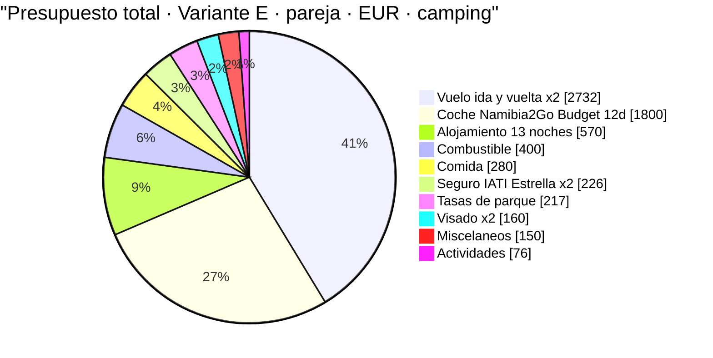
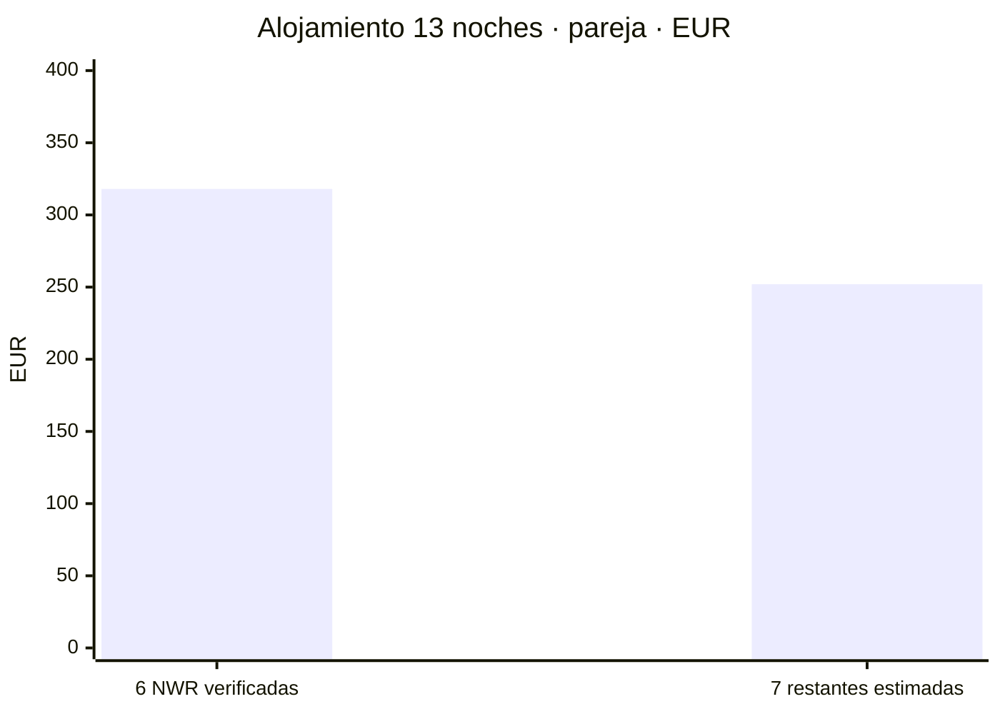
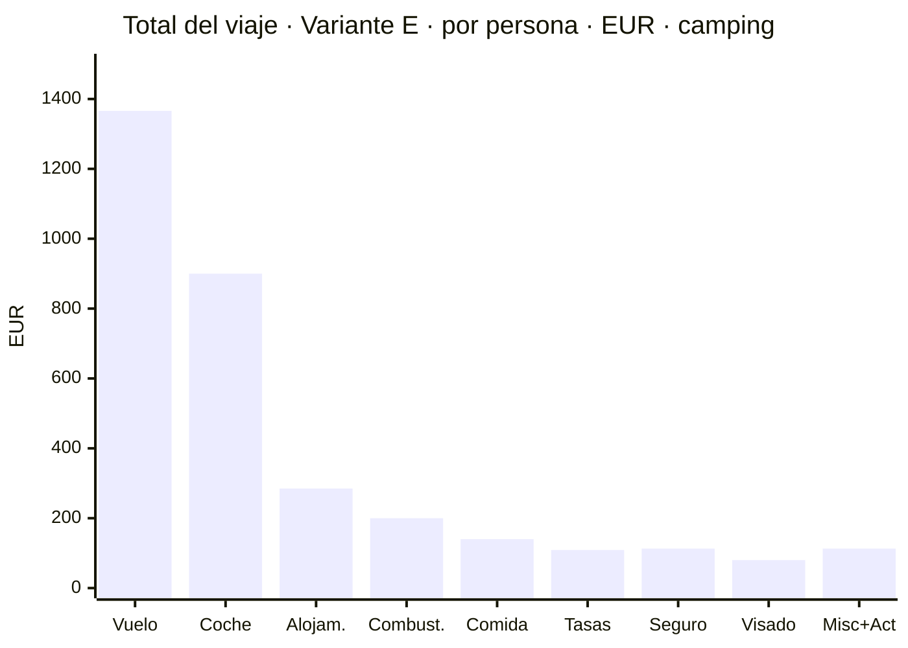
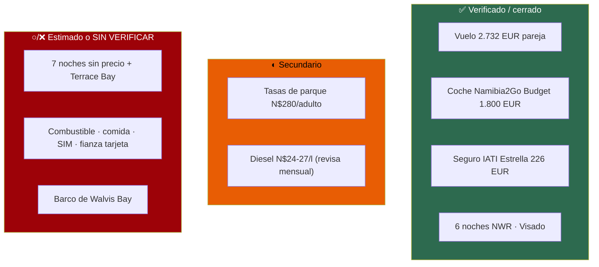

# Presupuesto — dos personas, 14 días / 13 noches, 1–14 de noviembre de 2026

Coste real del viaje **ya cerrado en lo grande** (vuelo, coche y seguro reservados), en N$ y €. Cada
cifra lleva su marca de confianza y su fuente. **Donde no hay dato verificado, se dice y se deja como
estimación marcada: un número plausible presentado como hallazgo es un fallo grave — aquí no se hace.**

**~N$20 = €1** (rango 19,5–20,5; a 17/07/2026) · el importe en la moneda de la fuente es el bueno, la
conversión es orientativa · **✅ primaria** · **◐ secundaria concordante** · **○ práctica común sin
fuente** · **❌ no verificado / en blanco**

> ## 🔄 NOTA (17/07/2026): este presupuesto es el de la RUTA VIGENTE (Variante E, norte)
> Versiones anteriores de este documento presupuestaban la **Variante A** (sur + Namib + costa, con
> coche de **Asco** y fechas de «finales de noviembre»). **Esa ruta se descartó** (ver la nota de
> `04-itinerario.md`) y **las reservas se han cerrado sobre otra realidad**:
>
> - **Ruta**: la **Variante E** — la clásica del norte con **Etosha** (4 noches) y **sin el sur**
>   (Fish River, Lüderitz, kokerbooms quedan para otro viaje; su presupuesto sigue documentado en el
>   histórico de `04`). Detalle día a día en [`11-itinerarios-dia-a-dia.md`](11-itinerarios-dia-a-dia.md).
> - **Fechas**: **1–14 de noviembre de 2026** (vuelo ya comprado), no «finales de noviembre».
> - **Coche**: **Namibia2Go Budget**, no Asco. **El «precipicio del 15/11» era de Asco y ya no
>   aplica**: Namibia2Go entra en temporada baja el **1 de noviembre**, así que todo el alquiler cae
>   en tarifa barata sin esperar al 15.
>
> Los importes de abajo son los de esta ruta y estas reservas.

---

## 1. La foto de conjunto — dónde se va el dinero

**Variante E · 1–14 nov · dos personas · TODO incluido (con vuelos) · escenario camping.** Reparto del
gasto de la pareja en euros:

> **Vuelo y coche son el 69 % del viaje.** Son también las dos partidas **cerradas y verificadas**.
> Todo lo demás junto (~€2.080 de la pareja) pesa menos que ellas dos.

---

## 2. El coche — cerrado y disponible ✅

**Namibia2Go 4x4 Budget camping equipped double cab**: **€150,00/día × 12 días (1–13 nov) = €1.800**
con impuestos, ✅ **disponible** al consultar. Toyota Hilux Double Cab, automático, diésel, **km
ilimitados** y **Premium Insurance Cover** (franquicia cero) incluidos.

- **Total pareja: €1.800 (~N$36.000)** · **€900/persona**
- La estimación previa para clase budget fue €1.755; el precio real €1.800 (**+2,5 %**). Se acabó el
  rango «Namibia2Go vs Asco»: **el coche es cifra cerrada.**

> ⚠️ **Ojo al calendario:** son **12 días de coche (1–13)** pero **13 noches (1–14)**. La noche del
> **13 en Windhoek te quedas sin coche** → hotel y traslado al aeropuerto (contado en «alojamiento»).
> *Alternativa: añadir el día 13 (~€150–167) y devolverlo el 14 camino del aeropuerto — puede salir
> igual o más barato que hotel + dos traslados.*

> ⚠️ **La web NO sirve para este precio:** publica N$2.910/día «temporada baja», pero esa banda es
> **«01 Nov 2025 – 30 Jun 2026»** y **caduca antes del viaje**; la siguiente que enseña es la alta de
> julio–octubre 2026. La ventana cae en el **año tarifario siguiente**, que no está en la web. Los
> **€150/día son cotización en vivo para las fechas reales**, coherente con el cambio de año tarifario.
> *(Misma trampa que la tarifa de NWR.)*

**Aparte, no incluido en el total** (retención, no gasto): a la recogida se bloquea en la tarjeta un
**aval/depósito de garantía** — con Premium Cover la franquicia es N$0, pero suele retenerse un aval.
**❌ Importe exacto no verificado.** Hay que tener margen en la tarjeta.

> Fuente: [namibia2go.com · 4x4 camping equipped double cab](https://namibia2go.com/4x4-camping-equipped-double-cab)
> · precio de la cotización cerrada (ver README).

---

## 3. Alojamiento — 13 noches, 6 verificadas ◐/○

**13 noches en tierra.** De ellas, **6 son campings NWR con precio verificado**; las otras 7 (5
campings + Terrace Bay + el hotel del D13) **no tienen precio cerrado**.

**Verificado (NWR, ventana nov 2026 – jun 2027, 2 pax):**
- **Sesriem × 2** *(dentro de la puerta — imprescindible para Deadvlei al amanecer)* — **N$1.340
  (~€67)/noche** ✅
- **Okaukuejo, Halali, Namutoni × 2** *(camping dentro de Etosha, charca iluminada)* — **N$920
  (~€46)/noche** ✅

→ Suma verificada: 2×N$1.340 + 4×N$920 = **N$6.360 (~€318) para la pareja / ~€159 por persona** ✅
*(coincide con `11-itinerarios-dia-a-dia.md` §resumen).*

**Sin verificar ○/❌ (7 noches):**
- D1 Windhoek, D2 Spreetshoogte, D5–D6 Walvis Bay ×2, D8 Hoada → campings/alojamientos privados,
  **precio no cerrado** (WebFetch bloqueado; ver `08`). Estimación de práctica común: **~€25–45/noche
  para dos** cada uno. *(Referencia real que ancla el extremo bajo: el camping comunitario de Spitzkoppe
  —campamento equiparable de la ruta— está cerrado en **N$540/noche para dos (~€27)**, entrada incluida
  ◐; ver `08`.)*
- **D7 Terrace Bay** (NWR, **resort — no camping**): **❌ precio no verificado**, hay que reservarlo
  sí o sí (sin reserva no se entra al Skeleton Coast a pernoctar).
- **D13 Windhoek**: hotel + traslado (el coche ya está entregado). **○ estimado.**

→ Bloque sin verificar: **~€126/persona ○** (README). **Alojamiento total: ~€570 pareja (~€285/persona)**,
del que **solo ~€318 (56 %) está verificado**.

> Fuentes verificadas: [NWR Rack Rates 2026/2027 (PDF)](https://www.nwr.com.na/wp-content/uploads/2026/06/NWR-Rack-Rates-2026-2027.pdf)
> (ver `02`). Resto: **❌ sin fuente de precio abierta.**

---

## 4. Combustible — calculado sobre la distancia real de la ruta ◐/○

**No se copia el consumo de nadie: se calcula.** Tres factores, cada uno con su banda:

- **Distancia (Variante E)**: **~2.600 km** (○, sumando las etapas del `gantt` de `11`: Windhoek–
  Spreetshoogte, bajada a Sesriem, Sesriem–Walvis, costa hasta Terrace Bay, Damaraland, subida a
  Etosha, safaris internos y vuelta a Windhoek; ningún día por encima de ~390 km).
- **Consumo** del Hilux doble cabina cargado con tienda de techo: **11–13 l/100 km** (○, práctica
  común; no verificado contra ficha del vehículo). Central **12 l/100 km**.
- **Precio del diésel**: **costa ~N$24,3/l en julio 2026** tras la rebaja de N$4/l del Gobierno ◐; en
  el **interior y bombas remotas** (Solitaire, Sesriem, Okaukuejo) sube — banda **N$24–27/l**, central
  **~N$25,5/l**. ⚠️ **El precio se revisa cada mes**: reconfírmalo cerca de la salida.

- **Cálculo central**: 2.600 km × 0,12 l/km × N$25,5/l = **~N$7.956 (~€398)** para la pareja.
- **Banda**: **N$6.336–9.828 (~€317–491)**.

> **Se presupuesta ~N$8.000 (~€400) pareja / ~€200 por persona.** Fuentes del precio:
> [GlobalPetrolPrices — Namibia diésel](https://www.globalpetrolprices.com/Namibia/diesel_prices/) ·
> [NAMCOR — fuel prices](https://www.namcor.com.na/fuel-prices/) *(403, no abierta aquí)* ·
> rebaja de julio 2026 en [thebrief.com.na](https://thebrief.com.na/2026/07/gvt-cuts-petrol-price-by-n1-diesel-by-n4/)
> *(vía fragmento; extracción no verificada)*.

---

## 5. Tasas de parque — N$620/día para pareja + coche ◐

**N$280 (~€14)/adulto extranjero/día** (N$140 entrada + N$140 conservación) **+ N$60 (~€3)/vehículo**,
cobrado **por parque y por cada 24 h desde la entrada** (ver `01` §7 y `08`). Dos adultos + coche =
**N$620 (~€31)/día de parque**. Baremo del MEFT firmado el 15/01/2026, vigente desde 1/04/2026, bajo la
Nature Conservation Ordinance de 1975 (primera subida desde 2021) — **◐, no ✅**: lo confirman dos
páginas oficiales del MEFT (PDF de tarifas + nota de prensa `news/199`) y varias secundarias, pero
ninguna se pudo abrir (403) para verificar la extracción de la tabla fina, y **no apareció Government
Gazette numerado**. Los tres parques de pago de la ruta (Namib-Naukluft, Skeleton Coast, Etosha) son
**premium**, así que el N$280 es la tarifa correcta para los tres.

**La Variante E cruza tres zonas de pago:**
- **Namib-Naukluft** (Sesriem/Sossusvlei): ~2 unidades de 24 h (tarde de llegada + amanecer en Deadvlei).
- **Skeleton Coast** (permiso de tránsito + Terrace Bay): ~1 unidad.
- **Etosha**: 4 noches dentro → ~4 unidades.

→ **~7 unidades × N$620 = ~N$4.340 (~€217) pareja / ~€109 por persona** ◐.

> Fuentes: [MEFT — Park Entrance and Conservation Fees (PDF)](https://www.meft.gov.na/files/downloads/543_Park%20Entrance%20and%20Conservation%20Fees.PDF) ·
> [MEFT — nota de prensa `news/199`](https://www.meft.gov.na/news/199/Implementation-of-New-Park-Entrance-Fees-and-Conservation-Fee/)
> *(ambas oficiales; ninguna se pudo abrir, 403)* · secundarias concordantes en `08`. **Confírmalo por email antes de pagar.**

---

## 6. Visado — cifra dura ✅

**e-visa: N$1.600 (~€80)/persona** → **pareja N$3.200 (~€160)**, pago único. Ver `01` §6.
⚠️ El visado **manual a la llegada** puede llevar un recargo de N$2.000 (~€100) aprobado pero sin
publicar en el boletín: **usa el e-visa**. Fuente:
[MAEC — Namibia](https://www.exteriores.gob.es/es/ServiciosAlCiudadano/Paginas/Detalle-recomendaciones-de-viaje.aspx?trc=Namibia).

---

## 7. Seguro de viaje — cerrado ✅

**IATI Estrella, pareja, fechas 31/10 – 15/11** *(la vuelta aterriza en A Coruña el día 15 → el seguro
llega hasta el 15)*: **€226,04 la pareja / €113,02 por persona** ✅. Cubre la **repatriación sanitaria
al 100 %** (requisito legal de entrada a Namibia) y asistencia médica **ilimitada**.

> ⚠️ **Dos matices del detalle del seguro** (ver README): la **búsqueda y salvamento** es **opcional**
> en el Estrella (incluida en el Mochilero) — **conviene añadirla** para Damaraland/Namib sin cobertura
> móvil; y la **franquicia de coche** del seguro sobra, porque el Namibia2Go ya lleva franquicia cero.

---

## 8. Vuelos — cerrados ✅

**A Coruña → Windhoek, ida y vuelta, turista.** Comprado: **€1.366/persona → €2.732 la pareja** ✅.
Ida sáb 31 oct (LCG–MAD–ADD–WDH, aterriza **1 nov 13:20**), vuelta sáb 14 nov (WDH–ADD–FCO–MAD–LCG,
aterriza **15 nov 16:10**). *(Gotogate; Mytrip €1.390, Booking €1.391 — ver README.)*

> Las escalas en Adís (2h20 ida, 2h45 vuelta, *airside*) quedan **muy por debajo** del umbral de 12 h
> que activaría el certificado de fiebre amarilla: **no hace falta**. Confirmar que es **billete único**
> y que **incluye maleta facturada** (ver README).

---

## 9. Comida, actividades y misceláneos ○

### Comida ○ *(sin fuente — práctica común)*
- **Camping / autoservicio** (supermercado + braai): **~N$300–500 (~€15–25)/día para dos** → 14 días
  ≈ **~N$5.600 (~€280)** pareja / ~€140 por persona. Son órdenes de magnitud, no precios de carta.

### Actividades — unidades verificadas, selección estimada
Precios **por persona**, verificados salvo aviso:
- Lanzadera 4x4 a Deadvlei — **N$180 (~€9)** ✅ (NWR)
- Sesriem, guiado de mañana / paseo — N$300–700 (~€15–35) ✅ (NWR)
- Etosha, safari nocturno guiado — N$750 (~€38) ✅ (NWR)
- **Walvis Bay** (barco / Sandwich Harbour): **❌ precio no verificado** — pregúntalo allí.

→ Partida flexible de **~N$1.520 (~€76) pareja / ~€38 por persona** (p. ej. lanzadera Deadvlei + una
actividad). Sube fácil con safaris extra o el barco de Walvis.

### Misceláneos ○
SIM/eSIM (~N$150–300, ~€8–15, ❌ no verificado), propinas, peajes/tasas menores, imprevistos →
colchón **~N$3.000 (~€150) pareja / ~€75 por persona**. No verificado.

---

## 10. El total — pareja y por persona

**Desglose por persona (escenario camping):**
- ✈️ Vuelo **€1.366** ✅
- 🚙 Coche **€900** ✅ *(mitad de €1.800)*
- ⛺ Alojamiento **~€285** *(€159 verificado + ~€126 estimado)*
- ⛽ Combustible **~€200** ○/◐
- 🍖 Comida **~€140** ○
- 🎫 Tasas de parque **~€109** ◐
- 🩺 Seguro **€113,02** ✅
- 🛂 Visado **€80** ✅
- 🎯 Actividades **~€38** ○
- 🧷 Misceláneos **~€75** ○

> ### **TOTAL POR PERSONA: ~€3.306 (~N$66.000)**
> ### **TOTAL LA PAREJA: ~€6.612 (~N$132.000)**
> Rango honesto: **€3.150–3.450 por persona** — el margen (±~€145) está casi todo en las 7 noches sin
> precio, el combustible, la comida y los misceláneos.

**Qué parte de este número es sólida:**
- **✅ Duro — €2.618 de los €3.306 (79 %)**: vuelo €1.366 · coche €900 · 6 noches NWR €159 · seguro
  €113 · visado €80.
- **◐ Corroborado**: tasas de parque (~€109) — el N$280/adulto está en fuente secundaria; el ministerio
  aún publica la tabla vieja. **Confírmalo por email.**
- **○ Estimado — ~€578/persona**: 7 noches sin precio (~€126), combustible (~€200), comida (~€140),
  actividades (~€38), misceláneos (~€75).

---

## 11. Lo que este presupuesto NO pudo verificar — dicho claro

- **○/❌ 7 noches de las 13**: Windhoek ×2, Spreetshoogte, Walvis ×2, Hoada y **Terrace Bay** (esta
  última NWR pero resort, hay que reservarla) sin precio cerrado.
- **◐ Tasas de parque**: N$280/adulto se apoya en secundarias concordantes; el PDF del MEFT no se abrió
  para verificar la tabla fina, y las **7 unidades** son un recuento de la ruta, no una factura.
- **◐ Diésel**: costa ~N$24,3/l (julio 2026, vía fragmento) — **se revisa cada mes**; el interior es
  estimación. Reconfírmalo.
- **○ Consumo, distancia exacta, comida, SIM, misceláneos**: prácticas comunes y triangulaciones.
- **❌ Fianza/depósito retenido en la tarjeta** y **barco de Walvis Bay**: importes no verificados.

> **Regla de oro:** lo **verificado/cerrado** (vuelo + coche + 6 noches NWR + seguro + visado =
> **€2.618/persona**) es el **79 %** del total. El margen de incertidumbre real vive en las 7 noches
> sin precio y en las partidas de práctica común (combustible, comida, misceláneos): **±~€145/persona.**

---

## Fuentes

- **Coche**: [namibia2go.com · 4x4 camping equipped double cab](https://namibia2go.com/4x4-camping-equipped-double-cab) — cotización cerrada, ver README.
- **Alojamiento NWR**: [NWR Rack Rates 2026/2027 (PDF)](https://www.nwr.com.na/wp-content/uploads/2026/06/NWR-Rack-Rates-2026-2027.pdf) — ver `02` y `11`.
- **Tasas de parque**: [MEFT — Park Entrance and Conservation Fees (PDF)](https://www.meft.gov.na/files/downloads/543_Park%20Entrance%20and%20Conservation%20Fees.PDF) ·
  [MEFT — nota de prensa `news/199`](https://www.meft.gov.na/news/199/Implementation-of-New-Park-Entrance-Fees-and-Conservation-Fee/) — ver `01` y `08`.
- **Visado**: [MAEC — Namibia](https://www.exteriores.gob.es/es/ServiciosAlCiudadano/Paginas/Detalle-recomendaciones-de-viaje.aspx?trc=Namibia) — ver `01`.
- **Diésel**: [GlobalPetrolPrices — Namibia](https://www.globalpetrolprices.com/Namibia/diesel_prices/) ·
  [NAMCOR — fuel prices](https://www.namcor.com.na/fuel-prices/) ·
  [thebrief.com.na — rebaja julio 2026](https://thebrief.com.na/2026/07/gvt-cuts-petrol-price-by-n1-diesel-by-n4/).
- **Seguro y vuelos**: cotizaciones cerradas (IATI Estrella; Gotogate/Mytrip/Booking) — ver README.
- **Ruta y distancias**: [`04-itinerario.md`](04-itinerario.md) *(histórico del sur)* y [`11-itinerarios-dia-a-dia.md`](11-itinerarios-dia-a-dia.md) *(Variante E vigente)*.
