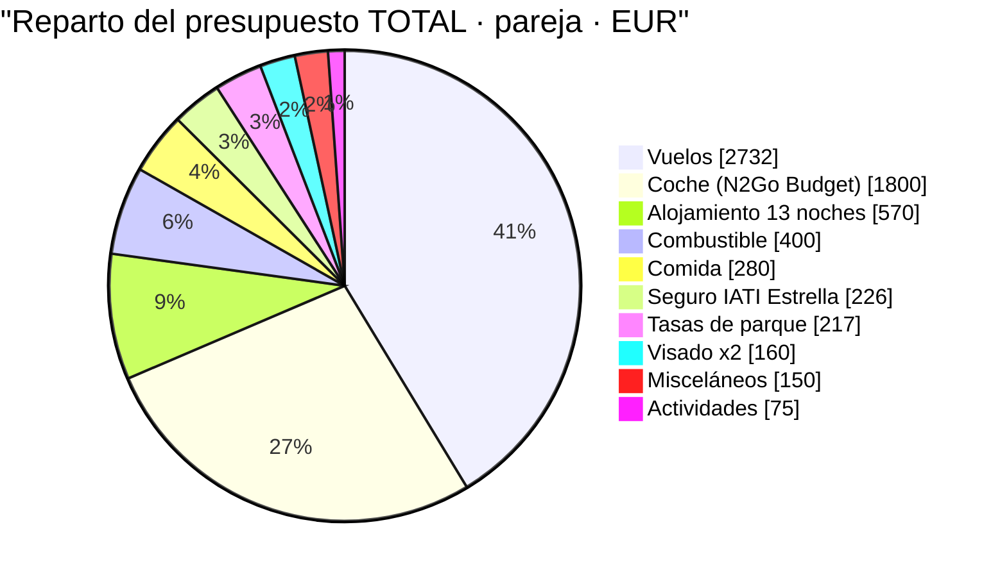
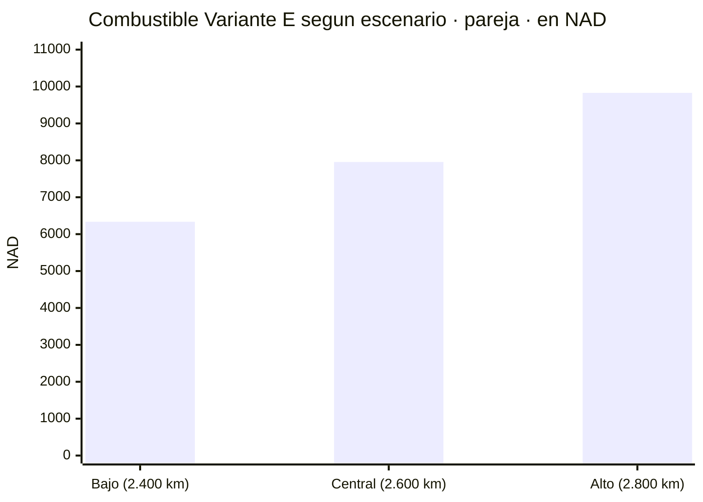
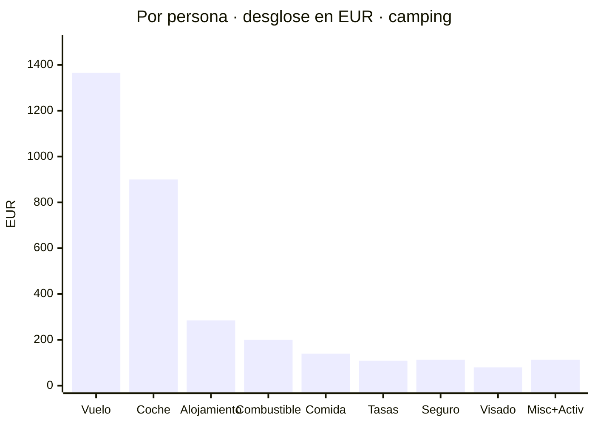
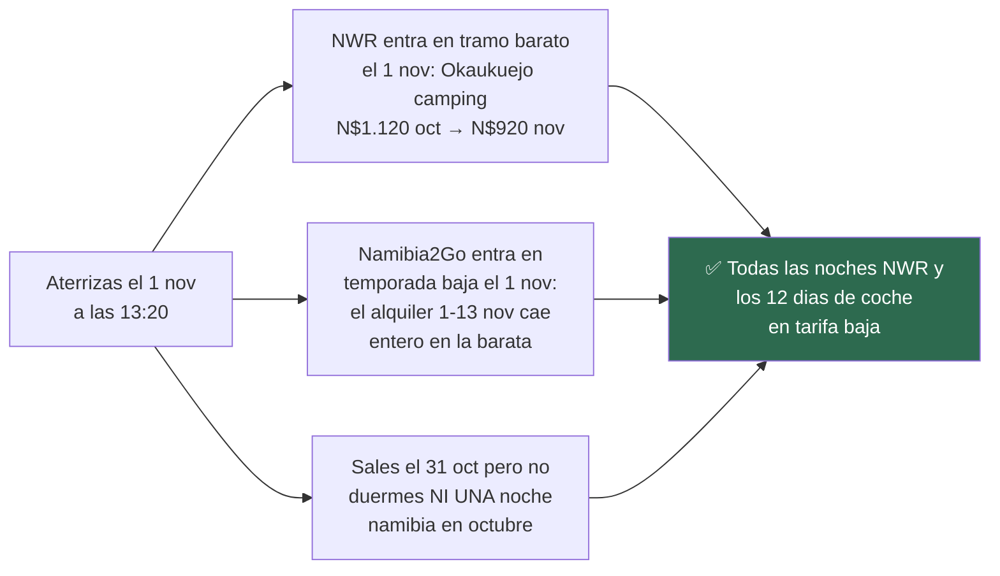
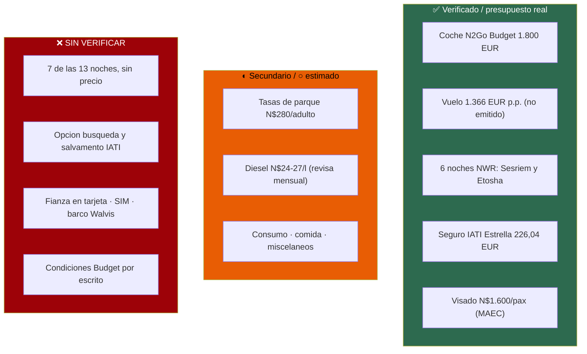

# Presupuesto — dos personas, 31 oct – 15 nov 2026, Variante E (la clásica del norte)

Coste real del viaje sobre la **ruta vigente** (Variante E, ver `11-itinerarios-dia-a-dia.md`), en N$
y €. Cada cifra lleva su marca de confianza y su fuente. **Donde no hay dato verificado, se dice y se
deja como estimación marcada: un número plausible presentado como hallazgo es un fallo grave — aquí
no se hace.**

**~N$20 = €1** (rango 19,5–20,5; a 17/07/2026, sin refrescar desde entonces) · el importe en la moneda
de la fuente es el bueno, la conversión es orientativa · **✅ primaria / presupuesto real** ·
**◐ secundaria concordante** · **○ práctica común sin fuente** · **❌ no verificado / en blanco**

> ### ℹ️ Reescrito el 02/08/2026
> La versión anterior de este documento estaba montada sobre la **Variante A (el sur) y el coche de
> Asco** — decisiones ya descartadas. Esta versión usa **la ruta E y los tres precios cerrados**:
> coche Namibia2Go Budget (€1.800, 12 días), vuelo LCG–WDH (€1.366 p.p., presupuesto real) y seguro
> IATI Estrella (€226,04 la pareja). El análisis histórico queda en el historial de git y en `01`/`04`.

---

## 1. La foto de conjunto — dónde se va el dinero

**Variante E · 31 oct – 15 nov · dos personas · escenario camping · TODO incluido** (vuelos, coche,
seguro, tierra):

```mermaid
pie showData
    title "Reparto del presupuesto TOTAL · pareja · EUR"
    "Vuelos" : 2732
    "Coche (N2Go Budget)" : 1800
    "Alojamiento 13 noches" : 570
    "Combustible" : 400
    "Comida" : 280
    "Seguro IATI Estrella" : 226
    "Tasas de parque" : 217
    "Visado x2" : 160
    "Misceláneos" : 150
    "Actividades" : 75
```

> **Vuelo y coche son el ~69 % del viaje.** Son también las dos partidas con precio real para las
> fechas exactas. Todo lo demás junto pesa ~€2.080 (~N$41.600) la pareja.

---

## 2. El coche — Namibia2Go BUDGET, cerrado y disponible ✅

**4x4 Budget camping equipped double cab: €150,00/día × 12 días (1–13 nov) = €1.800 (~N$36.000)** con
impuestos, ✅ **disponible** («Rent this Car» en la web; la Comfort sale «Not Available»). Toyota Hilux
Double Cab 2.8L GD-6 turbodiésel, automático, 4x4 permanente, **km ilimitados**, **Premium Insurance
Cover (franquicia cero)**, **2 ruedas de repuesto**, nevera eléctrica, 2 tiendas de techo Tentco de
lona, mesa, sillas y menaje. *1 día = 24 h.*

> ⚠️ **Ojo al calendario:** el coche son **12 días (1–13)** pero estás **13 noches (1–14)**. La noche
> del 13 en Windhoek te quedas sin coche → hotel y traslado, **o añadir el día 13 (~€150 · ~N$3.000)**
> y devolverlo el 14 camino del aeropuerto. Decisión pendiente — puede salir igual o más barato.

**Aparte, no incluido en el total:**
- **Fianza/depósito que se bloquea en la tarjeta a la recogida**: **❌ importe no verificado**. No es
  gasto, es retención, pero hay que tener margen en la tarjeta — pregúntalo al reservar.
- **Condiciones de la Budget por escrito**: la franquicia cero, las 2 ruedas y los km ilimitados
  salen de la ficha de la web ◐; falta la **confirmación escrita al reservar**, incluida la pregunta
  de **cómo trata el seguro los bajos en Damaraland** (el D8 pasa por ahí, ver `11`).

---

## 3. Los vuelos — €1.366 por persona, presupuesto real ✅ (no emitido)

**A Coruña → Windhoek ida y vuelta, turista, 31 oct – 14 nov**: **€1.366 (~N$27.300)/persona** en
Gotogate *(Mytrip €1.390, Booking €1.391)* → **pareja €2.732 (~N$54.600)**. Ida vía Madrid y Adís
(llegada 1 nov 13:20); vuelta vía Adís, Roma y Madrid (llegada 15 nov 16:10). Detalle en el README.

> ⚠️ **Es presupuesto real para las fechas exactas, pero el billete NO está emitido**: la tarifa se
> mueve. Antes de pagar, confirmar **billete único** (la vuelta lleva tres compañías) y **maleta
> facturada** en todos los tramos.

---

## 4. El seguro — IATI Estrella ✅

**€226,04 (~N$4.520) la pareja · €113,02/persona · 31/10 – 15/11** (cubre hasta el aterrizaje en
A Coruña el día 15). Asistencia médica ilimitada y repatriación al 100 % — la repatriación es
**condición de entrada** en Namibia.

**Pendiente antes de contratar:**
- **Opción de búsqueda y salvamento**: en el Estrella es opcional (el Mochilero la trae de serie).
  **❌ precio de la opción sin cotizar** — súmalo al total cuando lo tengas.
- **Pregunta por escrito a IATI**: si cubre **evacuación aérea DENTRO del país** (de pista remota a
  Windhoek), que es la cobertura que de verdad importa cerca de Sesriem.

---

## 5. Combustible — calculado sobre los ~2.600 km de la ruta E

**No se copia el consumo de nadie: se calcula.** Tres factores, cada uno con su banda:

- **Distancia (Variante E)**: **~2.600 km** ○, banda 2.400–2.800 — suma de las etapas día a día de
  `11` (ningún día por encima de ~390 km). ⚠️ **Seis etapas siguen con km sin verificar** (ver `11`),
  y el tramo de la costa hasta Terrace Bay no está medido con fuente propia (ver `04`).
- **Consumo** del Hilux doble cabina cargado: **11–13 l/100 km** ○ (práctica común; no verificado
  contra ficha del vehículo). Central **12 l/100 km**.
- **Precio del diésel**: costa **~N$24,3/l en julio de 2026** ◐; interior y bombas remotas (Solitaire,
  Sesriem) más caro — banda **N$24–27/l**, central **~N$25,5/l**. ⚠️ **Se revisa cada mes**:
  reconfírmalo la semana antes de salir.

```mermaid
xychart-beta
    title "Combustible Variante E segun escenario · pareja · en NAD"
    x-axis ["Bajo (2.400 km)", "Central (2.600 km)", "Alto (2.800 km)"]
    y-axis "NAD" 0 --> 11000
    bar [6336, 7956, 9828]
```

- **Central**: 2.600 km × 0,12 l/km × N$25,5 = **~N$7.956 (~€398)**
- **Banda**: **N$6.336–9.828 (~€317–491)**

> **Se presupuesta ~N$8.000 (~€400) la pareja.** ⚠️ Hueco operativo (no de dinero): **no está
> verificado si hay diésel en Terrace Bay** ni el detalle de repostaje del eje de la costa — ver `07`.
> Fuentes del precio: [GlobalPetrolPrices — Namibia diésel](https://www.globalpetrolprices.com/Namibia/diesel_prices/) ·
> [NAMCOR — fuel prices](https://www.namcor.com.na/fuel-prices/) *(no abierta aquí: 403)* ·
> rebaja de julio 2026 en [thebrief.com.na](https://thebrief.com.na/2026/07/gvt-cuts-petrol-price-by-n1-diesel-by-n4/).

---

## 6. Tasas de parque — 7 unidades de 24 h ◐

**N$280 (~€14)/adulto extranjero/día** (N$140 entrada + N$140 conservación) **+ N$60 (~€3)/vehículo**,
cobrado **por parque y por cada 24 h desde la entrada** (ver `01` §7 y `08`). Dos adultos + coche =
**N$620 (~€31)/día de parque**.

**La Variante E cruza tres parques de pago:**
- **Namib-Naukluft** (Sesriem/Sossusvlei): **2 unidades** (dos noches dentro de la puerta)
- **Skeleton Coast** (Ugabmund → Terrace Bay): **1 unidad**
- **Etosha**: **4 unidades** (cuatro noches dentro)

→ **7 unidades × N$620 = N$4.340 (~€217) la pareja · ~€109/persona.**

> **◐, no ✅**: el N$280/adulto se apoya en secundarias concordantes; el
> [PDF del MEFT](https://www.meft.gov.na/files/downloads/543_Park%20Entrance%20and%20Conservation%20Fees.PDF)
> existe pero no se pudo abrir para verificar la tabla fina. **Confírmalo por email antes de cerrar
> presupuesto.** Aparte: la entrada de **Cape Cross** (parada del D7) es **N$80–150 ◐** — el tramo
> exacto sigue sin cerrarse (ver `06`).

---

## 7. Visado — cifra dura ✅

**e-visa: N$1.600 (~€80)/persona** → **pareja N$3.200 (~€160)**, pago único, solo en
`eservices.mhaiss.gov.na`. Ver `01` §6. ⚠️ El visado **manual a la llegada** puede llevar un recargo
de N$2.000 (~€100) aprobado pero sin publicar: **usa el e-visa**. Requiere billete de vuelta emitido
y prueba de alojamiento — **depende de cerrar antes vuelo y reservas**. Fuente:
[MAEC — Namibia](https://www.exteriores.gob.es/es/ServiciosAlCiudadano/Paginas/Detalle-recomendaciones-de-viaje.aspx?trc=Namibia).

---

## 8. Alojamiento — 13 noches: 6 verificadas, 7 sin precio

### 8a. Escenario CAMPING (el del viaje)

**Verificado ✅ (NWR, ventana nov 2026 – jun 2027, 2 pax por noche):**
- **Sesriem, dentro de la puerta ×2** (D3–D4) — N$1.340 (~€67)/noche → **N$2.680 (~€134)**
- **Okaukuejo** (D9) — **N$920 (~€46)**
- **Halali** (D10) — **N$920 (~€46)**
- **Namutoni ×2** (D11–D12) — N$920/noche → **N$1.840 (~€92)**

→ **6 noches NWR verificadas: N$6.360 (~€318) la pareja · €159/persona** ✅

**Sin precio verificado ❌ → estimación ○ (7 noches):** Windhoek (D1), Spreetshoogte (D2 — un blog
citaba 150–300 ZAR/pax, vigencia desconocida), Walvis Bay ×2 (D5–D6), **Terrace Bay** (D7 — resort
NWR, tarifa no verificada; además **exige reserva confirmada para entrar al parque**), Hoada (D8) y
el hotel de Windhoek sin coche (D13). Estimación conjunta: **~N$5.040 (~€252) la pareja · ~€126/persona** ○.

→ **Alojamiento total ≈ N$11.400 (~€570) la pareja · ~€285/persona** — *solo el 56 % de esa cifra
está verificado; el resto es el mayor agujero de datos del presupuesto.*

### 8b. Escenario LODGES DE GAMA MEDIA — ❌ en su mayoría SIN VERIFICAR

> **Aviso rojo:** el precio/noche de los lodges de gama media **no se cerró** (ver `08`). Estimación
> ○ de gama media namibia: **N$2.500–4.500 (~€125–225)/noche para dos**, central ~N$3.500 (~€175) →
> 13 noches ≈ **~N$45.500 (~€2.275)** la pareja. **No pagues con estas cifras: pídelas al lodge.**
> Único ancla verificada: **Sossus Dune Lodge** (dentro de la puerta de Sesriem), dune chalet media
> pensión, **N$8.060 (~€403)/noche los dos** ✅ (NWR).

---

## 9. Comida, actividades y misceláneos

### Comida ○ *(sin fuente — práctica común)*
- **Camping / autoservicio** (supermercado + braai): ~N$300–500 (~€15–25)/día para dos → 14 días
  ≈ **~N$5.600 (~€280) la pareja · ~€140/persona**, banda N$4.200–7.000.
- ⚠️ Recuerda la **Línea Roja**: la carne cruda no baja del norte — el braai se compra y se come en
  la zona de Etosha (ver `07`).

### Actividades — unidades verificadas, selección estimada
Precios **por persona**, verificados salvo aviso:
- Lanzadera 4x4 a Deadvlei — **N$180 (~€9)** ✅ (NWR)
- Sesriem, safari guiado de mañana — N$600–700 (~€30–35) ✅ (NWR)
- Okaukuejo, safari nocturno — **N$750 (~€38)** ✅ (NWR) — *cae en ruta: D9*
- **Walvis Bay / Sandwich Harbour, en tour guiado**: **❌ precio no verificado** — pregúntalo allí.

→ Se presupuesta una partida **flexible de ~N$1.500 (~€75) la pareja · ~€38/persona** (p. ej.
lanzadera Deadvlei + una actividad). Sube fácil si se añade el tour de Sandwich Harbour.

### Misceláneos ○
SIM/eSIM de MTC (~N$150–300, ~€8–15, ❌ no verificado), propinas, tasas menores, imprevistos →
colchón **~N$3.000 (~€150) la pareja · ~€75/persona**. No verificado.

---

## 10. El total — por persona y para la pareja

```mermaid
xychart-beta
    title "Por persona · desglose en EUR · camping"
    x-axis ["Vuelo", "Coche", "Alojamiento", "Combustible", "Comida", "Tasas", "Seguro", "Visado", "Misc+Activ"]
    y-axis "EUR" 0 --> 1500
    bar [1366, 900, 285, 200, 140, 109, 113, 80, 113]
```

- ✈️ Vuelo — **€1.366 (~N$27.300)** ✅ *presupuesto real, no emitido*
- 🚙 Coche — **€900 (~N$18.000)** ✅ *mitad de €1.800 · 12 días*
- ⛺ Alojamiento — **~€285 (~N$5.700)** *(NWR €159 ✅ + 7 noches ~€126 ○)*
- ⛽ Combustible — **~€200 (~N$4.000)** ○
- 🍖 Comida — **~€140 (~N$2.800)** ○
- 🎫 Tasas de parque — **~€109 (~N$2.170)** ◐
- 🩺 Seguro — **€113,02 (~N$2.260)** ✅
- 🛂 Visado — **€80 (N$1.600)** ✅
- 🎯 Actividades + misceláneos — **~€113 (~N$2.260)** ○

> ### **TOTAL POR PERSONA: ~€3.306 (~N$66.000)**
> ### **TOTAL LA PAREJA: ~€6.612 (~N$132.000)**
> Rango honesto: **€3.150–3.450/persona** — el margen real son las partidas ○ (~€578/persona, ±€145).

**Qué parte del número es sólida:**
- **✅ Duro — €2.618 de los €3.306 (79 %)**: vuelo €1.366 · coche €900 · 6 noches NWR €159 ·
  seguro €113 · visado €80
- **◐ Corroborado — ~€109**: tasas de parque (confírmalas por email)
- **○ Estimado — ~€578**: 7 noches (~€126), combustible (~€200), comida (~€140), actividades (~€38),
  misceláneos (~€75)

---

## 11. Por qué tu ventana ya es la barata — el precipicio del 1 de noviembre

El análisis antiguo de este documento recomendaba viajar **después del 15 de noviembre** para
capturar la tarifa baja — pero **ese umbral era el de Asco, la empresa descartada**. Con los
proveedores reales, el precipicio de precio es el **1 de noviembre**, y tu calendario lo cruza en el
primer día de viaje:

```mermaid
flowchart LR
    A["Aterrizas el 1 nov<br/>a las 13:20"] --> B["NWR entra en tramo barato<br/>el 1 nov: Okaukuejo camping<br/>N$1.120 oct → N$920 nov"]
    A --> C["Namibia2Go entra en<br/>temporada baja el 1 nov:<br/>el alquiler 1-13 nov cae<br/>entero en la barata"]
    A --> D["Sales el 31 oct pero no<br/>duermes NI UNA noche<br/>namibia en octubre"]
    B --> E["✅ Todas las noches NWR y<br/>los 12 dias de coche<br/>en tarifa baja"]
    C --> E
    D --> E
    style E fill:#2d6a4f,color:#fff
```

*(Matiz verificado en `02`: el camping de Sesriem cuesta lo mismo en las dos ventanas — N$670/pax —
así que el ahorro de noviembre está en Etosha y en el coche, no en Sesriem.)*

---

## 12. Lo que este presupuesto NO pudo verificar — dicho claro

```mermaid
flowchart TD
    subgraph V["✅ Verificado / presupuesto real"]
        A["Coche N2Go Budget 1.800 EUR"]
        B["Vuelo 1.366 EUR p.p. (no emitido)"]
        C["6 noches NWR: Sesriem y Etosha"]
        D["Seguro IATI Estrella 226,04 EUR"]
        E["Visado N$1.600/pax (MAEC)"]
    end
    subgraph M["◐ Secundario / ○ estimado"]
        F["Tasas de parque N$280/adulto"]
        G["Diesel N$24-27/l (revisa mensual)"]
        H["Consumo · comida · miscelaneos"]
    end
    subgraph X["❌ SIN VERIFICAR"]
        I["7 de las 13 noches, sin precio"]
        J["Opcion busqueda y salvamento IATI"]
        K["Fianza en tarjeta · SIM · barco Walvis"]
        L["Condiciones Budget por escrito"]
    end
    style V fill:#2d6a4f,color:#fff
    style M fill:#e85d04,color:#000
    style X fill:#9d0208,color:#fff
```

- **❌ 7 de las 13 noches sin precio**: Windhoek ×2, Spreetshoogte, Walvis ×2, Terrace Bay y Hoada.
  Es el margen real del presupuesto (±€145/persona). Terrace Bay además **bloquea la entrada al
  parque** si no está reservado.
- **❌ El vuelo no está emitido**: €1.366 es presupuesto real de Gotogate, no billete. La tarifa se
  mueve — es la partida más urgente después del coche.
- **❌ Opción de búsqueda y salvamento del IATI Estrella**: sin cotizar; falta sumarla.
- **❌ Fianza retenida en la tarjeta** (Namibia2Go): importe sin verificar; margen necesario.
- **◐ Tasas de parque**: N$280/adulto en secundarias concordantes; el PDF del MEFT sin abrir.
- **◐ Diésel**: se revisa **cada mes** (hay revisiones el 1/09, el 1/10 y el 1/11, ya de viaje).
- **○ Consumo, comida, SIM, misceláneos**: prácticas comunes, sin fuente que descargar.

> **Regla de oro de este documento:** lo cerrado con precio real para las fechas exactas
> (vuelo + coche + NWR + seguro + visado = **€2.618/persona**) es el **79 %** del total. El 21 %
> restante es estimación honesta — y está señalado, no escondido.

---

## Fuentes

- **Coche**: [namibia2go.com · 4x4 camping equipped double cab](https://namibia2go.com/4x4-camping-equipped-double-cab) ·
  [vídeo oficial del Hilux](https://www.youtube.com/watch?v=LPNZ-l8y3Pg) — ver README y `01`
- **Vuelo**: presupuesto Gotogate/Mytrip/Booking para 31 oct – 14 nov — ver README y `08`
- **Seguro**: [iatiseguros.com](https://www.iatiseguros.com/) — simulación 31/10–15/11, ver README
- **Alojamiento NWR**: [NWR Rack Rates 2026/2027 (PDF)](https://www.nwr.com.na/wp-content/uploads/2026/06/NWR-Rack-Rates-2026-2027.pdf) — ver `02`
- **Tasas de parque**: [MEFT — Park Entrance and Conservation Fees (PDF)](https://www.meft.gov.na/files/downloads/543_Park%20Entrance%20and%20Conservation%20Fees.PDF) — ver `01` y `08`
- **Visado**: [MAEC — Namibia](https://www.exteriores.gob.es/es/ServiciosAlCiudadano/Paginas/Detalle-recomendaciones-de-viaje.aspx?trc=Namibia) — ver `01`
- **Diésel**: [GlobalPetrolPrices — Namibia](https://www.globalpetrolprices.com/Namibia/diesel_prices/) ·
  [NAMCOR — fuel prices](https://www.namcor.com.na/fuel-prices/) ·
  [thebrief.com.na — rebaja julio 2026](https://thebrief.com.na/2026/07/gvt-cuts-petrol-price-by-n1-diesel-by-n4/)
- **Etapas y distancias de la E**: `11-itinerarios-dia-a-dia.md` · **Huecos**: `08-huecos-cerrados.md`
