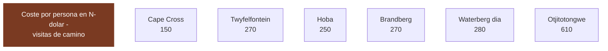

# 11 · Entradas, permisos y qué cuesta cada visita

> **Namibia · 30 oct – 15 nov 2026 · la clásica del norte** — [← índice del dossier](README.md)
>
> Lo que cuesta entrar en cada sitio de la ruta, con su fuente — y, al final, qué destinos
> quedaron fuera de la ruta y por qué.
>
> **~N$20 = €1** *(rango 19,5–20,5)* · **✅** fuente primaria · **◐** secundaria concordante ·
> **○** práctica común, sin fuente · **❌** sin verificar, dicho en blanco
>
> *Investigación cerrada el 17/07/2026 · formato y contenido revisados el 09/08/2026*

---

## 💶 Lo que cuesta entrar en cada sitio

Esto cierra la lista de «Lo que hay que verificar» que dejó la pasada anterior. Cada cifra lleva su
fuente y su marca: **✅ primaria** · **◐ secundaria** · **○ práctica común**. Todos los precios en
**N$ y €** (~N$20 = €1; el rand ZAR cotiza ~1:1 con el N$; los importes en US$ se convierten al
cambio aproximado del día, ~N$18,5/US$ y ~€0,92/US$, y se marcan como tales).

### 🎫 Entradas y visitas guiadas *(en la ruta o a un desvío de ella)*

- **Twyfelfontein — los grabados UNESCO (D8, parada fija de la ruta)** ◐
  - **La visita guiada es obligatoria y de pago: N$270 (~€13,5)/persona, guía incluido** ◐ *(baremo
    del National Heritage Council vía secundarias concordantes — la misma familia de tarifas que
    Petrified Forest u Otjikoto, ver `10`)*. **Solo efectivo**: el cajero más cercano queda en
    Khorixas o Swakopmund. Visita de ~45–60 min más el paseo desde el aparcamiento.
  - En el presupuesto **va cargada al colchón de misceláneos de `02` §9** (tasas menores).
  - Acceso: **C39 → D2612 → D3254** (señalizado hacia el Country Lodge y el visitors centre).
  - Fuentes: [Safari2Go/namibian.org — subida de tarifas NHC](https://namibian.org/news/tourism/access-to-namibias-natural-and-cultural-heritage-sites-costs-more) ·
    [danesontheroad — visita 2025/26](https://danesontheroad.com/africa/namibia/visit-the-amazing-twyfelfontein-engravings-in-namibia/) ·
    acceso: [siyabona — Twyfelfontein location](https://www.siyabona.com/twyfelfontein-country-lodge_location.html)

- **Cape Cross — colonia de lobos marinos (D7, en la ruta)** ◐
  - **Lo presupuestado (`02` §5 y `01` §D7): N$150 (~€7,5)/extranjero + N$50 (~€2,5)/coche =
    ~N$350 (~€18) los dos** ◐ *(reseña de visitante de 2025 + una guía, convergentes)*. Solo
    **efectivo**, se paga en recepción.
  - ⚠️ **El tramo exacto sigue abierto — tres cifras en circulación**: reseñas viejas dan
    **N$80–150**; una secundaria ([namibian.org](https://namibian.org/blog/namibia-raises-park-fees-by-80-to-100-percent))
    sitúa Cape Cross en el baremo **«premium» del MEFT (N$280/adulto)** desde abril de 2026. Si
    fuera premium, serían **+N$260 (~€13) la pareja** sobre lo presupuestado — lo absorbe el rango.
    **Confírmalo contra el PDF del MEFT** *(el mismo email pendiente de las tasas, ver `02` y `15`)*.
  - **Timing ideal:** el pico de cría es **noviembre-diciembre** (hasta ~210.000 focas) — justo
    vuestras fechas.
  - Acceso por la **C34** al norte de Swakopmund (costa). Gestiona MEFT.
  - Fuentes: [TripAdvisor — Cape Cross](https://www.tripadvisor.com/Attraction_Review-g3650568-d547128-Reviews-Cape_Cross-Erongo_Region.html) ·
    [MEFT — Cape Cross Seal Reserve](https://www.meft.gov.na/national-parks/cape-cross-seal-reserve/214/)

- **Brandberg — la Dama Blanca** ◐
  - **Guía OBLIGATORIO.** El sitio lo gestiona la **comunidad damara** y no se sube sin guía local.
  - **~N$250–270/persona (~€12,5–13,5)**. Caminata de **~3 h ida y vuelta**, poca sombra
    → planificar a primera hora por el calor (ver `15`).
  - Fuentes: [namibweb — Brandberg Mountain Guides](http://www.namibweb.com/brandg.htm) ·
    [TripAdvisor — White Lady](https://www.tripadvisor.com/Attraction_Review-g1182959-d2284289-Reviews-White_Lady-Khorixas_Kunene_Region.html)

- **Hoba Meteorite** ◐
  - **~N$250/persona (~€12,5)** *(tarifario NHC vía prensa, ver `10`)*. ⚠️ Una reseña de 2024 lo
    cifra en «22,50 €/extranjero» — al cambio son **≈ N$450, discordante con el baremo**: lleva
    efectivo de sobra y paga lo que diga la taquilla. Gestiona el **National Heritage Council**.
  - **OJO geografía:** está junto a **Grootfontein**, en el **noreste**. Con esta ruta queda como
    **desvío opcional del D13** (Namutoni → Windhoek vía Grootfontein) — ver `01`.
  - Fuente: [TripAdvisor — Hoba Meteorite](https://www.tripadvisor.com/Attraction_Review-g1137965-d3609771-Reviews-Hoba_Meteorite-Grootfontein_Otjozondjupa_Region.html)

- **Waterberg Plateau** ◐/✅
  - **N$280/persona/día (~€14)** — es el **baremo premium del MEFT** vigente desde el **1/04/2026**,
    el mismo que Etosha y Namib-Naukluft (ver `15`).
  - Fuente: [NWR — Waterberg](https://www.nwrnamibia.com/waterberg-prices.htm) ·
    baremo en [15-huecos-cerrados.md](15-huecos-cerrados.md)

- **Otjitotongwe Cheetah Farm** ◐
  - Interacción/alimentación de guepardos. En la **C40, a 24 km de Kamanjab hacia Outjo** — es
    decir, **de camino el D9** (Hoada → Kamanjab → Outjo → Etosha, ver `01`). Alimentación
    **~15:00** (16:00 en invierno).
  - **~US$33 (~€30; ~N$610)** el paseo (◐, una reseña). Los no alojados deben **avisar antes**;
    cerrado fines de semana según una fuente.
  - Fuente: [namibweb — Otjitotongwe](https://www.namibweb.com/otjitotongwe.htm)

---

## 🚁 Drones: se quedan en casa

**No hay dónde volarlo legalmente en esta ruta.** La NCAA exige permiso previo por escrito para
cualquier vuelo, incluso por afición, y ese permiso **no se concede en parques nacionales** —
Namib-Naukluft, Skeleton Coast/Dorob y Etosha, que es por donde va casi toda la ruta. Etosha
además prohíbe la entrada de drones sin excepción desde abril de 2025: se deja en la puerta y se
recoge al salir, y con entrada por Andersson y salida por Von Lindequist (161 km entre las dos)
quedaría en el lado equivocado del parque. La vista aérea legal, si hace falta, es el vuelo
panorámico en avioneta o globo sobre Sossusvlei o la Costa de los Esqueletos.

**Fuentes:** [NCAA — RPAS](https://www.ncaa.com.na/index.php/latest-news/69-remotely-piloted-aircraft-systems-rpas-or-drones) ·
[Windhoek Observer — MEFT outlaws drones in Etosha](https://observer24.com.na/meft-outlaws-drones-in-etosha/) ·
[ATTA — Namibia bans all drones in Etosha National Park](https://atta.travel/resource/namibia-bans-all-drones-in-etosha-national-park.html)

---

## 🚫 Zonas restringidas y acceso guiado

- **Messum Crater — abierto al self-drive con permiso, pero desaconsejado** ◐
  - **Sigue abierto al self-drive:** la parte oeste del cráter cae dentro del **Dorob National
    Park** y **exige permiso** — **gratis**, en la **oficina de Turismo de Henties Bay** (o MEFT).
    Ya no es "requisito discutido": las fuentes coinciden en que hay que sacarlo. La pista **"está
    ahora nivelada"** (graded), señal de que se mantiene transitable; **no hay cierre confirmado**.
  - **4x4 imprescindible** todo el año, con depósito suficiente para ir y volver desde Henties Bay.
    Ruta: Henties Bay → **Milla 100** → desvío a la **D2303** → río Messum hasta el cráter *(algunos
    tramos exigen coordenadas GPS)*.
  - **Líquenes extremadamente frágiles:** un 4x4 arrasa **~1 hectárea cada 10 km fuera de pista**
    y crecen **~1 mm/año**. **Máximo 40 km/h, prohibido salir de la rodada** — el polvo daña los
    líquenes y las welwitschias. Los campos de líquenes se ven ya en la **Milla 30** al sur de
    Henties Bay *(aparcar junto a la pista y verlos a pie)*.
  - Circuló un **rumor de cierre al self-drive (2014)** que **las fuentes actuales NO confirman**;
    hoy el permiso se sigue emitiendo. **Alto riesgo ecológico** → no recomendado para este viaje.
  - Fuentes: [travelnam — Messum Crater](https://travelnam.com/crater-with-a-difference-messum-crater/) ·
    [dangerousroads — Messum](https://www.dangerousroads.org/africa/namibia/5955-messum-crater.html) ·
    [Henties Bay Tourism — 4x4 routes](https://www.hentiesbaytourism.com/things-to-do-and-see/4x4routes/)
  - *Nota de fuente: extracción vía WebSearch (páginas descargadas por el buscador); el egress de la
    organización bloquea WebFetch/curl a estos hosts (403). Fuente primaria MEFT del permiso no
    abierta aquí → nivel ◐.*

- **Skeleton Coast — permiso de tránsito gratis, pero pernocta CERRADA en noviembre** ◐
  - Sector self-drive: **entre las puertas de Ugabmund (sur) y Springbokwasser (este)**. El
    **permiso de tránsito es gratis** y se saca en la propia puerta.
  - Puertas **07:30–19:00**; **no se entra después de las 15:00** sin reserva confirmada.
  - **Torra Bay abre solo diciembre-enero → CERRADO todo noviembre, incluido vuestro paso del 7 nov.** Terrace Bay
    (NWR) abre todo el año, pero pernoctar exige **reserva previa**.
  - Fuentes: [NWR — Skeleton Coast](https://www.nwrnamibia.com/skeleton-coast-national-park.htm) ·
    [TripAdvisor — permits & gate times](https://www.tripadvisor.com/ShowTopic-g479222-i25768-k8459916-Driving_permits_and_gate_opening_times-Skeleton_Coast_National_Park_Khomas_Region.html)

- **NamibRand — no es self-drive libre** ◐
  - **Día:** ~US$10–20/persona (~€9–18; ~N$185–370). **Alojados:** tasa de conservación **por cama
    y día** que cobra el lodge (sistema de concesiones). El acceso general va **vía alojamiento**,
    no como pista abierta.
  - Fuentes: [NamibRand — Tourism](https://www.namibrand.com/tourism.html) ·
    [takeyourbackpack — NamibRand](https://www.takeyourbackpack.com/backpacking-in-namibia/visit-namibrand-nature-reserve/)

---

## 💶 Coste por persona de las visitas «de camino» *(las baratas)*

Las entradas que sí encajan en la ruta son **calderilla** comparadas con un tour del Sperrgebiet.
El contraste, de un vistazo (N$/persona):

> **Lectura:** Twyfelfontein, Cape Cross, Brandberg y una tasa de parque se mueven todos en la
> banda de ~N$150–280 (~€7–14) por cabeza. El único desembolso de otra liga es Otjitotongwe
> (~N$610 · ~€30), que ya es una actividad y no una entrada — y aun así vale menos que una cena
> en Swakopmund.

---

---

## 🕳️ Lo que SIGUE sin cerrarse *(honesto)*

- **Cape Cross:** el **tramo exacto** de la tabla MEFT no se pudo verificar contra el PDF primario
  (bloqueado): reseñas viejas dan N$80–150, una secundaria lo sitúa en el baremo premium (N$280).
  **Presupuestado N$150 + N$50 de coche ◐, con el «¿y si es premium?» (+~€13 la pareja) dentro del
  rango** — ver la ficha de arriba.
- **Okonjima Plains Camp:** el número fino de la media pensión no salió por fragmento (el PDF de
  tarifas está publicado pero no se pudo abrir aquí).
- **Waterberg (camping NWR):** la tasa de **parcela** (distinta de la entrada de N$280) no se
  extrajo; solo la entrada.
- **Kgalagadi:** descartado por decisión del viajero — no se investiga si Asco autoriza el cruce.
- **Messum Crater:** ✔️ **avanzado (31/07)** — el estado de apertura al self-drive queda **◐
  cerrado a nivel secundario**: sigue **abierto con permiso gratis** de Turismo de Henties Bay
  (la parte oeste está en el **Dorob National Park**), la pista está **nivelada** y **no hay cierre
  confirmado**; el rumor de 2014 no lo respalda ninguna fuente actual (ver la ficha arriba). **Falta
  solo** la confirmación contra la fuente primaria del MEFT (bloqueada por egress, 403).
