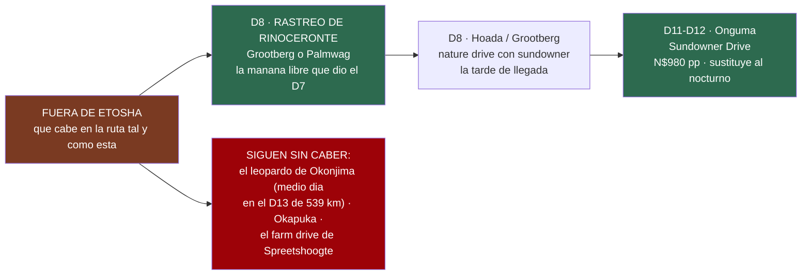
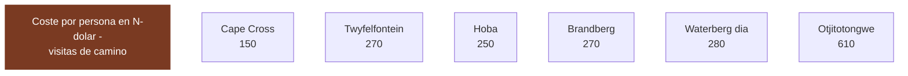

# 11 · Entradas, permisos y qué cuesta cada visita

> **Namibia · 30 oct – 15 nov 2026 · la clásica del norte** — [← índice del dossier](README.md)
>
> Lo que cuesta entrar en cada sitio de la ruta, con su fuente — y, al final, qué destinos
> quedaron fuera de la ruta y por qué.
>
> **~N$20 = €1** *(rango 19,5–20,5)* · **✅** fuente primaria · **◐** secundaria concordante ·
> **○** práctica común, sin fuente · **❌** sin verificar, dicho en blanco
>
> *Investigación cerrada el 17/07/2026 · formato y contenido revisados el 09/08/2026*

---

## 💶 Lo que cuesta entrar en cada sitio

Esto cierra la lista de «Lo que hay que verificar» que dejó la pasada anterior. Cada cifra lleva su
fuente y su marca: **✅ primaria** · **◐ secundaria** · **○ práctica común**. Todos los precios en
**N$ y €** (~N$20 = €1; el rand ZAR cotiza ~1:1 con el N$; los importes en US$ se convierten al
cambio aproximado del día, ~N$18,5/US$ y ~€0,92/US$, y se marcan como tales).

### 🎫 Entradas y visitas guiadas *(en la ruta o a un desvío de ella)*

- **Twyfelfontein — los grabados UNESCO (D7, parada fija de la ruta, y desde el 24/08 con noche propia)** ◐
  - **La visita guiada es obligatoria y de pago: N$270 (~€13,5)/persona, guía incluido** ◐ *(baremo
    del National Heritage Council vía secundarias concordantes — la misma familia de tarifas que
    Petrified Forest u Otjikoto, ver `10`)*. **Solo efectivo**: el cajero más cercano queda en
    Khorixas o Swakopmund. Visita de ~45–60 min más el paseo desde el aparcamiento.
  - En el presupuesto **va cargada al colchón de misceláneos de `02` §9** (tasas menores).
  - Acceso: **C39 → D2612 → D3254** (señalizado hacia el Country Lodge y el visitors centre).
  - Fuentes: [Safari2Go/namibian.org — subida de tarifas NHC](https://namibian.org/news/tourism/access-to-namibias-natural-and-cultural-heritage-sites-costs-more) ·
    [danesontheroad — visita 2025/26](https://danesontheroad.com/africa/namibia/visit-the-amazing-twyfelfontein-engravings-in-namibia/) ·
    acceso: [siyabona — Twyfelfontein location](https://www.siyabona.com/twyfelfontein-country-lodge_location.html)

- **Cape Cross — colonia de lobos marinos (D6, en la ruta)** ◐
  - **Lo presupuestado (`02` §5 y `01` §D6): N$150 (~€7,5)/extranjero + N$50 (~€2,5)/coche =
    ~N$350 (~€18) los dos** ◐ *(reseña de visitante de 2025 + una guía, convergentes)*. Solo
    **efectivo**, se paga en recepción.
  - ⚠️ **El tramo exacto sigue abierto — tres cifras en circulación**: reseñas viejas dan
    **N$80–150**; una secundaria ([namibian.org](https://namibian.org/blog/namibia-raises-park-fees-by-80-to-100-percent))
    sitúa Cape Cross en el baremo **«premium» del MEFT (N$280/adulto)** desde abril de 2026. Si
    fuera premium, serían **+N$260 (~€13) la pareja** sobre lo presupuestado — lo absorbe el rango.
    **Confírmalo contra el PDF del MEFT** *(el mismo email pendiente de las tasas, ver `02` y `15`)*.
  - **Timing ideal:** el pico de cría es **noviembre-diciembre** (hasta ~210.000 focas) — justo
    vuestras fechas.
  - Acceso por la **C34** al norte de Swakopmund (costa). Gestiona MEFT.
  - Fuentes: [TripAdvisor — Cape Cross](https://www.tripadvisor.com/Attraction_Review-g3650568-d547128-Reviews-Cape_Cross-Erongo_Region.html) ·
    [MEFT — Cape Cross Seal Reserve](https://www.meft.gov.na/national-parks/cape-cross-seal-reserve/214/)

- **Brandberg — la Dama Blanca** ◐
  - **Guía OBLIGATORIO.** El sitio lo gestiona la **comunidad damara** y no se sube sin guía local.
  - **~N$250–270/persona (~€12,5–13,5)**. Caminata de **~3 h ida y vuelta**, poca sombra
    → planificar a primera hora por el calor (ver `15`).
  - Fuentes: [namibweb — Brandberg Mountain Guides](http://www.namibweb.com/brandg.htm) ·
    [TripAdvisor — White Lady](https://www.tripadvisor.com/Attraction_Review-g1182959-d2284289-Reviews-White_Lady-Khorixas_Kunene_Region.html)

- **Hoba Meteorite** ◐
  - **~N$250/persona (~€12,5)** *(tarifario NHC vía prensa, ver `10`)*. ⚠️ Una reseña de 2024 lo
    cifra en «22,50 €/extranjero» — al cambio son **≈ N$450, discordante con el baremo**: lleva
    efectivo de sobra y paga lo que diga la taquilla. Gestiona el **National Heritage Council**.
  - **OJO geografía:** está junto a **Grootfontein**, en el **noreste**. Con esta ruta queda como
    **desvío opcional del D13** (Onguma → Windhoek vía Grootfontein) — ver `01`.
  - Fuente: [TripAdvisor — Hoba Meteorite](https://www.tripadvisor.com/Attraction_Review-g1137965-d3609771-Reviews-Hoba_Meteorite-Grootfontein_Otjozondjupa_Region.html)

- **Waterberg Plateau** ◐/✅
  - **N$280/persona/día (~€14)** — es el **baremo premium del MEFT** vigente desde el **1/04/2026**,
    el mismo que Etosha y Namib-Naukluft (ver `15`).
  - Fuente: [NWR — Waterberg](https://www.nwrnamibia.com/waterberg-prices.htm) ·
    baremo en [15-huecos-cerrados.md](15-huecos-cerrados.md)

- **Otjitotongwe Cheetah Farm** ◐
  - Interacción/alimentación de guepardos. En la **C40, a 24 km de Kamanjab hacia Outjo** — es
    decir, **de camino el D9** (Hoada → Kamanjab → Outjo → Etosha, ver `01`). Alimentación
    **~15:00** (16:00 en invierno).
  - **~US$33 (~€30; ~N$610)** el paseo (◐, una reseña). Los no alojados deben **avisar antes**;
    cerrado fines de semana según una fuente.
  - Fuente: [namibweb — Otjitotongwe](https://www.namibweb.com/otjitotongwe.htm)

---

## 🚁 Drones: se quedan en casa

**No hay dónde volarlo legalmente en esta ruta.** La NCAA exige permiso previo por escrito para
cualquier vuelo, incluso por afición, y ese permiso **no se concede en parques nacionales** —
Namib-Naukluft, Skeleton Coast/Dorob y Etosha, que es por donde va casi toda la ruta. Etosha
además prohíbe la entrada de drones sin excepción desde abril de 2025: se deja en la puerta y se
recoge al salir, y con entrada por Andersson y salida por Von Lindequist (161 km entre las dos)
quedaría en el lado equivocado del parque. La vista aérea legal, si hace falta, es el **vuelo
panorámico**. ⚠️ **DESCARTADO el 24/08: el viajero decide no volar** *(`20` §7)* — la ficha se
queda por si algún día se reabre, con operadores reales verificados en su propia web:

- **Globo sobre Sossusvlei** ✅ — [Namib Sky Balloon Safaris](https://balloon-safaris.com/ballooning-namibia/),
  el operador clásico de la zona (despega en Kulala Wilderness Reserve o el norte de NamibRand,
  ~1h antes del amanecer): **N$9.920 (~€496)/persona**, ~1h de vuelo, con desayuno y traslado
  incluidos — tarifa publicada hasta jun-2026, reconfirmar para la temporada 2026/27.
- **Avioneta sobre las dunas** ✅ — ambos salen de **Swakopmund**, no de Sesriem:
  [Sossusvlei Scenic Flights](https://sossusvleiscenicflights.com/sossusvlei-scenic-flights/rates/)
  (Eagle Eye Aviation), N$7.000–17.500/persona según grupo (2h06) · o
  [Sossusfly](https://sossusfly.com/), N$6.900/persona (grupo de 5, 2h10, dunas + Costa de los
  Esqueletos en un único vuelo).
- **Avioneta sobre la Costa de los Esqueletos** ✅ — también desde Swakopmund:
  [Sossusvlei Scenic Flights](https://sossusvleiscenicflights.com/sossusvlei-scenic-flights/rates/),
  N$5.500–13.750/persona (~1h30, naufragios + lobos marinos + Sandwich Harbour) · o
  [Wings & Wheels Tours](https://wingsandwheelstours.com/featured_item/skeleton-coast-scenic-flight/)
  (misma ruta, precio sin publicar ❌).

**Fuentes:** [NCAA — RPAS](https://www.ncaa.com.na/index.php/latest-news/69-remotely-piloted-aircraft-systems-rpas-or-drones) ·
[Windhoek Observer — MEFT outlaws drones in Etosha](https://observer24.com.na/meft-outlaws-drones-in-etosha/) ·
[ATTA — Namibia bans all drones in Etosha National Park](https://atta.travel/resource/namibia-bans-all-drones-in-etosha-national-park.html)

---

## 🚫 Zonas restringidas y acceso guiado

- **Messum Crater — abierto al self-drive con permiso, pero desaconsejado** ◐
  - **Sigue abierto al self-drive:** la parte oeste del cráter cae dentro del **Dorob National
    Park** y **exige permiso** — **gratis**, en la **oficina de Turismo de Henties Bay** (o MEFT).
    Ya no es "requisito discutido": las fuentes coinciden en que hay que sacarlo. La pista **"está
    ahora nivelada"** (graded), señal de que se mantiene transitable; **no hay cierre confirmado**.
  - **4x4 imprescindible** todo el año, con depósito suficiente para ir y volver desde Henties Bay.
    Ruta: Henties Bay → **Milla 100** → desvío a la **D2303** → río Messum hasta el cráter *(algunos
    tramos exigen coordenadas GPS)*.
  - **Líquenes extremadamente frágiles:** un 4x4 arrasa **~1 hectárea cada 10 km fuera de pista**
    y crecen **~1 mm/año**. **Máximo 40 km/h, prohibido salir de la rodada** — el polvo daña los
    líquenes y las welwitschias. Los campos de líquenes se ven ya en la **Milla 30** al sur de
    Henties Bay *(aparcar junto a la pista y verlos a pie)*.
  - Circuló un **rumor de cierre al self-drive (2014)** que **las fuentes actuales NO confirman**;
    hoy el permiso se sigue emitiendo. **Alto riesgo ecológico** → no recomendado para este viaje.
  - Fuentes: [travelnam — Messum Crater](https://travelnam.com/crater-with-a-difference-messum-crater/) ·
    [dangerousroads — Messum](https://www.dangerousroads.org/africa/namibia/5955-messum-crater.html) ·
    [Henties Bay Tourism — 4x4 routes](https://www.hentiesbaytourism.com/things-to-do-and-see/4x4routes/)
  - *Nota de fuente: extracción vía WebSearch (páginas descargadas por el buscador); el egress de la
    organización bloquea WebFetch/curl a estos hosts (403). Fuente primaria MEFT del permiso no
    abierta aquí → nivel ◐.*

- **Skeleton Coast — permiso de tránsito gratis, pero pernocta CERRADA en noviembre** ◐
  - Sector self-drive: **entre las puertas de Ugabmund (sur) y Springbokwasser (este)**. El
    **permiso de tránsito es gratis** y se saca en la propia puerta.
  - Puertas **07:30–19:00**; **no se entra después de las 15:00** sin reserva confirmada.
  - **Torra Bay abre solo diciembre-enero → CERRADO todo noviembre, incluido vuestro paso del 7 nov.** Terrace Bay
    (NWR) abre todo el año, pero pernoctar exige **reserva previa**.
  - Fuentes: [NWR — Skeleton Coast](https://www.nwrnamibia.com/skeleton-coast-national-park.htm) ·
    [TripAdvisor — permits & gate times](https://www.tripadvisor.com/ShowTopic-g479222-i25768-k8459916-Driving_permits_and_gate_opening_times-Skeleton_Coast_National_Park_Khomas_Region.html)

- **NamibRand — no es self-drive libre** ◐
  - **Día:** ~US$10–20/persona (~€9–18; ~N$185–370). **Alojados:** tasa de conservación **por cama
    y día** que cobra el lodge (sistema de concesiones). El acceso general va **vía alojamiento**,
    no como pista abierta.
  - Fuentes: [NamibRand — Tourism](https://www.namibrand.com/tourism.html) ·
    [takeyourbackpack — NamibRand](https://www.takeyourbackpack.com/backpacking-in-namibia/visit-namibrand-nature-reserve/)

---

## 🚙 Los game drives que NO son Etosha — etapa a etapa *(investigado el 24/08/2026)*

**El hallazgo primero, porque cambia la expectativa:** fuera de Etosha, esta ruta **no está llena
de game drives**. Los de verdad se concentran en **tres sitios** —el eje de Windhoek (D0/D13),
Damaraland (D7–D8) y la propia puerta de Etosha (Onguma, D11–D12)— y en el eje Otjiwarongo del D13.
**El desierto y la costa no tienen game drive**: lo que tienen es tour de dunas y de fauna pequeña,
que es otra cosa y ya está en su sitio *(Sandwich Harbour, `20` §7)*. Y **el cuello de botella no
es el dinero, es el reloj**.

> ### 🔄 Y el reloj cambió el 24/08 — este documento se escribió con el calendario viejo
> Al quitarle la segunda noche a Spreetshoogte y **darle una noche propia a Twyfelfontein (D7)**,
> **la mañana del D8 queda libre entera** *(`24`)*. Eso **da la vuelta a la conclusión de abajo**:
> el rastreo de rinoceronte negro de Grootberg o Palmwag, que aquí se daba por imposible, **ahora
> cabe** — es el mejor argumento del cambio de ruta. En sentido contrario, **el farm drive de
> Spreetshoogte pierde su hueco**: el día de 0 km en la escarpa ya no existe.

### 🏜️ D1 · Spreetshoogte — el farm drive del propio campamento ◐ *(y ahora va justo)*

**Barkhan Dune Retreat**, que es quien opera vuestro campamento *(`20` §5)*, hace un **Farm /
Sundowner Drive** por la finca ✅ *([barkhan.africa/activities](https://www.barkhan.africa/activities.php))*.
Lo que dicen que se ve: **cebra de montaña, oryx, facóquero, zorro orejudo y lobo de tierra**
*(aardwolf)* — los dos últimos, con ficha en la guía de fauna. **Es la respuesta a la pregunta que
el `01` deja abierta en el D1** *(«pregúntale al dueño qué baja al anochecer»)*: allí no hay ni
parte de avistamientos ni polígono GBIF que llegue, así que **el guía de la finca ES la fuente**.

- **Precio** ❌ — **no aparece en el rack de camping 2026 ni en el 2027**; su página de tarifas de
  **2024/25** sí listaba **Sundowner Drive N$605 (~€30)/persona** ◐. **Pregúntalo al reservar.**
- ⚠️ **Y desde el 24/08 ya no encaja cómodo.** Encajaba en el **D2 de 0 km**, que **ya no existe**:
  la escarpa se hace en **una sola noche**. Lo que queda es el **atardecer del D1**, que ya está
  ocupado por el mirador del paso —que es el plan del día—. **O una cosa o la otra**: el sundowner
  drive de la finca sale a esa misma hora.
- ❌ **Sin confirmar si los del camping pueden apuntarse** o es solo para los del lodge: su ficha
  no lo dice. Va en la misma llamada que la reserva.

### 🦏 D8 · Damaraland — el mejor safari no-Etosha de la ruta, y desde el 24/08 CABE

**Grootberg Lodge está a 25 km de vuestro campamento de Hoada y es el mismo operador** *(Journeys
Namibia — el mismo contacto con el que se reserva la noche)*. Hace ✅
*([grootberg.com/activities](http://www.grootberg.com/activities))*:

- **Rastreo de rinoceronte negro** — 4x4 abierto con guía **y rastreadores**, mezclando coche y
  andar por terreno rocoso, con parada de refrigerio junto a unos manantiales. **Casi el día
  entero**, salida a primera hora, **mínimo 2 personas**, y **el avistamiento no se garantiza** ✅.
- **Rastreo del elefante del desierto** — media jornada por la conservancy vecina, con picnic bajo
  un árbol pastor; **vuelta prevista hacia las 15:00**, mínimo 2, **menores de 12 al 50 %** ✅.
- **Nature drive con sundowner** sobre la meseta de Etendeka ✅.
- **Precios: no los publican** ❌ — ni en la web ni en la página de tarifas. Se piden al mismo
  sitio que la reserva de Hoada: 📧 **res4@journeysnamibia.com** · 📞 **+264 61 228 104**.

> ✅ **Y aquí está el cambio del 24/08, que es justo lo que compró la noche nueva.** Antes se
> llegaba a Hoada **la tarde del D8**, después de 370 km de grava, con el **D9 de ~343 km hasta
> Okaukuejo** por delante: el rastreo de rinoceronte se come el día entero y el de elefante no
> vuelve hasta las 15:00, así que **ninguno de los dos cabía**.
>
> **Ahora se duerme en Twyfelfontein el D7 y el D8 son solo ~159 km**, así que **la mañana está
> libre entera**. El **rastreo del elefante del desierto** *(media jornada, vuelta ~15:00)* **cabe
> sin tocar nada**, y el **de rinoceronte negro** *(casi el día entero, salida a primera hora)*
> **cabe si se sale muy temprano de Twyfelfontein** o se hace desde Palmwag, que está en el camino.
> El **nature drive con sundowner de la tarde del D8** sigue cabiendo igual.
>
> ⚠️ **Lo único que falta para poder cerrarlo es el precio** ❌ — pídelo por escrito al reservar
> Hoada: 📧 **res4@journeysnamibia.com** · 📞 **+264 61 228 104** *(`20` §5)*.

**Palmwag** *(cae en mitad del D8, ~51 km al oeste de Hoada, y es el surtidor de respaldo del
tramo — `07`)* ◐: su concesión tiene rinoceronte negro, elefante del desierto y **la mayor
población de depredadores fuera de Etosha**. Ofrece **game drives panorámicos de ±3½ h**, una
**excursión de día entero por Damaraland** *(mínimo 4)* y **rastreo de rinoceronte de media
jornada** *(no apto para menores de 12)* ✅
*([ficha de actividades](https://wetu.com/iBrochure/en/Information/8016_1622/palmwag_lodge_gondwana_collection_namibia/Activities))*.

> ❌ **Sus precios no están publicados, y aquí hay una trampa que conviene dejar escrita.** Una
> búsqueda devolvió con todo aplomo «N$3.375 el día entero, N$4.375 la media jornada y N$4.200 el
> nature drive» — cifras que **no aparecen en ninguna página abierta**, y que **se contradicen
> solas**: la media jornada saldría más cara que el día completo. **No se usan.** Es el mismo tipo
> de invención que ya coló una vez un «N$445» imposible *(§Lodges de `15`)*. Pídelos por email.

### 🐆 D13 · Okonjima / AfriCat — el leopardo con collar, y cae EN la ruta ◐

El **D13 son 539 km de Onguma a Windhoek por la B1**, y **Okonjima está justo en esa carretera**
*(al sur de Otjiwarongo)*. Varios de sus leopardos adultos **llevan collar de telemetría**, que es
la razón de que allí se vean con una frecuencia que el parque no da ◐.

- **Rastreo de leopardo — N$880 (~€44)/adulto en temporada baja y N$970 (~€49) en alta** ◐;
  niño de 6 a 13, la mitad. Salidas **06:00–06:30** *(vuelta 09:30–10:00)* y **15:30–16:00**
  *(vuelta 19:00–19:30)* ◐.
- ⚠️ **Por qué va en ◐ y no en ✅**: la línea de precio sale del **PDF oficial** de Okonjima
  *(«Okonjima Activity Overview 2026»)*, pero **el PDF devuelve `403`** y no se ha podido abrir
  para verificar la extracción — y **otras fuentes dan cifras muy distintas** *(US$40–60 por un
  lado, N$2.300 por otro)*. **Confírmalo por email**: 📞 +264 83 373 1400 ·
  📧 info@okonjimalodge.com *([okonjima.com](https://okonjima.com/leopard-tracking/))*.
- ⚠️ **Y otra vez el reloj — que aquí es lo único que estorba, porque el desvío es baratísimo**:
  **son +34 km sobre el trazado directo del D13** ✅ *(medido con OSRM el 24/08 — está casi en la
  B1)*, pero la salida de las 06:00 obliga a **haber dormido cerca** *(desde Onguma son 312 km)* y
  la de las 15:30 termina a las 19:30, llegando a Windhoek **de noche**, contra la regla de las
  18:00 *(`06`)*. **Con la noche de Onguma cambiada por una en Okonjima, encaja entero — y el D13
  se queda en 226 km.** El análisis completo, con el guepardo delante, en
  [`23`](23-desvios-que-valen-la-pena.md).

### 🦁 D0 y D13 · Windhoek — las reservas valladas de la ciudad ✅

Son las únicas que caben en un día de llegada o de salida, porque están **a media hora**.

- **Okapuka Safari Lodge** *(B1, al norte de Windhoek)* — **game drive guiado N$1.030 (~€52) por
  persona**, con tarifa reducida de **N$935 (~€47)**, y **la tarifa es la del año del viaje: 1 nov
  2026 – 31 oct 2027** ✅. Rinoceronte blanco, jirafa, cebra, avestruz y antílope, en vehículo
  abierto con refrigerio.
- ✅ **Admite visitantes de día que NO duermen allí** — pero **solo con reserva previa**: *«Please
  book one day in advance and show your booking confirmation at the gate»*. Es decir, **hay que
  pedirlo con un día de antelación**, no se cae por allí.
- Fuente: [Gondwana — Okapuka Safari Lodge](https://gondwana-collection.com/accommodation/okapuka-safari-lodge).
  *(Nota de método: esta ficha de Gondwana **sí se dejó abrir el 24/08**, al contrario que en las
  pasadas anteriores — de ahí que vaya en ✅ y no en ◐.)*

### 🚫 Y dónde NO hay game drive, para no buscarlo

- **D3–D4 Sesriem/Sossusvlei** — el Namib-Naukluft se hace **con vuestro propio coche**; lo que
  venden los lodges son **excursiones guiadas a Sossusvlei** y nature drives en fincas privadas, no
  safari de fauna. **NamibRand no es self-drive libre** *(arriba, §Zonas restringidas)*.
- **D5–D6 Walvis/Swakopmund** — **Sandwich Harbour en 4x4**, ya decidido *(`20` §7)*, y el
  **Living Desert Tour** de los «pequeños cinco» del Dorob *(camaleón, gecko de dunas, víbora
  sidewinder…)*: **precio actual sin verificar** ❌ *(las tarifas que circulan, N$750–850 · ~€38–43
  pp, son de 2019–2021 ○)*.
- **D7 Skeleton Coast** — nada: el permiso es de tránsito y no hay operador de game drive dentro.
- **D9 Kamanjab** — **Otjitotongwe**, los guepardos, que **ya está arriba** en este mismo documento.
- 🐆 **Y en el D13, el que faltaba: el Cheetah Conservation Fund**, a 44 km de Otjiwarongo — **+89 km**
  medidos, alimentación **de lunes a viernes a las 14:00** ✅ y **Cheetah Run a las 08:00 con reserva
  previa**. Con el guepardo como prioridad, **el sitio donde se decide todo esto es
  [`23`](23-desvios-que-valen-la-pena.md)**, que compara los tres centros contra el guepardo
  salvaje de Etosha —medido: **Namutoni 50 %**, Okaukuejo 18 %, Halali 10 %— y dice de qué noche
  saldría el día.
- **D12 Onguma** — el **Sundowner Drive, N$980 (~€49)/persona** ✅, que es el único game drive
  no-Etosha **ya presupuestado como opción** *(`20` §7)*; su **night drive sigue sin confirmar** ❌.

---

## 💶 Coste por persona de las visitas «de camino» *(las baratas)*

Las entradas que sí encajan en la ruta son **calderilla** comparadas con un tour del Sperrgebiet.
El contraste, de un vistazo (N$/persona):

> **Lectura:** Twyfelfontein, Cape Cross, Brandberg y una tasa de parque se mueven todos en la
> banda de ~N$150–280 (~€7–14) por cabeza. El único desembolso de otra liga es Otjitotongwe
> (~N$610 · ~€30), que ya es una actividad y no una entrada — y aun así vale menos que una cena
> en Swakopmund.

---

---

## 🕳️ Lo que SIGUE sin cerrarse *(honesto)*

- **Cape Cross:** el **tramo exacto** de la tabla MEFT no se pudo verificar contra el PDF primario
  (bloqueado): reseñas viejas dan N$80–150, una secundaria lo sitúa en el baremo premium (N$280).
  **Presupuestado N$150 + N$50 de coche ◐, con el «¿y si es premium?» (+~€13 la pareja) dentro del
  rango** — ver la ficha de arriba.
- **Waterberg (camping NWR):** la tasa de **parcela** (distinta de la entrada de N$280) no se
  extrajo; solo la entrada.
- **Kgalagadi:** descartado por decisión del viajero — no se investiga si Asco autoriza el cruce.
- **Messum Crater:** ✔️ **avanzado (31/07)** — el estado de apertura al self-drive queda **◐
  cerrado a nivel secundario**: sigue **abierto con permiso gratis** de Turismo de Henties Bay
  (la parte oeste está en el **Dorob National Park**), la pista está **nivelada** y **no hay cierre
  confirmado**; el rumor de 2014 no lo respalda ninguna fuente actual (ver la ficha arriba). **Falta
  solo** la confirmación contra la fuente primaria del MEFT (bloqueada por egress, 403).
