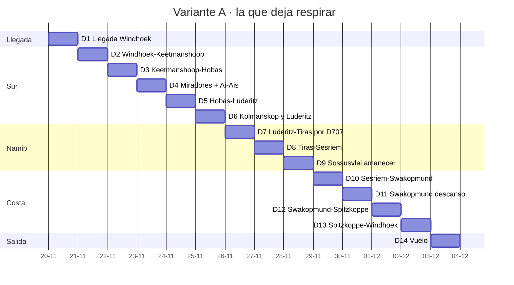
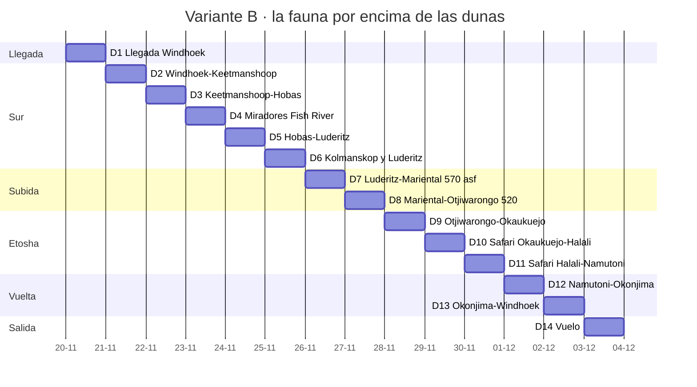
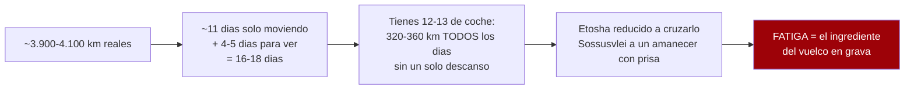
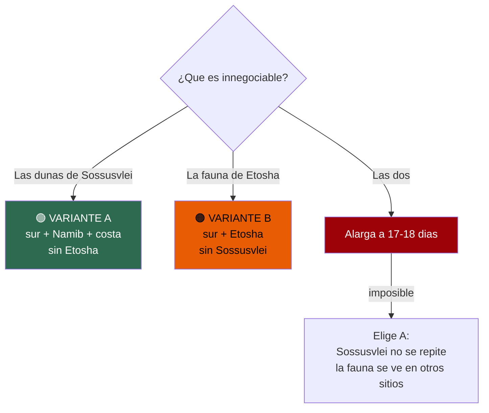

# Los tres itinerarios, día a día

Desarrollo completo de las variantes de `04-itinerario.md`. Finales de noviembre de 2026, **después
del precipicio de precio del 15/11**. Fechas ilustrativas: **llegada el viernes 20/11/2026**.

**~N$20 = €1** · **✅ verificado** · **◐ secundario** · **○ estimación propia**

> **Reglas aplicadas en todos:** grava a **80 km/h como techo** (media real 60–70) · asfalto ~105 ·
> **60 km/h en parques** · **llegar a las 18:00** (anochece ~19:15) · **nunca de noche**.
> Ver `04` y `05`.

---

## 🟢 VARIANTE A — Sur + Namib + costa · SIN Etosha
### La recomendada

**~2.400 km · 12 días de coche · ningún día pasa de ~300 km de grava**

### D1 · vie 20 — Llegada a Windhoek
- Aterrizas, recoges el 4x4. **Briefing 1–2 h**: que te enseñen **físicamente** gato, llave, **las
  dos ruedas de repuesto**, compresor y herramientas (`05`).
- **Pide la presión en frío para TU vehículo cargado y apúntala.** No la de un foro.
- Saca **efectivo** (~N$6.000–8.000) y compra la **SIM de MTC** *(el kiosco del aeropuerto cierra
  ~21:00)*. Registro obligatorio **con pasaporte** (`07`).
- 🍺 **Joe's Beerhouse** — tu pin. N$200–400 (~€10–20).
- 🛏️ **Windhoek.** ⚠️ **No salgas hoy hacia el sur**: 500 km + briefing = llegas de noche.

### D2 · sáb 21 — Windhoek → Keetmanshoop · **500 km asfalto · 5h30–6h** ✅
- B1 todo el camino. Combustible en Rehoboth, Kalkrand, **Mariental** (come aquí).
- ⚠️ **Ganado y kudú sueltos en los arcenes de la B1 al atardecer** — sal temprano.
- 🌅 **Bosque de kokerbooms al atardecer** — 14 km por la M29, grava buena, 12–15 min. **La luz de
  mediodía lo mata; la del atardecer es el motivo de ir.** ~250 ejemplares.
- 🛏️ **Quivertree Forest Rest Camp** ⚠️ *precio sin verificar*

### D3 · dom 22 — Keetmanshoop → Hobas · **150–160 km · 2h20–2h30** ✅
- B4 (~40 km asfalto) → **C12** (~80 grava) → C37/D601 (~30 grava).
- 🛑 **Vas al borde ESTE.** El aviso de *"no tomes la C12"* que circula es para el **Lodge del borde
  oeste**. **No hay puente entre los dos bordes.** Para Hobas y los miradores: **C12 es correcta**.
- 🛑 **Evita la D462** (lechos de arena profunda). Valora ir por la **presa de Naute** en vez del
  desvío de Seeheim, que puede cortarse con lluvia — y **finales de noviembre ya es inicio de lluvias
  en el sur**.
- ⛽ **Reposta a tope en Keetmanshoop**: en Hobas no hay gasolinera fiable.
- 🎫 **Tasa de parque Ai-Ais/Fish River: ~N$620 (~€31)** la pareja + coche, **por cada 24 h**.
- 🛏️ **Camping Hobas — N$480/persona → N$960 (~€48)** ✅

### D4 · lun 23 — Miradores + Ai-Ais · **~150 km · día de media jornada de coche** ✅
- 🌅 **Amanecer en el Main Viewpoint (Hell's Bend)** — 10 km de Hobas, pista de borde mala
  (*"a horrible dirt road"*), 15–20 min a 40–50 reales.
- Bloque de miradores: **3–4 h**. El cañón: 160 km de largo, 27 de ancho, 550 m de profundidad.
- Tarde: **Ai-Ais** — 68 km, grava bacheada (D324+C10), **1h10–1h20**, con descenso al final.
  ⚠️ **Ai-Ais está en el fondo del cañón: es sistemáticamente más caluroso que el borde** (`08`).
- ❌ **El sendero está CERRADO** (temporada may–sep, y exige mínimo 3 personas). Hoy es mirador.
- 🛏️ **Hobas** o **Ai-Ais** ⚠️ *precio Ai-Ais sin verificar*

### D5 · mar 24 — Hobas → Lüderitz · **410–430 km · 5h45–6h15** ✅
- ~120 km de grava saliendo (D601/C37+C12) + **~293 km de asfalto B4** vía Goageb y Aus.
- 🐎 **Parada obligada: los caballos salvajes del Namib en Garub**, cerca de Aus.
- ⛽ Reposta en **Goageb o Aus**.
- ⚠️ Viento lateral fuerte cerca de la costa.
- 🛏️ **Lüderitz** ⚠️ *Nest Hotel sin precio verificado*

### D6 · mié 25 — Kolmanskop y Lüderitz · **~20 km** ✅
- 🌅 **Kolmanskop con permiso de fotógrafo: N$480/persona (~€24)** → **de amanecer a atardecer**.
  El ticket normal (N$230, ~€11,50) **te encierra en la franja del tour = luz dura de mediodía**,
  justo la que no quieres para las habitaciones llenas de arena.
  ⚠️ **Cómpralo la víspera en Lüderitz** (Desert Deli, esquina Bahnhof/Moltke): una fuente dice que
  no se vende en la puerta el mismo día.
  Horarios: L–V 08:00–15:00 · S/D/festivos 08:00–13:00.
- 10 km de asfalto (B4). Día tranquilo — **el único de descanso del sur**.
- ❌ **Elizabeth Bay**: son **N$3.630/persona (~€181)** con mínimo 4 y **permiso policial 6–10 días
  antes con copia de pasaporte**. **16 veces el precio de Kolmanskop.** Si lo quieres, **se cierra
  desde España**, no se improvisa.
- 🛏️ **Lüderitz**

### D7 · jue 26 — Lüderitz → Tiras/Namtib por la D707 · **~250 km** ◐
- B4 hasta Aus (125 km asfalto) → C13 sur → **D707**.
- 🏆 **La D707: 123 km de grava**, considerada **la carretera más bonita de Namibia**. Dunas del
  Namib a un lado, montañas Tiras al otro.
- ⚠️ **Es grava exigente**: arena blanda, corrugado, piedras. **4x4 obligatorio.**
- ✅ **NO la confundas con la D3707**: la que anula tu seguro de bajos y rescate es la **D3707/D3703
  en Kaokoland/Damaraland** (`05`), **no** la D707.
- **Partir aquí es lo que salva la variante A**: convierte la etapa asesina de 8 h en dos de ~4 h.
- 🛏️ **Zona Tiras / Namtib** ⚠️ *precio sin verificar*

### D8 · vie 27 — Tiras → Sesriem · **~240 km grava** ◐
- Resto de la D707 → C27 norte → Sesriem.
- ⛽ **Reposta donde puedas**: este tramo es de los vacíos.
- 🎫 **Tasa Namib-Naukluft: ~N$620 (~€31)** la pareja + coche.
- 🛏️ **🔑 DUERME DENTRO DE LA PUERTA — Sesriem Campsite, N$670/persona → N$1.340 (~€67)** ✅
  > **Es la única forma de ver el amanecer en Deadvlei.** La puerta interior abre **1 h antes del
  > amanecer solo si duermes dentro**; la exterior abre **al amanecer**, y son **60 km + arena** hasta
  > allí. Dormir fuera = **no llegas** (`05`).
  > ⚠️ **Solo 44 parcelas + 6 de desbordamiento.** Reserva **ya**.

### D9 · sáb 28 — Sossusvlei y Deadvlei · **130 km · día completo 6–8 h** ✅
- 🌅 **Sal con la puerta interior, 1 h antes del amanecer.**
- 60 km de asfalto **de parque: límite 60 km/h**, con órix, avestruces y springbok.
- **Duna 45** de camino *(Google la lista como "cerrada permanentemente": es un fallo del listado)*.
- Últimos **~5 km de arena blanda**: **4H ANTES de entrar**, desinfla **en el aparcamiento 2WD, no
  antes**, métete en las roderas, no pares en subida. **Reinfla en Sesriem** (`05`).
  O usa la **lanzadera de NWR: N$180/persona (~€9)**.
- Tarde: **Sesriem Canyon** (está en la entrada, incluido).
- 🛏️ **Sesriem** *(segunda noche)*

### D10 · dom 29 — Sesriem → Swakopmund · **345 km · 🔴 91 % grava · 6h50–7h** ✅
- **La etapa más grava del viaje.** C19/D826 → **C14**: pasos de **Gaub** y **Kuiseb**, Trópico de
  Capricornio, Walvis Bay.
- ⛽ **REPOSTA EN SOLITAIRE, SÍ O SÍ** (83 km, 1h15). **Después son 210 km sin NADA** hasta Walvis
  Bay (`07`). *(Y la tarta de manzana.)*
- ⚠️ **Solitaire → Kuiseb (~90 km) es el tramo malo**: media real ~55 km/h.
- **Sal al alba.** Es el día más largo de A.
- 🛏️ **Swakopmund** ⚠️ *precio sin verificar*

### D11 · lun 30 — Swakopmund y Walvis Bay · **~70 km** ✅
- **El día de descanso.** Swakopmund → Walvis Bay son 30–35 km de asfalto, 30–35 min.
- **Pelícanos y flamencos** en la laguna de Walvis Bay.
- 🚫 **Sandwich Harbour: prohibido por contrato** (*"strictly prohibited"*, anula la cobertura
  entera). **Si lo quieres, tour guiado** — no con tu coche.
- Ciudad alemana, café, ostras. **Aprovecha: es el único respiro real.**
- 🛏️ **Swakopmund**

### D12 · mar 1 dic — Swakopmund → Spitzkoppe · **140–150 km · ~1h45** ◐
- B2 asfalto hasta el desvío + ~29 km de grava.
- 🏔️ **El "Matterhorn de Namibia"**. Granito, arcos, pinturas rupestres.
- 🌌 **Cielo oscuro espectacular** — es de los mejores sitios del viaje para estrellas.
- Día corto: **llegas con luz de sobra para la tarde de fotos**.
- 🛏️ **Spitzkoppe Community Campsite** ⚠️ *precio sin verificar*

### D13 · mié 2 dic — Spitzkoppe → Windhoek · **~280 km asfalto** ◐
- Vuelta cómoda por Usakos y Karibib.
- 🛏️ **Windhoek** — última noche, entrega el coche mañana o esta tarde.

### D14 · jue 3 dic — Vuelo
- ⚠️ **Gasta o cambia los N$ ANTES de volar**: el **NAD no vale nada fuera de Namibia** (`07`).

### 💰 Coste orientativo de A
- **Alquiler 13 días + Super Cover: ~€1.846 (~N$36.920)** ✅
- **Tasas de parque**: Fish River (2 días) + Namib-Naukluft (2 días) ≈ **N$2.480 (~€124)** ◐
- **Camping NWR verificado**: Hobas N$960 + Sesriem N$1.340×2 = **N$3.640 (~€182)** ✅
- **Kolmanskop foto**: N$960 la pareja (~€48) ✅
- **Combustible ~2.400 km**: ~280 l × ~N$26 ≈ **N$7.280 (~€364)** ○
- **Visado**: N$3.200 (~€160) ✅
- **Resto** (noches sin verificar, comida, actividades) → ver `10-presupuesto.md`

---

## 🟠 VARIANTE B — Sur + Etosha · SIN Sossusvlei
### Si la fauna manda

**~3.000 km · dos traslados de asfalto de 550–570 km**

**D1–D6: idénticos a la variante A.**

### D7 · jue 26 — Lüderitz → Mariental · **~570 km asfalto** ○
- B4 hasta Keetmanshoop (334 km ✅) → B1 norte hasta Mariental (~230 km ✅).
- **Todo asfalto**: largo pero **seguro**. Sal al alba.
- 🛏️ **Bagatelle Kalahari Game Ranch** — tu pin, zona de Mariental ⚠️ *precio sin verificar*.
  Dunas rojas del Kalahari: **compensa parte de lo que pierdes en Sossusvlei**.

### D8 · vie 27 — Mariental → Otjiwarongo · **~520 km asfalto** ○
- B1 por Windhoek. **Todo asfalto.**
- 🐆 **Okonjima / AfriCat** está en este eje ⚠️ *precio sin verificar* — leopardos y guepardos.
- 🛏️ **Otjiwarongo** *(o Okonjima si el precio encaja)*

### D9 · sáb 28 — Otjiwarongo → Okaukuejo · **~195 km** ✅
- Otjiwarongo → Outjo 75 km → puerta de **Andersson** 120 km → **Okaukuejo 17–18 km**.
- ⏱️ **Trámite de puerta y pago: 20–30 min.**
- 🎫 **Tasa Etosha: ~N$620 (~€31)** la pareja + coche, **por cada 24 h** — **3 días = 3 veces**.
- 🌅 Tarde: **charca iluminada de Okaukuejo** — la famosa. **Rinocerontes**.
- 🛏️ **Camping Okaukuejo — N$460/persona → N$920 (~€46)** ✅
  *(o chalet del charco N$4.760 (~€238) — el mejor sitio del parque para ver rinoceronte de noche)*

### D10 · dom 29 — Safari Okaukuejo → Halali · **70 km nominales… 🚧 ~90 km reales** ✅
- 🚧 **OBRAS 2026**: el tramo va por **pistas de desvío de ~90 km a 30–35 km/h** con maquinaria
  pesada. **Lo que serían 1h45 se convierte en ~3 h.** ⚠️ **Confírmalo con NWR al reservar.**
- Charcas del camino. **Límite 60 km/h** y vas parando.
- 🛏️ **Camping Halali — N$920 (~€46)** ✅ *(o doble N$2.800 / ~€140 — la más barata del parque)*

### D11 · lun 30 — Safari Halali → Namutoni · **70 km · 1h45+** ✅
- Charcas **Goas, Nuamses, Springbokfontein, Batia, Chudop** — *son el motivo de la etapa*.
- 🛏️ **Camping Namutoni — N$920 (~€46)** ✅ *(o doble N$3.680 / ~€184)*

### D12 · mar 1 dic — Namutoni → Okonjima/Otjiwarongo · **~350 km** ○
- Salida por **Von Lindequist** (14 km, ~30 min — la más rápida hacia el este).
- 🥩 **LÍNEA ROJA**: **no bajes carne cruda** al salir de Etosha hacia el sur. Cómela o cocínala
  antes. **Saltarse un control veterinario es delito** (`07`).
- 🛏️ **Okonjima** o **Waterberg** ⚠️ *precios sin verificar*

### D13 · mié 2 dic — → Windhoek · **~250 km asfalto**
### D14 · jue 3 dic — Vuelo

### ⚠️ Lo que pierdes con B
**Sossusvlei y Deadvlei** — para mucha gente, **el motivo entero de venir a Namibia**. También
Swakopmund, la costa y todo el Damaraland.

> 👉 **Pregúntatelo en serio antes de elegir B.** Y ojo al dato de `08`: **en Etosha, noviembre
> (37,1 °C) es algo más fresco que octubre (38,0)** — vas en buen momento para el norte.

---

## 🔴 VARIANTE C — Todo comprimido
### Aquí por honestidad, no como recomendación

**No la desarrollo día a día a propósito.** La aritmética ya la mata:

- **~3.200 km de puro tránsito** + vueltas en parques = **~3.900–4.100 km reales**
- A un techo sano de **~300 km/día**: **~11 días solo moviéndose**
- Más **4–5 días quietos** para *ver* (amanecer en Deadvlei, Kolmanskop, 2 días de safari, miradores)
- **Total mínimo realista: ~16 días.** Tienes **14**, con **12–13 útiles de coche**.

La guía de operadores dice *«no further than 400 km per day»* y, mejor, *«aim to drive no more than
4 to 6 hours per day»*. **C vive pegada al techo todos los días.**

> **El coste real no es el dinero: es la fatiga.** Y en grava, la fatiga es el ingrediente del
> vuelco — que es el **37 % de los muertos de Namibia con el 4,6 % de los accidentes**, concentrado
> justo en Hardap y !Karas, que son **tus** regiones (`05`).
>
> ❌ **Si quieres las dos coronas, la respuesta honesta no es apretar C: es alargar a 17–18 días.**

---

## 🧭 Cómo elegir

**Mi lectura honesta:** si tuviera que elegir por ti, **A**. Razón: **Sossusvlei y Deadvlei no
tienen sustituto en ningún otro sitio del mundo**, mientras que la fauna africana sí se ve en otros
parques y en otros viajes. Además A es la única que **deja margen**, y el margen es lo que te protege
del riesgo real de este viaje, que no es perderte algo: es la fatiga en grava.

**Pero la decisión es tuya, y B es perfectamente defendible** si lo que os mueve es la fauna.

---

## 🕳️ Lo que falta para cerrar cualquiera de los tres

- ❌ **Vuelos** para tus fechas — sin tarifa verificada tras varios intentos
- ❌ **Lodges privados** por noche — sin precios (Gondwana bloqueó el acceso)
- ⚠️ **Seis etapas** con km sin verificar (`04`)
- 🚧 **Las obras de Etosha** — confirmar con NWR *(solo afecta a B)*
- ⚠️ **Conflicto Keetmanshoop → Hobas**: 150–160 km vs ~275 derivados. **Sin resolver.**
