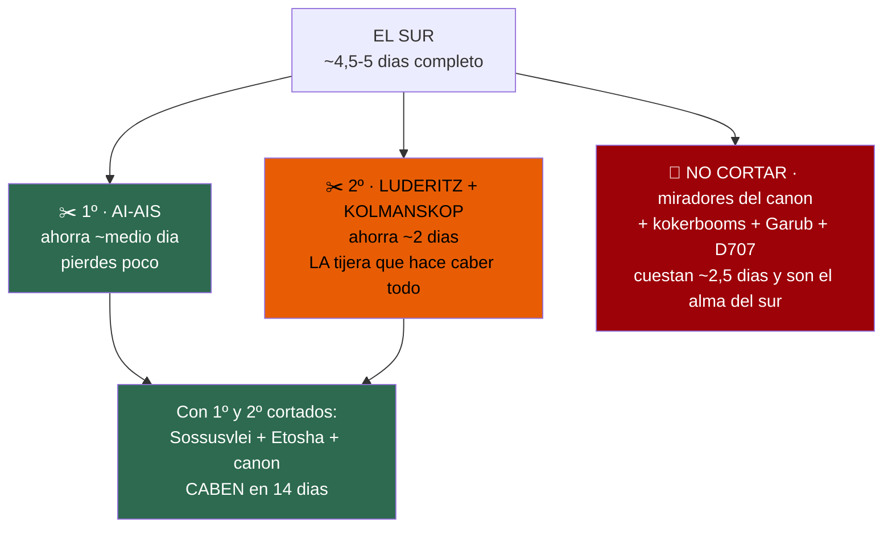
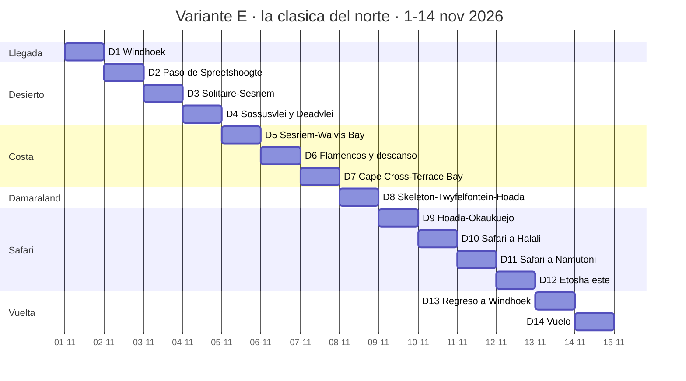
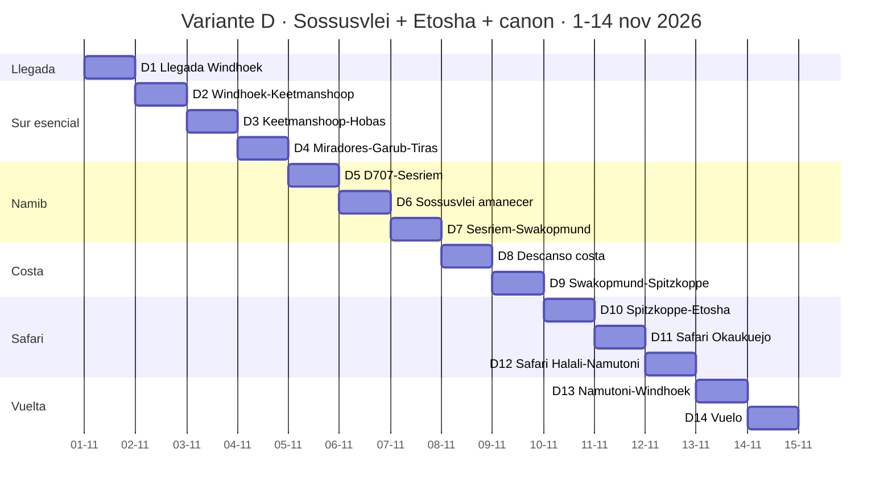
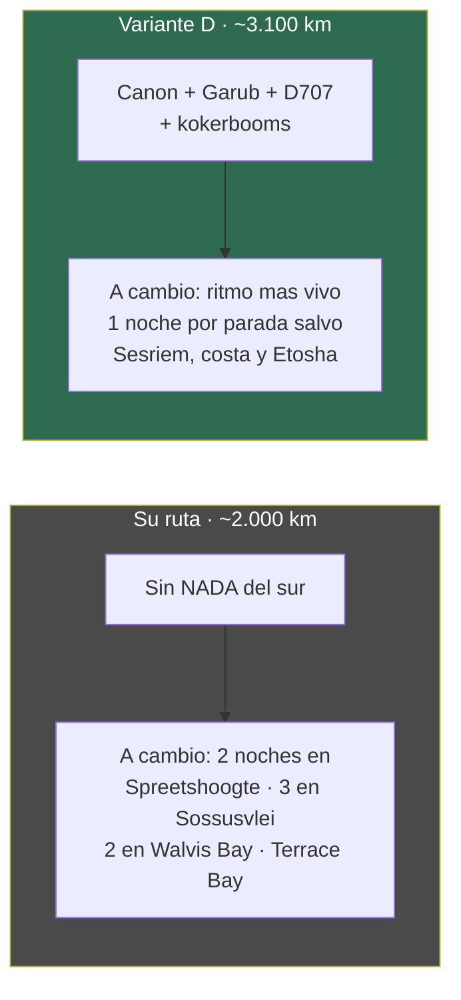
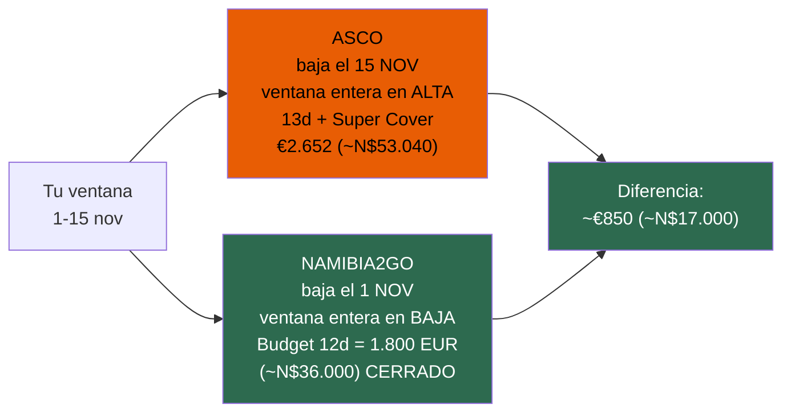
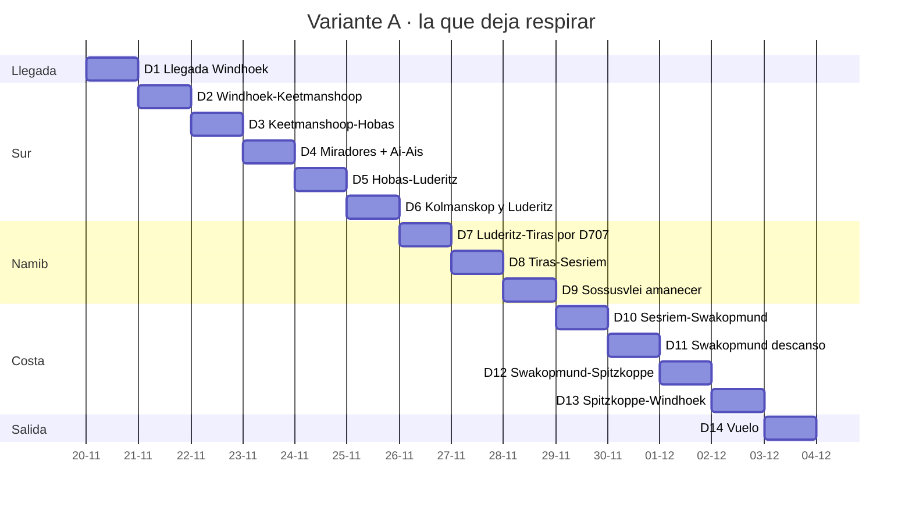
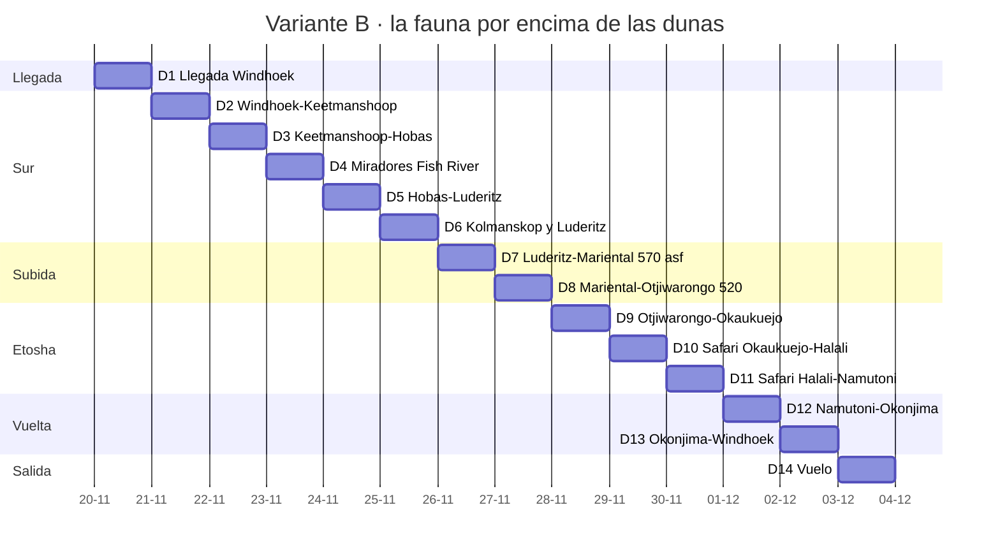
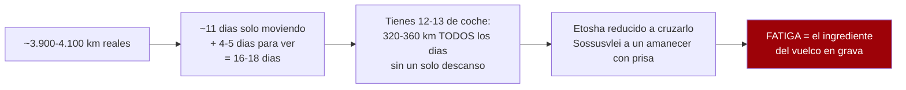
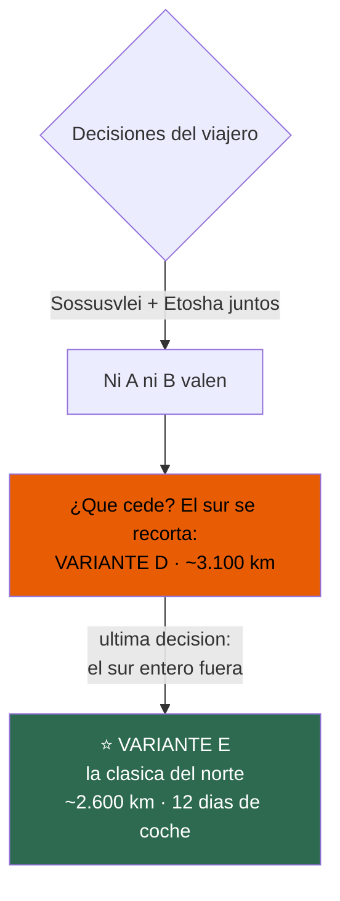

# Los itinerarios, día a día

> ## 🔄 ACTUALIZACIÓN FINAL 17/07/2026 — la ruta es la VARIANTE E
>
> Decisiones del viajero, en orden:
> 1. **Fechas: primera quincena de noviembre** (adelantable unos días a finales de octubre).
> 2. **Sossusvlei y Etosha van los dos** en el mismo viaje.
> 3. **El sur se quita entero** — tras comparar con el itinerario de
>    [lugaresincertos.com](https://www.lugaresincertos.com/en/travel-inspiration/two-week-trip-to-namibia/),
>    la ruta pasa a ser **la clásica del norte a ritmo lento**, como la del blog pero con nuestros
>    datos verificados: es la **VARIANTE E**, aquí abajo. D, A y B quedan como referencia.

---

<div align="center">

## ❓ ¿Qué se puede quitar del sur? — la tijera, ordenada

</div>

Con Sossusvlei y Etosha fijos, el sur es lo que compite por los días. Esto es lo que cuesta y lo que
vale cada pieza:


```mermaid
flowchart TD
    S["EL SUR<br/>~4,5-5 dias completo"] --> A1["✂️ 1º · AI-AIS<br/>ahorra ~medio dia<br/>pierdes poco"]
    S --> A2["✂️ 2º · LUDERITZ + KOLMANSKOP<br/>ahorra ~2 dias<br/>LA tijera que hace caber todo"]
    S --> A3["🚫 NO CORTAR · miradores del canon<br/>+ kokerbooms + Garub + D707<br/>cuestan ~2,5 dias y son el alma del sur"]
    A1 --> R["Con 1º y 2º cortados:<br/>Sossusvlei + Etosha + canon<br/>CABEN en 14 dias"]
    A2 --> R
    style A1 fill:#2d6a4f,color:#fff
    style A2 fill:#e85d04,color:#000
    style A3 fill:#9d0208,color:#fff
    style R fill:#2d6a4f,color:#fff
```

**✂️ Primera tijera — Ai-Ais** *(ahorra ~½ día, pierdes casi nada)*
Son las fuentes termales del **fondo** del cañón: 68 km de grava bacheada por trayecto, hace más
calor que en el borde (está cientos de metros más abajo), y el sendero está cerrado en noviembre de
todas formas. **Los miradores —que son el espectáculo— están arriba, en Hobas.**

**✂️ Segunda tijera — Lüderitz y Kolmanskop** *(ahorra ~2 días; es la que decide)*
Lüderitz es un **fondo de saco**: 334 km al oeste por la B4 que hay que deshacer o pagar con la
etapa más dura del viaje. Kolmanskop merece un día entero para hacerlo bien (el permiso de fotógrafo
es de amanecer a atardecer). Juntos cuestan **~2 días** que son exactamente los que necesita Etosha.
*(Elizabeth Bay cae sola con ellos — era un capricho de N$3.630/persona con permiso a 10 días.)*
**Es la pérdida dolorosa**: la ciudad fantasma es única. Pero es la única tijera que cierra el
círculo.

**🚫 Lo que NO hay que cortar** *(porque cuesta poco y es el alma del sur)*
- **Los miradores del Fish River** — el motivo del sur, ~2,5 días desde el eje
- **El bosque de kokerbooms** — 14 km de Keetmanshoop, sale gratis
- **Los caballos de Garub** — pequeño desvío desde Aus, de camino
- **La D707** — no es desvío, ES la carretera hacia Sesriem

> ### Nota histórica: este análisis produjo la Variante D…
> …y después el viajero decidió **quitar el sur entero** (decisión final, 17/07). La tijera queda
> documentada porque explica los números; la ruta vigente es la **Variante E** de abajo.

---

Desarrollo completo de las variantes. **Ventana real: primera quincena de noviembre de 2026.**

**~N$20 = €1** · **✅ verificado** · **◐ secundario** · **○ estimación propia**

> **Reglas aplicadas en todos:** grava a **80 km/h como techo** (media real 60–70) · asfalto ~105 ·
> **60 km/h en parques** · **llegar a las 18:00** (en tu quincena anochece entre las 19:04 y las
> 19:20 según día y lugar — cálculo ☀️, ver la Variante E) · **nunca de noche**. Ver `04` y `05`.
> 🧮 **El cálculo de tiempos de la E, día a día y con la aritmética a la vista, está en `04` §0-bis.**

---

<div align="center">

## ⭐ VARIANTE E — La clásica del norte, a ritmo lento
### LA RUTA DEL VIAJE · como la del blog, con nuestros datos

</div>

**~2.600 km · 12 días de coche contratados (1–13 nov) · ningún día por encima de ~390 km · dos
noches en Sesriem, dos en la costa y CUATRO en Etosha · fechas reales del vuelo: llegada el domingo
1 de noviembre de 2026, vuelta el sábado 14**

> ### 📅 El 1 de noviembre sigue siendo la fecha mágica
> **NWR entra en tramo barato** (Sesriem, Halali, Okaukuejo, Terrace Bay) y **Namibia2Go entra en
> SU temporada baja**: el coche está **cerrado — Budget, €1.800 (~N$36.000) por 12 días, disponible**
> *(la estimación previa de ~€1.755 quedó a un 2,5 % del precio real)*. **Adelantar hasta 2 días a
> octubre es gratis** (Windhoek y Spreetshoogte no son NWR).

> ### ❓ ¿Etosha al principio o al final? → **AL FINAL.** Tres razones con datos:
> 1. **Dinero**: con el desierto primero, si adelantáis la salida a octubre, **todas las noches NWR
>    caen después del 1 de noviembre** (tarifa baja). Etosha primero + salida en octubre = tarifa
>    vieja **y** el pico de calor del parque (38,0 °C de media de máximas en octubre).
> 2. **Termómetro**: Etosha se enfría según avanza noviembre (38,0 oct → 37,1 media nov).
> 3. **Rodaje y crescendo**: asfalto y grava fácil primero; el safari como clímax, no aperitivo.
>
> *El contra, honesto: el riesgo de primeras tormentas sube mínimamente hacia el día 15 (en 2 de 5
> temporadas cayó algún chubasco suelto en la primera quincena — aislado, no la temporada
> asentada). Marginal frente a lo anterior.*


```mermaid
gantt
    title Variante E · la clasica del norte · 1-14 nov 2026
    dateFormat YYYY-MM-DD
    axisFormat %d-%m
    section Llegada
    D1 Windhoek                    :e1, 2026-11-01, 1d
    section Desierto
    D2 Paso de Spreetshoogte       :e2, after e1, 1d
    D3 Solitaire-Sesriem           :e3, after e2, 1d
    D4 Sossusvlei y Deadvlei       :e4, after e3, 1d
    section Costa
    D5 Sesriem-Walvis Bay          :e5, after e4, 1d
    D6 Flamencos y descanso        :e6, after e5, 1d
    D7 Cape Cross-Terrace Bay      :e7, after e6, 1d
    section Damaraland
    D8 Skeleton-Twyfelfontein-Hoada :e8, after e7, 1d
    section Safari
    D9 Hoada-Okaukuejo             :e9, after e8, 1d
    D10 Safari a Halali            :e10, after e9, 1d
    D11 Safari a Namutoni          :e11, after e10, 1d
    D12 Etosha este                :e12, after e11, 1d
    section Vuelta
    D13 Regreso a Windhoek         :e13, after e12, 1d
    D14 Vuelo                      :e14, after e13, 1d
```

> ### ☀️ El sol de tu viaje *(cálculo astronómico NOAA, hora local UTC+2, coordenadas aproximadas — margen ±5 min; cuadra con el ~19:15 de fin de noviembre que da NWR ◐)*
> Cada día lleva abajo su amanecer y anochecer. El patrón que importa: **en Etosha anochece antes
> (~19:05, está al este) y en la costa después (~19:20)** — la regla de «en el campamento a las
> 18:00» vale igual en toda la ruta.

> ### 🌡️ Y la temperatura donde duermes — medias de NOVIEMBRE
> Cada noche lleva su **máxima media / mínima media** del mes. **Son medias mensuales, no la
> previsión de tu día**: el récord de noviembre en el sur llega a 41–42 °C (`08`).
> **Regla de fuentes de este repo:** las webs de safaris fueron **refutadas 0–3** (`08`), así que
> aquí solo hay estación o secundaria que cite estación — **y donde no la hay, dice «sin dato»**.
>
> ```mermaid
> flowchart TD
>     T["<b>Noviembre donde duermes · media de máxima / mínima, en °C</b>"]
>     n0["Walvis Bay · la costa<br/>████████████ <b>25,0</b> día / <b>12,7</b> noche"]
>     n1["Windhoek<br/>███████████████ <b>31,2</b> día / <b>16,3</b> noche"]
>     n2["Sesriem · el desierto<br/>████████████████ <b>32,5</b> día / <b>15,5</b> noche"]
>     n3["Okaukuejo · Etosha<br/>██████████████████ <b>37,1</b> día / <b>18,9</b> noche"]
>     T ~~~ n0
>     n0 ~~~ n1
>     n1 ~~~ n2
>     n2 ~~~ n3
>     style T fill:#7a3a22,color:#fff,stroke:#7a3a22
>     style n0 fill:#2d6a4f,color:#fff,stroke:#2d6a4f
>     style n3 fill:#9d0208,color:#fff,stroke:#9d0208
> ```
>
> **El viaje entero cabe en una frase: la costa fresca (25 °C), el desierto y la meseta calurosos
> (31–33 °C) y Etosha duro (37 °C) — y TODAS las noches entre 12 y 19 °C.** Por eso el equipaje
> lleva forro polar y no plumas (`14`).

### D1 · dom 1 nov — Llegada a Windhoek
- 🌡️ **Windhoek, medias de noviembre: 31,2 °C máx / 16,3 °C mín** ✅ *(NOAA GHCN, estación 68110,
  1.700 m, serie 1957–2025; ver `08`)* — cálido de día, pero a 1.700 m **refresca de noche**
- ☀️ amanecer **06:07** · anochecer **19:04**
- ⚠️ **Es domingo: las bottle stores y las secciones de alcohol cierran por ley** (ver `03`) — la
  compra de cervezas para el braai espera al lunes
- 4x4 + briefing (1–2 h): **presiones en frío apuntadas, las DOS ruedas de repuesto, gato y
  compresor a la vista** antes de salir del patio (`05`)
- Efectivo (~N$6.000–8.000) · **SIM de MTC** con pasaporte *(el kiosco cierra ~21:00)*
- 🍺 **Joe's Beerhouse** · 🛏️ Windhoek

### D2 · lun 2 — Windhoek → paso de Spreetshoogte · **~180–200 km · ~3h–3h30** ◐
- 🌡️ **Spreetshoogte: sin dato de estación.** El proxy razonable es **Windhoek (31,2/16,3 ✅)**:
  misma altitud (~1.700 m) en el borde de la escarpa. Arriba corre viento y refresca al caer el
  sol ○
- ☀️ amanecer **06:09** · anochecer **19:10** — *el atardecer en el paso es el plan del día: en
  posición hacia las 18:40*
- B1 a Rehoboth (87 asfalto) → C24 → D1261 → **D1275: el paso**. ⚠️ **Muy empinado**, tramos de
  hormigón para tracción, prohibido a caravanas — se baja despacio y es espectacular
- 🌇 **Atardecer desde el mirador del paso**: el Namib a 1.000 m bajo tus pies
- 🛏️ **Spreetshoogte Campsite** ⚠️ *precio sin verificar (el blog citaba 150–300 ZAR/persona,
  vigencia desconocida)*

### D3 · mar 3 — Spreetshoogte → Solitaire → Sesriem · **~150–170 km · ~2h30–3h** ◐
- 🌡️ **Sesriem, media de máximas de noviembre: ~32,5 °C** ◐ *(reanálisis ERA5, celda a 4 km de la
  puerta; con el sesgo frío del interior la real ronda **33–34 °C**, que es justo el 34,1 ◐ de NWR —
  dos fuentes independientes, mismo entorno; ver `08` §ERA5)*. Mínima **~15,5 °C** ◐ (NWR)
- ☀️ amanecer **06:09** · anochecer **19:12** — *la puerta exterior de Sesriem funciona de
  amanecer a ocaso: dentro antes de ~19:10*
- Bajada del paso → C14 → 🥧 **Solitaire** (tarta + depósito lleno) → D826/C19 a Sesriem
- Tarde: **Sesriem Canyon** y atardecer en **Elim Dune** *(o el guiado de NWR, N$300/persona)*
- 🎫 Namib-Naukluft ~N$620/24 h
- 🛏️ **🔑 DENTRO de la puerta: Sesriem Campsite — N$1.340 (~€67)** ✅ *(44 parcelas: reservar YA)*

### D4 · mié 4 — Sossusvlei y Deadvlei · **130 km · día completo** ✅
- 🌡️ **Sesriem ~32,5–34 / 15,5 ◐** — y en la duna, a mediodía, la arena está muy por encima de eso:
  **Big Daddy se sube al amanecer o no se sube** ○
- ☀️ amanecer **06:10** (Deadvlei) · anochecer **19:16** — **la puerta interior abre 1 h antes del
  amanecer: ~05:10.** Son ~60 km de asfalto + arena hasta el aparcamiento: saliendo al abrirse,
  llegas con la duna encendiéndose *(horas de puerta: confírmalas en recepción al llegar, se
  mueven con el orto real — ver `05`)*
- 🌅 **Puerta interior 1 h antes del amanecer** — Deadvlei casi en solitario
- Con día entero: **Big Daddy** (la subida) + **Hidden Vlei** + **Duna 45** a la vuelta
- Arena final: 4H antes de entrar, desinflar en el 2WD, reinflar en Sesriem *(o lanzadera
  N$180/persona)*
- 🛏️ Sesriem, segunda noche

### D5 · jue 5 — Sesriem → Walvis Bay · **~270 km · ~5h30** ✅
- 🌡️ **Walvis Bay, medias de noviembre: 25,0 °C máx / 12,7 °C mín** ✅ *(NOAA GHCN, estación del
  aeropuerto WMO 68098, serie 1990–2025; ver `08`)* — **la costa es el respiro térmico del viaje**:
  la corriente de Benguela. Pero ojo a la madrugada: **12–14 °C**, y viento. Cortavientos a mano
- ☀️ amanecer **06:15** · anochecer **19:17** (Walvis Bay)
- C14 por los pasos de **Gaub y Kuiseb** + Trópico de Capricornio
- ⛽ **Solitaire otra vez, sí o sí** — después, **210 km sin nada**
- 🛏️ **Walvis Bay** ⚠️ *precio sin verificar (el blog usó Lagoon Chalets)*

### D6 · vie 6 — Walvis Bay: flamencos y descanso ✅
- 🌡️ **Walvis Bay 25,0 / 12,7** ✅ — el día fresco del viaje: aprovecha para el Welwitschia Drive
- ☀️ amanecer **06:14** · anochecer **19:17** — *flamencos con la primera luz, ~06:15–07:30*
- 🦩 **Y tu mes es de los buenos**: en Walvis Bay los flamencos tienen su **máximo de junio a
  noviembre** ✅ *(SABAP1)*. Aquí sí los hay en cantidad — en Etosha, en cambio, **no**: la pan está
  seca en noviembre *(ver `15`)*
- 🦩 **Flamencos y pelícanos en la laguna** al amanecer y al atardecer — las mejores luces
- Día libre: paseo marítimo, ostras, o la excursión guiada a **Sandwich Harbour**
  *(🚫 con tu coche está prohibida por contrato — el tour es la forma correcta y mejor)*
- 🛏️ Walvis Bay, segunda noche

### D7 · sáb 7 — Cape Cross → Terrace Bay (Skeleton Coast) · **~390 km · día logístico** ✅
- 🌡️ **Terrace Bay: sin dato de estación** — no hay serie pública ni en Möwe Bay ni en Terrace
  Bay. Proxy honesto: **la costa ronda los 25,0 °C de Walvis Bay ✅**, 400 km más al sur — cuenta
  con **niebla, viento y menos calor que tierra adentro** ○
- ☀️ amanecer **06:18** (Cape Cross) · anochecer **19:20** (Terrace Bay) — *pero aquí el sol no es
  el límite: lo es la puerta de las 15:00*
- ⏰ **Salida temprana — este día tiene una hora límite.** C34 costera (sal compactada):
  Swakopmund → Henties Bay → 🦭 **Cape Cross** (miles de lobos marinos; pañuelo para el olor)
- 🛑 **Puerta de Ugabmund: última entrada 15:00.** Para pernoctar dentro hace falta **reserva
  confirmada de Terrace Bay** — sin ella no se entra (el permiso de tránsito obliga a salir el
  mismo día)
- Dentro del parque: **60 km/h** · 🎫 Skeleton Coast ~N$620/24 h
- 🛏️ **Terrace Bay Resort (NWR)** — dormir en la Costa de los Esqueletos, con la niebla y el
  Atlántico rugiendo. **Ojo: es un resort con media pensión (DBB), no un camping.** Suelo publicado
  (doméstico/SADC, temporada baja): **N$1.440–1.920/persona DBB (~€72–96)**; como extranjeros en
  noviembre, **más** ◐ — la noche más cara de la ruta *(tarifa internacional nov 2026 aún ❌; ver `08`)*
- *Variante fácil: saltarse Terrace Bay, dormir en Henties/Swakopmund y entrar a Damaraland al día
  siguiente por Springbokwasser en tránsito — un día mucho más corto*

### D8 · dom 8 — Skeleton Coast → Twyfelfontein → Hoada · **~300 km · ~5h** ◐
- 🌡️ **Hoada/Grootberg: sin dato de estación** *(ninguna de las 11 estaciones GHCN de Namibia cae
  cerca — ver `08`)*. Está entre la meseta (~31 °C) y el norte caluroso; Twyfelfontein, en el
  valle, es **notablemente más caluroso a mediodía** ○
- ☀️ amanecer **06:17** (Twyfelfontein) · anochecer **19:15** (Hoada) — *y es domingo otra vez:
  sin alcohol a la venta*
- Salida por **Springbokwasser** → C39 a Bergsig → **desvío opcional a Twyfelfontein**
  (grabados rupestres UNESCO; Google lo lista como cerrado: **es un fallo del listado**)
- ⚠️ **Damaraland: los bajos son el punto delicado del seguro** — la referencia de Asco los
  excluía aquí, y **cómo los trata el Premium Cover de tu Namibia2Go Budget sigue SIN confirmar:
  pregúntalo por escrito al reservar**. Despacio en las piedras.
- 🛏️ **Hoada Campsite** (zona Grootberg) — el blog lo llama su campamento más bonito del viaje:
  rocas de granito, duchas entre peñas, cielo estrellado. **N$271–366/persona según temporada
  (~€14–18 pp) → N$542–732/noche la pareja (~€27–37)** ◐ *(la temporada de noviembre sin fijar; ver `08`)*

### D9 · lun 9 — Hoada → Etosha (Okaukuejo) · **~315 km · ~4h** ◐
- 🌡️ **Okaukuejo, medias de noviembre: 37,1 °C máx / 18,9 °C mín** ✅ *(NOAA GHCN, serie completa
  1975–2022, recomputada en `08` en dos extracciones independientes)* — y **baja según avanza el
  mes**: 37,8 en octubre → 37,1 en noviembre → 35,6 en diciembre
- ☀️ amanecer **06:18** (Hoada) · anochecer **19:08** (Okaukuejo) — *las puertas de Etosha cierran
  al ocaso: pasa Andersson con margen de sobra*
- C40 a Kamanjab → C38 a la puerta de **Andersson** (asfalto desde Kamanjab... ⚠️ firme por
  confirmar) → **Okaukuejo a 17 km** de la puerta
- 🎫 Etosha ~N$620/24 h × 4 días · trámite de puerta 20–30 min · **60 km/h dentro**
- 🌙 **Noche en la charca iluminada de Okaukuejo** — rinocerontes negros
- 🛏️ **Camping Okaukuejo — N$920 (~€46)** ✅ · *capricho: chalet del charco N$4.760 (~€238)*

### D10 · mar 10 — Safari Okaukuejo → Halali · **~90 km de safari lento** ✅
- 🌡️ **Etosha, medias de noviembre: 37,1 °C máx / 18,9 °C mín** ✅ *(GHCN Okaukuejo, la estación
  del parque)* — la cifra más alta del viaje. **A mediodía no se hace safari: piscina** ○
- ☀️ amanecer **06:12** · anochecer **19:06** (Halali) — *dentro del campamento, del ocaso al
  amanecer: la charca iluminada ES el plan de la noche*
- 🚧 **Obras — el detalle, actualizado 03/08**: están **asfaltando la pista Okaukuejo–Halali–
  Namutoni**. En 2025 el MEFT desvió el tráfico **por la carretera de Gemsbokvlakte** y cerró la
  salida de Okaukuejo hacia Halali; en 2026 seguía habiendo bypass. Las charcas de **Nebrownii y
  Kapupuhedi quedaron inaccesibles** por la obra. ⚠️ **No hay nota oficial posterior a 2025:
  llama a NWR Okaukuejo (+264 67 229 800) antes de ir.**
- ✅ **Y el desvío no es un castigo**: pasa por **Gemsbokvlakte y luego Sueda–Salvadora–Charitsaub**,
  que es el mejor tramo de borde de pan para **guepardo y león**
- Charcas del camino · siesta en la piscina de Halali · charca de Halali al anochecer
- 🛏️ **Camping Halali — N$920 (~€46)** ✅

### D11 · mié 11 — Safari Halali → Namutoni · **~80 km de safari** ✅
- 🌡️ **Etosha 37,1 / 18,9 ✅** — la noche más cálida del viaje: casi 19 °C de mínima
- ☀️ amanecer **06:08** · anochecer **19:05** — *el safari bueno es 06:10–09:00 y 16:30–19:00;
  al mediodía, piscina y siesta*
- Charcas **Goas, Nuamses, Springbokfontein, Batia, Chudop** — el corazón del safari
- **Se duerme DENTRO, como todo Etosha en esta ruta**: sin horas de puerta, con la charca al lado
- 🛏️ **Camping Namutoni — N$920 (~€46)** ✅ *(el fuerte alemán, y Chudop a un paso)*
- *Capricho opcional: **Onguma** (tu pin, reserva privada justo al otro lado de la puerta de Von
  Lindequist) ⚠️ precio sin verificar; puede ser gama alta — a cambio pierdes estar dentro*

### D12 · jue 12 — Etosha este · **~60–80 km de safari** ✅
- 🌡️ **Etosha 37,1 / 18,9 ✅**
- ☀️ amanecer **06:08** · anochecer **19:05**
- **Fischer's Pan**, Chudop, Klein Namutoni — la esquina que casi nadie hace. *Ojo: Fischer's Pan
  es el mejor sitio de aves acuáticas del parque **cuando hay agua**, y en noviembre está seco —
  lo que va bien es Chudop (león fiable) y el **Dik-dik Drive** de Klein Namutoni* ◐
- 🛏️ **Namutoni, segunda noche — N$920 (~€46)** ✅

### D13 · vie 13 — Etosha → Windhoek · **~550 km asfalto · ~5h30–6h** ○
- 🌡️ De **Etosha (37,1 ✅)** a **Windhoek (31,2 ✅)**: el día de bajar 6 grados y 550 km
- ☀️ amanecer **06:08** (Namutoni) · anochecer **19:11** (Windhoek) — *la puerta de Von Lindequist
  abre al amanecer: saliendo a las 06:10 llegas a Windhoek con la tarde entera*
- Von Lindequist → Tsumeb → Otjiwarongo → B1 · salida al alba, comida en Otjiwarongo
- 🥩 **Línea Roja**: la carne cruda no baja del norte — el braai se come en Etosha
- 🛏️ Windhoek — **entrega del coche HOY**: el contrato de 12 días acaba el 13. *(Alternativa
  pendiente de decidir: añadir el día 13, ~€150 · ~N$3.000, y devolverlo el 14 camino del
  aeropuerto)*
- *Parada opcional de camino: **Okonjima/AfriCat** (leopardos) o el meteorito de **Hoba** (desvío
  por Grootfontein)*

### D14 · sáb 14 — Vuelo
- ☀️ amanecer **06:01** · *(despegue 14:30 — mañana tranquila)*
- 💱 **Gasta o cambia los N$ antes de embarcar**: fuera de Namibia no valen nada

### 💰 Coste real de E *(1–15 nov · el detalle completo, en `10-presupuesto.md`)*
- **Alquiler 12 días (1–13 nov)**: **Namibia2Go Budget €1.800 (~N$36.000)** ✅ **cerrado y
  disponible**, con Premium Insurance Cover (franquicia cero) y km ilimitados *(Asco, descartada:
  €2.652 en su banda alta)*
- **Noches NWR verificadas**: Sesriem 2×1.340 + Okaukuejo 920 + Halali 920 + Namutoni 2×920 =
  **N$6.360 (~€318)** ✅ — **las 4 noches de Etosha, dentro del parque**
  *(+ Terrace Bay, Spreetshoogte, Walvis, Hoada: sin verificar)*
- **Tasas de parque**: Namib 2 + Skeleton 1 + Etosha 4 = 7 unidades × N$620 ≈ **N$4.340 (~€217)** ◐
- **Combustible ~2.600 km**: ~310–340 l ≈ **N$8.000–9.200 (~€400–460)** ○
- **Visado**: N$3.200 (~€160) los dos ✅
- **Total tierra en camping ≈ ~€3.650 (~N$73.000)** la pareja ○, banda ~€3.350–3.950 — *ya sin
  rango de compañía: el coche es cifra cerrada. Sumando vuelos (€2.732) y seguro IATI Estrella
  (€226,04): **~€6.612 (~N$132.000) la pareja · ~€3.306 por persona** (ver `10`)*

### ⏰ Los horarios que mandan *(✅/◐ = con fuente en el dossier · ☀️ = cálculo astronómico ±5 min)*

- **Sesriem** ✅: puerta exterior de amanecer a ocaso; la interior, **1 h antes del amanecer y 1 h
  después del ocaso**. Para tus noches del 3–4 nov ☀️: interior **~05:10–20:10**, exterior
  **~06:10–19:10**. *Confírmalo en recepción al llegar: se mueve con el orto real (`05`).*
- **Skeleton Coast** ◐: para pernoctar en Terrace Bay hay que cruzar Ugabmund **antes de las
  15:00** y con **reserva confirmada** (`06`). Horarios de puerta: las fuentes bailan — NWR/foros
  daban 07:30–19:00; guías recientes, Ugab 07:30–15:00 y Springbokwasser 07:30–17:00 (`13`). **En
  la práctica manda el 15:00.**
- **Etosha** ✅ — **horarios oficiales de puerta**, de la tabla que publica el parque *(cambian cada
  semana siguiendo al sol, y están puestas en cada puerta)*: **3–9 nov: 06:13–19:06** ·
  **10–16 nov: 06:10–19:10**. Son **trece horas de parque al día**, casi dos más que en invierno.
  *(Cuadra al minuto con el cálculo astronómico de arriba.)* Dentro: **60 km/h**, **20 en los
  campamentos**, y **solo se puede bajar del coche dentro de los campamentos** — la única excepción
  es el *koppie* de dolomita de **Halali**, que sí se puede pasear. De noche te quedas dentro: la
  charca iluminada es el plan.
- **Kiosco SIM de MTC en el aeropuerto** ◐: cierra **~21:00** — aterrizas a las 13:20, de sobra.
- **Alcohol** ✅: bottle stores y secciones de licores **cierran domingos y festivos**. Tus
  domingos de viaje: **1 nov (el día que llegas) y 8 nov** — compra el sábado.
- **Otjitotongwe (guepardos)** ◐ — C40, a 24 km de Kamanjab, de camino el D9 (lunes):
  alimentación **~15:00**; si no te alojas, avisa antes. *(Una fuente dice que cierra los fines
  de semana — tu paso es lunes.)*
- **Gasolinera en Etosha** ✅⚠️: los tres campamentos **listan «Filling Station» en la web oficial
  de NWR**, pero con historial de cortes en 2025 — entra lleno desde Outjo; respaldo: la Etosha
  Trading Post a 6,5 km de Andersson (`13`).
- **❌ Sin verificar — pídelo al reservar con NWR:** horarios de desayuno/restaurante de los
  campamentos (importa para salir al alba: pide desayuno para llevar o hazlo tú) y el horario de
  Joe's Beerhouse.

### 🦁 En los parques: ¿tu 4x4 o el vehículo del parque?

**Regla general de esta ruta: tu 4x4 vale para TODO el safari diurno — lo guiado se compra solo
donde añade algo que por libre es imposible o está prohibido.**

- **Etosha → tu 4x4, self-drive** ✅. Las pistas principales son aptas para tu Hilux (60 km/h,
  parando en cada charca); no hace falta ningún vehículo del parque para el safari de día. Lo que
  **sí** merece pagarse: el **safari nocturno guiado de NWR (N$750 · ~€38/persona)** ✅ — de noche
  está **prohibido circular por libre**, así que es literalmente la única forma de moverse por el
  parque a oscuras. Buen plan: una noche en Okaukuejo (D9). *(La charca iluminada del campamento
  es gratis y no necesita vehículo: andando desde tu parcela.)* Tips ○: en las charcas apaga el
  motor y dale 15–20 min — la fauna llega por turnos; los coches parados en racimo delatan un
  avistamiento; lleva los prismáticos EN el asiento, no en el maletero.
- **Sossusvlei → tu 4x4 hasta el final** *(estado a 16/07: self-drive permitido — reconfirma en
  octubre, ver `05`)*. Los últimos ~5 km de arena son 4H de verdad; si no te apetece la arena, la
  **lanzadera del concesionario (N$180 · ~€9/persona)** ✅ hace exactamente ese tramo. Big Daddy y
  Deadvlei son a pie de todas formas.
- **Sandwich Harbour → SOLO tour guiado.** Con tu coche está vetado por contrato (referencia Asco;
  asume lo mismo en Namibia2Go hasta leer el tuyo, `05`) — y el tour es mejor plan de todas formas.
  Precio ❌ sin verificar: pregúntalo en Walvis Bay.
- **Skeleton Coast → tu 4x4** con permiso de la puerta (tránsito gratis ◐; pernocta = reserva de
  Terrace Bay). El **sector norte** del parque es solo por concesión aérea/guiada — no aplica a
  esta ruta.
- **Cape Cross → tu 4x4** hasta el aparcamiento y pasarelas a pie.

**¿Y las reservas PRIVADAS — valen la pena frente a Etosha?** Con precios verificados, el
veredicto es fácil para este viaje:

- **Ongava** (puerta de Andersson) — **~N$17.300 (~€865)/persona/noche** ◐ pensión completa.
  **Una sola noche para dos ≈ N$34.600 — el TRIPLE de lo que cuestan las 13 noches de camping
  de todo el viaje (~N$11.400).** Es otro producto (lodge de lujo con game drives), no un upgrade.
- **Okonjima/AfriCat** (eje Windhoek–Etosha) — desde **~N$12.700 (~€630)/persona/noche** ◐. Su
  argumento real son los **leopardos habituados** — lo único que Etosha casi nunca da. Si algún
  día cae un capricho, es este, como **parada del D13**; como sustituto de Etosha, no.
- **Onguma** (puerta este) — precio ❌ sin verificar, «puede ser gama alta». Lo que pierdes seguro:
  dormir DENTRO y las charcas iluminadas.

> 👉 **Veredicto:** a **N$460/persona el camping dentro** ✅ + **N$750 el safari nocturno** ✅,
> Etosha por libre da más horas de safari por menos dinero que cualquier privado. Los privados son
> un capricho legítimo (Okonjima por los leopardos), **no una mejora del plan**.

### 🔍 En qué se diferencia del blog *(y por qué)*
- **Ellos, 2 noches en Spreetshoogte; nosotros, 1** — la segunda se va a Etosha, que con tu ventana
  seca merece 4 noches
- **Ellos duermen en Onguma (fuera); nosotros las 4 noches DENTRO del parque** (Okaukuejo, Halali,
  Namutoni ×2 — verificado, N$920/noche) — dormir dentro es lo que da las charcas nocturnas
  iluminadas y los amaneceres sin esperar puerta. Onguma queda como capricho opcional
- **Mismo espíritu**: Terrace Bay, Hoada, dos noches en la costa, y el sur para otro viaje
- ⚠️ Sus precios (Spreetshoogte 150–300 ZAR) son de la fecha de su post: **no presupuestar con ellos**

### ⛔ Lo que queda fuera *(y dónde está documentado por si vuelve)*
**Fish River Canyon** · **kokerbooms** · **caballos de Garub** · **D707** · **Lüderitz/Kolmanskop**
*(todo en la Variante D, abajo)* · **Spitzkoppe** *(tampoco está en la ruta del blog; si os duele,
cabe como parada larga la mañana del D13 alternativo vía Usakos — pero alarga el día)*

---

<div align="center">

## VARIANTE D — Las dos coronas y el cañón
### Referencia (superada: el sur se quitó entero)

</div>

**~3.100 km · 13 días de coche · 4 días de conducción fuerte (2 de ellos en asfalto) · fechas
ilustrativas: llegada el domingo 1 de noviembre de 2026**

> ### 📅 Por qué el 1 de noviembre importa
> **NWR cambia a su tramo barato el 1 de noviembre.** Empezando ese día, **todas** las noches de
> NWR (Hobas, Sesriem, Etosha) van en tarifa baja.
>
> **¿Y si adelantáis días a octubre?** Hasta **2 días es gratis**: las primeras noches del plan
> (Windhoek, Keetmanshoop) **no son NWR**. A partir de ahí, cada noche NWR de octubre paga la
> tarifa vieja en su tramo caro (el chalet del charco costaría N$2.200 más, el camping N$200 más).
> 👉 **Si se adelanta, que octubre se lo lleve el sur — que además es su época fresca (~30 °C).**


```mermaid
gantt
    title Variante D · Sossusvlei + Etosha + canon · 1-14 nov 2026
    dateFormat YYYY-MM-DD
    axisFormat %d-%m
    section Llegada
    D1 Llegada Windhoek           :d1, 2026-11-01, 1d
    section Sur esencial
    D2 Windhoek-Keetmanshoop      :d2, after d1, 1d
    D3 Keetmanshoop-Hobas         :d3, after d2, 1d
    D4 Miradores-Garub-Tiras      :d4, after d3, 1d
    section Namib
    D5 D707-Sesriem               :d5, after d4, 1d
    D6 Sossusvlei amanecer        :d6, after d5, 1d
    D7 Sesriem-Swakopmund         :d7, after d6, 1d
    section Costa
    D8 Descanso costa             :d8, after d7, 1d
    D9 Swakopmund-Spitzkoppe      :d9, after d8, 1d
    section Safari
    D10 Spitzkoppe-Etosha         :d10, after d9, 1d
    D11 Safari Okaukuejo          :d11, after d10, 1d
    D12 Safari Halali-Namutoni    :d12, after d11, 1d
    section Vuelta
    D13 Namutoni-Windhoek         :d13, after d12, 1d
    D14 Vuelo                     :d14, after d13, 1d
```

### D1 · dom 1 nov — Llegada a Windhoek
- 4x4 + briefing (1–2 h): **presiones en frío apuntadas, las DOS ruedas de repuesto, gato y
  compresor a la vista** antes de salir del patio (`05`)
- Efectivo (~N$6.000–8.000), **SIM de MTC** con pasaporte *(el kiosco cierra ~21:00)*
- 🍺 **Joe's Beerhouse** · 🛏️ Windhoek — hoy no se conduce al sur

### D2 · lun 2 — Windhoek → Keetmanshoop · **500 km asfalto · 5h30–6h** ✅
- B1: sal al alba, come en Mariental. Fauna en los arcenes al atardecer: llega con luz
- 🌳 **Kokerbooms al atardecer** (14 km, M29) — y si el cielo acompaña, **astrofoto**
- 🛏️ Keetmanshoop / Quivertree Rest Camp ⚠️ *precio sin verificar*

### D3 · mar 3 — Keetmanshoop → Hobas · **150–160 km · 2h30** ✅
- 🛑 **Borde ESTE por la C12** *(el aviso "no tomes la C12" es para el Lodge del borde oeste; no hay
  puente entre bordes)* · **evita la D462** · valora la ruta por la presa de Naute
- ⛽ A tope en Keetmanshoop · 🎫 tasa ~N$620/24 h
- 🌇 **Hell's Bend al atardecer** (10 km de pista de borde, despacio)
- 🛏️ **Camping Hobas — N$960 (~€48)** ✅ *(tarifa baja: ya es noviembre)*

### D4 · mié 4 — Amanecer en el cañón → Garub → Tiras · **~300–330 km · ~4h30–5h** ◐
- 🌅 Amanecer en los miradores (bloque de 2–3 h) — *Ai-Ais se queda fuera: fondo del cañón, más
  calor, sendero cerrado. Media jornada ahorrada que se va al safari*
- Salida por C12/B4 hacia el oeste → 🐎 **desvío corto a Garub: los caballos salvajes** → Aus →
  C13 norte hacia Helmeringhausen
- 🛏️ Zona **Tiras / Namtib** ⚠️ *precio sin verificar*

### D5 · jue 5 — La D707 → Sesriem · **~240 km grava · ~4h** ◐
- 🏆 **La D707 entera**, dunas a un lado y las Tiras al otro — con calma, es de las joyas del viaje
- ✅ *Recuerda: la D707 NO es la D3707 — esta está cubierta por el seguro como cualquier grava*
- 🎫 Namib-Naukluft ~N$620/24 h
- 🛏️ **🔑 DENTRO de la puerta: Sesriem Campsite — N$1.340 (~€67)** ✅ *(44 parcelas: reservar YA)*

### D6 · vie 6 — Sossusvlei y Deadvlei · **130 km · día completo** ✅
- 🌅 **Puerta interior 1 h antes del amanecer** — Deadvlei casi en solitario
- Duna 45 de camino · últimos 5 km de arena: 4H antes de entrar, desinflar en el 2WD, reinflar en
  Sesriem *(o lanzadera N$180/persona)*
- Tarde: Sesriem Canyon · 🛏️ Sesriem, segunda noche

### D7 · sáb 7 — Sesriem → Swakopmund · **345 km · 91 % grava · ~7h** ✅
- **El día grande de grava**: sal al alba. C14, pasos de Gaub y Kuiseb, Trópico de Capricornio
- ⛽ **Solitaire obligatorio** *(y la tarta)* — después, **210 km sin nada**
- 🛏️ Swakopmund ⚠️ *precio sin verificar*

### D8 · dom 8 — Costa: el día de descanso ✅
- 🦩 Flamencos y pelícanos en Walvis Bay (30 km de asfalto) · ostras, café, ciudad alemana
- 🚫 Sandwich Harbour **solo en tour guiado** (el contrato lo prohíbe con tu coche — y el tour es
  mejor plan) · 🛏️ Swakopmund

### D9 · lun 9 — Swakopmund → Spitzkoppe · **140–150 km · ~1h45** ◐
- Día corto a propósito: tarde de arcos de granito y **noche de estrellas**
- 🛏️ **Spitzkoppe Community Campsite — N$270/persona → N$540/noche (~€27)** ◐ *(incluye la entrada a la reserva, N$130 pp; solo efectivo en N$ o ZAR)*

### D10 · mar 10 — Spitzkoppe → Etosha (Okaukuejo) · **~430–450 km · ~5h** ○
- Ruta rápida por Usakos–Otjiwarongo–Outjo (mayoría asfalto) → puerta de **Andersson**
- *Alternativa con Damaraland: parar en **Twyfelfontein** (grabados UNESCO) y dormir allí, pasando a
  Etosha el D11 — a cambio de un día menos de safari. Elegir según fauna vs arte rupestre*
- 🎫 Etosha ~N$620/24 h × 3 días · trámite de puerta 20–30 min
- 🌙 **Noche en la charca iluminada de Okaukuejo** — rinocerontes
- 🛏️ **Camping Okaukuejo — N$920 (~€46)** ✅ · *capricho: chalet del charco N$4.760 (~€238)*

### D11 · mié 11 — Safari zona Okaukuejo ✅
- Día entero de charcas alrededor de Okaukuejo, a 60 km/h y parando
- Primera quincena de noviembre = **parque seco casi seguro** (4 de 5 temporadas) = fauna
  concentrada en las charcas · 🛏️ Okaukuejo

### D12 · jue 12 — Safari Okaukuejo → Halali → Namutoni · **~140 km de safari** ✅
- 🚧 **Obras 2026**: el tramo a Halali va por desvíos (~90 km lentos, ~3 h) — confirmar con NWR
- Charcas Goas, Nuamses, Springbokfontein, Batia, Chudop
- 🛏️ **Camping Namutoni — N$920 (~€46)** ✅ *(o Halali si el desvío come el día)*

### D13 · vie 13 — Namutoni → Windhoek · **~550 km asfalto · ~5h30–6h** ○
- Salida por **Von Lindequist** (14 km, la puerta rápida del este)
- 🥩 **Línea Roja**: la carne cruda no baja del norte — el braai se come en Etosha
- 🛏️ Windhoek — entrega del coche hoy o mañana temprano

### D14 · sáb 14 — Vuelo
- 💱 **Gasta o cambia los N$ antes de embarcar**: fuera de Namibia no valen nada

### 📎 Contraste con un itinerario real de referencia (lugaresincertos.com)

Un blog de viajeros con dos semanas reales en Namibia
([two-week-trip-to-namibia](https://www.lugaresincertos.com/en/travel-inspiration/two-week-trip-to-namibia/))
hace **la elección contraria a la tuya** y es útil ver por qué:


```mermaid
flowchart LR
    subgraph ELLOS["Su ruta · ~2.000 km"]
        E1["Sin NADA del sur"] --> E2["A cambio: 2 noches en<br/>Spreetshoogte · 3 en Sossusvlei<br/>2 en Walvis Bay · Terrace Bay"]
    end
    subgraph TU["Variante D · ~3.100 km"]
        T1["Canon + Garub + D707<br/>+ kokerbooms"] --> T2["A cambio: ritmo mas vivo<br/>1 noche por parada salvo<br/>Sesriem, costa y Etosha"]
    end
    style ELLOS fill:#4a4a4a,color:#fff
    style TU fill:#2d6a4f,color:#fff
```

Su ruta: Windhoek → **2 noches en el paso de Spreetshoogte** → **3 días en Sossusvlei** → 2 en
Walvis Bay → Cape Cross → **noche en Terrace Bay** (dentro de Skeleton Coast) → Damaraland (Hoada) →
**3 días de Etosha durmiendo en Onguma** → Windhoek. **Cero sur**: Fish River y Kolmanskop los
dejan explícitamente «para otro viaje». Es la demostración práctica de nuestra aritmética: sin el
sur, sobran días para dormir dos veces en cada sitio.

**Lo que vale la pena robarle para la D:**
- 🦁 **Onguma para la última noche de Etosha** *(tu pin)*: reserva privada pegada a la puerta de
  Von Lindequist — justo por donde sales el D13. Safari de reserva privada la última tarde y
  acortas la vuelta. ⚠️ Precio sin verificar; puede ser gama alta.
- ⛺ **Hoada Campsite** (Damaraland, zona Grootberg/Kamanjab): lo describen como su campamento más
  bonito del viaje. Encaja **solo** en la variante del D10 con Twyfelfontein. ⚠️ Sin verificar.
- 🏜️ **Sossus Oasis como plan B de Sesriem**: si las 44 parcelas de dentro están llenas, es la
  opción en la puerta — **perdiendo la hora de ventaja del amanecer**, que es el motivo de dormir
  dentro. Su propio blog lo confirma: la entrada anticipada exige el camping público de dentro.
- 🌊 **Noche en Terrace Bay** (Skeleton Coast, abierto todo el año con reserva): sustituiría el día
  de descanso del D8 por un fondo de saco de ~240 km ida y vuelta a 60 km/h. **Posible pero caro en
  energía**: es cambiar descanso por épica. Solo si la costa os tira mucho.

**Donde nuestra D es más fuerte para vosotros:** ellos renuncian a **todo** lo que tú decidiste
mantener (el cañón) y a Kolmanskop sin haberlo elegido — simplemente no cabía. Y su señal de
fiabilidad es buena: su consejo de Sesriem coincide con nuestro dato verificado de la puerta
interior. ⚠️ Sus precios (Spreetshoogte 150–300 ZAR/persona) son de la fecha del post, sin
verificar: no los uses para presupuestar.

### 🔑 El coche en tu ventana: NO todas las compañías cambian el 15 de noviembre
*(análisis que decidió la compañía — el coche ya está cerrado: **Namibia2Go Budget, €1.800**)*


```mermaid
flowchart LR
    V["Tu ventana<br/>1-15 nov"] --> A["ASCO<br/>baja el 15 NOV<br/>ventana entera en ALTA<br/>13d + Super Cover<br/>€2.652 (~N$53.040)"]
    V --> N["NAMIBIA2GO<br/>baja el 1 NOV<br/>ventana entera en BAJA<br/>Budget 12d = 1.800 EUR<br/>(~N$36.000) CERRADO"]
    A --> R["Diferencia:<br/>~€850 (~N$17.000)"]
    N --> R
    style A fill:#e85d04,color:#000
    style N fill:#2d6a4f,color:#fff
    style R fill:#2d6a4f,color:#fff
```

Cada compañía tiene su propio calendario, y **tu quincena cae en lados opuestos según cuál elijas**:

- **Asco** — temporada alta hasta el **14 de noviembre** ✅. Tu ventana entera va en banda alta:
  13 días + Super Cover = **€2.652 (~N$53.040)**. **Descartada.**
- **Namibia2Go** — su temporada alta acaba el **31 de octubre** ✅: **tu ventana entera cae en SU
  temporada baja**. La tarifa publicada de ~N$2.700/día (~€135) era del año tarifario viejo; el
  **presupuesto en vivo para tus fechas salió a €150,00/día → Budget, 12 días (1–13 nov) =
  €1.800 (~N$36.000), disponible** ✅. La tarifa **incluye franquicia cero (Premium Insurance
  Cover), cobertura de neumáticos y cristales, y km ilimitados** ◐ *(confianza media: confirmar
  por escrito al reservar; la franquicia cero decae con «negligencia probada» y excluye daños por
  agua)*.
- **Savanna** — sus temporadas **no están verificadas** (sus tarifas cayeron 0–3 en verificación).

> ### 👉 La conclusión que importa
> **Con Namibia2Go, tu ventana 1–15 de noviembre captura el precio de temporada baja que con Asco
> parecía perdido** — recuperas ~€850 (~N$17.000). La decisión está tomada y la Budget está
> disponible: **lo que queda es reservarla** y pedir por escrito el detalle del seguro (bajos en
> Damaraland, ruedas de repuesto de la Budget).

### 💰 Coste orientativo de D *(ventana 1–15 nov)*
- **Alquiler 13 días**: **Asco €2.652 (~N$53.040)** ✅ con Super Cover · **Namibia2Go ~N$35.100
  (~€1.755)** ✅ con su seguro incluido ◐
- **Camping NWR verificado**: Hobas 960 + Sesriem 2×1.340 + Etosha 3×920 = **N$6.400 (~€320)** ✅
- **Tasas de parque**: cañón 1–2 + Namib 2 + Etosha 3 unidades ≈ **N$3.700–4.300 (~€185–215)** ◐
- **Combustible ~3.100 km**: ~370–400 l ≈ **N$9.500–10.500 (~€475–525)** ○
- **Visado**: N$3.200 (~€160) los dos ✅
- **Total tierra en camping ≈ €3.500–4.400 (~N$70.000–88.000)** la pareja ○ — el rango es la
  elección de compañía de coche *(recalculado desde `10`; hereda sus partidas estimadas)*

---

<div align="center">

## 🟢 VARIANTE A — Sur + Namib + costa · SIN Etosha
### Referencia (superada por la decisión de incluir Etosha)

</div>

**~2.400 km · 12 días de coche · ningún día pasa de ~300 km de grava**


```mermaid
gantt
    title Variante A · la que deja respirar
    dateFormat YYYY-MM-DD
    axisFormat %d-%m
    section Llegada
    D1 Llegada Windhoek           :a1, 2026-11-20, 1d
    section Sur
    D2 Windhoek-Keetmanshoop      :a2, after a1, 1d
    D3 Keetmanshoop-Hobas         :a3, after a2, 1d
    D4 Miradores + Ai-Ais         :a4, after a3, 1d
    D5 Hobas-Luderitz             :a5, after a4, 1d
    D6 Kolmanskop y Luderitz      :a6, after a5, 1d
    section Namib
    D7 Luderitz-Tiras por D707    :a7, after a6, 1d
    D8 Tiras-Sesriem              :a8, after a7, 1d
    D9 Sossusvlei amanecer        :a9, after a8, 1d
    section Costa
    D10 Sesriem-Swakopmund        :a10, after a9, 1d
    D11 Swakopmund descanso       :a11, after a10, 1d
    D12 Swakopmund-Spitzkoppe     :a12, after a11, 1d
    D13 Spitzkoppe-Windhoek       :a13, after a12, 1d
    section Salida
    D14 Vuelo                     :a14, after a13, 1d
```

### D1 · vie 20 — Llegada a Windhoek
- Aterrizas, recoges el 4x4. **Briefing 1–2 h**: que te enseñen **físicamente** gato, llave, **las
  dos ruedas de repuesto**, compresor y herramientas (`05`).
- **Pide la presión en frío para TU vehículo cargado y apúntala.** No la de un foro.
- Saca **efectivo** (~N$6.000–8.000) y compra la **SIM de MTC** *(el kiosco del aeropuerto cierra
  ~21:00)*. Registro obligatorio **con pasaporte** (`07`).
- 🍺 **Joe's Beerhouse** — tu pin. N$200–400 (~€10–20).
- 🛏️ **Windhoek.** ⚠️ **No salgas hoy hacia el sur**: 500 km + briefing = llegas de noche.

### D2 · sáb 21 — Windhoek → Keetmanshoop · **500 km asfalto · 5h30–6h** ✅
- B1 todo el camino. Combustible en Rehoboth, Kalkrand, **Mariental** (come aquí).
- ⚠️ **Ganado y kudú sueltos en los arcenes de la B1 al atardecer** — sal temprano.
- 🌅 **Bosque de kokerbooms al atardecer** — 14 km por la M29, grava buena, 12–15 min. **La luz de
  mediodía lo mata; la del atardecer es el motivo de ir.** ~250 ejemplares.
- 🛏️ **Quivertree Forest Rest Camp** ⚠️ *precio sin verificar*

### D3 · dom 22 — Keetmanshoop → Hobas · **150–160 km · 2h20–2h30** ✅
- B4 (~40 km asfalto) → **C12** (~80 grava) → C37/D601 (~30 grava).
- 🛑 **Vas al borde ESTE.** El aviso de *"no tomes la C12"* que circula es para el **Lodge del borde
  oeste**. **No hay puente entre los dos bordes.** Para Hobas y los miradores: **C12 es correcta**.
- 🛑 **Evita la D462** (lechos de arena profunda). Valora ir por la **presa de Naute** en vez del
  desvío de Seeheim, que puede cortarse con lluvia — y **finales de noviembre ya es inicio de lluvias
  en el sur**.
- ⛽ **Reposta a tope en Keetmanshoop**: en Hobas no hay gasolinera fiable.
- 🎫 **Tasa de parque Ai-Ais/Fish River: ~N$620 (~€31)** la pareja + coche, **por cada 24 h**.
- 🛏️ **Camping Hobas — N$480/persona → N$960 (~€48)** ✅

### D4 · lun 23 — Miradores + Ai-Ais · **~150 km · día de media jornada de coche** ✅
- 🌅 **Amanecer en el Main Viewpoint (Hell's Bend)** — 10 km de Hobas, pista de borde mala
  (*"a horrible dirt road"*), 15–20 min a 40–50 reales.
- Bloque de miradores: **3–4 h**. El cañón: 160 km de largo, 27 de ancho, 550 m de profundidad.
- Tarde: **Ai-Ais** — 68 km, grava bacheada (D324+C10), **1h10–1h20**, con descenso al final.
  ⚠️ **Ai-Ais está en el fondo del cañón: es sistemáticamente más caluroso que el borde** (`08`).
- ❌ **El sendero está CERRADO** (temporada may–sep, y exige mínimo 3 personas). Hoy es mirador.
- 🛏️ **Hobas** o **Ai-Ais** ⚠️ *precio Ai-Ais sin verificar*

### D5 · mar 24 — Hobas → Lüderitz · **410–430 km · 5h45–6h15** ✅
- ~120 km de grava saliendo (D601/C37+C12) + **~293 km de asfalto B4** vía Goageb y Aus.
- 🐎 **Parada obligada: los caballos salvajes del Namib en Garub**, cerca de Aus.
- ⛽ Reposta en **Goageb o Aus**.
- ⚠️ Viento lateral fuerte cerca de la costa.
- 🛏️ **Lüderitz** ⚠️ *Nest Hotel sin precio verificado*

### D6 · mié 25 — Kolmanskop y Lüderitz · **~20 km** ✅
- 🌅 **Kolmanskop con permiso de fotógrafo: N$480/persona (~€24)** → **de amanecer a atardecer**.
  El ticket normal (N$230, ~€11,50) **te encierra en la franja del tour = luz dura de mediodía**,
  justo la que no quieres para las habitaciones llenas de arena.
  ⚠️ **Cómpralo la víspera en Lüderitz** (Desert Deli, esquina Bahnhof/Moltke): una fuente dice que
  no se vende en la puerta el mismo día.
  Horarios: L–V 08:00–15:00 · S/D/festivos 08:00–13:00.
- 10 km de asfalto (B4). Día tranquilo — **el único de descanso del sur**.
- ❌ **Elizabeth Bay**: son **N$3.630/persona (~€181)** con mínimo 4 y **permiso policial 6–10 días
  antes con copia de pasaporte**. **16 veces el precio de Kolmanskop.** Si lo quieres, **se cierra
  desde España**, no se improvisa.
- 🛏️ **Lüderitz**

### D7 · jue 26 — Lüderitz → Tiras/Namtib por la D707 · **~250 km** ◐
- B4 hasta Aus (125 km asfalto) → C13 sur → **D707**.
- 🏆 **La D707: 123 km de grava**, considerada **la carretera más bonita de Namibia**. Dunas del
  Namib a un lado, montañas Tiras al otro.
- ⚠️ **Es grava exigente**: arena blanda, corrugado, piedras. **4x4 obligatorio.**
- ✅ **NO la confundas con la D3707**: la que anula tu seguro de bajos y rescate es la **D3707/D3703
  en Kaokoland/Damaraland** (`05`), **no** la D707.
- **Partir aquí es lo que salva la variante A**: convierte la etapa asesina de 8 h en dos de ~4 h.
- 🛏️ **Zona Tiras / Namtib** ⚠️ *precio sin verificar*

### D8 · vie 27 — Tiras → Sesriem · **~240 km grava** ◐
- Resto de la D707 → C27 norte → Sesriem.
- ⛽ **Reposta donde puedas**: este tramo es de los vacíos.
- 🎫 **Tasa Namib-Naukluft: ~N$620 (~€31)** la pareja + coche.
- 🛏️ **🔑 DUERME DENTRO DE LA PUERTA — Sesriem Campsite, N$670/persona → N$1.340 (~€67)** ✅
  > **Es la única forma de ver el amanecer en Deadvlei.** La puerta interior abre **1 h antes del
  > amanecer solo si duermes dentro**; la exterior abre **al amanecer**, y son **60 km + arena** hasta
  > allí. Dormir fuera = **no llegas** (`05`).
  > ⚠️ **Solo 44 parcelas + 6 de desbordamiento.** Reserva **ya**.

### D9 · sáb 28 — Sossusvlei y Deadvlei · **130 km · día completo 6–8 h** ✅
- 🌅 **Sal con la puerta interior, 1 h antes del amanecer.**
- 60 km de asfalto **de parque: límite 60 km/h**, con órix, avestruces y springbok.
- **Duna 45** de camino *(Google la lista como "cerrada permanentemente": es un fallo del listado)*.
- Últimos **~5 km de arena blanda**: **4H ANTES de entrar**, desinfla **en el aparcamiento 2WD, no
  antes**, métete en las roderas, no pares en subida. **Reinfla en Sesriem** (`05`).
  O usa la **lanzadera de NWR: N$180/persona (~€9)**.
- Tarde: **Sesriem Canyon** (está en la entrada, incluido).
- 🛏️ **Sesriem** *(segunda noche)*

### D10 · dom 29 — Sesriem → Swakopmund · **345 km · 🔴 91 % grava · 6h50–7h** ✅
- **La etapa más grava del viaje.** C19/D826 → **C14**: pasos de **Gaub** y **Kuiseb**, Trópico de
  Capricornio, Walvis Bay.
- ⛽ **REPOSTA EN SOLITAIRE, SÍ O SÍ** (83 km, 1h15). **Después son 210 km sin NADA** hasta Walvis
  Bay (`07`). *(Y la tarta de manzana.)*
- ⚠️ **Solitaire → Kuiseb (~90 km) es el tramo malo**: media real ~55 km/h.
- **Sal al alba.** Es el día más largo de A.
- 🛏️ **Swakopmund** ⚠️ *precio sin verificar*

### D11 · lun 30 — Swakopmund y Walvis Bay · **~70 km** ✅
- **El día de descanso.** Swakopmund → Walvis Bay son 30–35 km de asfalto, 30–35 min.
- **Pelícanos y flamencos** en la laguna de Walvis Bay.
- 🚫 **Sandwich Harbour: prohibido por contrato** (*"strictly prohibited"*, anula la cobertura
  entera). **Si lo quieres, tour guiado** — no con tu coche.
- Ciudad alemana, café, ostras. **Aprovecha: es el único respiro real.**
- 🛏️ **Swakopmund**

### D12 · mar 1 dic — Swakopmund → Spitzkoppe · **140–150 km · ~1h45** ◐
- B2 asfalto hasta el desvío + ~29 km de grava.
- 🏔️ **El "Matterhorn de Namibia"**. Granito, arcos, pinturas rupestres.
- 🌌 **Cielo oscuro espectacular** — es de los mejores sitios del viaje para estrellas.
- Día corto: **llegas con luz de sobra para la tarde de fotos**.
- 🛏️ **Spitzkoppe Community Campsite — N$270/persona → N$540/noche (~€27)** ◐ *(incluye la entrada a la reserva, N$130 pp; solo efectivo en N$ o ZAR)*

### D13 · mié 2 dic — Spitzkoppe → Windhoek · **~280 km asfalto** ◐
- Vuelta cómoda por Usakos y Karibib.
- 🛏️ **Windhoek** — última noche, entrega el coche mañana o esta tarde.

### D14 · jue 3 dic — Vuelo
- ⚠️ **Gasta o cambia los N$ ANTES de volar**: el **NAD no vale nada fuera de Namibia** (`07`).

### 💰 Coste orientativo de A
- **Alquiler 13 días + Super Cover: ~€1.846 (~N$36.920)** ✅
- **Tasas de parque**: Fish River (2 días) + Namib-Naukluft (2 días) ≈ **N$2.480 (~€124)** ◐
- **Camping NWR verificado**: Hobas N$960 + Sesriem N$1.340×2 = **N$3.640 (~€182)** ✅
- **Kolmanskop foto**: N$960 la pareja (~€48) ✅
- **Combustible ~2.400 km**: ~280 l × ~N$26 ≈ **N$7.280 (~€364)** ○
- **Visado**: N$3.200 (~€160) ✅
- **Resto** (noches sin verificar, comida, actividades) → ver `10-presupuesto.md`

---

<div align="center">

## 🟠 VARIANTE B — Sur + Etosha · SIN Sossusvlei
### Referencia (superada: Sossusvlei va sí o sí)

</div>

**~3.000 km · dos traslados de asfalto de 550–570 km**


```mermaid
gantt
    title Variante B · la fauna por encima de las dunas
    dateFormat YYYY-MM-DD
    axisFormat %d-%m
    section Llegada
    D1 Llegada Windhoek           :b1, 2026-11-20, 1d
    section Sur
    D2 Windhoek-Keetmanshoop      :b2, after b1, 1d
    D3 Keetmanshoop-Hobas         :b3, after b2, 1d
    D4 Miradores Fish River       :b4, after b3, 1d
    D5 Hobas-Luderitz             :b5, after b4, 1d
    D6 Kolmanskop y Luderitz      :b6, after b5, 1d
    section Subida
    D7 Luderitz-Mariental 570 asf :b7, after b6, 1d
    D8 Mariental-Otjiwarongo 520  :b8, after b7, 1d
    section Etosha
    D9 Otjiwarongo-Okaukuejo      :b9, after b8, 1d
    D10 Safari Okaukuejo-Halali   :b10, after b9, 1d
    D11 Safari Halali-Namutoni    :b11, after b10, 1d
    section Vuelta
    D12 Namutoni-Okonjima         :b12, after b11, 1d
    D13 Okonjima-Windhoek         :b13, after b12, 1d
    section Salida
    D14 Vuelo                     :b14, after b13, 1d
```

**D1–D6: idénticos a la variante A.**

### D7 · jue 26 — Lüderitz → Mariental · **~570 km asfalto** ○
- B4 hasta Keetmanshoop (334 km ✅) → B1 norte hasta Mariental (~230 km ✅).
- **Todo asfalto**: largo pero **seguro**. Sal al alba.
- 🛏️ **Bagatelle Kalahari Game Ranch** — tu pin, zona de Mariental ⚠️ *precio sin verificar*.
  Dunas rojas del Kalahari: **compensa parte de lo que pierdes en Sossusvlei**.

### D8 · vie 27 — Mariental → Otjiwarongo · **~520 km asfalto** ○
- B1 por Windhoek. **Todo asfalto.**
- 🐆 **Okonjima / AfriCat** está en este eje ⚠️ *precio sin verificar* — leopardos y guepardos.
- 🛏️ **Otjiwarongo** *(o Okonjima si el precio encaja)*

### D9 · sáb 28 — Otjiwarongo → Okaukuejo · **~195 km** ✅
- Otjiwarongo → Outjo 75 km → puerta de **Andersson** 120 km → **Okaukuejo 17–18 km**.
- ⏱️ **Trámite de puerta y pago: 20–30 min.**
- 🎫 **Tasa Etosha: ~N$620 (~€31)** la pareja + coche, **por cada 24 h** — **3 días = 3 veces**.
- 🌅 Tarde: **charca iluminada de Okaukuejo** — la famosa. **Rinocerontes**.
- 🛏️ **Camping Okaukuejo — N$460/persona → N$920 (~€46)** ✅
  *(o chalet del charco N$4.760 (~€238) — el mejor sitio del parque para ver rinoceronte de noche)*

### D10 · dom 29 — Safari Okaukuejo → Halali · **70 km nominales… 🚧 ~90 km reales** ✅
- 🚧 **OBRAS 2026**: el tramo va por **pistas de desvío de ~90 km a 30–35 km/h** con maquinaria
  pesada. **Lo que serían 1h45 se convierte en ~3 h.** ⚠️ **Confírmalo con NWR al reservar.**
- Charcas del camino. **Límite 60 km/h** y vas parando.
- 🛏️ **Camping Halali — N$920 (~€46)** ✅ *(o doble N$2.800 / ~€140 — la más barata del parque)*

### D11 · lun 30 — Safari Halali → Namutoni · **70 km · 1h45+** ✅
- Charcas **Goas, Nuamses, Springbokfontein, Batia, Chudop** — *son el motivo de la etapa*.
- 🛏️ **Camping Namutoni — N$920 (~€46)** ✅ *(o doble N$3.680 / ~€184)*

### D12 · mar 1 dic — Namutoni → Okonjima/Otjiwarongo · **~350 km** ○
- Salida por **Von Lindequist** (14 km, ~30 min — la más rápida hacia el este).
- 🥩 **LÍNEA ROJA**: **no bajes carne cruda** al salir de Etosha hacia el sur. Cómela o cocínala
  antes. **Saltarse un control veterinario es delito** (`07`).
- 🛏️ **Okonjima** o **Waterberg** ⚠️ *precios sin verificar*

### D13 · mié 2 dic — → Windhoek · **~250 km asfalto**
### D14 · jue 3 dic — Vuelo

### ⚠️ Lo que pierdes con B
**Sossusvlei y Deadvlei** — para mucha gente, **el motivo entero de venir a Namibia**. También
Swakopmund, la costa y todo el Damaraland.

> 👉 **Pregúntatelo en serio antes de elegir B.** Y ojo al dato de `08`: **en Etosha, noviembre
> (37,1 °C) es algo más fresco que octubre (38,0)** — vas en buen momento para el norte.

---

<div align="center">

## 🔴 VARIANTE C — Todo comprimido
### Aquí por honestidad, no como recomendación

</div>


```mermaid
flowchart LR
    C1["~3.900-4.100 km reales"] --> C2["~11 dias solo moviendo<br/>+ 4-5 dias para ver<br/>= 16-18 dias"]
    C2 --> C3["Tienes 12-13 de coche:<br/>320-360 km TODOS los dias<br/>sin un solo descanso"]
    C3 --> C4["Etosha reducido a cruzarlo<br/>Sossusvlei a un amanecer con prisa"]
    C4 --> C5["FATIGA = el ingrediente<br/>del vuelco en grava"]
    style C5 fill:#9d0208,color:#fff
```

**No la desarrollo día a día a propósito.** La aritmética ya la mata:

- **~3.200 km de puro tránsito** + vueltas en parques = **~3.900–4.100 km reales**
- A un techo sano de **~300 km/día**: **~11 días solo moviéndose**
- Más **4–5 días quietos** para *ver* (amanecer en Deadvlei, Kolmanskop, 2 días de safari, miradores)
- **Total mínimo realista: ~16 días.** Tienes **14**, con **12–13 útiles de coche**.

La guía de operadores dice *«no further than 400 km per day»* y, mejor, *«aim to drive no more than
4 to 6 hours per day»*. **C vive pegada al techo todos los días.**

> **El coste real no es el dinero: es la fatiga.** Y en grava, la fatiga es el ingrediente del
> vuelco — que es el **37 % de los muertos de Namibia con el 4,6 % de los accidentes**, concentrado
> justo en Hardap y !Karas, que son **tus** regiones (`05`).
>
> ❌ **Si quieres las dos coronas, la respuesta honesta no es apretar C: es alargar a 17–18 días.**

---

<div align="center">

## 🧭 Cómo se eligió

</div>

Con las dos primeras decisiones del viajero —**primera quincena de noviembre** y **Sossusvlei +
Etosha juntos**— la elección apuntó a la **Variante D** (recortar el sur). La **tercera y última
decisión la superó**: el sur se quita **entero** y queda para otro viaje — menos kilómetros, más
Etosha y el ritmo del blog de referencia. **La ruta del viaje es la VARIANTE E.** D, A y B se
conservan arriba como referencia de lo que costaría cada renuncia, y C sigue documentada como el
porqué de que no quepa todo.


```mermaid
flowchart TD
    D1{"Decisiones del viajero"}
    D1 -->|"Sossusvlei + Etosha juntos"| D2["Ni A ni B valen"]
    D2 --> D3["¿Que cede? El sur se recorta:<br/>VARIANTE D · ~3.100 km"]
    D3 -->|"ultima decision:<br/>el sur entero fuera"| E["⭐ VARIANTE E<br/>la clasica del norte<br/>~2.600 km · 12 dias de coche"]
    style D3 fill:#e85d04,color:#000
    style E fill:#2d6a4f,color:#fff
```

<div align="center">

## 🕳️ Lo que falta para cerrar LA RUTA DEL VIAJE (la E)

- ✅ **Vuelos** — ya hay presupuesto real: €1.366 (~N$27.300) p.p., 31 oct – 14 nov. *Pendiente
  solo de emitir el billete*
- ❌ **Tres noches sin precio** — Terrace Bay, Spreetshoogte *(candidato: Camp Gecko, banda
  contradictoria)* y Walvis Bay ×2, más el hotel del D13. **Hoada ya tiene precio** ◐ (arriba), y
  los lodges privados siguen sin rack/noche (Gondwana y las webs propias, en 403). ⛺ También
  cerrado el **camping de Spitzkoppe: N$270/persona → N$540/noche (~€27), entrada incluida** ◐
  *(fuera de la ruta E)*
- ⚠️ **Etapas con km sin verificar** — el eje de la costa y Damaraland (D7–D9) y el
  Namutoni → Windhoek del D13 (`04`)
- 🚧 **Las obras de Etosha** — confirmar con NWR al reservar *(afectan al D10 de la E,
  Okaukuejo → Halali)*
- 🕳️ *Residuos del sur (conflicto Keetmanshoop → Hobas, lodges del cañón): **sin efecto en la E***
