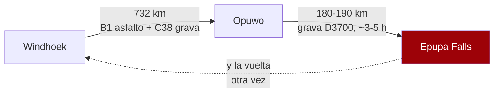
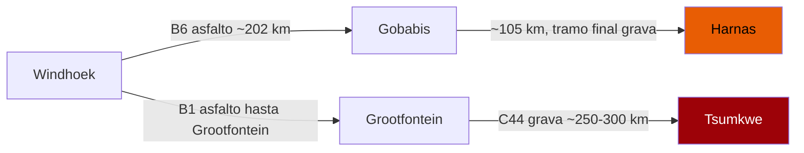
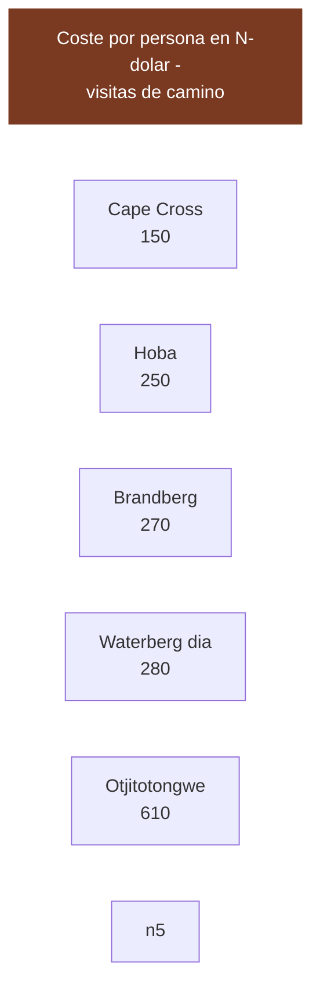

# 11 · Entradas, permisos y qué cuesta cada visita

> **Namibia · 31 oct – 15 nov 2026 · la clásica del norte** — [← índice del dossier](README.md)
>
> Lo que cuesta entrar en cada sitio de la ruta, con su fuente — y, al final, qué quedó fuera de
> tus 34 pines de Google Maps y por qué.
>
> **~N$20 = €1** *(rango 19,5–20,5)* · **✅** fuente primaria · **◐** secundaria concordante ·
> **○** práctica común, sin fuente · **❌** sin verificar, dicho en blanco
>
> *Investigación cerrada el 17/07/2026 · formato y contenido revisados el 03/08/2026*

---

## 💶 Lo que cuesta entrar en cada sitio

Esto cierra la lista de «Lo que hay que verificar» que dejó la pasada anterior. Cada cifra lleva su
fuente y su marca: **✅ primaria** · **◐ secundaria** · **○ práctica común**. Todos los precios en
**N$ y €** (~N$20 = €1; el rand ZAR cotiza ~1:1 con el N$; los importes en US$ se convierten al
cambio aproximado del día, ~N$18,5/US$ y ~€0,92/US$, y se marcan como tales).

### 🎫 Entradas y visitas guiadas *(las que caen en la ruta)*

- **Cape Cross — colonia de lobos marinos** ◐
  - Entrada **~N$150/persona (~€7,5) + ~N$50/coche (~€2,5)**; algunas reseñas citan ~N$80/persona
    → **rango N$80–150**, sin tabla oficial abierta. Solo **efectivo**.
  - ⚠️ **Actualización 02/08/2026 ◐:** una secundaria ([namibian.org](https://namibian.org/blog/namibia-raises-park-fees-by-80-to-100-percent))
    sitúa Cape Cross entre los parques **«premium» del baremo MEFT vigente desde abril de 2026 →
    N$280 (~€14)/adulto**. El rango N$80–150 de las reseñas sería la tarifa vieja. **Presupuesta
    N$280 y confírmalo contra el PDF del MEFT** (el mismo email pendiente de las tasas, ver `02`).
  - **Timing ideal:** el pico de cría es **noviembre-diciembre** (hasta ~210.000 focas) — justo
    vuestras fechas.
  - Acceso por la **C34** al norte de Swakopmund (costa). Gestiona MEFT.
  - Fuentes: [TripAdvisor — Cape Cross](https://www.tripadvisor.com/Attraction_Review-g3650568-d547128-Reviews-Cape_Cross-Erongo_Region.html) ·
    [MEFT — Cape Cross Seal Reserve](https://www.meft.gov.na/national-parks/cape-cross-seal-reserve/214/)

- **Brandberg — la Dama Blanca** ◐
  - **Guía OBLIGATORIO.** El sitio lo gestiona la **comunidad damara** y no se sube sin guía local.
  - **~N$250–270/persona (~€12,5–13,5)**. Caminata de **~3 h ida y vuelta**, poca sombra
    → planificar a primera hora por el calor (ver `15`).
  - Fuentes: [namibweb — Brandberg Mountain Guides](http://www.namibweb.com/brandg.htm) ·
    [TripAdvisor — White Lady](https://www.tripadvisor.com/Attraction_Review-g1182959-d2284289-Reviews-White_Lady-Khorixas_Kunene_Region.html)

- **Hoba Meteorite** ◐
  - **~N$250/persona (~€12,5)** (una reseña de 2024 lo cifra en «22,50 €/extranjero» ≈ N$250).
    Gestiona el **National Heritage Council**.
  - **OJO geografía:** está junto a **Grootfontein**, en el **noreste**. Con la ruta E queda como
    **desvío opcional del D13** (Namutoni → Windhoek vía Grootfontein) — ver `01`.
  - Fuente: [TripAdvisor — Hoba Meteorite](https://www.tripadvisor.com/Attraction_Review-g1137965-d3609771-Reviews-Hoba_Meteorite-Grootfontein_Otjozondjupa_Region.html)

- **Waterberg Plateau** ◐/✅
  - **N$280/persona/día (~€14)** — es el **baremo premium del MEFT** vigente desde el **1/04/2026**,
    el mismo que Etosha y Namib-Naukluft (ver `15`).
  - Fuente: [NWR — Waterberg](https://www.nwrnamibia.com/waterberg-prices.htm) ·
    baremo en [15-huecos-cerrados.md](15-huecos-cerrados.md)

- **Otjitotongwe Cheetah Farm** ◐
  - Interacción/alimentación de guepardos. En la **C40, a 24 km de Kamanjab** (eje camino de Etosha
    por la puerta Galton). Alimentación **~15:00** (16:00 en invierno).
  - **~US$33 (~€30; ~N$610)** el paseo (◐, una reseña). Los no alojados deben **avisar antes**;
    cerrado fines de semana según una fuente.
  - Fuente: [namibweb — Otjitotongwe](https://www.namibweb.com/otjitotongwe.htm)

### 🚫 Zonas restringidas y acceso guiado

- **Messum Crater — abierto al self-drive con permiso, pero desaconsejado** ◐
  - **Sigue abierto al self-drive:** la parte oeste del cráter cae dentro del **Dorob National
    Park** y **exige permiso** — **gratis**, en la **oficina de Turismo de Henties Bay** (o MEFT).
    Ya no es "requisito discutido": las fuentes coinciden en que hay que sacarlo. La pista **"está
    ahora nivelada"** (graded), señal de que se mantiene transitable; **no hay cierre confirmado**.
  - **4x4 imprescindible** todo el año, con depósito suficiente para ir y volver desde Henties Bay.
    Ruta: Henties Bay → **Milla 100** → desvío a la **D2303** → río Messum hasta el cráter *(algunos
    tramos exigen coordenadas GPS)*.
  - **Líquenes extremadamente frágiles:** un 4x4 arrasa **~1 hectárea cada 10 km fuera de pista**
    y crecen **~1 mm/año**. **Máximo 40 km/h, prohibido salir de la rodada** — el polvo daña los
    líquenes y las welwitschias. Los campos de líquenes se ven ya en la **Milla 30** al sur de
    Henties Bay *(aparcar junto a la pista y verlos a pie)*.
  - Circuló un **rumor de cierre al self-drive (2014)** que **las fuentes actuales NO confirman**;
    hoy el permiso se sigue emitiendo. **Alto riesgo ecológico** → no recomendado para este viaje.
  - Fuentes: [travelnam — Messum Crater](https://travelnam.com/crater-with-a-difference-messum-crater/) ·
    [dangerousroads — Messum](https://www.dangerousroads.org/africa/namibia/5955-messum-crater.html) ·
    [Henties Bay Tourism — 4x4 routes](https://www.hentiesbaytourism.com/things-to-do-and-see/4x4routes/)
  - *Nota de fuente: extracción vía WebSearch (páginas descargadas por el buscador); el egress de la
    organización bloquea WebFetch/curl a estos hosts (403). Fuente primaria MEFT del permiso no
    abierta aquí → nivel ◐.*

- **Skeleton Coast — permiso de tránsito gratis, pero pernocta CERRADA en noviembre** ◐
  - Sector self-drive: **entre las puertas de Ugabmund (sur) y Springbokwasser (este)**. El
    **permiso de tránsito es gratis** y se saca en la propia puerta.
  - Puertas **07:30–19:00**; **no se entra después de las 15:00** sin reserva confirmada.
  - **Torra Bay abre solo diciembre-enero → CERRADO a finales de noviembre.** Terrace Bay
    (NWR) abre todo el año, pero pernoctar exige **reserva previa**.
  - Fuentes: [NWR — Skeleton Coast](https://www.nwrnamibia.com/skeleton-coast-national-park.htm) ·
    [TripAdvisor — permits & gate times](https://www.tripadvisor.com/ShowTopic-g479222-i25768-k8459916-Driving_permits_and_gate_opening_times-Skeleton_Coast_National_Park_Khomas_Region.html)

- **NamibRand — no es self-drive libre** ◐
  - **Día:** ~US$10–20/persona (~€9–18; ~N$185–370). **Alojados:** tasa de conservación **por cama
    y día** que cobra el lodge (sistema de concesiones). El acceso general va **vía alojamiento**,
    no como pista abierta.
  - Fuentes: [NamibRand — Tourism](https://www.namibrand.com/tourism.html) ·
    [takeyourbackpack — NamibRand](https://www.takeyourbackpack.com/backpacking-in-namibia/visit-namibrand-nature-reserve/)

### 🛏️ Los que resultaron ser LUJO *(fuera de gama media)*

Se pedía saber si Ongava y Okonjima son gama media o lujo. **Respuesta: lujo.** Se apuntan para
descartarlos del presupuesto de gama media.

- **Ongava** (junto a la puerta de Andersson) — **LUJO** ◐
  - Desde **~R17.307 ≈ N$17.300 (~€865) por persona/noche** en pensión completa; oferta puntual
    **~N$10.950 (~€548)**. Mínimo 2 noches.
  - Fuente: [siyabona — Ongava Tented Camp](https://www.siyabona.com/pricing_safari-lodge-ongava-tented-camp.html)

- **Okonjima / AfriCat** (eje Windhoek–Etosha) — **gama alta** ◐
  - Desde **~US$684 ≈ N$12.700 (~€630) por persona/noche** en pensión completa (Bush Camp,
    jul-dic 2026). El **Plains Camp** (media pensión) es más barato pero **sigue siendo gama alta**.
    Es una parada lógica del eje, pero no es camping ni gama media.
  - Fuentes: [Okonjima — Rack Rates 2026 (PDF)](https://okonjima.com/wp-content/uploads/2025/12/Okonjima-Rack-Rates-2026.pdf) ·
    [Okonjima — rates](https://okonjima.com/rates/)

- **Bagatelle Kalahari** (eje Windhoek–sur, cerca de Mariental) — **gama media-alta** ◐
  - Desde **~R6.400 ≈ N$6.400 (~€320) la noche para 2** en media pensión; tiene **camping** más
    barato. Encaja como primera/última noche del eje sur si se quiere una noche de dunas rojas.
  - Fuente: [lekkeslaap — Bagatelle rates](https://www.lekkeslaap.co.za/accommodation/bagatelle-kalahari-game-ranch/rates)

### 📏 Kaokoland (Epupa + Opuwo) — el descarte, ahora CON números ◐

- **Windhoek → Opuwo:** **732 km** por carretera (Google ~9h15). B1 asfalto hasta Otjiwarongo,
  luego **C38/grava**.
- **Opuwo → Epupa:** **180–190 km de grava por la D3700** (~3–5 h), cruzando cauces secos.
- **Ida y vuelta a Kaokoland = ~4 días SOLO de conducción** desde Windhoek, **sin contar Etosha**.
  Tampoco cabe en la ruta E final — esos días son las 4 noches de Etosha: es aritmética, no gusto.
- **Y de propina, el seguro:** las pistas **D3700 / D3703 / D3707** de Kaokoland-Damaraland son justo
  donde el contrato de Asco **no cubre bajos ni garantiza rescate** aunque pagues Super Cover
  (ver `12` y `06`). Doble motivo para dejarlo fuera.
- Fuentes: [trippy — Windhoek↔Opuwo](https://www.trippy.com/distance/Windhoek-to-Opuwo) ·
  [Epupa Camp — directions](https://epupa.com.na/directions/)

### 📏 El este (Tsumkwe + Harnas) — los dos pines que faltaban, ahora CON números ◐

Cerraba la lista de pines sin medir. Los dos apuntan al **este**, la dirección contraria al bucle del
norte, así que un desvío a cualquiera de ellos es una **ida y vuelta muerta** que no enlaza con nada
de la ruta. La diferencia entre ambos es de grado.

- **Harnas (Fundación de fauna) — ~307 km al este de Windhoek** ◐
  - Ruta: **B6 (Trans-Kalahari, asfalto) hasta Gobabis (~202–204 km)**, y desde Gobabis **~105–120 km
    al noreste** con **tramo final de grava** hasta la granja.
  - **Matiz honesto:** 307 km **no** es «lejísimos» — es menos que Windhoek–Sesriem. **No se descarta
    por distancia**, sino por **dirección**: cae al este, fuera del eje norte, y **no tiene nada más
    cerca** que justifique el desvío. Un ~día de ida + otro de vuelta que no suma ruta. Por eso queda
    fuera, no por kilómetros imposibles.
  - Fuentes: [Harnas — Road Directions (PDF oficial, Wetu)](https://stwetuproduction.blob.core.windows.net/azure-blob-resources-wetu-production/Resources/45047/Harnas_Road_Direction_-_GPS_Co-Ordinates.pdf) ·
    [namibweb — Harnas](https://www.namibweb.com/harnas.htm)

- **Tsumkwe (Bushmanland, Nyae Nyae) — ~640 km de Windhoek, y el final es grava** ◐
  - Calculadoras independientes: **~638 km por carretera** (rome2rio, na.utc.city). El trazado real es
    **B1 asfalto hasta Grootfontein** y luego la **C44, ~250–300 km de grava** hacia el este *(la C44
    mide 321 km en total y atraviesa Tsumkwe)*, así que en la práctica ronda o supera los ~640 km.
  - **Es el extremo este del país**, pegado a **Khaudum** y la frontera con Botsuana — **~1 día de ida
    solo de conducción**, con el último tercio en grava, y de nuevo en zona remota sin apenas
    servicios. Con el sur ya dentro del viaje, **no cabe**: aritmética, igual que Epupa.
  - Fuentes: [rome2rio — Windhoek↔Tsumkwe](https://www.rome2rio.com/s/Windhoek/Tsumkwe) ·
    [na.utc.city — Tsumkwe↔Windhoek](https://na.utc.city/2357925-2358013) ·
    [Wikipedia — C44 road](https://en.wikipedia.org/wiki/C44_road_(Namibia))

> **Aviso de método (igual que en Epupa):** estas cifras vienen de **WebSearch**, no de páginas
> descargadas (el egress bloquea WebFetch/curl a estos hosts con `403`). **Convergen entre
> calculadoras independientes y las indicaciones oficiales de los propios destinos**, y **sirven para
> el descarte, no para navegar**. La distancia fina de conducción hay que confirmarla con el mapa.

---

## 💶 Coste por persona de las visitas «de camino» *(las baratas)*

Las entradas que sí encajan en la ruta son **calderilla** comparadas con un tour del Sperrgebiet.
El contraste, de un vistazo (N$/persona):

> **Lectura:** Cape Cross, Brandberg y una tasa de parque son ~N$150–280 (~€7–14) por cabeza. El

---

## 🗺️ Y lo que quedó fuera de tus 34 pines

Tu lista iba de **Epupa** (frontera con Angola) a **Lüderitz** (suroeste atlántico) pasando por
**Tsumkwe** (extremo este): eso es el país entero, y **no cabe en catorce días**. Lo que se descartó,
con el motivo:

- **Kaokoland (Epupa, Opuwo)** — **~730 km solo hasta Opuwo** y otros 180–200 de grava hasta Epupa:
  **cuatro días de ida y vuelta** que salen de Etosha. Y de propina, es la zona donde **el seguro
  excluye los bajos y no garantiza rescate** *(ver [`06`](06-conduccion.md))*.
- **El sur entero** (Fish River, Lüderitz, Kolmanskop, kokerbooms) — decisión del viajero: queda para
  otro viaje, y sus días fueron a Etosha.
- **Mata-Mata / Kgalagadi** — es Sudáfrica: cruce de frontera, tasas aparte, autorización escrita del
  propietario del vehículo y la duda de si el seguro sigue vigente al otro lado.
- **Tsumkwe y Harnas** (extremo este) — mismo problema que Kaokoland: son un viaje aparte.
- **Spitzkoppe y Brandberg** — no están en la ruta de referencia y obligan a desviarse del eje de la
  costa. *(El camping comunitario de Spitzkoppe está cerrado en **N$270/persona**, entrada incluida ◐,
  por si algún día se recupera.)*

**Lo que sí sobrevivió** está repartido por el dossier: Joe's Beerhouse, Solitaire, Sesriem Canyon,
Duna 45, Deadvlei, Walvis Bay, Swakopmund, Cape Cross, Skeleton Coast, Twyfelfontein y las cuatro
noches de Etosha. Los caprichos opcionales del D13 —Okonjima, Hoba, Waterberg— siguen abajo con su
precio.

ℹ️ *Twyfelfontein y Duna 45 aparecen en Google como cerrados: **es un fallo del listado**, los dos
funcionan.*

---

## 🕳️ Lo que SIGUE sin cerrarse *(honesto)*

- **Cape Cross:** el **tramo exacto** de la tabla MEFT (¿N$80 o N$150?) no se pudo verificar contra
  el PDF primario (bloqueado). Rango N$80–150.
- **Okonjima Plains Camp:** el número fino de la media pensión no salió por fragmento (el PDF de
  tarifas está publicado pero no se pudo abrir aquí).
- **Waterberg (camping NWR):** la tasa de **parcela** (distinta de la entrada de N$280) no se
  extrajo; solo la entrada.
- **Kgalagadi:** descartado por decisión del viajero — no se investiga si Asco autoriza el cruce.
- **Messum Crater:** ✔️ **avanzado (31/07)** — el estado de apertura al self-drive queda **◐
  cerrado a nivel secundario**: sigue **abierto con permiso gratis** de Turismo de Henties Bay
  (la parte oeste está en el **Dorob National Park**), la pista está **nivelada** y **no hay cierre
  confirmado**; el rumor de 2014 no lo respalda ninguna fuente actual (ver la ficha arriba). **Falta
  solo** la confirmación contra la fuente primaria del MEFT (bloqueada por egress, 403).
