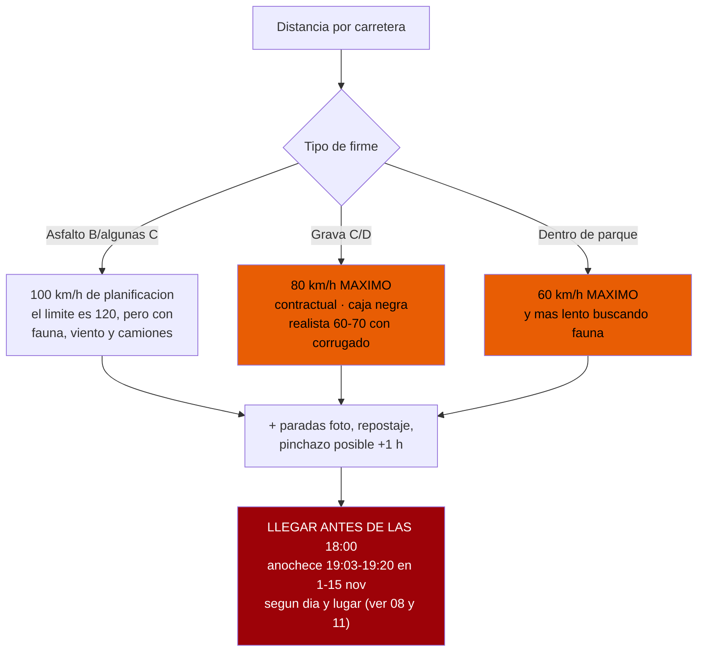
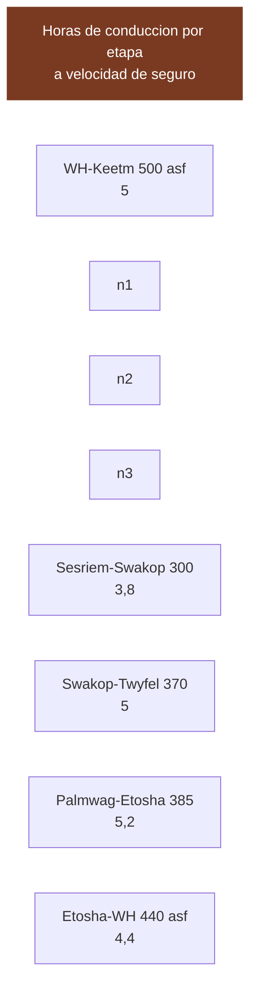

# 13 · Itinerario y viabilidad

> **Namibia · 31 oct – 15 nov 2026 · la clásica del norte** — [← índice del dossier](README.md)
>
> Distancias, firme y tiempos calculados a velocidad de seguro — y la respuesta honesta a qué cabe de verdad en catorce días.
>
> **~N$20 = €1** *(rango 19,5–20,5)* · **✅** fuente primaria · **◐** secundaria concordante ·
> **○** práctica común, sin fuente · **❌** sin verificar, dicho en blanco
>
> *Investigación cerrada el 17/07/2026 · formato y contenido revisados el 03/08/2026*

> ## 📐 Para qué sirve este documento
> Es la **aritmética de la ruta**: a qué velocidad se puede planificar de verdad en Namibia, cuánto
> se tarda en cada etapa de la ruta y qué detalles cambian un día concreto. No propone rutas
> —esa decisión ya está tomada, y está en `01`—: **comprueba que la elegida cabe**.
>
> *El análisis del sur y de las variantes descartadas se retiró el 03/08/2026 para dejar solo la
> ruta del viaje. Queda en el historial de git.*

Distancias reales, firme, tiempos calculados a velocidad de seguro, y una respuesta honesta a la
pregunta que importa: **¿cabe todo en 14 días?**

> Este documento **no infla la ruta para complacer**. Una ruta ajustada y factible vale más que una
> completa e imposible. Donde un número es una estimación, lo dice. Donde una etapa no cabe, lo dice.

---

## 0. Las reglas del cálculo — por qué NO valen los tiempos de Google Maps

Google Maps asume velocidades que **anulan tu seguro** (ver `12` y `06`: 80 km/h contractuales en
grava, caja negra, límite de 60 km/h en parques). Todos los tiempos de este documento se calculan
con **tus** reglas, no las de Google:

- **Asfalto**: planifico a **100 km/h** (el límite es 120, pero cargados, con viento lateral y
  camiones no se sostiene de media).
- **Grava**: **80 km/h es el TECHO contractual**, no la media. Con corrugado, curvas y polvo, la
  media real cae a **60–70**. Calculo el *tiempo mínimo* a 80 y aviso de que el real es mayor.
- **Parque**: **60 km/h**, y en la práctica mucho menos porque vas parando a mirar.
- **Sumo** una franja de paradas/repostaje a cada etapa y recuerdo que **un solo pinchazo suma ~1 h**.
- **Regla de oro (de `06`)**: apuntar a **llegar a las 18:00**, una hora antes del ocaso. La franja
  16:00–20:00 concentra el **29 % de los muertos** del país. Si vas tarde, **te paras y llegas mañana**.

Guía independiente de operadores, que coincide: *«plan your daily routing to be no further than
400 km per day»* y, mejor, *«aim to drive no more than 4 to 6 hours per day»* (Expert Africa). Un
viajero cita un tramo de *«288 km that took over 4 hours»* y que después **acortó todos los días**.
👉 **Trabajo con un techo de ~300–350 km/día de tránsito**, y menos si el día tiene grava dura o
actividad (Sossusvlei, safari).

⚠️ *Los 80 km/h con caja negra están documentados en los contratos de **Asco/Savanna** (ver `06`);
la cláusula del contrato vigente —**Namibia2Go Budget**— sigue sin verificar: pídela al reservar.
Los tiempos de este documento se mantienen a 80 igualmente.*

Fuentes de la regla: `12` y `06` (contratos Asco/Savanna, ya descargados) ·
https://www.expertafrica.com/namibia/info/self-drive-driving-tips-and-techniques ·
https://www.safaribookings.com/blog/guide-to-driving-in-namibia-10-useful-self-drive-tips

---

## 0-bis. Los tiempos de la ruta, calculados con esas reglas

La ruta del viaje, día a día, con la aritmética a la vista. **Ojo a la base**: las distancias son
las estimaciones ◐/○ de `01` (varias sin verificar — ver la nota de cabecera), así que esto es
**cálculo transparente sobre datos marcados**, no medición. Método: asfalto a 100 · grava al techo
de 80 con **media real 60–70** · parque a 60 · **+30–60 min de paradas** por día de tránsito · un
pinchazo = +1 h que no está en ninguna cifra.

- **D2 · Windhoek → Spreetshoogte (~180–200 km ◐)** — 87 km asfalto (~50 min) + ~95–115 km de
  grava (a 60–70: 1h25–1h55) → **mínimo ~2h15 · realista 3h–3h30 con paradas** ✓ *(coincide con `01`)*
- **D3 · Spreetshoogte → Solitaire → Sesriem (~150–170 km ◐)** — grava entera (a 60–70:
  2h10–2h50) + parada en Solitaire → **realista ~2h30–3h** ✓
- **D4 · Sossusvlei (130 km, dentro del parque ✅)** — ~120 km a 60 = 2h de volante repartidas en
  el día + arena + dunas a pie → **día completo, y por eso se madruga a las ~05:10**
- **D5 · Sesriem → Walvis Bay (~270 km ✅)** — grava y paso del Kuiseb (a 60–70: 3h50–4h30) +
  paradas → **realista ~4h30–5h30** ✓ *(el «~5h30» de `01` es el honesto)*
- **D7 · Walvis Bay → Cape Cross → Terrace Bay (~380 km ◐, verificado 03/08)** — el día con hora
  límite: a 70–80 de media son **~5h–5h30 SOLO de volante**, más Cape Cross (~1 h) y el trámite de
  Ugabmund. **Cuenta atrás desde las 15:00 de la puerta: salir de Walvis a las 7:30 deja ~6h30 de
  margen — justo.** Un pinchazo aquí se come el margen entero: sal a las 7:00.
- **D8 · Terrace Bay → Twyfelfontein → Hoada (~300 km ○)** — grava (a 60–70: 4h20–5h) + grabados →
  **realista ~5h de volante + visita** ✓
- **D9 · Hoada → Okaukuejo (~315 km ◐)** — grava hasta Kamanjab, asfalto después (firme de la C38
  por confirmar, `01`) → **mínimo ~3h30 · realista ~4h–4h45** ✓ — y dentro del parque ya a 60
- **D10–D12 · Etosha (60–90 km/día ✅)** — a 60 km/h y parando en cada charca: **el día entero ES
  el trayecto** — no son horas de tránsito, son horas de safari
- **D13 · Namutoni → Windhoek (~555–575 km ◐, verificado 03/08)** — asfalto a ~100 → **mínimo ~5h30 ·
  realista 6h–6h30 con comida en Otjiwarongo**. Saliendo al amanecer (~06:10), en Windhoek a media
  tarde ✓

> **Lectura de conjunto:** ningún día de la E baja de las reglas — el único que exige disciplina de
> reloj es el **D7** (puerta a las 15:00) y el único largo de verdad es el **D13** (asfalto). Las
> franjas de `01` son coherentes con este cálculo; el **D7 y el D13 ya se cerraron** (03/08, ver
> §1 y las fuentes al pie); el que aún hereda incertidumbre de km es el **D8** (Terrace Bay →
> Twyfelfontein) — **Tracks4Africa antes de apurar horarios**.

---

## 1. Las distancias, con su firme y su fuente

Números **por carretera**. Marco la fuente y la confianza de cada uno. Los del **eje central**
vienen de la matriz de Namibia Tours & Safaris (**◐, copyright 2010** — las distancias cambian poco,
pero es secundaria y vieja; ver `07`). Los del **sur** los verifiqué en esta pasada.

### Eje Windhoek → desierto

- **Windhoek → Sesriem por el paso de Spreetshoogte (D1275)**: **~320–350 km** ◐. Desglose:
  B1 a Rehoboth **87 km (asfalto)** → C24 **39 km** → D1261 a Nauchas **55 km** → **D1275, paso de
  Spreetshoogte** (miradores a 16,4 km, y 34,4 km más hasta la C14) → Solitaire → Sesriem.
  ⚠️ **El paso de Spreetshoogte es MUY empinado**, con tramos de grava y otros de adoquín de hormigón
  para tracción; *«no coaches, caravans or trailers permitted»*. Espectacular, pero es un **descenso
  técnico**, no un atajo cómodo.
- **Windhoek → Sesriem por Rehoboth / paso de Remhoogte (C24)**: **~365 km** ◐. B1 a Rehoboth 87 →
  **C24 174 km (paso de Remhoogte)** → C14 14 km a Solitaire → Sesriem 90. **Más largo pero más
  llevadero** para el primer día con el coche recién cogido.
- **Windhoek → Sesriem** *(matriz 2010)*: **320 km** ◐ · **Windhoek → Solitaire**: **300 km** ◐
- **Sesriem → Sossusvlei / Deadvlei**: **60 km cada trayecto** (120 ida y vuelta) **+ 5 km de arena
  blanda** en reductora al final ◐ *(matriz 2010 + `06`)*
- **Sesriem → Solitaire**: **90 km** ◐ · **Solitaire → Swakopmund**: **210 km** ◐ ·
  **Sesriem → Swakopmund** *(por la C14, pasos de Gaub y Kuiseb)*: **300 km** grava ◐

### Eje costa y Damaraland

- **Swakopmund → Walvis Bay**: **~30 km**, **asfalto B2** ✅ *(convergente: «30 km of straight tarmac»)*
- **Costa (C34) — desglose del D7** ◐ *(verificado 03/08)*: **Swakopmund → Henties Bay ~70 km**
  *(asfaltado en 2019; Wikipedia C34 / geodatos)* → **Henties Bay → Cape Cross ~70 km** →
  **Cape Cross → Terrace Bay ~200 km** *(guías de la Costa de los Esqueletos)*. La **C34 mide
  300 km Swakopmund → Torra Bay** (Wikipedia) y **Torra Bay → Terrace Bay son ~50 km**, así que
  **Walvis Bay → Terrace Bay ≈ 30 + 300 + 50 = ~380 km**, y el cruce por Cape Cross (que está sobre
  la propia C34, no es desvío) da ~370–380 km. **Cuadra con el ~390 estimado.**
- **Swakopmund → Spitzkoppe**: **~150–180 km** (B2/asfalto vía Usakos + grava final) ◐
- **Spitzkoppe → Brandberg (Uis)**: **~130 km** de grava ◐ · **Uis → Twyfelfontein**: **~100 km** ◐
- **Swakopmund → Twyfelfontein** *(directo)*: **400 km** ◐ *(matriz 2010)*
- **Uis → Khorixas**: **115 km** ◐ · **Khorixas → Twyfelfontein**: **100 km** ◐ ·
  **Khorixas → Palmwag**: **170 km** ◐ · **Twyfelfontein → Palmwag**: **~110 km** ◐ *(operadores
  namibios convergentes: padlangsnamibia y foro 4x4community lo dan en «~2,5 h» de grava — verificado 03/08)*

### Eje Etosha y vuelta

- **Palmwag → Okaukuejo (vía Kamanjab)**: **385 km** ◐ *(matriz 2010; Palmwag→Kamanjab 120 + Kamanjab→Okaukuejo 265)*
- **Palmwag → puerta de Galton (Etosha oeste)**: Galton está **más cerca** que rodear por Andersson;
  desde Galton **a Okaukuejo son ~200 km / ~6 h de conducción lenta** por el sector oeste ◐
  *(foro NWR/etoshanationalpark.org)*. **Galton** da acceso al oeste (Dolomite); **Andersson** es la
  puerta sur clásica hacia Okaukuejo.
- **Etosha, travesía interior**: **Okaukuejo → Halali ~70 km → Namutoni ~70 km** (a 60 km/h y parando
  a mirar: **es un día entero de safari**, no un traslado) ◐
- **Okaukuejo → Windhoek**: **440 km**, mayormente asfalto (Outjo–Otjiwarongo–B1) ◐
- **Namutoni → Windhoek** *(por Tsumeb–Otjiwarongo–Okahandja, asfalto B1/B8)*: **~555–575 km** ◐
  *(convergente: Etosha «553 km» por la web de Etosha NP y ~575 km por rome2rio, ambos vía search 03/08;
  Namutoni queda más al este que Okaukuejo)*
- **Otjiwarongo → Outjo**: 75 km ◐ · **Outjo → Okaukuejo**: 120 km ◐

> ⚠️ **Aviso de fuente:** el bloque del eje central se apoya en una matriz con **copyright de 2010**.
> Las distancias por carretera cambian poco, pero **verifícalas con Tracks4Africa o un GPS actual
> antes de reservar alojamientos con horarios ajustados.** Los del sur están reconfirmados en 2026.

---

## 2. El tiempo de cada tramo, calculado para auditarlo

Tiempo **de tránsito** (solo rodar), a velocidad de seguro. **Súmale paradas, repostaje y comidas**,
y ten en cuenta que la grava real va a 60–70, no a 80. La columna «día realista» ya incluye ese
colchón y la regla de las 18:00.

Cómo salen (redondeo al alza):

- **Windhoek → Keetmanshoop 500 asfalto**: 500 ÷ 100 = **5,0 h** → **día realista 6 h** con repostaje
  y comida. Largo pero fácil.
  👉 **Este tramo NO se hace bien en un día.** Ver §3.
- **Sesriem → Swakopmund 300 grava** (pasos de Gaub y Kuiseb): 300÷80 = 3,75 h → **~5 h** con los pasos.
- **Swakopmund → Spitzkoppe → Twyfelfontein ~370**: ≈ **5 h** de tránsito → **día realista 6–7 h**;
  mejor **partirlo** con noche en Spitzkoppe o Brandberg.
- **Palmwag → Okaukuejo 385**: ≈ **5,2 h** → **día realista 6 h**. Es de los tramos que avisa `07`:
  al límite del alcance cómodo de un depósito en grava.
- **Etosha Okaukuejo → Namutoni 140 en parque**: a 60 km/h son 2,3 h *rodando*, pero con fauna es un
  **día entero**. No es un traslado.
- **Okaukuejo → Windhoek 440 asfalto**: 440÷100 = 4,4 h → **~5 h**.

---

## 5. Detalles que cambian un día concreto

---

## 6. Lo que este documento NO pudo verificar — dicho claro

- **Varias distancias del eje central** salen de una **matriz de 2010** (◐): Windhoek–Sesriem,
  Sesriem–Swakopmund, Palmwag–Okaukuejo, travesía de Etosha. Cambian poco, pero **no las tomé de un
  GPS 2026**. Verifícalas con **Tracks4Africa** antes de fijar reservas con hora.
- **Twyfelfontein → Palmwag ~110 km**, **Namutoni → Windhoek ~555–575 km** y el **desglose del D7 por
  la C34** ya **dejaron de ser triangulaciones** (03/08): ahora los apoyan varias fuentes secundarias
  independientes que convergen (◐, ver §1 y Fuentes). Siguen sin ser un GPS 2026, pero coinciden en el rango.
- **Terrace Bay → Twyfelfontein (parte del D8) sigue sin verificar** (○): la salida de la costa hacia
  el interior por la C39/D2620 no la pude cerrar con fuente hoy.
- **Ninguna de las páginas oficiales de NWR ni de lodges** (fishriverlodge, nwrnamibia) se dejó
  descargar hoy (**HTTP 403**): las rutas del sur se apoyan en descripciones de blogs cruzadas entre
  sí, no en la web del operador. **Confírmalo con el lodge al reservar.**
- **Estado real del firme en noviembre 2026**: el corrugado y los baches cambian mes a mes; los
  reportes de foros (4x4community, roadtripster) son de años anteriores.

---

## Fuentes

- Reglas de conducción y velocidad: `12-hallazgos-verificados.md`, `06-conduccion.md` (contratos
  Asco/Savanna ya descargados) ·
  https://www.expertafrica.com/namibia/info/self-drive-driving-tips-and-techniques ·
  https://www.safaribookings.com/blog/guide-to-driving-in-namibia-10-useful-self-drive-tips
- Windhoek–Keetmanshoop–Mariental: https://en.wikipedia.org/wiki/Mariental,_Namibia
  https://africanlanders.com/en/namibia-en/namibia-the-fish-river-canyon/
- Paso de Spreetshoogte vs Remhoogte: descripciones de ruta recogidas vía Travel Namibia y foros
  (travelnam.com, tripadvisor Namibia) *(páginas no descargadas hoy; datos de los extractos de búsqueda)*
- Swakopmund–Walvis Bay–Spitzkoppe–Brandberg: extractos de búsqueda cruzados (siyabona, distancesfrom)
- Palmwag/Galton–Etosha: foro NWR y https://www.etoshanationalpark.org/map
- **Costa (D7) — C34, verificado 03/08:** https://en.wikipedia.org/wiki/C34_road_(Namibia)
  *(«C34 is 300 km long, Swakopmund → Torra Bay»; Swakopmund → Henties Bay asfaltado en 2019)* ·
  https://www.geodatos.net/en/distances/from-swakopmund-to-hentiesbaai · Cape Cross → Terrace Bay ~200 km
  y Torra Bay → Terrace Bay ~50 km vía guías de la Costa de los Esqueletos (mistersafari, wild-wings-safaris)
  *(páginas no descargadas; datos de los extractos de búsqueda)*
- **Namutoni → Windhoek — verificado 03/08:** web de Etosha NP («553 km north of Windhoek via
  Otjiwarongo and Tsumeb») y rome2rio (~575 km) *(vía extractos de búsqueda; páginas devuelven 403 al descargar)*
- **Twyfelfontein → Palmwag — verificado 03/08:** https://padlangsnamibia.com/padlangs-namibia/the-palmwag-experience
  y foro 4x4community *(«~2,5 h» de grava; ~110 km)*
- Matriz de distancias del eje central: Namibia Tours & Safaris (2010), recogida en `07-logistica.md`
