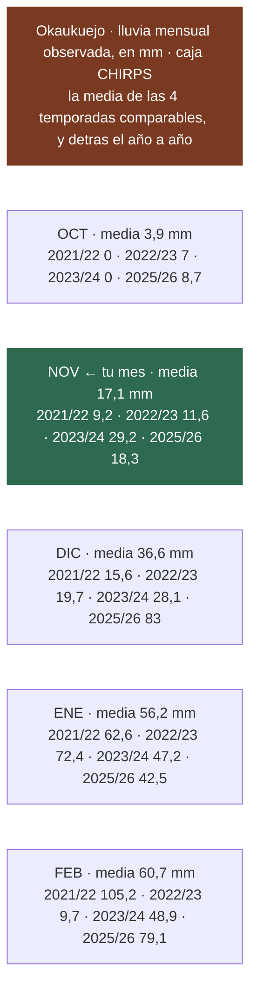

# 14 · Cuándo empiezan de verdad las lluvias

> **Namibia · 30 oct – 15 nov 2026 · la clásica del norte** — [← índice del dossier](README.md)
>
> Cinco temporadas observadas, milímetro a milímetro, para decidir fechas con datos y no con folletos.
>
> **✅** fuente primaria · **◐** secundaria concordante · **○** práctica común, sin fuente
>
> *Investigación cerrada el 17/07/2026 · formato y contenido revisados el 03/08/2026*

> ### Por qué existe este documento
> El Atlas de Namibia describe la lluvia como *«erratic»*, con *«a high degree of variation»*.
> **La media de ~25 mm de noviembre en Etosha esconde años en que no cayó una gota hasta enero.**
> Para decidir fechas, las medias no sirven: sirven los años reales.

---

## ⚠️ Limitación de partida: no hay pluviómetro dentro de Etosha

**No existe estación dentro del parque.** La más cercana, Okashana, está a 54 km de Namutoni; el
resto, entre 96 y 257 km. Así que la serie que se usa es la **caja CHIRPS de 0,05° centrada en
Okaukuejo** —satélite calibrado con estaciones—, apoyada en el **Servicio Meteorológico namibio**
(que sí publica Namutoni), en **SASSCAL** (estaciones reales, todas fuera del parque) y en
**FEWS NET**.

⚠️ Y un aviso de método: **GHCN-Daily no tiene precipitación namibia posterior a julio de 2025**.

---

## 📊 El resultado: 4 de 5 temporadas empezaron tarde

**El primer día con ≥10 mm en Okaukuejo, temporada a temporada** — el criterio que marca el arranque
de verdad:

- **2021/22** → **18 de enero**. Oct–feb muy por debajo de la media; en zonas del norte, el acumulado
  más bajo desde 1981.
- **2022/23** → **enero**, con **más de 40 días de retraso** sobre lo habitual (FEWS NET). Toda la
  temporada sumó 135,4 mm: sequía severa.
- **2023/24** → **el criterio no se cumplió en toda la temporada**. La sequía de El Niño.
- **2024/25** → **19 de noviembre**, con 11,9 mm. **El único noviembre con lluvia seria** de los cinco.
- **2025/26** → **11 de diciembre**. La más adelantada de las cuatro comparables… y aun así, diciembre.

> ### 👉 Lo que esto significa para el 1–14 de noviembre
> En **cuatro de las cinco últimas temporadas**, cuando vosotros estéis allí **la temporada de
> lluvias todavía no había empezado**. Y eso es justo lo que hace que el safari funcione: sin lluvia
> **no hay agua dispersa por el monte, y la fauna se concentra en las charcas**.

---

## 🎓 Tres lecciones del histórico

**1 · Cuidado con el falso arranque.** En octubre de 2021 Grootfontein registró 48,3 mm… de los
cuales **47 cayeron en un solo día**. Después, noviembre prácticamente seco y las lluvias de verdad
en diciembre. El Servicio Meteorológico namibio usa literalmente el término **«false onset»**. **Un
chaparrón de octubre no es el inicio de la temporada.**

**2 · Si llueve, es local y disperso.** En la misma temporada 2021/22, el primer día de ≥10 mm cayó
el **20 de octubre en Waterberg** y el **10 de febrero en Kaoko Otavi**: **más de tres meses de
diferencia dentro del mismo país**. No es un monzón que tapa la región, son tormentas que caen donde
caen. Khorixas, en Damaraland, pasó **diciembre entero sin un solo día de lluvia**.

**3 · La variabilidad es el hallazgo, no el promedio.** Las cinco temporadas van desde *«nunca
llegó»* (El Niño, 2023/24) hasta el segundo octubre–diciembre más lluvioso desde 1981 (2025/26, con
Grootfontein en 828 mm frente a una normal de 521). **Nadie puede predecir 2026.**

---

## 🕳️ Límites de este documento

- **La caja CHIRPS no es el pluviómetro de Okaukuejo**: es satélite calibrado, y es lo único centrado
  *dentro* de Etosha.
- **Dos temporadas quedaron disputadas 1-1** en la verificación (Waterberg 2023/24 y Ondangwa
  2024/25), y una serie CHIRPS cayó refutada 0-2. No se publican como cerradas.
- **Nadie cuantifica** cuánto empeoran los avistamientos los milímetros de lluvia. Que la fauna se
  disperse al llover es inferencia coincidente entre fuentes, **no un dato medido**.
- El consejo original de este documento era *«pon Etosha al principio, por si acaso»*. **La decisión
  final fue la contraria** —Etosha al final—, porque la tarifa de NWR desde el 1 de noviembre, el
  termómetro y el rodaje pesaron más que ese «por si acaso». Ver [`01`](01-itinerarios-dia-a-dia.md).

---

*Datos observados, no previsiones · Las temporadas se nombran por el año de inicio (2025/26 va de
octubre de 2025 a marzo de 2026)*
