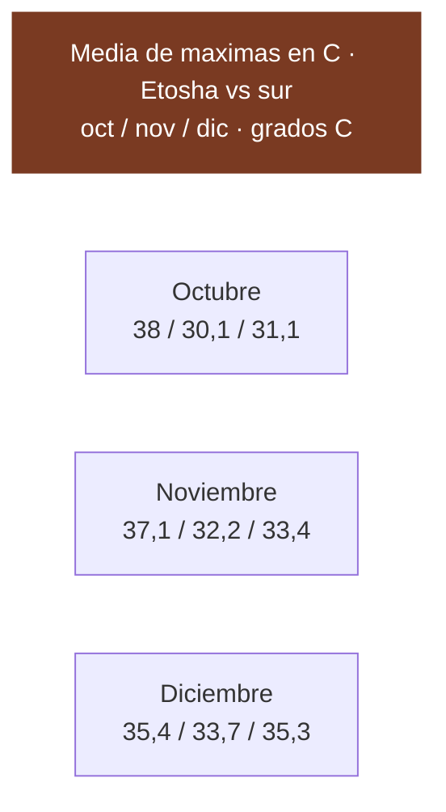
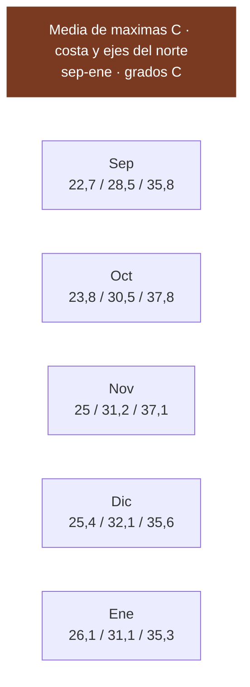
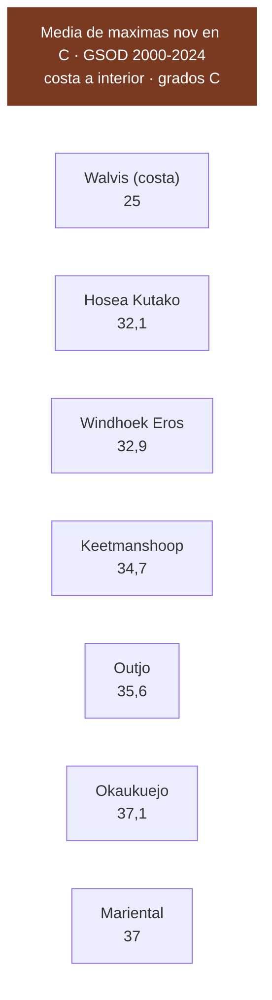
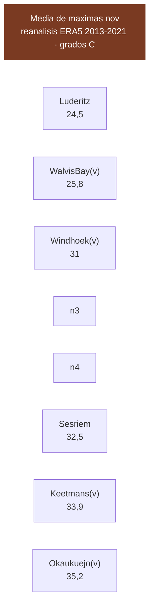
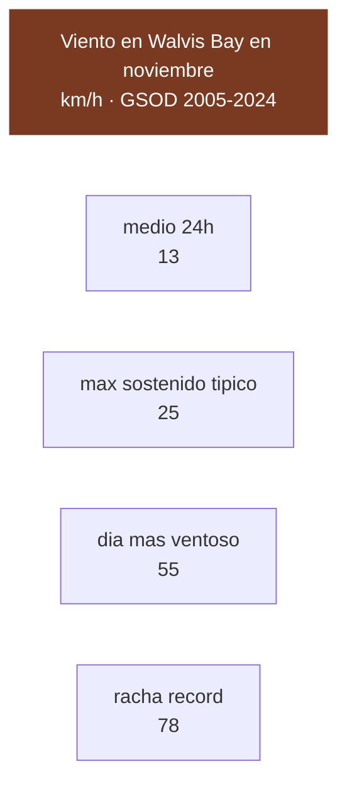
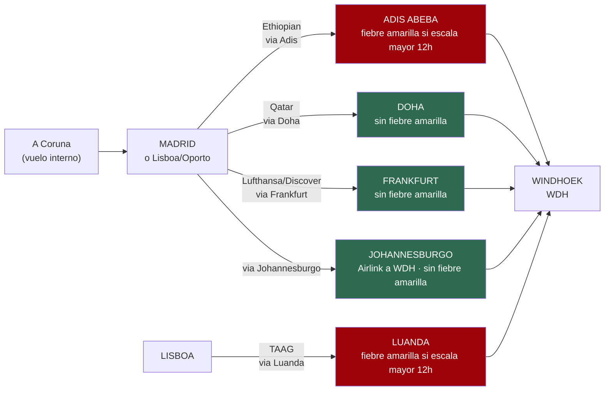

# 15 · Huecos cerrados

> **Namibia · 31 oct – 15 nov 2026 · la clásica del norte** — [← índice del dossier](README.md)
>
> El cuaderno de bitácora de la investigación: temperaturas de estación, viento, luz, vuelos, tasas y lodges.
>
> **~N$20 = €1** *(rango 19,5–20,5)* · **✅** fuente primaria · **◐** secundaria concordante ·
> **○** práctica común, sin fuente · **❌** sin verificar, dicho en blanco
>
> *Investigación cerrada el 17/07/2026 · formato y contenido revisados el 03/08/2026*

> ℹ️ **Nota del 03/08/2026 — el sur ya no es destino, pero sigue midiendo.** El sur quedó fuera de
> la ruta y su contenido como destino (Fish River, Lüderitz, Ai-Ais, sus lodges y sus tasas) **se
> retiró de este dossier**. Lo que sí se conserva son las **estaciones del sur usadas como control
> de calidad** —Keetmanshoop y Karios— porque son las series largas contra las que se comprobó si
> el reanálisis ERA5 y el dataset GSOD mentían. Aparecen como instrumento de medida, no como sitio
> al que ir.

### 📓 Registro de la investigación

Este documento es el cuaderno de bitácora: cada pasada añade lo que cerró y lo que sigue abierto.

- **03/08** — **Cerrado el grueso del D8**: Terrace Bay → Twyfelfontein **~216 km ◐** por la ruta
  directa de Springbokwasser (96 a la puerta + 120 a Twyfelfontein), con el negativo de la C39 como
  control. Era el último tramo de km ○ de la ruta E; solo queda la cola Twyfelfontein → Hoada (~85 km).
  Ver §«Lo que sigue sin cerrarse» y `13`.
- **01/08** — **Camp Gecko**, al pie del paso de Spreetshoogte, identificado como opción de camping
  del D2. Banda de precio ○ **contradictoria** entre dos búsquedas (N$220 vs N$280 p.p.) y primaria
  en 403: **sigue sin verificarse**. Ver §Campings.
- **31/07** — **Ventana de luz recalculada para las fechas reales** (1–15 nov; antes estaba solo
  para el 25). A comienzos de noviembre **anochece 13–18 min antes**. Ver §Luz.
- **27/07** — El **reanálisis ERA5** pone número al hueco sin estación de la ruta: **Sesriem ~32,5 °C** en noviembre, validado contra estaciones (§ERA5). Cerrado
  también el **viento de la costa** con GSOD —Walvis Bay ~13 km/h de media en noviembre (§Viento)—
  y calculada la ventana de luz por longitud.
- **26/07** — El dataset **GSOD** de la NOAA valida las temperaturas con una red independiente y
  añade **Mariental**. Ver §GSOD.
- **25/07** — **TAAG** sale de ❌ en §Vuelos.
- **23/07** — Localizado el **Government Gazette** de las tasas de parque. Ver §Tasas.

*Para el euro/dólar de los vuelos se usa **~$1,10 ≈ €1**, y se avisa donde se aplica.*

> ### ⚙️ Límite técnico de esta pasada — importante para auditar
> En este entorno **la descarga directa de páginas (WebFetch) está bloqueada** por la política de red:
> devuelve `403` incluso en dominios neutros. **Solo funciona la búsqueda web** (fragmentos indexados).
> Por eso, en las secciones nuevas (vuelos, tasas, lodges) **las cifras salen de fragmentos de
> búsqueda, no de un PDF o una web abierta y leída de principio a fin**. Eso las deja en **◐
> secundaria**, no en ✅ primaria — aunque **exista** la URL primaria y quede citada. **No se pudo
> verificar la extracción** contra el documento original. Una futura pasada con acceso de descarga
> debería abrir el PDF del MEFT y las tarifas de los lodges para subirlas a ✅.

> ## El contexto
> **Todas** las temperaturas que manejábamos venían de webs de marketing de safaris y fueron
> **refutadas 0–3**. Esta vez se fue a las fuentes de verdad: **NOAA GHCN-Daily**, **SASSCAL
> WeatherNet** (estaciones automáticas namibias) y las **normales oficiales del Servicio
> Meteorológico de Namibia**. Los datos de abajo son **cálculo propio sobre ficheros de observación
> diaria descargados**, no cifras copiadas de una agencia.

---

## 🌡️ El hallazgo: el *"suicide month"* depende de la LATITUD

> ### Las webs de safaris lo generalizan mal. En Etosha octubre SÍ es el pico. En el sur, NO.

*Líneas: **Okaukuejo (Etosha)** baja de oct a dic · **el sur (Karios y Keetmanshoop, como contraste)** sube.*

### 🦁 Etosha — **octubre es el pico** ✅

**Okaukuejo**, media de máximas:
- **Octubre 38,0 °C** ← el pico
- **Noviembre 37,1 °C**
- **Diciembre 35,4 °C**

*Serie 2010–2021, calculada sobre GHCN-Daily descargado.*

### 🏜️ Y no vale generalizar: el patrón se invierte según la latitud ✅

En el **sur y en la costa** el calor **sigue subiendo** de septiembre a enero, al revés que en el
norte. Por eso *«octubre es el peor mes»* **solo vale para el interior norte** — que es justo donde
está Etosha. Es la razón de que este dossier no se fíe de las medias nacionales de las webs de
safaris. *(Las cifras del sur que sostenían este hallazgo —Keetmanshoop, Karios, Mariental— se
retiraron el 03/08/2026 al quedar el sur fuera de la ruta; están en el historial de git.)*

---

## 🌊 LA COSTA (Swakopmund / Walvis Bay) — hueco CERRADO con fuente primaria ✅

> ### Novedad de esta pasada. Se descubrió que el **dataset NOAA GHCN-Daily alojado en AWS S3**
> (`noaa-ghcn-pds.s3.amazonaws.com`) **sí es accesible** desde este entorno por `curl`, aunque el PDF
> de Gondwana y SASSCAL sigan bloqueados. Con eso se cierra la temperatura de la costa, que hasta
> ahora estaba en ❌.

**Estación WALVIS BAY AIRPORT** (WMO 68098, −22,98 / 14,65, **88 m**, serie **1990–2025**). Es la
estación primaria más cercana a Swakopmund con temperatura máxima; **Swakopmund está a ~30 km al
norte, bajo la misma corriente fría de Benguela** — mismo clima marino templado *(la estación
etiquetada "Swakopmund" en GHCN, WA007350110, no tiene serie de TMAX en el inventario)*.

Media de máximas diarias por mes (◐→✅ primaria, calculada sobre las máximas diarias del CSV
`by_station`, excluidos los valores marcados por el control de calidad de NOAA):

- Septiembre **22,7 °C** → Octubre **23,8 °C** → **Noviembre 25,0 °C** → Diciembre **25,4 °C** → Enero **26,1 °C**
- Media de mínimas: noviembre **12,7 °C** · diciembre **14,5 °C** *(fresco de madrugada por el mar)*

**Récord de noviembre: 38,9 °C (2010)** — un pico aislado de *berg wind* (viento cálido de tierra);
la media manda, y la media es **templada**. `n` = 609 días de observación en 23 años (noviembre).

> **Traducción: la costa es el respiro térmico del viaje.** Mientras Etosha ronda los 37 °C, en
> Swakopmund/Walvis Bay se está a **~25 °C** de máxima. Nunca hace calor de interior; lo que puede
> molestar es lo contrario (viento, niebla y frío marino de madrugada, ~12–14 °C).

**La costa NO tiene pico en octubre: sube despacio de septiembre a enero**, igual que el sur. Confirma
que **"octubre = pico" solo vale para el interior norte (Etosha)**: en la costa y en el sur el calor
sigue subiendo hacia el verano.

### 🔁 Etosha (Okaukuejo) — recomputado de forma independiente ✅

Recalculado en esta pasada sobre la serie completa **1975–2022** del CSV de NOAA, para corroborar la
cifra que ya estaba en el dossier: Octubre **37,8 °C** · Noviembre **37,1 °C** · Diciembre **35,6 °C**
(mínimas de noviembre **18,9 °C**). **Coincide con el 38,0 / 37,1 / 35,4 previo dentro de ~0,2 °C** —
mismo dato, dos extracciones independientes. Octubre sigue siendo el pico del norte.

### 🏙️ Windhoek — punto de entrada y salida ✅

**Estación 68110** (1.700 m, serie larga **1957–2025**): Octubre **30,5 °C** · Noviembre **31,2 °C** ·
Diciembre **32,1 °C**; mínimas de noviembre **16,3 °C**. Cálido de día pero a 1.700 m **refresca de
noche**. Récord de noviembre 38,7 °C (2016).

*Líneas de abajo arriba: **Walvis Bay/costa** (templada, sube despacio) · **Windhoek** (sube a dic) ·
**Okaukuejo/Etosha** (pico en octubre, luego baja).*

### ⚠️ Lo que sigue SIN cerrar por ESTACIÓN — pero ya con número por REANÁLISIS (ver §ERA5)

> **Actualización 27/07:** estos tres puntos **siguen sin estación** (lo de abajo es correcto), pero el
> **reanálisis ERA5** ya les pone un número ◐ validado — **Lüderitz ~24,5 °C, Sesriem ~32,5 °C, Fish
> River/meseta ~32 °C** de media de máximas de noviembre. Detalle y validación en la nueva **§ERA5**. Lo
> de abajo explica por qué **no hay dato de ESTACIÓN**, que es distinto de no tener dato.

- **Sesriem / Sossusvlei: sin ESTACIÓN ❌ (pero ERA5 ~32,5 °C ◐, §ERA5).** La estación GHCN más cercana
  con máximas es **Gobabeb** (−23,57 / 15,05, **400 m**, deep Namib, serie 1986–2014): noviembre
  **31,0 °C**, diciembre 30,8 °C, récord de noviembre **43,0 °C (2012)**. **Pero Gobabeb es mal proxy de
  Sesriem**: está ~100 km al oeste y a 400 m, mientras Sesriem está a ~1.000 m (madrugadas más frescas).
  Se deja **como contexto del desierto interior ◐**. La referencia ◐ de NWR (34,1 / 15,5 °C) y el nuevo
  ERA5 (32,5 °C) **coinciden en el mismo entorno de ~32–34 °C**.

> **Enumeración completa (verificación del negativo, no inferencia).** Descargado el `ghcnd-inventory.txt`
> del bucket S3 esta pasada, **Namibia tiene en total 11 estaciones GHCN con serie de máximas (TMAX)**,
> todas en la mitad norte-central, el corredor de Windhoek o la costa de Walvis Bay. **Ninguna cae cerca
> de Sesriem, Lüderitz ni el Fish River**: la más próxima a cada uno está a **128 km (Sesriem→Gobabeb),
> 295 km (Lüderitz→Keetmanshoop) y 128–167 km (Fish River/Ai-Ais→Keetmanshoop)**, y en clima distinto en
> los tres casos. Los tres huecos de temperatura no son un fallo de búsqueda: **no existe una estación
> medida representativa**. Distancias por fórmula de haversine sobre las coordenadas del inventario.

**Fuente de todo el bloque:** NOAA GHCN-Daily, dataset público en AWS S3
`https://noaa-ghcn-pds.s3.amazonaws.com/csv/by_station/{ESTACION}.csv` — estaciones
`WAM00068098` (Walvis Bay), `WA010517310` (Okaukuejo), `WA007401540` (Windhoek), `WA006490640`
(Gobabeb), `WA004191820` (Keetmanshoop). Metadatos: `ghcnd-stations.txt` y `ghcnd-inventory.txt`
(este último, 11 estaciones WA con TMAX, re-descargado y verificado el **26/07/2026**: S3 responde
`200`; el resto de la web —Gondwana, PDFs, incluso Wikipedia— sigue en `403`). Descargado el
26/07/2026.

---

## 🛰️ GSOD — un CUARTO dataset independiente valida las cifras y añade Mariental ✅

> ### Novedad de la pasada del 26/07 (tarde). Se probó un **segundo bucket de NOAA en S3** que
> **también responde** desde este entorno: **GSOD (Global Surface Summary of the Day)**,
> `noaa-gsod-pds.s3.amazonaws.com`. Es un dataset **distinto** del GHCN-Daily usado arriba: sale de los
> partes sinópticos horarios de los **aeropuertos** (base ISD), no de la red de observadores diarios.
> Cubre estaciones que GHCN-Daily no trae con máximas, así que sirve para **dos cosas**: **validar** las
> cifras que ya teníamos con una red independiente, y **añadir Mariental**, una estación del sur que
> GHCN no tenía. Todo lo de abajo es **cálculo propio sobre los CSV descargados** (mismo método que el
> resto del documento), con filtro de calidad físico.

### 🎯 La validación que más tranquiliza: GSOD y GHCN dan lo MISMO ✅

La estación de **Keetmanshoop es la misma** en las dos redes (aeropuerto J.G.H. van der Wath). Calculada
la media de máximas de noviembre **en el mismo periodo** en las dos:

- **GHCN-Daily, nov 2000–2024: 34,7 °C** (n=618 días)
- **GSOD, nov 2000–2024: 34,7 °C** (n=653 días)

**Coinciden en 0,0 °C.** Dos datasets de NOAA, construidos de forma independiente (observador diario vs
parte de aeropuerto), dan el **mismo número al décimo**. Eso **descarta un sesgo del método** de GSOD y
permite fiarse de sus estaciones nuevas.

> ### 💡 Y de paso resuelve una duda: los 33,4 °C de Keetmanshoop eran la normal LARGA, no la reciente
> El dossier tenía **33,4 °C** para Keetmanshoop (GHCN **1957–2024**). Recortada la **misma** serie GHCN
> a **2000–2024**, sube a **34,7 °C** — idéntico a GSOD. Es decir: **el 33,4 es la normal de 68 años**;
> la **década reciente corre ~1,3 °C más caliente** porque las décadas frías de mediados de siglo tiran
> de la media larga hacia abajo. **Para un viaje en 2026, la cifra reciente (~34,7 °C) es la esperable.**
>
> ⚠️ **Ojo, no lo generalices sin comprobarlo:** en **Etosha (Okaukuejo)** ese salto **no existe** — la
> serie GHCN empieza en 1983 y ya es "reciente", así que completo (**37,1 °C**) y 2000–2021 (**37,2 °C**)
> coinciden. El desfase de Keetmanshoop es un **efecto de longitud de la serie**, no un calentamiento
> uniforme que puedas aplicar a todas las estaciones.

### 🔁 Y el resto, corroborado por una red independiente ✅

Media de máximas de noviembre (GSOD, sobre CSV descargados, filtro de calidad ≤45 °C):

- **Windhoek Eros** (68110, 1.725 m, 25 temporadas): **32,9 °C** · **Hosea Kutako** (68112, aeropuerto
  intl., 1.719 m): **32,1 °C** — encajan con el **31,2 °C** de GHCN Windhoek (misma lógica de periodo).
- **Outjo** (68102, 1.250 m, norte-centro, camino de la puerta de Andersson): **35,6 °C**.
- **Keetmanshoop** (68312): **34,7 °C** (validado arriba).

*Walvis y Okaukuejo son las cifras GHCN ya cerradas arriba, puestas de referencia; las otras cinco son
GSOD. Cuanto más al interior y al norte-Kalahari, más calor; la costa manda el respiro.*

### 🔬 Honestidad de calidad — GSOD está MENOS depurado que GHCN

GSOD no pasa el control de calidad fino de GHCN-Daily, así que se aplicó un **filtro físico**: se
descartan las máximas diarias **>45 °C** por implausibles a estas altitudes. Solo afectó a **Mariental**
(**5 días** de 440, todos en la ola de calor de nov 2023, con dos jornadas repetidas a 48,5 °C que
parecen un valor pegado). **Quitarlos mueve la media de noviembre 0,1 °C** (37,0→36,9), y **ninguna otra
estación tuvo un solo día por encima de 45 °C**. Las medias son **robustas**; el único dato que NO se
publica es ese récord bruto de 48,5 °C — se da el **44,6 °C ya filtrado**. *(Regla de cero invenciones:
un pico sin depurar no es un récord.)*

### 🕳️ GSOD refuerza el negativo: tampoco hay estación en Sesriem

Enumerado el bloque WMO 68 completo en GSOD (139 ficheros estación-año de 2024), **las únicas estaciones
namibias con máximas son las mismas del norte-centro y la costa**: Outjo, Windhoek (Eros y Hosea Kutako),
Omaruru, Gobabis, **Mariental**, **Keetmanshoop**, Walvis Bay y Gobabeb. **No hay ninguna en Sesriem** — y la que lleva el número 68106 resultó ser **Gobabeb** (−23,57 / 15,05),
el mismo proxy del Namib que ya usábamos, no Lüderitz. Así que **dos datasets de NOAA independientes
(GHCN + GSOD) coinciden en el negativo**: esos tres puntos **no tienen estación medida**. No es un fallo
de búsqueda; se confirma por partida doble.

**Fuente del bloque GSOD:** NOAA GSOD, dataset público en AWS S3
`https://noaa-gsod-pds.s3.amazonaws.com/{AÑO}/{ID}099999.csv` — estaciones `68212` (Mariental), `68312`
(Keetmanshoop), `68102` (Outjo), `68112` (Hosea Kutako), `68110` (Windhoek Eros), `68098` (Walvis Bay),
`68106` (Gobabeb). Validación cruzada con GHCN-Daily `WA004191820` (Keetmanshoop) y `WA010517310`
(Okaukuejo) del bucket `noaa-ghcn-pds`. Todo descargado y calculado el **26/07/2026**; GSOD responde
`200` por `curl`, igual que GHCN (el resto de la web sigue en `403`).

---

## 🌍 ERA5 — el REANÁLISIS pone por fin un número a Sesriem ◐

> ℹ️ **Por qué salen aquí estaciones del sur.** El sur quedó fuera de la ruta, pero
> **Keetmanshoop y Walvis Bay siguen citándose como CONTROL**: son las estaciones con serie larga
> contra las que se comprueba si el reanálisis miente. Aparecen como instrumento de medida, no como
> destino.

> ### Novedad de la pasada del 27/07. Los tres huecos de temperatura que quedaban abiertos
> —**Sesriem/Sossusvlei**— lo estaban porque **no existe estación
> meteorológica** que los mida (verificado por partida doble con GHCN y GSOD, ver arriba). Un dato de
> estación no se puede inventar. **Pero sí hay una fuente que cubre cualquier punto del planeta: el
> reanálisis.** Se descubrió que el egress de esta sesión **permite `storage.googleapis.com`**, y ahí
> vive **ARCO-ERA5**, la versión analizable en la nube del reanálisis **ERA5 del ECMWF** (rejilla de
> **0,25° ≈ 28 km**, horario). Con eso se calcula, para cada punto, la temperatura — **descargando y
> procesando los ficheros de datos**, igual que se hizo con GHCN/GSOD.

> ### ⚠️ Qué es y qué NO es este dato — leer antes de usarlo
> ERA5 **no es una observación de estación: es un modelo** (reanálisis) que asimila observaciones a una
> rejilla. Por eso estos números van en **◐**, no en ✅, aunque el dataset sea primario y el cálculo sea
> propio. Dos límites concretos:
> 1. **Rejilla de 28 km**: promedia el relieve dentro de la celda. **No “ve” el fondo del cañón del Fish
>    River** (una hendidura de ~500 m es sub-rejilla), ni la línea exacta de costa.
> 2. **Sesgo conocido en zona árida**: ERA5 tiende a **quedarse algo corto en la máxima diurna** tierra
>    adentro. Se cuantifica abajo con puntos de control.
>
> **Método (auditable):** para cada día de noviembre se toma el **máximo de las horas 10–17 UTC**
> (= 12–19 local, Namibia es UTC+2; esa ventana **encierra el pico**, comprobado: ningún día alcanza su
> máximo en el borde de las 17 UTC), y se promedian esos máximos diarios sobre **9 noviembres completos,
> 2013–2021** (n=270 días por punto). *2022 no está: la versión ARCO-ERA5 usada termina antes de
> noviembre de 2022 (devuelve 404), por eso el periodo es 2013–2021 y no 2013–2022.*

### 🎯 Primero, la validación: ¿miente ERA5? En 3 de 4 controles, no ◐

Se corrió el **mismo cálculo** sobre cuatro puntos que **sí tienen estación** en el dossier, para medir
el error del reanálisis antes de fiarse de los puntos sin estación:

- **Windhoek Eros** — ERA5 **31,0 °C** vs GHCN **31,2 °C** → **−0,2 °C** (casi idéntico).
- **Keetmanshoop** — ERA5 **33,9 °C** vs GHCN **33,4 °C** (normal larga) / **34,7 °C** (2000–24) → **dentro de ±0,8 °C**.
- **Walvis Bay / costa** — ERA5 **25,8 °C** vs GHCN **25,0 °C** → **+0,8 °C** (algo cálido; la celda costera mezcla mar y tierra).
- **Okaukuejo / Etosha** — ERA5 **35,2 °C** vs GHCN **37,1 °C** → **−1,9 °C** (aquí ERA5 **sí se queda corto**, el mayor error).

> **Lectura honesta:** ERA5 **clava** el interior de meseta (Windhoek, Keetmanshoop), va **~1 °C cálido**
> en la costa y **~2 °C frío** en la sabana seca de Etosha. **El sesgo NO es uniforme** — no se puede
> “corregir” con una constante. Se publican las cifras **tal cual las da ERA5**, avisando de en qué
> dirección tira el error en cada tipo de terreno.

### 🆕 El hueco que importa, ahora con número ◐

**🏜️ Sesriem / Sossusvlei — media de máximas de noviembre ≈ 32,5 °C ◐**
- Celda (−24,50 / 15,75), a ~4 km de la puerta de Sesriem. Récord de la serie **39,9 °C**, p90 **36,7 °C**.
- No tiene control cercano (Gobabeb, 400 m, daba 31,0 ◐; Mariental Kalahari 37,0). ERA5 **32,5 °C** cae
  de forma coherente entre ambos. Con el sesgo frío de interior (~−1 a −2 °C visto en Okaukuejo), la
  máxima real puede ser **algo mayor**, del orden de **~33–34 °C** — lo que **encaja** con el dato ◐
  secundario de NWR que ya tenía el dossier (**34,1 °C**). Dos fuentes independientes, mismo entorno.

*Las (v) son puntos de control con estación; **Sesriem** es el hueco que ERA5 rellena, y queda en
~32–33 °C. La costa, con la
costa, en ~24–25 °C.*

**Fuente ERA5:** ECMWF **ERA5** vía **ARCO-ERA5** (Analysis-Ready, Cloud-Optimized), dataset público en
Google Cloud Storage
`https://storage.googleapis.com/gcp-public-data-arco-era5/ar/1959-2022-full_37-1h-0p25deg-chunk-1.zarr-v2`
— variable `2m_temperature` (K), rejilla 0,25°. Descargado y calculado el **27/07/2026** (media de los
máximos diarios de las horas 10–17 UTC, 9 noviembres 2013–2021, n=270 días/punto; `storage.googleapis.com`
responde `200` por `curl` en este entorno, igual que los buckets S3 de NOAA). Referencia sobre el dataset:
[ARCO-ERA5, Google Research](https://github.com/google-research/arco-era5).

---

## 🌬️ VIENTO EN LA COSTA — cerrado con fuente primaria, y NO es lo que la fama de Lüderitz sugiere ✅

**Por qué importa para ESTE viaje.** Se duerme en **tienda de techo**, y la parada de la costa
(**Walvis Bay / Swakopmund**) es la única en la franja donde el viento manda. La costa namibia tiene
fama de ventosa por **Lüderitz** —capital mundial de récords de velocidad a vela—, y es fácil
proyectar esa fama sobre toda la costa. **Los datos dicen otra cosa para Walvis Bay.**

**La única estación costera con datos en la red que este entorno SÍ puede descargar** es el
**aeropuerto de Walvis Bay** (GSOD **68098**, −22,98 / 14,65, 91 m) — la misma red NOAA-GSOD usada
para validar las temperaturas (§GSOD). **Lüderitz no tiene estación** ni en GHCN ni en GSOD (negativo
ya documentado arriba), así que **su viento extremo sigue sin cuantificar** — pero **Lüderitz está
fuera de la ruta la ruta**, y Walvis Bay sí está dentro.

**Noviembre en Walvis Bay** (GSOD, 20 temporadas 2005–2024, n=581 días con dato de viento) ✅:

- **Viento medio del día: ~7 nudos = ~13 km/h.** Es una **media de 24 h**, así que aplana el pico de
  la tarde: de madrugada suele estar en calma y el nordeste/suroeste entra por la tarde.
- **Máximo sostenido típico del día: ~13,7 nudos = ~25 km/h** (brisa moderada). Este es el número
  que importa para montar la tienda por la tarde, no la media.
- **Día más ventoso de esos 20 noviembres: ~30 nudos sostenidos = ~55 km/h.**
- **Racha máxima registrada: ~42 nudos = ~78 km/h** (15/11/2017). La media de rachas fue ~18 nudos =
  ~34 km/h.
- **Días con viento medio ≥25 km/h: ~0 %** (1 de 581). El viento **fuerte y sostenido de todo el día
  es raro** aquí en noviembre.

**Lectura operativa ✅:** en Walvis Bay/Swakopmund en noviembre, la **tienda de techo es viable la
mayoría de las noches**; ancla bien las esquinas y cuenta con **alguna tarde de brisa fuerte** (~25
km/h) y, de forma aislada, un día de viento serio. **No es Lüderitz.** Octubre y diciembre salen
prácticamente iguales (medias ~12,5 y ~13 km/h; máximos sostenidos ~25 y ~24,5 km/h), así que la
elección de noviembre **no penaliza** por viento en la costa.

**Honestidad de la extracción:**
- El campo **GUST solo trae dato ~30 % de los días** (173 de 581), así que la **racha máxima de 78
  km/h es un SUELO**: hubo días sin registro de racha que pudieron ser peores.
- GSOD **no da dirección de viento**, así que el patrón de brisa marina suroeste **no se puede
  cuantificar** aquí — solo la intensidad.
- Es la estación del **aeropuerto**, representativa de la franja Walvis–Swakopmund; microclimas
  puntuales (Sandwich Harbour, dunas) pueden variar.

**Fuente:** NOAA **GSOD**, dataset público en AWS S3
`https://noaa-gsod-pds.s3.amazonaws.com/{AÑO}/68098099999.csv` — estación Walvis Bay, años 2005–2024.
Campos `WDSP` (viento medio, nudos), `MXSPD` (máximo sostenido, nudos) y `GUST` (racha, nudos);
conversión **1 nudo = 1,852 km/h**; se descartaron los `999.9` (sin dato). Descargado y calculado el
**27/07/2026**; `noaa-gsod-pds.s3.amazonaws.com` responde `200` por `curl`, igual que el resto de
buckets NOAA (la web de lodges y meteo sigue en `403`).

---

## 🌅 VENTANA DE LUZ — recalculada para la ventana REAL del viaje (1–15 nov): anochece ANTES de lo que decía el dossier ○

**Por qué importa.** Todo el dossier se apoya en una regla de seguridad: **no conducir de noche,
apuntar a llegar a las 18:00** porque **anochece ~19:15** (ver `06` y `04`). Ese ~19:15 estaba puesto
como valor único para todo el país y **sin fuente**. Dos correcciones:

1. **La puesta de sol cambia con la longitud**: el oeste de Namibia está muy al oeste dentro de su
   huso (**UTC+2 todo el año, sin horario de verano desde 2018**), así que allí anochece **más tarde**.
2. **Y cambia con la fecha.** El primer cálculo de esta sección se hizo para el **25 de noviembre**,
   pero el viaje real es la **primera quincena (1–14 nov)**. A comienzos de noviembre **anochece
   ~13–18 min ANTES** que el 25 — el ~19:15 del dossier se queda **largo** para las fechas reales.

**Orto y ocaso para las fechas reales del viaje** — se dan el **1 nov** y el **15 nov** (cierre de la
ventana), con el **25 nov** al lado solo como referencia para ver el desplazamiento (algoritmo solar
NOAA/Meeus, ver método) ○:

- **Windhoek** — 1 nov **06:07 / 19:03** · 15 nov **06:01 / 19:12** · *(ref. 25 nov 05:59 / 19:19)*
- **Etosha (Okaukuejo)** — 1 nov **06:16 / 19:04** · 15 nov **06:10 / 19:11** · *(ref. 25 nov 06:09 / 19:17)*
- **Twyfelfontein** — 1 nov **06:20 / 19:12** · 15 nov **06:14 / 19:20** · *(ref. 25 nov 06:13 / 19:26)*
- **Sesriem / Sossusvlei** — 1 nov **06:10 / 19:11** · 15 nov **06:02 / 19:20** · *(ref. 25 nov 06:00 / 19:27)*
- **Swakopmund / Walvis Bay (costa)** — 1 nov **06:17 / 19:14** · 15 nov **06:11 / 19:22** · *(ref. 25 nov 06:08 / 19:29)*
- **Keetmanshoop** — 1 nov **05:58 / 19:04** · 15 nov **05:50 / 19:14** · *(ref. 25 nov 05:47 / 19:22)*

Todas dan **~13,0–13,4 horas de luz** en la ventana del viaje (un pelín menos que a finales de mes).

**Lectura operativa ○ (corregida para 1–15 nov):**
- La regla **"llegar a las 18:00"** sigue siendo la buena, pero **el margen es menor de lo que decía
  el dossier**: con el ocaso más temprano de la ruta al arrancar el viaje (**Windhoek / Etosha
  ~19:03–19:04 el 1 nov**), llegar a las 18:00 deja **~1 h**, no «1 h 20 min». Es cómodo, pero **la
  franja del anochecer —la más mortal— llega ~15 min antes** en los primeros días. Si algo se
  tuerce, **adelanta la llegada a las 17:30** en las etapas largas del principio.
- En la **costa y en Sossusvlei** hay luz utilizable hasta **~19:11–19:22** en la ventana del viaje
  (el 1 nov, ~19:14 en la costa y ~19:11 en Sesriem), no los ~19:27–19:29 del cálculo de finales de
  mes. Aun así siguen siendo los puntos donde más tarde anochece: útil para el atardecer de Deadvlei
  y la última etapa de la C14.
- **Sesriem / Deadvlei al amanecer**: la puerta interior abre **~1 h antes del orto** (ver `06`). Con
  orto **06:10 el 1 nov** (06:02 el 15), la puerta abre **~05:10** y estar en Deadvlei al alba
  significa **arrancar hacia las 05:20–05:35** — unos minutos más tarde que lo que sugería el cálculo
  del 25 nov (orto 06:00).

**Método y honestidad ○:** es un **cálculo propio**, no un dato descargado, así que va en **○** (no
✅). Usa el algoritmo solar estándar (NOAA Solar Calculator / *Astronomical Algorithms* de Meeus),
sin librerías externas, con ángulo cenital 90,833° (refracción + radio solar) y huso **UTC+2**. Se
**validó contra dos casos de referencia conocidos** y coincide a **±2 min** (Nueva York, 21/06/2021:
calculado 05:25/20:31; Greenwich equinoccio 20/03/2020: calculado 06:02/18:12); además **reproduce
exactamente (±1 min) la tabla del 25 nov** que ya tenía el dossier, lo que confirma que el único
cambio de arriba es la **fecha**, no el método. Aun así, **reconfírmalo contra USNO o timeanddate.com**
cuando una pasada tenga egress a esos hosts (ahora en `403`). Referencia del algoritmo:
[NOAA Global Monitoring Laboratory — Solar Calculator](https://gml.noaa.gov/grad/solcalc/).

---

## ✈️ VUELOS — A Coruña no tiene vuelo largo: se sale de Madrid, Lisboa u Oporto

**Ningún vuelo directo une España con Windhoek (WDH, Hosea Kutako).** Todas las opciones hacen
**una escala**. Desde A Coruña hay que sumar un vuelo interno o tren hasta el hub de salida
(Madrid es el más lógico: es de donde sale el largo radio a África austral).

> ### ⚠️ El factor que decide la ruta NO es el precio: es la FIEBRE AMARILLA
> La regla, confirmada en varias fuentes de salud de viaje: **hace falta certificado de fiebre
> amarilla si se transita MÁS de 12 horas en un país con riesgo de fiebre amarilla** (viajeros de
> 9 meses en adelante). Y **Namibia, a su vez, exige el certificado a quien llega desde un país de
> riesgo** ◐.
> - **Etiopía (Adís Abeba) SÍ es país de riesgo de fiebre amarilla.** ◐
> - **Angola (Luanda) SÍ es país de riesgo.** ◐
> - **Catar (Doha), Alemania (Fráncfort) y Sudáfrica (Johannesburgo) NO lo son.** ◐
>
> 👉 **Traducción práctica:** por Doha, Fráncfort o Johannesburgo **no hay problema de fiebre
> amarilla**. Por Adís o Luanda, **si la escala supera 12 h, el certificado pasa a ser obligatorio**
> — y conviene llevarlo igualmente para no arriesgar el embarque de vuelta a Namibia. Consultar con
> Sanidad Exterior en A Coruña antes de decidir ruta.

### Las rutas, con lo verificado

**🇪🇹 Ethiopian Airlines — vía Adís Abeba** ◐
- **Madrid → Adís**: vuelo directo **ET741, Boeing 787**, sale de MAD **21:25** (llega ADD 06:15) o
  **23:10** (llega 07:25); duración **~6 h 50 – 7 h 20**. **4 vuelos/semana** MAD-ADD.
- **Adís → Windhoek**: directo, **~5 h 45**.
- Ethiopian opera MAD-WDH **4 días/semana** (lunes, martes, jueves, sábado, según un agregador).
- ⚠️ **Escala en Adís**: si es corta (mañana) el tránsito queda **por debajo de 12 h** y no dispara el
  certificado; si la conexión obliga a **pernoctar**, lo supera. **Hay que mirar el horario concreto.**

**🇶🇦 Qatar Airways — vía Doha** ◐ · *(sin fiebre amarilla)*
- **Madrid → Doha**: directo, **~7 h 10**.
- **Doha → Windhoek**: directo, **~8 h 50 – 9 h 40** (~6.488 km).

**🇩🇪 Lufthansa (grupo Discover) — vía Fráncfort** ◐ · *(sin fiebre amarilla)*
- Madrid ↔ Windhoek con una escala en Fráncfort.

**🇿🇦 Airlink — vía Johannesburgo** ◐ · *(sin fiebre amarilla)*
- **Johannesburgo → Windhoek**: directo (hay que llegar antes a JNB desde Europa con otra compañía).

**🇦🇴 TAAG Angola — vía Luanda** ◐
- **Lisboa ↔ Johannesburgo** 4 vuelos/semana (DT578 sale JNB 18:00 lun/mié/vie/dom, llega LIS 07:10);
  **Luanda → Windhoek** directo **2 h 30**, **4 vuelos/semana** (TAAG es la única que lo hace sin escala).
- ⚠️ Misma cautela de fiebre amarilla que Adís (Luanda es zona de riesgo).

### Precios — SOLO instantáneas de fechas de muestra, NO una tarifa para tus fechas

> **Aviso rojo:** los números de abajo son **capturas sueltas de fechas concretas** que devolvió el
> buscador, **no tarifas cotizadas para el 31 oct – 14 nov de 2026**. Sirven para hacerse una idea
> del **orden de magnitud**, nada más. La tarifa real hay que sacarla en el buscador de la aerolínea
> con las fechas exactas.

- **Más barato ida** (Ethiopian/Etihad): desde **€474 (~N$9.480)**.
- **Lufthansa, ida y vuelta MAD-WDH**: desde **€673 (~N$13.460)**.
- **Ethiopian**, muestra ida/vuelta 10-18 nov: **$784 (≈€710, ≈N$14.200)**.
- **Lufthansa**, muestra 8-21 nov: **$786-787 (≈€715, ≈N$14.300)**.
- **Suelo genérico MAD-WDH** — cifra gancho "desde" de agregador, **fecha SIN concretar**: **desde ~€416-418 (~N$8.320-8.360)** (momondo/KAYAK). Es una tarifa "desde", casi nunca disponible en fechas reales; sirve solo como **suelo teórico**. ○
- **Qatar Airways, ida y vuelta MAD-WDH** — cifra gancho de agregador, **fecha SIN concretar**: **desde ~€631 (~N$12.620)** (trip.com). **NO** es una tarifa cotizada para finales de noviembre. ○
- **Airlink, ida y vuelta JNB-WDH** — solo el **tramo regional** (hay que sumar el largo radio Europa-JNB con otra compañía); agregador, fecha genérica: **~$254-284 (≈€231-258, ≈N$4.620-5.160)**; ida desde ~$126 (travelocity/Skyscanner). ○
- **TAAG, tramo regional Luanda-Windhoek** — igual que Airlink, **solo el conector** (hay que sumar el largo radio Europa-Luanda); agregador, fecha genérica, **ida** LAD-WDH **desde ~$177-385 (≈€161-350, ≈N$3.220-7.000)** según OTA (travelocity fija ~$177; kiwi.com da ~$385 LAD-WDH y ~$252 WDH-LAD). **La ida y vuelta NO se registra**: el resumen del buscador la agregó de forma contradictoria ($230 a $1.634) sin página atribuible, y eso no se anota. ○

*Conversión $→€ aproximada a $1,10≈€1, marcada como aproximada.*

> **Actualización 24/07 (avance parcial de este hueco):** Qatar y Airlink pasan de «sin dato» a **rango
> típico de agregador** (arriba). Pero siguen **SIN verificar para las fechas exactas**: son cifras
> gancho «desde», **no tarifas reservables** para finales de noviembre de 2026, y las de Airlink cubren
> **solo el conector JNB-WDH**, no el vuelo largo.
>
> **Actualización 25/07:** TAAG pasa también de «sin número» a **rango típico de agregador**, pero **solo
> para el conector regional Luanda-Windhoek** (varias OTAs con página atribuible: travelocity ~$177 ida,
> kiwi.com ~$385/$252 ida). Sigue **SIN verificar** el largo radio Europa-Luanda y la fecha concreta; la
> ida y vuelta directa Luanda-Windhoek no se anota porque el buscador solo la agregó de forma
> contradictoria. La tarifa real de las tres hay que sacarla en el buscador de la aerolínea con las fechas
> concretas.

**Fuentes vuelos:**
- Ethiopian: [ethiopianairlines.com MAD-WDH](https://www.ethiopianairlines.com/en-es/flights-from-madrid-to-windhoek) ·
  [flightconnections MAD-ADD](https://www.flightconnections.com/flights-from-mad-to-add) ·
  [flightsfrom ADD-WDH](https://www.flightsfrom.com/ADD-WDH)
- Qatar: [flightsfrom DOH-WDH](https://www.flightsfrom.com/DOH-WDH) · [qatarairways.com](https://www.qatarairways.com/en/destinations/flights-to-windhoek.html)
- Lufthansa: [lufthansa.com MAD-WDH](https://www.lufthansa.com/xx/en/flights/flight-madrid-windhoek)
- Airlink: [flyairlink.com JNB-WDH](https://www.flyairlink.com/en-za/flights-from-johannesburg-to-windhoek) ·
  [travelocity Airlink JNB-WDH](https://travelocity.com/lp/flight-routes/airlink-from-or-tambo-intl-to-hosea-kutako/4z/jnb/wdh) ·
  [skyscanner JNB-WDH](https://www.skyscanner.net/routes/jnba/wdha/johannesburg-to-windhoek.html)
- TAAG: [flightconnections NBJ-WDH](https://www.flightconnections.com/flights-from-nbj-to-wdh) ·
  [travelocity TAAG LAD-WDH](https://www.travelocity.com/lp/flight-routes/taag-angola-airlines-from-quatro-de-fevereiro-to-hosea-kutako/dt/lad/wdh) ·
  [kiwi.com Luanda-Windhoek](https://www.kiwi.com/en/cheap-flights/luanda-angola/windhoek-namibia/)
- Rangos gancho de agregador (fecha sin concretar): [trip.com airfares MAD-WDH](https://es.trip.com/flights/madrid-to-windhoek/airfares-mad-wdh/) ·
  [momondo MAD-WDH](https://www.momondo.es/vuelos/madrid/windhoek) · [KAYAK MAD-WDH](https://www.kayak.es/vuelos/Madrid-Adolfo-Suarez-Madrid-Barajas-MAD/Windhoek-Aeropuerto-Internacional-de-Windhoek-Hosea-Kutako-WDH)
- Fiebre amarilla: [CDC Yellow Book — Etiopía](https://wwwnc.cdc.gov/travel/yellowbook/2024/preparing/yellow-fever-vaccine-malaria-prevention-by-country/ethiopia) ·
  [Chalo Africa — Namibia](https://www.chaloafrica.com/namibia-health-vaccinations/)

---

## 🎫 TASAS DE PARQUE 2026 — sí hay documento oficial nuevo, y el precio SUBIÓ

> ### El hallazgo: el MEFT firmó un baremo nuevo el **15/01/2026**, en vigor desde el **1/04/2026**.
> Esto responde justo a lo que se pedía («busca el documento del MEFT posterior a abril de 2026»).
> **Hay DOS documentos oficiales del propio ministerio**, no solo blogs: (a) el PDF *Park Entrance and
> Conservation Fees* en el sitio del MEFT, y (b) la **nota de prensa oficial del MEFT** *"Implementation
> of New Park Entrance Fees and Conservation Fee"* en `meft.gov.na/news/199`. **Ninguno de los dos se
> pudo ABRIR aquí** (WebFetch sigue devolviendo `403` en esta pasada, igual que en las anteriores), así
> que la extracción viene de **fragmentos de búsqueda de esas dos páginas oficiales + secundarias que
> coinciden** — queda **◐**, no ✅. **Lo nuevo de esta pasada**: la cifra ya no se apoya solo en blogs de
> turismo, sino también en la **nota de prensa del propio ministerio**.
>
> **Base legal y vigencia (vía fragmento) ◐:** el ajuste se dicta bajo la **Nature Conservation
> Ordinance de 1975** y es la **primera revisión de tarifas desde 2021** — lo que confirma por qué las
> cifras que circulan por internet (basadas en la tabla de 2021) están caducadas.
>
> ### 🎉 Government Gazette LOCALIZADO (pasada del 23/07/2026) — es el **Nº 8877 · Government Notice Nº 115**
> La tarea pedía «buscar el *Government Gazette* de 2026 con el número de aviso legal». Las pasadas
> anteriores no lo encontraron y lo dejaron como «no localizado»; **esta pasada sí lo ha localizado.**
> El baremo se publicó en el:
> - **Government Gazette de la República de Namibia Nº 8877**, Windhoek, **1 de abril de 2026** ◐
> - Contiene el **Government Notice Nº 115**: enmienda de las *Regulations Relating to Nature
>   Conservation* (originalmente bajo el *Government Notice Nº 240 del 25/08/1976*), dictada bajo la
>   **Nature Conservation Ordinance de 1975** y **en vigor desde el 1/04/2026**. ◐
> - Firmado por **Indileni N. Daniel, Ministra de Medio Ambiente, Bosques y Turismo**, el **26/03/2026**. ◐
> - Indexado en el archivo público de gacetas:
>   [gazettes.africa — Gaceta 8877 (1/04/2026)](https://gazettes.africa/akn/na/officialGazette/government-gazette/2026-04-01/8877/eng@2026-04-01)
>
> Estos datos (número de gaceta, número de aviso, fecha, ministra firmante, aviso de 1976 enmendado)
> salen del **índice de gazettes.africa, vía dos búsquedas independientes que coinciden** — son
> metadatos de catálogo, fiables. **Pero la gaceta NO se pudo ABRIR aquí** (WebFetch devuelve `403`
> también en gazettes.africa), así que **la TABLA de tarifas del GN 115 sigue SIN verificar contra el
> documento primario**. Queda ◐, no ✅.
>
> ⚠️ **Y cuidado con un número confabulado:** una de las búsquedas «resumió» la tabla como *"N$75–150
> para adulto extranjero"* — cifra que **CONTRADICE** el N$280 de la nota de prensa del MEFT. Es el
> típico resumen de buscador que inventa al leer una tabla truncada: **se DESCARTA**. El N$280
> (N$140+N$140) se mantiene apoyado en la nota de prensa del MEFT y las secundarias, **no** en ese
> resumen. Para cerrar la tabla fina y subirla a ✅ hay que **abrir el PDF de la Gaceta 8877 / GN 115**
> en un entorno cuyo egress permita `gazettes.africa`.
>
> 💡 **Contexto de calendario (New Era, citando a Colgar Sikopo, MEFT):** el ministerio planeaba
> «finalizar y gacetar» el baremo *"by the end of September 2025"* para poder aplicarlo el 1/04/2026.
> Al final se publicó el **mismo 1/04/2026** (fecha de la Gaceta 8877), no en septiembre de 2025.
> Fuente: [New Era — «Tour operators demand proper parks»](https://neweralive.na/tour-operators-demand-proper-parks/).

**Adulto internacional (no-SADC), por persona y día — el que os aplica:**
- **N$280 (~€14)**, desglosado en **N$140 (~€7) de entrada + N$140 (~€7) de conservación** ◐

Y el resto del baremo citado por las secundarias:
- **Adulto SADC**: N$180 (~€9) · **Adulto namibio**: N$60 (~€3)
- **Niño 8 a <16 internacional**: N$180 (~€9) · SADC N$100 (~€5) · namibio gratis
- **Niño <8**: gratis todas las nacionalidades
- **Vehículo hasta 10 plazas**: N$60 (~€3) · 11-25 plazas N$150 (~€8) · 26-50 N$600 (~€30) · 51+ N$1.000 (~€50)

> **Novedad frente a lo que teníamos:** antes el ~N$280 se apoyaba **solo** en fuente secundaria y sin
> desglose. Ahora sabemos que **es una subida de 2026** (varias fuentes hablan de **+86 % a +100 %**
> respecto al baremo anterior), con **estructura entrada+conservación** y **fecha de vigencia
> (1/04/2026)**. La cifra **N$280/adulto/día se mantiene como la mejor estimación**, ahora con más
> respaldo — pero **la lectura fina de la tabla sigue sin verificarse contra el PDF primario**.

### 🅿️ Premium vs estándar — y por qué a ESTA ruta le aplica el N$280 entero

El baremo distingue **parques premium** de **estándar**, y la diferencia importa: solo los premium
cobran los N$280 ◐.
- **Premium (N$280 adulto internacional):** Etosha, **Namib-Naukluft**, **Skeleton Coast**, Waterberg
  Plateau «y otros». Las tres fuentes que lo detallan nombran **explícitamente los tres parques de
  pago de la ruta** — Namib-Naukluft (Sesriem/Sossusvlei), Skeleton Coast (tránsito + Terrace
  Bay) y Etosha — **todos premium**. Así que el N$280 **no es una simplificación**: es la tarifa
  correcta para cada uno de los tres parques que pisa esta ruta. ◐
- **Estándar (N$200 adulto internacional):** Bwabwata, Mudumu, Khaudum, Nkasa Rupara… — **ninguno está
  en la ruta**.
- Nota: varias fuentes citan que algunos parques (Ai-Ais, Cape Cross, Dorob, la sección de Sandwich
  Harbour) quedan **gratis para namibios** — eso es para nacionales, **no** rebaja la tarifa del
  visitante internacional.

**Para vuestro viaje:** Etosha, Namib-Naukluft (Sossusvlei/Sesriem) y Skeleton Coast cobran la tasa
**por persona y por cada 24 h** dentro del parque. Dos adultos + coche = **N$620/día (~€31)**
(N$560 de los dos adultos + N$60 del vehículo), coherente con `12` §7 y `02` §5.

**Fuentes tasas:**
- **Fuente legal primaria (LOCALIZADA 23/07, no abierta aquí — 403):**
  [gazettes.africa — Government Gazette Nº 8877, 1/04/2026 (Government Notice Nº 115)](https://gazettes.africa/akn/na/officialGazette/government-gazette/2026-04-01/8877/eng@2026-04-01)
- **Oficiales del MEFT (existen, no abiertas aquí — 403):**
  [MEFT — Park Entrance and Conservation Fees (PDF)](https://www.meft.gov.na/files/downloads/543_Park%20Entrance%20and%20Conservation%20Fees.PDF) ·
  [MEFT — nota de prensa «Implementation of New Park Entrance Fees and Conservation Fee»](https://www.meft.gov.na/news/199/Implementation-of-New-Park-Entrance-Fees-and-Conservation-Fee/)
- Calendario del gacetado: [New Era — «Tour operators demand proper parks»](https://neweralive.na/tour-operators-demand-proper-parks/)
- Secundarias concordantes: [etoshanationalpark.com.na — gate times & fees](https://etoshanationalpark.com.na/park-information/gate-times-and-fees/) ·
  [NWR — park entrance & conservation fees](https://www.nwr.com.na/park-entrance-and-conservation-fees-2/) ·
  [namibian.org — «Namibia raises park fees by 86 to 100 percent»](https://namibian.org/blog/namibia-raises-park-fees-by-80-to-100-percent)

---

## 📅 ANTELACIÓN — cuánto hay que reservar Sesriem y Etosha

**Lo verificable es cualitativo, no un número exacto para noviembre.** Las fuentes de NWR insisten en
reservar **«lo antes posible»** y señalan que las plazas se agotan sobre todo **de junio a octubre y
en Semana Santa**. ◐

- **Noviembre no aparece marcado como pico** en las fuentes (el pico declarado es jun-oct), pero
  Sesriem tiene **muy pocas parcelas** y se llena todo el año.
- **No se encontró una cifra oficial de "X meses de antelación" para noviembre** → **❌ sin dato duro**.
  Práctica común ○: para dormir **dentro** de la puerta de Sesriem (imprescindible para el amanecer en
  Deadvlei, ver `06`) conviene reservar **con varios meses**, y cuanto antes mejor dado el poco cupo.

**Fuentes:** [NWR — Sesriem bookings](https://www.nwrnamibia.com/sesriem-bookings.htm) ·
[sossusvlei.org — Sesriem campsite](https://www.sossusvlei.org/accommodation/sesriem-camp-site/)

---

## 🕳️ Lo que sigue sin cerrarse — la lista maestra *(al 03/08/2026)*

El inventario de huecos abiertos, para que no haya que reconstruirlo leyendo todo el dossier.

**Bloquean algo con fecha:**
- ✈️ **¿Está emitido el billete?** Hay precio real (€1.366 p.p.) pero **el dossier se contradice**:
  el README dice «no emitido» y `02` decía «ya comprado». **Sin billete no hay e-visa.**
- 🏕️ **Ninguna reserva consta hecha en el repo**: ni coche, ni Sesriem ×2, ni Terrace Bay *(sin ella
  no se entra al parque a pernoctar)*, ni las cuatro de Etosha.
- 💉 **La cita del Centro de Vacunación Internacional** — para salir el 31/10 hay que ser atendidos
  hacia el 19–26 de septiembre. Se pide en agosto; **estamos en agosto**.
- 🪪 **El permiso internacional de conducir**: fuente ◐, y la DGT pide cita.

**Precios sin cerrar (el margen real del presupuesto):**
- ✅ **Terrace Bay: CERRADO el 03/08** — el tarifario oficial de NWR 2026/2027 da **doble en media
  pensión, N$1.740/persona (N$3.480 los dos, ~€174)** y **no lista camping** para ese resort. La
  fila de «Campsite» que aparece en su ficha web **no existe en el tarifario**: error de la web.
- 🛏️ **D1 y D13 Windhoek**, **D5–D6 Walvis Bay**: campings sin elegir ni cotizar *(candidato en
  Windhoek: Urban Camp, Schanzen Road — no publica precio)*.
- 🛏️ **D2 Spreetshoogte**: candidato Camp Gecko, con banda contradictoria (N$220 vs N$280 p.p.).
- 💳 **La fianza que retiene Namibia2Go** en la tarjeta: importe desconocido.
- 🚤 **El barco de Walvis Bay / Sandwich Harbour** y **la SIM de MTC**: sin precio verificado.
- 🩺 **La opción de búsqueda y salvamento del IATI**: sin cotizar.

**Datos que siguen abiertos:**
- 🛣️ **Los km del D8** — **el grueso cerrado el 03/08 (◐):** Terrace Bay → Twyfelfontein son
  **~216 km** por la ruta directa de Springbokwasser (96 a la puerta + 120 a Twyfelfontein), con el
  negativo de la C39 como control (Springbokwasser a 40 km de Torra Bay y 170 de Khorixas, Wikipedia).
  **Solo queda ○ la cola Twyfelfontein → Hoada (~85 km).** Detalle y fuentes en `13`.
- ⛽ **Si hay diésel en Terrace Bay** y en el bucle Ugabmund–Springbokwasser.
- 🎫 **La tabla fina de tasas del MEFT**: el N$280/adulto se apoya en secundarias concordantes y en
  la gaceta localizada, pero el PDF primario sigue sin abrirse.
- 🚧 **El estado de las obras Okaukuejo–Halali en noviembre de 2026**: la última nota oficial es de
  abril de 2025. **Hay que llamar.**
- 🕐 **Los horarios de salida de los safaris guiados de NWR**: no los publican en ninguna parte.
- 🌡️ **Sin estación meteorológica**: Spreetshoogte, Terrace Bay/Möwe Bay y Hoada/Grootberg.

---

## 🏨 LODGES PRIVADOS — la tarifa rack PRIMARIA sigue bloqueada, pero ya hay rango orientativo (agregadores)

**El precio rack por noche desde la fuente PRIMARIA sigue sin cerrarse**, por dos bloqueos distintos:
1. **WebFetch bloqueado**: las páginas de tarifas (Gondwana, Desert Camp, NWR, info-namibia, siyabona,
   booking.com…) devuelven `403` — unas por protección anti-bot del propio host, el PDF oficial y NOAA/SASSCAL
   por la política de egress de la organización (ver detalle al final de este documento). No se puede sortear.
2. **Gondwana no publica precio estático**: sus fichas usan un botón *"Check Availability"* con fechas,
   así que el rack no aparece entero en el fragmento.

**Novedad 27/07 — se cierra el hueco a nivel de RANGO ORIENTATIVO.** Aunque no se pueda abrir la ficha, el
resumidor de WebSearch sí devuelve fragmentos con cifras de **agregadores y páginas secundarias**. Son del
mismo carácter «desde» / instantánea de plataforma que las tarifas gancho de los vuelos: **sirven para
dimensionar el presupuesto, NO son reservables ni rack verificado.** Cada una va marcada ◐ (secundaria) u ○
(agregador suelto), nunca ✅.

> ⚠️ **Doble aviso de honestidad.** (a) El resumidor de WebSearch **ya confabuló una tarifa** en una pasada
> anterior (soltó el precio de una actividad como si fuera de alojamiento). Por eso, abajo, **solo se anota lo
> que apareció de forma consistente y con la unidad clara**; lo que salió una sola vez o con la unidad ambigua
> se etiqueta como tal. (b) **La EXTRACCIÓN no está verificada contra la ficha**: son fragmentos, no la tabla
> abierta.

### 💤 El nivel «gama media» comparable — habitación/unidad para 2, autocatering o guesthouse

Estas cotizan por **unidad o habitación doble** (comparables entre sí y con el camping). «Desde» de agregador ◐/○:

- ⛺🏠 **Desert Camp (Sesriem)** — **desde ~N$2.980/noche los 2** (~€149), autocatering. Apareció en dos
  búsquedas independientes citando *"from R2.980 per night for 2 people"*; el NAD va a la par con el ZAR
  (N$1 = ZAR1). ◐ *(lekkeslaap / siyabona, vía fragmento)*
- 🏠 **Desert Quiver Camp (Sesriem)** — **desde ~$120–166/noche** (~€109–151 · ~N$2.180–3.020), autocatering.
  ○ *(travelated / booking, «desde» de plataforma)*
