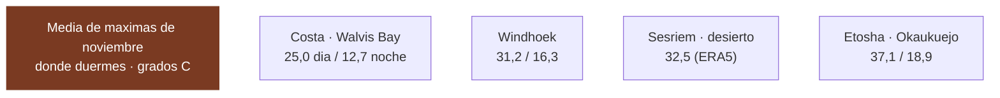

# 15 · Cómo se verificó esto

> **Namibia · 31 oct – 15 nov 2026 · la clásica del norte** — [← índice del dossier](README.md)
>
> Los datos duros del dossier con su fuente y su método: temperaturas de estación, viento, tasas,
> vuelos y lodges. Y al final, **la lista de lo que sigue sin cerrar**.
>
> **~N$20 = €1** *(rango 19,5–20,5)* · **✅** fuente primaria · **◐** secundaria concordante ·
> **○** práctica común, sin fuente · **❌** sin verificar, dicho en blanco
>
> *Investigación cerrada el 17/07/2026 · formato y contenido revisados el 03/08/2026*

> ### La regla de la casa
> **Todas** las temperaturas que circulaban por webs de safaris fueron **refutadas 0–3**. Las de aquí
> son **cálculo propio sobre ficheros de observación descargados** —NOAA GHCN-Daily y GSOD, y el
> reanálisis ERA5— no cifras copiadas. Donde no hay medición, **se dice en blanco**.
>
> *Aparecen estaciones del sur —Keetmanshoop, Karios— aunque el sur ya no esté en la ruta: son las
> series largas contra las que se comprueba si el reanálisis miente. Son instrumento de medida, no
> destino.*

---

## 🌡️ Temperatura — el hallazgo que invalida las webs de safaris

> ### El *«suicide month»* depende de la latitud. En Etosha octubre SÍ es el pico. En la costa, no.

**Etosha (Okaukuejo)** ✅ — estación `WA010517310`, serie **1975–2022**: octubre **37,8** · noviembre
**37,1** · diciembre **35,6 °C** de media de máximas; **mínimas de noviembre 18,9 °C**. Recalculado
dos veces de forma independiente, coinciden en 0,2 °C. **Octubre es el pico del norte, y bajando.**

**La costa (Walvis Bay)** ✅ — estación del aeropuerto `WAM00068098`, serie **1990–2025**. Es la
primaria más cercana a Swakopmund, a 30 km bajo la misma corriente de Benguela:

- sep **22,7** → oct **23,8** → **nov 25,0** → dic **25,4** → ene **26,1 °C**
- **mínimas de noviembre 12,7 °C** *(la madrugada más fría del viaje)*
- récord de noviembre 38,9 °C (2010), un *berg wind* aislado — manda la media

**Windhoek** ✅ — estación `68110`, 1.700 m, serie **1957–2025**: oct **30,5** · **nov 31,2** · dic
**32,1 °C**; mínimas de noviembre **16,3 °C**. Cálido de día, pero a 1.700 m refresca de noche.

**Sesriem** ◐ — **no existe estación que lo mida**, y eso está verificado, no supuesto: descargado el
inventario completo de GHCN, **Namibia tiene 11 estaciones con serie de máximas** y ninguna cae
cerca *(la más próxima, Gobabeb, está a 128 km y a 600 m menos de altitud)*. El **reanálisis ERA5**
le pone **~32,5 °C**, y el dato ◐ de NWR daba **34,1 / 15,5** — **coinciden en el entorno de
32–34 °C**.

> **La conclusión que importa:** «octubre es el peor mes» **solo vale para el interior norte**. En la
> costa el calor sube despacio de septiembre a enero. Por eso este dossier no usa medias nacionales.

**Fuente:** NOAA GHCN-Daily en AWS S3 —
`https://noaa-ghcn-pds.s3.amazonaws.com/csv/by_station/{ESTACION}.csv`— más `ghcnd-stations.txt` y
`ghcnd-inventory.txt`. Descargado y recalculado el 26/07/2026.

### 🛰️ Validado con un segundo dataset independiente ✅

**GSOD** (NOAA, partes de aeropuerto) es una red distinta de GHCN-Daily. En **Keetmanshoop**, que
existe en ambas, dan **exactamente lo mismo: 34,7 °C** de media de máximas de noviembre (2000–2024,
n≈620 días cada uno). Dos construcciones independientes, cero diferencia.

Y añade estaciones del eje norte: **Outjo 35,6 °C** *(camino de la puerta de Andersson)* ·
**Windhoek Eros 32,9** y **Hosea Kutako 32,1**.

> 💡 **Un matiz de método que conviene saber:** los 33,4 °C que el dossier tenía para Keetmanshoop
> eran la **normal de 68 años**; recortando la misma serie a 2000–2024 sube a **34,7**. La década
> reciente corre ~1,3 °C más caliente porque las décadas frías de mediados de siglo tiran de la media
> larga. **Ojo: no se puede generalizar** — en Okaukuejo ese salto no existe, porque su serie empieza
> en 1983 y ya es «reciente». Es un efecto de longitud de serie, no un calentamiento uniforme.

**Fuente:** NOAA GSOD en S3 — `https://noaa-gsod-pds.s3.amazonaws.com/{AÑO}/{ID}099999.csv`. Filtro
de calidad: se descartan máximas >45 °C por implausibles *(afectó a 5 días de 440 en una sola
estación, y mueve la media 0,1 °C)*.

### 🌍 ERA5 — el reanálisis, y cuánto se puede fiar uno ◐

Donde no hay estación, la única fuente que cubre cualquier punto del planeta es el **reanálisis**:
ARCO-ERA5 (ECMWF), rejilla de 0,25° ≈ 28 km. **No es una observación: es un modelo**, por eso va en
◐. Método: máximo de las horas 10–17 UTC de cada día, promediado sobre **9 noviembres (2013–2021)**,
n=270 días por punto.

**Contrastado contra estaciones reales**, el error no es uniforme:

- **Windhoek** — ERA5 31,0 vs GHCN 31,2 → **−0,2 °C**, casi idéntico
- **Keetmanshoop** — ERA5 33,9 vs 33,4/34,7 → **dentro de ±0,8 °C**
- **Walvis Bay** — ERA5 25,8 vs 25,0 → **+0,8 °C**, algo cálido *(la celda mezcla mar y tierra)*
- **Okaukuejo** — ERA5 35,2 vs 37,1 → **−1,9 °C**, aquí sí se queda corto

> **Lectura honesta:** ERA5 clava la meseta interior, va ~1 °C cálido en la costa y ~2 °C frío en la
> sabana seca. **El sesgo no se puede corregir con una constante**, así que las cifras se publican
> tal cual, avisando de hacia dónde tira el error en cada terreno.

### 🆕 Cerrados dos de los tres puntos sin estación: Spreetshoogte y Hoada ◐

**Método idéntico al de arriba, y validado antes de fiarse de él.** Se recalculó ERA5 con la misma
receta —máximo diario de las horas **10–17 UTC**, mínimo de las **00–07 UTC**, promediado sobre los
**9 noviembres 2013–2021 (n=270 días)** del mismo fichero ARCO-ERA5— y **primero se comprobó que el
cálculo reproduce los números ya publicados** en las celdas conocidas:

- **Windhoek** — recalculado **31,0** vs el 31,0 de arriba → **Δ +0,03 °C**
- **Okaukuejo** — recalculado **35,2** vs 35,2 → **Δ +0,04 °C**
- **Sesriem** — recalculado **32,5** vs 32,5 → **Δ −0,01 °C**

Tres regímenes distintos (meseta, sabana, desierto) clavados a **±0,04 °C**: el mismo tubo de
cálculo aplicado a los puntos sin medir es fiable. Con eso:

- 🏔️ **Spreetshoogte** *(campamento del D2, borde de la escarpa ~1.700 m)* — **media de máximas de
  noviembre 31,5 °C / mínima 17,1 °C** ◐ *(ERA5, celda −24,00 / 16,00)*. **Corrobora el proxy de
  Windhoek** que ya usaba `01`: misma altitud, mismo clima de meseta. Días extremos de la serie
  entre 22,5 y **38,0 °C**. Como es meseta —el terreno donde ERA5 apenas tiene sesgo— el número se
  puede tomar casi tal cual.
- 🔥 **Hoada / Grootberg** *(campamento del D8, Damaraland)* — **media de máximas 33,1 °C / mínima
  18,4 °C** ◐ *(ERA5, celda −20,00 / 14,00)*. Días extremos hasta **39,2 °C**. **Ojo al sesgo:**
  Damaraland es «sabana seca», el terreno donde ERA5 se quedó **~2 °C corto** en Okaukuejo, así que
  **el mediodía real de Hoada probablemente ronda 34–35 °C**, no 33. Trátese 33,1 como suelo, no como
  techo. Encaja con lo que decía `01`: entre la meseta (~31) y el norte caluroso, y con Twyfelfontein
  —en el valle, más abajo— aún más caliente a mediodía.

**El tercer punto, Terrace Bay, NO se puede cerrar así, y es un hallazgo en sí mismo.** Su celda ERA5
más cercana (−20,00 / **13,00**) cae **sobre el océano**: devuelve **~19,3 °C**, que es aire marino
sobre la corriente fría de Benguela, **no la temperatura en tierra del campamento**. Lo confirma el
control: la misma celda-más-cercana para **Walvis Bay dio 18,5 °C**, un absurdo frente a los **25,0
✅** de su estación —la celda es mar, no tierra—. Por eso, para la costa **sigue mandando el proxy de
estación real (Walvis Bay 25,0 ✅)** y no el reanálisis. Lo que ERA5 sí confirma de Terrace Bay es
que la capa marina la mantiene fría y estable *(máximos de la serie que no pasan de ~25 °C)*, en
línea con la niebla y el viento que ya se anotaban.

---

## 🌬️ Viento en la costa — y no es lo que su fama sugiere ✅

**Walvis Bay en noviembre promedia ~13 km/h** (GSOD, misma metodología). Es viento suave de media:
lo que molesta en la costa es la **niebla y el frío de madrugada**, no el vendaval. *(La fama ventosa
de esta costa viene de Lüderitz, 400 km al sur y fuera de la ruta.)*

## 🌅 Luz — superado por una fuente mejor

La ventana de luz se calculó por longitud para las fechas reales, y luego apareció algo mejor: **la
tabla oficial de horarios de puerta del parque**, que va con el orto y el ocaso. Para vuestras
fechas: **3–9 nov 06:13–19:06** y **10–16 nov 06:10–19:10**. El desglose día a día, con el sol de
cada parada, está en [`01`](01-itinerarios-dia-a-dia.md).

---

## 🎫 Tasas de parque 2026 — el precio subió, y mucho ◐

**Baremo del MEFT vigente desde el 1/04/2026**, localizado en el **Government Gazette nº 8877,
Government Notice nº 115**:

- **Adulto internacional: N$280 (~€14) por persona y día** = N$140 de entrada + N$140 de conservación
- Adulto SADC N$180 · namibio N$60 · **niño <8 gratis** en todas las nacionalidades
- **Vehículo hasta 10 plazas: N$60 (~€3)**

**Los tres parques de la ruta son «premium»** *(la tarifa alta)*: **Etosha, Namib-Naukluft** y
**Skeleton Coast**. Se cobra **por parque y por cada 24 h**, así que la ruta suma **7 unidades**.

> ⚠️ **Por qué esto sigue en ◐ y no en ✅:** la gaceta está localizada y las secundarias concuerdan,
> pero **el PDF primario del MEFT no se ha podido abrir** para verificar la tabla fina. Y ojo: una
> cifra de «N$75–150» que devolvió un buscador **está confabulada** — contradice a todas las demás.

---

## ✈️ Vuelos — cerrado en €1.366, y con qué se comparó

El billete del viaje está en [`02`](02-presupuesto.md). Lo que sigue es el **contexto de mercado**
con el que se juzgó si ese precio era razonable, y la lógica de la fiebre amarilla:

- **Ethiopian vía Adís** — la ruta elegida. MAD–ADD directo (~7 h) y ADD–WDH directo (~5 h 45), 4
  vuelos/semana. ⚠️ Adís **es zona de fiebre amarilla**: solo la escala corta *airside* evita el
  certificado, y la del viaje son 2h20 y 2h45.
- **Qatar vía Doha** ◐ — sin fiebre amarilla; rango gancho de agregador **desde ~€631** ida y vuelta.
- **Lufthansa vía Fráncfort** ◐ — sin fiebre amarilla; muestras de **~€673–715** ida y vuelta.
- **Airlink (JNB–WDH)** y **TAAG (Luanda–WDH)** ◐ — son solo el **conector regional**: hay que sumar
  el largo radio desde Europa. TAAG es la única que hace Luanda–Windhoek sin escala (2 h 30).

> Todas las cifras de arriba son **ganchos «desde» de agregador, sin fecha concreta** ◐ — sirven para
> situar el orden de magnitud, no para reservar. El precio real del viaje se cotizó aparte.

---

## 🏨 Lodges privados y antelación de reserva

**Novedad (03/08/2026): el año tarifario que cubre el viaje YA está publicado.** El hallazgo
anterior decía que noviembre caía en un año tarifario nuevo «sin publicar»; **eso ha caducado**.
Gondwana Collection publica ya su tarifa **1 nov 2026 – 31 oct 2027** —el año exacto del viaje— en
las páginas de cada alojamiento. Confirmado el rango de fechas en **cinco búsquedas independientes**
sobre sus propias URL *(gondwana-collection.com/accommodation/…)*.

> ⚠️ **Pero la extracción NO está verificada, y por eso todo esto va en ◐, no en ✅.** Las páginas
> de Gondwana siguen devolviendo **`403`** al abrirlas directamente desde este entorno; los números
> de abajo vienen de **fragmentos («snippets») del índice del buscador**, resumidos por un modelo,
> **sin poder abrir la ficha para comprobar la extracción**. Y ese riesgo es real: una pasada devolvió
> «Etosha Safari Lodge N$445 pp» —un disparate— que otra pasada corrigió a ~N$3.790–6.060/noche.
> **Trátalos como pistas con URL, no como precios cerrados. Confírmalos por email o teléfono antes de
> presupuestar.**

**Tarifas candidatas para 1 nov 2026 – 31 oct 2027** *(◐ extracción sin verificar, página en 403)*:

- 🛖 **Damara Mopane Lodge** *(Damaraland, cerca de la ruta D8)* — **B&B ~N$2.970 por persona en
  habitación compartida (~€149)**. Fuente: página propia de Gondwana vía snippet. *(Es tarifa de
  alojamiento, distinta de sus actividades: rastreo de elefante N$3.300 pp, sendero autoguiado
  N$250 pp — que el buscador tiende a devolver primero.)*
- 🦁 **Etosha Safari Camp** *(chalets junto a la puerta de Andersson, EN la ruta)* — **~N$2.220–3.550
  por noche (~€111–178)**. Fuente: agregador `south-african-lodges.com`, no la web propia → ◐ más
  débil; lo da como «media», sin distinguir por persona vs por unidad.
- 🏨 **Etosha Safari Lodge** *(el hermano de gama alta, misma zona)* — **~N$3.790–6.060 por noche
  (~€190–303)**. Mismo agregador, misma cautela.
- ⛺ **Camping de los Roadhouse de Gondwana** — **N$300 por persona (~€15)** para 1 nov 2026 – 31 oct
  2027, dato de la página propia *(medido en Canyon Roadhouse; el sur ya no está en la ruta, pero
  fija el nivel del camping Gondwana para el año nuevo)*.

**Lo que sigue sin cerrarse:** la tarifa **DBB por noche de la web propia** de los lodges de la ruta
*(Sesriem: Desert Camp, Desert Quiver, The Desert Grace; Swakopmund; Twyfelfontein Country Lodge —
que NO es de Gondwana; puertas de Etosha: Taleni, Toshari)*. El buscador devuelve sus **actividades**
antes que el alojamiento, y el `403` impide leer la ficha. Como referencia de gama media namibia
sigue valiendo **~€75–170 por noche para dos ◐** (rango de agregador). *(Twyfelfontein Country Lodge:
un agregador da «desde ~$223 pp DBB» para may–oct 2026 ◐; sin cifra limpia para noviembre.)*

**Antelación** ◐: la temporada alta namibia es **julio–octubre**, y **noviembre es hombro**. El
cuello de botella no es la temporada: es **estructural**, porque **Sesriem tiene 44 parcelas** y es
la única forma de estar en Deadvlei al amanecer.

---

## 🕳️ Lo que sigue sin cerrarse — la lista maestra *(al 03/08/2026)*

El inventario de huecos abiertos, para no tener que reconstruirlo leyendo todo el dossier.

**Bloquean algo con fecha:**

- ✈️ **¿Está emitido el billete?** Hay precio real (€1.366 p.p.) pero **el dossier se contradice**.
  **Sin billete no hay e-visa**, porque exige billete de vuelta.
- 🏕️ **Ninguna reserva consta hecha**: ni coche, ni Sesriem ×2, ni Terrace Bay *(sin ella no se entra
  al parque a pernoctar)*, ni las cuatro de Etosha.
- 💉 **La cita del Centro de Vacunación Internacional** — para salir el 31/10 hay que ser atendidos
  hacia el **19–26 de septiembre**. Se pide en agosto.
- 🪪 **El permiso internacional de conducir**: fuente ◐, y la DGT pide cita.

**Precios sin cerrar — el margen real del presupuesto:**

- 🛏️ **Tres campings sin cotizar**: Windhoek (D1 y D13), Walvis Bay (D5–D6) y Spreetshoogte. Los
  sitios están identificados; **ninguno publica tarifa abrible desde aquí**. **Reintento 05/08 —
  el muro de `403` es total**: no solo las webs propias, también **todos los agregadores y hasta
  ioverlander** *(arebbusch.com, africanreservations.com, madbookings.com, booking.com y
  ioverlander.com devuelven `403`)*, así que **la ficha no se puede abrir para comprobar la
  extracción**. Lo único que asoma son **fragmentos del índice del buscador, de un solo origen cada
  uno y sin verificar** — se anotan como pista **○, NO entran al presupuesto**:
  - **Urban Camp (Windhoek)** — el buscador da «desde ~R660–700 la noche para dos» *(booking.com,
    agregador, precio-gancho «desde»)* ≈ **N$660–700 (~€33–35) la pareja ○**. Encaja en la horquilla
    de práctica común que ya usa `02` (~N$600–1.000), así que **no la mueve**.
  - **Lagoon Chalets (Walvis Bay)** — un fragmento cita «N$600 la parcela para 1 coche + 2 personas»
    *(~€30 ○, origen único)*, pero **africanreservations marca «sin tarifas para 01 mar 2026 – 28 feb
    2027»**: corrobora que **para la ventana del viaje no hay tarifa publicada**. Queda en ○.
  - **Spreetshoogte** — ⚠️ **trampa de nombre viva**: hay al menos **tres** cosas llamadas
    «Spreetshoogte» junto al paso —el camping propio, **Namibgrens Guest Farm** y **Barkhan Dune
    Retreat**—, la misma confusión que ya dio el gancho de N$269,50 (Namibgrens). Los fragmentos dan
    «~N$120–150 por persona» *(~€6–7,50 ○, orígenes que se contradicen entre sí)*. **No se cierra**:
    sin abrir la ficha no se puede saber a cuál de las tres propiedades corresponde cada cifra. En
    `01` (D2) sigue como está: 150–300 ZAR/persona, vigencia desconocida.
  > **Conclusión 05/08:** ninguno pasa el listón de «verifica la extracción, no solo la fuente». Los
  > tres siguen en la estimación de práctica común de `02`; **estos números son pistas con URL para el
  > que llame a reservar, no precios para presupuestar**.
- 💳 **La fianza que retiene Namibia2Go** en la tarjeta — **PARCIALMENTE CERRADO ◐ (05/08), con un
  conflicto sin resolver**: la propia Namibia2Go se anuncia como **«No Deposit»** *(sin fianza, a
  diferencia de casi todos los operadores)* y su FAQ dice que **no hay depósito de combustible**;
  pero un revendedor —madbookings— y un directorio —goArid— citan que **se retiene N$2.500 (~€125) de
  depósito de combustible**, liberado si devuelves el depósito lleno. Las dos versiones son de fuentes
  secundarias *(la web propia está en 403)* y **se contradicen**: puede ser un cambio de política o
  depender del canal de reserva. **No lo des por sentado en ningún sentido — pregunta por escrito, al
  reservar, si hay retención en tarjeta y de cuánto.** Aceptan todas las tarjetas salvo Diners y Amex.
- 🚤 La **opción de búsqueda y salvamento del IATI** *(el **crucero de Walvis Bay**
  ~N$1.400–1.990 pp y el **4x4 a Sandwich Harbour** ~N$2.600–3.220 pp ya tienen rango de mercado 2026
  ◐ en [`02`](02-presupuesto.md), §9 — cruzado entre operadores, pero con la ficha propia en `403`).
- 📱 ~~La **SIM de MTC**~~ **CERRADA ◐ (05/08)**: paquete turista **«Leisure» N$349 (~€17) / 14 días /
  10,1 GB** *(justo la duración del viaje)* y **«Premium» N$659 (~€33) / 30 días / 20,1 GB**, solo en
  la tienda MTC del aeropuerto. Cifras convergentes entre la web de MTC, su PDF de T&C y un blog
  independiente, internamente coherentes; ◐ porque no se pudo abrir la página. Detalle en
  [`07`](07-logistica.md), §Cobertura.

**Datos que siguen abiertos:**

- 📏 ~~**La discrepancia del D9**: Hoada → Okaukuejo, ~315 vs ~340 km~~ **RESUELTA (04/08): son
  ~340 km.** Kamanjab → Outjo 156 km *(distancesto)* + Kamanjab → Okaukuejo 271 km *(CityMeter, vía
  Outjo)* corroboran los 265 de la matriz, y con los 75 km Hoada → Kamanjab dan **~340–346 km**. El
  ~315 de `01` queda refutado; ya corregido a 340. Detalle en [`13`](13-itinerario.md), §3.
- ⛽ **Diésel en Terrace Bay** — hay **surtidor con gasolina y diésel** junto a la recepción del
  resort *(ioverlander + relatos de viajeros ◐/○)*, pero **se queda sin combustible a veces** y
  conviene llevar efectivo: trátalo como respaldo, no como garantía. Sigue sin cerrar si hay diésel
  en el bucle Ugabmund–Springbokwasser.
- 🎫 **La tabla fina de tasas del MEFT**: el PDF primario sigue sin abrirse.
- 🚧 **Obras Okaukuejo–Halali — ACTUALIZADO 03/08 (◐, antes «hay que llamar»)**: ya hay **nota
  oficial de 2026** —MEFT `news/335` «Traffic deviation via Gemsbokvlakte road from Okaukuejo to
  Halali», con aviso paralelo de NWR— que fija un **desvío obligatorio del 2 jun 2026 al jul 2027**,
  así que en noviembre de 2026 estará activo con seguridad. La página oficial no se pudo **abrir**
  (403); las fechas convergen en **cinco fuentes secundarias**, por eso queda en ◐. Lo que sigue
  abierto: el **sobrecoste exacto en tiempo y km del desvío** —no lo publica nadie— y reconfirmar que
  sigue en pie *(NWR Okaukuejo, +264 67 229 800)*.
- 🕐 **Los horarios de salida de los safaris guiados de NWR**: no los publican en ninguna parte.
- 🌡️ ~~**Sin estación meteorológica**: Spreetshoogte, Terrace Bay y Hoada/Grootberg.~~ **CERRADOS
  DOS (04/08) con ERA5, validado a ±0,04 °C contra las celdas conocidas** *(ver arriba, §ERA5)*:
  **Spreetshoogte 31,5/17,1** y **Hoada 33,1/18,4** ◐. **Terrace Bay queda abierto a propósito**: su
  celda más cercana es océano (da 19,3 °C de aire marino, no tierra), así que la costa se sigue
  cubriendo con el proxy de estación real de Walvis Bay (25,0 ✅).

---

*Precios en N$ y € · ~N$20 = €1 · Las tarifas namibias cambian: reconfirma antes de pagar*
