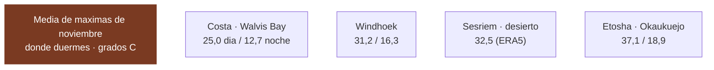

# 15 · Cómo se verificó esto

> **Namibia · 30 oct – 15 nov 2026 · la clásica del norte** — [← índice del dossier](README.md)
>
> Los datos duros del dossier con su fuente y su método: temperaturas de estación, viento, tasas,
> vuelos y lodges. Y al final, **la lista de lo que sigue sin cerrar**.
>
> **~N$20 = €1**, de bolsillo *(el cambio real de 2026 va por **18,5–19,4** — BCE, 28/08: el euro de estas páginas se queda ~7 % corto)* · **✅** fuente primaria · **◐** secundaria concordante ·
> **○** práctica común, sin fuente · **❌** sin verificar, dicho en blanco
>
> *Investigación cerrada el 17/07/2026 · formato y contenido revisados el 09/08/2026*

> ### La regla de la casa
> **Todas** las temperaturas que circulaban por webs de safaris fueron **refutadas 0–3**. Las de aquí
> son **cálculo propio sobre ficheros de observación descargados** —NOAA GHCN-Daily y GSOD, y el
> reanálisis ERA5— no cifras copiadas. Donde no hay medición, **se dice en blanco**.
>
> *Aparecen estaciones del sur —Keetmanshoop, Karios— aunque el sur ya no esté en la ruta: son las
> series largas contra las que se comprueba si el reanálisis miente. Son instrumento de medida, no
> destino.*

---

## 🌡️ Temperatura — el hallazgo que invalida las webs de safaris

> ### El *«suicide month»* depende de la latitud. En Etosha octubre SÍ es el pico. En la costa, no.

**Etosha (Okaukuejo)** ✅ — estación `WA010517310`, serie **1975–2022**: octubre **37,8** · noviembre
**37,1** · diciembre **35,6 °C** de media de máximas; **mínimas de noviembre 18,9 °C**. Recalculado
dos veces de forma independiente, coinciden en 0,2 °C. **Octubre es el pico del norte, y bajando.**

**La costa (Walvis Bay)** ✅ — estación del aeropuerto `WAM00068098`, serie **1990–2025**. Es la
primaria más cercana a Swakopmund, a 30 km bajo la misma corriente de Benguela:

- sep **22,7** → oct **23,8** → **nov 25,0** → dic **25,4** → ene **26,1 °C**
- **mínimas de noviembre 12,7 °C** *(la madrugada más fría del viaje)*
- récord de noviembre 38,9 °C (2010), un *berg wind* aislado — manda la media

**Windhoek** ✅ — estación `WA007401540` *(la GSN del aeropuerto de Eros, WMO 68110)*, 1.700 m,
serie **1957–2025**: oct **30,5** · **nov 31,2** · dic
**32,1 °C**; mínimas de noviembre **16,3 °C**. Cálido de día, pero a 1.700 m refresca de noche.

**Sesriem** ◐ — **no existe estación que lo mida**, y eso está verificado, no supuesto: descargado el
inventario completo de GHCN, **Namibia tiene 11 estaciones con serie de máximas** y ninguna cae
cerca *(la más próxima, Gobabeb, está a 128 km y a 600 m menos de altitud)*. El **reanálisis ERA5**
le pone **~32,5 °C**, y el dato ◐ de NWR daba **34,1 / 15,5** — **coinciden en el entorno de
32–34 °C**.

> **La conclusión que importa:** «octubre es el peor mes» **solo vale para el interior norte**. En la
> costa el calor sube despacio de septiembre a enero. Por eso este dossier no usa medias nacionales.

> ✅ **Reproducido el 25/08/2026 desde los ficheros crudos**, sin pasar por el cálculo de julio:
> descargados de nuevo `WA010517310`, `WAM00068098` y `WA007401540` y recalculadas las medias con
> las banderas de calidad fuera. **Las catorce cifras de arriba coinciden al décimo de grado** —las
> tres series, sus años y las mínimas de noviembre—. Es la prueba de no fabricación más fuerte que
> este documento puede dar: no es que la fuente exista, es que el número sale de ella.

**Fuente:** NOAA GHCN-Daily en AWS S3 —
`https://noaa-ghcn-pds.s3.amazonaws.com/csv/by_station/{ESTACION}.csv`— más `ghcnd-stations.txt` y
`ghcnd-inventory.txt`. Descargado y recalculado el 26/07/2026.

### 🛰️ Validado con un segundo dataset independiente ✅

**GSOD** (NOAA, partes de aeropuerto) es una red distinta de GHCN-Daily. En **Keetmanshoop**, que
existe en ambas, dan **exactamente lo mismo: 34,7 °C** de media de máximas de noviembre (2000–2024,
n≈620 días cada uno). Dos construcciones independientes, cero diferencia.

Y añade estaciones del eje norte: **Outjo 35,6 °C** *(camino de la puerta de Andersson)* ·
**Windhoek Eros 32,9** y **Hosea Kutako 32,1**.

> 💡 **Un matiz de método que conviene saber:** los 33,4 °C que el dossier tenía para Keetmanshoop
> eran la **normal de 68 años**; recortando la misma serie a 2000–2024 sube a **34,7**. La década
> reciente corre ~1,3 °C más caliente porque las décadas frías de mediados de siglo tiran de la media
> larga. **Ojo: no se puede generalizar** — en Okaukuejo ese salto no existe, porque su serie empieza
> en 1983 y ya es «reciente». Es un efecto de longitud de serie, no un calentamiento uniforme.

**Fuente:** NOAA GSOD en S3 — `https://noaa-gsod-pds.s3.amazonaws.com/{AÑO}/{ID}099999.csv`. Filtro
de calidad: se descartan máximas >45 °C por implausibles *(afectó a 5 días de 440 en una sola
estación, y mueve la media 0,1 °C)*.

### 🌍 ERA5 — el reanálisis, y cuánto se puede fiar uno ◐

Donde no hay estación, la única fuente que cubre cualquier punto del planeta es el **reanálisis**:
ARCO-ERA5 (ECMWF), rejilla de 0,25° ≈ 28 km. **No es una observación: es un modelo**, por eso va en
◐. Método: máximo de las horas 10–17 UTC de cada día, promediado sobre **9 noviembres (2013–2021)**,
n=270 días por punto.

**Contrastado contra estaciones reales**, el error no es uniforme:

- **Windhoek** — ERA5 31,0 vs GHCN 31,2 → **−0,2 °C**, casi idéntico
- **Keetmanshoop** — ERA5 33,9 vs 33,4/34,7 → **dentro de ±0,8 °C**
- **Walvis Bay** — ERA5 25,8 vs 25,0 → **+0,8 °C**, algo cálido *(la celda mezcla mar y tierra)*
- **Okaukuejo** — ERA5 35,2 vs 37,1 → **−1,9 °C**, aquí sí se queda corto

> **Lectura honesta:** ERA5 clava la meseta interior, va ~1 °C cálido en la costa y ~2 °C frío en la
> sabana seca. **El sesgo no se puede corregir con una constante**, así que las cifras se publican
> tal cual, avisando de hacia dónde tira el error en cada terreno.

### 🆕 Cerrados dos de los tres puntos sin estación: Spreetshoogte y Hoada ◐

**Método idéntico al de arriba, y validado antes de fiarse de él.** Se recalculó ERA5 con la misma
receta —máximo diario de las horas **10–17 UTC**, mínimo de las **00–07 UTC**, promediado sobre los
**9 noviembres 2013–2021 (n=270 días)** del mismo fichero ARCO-ERA5— y **primero se comprobó que el
cálculo reproduce los números ya publicados** en las celdas conocidas:

- **Windhoek** — recalculado **31,0** vs el 31,0 de arriba → **Δ +0,03 °C**
- **Okaukuejo** — recalculado **35,2** vs 35,2 → **Δ +0,04 °C**
- **Sesriem** — recalculado **32,5** vs 32,5 → **Δ −0,01 °C**

Tres regímenes distintos (meseta, sabana, desierto) clavados a **±0,04 °C**: el mismo tubo de
cálculo aplicado a los puntos sin medir es fiable. Con eso:

- 🏔️ **Spreetshoogte** *(campamento del D2, borde de la escarpa ~1.700 m)* — **media de máximas de
  noviembre 31,5 °C / mínima 17,1 °C** ◐ *(ERA5, celda −24,00 / 16,00)*. **Corrobora el proxy de
  Windhoek** que ya usaba `01`: misma altitud, mismo clima de meseta. Días extremos de la serie
  entre 22,5 y **38,0 °C**. Como es meseta —el terreno donde ERA5 apenas tiene sesgo— el número se
  puede tomar casi tal cual.
- 🔥 **Hoada / Grootberg** *(campamento del D9, Damaraland; el D8 se duerme en Twyfelfontein)* — **media de máximas 33,1 °C / mínima
  18,4 °C** ◐ *(ERA5, celda −20,00 / 14,00)*. Días extremos hasta **39,2 °C**. **Ojo al sesgo:**
  Damaraland es «sabana seca», el terreno donde ERA5 se quedó **~2 °C corto** en Okaukuejo, así que
  **el mediodía real de Hoada probablemente ronda 34–35 °C**, no 33. Trátese 33,1 como suelo, no como
  techo. Encaja con lo que decía `01`: entre la meseta (~31) y el norte caluroso, y con Twyfelfontein
  —en el valle, más abajo— aún más caliente a mediodía.

**El tercer punto, Terrace Bay, NO se puede cerrar así, y es un hallazgo en sí mismo.** Su celda ERA5
más cercana (−20,00 / **13,00**) cae **sobre el océano**: devuelve **~19,3 °C**, que es aire marino
sobre la corriente fría de Benguela, **no la temperatura en tierra del campamento**. Lo confirma el
control: la misma celda-más-cercana para **Walvis Bay dio 18,5 °C**, un absurdo frente a los **25,0
✅** de su estación —la celda es mar, no tierra—. Por eso, para la costa **sigue mandando el proxy de
estación real (Walvis Bay 25,0 ✅)** y no el reanálisis. Lo que ERA5 sí confirma de Terrace Bay es
que la capa marina la mantiene fría y estable *(máximos de la serie que no pasan de ~25 °C)*, en
línea con la niebla y el viento que ya se anotaban.

**Matiz anotado en el barrido del 11/08 y sin resolver**: las fuentes del *pueblo* de Walvis Bay
dan máximas de noviembre de **19–21 °C con un 88 % de humedad** — y su mes más cálido, febrero,
promedia 20,3 *([walvisbaynamibia.com](https://www.walvisbaynamibia.com/climate-weather-overview/)
· [weatherspark/MERRA-2](https://weatherspark.com/y/76231/Average-Weather-in-Walvis-Bay-Namibia-Year-Round))* — frente a los 25,0 ✅ de la estación GSOD. Huele a emplazamiento *(¿estación tierra
adentro frente a paseo marítimo?)*, pero no está comprobado. Para el equipaje da igual — la costa
es la zona fresca y húmeda en las dos lecturas — y el `05` lleva la horquilla entera (19–25).

---

## 🌬️ Viento en la costa — y no es lo que su fama sugiere ✅

**Walvis Bay en noviembre promedia ~13 km/h** (GSOD, misma metodología). Es viento suave de media:
lo que molesta en la costa es la **niebla y el frío de madrugada**, no el vendaval. *(La fama ventosa
de esta costa viene de Lüderitz, 400 km al sur y fuera de la ruta.)* **Corroborado el 12/08 ✅** con
la estación real del aeropuerto de Walvis Bay —23 años de observaciones, 08/2003–07/2026—: media
**anual** 8 nudos ≈ **14,8 km/h**, del oeste, con **rachas medias anuales de 24 nudos ≈ 44,4 km/h**
*([windfinder.com/windstatistics/walvis_bay_airport](https://www.windfinder.com/windstatistics/walvis_bay_airport))* — mismo orden de magnitud que el GSOD, aunque es dato anual y no desglosado a
noviembre. Swakopmund queda directamente **fuera de su ventana ventosa del año** (26 may–1 sep) ◐
*([weatherspark](https://weatherspark.com/y/76228/Average-Weather-in-Swakopmund-Namibia-Year-Round))*: noviembre cae en la banda tranquila.

## 🌬️ Y el viento de Etosha en noviembre, medido — flojo de fondo, con 1–3 muros de racha al anochecer *(12/08)*

- **Cómputo propio sobre GSOD de la estación de Okaukuejo** *(680100, años útiles ~2001–2021, 263
  días de noviembre)* ✅: media diaria **6,8 km/h**, máximo sostenido medio **16,7**, p90 **24** y
  techo de la serie **37 km/h sostenidos**; rachas ≥40 km/h en 33 de los 141 días que las
  reportan, con máximas de **63–66 km/h** *(18/11/2012, 28/11/2013, 27/11/2019)*. Octubre es casi
  idéntico de fondo. Fuente: [NOAA GSOD](https://www.ncei.noaa.gov/data/global-summary-of-the-day/access/)
  *(la vía tutiempo de esta estación está hueca; por NCEI la serie existe entera)*.
- **El ciclo diario juega a favor de la rutina** ✅: de noche la superficie se desacopla — el
  chorro del este sopla a 150–300 m de ALTURA, no en la tienda — y el viento en el suelo es flojo
  hasta las 08:00–09:00: **las 05:45 del desmontaje son la ventana más quieta del día**. El chorro
  baja a superficie a las 09:00–11:00, que es la hora clásica del polvo
  *([Wiggs et al. 2022, JGR Earth Surface](https://agupubs.onlinelibrary.wiley.com/doi/10.1029/2022JF006675) — un año de medición en el propio pan, con lidar en Okaukuejo)*.
- **El riesgo es vespertino y discreto**: los frentes de racha de tormenta *(cold pool outflows,
  el 39 % de los eventos de polvo del año medido)* arrancan **entre la puesta de sol y las
  22:30** — de la calma a **37–55 km/h en media hora**, el muro de polvo ANTES que la lluvia,
  ~81 minutos y se agota ✅ *(Wiggs)*. En los GSOD: **1–3 tardes-noches por noviembre** con racha
  de 45–66. Cae de lleno en la ventana de la charca de las 21:00 *(`18` §8)*.
- **Noviembre es el mes gordo del polvo medido in situ**: la teledetección clásica pone las plumas
  más frecuentes en jun–sep, pero el año medido en el pan dio **el mayor flujo anual justo en
  noviembre** *(571 g/m², el doble de la media invernal; el evento récord del año, un 5-nov)* ✅
  *(Wiggs)*. El viento que emite es **E-ENE** y las plumas viajan al W-SW: **Okaukuejo (D10) queda
  a sotavento del pan**, Namutoni a barlovento y Halali entre medias.
- **Umbrales de tienda de techo** ◐: iKamper prueba las suyas a **56 km/h** de cualquier dirección
  *([blog oficial](https://ikamper.com/blogs/ikampernation/how-to-prepare-your-roof-top-tent-for-windy-conditions))*, TentBox declara **80**
  *([guía](https://tentbox.com/blogs/help-and-guides/using-a-tentbox-roof-tent-in-strong-winds))* y
  para una lona genérica el especialista pide **cerrar a 63+**
  *([outdoorroadie](https://outdoorroadie.co.uk/pages/how-much-wind-can-a-roof-top-tent-withstand))*.
  El fondo de noviembre queda por debajo de todo; la racha convectiva entra en banda de «carcasa
  al viento y, con lona, cerrar». **El modelo de la tienda de techo de Savanna y su rating siguen
  sin confirmar ❌** *(la tienda en sí, 1,3×2,4 m, sí está confirmada — `20` §1)*.
- **En blanco**: weather-atlas (403), weatherspark (no tiene página de Etosha), el texto completo
  de Clements 2023 — la brisa que llega del Namib al anochecer de verano — de pago (abstract
  verificado). Y no existe climatología horaria de Okaukuejo en abierto: el ciclo diario descansa
  en un año medido, bueno pero uno.

## 🌬️ Y el viento del resto de la ruta — la costa manda, el desierto y Damaraland quedan en blanco *(12/08)*

**El ranking, con lo que hay:** costa (Walvis Bay/Swakopmund/corredor de Terrace Bay) > Windhoek >
Etosha > el resto, sin datos suficientes para ordenarlo.

- **Windhoek** ◐ — media de noviembre **14,3 km/h**, predominante del oeste
  *([weatherspark](https://weatherspark.com/y/81938/Average-Weather-in-Windhoek-Namibia-Year-Round))*: más ventoso de fondo que Etosha (6,8). Corroborado en orden de magnitud por la estación
  real de Eros Airport (14 años, 09/2012–07/2026): media anual 7 nudos ≈ **13,0 km/h**, rachas
  anuales 21 nudos ≈ **38,9 km/h**, dirección NNE ✅
  *([windfinder.com/windstatistics/windhoek_eros_airport](https://www.windfinder.com/windstatistics/windhoek_eros_airport))* — dato anual, sin desglose de noviembre. Frentes de racha de
  tormenta convectiva, plausibles por analogía con Etosha *(misma meseta, misma época)*, pero
  **sin fuente propia** ○.
- **Costa de los Esqueletos / Terrace Bay / Cape Cross** — la fama de viento fuerte que tira
  tiendas tiene un matiz de fondo con fuente: el mecanismo más extremo, el **Berg wind/Oosweer**,
  es **de invierno (abril–agosto)**, no de noviembre ◐ *([Wikipedia, Geography of
  Namibia](https://en.wikipedia.org/wiki/Geography_of_Namibia))* — coincide con lo ya cerrado del
  Oosweer en el bloque de sol y polvo del 11/08. La única estación de Terrace Bay encontrada mide
  un periodo (dic-2011 a jul-2012) que **no incluye ningún noviembre** y ya no reporta — su
  ~20,4 km/h de media, real pero de otra estación del año, **no es aplicable** ❌. Cape Cross:
  sin estación, sin dato ❌.
- **Spreetshoogte, Sesriem/Sossusvlei (incluida la cresta de las dunas al amanecer) y
  Damaraland/Twyfelfontein/Palmwag: hueco genuino, buscado a propósito y no encontrado** ❌ — ni
  estación, ni cifra de operador, ni mención de viento como riesgo de conducción en las guías de
  autoconducción de Spreetshoogte consultadas *(dos, abiertas y leídas — sus únicos peligros
  citados son la pendiente, la grava suelta y la falta de barrera de seguridad, no el viento)*.
  Un artículo académico sobre el régimen eólico del mar de dunas *(Lancaster 1985; solo resumen
  accesible, no el texto)* apunta a que hacia el interior del desierto el viento es «bimodal o
  complejo», distinto de la brisa costera simple — insuficiente para una cifra u hora.
- **Implicación práctica declarada, no medida** ○: con la tienda de techo montada —más superficie
  al viento que un coche normal— la prudencia en la C34 de la Costa de los Esqueletos es
  razonable dado lo medido en el resto de la ruta (rachas reales de hasta 44 km/h en la costa,
  37–66 en Etosha), pero ninguna fuente lo dice explícitamente para este tramo: es inferencia, no
  hallazgo.

## 🌅 Luz — superado por una fuente mejor

La ventana de luz se calculó por longitud para las fechas reales, y luego apareció algo mejor: **la
tabla oficial de horarios de puerta del parque**, que va con el orto y el ocaso. Para vuestras
fechas: **3–9 nov 06:13–19:06** y **10–16 nov 06:10–19:10**. El desglose día a día, con el sol de
cada parada, está en [`01`](01-itinerarios-dia-a-dia.md).

---

## 🎫 Tasas de parque 2026 — el precio subió, y mucho ◐

**Baremo del MEFT vigente desde el 1/04/2026**, localizado en el **Government Gazette nº 8877,
Government Notice nº 115**:

- **Adulto internacional: N$280 (~€14) por persona y día** = N$140 de entrada + N$140 de conservación
- Adulto SADC N$180 · namibio N$60 · **niño <8 gratis** en todas las nacionalidades
- **Vehículo hasta 10 plazas: N$60 (~€3)**

**Etosha es «premium» N$280 sin discusión** *(es la cifra que repiten todas las fuentes)*. El
presupuesto cuenta **7 unidades a N$280** (una por parque y por cada 24 h), pero **eso es la banda
alta CONSERVADORA, no un dato cerrado para los tres parques ○:**

- 🆕 **Aviso 12/08/2026 — la subida parece de DOS tramos, sin confirmar por egress.** Una búsqueda
  (WebSearch, **síntesis de fragmentos, nada descargado**) apunta a que la gaceta subió los parques
  emblemáticos de N$150 a **N$280** (+86 %) y **los demás de N$100 a ~N$200** (+100 %) — de ahí el
  titular «Namibia raises park fees by 80 to 100 percent». **No se pudo abrir NINGUNA fuente para
  confirmar en qué tramo cae cada parque**: MEFT (`news/199`), NWR, namibian.org, safarifind y el
  blog de TravelComments devuelven todos egress/403 aquí.
- 🆕 **15/08/2026 — el reparto premium/estándar aflora en los fragmentos, y coloca a Skeleton
  Coast en premium.** Dos búsquedas independientes (WebSearch, **de nuevo síntesis de fragmentos —
  ni una página se dejó descargar: MEFT, NWR, namibian.org, economist.com.na, safarifind,
  gettransfer, el blog de TravelComments y etoshanationalpark.com.na devuelven todos egress/403
  aquí**) coinciden en la MISMA lista de parques «premium» a **N$280**: *«premium parks such as
  Etosha National Park, Namib-Naukluft (excluding Sandwich Harbour), Skeleton Coast, and Waterberg
  Plateau»*, con los **estándar a N$200** (de N$100). Es decir: **los tres parques con noche de
  esta ruta —Namib-Naukluft (Sesriem), Skeleton Coast (Terrace Bay) y Etosha— caen los tres en
  premium N$280**, así que las 7 unidades del presupuesto NO están infladas por este lado. **Sigue
  en ◐/○, no en ✅**: es evidencia de fragmento convergente, sin una sola fuente abierta para
  verificar la extracción, y el PDF primario del MEFT sigue en 403 — confírmese por email. *(Antes
  se marcaba Skeleton Coast como «la unidad menos segura, podría ser estándar»; el riesgo a la baja
  por ese lado queda descartado — no por el otro: el tránsito self-drive Ugabmund–Springbokwasser
  sigue registrado GRATIS en `11`, distinto de la conservación de Terrace Bay.)*
- 🆕 **14/08/2026 — una secundaria legible al fin, con la tabla fina entera.** La
  [guía de tarifas de mat-travel](https://mat-travel.com/namibia/etosha/entry-fees/) ◐ publica
  para Etosha exactamente este baremo —N$280 (~€14) internacional, SADC N$180 (~€9), namibio
  N$60 (~€3), menor de 8 gratis, vehículo ≤10 plazas N$60 (~€3)— y añade el tramo que faltaba:
  niño 8-16 N$180 (~€9) internacional / N$100 (~€5) SADC. **Vale como concordancia, no como
  confirmación** *(la misma web falla estrepitosamente en geografía — auditoría en `aparte/`)*,
  y ojo: habla de tasa por **día natural**, no por bloque de 24 h como registró `12` §7 — una
  razón más para confirmarlo en recepción. Del reparto premium/estándar de los otros parques no
  dice nada.
- **Namib-Naukluft**: banda emblemática histórica (N$150) → muy probablemente premium N$280.
- **Skeleton Coast**: los fragmentos convergentes del **15/08 (arriba) la sitúan en premium N$280**,
  así que ya no es «la unidad menos segura» por precio de parque ◐/○. Donde sí queda margen a la baja:
  `11` registra que el **permiso de tránsito self-drive Ugabmund–Springbokwasser es GRATIS** ◐
  (distinto de la conservación de Terrace Bay); si ese tránsito no se cobra aparte, la cifra sobra —
  el presupuesto queda holgado, no corto.

> ⚠️ **Por qué esto sigue en ◐ y no en ✅:** la gaceta está localizada y las secundarias concuerdan,
> pero **el PDF primario del MEFT no se ha podido abrir** para verificar la tabla fina, ni el reparto
> premium/estándar por parque. Y ojo: una cifra de «N$75–150» que devolvió un buscador **está
> confabulada** — contradice a todas las demás.

- 🆕 **24/08/2026 — el muro del primario es total, y ya cubre los cuatro repositorios oficiales.**
  La gaceta se localizó por fin en un **índice de repositorio legal** —[Gazettes.Africa la lista
  como *«Namibia Government Gazette dated 2026-04-01 number 8877»*](https://gazettes.africa/akn/na/officialGazette/government-gazette/2026-04-01/8877/eng@2026-04-01)—
  y ese índice **concuerda con lo que ya tenía el dossier y añade el instrumento legal**: es el
  **Government Notice nº 115 de 2026, «Amendment of Regulations Relating to Nature Conservation»**,
  dictado al amparo de la **sección 84(1)(b)(iii) de la Nature Conservation Ordinance de 1975**, con
  efecto **1 de abril de 2026** ◐ *(síntesis del buscador sobre el índice de Gazettes.Africa; **la
  ficha no se dejó abrir para verificar la extracción de la tabla**, así que sigue en ◐, no en ✅)*.
  Lo que sí queda cerrado es que **el primario no es alcanzable desde este entorno por NINGUNA vía**:
  a los cuatro sitios oficiales ya conocidos —MEFT, incluida su descarga directa
  `meft.gov.na/files/downloads/543_Park Entrance and Conservation Fees.PDF`— se suman ahora
  **Gazettes.Africa, NamibLII (`namiblii.org`) y el Legal Assistance Centre (`lac.org.na`)**: los
  tres son los repositorios canónicos de gacetas namibias y **los tres devuelven 403 de política**
  aquí (egress), igual que MEFT. **Conclusión operativa para la próxima pasada: no se pierda tiempo
  reintentando estos cuatro — la tabla fina solo se cierra por email al MEFT o en recepción**; el
  presupuesto no se mueve, ya cuenta N$280.

---

## ✈️ Vuelos — EMITIDO en €1.536 (Oporto), y con qué se comparó

El billete del viaje está en [`02`](02-presupuesto.md) §8. Lo que sigue es el **contexto de mercado**
con el que se juzgó si ese precio era razonable, y la lógica de la fiebre amarilla:

- **Lufthansa vía Fráncfort y Múnich** — **la ruta elegida**, saliendo de **Oporto**. Una escala por
  sentido, **sin fiebre amarilla** *(ninguno de los dos hubs es zona de riesgo)*, y el largo radio
  parcialmente operado por **Discover Airlines**. Muestras de agregador anteriores la situaban en
  **~€673–715** ida y vuelta ◐ — el precio real del viaje, con equipaje y cargos, fue **€1.450
  p.p. al cotizar (05/08) y €1.536 p.p. al emitir (10/08)** ✅.
- **Qatar vía Doha** ◐ — sin fiebre amarilla; rango gancho de agregador **desde ~€631** ida y vuelta.
- **Airlink (JNB–WDH)** y **TAAG (Luanda–WDH)** ◐ — son solo el **conector regional**: hay que sumar
  el largo radio desde Europa. TAAG es la única que hace Luanda–Windhoek sin escala (2 h 30).
- ⚠️ **Los hubs que sí obligan a vacunarse** son los que están en zona de fiebre amarilla. La ruta
  elegida los evita por completo, así que **el certificado no hace falta** *(el árbol de decisión,
  en [`04`](04-guia-preparacion.md))*.

> Todas las cifras de arriba son **ganchos «desde» de agregador, sin fecha concreta** ◐ — sirven para
> situar el orden de magnitud, no para reservar. El precio real del viaje se cotizó aparte.

---

## 🏨 Lodges privados y antelación de reserva

**Novedad (03/08/2026): el año tarifario que cubre el viaje YA está publicado.** El hallazgo
anterior decía que noviembre caía en un año tarifario nuevo «sin publicar»; **eso ha caducado**.
Gondwana Collection publica ya su tarifa **1 nov 2026 – 31 oct 2027** —el año exacto del viaje— en
las páginas de cada alojamiento. Confirmado el rango de fechas en **cinco búsquedas independientes**
sobre sus propias URL *(gondwana-collection.com/accommodation/…)*.

> ⚠️ **Pero la extracción NO está verificada, y por eso todo esto va en ◐, no en ✅.** Las páginas
> de Gondwana siguen devolviendo **`403`** al abrirlas directamente desde este entorno; los números
> de abajo vienen de **fragmentos («snippets») del índice del buscador**, resumidos por un modelo,
> **sin poder abrir la ficha para comprobar la extracción**. Y ese riesgo es real: una pasada devolvió
> «Etosha Safari Lodge N$445 pp» —un disparate— que otra pasada corrigió a ~N$3.790–6.060/noche.
> **Trátalos como pistas con URL, no como precios cerrados. Confírmalos por email o teléfono antes de
> presupuestar.**

**Tarifas candidatas para 1 nov 2026 – 31 oct 2027** *(◐ extracción sin verificar, página en 403)*:

- 🛖 **Damara Mopane Lodge** *(Damaraland, cerca de la ruta D9)* — **B&B ~N$2.970 por persona en
  habitación compartida (~€149)**. Fuente: página propia de Gondwana vía snippet. *(Es tarifa de
  alojamiento, distinta de sus actividades: rastreo de elefante N$3.300 pp, sendero autoguiado
  N$250 pp — que el buscador tiende a devolver primero.)*
- 🦁 **Etosha Safari Camp** *(chalets junto a la puerta de Andersson, EN la ruta)* — **~N$2.220–3.550
  por noche (~€111–178)**. Fuente: agregador `south-african-lodges.com`, no la web propia → ◐ más
  débil; lo da como «media», sin distinguir por persona vs por unidad.
- 🏨 **Etosha Safari Lodge** *(el hermano de gama alta, misma zona)* — **~N$3.790–6.060 por noche
  (~€190–303)**. Mismo agregador, misma cautela.
- ⛺ **Camping de los Roadhouse de Gondwana** — **N$300 por persona (~€15)** para 1 nov 2026 – 31 oct
  2027, dato de la página propia *(medido en Canyon Roadhouse; el sur ya no está en la ruta, pero
  fija el nivel del camping Gondwana para el año nuevo)*.

> **Actualización (15/08/2026): dos fichas de Gondwana SÍ se abrieron** desde el entorno de
> consulta, con el tarifario 1 nov 2026 – 31 oct 2027 a la vista ✅: **Etosha Safari Camp,
> N$1.980 (~€99) por persona en B&B** *(N$3.960 · ~€198 la doble; sin fila de camping)* y
> **Etosha King Nehale, N$3.625 (~€181) pp en B&B**. Con esto el rango del agregador para el
> Safari Camp queda aclarado *(mezclaba por-persona con por-unidad)* y los dos bullets de Etosha de
> arriba pasan a histórico. Actividades 2026/27, enlaces y la comparación completa contra dormir
> dentro, en `aparte/desviacion-itinerario-chavetas.md` §8.

**Lo que sigue sin cerrarse:** la tarifa **DBB por noche de la web propia** de los lodges de la ruta
*(Sesriem: Desert Camp, Desert Quiver, The Desert Grace; Swakopmund; Twyfelfontein Country Lodge —
que NO es de Gondwana; puertas de Etosha: Taleni, Toshari)*. El buscador devuelve sus **actividades**
antes que el alojamiento, y el `403` impide leer la ficha. Como referencia de gama media namibia
sigue valiendo **~€75–170 por noche para dos ◐** (rango de agregador). *(Twyfelfontein Country Lodge:
un agregador da «desde ~$223 pp DBB» para may–oct 2026 ◐; sin cifra limpia para noviembre.)*

**Antelación** ◐: la temporada alta namibia es **julio–octubre**, y **noviembre es hombro**. El
cuello de botella no es la temporada: es **estructural**, porque **Sesriem tiene 44 parcelas** y es
la única forma de estar en Deadvlei al amanecer.

---

## 🦁 El safari de Etosha — decidido GUIADO ✅ *(08/08/2026)*

Criterio del viajero: *«el safari es un 90 % un buen guía»*. ⚠️ **Reducido el 24/08, y no por
decisión**: al anular Namutoni, las dos últimas noches se duermen fuera del parque y **las salidas
de NWR se venden a quien pernocta**. Queda comprable **2 salidas de mañana** *(Okaukuejo el D11 y
Halali el D12, N$650 pp ✅)* = **N$2.600 (~€130) la pareja**; **se caen la guiada de Namutoni y el
nocturno**, N$2.800 (~€140). Tarifa NWR verificada, **sin reservar**: horarios
de salida ❌ no publicados y pre-reserva incierta en temporada de lluvias — se cierra en
recepción (la pregunta a NWR está en el README, punto 7). **Lo que sustituye al nocturno lo vende
Onguma**: Sundowner Drive con foco, N$980 (~€49) pp ✅ — **decidido el 26/08 para el D12, junto con
el game drive diurno dentro de Etosha del D13, N$1.930 (~€97) pp** *(`02` §9)*. Los traslados entre campamentos siguen
siendo con el 4x4. El análisis descartado, en `16` §7.

## 🐾 Dos fichas nuevas en la guía — añadidas *(08/08/2026)*

**Babuino chacma** *(56 registros GBIF en el Namib, 58 en Damaraland ✅ — cifras en el JSON
versionado; el «mono» real de esta ruta)* y **ballena jorobada** *(210 en la costa, 55 en
oct–nov ✅)*. La guía pasa de 83 a **85 fichas** y las imágenes de 120 a **122**, con licencia y
autor verificados. **Ampliación de la misma tarde (08/08): +6 fichas por barrido de ausencias
contra GBIF** — mangosta rayada *(400 registros en Etosha ✅ — el gran ausente)*, gaviota de
Hartlaub *(6.334 en la costa ✅)* y avoceta *(3.944 ✅)*, más el trío del nocturno guiado: zorro
del Cabo *(31/10)*, gato montés africano *(39/8)* y lobo de tierra *(10/1 — el caso «liebre
saltadora»: nocturno infrarregistrado, documentado en la propia guía)*. **Quedan fuera con
datos**: duiker *(16/5)* y liebre del Cabo *(3/1)*. Total del 08/08: 91 fichas / 128 imágenes.

**Poda del 09/08 — regla nueva del viajero: la guía no lleva animales que nadie vio.** Fuera el
**oricteropo** *(el 0 % medido en 149 partes — la cifra más honesta del método, y por eso mismo
descalifica la ficha)*, la **suricata** y la **cebra de Hartmann** *(las dos con la banda forzada
«fuera de la ruta»: la propia guía decía que no caían en el eje)*. Los avisos de identificación se
conservan en `09` y en la ficha de la cebra de Burchell; el 0 % del oricteropo se queda contado
como anécdota de método. **Total del 09/08: 88 fichas / 125 imágenes.**

## 🔍 El primer barrido COMPLETO — +14 fichas *(10/08/2026)*

El del 08/08 comprobaba **ausencias sospechadas** (una lista pensada a mano); este preguntó a GBIF
por **todas** las especies registradas por clase —polígono del parque y caja del eje
Anderson→Okaukuejo→Halali→Namutoni→Von Lindequist, oct–nov— y cruzó clave contra clave con el
catálogo. Lo que salió se verificó en fuentes antes de tocar nada, con seis investigaciones en
paralelo, y **cada foto nueva se miró una a una** antes de fijarla. **Total vigente: 102 fichas /
139 imágenes.**

**Entraron 14** *(las bandas, con las bases de siempre: mamífero 4.529 · ave 69.600 · escamoso
187 en oct–nov)*: **águila rapaz** *(755 en oct-nov — la 7ª ave del catálogo por registros y
nadie la había echado en falta; UICN Vulnerable 2021 y En Peligro en Namibia, Simmons 2015)*,
**avefría armada** *(2.010)*, **drongo ahorquillado** *(1.623)*, **pintada común** *(1.016)*,
**bulbul encapuchado** *(993)*, **quélea común** *(718)*, **turaco unicolor** *(668)*, **toco
piquinegro** *(614)*, **turdoide caricalvo** *(219 — ~700 de sus ~770 registros del eje, en la
banda de Halali: el pájaro del camping)*, **ardilla de matorral de Smith** *(66 — «common in HAL
camp», mammalwatching 2012)*, **mangosta esbelta** *(15 — el Dik-dik Drive)*, **escinco
arborícola del Kalahari** *(38 de 187)*, **gecko de Fischer** *(16 — los muros de Okaukuejo, y su
gemelo C. turneri con cero registros en el eje)* y **galápago africano** *(sin línea de
posibilidades — Testudines no llega a la muestra mínima— pero con la mejor historia verificada
del día: Robel 2008, «Lanioturdus» 41 — unas 30 quéleas cazadas en dos horas por los galápagos de
la charca de Nuamses, 26/11/1997)*.

**Quedaron fuera con su dato**, y no por capricho: la **abubilla arbórea violeta** *(210 en
oct–nov y misma banda de Halali que el turdoide, pero la única foto libre de Commons es de la
raza keniana `granti` — usarla sería el «plausible pero falso» que este repo prohíbe; si algún
día aparece foto namibia, entra)*, la ***Agama etoshae*** *(14 registros, endémica y con el
parque en el nombre — pero **cero imágenes** en Commons)*, el **cálao de Monteiro** *(71 —
«Escasa»)* y la **tórtola de El Cabo** *(1.808 registros — banda sonora del parque más que
ficha)*. Y los descartes de siempre, ahora **recomprobados con números**: licaón *(1 registro en
todo el polígono)*, pangolín *(0 % en 149+48+16 partes)*, duiker *(corrobora el 16/5 del 08/08)*,
y la **cebra de Hartmann**, cuyos 10 registros de iNaturalist dentro del eje *(1,8 % frente a
Burchell)* se leen como confusión de turista: la decisión del 09/08 se sostiene.

**Tres sustos que se quedaron en nada, y se archivan para no re-asustarse**: los «565 flamencos
en oct-nov» del eje eran 559 registros de un solo dataset de 2007 con coordenadas degradadas *(el
«en noviembre no hay» del `09` aguanta)*; la «fuga por sinonimia» del pipeline era artefacto de
comparar cadenas *(dik-dik, alcélafo y gato montés resuelven a la misma clave; solo el chacal
pierde un bucket disjunto de 27 registros «Canis mesomelas» — la banda no cambia)*; y el 19 % de
ruano que declaran los viajeros de Okaukuejo choca con **2 registros GBIF en toda la historia del
polígono** *(el sable, 3)*: la nota escéptica de `avistamientos.py` queda respaldada.

**Y dos arreglos de documento**: el aviso de los **dos cálaos de pico rojo** *(ojo amarillo =
sureño, ojo oscuro = damara — Delport, Kemp & Ferguson 2004, The Auk; en la banda de Namutoni el
sureño saca ~2,6:1)* y la línea del **búfalo** en el `09` *(cuatro de los Big Five, no cinco:
Turner et al. 2022, con el Etosha Ecological Institute entre los autores — nunca reintroducido
por aftosa y tuberculosis bovina; el «retirado deliberadamente» de las webs, sin fuente)*. De
paso, el índice del `09` decía «abejaruco carmesí sureño» donde la ficha es la del **europeo**
—corregido— y la fuente `biodiversity.org.na` del impala **ha desaparecido de la red** *(HTTP 410
en todo el dominio)*: anotado en la propia fuente de la guía.

## 🔍 El barrido completo, parte II: las otras tres zonas — +13 fichas *(11/08/2026)*

Etosha quedó barrido el 10/08; **costa, Namib y Damaraland solo habían pasado por el filtro de
sospechas del 08/08**. La misma faceta completa sobre sus tres cajas (oct–nov, clave contra
clave, verificación en fuentes con cuatro investigaciones en paralelo, cada foto mirada antes de
fijarla) sube la guía a **115 fichas / 152 imágenes**.

**Las 13** *(bases oct–nov: costa 552 mamífero / 46.876 ave / 412 escamoso · namib 10.659 ave /
160 escamoso · damaraland 219 / 10.069)*: **delfín mular** *(31 registros — MÁS que los 26 del
Heaviside, que tenía ficha; población residente de 71–122, Namibian Dolphin Project; este doc
archivó su estacionalidad el 08/08 y nadie le hizo ficha)*, **charrán común** *(3.582 — el ave
más registrada de la costa en las fechas del viaje, por delante del cormorán del Cabo con 2.235;
170–180.000 estimados en Namibia en 1998 y ~100.000 en el conteo récord de 2004)*, **gaviota
cocinera** *(1.752 — empatada con la Hartlaub, 1.591)*, **estornino Naburup** *(453+312 —
Sossusvlei y Damaraland)*, **sisón de Damaraland** *(312)*, **avutarda de Namibia** *(173 — En
Peligro, UICN 2024)*, **alondra de las dunas** *(134 — con la letra pequeña del IOC: en julio de
2024 le fusionó la alondra de Barlow y el «único endémico estricto de Namibia» lleva asterisco)*,
**lorito de Rüppell** *(134 en Damaraland — el 10/08 se descartó por Etosha, 32, y era la
pregunta equivocada)*, **toco angoleño** *(128 en Damaraland — ídem: 71 en Etosha; nombre SEO
«toco angoleño», no el calco «cálao de Monteiro»)*, **inseparable de Namibia** *(116 — llevaba
desde el 03/08 citado de inquilino en la ficha del tejedor, sin ficha propia)*, **rata dassie**
*(13 de los 219 registros de mamífero de Damaraland — única especie viva de su familia; el dato
corrigió la hipótesis: su sitio es Twyfelfontein, 38 obs. iNat a <5 km, no Hoada)*, **gecko
diurno del Namib** *(50 de los 412 escamosos de la costa — la vuelta a la diurnidad, publicada)*
y **lagarto de nariz de cuña** *(55 de los 160 escamosos del Namib — 4× los registros del de
nariz de pala, que tenía la ficha: la tesis de Iiyambo (Pretoria 2018) explica el porqué — el
visitante camina por la base vegetada de la duna, que es hábitat del de cuña; el de pala vive en
la ladera de deslizamiento — y las dos fichas se cruzan aviso)*.

**Quedaron fuera con su dato**: el **charrán piquigualdo** *(presente, sin protagonismo
documentado)*, la **lavandera de El Cabo** *(el gancho del muelle no se pudo verificar)*, las
**limícolas una a una** *(su sitio es la línea de contexto de la intro: laguna Ramsar desde 1995,
«el humedal costero más importante del África austral», 242.000 aves en el conteo de 2004 — y de
paso el 60 % mundial del chorlitejo de El Cabo)*, los **geckos diurnos de Twyfelfontein como
ficha** *(el más registrado allí es R. diporus, no el boultoni de la hipótesis; se quedan como
dato de este archivo)* y el **eslizón de roca occidental** *(los «machos casi negros» no tienen
frase publicada — flecos de fuente)*.

**Y un hueco de método que se asume por escrito**: el campamento de **Spreetshoogte (D2) no
cae en ninguna de las cuatro zonas medidas** — sus fichas no pueden llevar banda de allí. Los
informes de birding del paso citan el chat de Herero *(restringido a Namibia y Angola, y no
garantizado: WINGS lo buscó en 2026 «without success»)*, collalbas y escribanos. Si algún día
hace falta, el arreglo es una caja nueva en `CAJAS` de `avistamientos.py`; hoy se prefiere
asumir el hueco a montar una zona para una noche.

**El archivo de la consulta puntual del 08/08/2026** *(API de GBIF sobre los polígonos de las
zonas; NO está en el JSON del build —que solo guarda totales y oct–nov— y por eso se deja aquí
mes a mes, ◐)*:

- **Jorobada, costa, por meses (ene→dic): 0 · 0 · 6 · 8 · 8 · 22 · 25 · 42 · 34 · 28 · 27 · 5**
  *(suma 205; los 5 registros restantes hasta los 210 de la zona van sin mes en GBIF)*
  → migración **jun–nov**, pico jul–sep, y noviembre todavía en temporada. El crucero del D7
  (5–6 nov) cae dentro.
- **Heaviside y mular**: registros repartidos por todos los meses — sin estacionalidad que
  planificar ◐.
- **Mono vervet** *(Chlorocebus pygerythrus)*: **sin un solo registro en las cuatro zonas** de la
  ruta → se descartó su ficha a propósito; habría sido el «plausible pero falso» que este repo
  prohíbe. *(No está en el catálogo, así que este cero no se re-genera con `make avistam`: vive
  solo aquí, con su fecha.)*

## 🦅 Rapaces y felinos: todos, y aparte — +33 fichas *(15/08/2026)*

La pregunta del día fue directa: **¿están en la guía todas las rapaces y todos los felinos?**
—que es lo que más interesa a quien viaja—. No estaban: la guía llevaba 9 rapaces y 4 felinos.
Para responder sin adivinar se hizo la misma faceta de GBIF que en los barridos del 10 y el 11/08,
pero **por grupo taxonómico entero** —órdenes Accipitriformes, Falconiformes y Strigiformes, y
familia Felidae— sobre las cuatro zonas de la ruta, oct–nov: eso devuelve **todas** las especies
del grupo con registro, no solo las que a uno se le ocurren. Salieron 47 accipitriformes, 12
falcónidos, 9 estrigiformes y 6 félidos con al menos un registro. El criterio para tener ficha es
el del propio método: **≥10 registros en oct–nov en alguna zona** *(bases: Etosha 69.600 ave /
4.529 mamífero; costa 46.876; Namib 10.659; Damaraland 10.069)*. La guía sube a **148 fichas /
197 imágenes**, y desde hoy los felinos y las rapaces **van en sus propias secciones**, delante
de mamíferos y aves, para encontrarlos de un vistazo.

**Las 31 rapaces nuevas** *(registros oct–nov en su mejor zona)*: cernícalo ojiblanco *(642 en
Etosha — el halcón más registrado del parque y nadie lo había echado en falta)*, alcotán turumti
*(309)*, gavilán gabar *(277)*, elanio común *(240)*, mochuelo perlado *(225)*, halcón borní
*(136)*, cernícalo africano o roquero *(112 en la costa, 107 en el Namib, 86 en Etosha)*, buitre
cabeciblanco *(107 — En Peligro Crítico)*, lechuza común *(106)*, halconcito africano *(104 en el
Namib — el inquilino del tejedor que la ficha del tejedor citaba desde el 03/08)*, culebrera
pechinegra *(91)*, águila azor africana *(83)*, autillo africano *(82)*, águila cafre *(80 en
Damaraland)*, búho manchado *(69)*, autillo cariblanco sureño *(65)*, culebrera sombría *(55)*,
busardo ratonero estepario *(52)*, busardo augur *(43 en Damaraland)*, milano negro *(34 — con el
piquigualdo, 8, dentro de la misma ficha)*, águila de Wahlberg *(33)*, águila calzada *(22 — la
misma que cría en España)*, búho moro *(22)*, halcón peregrino *(22)*, aguilucho caricalvo
*(21)*, aguilucho papialbo *(19)*, águila pescadora *(17 en la costa)*, gavilán chikra *(13)*,
aguilucho cenizo *(11)*, águila pomerana *(11)* y busardo augur meridional *(10 en el Namib)*.
Cada una con su foto mirada antes de fijarla —la hoja de contacto de *Ptilopsis granti* traía
cinco fotos de Kgalagadi que eran búhos lácteos jóvenes mal etiquetados: por eso se mira— y con
nombre en castellano de la Wikipedia ES (lista SEO), no calcado del inglés.

**Y dos felinos, uno de ellos contra el criterio y dicho a la cara**: el **caracal** *(3
registros en oct–nov en Etosha, 11 en toda la historia del polígono; el 12/08 se había dejado
fuera por eso mismo)* entra con la banda «Apenas registrada», que existe justo para esto; y el
**gato de patas negras** *(0 en oct–nov, 1 en toda la historia)* entra con la banda «Sin
registros» **por petición expresa: son siete felinos en todo el país, se pueden cubrir los seis
que tocan la ruta, y la ficha sirve para no confundirlo con el gato montés en el nocturno**. Es la
única excepción consciente a la regla del 09/08 *(«sin avistamientos, sin ficha»)* y va escrita
en la intro de la sección y en el `09`. El **serval** sigue fuera: cero registros en las cuatro
zonas, en toda su historia.

**Quedaron fuera con su dato** *(oct–nov, Etosha salvo que se diga)*: azor lagartijero oscuro
*(9 — se cita como confusión en la ficha del claro)*, gavilán ovambo *(8)*, búho del Cabo *(7)*,
buitre del Cabo *(6)*, cernícalo primilla *(5 — sus 87 registros del polígono son de diciembre en
adelante: 55 en diciembre)*, águila esteparia *(4)*, mochuelo de El Cabo *(4)*, cernícalo
patirrojo *(3)*, alimoche *(3)*, buitre encapuchado *(2)*, azor lagartijero somalí *(0 en oct–nov,
7 en total — probablemente confusiones)*, y el **halcón del Amur** *(2 en oct–nov de 71: 1 en
noviembre, 9 en diciembre, 34 en marzo — sus bandadas pasan justo después del viaje)*. Todos
nombrados en la intro de la sección de rapaces para que nadie los eche en falta.

**Tres cosas de método que salieron de paso**: (1) `avistamientos.py` gana un modo incremental —
`completa()`— que resuelve y cuenta solo las especies nuevas del catálogo sin rehacer las 115
anteriores ni volver a raspar Expert Africa, dejando los denominadores por clase y zona como
estaban *(así todas las fichas comparten la misma foto de GBIF)*; (2) GBIF reparte el buitre
orejudo entre **dos claves** *(Torgos tracheliotos 337/1.119 y T. tracheliotus 80/572 en Etosha)*:
la ficha cuenta la primera y por tanto se queda corta, y se anota aquí en vez de sumar a mano;
(3) los meses de los migrantes en el polígono de Etosha, que ahora sostienen el «mirad la fecha»
de la intro: ratonero estepario 45 en nov y 44 en dic *(0 de mayo a agosto)*, aguilucho papialbo
16 en nov, cenizo 10, pomerana 8, calzada 17, Wahlberg 14–18 de septiembre a noviembre *(llega a
criar)*, milano negro 30 en nov y piquigualdo 48 en dic *(llegan con las lluvias)*.

## 🧳 Franquicia de equipaje — cerrada ✅ *(07/08/2026)*

Era uno de los huecos del README *(«tres aerolíneas en la vuelta»)* y se cierra con fuente
primaria: **en un billete único del grupo Lufthansa, la franquicia es una para todo el itinerario
y la fija la tarifa, no cada operador**. Los tramos largos los opera **Discover Airlines** *(la
filial de largo radio de LH, que vuela Frankfurt/Múnich–Windhoek)* y aplica el reglamento de
equipaje del grupo: **Economy Classic = 1×23 kg (158 cm) por persona; Economy Light = ninguna;
cabina 8 kg + accesorio**. La única decisión real ya estaba avisada: **emitir con tarifa con
maleta**. Detalle y fuentes en [`02`](02-presupuesto.md) §8.

## 🌊 Mareas de Walvis Bay y 🌙 la luna — cerrados el 09/08/2026

- **Las mareas del D6–D8** *(Walvis Bay es el puerto patrón de la costa)* ◐ — leídas de la tabla
  de noviembre de 2026 de
  [tidetime.org](https://www.tidetime.org/africa/namibia/walvis-bay-calendar-nov.htm): **D6**
  bajamares 06:37 y 19:01 · **D7 — el día del tour: bajamares 07:18 y 19:38, pleamares 01:21 y
  13:27** · **D8** 07:54 y 20:12; el rango crece hacia las **mareas vivas del novilunio del 9**
  *(coherencia interna que respalda la tabla)*. Es **predicción comercial, no tabla náutica**
  *(las primarias —SANHO, Namport— no se abrieron desde aquí)*: vale para planificar la mañana
  del D7 —**la salida de Sandwich Harbour de las ~08:30 es la de la playa**—, no para navegar,
  y **el operador manda con su propia tabla**.
- **La fase lunar, calculada en casa** *(conjunción de referencia + mes sinódico; ±1 día en el
  instante)* — **luna nueva el 9–10 de noviembre**: las **cuatro noches de Etosha (D10–D13)
  entre el 0 y el 9 % de iluminación**, el amanecer de Deadvlei —que desde el 24/08 es el **D4**,
  un día antes— con un menguante del **~36 %**, y la salida (D1–D3) con una menguante del 47–68 %
  que sale ya de noche. El día a día, en el
  bloque 🌙 de `01`.

## ⛺ Spreetshoogte: tarifa cerrada con el rack del operador — y una trampa de calendario *(24/08/2026)*

Llevaba abierto desde el 09/08 y era **el único hueco de precio que bloqueaba una de las tres
reservas pendientes**. Se cierra porque **el muro de `403` cedió**: `barkhan.africa` —que el 10/08
no se dejó descargar, y por eso todo aquello quedó en ◐— **abrió**, y con él su página de tarifas
y los **PDF de rack** que cuelga, **uno por año tarifario**.

- **Lo que dice el rack que aplica** ✅ *([«2026 RACK CAMPING»](https://www.barkhan.africa/2026%20RACK%20CAMPING.pdf) — **01 dic 2025 a 30 nov 2026**)*: **Spreetshoogte Campsite estándar
  N$290 (~€14,50) por persona y noche**, **VIP con baño propio en la parcela N$680 (~€34)** y
  **Farmhouse N$225 (~€11)**; niño de 2 a 10 años, N$70 (~€3,50). Wifi gratis, parcela «stand
  only», **máximo 4 adultos**. Para una noche de los dos: **N$580 (~€29)** en estándar *(hasta el
  24/08 eran dos: N$1.160)*.
- ⚠️ **La trampa, y por dos semanas**: **el año tarifario de Barkhan va de DICIEMBRE a NOVIEMBRE**,
  no de noviembre a octubre como el de NWR. El PDF titulado **«2027» arranca el 01/12/2026**, así
  que sus N$300 **no son los de este viaje** — las noches del 1 y 2 de noviembre de 2026 caen en
  el rack anterior. Es el mismo error que ya se cazó con las tarifas NWR de los blogs, pero con el
  calendario corrido un mes: **coger el PDF cuyo título lleva el año del viaje habría sido
  equivocarse**.
- **Dos flecos más que caen con el mismo documento** ✅: la **leña** *(fardo de 10 kg **N$55
  (~€2,75)**; leña del calentador *donkey*, **N$30 (~€1,50)**)* y el **canal de reserva con su
  política** —bookings@barkhan.africa, **pago íntegro antes de llegar**, provisional guardada
  7 días, **50 % para confirmar**, cancelación **30–22 d 20 % · 21–15 d 50 % · 14–8 d 75 % ·
  7–0 d y no-show 100 %**—. Y la caminata guiada al **Ubib Grotto**, N$660 (~€33) pp, mín. 3.
- **Lo que queda REFUTADO**: los «150–300 ZAR/persona» del blog y los fragmentos de «~N$120–150» ○
  que este documento arrastraba desde el 05/08. Ninguno era el precio — **el estándar es N$290**.
- **Lo que sigue sin cruzarse** ❌: el contacto `spreetshoogte@iway.na · +264 62 572 010` del
  directorio de Visit Namibia ◐ **no se ha podido casar con este rack**; y el teléfono que el
  cuaderno tenía por «canal alternativo de wheretostay», **+264 83 000 0008, resulta ser el del
  propio Barkhan**. **Se reserva por el canal de Barkhan**, que es al que corresponde la tarifa.

---

## 💱 El tipo de cambio se ha movido — la banda de ~N$20 se quedó corta *(25/08/2026)*

Todo el dossier convierte al **convenio ~N$20 = €1 *(banda 19,5–20,5)*** de la cabecera. **Ese
convenio se ha quedado alto**: al mercado de agosto de 2026 el euro compra **menos** N$ de los que
supone la banda, así que **cada importe en N$ cuesta un poco MÁS euros de los que el dossier
escribe** — la conversión es optimista, no conservadora.

- **El anclaje que no se discute** ✅: el **dólar namibio está clavado 1:1 al rand sudafricano**
  *(y el ZAR es de curso legal en Namibia)* — [Wikipedia, «Namibian dollar»](https://en.wikipedia.org/wiki/Namibian_dollar).
  Es decir, quien manda sobre el N$/€ es el **EUR/ZAR**, que **flota**: la cifra de hoy no es la de
  noviembre.
- **La cifra de agosto de 2026** ◐: **1 € ≈ 18,6–19,1 N$** — 18,65 el 9 de agosto, banda de los
  últimos 30 días **18,61–19,15** *(media 18,88)*, y **media de todo 2026 de 19,11** *(mín. 18,59,
  máx. 19,83)*. Síntesis de WebSearch sobre xe/Wise/valutafx; **los conversores en sí devuelven
  egress/403 aquí** *(xe.com bloqueado)*, así que es **◐, no ✅** — el número no se descargó, pero
  converge entre varias fuentes y es objetivo. Fuentes: [xe EUR→NAD](https://www.xe.com/en-us/currencyconverter/convert/?Amount=1&From=EUR&To=NAD),
  [Wise EUR→NAD](https://wise.com/us/currency-converter/eur-to-nad-rate),
  [valutafx histórico](https://www.valutafx.com/history/eur-nad).
- **El efecto, acotado**: el desfase de ~19 frente a ~20 son **~5 %** *(y hasta ~7 % si toca la
  banda baja de 18,6)*, pero **solo sobre lo que se paga en N$ sobre el terreno** —combustible,
  comida, tasas de parque, camping y actividades—. **Las partidas grandes NO se mueven**: el vuelo
  *(€1.536 p.p., emitido)*, el coche *(€/día)* y el seguro *(€226 la pareja, ~€13/día)* ya están en euros. Por eso el
  total del `02` es **mucho menos sensible de lo que el titular sugiere**. Ejemplo tangible: la tasa
  de N$280 que el `15` §Tasas convierte en **~€14** al convenio son **~€14,7–15** al mercado real.
- 👉 **Acción — y lo que NO se hace esta noche**: **no se reescriben los precios**. El ~N$20
  redondo sigue valiendo como regla de bolsillo en el surtidor, y bajar la cabecera a ~19 dejaría el
  encabezado diciendo una cosa y las conversiones «~€» de todo el dossier *(calculadas a 20)*
  diciendo otra — peor el remedio. Lo correcto es **tratar la conversión de la parte en N$ como ~5 %
  optimista** y **revisar la banda cerca de la salida** *(finales de noviembre)*, cuando el EUR/ZAR
  del momento sea el que importe. Queda anotado como tarea de revisión, no como corrección aplicada.

---

## 🐆 Okonjima y el CCF, con tarifa 2026 — y el `11` daba el precio del game drive como rastreo *(27/08/2026)*

El PDF de actividades de Okonjima devolvía `403` a todo lo que no fuera un navegador, y el `11`
llevaba desde el 24/08 un «rastreo de leopardo N$880/970 ◐» sacado de un resumen de buscador. **Hoy
se abrió con `curl` y cabecera de navegador** —a `WebFetch` le sigue dando `403`—, junto con el rack
2026, y **la cifra era de otra línea**: N$880/970 es el **Game & Nature Drive**, sin telemetría; el
**rastreo de leopardo es N$1.450 en temporada baja y N$1.600 en alta** *(1 jul – 31 dic 2026: la
del viaje)*, igual que el nocturno y la hiena parda; rinoceronte a pie N$2.200; pangolín N$2.900 y
dos noches mínimo; **camping Omboroko N$880 + N$250 de tasa = N$1.130 por persona y noche**. Lo
que el PDF marca como «solo en el lodge, según tiempo y disponibilidad» —nocturno, rinoceronte,
senderos— no se puede reservar de antemano; el leopardo sí. **Corregido en `11`, en los desvíos y
en el nuevo [plan de felinos](aparte/plan-felinos.md)**; el «desde N$1.130» del `20` §7 era correcto
*(es por persona)*. Y el CCF, que sigue sin publicar precios en su web, tiene tabla 2026 en
info-namibia ◐: **tour N$290 · Cheetah Drive N$800 · Cheetah Run N$800** — el `11` y los desvíos
daban N$220/N$605, de una guía vieja *(el CCF está descartado del todo desde el 27/08 — el viajero: «más
un zoo que ver a los animales en libertad»—; el dato queda solo como registro)*. Fuentes: los dos PDF, enlazados en
`11`; [info-namibia — CCF](https://www.info-namibia.com/activities-and-places-of-interest/waterberg/cheetah-conservation-fund).

---

## 🔎 La auditoría de no-fabricación — *(25/08/2026)*

Cinco verificadores independientes, uno por bloque —dinero y reservas · horarios, carreteras y
normas · fauna · salud, seguro y trámites · clima, astronomía y geografía—, con una sola regla:
**nada se da por bueno si no se ha abierto la fuente**. Lo que devolvió 403 se anotó como «no
verificable», no como cierto. Y por mi cuenta, lo que se puede reproducir con cálculo o dato crudo.

**Lo que se REPRODUJO desde fuente primaria, al dígito:**

- 🌡️ **Las catorce cifras de temperatura** de Okaukuejo, Walvis Bay y Windhoek, recalculadas desde
  los ficheros crudos de NOAA GHCN-Daily *(arriba, §temperaturas)*.
- 🐾 **Los 51 porcentajes de avistamiento** de Expert Africa —17 especies × 3 campamentos—, leídos con
  el propio parser del repo, y los agregados del `09` reconstruidos sumando partes. Los recuentos de
  GBIF citados en el `01`, contra el JSON.
- 🛏️ **Todas las tarifas de NWR 2026/27** *(camping, Terrace Bay DBB, chalets, actividades, máximo
  8, aviso de lluvias)*, **las condiciones de NWR** *(20 %/48 h, 30 días, 30/75/100)*, **el rack de
  Onguma** y **el de Barkhan**, literalmente.
- ☀️ **Sol y luna** contra el USNO y **mareas** contra tidetime, día a día; luna nueva del 9 de
  noviembre a las 07:02 UT; **UTC+2 sin horario de verano** desde 2017.
- 🚗 **Los 80 km/h con caja negra en las condiciones del propio Savanna**, que hasta hoy solo se
  tenían de Asco. El **triángulo, reg. 233**. El **29 % de muertos 16:00–20:00**: 121 de 413 en la
  tabla horaria del NRSC 2019.
- 📞 **Todos los teléfonos de urgencia hospitalarios y de rescate**, contra la web de cada centro
  *(solo Tsumeb sigue en ◐, que es lo que merece)*. **La Liquor Act, s.46(2)**, cierre en domingo.
- 📍 **Las ocho coordenadas** muestreadas de `trazado.py`, al metro contra OSM.

**Lo que estaba MAL, y se corrigió:**

- 💳 **Onguma: las condiciones de cancelación estaban en el mismo PDF que el repo citaba** —cancelar
  el camping es el 100 %, **posponer por escrito no**—. El repo las daba por desconocidas. Cambia
  cómo se hace el desvío del CCF: se pospone la noche, no se anula.
- 🎫 **Cape Cross a N$150 + N$50 era la tarifa de 2021**; desde abril de 2026 está en el tramo
  premium: **N$620 (~€31) los dos**, +N$270. Y **el PDF del MEFT que se citaba como fuente del baremo
  2026 es la tabla de 2021** —retirado como fuente—.
- 🚪 **La tabla de horarios de Etosha marcada ✅ es la de 2025**; los tramos de 2026 caen en 2–8 y
  9–15 nov. Manda la puerta.
- 🚧 **Sí hay fase 2026 del desvío de obras**, con fecha en prensa *(1 de febrero de 2026, 47 km)*:
  el D11 se planifica con el desvío, no con la directa.
- 🦠 **Cólera también en Otjozondjupa**, con el caso más reciente *(3–6 meses, CDC)* y brote de
  diciembre de 2025; el `04` solo nombraba Kunene. 🔌 **Namibia usa enchufes tipo D y M**, no solo M.
- 🌙 La luna del **D13 va al ~15 %**, no «0–9». 🌧️ **Sí hay pluviómetro GHCN en Okaukuejo**
  *(1968–2022)*: el `14` decía que no había ninguna estación en el parque. 🗿 Los grabados de
  Twyfelfontein: **6.000–2.000 años**, no «2.000–5.000 ✅».
- Y marcas infladas rebajadas: SABAP1 es una *pers. obs.*; «364 días» del CCF no está en su web;
  «3,4 km» y «105 km» son enrutado propio, no fuente; Waterberg N$280 no está en la ficha de NWR.

**Lo que sigue sin poderse abrir desde aquí** *(y por eso sigue en ◐ o ❌, no en ✅)*: la gaceta
8877 del MEFT, el portal del e-visa *(WAF 468)*, las páginas de Lufthansa/Discover, la ficha de
UNESCO de Twyfelfontein, y la nota de prensa del Ministerio con el diésel de agosto *(que existe y
dice N$26,26, pero el dominio no resuelve)*.

## 🐆 El desvío al CCF — DESCARTADO *(26/08/2026)*

Era el último plan alternativo vivo del viaje: si a la tarde del D12 el guepardo no había salido, la
segunda noche de Onguma se cambiaba por el **Cheetah Conservation Fund**, con el Cheetah Run de las
08:00 a la mañana siguiente. Estaba medido entero *(331 km, mínimo ~3 h 26)*.

**Se descarta, y el argumento es de la propia guía de fauna**: el guepardo **«caza de día, a plena
luz»** ✅. El **D13 es el único día del viaje sin traslado y dentro del mejor terreno medido de
guepardo** —las llanuras del este, de donde salía el 50 % de Namutoni—, así que bajar al CCF
**gastaba justo ese día** para cambiar un guepardo salvaje por uno cautivo.

**Lo que cierra**, y no es poco:

- ✅ **Las dos noches de Onguma son firmes.** No hay que llamar a nadie desde Etosha ni decidir nada
  sobre la marcha: **no queda ninguna decisión de alojamiento abierta dentro del parque**.
- ✅ **Sale de la lista el hueco de las condiciones de cancelación de Onguma** ❌, que ya solo es un
  seguro por si algo obliga a mover la noche — no bloquea nada.
- ✅ **Y sale el «preguntar al CCF si tiene sitio»** ❌, que estaba en `20` §9 como opcional.

**Lo que abre**: **ya no hay red.** El plan del guepardo pasa a repartirse en **cuatro ventanas
diurnas** —`aparte/plan-del-guepardo.md`—, todas de animal suelto. *(La quinta, Otjitotongwe, y su
hueco de la hora de la alimentación salieron el 27/08: el viajero solo quiere animales en libertad,
y una granja de guepardos alimentados a mano es la misma categoría que el CCF.)*

*El descarte razonado y los números de lo que se comparó quedan en `aparte/decision-del-ccf.md`,
marcado como archivado.*

---

## 🕳️ Lo que sigue sin cerrarse — la lista maestra *(al 24/08/2026)*

El inventario de huecos abiertos, para no tener que reconstruirlo leyendo todo el dossier.

**Bloquean algo con fecha:**

- ✈️ **El billete está EMITIDO desde el 10/08** ✅ *(€1.536 p.p.; se cotizó en €1.450 el 05/08)*:
  **el e-visa queda desbloqueado** — pedirlo es el siguiente trámite con fecha.
- 🏕️ **El coche ya está reservado (Savanna, `20`); lo que sigue sin reservar es el alojamiento**:
  ni Sesriem ×2, ni Terrace Bay *(sin ella no se entra
  al parque a pernoctar)*, ~~ni las cuatro de Etosha~~ — ~~**ni la de Spreetshoogte**~~ *(el «closed
  down» quedó **refutado el 10/08** ◐ y la trampa de homónimos, aclarada: **lo opera Barkhan Dune
  Retreat** — «Camp Gecko» y Namibgrens son OTROS, `20` §5)*. **De
  Spreetshoogte ya no falta nada: la tarifa se cerró el 24/08** ✅ *(abajo, §Spreetshoogte)* **y la
  reserva se hizo el mismo día, por UNA sola noche**.
  **Las cuatro de Etosha están RESERVADAS** ✅ — y desde el **24/08 son Okaukuejo, Halali y
  **Onguma Tamboti ×2**: **Namutoni se anuló** *(`20` §4)*. **Sesriem ×2, Spreetshoogte y el Urban
  Camp de Windhoek también se cerraron el 24/08**, así que el contador del README va a **7 de 8**.
  **Queda una: Terrace Bay** —y una noche nueva sin tarifa, la de Twyfelfontein del D8, que a
  propósito **no se reserva** *(`aparte/decision-del-ccf`)*.
- 🚗 **Recotizar el coche con las fechas decididas** *(31 oct 11:00 → 14 nov 18:00, 15 días,
  aeropuerto → aeropuerto; el 31-oct fuera de temporada baja ❌ y la entrega EN el aeropuerto sin
  confirmar ❌ — `02` §2)*.
- 🛡️ ~~**Adelantar el seguro IATI al 30/10**~~ **CONTRATADO el 24/08** ✅ *(IATI **Estrella**,
  empezando ya el 30/10, con el código de Chavetas — dicho por el viajero)*. **Lo que queda no es
  la fecha, es el importe**: el día extra nunca se cotizó ❌ y el descuento de Chavetas no se
  verificó ❌, así que `02` sigue con los €113,02 p.p. de la cotización — **recuperar el pagado
  real de la póliza** *(`20` §3)*.
- 💉 **La cita del Centro de Vacunación Internacional** — para salir el 30/10 hay que ser atendidos
  hacia el **19–26 de septiembre**. Se pide en agosto.
- 🪪 **El permiso internacional de conducir**: fuente ◐, y la DGT pide cita.

**Precios sin cerrar — el margen real del presupuesto:**

- 🛏️ **Campings sin cotizar: CINCO noches en cuatro sitios** *(Spreetshoogte salió de esta lista el
  24/08 — ver §Spreetshoogte, abajo; y entró la noche nueva de Twyfelfontein)*: Windhoek **D1 y
  D14**, Walvis Bay **D5–D6** y Twyfelfontein **D8**. *(La del D1 está **reservada** en el Urban
  Camp, pero **sigue sin tarifa**: reservar no es saber cuánto cuesta.)* Los
  sitios están identificados; **ninguno publica tarifa abrible desde aquí**. **Reintento 05/08 —
  el muro de `403` es total**: no solo las webs propias, también **todos los agregadores y hasta
  ioverlander** *(arebbusch.com, africanreservations.com, madbookings.com, booking.com y
  ioverlander.com devuelven `403`)*, así que **la ficha no se puede abrir para comprobar la
  extracción**. Lo único que asoma son **fragmentos del índice del buscador, de un solo origen cada
  uno y sin verificar** — se anotan como pista **○, NO entran al presupuesto**:
  - **Urban Camp (Windhoek)** — el buscador da «desde ~R660–700 la noche para dos» *(booking.com,
    agregador, precio-gancho «desde»)* ≈ **N$660–700 (~€33–35) la pareja ○**. Encaja en la horquilla
    de práctica común que ya usa `02` (~N$600–1.000), así que **no la mueve**.
  - **Lagoon Chalets (Walvis Bay)** — un fragmento cita «N$600 la parcela para 1 coche + 2 personas»
    *(~€30 ○, origen único)*, pero **africanreservations marca «sin tarifas para 01 mar 2026 – 28 feb
    2027»**: corrobora que **para la ventana del viaje no hay tarifa publicada**. Queda en ○.
  - ~~**Spreetshoogte**~~ — **CERRADO el 24/08 y RESERVADO el mismo día, por UNA noche (D2)**:
    **N$290 (~€14,50) pp → N$580 (~€29) los dos**, del rack propio de Barkhan *(§Spreetshoogte,
    abajo)*. *(Queda como aviso de método la trampa de nombre: hay al menos **tres** cosas llamadas
    «Spreetshoogte» junto al paso —el camping, **Namibgrens Guest Farm** y **Barkhan Dune Retreat**—,
    la misma confusión que dio el gancho de N$269,50 y los «~N$120–150 por persona» de los
    fragmentos, todos refutados por el rack real.)*
  > **Conclusión 05/08:** ninguno pasa el listón de «verifica la extracción, no solo la fuente». Los
  > tres siguen en la estimación de práctica común de `02`; **estos números son pistas con URL para el
  > que llame a reservar, no precios para presupuestar**.

  **Avance del 09/08** *(los contactos, con URL, en `20`)*: **Urban Camp** reserva por NightsBridge
  y su propia web confirma que **no publica número** ✅; **Lagoon Chalets** tiene teléfono y un
  portal le publica **camping «desde R700» ≈ N$700 (~€35) para dos** ◐; y **Spreetshoogte** tiene
  email y teléfono ◐ — y el aviso de «closed down» quedó **refutado el 10/08** ◐ *(abierto,
  operado por Barkhan Dune Retreat — `20` §5)*. **Ninguna tarifa nueva
  verificada: los tres siguen en la estimación.**
- 💳 **La fianza que retiene Savanna en la tarjeta — CERRADO ✅ (12/08)**: es el importe de la
  franquicia/Excess, y con la Opción 4 la franquicia es **N$0** — no hay nada que retener por ese
  concepto. La hoja de condiciones firmada en la entrega SÍ deja otros cargos que sí pueden ir
  a la tarjeta: N$850 de gestión si hay cualquier daño, N$350 si Savanna paga una multa por
  cuenta del cliente, y el depósito de combustible sigue sin una cifra propia de Savanna —
  **N$2.500 (~€125) sin confirmar ❌**, cifra suelta de reventas, no de fuente primaria.
- 🛟 La **opción de búsqueda y salvamento del IATI Estrella: ❌ sin cotizar y, ahora, sin
  confirmar**. Con el **Estrella ya contratado (24/08)**, esto deja de ser una pregunta de compra
  y pasa a ser **una comprobación de la póliza**: en el Estrella la garantía es **opcional** —el
  Mochilero la trae de serie—, así que **no ha entrado sola**. Misma comprobación para la
  **evacuación aérea dentro del país** ❌ *(`20` §3)*.
- 🚗 El **traslado A Coruña ↔ Oporto — decidido (09/08): en coche propio**. **Cotizado el 10/08 en
  ~€180–185 la pareja ◐/❌** *(egress bloqueó abrir las webs oficiales, así que es candidato con URL,
  no cifra cerrada — confirmar antes de pagar)*:
  - **Parking de larga estancia** del aeropuerto Francisco Sá Carneiro: los oficiales más baratos son
    **P6 y P9 «Low Cost», €5,50/día** ◐ *(rango de los de larga estancia €5,50–16/día)* → **~€88–94**
    los 16–17 días (30 oct – 15 nov). Fuera del recinto, con lanzadera, desde ~€3,33/día ◐ *(Parkos)*.
    Reserva oficial en `store.ana.pt` / +351 229 410 787. — *WebSearch 10/08/2026; `store.ana.pt` y
    `parkos.com` no descargables (egress).*
  - **Peajes ≈ €40,80 i/v** ◐: **AP-9 A Coruña → Tui (frontera) €20,40/trayecto** *(tarifa 2026,
    vehículo ligero)* → €40,80 i/v; la **A28 Vigo ↔ Oporto es gratuita desde el 1 de enero de 2025**
    *(peaje suprimido; el ~€4–5 que aún circula es anterior)* → €0 en Portugal. La bonificación de
    ida y vuelta en <24 h de la AP-9 no aplica (17 días). — *Fuente legal citable no descargable:
    Ministerio de Transportes, tarifas AP-9 «Ferrol–frontera portuguesa» 2026 (PDF en
    `cdn.transportes.gob.es`).*
  - **Combustible ≈ €50–55** ❌: ~540 km i/v, ~6,5 l/100 km, gasóleo ~€1,45–1,55/l — **los dos
    supuestos sin verificar**.
  - *(El bus directo A Coruña → terminal, ~€17/persona y trayecto ◐, queda de plan B: i/v los dos
    ≈ ~€68 — `02` §8.)*
- 🛢️ La **capacidad real del depósito — CERRADO ✅ (12/08): 140 l**, doble depósito de 80+60 l,
  confirmado de fuente primaria (la propia oferta de Savanna). Cierra la aritmética del bucle
  Henties Bay → Kamanjab (~740 km, 81–96 l — `07`): cabe con margen, sin necesidad de repostar en
  Palmwag por obligación.
- 🚤 *(Cerrado a nivel de mercado ◐: el **crucero de Walvis Bay** ~N$1.400–1.990 pp y el **4x4 a
  Sandwich Harbour** ~N$2.600–3.220 pp tienen rango 2026 en [`02`](02-presupuesto.md) §9 —
  cruzado entre operadores, con la ficha propia en `403`.)*
- 📱 ~~La **SIM de MTC**~~ **CERRADA ◐ (05/08)**: paquete turista **«Leisure» N$349 (~€17) / 14 días /
  10,1 GB** y **«Premium» N$659 (~€33) / 30 días / 20,1 GB**, solo en la tienda MTC del aeropuerto.
  *(Ojo al calendario: activada el 31 de octubre, los 14 días llegan al 13 — el día del vuelo de
  vuelta puede quedar fuera; un bono «Aweh» lo tapa.)* Cifras convergentes entre la web de MTC, su
  PDF de T&C y un blog independiente, internamente coherentes; ◐ porque no se pudo abrir la página.
  Detalle en [`07`](07-logistica.md), §Cobertura.

**Huecos NUEVOS, que los abrió el cambio de ruta del 24/08:**

- 🎫 **¿La tasa de Etosha se cobra por 24 h o por entrada?** ❌ **N$620 (~€31) en juego.** Hasta el
  24/08 se entraba el D10 y se salía el D13 sin cruzar la puerta en medio, así que la pregunta no
  existía. Ahora **se sale el D12 por la tarde y se vuelve a entrar el D13 por la mañana**, y el
  dossier cuenta **4 unidades** apoyándose en que la tarifa se cobra *«por parque y por cada 24 h
  desde la entrada»* ◐ *(`03`)* — con ese criterio la reentrada cae dentro de la unidad ya pagada.
  **Si en la práctica la ventanilla cobra por entrada, son 5 unidades y N$620 más.** Se pregunta en
  la puerta de Andersson al entrar el D10, y **la respuesta cambia el presupuesto, no el plan**.
- 🕕 **El horario de recepción de Onguma** ❌, y ahora sí importa. El D12 se sale del parque
  **con Von Lindequist cerrando a las 19:10** y Onguma queda 3,4 km después: la llegada puede ser a
  las **~19:15–19:30**. Y su propia tarifa dice que **la cena y las actividades se reservan al
  llegar, en recepción** ✅. **Si recepción cierra antes, se pierden las dos cosas la primera
  noche.** Se pregunta en el mismo email que las condiciones de cancelación *(`20` §4)*.
  *(Con dos noches el daño es menor que con una: lo que no se cierre el D12 se cierra el D13.)*
- 🛏️ **La noche de Twyfelfontein (D8) no tiene tarifa NI candidato de camping confirmado** ❌ — los
  dos sitios identificados *(Twyfelfontein Country Lodge y la zona de Palmwag)* **son lodges**. Es el
  **único riesgo al alza serio del presupuesto**: presupuestada como camping *(~€35 la pareja)*,
  puede irse a **€150–200** si acaba siendo habitación *(`02` §3)*.
- 🦏 **El rastreo de rinoceronte: precio CERRADO el 28/08, y el encaje ROTO el mismo día.** La
  tarifa 2026/27 de Gondwana da el de **media jornada de Palmwag a N$3.975 (~€199) pp, mínimo 2** ✅
  — y con ella, el dato que faltaba: **sale entre las 06:00 y las 06:30**, no a media mañana. El
  plan del 24/08 *(salir de Twyfelfontein a las 07:00 y llegar a las 08:45)* **no llega**, así que
  lo que «compró la noche nueva del D8» era una suposición de horario, no un hecho. Sigue abierto
  **qué se hace en su lugar**: dormir el D8 en Palmwag *(cabe, N$7.950 · ~€398 la pareja)*, el
  **nature drive de ~07:00** *(N$1.355 · ~€68 pp ✅)* o nada. ⚠️ **Y de Grootberg falta la HORA de
  salida además del precio** ❌ *(res4@journeysnamibia.com · +264 61 228 104)* — es justo el dato que
  tumbó al de Palmwag.
- 🌙 **¿Vende NWR el nocturno guiado y la guiada de mañana a quien NO duerme en el campamento?** ❌
  **N$2.800 (~€140) en juego.** Al anular Namutoni, las dos últimas noches se duermen fuera y las dos
  actividades salieron del presupuesto. Si las venden igual, vuelven al plan *(`20` §4)*.

**Datos que siguen abiertos:**

- 📏 ~~**La discrepancia del D10**: Hoada → Okaukuejo, ~315 vs ~340 km~~ **RESUELTA (04/08): son
  ~340 km.** Kamanjab → Outjo 156 km *(distancesto)* + Kamanjab → Okaukuejo 271 km *(CityMeter, vía
  Outjo)* corroboran los 265 de la matriz, y con los 75 km Hoada → Kamanjab dan **~340–346 km**. El
  ~315 de `01` queda refutado; ya corregido a 340. Detalle en [`13`](13-itinerario.md), §3.
- ⛽ **Diésel en Terrace Bay** — hay **surtidor con gasolina y diésel** junto a la recepción del
  resort *(ioverlander + relatos de viajeros ◐/○)*, pero se secó en 2025 y NWR no lo publicita:
  **la regla operativa de `07`/`08` es tratarlo como que NO hay** — llena en Henties Bay y entra
  con autonomía para salir. Sigue sin cerrar si hay diésel en el bucle Ugabmund–Springbokwasser.
- 🎫 **La tabla fina de tasas del MEFT**: el PDF primario sigue sin abrirse — pero el **reparto
  premium (N$280) vs estándar (~N$200) por parque** quedó resuelto a nivel de fragmento el **15/08
  (◐/○, ver §Tasas arriba)**: la lista premium repetida por dos búsquedas independientes incluye
  Etosha, Namib-Naukluft (excl. Sandwich Harbour), **Skeleton Coast** y Waterberg — **los tres
  parques de esta ruta son premium N$280**. Falta sólo abrir el PDF primario para confirmar la
  extracción; el presupuesto no se mueve *(ya contaba N$280)*. **Actualización 24/08:** la gaceta
  se localizó en Gazettes.Africa —confirma que es el **Government Notice 115/2026** bajo la **Nature
  Conservation Ordinance de 1975** ◐— pero **los cuatro repositorios oficiales (MEFT, Gazettes.Africa,
  NamibLII y LAC) están todos bloqueados por política aquí**: la tabla fina solo se cierra por email
  o en recepción *(ver §Tasas arriba)*.
- 🚧 ⚠️ **Obras Okaukuejo–Halali — REABIERTO EL 24/08, y esta vez con las páginas primarias en la
  mano.** El 03/08 esto se dio por resuelto en ◐: cinco fuentes secundarias convergían en un
  **desvío obligatorio del 2 jun 2026 al jul 2027**, y las oficiales devolvían `403`. **El 24/08
  las dos oficiales SÍ se abrieron** —la [nota del MEFT `news/335`](https://www.meft.gov.na/news/335/TRAFFIC-DEVIATION-VIA-GEMSBOKVLAKTE-ROAD-FROM-OKAUKUEJO-TO-HALALI-ETOSHA-NATIONAL-PARK/)
  y el [aviso paralelo de NWR](https://www.nwr.com.na/nwr-announces-traffic-deviation-via-gemsbokvlakte-from-okaukuejo-what-etosha-visitors-need-to-know/)—
  **y ninguna de las dos dice eso**: las dos fechan el desvío **del 23 de abril al 30 de noviembre
  de 2025** ✅, es decir **una fase que ya terminó**, sobre «los primeros 20 km desde Okaukuejo»,
  dentro de un proyecto mayor de asfaltado **hasta la puerta de King Nehale**.
  - **Las dos lecturas posibles, y ninguna se puede cerrar desde aquí** ❌: **(a)** el proyecto es
    plurianual y hay una **fase 2026–2027** que las secundarias sí recogen pero cuyas páginas
    oficiales no se han encontrado — entonces el plan actual es correcto; **(b)** las fechas de
    2026–2027 son una síntesis mal hecha de buscador y **el desvío ya no está activo** — entonces
    el D11 podría ir por la directa, la ruta sería **~38 km más corta** y **Nebrownii y Kapupuhedi
    volverían a ser visitables**.
  - ⚠️ **Y esto no es un detalle de nota al pie: el desvío está METIDO en la ruta.** La etapa D11
    de `trazado.ETAPAS` va `okaukuejo → gemsbokvlakte → salvadora → halali`, así que **los 2.798 km
    del dossier ya lo cuentan**. Si la fase hubiera acabado, el total bajaría.
  - 👉 **Acción, y cae en la misma llamada que las reservas**: **preguntar a NWR Okaukuejo
    (+264 67 229 800) si el desvío sigue activo en noviembre de 2026**. Es la pregunta más barata
    de este documento y la que más kilómetros mueve. *(El sobrecoste en TIEMPO sigue sin
    publicarse: cuéntalo despacio.)*
  - ✅ **Lo que sí queda confirmado del 24/08**, y coincide con lo que ya decía `01`: mientras el
    desvío esté activo, **las únicas charcas accesibles entre Okaukuejo y Halali son
    Gemsbokvlakte, Sueda y Salvadora**.
  - 🆕 **La balanza se inclina hacia la lectura (a): el desvío SÍ sigue en pie en noviembre de 2026**
    *(24/08, segunda vuelta)*. Aparecen **fuentes de 2026** —no de 2025— que convergen en que las
    obras y su desvío están activos todo 2026:
    - Un tramo **nuevo se cierra el 1 de febrero de 2026**: el MEFT anunció el cierre temporal de un
      tramo de la carretera **Okaukuejo–Namutoni**, con el mismo desvío —Gemsbokvlakte, luego el
      bypass nuevo ~38 km hasta cruzar la principal, y el detour de Salvadora hasta reencontrarla a
      **~47 km de Okaukuejo**— y con el bypass **previsto terminado hacia el 26 de febrero de 2026**,
      tras lo cual el tráfico pasa al bypass nuevo. *([Informanté](https://informante.web.na/?p=388802),
      «Section of Okaukuejo–Namutoni Road to close temporarily from February».)*
    - El **desvío obligatorio «del 2 de junio de 2026 al julio de 2027»** —el que el 03/08 se sospechó
      síntesis mal hecha— vuelve a salir, ahora **ligado al proyecto plurianual entero, no a la fase
      de 2025**, en varias búsquedas independientes, con la frase «la ruta de bypass sigue vigente
      durante noviembre de 2026» y «la carretera principal directa entre los campamentos está cerrada;
      todo el tráfico, en ambos sentidos, va por los bypasses». *([namibian.org](https://namibian.org/blog/construction-of-new-main-road-through-etosha-progressing),
      [Tourism Update](https://www.tourismupdate.com/article/etosha-road-closed-for-upgrades).)*
    - El proyecto es la **C38 de Okaukuejo a la puerta de King Nehale, ~214–215 km** en total,
      detours a Halali y Namutoni incluidos; ficha en el **portal oficial de evaluación ambiental del
      MEFT**, [eia.meft.gov.na/web/projects/2464](https://eia.meft.gov.na/web/projects/2464). Detalle
      nuevo suelto: se nombra **«Rhino Drive»** como parte del acceso a Halali por el bypass ○.
  - ⛔ **El caveat que manda sobre todo lo anterior**: **en esta vuelta NO se pudo abrir ni una sola
    página** —el proxy de egress bloqueó `WebFetch` en TODAS (meft.gov.na, nwr.com.na, informante,
    namibian.org, tourismupdate, x.com, el blog de umhambi…)—, así que **todo esto es extracción del
    buscador, no lectura de la fuente**: la **fase de 2025 sigue siendo la única ✅** (páginas primarias
    leídas el 24/08 a primera hora); lo de 2026 es **◐/○ con la EXTRACCIÓN sin verificar ❌**. Hay
    además una tensión sin resolver —«bypass terminado hacia el 26/02/2026» frente a «desvío hasta
    julio de 2027»—: lo más plausible es que el tramo Okaukuejo→Halali/Namutoni se cerrara en febrero
    y el tráfico pasara al bypass nuevo, mientras el proyecto entero (214 km) sigue hasta 2027 con el
    desvío en pie, pero **no se puede reconciliar desde aquí**.
  - 👉 **Efecto sobre el plan**: **no se toca nada**. El D11 ya va por el desvío y los 2.798 km ya lo
    cuentan; la evidencia nueva **refuerza** que así debe quedarse. La llamada a **NWR Okaukuejo
    (+264 67 229 800)** sigue siendo la confirmación primaria —ahora para *confirmar*, no para *decidir*—
    y de paso el único modo de cerrar el sobrecoste en tiempo, que nadie publica.
- 🕐 **Los horarios de salida de los safaris guiados de NWR**: no los publican en ninguna parte.
- 🌡️ ~~**Sin estación meteorológica**: Spreetshoogte, Terrace Bay y Hoada/Grootberg.~~ **CERRADOS
  DOS (04/08) con ERA5, validado a ±0,04 °C contra las celdas conocidas** *(ver arriba, §ERA5)*:
  **Spreetshoogte 31,5/17,1** y **Hoada 33,1/18,4** ◐. **Terrace Bay queda abierto a propósito**: su
  celda más cercana es océano (da 19,3 °C de aire marino, no tierra), así que la costa se sigue
  cubriendo con el proxy de estación real de Walvis Bay (25,0 ✅).

**Los flecos menores, doc a doc** *(recogidos aquí el 09/08 para que esta lista sea de verdad el
inventario; ninguno bloquea una reserva — son preguntas de la entrega del coche, de cada recepción
o de un email)*:

- 🧰 **De la entrega del coche** *(`20` §1, `05`, `01` §D1)*: **con cuánto tanque entregan** el
  coche ❌ *(se entrega sin lleno, `20` §1)* · el **teléfono de emergencias 24 h de Savanna** ❌
  *(el servicio de asistencia 24 h SÍ existe, `20` §1 — falta el número)* · el **coste del
  conductor adicional** ❌ *(`02` §10)*. *(La nevera con batería propia y el hornillo ya constan
  en la oferta — `20` §1.)*
- ⚠️ **NUEVO (12/08): la zona sin cobertura del seguro que sí choca con la ruta.** De la lista de
  «zonas a riesgo propio» de la hoja de condiciones de Savanna, casi todas quedan fuera de esta
  ruta y no hace falta mirarlas *(Khaudum, Kaokoveld, Sandwich Harbour, el Kunene al este de Epupa
  Falls)* — la que sí importa es **«antes del amanecer y después del atardecer»** ✅. La salida a
  Deadvlei del D4 sale a las ~05:10, antes del amanecer *(`01` §D4)*: tal cual está, ese tramo
  **cae sin cobertura**, salvo que se pida por escrito que sea la única zona nombrada de la
  Opción 4. **Acción antes de firmar en la entrega: pedir explícitamente que la franja horaria de
  sunrise/sunset sea la zona cubierta.**
- ⚠️ **Contradicción sin resolver en la hoja de condiciones**: un párrafo dice que el seguro de
  neumáticos y luna de la Opción 4 cubre también en zona a riesgo propio; otro, más abajo en el
  mismo documento, dice literalmente que **«Tyre & Windscreen insurance will only apply if the
  vehicle was NOT driven in the own risk areas»** — justo lo contrario. No se resuelve
  adivinando: **pregúntalo directamente al firmar.**
- ⚙️ **Nuevo (12/08): el 4x4 se desactiva en asfalto y grava normal** ✅ — la hoja de condiciones
  lo marca como obligación: conducir con la tracción 4x4 puesta en firme duro daña la transmisión,
  y ese daño **no lo cubre ningún nivel de seguro**. Regla nueva para `06`.
- 🏕️ **De cada recepción** *(`18`)*: **enchufe por parcela** campamento a campamento ❌ *(NWR lo
  anuncia en los grandes ◐)* · **precio de la leña** ❌ *(**salvo Spreetshoogte**, que sí lo
  publica: N$55 el fardo de 10 kg ✅ — 24/08)* · **potabilidad del grifo** camping a
  camping ❌ · el **check-out del camping de Windhoek el D15** y si se puede volver por la tarde ❌
  *(`01` §D15)* · los **horarios de desayuno/restaurante** de los campamentos NWR y de Joe's ❌
  *(`01` §horarios)*.
- 📡 **Cobertura móvil en la escarpa de Spreetshoogte y la D1275** (noche D2): **sin dato** ❌
  — trátala como silencio *(`07` §Cobertura)*.
- 📷 **Tarifas 2026/27 de ProHire y Capture Namibia** *(alquiler de cámara en Windhoek)*: la
  publicada caduca el 31 de octubre — pedir por escrito ❌ *(equipo de fotografía, en el repo
  aparte)*.
- 🎈 ~~**El vuelo panorámico** *(Sossusvlei / Skeleton Coast)*: operadores reales con precio ✅ —
  globo con Namib Sky (N$9.920/persona) o avioneta con Sossusvlei Scenic Flights / Sossusfly
  (N$6.900–17.500 según ruta y grupo), todos desde Swakopmund o Kulala.~~ **DESCARTADO (24/08):
  el viajero decide no hacerlo** — el día de mar del D7 es la excursión a Sandwich Harbour en 4x4
  (`20` §7).
- 🎫 ~~**El tramo exacto de Cape Cross**~~ **cerrado a nivel ◐ (25/08)**: tramo premium, **N$280 +
  N$60 = N$620 (~€31) los dos** *(arriba, §Lo que estaba mal)*; queda el PDF primario del MEFT sin
  abrir, como para el resto de tasas. · La **parcela de Waterberg**: cifra fina sin extraer
  *(`11` §huecos)*.

---

*Precios en N$ y € · ~N$20 = €1 · Las tarifas namibias cambian: reconfirma antes de pagar*
