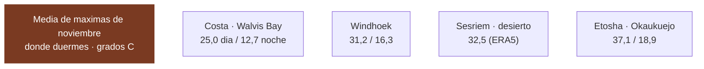

# 15 · Cómo se verificó esto

> **Namibia · 31 oct – 15 nov 2026 · la clásica del norte** — [← índice del dossier](README.md)
>
> Los datos duros del dossier con su fuente y su método: temperaturas de estación, viento, tasas,
> vuelos y lodges. Y al final, **la lista de lo que sigue sin cerrar**.
>
> **~N$20 = €1** *(rango 19,5–20,5)* · **✅** fuente primaria · **◐** secundaria concordante ·
> **○** práctica común, sin fuente · **❌** sin verificar, dicho en blanco
>
> *Investigación cerrada el 17/07/2026 · formato y contenido revisados el 03/08/2026*

> ### La regla de la casa
> **Todas** las temperaturas que circulaban por webs de safaris fueron **refutadas 0–3**. Las de aquí
> son **cálculo propio sobre ficheros de observación descargados** —NOAA GHCN-Daily y GSOD, y el
> reanálisis ERA5— no cifras copiadas. Donde no hay medición, **se dice en blanco**.
>
> *Aparecen estaciones del sur —Keetmanshoop, Karios— aunque el sur ya no esté en la ruta: son las
> series largas contra las que se comprueba si el reanálisis miente. Son instrumento de medida, no
> destino.*

---

## 🌡️ Temperatura — el hallazgo que invalida las webs de safaris

> ### El *«suicide month»* depende de la latitud. En Etosha octubre SÍ es el pico. En la costa, no.

**Etosha (Okaukuejo)** ✅ — estación `WA010517310`, serie **1975–2022**: octubre **37,8** · noviembre
**37,1** · diciembre **35,6 °C** de media de máximas; **mínimas de noviembre 18,9 °C**. Recalculado
dos veces de forma independiente, coinciden en 0,2 °C. **Octubre es el pico del norte, y bajando.**

**La costa (Walvis Bay)** ✅ — estación del aeropuerto `WAM00068098`, serie **1990–2025**. Es la
primaria más cercana a Swakopmund, a 30 km bajo la misma corriente de Benguela:

- sep **22,7** → oct **23,8** → **nov 25,0** → dic **25,4** → ene **26,1 °C**
- **mínimas de noviembre 12,7 °C** *(la madrugada más fría del viaje)*
- récord de noviembre 38,9 °C (2010), un *berg wind* aislado — manda la media

**Windhoek** ✅ — estación `68110`, 1.700 m, serie **1957–2025**: oct **30,5** · **nov 31,2** · dic
**32,1 °C**; mínimas de noviembre **16,3 °C**. Cálido de día, pero a 1.700 m refresca de noche.

**Sesriem** ◐ — **no existe estación que lo mida**, y eso está verificado, no supuesto: descargado el
inventario completo de GHCN, **Namibia tiene 11 estaciones con serie de máximas** y ninguna cae
cerca *(la más próxima, Gobabeb, está a 128 km y a 600 m menos de altitud)*. El **reanálisis ERA5**
le pone **~32,5 °C**, y el dato ◐ de NWR daba **34,1 / 15,5** — **coinciden en el entorno de
32–34 °C**.

> **La conclusión que importa:** «octubre es el peor mes» **solo vale para el interior norte**. En la
> costa el calor sube despacio de septiembre a enero. Por eso este dossier no usa medias nacionales.

**Fuente:** NOAA GHCN-Daily en AWS S3 —
`https://noaa-ghcn-pds.s3.amazonaws.com/csv/by_station/{ESTACION}.csv`— más `ghcnd-stations.txt` y
`ghcnd-inventory.txt`. Descargado y recalculado el 26/07/2026.

### 🛰️ Validado con un segundo dataset independiente ✅

**GSOD** (NOAA, partes de aeropuerto) es una red distinta de GHCN-Daily. En **Keetmanshoop**, que
existe en ambas, dan **exactamente lo mismo: 34,7 °C** de media de máximas de noviembre (2000–2024,
n≈620 días cada uno). Dos construcciones independientes, cero diferencia.

Y añade estaciones del eje norte: **Outjo 35,6 °C** *(camino de la puerta de Andersson)* ·
**Windhoek Eros 32,9** y **Hosea Kutako 32,1**.

> 💡 **Un matiz de método que conviene saber:** los 33,4 °C que el dossier tenía para Keetmanshoop
> eran la **normal de 68 años**; recortando la misma serie a 2000–2024 sube a **34,7**. La década
> reciente corre ~1,3 °C más caliente porque las décadas frías de mediados de siglo tiran de la media
> larga. **Ojo: no se puede generalizar** — en Okaukuejo ese salto no existe, porque su serie empieza
> en 1983 y ya es «reciente». Es un efecto de longitud de serie, no un calentamiento uniforme.

**Fuente:** NOAA GSOD en S3 — `https://noaa-gsod-pds.s3.amazonaws.com/{AÑO}/{ID}099999.csv`. Filtro
de calidad: se descartan máximas >45 °C por implausibles *(afectó a 5 días de 440 en una sola
estación, y mueve la media 0,1 °C)*.

### 🌍 ERA5 — el reanálisis, y cuánto se puede fiar uno ◐

Donde no hay estación, la única fuente que cubre cualquier punto del planeta es el **reanálisis**:
ARCO-ERA5 (ECMWF), rejilla de 0,25° ≈ 28 km. **No es una observación: es un modelo**, por eso va en
◐. Método: máximo de las horas 10–17 UTC de cada día, promediado sobre **9 noviembres (2013–2021)**,
n=270 días por punto.

**Contrastado contra estaciones reales**, el error no es uniforme:

- **Windhoek** — ERA5 31,0 vs GHCN 31,2 → **−0,2 °C**, casi idéntico
- **Keetmanshoop** — ERA5 33,9 vs 33,4/34,7 → **dentro de ±0,8 °C**
- **Walvis Bay** — ERA5 25,8 vs 25,0 → **+0,8 °C**, algo cálido *(la celda mezcla mar y tierra)*
- **Okaukuejo** — ERA5 35,2 vs 37,1 → **−1,9 °C**, aquí sí se queda corto

> **Lectura honesta:** ERA5 clava la meseta interior, va ~1 °C cálido en la costa y ~2 °C frío en la
> sabana seca. **El sesgo no se puede corregir con una constante**, así que las cifras se publican
> tal cual, avisando de hacia dónde tira el error en cada terreno.

---

## 🌬️ Viento en la costa — y no es lo que su fama sugiere ✅

**Walvis Bay en noviembre promedia ~13 km/h** (GSOD, misma metodología). Es viento suave de media:
lo que molesta en la costa es la **niebla y el frío de madrugada**, no el vendaval. *(La fama ventosa
de esta costa viene de Lüderitz, 400 km al sur y fuera de la ruta.)*

## 🌅 Luz — superado por una fuente mejor

La ventana de luz se calculó por longitud para las fechas reales, y luego apareció algo mejor: **la
tabla oficial de horarios de puerta del parque**, que va con el orto y el ocaso. Para vuestras
fechas: **3–9 nov 06:13–19:06** y **10–16 nov 06:10–19:10**. El desglose día a día, con el sol de
cada parada, está en [`01`](01-itinerarios-dia-a-dia.md).

---

## 🎫 Tasas de parque 2026 — el precio subió, y mucho ◐

**Baremo del MEFT vigente desde el 1/04/2026**, localizado en el **Government Gazette nº 8877,
Government Notice nº 115**:

- **Adulto internacional: N$280 (~€14) por persona y día** = N$140 de entrada + N$140 de conservación
- Adulto SADC N$180 · namibio N$60 · **niño <8 gratis** en todas las nacionalidades
- **Vehículo hasta 10 plazas: N$60 (~€3)**

**Los tres parques de la ruta son «premium»** *(la tarifa alta)*: **Etosha, Namib-Naukluft** y
**Skeleton Coast**. Se cobra **por parque y por cada 24 h**, así que la ruta suma **7 unidades**.

> ⚠️ **Por qué esto sigue en ◐ y no en ✅:** la gaceta está localizada y las secundarias concuerdan,
> pero **el PDF primario del MEFT no se ha podido abrir** para verificar la tabla fina. Y ojo: una
> cifra de «N$75–150» que devolvió un buscador **está confabulada** — contradice a todas las demás.

---

## ✈️ Vuelos — cerrado en €1.366, y con qué se comparó

El billete del viaje está en [`02`](02-presupuesto.md). Lo que sigue es el **contexto de mercado**
con el que se juzgó si ese precio era razonable, y la lógica de la fiebre amarilla:

- **Ethiopian vía Adís** — la ruta elegida. MAD–ADD directo (~7 h) y ADD–WDH directo (~5 h 45), 4
  vuelos/semana. ⚠️ Adís **es zona de fiebre amarilla**: solo la escala corta *airside* evita el
  certificado, y la del viaje son 2h20 y 2h45.
- **Qatar vía Doha** ◐ — sin fiebre amarilla; rango gancho de agregador **desde ~€631** ida y vuelta.
- **Lufthansa vía Fráncfort** ◐ — sin fiebre amarilla; muestras de **~€673–715** ida y vuelta.
- **Airlink (JNB–WDH)** y **TAAG (Luanda–WDH)** ◐ — son solo el **conector regional**: hay que sumar
  el largo radio desde Europa. TAAG es la única que hace Luanda–Windhoek sin escala (2 h 30).

> Todas las cifras de arriba son **ganchos «desde» de agregador, sin fecha concreta** ◐ — sirven para
> situar el orden de magnitud, no para reservar. El precio real del viaje se cotizó aparte.

---

## 🏨 Lodges privados y antelación de reserva

**El precio rack por noche sigue bloqueado** ❌: las webs de los lodges (Gondwana, Desert Camp y
compañía) devuelven `403` desde este entorno. Lo que sí hay es **rango de agregador ◐**: la gama
media namibia se mueve en **~€75–170 por noche para dos**. Hallazgo estructural que conviene
recordar: **los rack rates que asoman caducan el 31/10/2026**, así que noviembre entra en año
tarifario nuevo sin publicar.

**Antelación** ◐: la temporada alta namibia es **julio–octubre**, y **noviembre es hombro**. El
cuello de botella no es la temporada: es **estructural**, porque **Sesriem tiene 44 parcelas** y es
la única forma de estar en Deadvlei al amanecer.

---

## 🕳️ Lo que sigue sin cerrarse — la lista maestra *(al 03/08/2026)*

El inventario de huecos abiertos, para no tener que reconstruirlo leyendo todo el dossier.

**Bloquean algo con fecha:**

- ✈️ **¿Está emitido el billete?** Hay precio real (€1.366 p.p.) pero **el dossier se contradice**.
  **Sin billete no hay e-visa**, porque exige billete de vuelta.
- 🏕️ **Ninguna reserva consta hecha**: ni coche, ni Sesriem ×2, ni Terrace Bay *(sin ella no se entra
  al parque a pernoctar)*, ni las cuatro de Etosha.
- 💉 **La cita del Centro de Vacunación Internacional** — para salir el 31/10 hay que ser atendidos
  hacia el **19–26 de septiembre**. Se pide en agosto.
- 🪪 **El permiso internacional de conducir**: fuente ◐, y la DGT pide cita.

**Precios sin cerrar — el margen real del presupuesto:**

- 🛏️ **Tres campings sin cotizar**: Windhoek (D1 y D13), Walvis Bay (D5–D6) y Spreetshoogte. Los
  sitios están identificados; **ninguno publica tarifa**.
- 💳 **La fianza que retiene Namibia2Go** en la tarjeta: importe desconocido.
- 🚤 El **barco de Walvis Bay**, la **SIM de MTC** y la **opción de búsqueda y salvamento del IATI**.

**Datos que siguen abiertos:**

- 📏 **La discrepancia del D9**: Hoada → Okaukuejo son **~315 km según `01` y ~340 sumando tramos
  citados**. Nadie las ha conciliado; hasta entonces, presupuesta combustible con los 340.
- ⛽ **Si hay diésel en Terrace Bay** y en el bucle Ugabmund–Springbokwasser.
- 🎫 **La tabla fina de tasas del MEFT**: el PDF primario sigue sin abrirse.
- 🚧 **El estado de las obras Okaukuejo–Halali en noviembre de 2026**: la última nota oficial es de
  abril de 2025. **Hay que llamar** *(NWR Okaukuejo, +264 67 229 800)*.
- 🕐 **Los horarios de salida de los safaris guiados de NWR**: no los publican en ninguna parte.
- 🌡️ **Sin estación meteorológica**: Spreetshoogte, Terrace Bay y Hoada/Grootberg.

---

*Precios en N$ y € · ~N$20 = €1 · Las tarifas namibias cambian: reconfirma antes de pagar*
