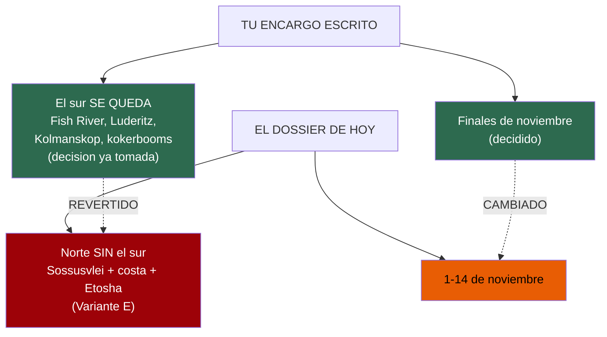
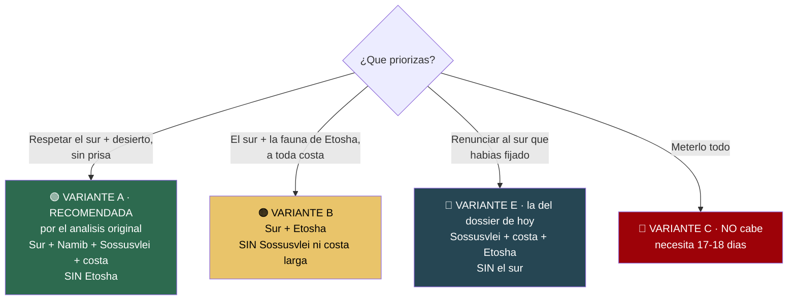
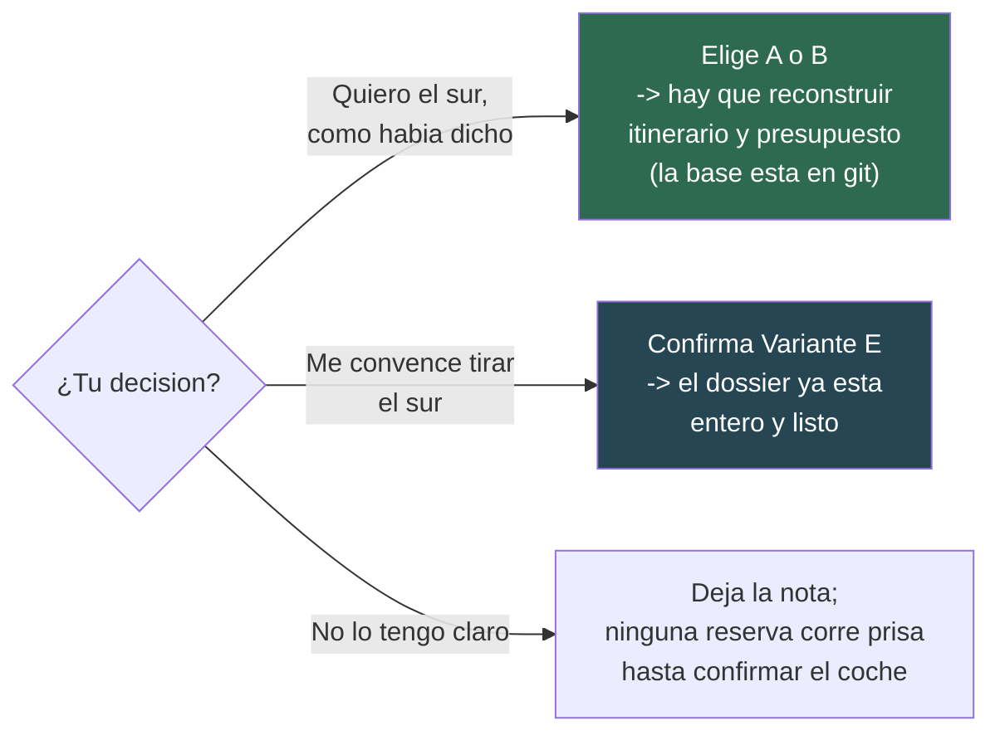

# 16 · Punto de decisión — el dossier se ha desviado de dos decisiones tuyas

> **Namibia · noviembre 2026 · la clásica del norte** — [← índice del dossier](README.md)
>
> Lo primero que deberías leer al despertarte. El resto del dossier está muy trabajado y es fiable en
> sus datos, **pero está construido sobre una ruta y unas fechas que contradicen dos cosas que habías
> dado por decididas.** Nada está reservado todavía, así que la decisión sigue **entera en tu mano**.
>
> **~N$20 = €1** *(rango 19,5–20,5)* · **✅** fuente primaria · **◐** secundaria · **○** práctica común ·
> **❌** sin verificar
>
> *Ficha levantada el 05/08/2026*

---

## 🔴 En una frase

El dossier ahora planifica **el norte sin el sur, del 1 al 14 de noviembre**. Tu encargo escrito decía
lo contrario en dos puntos que marcaste como cerrados: **«el sur SE QUEDA»** y **«finales de
noviembre»**. La desviación **puede estar bien** —hay motivos con datos— pero **no la has confirmado
tú**, y el análisis que la justificaba se borró de los documentos visibles. Esto te lo devuelve para
que lo decidas a la vista.

---

## 1. Qué decía tu encargo, y qué dice el dossier

- **El sur.** Tu instrucción, textual y bajo el epígrafe «DECISIONES YA TOMADAS — no las rediscutas»:
  *«El sur SE QUEDA: Fish River Canyon (miradores; el sendero está cerrado en noviembre), Lüderitz,
  Kolmanskop y el bosque de kokerbooms están dentro.»* — El dossier de hoy **quita el sur entero** y
  lo manda «a otro viaje» *(ver `02` §NOTA y `13` §nota de cabecera)*.
- **Las fechas.** Tu instrucción: *«finales de noviembre de 2026 (decidido: hay un precipicio de
  precio el 15 de noviembre)»*. — El dossier de hoy fija **1–14 de noviembre**, la primera quincena.

Ninguno de los dos cambios lleva tu confirmación. El de la ruta se apoya en una nota interna que dice
*«Decisión posterior del viajero: el sur se quitó entero»* **(`13`, en el histórico de git)** — una
frase que **no puedo verificar** y que choca de frente con tu encargo. La trato como **sin verificar**.

---

## 2. Lo que SÍ está bien hecho — y hay que respetarlo

No tires el trabajo: la parte dura es sólida y es la respuesta honesta que pediste.

> **La ruta completa NO cabe en 14 días.** Con el coche solo 12–13 días útiles, meter **Fish River +
> Lüderitz** (extremo sur) **y** Etosha (extremo norte) **y** Sossusvlei **y** la costa obliga a
> ~3.900–4.100 km y **17–18 días**. En 14 se convierte en un maratón de volante que además **anula el
> planteamiento de seguridad** del propio dossier (80 km/h en grava, llegar a las 18:00). Esto está
> calculado etapa a etapa y es de fiar *(`13`)*.

Pediste explícitamente *«si no caben, dilo y propón 2-3 variantes reales»*. **Una pasada anterior lo
hizo, y bien.** El problema no es el análisis: es que **una pasada posterior eligió por ti** la
variante que sacrifica lo que tú habías blindado (el sur), **borró las demás** de los documentos
visibles *(commit `d0320c3`, «Dejar en el dossier solo la ruta elegida»)*, y presentó el resultado
como reservas ya cerradas. Esa parte hay que deshacerla: la elección es tuya.

---

## 3. Las variantes reales — recuperadas para que elijas

*(El análisis completo, con el gantt de cada una y la aritmética de km, está intacto en git:
`git show d0320c3^:13-itinerario.md`. Aquí va el resumen fiel.)*

- 🟢 **Variante A — «Sur completo + Namib + costa», SIN Etosha. *Era la recomendada.*** La única que
  **respeta el sur que decidiste y deja respirar**: mantiene Fish River, Lüderitz/Kolmanskop, las dos
  joyas del desierto (Sossusvlei y Deadvlei al amanecer) y toda la costa, subiendo por la **D707**.
  ~12 días útiles, **ningún día pasa de ~300 km de grava**. Sacrificas Etosha (la fauna se ve, más
  modesta, en el sur y en reservas privadas de camino) y el Damaraland profundo.
- 🟠 **Variante B — «Sur + Etosha», SIN Sossusvlei ni costa larga.** Para quien Etosha es
  innegociable. Coherente pero menos elegante: es un «ocho» con **dos traslados de asfalto de
  550–570 km** (largos pero seguros). Pierdes **Sossusvlei y Deadvlei** —para muchos, el motivo entero
  de venir a Namibia— y Swakopmund. El propio análisis avisa: *«pregúntate en serio si renunciar a
  Sossusvlei compensa»*.
- 🔵 **Variante E — la que está montada hoy: Sossusvlei + costa + Etosha, SIN el sur.** Es una ruta
  buena y equilibrada… **pero solo si decides tú tirar el sur.** Es exactamente lo que tu encargo
  decía que NO se tocara. Si te vale, perfecto: el dossier ya está entero para ella. Si no, hay que
  reconstruir hacia A o B.
- 🔴 **Variante C — todo comprimido: NO la recomiendo.** ~320–360 km cada día sin un solo descanso,
  varios en grava. La respuesta honesta a «lo quiero todo» no es apretar, es **alargar a 17–18 días**,
  que dijiste que no es opción.

> **El matiz que más pesa:** cuando el análisis respetaba tu «el sur se queda», **lo que caía era
> Etosha, no el sur** (Variante A). El dossier de hoy hace justo lo contrario. No es que una sea
> «correcta»: es que la que está montada es la que **contradice tu decisión**, no la que la respeta.

---

## 4. Las fechas: por qué cambiaron, y si te conviene aceptarlo

El cambio de «finales de noviembre» a «1–14 nov» **tiene una lógica defendible**, pero va atada al
cambio de empresa de alquiler y conviene que lo confirmes:

- 🚗 **El «precipicio del 15/11» era de Asco.** Tu encargo lo daba por cierto *(alquiler €179/día antes
  del 15, €117 después)*. El dossier **cambió el coche a Namibia2Go**, que tarifa **plano ~€150/día**
  y entra en temporada baja **el 1 de noviembre**, no el 15 *(`02`, `06`)*. Con Namibia2Go, la fecha
  **ya no mueve el precio del coche**: el precipicio que motivaba «finales de noviembre» **desaparece**
  con ese cambio de empresa. ◐ *(la web de Namibia2Go da 403; tarifa vía revendedor)*.
- 🌧️ **La lluvia sí favorece la primera quincena, y con datos.** En las últimas 5 temporadas el inicio
  real de lluvias en Etosha cayó en **enero (×3), diciembre (×1) y noviembre (×1)** *(`14`, estación
  NOAA)*. La primera mitad de noviembre es, de media, **más seca** que la última. Esto es un punto real
  a favor del cambio, no marketing.
- ⚠️ **Pero decide en bloque, no suelto.** Si eliges **A o B (con el sur)**, la coherencia original era
  **Asco + finales de noviembre** (su precio barato empieza el 15). Si eliges **Namibia2Go**, la
  primera quincena es lo suyo. **Elegir empresa y fechas es una sola decisión**, no dos.

---

## 5. Estado real de las reservas — nada está cerrado

Esto es importante y el propio dossier se contradecía: **no consta hecha ninguna reserva.**

- 🛏️ Ni coche, ni las **2 noches de Sesriem**, ni Terrace Bay, ni las 4 de Etosha *(`15` §lista
  maestra; `07`)*. Todo son precios cotizados o estimados, **ninguno pagado**.
- ✈️ El vuelo tiene **precio real cotizado (€1.366 p.p. ◐)** pero **no consta emitido** *(`15`; `04`
  todavía lo lista como pendiente)*. Sin billete no hay e-visa.

> **Conclusión:** como no hay nada reservado, **el coste de cambiar de variante ahora es cero.** Este
> es el momento exacto para decidir, antes de pagar el primer euro.

---

## 6. Qué hacer con esto

- **Si el sur se queda (A o B):** dilo, y el itinerario y el presupuesto se reconstruyen sobre esa
  base *(que sigue medida y guardada en git, no hay que rehacerla de cero)*. Revisa entonces también
  coche (¿Asco por su precipicio del 15/11?) y fechas (finales de nov).
- **Si de verdad quieres tirar el sur:** el dossier actual (Variante E) ya está completo y es bueno.
  Solo faltaba que la decisión fuera **tuya y consciente**, no heredada de una pasada anterior.
- **Mientras decides:** no corre prisa nada salvo **confirmar la disponibilidad del coche**, que es el
  cuello de botella real *(la Budget de Namibia2Go figura disponible; ver README)*.

---

*Este documento no cambia la ruta ni reserva nada: solo te devuelve una decisión que era tuya y se
había tomado sin ti. El resto del dossier sigue siendo válido para la variante que elijas.*
