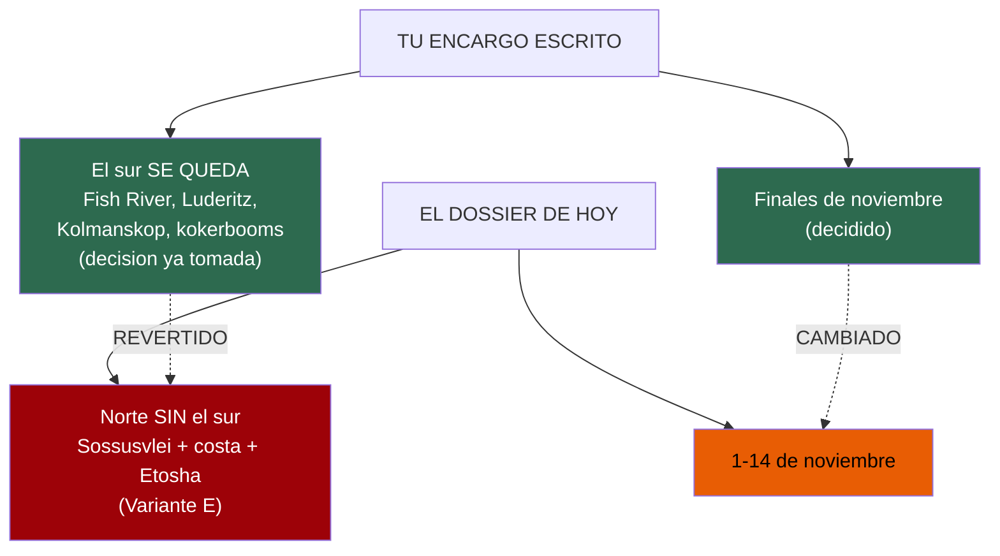
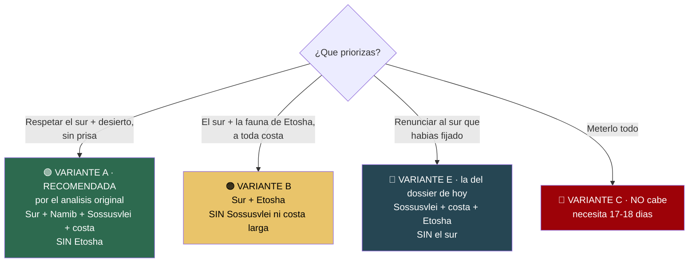
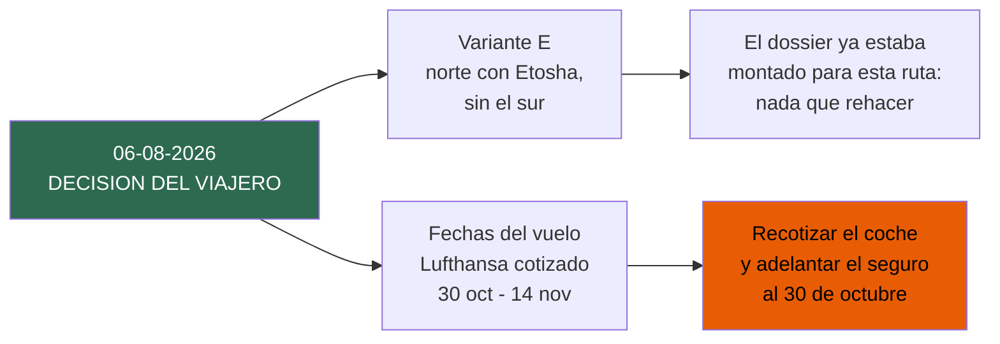
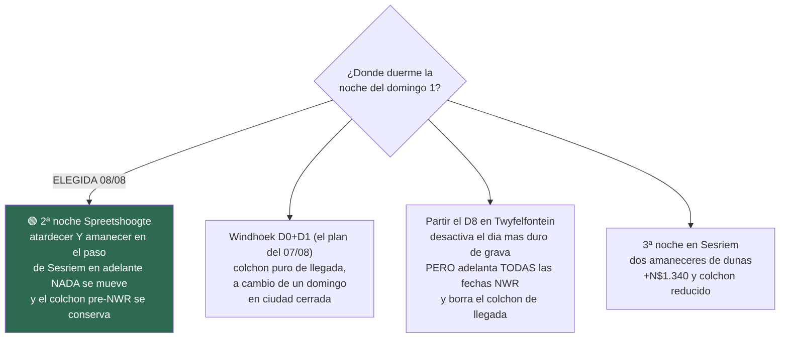

# 16 · Punto de decisión — CERRADO el 06/08/2026

> **Namibia · noviembre 2026 · la clásica del norte** — [← índice del dossier](README.md)
>
> ✅ **Decidido: la ruta del norte de 14 días —Variante E, con Etosha y sin el sur— y las fechas del
> vuelo de Lufthansa —cotizado, sin emitir—, 30 de octubre a 14 de noviembre.** Decisión del viajero, tomada a la vista de
> lo que hay debajo. **Esta ficha ya no pide nada**: se queda como registro de qué se comparó, qué se
> descartó y por qué, para que dentro de un año se pueda reconstruir el razonamiento.
>
> **~N$20 = €1** *(rango 19,5–20,5)* · **✅** fuente primaria · **◐** secundaria · **○** práctica común ·
> **❌** sin verificar
>
> *Ficha levantada el 05/08/2026*

---

## ✅ En una frase

El dossier planifica **el norte sin el sur**, con las fechas del vuelo de Lufthansa. El encargo
escrito decía lo contrario en dos puntos marcados como cerrados —**«el sur SE QUEDA»** y **«finales
de noviembre»**—, así que esta ficha se levantó para devolver la elección a su sitio. **El 06/08/2026
el viajero confirmó la ruta del norte y las fechas del vuelo**, y con eso la desviación deja de
serlo: es la ruta elegida. Lo que sigue es el registro de lo que se comparó.

---

## 1. Qué decía tu encargo, y qué dice el dossier

- **El sur.** Tu instrucción, textual y bajo el epígrafe «DECISIONES YA TOMADAS — no las rediscutas»:
  *«El sur SE QUEDA: Fish River Canyon (miradores; el sendero está cerrado en noviembre), Lüderitz,
  Kolmanskop y el bosque de kokerbooms están dentro.»* — El dossier de hoy **quita el sur entero** y
  lo manda «a otro viaje» *(ver `02` §NOTA y `13` §nota de cabecera)*.
- **Las fechas.** Tu instrucción: *«finales de noviembre de 2026 (decidido: hay un precipicio de
  precio el 15 de noviembre)»*. — El dossier de hoy fija **1–14 de noviembre**, la primera quincena.

Ninguno de los dos cambios lleva tu confirmación. El de la ruta se apoya en una nota interna que dice
*«Decisión posterior del viajero: el sur se quitó entero»* **(`13`, en el histórico de git)** — una
frase que **no puedo verificar** y que choca de frente con tu encargo. La trato como **sin verificar**.

---

## 2. Lo que SÍ está bien hecho — y hay que respetarlo

No tires el trabajo: la parte dura es sólida y es la respuesta honesta que pediste.

> **La ruta completa NO cabe en 14 días.** Con el coche solo 12–13 días útiles, meter **Fish River +
> Lüderitz** (extremo sur) **y** Etosha (extremo norte) **y** Sossusvlei **y** la costa obliga a
> ~3.900–4.100 km y **17–18 días**. En 14 se convierte en un maratón de volante que además **anula el
> planteamiento de seguridad** del propio dossier (80 km/h en grava, llegar a las 18:00). Esto está
> calculado etapa a etapa y es de fiar *(`13`)*.

Pediste explícitamente *«si no caben, dilo y propón 2-3 variantes reales»*. **Una pasada anterior lo
hizo, y bien.** El problema no es el análisis: es que **una pasada posterior eligió por ti** la
variante que sacrifica lo que tú habías blindado (el sur), **borró las demás** de los documentos
visibles *(commit `d0320c3`, «Dejar en el dossier solo la ruta elegida»)*, y presentó el resultado
como reservas ya cerradas. Esa parte hay que deshacerla: la elección es tuya.

---

## 3. Las variantes reales — recuperadas para que elijas

*(El análisis completo, con el gantt de cada una y la aritmética de km, está intacto en git:
`git show d0320c3^:13-itinerario.md`. Aquí va el resumen fiel.)*

- 🟢 **Variante A — «Sur completo + Namib + costa», SIN Etosha. *Era la recomendada.*** La única que
  **respeta el sur que decidiste y deja respirar**: mantiene Fish River, Lüderitz/Kolmanskop, las dos
  joyas del desierto (Sossusvlei y Deadvlei al amanecer) y toda la costa, subiendo por la **D707**.
  ~12 días útiles, **ningún día pasa de ~300 km de grava**. Sacrificas Etosha (la fauna se ve, más
  modesta, en el sur y en reservas privadas de camino) y el Damaraland profundo.
- 🟠 **Variante B — «Sur + Etosha», SIN Sossusvlei ni costa larga.** Para quien Etosha es
  innegociable. Coherente pero menos elegante: es un «ocho» con **dos traslados de asfalto de
  550–570 km** (largos pero seguros). Pierdes **Sossusvlei y Deadvlei** —para muchos, el motivo entero
  de venir a Namibia— y Swakopmund. El propio análisis avisa: *«pregúntate en serio si renunciar a
  Sossusvlei compensa»*.
- 🔵 **Variante E — la que está montada hoy: Sossusvlei + costa + Etosha, SIN el sur.** Es una ruta
  buena y equilibrada… **pero solo si decides tú tirar el sur.** Es exactamente lo que tu encargo
  decía que NO se tocara. Si te vale, perfecto: el dossier ya está entero para ella. Si no, hay que
  reconstruir hacia A o B.
- 🔴 **Variante C — todo comprimido: NO la recomiendo.** ~320–360 km cada día sin un solo descanso,
  varios en grava. La respuesta honesta a «lo quiero todo» no es apretar, es **alargar a 17–18 días**,
  que dijiste que no es opción.

> **El matiz que más pesa:** cuando el análisis respetaba tu «el sur se queda», **lo que caía era
> Etosha, no el sur** (Variante A). El dossier de hoy hace justo lo contrario. No es que una sea
> «correcta»: es que la que está montada es la que **contradice tu decisión**, no la que la respeta.

---

## 4. Las fechas: por qué cambiaron, y si te conviene aceptarlo

El cambio de «finales de noviembre» a «1–14 nov» **tiene una lógica defendible**, pero va atada al
cambio de empresa de alquiler y conviene que lo confirmes:

- 🚗 **El «precipicio del 15/11» era de Asco.** Tu encargo lo daba por cierto *(alquiler €179/día antes
  del 15, €117 después)*. El dossier **cambió el coche a Namibia2Go**, que tarifa **plano ~€150/día**
  y entra en temporada baja **el 1 de noviembre**, no el 15 *(`02`, `06`)*. Con Namibia2Go, la fecha
  **ya no mueve el precio del coche**: el precipicio que motivaba «finales de noviembre» **desaparece**
  con ese cambio de empresa. ◐ *(la web de Namibia2Go da 403; tarifa vía revendedor)*.
- 🌧️ **La lluvia sí favorece la primera quincena, y con datos.** En las últimas 5 temporadas el inicio
  real de lluvias en Etosha cayó en **enero (×3), diciembre (×1) y noviembre (×1)** *(`14`, estación
  NOAA)*. La primera mitad de noviembre es, de media, **más seca** que la última. Esto es un punto real
  a favor del cambio, no marketing.
- ⚠️ **Pero decide en bloque, no suelto.** Si eliges **A o B (con el sur)**, la coherencia original era
  **Asco + finales de noviembre** (su precio barato empieza el 15). Si eliges **Namibia2Go**, la
  primera quincena es lo suyo. **Elegir empresa y fechas es una sola decisión**, no dos.

---

## 5. Estado de las reservas cuando se tomó la decisión

*El estado vivo está en el [README](README.md); esto es la foto del 06/08/2026, que es lo que se
tuvo delante al decidir: **no constaba hecha ninguna reserva.***

- 🛏️ Ni coche, ni las **2 noches de Sesriem**, ni Terrace Bay, ni las 4 de Etosha *(`15` §lista
  maestra; `07`)*. Todo son precios cotizados o estimados, **ninguno pagado**.
- ✈️ El vuelo tiene **precio real cotizado (€1.450 p.p. ◐, Oporto → Windhoek, 30 oct – 14 nov)**
  pero **no consta emitido** *(`15`; `04`
  todavía lo lista como pendiente)*. Sin billete no hay e-visa.
- ✈️ **Ese vuelo es el de Oporto, y trae cola** ◐: **Lufthansa, 30 oct – 14 nov**, una escala por
  sentido y **12h40 menos de avión** que el de A Coruña. **Aterriza el 31 de octubre**, así que da
  **un día más de suelo** — y obliga a adelantar el seguro un día y a renegociar el primer día de
  coche. *(El buscador lo anuncia en €1.341; el precio real al cerrar es el de arriba.)*
  **El desglose está en [`02` §8](02-presupuesto.md).** Ojo: **esto se cruza con la decisión de
  fechas de abajo** — un día más no da para el sur, pero sí cambia el arranque.

> **Conclusión:** como no hay nada reservado, **el coste de cambiar de variante ahora es cero.** Este
> es el momento exacto para decidir, antes de pagar el primer euro.

---

## 6. Lo que se decidió, y lo que arrastra

- **La ruta no toca nada**: el itinerario, el presupuesto y las distancias ya estaban medidos sobre
  la Variante E. Las variantes A y B —las que respetaban el sur— quedan archivadas aquí y en git.
- **Las fechas sí arrastran trabajo**, y es el único fleco vivo de esta decisión: el coche está
  cotizado del **1 nov 08:00 al 13 nov 17:00** y el vuelo va del **30 de octubre al 14 de
  noviembre**, así que **faltan el día 31 y el día 14** *(ver [`01`](01-itinerarios-dia-a-dia.md) D0
  y [`02` §2](02-presupuesto.md))*. Hay que **recotizar el alquiler con las fechas del vuelo** y
  **adelantar el inicio del seguro al 30/10**.

---

## 7. Ajuste del 08/08/2026 — la auditoría del calendario y la noche 14

Con el vuelo cerrado *(31 oct 09:25 → 14 nov 20:45)* y el coche aeropuerto → aeropuerto *(07/08)*,
se auditó si la ruta cuadraba con la llegada y la salida. **Resultado: cabe exacta —15 días de
suelo, 14 noches— y no falta ni sobra ningún día en bruto.** Pero una noche estaba mal invertida:
el **domingo 1 de noviembre en Windhoek** (D1), un día en una ciudad **cerrada por ley** —bottle
stores y comercio—, con la compra ya hecha del sábado y jet lag de +1 h (ninguno).

**Decisión del viajero (08/08/2026): esa noche pasa a una 2ª noche en Spreetshoogte.** Se sale de
Windhoek el domingo por la mañana, descansados; atardecer y amanecer en el paso; y el lunes queda
de día lento en la escarpa. Lo que se comparó:

Por qué ganó la primera: **conserva el colchón** —la noche extra sigue cayendo *antes* de la
primera reserva NWR (Sesriem, 3 nov), así que un vuelo o una maleta con +24 h se absorben sin
tocar reservas—, **no mueve ni una fecha** de Sesriem en adelante, no añade logística nueva
(mismo camping, dos noches — eso sí: un camping aún **sin tarifa ni contacto verificados**;
reservarlo es el pendiente que abre esta decisión) y es coste-neutral (una noche de camping de Windhoek por una de
Spreetshoogte, las dos en la misma banda estimada ○). El blog de referencia hacía exactamente
esas 2 noches. Las descartadas quedan aquí por si se replantea: la de partir el D8 es la mejor
en seguridad pura, pero cuesta el colchón de llegada y un camping nuevo sin verificar.

**Y del mismo día (08/08), la segunda decisión: el safari de Etosha, GUIADO.** El análisis del
dossier decía que de día el guiado «no cambia el viaje» —ya hay 4x4 y trece horas de puerta—; el
viajero lo decidió al revés y con criterio explícito: *«el safari es un 90 % un buen guía»*.
Queda así: **tres salidas de mañana** (una por campamento, N$650 pp ✅) más **el nocturno de
Namutoni** (N$750 pp ✅) — **N$5.400 (~€270) la pareja, +~€135 p.p.** sobre el plan anterior, que
solo compraba el nocturno. Los traslados entre campamentos siguen siendo con el 4x4 *(el coche
viaja con vosotros: no hay alternativa)* y el análisis antiguo queda registrado por si se revisa.
⚠️ La reserva de las salidas se cierra **en recepción al llegar**: horarios ❌ no publicados y
pre-reserva incierta en temporada de lluvias.

---

*Esta ficha ya no pide nada: la decisión está tomada. Se queda como registro de qué se comparó y por
qué —incluida la aritmética que demuestra que la ruta completa necesita 17–18 días—, que es lo que
haría falta si algún día se replantea.*
