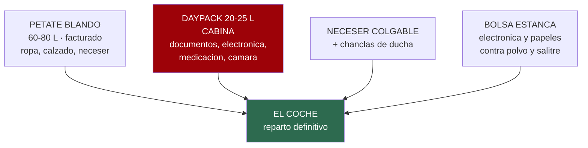
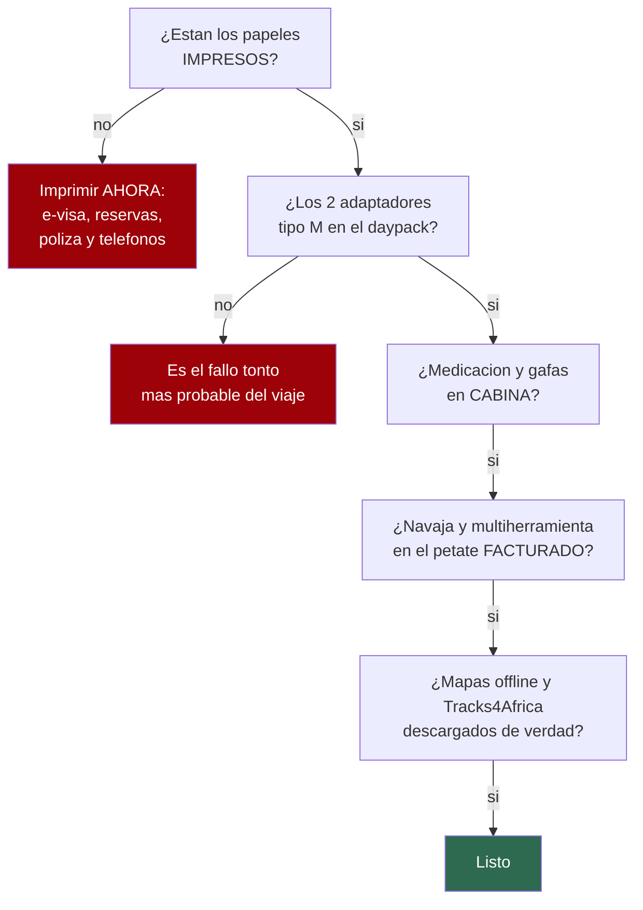

# 17 · La lista, para ir tachando

> **Namibia · 30 oct – 15 nov 2026 · la clásica del norte** — [← índice del dossier](README.md)
>
> Todo lo que sube al petate, ítem a ítem y con casilla. El **porqué** de cada decisión está en
> [`05`](05-equipaje.md) —las seis reglas, las temperaturas, lo que trae el coche—: aquí solo está
> **la lista**, para imprimirla y tacharla la víspera.
>
> **~N$20 = €1** *(rango 19,5–20,5)* · **✅** fuente primaria · **◐** secundaria concordante ·
> **○** práctica común, sin fuente · **❌** sin verificar, dicho en blanco
>
> *Levantada el 05/08/2026 sobre los datos de `05`, `04`, `06`, `07` y `01`*

---

## 🧳 Los cuatro bultos

**Regla del reparto** ○: en cabina va lo que no se puede reponer *(documentos, medicación, gafas,
tarjetas, cargadores)*; en el petate, lo que sí *(ropa, calzado, neceser)*. Si el petate se pierde,
el viaje sigue; si se pierde la cabina, no.

---

## 📄 Documentos — van en cabina, y también en papel

- [ ] **Pasaporte** ✅ — válido hasta el **15/05/2027** como mínimo y con **3 páginas en blanco**
- [ ] **e-visa impreso y firmado** ✅ + una copia suelta
- [ ] **Billetes de avión impresos**
- [ ] **Reservas impresas**: coche, Sesriem, Terrace Bay y los tres campamentos de Etosha
      *(Terrace Bay sin reserva en papel no entra al parque ✅)*
- [ ] **Póliza IATI en papel**: número de póliza y **teléfono 24 h** ✅
- [ ] **Carné de conducir + permiso internacional** *(el trámite, en `04`)*
- [ ] **Cartilla de vacunación**
- [ ] **Tarjetas de crédito ×2**, de bancos distintos, y algo de efectivo ○
- [ ] **Fotocopias de todo** en bolsa aparte del original ○
- [ ] Fotos de todo en el móvil, **descargadas para verlas sin cobertura** ○
- [ ] **Teléfonos de emergencia de `07` impresos**, en la guantera ✅
- [ ] Mapa de carreteras en papel ✅ *(Namibia funciona con papel, `04`)*

## 👕 Ropa — 14 días, con lavado a mano por medio ○

- [ ] 5 camisetas transpirables
- [ ] 2 camisas de manga larga ligeras *(sol de día, mosquitos al anochecer)*
- [ ] 2 pantalones largos ligeros + 2 cortos
- [ ] **1 forro polar** *(la noche fría del viaje es la de la costa: 12,7 °C de media ✅)*
- [ ] **1 cortavientos / chubasquero ligero** *(costa, y la salida de Deadvlei a las ~05:10)*
- [ ] Ropa interior y calcetines para ~7 días
- [ ] **Bañador** *(hay piscina en Okaukuejo, Halali y Namutoni ✅)*
- [ ] Pijama ligero ○
- [ ] Algo mínimamente decente para Joe's Beerhouse y el hotel del D13 ○
- [ ] **Sombrero de ala** ○ y **gafas de sol** con protección real ○
- [ ] **Buff o pañuelo** ✅ — polvo de la grava, viento de la costa y el olor de Cape Cross
- [ ] Colores tierra o neutros para el safari ○

## 🥾 Calzado

- [ ] **Zapatilla de trail o bota ligera, ya domada** ○
- [ ] **Sandalia de trekking** ○ *(conducir, campamento, la bajada de Big Daddy)*
- [ ] **Chanclas de ducha** ○ *(duchas compartidas en los campings)*

## 🧼 Neceser

- [ ] Cepillo y pasta de dientes · hilo dental
- [ ] Gel y champú *(mejor en formato sólido o en botes rellenables ○)*
- [ ] Desodorante · peine · maquinilla y espuma
- [ ] **Toallitas húmedas ×2 paquetes** ○ — el recurso más usado del viaje: manos, cara y polvo
      cuando la ducha queda a horas
- [ ] **Gel hidroalcohólico** ○ *(la comida en ruta se come con las manos y el agua se raciona)*
- [ ] **Papel higiénico ×1 rollo suelto** ○ — los campings lo tienen, los 500 km entre medias no
- [ ] Pañuelos de papel
- [ ] **Toallas de microfibra ×2** ○ *(hasta que llegue el inventario por escrito del coche, `04`)*
- [ ] Bolsa de aseo **colgable** ○ *(no hay repisa garantizada)*
- [ ] Cortaúñas y pinzas ○
- [ ] Tapones para los oídos ○ *(campamento compartido y lona al viento)*
- [ ] Antifaz ○ *(amanece pronto en una tienda de techo)*
- [ ] Bolsas de basura y ziplocs ○

## 🩺 Botiquín y medicación

- [ ] **Profilaxis de malaria** ✅ — la que diga el CVI en la cita de septiembre *(`04`)*
- [ ] Medicación propia con receta, **en el envase original y en cabina** ○
- [ ] **Crema solar 50+** · **aftersun** · **protector labial con filtro** ○ — el riesgo diario real
- [ ] **Repelente con DEET** ○
- [ ] **Sales de rehidratación oral** ○ *(con 35–38 °C la deshidratación va por delante de la sed)*
- [ ] Analgésico y antiinflamatorio
- [ ] Antidiarreico y sobres de suero
- [ ] Antihistamínico
- [ ] Tiritas, compeed, gasas, esparadrapo, vendas y tijeras
- [ ] **Pinzas** ○ *(espinas de acacia)* y **colirio** ○ *(polvo)*
- [ ] Termómetro y guantes de nitrilo ○
- [ ] Crema para picaduras y para rozaduras ○
- [ ] **Gafas graduadas de repuesto** ○ *(mejor gafas que lentillas: polvo)*

## 🔌 Electrónica y energía

- [ ] **2 adaptadores tipo M** ◐ — comprados **antes de salir**: el Schuko no entra
- [ ] **Cargador 12 V multi-USB** para el coche ○
- [ ] **Powerbank grande** ○ *(el enchufe en parcela sigue sin confirmar, `04`)*
- [ ] Cables de carga ×2 de cada tipo ○
- [ ] **Frontal por persona, con modo rojo** ○ — charca de noche, letrina a las 3 AM, montar la
      tienda al anochecer. **Pilas de repuesto.**
- [ ] Móvil con **Tracks4Africa** ✅ y mapas offline descargados
- [ ] Reloj despertador o alarma que no dependa de la batería del móvil ○
- [ ] **Satelital con SOS** *(Garmin inReach o similar)* ✅ — recomendado sin ambigüedad para esta
      ruta; la compra o el alquiler **sigue pendiente de decidir** *(`04`)*

## 📷 Óptica y cámara

- [ ] **Prismáticos, uno por persona** ○ — y viajan **en el asiento, no en el maletero** ✅
- [ ] Cámara + **teleobjetivo** para la fauna ○
- [ ] **Trípode** ○ *(la charca iluminada de noche y el cielo del desierto)*
- [ ] Tarjetas y baterías de sobra ○ *(comprarlas allí es caro y está lejos)*
- [ ] **Funda o bolsa antipolvo** para la cámara ○
- [ ] Peras de aire y paños de limpieza ○

## 🏕️ Campamento — lo que el coche YA trae, y lo que no

El 4×4 de Namibia2Go viene con **2 tiendas de techo, ropa de cama para 4, mesa, 4 sillas, menaje
completo, nevera eléctrica y compresor** ✅. **No se compra ni saco, ni esterilla, ni cacharros.**
Lo que sí sube al petate:

- [ ] **Almohada o cojín de viaje** ○ *(hay ropa de cama; la almohada es lotería)*
- [ ] Cinta americana, bridas y cuerda fina para tender ○
- [ ] Mechero ×2 y pastillas de encendido ○
- [ ] Jabón de viaje para lavar a mano ○
- [ ] Multiherramienta o navaja — **facturada, jamás en cabina** ○
- [ ] Linterna de mano además del frontal ○
- [ ] Libreta y boli ✅ — para apuntar **las presiones en frío** que den en la entrega del coche

## 💧 En el coche, todos los días

- [ ] **4 litros de agua por persona y día, EN el coche** ✅ — no en el maletero de atrás
- [ ] Garrafas o bidones para llevarla ○ *(se compran allí, `08`)*
- [ ] Snacks secos: frutos secos, barritas, biltong para el camino ○
- [ ] Bolsa de basura en la puerta ○ *(en los parques la basura vuelve contigo)*
- [ ] Ziplocs para la **Línea Roja** ✅ — los restos de carne no bajan del norte

---

## 📦 Los tres micro-kits del día señalado

*El detalle y el porqué, en [`05`](05-equipaje.md).*

- **Kit Deadvlei (D4, en marcha ~05:10)** — daypack, **3 L de agua por persona**, forro y
  cortavientos *(se quedan en el coche a las 9:00)*, buff, frontal, calzado cerrado, cámara.
- **Kit charca nocturna (D9–D12)** — forro, frontal **en rojo**, prismáticos, trípode y paciencia.
- **Kit costa (D5–D7)** — cortavientos, buff para Cape Cross y **toda la electrónica en bolsa
  estanca**: niebla, salitre y polvo el mismo día.

---

## 🛒 Lo que se compra allí, no aquí

- **Agua en garrafa, hielo y comida** — el avituallamiento está mapeado parada a parada en
  [`08`](08-comida-compras-y-regalos.md) ✅
- **Leña** para las barbacoas de campamento ✅ *(se vende en las gasolineras y en los campings)*
- **Tarjeta SIM local**, si se quiere datos — pero la ruta tiene tramos sin cobertura de nadie ✅

## 🚫 Lo que NO se lleva

- ❌ **Plumas, térmicos, gorro y guantes** ◐ — peso muerto: la mínima más baja del viaje es 12,7 °C
- ❌ **Maleta rígida grande** ○ — no cabe con la nevera y las cajas
- ❌ **Saco, esterilla, hornillo y menaje** ✅ — el coche lo trae todo
- ❌ **Comida de casa en cantidad** — resuelto en `08`
- 🚁 **Dron: se queda en casa** ✅ — no es escrúpulo, es que **no hay dónde volarlo en esta ruta**:
  fuera de los parques exige permiso previo de la NCAA, dentro de un parque nacional está prohibido
  y el permiso no se concede a vuelo privado, y **Etosha lo prohíbe del todo desde abril de 2025**.
  El detalle, con fuentes, en [`11`](11-lista-google-maps.md).
- ❌ **A la vuelta: nada de biltong ni carne en el petate** ✅ — prohibido entrar en la UE

---

## ✅ El repaso de diez minutos, la víspera

---

*Esta lista no cotiza precios: lo que falta por comprar —adaptadores, satelital, garrafas— se paga
fuera del presupuesto de `02` o directamente allí. Y lo heredado de la ficha del coche depende del
**inventario por escrito** que sigue pendiente con Namibia2Go: toallas, almohadas y el detalle del
menaje son los «sin dato» que ese email cierra. · 05/08/2026*
