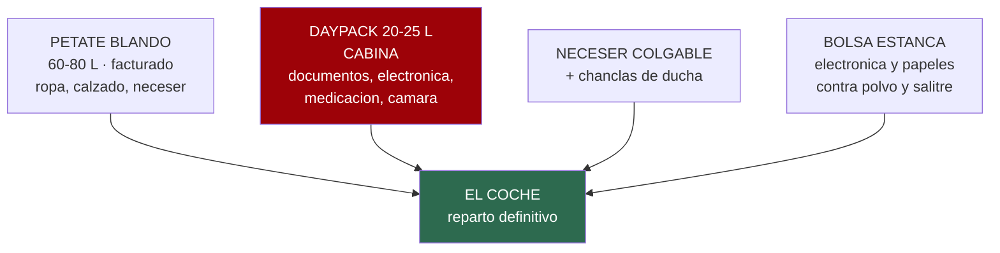
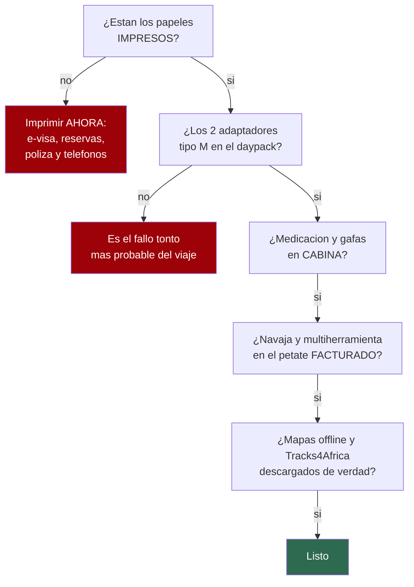

# 17 · La lista, para ir tachando

> **Namibia · 30 oct – 15 nov 2026 · la clásica del norte** — [← índice del dossier](README.md)
>
> Todo lo que sube al petate, **ítem a ítem, con cantidad y con casilla**. El **porqué** de cada
> decisión está en [`05`](05-equipaje.md) —las seis reglas, las temperaturas, lo que ya trae el
> coche—: aquí solo está **la lista**, para imprimirla y tacharla la víspera.
>
> **Las cantidades son para DOS personas y 15 días**, salvo donde ponga «por persona». Salen de
> **una colada a mano** en el día de descanso de Walvis Bay *(D5–D6)*: por eso la ropa interior se
> calcula para siete días y no para quince ○.
>
> **~N$20 = €1** *(rango 19,5–20,5)* · **✅** fuente primaria · **◐** secundaria concordante ·
> **○** práctica común, sin fuente · **❌** sin verificar, dicho en blanco
>
> *Levantada el 05/08/2026 · completada con cantidades el 06/08/2026*

---

## 🧳 Los cuatro bultos

**Regla del reparto** ○: en cabina va lo que no se puede reponer *(documentos, medicación, gafas,
tarjetas, cargadores)*; en el petate, lo que sí *(ropa, calzado, neceser)*. Si el petate se pierde,
el viaje sigue; si se pierde la cabina, no.

---

## 📄 Documentos — van en cabina, y también en papel

- [ ] **Pasaporte** ×1 p.p. ✅ — válido hasta el **15/05/2027** como mínimo y con **3 páginas en
      blanco**
- [ ] **e-visa impreso y firmado** ×1 p.p. ✅ + **1 copia** suelta
- [ ] **Billetes de avión impresos** ×1 p.p.
- [ ] **Reservas impresas** ×1 de cada: coche, Sesriem, Terrace Bay y los tres campamentos de
      Etosha *(Terrace Bay sin reserva en papel no entra al parque ✅)*
- [ ] **Póliza IATI en papel** ×2: número de póliza y **teléfono 24 h** ✅
- [ ] **Carné de conducir** ×1 p.p. + **permiso internacional** ×1 p.p.
- [ ] **Cartilla de vacunación** ×1 p.p.
- [ ] **Tarjetas** ×2 p.p., de bancos distintos ○ *(ni Diners ni Amex en Namibia2Go ◐)*
- [ ] **Efectivo en euros** para cambiar a la llegada ○
- [ ] **Fotocopias de todo** ×1 juego, en bolsa aparte del original ○
- [ ] Fotos de todo en el móvil, **descargadas para verlas sin cobertura** ○
- [ ] **Teléfonos de emergencia de `07` impresos** ×1, en la guantera ✅
- [ ] **Mapa de carreteras en papel** ×1 ✅ *(Namibia funciona con papel, `04`)*
- [ ] **Libreta y boli** ×1 ✅ — para apuntar las presiones en frío de la entrega *(`06`)*

## 👕 Ropa — las cuentas, por persona

*Por qué esta ropa y no otra, en [`05`](05-equipaje.md). Aquí van los números.*

- [ ] **Camisetas transpirables ×5** — una puesta, cuatro en el petate
- [ ] **Camisas de manga larga ligeras ×2** — sol de mediodía y mosquitos del anochecer
- [ ] **Pantalones largos ligeros ×2** *(uno desmontable ahorra un corto)*
- [ ] **Pantalones cortos ×2**
- [ ] **Ropa interior ×7**
- [ ] **Calcetines finos ×6 pares** + **1 par gordo** para las noches de la costa
- [ ] **Forro polar ×1** — la mínima más baja del viaje son **12,7 °C** en la costa ✅
- [ ] **Cortavientos o chubasquero ligero ×1** — costa y salida de Deadvlei a las ~05:10
- [ ] **Bañador ×1** — hay piscina en Okaukuejo, Halali y Namutoni ✅
- [ ] **Ropa de dormir ligera ×1**
- [ ] **Sombrero de ala ×1** — de ala, no gorra: las orejas y la nuca se queman igual ○
- [ ] **Buff o pañuelo ×2** ✅ — polvo de la grava, viento de la costa y el olor de Cape Cross
- [ ] **Gafas de sol ×1** con protección real, y su funda ○
- [ ] **Cinturón ×1**
- [ ] **Un conjunto decente ×1** para Joe's Beerhouse y la cena de Terrace Bay ○

## 🥾 Calzado — tres pares, ni uno más

- [ ] **Zapatilla de trail o bota ligera ×1 par, ya domada** ○ — Big Daddy, Sesriem Canyon,
      Twyfelfontein y la cascada del Uniab
- [ ] **Sandalia de trekking ×1 par** ○ — conducir y campamento
- [ ] **Chanclas ×1 par** ○ — duchas compartidas
- [ ] **Plantillas o calcetines de repuesto** para la arena ○

## 🧼 Neceser

- [ ] Cepillo de dientes ×1 p.p. · **pasta ×1 tubo** · hilo dental
- [ ] **Gel y champú** — 1 bote de 200 ml o pastilla sólida ○ *(pesa menos y no revienta)*
- [ ] Desodorante ×1 p.p. · peine ×1 · maquinilla y espuma
- [ ] **Toallitas húmedas ×3 paquetes** ○ — el recurso más usado del viaje: manos, cara y polvo
      cuando la ducha queda a horas
- [ ] **Gel hidroalcohólico ×2 botes** ○
- [ ] **Papel higiénico ×2 rollos** ○ — los campings lo tienen; los 500 km entre medias, no
- [ ] Pañuelos de papel ×4 paquetes
- [ ] **Toallas de microfibra ×2** ○ *(hasta que llegue el inventario por escrito del coche, `04`)*
- [ ] Neceser **colgable** ×1 ○ — no hay repisa garantizada
- [ ] Cortaúñas ×1 · pinzas de depilar ×1
- [ ] **Tapones para los oídos ×1 par p.p.** ○ · **antifaz ×1 p.p.** ○ — lona al viento y amanecer
      a las 06:07
- [ ] Bolsas de basura ×5 y **ziplocs ×10** ○
- [ ] Detergente de viaje ×1 y **cuerda fina de tender ×3 m** ○ — la colada de Walvis Bay

## 💊 Botiquín — qué llevar y cuánto

> ⚠️ **Nada de esto es una prescripción.** Qué te conviene y en qué dosis lo dicen **el Centro de
> Vacunación Internacional y tu farmacia**; aquí solo está el inventario para 15 días entre dos, con
> los principios activos que se llevan de forma habitual ○. Lo único con fuente es la profilaxis:
> la pauta la fija el CVI ✅ *(`04`)*.

**Lo que viene con receta**

- [ ] **Profilaxis de malaria** ✅ — la pauta **completa** más 3–4 días de margen. Si es Malarone
      empieza en viaje *(~6–7 nov: la zona arranca en el D8, Damaraland)*; si es mefloquina,
      **~19–26 de octubre**
- [ ] **Medicación propia** — la del viaje **+5 días**, en el **envase original** y con la receta ○
- [ ] Antibiótico de amplio espectro **solo si tu médico lo receta para el viaje** ○ *(no se
      automedica: es para el caso de no llegar a un centro)*

**Lo básico, sin receta**

- [ ] **Analgésico/antitérmico** — 1 caja *(paracetamol)* ○
- [ ] **Antiinflamatorio** — 1 caja *(ibuprofeno)* ○
- [ ] **Antidiarreico** — 1 caja *(loperamida)* ○
- [ ] **Sales de rehidratación oral ×8 sobres** ○ — con 35–38 °C la deshidratación va por delante
      de la sed, y la regla del agua son **4+ L por persona y día EN el coche** ✅
- [ ] **Antihistamínico** — 1 caja ○
- [ ] **Protector gástrico** — 1 caja ○
- [ ] **Antiemético para el coche** — 1 caja ○ *(hay 2.757 km, y el paso de Spreetshoogte y la
      grava del D8 se notan)*
- [ ] **Laxante suave o fibra** ○ — dieta de camping y poca verdura

**Curas y picaduras**

- [ ] Antiséptico *(clorhexidina)* ×1 · **gasas ×10** · **esparadrapo ×1** · **venda ×1**
- [ ] **Tiritas ×20** de varios tamaños · **apósitos para ampollas ×6** ○ — Big Daddy las hace
- [ ] **Tijeras ×1** y **pinzas ×1** ○ — las espinas de acacia se clavan y se parten
- [ ] **Crema para picaduras** ×1 y **corticoide suave** ×1 ○
- [ ] **Suero fisiológico en monodosis ×10** ○ — el polvo en los ojos es diario
- [ ] **Termómetro ×1** · **guantes de nitrilo ×4** ○

**Sol y bichos — lo que de verdad se gasta**

- [ ] **Crema solar 50+ ×2 tubos grandes** ○ — el sol es el riesgo diario real, no la fauna
- [ ] **Protector labial con filtro ×2** ○
- [ ] **Aftersun ×1** ○
- [ ] **Repelente con DEET ×2 frascos** ○

## 🔌 Electrónica y energía

- [ ] **Adaptadores tipo M ×2** ◐ — comprados **antes de salir**: el Schuko no entra, y no se
      venden en supermercados españoles
- [ ] **Cargador 12 V multi-USB ×1** ○ para el coche
- [ ] **Powerbank ×1 grande** ○ *(el enchufe en parcela sigue sin confirmar, `04`)*
- [ ] **Cables de carga ×2 de cada tipo** ○ — el polvo mata conectores
- [ ] **Frontal ×1 por persona, con modo rojo** ○ — charca de noche, letrina a las 3 AM, montar la
      tienda al anochecer. **+1 juego de pilas de repuesto** ○
- [ ] **Linterna de mano ×1** ○ además del frontal
- [ ] Móvil con **Tracks4Africa** ✅ y mapas offline **descargados**
- [ ] Reloj o despertador que no dependa de la batería del móvil ○
- [ ] **Satelital con SOS** *(Garmin inReach o similar)* ✅ — recomendado sin ambigüedad para esta
      ruta; comprarlo o alquilarlo **sigue pendiente de decidir** *(`04`)*

## 📷 Óptica y cámara

- [ ] **Prismáticos ×1 por persona** ○ — compartir unos en una charca es pelearse, y viajan **en el
      asiento, no en el maletero** ✅
- [ ] Cámara ×1 + **teleobjetivo** ○ para la fauna — qué comprar, o si alquilar en Windhoek,
      está en [`19`](19-fotografia.md)
- [ ] **Trípode ×1** ○ — la charca iluminada de noche y el cielo del desierto
- [ ] **Tarjetas ×4** y **baterías ×3** ○ — allí es caro y está lejos
- [ ] **Funda o bolsa antipolvo ×1** ○ · pera de aire ×1 · paños de limpieza ×3

## 🏕️ Campamento — solo lo que el coche NO trae

El 4×4 de Namibia2Go viene con **2 tiendas de techo, ropa de cama para 4, mesa, 4 sillas, menaje
completo, nevera eléctrica y compresor** ✅. **No se compra ni saco, ni esterilla, ni cacharros.**
Lo que sí sube al petate:

- [ ] **Almohada o cojín de viaje ×1 p.p.** ○ — hay ropa de cama, pero la almohada es lotería
- [ ] **Cinta americana ×1**, **bridas ×10** y **cuerda fina ×5 m** ○
- [ ] **Mecheros ×2** y pastillas de encendido ○
- [ ] **Multiherramienta o navaja ×1** — **facturada, jamás en cabina** ○
- [ ] **Bolsa estanca ×1** para la electrónica ○

## 💧 En el coche, todos los días

- [ ] **4 litros de agua por persona y día, EN el coche** ✅ — no en el maletero de atrás
- [ ] **Garrafas o bidones** ○ *(se compran allí, `08`)*
- [ ] Snacks secos: frutos secos, barritas y biltong ○
- [ ] **Bolsa de basura en la puerta** ○ — en los parques la basura vuelve contigo
- [ ] **Ziplocs para la Línea Roja** ✅ — los restos de carne no bajan del norte

---

## 📦 Los tres micro-kits del día señalado

*Se preparan la víspera y viajan en el daypack. El porqué de cada uno, en [`05`](05-equipaje.md).*

**Kit Deadvlei — D4, en marcha ~05:10**

- [ ] Daypack con **3 L de agua por persona**
- [ ] Forro y cortavientos *(se quedan en el coche a las 9:00)*
- [ ] Buff, frontal y calzado cerrado
- [ ] Cámara *(desinflar y reinflar no es problema: el compresor va en el coche ✅)*

**Kit charca nocturna — D9 a D12**

- [ ] Forro *(se está quieto y refresca)*
- [ ] Frontal **en modo rojo**
- [ ] Prismáticos y trípode
- [ ] Paciencia: apagar y darle 15–20 minutos ✅ *(`01`)*

**Kit costa — D5 a D7**

- [ ] Cortavientos
- [ ] Buff para Cape Cross
- [ ] **Toda la electrónica en bolsa estanca**: niebla, salitre y polvo el mismo día

---

## 🛒 Lo que se compra allí, no aquí

- **Agua en garrafa, hielo y comida** — mapeado parada a parada en
  [`08`](08-comida-compras-y-regalos.md) ✅
- **Leña** para las barbacoas de campamento ✅
- **Tarjeta SIM de MTC** ◐ — paquete turista **«Leisure» N$349 (~€17)**, 14 días y 10,1 GB
  *(activada el 31, llega al 13 — el último día lo tapa un bono «Aweh» si hace falta)*; solo en la
  tienda del aeropuerto *(`07`)*

## 🚫 Lo que NO se lleva

- ❌ **Plumas, térmicos, gorro y guantes** ◐ — peso muerto: la mínima más baja del viaje es 12,7 °C
- ❌ **Maleta rígida grande** ○ — no cabe con la nevera y las cajas
- ❌ **Saco, esterilla, hornillo y menaje** ✅ — el coche lo trae todo
- ❌ **Comida de casa en cantidad** — resuelto en `08`
- 🚁 **Dron: se queda en casa** ✅ — **no hay dónde volarlo en esta ruta**. El detalle, con fuentes,
  en [`11`](11-lista-google-maps.md)
- ❌ **A la vuelta: nada de biltong ni carne en el petate** ✅ — prohibido entrar en la UE

---

## ✅ El repaso de diez minutos, la víspera

---

*Esta lista no cotiza precios: lo que falta por comprar —adaptadores, satelital, garrafas— se paga
fuera del presupuesto de `02` o directamente allí. Y lo heredado de la ficha del coche depende del
**inventario por escrito** que sigue pendiente con Namibia2Go: toallas, almohadas y el detalle del
menaje son los «sin dato» que ese email cierra. · 06/08/2026*
