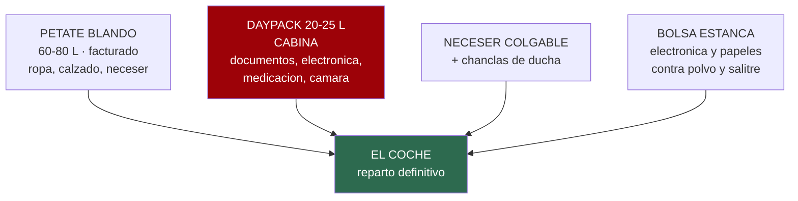
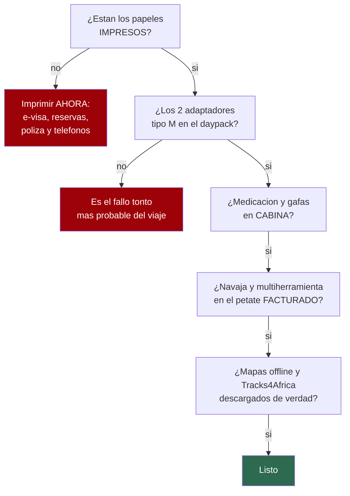

# 17 · La lista, para ir tachando

> **Namibia · 30 oct – 15 nov 2026 · la clásica del norte** — [← índice del dossier](README.md)
>
> Todo lo que sube al petate, **ítem a ítem, con cantidad y con casilla**. El **porqué** de cada
> decisión está en [`05`](05-equipaje.md) —las seis reglas, las temperaturas, lo que ya trae el
> coche—: aquí solo está **la lista**, para imprimirla y tacharla la víspera.
>
> **Las cantidades son para DOS personas y 15 días**, salvo donde ponga «por persona». Salen de
> **una colada** en el día de descanso de Walvis Bay *(D5–D6)*: por eso la ropa interior se
> calcula para siete días y no para quince ○. *(Y no hace falta hacerla a mano: hay deja-y-recoge
> en Swakopmund y tres lavanderías con dirección en Walvis Bay ◐ — el detalle, en [`05`](05-equipaje.md).)*
>
> **~N$20 = €1** *(rango 19,5–20,5)* · **✅** fuente primaria · **◐** secundaria concordante ·
> **○** práctica común, sin fuente · **❌** sin verificar, dicho en blanco
>
> *Levantada el 05/08/2026 · completada con cantidades el 06/08/2026*

---

## 🧳 Los cuatro bultos

**Regla del reparto** ○: en cabina va lo que no se puede reponer *(documentos, medicación, gafas,
tarjetas, cargadores)*; en el petate, lo que sí *(ropa, calzado, neceser)*. Si el petate se pierde,
el viaje sigue; si se pierde la cabina, no.

---

## 📄 Documentos — van en cabina, y también en papel

- [ ] **Pasaporte** ×1 p.p. ✅ — válido hasta el **15/05/2027** como mínimo y con **3 páginas en
      blanco**
- [ ] **e-visa impreso y firmado** ×1 p.p. ✅ + **1 copia** suelta
- [ ] **Billetes de avión impresos** ×1 p.p.
- [ ] **Reservas impresas** ×1 de cada: coche, Sesriem, Terrace Bay y los tres campamentos de
      Etosha *(Terrace Bay sin reserva en papel no entra al parque ✅)*
- [ ] **Póliza IATI en papel** ×2: número de póliza y **teléfono 24 h** ✅
- [ ] **Carné de conducir** ×1 p.p. + **permiso internacional** ×1 p.p.
- [ ] **Cartilla de vacunación** ×1 p.p.
- [ ] **Tarjetas** ×2 p.p., de bancos distintos ○ *(ni Diners ni Amex en Namibia2Go ◐)*
- [ ] **Efectivo en euros** para cambiar a la llegada ○
- [ ] **Fotocopias de todo** ×1 juego, en bolsa aparte del original ○
- [ ] Fotos de todo en el móvil, **descargadas para verlas sin cobertura** ○
- [ ] **Teléfonos de emergencia de `07` impresos** ×1, en la guantera ✅ *(con el de la
      embajada de España — `04`)*
- [ ] **El kit del control policial, JUNTO en la guantera** ○ — carnet + permiso internacional
      *(jamás separados ✅)*, contrato del alquiler y copia del pasaporte *(el guion del control,
      en `07`)*
- [ ] **Mapa de carreteras en papel** ×1 ✅ *(Namibia funciona con papel, `04`)*
- [ ] **Libreta y boli** ×1 ✅ — para apuntar las presiones en frío de la entrega *(`06`)*

## 👕 Ropa — las cuentas, por persona

*Por qué esta ropa y no otra, en [`05`](05-equipaje.md). Aquí van los números.*

- [ ] **Camisetas transpirables ×5** — una puesta, cuatro en el petate
- [ ] **Camisas de manga larga ligeras ×2** — sol de mediodía y mosquitos del anochecer. Para el
      día de dunas, mejor si una es **UPF 50+**: la camiseta clara de algodón es UPF ~7, y ~3
      empapada ◐ *([skincancer.org](https://www.skincancer.org/skin-cancer-prevention/sun-protection/sun-protective-clothing/))*
- [ ] **Pantalones largos ligeros ×2** *(uno desmontable ahorra un corto)*
- [ ] **Pantalones cortos ×2**
- [ ] **Ropa interior ×7**
- [ ] **Calcetines finos ×6 pares** + **1 par gordo** para las noches de la costa
- [ ] **Forro polar ×1** — la mínima más baja del viaje son **12,7 °C** en la costa ✅
- [ ] **Chubasquero ×1, impermeable de verdad** *(no solo cortavientos)* — costa, salida de
      Deadvlei a las ~05:10 **y las tormentas de Etosha**: noviembre abre las lluvias *(43–44 mm
      en ~7 días, en tormenta ◐)* y un operador namibio lo llama «esencial de noviembre a abril» ◐
      *([Chameleon](https://chameleonholidays.com/what-to-pack-for-your-namibian-holiday/) ·
      [SafariBookings](https://www.safaribookings.com/etosha/climate))*
- [ ] **Opcional: gorro fino + camiseta térmica ligera** ○ — el seguro de 80 g para la noche de
      la costa *(13–15 °C, 88 % de humedad y viento: sensación ~10–11 ◐)*; ninguna fuente lo exige
      en noviembre. La térmica hace de pijama en la costa
- [ ] **Bañador ×1** — hay piscina en Okaukuejo, Halali y Namutoni ✅
- [ ] **Ropa de dormir ligera ×1**
- [ ] **Sombrero de ala ×1** — de ala **≥7,5 cm** ✅ *([skincancer.org](https://www.skincancer.org/skin-cancer-prevention/sun-protection/sun-protective-clothing/))*, no gorra: las orejas y
      la nuca se queman igual. Y **con barbuquejo** ◐ — el viento de la costa está en su máximo
      anual justo en nov–mar *([Atlas of Namibia](https://atlasofnamibia.online/chapter-3/wind))*
- [ ] **Buff o pañuelo ×2** ✅ — polvo de la grava, viento de la costa y el olor de Cape Cross
- [ ] **Gafas de sol ×1** — «protección real» tiene nombre: **UV400, marcado CE (EN ISO 12312-1)
      y filtro de categoría 3** ◐ — la 4 no vale para conducir. Mejor envolventes, por la arena en
      el viento. Y su funda ○
- [ ] **Cinturón ×1**
- [ ] **Un conjunto decente ×1** para Joe's Beerhouse y la cena de Terrace Bay ○

## 🥾 Calzado — tres pares, ni uno más

- [ ] **Zapatilla de trail o bota ligera ×1 par, ya domada** ○ — Big Daddy, Sesriem Canyon,
      Twyfelfontein y la cascada del Uniab
- [ ] **Sandalias barefoot Saguaro ×1 par** ○ — conducir y campamento
- [ ] **Chanclas ×1 par** ○ — duchas compartidas
- [ ] **Plantillas o calcetines de repuesto** para la arena ○

## 🧼 Neceser

- [ ] Cepillo de dientes ×1 p.p. · **pasta ×1 tubo** · hilo dental
- [ ] **Gel y champú** — 1 bote de 200 ml o pastilla sólida ○ *(pesa menos y no revienta)*
- [ ] Desodorante ×1 p.p. · peine ×1 · maquinilla y espuma
- [ ] **Toallitas húmedas ×3 paquetes** ○ — el recurso más usado del viaje: manos, cara y polvo
      cuando la ducha queda a horas
- [ ] **Gel hidroalcohólico ×2 botes** ○
- [ ] **Papel higiénico ×2 rollos** ○ — los campings lo tienen; los 500 km entre medias, no
- [ ] Pañuelos de papel ×4 paquetes
- [ ] **Toallas de microfibra ×2** ○ *(la ficha del coche ya lista 4 toallas ✅ — éstas quedan de
      respaldo y para la piscina)*
- [ ] Neceser **colgable** ×1 ○ — no hay repisa garantizada
- [ ] Cortaúñas ×1 · pinzas de depilar ×1 · **costurero pequeño ×1** ○ — dos semanas de lona y
      cremalleras
- [ ] **Crema de manos y crema hidratante ×1 de cada** ◐ — el aire del Namib seca la piel a
      diario; sobre piel húmeda, dice la dermatología *([AAD](https://www.aad.org/public/everyday-care/skin-care-basics/dry/dermatologists-tips-relieve-dry-skin))*
- [ ] **Vaselina o spray salino nasal ×1** ◐ — nariz reseca y sangrados por el aire seco
      *([Mayo Clinic](https://www.mayoclinic.org/first-aid/first-aid-nosebleeds/basics/art-20056683))*
- [ ] **Tapones para los oídos ×1 par p.p.** ○ · **antifaz ×1 p.p.** ○ — lona al viento y amanecer
      a las 06:07
- [ ] Bolsas de basura ×5, **ziplocs ×10** y **×4 grandes tipo escombro para enfundar los petates
      en la caja del pick-up** ◐ *([Expert Africa](https://www.expertafrica.com/namibia/info/namibia-holiday-and-safari-packing-list) y [FullSuitcase](https://fullsuitcase.com/namibia-packing-list/) las piden así)*
- [ ] Detergente de viaje ×1, **cuerda fina de tender ×3 m** y **pinzas ×8** ○ — el respaldo a
      mano de la colada *(la cómoda es la lavandería de Swakopmund ◐ — [`05`](05-equipaje.md))*

## 💊 Botiquín — qué llevar y cuánto

> ⚠️ **Nada de esto es una prescripción.** Qué te conviene y en qué dosis lo dicen **el Centro de
> Vacunación Internacional y tu farmacia**; aquí solo está el inventario para 15 días entre dos, con
> los principios activos que se llevan de forma habitual ○. Lo único con fuente es la profilaxis:
> la pauta la fija el CVI ✅ *(`04`)*. El inventario se cotejó el 11/08/2026 contra el **kit de
> viaje oficial del CDC Yellow Book** ✅ *([la tabla](https://www.ncbi.nlm.nih.gov/books/NBK620961/table/healthkits.tab2/?report=objectonly))*: de ahí entran el aloe, la venda elástica, el
> antifúngico, la pomada antibiótica, las potabilizadoras y la lágrima artificial.

**Lo que viene con receta**

- [ ] **Profilaxis de malaria** ✅ — la pauta **completa** más 3–4 días de margen. Ojo a la
      geografía: el riesgo se define **por regiones, y Kunene incluye Terrace Bay** — la entrada
      en zona es el **D7 (sáb 7)**, no el D8. Si es Malarone, empieza en viaje *(~5–6 nov)*; si es
      mefloquina, **~17–24 de octubre**. Y a la cita del CVI, con el dato: para la guía oficial
      británica, en estas regiones **de mayo a noviembre basta evitar picaduras, sin
      quimioprofilaxis** ✅ *([TravelHealthPro](https://travelhealthpro.org.uk/country/157/namibia))* — que lo decida el CVI con eso delante *(`04`)*
- [ ] **Medicación propia** — la del viaje **+5 días**, en el **envase original** y con la receta ○
- [ ] Antibiótico de amplio espectro **solo si tu médico lo receta para el viaje** ○ *(no se
      automedica: es para el caso de no llegar a un centro)*

**Lo básico, sin receta**

- [ ] **Analgésico/antitérmico** — 1 caja *(paracetamol)* ○
- [ ] **Antiinflamatorio** — 1 caja *(ibuprofeno)* ○
- [ ] **Antidiarreico** — 1 caja *(loperamida)* ○
- [ ] **Sales de rehidratación oral ×8 sobres** ○ — con 35–38 °C la deshidratación va por delante
      de la sed, y la regla del agua son **4+ L por persona y día EN el coche** ✅
- [ ] **Antihistamínico** — 1 caja ○
- [ ] **Protector gástrico** — 1 caja ○
- [ ] **Antiemético para el coche** — 1 caja ○ *(hay 2.757 km, y el paso de Spreetshoogte y la
      grava del D8 se notan)*
- [ ] **Laxante suave o fibra** ○ — dieta de camping y poca verdura
- [ ] **Antitusivo o descongestionante — 1 caja** ○ *(kit CDC: el polvo de pista y el aire seco)*
- [ ] **Pastillas potabilizadoras ×1 tubo** ○ *(kit CDC: el respaldo de la regla del agua en los
      tramos de 500 km)*

**Curas y picaduras**

- [ ] Antiséptico *(clorhexidina)* ×1 · **gasas ×10** · **esparadrapo ×1** · **venda elástica ×1**
      *(elástica, con apellido — kit CDC: es la del esguince bajando Big Daddy)* · **pomada
      antibiótica ×1** *(la clorhexidina limpia; esto cubre la herida ya curada)*
- [ ] **Tiritas ×20** de varios tamaños · **apósitos para ampollas ×6** ○ — Big Daddy las hace
- [ ] **Tijeras ×1** y **pinzas ×1** ○ — las espinas de acacia se clavan y se parten
- [ ] **Crema para picaduras** ×1 y **corticoide suave** ×1 ○
- [ ] **Gel de aloe vera ×1** ○ *(kit CDC: la quemadura solar Y la del braai — se cocina al fuego
      cada noche y nada más del botiquín cubre quemaduras)*
- [ ] **Antifúngico en crema o polvos ×1** ○ *(kit CDC — 17 días de calor y botas)*
- [ ] **Suero fisiológico en monodosis ×10** y **lágrima artificial sin conservantes ×20** ◐ — el
      polvo es diario: el suero lava, la lágrima lubrica *(CDC Pack Smart y
      [AOA](https://www.aoa.org/healthy-eyes/vision-and-vision-correction/environments))*
- [ ] **Termómetro ×1** · **guantes de nitrilo ×4** ○

**Sol y bichos — lo que de verdad se gasta**

- [ ] **Crema solar 50+ ×4 tubos de 200 ml** ◐ — el sol es el riesgo diario real, no la fauna: el
      UV de noviembre es **extremo (13–15)**, también bajo la niebla de la costa ◐. La cuenta que
      jubiló los 2 tubos del primer borrador: la dosis dermatológica son **~30 ml por aplicación,
      cada 2 h** — dos personas y 15 días salen a **750–900 ml aun yendo de manga larga**
      *([AAD](https://www.aad.org/public/everyday-care/sun-protection/shade-clothing-sunscreen/how-to-apply-sunscreen) · [Skin Cancer Foundation](https://www.skincancer.org/skin-cancer-prevention/sun-protection/sunscreen/))*
- [ ] **Protector labial con filtro ×2** ○
- [ ] **Aftersun ×1** ○
- [ ] **Repelente con DEET ≥20 % (o icaridina) ×2 frascos** ✅ — y el orden importa: **siempre
      crema solar primero, repelente encima**
      *([CDC](https://wwwnc.cdc.gov/travel/destinations/traveler/none/namibia))*

## 🔌 Electrónica y energía

- [ ] **Adaptadores tipo M ×2** ◐ — comprados **antes de salir**: el Schuko no entra, y no se
      venden en supermercados españoles
- [ ] **Regleta pequeña o ladrón ×1** ◐ — la parcela tiene **una** toma en el poste y sois dos
      móviles, cámara, frontales y powerbank *(dos listas de Namibia la llevan; el cierre del
      enchufe camp a camp, en [`18`](18-manual-de-campamento.md) §5)*
- [ ] **Cargador 12 V multi-USB ×1** ○ para el coche
- [ ] **Powerbank ×1 grande** ○ *(el enchufe en parcela quedó confirmado el 11/08 para los cuatro
      NWR de interior ◐ — `18` §5; el powerbank cubre Spreetshoogte, Hoada y las tomas rotas de
      Sesriem)*
- [ ] **Cables de carga ×2 de cada tipo** ○ — el polvo mata conectores
- [ ] **Funda para el teléfono ×1 p.p.** ○ — que aguante polvo y golpes: el móvil vive quince días
      entre grava, arena y el salpicadero *(para el día de niebla y salitre de la costa ya está la
      bolsa estanca)*
- [ ] **Frontal ×1 por persona, con modo rojo** ○ — letrina a las 3 AM, montar la tienda al
      anochecer y el camino a la charca; **en la plataforma de la charca, apagado del todo** ◐
      *(la norma documentada es más dura que el modo rojo — `18` §8)*. **+1 juego de pilas de
      repuesto** ○
- [ ] **Linterna de mano ×1** ○ además del frontal
- [ ] Móvil con **Tracks4Africa** ✅ y mapas offline **descargados** — y las otras tres apps,
      TAMBIÉN antes de salir ○: **iOverlander** *(campings y aguadas — útil para los tres sin
      tarifa)*, una de **cielo/estrellas con modo offline** *(las noches de luna nueva del
      9–12, `01`)* y una de **previsión marina/viento** para el crucero del D6
- [ ] Reloj o despertador que no dependa de la batería del móvil ○
- [ ] **Satelital con SOS** *(Garmin inReach o similar)* ✅ — recomendado sin ambigüedad para esta
      ruta; comprarlo o alquilarlo **sigue pendiente de decidir** *(`04`)*. La decisión ya tiene
      números ◐: alquiler en Windhoek a **N$160 (~€8)/día + N$60 (~€3) por unidad de llamada —
      ~N$2.720 (~€136) el viaje**, reservando antes
      *([Savanna](https://www.savannacarhire.com.na/satellite-phone-rental))*, frente a ~€300 el
      inReach Mini comprado + su suscripción *(mínimo 30 días)*

## 📷 Óptica y cámara

- [ ] **Prismáticos ×1 por persona** ○ — compartir unos en una charca es pelearse, y viajan **en el
      asiento, no en el maletero** ✅
- [ ] Cámara ×1 + **teleobjetivo** ○ para la fauna — qué comprar, o si alquilar en Windhoek,
      está en [`19`](19-fotografia.md)
- [ ] **Trípode ×1** ○ — la charca iluminada de noche y el cielo del desierto
- [ ] **Bean bag o saco vacío ×1** ○ — el apoyo del tele en la ventanilla en Etosha, donde el
      trípode no cabe; se rellena de arroz o legumbre en la compra del D0
      *([Gondwana/N2Go](https://gondwana-collection.com/blog/make-the-most-of-your-namibia2go-self-drive-safari))*
- [ ] **Tarjetas ×4** y **baterías ×3** ○ — allí es caro y está lejos
- [ ] **SSD pequeño o lector USB-C para el móvil ×1** ○ — el respaldo de las tarjetas en Walvis
      y Windhoek *(la regla entera, en `19`)*
- [ ] **Funda o bolsa antipolvo ×1** ○ · pera de aire ×1 · paños de limpieza ×3

## 🏕️ Campamento — solo lo que el coche NO trae

El 4×4 de Namibia2Go viene con **2 tiendas de techo, ropa de cama para 4 —con almohadas y
toallas—, mesa, 4 sillas, menaje completo, cocina de gas con bombona, nevera eléctrica y
compresor** ✅ *(ficha cotejada el 10/08/2026)*. **No se compra ni saco, ni esterilla, ni
cacharros.** Lo que sí sube al petate:

- [ ] **Almohada o cojín de viaje ×1 p.p.** ○ — la ficha lista 4 almohadas; ésta es la de
      apego, por si la del coche decepciona
- [ ] **Abanico ×1 p.p.** ○ — la siesta parada del mediodía a 35–38 °C y las noches quietas de
      Etosha sin un soplo de aire; pesa nada y no gasta batería
- [ ] **Cinta americana ×1**, **bridas ×10** y **cuerda fina ×5 m** ○
- [ ] **Mecheros ×2** y pastillas de encendido ○
- [ ] **Termo ×1** ◐ — el café del amanecer en el mirador y las esperas de charca; es lo único de
      cocina que el menaje del coche no trae *([Bushlore](https://bushlore.com/wp-content/uploads/2018/05/Self-Drive-Safari-Planning-Guide.pdf) y Gondwana lo piden expresamente)*
- [ ] **Multiherramienta o navaja ×1** — **facturada, jamás en cabina** ○
- [ ] **Silbato ×1** ○ — pesa nada y se oye donde la voz no llega *(ninguna de las listas del
      barrido del 11/08 lo pedía: entra por decisión propia)*
- [ ] **Bolsa estanca ×1** para la electrónica ○

## 💧 En el coche, todos los días

- [ ] **4 litros de agua por persona y día, EN el coche** ✅ — no en el maletero de atrás. Y es
      suelo, no techo: el FCDO dice «plenty of water» sin cifra, y la referencia overlanding pide
      **5 L y doblar el margen en los tramos sin servicios** ◐
      *([Tracks4Africa](https://blog.tracks4africa.co.za/water-supply-overland/))*
- [ ] **Garrafas o bidones** ○ *(se compran allí, `08`)*
- [ ] Snacks secos: frutos secos, barritas y biltong ○
- [ ] **Bolsa de basura en la puerta** ○ — en los parques la basura vuelve contigo
- [ ] **Ziplocs para la Línea Roja** ✅ — los restos de carne no bajan del norte

---

## 📦 Los tres micro-kits del día señalado

*Se preparan la víspera y viajan en el daypack. El porqué de cada uno, en [`05`](05-equipaje.md).*

**Kit Deadvlei — D4, en marcha ~05:10**

- [ ] Daypack con **3 L de agua por persona**
- [ ] Forro y cortavientos *(se quedan en el coche a las 9:00)*
- [ ] Buff, frontal y calzado cerrado
- [ ] Cámara *(desinflar y reinflar no es problema: el compresor va en el coche ✅)*

**Kit charca nocturna — D9 a D12**

- [ ] Forro *(se está quieto y refresca)*
- [ ] Frontal **en modo rojo para el camino — y apagado en la plataforma** ◐
- [ ] Prismáticos y trípode
- [ ] Paciencia: apagar y darle 15–20 minutos ✅ *(`01`)*

**Kit costa — D5 a D7**

- [ ] Cortavientos
- [ ] Buff para Cape Cross
- [ ] **Toda la electrónica en bolsa estanca**: niebla, salitre y polvo el mismo día

---

## 🛒 Lo que se compra allí, no aquí

- **Agua en garrafa, hielo y comida** — mapeado parada a parada en
  [`08`](08-comida-compras-y-regalos.md) ✅
- **Leña** para las barbacoas de campamento ✅
- **Tarjeta SIM de MTC** ◐ — paquete turista **«Leisure» N$349 (~€17)**, 14 días y 10,1 GB
  *(activada el 31, llega al 13 — el último día lo tapa un bono «Aweh» si hace falta)*; solo en la
  tienda del aeropuerto *(`07`)*

## 🚫 Lo que NO se lleva

- ❌ **Plumas, térmicos y guantes** ◐ — peso muerto: la mínima más baja del viaje es 12,7 °C.
  *(La excepción opcional es el gorro fino de la noche de la costa — ver ropa)*
- ❌ **Maleta rígida grande** ○ — no cabe con la nevera y las cajas
- ❌ **Saco, esterilla, hornillo y menaje** ✅ — el coche lo trae todo
- ❌ **Comida de casa en cantidad** — resuelto en `08`
- 🚁 **Dron: se queda en casa** ✅ — **no hay dónde volarlo en esta ruta**. El detalle, con fuentes,
  en [`11`](11-entradas-y-permisos.md)
- ❌ **A la vuelta: nada de biltong ni carne en el petate** ✅ — prohibido entrar en la UE

---

## ✅ El repaso de diez minutos, la víspera

---

*Esta lista no cotiza precios: lo que falta por comprar —adaptadores, satelital, garrafas— se paga
fuera del presupuesto de `02` o directamente allí. Los «sin dato» de la ficha del coche —toallas,
almohadas, hornillo y menaje— los cerró la propia ficha en el cotejo del 10/08/2026 ✅: para la
entrega quedan la batería de la nevera y el tanque (`18` §5, `21`). El 11/08/2026 la lista pasó su
primer barrido completo de fuentes —salud (CDC/NaTHNaC), clima, sol, energía y cinco listas
reputadas de self-drive—: de ahí la crema ×4, el aloe, la regleta, el termo, el chubasquero con
apellido y las fechas corregidas de la profilaxis. · 11/08/2026*
