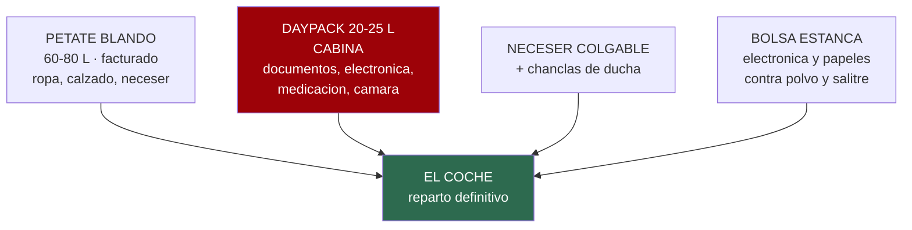
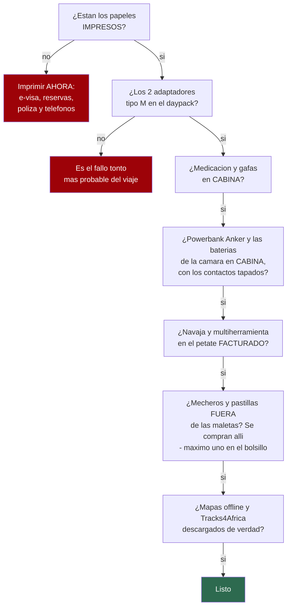

# 17 · La lista, para ir tachando

> **Namibia · 30 oct – 15 nov 2026 · la clásica del norte** — [← índice del dossier](README.md)
>
> Todo lo que sube al petate, **ítem a ítem, con cantidad y con casilla**. El **porqué** de cada
> decisión está en [`05`](05-equipaje.md) —las seis reglas, las temperaturas, lo que ya trae el
> coche—: aquí solo está **la lista**, para imprimirla y tacharla la víspera.
>
> **Las cantidades son para DOS personas y 15 días**, salvo donde ponga «por persona». Salen de
> **una colada** en el día de descanso de Walvis Bay *(D4–D5)*: por eso la ropa interior se
> calcula para siete días y no para quince ○. *(Y no hace falta hacerla a mano: hay deja-y-recoge
> en Swakopmund y tres lavanderías con dirección en Walvis Bay ◐ — el detalle, en [`05`](05-equipaje.md).)*
>
> **~N$20 = €1** *(rango 19,5–20,5)* · **✅** fuente primaria · **◐** secundaria concordante ·
> **○** práctica común, sin fuente · **❌** sin verificar, dicho en blanco
>
> *Levantada el 05/08/2026 · completada con cantidades el 06/08/2026*

---

## 🧳 Los cuatro bultos

**Regla del reparto** ○: en cabina va lo que no se puede reponer *(documentos, medicación, gafas,
tarjetas, cargadores)*; en el petate, lo que sí *(ropa, calzado, neceser)*. Si el petate se pierde,
el viaje sigue; si se pierde la cabina, no.

- [ ] **Petate blando 60-80 L ×1 p.p.** — **[Altus Petate 70](https://www.decathlon.es/es/p/bolsa-de-viaje-duffle-bag-70l-altus-petate-70-cd/_/R-p-X8978467)**
      ✅ 53,99 € *(o, con más margen para la vuelta, [Forclaz 80L/120L expandible](https://www.decathlon.es/es/p/bolsa-de-viaje-80l-120l-duffle-bag-forclaz/_/R-p-156360)
      ✅ 79,99 €)*
- [ ] **Daypack 20-25 L ×1 p.p.** — **[Quechua MH100, 20 L](https://www.decathlon.es/es/p/mochila-de-senderismo-20l-nh100-arpenaz-beige/_/R-p-301674)**
      ✅ 24,99 €, homologada como equipaje de mano

---

## 📄 Documentos — van en cabina, y también en papel

- [ ] **Pasaporte** ×1 p.p. ✅ — válido hasta el **15/05/2027** como mínimo y con **3 páginas en
      blanco**
- [ ] **e-visa impreso y firmado** ×1 p.p. ✅ + **1 copia** suelta
- [ ] **Billetes de avión impresos** ×1 p.p.
- [ ] **Reservas impresas** ×1 de cada: coche, Sesriem, Terrace Bay y los tres campamentos de
      Etosha *(Terrace Bay sin reserva en papel no entra al parque ✅)*
- [ ] **Póliza IATI en papel** ×2: número de póliza y **teléfono 24 h** ✅
- [ ] **Carné de conducir** ×1 p.p. + **permiso internacional** ×1 p.p.
- [ ] **Cartilla de vacunación** ×1 p.p.
- [ ] **Tarjetas** ×2 p.p., de bancos distintos ○ *(Savanna cobra por Visa o Mastercard ✅; Diners
      y Amex, sin confirmar ❌)*
- [ ] **Efectivo en euros** para cambiar a la llegada ○
- [ ] **Fotocopias de todo** ×1 juego, en bolsa aparte del original ○
- [ ] Fotos de todo en el móvil, **descargadas para verlas sin cobertura** ○
- [ ] **Teléfonos de emergencia de `07` impresos** ×1, en la guantera ✅ *(con el de la
      embajada de España — `04`)*
- [ ] **El kit del control policial, JUNTO en la guantera** ○ — carnet + permiso internacional
      *(jamás separados ✅)*, contrato del alquiler y copia del pasaporte *(el guion del control,
      en `07`)*
- [ ] **Mapa de carreteras en papel** ×1 ✅ *(Namibia funciona con papel, `04`)*. Dos candidatos,
      elegir uno: **[Reise Know-How Namibia
      1:1.200.000](https://www.amazon.es/Namibia-mapa-impermeable-carreteras-Escala/dp/3831773130)**
      *(Polyart impermeable y antirroturas, leyenda en castellano; la compra fácil desde España —
      precio sin leer en vivo ❌: Amazon y la editorial bloquean la consulta)* o el
      **[Tracks4Africa Namibia Traveller's Map, 5.ª ed.,
      1:1.000.000](https://shop.tracks4africa.co.za/product/namibia-travellers-paper-map-5th-edition/)**
      *(PolyArt, con **tiempos de viaje por cada pista** — el mapa hermano del navegador del
      viaje; se vende desde Sudáfrica/UK ◐, p. ej.
      [mapsworldwide](https://www.mapsworldwide.com/maps-charts-atlases-c1811/road-maps-c1932/namibia-tracks-map-p26089)
      con envío internacional — pedirlo con margen)*
- [ ] **Libreta y boli** ×1 ✅ — para apuntar las presiones en frío de la entrega *(`06`)*

## 👕 Ropa — las cuentas, por persona

*Por qué esta ropa y no otra, en [`05`](05-equipaje.md). Aquí van los números.*

- [x] **Camisetas transpirables ×5** — una puesta, cuatro en el petate. **Resuelto (21/08): 3 de
      lana merina ya en casa** — **2 de Decathlon** *(la
      [Merino REC Fresh](https://www.decathlon.es/es/p/camiseta-de-montana-y-trekking-lana-merina-reciclada-hombre-merino-rec-fresh/364687/c372m8939992),
      que era la recomendada aquí)* **y 1 de Patagonia** ○. *La merina aguanta varias puestas sin
      oler: es exactamente lo que compra este viaje, con **una sola colada en quince días**
      (`05`).* **Faltan 2 para llegar a cinco** — sintéticas normales valen: la **Forclaz Resist**
      o cualquiera de casa. ⚠️ Y una nota de uso: la merina **se seca más despacio** que la
      sintética, así que la colada de Swakopmund se tiende **la primera noche, no la última** ○
- [ ] **Camisas de manga larga ligeras ×2** — sol de mediodía y mosquitos del anochecer.
      **Una resuelta (21/08): [Craghoppers NosiLife Adventure III](https://www.craghoppers.com/mens-nosilife-adventure-long-sleeved-shirt-iii-parchment/)**
      ✅ — es **la** camisa de este viaje y merece explicación: **el tejido lleva repelente de
      insectos incorporado** *(NosiLife, base de **aceite de Eucalyptus citriodora**, «para toda la
      vida de la prenda» según su ficha ✅)*, es **ripstop de nailon reciclado** con
      **protección solar UPF 40+** ◐ *(su propia ficha, leída el 21/08; en la misma página conviven
      otros productos con UPF 50+, de ahí el ◐)*, cuello abatible que tapa la nuca, espalda
      ventilada, mangas enrollables y **5 bolsillos, uno con cremallera**. **No sustituye al
      repelente de piel** —el DEET va igual en muñecas, tobillos y cuello— pero quita la camisa de
      la ecuación en la espera de la charca. *Para la segunda camisa, mejor si es
      **UPF 50+**: la camiseta clara de algodón es UPF ~7, y ~3
      empapada ◐ *([skincancer.org](https://www.skincancer.org/skin-cancer-prevention/sun-protection/sun-protective-clothing/))*.
      Modelo encontrado en UPF 50+: **[Camiseta protección solar manga larga UPF 50+](https://www.decathlon.es/es/p/camiseta-proteccion-solar-hombre-manga-larga-upf-50-gris-oscuro/332579/m8975975)**
      ❌ *(precio sin verificar hoy; ojo, el corte es de deporte acuático — comprobar en foto que
      sirve como camisa de trekking antes de comprar)*
- [ ] **Pantalones largos ligeros ×2** — **ya en posesión: 2 desmontables de Decathlon**, modelo
      sin identificar ○ *(no hace falta comprar más; ahorran un corto cada uno)*
- [ ] **Pantalones cortos ×2** — **ya en posesión: 2 de deporte** ○; para el resto de los días, la
      pernera corta de los desmontables ya cubre el hueco — no hace falta comprar más
- [ ] **Ropa interior ×7** — sintética de secado rápido: **[Kalenji Dry+ bóxer](https://www.decathlon.es/es/p/calzoncillo-boxer-deportivo-transpirable-hombre-negro/_/R-p-121488)**
      ❌ *(precio sin verificar hoy; alternativa merina, misma lógica que la camiseta REC Fresh:
      [Forclaz Trek500 merina](https://www.decathlon.es/es/p/calzoncillos-boxer-montana-y-trekking-lana-merina-hombre-forclaz-trek500/306561/c405m8751633))*
- [ ] **Calcetines finos ×6 pares** — **[Hike 500 mid, pack de 2](https://www.decathlon.es/es/p/calcetines-mid-de-senderismo-2-pares-adultos-hike-500-rojo/330181/c14m8965692)**
      ◐ ~12,99 € *(dato de rebaja sin fecha fija, no es lectura de hoy)* + **1 par gordo** para las
      noches de la costa — modelo sin identificar ❌: mirar la categoría
      [calcetines térmicos Decathlon](https://www.decathlon.es/es/deportes/montana/calcetines-termicos-trekking-senderismo)
- [ ] **Forro polar ×1** — la mínima más baja del viaje son **12,7 °C** en la costa ✅. **Ya en
      posesión**: el más nuevo que tengáis de Decathlon ○ — no hace falta comprar. Y va **a mano
      la primera noche, no enterrado en el petate**: el camping de Spreetshoogte está a
      **1.728 m** ◐ *([barkhan](https://www.barkhan.africa/spreetshoogte-campsite.php))* y la
      altitud puede dejar la noche por debajo de la media de la celda
- [ ] **Chubasquero ×1, impermeable de verdad** *(no solo cortavientos)* — costa, salida de
      Deadvlei a las ~05:10 **y las tormentas de Etosha**: noviembre abre las lluvias *(43–44 mm
      en ~7 días, en tormenta ◐)* y un operador namibio lo llama «esencial de noviembre a abril» ◐
      *([Chameleon](https://chameleonholidays.com/what-to-pack-for-your-namibian-holiday/) ·
      [SafariBookings](https://www.safaribookings.com/etosha/climate))*. **Decidido: Patagonia
      Torrentshell 3L** ○ — por encima del listón de gama del resto de la lista; membrana de 3
      capas, cumple de sobra el «impermeable de verdad» que pide este ítem
- [ ] **Opcional: gorro fino + camiseta térmica ligera** ○ — el seguro de 80 g para la noche de
      la costa *(13–15 °C, 88 % de humedad y viento: sensación ~10–11 ◐)*; ninguna fuente lo exige
      en noviembre. La térmica hace de pijama en la costa. **Ambos ya en posesión**: gorro fino ○
      y camiseta térmica **Under Armour** ○ — no hace falta comprar nada
- [ ] **Bañador ×1** — hay piscina en **Okaukuejo y Halali**, las dos noches de dentro ✅ *(en
      **Onguma Tamboti**, donde se duermen el D11 y el D12, la piscina es de Onguma Bush Camp y
      sirve a la otra parcela, Leadwood — no a la vuestra ◐)*
- [ ] **Ropa de dormir ligera ×1**
- [ ] **Sombrero de ala ×1** — de ala **≥7,5 cm** ✅ *([skincancer.org](https://www.skincancer.org/skin-cancer-prevention/sun-protection/sun-protective-clothing/))*, no gorra: las orejas y
      la nuca se queman igual. Y **con barbuquejo** ◐ — el viento de la costa está en su máximo
      anual justo en nov–mar *([Atlas of Namibia](https://atlasofnamibia.online/chapter-3/wind))*.
      **Ya en posesión: Billabong Bushcraft** ○ — pendiente de comprobar a mano que el ala llega a
      los ≥7,5 cm; si se queda corta, es el único punto de este ítem donde tocaría decidir entre
      comprar uno nuevo o asumir menos protección en cuello y orejas
- [ ] **Buff o pañuelo ×2** ✅ — polvo de la grava, viento de la costa y el olor de Cape Cross.
      **Ya en posesión: uno negro** ○; el segundo, de color safari, a comprar — modelo:
      **[Forclaz MT100](https://www.decathlon.es/es/p/braga-cuello-montana-y-trekking-mt100-rojo/330154/c331c106c83m8616253)** ◐ ~3,99 €/ud *(dos fichas de color coinciden en el precio)*
- [ ] **Gafas de sol ×1** — «protección real» tiene nombre: **UV400, marcado CE (EN ISO 12312-1)
      y filtro de categoría 3** ◐ — la 4 no vale para conducir. Mejor envolventes, por la arena en
      el viento. Y su funda ○. **Ya en posesión: Oakley graduadas** ○ — comprobar en su propia
      ficha que cumplen UV400 y categoría 3 (lo habitual en gama Oakley, pero mejor confirmarlo)
- [ ] **Gafas de repuesto** ◐ — si las de diario son graduadas *(las Oakley de arriba lo son)*,
      **el par viejo al petate** — y si hay lentillas, líquido y un juego extra. Lo pide la propia
      lista de viaje del CDC *(«glasses and contacts (bring extras)» —
      [CDC Pack Smart](https://wwwnc.cdc.gov/travel/page/pack-smart))* — y aquí con más motivo:
      a 500 km de la óptica más cercana, unas gafas rotas no tienen arreglo en ruta
- [ ] **Cinturón ×1** — **ya en posesión: 2 de billetero oculto** ○ — no hace falta comprar; la
      misma lógica del Forclaz TRAVEL: sin hebilla metálica, pasa el control sin quitárselo

**Decidido: nada especial para Joe's Beerhouse ni la cena de Terrace Bay** ○ — la ropa de safari
ya hace el apaño.

## 🥾 Calzado — tres pares, ni uno más

- [ ] **Botas Hoka de trail ×1 par, ya domadas** ○ — Big Daddy, Sesriem Canyon, Twyfelfontein y
      la cascada del Uniab *(ya en posesión)*
- [ ] **Sandalias barefoot Saguaro ×1 par** ○ — conducir y campamento
- [ ] **Chanclas ×1 par** ○ — duchas compartidas. Gama más barata de Decathlon:
      **[chanclas de piscina Olaian](https://www.decathlon.es/es/deportes/natacion/chanclas-piscina)**
      ❌ *(categoría, no ficha exacta — históricamente 3–5 €)*
- [ ] **Calcetines viejos ×2 pares p.p., para la duna** ◐ — Big Daddy se sube y se baja **en
      calcetines, con las botas en el daypack**: a media mañana la arena ya quema *(lo repiten
      las crónicas de la duna: [anywhereweroam](https://anywhereweroam.com/big-daddy-dune/) ·
      [neverendingfootsteps](https://www.neverendingfootsteps.com/climbing-big-daddy-deadvlei-sossusvlei/))* —
      y el resto del viaje hacen de repuesto

## 🧼 Neceser

- [ ] Cepillo de dientes ×1 p.p. · **pasta ×1 tubo** · hilo dental
- [ ] **Gel y champú** — 1 bote de 200 ml o pastilla sólida ○ *(pesa menos y no revienta)*
- [ ] Desodorante ×1 p.p. · peine ×1 · maquinilla y espuma
- [ ] **Toallitas húmedas ×3 paquetes** ○ — el recurso más usado del viaje: manos, cara y polvo
      cuando la ducha queda a horas
- [ ] **Gel hidroalcohólico ×2 botes** ○
- [ ] **Papel higiénico ×2 rollos** ○ — los campings lo tienen; los 500 km entre medias, no
- [ ] Pañuelos de papel ×4 paquetes
- [ ] **Toallas de microfibra ×2** ○ *(la ficha del coche ya lista 4 toallas ✅ — éstas quedan de
      respaldo y para la piscina)*. Modelo: **[Toalla microfibra XL 110×175 cm](https://www.decathlon.es/es/p/toalla-microfibra-talla-xl-110-x-175-cm-negro/_/R-p-158653)**
      ✅ 11,99 €/ud (23,98 € las dos)
- [ ] Neceser **colgable** ×1 ○ — no hay repisa garantizada. Modelo: **[Forclaz Ultralight](https://www.decathlon.es/es/p/neceser-plegable-de-viaje-forclaz-ultralight/_/R-p-173360)**
      ✅ 9,99 €, 43 g
- [ ] Cortaúñas ×1 · pinzas de depilar ×1 · **cepillo de uñas ×1** ◐ *(lo piden dos listas de
      self-drive por separado — la arena se mete en todo:
      [Bushlore](https://bushlore.com/wp-content/uploads/2018/05/Self-Drive-Safari-Planning-Guide.pdf) ·
      [FullSuitcase](https://fullsuitcase.com/namibia-packing-list/))* · **costurero pequeño ×1**
      ○ — dos semanas de lona y cremalleras. Modelo: **[Beter cajita de costura de viaje](https://www.amazon.es/dp/B00ZON1FOS)**
      ✅ 4,95 € (Amazon)
- [ ] **Crema de manos y crema hidratante ×1 de cada** ◐ — el aire del Namib seca la piel a
      diario; sobre piel húmeda, dice la dermatología *([AAD](https://www.aad.org/public/everyday-care/skin-care-basics/dry/dermatologists-tips-relieve-dry-skin))*
- [ ] **Vaselina o spray salino nasal ×1** ◐ — nariz reseca y sangrados por el aire seco
      *([Mayo Clinic](https://www.mayoclinic.org/first-aid/first-aid-nosebleeds/basics/art-20056683))*
- [ ] **Tapones para los oídos ×1 par p.p.** ○ · **antifaz ×1 p.p.** ○ — lona al viento y amanecer
      a las 06:07. Modelos: **[16 tapones de silicona + 3 estuches](https://www.amazon.es/dp/B0DVLY85FZ)**
      ✅ 8,99 € (para los dos, Amazon) y **[antifaz Forclaz Travel 500](https://www.decathlon.es/es/p/antifaz-para-dormir-de-viaje-travel-500-negro/352759/c1m8871934)**
      ✅ 9,99 €/ud (19,98 € los dos)
- [ ] Bolsas de basura ×5, **ziplocs ×10** y **×4 grandes tipo escombro para enfundar los petates
      en la caja del pick-up** ◐ *([Expert Africa](https://www.expertafrica.com/namibia/info/namibia-holiday-and-safari-packing-list) y [FullSuitcase](https://fullsuitcase.com/namibia-packing-list/) las piden así)*
- [x] **Detergente de viaje ×1** — **resuelto (21/08): jabón WILDERNESS de 100 ml** ○, un
      multiusos biodegradable de la misma familia que el
      **[Pharmavoyage](https://www.decathlon.es/es/p/jabon-concentrado-multiusos-biologico-de-camping/X8598405/m8598405)**
      ✅ 8,99 € que este ítem proponía *(100 ml, sirve para ropa, cuerpo y vajilla)*. ❌ *Su
      composición y su rendimiento no se han verificado aquí: mira en la etiqueta que sea
      **biodegradable** y que valga para ropa, y **cuenta 100 ml para dos personas y quince
      días** — da para la colada de Swakopmund y algún lavado de pila, no para más ○.*
      Y **[tendedero de camping 5 m
      Quechua](https://www.decathlon.es/es/p/tendedero-para-camping-5-m-quechua/323789/c251c227m8578470)**
      ✅ 4,99 € — trae 20 perlas integradas que sujetan la ropa: **no hacen falta pinzas aparte**.
      El respaldo a mano de la colada *(la cómoda es la lavandería de Swakopmund ◐ —
      [`05`](05-equipaje.md))*

## 💊 Botiquín — qué llevar y cuánto

> ⚠️ **Nada de esto es una prescripción.** Qué te conviene y en qué dosis lo dicen **el Centro de
> Vacunación Internacional y tu farmacia**; aquí solo está el inventario para 15 días entre dos, con
> los principios activos que se llevan de forma habitual ○. Lo único con fuente es la profilaxis:
> la pauta la fija el CVI ✅ *(`04`)*. El inventario se cotejó el 11/08/2026 contra el **kit de
> viaje oficial del CDC Yellow Book** ✅ *([la tabla](https://www.ncbi.nlm.nih.gov/books/NBK620961/table/healthkits.tab2/?report=objectonly))*: de ahí entran el aloe, la venda elástica, el
> antifúngico, la pomada antibiótica, las potabilizadoras y la lágrima artificial.

**Lo que viene con receta**

- [ ] **Profilaxis de malaria** ✅ — la pauta **completa** más 3–4 días de margen. Ojo a la
      geografía: el riesgo se define **por regiones, y Kunene incluye Terrace Bay** — la entrada
      en zona es el **D6 (vie 6)** *(un día antes desde el 24/08)*. Si es Malarone, empieza en
      viaje *(~4–5 nov)*; si es mefloquina, **~16–23 de octubre**. Y a la cita del CVI, con el dato: para la guía oficial
      británica, en estas regiones **de mayo a noviembre basta evitar picaduras, sin
      quimioprofilaxis** ✅ *([TravelHealthPro](https://travelhealthpro.org.uk/country/157/namibia))* — que lo decida el CVI con eso delante *(`04`)*
- [ ] **Medicación propia** — la del viaje **+5 días**, en el **envase original** y con la receta ○
- [ ] Antibiótico de amplio espectro **solo si tu médico lo receta para el viaje** ○ *(no se
      automedica: es para el caso de no llegar a un centro)*

**Lo básico, sin receta**

- [ ] **Analgésico/antitérmico** — 1 caja *(paracetamol)* ○
- [ ] **Antiinflamatorio** — 1 caja *(ibuprofeno)* ○
- [ ] **Antidiarreico** — 1 caja *(loperamida)* ○
- [ ] **Sales de rehidratación oral ×8 sobres** ○ — con 35–38 °C la deshidratación va por delante
      de la sed, y la regla del agua son **4+ L por persona y día EN el coche** ✅
- [ ] **Cápsulas de sal/electrolitos ×1 bote** ○ — para el sudor del esfuerzo *(Big Daddy, las
      caminatas)*: complementan a las SRO, que son para la diarrea. Elegidas:
      **[cápsulas de sal ×100 de Decathlon](https://www.decathlon.es/es/p/capsulas-de-sal-x100/188711/g78m8409161)**
- [ ] **Antihistamínico** — 1 caja ○
- [ ] **Protector gástrico** — 1 caja ○
- [ ] **Antiemético para el coche** — 1 caja ○ *(hay 2.798 km, y el paso de Spreetshoogte y la
      grava de los D7–D8 se notan)*
- [ ] **Laxante suave o fibra** ○ — dieta de camping y poca verdura
- [ ] **Antitusivo o descongestionante — 1 caja** ○ *(kit CDC: el polvo de pista y el aire seco)*
- [ ] **Pastillas potabilizadoras ×1 tubo** ○ *(kit CDC: el respaldo de la regla del agua en los
      tramos de 500 km)*. Modelo: **[Aquatabs, 50 uds, 1 L/pastilla](https://www.decathlon.es/es/p/mp/pastillas-potabilizadoras-de-agua-supervivencia-aquatabs-50uds-1l-pastilla/068a8bed-71b5-44bb-af68-bd91f7c8686f/novar)**
      ✅ 13,95 € (marketplace Decathlon)

**Curas y picaduras**

- [ ] Antiséptico *(clorhexidina)* ×1 · **gasas ×10** · **esparadrapo ×1** · **venda elástica ×1**
      *(elástica, con apellido — kit CDC: es la del esguince bajando Big Daddy)* · **pomada
      antibiótica ×1** *(la clorhexidina limpia; esto cubre la herida ya curada)*
- [ ] **Tiritas ×20** de varios tamaños · **apósitos para ampollas ×6** ○ — Big Daddy las hace
- [ ] **Tijeras ×1** y **pinzas ×1** ○ — las espinas de acacia se clavan y se parten. Y las
      pinzas son también **el extractor de garrapatas**: revisión corporal al anochecer los días
      de monte ◐ — la fiebre por garrapata africana es la fiebre con sarpullido más frecuente del
      safari austral, y quien acampa es el grupo de riesgo; el tratamiento es del médico, no del
      botiquín *([CDC Yellow Book](https://www.cdc.gov/yellow-book/hcp/travel-associated-infections-diseases/rickettsial-diseases.html))*
- [ ] **Compresa fría instantánea ×2** ◐ — la única medida de primeros auxilios con respaldo para
      la picadura de *Parabuthus*, el escorpión grande de la ruta: frío local, más eficaz en las
      2 primeras horas *([CMEJ](http://www.cmej.org.za/index.php/cmej/article/view/2545/2580))* —
      y en una parcela no hay congelador. Los teléfonos toxicológicos, con los de emergencia
      de `07`; el protocolo entero de la picadura, en el `22`
- [ ] **Mascarilla de barrera para RCP ×1** ○ — pesa nada; la lista el protocolo de mordedura del
      [African Snakebite Institute](https://www.africansnakebiteinstitute.com/articles/first-aid-for-snakebite-2/)
- [ ] **Crema para picaduras** ×1 y **corticoide suave** ×1 ○
- [ ] **Gel de aloe vera ×1** ○ *(kit CDC: la quemadura solar Y la del braai — se cocina al fuego
      cada noche y nada más del botiquín cubre quemaduras)*
- [ ] **Antifúngico en crema o polvos ×1** ○ *(kit CDC — 17 días de calor y botas)*
- [ ] **Suero fisiológico en monodosis ×10** y **lágrima artificial sin conservantes ×20** ◐ — el
      polvo es diario: el suero lava, la lágrima lubrica *(CDC Pack Smart y
      [AOA](https://www.aoa.org/healthy-eyes/vision-and-vision-correction/environments))*
- [ ] **Termómetro ×1** — **[Braun PRT1000](https://www.amazon.es/dp/B000FHC0QK)** ✅ 10,38 €
      (Amazon) · **guantes de nitrilo ×4** ○

**Sol y bichos — lo que de verdad se gasta**

- [ ] **Crema solar 50+ ×4 tubos de 200 ml** ◐ — el sol es el riesgo diario real, no la fauna: el
      UV de noviembre es **extremo (13–15)**, también bajo la niebla de la costa ◐. La cuenta que
      jubiló los 2 tubos del primer borrador: la dosis dermatológica son **~30 ml por aplicación,
      cada 2 h** — dos personas y 15 días salen a **750–900 ml aun yendo de manga larga**
      *([AAD](https://www.aad.org/public/everyday-care/sun-protection/shade-clothing-sunscreen/how-to-apply-sunscreen) · [Skin Cancer Foundation](https://www.skincancer.org/skin-cancer-prevention/sun-protection/sunscreen/))*
- [ ] **Protector labial con filtro ×2** ○
- [ ] **Aftersun ×1** ○
- [x] **Repelente con DEET ≥20 % (o icaridina) ×2 frascos** ✅ — **resuelto (21/08): Goibi Xtreme
      Trópical** ✅, **DEET al 45 %** *(N,N-dietil-m-toluamida 45 g/100 g + etanol; ficha de
      farmacia ◐◐, dos fuentes concordantes)*: **muy por encima del ≥20 % que pide el CDC**, con
      **hasta 12 h de protección frente a mosquito y 8 h frente a garrapata** ◐, y **a partir de 2
      años**. Y el orden importa: **siempre crema solar primero, repelente encima**
      *([CDC](https://wwwnc.cdc.gov/travel/destinations/traveler/none/namibia))*.
      ⚠️ **Dos avisos que trae el DEET al 45 %** ○: **disuelve plásticos y lacas** —cuidado con las
      gafas, la pantalla del móvil, la correa del reloj y **la carcasa de los prismáticos y de la
      cámara**: échalo con las manos limpias después— y **se lava al llegar al campamento**, no se
      duerme con él. **Comprueba que quedan dos frascos**: la lista pide 2 y son 15 días
- [ ] **Permetrina para tratar ropa, calcetines y botas ANTES de salir ×1** ✅ — el CDC la pide
      expresamente para esta zona: *«use permethrin-treated clothing and gear (such as boots,
      pants, socks, and tents)»* — cubre mosquito Y garrapata a la vez, aguanta varios lavados, y
      **nunca va sobre la piel** *(misma ficha del CDC)*

      > ⚠️ **Ojo, que esto NO está cerrado (21/08): el Diptron Textil comprado no es permetrina.**
      > Su principio activo es **butilacetilaminopropionato de etilo (IR3535) al 25,5 %** ◐◐ *(dos
      > fichas de distribuidor concordantes —
      > [comercialmida](https://comercialmida.es/products/diptron-textil-repelente-insectos-ropa-100ml-quimunsa) ·
      > [plagasonline](https://www.plagasonline.es/garrapatas/repelente-garrapatas-y-mosquitos-textil-100ml-1137.html))*,
      > no permetrina. **Sirve, y sirve bien** —hasta **3 meses contra mosquito y 1 mes contra
      > garrapata**, según lavados, pulverizado sobre la prenda a razón de ~1,6 ml/m²—, pero **no
      > es el producto que nombra el CDC**, así que el ítem queda **cumplido a medias**.
      >
      > **Las tres salidas, para decidir sin darle más vueltas:**
      > 1. **Dejarlo así** ○ — el riesgo real de esta ruta en noviembre es **mosquito**, no
      >    garrapata, y ahí el IR3535 textil aguanta los quince días de sobra. **Es la opción
      >    razonable si no apetece comprar nada más.**
      > 2. **Añadir permetrina de verdad**: **[NOBITE Textil, 100 ml](https://www.amazon.es/NOBITE-004-nobite-Spray-para/dp/B00E67EWCA)**
      >    ◐ *(permetrina al 2 %; ~4 semanas frente a insectos y ~2 frente a garrapatas, impregna
      >    unas 4 prendas, sin olor y sin teñir; apto desde los 3 años)*. Es el que cumple el ítem
      >    tal como está escrito.
      > 3. **No hace falta ninguna de las dos para la camisa buena**: la Craghoppers **ya trae
      >    repelente en el tejido** ✅ *(ver Ropa)*. La permetrina/IR3535 es para **calcetines,
      >    pantalones y el resto**.
      >
      > **Y en cualquier caso: se pulveriza en casa, al aire libre, con la prenda tendida, y se
      > deja secar del todo antes de meterla en el petate** ✅ — nunca sobre la piel, y no se
      > aplica en el destino.

## 🔌 Electrónica y energía

- [ ] **Adaptadores tipo M ×2** ◐ — comprados **antes de salir**: el Schuko no entra, y no se
      venden en supermercados españoles. **⚠️ Ojo con el modelo**: los adaptadores «universales»
      genéricos (Travel Blue, Skross 1103180) **excluyen Sudáfrica/Namibia explícitamente** — el
      pin M es más grueso que el que llevan de serie. Hace falta el producto específico: **[Skross
      44703 «South Africa World Adapter»](https://www.amazon.es/Skross-44703-Adaptador-Mundial-Sud%C3%A1frica/dp/B01JN9Z8RI)**
      ✅ 8,83 €/ud (17,66 € los dos, Amazon)
- [ ] **Regleta pequeña o ladrón ×1** ◐ — la parcela tiene **una** toma en el poste y sois dos
      móviles, cámara, frontales y powerbank *(dos listas de Namibia la llevan; el cierre del
      enchufe camp a camp, en [`18`](18-manual-de-campamento.md) §5)*. Modelo: **[Garza Power, 4
      tomas con interruptor](https://www.amazon.es/dp/B01ET1TDB2)** ✅ 5,51 € *(sin USB — ya lo
      cubren el cargador de mechero y el powerbank)*
- [ ] **Cargador 12 V multi-USB ×1** ○ para el coche — **[INIU 60W, USB-C PD +
      USB-A QC](https://www.amazon.es/INIU-60W-Charger-Fast-Charging/dp/B08VJ2VH2J)** ✅ 4,89 €
- [ ] **Cargador de pared USB ×1** *(doble, USB-C + USB-A)* ○ — el eslabón que faltaba entre la
      regleta *(elegida sin USB)* y el enchufe del poste: el cargador de mechero solo carga con el
      motor en marcha. **Cualquiera de los de casa sirve** — se apunta para que no se quede en la
      mesilla
- [x] **Powerbank ×1 grande** ○ *(el enchufe en parcela quedó confirmado el 11/08 para los cuatro
      NWR de interior ◐ — `18` §5; el powerbank cubre Spreetshoogte, Hoada y las tomas rotas de
      Sesriem)*. **Resuelto (21/08): Anker de 20.000 mAh, ya en posesión** ○ — no hace falta
      comprar.
      ⚠️ **Y esto sí importa el día del vuelo: VA EN CABINA, nunca en la maleta facturada** ✅ —
      es norma IATA para toda batería de litio suelta. Los 20.000 mAh a 3,7 V son
      **~74 Wh**, **por debajo del límite de 100 Wh** que las aerolíneas dejan pasar sin permiso
      previo ✅: no hay trámite, pero **tiene que ir contigo**. *(La misma regla vale para las
      baterías sueltas de la cámara — ver abajo.)*
- [ ] **Cables de carga ×2 de cada tipo** ○ — el polvo mata conectores
- [ ] **Funda para el teléfono ×1 p.p.** ○ — que aguante polvo y golpes: el móvil vive quince días
      entre grava, arena y el salpicadero *(para el día de niebla y salitre de la costa ya está la
      bolsa estanca)*. Modelo: **[Funda estanca IPX8](https://www.decathlon.es/es/p/funda-estanca-telefono-movil-ipx8/346905/m8802142)**
      ✅ 9,99 €/ud — antipolvo y anti-agua a la vez, hasta 90×180 mm
- [ ] **Soporte de móvil para el salpicadero ×1** ◐ — Tracks4Africa es el navegador del viaje y
      son 2.798 km: el móvil va sujeto, no en el regazo — y que agarre de verdad, que el
      corrugado vibra *([FullSuitcase](https://fullsuitcase.com/namibia-packing-list/) lo pide
      así: «must attach securely for rough gravel roads»)*
- [ ] **Frontal ×1 por persona, con modo rojo** ○ — letrina a las 3 AM, montar la tienda al
      anochecer y el camino a la charca; **en la plataforma de la charca, apagado del todo** ◐
      *(la norma documentada es más dura que el modo rojo — `18` §8)*. **Ya en posesión: Forclaz**
      ○ — comprobar que tiene modo rojo antes de dar el ítem por cerrado *(las pilas, en su
      ítem propio más abajo)*
- [ ] **Linterna de mano ×1** ○ además del frontal — **[Ledlenser P3 Mini, 130 lm,
      pila AAA](https://www.amazon.es/dp/B0F63KK6QK)** ✅ 14,69 € (Amazon)
- [ ] **Lámpara de tienda ×1** ○ — la que ya tenéis: cuelga del techo y hace de luz ambiente en la
      tienda de techo sin gastar los frontales
- [ ] Móvil con **Tracks4Africa** ✅ y mapas offline **descargados** — y las otras tres apps,
      TAMBIÉN antes de salir ○: **iOverlander** *(campings y aguadas — útil para los tres sin
      tarifa)*, una de **cielo/estrellas con modo offline** *(las noches de luna nueva del
      9–12, `01`)* y una de **previsión marina/viento y marea** para el día de mar del D6
      *(Sandwich Harbour va con la bajamar, `20` §7)*
- [ ] Reloj o despertador que no dependa de la batería del móvil ○ — **[TFA Dostmann Mini
      Digital Alarm Clock](https://www.amazon.es/dp/B0DDQ1MNW8)** ✅ 7,49 € (Amazon)
- [ ] **Pilas AAA ×12, alcalinas** ○ — el repuesto común de toda esta sección: la Ledlenser
      gasta AAA ✅ *(su ficha)* y el frontal Forclaz y el despertador TFA, casi seguro también ○ —
      **comprobarlo en casa al probar el modo rojo, y si algo gasta otro formato, apuntarlo
      aquí**. **[Forclaz alcalinas AAA, pack de
      12](https://www.decathlon.es/es/p/pilas-alcalinas-camping-forclaz-aaa-lr03-lote-x12-unidades/11921/m8058023)**
      ✅ 4,99 € — repartidas medio pack en el neceser y medio en la guantera ○: en la grava a las
      3 AM no hay tienda abierta, y el calor del maletero castiga menos a la alcalina si va en
      la cabina
- [ ] **Satelital con SOS** ✅ — reservado y pagado como extra del alquiler de Savanna *(`20` §1)*
      — no hace falta comprar ni alquilar nada aparte.

### 📷 La cámara — aquí solo lo que es equipaje, no fotografía

*Las decisiones de fotografía tienen repo propio, aparte de este dossier. En esta lista entra solo
lo que hay que **meter en un bulto y pasar por un control de aeropuerto**.*

- [x] **Cuerpo — Sony α6700** ○, comprada (21/08)
- [x] **Gran angular — Sony E 11 mm f/1.8** ○, comprado (21/08). En APS-C equivale a
      **~16,5 mm**: es el de paisaje, el de Deadvlei al amanecer y **el de la Vía Láctea de las
      noches de Etosha** *(luna nueva el 9–10 — `01`)*
- [x] **Teleobjetivo — Sony E 70–350 mm G OSS, prestado** ○ *(equivale a ~105–525 mm)* — el de
      fauna. **Devolverlo entra en el plan**: apúntalo en el repaso de la vuelta
- [ ] ⚠️ **El hueco del kit, dicho antes de que moleste: entre 11 y 70 mm no hay nada** ○. Eso
      deja fuera el rango de **elefante a treinta metros, paisaje con animal dentro y retrato de
      campamento** — justo lo que más se dispara en un safari. **Si hay un objetivo de kit
      16–50 mm por casa, va**; si no, la solución de campo es **encuadrar con el 70–350 y
      recortar menos**, o tirar de móvil para el plano medio ○
- [ ] **Baterías: la del cuerpo + ×2 de repuesto**, y **el cargador** ○ — comprados (21/08).
      **Todas en cabina, nunca facturadas** ✅ *(norma IATA)*, y **con los contactos tapados** —una
      funda o cinta aislante—: sueltas en una bolsa con llaves y monedas es como se cortocircuitan.
      *Y cárgalas de noche del poste de la parcela, que hay enchufe en los cuatro campamentos
      (`18` §5) — por eso este bulto lleva regleta y cargador de pared.*
- [ ] **Tarjetas de memoria** ○ — compradas (21/08). ❌ *Capacidad y clase de velocidad sin
      apuntar aquí: revísalo en casa.* Dos cosas que sí valen para hacer el equipaje: **llévalas
      formateadas y con espacio de sobra** —cuatro días de safari en ráfaga se comen más de lo que
      parece— y **repártelas: una puesta y las de repuesto en otro bulto**, que en el polvo y las
      mudanzas de campamento es donde se pierden ○
- [ ] **Limpieza: el paño de microfibra y la perilla que ya están en la lista** ✅ *(ver
      Prismáticos)* — y la regla del Namib: **no cambiar de objetivo al aire libre con viento**;
      si hay que hacerlo, **dentro del coche, con las ventanillas subidas** ○

## 🔭 Prismáticos

*Las decisiones de fotografía —trípode, bean bag, backup, ajustes— tienen repo propio, aparte de
este dossier. Lo que de la cámara es **equipaje** (cuerpo, objetivos, baterías, tarjetas y las
normas de cabina) está arriba, al final de Electrónica.*

- [ ] **Prismáticos ×1 por persona** ○ — compartir unos en una charca es pelearse, y viajan **en el
      asiento, no en el maletero** ✅. **Actualizado el 21/08: hay unos prestados** ○ — **con eso el
      ítem queda a medias, no cerrado**: siguen haciendo falta **dos**, uno por cabeza, que es
      justo el motivo de este punto. ❌ *Marca, aumentos y diámetro de los prestados, sin apuntar:
      míralo en el tubo —dirá algo como «8x42» o «10x50»— porque decide qué conviene para el
      segundo par.* Y **pruébalos en casa antes de meterlos**: enfoque, dioptrías y que no bailen
      las lentes.
      Modelos verificados para el par que falta — recomendado el **8x42** para la
      charca de noche: pupila de salida 5,25 mm frente a 4,2 mm del 10x42, se nota en luz baja.
      **[Solognac 500 8x42](https://www.decathlon.es/es/p/prismaticos-caza-solognac-500-8x42-caqui-estancos/_/R-p-327243)**
      ✅ 139,99 €/ud *(FMC, 77 % transmisión)* · más barato, **[Solognac 100
      10x42](https://www.decathlon.es/es/p/prismaticos-caza-solognac-100-negro-10x42-estancos/327222/m8600093)**
      ✅ 79,99 €/ud *(MC, 70 %)* · o **[National Geographic 90-76500
      8x42](https://www.amazon.es/dp/B0DB5Q2JXP)** ✅ 79,00 €/ud (Amazon, prisma de techo, más
      compacto)
- [ ] **Paño de microfibra ×2 y perilla sopladora ×1** ○ — el polvo cae a diario sobre lentes y
      gafas: soplar primero, frotar después *(frotar en seco raya)*. La limpieza de la cámara va
      en su repo; los prismáticos viajan en éste

## 🏕️ Campamento — solo lo que el coche NO trae

El 4×4 de Savanna viene con **una tienda de techo con colchoneta, nevera Engel de 40 L con
batería propia, mesa, 2 sillas, 2 bombonas de gas, parrilla, lámpara de 12V, garrafa de 20 L y
caja de cocina completa** ✅ *(`20` §1)*. **No se compra saco de dormir con ropa de cama** —la
tienda solo trae sábana bajera, sin edredón ni manta: los sacos con almohada ya van reservados y
pagados con el coche—, **ni esterilla, ni cacharros.** Lo que sí sube al petate:

- [ ] **Almohada o cojín de viaje ×1 p.p.** ○ — los sacos de dormir del coche vienen con almohada,
      pero ésta es la de apego, por si la del coche decepciona. Modelo: **[Decathlon Travel 100, hinchable,
      50 g](https://www.decathlon.es/es/p/almohada-de-viaje-hinchable-y-compacta-decathlon-travel-100/_/R-p-333306)**
      ✅ 9,99 €
- [ ] **Abanico ×1 p.p.** ○ — la siesta parada del mediodía a 35–38 °C y las noches quietas de
      Etosha sin un soplo de aire; pesa nada y no gasta batería
- [ ] **Ventilador de mano recargable ×1** ○ — el refuerzo del abanico para el mucho calor: la
      espera parada del mediodía y el rato en la tienda de techo antes de que la noche baje los
      grados. Candidato: **JISULIFE 3 en 1** *(ventilador + linterna + powerbank de emergencia,
      12–19 h por carga; se carga por USB del cargador 12 V del coche —arriba—, así no roba
      powerbank en Spreetshoogte y Hoada)* —
      **[búsqueda en Amazon.es](https://www.amazon.es/s?k=jisulife+ventilador+de+mano)**, precio
      sin leer en vivo ❌ *(Amazon bloquea la consulta, como en la pasada del 12/08)*. ⚠️ En la
      plataforma de la charca, apagado ○ — la misma etiqueta de silencio que el frontal *(`18` §8)*
- [ ] **Cinta americana ×1**, **bridas ×10** y **cuerda fina ×5 m** ○
- [ ] **Mecheros y pastillas de encendido — NO van en la maleta: se compran ALLÍ**, y ya están en
      la compra del D0 con la leña y las cerillas largas *(`08` §lista)*. La norma aérea es la
      inversa de la navaja ◐: **prohibidos en el facturado**, y en cabina **como mucho UNO por
      persona y encima** *(en el bolsillo, no dentro del bolso; solo de gas)* — *(norma de
      Lufthansa vía extractos de búsqueda; su página de mercancías peligrosas devuelve 403:
      [lufthansa.com — info dangerous goods](https://www.lufthansa.com/es/es/info-dangerous-goods))*.
      Las pastillas son sólido inflamable: tampoco vuelan ○. Aquí solo queda el recordatorio:
      **si sales de casa con mechero, UNO y en el bolsillo**
- [ ] **Termo ×1** ◐ — el café del amanecer en el mirador y las esperas de charca; es lo único de
      cocina que el menaje del coche no trae *([Bushlore](https://bushlore.com/wp-content/uploads/2018/05/Self-Drive-Safari-Planning-Guide.pdf) y Gondwana lo piden expresamente)*.
      Modelo: **[Quechua MH900, acero inoxidable, 1 L](https://www.decathlon.es/es/p/botella-termica-de-montana-y-trekking-acero-inoxidable-1l-quechua-mh900/341498/c261m8750954)**
      ✅ 24,99 €
- [ ] **Multiherramienta ×1** — **facturada, jamás en cabina** ○. **Ya en posesión** ○ — no hace
      falta comprar
- [ ] **Navaja ×1** — **facturada, jamás en cabina** ○ *(a comprar; la multiherramienta ya cubre
      alicates y destornilladores, pero no sustituye a una navaja de hoja fija/plegable de verdad)*.
      Con cordón para el cuello, como se pidió: **[Carimee, mango de madera, orificio para
      cordón](https://www.amazon.es/Carimee-C12RDE-Navajas-M012B02DE/dp/B0DKDPMHPJ)** ✅ 11,13 €
      (Amazon, acero D2) — Decathlon no tiene ninguna navaja de su gama con ese orificio; si el
      cordón no fuera imprescindible, la alternativa allí es el clásico **[Opinel n.° 8](https://www.decathlon.es/es/p/navaja-de-camping-trekking-senderismo-acero-inoxidable-opinel-numero-8/X8277671/c27m8277671)**
      ✅ 11,99 €
- [ ] **Silbato ×1** ○ — pesa nada y se oye donde la voz no llega *(ninguna de las listas del
      barrido del 11/08 lo pedía: entra por decisión propia)*
- [ ] **Guantes de trabajo ×1 par** ○ — el pinchazo del mediodía *(la llanta y el gato queman a
      35–38 °C, y el `13` cuenta con «un pinchazo = +1 h»)*, la leña y la parrilla del braai;
      práctica overlanding común. Viajan en la caja de la noche *(`18` §2)*
- [ ] **Opcional: linterna UV pequeña ×1** ○ — los escorpiones **fluorescen bajo luz UV**: un
      barrido a la parcela al anochecer, antes de las sandalias. Casa con la compresa fría del
      *Parabuthus* del botiquín y el «mirar dónde pisas» del `18`. Como el silbato: ninguna lista
      del barrido la pedía — entra por decisión propia
- [ ] **Bolsa estanca ×1** para la electrónica ○ — **[Tribord 10 L, IPX6](https://www.decathlon.es/es/p/bolsa-estanca-caqui-2-puntos-ipx6-10-litros/349371/c241m9002201)**
      ✅ 14,99 €

## 💧 En el coche, todos los días

- [ ] **4 litros de agua por persona y día, EN el coche** ✅ — no en el maletero de atrás. Y es
      suelo, no techo: el FCDO dice «plenty of water» sin cifra, y la referencia overlanding pide
      **5 L y doblar el margen en los tramos sin servicios** ◐
      *([Tracks4Africa](https://blog.tracks4africa.co.za/water-supply-overland/))*
- [ ] **Garrafas o bidones, de plástico GRUESO** ✅ *(se compran allí, `08`)* — las garrafas
      finas de agua mineral **revientan con el corrugado**: mejor dos medianas que una grande
      *([Tracks4Africa](https://blog.tracks4africa.co.za/water-supply-overland/): «prone to
      breakage»)*
- [ ] **La garrafa de 20 L del coche, SIEMPRE llena: es la reserva de avería, no la de beber** ✅
      — la referencia overlanding pide «at least 20 litres of drinking water with you at all
      times» por si el coche se para *(misma fuente)*. Se bebe de las garrafas compradas; la del
      coche se repone en cada campamento y no se toca
- [ ] **Botella de agua térmica ×1 p.p.** ○ — la que va en el asiento y se rellena de la garrafa:
      a 35–38 °C el agua de la botella normal se bebe caliente en una hora *(una de las listas del
      barrido pedía botella reutilizable por persona; la térmica es la versión que aguanta este
      calor)*. Modelo: **[Quechua Cantimplora 900, isotérmica, inox, 0,8 L](https://www.decathlon.es/es/p/cantimplora-900-isotermica-inox-0-8l-tapon-apertura-rapida-para-senderismo/301275/)**
      ✅ 14,99 €/ud
- [ ] **Bolsa de hidratación 3 L ×1 p.p.** ○ — la respuesta a una cuenta que la lista ya hacía
      sin resolverla: el kit de Deadvlei manda **3 L por persona en el daypack** y la botella de
      arriba solo carga 0,8. Se rellena de las garrafas la víspera, va pegada a la espalda
      *(fresca al amanecer, que es cuando se sube)* y deja las manos libres en Big Daddy.
      Modelo: **[Forclaz MT500, 3 L](https://www.decathlon.es/es/p/bolsa-de-agua-3-litros-forclaz-mt500/_/R-p-306517)**
      ❌ *(precio sin leer en vivo — el bloqueo Cloudflare de Decathlon, como en la pasada del
      12/08)*. **Comprobar en casa** que cabe en el daypack con el tubo por fuera ○ — y a secarla
      abierta tras cada uso, que a 35 °C lo húmedo cerrado cría de todo
- [ ] **Bolsa de basura en la puerta** ○ — en los parques la basura vuelve contigo
- [ ] **Ziplocs para la Línea Roja** ✅ — los restos de carne no bajan del norte

---

## 📦 Los tres micro-kits del día señalado

*Se preparan la víspera y viajan en el daypack. El porqué de cada uno, en [`05`](05-equipaje.md).*

**Kit Deadvlei — D4, en marcha ~05:10**

- [ ] Daypack con **3 L de agua por persona** — en la **bolsa de hidratación** *(§En el coche)*,
      llenada de las garrafas la víspera
- [ ] Forro y cortavientos *(se quedan en el coche a las 9:00)*
- [ ] Buff, frontal y calzado cerrado
- [ ] **Calcetines viejos para la duna** ◐ — Big Daddy se sube en calcetines, botas al daypack
      *(ver calzado)*
- [ ] Cámara *(desinflar y reinflar no es problema: el compresor va en el coche ✅)*

**Kit charca nocturna — D9 a D12**

- [ ] Forro *(se está quieto y refresca)* — **y de color oscuro o neutro, no blanco**: el blanco
      atrae insectos bajo el único foco encendido del recinto ◐
      *([encounterstravel](https://www.encounterstravel.com/blog/what-to-pack-for-a-trip-to-namibia))*
- [ ] **Repelente puesto y manga larga** ◐ — el riesgo de mosquito de nov–abr se sitúa justo «en
      los márgenes del pan y las charcas» *([WhySafari](https://whysafari.com/guides-travel-experts/staying-healthy-in-etosha-malaria-sun-and-wildlife-safety/))*:
      la espera de la charca es el momento exacto del repelente del botiquín
- [ ] Frontal **en modo rojo para el camino — y apagado en la plataforma** ◐
- [ ] Prismáticos y trípode
- [ ] Paciencia: apagar y darle 15–20 minutos ✅ *(`01`)* — la ventana buena va de las **20:00 a
      la medianoche**, cuando el campamento se acuesta ◐
      *([Viatu](https://www.viatu.com/en/blog/namibia/a-complete-guide-to-etosha-national-parks-waterholes))*

**Kit costa — D5 a D7**

- [ ] Cortavientos
- [ ] Buff para Cape Cross
- [ ] **Toda la electrónica en bolsa estanca**: niebla, salitre y polvo el mismo día

---

## 🛒 Lo que se compra allí, no aquí

- **Agua en garrafa, hielo y comida** — mapeado parada a parada en
  [`08`](08-comida-compras-y-regalos.md) ✅
- **Leña** para las barbacoas de campamento ✅
- **Tarjeta SIM de MTC** ◐ — paquete turista **«Leisure» N$349 (~€17)**, 14 días y 10,1 GB
  *(activada el 31, llega al 13 — el último día lo tapa un bono «Aweh» si hace falta)*; solo en la
  tienda del aeropuerto *(`07`)*
- **Espirales o barritas antimosquitos para la parcela** ◐ — «Peaceful Sleep» y «Tabard» se
  venden en los súper de allí *([consejos de salud de Etosha](https://etoshanationalpark.co.za/etosha-travel-tips/etosha-health-tips/))*

## 🚫 Lo que NO se lleva

- ❌ **Plumas, térmicos y guantes** ◐ — peso muerto: la mínima más baja del viaje es 12,7 °C.
  *(La excepción opcional es el gorro fino de la noche de la costa — ver ropa. Y las listas que
  piden gorro y guantes «para el game drive» son de invierno o de vehículo abierto: vuestro
  safari es self-drive en cabina cerrada ◐)*
- ❌ **Nada de camuflaje** ◐ — fuera del bush sienta mal, y en aeropuertos y controles puede dar
  problemas *([travelbutlers](https://www.travelbutlers.com/safari/general-safari-information-self-drive-etosha/) ·
  [Chameleon](https://chameleonholidays.com/what-to-pack-for-your-namibian-holiday/))*
- ❌ **Maleta rígida grande** ○ — no cabe con la nevera y las cajas
- ❌ **Saco, esterilla, hornillo y menaje** ✅ — el coche lo trae todo
- ❌ **Comida de casa en cantidad** — resuelto en `08`
- 🚁 **Dron: se queda en casa** ✅ — **no hay dónde volarlo en esta ruta**. El detalle, con fuentes,
  en [`11`](11-entradas-y-permisos.md)
- ❌ **A la vuelta: nada de biltong ni carne en el petate** ✅ — prohibido entrar en la UE
- 🔪 **La navaja, NO en cabina** ✅ — va **en la maleta facturada**, y solo ahí *(21/08: hay una en
  el equipaje)*. Es el objeto que más se olvida en un bolsillo y el que te lo quitan en el
  control; con maleta facturada en el billete *(`02` §8)* no cuesta nada meterla bien. **Para el
  braai y la cocina de campamento el coche ya trae caja completa** ✅ *(`20` §1)*: la navaja es
  extra, no imprescindible

---

## ✅ El repaso de diez minutos, la víspera

---

*El 12/08/2026 la mayoría de ítems ganaron modelo y tienda —Decathlon.es y Amazon.es, por
facilidad de compra—: cada uno lleva su marca según se pudo leer el precio en vivo hoy (✅) o no
(❌, casi siempre por el bloqueo Cloudflare de Decathlon a la búsqueda automatizada — un hueco
reconocido, no un precio inventado). Esta lista sigue sin cotizar el conjunto: cada precio va
suelto en su línea. Los «sin dato» de la ficha del coche —toallas, almohadas, hornillo y menaje—
los cerró la propia ficha en el cotejo del 10/08/2026 ✅: para la entrega quedan la batería de la
nevera y el tanque (`18` §5, `20`). El 11/08/2026 la lista pasó su primer barrido completo de
fuentes —salud (CDC/NaTHNaC), clima, sol, energía y cinco listas reputadas de self-drive—: de ahí
la crema ×4, el aloe, el termo y las fechas corregidas de la profilaxis. El 14/08/2026 pasó la
segunda auditoría, esta vez con verificación externa del clima etapa a etapa —NWR publica Sesriem
34,1/15,5 y Etosha 35,5/18,3 ✅: el «forro sí, plumas no» aguanta— y con toxicología regional y
listas de safari encima de la mesa: de ahí los calcetines de la duna, la permetrina, la compresa
fría del escorpión, el cepillo de uñas, el soporte de móvil, la regla de la garrafa de 20 L, el
repelente en el kit de charca y el veto al camuflaje. Los tres campamentos de Etosha, ahora con
ficha propia: [`21`](21-campamentos-de-etosha.md). · 14/08/2026*
