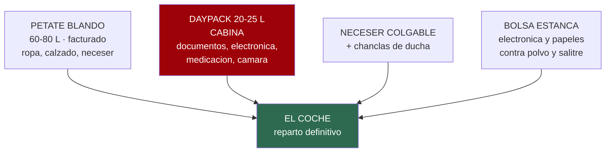
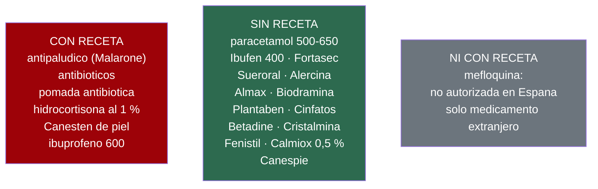
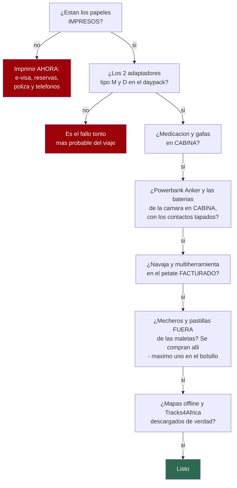

# 17 · La lista, para ir tachando

> **Namibia · 30 oct – 15 nov 2026 · la clásica del norte** — [← índice del dossier](README.md)
>
> Todo lo que sube al petate, **ítem a ítem, con cantidad y con casilla**. El **porqué** de cada
> decisión está en [`05`](05-equipaje.md) —las seis reglas, las temperaturas, lo que ya trae el
> coche—: aquí solo está **la lista**, para imprimirla y tacharla la víspera.
>
> **Las cantidades son para DOS personas y 15 días**, salvo donde ponga «por persona». Salen de
> **una colada** en el día de descanso de Walvis Bay *(D5–D6)*: por eso la ropa interior se
> calcula para siete días y no para quince ○. *(Y no hace falta hacerla a mano: hay deja-y-recoge
> en Swakopmund y tres lavanderías con dirección en Walvis Bay ◐ — el detalle, en [`05`](05-equipaje.md).)*
>
> **~N$20 = €1**, de bolsillo *(el cambio real de 2026 va por **18,5–19,4** — BCE, 28/08: el euro de estas páginas se queda ~7 % corto)* · **✅** fuente primaria · **◐** secundaria concordante ·
> **○** práctica común, sin fuente · **❌** sin verificar, dicho en blanco
>
> *Levantada el 05/08/2026 · completada con cantidades el 06/08/2026 · puesta al 09/10/2026 (la
> pauta entera de Malarone, el protocolo de serpiente y lo que no consta pedido)*

---

## 🧳 Los cuatro bultos

```mermaid
flowchart TD
%% ancho
    A["PETATE BLANDO<br/>60-80 L · facturado<br/>ropa, calzado, neceser"] --> C["EL COCHE<br/>reparto definitivo"]
    B["DAYPACK 20-25 L<br/>CABINA<br/>documentos, electronica,<br/>medicacion, camara"] --> C
    D["NECESER COLGABLE<br/>+ chanclas de ducha"] --> C
    E["BOLSA ESTANCA<br/>electronica y papeles<br/>contra polvo y salitre"] --> C
    style B fill:#9d0208,color:#fff
    style C fill:#2d6a4f,color:#fff
```

**Regla del reparto** ○: en cabina va lo que no se puede reponer *(documentos, medicación, gafas,
tarjetas, cargadores)*; en el petate, lo que sí *(ropa, calzado, neceser)*. Si el petate se pierde,
el viaje sigue; si se pierde la cabina, no.

- [ ] **Petate blando 60-80 L ×1 p.p.** — **[Altus Petate 70](https://www.decathlon.es/es/p/bolsa-de-viaje-duffle-bag-70l-altus-petate-70-cd/_/R-p-X8978467)**
      ✅ 53,99 € *(o, con más margen para la vuelta, [Forclaz 80L/120L expandible](https://www.decathlon.es/es/p/bolsa-de-viaje-80l-120l-duffle-bag-forclaz/_/R-p-156360)
      ✅ 79,99 €)*
- [ ] **Daypack 20-25 L ×1 p.p.** — **[Quechua MH100, 20 L](https://www.decathlon.es/es/p/mochila-de-senderismo-20l-nh100-arpenaz-beige/_/R-p-301674)**
      ✅ 24,99 €, homologada como equipaje de mano

---

## 📄 Documentos — van en cabina, y también en papel

- [ ] **Pasaporte** ×1 p.p. — válido hasta el **15/05/2027** como mínimo y con **3 páginas en
      blanco** ✅ *(la regla)* — ⚠️ **a 09/10, comprobarlo no consta hecho** ❌, y va **antes del
      e-visa**, igual que **que los nombres del billete calquen los del pasaporte** ❌ *(`20` §9)*
- [ ] **e-visa impreso y firmado** ×1 p.p. + **1 copia** suelta — ⚠️ **a 09/10 no consta
      pedido** ❌: tocaba la primera semana de octubre, y con 7–10 días hábiles de trámite ◐, pedido
      hoy llega hacia el **~23/10**, sin holgura para un rechazo *(`20` §6 y §9)*
- [ ] **Billetes de avión impresos** ×1 p.p.
- [ ] **Reservas impresas** ×1 de cada: coche, **Windhoek Urban Camp** *(D1 y, cuando se
      reserve, D14)*, **Spreetshoogte**, **Sesriem ×2**, **Walvis Bay ×2** *(Lagoon Chalets)*,
      **Terrace Bay**, **Hoada**, **Okaukuejo**, **Halali** y **Onguma Tamboti ×2**. *Walvis Bay,
      Hoada y el Urban Camp del D14 **siguen sin reservar a 09/10** ❌ — van en la lista para que no
      se olviden al imprimir cuando lo estén; Twyfelfontein queda sin reservar a propósito, es el
      colchón del calendario (`20` §5)*
      *(Terrace Bay sin reserva en papel no entra al parque ✅ — ⚠️ **y al 09/10 esa confirmación
      no existe: la noche sigue sin reservar** ❌ — desde el ~7/10 NWR cobra el 100 % de golpe y
      anular cuesta el 30 % hasta el ~22/10, `20` §4)*. ⚠️ **Y Sesriem, reservado, está en el
      aire**: el pago íntegro vencía el **3/10**, a 09/10 no consta ni el 20 % ❌, y **NWR cancela
      lo no pagado** — confirmar por escrito que la reserva sigue viva antes de imprimirla *(`20` §9)*
- [ ] **Confirmación de las actividades pre-reservadas en Onguma** ×1 — el Sundowner del D12 y el
      game drive del D13 *(decididos el 26/08; **a 09/10 pedirlas no consta hecho** ❌ — `20` §9)*
- [ ] **Prueba de fondos** ○ — extracto o captura de la cuenta: el MAEC da como referencia
      **N$1.200 (~€60) por persona y día** ≈ ~N$36.000 (~€1.800) los dos *(`12` §6; lo piden «a la
      entrada», aunque rara vez lo miren)*
- [ ] **Póliza IATI en papel** ×2: número de póliza y **teléfono 24 h** ✅ *(el **número de
      emergencias 24 h de Savanna**, en cambio, sigue ❌ — se pide en la entrega y se apunta aquí)*
- [ ] **Carné de conducir** ×1 p.p. + **permiso internacional**, **uno por cada conductor** *(la
      DGT: no consta pedido ❌, `20` §6)* — **uno o dos se decide antes de pedirlo**: depende de si
      Miguel va de conductor adicional *(N$30 · ~€1,50 al día, `20` §9)*, y quien no lleve permiso no
      conduce
- [ ] **Cartilla de vacunación** ×1 p.p. — ⚠️ presupone **la cita del CVI, que no consta pedida**
      ❌ *(`04`, `20` §6)*
- [ ] **Tarjetas** ×2 p.p., de bancos distintos ○ *(Savanna cobra por Visa o Mastercard ✅; Diners
      y Amex, sin confirmar ❌)* — y **con límite para la retención de la franquicia** *(del orden de
      N$35.000 · ~€1.750, sin confirmar ❌ — `02` §2)*: la tarjeta que la soporta no es la que paga
      el viaje
- [ ] **Algo de efectivo en euros, de respaldo** ○ — **no para cambiar: el plan es el cajero**
      *(`07`: cajero mejor que cambiar euros)*. **El plan de efectivo, en una línea ○** *(03/10)*:
      **N$500–1.000 (~€25–50) en el cajero del aeropuerto el D1** y **la carga grande, N$6.000–8.000
      (~€300–400), ese mismo día en Windhoek**, en cajero pegado a sucursal y en varias operaciones
      *(`01` §D1, `07`)*; de eso, **~N$2.000 (~€100) en billetes apartados para el D2–D4**
      —Spreetshoogte N$580 (~€29) si no está pagado, la reserva de efectivo que NWR pide en
      Sesriem, leña y lanzadera—, porque **hasta Walvis Bay (D5) no hay cajero fiable** *(el Cash
      Express de Solitaire es un bonus, no un plan)*. **Cape Cross y Twyfelfontein cobran solo en
      efectivo** *(~N$620 + ~N$540 · ~€31 + ~€27 los dos)*: se recarga en Walvis o Henties Bay el
      D5–D7, el último cajero antes de Kamanjab
- [ ] **Fotocopias de todo** ×1 juego, en bolsa aparte del original ○
- [ ] Fotos de todo en el móvil, **descargadas para verlas sin cobertura** ○
- [ ] **Teléfonos de emergencia de `07` impresos** ×1, en la guantera ✅ *(con el de la
      embajada de España — `04`)*
- [ ] **El kit del control policial, JUNTO en la guantera** ○ — carnet + permiso internacional
      *(jamás separados ✅)*, contrato del alquiler y copia del pasaporte *(el guion del control,
      en `07`)*
- [ ] **Mapa de carreteras en papel** ×1 ✅ *(Namibia funciona con papel, `04`)*. Dos candidatos,
      elegir uno: **[Reise Know-How Namibia
      1:1.200.000](https://www.amazon.es/Namibia-mapa-impermeable-carreteras-Escala/dp/3831773130)**
      *(Polyart impermeable y antirroturas, leyenda en castellano; la compra fácil desde España —
      precio sin leer en vivo ❌: Amazon y la editorial bloquean la consulta)* o el
      **[Tracks4Africa Namibia Traveller's Map, 5.ª ed.,
      1:1.000.000](https://shop.tracks4africa.co.za/product/namibia-travellers-paper-map-5th-edition/)**
      *(PolyArt, con **tiempos de viaje por cada pista** — el mapa hermano del navegador del
      viaje; se vende desde Sudáfrica/UK ◐, p. ej.
      [mapsworldwide](https://www.mapsworldwide.com/maps-charts-atlases-c1811/road-maps-c1932/namibia-tracks-map-p26089)
      con envío internacional)*. ⚠️ **A 09/10, a tres semanas del vuelo, el Tracks4Africa se pide
      HOY o se descarta** ❌ *(el plazo de un envío desde Sudáfrica o el Reino Unido no consta, y no
      hay margen para esperarlo)*: si no, el Reise Know-How, que llega de Amazon
- [ ] **Libreta y boli** ×1 ✅ — para apuntar las presiones en frío de la entrega *(`06`)*.
      Modelos, de papel que aguanta sudor y polvo: **[Rite in the Rain 374-M, 9×13 cm,
      negra](https://www.amazon.es/dp/B00J535NN2)** ✅ 16,54 € · o la **[Rite in the Rain de
      espiral, 8×13 cm](https://www.amazon.es/dp/B009F1E01A)** ✅ 11,99 € (Amazon, 05/10). En ese
      papel escribe también el lápiz

## 👕 Ropa — las cuentas, por persona

*Por qué esta ropa y no otra, en [`05`](05-equipaje.md). Aquí van los números.*

- [x] **Camisetas transpirables ×5** — una puesta, cuatro en el petate. **Resuelto (21/08): 3 de
      lana merina ya en casa** — **2 de Decathlon** *(la
      [Merino REC Fresh](https://www.decathlon.es/es/p/camiseta-de-montana-y-trekking-lana-merina-reciclada-hombre-merino-rec-fresh/364687/c372m8939992),
      que era la recomendada aquí)* **y 1 de Patagonia** ○. *La merina aguanta varias puestas sin
      oler: es exactamente lo que compra este viaje, con **una sola colada en quince días**
      (`05`).* **Faltan 2 para llegar a cinco** — sintéticas normales valen: la **[Quechua
      MH100](https://www.decathlon.es/es/p/camiseta-de-montana-y-trekking-manga-corta-hombre-quechua-mh100/106632/c242m8612133)**
      ◐ 6,99 € *(100 % poliéster, secado rápido)* o cualquiera de casa. *(La **[Forclaz
      Resist](https://www.decathlon.es/es/p/camiseta-de-montana-y-trekking-manga-corta-lana-merino-hombre-forclaz-resist/356413/c383c382m8976797)**
      que se citaba aquí **no es sintética: es merina** —fibra envuelta en poliamida— ◐ 34,99 €;
      vale si se quiere una cuarta merina.)* ⚠️ Y una nota de uso: la merina **se seca más despacio** que la
      sintética, así que la colada de Swakopmund se tiende **la primera noche, no la última** ○
- [ ] **Camisas de manga larga ligeras ×2** — sol de mediodía y mosquitos del anochecer.
      **Una resuelta (21/08): [Craghoppers NosiLife Adventure III](https://www.craghoppers.com/mens-nosilife-adventure-long-sleeved-shirt-iii-parchment/)**
      ✅ — es **la** camisa de este viaje y merece explicación: **el tejido lleva repelente de
      insectos incorporado** *(NosiLife, base de **aceite de Eucalyptus citriodora**, «para toda la
      vida de la prenda» según su ficha ✅)*, es **ripstop de nailon reciclado** con
      **protección solar UPF 40+** ◐ *(su propia ficha, leída el 21/08; en la misma página conviven
      otros productos con UPF 50+, de ahí el ◐)*, cuello abatible que tapa la nuca, espalda
      ventilada, mangas enrollables y **5 bolsillos, uno con cremallera**. **No sustituye al
      repelente de piel** —el DEET va igual en muñecas, tobillos y cuello— pero quita la camisa de
      la ecuación en la espera de la charca. *Para la segunda camisa, mejor si es
      **UPF 50+**: la camiseta clara de algodón es UPF ~7, y ~3
      empapada ◐ *([skincancer.org](https://www.skincancer.org/skin-cancer-prevention/sun-protection/sun-protective-clothing/))*.
      Modelo encontrado en UPF 50+: **[Camiseta protección solar manga larga UPF 50+](https://www.decathlon.es/es/p/camiseta-proteccion-solar-hombre-manga-larga-upf-50-gris-oscuro/332579/m8975975)**
      ❌ *(precio sin verificar hoy; ojo, el corte es de deporte acuático — comprobar en foto que
      sirve como camisa de trekking antes de comprar)*
- [ ] **Pantalones largos ligeros ×2** — **ya en posesión: 2 desmontables de Decathlon**, modelo
      sin identificar ○ *(no hace falta comprar más; ahorran un corto cada uno)*
- [ ] **Pantalones cortos ×2** — **ya en posesión: 2 de deporte** ○; para el resto de los días, la
      pernera corta de los desmontables ya cubre el hueco — no hace falta comprar más
- [ ] **Ropa interior ×7** — sintética de secado rápido: **[Kalenji Dry+ bóxer](https://www.decathlon.es/es/p/calzoncillo-boxer-deportivo-transpirable-hombre-negro/_/R-p-121488)**
      ❌ *(precio sin verificar hoy; alternativa merina, misma lógica que la camiseta REC Fresh:
      [Forclaz Trek500 merina](https://www.decathlon.es/es/p/calzoncillos-boxer-montana-y-trekking-lana-merina-hombre-forclaz-trek500/306561/c405m8751633))*
- [ ] **Calcetines finos ×6 pares** — **[Hike 500 mid, pack de 2](https://www.decathlon.es/es/p/calcetines-mid-de-senderismo-2-pares-adultos-hike-500-rojo/330181/c14m8965692)**
      ◐ ~12,99 € *(dato de rebaja sin fecha fija, no es lectura de hoy)* + **1 par gordo** para las
      noches de la costa — **[Quechua SH900 Mid, pack de 2
      pares](https://www.decathlon.es/es/p/calcetines-calidos-de-senderismo-sh900-mid-x2-pares/_/R-p-336930)**
      ◐ 24,99 € *(88 % lana, rizo grueso; el segundo par, para el otro)*
- [ ] **Forro polar ×1** — la mínima más baja del viaje son **12,7 °C** en la costa ✅. **Ya en
      posesión**: el más nuevo que tengáis de Decathlon ○ — no hace falta comprar. Y va **a mano
      la primera noche, no enterrado en el petate**: el camping de Spreetshoogte está a
      **1.728 m** ◐ *([barkhan](https://www.barkhan.africa/spreetshoogte-campsite.php))* y la
      altitud puede dejar la noche por debajo de la media de la celda
- [ ] **Chubasquero ×1, impermeable de verdad** *(no solo cortavientos)* — costa, salida de
      Deadvlei a las ~05:10 **y las tormentas de Etosha**: noviembre abre las lluvias *(43–44 mm
      en ~7 días, en tormenta ◐)* y un operador namibio lo llama «esencial de noviembre a abril» ◐
      *([Chameleon](https://chameleonholidays.com/what-to-pack-for-your-namibian-holiday/) ·
      [SafariBookings](https://www.safaribookings.com/etosha/climate))*. **Decidido: Patagonia
      Torrentshell 3L** ○ — por encima del listón de gama del resto de la lista; membrana de 3
      capas, cumple de sobra el «impermeable de verdad» que pide este ítem
- [ ] **Opcional: gorro fino + camiseta térmica ligera** ○ — el seguro de 80 g para la noche de
      la costa *(13–15 °C, 88 % de humedad y viento: sensación ~10–11 ◐)*; ninguna fuente lo exige
      en noviembre. La térmica hace de pijama en la costa. **Ambos ya en posesión**: gorro fino ○
      y camiseta térmica **Under Armour** ○ — no hace falta comprar nada
- [ ] **Bañador ×1** — hay piscina en **Okaukuejo y Halali**, las dos noches de dentro ✅ *(en
      **Onguma Tamboti**, donde se duermen el D12 y el D13, la piscina es de Onguma Bush Camp y
      sirve a la otra parcela, Leadwood — no a la vuestra ◐)*. Si no hay uno en casa:
      **[Olaian 100, corto](https://www.decathlon.es/es/p/banador-hombre-corto-surf-olaian-100-16-palm/_/R-p-170271)**
      ◐ 7,99 €, ligero y con forro
- [ ] **Ropa de dormir ligera ×1** — si no vale la de casa: **[pijama corto de algodón, 2
      piezas](https://www.amazon.es/dp/B0DQ16GPNK)** ✅ 14,99 € (Amazon, 05/10; marca genérica)
- [ ] **Sombrero de ala ×1** — de ala **≥7,5 cm** ✅ *([skincancer.org](https://www.skincancer.org/skin-cancer-prevention/sun-protection/sun-protective-clothing/))*, no gorra: las orejas y
      la nuca se queman igual. Y **con barbuquejo** ◐ — el viento de la costa está en su máximo
      anual justo en nov–mar *([Atlas of Namibia](https://atlasofnamibia.online/chapter-3/wind))*.
      **Ya en posesión: Billabong Bushcraft** ○ — pendiente de comprobar a mano que el ala llega a
      los ≥7,5 cm; si se queda corta, es el único punto de este ítem donde tocaría decidir entre
      comprar uno nuevo o asumir menos protección en cuello y orejas
- [ ] **Buff o pañuelo ×2** ✅ — polvo de la grava, viento de la costa y el olor de Cape Cross.
      **Ya en posesión: uno negro** ○; el segundo, de color safari, a comprar — modelo:
      **[Forclaz MT100](https://www.decathlon.es/es/p/braga-cuello-montana-y-trekking-mt100-rojo/330154/c331c106c83m8616253)** ◐ ~3,99 €/ud *(dos fichas de color coinciden en el precio)*
- [ ] **Gafas de sol ×1** — «protección real» tiene nombre: **UV400, marcado CE (EN ISO 12312-1)
      y filtro de categoría 3** ◐ — la 4 no vale para conducir. Mejor envolventes, por la arena en
      el viento. Y su funda ○. **Ya en posesión: Oakley graduadas** ○ — comprobar en su propia
      ficha que cumplen UV400 y categoría 3 (lo habitual en gama Oakley, pero mejor confirmarlo)
- [ ] **Gafas de repuesto** ◐ — si las de diario son graduadas *(las Oakley de arriba lo son)*,
      **el par viejo al petate** — y si hay lentillas, líquido y un juego extra. Lo pide la propia
      lista de viaje del CDC *(«glasses and contacts (bring extras)» —
      [CDC Pack Smart](https://wwwnc.cdc.gov/travel/page/pack-smart))* — y aquí con más motivo:
      a 500 km de la óptica más cercana, unas gafas rotas no tienen arreglo en ruta
- [ ] **Cinturón ×1** — **ya en posesión: 2 de billetero oculto** ○ — no hace falta comprar; la
      misma lógica del Forclaz TRAVEL: sin hebilla metálica, pasa el control sin quitárselo

**Decidido: nada especial para Joe's Beerhouse ni la cena de Terrace Bay** ○ — la ropa de safari
ya hace el apaño.

## 🥾 Calzado — tres pares, ni uno más

- [ ] **Botas Hoka de trail ×1 par, ya domadas** ○ — Big Daddy, Sesriem Canyon, Twyfelfontein y
      la cascada del Uniab *(ya en posesión)*
- [ ] **Sandalias Hoka Hopara 2 ×1 par** ○ — conducir y campamento **de día; desde el ocaso, las
      botas** ✅ *(`22`: nunca sandalias ni chanclas por la parcela de noche — la víctima típica del
      escorpión va en sandalias tras la puesta de sol; añadido el 03/10)* *(decidido el 25/08 en vez de
      las barefoot Saguaro: sandalia cerrada de outdoor, con puntera y suela de trail — aguanta la
      grava del campamento y el pedal, y no entra arena por delante)*
- [ ] **Chanclas ×1 par** ○ — duchas compartidas. **[Nabaiji de piscina, pala
      gris](https://www.decathlon.es/es/p/chanclas-piscina-hombre-pala-gris/_/R-p-149116)** ◐
      5,99 € *(EVA, suela perforada que escurre)* · o la **[Nabaiji de pala con insertos de
      goma](https://www.decathlon.es/es/p/chanclas-pala-piscina-hombre-nabaiji/_/R-p-3659)** ◐
      9,99 €, que agarra mejor en el suelo mojado de la ducha
- [ ] **Calcetines viejos ×2 pares p.p., para la duna** ◐ — Big Daddy se sube y se baja **en
      calcetines, con las botas en el daypack**: a media mañana la arena ya quema *(lo repiten
      las crónicas de la duna: [anywhereweroam](https://anywhereweroam.com/big-daddy-dune/) ·
      [neverendingfootsteps](https://www.neverendingfootsteps.com/climbing-big-daddy-deadvlei-sossusvlei/))* —
      y el resto del viaje hacen de repuesto

## 🧼 Neceser

- [ ] Cepillo de dientes ×1 p.p. · **pasta ×1 tubo** · hilo dental — los de casa; si se quiere
      plegable: **[Colgate Total, kit de viaje](https://www.amazon.es/dp/B0DWSMQN5J)** ✅ 2,50 €
      *(cepillo plegable + pasta mini)* · o **[Colgate plegable, pack de
      4](https://www.amazon.es/dp/B0BNR4P2JG)** ✅ 6,28 €, con repuesto para los dos (Amazon, 05/10)
- [ ] **Pastilla de jabón sólido ×1 — decidido (25/08), en vez de gel** ○: pesa menos, **no
      revienta con el corrugado ni cuenta como líquido en cabina**, y una de 100 g da para los
      quince días entre dos. Que sea **de cuerpo y pelo a la vez** y **sin perfume**: el olor atrae
      insectos en la parcela, y hay duchas de agua caliente por sistema *donkey* que no admiten
      mucho enjabonado. Modelo: **[Dr. Bronner's Pure-Castile, 140 g, sin
      perfume](https://www.amazon.es/dp/B00016XJ4M)** ❌ *(precio sin leer en vivo; ~6–8 €)*. Con
      **jabonera de rejilla** o bolsita de sisal que la deje secar: una pastilla húmeda cerrada en el
      neceser a 35 °C se deshace en dos días ○ — **[cajita de jabón
      Decathlon](https://www.decathlon.es/es/p/cajita-de-jabon/349100/c340c267m8826774)** ◐ 5,99 €
      *(59 g, con rejilla y cierre de imán, para pastillas de hasta 100 g)* · o **[2 jaboneras de
      aluminio](https://www.amazon.es/dp/B0DCVPRQBS)** ✅ 6,31 € (Amazon, 05/10), una por cabeza
      *(el **jabón WILDERNESS** de la colada, abajo, es otro: ése es detergente)*
- [ ] Desodorante ×1 p.p. · peine ×1 · maquinilla y espuma
- [ ] **Toallitas húmedas ×3 paquetes** ○ — el recurso más usado del viaje: manos, cara y polvo
      cuando la ducha queda a horas. **[Chicco multiusos, 16
      uds](https://www.amazon.es/dp/B06XZVKHBC)** ✅ 2,39 € *(sin alcohol ni perfume)* · o
      **[The Fruit Company, bolsillo, pack de 3](https://www.amazon.es/dp/B0D1YLZWKK)** ✅ 6,50 €
      (Amazon, 05/10)
- [ ] **Gel hidroalcohólico ×2 botes** ○ — **[Snonas, 100 ml](https://www.amazon.es/dp/B078SMVXHY)**
      ✅ 2,90 €/ud (Amazon, 05/10), justo en el límite de líquidos de cabina
- [ ] **Papel higiénico ×2 rollos** ○ — los campings lo tienen; los 500 km entre medias, no
- [ ] Pañuelos de papel ×4 paquetes
- [ ] **Toallas de microfibra ×2** ○ *(la ficha del coche ya lista 4 toallas ✅ — éstas quedan de
      respaldo y para la piscina)*. Modelo: **[Toalla microfibra XL 110×175 cm](https://www.decathlon.es/es/p/toalla-microfibra-talla-xl-110-x-175-cm-negro/_/R-p-158653)**
      ✅ 11,99 €/ud (23,98 € las dos)
- [ ] Neceser **colgable** ×1 ○ — no hay repisa garantizada. Modelo: **[Forclaz Ultralight](https://www.decathlon.es/es/p/neceser-plegable-de-viaje-forclaz-ultralight/_/R-p-173360)**
      ✅ 9,99 €, 43 g
- [ ] Cortaúñas ×1 · pinzas de depilar ×1 · **cepillo de uñas ×1** ◐ *(lo piden dos listas de
      self-drive por separado — la arena se mete en todo:
      [Bushlore](https://bushlore.com/wp-content/uploads/2018/05/Self-Drive-Safari-Planning-Guide.pdf) ·
      [FullSuitcase](https://fullsuitcase.com/namibia-packing-list/))* · **costurero pequeño ×1**
      ○ — dos semanas de lona y cremalleras. Modelo: **[Beter cajita de costura de viaje](https://www.amazon.es/dp/B00ZON1FOS)**
      ✅ 4,95 € (Amazon)
- [ ] **Crema de manos y crema hidratante ×1 de cada** ◐ — el aire del Namib seca la piel a
      diario; sobre piel húmeda, dice la dermatología *([AAD](https://www.aad.org/public/everyday-care/skin-care-basics/dry/dermatologists-tips-relieve-dry-skin))*.
      **[Neutrogena manos concentrada, 50 ml](https://www.amazon.es/dp/B01BIS1VQY)** ✅ 2,28 € y
      **[NIVEA Creme, lata de 30 ml](https://www.amazon.es/dp/B0CTR82ZJF)** ✅ 1,29 € (Amazon,
      05/10 — ojo: otra ficha de la misma lata pide 9,99 €)
- [ ] **Vaselina o spray salino nasal ×1** ◐ — nariz reseca y sangrados por el aire seco
      *([Mayo Clinic](https://www.mayoclinic.org/first-aid/first-aid-nosebleeds/basics/art-20056683))*.
      **[Vaselina pura Aposán, 30 g](https://www.amazon.es/dp/B07D5CVDCD)** ✅ 4,20 € *(vale
      también para los labios)* · o **[Naso FAES Triple Acción+, agua de mar, 30
      ml](https://www.amazon.es/dp/B0711HHX3B)** ✅ 5,22 € (Amazon, 05/10)
- [ ] **Tapones para los oídos ×1 par p.p.** ○ · **antifaz ×1 p.p.** ○ — lona al viento y amanecer
      a las 06:07. Modelos: **[16 tapones de silicona + 3 estuches](https://www.amazon.es/dp/B0DVLY85FZ)**
      ✅ 8,99 € (para los dos, Amazon) y **[antifaz Forclaz Travel 500](https://www.decathlon.es/es/p/antifaz-para-dormir-de-viaje-travel-500-negro/352759/c1m8871934)**
      ✅ 9,99 €/ud (19,98 € los dos)
- [ ] Bolsas de basura ×5, **ziplocs ×10** y **×4 grandes tipo escombro para enfundar los petates
      en la caja del pick-up** ◐ *([Expert Africa](https://www.expertafrica.com/namibia/info/namibia-holiday-and-safari-packing-list) y [FullSuitcase](https://fullsuitcase.com/namibia-packing-list/) las piden así)*.
      **[Albal Ultra-Zip 3 L, 15 bolsas](https://www.amazon.es/dp/B0B5HTRZGJ)** ✅ 5,97 € *(o la
      de [1 L, 20 bolsas](https://www.amazon.es/dp/B00KX7VLEE) ✅ 3,45 €)* y **[sacos de escombro
      Relevo, 150 L, 80×110 cm, 75 µm, 10 uds](https://www.amazon.es/dp/B07YYB8T1V)** ✅ 12,95 €
      (Amazon, 05/10) — de **film, no de rafia tejida**: la rafia no para el polvo
- [x] **Detergente de viaje ×1** — **resuelto (21/08): jabón WILDERNESS de 100 ml** ○, un
      multiusos biodegradable de la misma familia que el
      **[Pharmavoyage](https://www.decathlon.es/es/p/jabon-concentrado-multiusos-biologico-de-camping/X8598405/m8598405)**
      ✅ 8,99 € que este ítem proponía *(100 ml, sirve para ropa, cuerpo y vajilla)*. ❌ *Su
      composición y su rendimiento no se han verificado aquí: mira en la etiqueta que sea
      **biodegradable** y que valga para ropa, y **cuenta 100 ml para dos personas y quince
      días** — da para la colada de Swakopmund y algún lavado de pila, no para más ○.*
      Y **[tendedero de camping 5 m
      Quechua](https://www.decathlon.es/es/p/tendedero-para-camping-5-m-quechua/323789/c251c227m8578470)**
      ✅ 4,99 € — trae 20 perlas integradas que sujetan la ropa: **no hacen falta pinzas aparte**.
      El respaldo a mano de la colada *(la cómoda es la lavandería de Swakopmund ◐ —
      [`05`](05-equipaje.md))*

## 💊 Botiquín — qué llevar y cuánto

> ⚠️ **Nada de esto es una prescripción.** Qué te conviene y en qué dosis lo dicen **el Centro de
> Vacunación Internacional y tu farmacia**; aquí solo está el inventario para 15 días entre dos, con
> los principios activos que se llevan de forma habitual ○. Lo único con fuente es la profilaxis:
> la pauta la fija el CVI ✅ *(`04`)*. El inventario se cotejó el 11/08/2026 contra el **kit de
> viaje oficial del CDC Yellow Book** ✅ *([la tabla](https://www.ncbi.nlm.nih.gov/books/NBK620961/table/healthkits.tab2/?report=objectonly))*: de ahí entran el aloe, la venda elástica, el
> antifúngico, la pomada antibiótica, las potabilizadoras y la lágrima artificial.

**Receta sí o no, en España** ✅ *(05/10/2026, cada caso contra el
[CIMA de la AEMPS](https://cima.aemps.es/cima/publico/home.html), que lo dice registro a registro)*.
Lo que hay que saber antes de ir a la farmacia: **la receta no la decide el principio activo, sino
cada marca o genérico concreto** — con la misma dosis hay cajas con receta y cajas sin ella. Por
eso abajo cada ítem lleva **la caja concreta que se vende sin receta**: se pide por su nombre.

**Y cada ítem dice para qué sirve** ✅ — sacado de la sección 1 de su prospecto oficial, «qué es y
para qué se utiliza», en el CIMA *(06/10/2026)*; lo que no es medicamento, de su fabricante o de la
práctica común, con su marca. Va también **el plazo tras el cual el prospecto manda al médico**: a
500 km de una farmacia, saber cuándo un «ya se pasará» deja de valer es la mitad del botiquín.

```mermaid
flowchart LR
%% ancho
    R["CON RECETA<br/>antipaludico (Malarone)<br/>antibioticos<br/>pomada antibiotica<br/>hidrocortisona al 1 %<br/>Canesten de piel<br/>ibuprofeno 600"]
    S["SIN RECETA<br/>paracetamol 500-650<br/>Ibufen 400 · Fortasec<br/>Sueroral · Alercina<br/>Almax · Biodramina<br/>Plantaben · Cinfatos<br/>Betadine · Cristalmina<br/>Fenistil · Calmiox 0,5 %<br/>Canespie"]
    X["NI CON RECETA<br/>mefloquina:<br/>no autorizada en Espana<br/>solo medicamento extranjero"]
    R ~~~ S ~~~ X
    style R fill:#9d0208,color:#fff
    style S fill:#2d6a4f,color:#fff
    style X fill:#6c757d,color:#fff
```

Y fuera del CIMA, porque **no son medicamentos** y se compran sin receta: el suero fisiológico y la
lágrima artificial *(productos sanitarios)*, las potabilizadoras, las cápsulas de sal y los
repelentes *(biocidas: el Goibi Xtreme al 45 % está en la lista oficial de Sanidad como de venta al
público, ES/APP(NA)-2016-19-00365 ✅ —
[listado](https://www.sanidad.gob.es/profesionales/saludPublica/enfermedadesEmergentes/Crimea_Congo/docs/listadorepel1_JUNIO2020.pdf))*.

**Lo que viene con receta**

- [ ] **Profilaxis de malaria** ✅ — la pauta **completa** más 3–4 días de margen. Ojo a la
      geografía: el riesgo se define **por regiones, y Kunene incluye Terrace Bay** — la entrada
      en zona es el **D7 (vie 6)** *(un día antes desde el 24/08)*, y **la salida, el D14 (vie
      13)**, porque la vuelta cruza Oshikoto y Otjozondjupa *(`04` §malaria)*.
      **Si es Malarone** ✅ *([ficha técnica, CIMA](https://cima.aemps.es/cima/dochtml/ft/63452/FT_63452.html),
      09/10)*: **un comprimido al día, con comida o bebida láctea, a la misma hora**, desde 24–48 h
      antes de entrar hasta **7 días después de salir** → **del mié 4 o jue 5 de noviembre al vie
      20, ya en casa**: 16–17 comprimidos por persona, ~20 con el margen. **La caja trae 12** ✅:
      **2 cajas por persona, 4 los dos**. Si es mefloquina, **~16–23 de octubre**; si es
      doxiciclina, del 4–5/11 **hasta 4 semanas después de salir** y con el sol en contra
      *(`04`)*. Y a la cita del CVI, con el dato: para la guía oficial
      británica, en estas regiones **de mayo a noviembre basta evitar picaduras, sin
      quimioprofilaxis** ✅ *([TravelHealthPro](https://travelhealthpro.org.uk/country/157/namibia))* — que lo decida el CVI con eso delante *(`04`)*.
      **Con receta, siempre** ✅: **[Malarone 250/100 mg](https://cima.aemps.es/cima/publico/detalle.html?nregistro=63452)** o su genérico
      **[Malaway](https://cima.aemps.es/cima/publico/detalle.html?nregistro=78402)**. ⚠️ **La mefloquina (Lariam) no está autorizada en España** ✅ —ni un
      registro en el CIMA, ni siquiera retirado—: solo llega por el trámite de
      [medicamento extranjero](https://www.aemps.gob.es/medicamentos-de-uso-humano/acceso-a-medicamentos-en-situaciones-especiales/medicamentos-extranjeros/),
      así que **lo realista es Malarone** *(`04` §malaria)*. **Y no hay plan B allí**: en Namibia el
      antipalúdico también pide receta ✅ *(§si algo se olvida, abajo)*.
      🎯 **Para qué** ✅ *(prospecto, CIMA)*: **prevenir el paludismo** —elimina el parásito que
      mete en la sangre el mosquito infectado— y también tratarlo. **No sustituye al repelente**:
      el propio prospecto pide protegerse de las picaduras igual
- [ ] **Medicación propia** — la del viaje **+5 días**, en el **envase original** y con la receta ○
- [ ] Antibiótico de amplio espectro **solo si tu médico lo receta para el viaje** ○ *(no se
      automedica: es para el caso de no llegar a un centro)*. **Con receta** ✅ — azitromicina y
      ciprofloxacino no tienen ni un registro sin ella *(p. ej. [azitromicina Normon
      500](https://cima.aemps.es/cima/publico/detalle.html?nregistro=66065) · [ciprofloxacino Normon 500](https://cima.aemps.es/cima/publico/detalle.html?nregistro=62300))*.
      🎯 **Para qué** ✅ *(prospecto, CIMA)*: **infecciones por bacterias** —garganta, senos, oído,
      pulmón, piel—; **no sirven para virus** como la gripe o el catarro. **Cuál, para qué infección
      y durante cuántos días lo dice el médico que lo receta**, y la pauta se cumple entera

**Lo básico, sin receta** — *todos los precios de este bloque, leídos en la ficha de la farmacia online el 05/10 ✅; el ✅
que va con «sin receta» es el del CIMA*

- [ ] **Analgésico/antitérmico** — 1 caja *(paracetamol)* ○ — **[Paracetamol Normon 650 mg, 20
      comp.](https://www.farmaciasdirect.eu/products/paracetamol-normon-efg-650-mg-20-tablets)**
      0,86 € · sin receta ✅ *([CIMA](https://cima.aemps.es/cima/publico/detalle.html?nregistro=68331))*. El de **1 g**, solo en cajas de 10 de marcas
      concretas *(Gelocatil, Antidol)*: la mayoría de cajas de 1 g piden receta.
      🎯 **Para qué** ✅ *(prospecto)*: **dolor leve o moderado** —cabeza, muelas, músculos, espalda—
      **y fiebre**. Es **el analgésico de la picadura de escorpión** *(`22` §3)*
- [ ] **Antiinflamatorio** — 1 caja *(ibuprofeno)* ○ — ⚠️ **para la picadura de escorpión no
      cuenta**: los antiinflamatorios «decepcionan» y **nada de opiáceos ni sedantes**, que deprimen
      la respiración; paracetamol, frío y al hospital ✅ *(Müller, `22` §3)*. **[Ibufen 400 mg, 20
      comp.](https://www.farmaciasdirect.eu/products/ibufen-400-mg-20-film-coated-tablets)** 4,59 €
      · sin receta ✅ *([CIMA](https://cima.aemps.es/cima/publico/detalle.html?nregistro=63597))*. **El de 600 pide receta siempre**, y hasta algún 400
      genérico también: pedir la marca.
      🎯 **Para qué** ✅ *(prospecto)*: lo mismo que el paracetamol —**dolor leve o moderado y
      fiebre**— y además **baja la inflamación**: el tobillo torcido, la contractura del volante
- [ ] **Antidiarreico** — 1 caja *(loperamida)* ○ — **[Fortasec 2 mg, 12
      cáps.](https://www.farmaciasdirect.eu/products/fortasec-2-mg-12-hard-capsules)** 8,06 € ·
      sin receta ✅ *([CIMA](https://cima.aemps.es/cima/publico/detalle.html?nregistro=56523))*.
      🎯 **Para qué** ✅ *(prospecto)*: **frenar la diarrea aguda ocasional**. No cura su causa ni
      repone lo perdido —eso son las sales, abajo—. ⚠️ **Al médico si empeora o si en 2 días no
      mejora**
- [ ] **Sales de rehidratación oral ×8 sobres** ○ — con 35–38 °C la deshidratación va por delante
      de la sed, y la regla del agua son **4+ L por persona y día EN el coche** ✅. **[Sueroral
      hiposódico, 5 sobres](https://okfarma.es/sueroral-hiposodico-polvo-para-solucion-oral-5-sobres)**
      3,20 € la caja — **dos cajas** para llegar a ocho · sin receta ✅ *([CIMA](https://cima.aemps.es/cima/publico/detalle.html?nregistro=59877))*. Cada
      sobre, en **1 L** de agua.
      🎯 **Para qué** ✅ *(prospecto)*: **prevenir y tratar la deshidratación por vómitos o
      diarrea**. El Fortasec frena la diarrea; esto **repone el agua y las sales** que se llevó
- [ ] **Cápsulas de sal/electrolitos ×1 bote** ○ — para el sudor del esfuerzo *(Big Daddy, las
      caminatas)*: complementan a las SRO, que son para la diarrea. Elegidas:
      **[cápsulas de sal ×100 de Decathlon](https://www.decathlon.es/es/p/capsulas-de-sal-x100/188711/g78m8409161)**
      · alternativa, **[226ERS Salts, 100 cáps.](https://www.amazon.es/226ERS-Salts-Electrolitos-100-C%C3%A1psulas/dp/B0757T6WHC)**
      ✅ 21,00 € (Amazon). Suplemento, no medicamento: sin receta.
      🎯 **Para qué** ○: **reponer la sal que se va con el sudor** en un esfuerzo largo con calor;
      no tratan nada
- [ ] **Antihistamínico** — 1 caja ○ — **[Alercina 10 mg, 7
      comp.](https://www.farmaciaevacontreras.com/producto/alercina-10-mg-7-comprimidos/)** 5,76 €
      · sin receta ✅ *([CIMA](https://cima.aemps.es/cima/publico/detalle.html?nregistro=66044))* · o Clarityne 10 mg ×10, también sin receta ✅. La
      cetirizina y la loratadina genéricas «normales» piden receta.
      🎯 **Para qué** ✅ *(prospecto)*: **la alergia de nariz y ojos** —estornudos, moqueo, picor
      de ojos; el polen o el polvo—. ⚠️ **Ni la Alercina ni el Clarityne dicen servir para el
      picor de una picadura ni para la urticaria**: eso es el Fenistil, abajo. Al médico si en 3
      días *(Alercina)* o 7 *(Clarityne)* no mejora. ⚠️ Y **no tras una picadura de escorpión**
      *(`22`: ni antihistamínicos ni corticoides «de rutina»)*: eso es frío y hospital
- [ ] **Protector gástrico** — 1 caja ○ — **[Almax 500 mg, 24
      comp.](https://www.farmaciasdirect.eu/products/almax-500-mg-24-chewable-tablets)** 9,87 € · sin receta ✅
      *([CIMA](https://cima.aemps.es/cima/publico/detalle.html?nregistro=55396))* · o **[Omeprazol Pensavital 20 mg, 14
      cáps.](https://www.farmaciasdirect.eu/products/omeprazole-pensavital-efg-20mg-14-capsules)**
      3,60 € · sin receta ✅ *([CIMA](https://cima.aemps.es/cima/publico/detalle.html?nregistro=64477))* — ojo, otros omeprazoles de 20 mg sí piden receta.
      🎯 **Para qué** ✅ *(prospectos)*: **acidez y ardor de estómago**. El Almax neutraliza el
      ácido que ya hay y alivia al momento; el omeprazol hace que se fabrique menos y es para el
      **reflujo** que se repite —el ardor que sube al pecho—, en tandas cortas. Con uno de los dos
      basta
- [ ] **Antiemético para el coche** — 1 caja ○ *(hay 2.798 km, y el paso de Spreetshoogte y la
      grava de los D8–D9 se notan)*. **[Biodramina 50 mg, 12
      comp.](https://okfarma.es/biodramina-12-comprimidos)** 7,08 € · sin receta ✅
      *([CIMA](https://cima.aemps.es/cima/publico/detalle.html?nregistro=16409))*. ⚠️ **Da sueño: para el copiloto, nunca para quien conduce**.
      🎯 **Para qué** ✅ *(prospecto)*: **prevenir y tratar el mareo del transporte** —náuseas,
      vómitos, vértigo—. **Se toma antes del tramo**: al menos media hora, mejor 1–2 horas ✅
      *(sección 3 del mismo prospecto)*. ⚠️ Y **no tras una picadura de escorpión** *(`22`)*: el
      dimenhidrinato es un antihistamínico que da sueño, y ahí no van **ni sedantes ni
      antihistamínicos** ✅ — aunque la picadura dé náuseas
- [ ] **Laxante suave o fibra** ○ — dieta de camping y poca verdura. **[Plantaben 3,5 g, 30
      sobres](https://www.farmaciaevacontreras.com/producto/plantaben-polvo-efervescente/)** 8,96 €
      · sin receta ✅ *([CIMA](https://cima.aemps.es/cima/publico/detalle.html?nregistro=56342))*.
      🎯 **Para qué** ✅ *(prospecto)*: **el estreñimiento** — es fibra *(plantago)* que retiene
      agua: cada sobre en un vaso de agua, **otro vaso detrás y 1–2 L al día** ✅ *(su
      prospecto)*. Al médico si en 3 días no mejora
- [ ] **Antitusivo o descongestionante — 1 caja** ○ *(kit CDC: el polvo de pista y el aire seco)*.
      **[Cinfatós 15 mg, 18 sobres](https://www.farmaciasdirect.eu/products/cinfatos-15-mg-oral-solution-18-sachets)**
      9,09 € · sin receta ✅ *([CIMA](https://cima.aemps.es/cima/publico/detalle.html?nregistro=78764))* · o el spray **[Respibien 0,5
      mg/ml](https://www.farmaciaevacontreras.com/producto/respibien-05-mgml-nebulizador-nasal/)**
      6,44 € · sin receta ✅ *([CIMA](https://cima.aemps.es/cima/publico/detalle.html?nregistro=51889))* — éste, pocos días seguidos como mucho, por el efecto rebote.
      🎯 **Para qué** ✅ *(prospectos)*: el Cinfatós, **la tos seca, la que no arranca flemas** —la
      irritativa del polvo—; con flemas no toca. El Respibien, **la nariz tapada**, y **3 días como
      máximo**, lo dice su prospecto
- [ ] **Pastillas potabilizadoras ×1 tubo** ○ *(kit CDC: el respaldo de la regla del agua en los
      tramos de 500 km)*. Modelo: **[Aquatabs, 50 uds, 1 L/pastilla](https://www.decathlon.es/es/p/mp/pastillas-potabilizadoras-de-agua-supervivencia-aquatabs-50uds-1l-pastilla/068a8bed-71b5-44bb-af68-bd91f7c8686f/novar)**
      ✅ 13,95 € (marketplace Decathlon) · o **[las mismas en
      Amazon](https://www.amazon.es/Albainox-33430-Pastillas-Potabilizadoras-Unisex/dp/B00GOPHOSQ)**
      ✅ 11,74 € (05/10). No son medicamento: sin receta.
      🎯 **Para qué** ○: **potabilizar agua dudosa** —una pastilla por litro, y esperar el tiempo
      que marque el envase antes de beber—. No quitan el barro: si el agua viene turbia, se filtra
      antes con un paño

**Curas y picaduras**

- [ ] Antiséptico *(clorhexidina)* ×1 · **gasas ×10** · **esparadrapo ×1** · **venda elástica ×1**
      *(elástica, con apellido — kit CDC: es la del esguince bajando Big Daddy)* · **pomada
      antibiótica ×1** *(la clorhexidina limpia; esto cubre la herida ya curada)*.
      ⚠️ **La pomada antibiótica pide receta en España, todas** ✅ — mupirocina *(Bactroban,
      [CIMA](https://cima.aemps.es/cima/publico/detalle.html?nregistro=58868))*, ácido fusídico, bacitracina, neomicina: ni un registro sin receta. **O la
      receta el médico en la misma cita del CVI, o se sustituye** por un segundo antiséptico sin
      receta: **[Betadine, povidona yodada, 50
      ml](https://www.farmacialiceo.com/betadine-100-mg-ml-solucion-topica-1-frasco-50-m)** ✅
      7,47 € · sin receta ✅ *([CIMA](https://cima.aemps.es/cima/publico/detalle.html?nregistro=36340))*. El de clorhexidina: **[Cristalmina 10 mg/ml, 25
      ml](https://okfarma.es/cristalmina-10mgml-solucion-cutanea-25-ml)** ✅ 6,35 € · sin receta ✅
      *([CIMA](https://cima.aemps.es/cima/publico/detalle.html?nregistro=56549))*.
      🎯 **Para qué** ✅ *(prospectos)*: los dos son **antisépticos**: matan los gérmenes de
      **heridas pequeñas, cortes, rozaduras y quemaduras leves**. Primero se lava con agua limpia
      o suero, luego el antiséptico, luego la gasa. La pomada antibiótica *(si el médico la receta)*
      no es para limpiar: **trata una herida que ya se ha infectado**. Las **gasas** cubren, el
      **esparadrapo** las sujeta y la **venda** comprime o inmoviliza *(un esguince)* ○.
      **[Gasas estériles Interapothek 20×20 cm, 20
      uds](https://www.promofarma.com/es/interapothek-compresa-esteril-tnt-20-uds/p-516978)** ✅
      7,00 € · **[esparadrapo de papel Omnipor 5 m ×
      2 cm](https://www.promofarma.com/en/omnipor-esparadrapo-papel-5mx2/p-20306)** ✅ 1,84 €
      *(hipoalergénico; con mucho sudor despega)* · **[venda cohesiva Nexcare 2,5 m ×
      5 cm](https://www.promofarma.com/en/nexcare-cohesive-bandage-skin-colour-2/p-52770)** ✅
      3,65 € *(se pega a sí misma: ni grapas ni esparadrapo)* — PromoFarma, 05/10
- [ ] **Tiritas ×20** de varios tamaños · **apósitos para ampollas ×6** ○ — Big Daddy las hace.
      **[Hansaplast Universal, 40 uds, 4
      tamaños](https://www.atida.com/es-es/hansaplast-universal-4-tamanos-40-apositos)** ✅ 3,99 €
      y **[Compeed ampollas medianas, 5
      uds](https://www.atida.com/es-es/compeed-apositos-ampollas-medianas-5-uds)** ✅ 8,99 € —
      Atida, 05/10; para llegar a seis, una caja más o la de pequeñas.
      🎯 **Para qué** ○: las tiritas, el corte pequeño; el Compeed, **la ampolla** —o la rozadura
      roja que va a serlo, puesto antes de que reviente—, y se deja hasta que se despegue solo
- [ ] **Tijeras ×1** y **pinzas ×1** ○ — las espinas de acacia se clavan y se parten. Y las
      pinzas son también **el extractor de garrapatas**: revisión corporal al anochecer los días
      de monte ◐ — la fiebre por garrapata africana es la fiebre con sarpullido más frecuente del
      safari austral, y quien acampa es el grupo de riesgo; el tratamiento es del médico, no del
      botiquín *([CDC Yellow Book](https://www.cdc.gov/yellow-book/hcp/travel-associated-infections-diseases/rickettsial-diseases.html))*.
      **[Tijera Beter punta roma, inox, 10,4
      cm](https://www.atida.com/es-es/tijera-punta-roma-recta-inoxidable-beter)** ✅ 5,99 € (Atida)
      y, mejor que unas pinzas para la garrapata, el **[Tick Twister, 3 tamaños, el original de
      O'Tom](https://www.promofarma.com/it/tick-twister-set-de-3-tire-tiques/p-579977)** ✅ 10,26 €
      *(la ficha que se pudo leer es la italiana de PromoFarma)* · o **[Biocanina Tic-Tac-Toe, 2
      uds](https://www.promofarma.com/en/biocanina-tic-tac-toe-2unts/p-426020)** ✅ 6,04 € —
      05/10
- [ ] **Compresa fría instantánea ×2** ◐ — la única medida de primeros auxilios con respaldo para
      la picadura de *Parabuthus*, el escorpión grande de la ruta: frío local, más eficaz en las
      2 primeras horas *([CMEJ](http://www.cmej.org.za/index.php/cmej/article/view/2545/2580))* —
      y en una parcela no hay congelador. Los teléfonos toxicológicos, con los de emergencia
      de `07`; el protocolo entero de la picadura, en el `22`. **[Nexcare ColdHot, frío
      instantáneo, 2 uds](https://www.promofarma.com/es/nexcare-coldhot-bolsa-de-frio-instantaneo-2uds/p-53693)**
      ✅ 4,75 € (PromoFarma, 05/10) — de un solo uso, sin congelador: justo las dos de la lista
- [ ] **Bote pequeño con tapa ×1** ○ — para meter el escorpión *(con las pinzas, sin tocarlo)* y
      llevarlo al hospital a que lo identifiquen: lo recomienda Müller ✅ *(`22` §3)*. Vale un tarro
      de cocina vacío; viaja con la compresa fría
- [ ] **Mascarilla de barrera para RCP ×1** ○ — pesa nada; la lista el protocolo de mordedura del
      [African Snakebite Institute](https://www.africansnakebiteinstitute.com/articles/first-aid-for-snakebite-2/).
      **[Protector facial de RCP de llavero, válvula antirretorno, 5
      uds](https://www.amazon.es/Protectores-unidades-reanimaci%C3%B3n-primeros-entrenamiento/dp/B07XCM534R)**
      ✅ 10,99 € (Amazon, 05/10)
- [ ] **Crema para picaduras** ×1 y **corticoide suave** ×1 ○ — **[Fenistil gel, 30
      g](https://www.farmacialiceo.com/fenistil-1-mg-g-gel-topico-30-g)** ✅ 9,14 € · sin receta ✅
      *([CIMA](https://cima.aemps.es/cima/publico/detalle.html?nregistro=54083))* *(o [After Bite, 14 ml](https://www.farmacialiceo.com/after-bite-original-14-ml)
      ✅ 5,23 €, que no es medicamento)* y **[Calmiox, hidrocortisona 0,5 %, 30
      g](https://www.ibanezfarmacia.com/2618-calmiox-5-mgg-crema-30-g)** ✅ 10,98 € · sin receta ✅
      *([CIMA](https://cima.aemps.es/cima/publico/detalle.html?nregistro=60889))*. ⚠️ **La hidrocortisona al 1 % ya pide receta** ✅
      *([Dermosa, CIMA](https://cima.aemps.es/cima/publico/detalle.html?nregistro=21428))*: la del 0,5 % es el techo sin ella.
      🎯 **Para qué** ✅ *(prospectos)*: el **Fenistil**, **el picor de las picaduras** —y de la
      urticaria y las quemaduras de sol pequeñas—: es un antihistamínico **en gel**, no se traga.
      El **Calmiox**, **el picor con inflamación** de una irritación de piel —picadura, ortiga,
      algo que roza—, cuando el Fenistil se queda corto. Al médico si en 7 días no mejora. ⚠️ Y
      **ninguno de los dos es para la picadura de escorpión**: eso es frío y hospital *(`22`)*
- [ ] **Gel de aloe vera ×1** ○ *(kit CDC: la quemadura solar Y la del braai — se cocina al fuego
      cada noche y nada más del botiquín cubre quemaduras)*. **[Botanica Pharma, aloe vera 100 %,
      250 ml](https://www.promofarma.com/en/botanica-pharma-sabila-aloe-vera-gel-100-pure-250ml/p-58794)**
      ✅ 9,28 € (PromoFarma, 05/10).
      🎯 **Para qué** ○: **calmar y refrescar la piel quemada** —sol o braai— cuando la quemadura
      es leve. Si salen ampollas grandes, es para el médico
- [ ] **Antifúngico en crema o polvos ×1** ○ *(kit CDC — 17 días de calor y botas)* —
      **[Canespie clotrimazol 1 %, crema 30
      g](https://www.farmacialiceo.com/canespie-clotrimazol-10-mg-g-crema-30-g)** ✅ 12,16 € · sin
      receta ✅ *([CIMA](https://cima.aemps.es/cima/publico/detalle.html?nregistro=69680))*. ⚠️ **Ojo con el nombre: el Canesten de piel —crema, polvo y
      spray— sí pide receta** ✅ *([CIMA](https://cima.aemps.es/cima/publico/detalle.html?nregistro=52626))*, aunque sea el mismo clotrimazol. **En polvo
      sin receta no se encontró ninguno** ❌: crema.
      🎯 **Para qué** ✅ *(prospecto)*: **el pie de atleta** —picor, grietas y piel que se pela
      entre los dedos—, que es justo lo que crían quince días de botas. **Solo para los pies**,
      según el propio prospecto. Al médico si en 10 días no mejora
- [ ] **Suero fisiológico en monodosis ×10** y **lágrima artificial sin conservantes ×20** ◐ — el
      polvo es diario: el suero lava, la lágrima lubrica *(CDC Pack Smart y
      [AOA](https://www.aoa.org/healthy-eyes/vision-and-vision-correction/environments))*.
      **[Suero fisiológico Kern Pharma, 30 × 5
      ml](https://www.dosfarma.com/8930-suero-fisiologico-kern-pharma-5ml-x-30ud.html)** ✅ 3,99 € y
      **[Artelac Complete, 30 monodosis sin
      conservantes](https://www.dosfarma.com/11868-artelac-complete-30-monodosis.html)** ✅ 17,99 €
      (DosFarma, 05/10).
      🎯 **Para qué** ◐: el **suero**, **lavar** —ojos con arena, nariz con polvo, una herida
      antes del antiséptico—; la **lágrima**, **lubricar el ojo seco** que deja el viento del
      desierto. Una monodosis abierta se usa y se tira
- [ ] **Termómetro ×1** — **[Braun PRT1000](https://www.amazon.es/dp/B000FHC0QK)** ✅ 10,38 €
      (Amazon) · **guantes de nitrilo ×4** ○ — **[Peha-Soft nitrilo, 10
      uds](https://promofarma.com/peha-soft-guantes-desechables-de-nitrilo-talla-l-10uds)** ✅
      3,15 € (PromoFarma, 05/10; tallas S, M y L en la misma ficha).
      🎯 **Para qué**: el termómetro dice si **hay fiebre** — y en zona de malaria, **toda fiebre
      se toma en serio y se mira sin esperar**, aunque sea zona de bajo riesgo ✅
      *([TravelHealthPro](https://travelhealthpro.org.uk/factsheet/52/malaria): «any febrile
      illness must be taken seriously and investigated promptly»)*. Los guantes ○, curar a otro sin
      tocar su sangre

**🐍 Mordedura de serpiente — el protocolo, corto** ✅ *(el del [African Snakebite
Institute](https://www.africansnakebiteinstitute.com/articles/first-aid-for-snakebite-2/), leído el
09/10; es el que el `22` da por «protocolo de serpiente del `17`» y no estaba escrito hasta hoy)*.
Del botiquín solo pide la venda y la mascarilla: **lo que salva es llegar al hospital**. Los
teléfonos toxicológicos, con los de emergencia del [`07`](07-logistica.md).

- **Lejos de la serpiente y quieto** ✅ — una segunda mordedura lo complica todo. **Calmar a la
  víctima** y que **no mueva el miembro** *(una férula ayuda)*. **No intentar cogerla ni matarla**
  ✅ — al revés que con el escorpión y su bote: como mucho, una foto de lejos ○
- **Fuera anillos, pulseras, reloj y lo que apriete** ✅ — el miembro se hincha
- **Al hospital, avisando antes** ✅ — llamar a urgencias, o conducir si es más rápido; donde no
  hay señal, el SOS del satelital *(`07`)*
- **NADA de torniquete, ni cortar, ni chupar, ni hielo ni calor, ni antiinflamatorios** ✅
- **La venda de presión, SOLO para mamba y cobra no escupidora** ✅ *(veneno neurotóxico: párpados
  caídos, problemas para tragar o respirar)* — **«nunca» en una mordedura citotóxica**, la de la
  **víbora bufadora** *(hinchazón y dolor que avanzan)*, para la que el ASI dice que **no hay
  primeros auxilios eficaces**: solo el traslado. **Si no se sabe cuál fue**, el ASI da para el
  medio rural una almohadilla de presión sobre la mordedura, vendada encima, y al hospital ✅
- **Si deja de respirar: una insuflación suave cada 6 segundos** ✅ — con la mascarilla de RCP
- **Veneno en los ojos** *(cobra escupidora)*: **lavar con mucha agua** ✅

**Sol y bichos — lo que de verdad se gasta**

- [ ] **Crema solar 50+ ×4 tubos de 200 ml** ◐ — el sol es el riesgo diario real, no la fauna: el
      UV de noviembre es **extremo (13–15)**, también bajo la niebla de la costa ◐. La cuenta que
      jubiló los 2 tubos del primer borrador: la dosis dermatológica son **~30 ml por aplicación,
      cada 2 h** — dos personas y 15 días salen a **750–900 ml aun yendo de manga larga**
      *([AAD](https://www.aad.org/public/everyday-care/sun-protection/shade-clothing-sunscreen/how-to-apply-sunscreen) · [Skin Cancer Foundation](https://www.skincancer.org/skin-cancer-prevention/sun-protection/sunscreen/))*.
      Dos modelos de 200 ml, resistentes al agua: **[Babaria spray SPF 50+ piel
      sensible](https://www.promofarma.com/en/babaria-solar-spray-spf50-sensitive-skin-waterproof-200ml-vapori/p-272824)**
      ✅ 13,39 € · o **[La Roche-Posay Anthelios Wet Skin SPF
      50+](https://www.promofarma.com/en/la-roche-posay-anthelios-gel-wet-skin-spf50-200ml/p-726406)**
      ✅ 19,73 € *(se pone sobre piel mojada o sudada)* — PromoFarma, 05/10
- [ ] **Protector labial con filtro ×2** ○ — **[ISDIN SPF 50+, stick de
      4 g](https://www.promofarma.com/es/isdin-protector-labial-spf50-stick-4g/p-161029)** ✅
      7,07 €/ud (PromoFarma, 05/10)
- [ ] **Aftersun ×1** ○ — **[ISDIN After Sun loción, 200
      ml](https://www.promofarma.com/en/after-sun-isdin-lotion-200ml/p-10086)** ✅ 12,79 €
      (PromoFarma, 05/10)
- [x] **Repelente con DEET ≥20 % (o icaridina) ×2 frascos** ✅ — **resuelto (21/08): Goibi Xtreme
      Trópical** ✅, **DEET al 45 %** *(N,N-dietil-m-toluamida 45 g/100 g + etanol; ficha de
      farmacia ◐◐, dos fuentes concordantes)*: **muy por encima del ≥20 % que pide el CDC**, con
      **hasta 12 h de protección frente a mosquito y 8 h frente a garrapata** ◐, y **a partir de 2
      años**. Y el orden importa: **siempre crema solar primero, repelente encima**
      *([CDC](https://wwwnc.cdc.gov/travel/destinations/traveler/none/namibia))*.
      ⚠️ **Dos avisos que trae el DEET al 45 %** ○: **disuelve plásticos y lacas** —cuidado con las
      gafas, la pantalla del móvil, la correa del reloj y **la carcasa de los prismáticos y de la
      cámara**: échalo con las manos limpias después— y **se lava al llegar al campamento**, no se
      duerme con él. **Comprueba que quedan dos frascos**: la lista pide 2 y son 15 días
- [ ] **Permetrina para tratar ropa, calcetines y botas ANTES de salir ×1** ✅ — el CDC la pide
      expresamente para esta zona: *«use permethrin-treated clothing and gear (such as boots,
      pants, socks, and tents)»* — cubre mosquito Y garrapata a la vez, aguanta varios lavados, y
      **nunca va sobre la piel** *(misma ficha del CDC)*

      > ⚠️ **Ojo, que esto NO está cerrado (21/08): el Diptron Textil comprado no es permetrina.**
      > Su principio activo es **butilacetilaminopropionato de etilo (IR3535) al 25,5 %** ◐◐ *(dos
      > fichas de distribuidor concordantes —
      > [comercialmida](https://comercialmida.es/products/diptron-textil-repelente-insectos-ropa-100ml-quimunsa) ·
      > [plagasonline](https://www.plagasonline.es/garrapatas/repelente-garrapatas-y-mosquitos-textil-100ml-1137.html))*,
      > no permetrina. **Sirve, y sirve bien** —hasta **3 meses contra mosquito y 1 mes contra
      > garrapata**, según lavados, pulverizado sobre la prenda a razón de ~1,6 ml/m²—, pero **no
      > es el producto que nombra el CDC**, así que el ítem queda **cumplido a medias**.
      >
      > **Las tres salidas, para decidir sin darle más vueltas:**
      > 1. **Dejarlo así** ○ — el riesgo real de esta ruta en noviembre es **mosquito**, no
      >    garrapata, y ahí el IR3535 textil aguanta los quince días de sobra. **Es la opción
      >    razonable si no apetece comprar nada más.**
      > 2. **Añadir permetrina de verdad**: **[NOBITE Textil, 100 ml](https://www.amazon.es/NOBITE-004-nobite-Spray-para/dp/B00E67EWCA)**
      >    ◐ *(permetrina al 2 %; ~4 semanas frente a insectos y ~2 frente a garrapatas, impregna
      >    unas 4 prendas, sin olor y sin teñir; apto desde los 3 años)*. Es el que cumple el ítem
      >    tal como está escrito.
      > 3. **No hace falta ninguna de las dos para la camisa buena**: la Craghoppers **ya trae
      >    repelente en el tejido** ✅ *(ver Ropa)*. La permetrina/IR3535 es para **calcetines,
      >    pantalones y el resto**.
      >
      > **Y en cualquier caso: se pulveriza en casa, al aire libre, con la prenda tendida, y se
      > deja secar del todo antes de meterla en el petate** ✅ — nunca sobre la piel, y no se
      > aplica en el destino.

## 🔌 Electrónica y energía

- [ ] **Adaptadores tipo M y D ×2** ◐ — comprados **antes de salir**, y que cubran **los dos tipos**
      *(Namibia usa M y D; verificado el 25/08)*: el Schuko no entra, y no se
      venden en supermercados españoles. **⚠️ Ojo con el modelo**: los adaptadores «universales»
      genéricos (Travel Blue, Skross 1103180) **excluyen Sudáfrica/Namibia explícitamente** — el
      pin M es más grueso que el que llevan de serie. Hace falta el producto específico: **[Skross
      44703 «South Africa World Adapter»](https://www.amazon.es/Skross-44703-Adaptador-Mundial-Sud%C3%A1frica/dp/B01JN9Z8RI)**
      ✅ 8,83 €/ud (17,66 € los dos, Amazon). ⚠️ **A 09/10 no constan pedidos** ❌ — el `05` los quería
      «pedidos online YA» desde agosto: **esta semana**, que es el fallo tonto del repaso de la víspera
- [ ] **Regleta pequeña o ladrón ×1** ◐ — la parcela tiene **una** toma en el poste y sois dos
      móviles, cámara, frontales y powerbank *(dos listas de Namibia la llevan; el cierre del
      enchufe camp a camp, en [`18`](18-manual-de-campamento.md) §5)*. Modelo: **[Garza Power, 4
      tomas con interruptor](https://www.amazon.es/dp/B01ET1TDB2)** ✅ 5,51 € *(sin USB — ya lo
      cubren el cargador de mechero y el powerbank)*
- [ ] **Cargador 12 V multi-USB ×1** ○ para el coche — **[INIU 60W, USB-C PD +
      USB-A QC](https://www.amazon.es/INIU-60W-Charger-Fast-Charging/dp/B08VJ2VH2J)** ✅ 4,89 €
- [ ] **Cargador de pared USB ×1** *(doble, USB-C + USB-A)* ○ — el eslabón que faltaba entre la
      regleta *(elegida sin USB)* y el enchufe del poste: el cargador de mechero solo carga con el
      motor en marcha. **Cualquiera de los de casa sirve** — se apunta para que no se quede en la
      mesilla
- [x] **Powerbank ×1 grande** ○ *(el enchufe en parcela quedó confirmado el 11/08 ◐ — `18` §5 —
      para las noches de NWR de interior, **Sesriem, Okaukuejo y Halali**, y para Onguma Tamboti;
      el powerbank cubre Spreetshoogte, Hoada y las tomas rotas de Sesriem)*. **Resuelto (21/08): Anker de 20.000 mAh, ya en posesión** ○ — no hace falta
      comprar.
      ⚠️ **Y esto sí importa el día del vuelo: VA EN CABINA, nunca en la maleta facturada** ✅ —
      es norma IATA para toda batería de litio suelta. Los 20.000 mAh a 3,7 V son
      **~74 Wh**, **por debajo del límite de 100 Wh** que las aerolíneas dejan pasar sin permiso
      previo ✅: no hay trámite, pero **tiene que ir contigo**. *(La misma regla vale para las
      baterías sueltas de la cámara — ver abajo.)*
- [ ] **Cables de carga ×2 de cada tipo** ○ — el polvo mata conectores. Trenzados:
      **[Anker USB-C a USB-C 240 W, 0,9 m](https://www.amazon.es/Anker-trenzado-multicolor-flexible-cargador/dp/B0DDXPFN2Z)**
      ✅ 12,33 € · y, si hay iPhone con Lightning, **[Anker USB-C a Lightning MFi, 0,9
      m](https://www.amazon.es/Anker-Lightning-trenzado-reciclado-ultrarr%C3%A1pido/dp/B0DL4WTHFY)**
      ✅ 15,29 € (Amazon, 05/10)
- [ ] **Funda para el teléfono ×1 p.p.** ○ — que aguante polvo y golpes: el móvil vive quince días
      entre grava, arena y el salpicadero *(para el día de niebla y salitre de la costa ya está la
      bolsa estanca)*. Modelo: **[Funda estanca IPX8](https://www.decathlon.es/es/p/funda-estanca-telefono-movil-ipx8/346905/m8802142)**
      ✅ 9,99 €/ud — antipolvo y anti-agua a la vez, hasta 90×180 mm
- [ ] **Soporte de móvil para el salpicadero ×1** ◐ — Tracks4Africa es el navegador del viaje y
      son 2.798 km: el móvil va sujeto, no en el regazo — y que agarre de verdad, que el
      corrugado vibra *([FullSuitcase](https://fullsuitcase.com/namibia-packing-list/) lo pide
      así: «must attach securely for rough gravel roads»)*. **[Quad Lock, de rejilla de
      ventilación](https://www.amazon.es/Quad-Soporte-Rejilla-Ventilaci%C3%B3n-Coche/dp/B0BFQLRGKW)**
      ✅ 45,51 € — el que no suelta el móvil, pero **pide su funda o su adaptador, aparte** · o,
      barato, **[PORTENTUM de gancho para la
      rejilla](https://www.amazon.es/PORTENTUM-Telemovel-Ventilaci%C3%B3n-Accesorios-Universal/dp/B0CGQ3Q3FD)**
      ✅ 9,99 € (Amazon, 05/10). ❌ *Cómo es la rejilla del Ford Ranger de Savanna *(`20` §1)*
      no consta: si no admite gancho, los de rejilla no valen*
- [ ] **Frontal ×1 por persona, con modo rojo** ○ — letrina a las 3 AM, montar la tienda al
      anochecer y el camino a la charca; **en la plataforma de la charca, apagado del todo** ◐
      *(la norma documentada es más dura que el modo rojo — `18` §8)*. **Ya en posesión: Forclaz**
      ○ — comprobar que tiene modo rojo antes de dar el ítem por cerrado *(las pilas, en su
      ítem propio más abajo)*
- [ ] **Linterna de mano ×1** ○ además del frontal — **[Ledlenser P3 Mini, 130 lm,
      pila AAA](https://www.amazon.es/dp/B0F63KK6QK)** ✅ 14,69 € (Amazon)
- [ ] **Lámpara de tienda ×1** ○ — la que ya tenéis: cuelga del techo y hace de luz ambiente en la
      tienda de techo sin gastar los frontales
- [ ] Móvil con **Tracks4Africa** ✅ y mapas offline **descargados** — y las otras tres apps,
      TAMBIÉN antes de salir ○: **iOverlander** *(campings y aguadas — útil para los tres sin
      tarifa)*, una de **cielo/estrellas con modo offline** *(las noches de luna nueva del
      9–12, `01`)* y una de **previsión marina/viento y marea** para el día de mar del D6
      *(Sandwich Harbour va con la bajamar, `20` §7)*
- [ ] Reloj o despertador que no dependa de la batería del móvil ○ — **[TFA Dostmann Mini
      Digital Alarm Clock](https://www.amazon.es/dp/B0DDQ1MNW8)** ✅ 7,49 € (Amazon)
- [ ] **Pilas AAA ×12, alcalinas** ○ — el repuesto común de toda esta sección: la Ledlenser
      gasta AAA ✅ *(su ficha)* y el frontal Forclaz y el despertador TFA, casi seguro también ○ —
      **comprobarlo en casa al probar el modo rojo, y si algo gasta otro formato, apuntarlo
      aquí**. **[Forclaz alcalinas AAA, pack de
      12](https://www.decathlon.es/es/p/pilas-alcalinas-camping-forclaz-aaa-lr03-lote-x12-unidades/11921/m8058023)**
      ✅ 4,99 € — repartidas medio pack en el neceser y medio en la guantera ○: en la grava a las
      3 AM no hay tienda abierta, y el calor del maletero castiga menos a la alcalina si va en
      la cabina
- [ ] **Satelital con SOS** ✅ — reservado y pagado como extra del alquiler de Savanna *(`20` §1)*
      — no hace falta comprar ni alquilar nada aparte.

### 📷 La cámara — aquí solo lo que es equipaje, no fotografía

*Las decisiones de fotografía tienen repo propio, aparte de este dossier. En esta lista entra solo
lo que hay que **meter en un bulto y pasar por un control de aeropuerto**.*

- [x] **Cuerpo — Sony α6700** ○, comprada (21/08)
- [x] **Gran angular — Sony E 11 mm f/1.8** ○, comprado (21/08). En APS-C equivale a
      **~16,5 mm**: es el de paisaje, el de Deadvlei al amanecer y **el de la Vía Láctea de las
      noches de Etosha** *(luna nueva el 9–10 — `01`)*
- [x] **Teleobjetivo — Sony E 70–350 mm G OSS, prestado** ○ *(equivale a ~105–525 mm)* — el de
      fauna. **Devolverlo entra en el plan**: apúntalo en el repaso de la vuelta
- [ ] ⚠️ **El hueco del kit, dicho antes de que moleste: entre 11 y 70 mm no hay nada** ○. Eso
      deja fuera el rango de **elefante a treinta metros, paisaje con animal dentro y retrato de
      campamento** — justo lo que más se dispara en un safari. **Si hay un objetivo de kit
      16–50 mm por casa, va**; si no, la solución de campo es **encuadrar con el 70–350 y
      recortar menos**, o tirar de móvil para el plano medio ○
- [ ] **Baterías: la del cuerpo + ×2 de repuesto**, y **el cargador** ○ — comprados (21/08).
      **Todas en cabina, nunca facturadas** ✅ *(norma IATA)*, y **con los contactos tapados** —una
      funda o cinta aislante—: sueltas en una bolsa con llaves y monedas es como se cortocircuitan.
      *Y cárgalas de noche del poste de la parcela, que hay enchufe en los cuatro campamentos
      (`18` §5) — por eso este bulto lleva regleta y cargador de pared.*
- [ ] **Tarjetas de memoria** ○ — compradas (21/08). ❌ *Capacidad y clase de velocidad sin
      apuntar aquí: revísalo en casa.* Dos cosas que sí valen para hacer el equipaje: **llévalas
      formateadas y con espacio de sobra** —cuatro días de safari en ráfaga se comen más de lo que
      parece— y **repártelas: una puesta y las de repuesto en otro bulto**, que en el polvo y las
      mudanzas de campamento es donde se pierden ○
- [ ] **Limpieza: el paño de microfibra y la perilla que ya están en la lista** ✅ *(ver
      Prismáticos)* — y la regla del Namib: **no cambiar de objetivo al aire libre con viento**;
      si hay que hacerlo, **dentro del coche, con las ventanillas subidas** ○

## 🔭 Prismáticos

*Las decisiones de fotografía —trípode, bean bag, backup, ajustes— tienen repo propio, aparte de
este dossier. Lo que de la cámara es **equipaje** (cuerpo, objetivos, baterías, tarjetas y las
normas de cabina) está arriba, al final de Electrónica.*

- [ ] **Prismáticos ×1 por persona** ○ — compartir unos en una charca es pelearse, y viajan **en el
      asiento, no en el maletero** ✅. **Actualizado el 21/08: hay unos prestados** ○ — **con eso el
      ítem queda a medias, no cerrado**: siguen haciendo falta **dos**, uno por cabeza, que es
      justo el motivo de este punto. ❌ *Marca, aumentos y diámetro de los prestados, sin apuntar:
      míralo en el tubo —dirá algo como «8x42» o «10x50»— porque decide qué conviene para el
      segundo par.* Y **pruébalos en casa antes de meterlos**: enfoque, dioptrías y que no bailen
      las lentes.
      Modelos verificados para el par que falta — recomendado el **8x42** para la
      charca de noche: pupila de salida 5,25 mm frente a 4,2 mm del 10x42, se nota en luz baja.
      **[Solognac 500 8x42](https://www.decathlon.es/es/p/prismaticos-caza-solognac-500-8x42-caqui-estancos/_/R-p-327243)**
      ✅ 139,99 €/ud *(FMC, 77 % transmisión)* · más barato, **[Solognac 100
      10x42](https://www.decathlon.es/es/p/prismaticos-caza-solognac-100-negro-10x42-estancos/327222/m8600093)**
      ✅ 79,99 €/ud *(MC, 70 %)* · o **[National Geographic 90-76500
      8x42](https://www.amazon.es/dp/B0DB5Q2JXP)** ✅ 79,00 €/ud (Amazon, prisma de techo, más
      compacto)
- [ ] **Paño de microfibra ×2 y perilla sopladora ×1** ○ — el polvo cae a diario sobre lentes y
      gafas: soplar primero, frotar después *(frotar en seco raya)*. La limpieza de la cámara va
      en su repo; los prismáticos viajan en éste. **[Paños de microfibra, pack de
      12](https://www.amazon.es/Pa%C3%B1os-Limpieza-Microfibra-Tel%C3%A9fonos-Superficies/dp/B00A7P2JGQ)**
      ✅ 7,49 € *(o el [Quechua Clean 100](https://www.decathlon.es/es/p/limpiagafas-toallita-limpiadora-de-microfibra-quechua-clean-100/173494/c4c5m8385702)
      ◐ 1,99 €/ud)* y **[Giottos Rocket-air](https://www.amazon.es/Giottos-Rocket-air-Limpiador-presi%C3%B3n-videoc%C3%A1maras/dp/B00017LSPI)**
      ✅ 24,00 € (Amazon, 05/10)

## 🏕️ Campamento — solo lo que el coche NO trae

El 4×4 de Savanna viene con **una tienda de techo con colchoneta, nevera Engel de 40 L con
batería propia, mesa, 2 sillas, 2 bombonas de gas, parrilla, lámpara de 12V, garrafa de 20 L y
caja de cocina completa** ✅ *(`20` §1)*. **No se compra saco de dormir con ropa de cama** —la
tienda solo trae sábana bajera, sin edredón ni manta: los sacos con almohada ya van reservados y
pagados con el coche—, **ni esterilla, ni cacharros.** Lo que sí sube al petate:

- [ ] **Almohada o cojín de viaje ×1 p.p.** ○ — los sacos de dormir del coche vienen con almohada,
      pero ésta es la de apego, por si la del coche decepciona. Modelo: **[Decathlon Travel 100, hinchable,
      50 g](https://www.decathlon.es/es/p/almohada-de-viaje-hinchable-y-compacta-decathlon-travel-100/_/R-p-333306)**
      ✅ 9,99 €
- [ ] **Abanico ×1 p.p.** ○ — la siesta parada del mediodía a 35–38 °C y las noches quietas de
      Etosha sin un soplo de aire; pesa nada y no gasta batería. **[PracticDomus, tela de algodón
      y varillas de madera](https://www.amazon.es/PracticDomus-Abanico-Plegable-Estampada-Colecci%C3%B3n/dp/B08DXVRD55)**
      ✅ 9,90 € (Amazon, 05/10) — Decathlon no vende abanicos
- [ ] **Ventilador de mano recargable ×1** ○ — el refuerzo del abanico para el mucho calor: la
      espera parada del mediodía y el rato en la tienda de techo antes de que la noche baje los
      grados. Candidato: **JISULIFE 3 en 1** *(ventilador + linterna + powerbank de emergencia,
      12–19 h por carga; se carga por USB del cargador 12 V del coche —arriba—, así no roba
      powerbank en Spreetshoogte y Hoada)*. Ya con ficha: **[JISULIFE 3 en 1 con powerbank y
      linterna](https://www.amazon.es/JISULIFE-ventilador-port%C3%A1til-bolsillo-recargable/dp/B096VN8LY6)**
      ✅ 22,99 € · o el **[JISULIFE 7, de mano, mesa o cuello, 5.000
      mAh](https://www.amazon.es/JISULIFE-Ventilador-ventilador-enfriamiento-velocidades/dp/B0CRDT715R)**
      ✅ 28,99 €, hasta ~19 h (Amazon, 05/10). ⚠️ En la
      plataforma de la charca, apagado ○ — la misma etiqueta de silencio que el frontal *(`18` §8)*
- [ ] **Cinta americana ×1**, **bridas ×10** y **cuerda fina ×5 m** ○ — **[tesa Extra Power, 25 m ×
      50 mm](https://www.amazon.es/Tesa-adhesiva-americana-Universal-25mx50mm/dp/B001IVKXWA)** ✅
      7,40 € · **[bridas Gocableties 150 × 3,6 mm, 100
      uds](https://www.amazon.es/100-unidades-bridas-PREMIUM-calidad-gocableties/dp/B078XLJR6Y)** ✅
      7,49 € *(nailon 66 resistente al UV)* · **[paracord 550 Ganzoo, 4 mm × 15
      m](https://www.amazon.es/Paracord-550-Cuerda-metros-pulsera/dp/B0716PXSPR)** ✅ 8,99 € — se
      cortan 5 m (Amazon, 05/10; en 5 m sueltos no se encontró)
- [ ] **Mecheros y pastillas de encendido — NO van en la maleta: se compran ALLÍ**, y ya están en
      la compra del D1 con la leña y las cerillas largas *(`08` §lista)*. La norma aérea es la
      inversa de la navaja ◐: **prohibidos en el facturado**, y en cabina **como mucho UNO por
      persona y encima** *(en el bolsillo, no dentro del bolso; solo de gas)* — *(norma de
      Lufthansa vía extractos de búsqueda; su página de mercancías peligrosas devuelve 403:
      [lufthansa.com — info dangerous goods](https://www.lufthansa.com/es/es/info-dangerous-goods))*.
      Las pastillas son sólido inflamable: tampoco vuelan ○. Aquí solo queda el recordatorio:
      **si sales de casa con mechero, UNO y en el bolsillo**
- [ ] **Termo ×1** ◐ — el café del amanecer en el mirador y las esperas de charca; es lo único de
      cocina que el menaje del coche no trae *([Bushlore](https://bushlore.com/wp-content/uploads/2018/05/Self-Drive-Safari-Planning-Guide.pdf) y Gondwana lo piden expresamente)*.
      Modelo: **[Quechua MH900, acero inoxidable, 1 L](https://www.decathlon.es/es/p/botella-termica-de-montana-y-trekking-acero-inoxidable-1l-quechua-mh900/341498/c261m8750954)**
      ✅ 24,99 €
- [ ] **Multiherramienta ×1** — **facturada, jamás en cabina** ○. **Ya en posesión** ○ — no hace
      falta comprar
- [x] **Navaja ×1** — **facturada, jamás en cabina** ○. **Ya en posesión: hay una en el equipaje**
      *(nota del 21/08, §lo que NO se lleva)* — no hace falta comprar. *(Hasta el 09/10 este ítem
      decía «a comprar» y el de abajo, que ya la había: manda la nota del 21/08.)* Solo si la que
      hay no lleva orificio para cordón *(se pidió con cordón para el cuello)* y se quiere una que
      sí: **[Carimee, mango de madera, orificio para
      cordón](https://www.amazon.es/Carimee-C12RDE-Navajas-M012B02DE/dp/B0DKDPMHPJ)** ✅ 11,13 €
      (Amazon, acero D3) — Decathlon no tiene ninguna navaja de su gama con ese orificio; si el
      cordón no fuera imprescindible, la alternativa allí es el clásico **[Opinel n.° 8](https://www.decathlon.es/es/p/navaja-de-camping-trekking-senderismo-acero-inoxidable-opinel-numero-8/X8277671/c27m8277671)**
      ✅ 11,99 €
- [ ] **Silbato ×1** ○ — pesa nada y se oye donde la voz no llega *(ninguna de las listas del
      barrido del 11/08 lo pedía: entra por decisión propia)*. **[Fox 40 Classic, con
      cordón](https://www.amazon.es/Fox-40-Classic-silbato-oficial-romper/dp/B00020SU00)** ✅
      10,07 € (Amazon, 05/10) — sin bola dentro, así que ni el polvo ni el agua lo atascan · o,
      barato, el **[silbato de salvamento N-1B con
      cordón](https://www.decathlon.es/es/p/mp/silbato-salvamento-y-emergencias-n-1b-rojo-con-cordon/1371a833-eacd-4ab5-91f9-c8ac4b30d75d/c14)**
      ◐ 2,90 € (marketplace de Decathlon)
- [ ] **Guantes de trabajo ×1 par POR PERSONA** ○ — subidos de uno a dos el 25/08: **si hay que
      cavar o empujar, se cava y se empuja entre dos**. Sirven para el pinchazo del mediodía *(la
      llanta y el gato queman a 35–38 °C, y el `13` cuenta con «un pinchazo = +1 h»)*, para
      **desatascar en arena** —los 5 km blandos de Sossusvlei, con la pala que sí trae el coche
      *(`20` §1)*, y el desinflar/reinflar de válvulas al sol *(`06` §5)*— y para la leña y la
      parrilla del braai. **El kit de recuperación de Savanna NO los incluye** ✅ *(su inventario
      confirmado lista pala, gatos, compresor, cuerda de remolque y pinzas — guantes no)*: si no se
      llevan, no hay. Práctica overlanding común. Viajan en la caja de la noche *(`18` §2)*.
      **[BricoLoco, piel de vacuno, CE cat.
      II](https://www.amazon.es/BricoLoco-Guantes-trabajo-cuero-vacuno/dp/B093FPZZJN)** ✅ 10,99 €
      (Amazon, 05/10 — la ficha da también «5,50 €/ud»: puede ser un pack de dos pares, mirar la
      variante y la talla) — el cuero, para la llanta caliente · o **[JUBA H5112, nailon con
      puntos de nitrilo](https://www.leroymerlin.es/productos/herramientas/ropa-de-trabajo/guantes-de-trabajo/guantes-mecanico/guante-nylon-recubierto-nitrilo-con-puntos-ref-juba-h5112-7-82157797.html)**
      ◐ desde 3,39 € (Leroy Merlin), que agarran con grasa y polvo
- [ ] **Opcional: linterna UV pequeña ×1** ○ — los escorpiones **fluorescen bajo luz UV**: un
      barrido a la parcela al anochecer, antes de las sandalias. Casa con la compresa fría del
      *Parabuthus* del botiquín y el «mirar dónde pisas» del `18`. Como el silbato: ninguna lista
      del barrido la pedía — entra por decisión propia. **De 365 nm**, la longitud de onda que
      hace brillar al escorpión: **[DARKDAWN 365 nm recargable, pack de
      2](https://www.amazon.es/DARKDAWN-Linterna-Recargable-Ultravioleta-Fluorescente/dp/B0C2Q9FWMP)**
      ✅ 29,99 € *(una por cabeza)* · o **[WESLITE 365 + 395
      nm](https://www.amazon.es/WESLITE-Ultravioleta-Verificaci%C3%B3n-Documentos-Escorpiones/dp/B081TDXP9R)**
      ✅ 23,99 €, que nombra los escorpiones en su ficha (Amazon, 05/10)
- [ ] **Bolsa estanca ×1** para la electrónica ○ — **[Tribord 10 L, IPX6](https://www.decathlon.es/es/p/bolsa-estanca-caqui-2-puntos-ipx6-10-litros/349371/c241m9002201)**
      ✅ 14,99 €

## 💧 En el coche, todos los días

- [ ] **4 litros de agua por persona y día, EN el coche** ✅ — no en el maletero de atrás. Y es
      suelo, no techo: el FCDO dice «plenty of water» sin cifra, y la referencia overlanding pide
      **5 L y doblar el margen en los tramos sin servicios** ◐
      *([Tracks4Africa](https://blog.tracks4africa.co.za/water-supply-overland/))*.
      👉 **La cuenta del tramo largo ○** *(03/10)*: de Henties Bay (D7) a Kamanjab (la mañana del
      D10) son **tres días sin tienda fiable** *(`07`)* → **24 L para beber los dos** + la cocina de dos noches
      *(~2–3 L por noche ○)* ≈ **~30 L**: **seis garrafas de 5 L o tres de 10 L**, compradas el D6
      en Walvis Bay o el D7 en Henties Bay *(la lista del `08` dimensiona la compra del D1, no
      ésta)* — aparte de la garrafa de 20 L del coche, que no se bebe
- [ ] **Garrafas o bidones, de plástico GRUESO** ✅ *(se compran allí, `08`)* — las garrafas
      finas de agua mineral **revientan con el corrugado**: mejor dos medianas que una grande
      *([Tracks4Africa](https://blog.tracks4africa.co.za/water-supply-overland/): «prone to
      breakage»)*
- [ ] **La garrafa de 20 L del coche, SIEMPRE llena: es la reserva de avería, no la de beber** ✅
      — la referencia overlanding pide «at least 20 litres of drinking water with you at all
      times» por si el coche se para *(misma fuente)*. Se bebe de las garrafas compradas; la del
      coche se repone en cada campamento y no se toca
- [ ] **Botella de agua térmica ×1 p.p.** ○ — la que va en el asiento y se rellena de la garrafa:
      a 35–38 °C el agua de la botella normal se bebe caliente en una hora *(una de las listas del
      barrido pedía botella reutilizable por persona; la térmica es la versión que aguanta este
      calor)*. Modelo: **[Quechua Cantimplora 900, isotérmica, inox, 0,8 L](https://www.decathlon.es/es/p/cantimplora-900-isotermica-inox-0-8l-tapon-apertura-rapida-para-senderismo/301275/)**
      ✅ 14,99 €/ud
- [ ] **Bolsa de hidratación 3 L ×1 p.p.** ○ — la respuesta a una cuenta que la lista ya hacía
      sin resolverla: el kit de Deadvlei manda **3 L por persona en el daypack** y la botella de
      arriba solo carga 0,8. Se rellena de las garrafas la víspera, va pegada a la espalda
      *(fresca al amanecer, que es cuando se sube)* y deja las manos libres en Big Daddy.
      Modelo: **[Forclaz MT500, 3 L](https://www.decathlon.es/es/p/bolsa-de-agua-3-litros-forclaz-mt500/_/R-p-306517)**
      ❌ *(precio sin leer en vivo — el bloqueo Cloudflare de Decathlon, como en la pasada del
      12/08)*. **Comprobar en casa** que cabe en el daypack con el tubo por fuera ○ — y a secarla
      abierta tras cada uso, que a 35 °C lo húmedo cerrado cría de todo
- [ ] **Bolsa de basura en la puerta** ○ — en los parques la basura vuelve contigo
- [ ] **Ziplocs para la Línea Roja** ✅ — los restos de carne no bajan del norte

---

## 📦 Los tres micro-kits del día señalado

*Se preparan la víspera y viajan en el daypack. El porqué de cada uno, en [`05`](05-equipaje.md).*

**Kit Deadvlei — D4, en marcha ~05:10**

- [ ] Daypack con **3 L de agua por persona** — en la **bolsa de hidratación** *(§En el coche)*,
      llenada de las garrafas la víspera
- [ ] Forro y cortavientos *(se quedan en el coche a las 9:00)*
- [ ] Buff, frontal y calzado cerrado
- [ ] **Calcetines viejos para la duna** ◐ — Big Daddy se sube en calcetines, botas al daypack
      *(ver calzado)*
- [ ] Cámara *(desinflar y reinflar no es problema: el compresor va en el coche ✅)*

**Kit charca nocturna — D10 a D13**

- [ ] Forro *(se está quieto y refresca)* — **y de color oscuro o neutro, no blanco**: el blanco
      atrae insectos bajo el único foco encendido del recinto ◐
      *([encounterstravel](https://www.encounterstravel.com/blog/what-to-pack-for-a-trip-to-namibia))*
- [ ] **Repelente puesto y manga larga** ◐ — el riesgo de mosquito de nov–abr se sitúa justo «en
      los márgenes del pan y las charcas» *([WhySafari](https://whysafari.com/guides-travel-experts/staying-healthy-in-etosha-malaria-sun-and-wildlife-safety/))*:
      la espera de la charca es el momento exacto del repelente del botiquín
- [ ] Frontal **en modo rojo para el camino — y apagado en la plataforma** ◐
- [ ] Prismáticos y trípode
- [ ] Paciencia: apagar y darle 15–20 minutos ✅ *(`01`)* — la ventana buena va de las **20:00 a
      la medianoche**, cuando el campamento se acuesta ◐
      *([Viatu](https://www.viatu.com/en/blog/namibia/a-complete-guide-to-etosha-national-parks-waterholes))*

**Kit costa — D5 a D7**

- [ ] Cortavientos
- [ ] Buff para Cape Cross
- [ ] **Toda la electrónica en bolsa estanca**: niebla, salitre y polvo el mismo día

---

## 🛒 Lo que se compra allí, no aquí

👉 **La compra del primer día tiene su propia lista, para tachar en el carro**: en el
[`08`](08-comida-compras-y-regalos.md) §la lista de la compra grande del D1. **Dónde**: Maerua Mall,
Windhoek, el **sábado 31 a las ~14:00–16:30** —el SuperSpar, pegado al Mall, y Checkers dentro—;
el Mall **cierra a las 17:00** ✅ *(`01` §D1)*. **Sin cerveza ni vino**: el sábado la venta de
alcohol para llevar acaba a las 13:00 ✅ *(`08` §la ley)*. Lo de
aquí abajo ya va en esa lista, salvo la SIM, que se compra antes, en el aeropuerto.

- **Agua en garrafa, hielo y comida** — mapeado parada a parada en
  [`08`](08-comida-compras-y-regalos.md) ✅
- **Leña** para las barbacoas de campamento ✅
- **Tarjeta SIM de MTC** ◐ — paquete turista **«Leisure» N$349 (~€17)**, 14 días y 10,1 GB
  *(activada el 31, llega al 13 — el último día lo tapa un bono «Aweh» si hace falta)*; solo en la
  tienda del aeropuerto *(`07`)*
- **Espirales o barritas antimosquitos para la parcela** ◐ — «Peaceful Sleep» y «Tabard» se
  venden en los súper de allí *([consejos de salud de Etosha](https://etoshanationalpark.co.za/etosha-travel-tips/etosha-health-tips/))*

## 🆘 Si algo se olvida o se pierde: dónde reponerlo allí

*El plan B, no el plan: casi todo lo de esta lista se puede reponer en Namibia, pero **solo en tres
sitios de la ruta**, y luego vienen días sin nada. Comprobado el 05/10/2026.*

**Dónde y cuándo se pasa por cada sitio:**

- **D1 · Windhoek, Maerua Mall** — abre el sábado de **9:00 a 17:00** ✅
  *([maeruamall.com](https://maeruamall.com/))*, que es donde ya va la compra grande *(`01` §D1)*.
  Hay **Clicks** *(farmacia, [su ficha](https://clicks.co.za/store/Maerua-Mall/173) ✅ — la página
  existe aunque no da datos)*, **Cape Union Mart** *(montaña y acampada, 2.ª planta —
  [myguidenamibia](https://www.myguidenamibia.com/shopping/cape-union-mart) ◐)*, ropa barata
  *(PEP, Ackermans, Mr Price, Woolworths, Jet)*, móviles y electrónica *(Incredible Connection, Hi-Fi
  Corporation, tienda de MTC)* y tres ópticas ◐
  *([directorio](https://helloadz.biz/listing/maerua-mall/))*. **Dis-Chem** y **Outdoor Warehouse**
  no están en Maerua sino en **Grove Mall** ✅
  *([Dis-Chem](https://www.thegrovemallofnamibia.com/store/dis-chem/) ·
  [Outdoor Warehouse](https://www.outdoorwarehouse.co.za/store/outdoor-warehouse-windhoek), éste
  abierto el sábado de 9 a 19)*. ⚠️ **Cymot** *(recambios y acampada)* cierra el sábado **a las
  12:00** ✅ *([cymot.com](https://www.cymot.com/our-stores))*: el D1 llega tarde
- **D5–D6 · Walvis Bay, Dunes Mall** — **lo más completo de toda la ruta** ✅
  *([directorio de Dunes Mall](https://www.dunesmall.co.na/index.php/directory))*: Clicks y
  Dis-Chem, Cape Union Mart, Game, Incredible Connection, MTC, PEP, Ackermans, Mr Price,
  Woolworths, Jet y Edgars. **El día de descanso es el día de reponer**
- **D6–D7 · Swakopmund, Platz am Meer** ✅
  *([directorio](https://platzammeer.com.na/?page_id=960))*: Clicks, Dis-Chem y una farmacia más,
  Cape Union Mart, Outdoor Centre, PEP, Ackermans, Mr Price y Edgars
- **D7–D9 · Henties Bay hasta Kamanjab: nada.** En Kamanjab no se encontró ninguna farmacia ❌
- **D10 · Outjo** — **Outjo Pharmacy**, de lunes a viernes de 8 a 17 ◐
  *([medpages](https://www.medpages.info/sf/index.php?page=organisation&orgcode=88062))*, y
  ferretería en la **Agra** ✅ *([agra.com.na](https://www.agra.com.na/index.php/retail-wholesale/branches))*.
  Es lunes: abierto
- **D14 · Tsumeb** — **Clicks** ✅ *([su ficha](https://clicks.co.za/store/Tsumeb/1716))*, Agra y
  Cymot ✅. Pero el D14 ya es la vuelta: lo que se reponga ahí solo sirve para el último día

**Qué se encuentra y qué no:**

- **Ropa, chanclas, bañador, calcetines** — sin problema en PEP, Ackermans o Mr Price
- **Frontales, pilas, guantes, cinta, bridas, garrafas, forros, sombreros** — Cape Union Mart,
  Outdoor Warehouse, Game, Cymot o la Agra
- **Adaptador M/D, cargadores, cables y soporte de móvil** — los adaptadores se venden en súper,
  ferreterías y gasolineras ◐ *([TripAdvisor](https://www.tripadvisor.com/ShowTopic-g293820-i9680-k14828489-Plug_type_in_Namibia-Namibia.html))*;
  lo demás, en las tiendas de electrónica de los centros comerciales. **Pero que no se venda en el
  aeropuerto no se pudo descartar ni confirmar ❌**: el adaptador va desde España igual *(es el
  fallo tonto del repaso de la víspera)*
- **Crema solar** — en Clicks y Dis-Chem, Everysun y Nivea ◐
- **Repelente** — Peaceful Sleep y Tabard en súper y farmacia, pero **al 15–19,5 % de DEET** ◐
  *([fichas de Clicks](https://clicks.co.za/tabard_mosquito-and-insect-repellent-lotion-150ml/p/720094))*:
  por debajo del Goibi al 45 %. Sirve de repuesto, no de sustituto
- **Medicamentos** — en Namibia **hay tres escalones: en cualquier tienda, de mano del
  farmacéutico sin receta, y con receta** ✅ *(Ley 13/2003 y su clasificación de 2018:
  [ley](https://www.lac.org.na/laws/annoSTAT/Medicines%20and%20Related%20Substances%20Control%20Act%2013%20of%202003.pdf) ·
  [GN 278/2018](https://www.lac.org.na/laws/2018/6749.pdf))*. **Sin receta**: paracetamol de
  ≤500 mg y las sales de rehidratación, en cualquier tienda; ibuprofeno, loperamida, loratadina,
  cetirizina y los del mareo, al farmacéutico, que apunta la venta. **Con receta**: el
  **antipalúdico** *(atovacuona-proguanil, y también la mefloquina y la doxiciclina)* y **los
  antibióticos** ✅. ⚠️ En Sudáfrica el Malanil se vende sin receta *([SAHPRA](https://www.sahpra.org.za/wp-content/uploads/2020/02/Malanil_PI_Litha-Pharma_MCC-format-05-March-2009.pdf))*
  y muchas webs lo dan por hecho también en Namibia: **no es así**
- **Baterías de la cámara** — solo una tienda de fotografía localizada, en Windhoek *(MiCam, Klein
  Windhoek ◐)*, y qué modelos tiene no consta ❌

**Lo que no tiene plan B — va sí o sí desde España:** la **medicación con receta y el
antipalúdico**, el **repelente fuerte**, las **baterías y el cargador de la cámara**, las **gafas de
repuesto** *(hay ópticas, pero solo en Windhoek y la costa)* y **el adaptador**, porque el D1 no da
tiempo de ir buscándolo.

## 🚫 Lo que NO se lleva

- ❌ **Plumas, térmicos y guantes DE ABRIGO** ◐ — peso muerto: la mínima más baja del viaje es
  12,7 °C. *(La excepción opcional es el gorro fino de la noche de la costa — ver ropa. Y las
  listas que piden gorro y guantes «para el game drive» son de invierno o de vehículo abierto:
  vuestro safari es self-drive en cabina cerrada ◐)*
  ⚠️ **Ojo, que no es lo mismo**: los **guantes de TRABAJO** sí van, y un par por cabeza *(arriba,
  §caja de la noche)*. Lo que sobra es el guante de lana.
- ❌ **Nada de camuflaje** ◐ — fuera del bush sienta mal, y en aeropuertos y controles puede dar
  problemas *([travelbutlers](https://www.travelbutlers.com/safari/general-safari-information-self-drive-etosha/) ·
  [Chameleon](https://chameleonholidays.com/what-to-pack-for-your-namibian-holiday/))*
- ❌ **Maleta rígida grande** ○ — no cabe con la nevera y las cajas
- ❌ **Saco, esterilla, hornillo y menaje** ✅ — el coche lo trae todo
- ❌ **Comida de casa en cantidad** — resuelto en `08`
- 🚁 **Dron: se queda en casa** ✅ — **no hay dónde volarlo en esta ruta**. El detalle, con fuentes,
  en [`11`](11-entradas-y-permisos.md)
- ❌ **A la vuelta: nada de biltong ni carne en el petate** ✅ — prohibido entrar en la UE
- 🔪 **La navaja, NO en cabina** ✅ — va **en la maleta facturada**, y solo ahí *(21/08: hay una en
  el equipaje)*. Es el objeto que más se olvida en un bolsillo y el que te lo quitan en el
  control; con maleta facturada en el billete *(`02` §8)* no cuesta nada meterla bien. **Para el
  braai y la cocina de campamento el coche ya trae caja completa** ✅ *(`20` §1)*: la navaja es
  extra, no imprescindible

---

## ✅ El repaso de diez minutos, la víspera

```mermaid
flowchart TD
    A["¿Estan los papeles<br/>IMPRESOS?"] -->|"no"| A1["Imprimir AHORA:<br/>e-visa, reservas,<br/>poliza y telefonos"]
    A -->|"si"| B["¿Los 2 adaptadores<br/>tipo M y D en el daypack?"]
    B -->|"no"| B1["Es el fallo tonto<br/>mas probable del viaje"]
    B -->|"si"| C["¿Medicacion y gafas<br/>en CABINA?"]
    C -->|"si"| C2["¿Powerbank Anker y las baterias<br/>de la camara en CABINA,<br/>con los contactos tapados?"]
    C2 -->|"si"| D["¿Navaja y multiherramienta<br/>en el petate FACTURADO?"]
    D -->|"si"| G["¿Mecheros y pastillas FUERA<br/>de las maletas? Se compran alli<br/>- maximo uno en el bolsillo"]
    G -->|"si"| E["¿Mapas offline y Tracks4Africa<br/>descargados de verdad?"]
    E -->|"si"| F["Listo"]
    style A1 fill:#9d0208,color:#fff
    style B1 fill:#9d0208,color:#fff
    style F fill:#2d6a4f,color:#fff
```

---

*El 12/08/2026 la mayoría de ítems ganaron modelo y tienda —Decathlon.es y Amazon.es, por
facilidad de compra—: cada uno lleva su marca según se pudo leer el precio en vivo hoy (✅) o no
(❌, casi siempre por el bloqueo Cloudflare de Decathlon a la búsqueda automatizada — un hueco
reconocido, no un precio inventado). Esta lista sigue sin cotizar el conjunto: cada precio va
suelto en su línea. Los «sin dato» de la ficha del coche —toallas, almohadas, hornillo y menaje—
los cerró la propia ficha en el cotejo del 10/08/2026 ✅: para la entrega quedan la batería de la
nevera y el tanque (`18` §5, `20`). El 11/08/2026 la lista pasó su primer barrido completo de
fuentes —salud (CDC/NaTHNaC), clima, sol, energía y cinco listas reputadas de self-drive—: de ahí
la crema ×4, el aloe, el termo y las fechas corregidas de la profilaxis. El 14/08/2026 pasó la
segunda auditoría, esta vez con verificación externa del clima etapa a etapa —NWR publica Sesriem
34,1/15,5 y Etosha 35,5/18,3 ✅: el «forro sí, plumas no» aguanta— y con toxicología regional y
listas de safari encima de la mesa: de ahí los calcetines de la duna, la permetrina, la compresa
fría del escorpión, el cepillo de uñas, el soporte de móvil, la regla de la garrafa de 20 L, el
repelente en el kit de charca y el veto al camuflaje. Los tres campamentos de Etosha, ahora con
ficha propia: [`21`](21-campamentos-de-etosha.md). · 14/08/2026*

*El 05/10/2026, a tres semanas y media de volar, **todo lo que había que comprar ganó uno o dos
modelos** con enlace y precio leído ese día, y el botiquín, **su receta sí o no contra el CIMA de
la AEMPS**, registro a registro. De ahí salieron tres cosas que cambian la compra: **la pomada
antibiótica pide receta** *(se sustituye o se pide al médico)*, **el Canesten de piel también, y el
Canespie no**, y **la mefloquina no está autorizada en España** *(lo realista es Malarone — `04`)*.
Y una cuarta, de ropa: **la Forclaz Resist que se daba como sintética es merina**. Se añadió además
**dónde reponer en Namibia lo que se olvide** *(§si algo se olvida)*: solo Windhoek el D1 y la costa
el D5–D7 tienen de todo; del D7 al D9, nada. · 05/10/2026*
