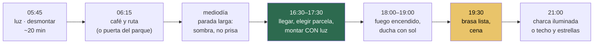

# 18 · Manual de campamento

> **Namibia · 30 oct – 15 nov 2026 · la clásica del norte** — [← índice del dossier](README.md)
>
> Vivir del coche catorce noches: la rutina que ordena el día, la tienda de techo, el fuego,
> la nevera y los vecinos del campamento.
>
> **~N$20 = €1** *(rango 19,5–20,5)* · **✅** fuente primaria · **◐** secundaria concordante ·
> **○** práctica común, sin fuente · **❌** sin verificar, dicho en blanco
>
> *Escrito el 07/08/2026. Aquí hay más ○ que en ningún otro documento, a propósito: el oficio de
> campamento es práctica, no dato — lo que sí está medido va con su marca y su documento.*

**Este manual empieza donde apagas el motor.** Conducir es el [`06`](06-conduccion.md); qué meter
en el petate, el [`05`](05-equipaje.md) y el [`17`](17-lista-de-equipaje.md); qué comprar de comer,
el [`08`](08-comida-compras-y-regalos.md). Esto es lo de en medio: **13 de las 14 noches se duerme
en el techo del coche** ✅ *(la única que no: Terrace Bay, que solo tiene habitaciones — con el
coche del aeropuerto, decidido el 07/08, la primera y la última también son de tienda)*, y nadie
de la expedición ha vivido antes de un 4×4.

---

## 1. La regla que ordena el día: acampado con luz

Todo lo demás de este manual cuelga de esto. El sol se pone **~19:05–19:20** ✅ *(NOAA, día a día
en el [`01`](01-itinerarios-dia-a-dia.md))* y la franja de **19:00–24:00 concentra el 29 % de los
muertos en carretera** ✅ *(el porqué, en el [`06`](06-conduccion.md))*: la regla de la casa ya es
**«en el campamento a las 18:00»**, y en las etapas largas, 17:30. Este manual le añade el motivo
doméstico: **montar campamento, encender el fuego y cenar se hace CON luz o se hace mal** ○.

*Las horas son orientativas ○ — lo fijo son los dos extremos: el sol ✅ y, en Etosha, las
puertas (06:13–19:06 del 3 al 9 de nov · 06:10–19:10 del 10 al 16 ✅).*

- 👉 **La víspera decide la mañana** ○: en Sesriem y en Etosha lo que hay al amanecer es lo bueno
  —la puerta interior, la charca— y se llega si el campamento quedó recogido la noche antes.
- 👉 **El mediodía no es para conducir del tirón** ◐: el calor es un peligro de conducción por sí
  mismo *(la siesta larga está justificada en el [`06`](06-conduccion.md), §11)*.

## 2. La tienda de techo, sin drama

El coche trae **dos tiendas de techo con ropa de cama** ✅ *(ficha Namibia2Go; con la Comfort son
de carcasa rígida: **1 minuto** de montaje frente a ~5* ✅*)*.

- **La primera montada, en el patio del alquiler** ○ — con el empleado delante y sin prisa. Es el
  momento de las preguntas tontas, no la duna de Spreetshoogte al anochecer.
- **Se monta ANTES de que oscurezca y se desmonta ANTES de desayunar** ○: una tienda abierta no
  deja mover el coche, y en un parque el coche es la única forma de estar fuera de la parcela.
- **Ni un metro con la tienda abierta.** ○ Parece imposible olvidarlo; pasa todos los años.
- **En la costa amanece empapada** — no es lluvia, es la niebla del Benguela ✅ *(el viento, en
  cambio, es suave: ~13 km/h de media en Walvis Bay en noviembre* ✅ *[`15`](15-huecos-cerrados.md))*.
  Se cierra húmeda si toca y **se abre a secar en la primera parada larga del día** ○: lona húmeda
  cerrada dos días huele a perro mojado.
- **Dentro de la tienda no entra comida. Nunca.** ○ El chacal ronda los campamentos al anochecer
  *(está hasta en su ficha de la [guía de fauna](guia-fauna-etosha.pdf))*, y lo que huele, atrae.
- **Escalera: pisada firme y linterna colgada** ○ — el baño de las 3 a. m. con 18 °C ✅ no es
  problema; a oscuras y con prisa, sí.

## 3. El orden del coche es la mitad del confort

Dos personas viviendo 15 días de un coche: o hay sistema, o hay arqueología diaria ○.

- **Dos cajas mandan** ○: la **caja del día** (a mano en el habitáculo: agua, fruta, gorra,
  prismáticos, esta guía) y la **caja de la noche** (todo lo que solo se toca acampados: hornillo,
  menaje, condimentos, frontal de repuesto). Lo que se usa junto, viaja junto.
- **4 L de agua por persona y día, EN el habitáculo** ✅ *(regla del [`06`](06-conduccion.md))* —
  el maletero de atrás no existe cuando tienes sed conduciendo.
- **La nevera no se entierra** ○: se abre veinte veces al día; si hay que descargar para llegar,
  el sistema está mal.
- **Cada cosa vuelve a SU sitio al desmontar** ○, no «ya lo colocaré»: el orden se decide una vez
  el primer día y después solo se obedece.

**La comprobación de la mañana, antes de girar la llave** — para marcar a boli los primeros días,
hasta que salga sola:

- [ ] Tienda **cerrada, correas pasadas**, escalera arriba ○
- [ ] Mesa, sillas y cuerda de tender **dentro** ○
- [ ] **Fuego apagado con agua** — no enterrado: la brasa enterrada sigue viva horas ○
- [ ] Basura recogida — **se viaja con ella** hasta el siguiente contenedor ○
- [ ] Nevera cerrada y **alimentada** *(ver §5)*
- [ ] Agua del día en el habitáculo (4 L × 2) ✅
- [ ] Combustible: **¿llega al siguiente punto seguro?** — las tres trampas de la ruta están
  medidas en el [`07`](07-logistica.md)
- [ ] Nada suelto sobre el techo ni el capó ○
- [ ] Vuelta al árbol de la parcela: cargadores, toalla tendida, la sandalia de debajo del coche ○

## 4. El fuego y el braai

La cena namibia es a la brasa y las parcelas lo esperan: **braai pit en el sitio** en los
campamentos de NWR ◐.

- **La leña se compra, no se recoge** ○ — en el súper de la última ciudad, en gasolineras y en
  muchas recepciones. Recoger madera dentro de un parque, ni en broma ○. Precio: **sin dato** ❌,
  se compra sobre la marcha *(la carne y qué súper hay en cada parada, en el
  [`08`](08-comida-compras-y-regalos.md))*.
- **Se cocina sobre brasa, no sobre llama** ○: leña encendida a las 18:00 para cenar a las 19:30.
  El error del primer día es echar la carne al fuego recién prendido.
- **El fuego no se deja solo y se mata con agua** ○ — estáis en la estación seca de un país seco.
- ✅ **El hornillo de gas YA consta en la ficha del coche** *(cotejo del 10/08/2026: «gas cooker
  & gas cylinder», con bombona de 3 kg)*: el «no consta» que llevaba este manual queda cerrado.
  Lo que sigue vivo es **cotejarlo físicamente en la entrega** *(`01` §D0)* — sin hornillo no hay
  café a las 05:45, y ese es el tipo de detalle que arruina más mañanas que cualquier avería.

## 5. La nevera, o cómo no quedarse sin cena el día 9

Nevera **eléctrica de compresor, incluida** ✅ *(ficha N2Go)*. Lo que la ficha no dice es de qué
vive: **de la batería del coche** — y ahí está el único riesgo real ❌:

- **Preguntas de la entrega, por escrito u oral pero CON respuesta** ❌: ¿hay **segunda batería**
  para la nevera? ¿Hay **corte por voltaje bajo** que proteja el arranque? ¿Cuántas horas aguanta
  parada? Son tres preguntas de un minuto y deciden cómo se duerme.
- **Regla mientras no haya respuesta** ○: la nevera vive del motor de día, y de noche —si la
  parcela tiene enchufe— del poste. **NWR anuncia punto de luz en las parcelas de sus campamentos
  grandes** ◐; en Hoada y los campamentos comunitarios, da por hecho que no ○.
- **Lo que la mata** ○: abrirla como si fuera la de casa, el sol directo sobre ella y meter la
  compra caliente. Las latas entran frías de la primera nevera de súper o no entran.
- **Estrategia de carga** ○: lo congelado el primer día hace de acumulador; lo del final del viaje,
  abajo; lo de hoy, arriba. Y la carne del braai de esta noche se compra HOY, no el lunes pasado.

## 6. Agua, duchas y basura

- **La de beber, comprada o de grifo declarado potable** ○ — en los campamentos grandes de NWR el
  agua de grifo se considera potable, pero **se pregunta en recepción en cada uno** ○. Los 4 L
  del coche ✅ no se negocian con «ya rellenaremos».
- **Duchas: haylas, y la buena hora es la mala hora** ○. Los campamentos de la ruta tienen bloque
  de aseos ○; con sol quedan mejores duchas que en muchos hoteles, al anochecer hay cola y bichos
  alrededor de la luz. Ducha a las 18:00, no a las 21:00.
- **La basura viaja** ○: bolsa dedicada, bien cerrada, fuera del habitáculo de noche *(chacal)* y
  hasta el siguiente contenedor de verdad. En los miradores y picnics del parque no hay papeleras
  **a propósito**.
- **Toallitas y papel, jamás al hoyo ni al monte** ○: al fuego del braai antes de apagarlo, o a la
  bolsa.

## 7. Los vecinos del campamento

El safari no termina en la puerta de la parcela — la fauna de campamento tiene su propio manual:

- **Chacal de lomo negro** — el fijo del anochecer ○ *(y el carnívoro más registrado de la ruta
  en GBIF: 271 registros solo en la costa ◐)*. No se le da de comer **nunca** ✅ *(norma del parque)*: nada
  comestible a la vista, nevera y coche cerrados al ir a la charca.
- **Babuino chacma** en miradores y áreas de descanso ○: ventanillas arriba si te alejas del
  coche con comida dentro a la vista. *(Es el «mono» de esta ruta — ficha en la guía; el vervet
  ni aparece: sin un solo registro en la consulta GBIF del 08/08, archivada en `15`.)*
- **Escorpión y serpientes**: el protocolo entero está en la [guía de fauna](guia-fauna-etosha.pdf)
  y cabe en una línea — **botas sacudidas, linterna al baño, mirar dónde pisas al anochecer** ○.
- **Mosquito al anochecer**: manga larga y repelente desde el crepúsculo ✅ — Etosha es zona de
  malaria y la profilaxis está en el [`04`](04-guia-preparacion.md).
- **Y los buenos vecinos**: el cálao vigilando el desayuno, el francolín que os despertará sin
  falta y el búho lácteo en el árbol grande del campamento — las tres fichas, en la guía.

## 8. Etiqueta de campamento

- **En la charca iluminada, silencio y luz roja** ○ — se va andando desde la parcela ✅ y lo que
  se ve depende de lo que NO se oiga. El flash, ni intentarlo ○.
- **20 km/h dentro del campamento** ✅ *(reglamento NWR/MEFT)*.
- **Música, a la altura de tu mesa** ○: el campamento entero está cenando bajo el mismo cielo.
- **El braai se comparte** ○: la distancia social namibia se mide en brasas — un «join us» a los
  vecinos de parcela es la mejor fuente de datos frescos de la ruta que existe.

---

## 🕳️ Lo que este manual no pudo cerrar

**La batería de la nevera** *(¿dual? ¿corte por voltaje?)* ❌ — va en las preguntas de la entrega
*(el hornillo, que le hacía compañía aquí, consta en la ficha desde el 10/08 ✅ — §4)* ·
**enchufe por parcela, campamento a campamento** ❌ —
NWR lo anuncia en los grandes ◐ y no hay lista fina · **el precio de la leña** ❌ · **la
potabilidad camping a camping** ❌ — se pregunta en cada recepción. Ninguno cambia una reserva:
son preguntas de la entrega del coche y de cada llegada.

*Precios en N$ y € · ~N$20 = €1 · La práctica común va marcada ○: funciona, pero no es un dato.*
